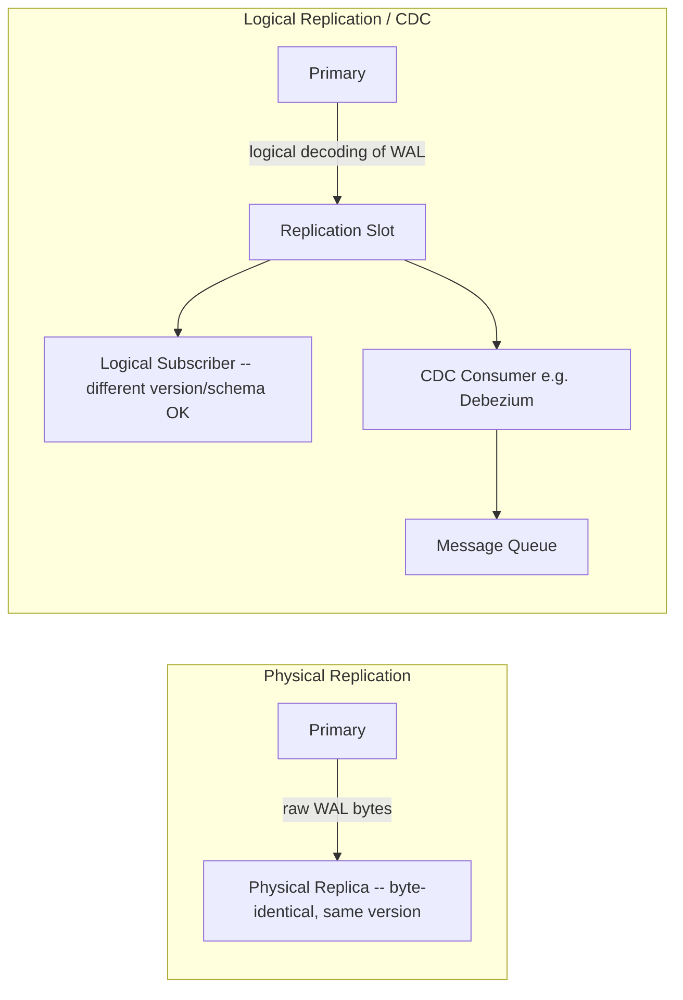
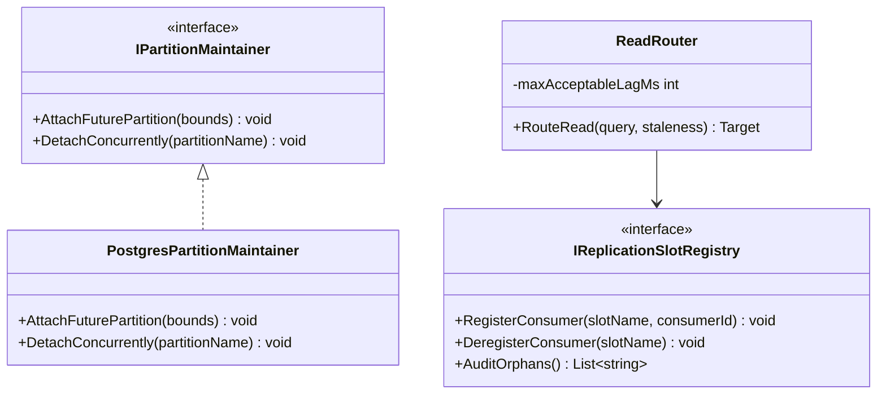
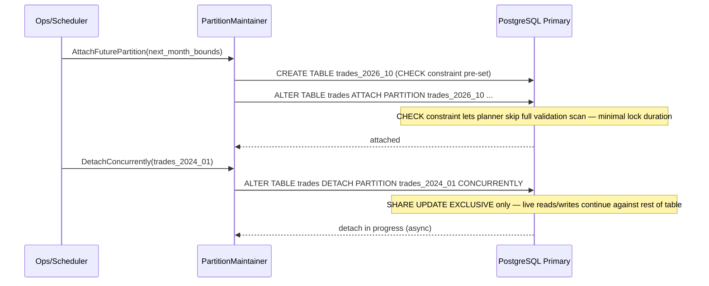

# Module 22 — PostgreSQL: Partitioning, Replication & Logical Decoding

> Domain: PostgreSQL | Level: Beginner → Expert | Prerequisite: [[01-PostgreSQL-Fundamentals-vs-SQLServer]]

---

## 1. Fundamentals

### What is table partitioning, replication, and logical decoding?
**Partitioning** splits one logically-unified table into multiple physical sub-tables (partitions), each holding a subset of rows (typically by date range or a hash/list key), transparently queried as if it were one table. **Replication** copies data from a primary database to one or more replicas — **physical** (streaming) replication copies raw WAL (Write-Ahead Log) bytes for a byte-identical replica; **logical** replication copies decoded, table-level changes, allowing selective, cross-version, or cross-schema replication. **Logical decoding** is the underlying mechanism extracting a stream of row-level changes from the WAL in a structured, consumable format — the foundation both logical replication and Change Data Capture (CDC) pipelines are built on.

### Why do these exist?
A single, monolithic table eventually becomes too large for efficient maintenance (vacuum, index rebuilds, archival deletion) — partitioning lets these operations target individual partitions (e.g., dropping an entire old-data partition instantly instead of a slow `DELETE`). Replication exists for both **high availability** (a standby ready to take over) and **read scaling** (routing read traffic to replicas). Logical decoding exists specifically to expose database changes in a consumable form for use cases beyond simple byte-for-byte replication — CDC pipelines feeding a message queue, cross-database sync, audit trails.

### When does this matter?
Partitioning matters once a table's size makes maintenance operations (vacuum, backup, archival) genuinely slow or disruptive; replication matters for any production system requiring HA/DR or read-scaling; logical decoding/CDC matters for event-driven architectures needing to react to database changes without polling.

### How does it work (30,000-ft view)?
```sql
CREATE TABLE orders (id bigint, created_at date,...) PARTITION BY RANGE (created_at);
CREATE TABLE orders_2024 PARTITION OF orders FOR VALUES FROM ('2024-01-01') TO ('2025-01-01');
CREATE TABLE orders_2025 PARTITION OF orders FOR VALUES FROM ('2025-01-01') TO ('2026-01-01');
-- Queries against `orders` transparently route to the correct partition(s) via partition pruning.
```

---

## 2. Deep Dive

### 2.1 Partitioning Strategies and Partition Pruning
**Range partitioning** (by date, the most common pattern for time-series/log-style data) lets old partitions be dropped instantly (`DROP TABLE orders_2020` — an O(1) metadata operation, versus a slow, vacuum-generating `DELETE FROM orders WHERE year = 2020`) and lets vacuum/maintenance operate on smaller, individually-manageable units. **List partitioning** splits by discrete key values (e.g., by region). **Hash partitioning** distributes rows pseudo-randomly across a fixed partition count, useful for write-load distribution without a natural range/list key. **Partition pruning** — the query planner recognizing that a `WHERE created_at >= '2024-06-01'` predicate can only match rows in specific partitions, skipping the rest entirely — is what makes partitioning a genuine performance win, not just an administrative convenience; pruning requires the partition key to appear in a sargable form in the query's predicate, or pruning fails and every partition is scanned, defeating the purpose.

### 2.2 Streaming (Physical) Replication vs Logical Replication
**Physical replication** streams WAL records byte-for-byte to a replica applying them at the same physical location — the replica is a byte-identical copy, **must run the same major PostgreSQL version**, and typically replicates the **entire cluster** (all databases), not a subset. **Logical replication** decodes WAL into logical row-change events (insert/update/delete on specific tables) and applies them via ordinary SQL on the subscriber — enabling replication **between different major versions**, **selective** table-level replication, and replication into a **different schema/structure** on the subscriber (useful for consolidating multiple sources into one reporting database, or migrating between major versions with near-zero downtime via a logical-replication-based cutover).

### 2.3 Synchronous vs Asynchronous Replication — the CAP-Theorem Trade-off Made Concrete
**Asynchronous replication** (the default): the primary commits and acknowledges the client immediately, without waiting for any replica to confirm receipt — fast, but a primary crash before a replica catches up means **committed data can be lost** on failover (the replica promotes to primary without ever having received the most recent commits). **Synchronous replication** (`synchronous_commit = on` with `synchronous_standby_names` configured): the primary waits for at least one designated replica to confirm receipt before acknowledging the client's commit — eliminates that data-loss window, at the direct cost of added commit latency (and, if the synchronous replica becomes unavailable, either blocking all commits entirely or requiring a carefully-configured quorum/fallback policy) — a textbook, concrete instantiation of the availability-vs-consistency trade-off a later CAP theorem module will formalize.

### 2.4 Change Data Capture (CDC) via Logical Decoding
A **replication slot** with a **logical decoding output plugin** (e.g., `pgoutput`, or `wal2json` for a JSON-formatted change stream) lets an external consumer (Debezium being the dominant open-source CDC tool, feeding changes into Kafka) subscribe to a structured stream of every row-level change — enabling event-driven architectures reacting to database changes without polling, and directly providing the underlying mechanism for the **Outbox pattern** (a later dedicated module) in its "CDC-based" variant (reading committed outbox-table rows via CDC instead of a separate polling process).

### 2.5 Replication Slot Retention Risk
A replication slot retains WAL on the primary **for as long as the slot exists and hasn't been consumed** — if a logical-replication subscriber or CDC consumer disconnects and never resumes (a crashed, forgotten, or decommissioned consumer whose slot was never dropped), the primary **retains WAL indefinitely** waiting for that slot to be consumed, which can silently fill up disk space until the primary itself runs out of storage — a genuinely severe, easy-to-overlook operational failure mode distinct from ordinary replication lag monitoring.

## 3. Visual Architecture

```mermaid
graph LR
 subgraph "Physical Replication"
 P1[Primary] -->|raw WAL bytes| R1[Physical Replica -- byte-identical, same version]
 end
 subgraph "Logical Replication / CDC"
 P2[Primary] -->|logical decoding of WAL| Slot[Replication Slot]
 Slot --> Sub[Logical Subscriber -- different version/schema OK]
 Slot --> CDC[CDC Consumer e.g. Debezium] --> Kafka[Message Queue]
 end
```

## 4. Production Example
**Scenario**: A production PostgreSQL primary's disk usage grew steadily over several weeks despite stable data volume and properly-tuned autovacuum (the lesson already applied), eventually triggering an out-of-disk-space alert. **Investigation**: `pg_replication_slots` revealed an **inactive** logical replication slot from a decommissioned CDC pipeline (a Debezium connector removed months earlier during an architecture change) — the slot itself was never dropped, so the primary had been retaining every WAL segment generated since that connector's last activity, for months, waiting for a consumer that would never return. **Fix**: dropped the orphaned slot (`SELECT pg_drop_replication_slot('old_cdc_slot');`), immediately reclaiming the retained WAL space; added a standing monitoring check specifically for replication-slot `restart_lsn` lag (how far behind the slot's confirmed position is from the current WAL position) as a distinct, proactive alert. **Lesson**: replication slots are a "silent until catastrophic" resource-retention risk with no natural expiration — any consumer decommissioning process must explicitly include dropping its associated replication slot as a mandatory step, and slot-lag monitoring deserves the same proactive attention as vacuum-bloat monitoring.
## 10. Interview Questions

### Basic (10)
1. **Q: What is table partitioning?** **A:** Splitting one logical table into multiple physical sub-tables, transparently queried as one, typically by date range, list, or hash.
2. **Q: What is partition pruning?** **A:** The query planner recognizing a predicate can only match specific partitions, skipping the rest entirely.
3. **Q: What's the difference between physical and logical replication?** **A:** Physical streams raw WAL bytes for a byte-identical, same-version replica; logical decodes and applies row-level changes, supporting cross-version and selective replication.
4. **Q: What is a replication slot?** **A:** A primary-side marker tracking a specific replica/subscriber's consumption progress, retaining WAL until that position is consumed.
5. **Q: What's the difference between synchronous and asynchronous replication?** **A:** Synchronous waits for a replica's confirmation before acknowledging commit (no data loss on failover, added latency); asynchronous acknowledges immediately (fast, but can lose recently-committed data on failover).
6. **Q: What is logical decoding?** **A:** The mechanism extracting a structured stream of row-level changes from the WAL, underlying logical replication and CDC.
7. **Q: What does CDC stand for?** **A:** Change Data Capture — streaming every committed insert/update/delete out of the database (in PostgreSQL, via logical decoding of the WAL) so downstream systems (caches, search indexes, event pipelines) can react to data changes without polling or dual writes.
8. **Q: Can physical replication replicate between different PostgreSQL major versions?** **A:** No — physical replication requires the same major version; logical replication can cross versions.
9. **Q: What's a risk of leaving an orphaned, unconsumed replication slot?** **A:** The primary retains WAL indefinitely waiting for it, potentially exhausting disk space.
10. **Q: What is Debezium?** **A:** A dominant open-source CDC tool consuming PostgreSQL's logical decoding stream, commonly feeding changes into Kafka.

### Intermediate (10)
1. **Q: Why does range partitioning make archival/retention dramatically faster than a plain `DELETE`?** **A:** Dropping an entire partition is an O(1) metadata operation; a `DELETE` targeting the same rows in an unpartitioned table must individually mark each row dead, generating substantial vacuum work afterward.
2. **Q: Why can a partitioned table's query fail to benefit from partitioning at all?** **A:** If the query's predicate doesn't reference the partition key in a form the planner can use for pruning (e.g., wrapped in a non-sargable function, mirroring the general sargability concern), every partition is scanned, providing none of the intended performance benefit.
3. **Q: Why must physical replication use the same major version on primary and replica?** **A:** It replicates raw WAL bytes representing the exact on-disk physical format, which can differ between major versions — logical replication instead operates at the logical row-change level, insulated from physical-format differences.
4. **Q: Why does synchronous replication add commit latency?** **A:** The primary must wait for the designated synchronous replica's acknowledgment before returning success to the client, adding at least one network round-trip's worth of latency to every commit.
5. **Q: How does a replication slot's WAL retention differ from ordinary WAL retention/archiving?** **A:** Ordinary WAL is retained only until it's no longer needed for crash recovery/archiving (governed by `wal_keep_size`/archiving configuration); a replication slot additionally retains WAL until *that specific slot's* consumer catches up, regardless of ordinary retention settings — an inactive slot can force retention far beyond what normal settings would otherwise keep.
6. **Q: Why would a team choose hash partitioning over range partitioning?** **A:** When there's no natural, evenly-distributed range/list key suited to the workload's access patterns, or when the goal is primarily distributing write load evenly across partitions rather than enabling range-based archival/pruning.
7. **Q: What's the difference between `pg_stat_replication` and `pg_replication_slots`, and why check both?** **A:** `pg_stat_replication` shows currently-connected replication clients and their real-time lag; `pg_replication_slots` shows all *registered* slots including ones with no currently-connected consumer — an orphaned slot (the incident) is invisible in `pg_stat_replication` (nothing's connected) but clearly visible in `pg_replication_slots` as an inactive slot still retaining WAL.
8. **Q: Why might a CDC-based Outbox pattern implementation be preferable to a polling-based one?** **A:** Polling introduces both latency (the polling interval) and unnecessary load (repeated queries even when nothing changed); CDC-based consumption reacts to committed changes as they occur, with lower latency and no wasted polling queries, at the cost of the additional replication-slot-management operational responsibility this module covers.
9. **Q: Why is `EXPLAIN` (not just "we partitioned the table") the correct way to verify a partitioning strategy is actually effective?** **A:** Partitioning's performance benefit depends entirely on pruning actually occurring for real query patterns — `EXPLAIN`'s plan output directly shows which partitions were considered/scanned, the only reliable way to confirm the intended benefit is materializing rather than assuming it from the schema design alone.
10. **Q: Why would a major-version PostgreSQL upgrade commonly use logical replication rather than a simple dump-and-restore or physical replication approach?** **A:** Logical replication allows setting up the new-version instance as a subscriber while the old-version primary continues serving live traffic, then cutting over with minimal downtime once the subscriber has caught up — physical replication can't cross major versions at all, and dump-and-restore requires a full downtime window proportional to data size.

### Advanced (10)
1. **Q: Diagnose the orphaned-replication-slot incident from first principles, and design the standing safeguard preventing recurrence.**
 **A:** Root cause: no process step tied replication-slot lifecycle to consumer lifecycle — decommissioning the CDC pipeline removed the *consumer* but not the *slot* it left behind on the primary. Safeguard: (a) mandatory slot-lag monitoring alerting on any slot whose `restart_lsn` falls behind current WAL position by more than a threshold, regardless of *why*; (b) a decommissioning checklist explicitly requiring `pg_drop_replication_slot` as a required step, not an optional cleanup task; (c) periodic automated auditing cross-referencing `pg_replication_slots` against a registry of currently-expected-active consumers, flagging any slot without a corresponding active, known consumer.
2. **Q: Design a partitioning strategy for a multi-tenant SaaS platform's largest table, balancing tenant isolation, query performance, and maintenance operations.**
 **A:** List-partition by `tenant_id` (or a tenant-tier grouping, if tenant count is very large) combined with range sub-partitioning by date within each tenant partition — this lets a specific tenant's data be dropped/archived independently (e.g., for a tenant offboarding, an entire tenant's partition can be dropped in one O(1) operation) while also supporting date-range-based archival within each tenant, and ensures per-tenant query patterns (which almost always filter by `tenant_id`) prune efficiently to that tenant's specific partition subset rather than scanning the entire multi-tenant table.
3. **Q: Explain the failure mode where synchronous replication with a single synchronous standby can itself cause a primary outage, and how you'd design around it.**
 **A:** If the single designated synchronous standby becomes unreachable (network partition, crash), the primary — by default, with strict synchronous commit configured — will **block all commits** waiting for an acknowledgment that will never come, effectively taking the primary down for writes even though it's otherwise healthy; the standard mitigation is configuring multiple synchronous candidates with a quorum (`synchronous_standby_names = 'ANY 1 (replica1, replica2)'`), so any *one* of several standbys acknowledging is sufficient, tolerating a single standby's failure without blocking the primary.
4. **Q: How would you design a near-zero-downtime major-version upgrade using logical replication, and what limitations would you need to plan around?**
 **A:** Stand up a new-version instance as a logical-replication subscriber of the old-version primary, let it catch up fully while the old primary continues serving live traffic, then perform a brief cutover (redirect application traffic to the new instance once replication lag is confirmed near-zero); plan around logical replication's known limitations — it doesn't replicate DDL automatically (schema changes must be applied manually/coordinated on both sides), doesn't replicate large objects, and sequences aren't automatically synchronized (requiring an explicit sequence-value catch-up step as part of the cutover) — all real, specific gaps that must be explicitly addressed in the migration runbook, not assumed away.
5. **Q: Explain how you would use logical decoding to build a custom audit-trail system, and what advantage this has over application-level audit logging.**
 **A:** Subscribe a CDC consumer (via a replication slot with `wal2json` or a custom output plugin) to every table requiring an audit trail, writing each decoded change (old/new values, transaction metadata) to a durable, append-only audit store — the advantage over application-level audit logging (explicit `INSERT INTO audit_log` calls in application code) is that it captures **every** change regardless of which code path made it (including direct database access, a bulk-load script, or a bug bypassing the application's own audit-logging code), providing a genuinely complete, code-path-independent audit trail exactly analogous to Row-Level Security's (§Advanced Q8) database-enforced-rather-than-application-trusted safety property.
6. **Q: Design a strategy for detecting and gracefully handling replication lag that's growing but hasn't yet triggered a hard failure, for a read-replica-serving reporting workload.**
 **A:** Monitor replica lag (`pg_stat_replication`'s `replay_lag` on the primary, or the replica's own `pg_last_wal_replay_lsn` compared against the primary's current position) as a continuous metric; for read queries routed to replicas where staleness matters (e.g., a "show my recent order" page that shouldn't show data staler than a few seconds), have the application check current lag before routing to a replica, falling back to the primary if lag exceeds an acceptable threshold for that specific query's staleness tolerance — a graceful degradation strategy rather than either blindly trusting replica freshness or avoiding replicas entirely.
7. **Q: Explain a scenario where hash partitioning's even distribution property becomes a disadvantage rather than an advantage.**
 **A:** If query patterns predominantly filter by a *range* (e.g., "orders from the last 30 days"), hash partitioning (which distributes rows pseudo-randomly regardless of any range-correlated attribute) provides **no** pruning benefit for that access pattern — every partition would need to be scanned since matching rows are spread evenly across all of them, unlike range partitioning by date, which would prune to just the relevant recent partitions; hash partitioning is the wrong tool when the dominant query pattern is range-based rather than needing even write-load distribution.
8. **Q: How would you reason about whether a system needs synchronous replication at all, versus accepting asynchronous replication's small data-loss window?**
 **A:** Weigh the business cost of losing the most recently committed (but not-yet-replicated) transactions during an unplanned primary failure against synchronous replication's added latency cost on every single commit — a financial ledger or payment system's committed-transaction-loss cost is typically severe enough to justify synchronous replication's latency tax; a high-throughput, latency-sensitive system logging non-critical telemetry, where losing a few seconds of recent data during a rare failover is an acceptable, bounded cost, may reasonably prefer asynchronous replication's lower latency — this is a genuine, deliberate business-risk-vs-performance trade-off, not a purely technical default.
9. **Q: Explain how you would validate that a partitioning migration (converting an existing large, unpartitioned table into a partitioned one) doesn't silently break existing queries relying on assumptions the partitioned structure changes.**
 **A:** Audit existing queries/ORM-generated SQL against the table for any that would fail to prune (Advanced Q7's hash-partitioning-mismatch scenario is one example, but also non-partition-key-referencing queries generally) using `EXPLAIN` before and after the migration on a representative staging copy; verify any unique/primary-key constraints correctly include the partition key (a PostgreSQL requirement — a partitioned table's unique constraints must include the partitioning column), which can require schema changes to existing constraint definitions the application layer wasn't necessarily designed to accommodate; and stage the migration with a full regression-test pass against representative production-scale data volume (§Advanced Q7's "test at representative scale" principle, directly applicable here too), not just correctness-sufficient small-scale testing.
10. **Q: As a Principal Engineer, how would you build organizational capability preventing both this module's and the operational-risk classes (vacuum bloat, orphaned replication slots) from recurring across a growing PostgreSQL fleet?**
 **A:** Establish a shared, standard PostgreSQL operational-health dashboard template (directly this course's recurring shared-template governance pattern) tracking, for every PostgreSQL instance in the fleet: dead-tuple ratios per table, replication-slot lag/retained-WAL-size per slot (this module), and autovacuum activity — deployed automatically for any new PostgreSQL instance provisioned, rather than each team independently discovering these operational concerns only after their own incident; pair this with a mandatory decommissioning checklist (Advanced Q1) for any service that creates a replication slot/CDC consumer, converting both this module's and the prior module's hard-won, incident-driven lessons into structurally-enforced, fleet-wide standard practice.

### Expert (FinTech Principal Panel)

1. **Q: A core banking ledger must not lose a committed transaction even if a whole datacenter is lost (RPO≈0), while staying available. Design the replication/DR posture, and be honest about the CAP trade-off at failover.**
 **A:** RPO≈0 means a commit is not acknowledged to the client until it's durable on **more than one independent failure domain**, so use **synchronous replication with quorum** (`synchronous_standby_names = 'ANY 1 (r1, r2)'`) across separate AZs/DCs — any one standby's ack suffices, so you tolerate losing a single standby without blocking the primary (Advanced Q3) *and* no committed transaction exists on only one node. The honest CAP trade-off: synchronous commit couples the primary's write latency and availability to reaching a quorum — if quorum is unreachable (multi-node/network partition), you must choose to **block writes (favor consistency/no-data-loss)** rather than accept commits that could be lost; for a ledger that's the correct choice (a payment you can't durably record is a payment you must refuse). RTO is handled by automated, **fenced** failover: promote a caught-up standby, but **prevent split-brain** (STONITH/fencing so the old primary can't keep accepting writes) — two primaries both taking payments is catastrophic. Define RPO/RTO targets explicitly, and rehearse failover regularly. The Principal framing: for money, RPO≈0 via quorum synchronous replication is bought by accepting that a partition means *refuse writes, not risk loss*, and failover must be fenced to avoid split-brain — consistency and durability win over availability precisely because a lost or double-recorded transaction is unacceptable.
 **Why correct:** Uses quorum synchronous replication for RPO≈0, states the consistency-over-availability choice under partition for a ledger, and requires fenced failover to prevent split-brain.
 **Common mistakes:** Async replication for a ledger (data-loss window); a single synchronous standby (blocks primary if it dies); failover without fencing (split-brain, double-spend).
 **Follow-ups:** "What do you do when quorum is unreachable — block or accept?" / "How do you prevent the old primary from accepting writes after promotion?" / "How is a single-sync-standby setup a self-inflicted outage risk?"

2. **Q: You need to reliably publish every ledger change to a Kafka stream for downstream services (fraud, notifications, analytics). Compare using PostgreSQL logical decoding/CDC (e.g., Debezium) versus an application-level transactional outbox table. Which, and why?**
 **A:** Both solve the **dual-write problem** (never write the DB and publish to the broker as two non-atomic steps). (a) **Application-level outbox**: within the same transaction as the business change, insert an outbox row; a relay reads and publishes it, then marks it done (`SKIP LOCKED` worker). Pros: explicit control over event shape/schema (you emit a clean domain event, not raw row diffs), DB-agnostic, easy to reason about. Cons: you build/operate the relay, and the outbox table needs cleanup. (b) **CDC via logical decoding/Debezium**: a connector tails the WAL and emits change events straight to Kafka. Pros: no app code to publish, captures **every** change including out-of-band ones (like the audit-trail advantage, Advanced Q5), strong ordering per table from the WAL. Cons: events are *row-level diffs* (leaks schema, not domain events — downstream couples to your table structure), replication-slot operational risk (an orphaned/lagging slot retains WAL and can fill disk), and transformation is needed to get clean events. Both are **at-least-once**, so consumers must be **idempotent**. Recommendation: prefer the **outbox** when you want clean, decoupled *domain* events and control over the contract (typical for payments events consumed by other teams); prefer **CDC** when you need to capture all changes with minimal app change or are integrating legacy writers you don't control — often teams use outbox for domain events and CDC for analytics/replication. The Principal framing: it's outbox (clean domain-event contract, more code) vs. CDC (all changes, less code, but row-diff coupling + slot ops) — both need idempotent consumers, and the deciding factor is whether downstream should couple to your *events* or your *schema*.
 **Why correct:** Frames both as dual-write solutions, contrasts domain-event control vs. row-diff coupling + slot ops, and requires idempotent consumers, with a decision rule.
 **Common mistakes:** Publishing to Kafka outside the DB transaction (dual-write); exposing raw CDC row diffs as a public event contract; ignoring replication-slot disk risk; assuming exactly-once.
 **Follow-ups:** "Why do both still need idempotent consumers?" / "What's the coupling cost of exposing CDC row diffs?" / "How does an orphaned slot from CDC threaten the primary?"

3. **Q: Regulation requires certain customers' data to physically reside in-region (data residency / GDPR / local banking law). How do partitioning and replication design change, and what are the pitfalls?**
 **A:** Data residency makes *where bytes live* a correctness/legal constraint, not just a performance one. Approaches: (1) **Partition/shard by region** and place each region's data in infrastructure physically located in that jurisdiction — list-partition or separate databases per region, with replicas also constrained to compliant locations (a replica in the wrong country is itself a violation, so replication topology must respect residency). (2) **Route at the app/data layer** by the customer's residency attribute so a customer's reads/writes only ever touch their compliant store. Pitfalls: **replication and DR** must stay in-region (your cross-region DR standby can't sit in a disallowed jurisdiction — you may need in-region DR pairs per region); **backups** and even **logs/CDC streams** carry the data and must also be residency-compliant (an easily-missed leak — a global Kafka topic or a centralized log store can exfiltrate regulated data across borders); **aggregate/analytics** that combine regions may be prohibited or require anonymization; and cross-region *joins* become impossible or must go through compliant aggregation. The Principal framing: data residency turns replication topology, backups, logs, and CDC into compliance surfaces — the design is region-scoped partitions/databases with residency-constrained replicas, DR, backups, *and* telemetry, because the data leaks through the least-obvious pipe (a backup or a log shipped cross-border), not just the primary store.
 **Why correct:** Region-scoped partitioning/databases with residency-constrained replication/DR, and flags the non-obvious leaks (backups, logs, CDC, cross-region analytics).
 **Common mistakes:** Constraining only the primary while replicas/backups/logs cross borders; a global CDC/log pipeline exfiltrating regulated data; cross-region analytics on raw personal data.
 **Follow-ups:** "Where can your DR standby for an in-region customer live?" / "How can backups or logs violate residency even if the DB doesn't?" / "How do you do cross-region reporting without moving regulated data?"

4. **Q: Two regions run bidirectional logical replication (via pglogical/BDR) so either region can accept writes for low-latency local reads. A customer's balance-adjustment row is updated concurrently in both regions during a brief network partition; when connectivity restores, one region's update silently vanishes. Explain the mechanism, and how you'd design around it for financial data.**
 **A:** PostgreSQL's native logical replication (and pglogical/BDR by default) resolves same-row concurrent-update conflicts via **last-writer-wins** at the column/row level, typically using a timestamp or replication-origin-based tiebreak — it is **not** a CRDT-style merge (the connection to a sibling domain's finding): the losing region's update is discarded entirely, not combined, exactly as an LWW-Register discards a concurrent write's content rather than merging it. For a balance adjustment, this means one region's legitimate, committed adjustment can silently disappear with no error, no conflict surfaced to the application, and no reconciliation trigger — a severe correctness gap for financial state specifically because the "loser" transaction already returned success to its caller before the conflict was later, silently resolved away. Design around it: for genuinely multi-region-writable financial state, either (a) route writes for a given account to a single owning region (eliminating the possibility of the conflict, the same single-writer principle Module 21's ledger guidance and the sibling CRDT module's fix both converge on), or (b) if true multi-region write availability is a hard requirement, model the adjustment as an **append-only, commutative operation** (a signed delta row, not an in-place balance update) so concurrent inserts from both regions are individually meaningful and mergeable, with the current balance computed as a sum/fold over all deltas rather than a directly-replicated mutable field — restructuring the data model to be genuinely commutative rather than relying on logical replication's LWW default to behave safely for non-commutative state. The Principal framing: logical replication's default conflict resolution is silent and lossy for non-commutative financial fields — the fix is either eliminating the conflict via single-writer routing or reshaping the data model into something genuinely commutative, never trusting LWW's silent discard to be safe for money.
 **Why correct:** Correctly identifies LWW as logical replication's default conflict-resolution behavior, explains why it's dangerous for financial state, and gives both valid architectural fixes.
 **Common mistakes:** Assuming logical replication automatically merges concurrent updates safely; discovering the silent-loss behavior only via a reconciliation break rather than by design review before go-live.
 **Follow-ups:** "Why is this the same failure shape as an LWW-Register CRDT?" / "How does modeling balance as append-only deltas make the field genuinely commutative?" / "What would make single-writer-per-account routing insufficient?"

5. **Q: Design an automated, fenced failover system for a PostgreSQL primary serving a payments platform, explicitly preventing split-brain during a network partition between the primary and its orchestrator.**
 **A:** Use a consensus-based orchestrator (**Patroni** backed by **etcd/Consul/ZooKeeper** as the distributed configuration store) — each PostgreSQL node runs a Patroni agent that periodically renews a **leader lease** in the consensus store; only the node holding a currently-valid lease serves writes. On a network partition isolating the primary from the consensus store, the primary's lease **expires** (it cannot renew what it cannot reach) and Patroni on the primary **self-fences** — demoting the local PostgreSQL instance to read-only *before* a new leader is elected elsewhere, specifically to close the split-brain window where an isolated-but-still-running primary keeps accepting writes while a newly-promoted standby also starts accepting writes. The consensus store's own quorum requirement (a majority of etcd/Consul nodes, themselves spread across failure domains) is what prevents the classic distributed-systems failure of *both* sides of a partition believing they're the leader — only the side that can reach quorum can elect/hold a leader. Additional fencing (STONITH-style, e.g., revoking the old primary's network route or forcibly stopping its PostgreSQL process) provides defense-in-depth beyond the self-fencing lease-expiry mechanism, for the case where a still-partially-functioning old primary doesn't cleanly self-demote. The Principal framing: automated failover without leader-lease-based self-fencing is not actually safe automated failover — it's a race condition waiting for the specific partition pattern that produces two simultaneously-active primaries, and the fix is a consensus-store-backed leader lease whose *expiry*, not merely a health-check failure, drives demotion.
 **Why correct:** Correctly describes Patroni/etcd's lease-based leader-election mechanism and precisely explains how it prevents split-brain via self-fencing on lease expiry plus quorum.
 **Common mistakes:** Designing failover around a simple health-check-triggers-promotion mechanism without a leader-lease/quorum foundation, which cannot prevent both an old and new primary being simultaneously active during a partition.
 **Follow-ups:** "Why must the old primary demote itself, rather than relying only on the new primary's promotion?" / "What happens if the consensus store itself loses quorum?" / "How does this connect to Expert Q1's fencing requirement for the ledger DR posture?"

6. **Q: A nightly settlement-reconciliation job joins and aggregates two large range-partitioned tables (`trades`, partitioned by trade_date; `settlements`, partitioned identically by settlement_date, which for same-day settlement equals trade_date) over a 90-day window. Explain partition-wise join/aggregate, and why matching partitioning schemes between the two tables matters here.**
 **A:** By default, PostgreSQL treats each table's partitions as separate relations and must potentially join *every* partition of `trades` against *every* partition of `settlements` unless the planner can prove a narrower match — with `enable_partitionwise_join = on` (and both tables partitioned identically, same boundaries, same partition key semantics), the planner instead performs a **partition-wise join**: joining each `trades` partition only with its *correspondingly-dated* `settlements` partition, and — with `enable_partitionwise_aggregate = on` — computing partial aggregates within each partition pair before combining, dramatically reducing both the join's working-set size and the total comparison count relative to a single monolithic join across the full unpartitioned cross-product of partitions. This only engages when the two tables' partition boundaries genuinely align (same date ranges, same partition key) — if `settlements` were instead partitioned by month while `trades` is partitioned by day, the planner cannot establish the 1:1 partition correspondence and falls back to the full-cross-product join behavior, silently losing the entire optimization despite both tables individually being "partitioned." The Principal framing: partition-wise join/aggregate is a genuine, substantial performance lever for multi-table analytics over partitioned data, but it's contingent on a *cross-table* partitioning-scheme design decision (matching boundaries deliberately across related tables) made at schema-design time, not something that can be retrofitted via query tuning alone once the tables' partition schemes have diverged.
 **Why correct:** Correctly explains partition-wise join/aggregate's mechanism and precisely states the cross-table partition-alignment precondition for it to engage.
 **Common mistakes:** Assuming any two partitioned tables automatically benefit from partition-wise join regardless of whether their partition boundaries actually align; not verifying via `EXPLAIN` that the optimization is actually engaging (Module 21's recurring "verify, don't assume" pruning discipline, applied here to a related planner optimization).
 **Follow-ups:** "What would you check in `EXPLAIN` to confirm partition-wise join is engaging?" / "Why does misaligned partition granularity between the two tables silently disable this?" / "How would you redesign the schema if the two tables' natural partitioning needs genuinely differ?"

7. **Q: A 24/7 trading platform needs to add a new monthly partition to a hot `trades` table and eventually detach old partitions for archival, without blocking live inserts/selects against the table even momentarily. What PostgreSQL features make this possible, and what's the trade-off?**
 **A:** `ALTER TABLE trades ATTACH PARTITION trades_2026_09 FOR VALUES FROM (...) TO (...);` by default requires briefly taking an `ACCESS EXCLUSIVE` lock on the parent table to validate the new partition's constraint, which — however brief — blocks all concurrent reads/writes against the entire partitioned table for that duration, unacceptable for a genuinely 24/7 hot table. PostgreSQL 14+ provides `ALTER TABLE trades DETACH PARTITION trades_2024_01 CONCURRENTLY;` for detach, which takes only a `SHARE UPDATE EXCLUSIVE` lock (permitting concurrent reads/writes to continue against the rest of the table) at the cost of the detach itself running as a longer, two-phase background operation rather than an instant metadata change. For attach, the standard technique to avoid the exclusive lock is: create the new partition table standalone first (with an explicit `CHECK` constraint matching the intended partition bounds), attach it — PostgreSQL can then skip the full validation scan because the `CHECK` constraint already proves the data fits the bounds, reducing (though not always fully eliminating, depending on version) the lock duration — or, for a genuinely empty new future-dated partition (the common case, attaching next month's partition ahead of any data arriving in it), the attach is inherently fast since there's no existing data requiring validation. The trade-off: `CONCURRENTLY` detach trades instant completion for a longer-running, non-blocking operation, and pre-constraining a to-be-attached partition trades upfront schema-design discipline for a faster/lock-minimized attach — both are worth the added process complexity specifically because the alternative (a blocking exclusive lock against a 24/7 hot table) is operationally unacceptable. The Principal framing: partition maintenance on a genuinely always-on table requires deliberately using the concurrent/pre-validated variants of attach/detach, not the default, simpler syntax that silently assumes a maintenance window exists.
 **Why correct:** Correctly identifies the default attach/detach locking behavior, the `CONCURRENTLY` detach mechanism, and the pre-constrained-attach technique, with the trade-offs of each.
 **Common mistakes:** Running default `ATTACH`/`DETACH PARTITION` against a live, latency-sensitive table assuming it's always a fast metadata-only operation; not pre-creating and constraining a new partition before a scheduled cutover.
 **Follow-ups:** "Why does an empty, future-dated partition attach fast even without pre-constraining?" / "What lock does `DETACH... CONCURRENTLY` actually take, and why does that matter?" / "How would you schedule partition maintenance to minimize even this reduced lock/operational impact?"

8. **Q: You're standing up a new logical-replication subscriber for a 2TB `trades` table on a live, high-TPS primary. The initial sync (`COPY`-based table snapshot) takes six hours, during which primary WAL retention (for the slot backing this subscription) grows continuously. Explain the risk and how you'd manage it.**
 **A:** Logical replication's initial sync copies the entire published table's current contents via `COPY` before switching to streaming ongoing changes — during that copy, the replication slot backing the subscription must retain **every WAL segment generated since the slot was created**, because once streaming begins, the subscriber needs to apply every change that occurred *during* the copy window, not just those after it completes. On a high-TPS primary, six hours of retained WAL can be substantial (directly the same disk-exhaustion risk mechanism as the orphaned-slot incident, except here the slot is actively wanted and working as designed, not orphaned — the risk is scale, not neglect). Mitigations: (a) size the primary's WAL-archive/local-disk headroom explicitly against the *worst-case* expected initial-sync duration for the largest table being subscribed, not just steady-state replication-lag tolerance; (b) where supported, seed the subscriber from a recent physical backup/snapshot restored independently, then create the logical subscription with `copy_data = false` and manually align the subscriber's starting LSN to the backup's known-consistent point — avoiding the live `COPY`-driven WAL-retention window entirely, at the cost of a more complex, manually-coordinated setup; (c) monitor `pg_replication_slots`' retained-WAL size for the *new* slot specifically during the sync window as an active, expected-but-bounded condition, alerting only if it exceeds the pre-sized headroom, not treating any growth as automatically anomalous. The Principal framing: initial sync of a large table is a known, sizeable, and bounded WAL-retention event that must be capacity-planned explicitly before starting the sync, distinct from the orphaned-slot incident's *unbounded*, unplanned retention — the same underlying mechanism (slot-driven WAL retention) produces two different risk profiles depending on whether the retention is planned-and-bounded or accidental-and-unbounded.
 **Why correct:** Correctly explains why initial sync drives WAL retention, distinguishes this planned/bounded case from the orphaned-slot incident's unplanned/unbounded one, and gives concrete capacity-planning and alternative-seeding mitigations.
 **Common mistakes:** Not sizing WAL/disk headroom ahead of a known-large initial sync, discovering the retention growth only via a disk-space alert; treating any slot-driven WAL growth as automatically anomalous rather than distinguishing planned sync growth from orphaned-slot growth.
 **Follow-ups:** "How does `copy_data = false` change the WAL-retention profile?" / "Why does this differ in risk shape from the orphaned-slot incident despite the same underlying mechanism?" / "How would you monitor this slot differently from a steady-state replication slot?"

9. **Q: A high-TPS payments primary's WAL generation rate has grown to the point where `checkpoint` I/O spikes are visibly correlated with brief replication-lag spikes on synchronous standbys, occasionally pushing commit latency above SLA. Diagnose the checkpoint/WAL interaction and give concrete tuning levers.**
 **A:** A **checkpoint** flushes all dirty buffer-cache pages to disk and, critically, the *first* modification to any page after a checkpoint must write a **full-page image** to WAL (`full_page_writes = on`, the default and generally required for crash-safety against torn-page writes) before any subsequent incremental change to that page — meaning WAL volume spikes sharply in the period immediately following each checkpoint, as pages across the working set get their first post-checkpoint full-page image written. On a high-TPS primary, this WAL-volume spike increases the byte volume a synchronous standby must receive and acknowledge before the primary can complete a commit, directly explaining the correlated commit-latency spike. Tuning levers: (a) `checkpoint_completion_target` (raise toward 0.9) spreads a checkpoint's dirty-page-flush I/O more evenly across the checkpoint interval rather than bursting it, smoothing rather than eliminating the WAL-volume spike; (b) `max_wal_size`/`min_wal_size` sized to allow checkpoints to occur less frequently (time- or WAL-volume-triggered, whichever is less frequent) reduces the *number* of full-page-image bursts per unit time, trading larger crash-recovery replay time for fewer, less-frequent spikes; (c) `wal_compression = on` (Module 21 §7) reduces the actual byte volume of full-page images specifically, directly shrinking what a synchronous standby must transfer and acknowledge; (d) confirm the synchronous standby's own I/O/network isn't independently the bottleneck (it must durably persist what it receives before acknowledging under `synchronous_commit = on`) — checkpoint-driven WAL spikes and standby-side I/O capacity are two distinct, compounding contributors to the same symptom and must be diagnosed separately via `pg_stat_bgwriter`/`pg_stat_replication`'s `write_lag`/`flush_lag`/`replay_lag` columns individually. The Principal framing: checkpoint-driven full-page-write bursts are an inherent, structural WAL-volume pattern, not a misconfiguration — the tuning goal is smoothing and shrinking the burst (completion target, WAL size, compression), and separately verifying the standby's own capacity isn't compounding it, rather than treating the symptom as a single undifferentiated "replication is slow" problem.
 **Why correct:** Correctly explains the checkpoint/full-page-write WAL-spike mechanism, connects it precisely to synchronous-commit latency, and gives specific, individually-justified tuning levers plus the standby-side differential diagnosis.
 **Common mistakes:** Tuning only `synchronous_standby_names`/network settings without addressing the checkpoint-driven WAL-volume-spike root cause; treating `write_lag`, `flush_lag`, and `replay_lag` as interchangeable rather than diagnosing which specific stage is contributing.
 **Follow-ups:** "Why does the very first write to a page after a checkpoint cost more WAL than a later write to the same page?" / "What's the trade-off of raising `max_wal_size` to reduce checkpoint frequency?" / "How would you tell from `pg_stat_replication` whether the standby's own I/O is the bottleneck versus the primary's WAL-generation burst?"

10. **Q: Compare native PostgreSQL logical replication against a purpose-built multi-master extension (BDR/pglogical) for a genuinely active-active, multi-region ledger requiring both regions to accept writes with sub-second local latency. What does native logical replication lack, and is multi-master the right answer at all?**
 **A:** Native logical replication is fundamentally **uni-directional per subscription** (a subscriber applies a publisher's changes; it has no native mechanism to also act as a publisher back to the same table on the same node pair without manually configuring a second, reverse subscription) and has **no built-in conflict resolution** — configuring bidirectional native logical replication naively risks both infinite replication loops (a change replicated back to its own origin, re-applied, re-replicated) and silent LWW-style data loss on genuine concurrent conflicts (Expert Q4). BDR/pglogical are purpose-built to address exactly this: origin-tracking to prevent replication loops, and configurable conflict-resolution policies (LWW by default, but with hooks for custom, business-aware resolution logic) for genuinely bidirectional, multi-master topologies. Even with BDR/pglogical's tooling, though, the deeper question (Expert Q4's real point) is whether the *data model* itself is safe for multi-master writes at all — a purpose-built extension solves the *replication-mechanics* problem (loop prevention, configurable conflict policy) but does not, by itself, make a non-commutative financial field (a mutable balance) safe to write concurrently in two regions; that requires the same commutative-remodeling (append-only deltas) or single-writer-routing fix regardless of which replication tooling sits underneath. Recommendation for a ledger specifically: prefer **single-writer-per-account routing** (each account has one owning region; the "active-active" property is achieved at the routing layer, not the replication layer) over true multi-master writes for the core balance-mutating path, reserving BDR/pglogical-style multi-master (or native bidirectional logical replication) for genuinely commutative, non-ledger data where its added operational complexity is actually justified by a real multi-writer requirement. The Principal framing: native logical replication's gaps (no loop prevention, no conflict policy) are real and BDR/pglogical close them at the replication-mechanics layer — but for a ledger, the harder, unavoidable question is whether the data itself is safe to write concurrently from two regions at all, which no replication extension answers for you.
 **Why correct:** Correctly identifies native logical replication's specific gaps versus BDR/pglogical, and correctly separates the replication-mechanics question from the deeper data-model-commutativity question, giving the right recommendation for ledger data specifically.
 **Common mistakes:** Assuming BDR/pglogical's conflict-resolution tooling alone makes arbitrary financial data safe for multi-master writes, without addressing the underlying data-model commutativity question from Expert Q4.
 **Follow-ups:** "Why does naive bidirectional native logical replication risk an infinite replication loop?" / "What does 'origin-tracking' in BDR actually prevent?" / "Why is single-writer-per-account routing still preferable even with BDR available?"

---

## 11. Coding Exercises

### Easy — Range partitioning with instant archival drop
```sql
CREATE TABLE events (id bigint, occurred_at timestamptz, payload jsonb) PARTITION BY RANGE (occurred_at);
CREATE TABLE events_2024_q1 PARTITION OF events FOR VALUES FROM ('2024-01-01') TO ('2024-04-01');
CREATE TABLE events_2024_q2 PARTITION OF events FOR VALUES FROM ('2024-04-01') TO ('2024-07-01');

-- Archival: instant, O(1) metadata operation, no row-by-row DELETE/vacuum cost
DROP TABLE events_2024_q1;
```

### Medium — Verify partition pruning via EXPLAIN
```sql
EXPLAIN SELECT * FROM events WHERE occurred_at >= '2024-05-01' AND occurred_at < '2024-06-01';
-- Correct output shows ONLY "events_2024_q2" scanned, not events_2024_q1 -- confirms pruning is active.
-- If the plan shows EVERY partition scanned, the predicate isn't sargable against the partition key
-- (the sargability concern, applied here to partition pruning specifically).
```

### Hard — Detect orphaned replication slots (/Advanced Q1's safeguard)
```sql
SELECT slot_name, active, restart_lsn,
 pg_wal_lsn_diff(pg_current_wal_lsn, restart_lsn) AS retained_bytes
FROM pg_replication_slots
WHERE active = false
ORDER BY retained_bytes DESC;
-- Any inactive slot with a large/growing retained_bytes value is a candidate orphan --
-- cross-reference slot_name against a registry of currently-expected-active consumers
-- before dropping (per Advanced Q1's audit process), never drop blindly without verification.
```

### Expert — Synchronous replication with quorum-based fallback tolerance (Advanced Q3)
```sql
-- postgresql.conf on the primary:
synchronous_commit = on;
synchronous_standby_names = 'ANY 1 (replica_a, replica_b, replica_c)';
-- ANY 1 of the three named replicas acknowledging is sufficient -- tolerates ANY SINGLE
-- replica's failure without blocking primary commits, unlike naming just one replica alone.
```
**Discussion**: The `ANY 1 (...)` quorum syntax is precisely what closes the single-synchronous-standby outage risk from Advanced Q3 — with three candidates and a quorum of just one required, the primary continues accepting commits as long as at least one of the three replicas remains reachable, a meaningfully more resilient configuration than naming a single synchronous standby.

---

## 12. System Design

**Scenario:** Design the partitioning, replication, and CDC topology for a global settlement platform: a core ledger primary in one region-of-record, a synchronous DR standby for zero-committed-loss failover, asynchronous read replicas for regional reporting, and a CDC pipeline streaming every settlement event to a downstream fraud/analytics platform.

**Functional requirements:** Instant, low-impact archival of settled trades older than the active retention window; sub-second regional read access for reporting without touching the primary; a reliable, ordered event stream of every settlement state change for downstream consumers; RPO≈0/fenced automated failover for the primary (Expert Q1, Expert Q5).

**Non-functional requirements:** Zero committed-settlement data loss on primary failure; partition-maintenance operations (attach/detach) never block live 24/7 trading traffic (Expert Q7); replication-slot health monitored as a first-class, standing signal (Production Example), not discovered only via disk-space alerts.

**Back-of-the-envelope estimation:** 500 settlements/second sustained, each generating roughly 3 downstream row-level change events (settlement created, matched, confirmed) → 1,500 logical-decoding events/second feeding the CDC pipeline. At six hours for a full initial sync of the 2TB core `trades` table (Expert Q8) and this event rate, a new CDC subscriber's initial-sync WAL-retention window must be sized against roughly 1,500 × 3,600 × 6 ≈ 32 million events' worth of WAL, not an arbitrary buffer — the number tells us initial-sync capacity planning (Expert Q8) is a mandatory, explicit step for onboarding any new subscriber to this primary, not an afterthought.

**Architecture:** Range-partitioned `trades`/`settlements` tables (by settlement_date, matched partition boundaries across both tables for partition-wise join eligibility, Expert Q6) on a single-primary-per-region-of-record topology; quorum synchronous replication (`ANY 1 (...)`, Module 21 Advanced Q3) to standbys in separate failure domains for RPO≈0; Patroni/etcd-based fenced automated failover (Expert Q5); asynchronous read replicas per reporting region; a dedicated logical-replication slot per CDC consumer (Debezium), each independently monitored.

**Components:** Partition-maintenance scheduler using pre-constrained `ATTACH`/`CONCURRENTLY DETACH` (Expert Q7); replication-slot health dashboard tracking retained-WAL per slot with distinct alert thresholds for "known initial-sync-in-progress" versus "steady-state" slots (Expert Q8's distinction); a decommissioning workflow gate requiring explicit slot removal before any consumer teardown is considered complete (Production Example's fix, generalized).

**Database selection:** PostgreSQL with Citus deliberately deferred (§9) unless the single-primary's vertical write ceiling becomes a demonstrated constraint — the design starts with the simpler, well-understood single-primary-plus-replicas topology and adds sharding only when actually forced to.

**Caching:** Not a primary mechanism for the ledger's write path; reporting replicas serve as the "caching" layer for read-heavy analytical queries, with staleness bounded and monitored (Advanced Q6).

**Messaging:** Debezium-based CDC (§2.4) feeds a Kafka topic per logical table, with downstream consumers required to be idempotent (at-least-once delivery, exactly as Module 21's outbox-worker pattern requires) — chosen over an application-level outbox here specifically because the platform needs every row-level change captured with minimal application-code involvement across several legacy writers (Module 21 Expert Q2's decision criterion).

**Scaling:** Read replicas absorb regional reporting load; partition-wise join/aggregate (Expert Q6) keeps the nightly reconciliation job's cost bounded as historical data volume grows; Citus sharding remains the explicit next lever, not a default.

**Failure handling:** Fenced automated failover (Expert Q5) prevents split-brain; quorum synchronous replication tolerates a single standby's failure without blocking primary commits; a replication-slot alert distinguishes expected initial-sync WAL growth from an orphaned-slot pattern (Expert Q8), avoiding both false-negative disk-exhaustion risk and false-positive alert fatigue.

**Monitoring:** Per-slot retained-WAL and `restart_lsn` lag (Production Example); checkpoint-correlated WAL-volume spikes against synchronous-commit latency (Expert Q9); partition-pruning and partition-wise-join engagement verified via `EXPLAIN` on representative queries, not assumed from schema design alone.

**Trade-offs:** CDC via logical decoding is chosen over a per-service application outbox for this platform's cross-legacy-system event-capture requirement, accepting the added replication-slot operational burden (Production Example) as the direct cost of that choice — a trade-off explicitly weighed, not defaulted into.

---

## 13. Low-Level Design

**Requirements:** Model partition-maintenance operations as safe, non-blocking, and idempotent; model replication-slot lifecycle as explicitly tied to consumer lifecycle; support graceful degradation when a read replica's lag exceeds a query's staleness tolerance (Advanced Q6).

**Class diagram:**

```mermaid
classDiagram
 class IPartitionMaintainer {
 <<interface>>
 +AttachFuturePartition(bounds) void
 +DetachConcurrently(partitionName) void
 }
 class PostgresPartitionMaintainer {
 +AttachFuturePartition(bounds) void
 +DetachConcurrently(partitionName) void
 }
 class IReplicationSlotRegistry {
 <<interface>>
 +RegisterConsumer(slotName, consumerId) void
 +DeregisterConsumer(slotName) void
 +AuditOrphans() List~string~
 }
 class ReadRouter {
 -maxAcceptableLagMs int
 +RouteRead(query, staleness) Target
 }
 IPartitionMaintainer <|.. PostgresPartitionMaintainer
 ReadRouter --> IReplicationSlotRegistry
```

**Sequence diagram:**

```mermaid
sequenceDiagram
 participant Ops as Ops/Scheduler
 participant PM as PartitionMaintainer
 participant DB as PostgreSQL Primary

 Ops->>PM: AttachFuturePartition(next_month_bounds)
 PM->>DB: CREATE TABLE trades_2026_10 (CHECK constraint pre-set)
 PM->>DB: ALTER TABLE trades ATTACH PARTITION trades_2026_10 ...
 Note over DB: CHECK constraint lets planner skip full validation scan — minimal lock duration
 DB-->>PM: attached
 Ops->>PM: DetachConcurrently(trades_2024_01)
 PM->>DB: ALTER TABLE trades DETACH PARTITION trades_2024_01 CONCURRENTLY
 Note over DB: SHARE UPDATE EXCLUSIVE only — live reads/writes continue against rest of table
 DB-->>PM: detach in progress (async)
```

**Design patterns used:** Strategy (`ReadRouter` selecting primary vs. replica by staleness tolerance, Advanced Q6); Registry (`IReplicationSlotRegistry` as the single source of truth for expected-active consumers, closing the orphaned-slot gap structurally rather than via a periodic manual audit alone); Template Method (the attach/detach lifecycle — pre-constrain, attach/detach, verify).

**SOLID mapping:** Single Responsibility (`PostgresPartitionMaintainer` owns partition DDL; `IReplicationSlotRegistry` owns consumer-lifecycle bookkeeping, decoupled from the maintainer); Open/Closed (a new partitioning strategy — hash instead of range — implements `IPartitionMaintainer` without altering `ReadRouter`); Liskov (any `IReplicationSlotRegistry` implementation must genuinely deregister on consumer teardown — an implementation that only logs deregistration without actually dropping the underlying slot would silently reintroduce the Production Example's incident despite satisfying the interface contract); Interface Segregation (partition maintenance and slot-registry concerns are separate interfaces, not bundled); Dependency Inversion (`ReadRouter` depends on the slot-registry abstraction, not directly on `pg_stat_replication` queries).

**Extensibility:** A new consumer type (a new CDC pipeline, a new reporting replica) registers with `IReplicationSlotRegistry` at provisioning time and must be explicitly deregistered at decommissioning — a structural, code-enforced version of the decommissioning-checklist fix from the Production Example, rather than a documentation-only process step.

**Concurrency/thread safety:** `DetachConcurrently` must be safe to invoke while live queries continue against the parent table (the `SHARE UPDATE EXCLUSIVE` lock is specifically chosen for this); `ReadRouter`'s staleness check must read replica lag atomically relative to the routing decision, avoiding a race where lag is checked, found acceptable, but grows past threshold before the query actually executes against the chosen replica — mitigated by treating the staleness threshold with a safety margin rather than a razor-thin cutoff.

---

## 14. Production Debugging

**Incident:** Six months after the settlement platform's CDC pipeline (§12) went live, the fraud-detection team reported receiving settlement events roughly 40 minutes late during specific, recurring windows — not continuously, only during the platform's known monthly-archival maintenance job.

**Root cause:** The archival job's `DETACH PARTITION` step (for the oldest, now-out-of-retention `trades` partition) was using the **default, blocking** `DETACH PARTITION` syntax rather than `DETACH... CONCURRENTLY` (Expert Q7) — a regression introduced when a junior engineer, writing the job independently of the original schema-design documentation, used the simpler, more commonly-documented syntax without realizing the live-table implication. The blocking detach held a lock that, while not fully `ACCESS EXCLUSIVE`, still serialized behind the logical-decoding output plugin's own internal consistency requirements during the detach's validation phase, causing the CDC slot's `restart_lsn` to stall measurably for the operation's multi-minute duration — not a full outage, but a real, recurring lag spike precisely correlated with the monthly job.

**Investigation:** `pg_stat_replication`'s `replay_lag` for the CDC slot showed a clean, sawtooth-shaped spike pattern correlated exactly with the archival job's cron schedule; cross-referencing the archival job's own source code (not initially suspected, since "it's just an archival job, not a replication change") against Expert Q7's attach/detach lock-duration guidance revealed the missing `CONCURRENTLY` keyword.

**Tools:** `pg_stat_replication` for the lag-pattern correlation; the archival job's own change history/git blame to identify when and by whom the blocking-detach syntax was introduced; `pg_locks` during a deliberately-reproduced staging-environment run of the job, confirming the specific lock type held during the blocking detach.

**Fix:** The archival job was updated to use `DETACH PARTITION... CONCURRENTLY`; a job-level integration test was added asserting (via a live query against the partitioned table issued concurrently with the job's execution in a test environment) that the table remains queryable throughout the detach — a regression test targeting the *symptom* (table availability during detach) rather than only the specific syntax, so a future accidental reintroduction of blocking detach would fail the test regardless of exactly how it was reintroduced.

**Prevention:** The schema-design documentation's attach/detach guidance (Expert Q7) was cross-linked directly into the archival job's own code comments and its onboarding runbook, closing the specific knowledge-transfer gap that let a correctly-documented discipline fail to reach a new contributor — the same cross-team-communication pattern Module 21 §14's deadlock incident illustrates, recurring here at the partition-maintenance layer instead of the application-locking layer.

---

## 15. Architecture Decision

**Context:** Choosing how to deliver settlement events to downstream fraud/analytics consumers — application-level outbox versus CDC via logical decoding (Expert Q2's general framing, now applied as a concrete decision for this platform).

**Option A — Application-level transactional outbox per service:** *Advantages:* Clean, explicitly-versioned domain-event contracts; no replication-slot operational burden; downstream consumers decoupled from internal schema shape. *Disadvantages:* Every writer to the ledger (including any legacy batch-load path not owned by the primary application) must be updated to also write outbox rows — a real integration cost across several legacy systems this specific platform has; requires building and operating the relay worker (`SKIP LOCKED`, Module 21 §10 Advanced Q2). *Cost:* Moderate-high (per-writer integration effort). *Risk:* Low once implemented, but implementation completeness risk (a legacy writer bypassing the outbox entirely) is real and hard to fully audit.

**Option B — CDC via logical decoding (Debezium):** *Advantages:* Captures every change regardless of which writer made it, with no per-writer integration cost — directly solves this platform's legacy-writer coverage problem. *Disadvantages:* Row-level diff events leak internal schema shape to downstream consumers unless an explicit transformation layer is added; replication-slot lifecycle (Production Example) and initial-sync capacity planning (Expert Q8) become standing operational responsibilities; a blocking partition-maintenance operation can measurably lag the CDC pipeline (§14's incident) in a way an application-level outbox's relay worker wouldn't be exposed to in the same manner. *Cost:* Lower initial integration cost, higher ongoing operational-discipline cost. *Risk:* Moderate, contingent on the slot-lifecycle and partition-maintenance disciplines (§14, Production Example) being genuinely, continuously followed.

**Recommendation: Option B**, specifically because this platform's defining constraint — several legacy writers to the ledger that cannot all be practically updated to write outbox rows — makes Option A's per-writer integration cost prohibitive, while Option B's operational costs (slot monitoring, partition-maintenance discipline) are addressable via the structural safeguards this module develops (the slot registry in §13, the regression test in §14) rather than being irreducible. Add a thin transformation layer between Debezium's raw row-level events and the Kafka topics fraud/analytics actually consume, closing Option B's schema-leakage disadvantage without giving up its legacy-writer-coverage advantage.

---

## 17. Principal Engineer Perspective

**Business impact:** A 40-minute CDC lag spike (§14) delayed fraud-detection signal freshness during exactly the archival-job window least likely to be scrutinized as "a replication concern" — the business cost of a delayed fraud signal is bounded but real (a fraudulent pattern detected 40 minutes later than it should have been), illustrating why even a "just an archival job" change requires the same design-review rigor as a change to the replication topology itself, since the two are more coupled than their ownership boundaries suggest.

**Engineering trade-offs:** The Option A/B decision in §15 is a sharper, platform-specific instance of Module 21 Expert Q2's general outbox-versus-CDC framing — legacy-writer coverage decisively favors CDC here, but only once its operational costs (slot lifecycle, initial-sync capacity planning, partition-maintenance lock discipline) are treated as first-class, budgeted engineering work, not an afterthought discovered via incidents.

**Technical leadership:** §14's incident is a direct structural echo of Module 21 §14's deadlock incident: a correctly-documented discipline (concurrent detach) existed but didn't reach a new contributor working on a seemingly-unrelated job. The durable leadership lesson, now demonstrated twice across this module pair, is that documentation alone doesn't propagate a discipline — it must be embedded where the relevant code is actually written (code comments, linked runbooks, regression tests targeting the symptom) or it will eventually be silently reintroduced by someone who never saw the original incident.

**Cross-team communication:** The archival job was written by a team who owned "data retention," not "replication" — the CDC-lag consequence of their change was invisible from their own vantage point, exactly the kind of cross-cutting operational coupling a Principal Engineer's design-review process must proactively surface (which teams' changes can affect which other teams' SLAs) rather than leaving to be discovered only when the affected team notices and investigates.

**Architecture governance:** Every replication slot should be registered against a known-consumer inventory (§13's `IReplicationSlotRegistry`) with explicit initial-sync-versus-steady-state classification (Expert Q8) as part of its own governance record — converting both this module's incidents (orphaned slot, blocking-detach lag) into structurally-enforced, auditable invariants rather than tribal knowledge held by whichever engineer originally built the pipeline.

**Cost optimization:** Choosing CDC (Option B) over building bespoke outbox integration for every legacy writer (Option A) is explicitly a cost-optimization decision — but one that shifts cost from a large, one-time integration effort to a smaller, ongoing operational-discipline cost (slot monitoring, capacity planning), a trade a Principal Engineer must make explicit to stakeholders rather than presenting Option B as simply "cheaper" without naming what kind of cost it actually defers.

**Risk analysis:** The recurring risk pattern across this module — an orphaned slot, a blocking detach, a naive bidirectional-replication conflict (Expert Q4/Q10) — is structurally identical each time: a mechanism (replication, partitioning, logical decoding) that is individually correct and well-understood fails specifically at a boundary condition (a decommissioning step, a syntax choice, a data-model assumption) that wasn't explicitly verified against the mechanism's actual operational requirements. Risk registers for this platform should track slot-lifecycle discipline, partition-maintenance-operation review, and multi-region write-conflict exposure as standing, periodically re-audited items.

**Long-term maintainability:** What decays over time, across both this module's incidents, is the correspondence between an original, correctly-designed operational discipline (slot cleanup on decommissioning, concurrent detach for live tables) and the system's current, evolved set of contributors and code paths who may never have encountered the original incident that produced the discipline — the sustained countermeasure, consistent with this course's recurring guidance, is embedding the discipline structurally (registries, regression tests, linked documentation) rather than relying on it being independently rediscovered or remembered indefinitely.

---

## 18. Revision
**Key takeaways**: Partitioning (range/list/hash) enables instant archival and smaller-unit maintenance, but only delivers a genuine performance win if partition pruning is verified (via `EXPLAIN`) to actually occur. Physical replication = byte-identical, same-version-only; logical replication = row-level, cross-version, selective. Synchronous replication trades commit latency for eliminating failover data loss — use quorum-based (`ANY N`) configuration to avoid a single-standby-failure outage. Replication slots retain WAL indefinitely for an unconsumed/orphaned consumer — a severe, easy-to-overlook resource-exhaustion risk requiring proactive monitoring and mandatory slot-cleanup on consumer decommissioning.

---

**Next**: This completes the `05-PostgreSQL` domain (Modules 21–22). Continuing autonomously to `06-MongoDB`.
