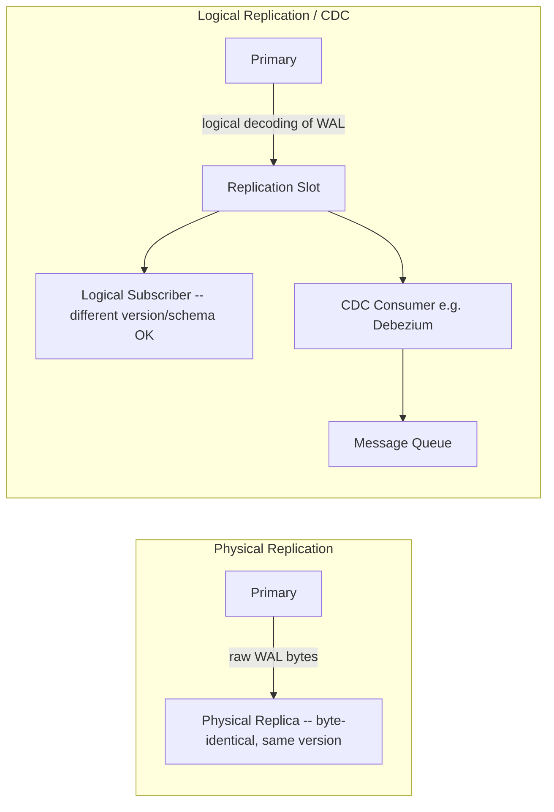
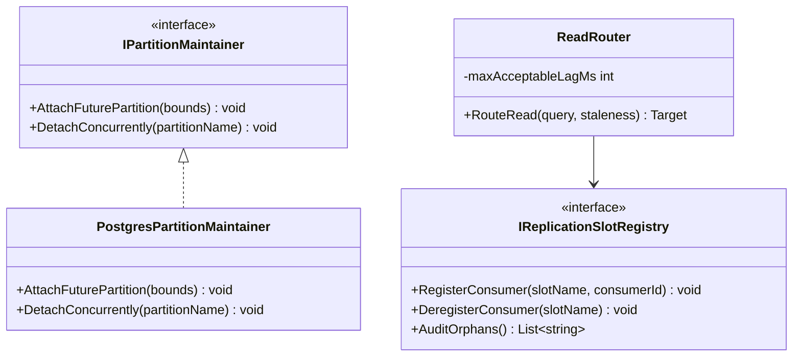
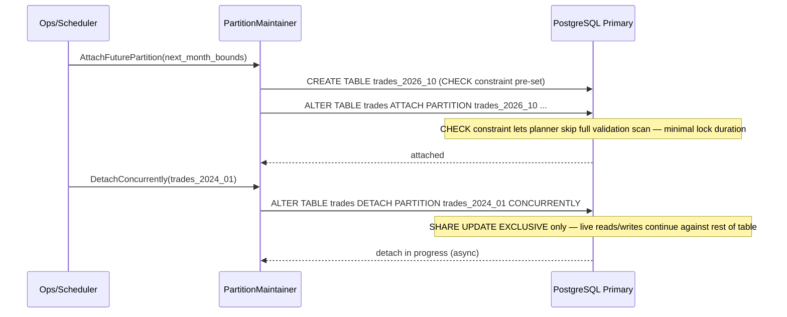

# Module 22 — PostgreSQL: Partitioning, Replication & Logical Decoding

> Domain: PostgreSQL | Level: Beginner → Expert | Prerequisite: [[01-PostgreSQL-Fundamentals-vs-SQLServer]]

---

## 1. Topic Description

### Definition

**Declarative partitioning** splits one logical table into physical child tables by range, list or hash on a partition key, so the planner can eliminate irrelevant children at plan or execution time and so whole partitions can be attached and detached as metadata operations. **Physical (streaming) replication** ships the write-ahead log byte-for-byte to standbys that replay it, producing an identical block-level copy usable for read scale-out and failover. **Logical decoding** reads that same WAL and, through an output plugin, reconstructs it as a stream of logical row changes (insert/update/delete with column values), which is what makes logical replication and change-data-capture possible. All three are WAL-derived: partitioning changes where rows live, physical replication copies the WAL, logical decoding interprets it.

### Core sub-concepts

- **Declarative partitioning** — `PARTITION BY RANGE | LIST | HASH`, the partition key, child tables, and multi-level partitioning.
- **Partition pruning** — plan-time versus runtime (`EXECUTE`-time) pruning, and why a non-immutable or parameterised key expression defeats it.
- **Partition-wise joins and aggregates** — matching partition bounds so work happens per partition rather than across the whole set.
- **Constraint requirements** — the partition key must be part of every unique/primary key; global unique constraints are not available.
- **`ATTACH` / `DETACH PARTITION`** — metadata-only lifecycle operations, `DETACH CONCURRENTLY`, and the validation scan `ATTACH` performs unless a matching constraint already exists.
- **Partition maintenance** — pre-creating future partitions, dropping old ones instead of deleting rows, and `pg_partman` as automation.
- **Write-ahead logging** — WAL as the shared substrate for durability, replication and decoding; checkpoints and WAL retention.
- **Streaming physical replication** — primary/standby, hot standby reads, `wal_level`, WAL sender/receiver.
- **Replication slots** — guaranteed WAL retention for a consumer, and the disk-fill and vacuum-horizon risk of an abandoned slot.
- **Synchronous versus asynchronous commit** — `synchronous_commit` levels, `synchronous_standby_names`, and the durability-versus-latency trade.
- **Replication lag and hot-standby conflicts** — `hot_standby_feedback`, `max_standby_streaming_delay`, and query cancellation on standbys.
- **Failover and promotion** — automated managers (Patroni and similar), fencing/STONITH, split-brain, timeline divergence, `pg_rewind`.
- **Logical replication** — publications and subscriptions, initial data copy, per-table selectivity, cross-version and cross-platform replication.
- **Logical decoding internals** — output plugins (`pgoutput`, `wal2json`, `decoderbufs`), the reorder buffer, transaction ordering, and large-transaction spill.
- **CDC pipelines** — Debezium-style consumers, at-least-once delivery, LSN as the resume position, snapshot-plus-stream startup.
- **Logical replication limitations** — DDL is not replicated, sequences are not advanced, replica identity requirements for updates and deletes, conflict handling.
- **RPO / RTO** — what each topology actually guarantees, and how backup plus WAL archiving (PITR) complements replication.

### Where it fits

Partitioning sits on top of the heap and index layer from `01`, and interacts directly with vacuum: it converts a table-wide cleanup problem into per-partition units and turns bulk deletes into partition drops. Replication and decoding sit beneath the application's read/write routing: physical replicas serve read scale-out and failover, while logical decoding is the seam where the transactional database feeds the wider event-driven architecture — outbox relays, search indexes, caches, analytics stores and downstream services all commonly originate here. This is therefore the boundary where a single-database design becomes a distributed one, with all the consistency questions that implies.

### Why it matters at scale

Getting partitioning wrong is expensive in both directions: partition on the wrong key and every query scans every child, so you have added planning overhead and object count for nothing; leave partitions uncreated and inserts fail outright when data arrives for a range that does not exist. Replication failures are worse because they are silent — an abandoned replication slot for a decommissioned replica retains WAL indefinitely, filling the primary's disk and pinning the vacuum horizon so bloat grows database-wide, and the first symptom is usually a full volume. Asynchronous replication means a failover loses every transaction not yet shipped, so an RPO nobody explicitly chose is discovered during the incident. And on the read path, replication lag produces read-your-own-writes failures that are invisible in testing and deeply confusing in production.

### Common pitfalls / anti-patterns

- **Choosing a partition key that queries do not filter on** — no pruning is possible, so every query scans every partition and you have paid planning and maintenance cost for a slower table.
- **Too many partitions** — thousands of children inflate planning time, catalog size and memory per backend; partition count should follow retention and query patterns, not be maximised.
- **Not pre-creating future partitions** — inserts for a date range with no matching partition fail; this is the classic New Year's Day outage for time-partitioned tables.
- **Deleting rows instead of dropping partitions** — generates enormous dead-tuple volume that autovacuum must reclaim, where a `DROP` would have been instant metadata work.
- **Leaving an unused replication slot** — WAL is retained forever, filling the disk and holding back the vacuum horizon; the damage is database-wide and unrelated to the replica that caused it.
- **Assuming a standby gives zero data loss** — asynchronous replication has a non-zero RPO by definition; synchronous commit is what removes it, at a latency and availability cost.
- **Reading from a replica for read-your-own-writes flows** — replication lag means the write may not be visible, producing behaviour that testing never reproduces.
- **Expecting logical replication to carry DDL or advance sequences** — schema changes and sequence values are not replicated, so a subscriber silently diverges or a promoted node reissues identifiers.
- **Updating or deleting on a logically-replicated table without a suitable replica identity** — the change cannot be applied downstream, so the subscriber errors or silently misses rows.
- **Treating replication as a backup** — a `DROP TABLE` replicates faithfully; only backups with WAL archiving give point-in-time recovery.

---

## 2. Beginner (10 Q&A)

**Q1. What does declarative partitioning actually give you, and what does it not?**
**A:** It gives partition pruning — the planner or executor skips children that cannot contain matching rows — plus per-partition maintenance, so vacuum, index builds and retention operate on smaller units and old data can be dropped as metadata. It does not make an individual well-indexed lookup faster; a seek into a B-tree was already logarithmic. The real wins are on large scans that can be pruned, and on lifecycle management of time-series data.
*Follow-up: For a query that filters only on a non-partition column, is a partitioned table faster or slower than an unpartitioned one?*

**Q2. Explain plan-time versus runtime partition pruning.**
**A:** Plan-time pruning happens when the partition key is compared against a constant the planner can evaluate, so the excluded children never appear in the plan at all. Runtime pruning happens when the value is only known at execution — a parameter, or a value from the other side of a nested loop — so the plan retains all partitions and the executor skips them as it goes. Both are valuable, but runtime pruning still pays planning cost for every partition, which is why partition count matters even when pruning works.
*Follow-up: You wrap the partition key in a function in the `WHERE` clause. What happens to pruning?*

**Q3. Why must the partition key be part of every unique constraint?**
**A:** Because uniqueness is enforced by an index, and each partition has its own local index — there is no global index spanning children. To guarantee uniqueness across the whole table, the key must include the partition column so that any two rows with the same key are guaranteed to land in the same partition. The practical consequence is that you cannot have a globally unique surrogate key independent of the partition column, which frequently forces a composite primary key and surprises people migrating an existing table.
*Follow-up: Your table has a globally unique `OrderId` and you want to partition by `CreatedDate`. What are your options?*

**Q4. What is `ATTACH PARTITION` and why can it be slow?**
**A:** It adopts an existing table as a partition of a parent. By default PostgreSQL must verify that every row satisfies the partition bounds, which is a full scan under a lock that blocks access to the table. You avoid that by first adding a `CHECK` constraint matching the bounds and validating it separately — then `ATTACH` can trust it and complete as a metadata operation. That two-step pattern is the difference between a routine load and an outage on a large table.
*Follow-up: What does `DETACH CONCURRENTLY` change, and what limitation does it carry?*

**Q5. What is the write-ahead log and why is it central to all three of these topics?**
**A:** Every change is written to the WAL before the data pages themselves, which is what makes crash recovery possible: replay the log to reconstruct committed state. Physical replication ships those WAL records to standbys that replay them; logical decoding reads the same records and reconstructs them as row-level changes. So durability, replication and CDC are all consumers of one stream, and settings that affect WAL — `wal_level`, retention, archiving — affect all of them together.
*Follow-up: What does raising `wal_level` to `logical` cost you?*

**Q6. What is a replication slot?**
**A:** A server-side marker recording how far a particular consumer — a physical standby or a logical subscriber — has progressed, so the primary retains WAL until that consumer has confirmed receipt. It removes the risk of a lagging replica falling irrecoverably behind because the WAL it needed was recycled. The cost is the symmetric risk: if the consumer disappears and the slot is not dropped, retention is unbounded and the primary's disk fills.
*Follow-up: Beyond disk usage, what else does a stale logical slot hold back?*

**Q7. Synchronous versus asynchronous replication — what are you choosing between?**
**A:** Durability versus latency and availability. With asynchronous replication a commit returns as soon as it is durable locally, so failover can lose transactions that had not yet shipped — a non-zero RPO. With synchronous commit, the primary waits for a standby to confirm, giving zero data loss for committed transactions but adding a network round trip to every commit and making the primary's availability depend on a standby being reachable. The middle grounds are the intermediate `synchronous_commit` levels and quorum-based synchronous sets.
*Follow-up: With one synchronous standby, what happens to the primary when that standby goes down?*

**Q8. What is logical decoding, and how does it differ from physical replication?**
**A:** Physical replication copies WAL records that describe *block-level* changes, so the standby is byte-identical and must run the same major version and architecture. Logical decoding runs the WAL through an output plugin that reconstructs *row-level* logical changes — table, operation, and column values — which can then be applied to a different major version, a different schema, or an entirely different system such as Kafka. That interpretation step is what makes CDC and selective replication possible.
*Follow-up: Why can a logical subscriber run a different PostgreSQL major version when a physical standby cannot?*

**Q9. What does logical replication *not* replicate?**
**A:** DDL — schema changes must be applied to both sides separately, and a subscriber that has not received a new column will error or silently diverge. It also does not advance sequences on the subscriber, so a promoted subscriber will reissue identifiers already used. Large objects and truncations have their own caveats depending on version. These gaps are the main operational burden of logical replication and are the usual cause of a subscription breaking weeks after it was set up.
*Follow-up: How would you sequence a schema change across a publisher and a subscriber safely?*

**Q10. What is replica identity and when does it bite?**
**A:** It tells logical decoding how to identify a row for `UPDATE` and `DELETE` on the subscriber. The default uses the primary key; a table without one needs `REPLICA IDENTITY FULL` (which logs the whole old row and is expensive) or a designated unique index. If it is not set appropriately, updates and deletes cannot be decoded and the subscription errors. It bites on tables that were fine for years under physical replication and are then added to a publication.
*Follow-up: What's the performance cost of `REPLICA IDENTITY FULL` on a wide, frequently-updated table?*

---

## 3. Intermediate (10 Q&A)

**Q1. How do you choose a partition key and a partition granularity?**
**A:** From the queries and the retention policy together: the key must be something the dominant queries actually filter on, or pruning never happens; the granularity should make each partition large enough to be worth having and small enough that maintenance and drops are cheap. For time-series data, a range on the timestamp with monthly or daily granularity matched to the retention window is the standard shape. I would sanity-check the resulting partition count, because thousands of children inflate planning time and per-backend memory even when pruning works.
*Follow-up: Queries filter on tenant *and* date. Would you partition by one, or use multi-level partitioning?*

**Q2. When is hash partitioning the right choice over range or list?**
**A:** When you want even distribution rather than lifecycle management — spreading write contention and keeping partitions similarly sized without a natural range. The trade-off is that you lose the operational benefits: you cannot drop old data by dropping a partition, and range queries cannot prune because adjacent values hash to different children. So hash suits distributing a hot table across partitions to reduce contention, and range suits time-series retention, and mixing up which problem you have produces a partitioned table that helps with neither.
*Follow-up: You hash-partition by tenant and one tenant is ten times larger than the rest. What happens?*

**Q3. Walk me through diagnosing a primary whose disk is filling.**
**A:** WAL accumulation is the first hypothesis, and the usual causes are a replication slot whose consumer is gone or lagging, WAL archiving failing so files cannot be recycled, or a very long-running transaction. I would check slot restart LSNs and lag, then the archiver status, then the oldest transaction. The important second-order effect is that a stale *logical* slot also holds back the vacuum horizon, so alongside the disk problem you are accruing bloat across the whole database. The fix is to drop the slot if the consumer is genuinely gone — but only after confirming it is, since dropping a live slot forces a subscriber to re-seed.
*Follow-up: The slot belongs to a CDC pipeline that's been down for two days. Drop it or wait?*

**Q4. How do you handle read scale-out without breaking read-your-own-writes?**
**A:** Route reads that must observe a just-completed write to the primary, and everything else to replicas — which means the routing decision has to be explicit in the code or the data-access layer rather than a global toggle. Alternatives are waiting for the replica to reach the write's LSN before reading, which trades latency for correctness, or designing the interaction so staleness is acceptable and visible. What does not work is assuming lag is small enough not to matter; it is small until a bulk load, a long checkpoint or a network blip makes it seconds.
*Follow-up: How would you implement LSN-based read routing, and what does it cost?*

**Q5. What are hot-standby conflicts and how do you manage them?**
**A:** A standby replaying WAL may need to remove rows that a long-running query on that standby still needs to see, so PostgreSQL either delays replay or cancels the query. `max_standby_streaming_delay` sets how long replay will wait, and `hot_standby_feedback` makes the standby tell the primary to hold back vacuum for its running queries. Each option moves the pain: delaying replay increases lag and RPO exposure, while feedback causes bloat on the *primary* because vacuum is held back there. For a reporting replica I usually accept feedback plus monitoring on the primary's horizon, but it must be a conscious choice.
*Follow-up: With `hot_standby_feedback` on, a report runs for six hours on the replica. What's happening on the primary?*

**Q6. How would you set up CDC from PostgreSQL into a message broker?**
**A:** A logical replication slot with an appropriate output plugin, consumed by a connector that publishes changes and periodically confirms its LSN so WAL can be released. The design points that matter are: delivery is at-least-once, so consumers must be idempotent; ordering is guaranteed within a transaction and by LSN, not globally across tables in the way people assume; the initial snapshot plus stream handover must be correct or you lose or duplicate a window of changes; and the slot is now a piece of critical infrastructure whose failure fills the primary's disk. I would monitor slot lag as a first-class alert from day one.
*Follow-up: Your CDC consumer is down for a maintenance window. What do you need to have decided in advance?*

**Q7. What breaks when a large transaction is decoded?**
**A:** Logical decoding traditionally buffers a transaction's changes until commit, because it must emit them in commit order — so a transaction touching millions of rows accumulates in memory and then spills to disk, causing a latency spike and a burst of downstream traffic long after the work happened. Newer versions can stream in-progress transactions, which helps considerably but shifts complexity to the consumer, which must handle aborts. The practical mitigation is the same as for many PostgreSQL problems: batch large modifications rather than doing them in one enormous transaction.
*Follow-up: How does streaming of in-progress transactions change what the consumer must handle?*

**Q8. How do you perform a major-version upgrade with minimal downtime?**
**A:** Logical replication is the standard route: build the new-version cluster, replicate into it while the old one serves traffic, then cut over when lag is near zero. That is precisely what physical replication cannot do, since it requires identical versions. The work is in the gaps — schema must be created on the target, sequences must be advanced at cutover, DDL changes must be frozen or applied to both sides during the migration window, and any table without a suitable replica identity must be fixed first. I would rehearse the cutover, including the rollback, because the sequence step is easy to forget and expensive to discover afterwards.
*Follow-up: You cut over and discover sequences weren't advanced. What is the immediate symptom and the recovery?*

**Q9. What does automated failover actually need to be safe?**
**A:** Consensus about who the primary is, and fencing of the old one. Without fencing, a primary that was merely unreachable can keep accepting writes while a standby is promoted, producing split-brain and two divergent histories that cannot be automatically reconciled. A failover manager needs a quorum-based decision, a mechanism to isolate the old primary (network, storage, or shutting it down), and a way to bring the old node back as a standby — usually `pg_rewind` rather than a full re-seed. I would also require that failover is tested regularly, because an untested failover path is a belief rather than a capability.
*Follow-up: After a failover, the old primary rejoins with divergent WAL. What are your options?*

**Q10. How does partitioning interact with vacuum and bloat?**
**A:** Favourably, and it is one of the better reasons to partition. Autovacuum works per table, so partitions are independent units — a hot recent partition gets vacuumed frequently while cold historical ones need almost nothing, instead of one enormous table where thresholds are either too aggressive or never met. More importantly, retention by `DROP PARTITION` produces zero dead tuples, whereas deleting the equivalent rows creates a mass of garbage that autovacuum must then reclaim. For a high-churn time-series table, that difference alone often justifies partitioning.
*Follow-up: You partition an existing 2 TB table. How would you migrate the data without a long outage?*

---

## 4. Expert / Architect (10 Q&A)

**Q1. How do you set an RPO and RTO for a PostgreSQL estate, and make them real rather than aspirational?**
**A:** Start from the business consequence of losing data and of being unavailable, expressed per service tier, then choose the topology that delivers it: asynchronous replication has a non-zero RPO measured by lag, synchronous commit gives zero RPO for committed transactions at a latency cost, and PITR from base backups plus WAL archiving is what covers the cases replication cannot — a `DROP TABLE` replicates faithfully. Making them real means measuring: alert on replication lag against the RPO number, and time an actual restore and an actual failover on a schedule. I have seen far more organisations with a documented RPO and an untested restore than with a genuinely inadequate topology.
*Follow-up: Your documented RPO is 5 seconds and measured lag peaks at 90 seconds during nightly loads. What do you do?*

**Q2. How do you decide between physical replication, logical replication, and CDC into a separate system for a given consumer?**
**A:** By what the consumer needs. A read replica for scale-out or failover wants physical: it is cheapest, complete, and needs no schema management. A consumer needing a subset, a different schema, or a different major version wants logical. A consumer that is not a database at all — a search index, a cache, an analytics store, another service — wants CDC into a broker, because that decouples its availability and pace from the database's. The mistake I would flag is using logical replication to feed several bespoke consumers, which turns the primary into the coupling point for all of them; a single decoding stream into a broker with many independent consumers scales far better.
*Follow-up: Five teams each want their own logical subscription. What do you propose instead and why?*

**Q3. What are the organisational risks of making CDC the backbone of an event-driven architecture?**
**A:** The published events become your *internal table schema*, so every consumer is now coupled to your physical model and a column rename becomes a breaking change across the estate — that is the central risk, and it is architectural rather than technical. Second, the database team now owns availability for a pipeline they did not sign up for: a stalled slot fills the primary's disk. Third, table-level changes carry no business semantics, so consumers reconstruct intent by guessing. My preferred shape is CDC over an **outbox table** whose rows are deliberately-designed events, which keeps the decoupling benefit while making the contract explicit and owned.
*Follow-up: How would you migrate an existing table-level CDC pipeline to an outbox without a flag day?*

**Q4. How would you plan partitioning for a table expected to reach 10 TB?**
**A:** Design the key from the access patterns and the retention policy first, then work out granularity from target partition size and the resulting child count — I would rather have a few hundred partitions of tens of gigabytes than tens of thousands of small ones, because planning cost and catalog size are real. Automate creation ahead of time and retention by dropping, because manual partition management fails on the day nobody is watching. I would also verify that the dominant queries prune, using actual plans rather than assumption, and check the constraint implications early since the partition key must join every unique key — that is the requirement most likely to force a data-model change.
*Follow-up: The business later wants to query across all 10 TB by a non-partition column. What do you offer?*

**Q5. How do you approach multi-region PostgreSQL?**
**A:** Accept that synchronous cross-region commit costs a round trip per commit, which for most workloads is unacceptable, so cross-region replicas are usually asynchronous with a corresponding RPO. That means a single writable primary per region-set and reads served locally, with the application designed for the staleness that implies. Multi-primary is where architectures get into trouble: PostgreSQL does not offer it natively, and bolt-on solutions push conflict resolution into the application, which is a much larger design commitment than teams expect. I would prefer partitioning the *data* by region so each region owns its writes, rather than trying to make one dataset writable everywhere.
*Follow-up: A regulator requires that EU customer data never leaves the EU. How does that shape the topology?*

**Q6. What monitoring would you mandate for replication and slots across an estate?**
**A:** Slot lag in bytes and in time, per slot, with alerting well before disk pressure — this is the single highest-value alert because the failure is silent and the consequence is a full primary. Then replication lag per standby against the RPO target, WAL archive success rate, standby replay conflicts and cancellations, and — for logical slots — the vacuum horizon they pin, since that is the second-order damage people miss. I would also monitor slot *existence* against an expected inventory, because the dangerous slot is usually one nobody remembers creating.
*Follow-up: What threshold would you set for slot lag, and how would you derive it rather than guess?*

**Q7. How do you evaluate a managed PostgreSQL service against these capabilities?**
**A:** Check what is actually exposed: whether logical replication out is permitted (this determines whether you can ever migrate away, so it is a lock-in question as much as a feature one), which output plugins and extensions are available, what the failover mechanism and measured RTO are, whether you can control synchronous commit and slot management, and whether cross-region replicas are supported in the shape you need. Managed services remove enormous operational cost, which usually decides it — but I would treat "can I get my data out as a live stream" as a hard requirement, because a platform you cannot replicate out of is a platform you cannot leave without downtime.
*Follow-up: The service supports logical replication only to another instance of the same service. Does that satisfy you?*

**Q8. How do you handle schema evolution across a logical replication or CDC boundary?**
**A:** Treat it as a distributed contract change rather than a migration. Additive changes are applied to the subscriber first, then the publisher, so the downstream is always ready for what arrives. Destructive changes go through a deprecation cycle with the consumers, not a coordinated release. For CDC into a broker, a schema registry with enforced compatibility rules does the job that a deploy gate does for APIs, and it is the only mechanism that scales past a handful of consumers. The failure mode to design against is a publisher change that the subscriber cannot apply, which stops the subscription and starts WAL accumulating — so schema management and disk-space risk are the same problem here.
*Follow-up: A column must be dropped from a table that three CDC consumers read. Walk me through the sequence.*

**Q9. How would you migrate a large, actively-written table to a partitioned one with minimal downtime?**
**A:** Create the partitioned parent alongside, backfill historical data into partitions in batches, and use a mechanism to keep the new structure current during the backfill — dual-write from the application, or a trigger, or logical replication into the new shape depending on constraints. Then cut over inside a short transaction that renames, having verified row counts and constraints beforehand. The alternative that sometimes wins is `ATTACH`ing the existing table as the initial partition and partitioning only future data, which is far cheaper and adequate when the value is retention rather than pruning historical queries. I would decide between those two by what the partitioning is actually for.
*Follow-up: Which of those two would you pick for a table where 95% of queries touch the last 30 days?*

**Q10. What signals tell you an organisation's replication and partitioning practice is mature?**
**A:** Failover and restore are tested on a schedule rather than documented; slot inventory is monitored and reconciled; RPO and RTO are numbers derived from business impact and verified against measured lag; partitions are created and dropped by automation rather than by a person; and CDC consumers are fed from a deliberately-designed contract rather than from raw table changes. The clearest negative signal is a team that can describe their topology but cannot say when they last promoted a standby — because every failure mode in this area is silent until the day it is catastrophic, and the only evidence of readiness is having exercised it.
*Follow-up: You join a team with untested failover and a production estate. What do you do in the first month?*

---

## 5. Reference Material

> Retained from the original module: deep-dive internals, diagrams, production examples, exercises, system/low-level design, debugging walkthroughs and the Principal Engineer perspective.

### 1. Fundamentals

#### What is table partitioning, replication, and logical decoding?
**Partitioning** splits one logically-unified table into multiple physical sub-tables (partitions), each holding a subset of rows (typically by date range or a hash/list key), transparently queried as if it were one table. **Replication** copies data from a primary database to one or more replicas — **physical** (streaming) replication copies raw WAL (Write-Ahead Log) bytes for a byte-identical replica; **logical** replication copies decoded, table-level changes, allowing selective, cross-version, or cross-schema replication. **Logical decoding** is the underlying mechanism extracting a stream of row-level changes from the WAL in a structured, consumable format — the foundation both logical replication and Change Data Capture (CDC) pipelines are built on.

#### Why do these exist?
A single, monolithic table eventually becomes too large for efficient maintenance (vacuum, index rebuilds, archival deletion) — partitioning lets these operations target individual partitions (e.g., dropping an entire old-data partition instantly instead of a slow `DELETE`). Replication exists for both **high availability** (a standby ready to take over) and **read scaling** (routing read traffic to replicas). Logical decoding exists specifically to expose database changes in a consumable form for use cases beyond simple byte-for-byte replication — CDC pipelines feeding a message queue, cross-database sync, audit trails.

#### When does this matter?
Partitioning matters once a table's size makes maintenance operations (vacuum, backup, archival) genuinely slow or disruptive; replication matters for any production system requiring HA/DR or read-scaling; logical decoding/CDC matters for event-driven architectures needing to react to database changes without polling.

#### How does it work (30,000-ft view)?
```sql
CREATE TABLE orders (id bigint, created_at date,...) PARTITION BY RANGE (created_at);
CREATE TABLE orders_2024 PARTITION OF orders FOR VALUES FROM ('2024-01-01') TO ('2025-01-01');
CREATE TABLE orders_2025 PARTITION OF orders FOR VALUES FROM ('2025-01-01') TO ('2026-01-01');
-- Queries against `orders` transparently route to the correct partition(s) via partition pruning.
```

### 2. Deep Dive

#### 2.1 Partitioning Strategies and Partition Pruning
**Range partitioning** (by date, the most common pattern for time-series/log-style data) lets old partitions be dropped instantly (`DROP TABLE orders_2020` — an O(1) metadata operation, versus a slow, vacuum-generating `DELETE FROM orders WHERE year = 2020`) and lets vacuum/maintenance operate on smaller, individually-manageable units. **List partitioning** splits by discrete key values (e.g., by region). **Hash partitioning** distributes rows pseudo-randomly across a fixed partition count, useful for write-load distribution without a natural range/list key. **Partition pruning** — the query planner recognizing that a `WHERE created_at >= '2024-06-01'` predicate can only match rows in specific partitions, skipping the rest entirely — is what makes partitioning a genuine performance win, not just an administrative convenience; pruning requires the partition key to appear in a sargable form in the query's predicate, or pruning fails and every partition is scanned, defeating the purpose.

#### 2.2 Streaming (Physical) Replication vs Logical Replication
**Physical replication** streams WAL records byte-for-byte to a replica applying them at the same physical location — the replica is a byte-identical copy, **must run the same major PostgreSQL version**, and typically replicates the **entire cluster** (all databases), not a subset. **Logical replication** decodes WAL into logical row-change events (insert/update/delete on specific tables) and applies them via ordinary SQL on the subscriber — enabling replication **between different major versions**, **selective** table-level replication, and replication into a **different schema/structure** on the subscriber (useful for consolidating multiple sources into one reporting database, or migrating between major versions with near-zero downtime via a logical-replication-based cutover).

#### 2.3 Synchronous vs Asynchronous Replication — the CAP-Theorem Trade-off Made Concrete
**Asynchronous replication** (the default): the primary commits and acknowledges the client immediately, without waiting for any replica to confirm receipt — fast, but a primary crash before a replica catches up means **committed data can be lost** on failover (the replica promotes to primary without ever having received the most recent commits). **Synchronous replication** (`synchronous_commit = on` with `synchronous_standby_names` configured): the primary waits for at least one designated replica to confirm receipt before acknowledging the client's commit — eliminates that data-loss window, at the direct cost of added commit latency (and, if the synchronous replica becomes unavailable, either blocking all commits entirely or requiring a carefully-configured quorum/fallback policy) — a textbook, concrete instantiation of the availability-vs-consistency trade-off a later CAP theorem module will formalize.

#### 2.4 Change Data Capture (CDC) via Logical Decoding
A **replication slot** with a **logical decoding output plugin** (e.g., `pgoutput`, or `wal2json` for a JSON-formatted change stream) lets an external consumer (Debezium being the dominant open-source CDC tool, feeding changes into Kafka) subscribe to a structured stream of every row-level change — enabling event-driven architectures reacting to database changes without polling, and directly providing the underlying mechanism for the **Outbox pattern** (a later dedicated module) in its "CDC-based" variant (reading committed outbox-table rows via CDC instead of a separate polling process).

#### 2.5 Replication Slot Retention Risk
A replication slot retains WAL on the primary **for as long as the slot exists and hasn't been consumed** — if a logical-replication subscriber or CDC consumer disconnects and never resumes (a crashed, forgotten, or decommissioned consumer whose slot was never dropped), the primary **retains WAL indefinitely** waiting for that slot to be consumed, which can silently fill up disk space until the primary itself runs out of storage — a genuinely severe, easy-to-overlook operational failure mode distinct from ordinary replication lag monitoring.

### 3. Visual Architecture

```mermaid
graph LR
 subgraph "Physical Replication"
 P1[Primary] -->|raw WAL bytes| R1[Physical Replica -- byte-identical, same version]
 end
 subgraph "Logical Replication / CDC"
 P2[Primary] -->|logical decoding of WAL| Slot[Replication Slot]
 Slot --> Sub[Logical Subscriber -- different version/schema OK]
 Slot --> CDC[CDC Consumer e.g. Debezium] --> Kafka[Message Queue]
 end
```

### 4. Production Example
**Scenario**: A production PostgreSQL primary's disk usage grew steadily over several weeks despite stable data volume and properly-tuned autovacuum (the lesson already applied), eventually triggering an out-of-disk-space alert. **Investigation**: `pg_replication_slots` revealed an **inactive** logical replication slot from a decommissioned CDC pipeline (a Debezium connector removed months earlier during an architecture change) — the slot itself was never dropped, so the primary had been retaining every WAL segment generated since that connector's last activity, for months, waiting for a consumer that would never return. **Fix**: dropped the orphaned slot (`SELECT pg_drop_replication_slot('old_cdc_slot');`), immediately reclaiming the retained WAL space; added a standing monitoring check specifically for replication-slot `restart_lsn` lag (how far behind the slot's confirmed position is from the current WAL position) as a distinct, proactive alert. **Lesson**: replication slots are a "silent until catastrophic" resource-retention risk with no natural expiration — any consumer decommissioning process must explicitly include dropping its associated replication slot as a mandatory step, and slot-lag monitoring deserves the same proactive attention as vacuum-bloat monitoring.

### 11. Coding Exercises

#### Easy — Range partitioning with instant archival drop
```sql
CREATE TABLE events (id bigint, occurred_at timestamptz, payload jsonb) PARTITION BY RANGE (occurred_at);
CREATE TABLE events_2024_q1 PARTITION OF events FOR VALUES FROM ('2024-01-01') TO ('2024-04-01');
CREATE TABLE events_2024_q2 PARTITION OF events FOR VALUES FROM ('2024-04-01') TO ('2024-07-01');

-- Archival: instant, O(1) metadata operation, no row-by-row DELETE/vacuum cost
DROP TABLE events_2024_q1;
```

#### Medium — Verify partition pruning via EXPLAIN
```sql
EXPLAIN SELECT * FROM events WHERE occurred_at >= '2024-05-01' AND occurred_at < '2024-06-01';
-- Correct output shows ONLY "events_2024_q2" scanned, not events_2024_q1 -- confirms pruning is active.
-- If the plan shows EVERY partition scanned, the predicate isn't sargable against the partition key
-- (the sargability concern, applied here to partition pruning specifically).
```

#### Hard — Detect orphaned replication slots (/Advanced Q1's safeguard)
```sql
SELECT slot_name, active, restart_lsn,
 pg_wal_lsn_diff(pg_current_wal_lsn, restart_lsn) AS retained_bytes
FROM pg_replication_slots
WHERE active = false
ORDER BY retained_bytes DESC;
-- Any inactive slot with a large/growing retained_bytes value is a candidate orphan --
-- cross-reference slot_name against a registry of currently-expected-active consumers
-- before dropping (per Advanced Q1's audit process), never drop blindly without verification.
```

#### Expert — Synchronous replication with quorum-based fallback tolerance (Advanced Q3)
```sql
-- postgresql.conf on the primary:
synchronous_commit = on;
synchronous_standby_names = 'ANY 1 (replica_a, replica_b, replica_c)';
-- ANY 1 of the three named replicas acknowledging is sufficient -- tolerates ANY SINGLE
-- replica's failure without blocking primary commits, unlike naming just one replica alone.
```
**Discussion**: The `ANY 1 (...)` quorum syntax is precisely what closes the single-synchronous-standby outage risk from Advanced Q3 — with three candidates and a quorum of just one required, the primary continues accepting commits as long as at least one of the three replicas remains reachable, a meaningfully more resilient configuration than naming a single synchronous standby.

### 12. System Design

**Scenario:** Design the partitioning, replication, and CDC topology for a global settlement platform: a core ledger primary in one region-of-record, a synchronous DR standby for zero-committed-loss failover, asynchronous read replicas for regional reporting, and a CDC pipeline streaming every settlement event to a downstream fraud/analytics platform.

**Functional requirements:** Instant, low-impact archival of settled trades older than the active retention window; sub-second regional read access for reporting without touching the primary; a reliable, ordered event stream of every settlement state change for downstream consumers; RPO≈0/fenced automated failover for the primary (Expert Q1, Expert Q5).

**Non-functional requirements:** Zero committed-settlement data loss on primary failure; partition-maintenance operations (attach/detach) never block live 24/7 trading traffic (Expert Q7); replication-slot health monitored as a first-class, standing signal (Production Example), not discovered only via disk-space alerts.

**Back-of-the-envelope estimation:** 500 settlements/second sustained, each generating roughly 3 downstream row-level change events (settlement created, matched, confirmed) → 1,500 logical-decoding events/second feeding the CDC pipeline. At six hours for a full initial sync of the 2TB core `trades` table (Expert Q8) and this event rate, a new CDC subscriber's initial-sync WAL-retention window must be sized against roughly 1,500 × 3,600 × 6 ≈ 32 million events' worth of WAL, not an arbitrary buffer — the number tells us initial-sync capacity planning (Expert Q8) is a mandatory, explicit step for onboarding any new subscriber to this primary, not an afterthought.

**Architecture:** Range-partitioned `trades`/`settlements` tables (by settlement_date, matched partition boundaries across both tables for partition-wise join eligibility, Expert Q6) on a single-primary-per-region-of-record topology; quorum synchronous replication (`ANY 1 (...)`, Module 21 Advanced Q3) to standbys in separate failure domains for RPO≈0; Patroni/etcd-based fenced automated failover (Expert Q5); asynchronous read replicas per reporting region; a dedicated logical-replication slot per CDC consumer (Debezium), each independently monitored.

**Components:** Partition-maintenance scheduler using pre-constrained `ATTACH`/`CONCURRENTLY DETACH` (Expert Q7); replication-slot health dashboard tracking retained-WAL per slot with distinct alert thresholds for "known initial-sync-in-progress" versus "steady-state" slots (Expert Q8's distinction); a decommissioning workflow gate requiring explicit slot removal before any consumer teardown is considered complete (Production Example's fix, generalized).

**Database selection:** PostgreSQL with Citus deliberately deferred (§9) unless the single-primary's vertical write ceiling becomes a demonstrated constraint — the design starts with the simpler, well-understood single-primary-plus-replicas topology and adds sharding only when actually forced to.

**Caching:** Not a primary mechanism for the ledger's write path; reporting replicas serve as the "caching" layer for read-heavy analytical queries, with staleness bounded and monitored (Advanced Q6).

**Messaging:** Debezium-based CDC (§2.4) feeds a Kafka topic per logical table, with downstream consumers required to be idempotent (at-least-once delivery, exactly as Module 21's outbox-worker pattern requires) — chosen over an application-level outbox here specifically because the platform needs every row-level change captured with minimal application-code involvement across several legacy writers (Module 21 Expert Q2's decision criterion).

**Scaling:** Read replicas absorb regional reporting load; partition-wise join/aggregate (Expert Q6) keeps the nightly reconciliation job's cost bounded as historical data volume grows; Citus sharding remains the explicit next lever, not a default.

**Failure handling:** Fenced automated failover (Expert Q5) prevents split-brain; quorum synchronous replication tolerates a single standby's failure without blocking primary commits; a replication-slot alert distinguishes expected initial-sync WAL growth from an orphaned-slot pattern (Expert Q8), avoiding both false-negative disk-exhaustion risk and false-positive alert fatigue.

**Monitoring:** Per-slot retained-WAL and `restart_lsn` lag (Production Example); checkpoint-correlated WAL-volume spikes against synchronous-commit latency (Expert Q9); partition-pruning and partition-wise-join engagement verified via `EXPLAIN` on representative queries, not assumed from schema design alone.

**Trade-offs:** CDC via logical decoding is chosen over a per-service application outbox for this platform's cross-legacy-system event-capture requirement, accepting the added replication-slot operational burden (Production Example) as the direct cost of that choice — a trade-off explicitly weighed, not defaulted into.

### 13. Low-Level Design

**Requirements:** Model partition-maintenance operations as safe, non-blocking, and idempotent; model replication-slot lifecycle as explicitly tied to consumer lifecycle; support graceful degradation when a read replica's lag exceeds a query's staleness tolerance (Advanced Q6).

**Class diagram:**

```mermaid
classDiagram
 class IPartitionMaintainer {
 <<interface>>
 +AttachFuturePartition(bounds) void
 +DetachConcurrently(partitionName) void
 }
 class PostgresPartitionMaintainer {
 +AttachFuturePartition(bounds) void
 +DetachConcurrently(partitionName) void
 }
 class IReplicationSlotRegistry {
 <<interface>>
 +RegisterConsumer(slotName, consumerId) void
 +DeregisterConsumer(slotName) void
 +AuditOrphans() List~string~
 }
 class ReadRouter {
 -maxAcceptableLagMs int
 +RouteRead(query, staleness) Target
 }
 IPartitionMaintainer <|.. PostgresPartitionMaintainer
 ReadRouter --> IReplicationSlotRegistry
```

**Sequence diagram:**

```mermaid
sequenceDiagram
 participant Ops as Ops/Scheduler
 participant PM as PartitionMaintainer
 participant DB as PostgreSQL Primary

 Ops->>PM: AttachFuturePartition(next_month_bounds)
 PM->>DB: CREATE TABLE trades_2026_10 (CHECK constraint pre-set)
 PM->>DB: ALTER TABLE trades ATTACH PARTITION trades_2026_10 ...
 Note over DB: CHECK constraint lets planner skip full validation scan — minimal lock duration
 DB-->>PM: attached
 Ops->>PM: DetachConcurrently(trades_2024_01)
 PM->>DB: ALTER TABLE trades DETACH PARTITION trades_2024_01 CONCURRENTLY
 Note over DB: SHARE UPDATE EXCLUSIVE only — live reads/writes continue against rest of table
 DB-->>PM: detach in progress (async)
```

**Design patterns used:** Strategy (`ReadRouter` selecting primary vs. replica by staleness tolerance, Advanced Q6); Registry (`IReplicationSlotRegistry` as the single source of truth for expected-active consumers, closing the orphaned-slot gap structurally rather than via a periodic manual audit alone); Template Method (the attach/detach lifecycle — pre-constrain, attach/detach, verify).

**SOLID mapping:** Single Responsibility (`PostgresPartitionMaintainer` owns partition DDL; `IReplicationSlotRegistry` owns consumer-lifecycle bookkeeping, decoupled from the maintainer); Open/Closed (a new partitioning strategy — hash instead of range — implements `IPartitionMaintainer` without altering `ReadRouter`); Liskov (any `IReplicationSlotRegistry` implementation must genuinely deregister on consumer teardown — an implementation that only logs deregistration without actually dropping the underlying slot would silently reintroduce the Production Example's incident despite satisfying the interface contract); Interface Segregation (partition maintenance and slot-registry concerns are separate interfaces, not bundled); Dependency Inversion (`ReadRouter` depends on the slot-registry abstraction, not directly on `pg_stat_replication` queries).

**Extensibility:** A new consumer type (a new CDC pipeline, a new reporting replica) registers with `IReplicationSlotRegistry` at provisioning time and must be explicitly deregistered at decommissioning — a structural, code-enforced version of the decommissioning-checklist fix from the Production Example, rather than a documentation-only process step.

**Concurrency/thread safety:** `DetachConcurrently` must be safe to invoke while live queries continue against the parent table (the `SHARE UPDATE EXCLUSIVE` lock is specifically chosen for this); `ReadRouter`'s staleness check must read replica lag atomically relative to the routing decision, avoiding a race where lag is checked, found acceptable, but grows past threshold before the query actually executes against the chosen replica — mitigated by treating the staleness threshold with a safety margin rather than a razor-thin cutoff.

### 14. Production Debugging

**Incident:** Six months after the settlement platform's CDC pipeline (§12) went live, the fraud-detection team reported receiving settlement events roughly 40 minutes late during specific, recurring windows — not continuously, only during the platform's known monthly-archival maintenance job.

**Root cause:** The archival job's `DETACH PARTITION` step (for the oldest, now-out-of-retention `trades` partition) was using the **default, blocking** `DETACH PARTITION` syntax rather than `DETACH... CONCURRENTLY` (Expert Q7) — a regression introduced when a junior engineer, writing the job independently of the original schema-design documentation, used the simpler, more commonly-documented syntax without realizing the live-table implication. The blocking detach held a lock that, while not fully `ACCESS EXCLUSIVE`, still serialized behind the logical-decoding output plugin's own internal consistency requirements during the detach's validation phase, causing the CDC slot's `restart_lsn` to stall measurably for the operation's multi-minute duration — not a full outage, but a real, recurring lag spike precisely correlated with the monthly job.

**Investigation:** `pg_stat_replication`'s `replay_lag` for the CDC slot showed a clean, sawtooth-shaped spike pattern correlated exactly with the archival job's cron schedule; cross-referencing the archival job's own source code (not initially suspected, since "it's just an archival job, not a replication change") against Expert Q7's attach/detach lock-duration guidance revealed the missing `CONCURRENTLY` keyword.

**Tools:** `pg_stat_replication` for the lag-pattern correlation; the archival job's own change history/git blame to identify when and by whom the blocking-detach syntax was introduced; `pg_locks` during a deliberately-reproduced staging-environment run of the job, confirming the specific lock type held during the blocking detach.

**Fix:** The archival job was updated to use `DETACH PARTITION... CONCURRENTLY`; a job-level integration test was added asserting (via a live query against the partitioned table issued concurrently with the job's execution in a test environment) that the table remains queryable throughout the detach — a regression test targeting the *symptom* (table availability during detach) rather than only the specific syntax, so a future accidental reintroduction of blocking detach would fail the test regardless of exactly how it was reintroduced.

**Prevention:** The schema-design documentation's attach/detach guidance (Expert Q7) was cross-linked directly into the archival job's own code comments and its onboarding runbook, closing the specific knowledge-transfer gap that let a correctly-documented discipline fail to reach a new contributor — the same cross-team-communication pattern Module 21 §14's deadlock incident illustrates, recurring here at the partition-maintenance layer instead of the application-locking layer.

### 15. Architecture Decision

**Context:** Choosing how to deliver settlement events to downstream fraud/analytics consumers — application-level outbox versus CDC via logical decoding (Expert Q2's general framing, now applied as a concrete decision for this platform).

**Option A — Application-level transactional outbox per service:** *Advantages:* Clean, explicitly-versioned domain-event contracts; no replication-slot operational burden; downstream consumers decoupled from internal schema shape. *Disadvantages:* Every writer to the ledger (including any legacy batch-load path not owned by the primary application) must be updated to also write outbox rows — a real integration cost across several legacy systems this specific platform has; requires building and operating the relay worker (`SKIP LOCKED`, Module 21 §10 Advanced Q2). *Cost:* Moderate-high (per-writer integration effort). *Risk:* Low once implemented, but implementation completeness risk (a legacy writer bypassing the outbox entirely) is real and hard to fully audit.

**Option B — CDC via logical decoding (Debezium):** *Advantages:* Captures every change regardless of which writer made it, with no per-writer integration cost — directly solves this platform's legacy-writer coverage problem. *Disadvantages:* Row-level diff events leak internal schema shape to downstream consumers unless an explicit transformation layer is added; replication-slot lifecycle (Production Example) and initial-sync capacity planning (Expert Q8) become standing operational responsibilities; a blocking partition-maintenance operation can measurably lag the CDC pipeline (§14's incident) in a way an application-level outbox's relay worker wouldn't be exposed to in the same manner. *Cost:* Lower initial integration cost, higher ongoing operational-discipline cost. *Risk:* Moderate, contingent on the slot-lifecycle and partition-maintenance disciplines (§14, Production Example) being genuinely, continuously followed.

**Recommendation: Option B**, specifically because this platform's defining constraint — several legacy writers to the ledger that cannot all be practically updated to write outbox rows — makes Option A's per-writer integration cost prohibitive, while Option B's operational costs (slot monitoring, partition-maintenance discipline) are addressable via the structural safeguards this module develops (the slot registry in §13, the regression test in §14) rather than being irreducible. Add a thin transformation layer between Debezium's raw row-level events and the Kafka topics fraud/analytics actually consume, closing Option B's schema-leakage disadvantage without giving up its legacy-writer-coverage advantage.

### 17. Principal Engineer Perspective

**Business impact:** A 40-minute CDC lag spike (§14) delayed fraud-detection signal freshness during exactly the archival-job window least likely to be scrutinized as "a replication concern" — the business cost of a delayed fraud signal is bounded but real (a fraudulent pattern detected 40 minutes later than it should have been), illustrating why even a "just an archival job" change requires the same design-review rigor as a change to the replication topology itself, since the two are more coupled than their ownership boundaries suggest.

**Engineering trade-offs:** The Option A/B decision in §15 is a sharper, platform-specific instance of Module 21 Expert Q2's general outbox-versus-CDC framing — legacy-writer coverage decisively favors CDC here, but only once its operational costs (slot lifecycle, initial-sync capacity planning, partition-maintenance lock discipline) are treated as first-class, budgeted engineering work, not an afterthought discovered via incidents.

**Technical leadership:** §14's incident is a direct structural echo of Module 21 §14's deadlock incident: a correctly-documented discipline (concurrent detach) existed but didn't reach a new contributor working on a seemingly-unrelated job. The durable leadership lesson, now demonstrated twice across this module pair, is that documentation alone doesn't propagate a discipline — it must be embedded where the relevant code is actually written (code comments, linked runbooks, regression tests targeting the symptom) or it will eventually be silently reintroduced by someone who never saw the original incident.

**Cross-team communication:** The archival job was written by a team who owned "data retention," not "replication" — the CDC-lag consequence of their change was invisible from their own vantage point, exactly the kind of cross-cutting operational coupling a Principal Engineer's design-review process must proactively surface (which teams' changes can affect which other teams' SLAs) rather than leaving to be discovered only when the affected team notices and investigates.

**Architecture governance:** Every replication slot should be registered against a known-consumer inventory (§13's `IReplicationSlotRegistry`) with explicit initial-sync-versus-steady-state classification (Expert Q8) as part of its own governance record — converting both this module's incidents (orphaned slot, blocking-detach lag) into structurally-enforced, auditable invariants rather than tribal knowledge held by whichever engineer originally built the pipeline.

**Cost optimization:** Choosing CDC (Option B) over building bespoke outbox integration for every legacy writer (Option A) is explicitly a cost-optimization decision — but one that shifts cost from a large, one-time integration effort to a smaller, ongoing operational-discipline cost (slot monitoring, capacity planning), a trade a Principal Engineer must make explicit to stakeholders rather than presenting Option B as simply "cheaper" without naming what kind of cost it actually defers.

**Risk analysis:** The recurring risk pattern across this module — an orphaned slot, a blocking detach, a naive bidirectional-replication conflict (Expert Q4/Q10) — is structurally identical each time: a mechanism (replication, partitioning, logical decoding) that is individually correct and well-understood fails specifically at a boundary condition (a decommissioning step, a syntax choice, a data-model assumption) that wasn't explicitly verified against the mechanism's actual operational requirements. Risk registers for this platform should track slot-lifecycle discipline, partition-maintenance-operation review, and multi-region write-conflict exposure as standing, periodically re-audited items.

**Long-term maintainability:** What decays over time, across both this module's incidents, is the correspondence between an original, correctly-designed operational discipline (slot cleanup on decommissioning, concurrent detach for live tables) and the system's current, evolved set of contributors and code paths who may never have encountered the original incident that produced the discipline — the sustained countermeasure, consistent with this course's recurring guidance, is embedding the discipline structurally (registries, regression tests, linked documentation) rather than relying on it being independently rediscovered or remembered indefinitely.

### 18. Revision
**Key takeaways**: Partitioning (range/list/hash) enables instant archival and smaller-unit maintenance, but only delivers a genuine performance win if partition pruning is verified (via `EXPLAIN`) to actually occur. Physical replication = byte-identical, same-version-only; logical replication = row-level, cross-version, selective. Synchronous replication trades commit latency for eliminating failover data loss — use quorum-based (`ANY N`) configuration to avoid a single-standby-failure outage. Replication slots retain WAL indefinitely for an unconsumed/orphaned consumer — a severe, easy-to-overlook resource-exhaustion risk requiring proactive monitoring and mandatory slot-cleanup on consumer decommissioning.

---

**Next**: This completes the `05-PostgreSQL` domain (Modules 21–22). Continuing autonomously to `06-MongoDB`.
