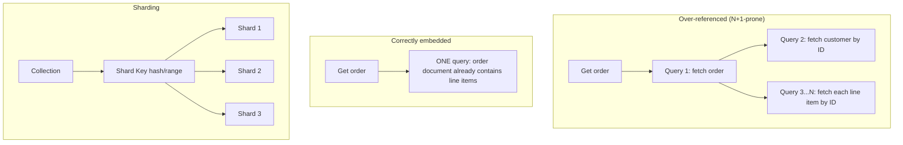

# Module 23 — MongoDB: Data Modeling, Aggregation & Sharding

> Domain: MongoDB | Level: Beginner → Expert | Prerequisite: [[../05-PostgreSQL/01-PostgreSQL-Fundamentals-vs-SQLServer]] §2.5 (JSONB, for contrast), [[../04-SQL-Server/01-Indexing-Query-Execution-Plans]]

---

## 1. Fundamentals

### What is MongoDB, and what makes its data modeling fundamentally different?
MongoDB is a **document database** — data is stored as BSON (binary JSON) documents grouped into collections, with **no enforced schema** and **no native cross-document joins** (until the more limited `$lookup` aggregation stage). The fundamental data-modeling shift from relational databases is: **denormalization is the default, expected design approach**, not an optimization applied reluctantly — related data that would be separate, joined tables in SQL Server/PostgreSQL is frequently **embedded** directly within a single document, because MongoDB has no efficient way to join at read time the way a relational engine does.

### Why does this matter?
Engineers with a relational background instinctively normalize (one entity type per collection, referenced by ID) — this is precisely the wrong default for MongoDB, and reproduces the N+1-query problem (Module 20) at the database level, since MongoDB has no efficient equivalent to a SQL JOIN for correcting it after the fact. The single most important MongoDB data-modeling skill is choosing **embedding vs. referencing** correctly per relationship, based on access patterns, not entity-relationship purity.

### When does this matter?
Any MongoDB schema-design decision; the depth matters for avoiding both over-embedding (documents growing unbounded, hitting the 16MB document-size limit) and over-referencing (reintroducing N+1-style multiple round-trips MongoDB is poorly suited to correct).

### How does it work (30,000-ft view)?
```javascript
// Embedding: order and its line items are frequently read/written TOGETHER, rarely independently
{
  _id: ObjectId("..."),
  customerId: ObjectId("..."),
  lineItems: [
    { sku: "WIDGET-1", qty: 2, price: 9.99 },
    { sku: "GADGET-2", qty: 1, price: 19.99 }
  ],
  total: 39.97
}
```

---

## 2. Deep Dive

### 2.1 Embedding vs Referencing — the Decision Framework
**Embed** when: the related data is always/almost-always accessed *together* with its parent, has a bounded, small cardinality (an order's line items, rarely more than a few dozen), and doesn't need to be independently queried/updated at high frequency by other parts of the system. **Reference** (store an ID, query separately) when: the related data is large/unbounded in cardinality (a customer's entire order history — embedding would make the customer document grow without bound and eventually exceed MongoDB's **16MB document size limit**), is shared/referenced by many different parent documents (denormalizing it into every referencing document would require updating N copies on any change), or is frequently updated independently of its "parent" (embedding would force rewriting the entire parent document for an unrelated child update).

### 2.2 The 16MB Document Size Limit and Unbounded Array Growth
Every BSON document has a hard 16MB size ceiling — a design that embeds an ever-growing array (e.g., embedding every comment ever made on a post, directly inside the post document) will eventually hit this limit as the array grows, a design flaw that only manifests once data volume grows past testing-scale (directly Module 20 §Advanced Q7's "test at representative scale" lesson, recurring here as a MongoDB-specific document-growth concern). The fix is recognizing genuinely unbounded one-to-many relationships as reference candidates from the start, not an embedding pattern to apply reflexively.

### 2.3 The Aggregation Pipeline — MongoDB's Query/Transform Engine
The aggregation pipeline (`db.orders.aggregate([...])`) is a sequence of **stages** (`$match`, `$group`, `$sort`, `$project`, `$lookup`, `$unwind`) each transforming the document stream flowing through it — conceptually similar to a LINQ method chain (Module 5) or a SQL query's logical processing order, but expressed as an explicit pipeline rather than declarative SQL. `$match` should generally appear **as early as possible** in the pipeline (directly analogous to SQL's `WHERE` clause being pushed down for index usage) to reduce the document count flowing into later, more expensive stages — a pipeline with `$match` at the end, after an expensive `$group`/`$lookup`, processes far more documents than necessary.

### 2.4 `$lookup` — MongoDB's Join, and Its Real Limitations
`$lookup` performs a left-outer-join-like operation against another collection — but it's meaningfully more limited and expensive than a relational JOIN: it doesn't leverage the same query-optimizer join-algorithm choices (Module 18 §2.5's nested-loop/merge/hash selection) the way a mature relational optimizer does, and using it heavily/routinely is frequently a signal that the data model itself should have embedded the related data instead, rather than relying on `$lookup` to reconstruct relational-style joins after the fact — `$lookup` exists as an escape hatch for genuinely necessary cross-collection queries, not a green light to model data relationally and join at query time as a matter of course.

### 2.5 Sharding — Horizontal Partitioning and Shard Key Selection
MongoDB's native horizontal scaling mechanism, **sharding**, distributes a collection's documents across multiple shards based on a **shard key** — choosing this key is one of the highest-stakes, hardest-to-reverse decisions in MongoDB schema design: a poorly-chosen shard key (low cardinality, or one causing writes to concentrate on a single shard — a **hot shard**, e.g., a monotonically-increasing timestamp as the shard key, causing all *new* writes to land on whichever shard currently owns the highest key range) can severely limit write scalability despite having "sharded" the data, since sharding's benefit only materializes if writes/reads actually distribute evenly across shards.

## 3. Visual Architecture


## 4. Production Example
**Scenario**: A social-media-style application embedded every comment directly inside its parent "post" document (a natural-seeming choice, since comments are always displayed together with their post) — after a viral post accumulated tens of thousands of comments, writes to that specific post document began failing outright with a document-size-limit error, and reads of that post became measurably slower even before hitting the hard limit (retrieving and deserializing an enormous embedded array for every single post view, even when only the first 20 comments were actually displayed). **Investigation**: confirmed via `db.posts.find({_id: ...}).stats()`-style size inspection that the affected post's document size was approaching the 16MB ceiling almost entirely due to its embedded comments array. **Fix**: migrated comments to a separate `comments` collection referencing `postId`, with a bounded, paginated query (`db.comments.find({postId}).sort({createdAt: -1}).limit(20)`) fetching only the most relevant comments rather than the full, unbounded history embedded in every post read — a schema change requiring a data migration and application-code update, more disruptive than designing it correctly from the start. **Lesson**: an embedding decision that looks reasonable at small/testing scale can become both a hard failure (document-size limit) and a silent performance degradation (unbounded read cost) at production scale — genuinely unbounded one-to-many relationships (comments, activity logs, any "grows forever" collection) should be modeled as references from the outset, not embedded based on "these are always displayed together" reasoning alone without also considering cardinality growth.

## 5. Best Practices
- Choose embedding vs. referencing based on cardinality boundedness and independent-update frequency, not just "these are always read together."
- Place `$match` as early as possible in an aggregation pipeline to minimize documents flowing into later stages.
- Treat heavy reliance on `$lookup` as a signal to reconsider the data model, not a default query pattern.
- Choose a shard key with high cardinality and evenly-distributed write patterns — never a monotonically-increasing value alone.

## 6. Anti-patterns
- Embedding a genuinely unbounded one-to-many relationship (comments, logs, any ever-growing list) directly in a parent document (§4's incident).
- Over-referencing small, bounded, always-together data, reintroducing N+1-style multiple round-trips for data that should simply be embedded.
- Using a monotonically-increasing shard key, concentrating all new writes on a single "hot" shard.
- Relying on `$lookup`-heavy aggregation pipelines as a substitute for correct embedding-based data modeling.

---

## 10. Interview Questions

### Basic (10)
1. **Q: What is a document database?** **A:** A database storing data as flexible, often-nested documents (BSON/JSON) rather than fixed-schema rows in tables.
2. **Q: What is embedding, in MongoDB terms?** **A:** Storing related data directly nested within a parent document rather than in a separate, referenced collection.
3. **Q: What is the aggregation pipeline?** **A:** A sequence of stages (`$match`, `$group`, `$sort`, etc.) transforming a stream of documents, MongoDB's primary query/transformation mechanism.
4. **Q: What does `$lookup` do?** **A:** Performs a left-outer-join-like operation against another collection.
5. **Q: What is the document size limit in MongoDB?** **A:** 16MB per document.
6. **Q: What is sharding?** **A:** Horizontally partitioning a collection's documents across multiple servers based on a shard key.
7. **Q: What is a hot shard?** **A:** A shard receiving a disproportionate share of writes/reads due to a poorly-chosen shard key, limiting horizontal scalability.
8. **Q: Why should `$match` generally appear early in an aggregation pipeline?** **A:** To reduce the number of documents flowing into later, more expensive stages.
9. **Q: Does MongoDB enforce a schema by default?** **A:** No — documents in the same collection can have different shapes/fields.
10. **Q: What's a risk of a monotonically-increasing shard key?** **A:** All new writes land on whichever shard currently owns the highest key range, concentrating write load on one shard.

### Intermediate (10)
1. **Q: Why does relational normalization instinct often produce a poor MongoDB schema?** **A:** MongoDB has no efficient native join the way relational engines do — normalizing into many small, referenced collections reintroduces N+1-style multiple round-trips per read, a pattern MongoDB is poorly equipped to correct after the fact.
2. **Q: When should a one-to-many relationship be referenced rather than embedded?** **A:** When the "many" side is unbounded/large in cardinality (risking the 16MB limit), shared across multiple parents, or frequently updated independently of the parent.
3. **Q: Why is heavy reliance on `$lookup` often a data-modeling smell?** **A:** It suggests the schema was designed relationally rather than around MongoDB's actual access patterns — `$lookup` is meaningfully more limited/expensive than a relational JOIN and works best as an occasional escape hatch, not a routine query pattern.
4. **Q: Why can a document that "always seems small in testing" still hit the 16MB limit in production?** **A:** Testing data volumes rarely reach the scale where an unbounded embedded array (e.g., comments on a viral post) actually grows large enough to matter — the failure only manifests once real production data volume exceeds what was exercised in testing.
5. **Q: Why does read performance degrade even before a document hits the hard 16MB limit, for an unboundedly-growing embedded array?** **A:** Every read of the parent document must retrieve and deserialize the entire embedded array regardless of how much of it is actually used/displayed, so cost grows with the array's size even well before any hard limit is reached.
6. **Q: What's the trade-off of choosing a high-cardinality, randomly-distributed shard key versus a range-based one?** **A:** High-cardinality/random distribution spreads writes evenly (avoiding hot shards) but makes range-based queries (e.g., "all documents from the last hour") inefficient, since matching documents are spread across every shard rather than concentrated in a few — a genuine trade-off depending on whether the workload is write-distribution-sensitive or range-query-sensitive.
7. **Q: Why is choosing a shard key considered one of the hardest-to-reverse decisions in MongoDB schema design?** **A:** Changing a shard key after data is already distributed requires a substantial data-redistribution/migration effort (historically requiring significant re-sharding work, though modern MongoDB versions have improved live-resharding support) — getting it right upfront avoids a costly, disruptive later correction.
8. **Q: Why might a schema-less document database still benefit from application-level schema validation?** **A:** Flexibility at the database layer doesn't mean the application's actual data shape should be arbitrary — inconsistent document shapes across a collection make querying/maintaining the application harder, and MongoDB's optional JSON Schema validation (or application-layer validation) can enforce consistency without giving up flexibility entirely.
9. **Q: What's a realistic scenario where embedding is correct even though the embedded data could theoretically grow large?** **A:** An order's line items are practically bounded (an order realistically has at most a few dozen items) even though there's no *hard* schema-enforced limit — the practical, real-world bound on cardinality (not a schema constraint) is what makes embedding the right choice here, distinct from a truly unbounded relationship like comments on a post.
10. **Q: Why does `$unwind` (deconstructing an embedded array into separate documents, one per array element) matter for aggregation pipelines over embedded data?** **A:** It's often needed to `$group`/aggregate over individual embedded-array elements (e.g., summing quantities across all line items across all orders) — without unwinding, the array remains a single nested value the aggregation stages can't operate on element-by-element.

### Advanced (10)
1. **Q: Diagnose the unbounded-embedded-array production incident (§4) from first principles, and design the schema-review practice preventing recurrence.**
   **A:** Root cause: an embedding decision made based on "always read together" reasoning alone, without separately evaluating cardinality boundedness — the fix requires a **two-factor** embedding decision checklist (access pattern *and* cardinality bound) applied to every one-to-many relationship during schema design, specifically flagging any relationship without a clear, practically-enforced upper bound (comments, logs, activity feeds, any "grows with usage/time" pattern) as a reference candidate by default, requiring explicit justification to embed instead.
2. **Q: Design a schema supporting both efficient "get the 20 most recent comments for a post" and "get comment count for a post" without embedding an unbounded array.**
   **A:** Separate `comments` collection referencing `postId`, indexed on `(postId, createdAt)` for the recent-comments query (an efficient index-supported query, not a full scan); maintain a denormalized `commentCount` field directly on the post document, incremented atomically (`$inc`) on each new comment insert — giving fast access to the count without needing a separate aggregation/count query on every post view, while keeping the actual comment data unboundedly scalable in its own collection; this denormalized-counter pattern is a common, deliberate exception to "don't duplicate data," justified specifically because the count is cheap to keep consistent via atomic increment and expensive to compute on-demand at scale.
3. **Q: Explain how you would choose a shard key for a multi-tenant SaaS platform's largest collection, balancing tenant-query efficiency against write distribution.**
   **A:** A compound shard key of `{tenantId: 1, _id: 1}` (or a hashed variant of `tenantId` combined with a secondary field) lets queries scoped to a single tenant (the overwhelmingly common access pattern for a multi-tenant system) target a narrow shard range efficient for that tenant's data, while `_id`'s inherent randomness (for MongoDB's default ObjectId) as the secondary key component still distributes a single large tenant's own writes across multiple shards, avoiding a scenario where one very large tenant alone becomes a hot shard under a `tenantId`-only key if a hashed shard key isn't used — directly extending Module 21 §Advanced Q2's list-partitioning-by-tenant reasoning to MongoDB's sharding mechanism.
4. **Q: A team wants to use `$lookup` extensively to join a heavily-normalized, relationally-styled MongoDB schema (mirroring a SQL Server schema they migrated from) — evaluate this as a Principal Engineer.**
   **A:** Push back on the underlying assumption: a relationally-normalized schema ported directly from SQL Server without redesigning around MongoDB's actual strengths reproduces exactly the access-pattern mismatch this module's central lesson addresses — `$lookup` can technically make such a schema *functional*, but at meaningfully worse performance and query-optimizer sophistication than either a properly-relational database (which has mature join optimization, Module 18 §2.5) or a properly-embedded MongoDB schema (which avoids needing joins for the common access patterns at all); recommend redesigning the schema around actual MongoDB access patterns (embedding what's read together and bounded) during the migration, rather than porting a relational schema shape and relying on `$lookup` as a permanent crutch.
5. **Q: Explain a scenario where denormalizing (duplicating) data across multiple MongoDB documents creates a consistency-maintenance burden, and how you'd manage it.**
   **A:** If a customer's name is denormalized (copied) into every order document for fast, embedding-friendly display without a join, a customer name change requires updating **every** order document that copied it — for a customer with thousands of historical orders, this is a potentially large, multi-document update operation; mitigate by being deliberate about *which* fields are worth denormalizing (rarely-changing, display-only fields are good candidates; frequently-changing fields are poor ones) and, if the update burden is unavoidable, performing it as an asynchronous background job (accepting brief, bounded staleness in historical documents) rather than a synchronous, blocking multi-document update on every name change.
6. **Q: How would you design a data-migration strategy for fixing an over-embedded schema (§4's incident) on a live, high-traffic collection without extended downtime?**
   **A:** Dual-write during a transition period — new comments are written to *both* the legacy embedded array (temporarily, for backward compatibility with any code not yet migrated) and the new, separate `comments` collection; a background migration job backfills historical embedded comments into the new collection; once backfill completes and all read paths are migrated to query the new collection, stop the dual-write and, in a final step, strip the now-redundant embedded array from existing documents — directly mirroring the "expand, don't break" incremental-migration principle recurring throughout this course (Module 6 §Advanced Q9, Module 11 §12), applied here to a MongoDB schema migration instead of an API/type migration.
7. **Q: Explain why MongoDB's lack of enforced schema can make a "silent data-shape drift" bug harder to detect than an equivalent relational-database schema-mismatch, which would typically fail loudly.**
   **A:** A relational database rejects an INSERT/UPDATE violating a column's type or NOT NULL constraint immediately, at write time — MongoDB, with no schema enforcement by default, will happily accept a document with a missing field, an unexpectedly-typed field, or an extra field with no error at all, meaning a subtle application bug producing malformed documents can persist silently for a long time before manifesting as a confusing read-side bug (a null-reference-style error when code assumes a field is always present) far from the actual write that introduced the inconsistency — mitigated by application-level or MongoDB's optional JSON Schema validation catching shape violations at write time instead.
8. **Q: Design an aggregation pipeline computing each customer's total lifetime order value, optimizing stage order for performance.**
   **A:**
   ```javascript
   db.orders.aggregate([
     { $match: { status: "completed" } },       // filter FIRST -- reduces documents before grouping
     { $group: { _id: "$customerId", total: { $sum: "$total" } } },
     { $sort: { total: -1 } }
   ]);
   ```
   Placing `$match` before `$group` (rather than filtering post-aggregation) ensures the (likely much smaller) filtered subset, not the entire orders collection, is what actually gets grouped — directly Advanced Q on `$match` placement, made concrete.
9. **Q: Explain how you would detect, in code review, whether a proposed MongoDB schema change risks reintroducing the unbounded-embedding failure mode (§4), beyond just "does it look like it could grow large."**
   **A:** Require an explicit answer, for every new embedded array field, to: "what is the practical maximum cardinality of this array, and is that bound enforced by the domain (a business rule, like 'an order can have at most 100 line items') or merely assumed/hoped for (like 'posts probably won't get *that* many comments')?" — any embedded array without a domain-enforced practical bound should default to a referenced, separate-collection design instead, converting an easy-to-overlook judgment call into an explicit, answerable design-review question.
10. **Q: As a Principal Engineer, how would you build organizational MongoDB data-modeling capability, given how counter-intuitive "denormalize by default" is for relationally-trained engineers?**
    **A:** Require explicit embedding-vs-referencing justification (Advanced Q9's question) as a standard section of any new MongoDB schema's design-review documentation; maintain a small, shared internal reference/style guide with concrete, memorable examples (this module's order/line-items-embed vs. post/comments-reference contrast) specifically because the counter-intuitive nature of the "denormalize by default" principle means relationally-trained engineers benefit from explicit, contrasting examples more than an abstract rule statement alone; treat this module's production incident (§4) as a standing, citable case study in onboarding material for exactly this reason.

---

## 11. Coding Exercises

### Easy — Correctly embed a bounded, always-together relationship
```javascript
// Order line items: bounded cardinality (a realistic order has few dozen items at most),
// always read/written together with the order -- correct to embed.
db.orders.insertOne({
  customerId: ObjectId("..."),
  lineItems: [
    { sku: "WIDGET-1", qty: 2, price: 9.99 },
    { sku: "GADGET-2", qty: 1, price: 19.99 }
  ],
  total: 39.97
});
```

### Medium — Fix an unbounded embedding with a referenced collection + denormalized counter (Advanced Q2)
```javascript
// posts collection: NO embedded comments array
db.posts.insertOne({ _id: ObjectId("..."), title: "...", body: "...", commentCount: 0 });

// comments collection: separate, unboundedly scalable
db.comments.createIndex({ postId: 1, createdAt: -1 });
db.comments.insertOne({ postId: ObjectId("..."), author: "...", text: "...", createdAt: new Date() });
db.posts.updateOne({ _id: postId }, { $inc: { commentCount: 1 } }); // atomic denormalized counter update

// Fetching the 20 most recent comments (bounded, index-supported query):
db.comments.find({ postId }).sort({ createdAt: -1 }).limit(20);
```

### Hard — Aggregation pipeline with `$match` correctly placed early
```javascript
db.orders.aggregate([
  { $match: { orderDate: { $gte: ISODate("2024-01-01") }, status: "completed" } }, // FIRST: filter early
  { $unwind: "$lineItems" },
  { $group: { _id: "$lineItems.sku", totalQty: { $sum: "$lineItems.qty" }, revenue: { $sum: { $multiply: ["$lineItems.qty", "$lineItems.price"] } } } },
  { $sort: { revenue: -1 } },
  { $limit: 10 }
]);
```

### Expert — Compound shard key for a multi-tenant collection (Advanced Q3)
```javascript
sh.shardCollection("app.orders", { tenantId: "hashed" });
// Hashed tenantId distributes tenants evenly across shards, avoiding a large single tenant
// concentrating writes on one shard, while queries scoped to ONE tenant (the common access
// pattern) still target a single shard efficiently since hashing is deterministic per tenantId.
```
**Discussion**: Using `"hashed"` on `tenantId` alone (rather than a compound range key) is the right choice specifically when per-tenant query scoping is the dominant access pattern and there's no need for cross-tenant range queries — if range queries across tenants by a secondary field were also common, a compound key balancing both needs (as discussed in Advanced Q3) would be the more nuanced choice, illustrating that shard-key design, like embedding-vs-referencing, is fundamentally driven by actual query/access patterns, not a one-size-fits-all rule.

---

## 12–17. System Design / LLD / Debugging / Decision / Case Study / Principal

A social platform (§4) redesigns its schema around bounded-vs-unbounded relationship analysis (Advanced Q9's design-review question) as standard practice, using the referenced-collection-plus-denormalized-counter pattern (Medium exercise) for genuinely unbounded relationships, and a hashed compound shard key (Expert exercise) for its multi-tenant collections. The signature production incident (§4) — an embedded comments array hitting the 16MB document limit on a viral post — is this module's central lesson: MongoDB's "denormalize by default" philosophy requires an explicit cardinality-boundedness check alongside the "read together" access-pattern check, not either alone. Principal-level guidance: build organizational capability specifically countering relationally-trained engineers' normalization instinct, since MongoDB's correct default design philosophy is genuinely counter-intuitive relative to that background, requiring explicit, memorable contrasting examples rather than an abstract rule statement alone.

## 18. Revision
**Key takeaways**: Embed when data is bounded, always-read-together, and not independently updated at high frequency; reference when unbounded, shared across parents, or frequently independently updated. The 16MB document limit and read-cost-scaling-with-embedded-size are both real, production-demonstrated risks of over-embedding. `$match` early in an aggregation pipeline minimizes downstream document volume, exactly mirroring SQL predicate pushdown. `$lookup` is an escape hatch, not a default query pattern — heavy reliance signals a relationally-styled schema mismatched to MongoDB's actual strengths. Shard key selection (high cardinality, evenly-distributed writes, aligned to actual query patterns) is one of the hardest-to-reverse MongoDB design decisions.

---

**Next**: Continuing autonomously to Module 24 — MongoDB Consistency, Replica Sets & Transactions (completing the `06-MongoDB` domain) before advancing to `07-Redis`.
