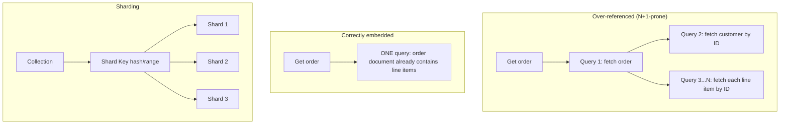
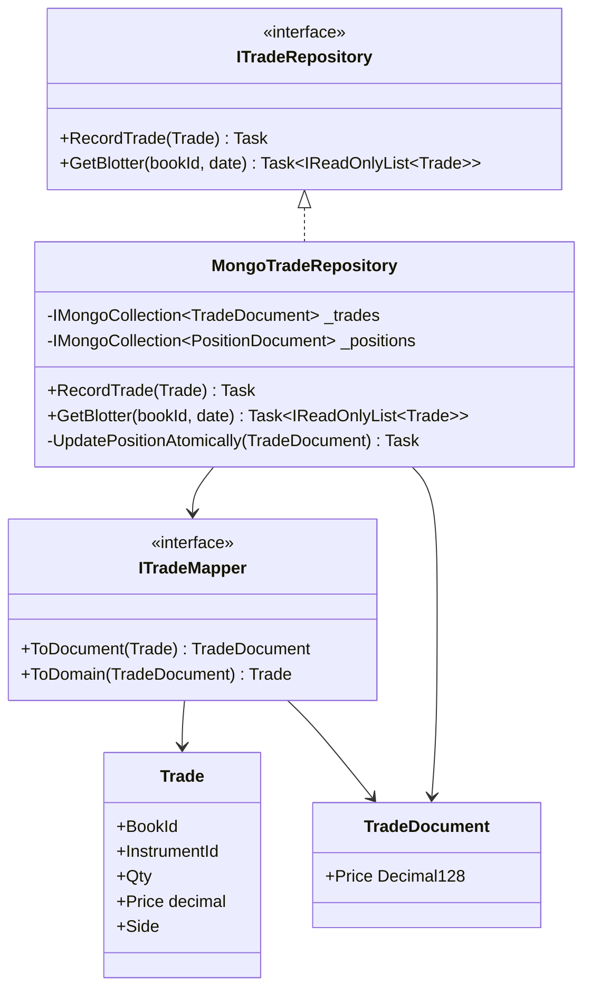
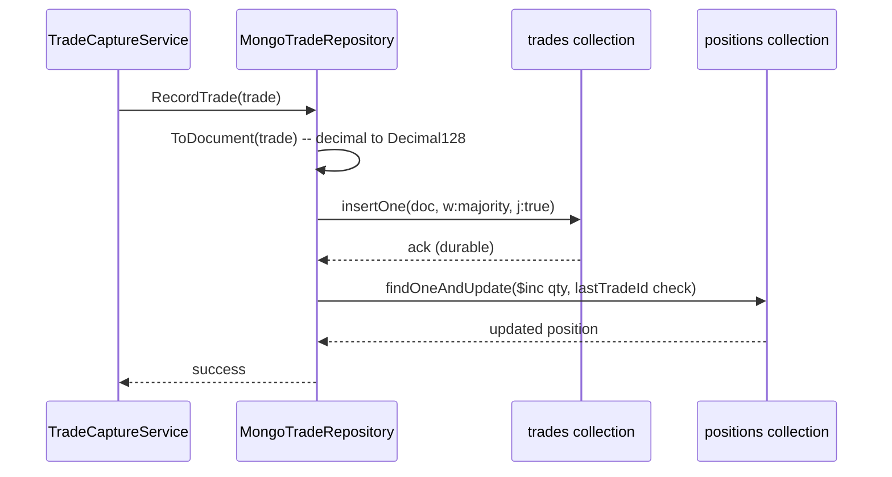

# Module 23 — MongoDB: Data Modeling, Aggregation & Sharding

> Domain: MongoDB | Level: Beginner → Expert | Prerequisite: [[../05-PostgreSQL/01-PostgreSQL-Fundamentals-vs-SQLServer]] (JSONB, for contrast), [[../04-SQL-Server/01-Indexing-Query-Execution-Plans]]

---

## 1. Topic Description

### Definition

MongoDB data modelling is the practice of shaping documents around **access patterns** rather than around normalised entities. A document is a BSON tree stored contiguously, so data read together should generally live together; the central design decision is **embed versus reference**, governed by cardinality, update frequency, atomicity requirements and the 16 MB document limit. Query patterns are the other half: the query planner selects an index and caches a winning plan per query *shape*, so index design, document shape and the queries you intend to run are one design problem, not three. Modelling a MongoDB collection like a relational table and then adding indexes to compensate is the most common and most expensive mistake.

### Core sub-concepts

- **Document model and BSON** — contiguous storage, field order, type fidelity, and the 16 MB document ceiling.
- **Embed versus reference** — one-to-few embedded, one-to-many referenced, one-to-squillions never embedded; the extended-reference and subset patterns.
- **Denormalisation and duplication** — deliberately copying fields to avoid a second query, and owning the update path that keeps copies consistent.
- **The unbounded array anti-pattern** — arrays that grow without limit, document rewrites, and the bucket pattern as the remedy.
- **Schema design patterns** — bucket, subset, computed, outlier, attribute, polymorphic, schema-versioning.
- **Indexes** — single-field, compound, multikey (arrays), text, geospatial, wildcard, hashed, partial, sparse, TTL, unique.
- **The ESR rule** — compound index key order as Equality, Sort, Range, and why violating it forces an in-memory sort.
- **Covered queries** — satisfying a query entirely from an index with no document fetch, and what projection is required.
- **Query planner and plan cache** — candidate plan racing, the winning plan cached per query shape, and plan eviction.
- **`explain()`** — `executionStats`, `totalKeysExamined` versus `totalDocsExamined` versus `nReturned` as the efficiency ratio.
- **Aggregation pipeline** — stage order, `$match`/`$project` pushdown, `$lookup` cost, `allowDiskUse`, and the 100 MB per-stage memory limit.
- **Working set and cache** — WiredTiger cache sizing, and why "index fits in RAM" is the operative constraint.
- **Atomicity granularity** — single-document atomicity as the default design unit; when a design needs a multi-document transaction and why that is a signal.
- **Schema validation** — JSON Schema validators, validation levels and actions, and schema versioning for evolution.
- **Write patterns** — bulk writes, upserts, `$inc`/`$push` operators versus read-modify-write.
- **Cardinality and selectivity** — indexing low-cardinality fields, and index prefixes shared across compound indexes.

### Where it fits

Data modelling sits between the application's domain model and the storage engine, and it is where MongoDB's design philosophy diverges most sharply from relational thinking: there is no query optimiser that will rescue a shape mismatched to its access patterns, because there are no joins to reorder. It depends downward on WiredTiger's storage and cache behaviour, and on the index structures the planner has available. Upward it determines API response shapes, the feasibility of the aggregation pipelines that serve reporting, and — critically — the shard key options available later, since a shard key must be supported by the document shape you have already committed to.

### Why it matters at scale

The failure mode is a cliff rather than a slope. A collection modelled relationally requires application-side joins or `$lookup`, so a single page render becomes dozens of round trips that degrade in proportion to data volume. An unbounded array means every append rewrites an ever-growing document and every index on it is a multikey index over ever-more entries, so write latency climbs until documents approach 16 MB and then writes fail outright. And once the working set — the frequently-accessed documents plus their indexes — exceeds the WiredTiger cache, the system falls off a performance cliff into disk reads, which is why "it was fine until we hit 200 GB" is such a common story. All three are modelling decisions that are extremely expensive to reverse once terabytes exist.

### Common pitfalls / anti-patterns

- **Modelling normalised tables as collections and joining in the application** — produces N+1 round trips MongoDB has no optimiser to collapse, and gets worse in proportion to data volume.
- **Unbounded arrays inside a document** (comments, events, readings appended forever) — each append rewrites a growing document, multikey indexes bloat, and writes eventually fail at the 16 MB limit.
- **Indexing every field "just in case"** — every index is maintained on every write, consumes cache that the working set needs, and low-cardinality indexes (a boolean status, a two-value type) provide almost no selectivity while charging full write cost.
- **Compound index key order that ignores ESR** — putting a range field before a sort field makes the index unusable for the sort, forcing an in-memory sort that fails past the memory limit.
- **Using multi-document transactions to compensate for a modelling mistake** — they exist and work, but they carry real cost and their frequent use signals that data updated together should have been in one document.
- **Reading a document, modifying it in the application, and writing it back** — loses concurrent updates and transfers the whole document twice, where an atomic update operator would have been correct and cheap.
- **`$lookup` used as a general-purpose join** — it is not optimised like a relational join; on large collections without a supporting index it is the usual cause of an aggregation that never completes.
- **Ignoring the working-set-versus-cache relationship** — capacity planning based on total data size rather than on the hot subset plus indexes, so the cliff arrives unannounced.

---

## 2. Beginner (10 Q&A)

**Q1. What is the actual decision rule for embedding versus referencing?**
**A:** Embed when the data is read together, bounded in size, and owned by the parent — a handful of addresses on a customer. Reference when the child is large, unbounded, shared between parents, or updated on a different cadence than the parent. The cardinality shorthand is one-to-few embed, one-to-many reference, one-to-squillions always reference with the relationship held on the child. The overriding constraint is the 16 MB document limit: anything that can grow without bound cannot be embedded, regardless of how convenient it would be.
*Follow-up: A product has a few hundred reviews. Embed, reference, or something else?*

**Q2. Why is the 16 MB document limit a design constraint rather than a technicality?**
**A:** Because it forces you to decide, at modelling time, what is bounded. A design that embeds a growing collection works perfectly in development and fails in production for your most active entities — the biggest customer, the busiest device — which is precisely the worst subset to fail on. Long before the hard limit, growing documents are already expensive: updates rewrite the document and indexes on its arrays grow with it. So the limit is really a forcing function to identify unbounded relationships early.
*Follow-up: What's the bucket pattern, and how does it change the arithmetic?*

**Q3. Explain the ESR rule for compound indexes.**
**A:** Order compound index keys as **E**quality fields first, then **S**ort fields, then **R**ange fields. Equality narrows the scan to a contiguous region; within that region the index is already ordered by the next key, which is what allows a sort to be satisfied by the index rather than in memory; a range must come last because everything after a range key is no longer in a usable order. Getting this wrong is the most common index design error, and the symptom is an in-memory sort that works on small data and fails past the memory limit on large data.
*Follow-up: Your query filters on status equality, sorts by date, and ranges on amount. What's the index?*

**Q4. What is a covered query?**
**A:** One that can be answered entirely from an index, with no document fetch — every field in the filter, the sort and the projection is present in the index, and `_id` is explicitly excluded unless it is in the index. It is dramatically cheaper because the documents themselves never leave disk or cache. In `explain` you see `totalDocsExamined: 0`, which is the signature to look for. It is the single most effective optimisation for a high-frequency query returning a small projection.
*Follow-up: Why does a covered query break if the index is multikey?*

**Q5. What does `explain("executionStats")` tell you that matters most?**
**A:** The relationship between `nReturned`, `totalKeysExamined` and `totalDocsExamined`. Ideally all three are similar; keys examined far exceeding documents returned means the index is not selective enough for the query, and documents examined far exceeding returned means the query is fetching and discarding — either no usable index, or an index that filters partially. `totalDocsExamined` of zero means a covered query. Everything else in the output is secondary to that ratio.
*Follow-up: `nReturned` is 10, `totalKeysExamined` is 500,000, `totalDocsExamined` is 0. What's happening?*

**Q6. What is a multikey index and what does it cost?**
**A:** An index on an array field: MongoDB creates one index entry per array element, so a document with fifty tags contributes fifty index entries. That is what makes array queries fast, and it is also why arrays that grow without bound inflate the index far faster than the collection. There are restrictions too — you cannot have a compound index with more than one array field, and multikey indexes cannot cover a query on the array field. Knowing that arrays multiply index size is what stops an innocuous-looking `$push` becoming an index problem.
*Follow-up: What happens if you try to create a compound index across two array fields?*

**Q7. What is the query plan cache and how does it cause surprises?**
**A:** For a new query *shape*, MongoDB races candidate plans over a trial period, picks a winner, and caches it for subsequent queries of that shape. That means the plan is chosen based on whatever data distribution existed at that moment, so a plan selected during an unrepresentative period persists. It is evicted on index changes, restarts, or when performance degrades enough to trigger re-planning. The practical consequence is the same as parameter sniffing in a relational engine: identical queries can behave differently depending on what ran first.
*Follow-up: How would you force a re-evaluation without restarting the server?*

**Q8. Why is single-document atomicity central to MongoDB modelling?**
**A:** Because a write to one document is atomic regardless of how many fields or nested elements it touches, without any transaction machinery. That makes "what must change together" the primary question when choosing document boundaries: if two pieces of state must be consistent, the cheapest correct design usually puts them in the same document. Multi-document transactions exist and work, but they add cost and coordination — so frequent need for them is a signal that the document boundaries are drawn in the wrong place.
*Follow-up: An order and its inventory reservation must be consistent. How would you model that?*

**Q9. When is `$lookup` appropriate?**
**A:** For occasional enrichment of a small result set against a well-indexed foreign collection — the last stage of a pipeline that has already filtered aggressively. It is not a general-purpose join: it executes per input document, and without an index on the foreign field it is effectively a nested loop over a full collection. If a query pattern needs `$lookup` constantly and on large inputs, that is evidence the data should have been embedded or denormalised. The design question is whether the join is incidental or fundamental to the access pattern.
*Follow-up: How does `$lookup` behave differently if the foreign field isn't indexed?*

**Q10. What is a partial index and when is it better than a sparse one?**
**A:** A partial index indexes only documents matching a filter expression, so it is smaller, cheaper to maintain and more likely to stay in cache — ideal when queries always target a subset, such as active records in a mostly-archived collection. A sparse index only skips documents missing the field, which is a much blunter and less expressive version of the same idea. Partial indexes supersede sparse ones for nearly all new work; the catch is that the query must be provably covered by the filter for the planner to use the index.
*Follow-up: Your partial index isn't being used by a query you expected it to serve. What's the likely reason?*

---

## 3. Intermediate (10 Q&A)

**Q1. A collection has grown to 500 GB and read latency has jumped sharply with no code change. Diagnose it.**
**A:** The first hypothesis is that the working set — hot documents plus the indexes serving them — has outgrown the WiredTiger cache, so reads that were served from memory now hit disk. That produces a step change rather than a gradual slope, which matches the symptom. I would compare cache hit statistics and eviction rates against the growth curve, and check index sizes specifically, since indexes often grow faster than data when arrays are involved. The remedies in order are removing unused indexes, making indexes smaller with partial or narrower keys, improving selectivity so fewer documents are touched, and only then adding memory or sharding.
*Follow-up: You find 14 indexes on the collection and 4 are unused. What do you do, and how confident are you they're really unused?*

**Q2. How do you decide when to denormalise, and how do you keep copies consistent?**
**A:** Denormalise when a field is read far more often than it changes and the alternative is a second query on every read — a product name on an order line is the canonical case. The obligation you take on is the update path: you now own a fan-out write whenever the source changes, and you must decide whether it is synchronous, asynchronous with eventual consistency, or explicitly never updated because the copy is a point-in-time record. That last case is important and often the right answer — the price on an order should *not* follow the product's current price, so what looks like denormalisation is actually correct historical modelling.
*Follow-up: The source field changes and 2 million copies need updating. How do you execute that?*

**Q3. How would you model time-series or event data?**
**A:** With the bucket pattern, or with a native time-series collection where available: group many readings into one document keyed by device and time window, holding an array of measurements plus precomputed aggregates. That collapses document count by orders of magnitude, keeps index size proportional to buckets rather than readings, and makes range queries read few documents. The design parameters are the bucket span and a maximum element count so buckets stay bounded, which is exactly the discipline the unbounded-array anti-pattern lacks. I would also store computed summaries in the bucket, since recomputing them on read is the cost this pattern exists to avoid.
*Follow-up: How do you handle a late-arriving reading for a bucket that's already closed?*

**Q4. How do you decide which indexes to keep on a busy collection?**
**A:** From usage statistics over a full business cycle, not a week — monthly and quarterly reporting queries are exactly the ones that look unused. I would look for indexes with zero or near-zero usage and for redundancy where one index's keys are a prefix of another's, since the shorter one is usually removable. The counterweight is write cost and cache footprint: every index is maintained on every write and competes for the cache the working set needs. I would drop with a hide-first step so the change is instantly reversible, and verify the plan cache does not immediately produce worse plans.
*Follow-up: Hiding an index shows no impact for a week, then a month-end job times out. What's your process to prevent that?*

**Q5. Aggregation pipeline stage order — what actually matters?**
**A:** Filter and reduce as early as possible, because every subsequent stage processes whatever survives: `$match` first so an index can be used and rows are eliminated before any transformation, then `$project` to drop fields you do not need, and only then the expensive stages. Once a stage transforms documents in a way the planner cannot see through, index use for later `$match` stages is lost — which is why a `$match` after a `$group` scans everything the group produced. Each stage also has a memory limit, so pushing work later is how you end up needing `allowDiskUse` for a pipeline that should never have needed it.
*Follow-up: A pipeline needs `allowDiskUse` to complete. Is that acceptable, or a design smell?*

**Q6. When are multi-document transactions the right tool, and what do they cost?**
**A:** They are right when an invariant genuinely spans entities that should not be one document — a transfer between two accounts is the honest example. The costs are real: they hold resources for their duration, they have a default time limit, they interact with the oplog and replication, and under contention they produce write conflicts the application must retry. Because they were added later, the ecosystem and the performance model both assume they are exceptional. My rule is to reach for them when the modelling alternative is worse, and to treat their frequent use as evidence to revisit document boundaries.
*Follow-up: Your transaction is aborting with write conflicts under load. What are your options?*

**Q7. How would you evolve a schema across millions of existing documents?**
**A:** With a schema-version field and code that reads both shapes, so old and new documents coexist and no big-bang migration is needed — that is the pattern that makes schema flexibility an asset rather than a liability. Then migrate lazily on write, or with a background batch job at a controlled rate, and only remove the old-shape handling once telemetry confirms no documents remain. I would add a JSON Schema validator at the point new writes must conform, with a validation level that permits existing documents to remain, so the boundary is enforced going forward without breaking reads.
*Follow-up: How would you know, with confidence, that zero documents remain on the old shape?*

**Q8. What's the risk of using schema flexibility as a design strategy?**
**A:** That the schema still exists, it just moves into every consumer. Without validation, one service writes `status: "ACTIVE"` and another writes `state: 1`, and the reconciliation burden lands on everyone reading the collection forever. Flexibility is genuinely valuable for polymorphic entities and for evolution without downtime, but it is not an argument against defining the shape. I would use JSON Schema validators to enforce the intended contract, treat the validator as the schema documentation, and reserve genuine flexibility for the fields that are legitimately variable.
*Follow-up: You inherit a collection with three inconsistent shapes and no validator. What's your first step?*

**Q9. How do you detect and fix an application-side N+1 against MongoDB?**
**A:** Instrument queries per request — a count is far more revealing than any individual query's duration — and look for request handlers issuing a query per item in a loop. The fixes in order of preference are: change the model so the data is embedded or denormalised and no second query exists; batch the lookups into a single `$in` query; or use `$lookup` if the join is genuinely occasional. What I would resist is treating it purely as a performance bug, because a persistent N+1 usually means the document boundaries do not match the access pattern, and batching only hides that.
*Follow-up: You batch 500 IDs into an `$in` query. What limits should you be aware of?*

**Q10. How do you plan capacity for a MongoDB deployment?**
**A:** Around the working set rather than the total data size: the frequently-accessed documents plus the indexes serving them should fit in the WiredTiger cache, because the performance profile either side of that boundary is completely different. I would measure index total size directly, estimate the hot document fraction from access patterns, and monitor cache eviction and disk read rates as the leading indicators. Total data size matters for storage cost and backup windows but is a poor predictor of latency. The reason this matters commercially is that the cliff arrives suddenly, so capacity planning based on the wrong metric gives no warning.
*Follow-up: Indexes alone are 80 GB on a 64 GB cache machine. What do you change first?*

---

## 4. Expert / Architect (10 Q&A)

**Q1. How do you approach data modelling when access patterns are not fully known yet?**
**A:** Identify the ones that are certain and highly-trafficked, model for those, and keep the uncertain parts referenced rather than embedded — because a reference can be denormalised later, while an embedded unbounded relationship is very expensive to unwind at terabyte scale. I would also insist on schema versioning from the start, so evolution is a normal operation rather than a migration project. The honest framing for stakeholders is that MongoDB trades query-time flexibility for design-time commitment: you get performance by deciding early, so an unwillingness to decide is itself a reason to reconsider the store.
*Follow-up: Six months in, a major new access pattern appears that the model doesn't serve. How do you evaluate the options?*

**Q2. How does the data model constrain your sharding options later?**
**A:** Decisively, which is why it belongs in the initial design conversation even for an unsharded deployment. A shard key must exist in the documents, be present in the queries you need to route, and have high cardinality with even distribution — so a model without a suitable candidate field forces either a compound or hashed key with worse locality, or a schema change across the whole dataset at exactly the point you are already under scale pressure. I would identify the plausible shard key at design time and validate that the dominant queries include it, even if sharding is years away.
*Follow-up: Your natural shard key is tenant ID and one tenant is 40% of the data. What do you do?*

**Q3. How do you govern index proliferation across teams sharing a database?**
**A:** Treat indexes as shared infrastructure with a review path and an owner, because the cost of an index falls on every writer while the benefit accrues to one query. Concretely: index changes reviewed like schema changes, periodic reporting on usage and redundancy, a visible per-collection budget for total index size against cache, and hidden-then-dropped as the safe removal procedure. The organisational failure I would design against is each team adding indexes for their own queries with nobody accountable for the aggregate write path — the outcome is a collection with twenty indexes where nobody can say which are load-bearing.
*Follow-up: How would you present the cost of an index to a team that only sees its query getting faster?*

**Q4. When would you conclude MongoDB is the wrong store for a workload?**
**A:** When the access patterns are genuinely ad hoc and relational — many-to-many relationships traversed in unpredictable directions, or reporting that joins several entities in ways nobody enumerated up front — because that is exactly what a relational optimiser exists for and what document modelling cannot anticipate. Also when strong multi-entity transactional invariants dominate the domain, since designing around single-document atomicity then fights the model constantly. I would frame it as a fit question rather than a quality one, and be specific: "our top ten queries each join four entities differently" is an argument; "MongoDB doesn't scale" is not.
*Follow-up: Migrating is off the table. How do you make the existing model work?*

**Q5. How do you handle reporting and analytics against an operational MongoDB deployment?**
**A:** Separate the workloads, because analytical scans evict the operational working set from cache and that is a shared, invisible cost — the operational latency degrades and nobody connects it to the report. The options are analytics-tagged secondary nodes, a separate analytics cluster fed by change streams, or export into a purpose-built store. I would choose based on freshness requirements, interrogating them properly since "real time" usually means minutes when examined. What I would not do is add indexes to the operational collections purely to serve reporting, since those are paid for on every write forever.
*Follow-up: The analytics team wants ad hoc access to production. What do you offer instead?*

**Q6. What's your approach to change streams as an integration mechanism?**
**A:** They are a good fit for reacting to data changes — cache invalidation, search index updates, downstream notification — and they are resumable via a resume token, which is the property that makes them operationally usable. The architectural caution is identical to database CDC generally: consumers become coupled to your document shape, so a modelling change becomes a breaking change across the estate. I prefer change streams over a deliberately-designed outbox collection rather than over domain collections directly, which keeps the decoupling while making the published contract explicit and owned.
*Follow-up: Your consumer is down long enough that its resume token is past the oplog window. What happens and how do you recover?*

**Q7. How do you approach multi-tenancy in MongoDB?**
**A:** A tenant field on every document with it as the leading component of most indexes is the default, because it colocates a tenant's data and makes the tenant predicate index-supported. Enforcement must not depend on developers remembering the filter, so it belongs in a data-access layer that cannot be bypassed, ideally reinforced by per-tenant credentials or field-level controls where the platform supports them. Database-per-tenant gives stronger isolation and worse operational scaling past a few hundred tenants. As with any multi-tenant store, the largest tenants eventually need their own deployment, and I would set a size threshold for that in advance rather than discovering it during an incident.
*Follow-up: How would you test that cross-tenant access is impossible, rather than merely unlikely?*

**Q8. How would you migrate a badly-modelled collection at terabyte scale with the system live?**
**A:** Dual-write into the new shape while continuing to serve reads from the old, backfill historically in controlled batches with rate limiting so the migration does not evict the working set, then switch reads once verification passes and remove the old path. Verification is the part that must be designed up front — a reconciliation comparing counts and sampled documents between shapes, running continuously during the migration. I would keep the rollback available until well after cutover, and expect the timeline to be dominated by the backfill's rate limit rather than by the code changes.
*Follow-up: Halfway through the backfill, the working set is being evicted and production latency is degrading. What do you change?*

**Q9. How do you build modelling competence in a team coming from relational databases?**
**A:** Make the difference concrete rather than philosophical: the exercise that works is taking one real screen or endpoint and asking how many round trips each model requires, which makes the access-pattern-first principle self-evident. Beyond that, a small set of reviewed reference models in the codebase, a design review for new collections focused on cardinality and growth, and a standing check that every new collection can answer "what is unbounded here and how is it bounded". The most valuable single habit is requiring the access patterns to be written down before the schema, because relational instincts otherwise produce normalised collections by default.
*Follow-up: A team insists on normalising because "denormalisation causes inconsistency". How do you engage with that?*

**Q10. What distinguishes an excellent answer from an adequate one when someone designs a MongoDB schema in an interview?**
**A:** An adequate answer produces a plausible document structure. An excellent one starts by enumerating access patterns and their relative frequency, states what is bounded and what is not, chooses embedding or referencing per relationship with an explicit reason, names the indexes those patterns require and checks them against ESR, identifies the atomicity boundary, and says what the design forecloses — including the shard key implication. It also names the thing it is unsure about and how it would validate it. The distinguishing quality is treating the schema as a set of trade-offs made against known workloads rather than as a translation of an entity diagram.
*Follow-up: Given that framing, what would you ask the interviewer before designing anything?*

---

## 5. Reference Material

> Retained from the original module: deep-dive internals, diagrams, production examples, exercises, system/low-level design, debugging walkthroughs and the Principal Engineer perspective.

### 1. Fundamentals

#### What is MongoDB, and what makes its data modeling fundamentally different?
MongoDB is a **document database** — data is stored as BSON (binary JSON) documents grouped into collections, with **no enforced schema** and **no native cross-document joins** (until the more limited `$lookup` aggregation stage). The fundamental data-modeling shift from relational databases is: **denormalization is the default, expected design approach**, not an optimization applied reluctantly — related data that would be separate, joined tables in SQL Server/PostgreSQL is frequently **embedded** directly within a single document, because MongoDB has no efficient way to join at read time the way a relational engine does.

#### Why does this matter?
Engineers with a relational background instinctively normalize (one entity type per collection, referenced by ID) — this is precisely the wrong default for MongoDB, and reproduces the N+1-query problem at the database level, since MongoDB has no efficient equivalent to a SQL JOIN for correcting it after the fact. The single most important MongoDB data-modeling skill is choosing **embedding vs. referencing** correctly per relationship, based on access patterns, not entity-relationship purity.

#### When does this matter?
Any MongoDB schema-design decision; the depth matters for avoiding both over-embedding (documents growing unbounded, hitting the 16MB document-size limit) and over-referencing (reintroducing N+1-style multiple round-trips MongoDB is poorly suited to correct).

#### How does it work (30,000-ft view)?
```javascript
// Embedding: order and its line items are frequently read/written TOGETHER, rarely independently
{
  _id: ObjectId("..."),
    customerId: ObjectId("..."),
    lineItems: [
    { sku: "WIDGET-1", qty: 2, price: 9.99 },
    { sku: "GADGET-2", qty: 1, price: 19.99 }
  ],
  total: 39.97
}
```

### 2. Deep Dive

#### 2.1 Embedding vs Referencing — the Decision Framework
**Embed** when: the related data is always/almost-always accessed *together* with its parent, has a bounded, small cardinality (an order's line items, rarely more than a few dozen), and doesn't need to be independently queried/updated at high frequency by other parts of the system. **Reference** (store an ID, query separately) when: the related data is large/unbounded in cardinality (a customer's entire order history — embedding would make the customer document grow without bound and eventually exceed MongoDB's **16MB document size limit**), is shared/referenced by many different parent documents (denormalizing it into every referencing document would require updating N copies on any change), or is frequently updated independently of its "parent" (embedding would force rewriting the entire parent document for an unrelated child update).

#### 2.2 The 16MB Document Size Limit and Unbounded Array Growth
Every BSON document has a hard 16MB size ceiling — a design that embeds an ever-growing array (e.g., embedding every comment ever made on a post, directly inside the post document) will eventually hit this limit as the array grows, a design flaw that only manifests once data volume grows past testing-scale (directly §Advanced Q7's "test at representative scale" lesson, recurring here as a MongoDB-specific document-growth concern). The fix is recognizing genuinely unbounded one-to-many relationships as reference candidates from the start, not an embedding pattern to apply reflexively.

#### 2.3 The Aggregation Pipeline — MongoDB's Query/Transform Engine
The aggregation pipeline (`db.orders.aggregate([...])`) is a sequence of **stages** (`$match`, `$group`, `$sort`, `$project`, `$lookup`, `$unwind`) each transforming the document stream flowing through it — conceptually similar to a LINQ method chain or a SQL query's logical processing order, but expressed as an explicit pipeline rather than declarative SQL. `$match` should generally appear **as early as possible** in the pipeline (directly analogous to SQL's `WHERE` clause being pushed down for index usage) to reduce the document count flowing into later, more expensive stages — a pipeline with `$match` at the end, after an expensive `$group`/`$lookup`, processes far more documents than necessary.

#### 2.4 `$lookup` — MongoDB's Join, and Its Real Limitations
`$lookup` performs a left-outer-join-like operation against another collection — but it's meaningfully more limited and expensive than a relational JOIN: it doesn't leverage the same query-optimizer join-algorithm choices (the nested-loop/merge/hash selection) the way a mature relational optimizer does, and using it heavily/routinely is frequently a signal that the data model itself should have embedded the related data instead, rather than relying on `$lookup` to reconstruct relational-style joins after the fact — `$lookup` exists as an escape hatch for genuinely necessary cross-collection queries, not a green light to model data relationally and join at query time as a matter of course.

#### 2.5 Sharding — Horizontal Partitioning and Shard Key Selection
MongoDB's native horizontal scaling mechanism, **sharding**, distributes a collection's documents across multiple shards based on a **shard key** — choosing this key is one of the highest-stakes, hardest-to-reverse decisions in MongoDB schema design: a poorly-chosen shard key (low cardinality, or one causing writes to concentrate on a single shard — a **hot shard**, e.g., a monotonically-increasing timestamp as the shard key, causing all *new* writes to land on whichever shard currently owns the highest key range) can severely limit write scalability despite having "sharded" the data, since sharding's benefit only materializes if writes/reads actually distribute evenly across shards.

### 3. Visual Architecture

```mermaid
graph TB
 subgraph "Over-referenced (N+1-prone)"
 A[Get order] --> B[Query 1: fetch order]
 B --> C[Query 2: fetch customer by ID]
 B --> D[Query 3...N: fetch each line item by ID]
 end
 subgraph "Correctly embedded"
 E[Get order] --> F[ONE query: order document already contains line items]
 end
 subgraph "Sharding"
 G[Collection] --> H[Shard Key hash/range]
 H --> S1[Shard 1]
 H --> S2[Shard 2]
 H --> S3[Shard 3]
 end
```

### 4. Production Example
**Scenario**: A social-media-style application embedded every comment directly inside its parent "post" document (a natural-seeming choice, since comments are always displayed together with their post) — after a viral post accumulated tens of thousands of comments, writes to that specific post document began failing outright with a document-size-limit error, and reads of that post became measurably slower even before hitting the hard limit (retrieving and deserializing an enormous embedded array for every single post view, even when only the first 20 comments were actually displayed). **Investigation**: confirmed via `db.posts.find({_id:...}).stats`-style size inspection that the affected post's document size was approaching the 16MB ceiling almost entirely due to its embedded comments array. **Fix**: migrated comments to a separate `comments` collection referencing `postId`, with a bounded, paginated query (`db.comments.find({postId}).sort({createdAt: -1}).limit(20)`) fetching only the most relevant comments rather than the full, unbounded history embedded in every post read — a schema change requiring a data migration and application-code update, more disruptive than designing it correctly from the start. **Lesson**: an embedding decision that looks reasonable at small/testing scale can become both a hard failure (document-size limit) and a silent performance degradation (unbounded read cost) at production scale — genuinely unbounded one-to-many relationships (comments, activity logs, any "grows forever" collection) should be modeled as references from the outset, not embedded based on "these are always displayed together" reasoning alone without also considering cardinality growth.

### 11. Coding Exercises

#### Easy — Correctly embed a bounded, always-together relationship
```javascript
// Order line items: bounded cardinality (a realistic order has few dozen items at most)
// always read/written together with the order -- correct to embed.
db.orders.insertOne({
    customerId: ObjectId("..."),
      lineItems: [
      { sku: "WIDGET-1", qty: 2, price: 9.99 },
      { sku: "GADGET-2", qty: 1, price: 19.99 }
    ],
    total: 39.97
});
```

#### Medium — Fix an unbounded embedding with a referenced collection + denormalized counter (Advanced Q2)
```javascript
// posts collection: NO embedded comments array
db.posts.insertOne({ _id: ObjectId("..."), title: "...", body: "...", commentCount: 0 });

// comments collection: separate, unboundedly scalable
db.comments.createIndex({ postId: 1, createdAt: -1 });
db.comments.insertOne({ postId: ObjectId("..."), author: "...", text: "...", createdAt: new Date });
db.posts.updateOne({ _id: postId }, { $inc: { commentCount: 1 } }); // atomic denormalized counter update

// Fetching the 20 most recent comments (bounded, index-supported query):
db.comments.find({ postId }).sort({ createdAt: -1 }).limit(20);
```

#### Hard — Aggregation pipeline with `$match` correctly placed early
```javascript
db.orders.aggregate([
    { $match: { orderDate: { $gte: ISODate("2024-01-01") }, status: "completed" } }, // FIRST: filter early
    { $unwind: "$lineItems" },
    { $group: { _id: "$lineItems.sku", totalQty: { $sum: "$lineItems.qty" }, revenue: { $sum: { $multiply: ["$lineItems.qty", "$lineItems.price"] } } } },
    { $sort: { revenue: -1 } },
    { $limit: 10 }
]);
```

#### Expert — Compound shard key for a multi-tenant collection (Advanced Q3)
```javascript
sh.shardCollection("app.orders", { tenantId: "hashed" });
// Hashed tenantId distributes tenants evenly across shards, avoiding a large single tenant
// concentrating writes on one shard, while queries scoped to ONE tenant (the common access
// pattern) still target a single shard efficiently since hashing is deterministic per tenantId.
```
**Discussion**: Using `"hashed"` on `tenantId` alone (rather than a compound range key) is the right choice specifically when per-tenant query scoping is the dominant access pattern and there's no need for cross-tenant range queries — if range queries across tenants by a secondary field were also common, a compound key balancing both needs (as discussed in Advanced Q3) would be the more nuanced choice, illustrating that shard-key design, like embedding-vs-referencing, is fundamentally driven by actual query/access patterns, not a one-size-fits-all rule.

### 12. System Design

**Scenario: design the trade-blotter / position-store service for a multi-asset trading desk** — the system every trader-facing UI, risk engine, and end-of-day reconciliation job reads from, holding the desk's current and historical positions, with MongoDB as the primary data store.

**Requirements.**
- *Functional:* record every executed trade; maintain a current-position view per instrument per book; support "position as of any point in time" queries for risk/compliance; support a trader-facing "my blotter" view (today's trades, fast, low-latency); support end-of-day batch reconciliation against the exchange/clearing feed.
- *Non-functional:* p99 read latency under 50ms for the trader blotter view; durability such that an acknowledged trade write is never lost (financially-critical — directly Module 24's write-concern lesson); horizontal write scalability to absorb bursty market-open/close trade volume; auditability (every position change traceable to the trade that caused it); multi-region DR.

**Architecture and components.** A `trades` collection (append-only, one document per executed trade — never updated after settlement, only superseded by a correction trade referencing the original) is the system of record for individual executions. A `positions` collection holds one document per (book, instrument) — the current, aggregated view — updated via an atomic `$inc` on trade insertion (directly Module 23 §Advanced Q2's denormalized-counter pattern, generalized from a comment count to a running position). A `positionSnapshots` collection, written once per end-of-day batch close, gives "position as of date X" without needing to replay every trade from inception for every historical query. The trader-facing blotter view queries `trades` filtered to the current trading day (an indexed, bounded, fast query) rather than the full historical `trades` collection.

**Database/schema selection.** `trades`: `{ _id, bookId, instrumentId, qty, price: Decimal128, side, executedAt, tradeDate, correctionOf: ObjectId|null }`, indexed on `{ bookId: 1, tradeDate: -1 }` (ESR-ordered, §7) for the blotter query and `{ instrumentId: 1, tradeDate: -1 }` for instrument-level views. `positions`: `{ _id: {bookId, instrumentId}, qty, avgPrice: Decimal128, lastTradeId, updatedAt }`, updated via `findOneAndUpdate` with `$inc` — single-document atomicity (Module 24 §2.3) means no explicit transaction is needed for this update alone. Money fields are `Decimal128` throughout (Expert Q1) — never `double`.

**Caching.** The trader blotter view (today's trades for a given book) is a strong Redis-cache-in-front-of-MongoDB candidate — high read volume, narrow write-invalidation surface (invalidate the specific book's cache entry on every new trade to that book), and low staleness tolerance is satisfied by cache invalidation being trivially tied to the write path.

**Messaging.** Trade execution events are published (via change streams, §2.5, or an outbox pattern feeding Kafka) to downstream consumers — risk engines needing near-real-time position updates, and the end-of-day reconciliation pipeline — decoupling the trade-capture write path from every downstream consumer's own latency/availability characteristics.

**Scaling.** `trades` is sharded on `{ bookId: "hashed" }` (or a compound `{ tradeDate: 1, bookId: "hashed" }` if date-range reporting queries are also frequent) to distribute both the append-heavy write load and the blotter-query read load across shards, avoiding both a hot shard and a monotonic-shard-key mistake (§2.5) despite `tradeDate` being a naturally time-increasing field.

**Failure handling.** Trade writes use `{ w: "majority", j: true }` (Module 24) — an acknowledged trade must never be lost, since "the trade executed but the system has no record of it" is a direct P&L/compliance risk. Position-update failures (the `$inc` on `positions`) are retried with the trade's own ID as an idempotency key check (has this trade already been applied to this position?) to prevent double-counting on retry.

**Monitoring.** Aggregation-pipeline latency on the blotter and reconciliation queries (§7); replication lag on the `positions`-serving secondaries; `$lookup`/`COLLSCAN` alerts on the query profiler for any query touching `trades` that isn't index-supported; end-of-day reconciliation break count as a correctness signal, not just a batch-completion signal.

**Trade-offs.** Denormalizing `positions` as a maintained running total (rather than always computing it live via aggregation over `trades`) trades update complexity (every trade write must correctly update the position) for read speed (the blotter and risk-engine reads never need to aggregate potentially millions of historical trade documents) — the same *deliberate, justified* denormalization trade-off this module's Advanced Q2/Q5 establish, applied to the module's own signature production system.

### 13. Low-Level Design

**Requirements.** A repository layer for the trade-blotter service (§12) that (a) enforces the embedding/referencing decisions made in §12's schema, (b) makes the `Decimal128`-for-money and majority-write-concern choices structural, not something every call site must remember, and (c) is unit-testable without a live MongoDB instance for the business-logic layer.


```mermaid
classDiagram
 class ITradeRepository {
 <<interface>>
 +RecordTrade(Trade) Task
 +GetBlotter(bookId, date) Task~IReadOnlyList~Trade~~
 }
 class MongoTradeRepository {
 -IMongoCollection~TradeDocument~ _trades
 -IMongoCollection~PositionDocument~ _positions
 +RecordTrade(Trade) Task
 +GetBlotter(bookId, date) Task~IReadOnlyList~Trade~~
 -UpdatePositionAtomically(TradeDocument) Task
 }
 class Trade {
 +BookId
 +InstrumentId
 +Qty
 +Price decimal
 +Side
 }
 class TradeDocument {
 +Price Decimal128
 }
 class ITradeMapper {
 <<interface>>
 +ToDocument(Trade) TradeDocument
 +ToDomain(TradeDocument) Trade
 }
 ITradeRepository <|.. MongoTradeRepository
 MongoTradeRepository --> ITradeMapper
 MongoTradeRepository --> TradeDocument
 ITradeMapper --> Trade
 ITradeMapper --> TradeDocument
```

**Sequence diagram — recording a trade (write-concern and position-update path).**

```mermaid
sequenceDiagram
 participant Svc as TradeCaptureService
 participant Repo as MongoTradeRepository
 participant Trades as trades collection
 participant Pos as positions collection

 Svc->>Repo: RecordTrade(trade)
 Repo->>Repo: ToDocument(trade) -- decimal to Decimal128
 Repo->>Trades: insertOne(doc, w:majority, j:true)
 Trades-->>Repo: ack (durable)
 Repo->>Pos: findOneAndUpdate($inc qty, lastTradeId check)
 Pos-->>Repo: updated position
 Repo-->>Svc: success
```

**Design patterns used.** **Repository pattern** (`ITradeRepository`) isolates domain code from the MongoDB driver entirely — the domain layer's unit tests mock `ITradeRepository` and never touch a real/in-memory Mongo instance. **Mapper/Adapter pattern** (`ITradeMapper`) is the single, structurally-enforced place `decimal` ↔ `Decimal128` conversion happens — Expert Q1's money-type discipline becomes a code-structure guarantee, not a convention every call site must remember. **Unit of Work** (implicit in `RecordTrade`'s single method encapsulating both the trade insert and the position update) keeps the two related writes' sequencing and error handling in one place rather than scattered across callers.

**SOLID mapping.** *SRP*: `MongoTradeRepository` owns persistence only; `ITradeMapper` owns type conversion only — a money-type bug is isolated to one class. *OCP*: a new persistence target (e.g., adding a secondary write to a Kafka outbox) extends `MongoTradeRepository` or wraps it via decorator, without modifying `ITradeRepository`'s callers. *LSP*: any `ITradeRepository` implementation (a real Mongo one, or a test in-memory fake) is substitutable by callers with no behavioral surprise, provided the fake honors the same durability contract at the interface level (documented, not silently weakened). *ISP*: `ITradeRepository` exposes only the two operations the domain layer actually needs, not the full MongoDB driver surface. *DIP*: `TradeCaptureService` depends on `ITradeRepository`, an abstraction — swapping the concrete Mongo implementation for a test double requires no change to business logic.

**Concurrency/thread safety.** `MongoCollection<T>` instances are thread-safe and designed for concurrent reuse (backed by the driver's own connection pool) — the repository should be registered as a singleton/scoped-per-request, not re-instantiated per call. The position-update `findOneAndUpdate` with `$inc` is atomic at the document level (Module 24 §2.3) — concurrent trades against the same book/instrument correctly accumulate without a lost update, with no explicit locking required, since MongoDB serializes concurrent writes to the same document internally.

### 14. Production Debugging

**Incident:** The end-of-day reconciliation job — an aggregation pipeline joining `trades` against a `settlementInstructions` reference collection via `$lookup`, grouping by book, and summing settled quantities — began missing its overnight batch window as trade volume grew, eventually timing out outright and blocking the next trading day's opening reconciliation report, a direct operational and compliance risk (late/missing reconciliation is itself a control failure in a regulated trading environment).

**Root cause:** Two compounding issues, both directly this module's own mechanics. First, the `$lookup` stage's foreign key (`settlementInstructions.counterpartyId`) had never been indexed — every input document from `trades` triggered an effective collection scan of `settlementInstructions`, and this cost, tolerable at low trade volume, grew linearly with `trades` volume as the desk's business grew. Second, the pipeline's `$match` filtering to the current trading day was placed **after** the `$lookup` and `$group` stages (a copy-paste-evolved pipeline where filtering had been added late, appended rather than moved to the front) — directly contradicting §2.3's "match early" principle, meaning the expensive join ran against the *entire* historical `trades` collection, not just the day's trades, on every single run.

**Investigation:** `db.trades.aggregate([...]).explain("executionStats")` showed the `$lookup` stage's `totalDocsExamined` in the tens of millions against a `settlementInstructions` collection with only a few thousand documents — the tell-tale unindexed-join signature from §7. The pipeline's stage order, visible directly in the aggregation source, confirmed `$match` was the fourth stage, not the first.

**Tools:** `explain("executionStats")` per stage; the MongoDB **database profiler** (`db.setProfilingLevel(1, { slowms: 1000 })`) to capture the actual production-run timing breakdown per stage over several nights, confirming the `$lookup` stage alone accounted for over 90% of total pipeline runtime.

**Fix:** Added `db.settlementInstructions.createIndex({ counterpartyId: 1 })`, and reordered the pipeline to place `$match: { tradeDate: today }` as the first stage — reducing the `$lookup`'s input volume from the full historical collection to a single day's trades before the join even ran. Combined, pipeline runtime dropped from a multi-hour timeout to under two minutes.

**Prevention:** Added a CI/staging check running `explain("executionStats")` against every production aggregation pipeline on a representative-scale seeded dataset, failing the build if any stage's `totalDocsExamined`-to-`nReturned` ratio exceeds a threshold, or if `$match` isn't among the first stages of a pipeline that includes a filterable predicate — converting the "match early, index your `$lookup` keys" principle from a design-review reminder (easy to forget under deadline pressure, exactly how this pipeline evolved) into an automated, code-path-independent gate, directly mirroring §8's "database-enforced, not just disciplined" control philosophy applied here to query performance rather than data integrity.

### 15. Architecture Decision

**Context:** Choosing how to store and query the multi-leg FX trade structure from §Expert Q7, now as a concrete architecture decision with options compared.

| Option | Advantages | Disadvantages | Cost | Complexity | Maintainability | Scalability |
|---|---|---|---|---|---|---|
| **A. Fully embedded legs array** | Single-document read for "get trade with all legs" (no join); single-document atomicity for any all-legs-together update; simplest schema | Multikey index required for cross-trade leg queries; index size scales with total leg count firm-wide; risks §2.2's growth pattern if leg count assumptions ever prove wrong | Low (no extra collection/infra) | Low | Good, if leg count stays genuinely bounded | Good for per-trade access; weaker for firm-wide cross-trade leg reporting at very high volume |
| **B. Fully referenced separate `legs` collection** | Efficient, independently-indexed cross-trade leg queries (the firm-wide "all pending legs" dashboard); no document-growth risk at all | Every "get trade with legs" read requires a `$lookup` or a second query; loses single-document atomicity for all-legs-together updates (needs a multi-document transaction, Module 24 §2.3, for genuinely atomic multi-leg operations) | Higher (extra collection, extra query per trade-detail view) | Medium (transaction handling for cross-leg atomicity) | Good | Best for high-volume, independent cross-trade leg querying |
| **C. Hybrid — embedded legs plus a denormalized `legs` reporting collection, kept in sync at write time** | Fast per-trade reads (embedded) AND fast cross-trade leg queries (denormalized collection) without either query type needing a join | Two writes per leg-status change (must stay consistent); a version of §2's "duplicated data consistency-maintenance burden" (Advanced Q5) | Highest (dual-write infra, consistency monitoring) | Highest | Requires disciplined dual-write code path, ideally enforced via the repository pattern (§13) so no call site can update one without the other | Best of both, at the cost of the sync burden |

**Recommendation:** **Option A (embedded)** for this specific case, per Expert Q7's analysis — FX trade leg count is genuinely small and bounded, and (per the review question established there) the firm's actual cross-trade leg-query volume/frequency, as scoped for this desk, doesn't yet justify Option B's transactional and query complexity, nor Option C's dual-write consistency burden. Explicitly revisit if the settlement-operations team's firm-wide "all pending legs" dashboard usage grows into a genuinely high-frequency, latency-sensitive access pattern — at which point Option C's hybrid becomes justified, with the dual-write enforced structurally through the repository layer (§13) rather than left to caller discipline, directly applying §8's code-path-independent-control principle to a consistency problem rather than a security one.

### 17. Principal Engineer Perspective

**Business impact.** A schema-design decision in a trading system is not a purely technical choice — an over-embedded `trades`/`positions` design that later requires the incremental-migration rework described in §Advanced Q6 costs real engineering weeks during which the team is not shipping new desk-facing capability, and a reconciliation pipeline outage (§14) directly delays the next trading day's compliance sign-off, a business-visible, not merely technical, consequence.

**Engineering trade-offs.** The recurring theme across this module — embed for bounded, together-accessed data; reference for unbounded or independently-queried data; denormalize deliberately, with an explicit update-propagation plan — is, at the Principal level, a judgment call requiring an honest, current answer to "what will this data's access pattern and growth actually look like in eighteen months," not just today's requirements; the viral-post incident (§4) is precisely a case where that horizon wasn't considered.

**Technical leadership and cross-team communication.** A trading-system schema decision touches risk, compliance, and settlement-operations teams who are consumers of the data, not just the engineering team producing it — the shard-key and zone-sharding decisions (§9, Expert Q3) have direct data-residency/regulatory implications that must be reviewed *with* compliance, not decided unilaterally by engineering and presented as a fait accompli.

**Architecture governance.** The design-review checklist established across this module (§Advanced Q9's cardinality-boundedness question, §Expert Q4's independent-lifecycle question) should be a **standing, mandatory section of schema design-review documentation** for any new MongoDB collection touching trade or position data — converting hard-won incident lessons into a repeatable governance artifact rather than tribal knowledge that fades as the team that lived through the incident rotates off.

**Cost optimization.** Shard count and instance sizing (§9) should be planned against projected working-set growth, not current data volume alone — under-provisioning risks the WiredTiger cache cliff (§7) degrading production; over-provisioning wastes infrastructure spend that a Principal Engineer is expected to defend in a budget review with concrete capacity-planning numbers, not intuition.

**Risk analysis.** The single highest-risk MongoDB decision in this domain is shard-key selection (§2.5) precisely because it is the hardest to reverse — a Principal Engineer's review of any new sharded collection should explicitly interrogate the shard key's cardinality, write-distribution behavior, and alignment with the dominant query pattern *before* the collection accumulates production data, since post-hoc correction is a multi-week, high-risk migration rather than a code review comment.

**Long-term maintainability.** Denormalization decisions (positions as a maintained running total, counterparty fields snapshotted onto settlement records) trade a one-time design cost for an ongoing consistency-maintenance obligation — documenting *which* fields are denormalized, *why*, and *what keeps them in sync* (the repository-layer enforcement from §13) is what prevents a future engineer from "fixing" an apparent data-duplication smell in a way that silently reintroduces the `$lookup`-heavy performance problem this module spends its Deep Dive and Expert tier warning against.

### 18. Revision
**Key takeaways**: Embed when data is bounded, always-read-together, and not independently updated at high frequency; reference when unbounded, shared across parents, or frequently independently updated. The 16MB document limit and read-cost-scaling-with-embedded-size are both real, production-demonstrated risks of over-embedding. `$match` early in an aggregation pipeline minimizes downstream document volume, exactly mirroring SQL predicate pushdown. `$lookup` is an escape hatch, not a default query pattern — heavy reliance signals a relationally-styled schema mismatched to MongoDB's actual strengths. Shard key selection (high cardinality, evenly-distributed writes, aligned to actual query patterns) is one of the hardest-to-reverse MongoDB design decisions.

---

**Next**: Continuing autonomously to Module 24 — MongoDB Consistency, Replica Sets & Transactions (completing the `06-MongoDB` domain) before advancing to `07-Redis`.
