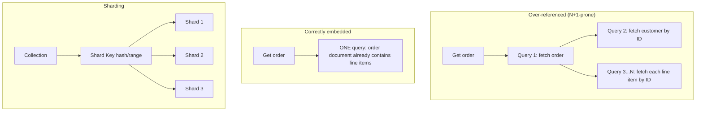
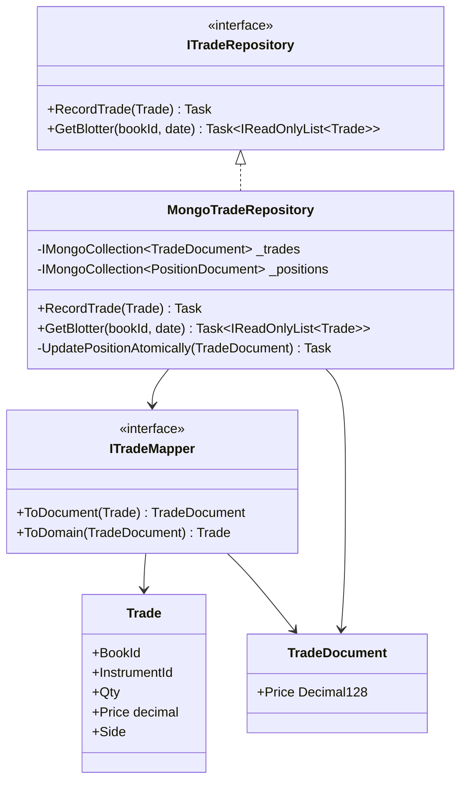
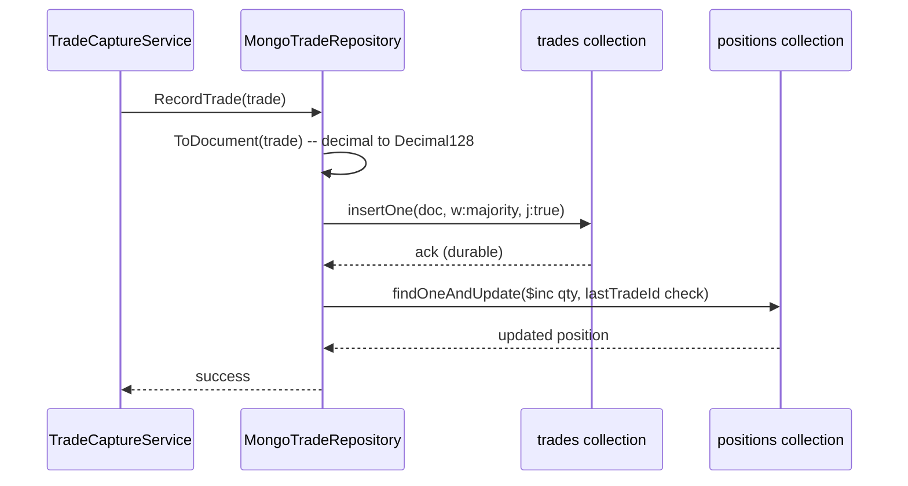

# Module 23 — MongoDB: Data Modeling, Aggregation & Sharding

> Domain: MongoDB | Level: Beginner → Expert | Prerequisite: [[../05-PostgreSQL/01-PostgreSQL-Fundamentals-vs-SQLServer]] (JSONB, for contrast), [[../04-SQL-Server/01-Indexing-Query-Execution-Plans]]

---

## 1. Fundamentals

### What is MongoDB, and what makes its data modeling fundamentally different?
MongoDB is a **document database** — data is stored as BSON (binary JSON) documents grouped into collections, with **no enforced schema** and **no native cross-document joins** (until the more limited `$lookup` aggregation stage). The fundamental data-modeling shift from relational databases is: **denormalization is the default, expected design approach**, not an optimization applied reluctantly — related data that would be separate, joined tables in SQL Server/PostgreSQL is frequently **embedded** directly within a single document, because MongoDB has no efficient way to join at read time the way a relational engine does.

### Why does this matter?
Engineers with a relational background instinctively normalize (one entity type per collection, referenced by ID) — this is precisely the wrong default for MongoDB, and reproduces the N+1-query problem at the database level, since MongoDB has no efficient equivalent to a SQL JOIN for correcting it after the fact. The single most important MongoDB data-modeling skill is choosing **embedding vs. referencing** correctly per relationship, based on access patterns, not entity-relationship purity.

### When does this matter?
Any MongoDB schema-design decision; the depth matters for avoiding both over-embedding (documents growing unbounded, hitting the 16MB document-size limit) and over-referencing (reintroducing N+1-style multiple round-trips MongoDB is poorly suited to correct).

### How does it work (30,000-ft view)?
```javascript
// Embedding: order and its line items are frequently read/written TOGETHER, rarely independently
{
  _id: ObjectId("..."),
    customerId: ObjectId("..."),
    lineItems: [
    { sku: "WIDGET-1", qty: 2, price: 9.99 },
    { sku: "GADGET-2", qty: 1, price: 19.99 }
  ],
  total: 39.97
}
```

---

## 2. Deep Dive

### 2.1 Embedding vs Referencing — the Decision Framework
**Embed** when: the related data is always/almost-always accessed *together* with its parent, has a bounded, small cardinality (an order's line items, rarely more than a few dozen), and doesn't need to be independently queried/updated at high frequency by other parts of the system. **Reference** (store an ID, query separately) when: the related data is large/unbounded in cardinality (a customer's entire order history — embedding would make the customer document grow without bound and eventually exceed MongoDB's **16MB document size limit**), is shared/referenced by many different parent documents (denormalizing it into every referencing document would require updating N copies on any change), or is frequently updated independently of its "parent" (embedding would force rewriting the entire parent document for an unrelated child update).

### 2.2 The 16MB Document Size Limit and Unbounded Array Growth
Every BSON document has a hard 16MB size ceiling — a design that embeds an ever-growing array (e.g., embedding every comment ever made on a post, directly inside the post document) will eventually hit this limit as the array grows, a design flaw that only manifests once data volume grows past testing-scale (directly §Advanced Q7's "test at representative scale" lesson, recurring here as a MongoDB-specific document-growth concern). The fix is recognizing genuinely unbounded one-to-many relationships as reference candidates from the start, not an embedding pattern to apply reflexively.

### 2.3 The Aggregation Pipeline — MongoDB's Query/Transform Engine
The aggregation pipeline (`db.orders.aggregate([...])`) is a sequence of **stages** (`$match`, `$group`, `$sort`, `$project`, `$lookup`, `$unwind`) each transforming the document stream flowing through it — conceptually similar to a LINQ method chain or a SQL query's logical processing order, but expressed as an explicit pipeline rather than declarative SQL. `$match` should generally appear **as early as possible** in the pipeline (directly analogous to SQL's `WHERE` clause being pushed down for index usage) to reduce the document count flowing into later, more expensive stages — a pipeline with `$match` at the end, after an expensive `$group`/`$lookup`, processes far more documents than necessary.

### 2.4 `$lookup` — MongoDB's Join, and Its Real Limitations
`$lookup` performs a left-outer-join-like operation against another collection — but it's meaningfully more limited and expensive than a relational JOIN: it doesn't leverage the same query-optimizer join-algorithm choices (the nested-loop/merge/hash selection) the way a mature relational optimizer does, and using it heavily/routinely is frequently a signal that the data model itself should have embedded the related data instead, rather than relying on `$lookup` to reconstruct relational-style joins after the fact — `$lookup` exists as an escape hatch for genuinely necessary cross-collection queries, not a green light to model data relationally and join at query time as a matter of course.

### 2.5 Sharding — Horizontal Partitioning and Shard Key Selection
MongoDB's native horizontal scaling mechanism, **sharding**, distributes a collection's documents across multiple shards based on a **shard key** — choosing this key is one of the highest-stakes, hardest-to-reverse decisions in MongoDB schema design: a poorly-chosen shard key (low cardinality, or one causing writes to concentrate on a single shard — a **hot shard**, e.g., a monotonically-increasing timestamp as the shard key, causing all *new* writes to land on whichever shard currently owns the highest key range) can severely limit write scalability despite having "sharded" the data, since sharding's benefit only materializes if writes/reads actually distribute evenly across shards.

## 3. Visual Architecture

```mermaid
graph TB
 subgraph "Over-referenced (N+1-prone)"
 A[Get order] --> B[Query 1: fetch order]
 B --> C[Query 2: fetch customer by ID]
 B --> D[Query 3...N: fetch each line item by ID]
 end
 subgraph "Correctly embedded"
 E[Get order] --> F[ONE query: order document already contains line items]
 end
 subgraph "Sharding"
 G[Collection] --> H[Shard Key hash/range]
 H --> S1[Shard 1]
 H --> S2[Shard 2]
 H --> S3[Shard 3]
 end
```

## 4. Production Example
**Scenario**: A social-media-style application embedded every comment directly inside its parent "post" document (a natural-seeming choice, since comments are always displayed together with their post) — after a viral post accumulated tens of thousands of comments, writes to that specific post document began failing outright with a document-size-limit error, and reads of that post became measurably slower even before hitting the hard limit (retrieving and deserializing an enormous embedded array for every single post view, even when only the first 20 comments were actually displayed). **Investigation**: confirmed via `db.posts.find({_id:...}).stats`-style size inspection that the affected post's document size was approaching the 16MB ceiling almost entirely due to its embedded comments array. **Fix**: migrated comments to a separate `comments` collection referencing `postId`, with a bounded, paginated query (`db.comments.find({postId}).sort({createdAt: -1}).limit(20)`) fetching only the most relevant comments rather than the full, unbounded history embedded in every post read — a schema change requiring a data migration and application-code update, more disruptive than designing it correctly from the start. **Lesson**: an embedding decision that looks reasonable at small/testing scale can become both a hard failure (document-size limit) and a silent performance degradation (unbounded read cost) at production scale — genuinely unbounded one-to-many relationships (comments, activity logs, any "grows forever" collection) should be modeled as references from the outset, not embedded based on "these are always displayed together" reasoning alone without also considering cardinality growth.
## 10. Interview Questions

### Basic (10)
1. **Q: What is a document database?** **A:** A database storing data as flexible, often-nested documents (BSON/JSON) rather than fixed-schema rows in tables.
2. **Q: What is embedding, in MongoDB terms?** **A:** Storing related data directly nested within a parent document rather than in a separate, referenced collection.
3. **Q: What is the aggregation pipeline?** **A:** A sequence of stages (`$match`, `$group`, `$sort`, etc.) transforming a stream of documents, MongoDB's primary query/transformation mechanism.
4. **Q: What does `$lookup` do?** **A:** Performs a left-outer-join-like operation against another collection.
5. **Q: What is the document size limit in MongoDB?** **A:** 16MB per document — a hard limit that makes unbounded embedded arrays (comments, events appended forever) a data-modeling time bomb; growing collections belong in their own collection referenced by parent ID, or bucketed.
6. **Q: What is sharding?** **A:** Horizontally partitioning a collection's documents across multiple servers based on a shard key.
7. **Q: What is a hot shard?** **A:** A shard receiving a disproportionate share of writes/reads due to a poorly-chosen shard key, limiting horizontal scalability.
8. **Q: Why should `$match` generally appear early in an aggregation pipeline?** **A:** To reduce the number of documents flowing into later, more expensive stages.
9. **Q: Does MongoDB enforce a schema by default?** **A:** No — documents in the same collection can have different shapes/fields.
10. **Q: What's a risk of a monotonically-increasing shard key?** **A:** All new writes land on whichever shard currently owns the highest key range, concentrating write load on one shard.

### Intermediate (10)
1. **Q: Why does relational normalization instinct often produce a poor MongoDB schema?** **A:** MongoDB has no efficient native join the way relational engines do — normalizing into many small, referenced collections reintroduces N+1-style multiple round-trips per read, a pattern MongoDB is poorly equipped to correct after the fact.
2. **Q: When should a one-to-many relationship be referenced rather than embedded?** **A:** When the "many" side is unbounded/large in cardinality (risking the 16MB limit), shared across multiple parents, or frequently updated independently of the parent.
3. **Q: Why is heavy reliance on `$lookup` often a data-modeling smell?** **A:** It suggests the schema was designed relationally rather than around MongoDB's actual access patterns — `$lookup` is meaningfully more limited/expensive than a relational JOIN and works best as an occasional escape hatch, not a routine query pattern.
4. **Q: Why can a document that "always seems small in testing" still hit the 16MB limit in production?** **A:** Testing data volumes rarely reach the scale where an unbounded embedded array (e.g., comments on a viral post) actually grows large enough to matter — the failure only manifests once real production data volume exceeds what was exercised in testing.
5. **Q: Why does read performance degrade even before a document hits the hard 16MB limit, for an unboundedly-growing embedded array?** **A:** Every read of the parent document must retrieve and deserialize the entire embedded array regardless of how much of it is actually used/displayed, so cost grows with the array's size even well before any hard limit is reached.
6. **Q: What's the trade-off of choosing a high-cardinality, randomly-distributed shard key versus a range-based one?** **A:** High-cardinality/random distribution spreads writes evenly (avoiding hot shards) but makes range-based queries (e.g., "all documents from the last hour") inefficient, since matching documents are spread across every shard rather than concentrated in a few — a genuine trade-off depending on whether the workload is write-distribution-sensitive or range-query-sensitive.
7. **Q: Why is choosing a shard key considered one of the hardest-to-reverse decisions in MongoDB schema design?** **A:** Changing a shard key after data is already distributed requires a substantial data-redistribution/migration effort (historically requiring significant re-sharding work, though modern MongoDB versions have improved live-resharding support) — getting it right upfront avoids a costly, disruptive later correction.
8. **Q: Why might a schema-less document database still benefit from application-level schema validation?** **A:** Flexibility at the database layer doesn't mean the application's actual data shape should be arbitrary — inconsistent document shapes across a collection make querying/maintaining the application harder, and MongoDB's optional JSON Schema validation (or application-layer validation) can enforce consistency without giving up flexibility entirely.
9. **Q: What's a realistic scenario where embedding is correct even though the embedded data could theoretically grow large?** **A:** An order's line items are practically bounded (an order realistically has at most a few dozen items) even though there's no *hard* schema-enforced limit — the practical, real-world bound on cardinality (not a schema constraint) is what makes embedding the right choice here, distinct from a truly unbounded relationship like comments on a post.
10. **Q: Why does `$unwind` (deconstructing an embedded array into separate documents, one per array element) matter for aggregation pipelines over embedded data?** **A:** It's often needed to `$group`/aggregate over individual embedded-array elements (e.g., summing quantities across all line items across all orders) — without unwinding, the array remains a single nested value the aggregation stages can't operate on element-by-element.

### Advanced (10)
1. **Q: Diagnose the unbounded-embedded-array production incident from first principles, and design the schema-review practice preventing recurrence.**
 **A:** Root cause: an embedding decision made based on "always read together" reasoning alone, without separately evaluating cardinality boundedness — the fix requires a **two-factor** embedding decision checklist (access pattern *and* cardinality bound) applied to every one-to-many relationship during schema design, specifically flagging any relationship without a clear, practically-enforced upper bound (comments, logs, activity feeds, any "grows with usage/time" pattern) as a reference candidate by default, requiring explicit justification to embed instead.
2. **Q: Design a schema supporting both efficient "get the 20 most recent comments for a post" and "get comment count for a post" without embedding an unbounded array.**
 **A:** Separate `comments` collection referencing `postId`, indexed on `(postId, createdAt)` for the recent-comments query (an efficient index-supported query, not a full scan); maintain a denormalized `commentCount` field directly on the post document, incremented atomically (`$inc`) on each new comment insert — giving fast access to the count without needing a separate aggregation/count query on every post view, while keeping the actual comment data unboundedly scalable in its own collection; this denormalized-counter pattern is a common, deliberate exception to "don't duplicate data," justified specifically because the count is cheap to keep consistent via atomic increment and expensive to compute on-demand at scale.
3. **Q: Explain how you would choose a shard key for a multi-tenant SaaS platform's largest collection, balancing tenant-query efficiency against write distribution.**
 **A:** A compound shard key of `{tenantId: 1, _id: 1}` (or a hashed variant of `tenantId` combined with a secondary field) lets queries scoped to a single tenant (the overwhelmingly common access pattern for a multi-tenant system) target a narrow shard range efficient for that tenant's data, while `_id`'s inherent randomness (for MongoDB's default ObjectId) as the secondary key component still distributes a single large tenant's own writes across multiple shards, avoiding a scenario where one very large tenant alone becomes a hot shard under a `tenantId`-only key if a hashed shard key isn't used — directly extending §Advanced Q2's list-partitioning-by-tenant reasoning to MongoDB's sharding mechanism.
4. **Q: A team wants to use `$lookup` extensively to join a heavily-normalized, relationally-styled MongoDB schema (mirroring a SQL Server schema they migrated from) — evaluate this as a Principal Engineer.**
 **A:** Push back on the underlying assumption: a relationally-normalized schema ported directly from SQL Server without redesigning around MongoDB's actual strengths reproduces exactly the access-pattern mismatch this module's central lesson addresses — `$lookup` can technically make such a schema *functional*, but at meaningfully worse performance and query-optimizer sophistication than either a properly-relational database (which has mature join optimization) or a properly-embedded MongoDB schema (which avoids needing joins for the common access patterns at all); recommend redesigning the schema around actual MongoDB access patterns (embedding what's read together and bounded) during the migration, rather than porting a relational schema shape and relying on `$lookup` as a permanent crutch.
5. **Q: Explain a scenario where denormalizing (duplicating) data across multiple MongoDB documents creates a consistency-maintenance burden, and how you'd manage it.**
 **A:** If a customer's name is denormalized (copied) into every order document for fast, embedding-friendly display without a join, a customer name change requires updating **every** order document that copied it — for a customer with thousands of historical orders, this is a potentially large, multi-document update operation; mitigate by being deliberate about *which* fields are worth denormalizing (rarely-changing, display-only fields are good candidates; frequently-changing fields are poor ones) and, if the update burden is unavoidable, performing it as an asynchronous background job (accepting brief, bounded staleness in historical documents) rather than a synchronous, blocking multi-document update on every name change.
6. **Q: How would you design a data-migration strategy for fixing an over-embedded schema (the incident) on a live, high-traffic collection without extended downtime?**
 **A:** Dual-write during a transition period — new comments are written to *both* the legacy embedded array (temporarily, for backward compatibility with any code not yet migrated) and the new, separate `comments` collection; a background migration job backfills historical embedded comments into the new collection; once backfill completes and all read paths are migrated to query the new collection, stop the dual-write and, in a final step, strip the now-redundant embedded array from existing documents — directly mirroring the "expand, don't break" incremental-migration principle recurring throughout this course, applied here to a MongoDB schema migration instead of an API/type migration.
7. **Q: Explain why MongoDB's lack of enforced schema can make a "silent data-shape drift" bug harder to detect than an equivalent relational-database schema-mismatch, which would typically fail loudly.**
 **A:** A relational database rejects an INSERT/UPDATE violating a column's type or NOT NULL constraint immediately, at write time — MongoDB, with no schema enforcement by default, will happily accept a document with a missing field, an unexpectedly-typed field, or an extra field with no error at all, meaning a subtle application bug producing malformed documents can persist silently for a long time before manifesting as a confusing read-side bug (a null-reference-style error when code assumes a field is always present) far from the actual write that introduced the inconsistency — mitigated by application-level or MongoDB's optional JSON Schema validation catching shape violations at write time instead.
8. **Q: Design an aggregation pipeline computing each customer's total lifetime order value, optimizing stage order for performance.**
 **A:**
 ```javascript
db.orders.aggregate([
    { $match: { status: "completed" } }, // filter FIRST -- reduces documents before grouping
    { $group: { _id: "$customerId", total: { $sum: "$total" } } },
    { $sort: { total: -1 } }
]);
 ```
 Placing `$match` before `$group` (rather than filtering post-aggregation) ensures the (likely much smaller) filtered subset, not the entire orders collection, is what actually gets grouped — directly Advanced Q on `$match` placement, made concrete.
9. **Q: Explain how you would detect, in code review, whether a proposed MongoDB schema change risks reintroducing the unbounded-embedding failure mode, beyond just "does it look like it could grow large."**
 **A:** Require an explicit answer, for every new embedded array field, to: "what is the practical maximum cardinality of this array, and is that bound enforced by the domain (a business rule, like 'an order can have at most 100 line items') or merely assumed/hoped for (like 'posts probably won't get *that* many comments')?" — any embedded array without a domain-enforced practical bound should default to a referenced, separate-collection design instead, converting an easy-to-overlook judgment call into an explicit, answerable design-review question.
10. **Q: As a Principal Engineer, how would you build organizational MongoDB data-modeling capability, given how counter-intuitive "denormalize by default" is for relationally-trained engineers?**
 **A:** Require explicit embedding-vs-referencing justification (Advanced Q9's question) as a standard section of any new MongoDB schema's design-review documentation; maintain a small, shared internal reference/style guide with concrete, memorable examples (this module's order/line-items-embed vs. post/comments-reference contrast) specifically because the counter-intuitive nature of the "denormalize by default" principle means relationally-trained engineers benefit from explicit, contrasting examples more than an abstract rule statement alone; treat this module's production incident as a standing, citable case study in onboarding material for exactly this reason.

### Expert (FinTech Principal Panel)

1. **Q: You're storing monetary amounts in MongoDB. What's the specific, easy-to-hit trap with BSON number types, and what do you use instead?**
 **A:** The trap: BSON's default numeric type for a JavaScript/JSON number is **`double`** (IEEE-754 binary), so an amount inserted as `10.10` from a shell/driver that defaults to double is stored *inexactly* and accumulates error across postings — a reconciliation break, exactly the `double`-for-money mistake, now hiding in the driver's default number handling. Use **`Decimal128`** (BSON `decimal` type, MongoDB 3.4+): 128-bit IEEE-754 **decimal** floating point, exact for base-10 monetary values, with 34 significant digits — insert amounts explicitly as `Decimal128` (`NumberDecimal("10.10")`), map to.NET `decimal` in the driver, and index/query on it normally. Never rely on the client's implicit number type for money. Alternatively store integer **minor units** (`long`) with a currency-scale convention, which is also exact and compact. Always store the **currency code** alongside, and don't do cross-currency arithmetic without conversion. Watch the migration hazard: existing data stored as `double` must be converted to `Decimal128` deliberately (a `double`→`Decimal128` cast can carry the original binary error, so convert from an exact source/string, not from the lossy double). The Principal framing: in MongoDB money is `Decimal128` (or integer minor units), never `double` — and because the driver/shell defaults to double, this is a *default you must override explicitly*, which is precisely why it slips into FinTech schemas unnoticed.
 **Why correct:** Identifies the BSON-double default trap and prescribes `Decimal128`/integer-minor-units + currency code, with the double→Decimal128 migration caveat.
 **Common mistakes:** Storing amounts as `double` via default number handling; converting existing doubles to Decimal128 without fixing the inherited error; no currency code.
 **Follow-ups:** "Why does inserting `10.10` from the shell store a double by default?" / "How do you safely migrate existing double amounts?" / "Decimal128 vs. integer minor units — trade-offs?"

2. **Q: A team proposes MongoDB as the system of record for the core payments ledger. As the Principal, where do document databases genuinely fit in a FinTech architecture, and where would you push back here?**
 **A:** Push back on MongoDB as the *authoritative ledger* by default, but not reflexively — evaluate the requirements. A core ledger needs: exact money (Decimal128 handles this), strong multi-document transactional guarantees (MongoDB *does* have multi-document ACID transactions since 4.0, but they're more constrained/costly than a mature RDBMS and discouraged as the hot path), a strong consistency/durability posture (`majority` write concern + read concern, see the consistency module), append-only auditability, and often complex relational/reconciliation queries (where the document model and `$lookup` are weaker than SQL — Advanced Q4). Many teams keep the **authoritative ledger in a relational store** (or a purpose-built ledger DB) and use MongoDB where it shines: **denormalized read models / materialized views** (fast customer-facing "recent activity"), **KYC/customer profiles and reference data** (flexible, evolving schemas), **event stores**, and **flexible product/config data**. If MongoDB *is* used for money, mandate `majority` write concern, transactions where invariants span documents, Decimal128, and schema validation — never defaults. The Principal framing: document DBs are excellent for flexible-schema read models, profiles, and event storage in FinTech, but the authoritative money ledger's needs (exactness, strong transactional invariants, auditability, reconciliation queries) usually point to a relational/ledger store — so I'd scope MongoDB to what it's genuinely best at rather than making it the source of truth by default.
 **Why correct:** Balanced — acknowledges MongoDB's real capabilities (Decimal128, ACID txns, majority concern) while scoping it to read models/profiles/events and steering the authoritative ledger to a store built for it.
 **Common mistakes:** Claiming MongoDB "can't do transactions" (it can, since 4.0); or the opposite — using default write concern for money; ignoring reconciliation-query weakness.
 **Follow-ups:** "If money *must* live in MongoDB, what settings are non-negotiable?" (majority concern, transactions, Decimal128, validation) / "Why is `$lookup`-heavy reconciliation a red flag?" / "Where does a MongoDB read model fit alongside a relational ledger?"

3. **Q: Design a shard key and zone-sharding strategy for a multi-region custody platform that must keep EU client data physically in the EU (GDPR/data-residency), while still supporting a single global reporting view for the firm's risk desk.**
 **A:** Use a compound shard key `{ region: 1, clientId: "hashed" }` — `region` as the leading field lets **zone sharding** pin each region's chunk range to shards physically hosted in that region (`sh.addShardToZone`, `sh.updateZoneKeyRange`), satisfying the "EU data stays in the EU" residency requirement structurally, at the sharding layer, rather than as an application-level convention that a bug could violate; the hashed `clientId` component distributes writes evenly within each region, avoiding a large single client becoming a hot shard within its zone. The global risk-desk view is served by a **separate, deliberately cross-region aggregation path**: either a scheduled ETL/change-stream-driven pipeline replicating a reduced, non-regulated subset of fields (positions/exposures, not full KYC documents) into a reporting-only collection with no residency constraint, or a federated query layer that fans out to each region and aggregates in the application tier — never a live cross-region `$lookup`/aggregation directly against the residency-constrained collections, which would risk regulated data transiting outside its permitted region as part of query execution. The Principal framing: data residency is enforced by *where the shard physically lives*, not by a query-time filter, and any cross-region reporting need must be served by an explicitly-designed, reduced-field replication path — not by relaxing the sharding boundary.
 **Why correct:** Uses zone sharding as the structural residency control, hashes the secondary key for write distribution, and designs the cross-region reporting need as a separate, reduced-scope replication path rather than weakening the residency boundary.
 **Common mistakes:** Filtering by region in application code instead of enforcing it at the shard/zone level; running a live cross-region aggregation against regulated collections for reporting.
 **Follow-ups:** "What happens if a client relocates regions?" (a `moveChunk`-driven migration, planned and audited, not an ad-hoc update) / "How do you audit that zone sharding is actually being honored?" (periodic verification that each zone's chunks are hosted only on shards physically located in that zone).

4. **Q: A team proposes using MongoDB's schema flexibility to let a "transaction" collection's shape evolve freely release-to-release, with no formal migration process — "documents are just JSON, so old and new shapes coexist fine." Evaluate this for a regulated transaction-history collection that auditors and reconciliation jobs both read.**
 **A:** Technically true and operationally dangerous: MongoDB will happily store old-shape and new-shape documents side by side with no error, but every *consumer* of that collection — a reconciliation job, an auditor's ad-hoc query, a reporting pipeline — implicitly assumes a single shape unless explicitly written to handle every historical variant, which is exactly Advanced Q7's silent-drift risk, now at collection-evolution scale rather than single-bug scale. For a regulated transaction-history collection, mandate a **versioned-schema discipline**: every document carries an explicit `schemaVersion` field; schema changes are additive-only within a version (never repurposing/removing a field's meaning in place) or introduce a new version with a documented, tested migration/backfill; and every downstream consumer (reconciliation, reporting, audit export) explicitly branches on `schemaVersion` or reads through a versioned adapter layer rather than assuming the latest shape. This is the MongoDB-schema instantiation of the "expand, don't break" incremental-migration discipline (§Advanced Q6) applied proactively, as standing practice, rather than only reactively during a one-off fix.
 **Why correct:** Identifies the real risk (every consumer's implicit single-shape assumption) despite MongoDB's technical tolerance for shape drift, and prescribes explicit schema versioning plus consumer-side version handling as the control.
 **Common mistakes:** Treating "MongoDB doesn't enforce schema" as meaning schema evolution needs no discipline at all; assuming a reconciliation job will "just work" against mixed historical shapes without explicit version handling.
 **Follow-ups:** "Where would `$jsonSchema` validation fit alongside this?" (validating that documents conform to *one of* the currently-supported schema versions, catching genuinely malformed writes while still permitting sanctioned multi-version coexistence) / "How do you retire an old schema version safely?" (only once every consumer has migrated off it and a backfill has normalized historical documents, mirroring §Advanced Q6's dual-write-then-cutover sequence).

5. **Q: Your firm's trade-settlement collection uses `$lookup` to join against a counterparty-reference collection on every settlement-status query, and the query has started timing out as both collections grew. Diagnose using the aggregation-cost mechanics from §7, and propose a fix that doesn't just "add more `$lookup` indexes."**
 **A:** First, confirm via `explain("executionStats")` on the aggregation whether the `$lookup`'s foreign key (the counterparty-reference collection's join field) is indexed at all — an un-indexed `$lookup` degrades to an effective nested-loop scan of the foreign collection per input document, which is almost certainly the immediate cause and the first, cheap fix (`db.counterparties.createIndex({ counterpartyId: 1 })`). But indexing the join key only buys back proportional overhead — it doesn't address the deeper modeling question: counterparty reference data (legal name, LEI, settlement instructions) is exactly the kind of small-cardinality, slowly-changing, widely-referenced data §2.1's referencing criteria describe, but if the *specific fields the settlement-status query actually needs* (e.g., counterparty name and a settlement-instruction code, not the full reference record) are stable and small, **denormalizing just those fields into the settlement document at write time** (directly Advanced Q5's deliberate-denormalization pattern) eliminates the `$lookup` from this hot read path entirely, accepting the now-familiar update-propagation cost (a counterparty name change requires updating existing settlement documents, or — more realistically for a settlement record — is accepted as a point-in-time-accurate snapshot, since a settlement's counterparty details *should* reflect what was true at settlement time, not retroactively change). The Principal framing: index the join key as the immediate fix, but treat a hot-path `$lookup` against reference data as a signal to ask whether the queried fields should have been denormalized at write time in the first place — especially when, as here, "what was true at settlement time" is the semantically *correct* answer anyway, not merely a performance shortcut.
 **Why correct:** Diagnoses the immediate cause (un-indexed join key) correctly, then goes further to the modeling-level fix (selective denormalization), and notes the settlement-specific reason point-in-time snapshotting is semantically correct here, not just faster.
 **Common mistakes:** Only adding the index and declaring victory, without questioning whether the hot-path join should exist at all; denormalizing the entire counterparty record instead of just the fields the query needs.
 **Follow-ups:** "Why is point-in-time-accurate counterparty data on the settlement record actually more correct, not just faster?" / "What monitoring would catch this class of degradation before it reaches a timeout in production?" (aggregation-stage execution-time tracking via `$explain`/profiler, alerting on `$lookup` stages whose `totalDocsExamined` grows disproportionately to input volume).

6. **Q: Compare storing a full audit trail of every change to a financial document (a trade, a position) as (a) a version-history array embedded in the document, (b) a separate append-only `auditLog` collection, and (c) MongoDB change streams piped to an external immutable store. Which would you use for SOX/regulatory audit requirements, and why?**
 **A:** (a) **Embedded version-history array** inherits exactly §2.2's unbounded-growth risk — a frequently-amended trade or position document would grow its embedded history indefinitely, risking the 16MB limit and the same read-cost-scaling problem the module's central incident demonstrates; reject this for anything with meaningful amendment frequency. (b) **A separate append-only `auditLog` collection** (referencing the parent document's ID, one row per change) fixes the unbounded-growth problem structurally, is queryable directly by auditors, and can itself be access-controlled more strictly (RBAC, §8) than the operational collection — but it depends entirely on **every code path that mutates the parent document also, reliably, writing the corresponding audit entry**, which is an application-discipline requirement, not a database-enforced guarantee; a bug or a direct/ad-hoc write that skips the audit-write step produces a silent audit gap. (c) **Change streams piped to an external immutable store** (e.g., streamed to an append-only object-store/WORM target or a separate audit-specific database) capture changes at the **database level**, independent of which application code path performed the write — closing exactly the gap (b) has, the same "database-enforced, code-path-independent control" principle §8's JSON Schema validation argument makes, now applied to auditability instead of shape validation. For SOX/regulatory audit requirements specifically, recommend (c), or (b)+(c) together (an application-queryable audit collection for day-to-day investigation, with change-stream-fed external immutable archival as the tamper-resistant, code-path-independent backstop) — because regulatory audit trails must survive exactly the failure mode (b) alone doesn't close: an unaudited direct write, whether from a bug, a migration script, or a rogue actor.
 **Why correct:** Rejects embedded history via the module's own unbounded-growth finding, identifies (b)'s core weakness (application-discipline-dependent, not database-enforced), and recommends change-stream-based capture as the code-path-independent control, mirroring the JSON Schema validation reasoning from Advanced Q3 of Module 24.
 **Common mistakes:** Choosing (b) alone and considering it sufficient without recognizing its dependency on disciplined application code; embedding version history without considering amendment frequency.
 **Follow-ups:** "What happens if the change-stream consumer falls behind or disconnects?" (bounded by oplog retention — §2.5/Module 24 §2.5 — so the audit pipeline itself needs lag monitoring as a control, not just a nice-to-have) / "How would you prove to an auditor the change-stream-fed archive is complete?" (reconcile change-stream-derived counts against the operational collection's own change frequency periodically, the same reconciliation discipline recurring throughout this course).

7. **Q: As Principal Engineer, a new team proposes modeling a multi-leg FX trade (multiple currency legs, each independently confirmable/settleable, but jointly constituting one trade) purely by embedding all legs in one trade document "because they're always read together." Given this module's central lesson, what's your review question, and what would change your answer?**
 **A:** The review question, directly generalizing §Advanced Q9's design-review checklist: "what is the practical maximum cardinality of the legs array, and — separately — do the legs have any *independent* update/query lifecycle (can one leg settle while another is still pending, and does anything need to query/update a single leg without touching the whole trade document)?" For a typical FX trade, leg count is small and practically bounded (a multi-leg trade rarely has more than a handful of legs) — cardinality alone doesn't disqualify embedding, unlike the comments-on-a-viral-post case. But the *independent lifecycle* question is the one that actually decides it here: if legs genuinely settle independently (each leg has its own status transition, timestamp, and downstream settlement-system interaction), embedding still works structurally (MongoDB's single-document atomicity, Module 24 §2.3, lets you update one leg's status via a targeted `$set` on an array element without touching the others) *provided* every consumer that needs "give me all currently-pending legs across all trades" can do so efficiently — which requires an index on the embedded array's status field (`{ "legs.status": 1 }`, a multikey index) and a query pattern (`$elemMatch`) that doesn't devolve into scanning every trade document. If, instead, legs are frequently queried/reported on *independently of their parent trade* at high volume (a settlement-operations dashboard querying "all pending legs across the entire firm," not scoped by trade), that access pattern — not cardinality — is the signal favoring a separate, referenced `legs` collection indexed directly on status, exactly mirroring §2.1's "frequently and independently queried" referencing criterion. The Principal framing: don't stop at cardinality boundedness (this module's headline lesson) — for a genuinely small, bounded collection like trade legs, the *decisive* factor is independent query/update frequency, and I'd want a concrete answer to "who queries legs across trades, and how often" before approving either design.
 **Why correct:** Correctly identifies that cardinality alone doesn't settle this case (unlike the module's comments example) and isolates independent-query-frequency as the actual deciding factor, with a concrete multikey-index-based embedded solution and a concrete referencing trigger condition.
 **Common mistakes:** Applying the cardinality check alone and approving embedding without asking about independent query patterns; assuming embedding always precludes efficient per-element queries (it doesn't, given a correct multikey index).
 **Follow-ups:** "How would you index `legs.status` for the 'all pending legs firm-wide' query, and what's the trade-off of a multikey index here?" (multikey indexes support this but every embedded-array element becomes its own index entry, so index size scales with total leg count across all trades, not trade count) / "At what leg-count or query-volume would you revisit the decision?" (Advanced Q7's silent drift). For regulated financial documents (KYC records, transaction docs), how do you guarantee data integrity, and why isn't application-level validation alone sufficient?**
 **A:** Schemaless flexibility is a liability for regulated data where a missing/mistyped field can be a compliance gap, so enforce integrity **at the database**, not just in app code: (1) **JSON Schema validation** on the collection (`$jsonSchema` in `validator`) — require the presence, type (`Decimal128` for amounts, `string` patterns for account refs), and allowed ranges/enums of every field, with `validationLevel: strict` and `validationAction: error` so non-conforming writes are **rejected at the engine**, catching drift at write time regardless of which code path (or ad-hoc script, or bug) issued it. (2) Enforce **required fields** and reject additional properties where the contract must be closed. Application-level validation alone is insufficient for the same reason RLS beats app-layer tenant filtering (Postgres module): it only covers the paths that *remember* to validate — a direct DB write, a migration script, a new service, or a bug bypasses it, and for regulated data "usually validated" isn't a control. Layer both (app validation for good UX/early errors, DB validation as the authoritative backstop), and add write concern `majority` so validated writes are durable. The Principal framing: for regulated financial documents, schema validation must be a **database-enforced, code-path-independent** control (JSON Schema `validator`, strict/error), because integrity guaranteed only by disciplined application code is integrity that a single unvalidated writer can silently break.
 **Why correct:** Prescribes engine-level JSON Schema validation (strict/error) as the code-path-independent backstop, explains why app-only validation is insufficient, and layers both + majority durability.
 **Common mistakes:** Relying solely on application validation; `validationLevel`/`Action` left permissive; not validating money as `Decimal128`; open documents where the contract should be closed.
 **Follow-ups:** "Why does a direct DB write defeat application-level validation?" / "What does `validationAction: error` vs `warn` change?" / "How does this mirror Row-Level Security's database-enforced property?"

---

## 11. Coding Exercises

### Easy — Correctly embed a bounded, always-together relationship
```javascript
// Order line items: bounded cardinality (a realistic order has few dozen items at most)
// always read/written together with the order -- correct to embed.
db.orders.insertOne({
    customerId: ObjectId("..."),
      lineItems: [
      { sku: "WIDGET-1", qty: 2, price: 9.99 },
      { sku: "GADGET-2", qty: 1, price: 19.99 }
    ],
    total: 39.97
});
```

### Medium — Fix an unbounded embedding with a referenced collection + denormalized counter (Advanced Q2)
```javascript
// posts collection: NO embedded comments array
db.posts.insertOne({ _id: ObjectId("..."), title: "...", body: "...", commentCount: 0 });

// comments collection: separate, unboundedly scalable
db.comments.createIndex({ postId: 1, createdAt: -1 });
db.comments.insertOne({ postId: ObjectId("..."), author: "...", text: "...", createdAt: new Date });
db.posts.updateOne({ _id: postId }, { $inc: { commentCount: 1 } }); // atomic denormalized counter update

// Fetching the 20 most recent comments (bounded, index-supported query):
db.comments.find({ postId }).sort({ createdAt: -1 }).limit(20);
```

### Hard — Aggregation pipeline with `$match` correctly placed early
```javascript
db.orders.aggregate([
    { $match: { orderDate: { $gte: ISODate("2024-01-01") }, status: "completed" } }, // FIRST: filter early
    { $unwind: "$lineItems" },
    { $group: { _id: "$lineItems.sku", totalQty: { $sum: "$lineItems.qty" }, revenue: { $sum: { $multiply: ["$lineItems.qty", "$lineItems.price"] } } } },
    { $sort: { revenue: -1 } },
    { $limit: 10 }
]);
```

### Expert — Compound shard key for a multi-tenant collection (Advanced Q3)
```javascript
sh.shardCollection("app.orders", { tenantId: "hashed" });
// Hashed tenantId distributes tenants evenly across shards, avoiding a large single tenant
// concentrating writes on one shard, while queries scoped to ONE tenant (the common access
// pattern) still target a single shard efficiently since hashing is deterministic per tenantId.
```
**Discussion**: Using `"hashed"` on `tenantId` alone (rather than a compound range key) is the right choice specifically when per-tenant query scoping is the dominant access pattern and there's no need for cross-tenant range queries — if range queries across tenants by a secondary field were also common, a compound key balancing both needs (as discussed in Advanced Q3) would be the more nuanced choice, illustrating that shard-key design, like embedding-vs-referencing, is fundamentally driven by actual query/access patterns, not a one-size-fits-all rule.

---

## 12. System Design

**Scenario: design the trade-blotter / position-store service for a multi-asset trading desk** — the system every trader-facing UI, risk engine, and end-of-day reconciliation job reads from, holding the desk's current and historical positions, with MongoDB as the primary data store.

**Requirements.**
- *Functional:* record every executed trade; maintain a current-position view per instrument per book; support "position as of any point in time" queries for risk/compliance; support a trader-facing "my blotter" view (today's trades, fast, low-latency); support end-of-day batch reconciliation against the exchange/clearing feed.
- *Non-functional:* p99 read latency under 50ms for the trader blotter view; durability such that an acknowledged trade write is never lost (financially-critical — directly Module 24's write-concern lesson); horizontal write scalability to absorb bursty market-open/close trade volume; auditability (every position change traceable to the trade that caused it); multi-region DR.

**Architecture and components.** A `trades` collection (append-only, one document per executed trade — never updated after settlement, only superseded by a correction trade referencing the original) is the system of record for individual executions. A `positions` collection holds one document per (book, instrument) — the current, aggregated view — updated via an atomic `$inc` on trade insertion (directly Module 23 §Advanced Q2's denormalized-counter pattern, generalized from a comment count to a running position). A `positionSnapshots` collection, written once per end-of-day batch close, gives "position as of date X" without needing to replay every trade from inception for every historical query. The trader-facing blotter view queries `trades` filtered to the current trading day (an indexed, bounded, fast query) rather than the full historical `trades` collection.

**Database/schema selection.** `trades`: `{ _id, bookId, instrumentId, qty, price: Decimal128, side, executedAt, tradeDate, correctionOf: ObjectId|null }`, indexed on `{ bookId: 1, tradeDate: -1 }` (ESR-ordered, §7) for the blotter query and `{ instrumentId: 1, tradeDate: -1 }` for instrument-level views. `positions`: `{ _id: {bookId, instrumentId}, qty, avgPrice: Decimal128, lastTradeId, updatedAt }`, updated via `findOneAndUpdate` with `$inc` — single-document atomicity (Module 24 §2.3) means no explicit transaction is needed for this update alone. Money fields are `Decimal128` throughout (Expert Q1) — never `double`.

**Caching.** The trader blotter view (today's trades for a given book) is a strong Redis-cache-in-front-of-MongoDB candidate — high read volume, narrow write-invalidation surface (invalidate the specific book's cache entry on every new trade to that book), and low staleness tolerance is satisfied by cache invalidation being trivially tied to the write path.

**Messaging.** Trade execution events are published (via change streams, §2.5, or an outbox pattern feeding Kafka) to downstream consumers — risk engines needing near-real-time position updates, and the end-of-day reconciliation pipeline — decoupling the trade-capture write path from every downstream consumer's own latency/availability characteristics.

**Scaling.** `trades` is sharded on `{ bookId: "hashed" }` (or a compound `{ tradeDate: 1, bookId: "hashed" }` if date-range reporting queries are also frequent) to distribute both the append-heavy write load and the blotter-query read load across shards, avoiding both a hot shard and a monotonic-shard-key mistake (§2.5) despite `tradeDate` being a naturally time-increasing field.

**Failure handling.** Trade writes use `{ w: "majority", j: true }` (Module 24) — an acknowledged trade must never be lost, since "the trade executed but the system has no record of it" is a direct P&L/compliance risk. Position-update failures (the `$inc` on `positions`) are retried with the trade's own ID as an idempotency key check (has this trade already been applied to this position?) to prevent double-counting on retry.

**Monitoring.** Aggregation-pipeline latency on the blotter and reconciliation queries (§7); replication lag on the `positions`-serving secondaries; `$lookup`/`COLLSCAN` alerts on the query profiler for any query touching `trades` that isn't index-supported; end-of-day reconciliation break count as a correctness signal, not just a batch-completion signal.

**Trade-offs.** Denormalizing `positions` as a maintained running total (rather than always computing it live via aggregation over `trades`) trades update complexity (every trade write must correctly update the position) for read speed (the blotter and risk-engine reads never need to aggregate potentially millions of historical trade documents) — the same *deliberate, justified* denormalization trade-off this module's Advanced Q2/Q5 establish, applied to the module's own signature production system.

## 13. Low-Level Design

**Requirements.** A repository layer for the trade-blotter service (§12) that (a) enforces the embedding/referencing decisions made in §12's schema, (b) makes the `Decimal128`-for-money and majority-write-concern choices structural, not something every call site must remember, and (c) is unit-testable without a live MongoDB instance for the business-logic layer.


```mermaid
classDiagram
 class ITradeRepository {
 <<interface>>
 +RecordTrade(Trade) Task
 +GetBlotter(bookId, date) Task~IReadOnlyList~Trade~~
 }
 class MongoTradeRepository {
 -IMongoCollection~TradeDocument~ _trades
 -IMongoCollection~PositionDocument~ _positions
 +RecordTrade(Trade) Task
 +GetBlotter(bookId, date) Task~IReadOnlyList~Trade~~
 -UpdatePositionAtomically(TradeDocument) Task
 }
 class Trade {
 +BookId
 +InstrumentId
 +Qty
 +Price decimal
 +Side
 }
 class TradeDocument {
 +Price Decimal128
 }
 class ITradeMapper {
 <<interface>>
 +ToDocument(Trade) TradeDocument
 +ToDomain(TradeDocument) Trade
 }
 ITradeRepository <|.. MongoTradeRepository
 MongoTradeRepository --> ITradeMapper
 MongoTradeRepository --> TradeDocument
 ITradeMapper --> Trade
 ITradeMapper --> TradeDocument
```

**Sequence diagram — recording a trade (write-concern and position-update path).**

```mermaid
sequenceDiagram
 participant Svc as TradeCaptureService
 participant Repo as MongoTradeRepository
 participant Trades as trades collection
 participant Pos as positions collection

 Svc->>Repo: RecordTrade(trade)
 Repo->>Repo: ToDocument(trade) -- decimal to Decimal128
 Repo->>Trades: insertOne(doc, w:majority, j:true)
 Trades-->>Repo: ack (durable)
 Repo->>Pos: findOneAndUpdate($inc qty, lastTradeId check)
 Pos-->>Repo: updated position
 Repo-->>Svc: success
```

**Design patterns used.** **Repository pattern** (`ITradeRepository`) isolates domain code from the MongoDB driver entirely — the domain layer's unit tests mock `ITradeRepository` and never touch a real/in-memory Mongo instance. **Mapper/Adapter pattern** (`ITradeMapper`) is the single, structurally-enforced place `decimal` ↔ `Decimal128` conversion happens — Expert Q1's money-type discipline becomes a code-structure guarantee, not a convention every call site must remember. **Unit of Work** (implicit in `RecordTrade`'s single method encapsulating both the trade insert and the position update) keeps the two related writes' sequencing and error handling in one place rather than scattered across callers.

**SOLID mapping.** *SRP*: `MongoTradeRepository` owns persistence only; `ITradeMapper` owns type conversion only — a money-type bug is isolated to one class. *OCP*: a new persistence target (e.g., adding a secondary write to a Kafka outbox) extends `MongoTradeRepository` or wraps it via decorator, without modifying `ITradeRepository`'s callers. *LSP*: any `ITradeRepository` implementation (a real Mongo one, or a test in-memory fake) is substitutable by callers with no behavioral surprise, provided the fake honors the same durability contract at the interface level (documented, not silently weakened). *ISP*: `ITradeRepository` exposes only the two operations the domain layer actually needs, not the full MongoDB driver surface. *DIP*: `TradeCaptureService` depends on `ITradeRepository`, an abstraction — swapping the concrete Mongo implementation for a test double requires no change to business logic.

**Concurrency/thread safety.** `MongoCollection<T>` instances are thread-safe and designed for concurrent reuse (backed by the driver's own connection pool) — the repository should be registered as a singleton/scoped-per-request, not re-instantiated per call. The position-update `findOneAndUpdate` with `$inc` is atomic at the document level (Module 24 §2.3) — concurrent trades against the same book/instrument correctly accumulate without a lost update, with no explicit locking required, since MongoDB serializes concurrent writes to the same document internally.

## 14. Production Debugging

**Incident:** The end-of-day reconciliation job — an aggregation pipeline joining `trades` against a `settlementInstructions` reference collection via `$lookup`, grouping by book, and summing settled quantities — began missing its overnight batch window as trade volume grew, eventually timing out outright and blocking the next trading day's opening reconciliation report, a direct operational and compliance risk (late/missing reconciliation is itself a control failure in a regulated trading environment).

**Root cause:** Two compounding issues, both directly this module's own mechanics. First, the `$lookup` stage's foreign key (`settlementInstructions.counterpartyId`) had never been indexed — every input document from `trades` triggered an effective collection scan of `settlementInstructions`, and this cost, tolerable at low trade volume, grew linearly with `trades` volume as the desk's business grew. Second, the pipeline's `$match` filtering to the current trading day was placed **after** the `$lookup` and `$group` stages (a copy-paste-evolved pipeline where filtering had been added late, appended rather than moved to the front) — directly contradicting §2.3's "match early" principle, meaning the expensive join ran against the *entire* historical `trades` collection, not just the day's trades, on every single run.

**Investigation:** `db.trades.aggregate([...]).explain("executionStats")` showed the `$lookup` stage's `totalDocsExamined` in the tens of millions against a `settlementInstructions` collection with only a few thousand documents — the tell-tale unindexed-join signature from §7. The pipeline's stage order, visible directly in the aggregation source, confirmed `$match` was the fourth stage, not the first.

**Tools:** `explain("executionStats")` per stage; the MongoDB **database profiler** (`db.setProfilingLevel(1, { slowms: 1000 })`) to capture the actual production-run timing breakdown per stage over several nights, confirming the `$lookup` stage alone accounted for over 90% of total pipeline runtime.

**Fix:** Added `db.settlementInstructions.createIndex({ counterpartyId: 1 })`, and reordered the pipeline to place `$match: { tradeDate: today }` as the first stage — reducing the `$lookup`'s input volume from the full historical collection to a single day's trades before the join even ran. Combined, pipeline runtime dropped from a multi-hour timeout to under two minutes.

**Prevention:** Added a CI/staging check running `explain("executionStats")` against every production aggregation pipeline on a representative-scale seeded dataset, failing the build if any stage's `totalDocsExamined`-to-`nReturned` ratio exceeds a threshold, or if `$match` isn't among the first stages of a pipeline that includes a filterable predicate — converting the "match early, index your `$lookup` keys" principle from a design-review reminder (easy to forget under deadline pressure, exactly how this pipeline evolved) into an automated, code-path-independent gate, directly mirroring §8's "database-enforced, not just disciplined" control philosophy applied here to query performance rather than data integrity.

## 15. Architecture Decision

**Context:** Choosing how to store and query the multi-leg FX trade structure from §Expert Q7, now as a concrete architecture decision with options compared.

| Option | Advantages | Disadvantages | Cost | Complexity | Maintainability | Scalability |
|---|---|---|---|---|---|---|
| **A. Fully embedded legs array** | Single-document read for "get trade with all legs" (no join); single-document atomicity for any all-legs-together update; simplest schema | Multikey index required for cross-trade leg queries; index size scales with total leg count firm-wide; risks §2.2's growth pattern if leg count assumptions ever prove wrong | Low (no extra collection/infra) | Low | Good, if leg count stays genuinely bounded | Good for per-trade access; weaker for firm-wide cross-trade leg reporting at very high volume |
| **B. Fully referenced separate `legs` collection** | Efficient, independently-indexed cross-trade leg queries (the firm-wide "all pending legs" dashboard); no document-growth risk at all | Every "get trade with legs" read requires a `$lookup` or a second query; loses single-document atomicity for all-legs-together updates (needs a multi-document transaction, Module 24 §2.3, for genuinely atomic multi-leg operations) | Higher (extra collection, extra query per trade-detail view) | Medium (transaction handling for cross-leg atomicity) | Good | Best for high-volume, independent cross-trade leg querying |
| **C. Hybrid — embedded legs plus a denormalized `legs` reporting collection, kept in sync at write time** | Fast per-trade reads (embedded) AND fast cross-trade leg queries (denormalized collection) without either query type needing a join | Two writes per leg-status change (must stay consistent); a version of §2's "duplicated data consistency-maintenance burden" (Advanced Q5) | Highest (dual-write infra, consistency monitoring) | Highest | Requires disciplined dual-write code path, ideally enforced via the repository pattern (§13) so no call site can update one without the other | Best of both, at the cost of the sync burden |

**Recommendation:** **Option A (embedded)** for this specific case, per Expert Q7's analysis — FX trade leg count is genuinely small and bounded, and (per the review question established there) the firm's actual cross-trade leg-query volume/frequency, as scoped for this desk, doesn't yet justify Option B's transactional and query complexity, nor Option C's dual-write consistency burden. Explicitly revisit if the settlement-operations team's firm-wide "all pending legs" dashboard usage grows into a genuinely high-frequency, latency-sensitive access pattern — at which point Option C's hybrid becomes justified, with the dual-write enforced structurally through the repository layer (§13) rather than left to caller discipline, directly applying §8's code-path-independent-control principle to a consistency problem rather than a security one.

## 17. Principal Engineer Perspective

**Business impact.** A schema-design decision in a trading system is not a purely technical choice — an over-embedded `trades`/`positions` design that later requires the incremental-migration rework described in §Advanced Q6 costs real engineering weeks during which the team is not shipping new desk-facing capability, and a reconciliation pipeline outage (§14) directly delays the next trading day's compliance sign-off, a business-visible, not merely technical, consequence.

**Engineering trade-offs.** The recurring theme across this module — embed for bounded, together-accessed data; reference for unbounded or independently-queried data; denormalize deliberately, with an explicit update-propagation plan — is, at the Principal level, a judgment call requiring an honest, current answer to "what will this data's access pattern and growth actually look like in eighteen months," not just today's requirements; the viral-post incident (§4) is precisely a case where that horizon wasn't considered.

**Technical leadership and cross-team communication.** A trading-system schema decision touches risk, compliance, and settlement-operations teams who are consumers of the data, not just the engineering team producing it — the shard-key and zone-sharding decisions (§9, Expert Q3) have direct data-residency/regulatory implications that must be reviewed *with* compliance, not decided unilaterally by engineering and presented as a fait accompli.

**Architecture governance.** The design-review checklist established across this module (§Advanced Q9's cardinality-boundedness question, §Expert Q4's independent-lifecycle question) should be a **standing, mandatory section of schema design-review documentation** for any new MongoDB collection touching trade or position data — converting hard-won incident lessons into a repeatable governance artifact rather than tribal knowledge that fades as the team that lived through the incident rotates off.

**Cost optimization.** Shard count and instance sizing (§9) should be planned against projected working-set growth, not current data volume alone — under-provisioning risks the WiredTiger cache cliff (§7) degrading production; over-provisioning wastes infrastructure spend that a Principal Engineer is expected to defend in a budget review with concrete capacity-planning numbers, not intuition.

**Risk analysis.** The single highest-risk MongoDB decision in this domain is shard-key selection (§2.5) precisely because it is the hardest to reverse — a Principal Engineer's review of any new sharded collection should explicitly interrogate the shard key's cardinality, write-distribution behavior, and alignment with the dominant query pattern *before* the collection accumulates production data, since post-hoc correction is a multi-week, high-risk migration rather than a code review comment.

**Long-term maintainability.** Denormalization decisions (positions as a maintained running total, counterparty fields snapshotted onto settlement records) trade a one-time design cost for an ongoing consistency-maintenance obligation — documenting *which* fields are denormalized, *why*, and *what keeps them in sync* (the repository-layer enforcement from §13) is what prevents a future engineer from "fixing" an apparent data-duplication smell in a way that silently reintroduces the `$lookup`-heavy performance problem this module spends its Deep Dive and Expert tier warning against.

## 18. Revision
**Key takeaways**: Embed when data is bounded, always-read-together, and not independently updated at high frequency; reference when unbounded, shared across parents, or frequently independently updated. The 16MB document limit and read-cost-scaling-with-embedded-size are both real, production-demonstrated risks of over-embedding. `$match` early in an aggregation pipeline minimizes downstream document volume, exactly mirroring SQL predicate pushdown. `$lookup` is an escape hatch, not a default query pattern — heavy reliance signals a relationally-styled schema mismatched to MongoDB's actual strengths. Shard key selection (high cardinality, evenly-distributed writes, aligned to actual query patterns) is one of the hardest-to-reverse MongoDB design decisions.

---

**Next**: Continuing autonomously to Module 24 — MongoDB Consistency, Replica Sets & Transactions (completing the `06-MongoDB` domain) before advancing to `07-Redis`.
