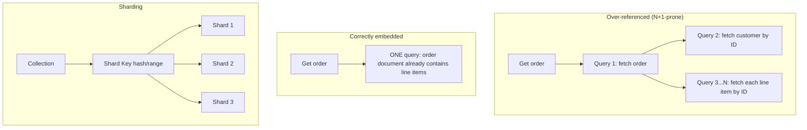
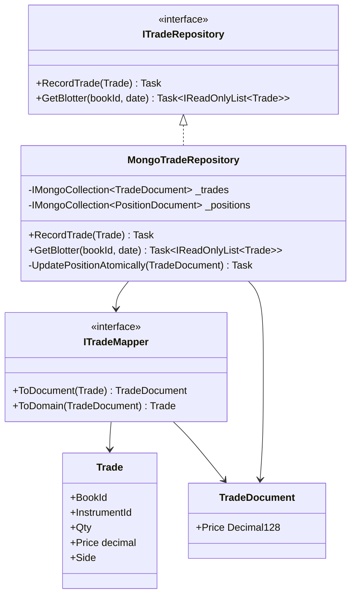
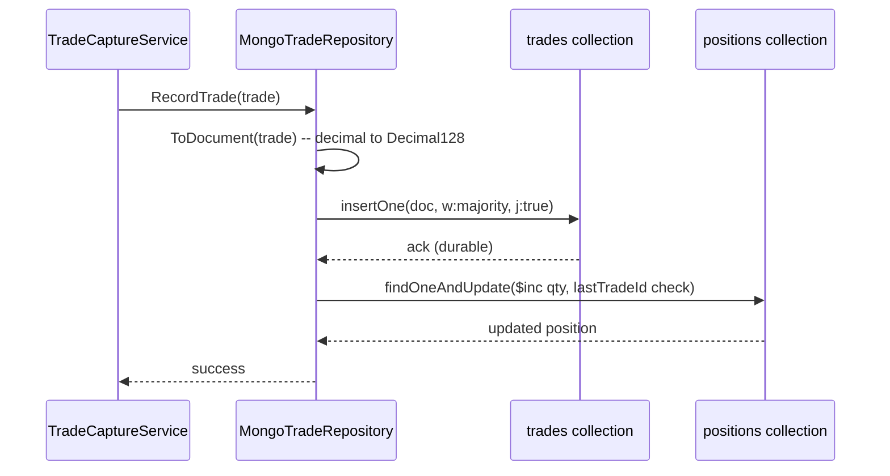
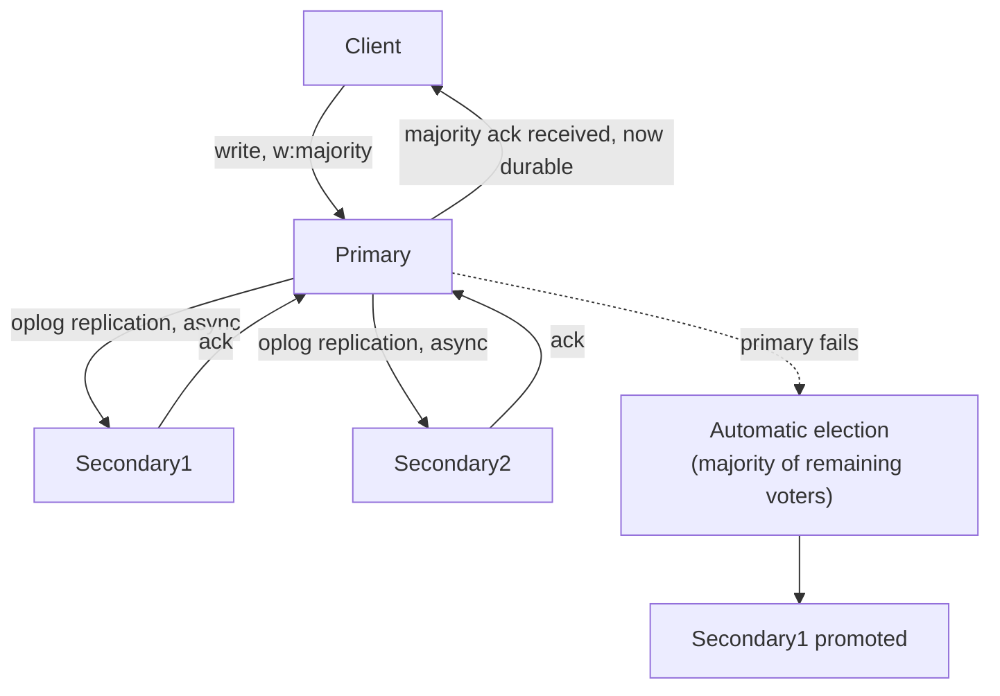
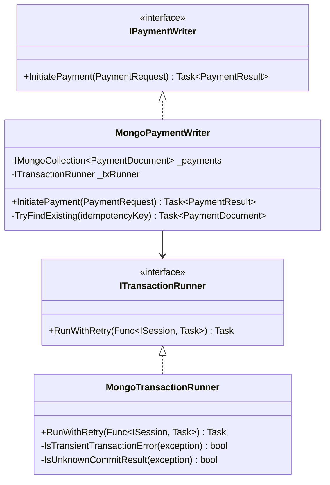
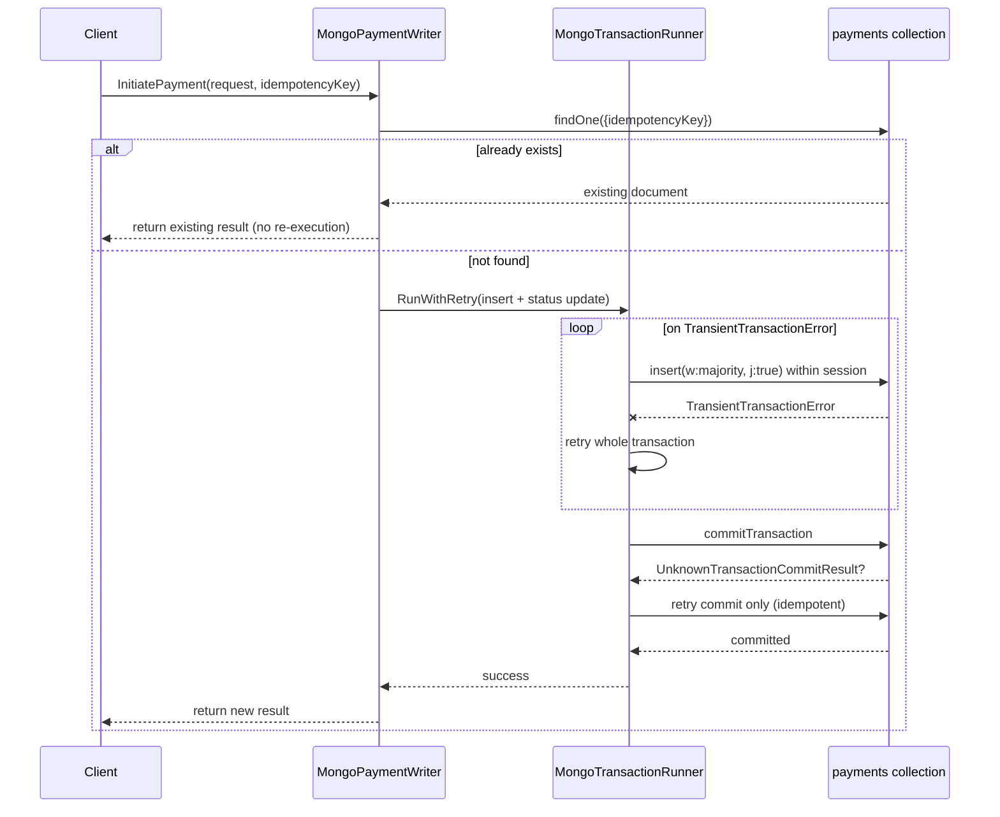

# MongoDB — Complete Interview Prep (All Topics, One File)

> Domain: MongoDB | Level: Beginner → Expert | Prerequisite: [[../05-PostgreSQL/01-PostgreSQL-Interview-Prep]] (JSONB, for contrast), [[../04-SQL-Server/01-SQL-Server-Interview-Prep]]
> **Quick-prep edition** (consolidated 2026-10-03). This one file replaces Modules 23–24. Originals: `git show ebb2d5c:06-MongoDB/<file>.md`
> Each topic has: **Key concepts → Code example → Most common interview questions with answers.**

| # | Topic | # | Topic |
|---|---|---|---|
| 1 | Document model, BSON & when to use MongoDB | 7 | Read/write concern, read preference & causal consistency |
| 2 | Data modelling: embed vs reference, patterns | 8 | Transactions, retryable writes & change streams |
| 3 | CRUD & update operators (+ C# driver) | 9 | Sharding |
| 4 | Indexes & the ESR rule | 10 | Operations: backups, monitoring, multi-tenancy, Atlas |
| 5 | Query planner, explain & aggregation pipeline | 11 | Top 30 rapid-fire + Principal questions |
| 6 | Replica sets, oplog, elections & rollback | 12 | Mistakes checklist |

---

## 1. Document Model, BSON & When to Use MongoDB

**Key concepts**
- **Documents** (BSON = binary JSON with extra types: `ObjectId`, `Date`, `Decimal128`, `Int64`, binary) stored in **collections**; flexible schema per document.
- **`_id`** is required and unique (default `ObjectId`: a 12-byte value with a timestamp prefix).
- **16 MB maximum document size** → never let documents grow without bound (use GridFS for files).
- **Atomicity is per document** → design so one business operation touches one document whenever possible.
- **WiredTiger** storage engine: document-level concurrency, compression, cache (~50% of RAM − 1 GB by default); performance depends on the **working set (hot data + indexes) fitting in RAM**.
- **Good fit:** flexible, nested, aggregate-shaped data read together (catalogs, profiles, content, IoT/events, user state), rapid schema evolution, horizontal scaling via sharding. **Weaker fit:** heavy multi-entity transactions and joins, complex ad hoc relational reporting, strict cross-entity constraints (ledgers).
- Money → `Decimal128` (never double).

```javascript
// A customer document shaped around how it's read
{
  _id: ObjectId("66f1a2..."),
  customerId: "C-1001",
  name: "Ana Lopez",
  email: "ana@example.com",
  addresses: [                          // one-to-few → embed
    { type: "billing", city: "Madrid", zip: "28001" },
    { type: "shipping", city: "Lisbon", zip: "1100" }
  ],
  preferences: { currency: "EUR", marketingOptIn: false },
  createdAt: ISODate("2026-10-03T10:15:00Z"),
  schemaVersion: 2
}
```

**Common interview questions**

**Q1. When would you choose MongoDB over a relational database?**
When data is naturally document- or aggregate-shaped and read together, the schema evolves quickly or varies per record, access patterns are known and mostly per-aggregate, and you need horizontal scale. Choose relational when you need multi-entity ACID transactions, complex joins and ad hoc reporting, or strict referential constraints (e.g., a ledger).

**Q2. Why is the 16 MB limit a design constraint, not a technicality?**
Documents that grow (unbounded arrays of comments, events or line items) eventually hit the limit — and long before that they get slow: every update rewrites a big document, they consume cache and network bandwidth, and they hurt replication. Model unbounded relationships as separate documents.

**Q3. Why is single-document atomicity central to modelling?**
Writes to one document are atomic (including nested fields and arrays) without transactions. Putting data that must change together into one document gives consistency cheaply and scales well; multi-document transactions exist but cost performance and complexity.

---

## 2. Data Modelling: Embed vs Reference & Schema Patterns

**Key concepts**
- **Design for access patterns**, not normalization: "data that is accessed together is stored together."
- **Embed** when: one-to-one or one-to-**few**, the child is read with the parent, the child doesn't need independent access, and the parent and child change together.
- **Reference** when: one-to-many (large) or **one-to-squillions**, many-to-many, the child is accessed independently, or it's frequently updated by itself.
- **Extended reference:** a reference plus a copy of a few frequently needed fields (e.g., an order stores `customerName`) — you own updating the copies.
- **Patterns**

| Pattern | Use |
|---|---|
| **Bucket** | group time-series/events into one document per period (e.g., per device per hour) |
| **Subset** | embed the most recent N items, keep the rest in another collection |
| **Computed** | pre-compute totals or counters on write |
| **Outlier** | a flag + overflow documents for rare huge cases (a celebrity's followers) |
| **Attribute** | an array of `{k, v}` for many sparse attributes (indexable) |
| **Polymorphic** | different shapes in one collection with a `type` field |
| **Schema versioning** | a `schemaVersion` field; migrate lazily on read/write |

- **Schema validation:** JSON Schema validators (`validationLevel`, `validationAction`) — flexible doesn't mean unvalidated.
- **Time-series collections** (MongoDB 5.0+) for metrics and events.

```javascript
// Bucket pattern: one document per sensor per hour
{ sensorId: "S1", hour: ISODate("2026-10-03T10:00:00Z"), count: 3,
  readings: [ { t: ISODate("...10:00:05Z"), v: 21.5 }, { t: ..., v: 21.7 } ],
  sum: 64.9, min: 21.5, max: 21.7 }

// Subset pattern: product with the latest 10 reviews; the rest live in `reviews`
{ _id: "P1", name: "Phone", recentReviews: [ /* 10 most recent */ ], reviewCount: 4521, avgRating: 4.3 }

// Extended reference in an order
{ _id: "O-9", customerId: "C-1001", customerName: "Ana Lopez", lines: [ { sku: "A1", qty: 2, price: NumberDecimal("19.99") } ] }

// Schema validation
db.createCollection("payments", { validator: { $jsonSchema: {
  bsonType: "object", required: ["paymentId", "amount", "currency", "status"],
  properties: {
    amount:   { bsonType: "decimal" },
    currency: { bsonType: "string", minLength: 3, maxLength: 3 },
    status:   { enum: ["CREATED", "AUTHORIZED", "CAPTURED", "FAILED"] } } } },
  validationAction: "error" });
```

**Common interview questions**

**Q1. What's the decision rule for embedding vs referencing?**
Embed when the child is bounded in number, read with the parent, and changes with it. Reference when the relationship is large or unbounded, the child is accessed or updated independently, or it's shared by many parents. Consider the extended-reference hybrid to avoid frequent lookups.

**Q2. How would you model time-series or event data?**
A native time-series collection, or the bucket pattern (one document per entity per time window with pre-aggregated stats) to cut document and index counts; TTL indexes for retention; shard by a key like `{ deviceId, time }` to avoid a monotonically increasing hot shard.

**Q3. How do you decide when to denormalize, and how do you keep copies consistent?**
Denormalize fields that are read often and change rarely (customer name on orders). Keep copies consistent by updating them in the same operation where possible, via change streams or background jobs for fan-out, or by accepting a historical snapshot (an order keeps the name at order time — often the correct business semantics).

**Q4. How do you evolve a schema across millions of documents?**
Add a `schemaVersion`; make the app read both versions; migrate lazily on write and/or with a throttled background job; add validation once all documents conform; and never require a big-bang migration.

**Q5. What's the risk of "schemaless" as a design strategy?**
Every reader must handle every historical shape; data quality degrades; indexes and queries break on inconsistent types. Use JSON Schema validation, typed models in code (C# classes) and explicit versioning.

**Q6. How do you model data when access patterns aren't fully known yet?**
Start with a moderately normalized model of clear aggregates, keep `schemaVersion`, log query patterns, avoid premature heavy denormalization, and choose a shard key only once the patterns are understood (it's hard to change later).

---

## 3. CRUD, Update Operators & the C# Driver

**Key concepts**
- `insertOne/Many`, `find` (filter, projection, sort, limit), `updateOne/Many` with **operators** (`$set`, `$inc`, `$push`, `$addToSet`, `$pull`, `$unset`, array filters), `replaceOne`, `deleteOne/Many`, `findOneAndUpdate` (atomic read-modify-write), `bulkWrite`.
- **Use atomic update operators instead of read-modify-write** in the app (avoids lost updates).
- **Optimistic concurrency:** include a `version` field in the filter.
- **Upsert:** `updateOne(filter, update, { upsert: true })` — use a unique index to avoid duplicate inserts under races.
- **Pagination:** range-based on an indexed field (`_id > lastId`) instead of large `skip`.
- **C# driver:** `IMongoCollection<T>`, `Builders<T>.Filter/Update`, LINQ provider, `MongoClient` as a **singleton** (it's a thread-safe connection pool).

```javascript
db.orders.updateOne(
  { _id: "O-9", status: "CREATED" },                         // conditional state transition
  { $set: { status: "PAID", paidAt: new Date() }, $inc: { version: 1 } });

db.carts.updateOne({ _id: "U1" }, { $push: { items: { sku: "A1", qty: 1 } } }, { upsert: true });
db.accounts.findOneAndUpdate(
  { _id: "ACC-1", balance: { $gte: NumberDecimal("50") } },
  { $inc: { balance: NumberDecimal("-50") } },
  { returnDocument: "after" });                              // atomic, no overdraft

// Range pagination
db.orders.find({ customerId: "C-1001", _id: { $gt: lastId } }).sort({ _id: 1 }).limit(50);
```

```csharp
// C#: MongoClient is a singleton (pooled, thread-safe)
builder.Services.AddSingleton<IMongoClient>(_ => new MongoClient(config["Mongo:Uri"]));
builder.Services.AddSingleton(sp => sp.GetRequiredService<IMongoClient>().GetDatabase("shop").GetCollection<Order>("orders"));

public record Order(string Id, string CustomerId, string Status, decimal Total, int Version);

public async Task<bool> MarkPaidAsync(IMongoCollection<Order> orders, string id, int expectedVersion, CancellationToken ct)
{
    var filter = Builders<Order>.Filter.Eq(o => o.Id, id) & Builders<Order>.Filter.Eq(o => o.Version, expectedVersion);
    var update = Builders<Order>.Update.Set(o => o.Status, "PAID").Inc(o => o.Version, 1);
    var result = await orders.UpdateOneAsync(filter, update, cancellationToken: ct);
    return result.ModifiedCount == 1;             // 0 → concurrency conflict
}

var recent = await orders.Find(o => o.CustomerId == "C-1001")
    .SortByDescending(o => o.Id).Limit(20).ToListAsync(ct);
```

**Common interview questions**

**Q1. How do you avoid lost updates in MongoDB?**
Use atomic update operators (`$inc`, `$push`, `$set` on specific fields) rather than reading, modifying in the app and replacing; for logic that must be conditional, put the condition in the filter (`status: "CREATED"`, `version: n`) and check `modifiedCount`.

**Q2. How do you detect and fix an application-side N+1 against MongoDB?**
Symptoms: many small queries per request (profiler or APM traces). Fix by embedding or extended references for data read together, batching with `$in` instead of per-item lookups, or a single `$lookup` aggregation when appropriate.

**Q3. Why should `MongoClient` be a singleton?**
It manages the connection pool, server monitoring and topology discovery. Creating one per request wastes connections and causes latency spikes and connection storms.

---

## 4. Indexes & the ESR Rule

**Key concepts**
- Without an index → **COLLSCAN**. Index types: single field, **compound**, **multikey** (array fields — one entry per element), text, 2dsphere (geo), hashed (sharding), wildcard, **partial**, sparse, **TTL** (auto-expire), **unique**.
- **ESR rule** for compound index order: **E**quality fields first → **S**ort fields → **R**ange fields. Breaking it forces an in-memory sort (`SORT` stage, limited memory) or scans more keys.
- **Prefix rule:** an index on `{a, b, c}` supports queries on `a`, `a+b`, `a+b+c`.
- **Covered query:** all filter and projected fields are in the index and `_id` is excluded → no document fetch (`totalDocsExamined: 0`).
- **Partial index** (`partialFilterExpression`) beats **sparse** (it can filter on any condition, not just field existence).
- Every index costs RAM and write throughput → keep the working set + indexes in memory; remove unused indexes (`$indexStats`).
- Build indexes on large collections carefully (modern builds hold an exclusive lock only briefly at start and end; on replica sets use rolling builds for very large ones).

```javascript
// Query: orders for a customer with status, sorted by date, recent only
db.orders.find({ customerId: "C1", status: "PAID", createdAt: { $gte: ISODate("2026-09-01") } })
         .sort({ createdAt: -1 });
// ESR: equality (customerId, status) → sort (createdAt) → range (createdAt is both sort and range here)
db.orders.createIndex({ customerId: 1, status: 1, createdAt: -1 });

// Covered query
db.orders.createIndex({ customerId: 1, total: 1 });
db.orders.find({ customerId: "C1" }, { _id: 0, total: 1 });     // no document fetch

// Partial index: only pending payments
db.payments.createIndex({ createdAt: 1 }, { partialFilterExpression: { status: "PENDING" } });

// TTL: sessions expire 30 minutes after lastSeen
db.sessions.createIndex({ lastSeen: 1 }, { expireAfterSeconds: 1800 });

// Unique idempotency key
db.payments.createIndex({ idempotencyKey: 1 }, { unique: true });

// Index usage stats
db.orders.aggregate([{ $indexStats: {} }]);
```

**Common interview questions**

**Q1. Explain the ESR rule.**
In a compound index, put Equality-matched fields first, then fields you Sort on, then Range-filtered fields. That way MongoDB seeks to an exact key prefix, reads entries already in sort order (no in-memory sort), and bounds the range scan.

**Q2. What is a covered query?**
A query where the index contains every field in the filter and the projection (excluding `_id`, or including it in the index), so MongoDB answers from the index without fetching documents — `totalDocsExamined` is 0.

**Q3. What is a multikey index and what does it cost?**
An index on an array field, with one index entry per element. It enables queries on array contents, but large arrays create many entries (bigger indexes, slower writes), and a compound index can contain at most one array field.

**Q4. Partial vs sparse index?**
Sparse skips documents missing the field. Partial uses any filter expression (e.g., `status: "ACTIVE"`), is more flexible and smaller, and is the recommended choice. Queries must include the filter condition to use a partial index.

**Q5. How do you decide which indexes to keep on a busy collection?**
Check `$indexStats` (usage counts), the slow query log and profiler, and `explain` for key queries. Remove unused and redundant indexes (prefixes of others), consolidate using ESR, and measure write latency and RAM before and after.

---

## 5. Query Planner, `explain()` & Aggregation Pipeline

**Key concepts**
- The **query planner** races candidate plans for a query *shape*, caches the winner, and re-plans if performance degrades or indexes change. A cached plan can be bad for different values (similar to parameter sniffing) → `hint()` or better indexes.
- **`explain("executionStats")`:** compare `nReturned` vs `totalKeysExamined` vs `totalDocsExamined` (ideal ratio ≈ 1:1:1); watch for `COLLSCAN`, in-memory `SORT`, `FETCH` of many documents.
- **Aggregation pipeline** stages: `$match`, `$project`/`$set`, `$group`, `$sort`, `$limit`, `$lookup` (left outer join), `$unwind`, `$facet`, `$bucket`, `$merge`/`$out` (materialized views), `$setWindowFields` (window functions).
- **Stage order matters:** `$match` and `$project` early (the optimizer pushes some down) so indexes are used and fewer documents flow; `$sort` + `$limit` together use a top-k sort.
- **100 MB memory limit per stage** → `allowDiskUse: true` (spills) or a better design.
- **`$lookup`** is fine for occasional joins or reporting; if it's needed on every hot read, the model is probably wrong (embed or denormalize).
- Analytics on the operational cluster: use analytics or hidden secondaries, or Atlas Data Federation / ETL to a warehouse.

```javascript
db.orders.find({ customerId: "C1" }).sort({ createdAt: -1 }).explain("executionStats");
// Good: IXSCAN, totalKeysExamined ≈ totalDocsExamined ≈ nReturned, no SORT stage

// Revenue per customer in October, top 10, with customer name
db.orders.aggregate([
  { $match: { status: "PAID", createdAt: { $gte: ISODate("2026-10-01"), $lt: ISODate("2026-11-01") } } },
  { $group: { _id: "$customerId", revenue: { $sum: "$total" }, orders: { $sum: 1 } } },
  { $sort: { revenue: -1 } },
  { $limit: 10 },
  { $lookup: { from: "customers", localField: "_id", foreignField: "customerId", as: "customer" } },
  { $project: { _id: 0, customerId: "$_id", revenue: 1, orders: 1, name: { $first: "$customer.name" } } }
], { allowDiskUse: true });

// Running total per account with window functions (5.0+)
db.transactions.aggregate([
  { $setWindowFields: { partitionBy: "$accountId", sortBy: { ts: 1 },
      output: { runningBalance: { $sum: "$amount", window: { documents: ["unbounded", "current"] } } } } }
]);
```

**Common interview questions**

**Q1. What does `explain("executionStats")` tell you that matters most?**
Whether an index was used (IXSCAN vs COLLSCAN), how many keys and documents were examined compared with documents returned (efficiency), and whether there was an in-memory SORT. A high docsExamined/nReturned ratio means a poorly selective index or the wrong index order.

**Q2. Why does stage order matter in an aggregation?**
Early `$match` can use indexes and reduces the documents flowing into expensive stages (`$group`, `$lookup`, `$unwind`); early `$project` reduces document size; `$sort` before `$group` may use an index; `$sort` + `$limit` enables a top-k optimization.

**Q3. When is `$lookup` appropriate?**
For reporting, admin screens, or occasional joins between independently managed collections. If every hot request needs it, reconsider the model (embed or use an extended reference), because `$lookup` per document is expensive, especially across shards.

**Q4. Read latency jumped on a 500 GB collection with no code change. Diagnose it.**
Likely the working set (data + indexes) no longer fits in the WiredTiger cache → disk reads. Check cache eviction and page faults, index sizes, slow queries (COLLSCAN, in-memory sorts), plan cache changes, and replication or backup load. Fix with better indexes, removing unused ones, archiving cold data, more RAM, or sharding.

---

## 6. Replica Sets, Oplog, Elections & Rollback

**Key concepts**
- **Replica set:** one **primary** (accepts writes) + **secondaries** (replicate asynchronously). Typical: 3 data-bearing members across availability zones. Special members: **arbiter** (votes only — avoid if possible), **hidden** (backups/analytics), **delayed** (protects against human error).
- **Oplog:** a capped collection of idempotent operations that secondaries apply. The **oplog window** (hours of history) bounds how long a member can be offline and how far a change stream can resume.
- **Elections:** a majority of voting members is needed; election timeout ~10 s by default; use an **odd number** of voting members (an even number risks no majority in a split).
- **Rollback:** writes acknowledged with `w:1` on a primary that loses its position before replicating are **rolled back** when it rejoins (written to rollback files nobody reads) → use **`w: "majority"`** for important data.
- **Replication is not a backup** (deletes replicate instantly).
- Drivers handle failover: retryable writes/reads, server selection timeout.

```javascript
rs.initiate({ _id: "rs0", members: [
  { _id: 0, host: "db-a:27017", priority: 2 },
  { _id: 1, host: "db-b:27017", priority: 1 },
  { _id: 2, host: "db-c:27017", priority: 1 },
  { _id: 3, host: "db-bkp:27017", priority: 0, hidden: true, votes: 0 }   // backups/analytics
]});
rs.printReplicationInfo();            // oplog size and window
rs.printSecondaryReplicationInfo();   // lag per secondary
```

**Common interview questions**

**Q1. What does a replica set give you, and what doesn't it?**
It gives high availability (automatic failover), data redundancy, and optional read scaling from secondaries (with staleness). It doesn't give a backup (mistakes replicate), write scaling (one primary — use sharding), or strong consistency on secondary reads.

**Q2. What is the oplog and why does its size matter?**
The operation log secondaries replay. Its time window determines how long a secondary can be down and still catch up without a full resync, and how long change streams can resume. Size it to cover maintenance windows and peak write rates (e.g., 24–72 hours).

**Q3. What is a rollback and when does it happen?**
If a primary accepts writes that don't reach a majority before it fails, a new primary is elected without them; when the old primary rejoins, those writes are rolled back. Acknowledged `w:1` writes can be lost this way. `w: "majority"` prevents it.

**Q4. What happens to the application during a primary election?**
Writes fail or block for a few seconds (typically up to ~10–12 s) until a new primary is elected; drivers rediscover the topology, retryable writes retry once automatically, and in-flight non-retryable operations error. Apps need timeouts, idempotent retries, and to tolerate a brief write pause (and planned stepdowns during maintenance).

**Q5. Why is an even number of voting members a problem?**
A network split could leave two equal halves with no majority, so no primary can be elected and writes stop. Use an odd number (3 or 5); an arbiter can break ties but weakens majority write durability, so prefer a real data node.

---

## 7. Read/Write Concern, Read Preference & Causal Consistency

**Key concepts**
- **Write concern:** `w: 1` (primary only), **`w: "majority"`** (durable across failover — the default since 5.0), `j: true` (journaled), `wtimeout`.
- **Read concern:** `local` (latest on that node, may be rolled back), `available`, **`majority`** (only majority-committed data), `linearizable` (strongest single-document reads, slow), `snapshot` (transactions).
- **Read preference:** `primary` (default), `primaryPreferred`, `secondary`, `secondaryPreferred`, `nearest`; **tag sets** route analytics to dedicated nodes; `maxStalenessSeconds` bounds staleness.
- **Secondary reads are stale** (replication lag) → read-your-own-writes breaks unless you use **causally consistent sessions** (with majority read/write concern).
- **`wtimeout` exceeded** ≠ write failed — the write may still be applied → treat it as unknown and make it idempotent.

```csharp
// Per-operation durability and consistency in C#
var payments = db.GetCollection<Payment>("payments")
    .WithWriteConcern(WriteConcern.WMajority)
    .WithReadConcern(ReadConcern.Majority);

// Causal consistency: read your own writes even from secondaries
using var session = await client.StartSessionAsync(new ClientSessionOptions { CausalConsistency = true });
await payments.InsertOneAsync(session, payment);
var mine = await payments.WithReadPreference(ReadPreference.SecondaryPreferred)
                         .Find(session, p => p.Id == payment.Id).FirstOrDefaultAsync();
```

```javascript
// Route analytics to tagged secondaries
db.getMongo().setReadPref("secondary", [{ workload: "analytics" }]);
```

**Common interview questions**

**Q1. Explain write concern and what `w: "majority"` buys you.**
It's how many members must acknowledge a write before success is returned. `w:1` is fast but can be rolled back on failover; `"majority"` guarantees the write survives any failover that elects a new primary. Use majority for business-critical data (it's the default in modern versions).

**Q2. Users say data they just saved isn't there after a reload. Diagnose it.**
Reads go to secondaries (lagging) or use `local` read concern after a failover rollback, or the write used `w:1` and was rolled back. Fix: read from the primary for read-after-write flows, or use causally consistent sessions with majority concerns; check replication lag and the rollback logs.

**Q3. What does reading from secondaries cost you?**
Stale data (lag), possibly reading data later rolled back (with `local`), no read-your-own-writes, and load competition with replication. Use it for analytics or tolerant reads with tags and `maxStalenessSeconds`; use `nearest` for latency in multi-region setups.

**Q4. How do you handle a `wtimeout`?**
The write wasn't confirmed by enough members in time but may still have been applied (and may still replicate). Treat the outcome as unknown: retry idempotently (unique keys, conditional updates) or read back to verify. Investigate the lag that caused it.

**Q5. How do you set consistency policy across many teams?**
Safe defaults in the shared client library (majority write and read concern, primary reads, retryable writes, timeouts), documented exceptions for specific workloads (analytics on secondaries), code review of per-operation overrides, and monitoring of lag and rollbacks.

---

## 8. Transactions, Retryable Writes & Change Streams

**Key concepts**
- **Multi-document ACID transactions** (replica sets 4.0, sharded clusters 4.2): snapshot isolation, a default 60 s lifetime limit, **write conflicts → `TransientTransactionError`** → retry the whole transaction (`WithTransaction` helpers do this). They cost more (locks, cache pressure, cross-shard coordination with 2PC).
- **Use transactions when** an invariant truly spans documents (a transfer between two account documents). **Prefer a better model** (one document) when possible.
- **Retryable writes** (on by default): drivers retry a failed write once after network errors or failover, with server-side deduplication via a transaction number → safe for single-statement writes.
- **Change streams:** subscribe to inserts/updates/deletes (collection, database or cluster), built on the oplog; **resume tokens** let consumers continue after restarts (within the oplog window); use `fullDocument: "updateLookup"` or pre/post images. Delivery to your consumer is **at-least-once** → be idempotent. Use them for CDC to Kafka, cache invalidation and projections.

```csharp
// Transfer between two account documents in a transaction (auto-retry on transient errors)
using var session = await client.StartSessionAsync();
await session.WithTransactionAsync(async (s, ct) =>
{
    var debit = await accounts.UpdateOneAsync(s,
        a => a.Id == fromId && a.Balance >= amount,
        Builders<Account>.Update.Inc(a => a.Balance, -amount), cancellationToken: ct);
    if (debit.ModifiedCount == 0) throw new InvalidOperationException("Insufficient funds");
    await accounts.UpdateOneAsync(s, a => a.Id == toId, Builders<Account>.Update.Inc(a => a.Balance, amount), cancellationToken: ct);
    await ledger.InsertOneAsync(s, new LedgerEntry(Guid.NewGuid(), fromId, toId, amount), cancellationToken: ct);
    return true;
}, new TransactionOptions(readConcern: ReadConcern.Snapshot, writeConcern: WriteConcern.WMajority));

// Change stream with a resume token
var options = new ChangeStreamOptions { FullDocument = ChangeStreamFullDocumentOption.UpdateLookup, ResumeAfter = savedToken };
using var cursor = await orders.WatchAsync(options);
while (await cursor.MoveNextAsync(ct))
{
    foreach (var change in cursor.Current)
    {
        await ProjectAsync(change.FullDocument);           // idempotent handler
        await SaveResumeTokenAsync(change.ResumeToken);    // persist after processing
    }
}
```

**Common interview questions**

**Q1. When should you use multi-document transactions?**
When a business invariant spans several documents and can't be modelled into one (moving money between account documents, order + inventory reservation in the same database). Keep them short and small, retry on transient errors, and don't use them as a substitute for good document design.

**Q2. What are the failure modes of transactions under load?**
Write conflicts on hot documents (retries and contention), long transactions hitting the 60 s limit or pinning cache (WiredTiger pressure), cross-shard transactions adding latency and coordinator failure scenarios, and large transactions exceeding limits. Monitor aborts and retries.

**Q3. What are retryable writes and why do they matter?**
The driver automatically retries a single write once after a transient network error or primary failover, and the server deduplicates it using the session's transaction number — so the write happens at most once. It handles failovers transparently for idempotent-safe single operations (not multi-statement logic).

**Q4. What's your view on change streams as an integration mechanism?**
Great for reliable, ordered (per shard) CDC without polling: projections, cache invalidation, outbox publishing to Kafka. Risks: consumers falling behind the oplog window (can't resume → need a resnapshot), coupling to internal schemas (prefer an outbox collection with explicit events), and at-least-once delivery requiring idempotent consumers.

**Q5. How do you decide between a transaction, a different document model, or eventual consistency?**
If the invariant must hold at every moment (money can't be created or lost) → a single document or a transaction. If it's per aggregate → model it as one document. If the business tolerates temporary inconsistency with compensation (e.g., updating a denormalized name) → eventual consistency via change streams.

---

## 9. Sharding

**Key concepts**
- **Horizontal scaling:** data split into **chunks** by **shard key** across shards (each a replica set); **mongos** routers; **config servers** store metadata; the **balancer** moves chunks.
- **Shard key choice is critical** (resharding is possible since 5.0 but expensive): high **cardinality**, good **distribution** (even writes), and **query isolation** (most queries include the key → targeted queries; otherwise **scatter-gather** to all shards).
- **Ranged** sharding (supports range queries; a monotonically increasing key like a timestamp or ObjectId → **hot last shard**) vs **hashed** sharding (even writes, but range queries scatter). **Compound keys** (`{ tenantId, orderId }`) balance both.
- **Zones** pin key ranges to specific shards (data residency, e.g., EU data on EU shards).
- Jumbo chunks (too many documents with the same key value) can't be split → the key's cardinality is too low.
- Unique indexes must include the shard key prefix; cross-shard transactions are costly.

```javascript
sh.enableSharding("shop");
// Compound key: targets tenant queries and spreads tenants' writes
sh.shardCollection("shop.orders", { tenantId: 1, orderId: 1 });
// Hashed key for even write distribution
sh.shardCollection("shop.events", { deviceId: "hashed" });
// Data residency with zones
sh.addShardToZone("shard-eu-1", "EU");
sh.updateZoneKeyRange("shop.customers", { region: "EU", customerId: MinKey }, { region: "EU", customerId: MaxKey }, "EU");
```

**Common interview questions**

**Q1. How do you choose a shard key?**
High cardinality, even write distribution, and present in most queries (targeted routing). Avoid monotonically increasing keys with ranged sharding (a hot shard) and low-cardinality keys (jumbo chunks). A compound key such as `{tenantId, entityId}` often works well; hashed keys fix write hotspots but scatter range queries.

**Q2. How does the data model constrain sharding later?**
The shard key must exist in every document and should be in most queries; if documents or queries don't naturally include a good key, you'll get scatter-gather and hotspots. Unique constraints and transactions become harder across shards. Model with the eventual shard key in mind.

**Q3. Vertical scaling, read scale-out or sharding — how do you decide?**
Vertical first (more RAM so the working set fits; simplest), read scale-out with secondaries if staleness is acceptable, and sharding when write throughput or data size exceeds one replica set — sharding adds operational complexity and a permanent design constraint.

**Q4. How does sharding change the consistency and transaction picture?**
Single-document operations stay atomic. Multi-shard transactions use two-phase commit (slower, more failure modes). Scatter-gather queries see each shard's state at slightly different times unless you use snapshot reads. The balancer moves chunks in the background (orphaned documents are filtered out).

---

## 10. Operations: Backups, Monitoring, Multi-Tenancy, Atlas

**Key concepts**
- **Backups:** filesystem/cloud snapshots, `mongodump` (small datasets), Atlas continuous backups with **PITR** (oplog-based). Test restores.
- **Monitoring:** replication lag, oplog window, cache usage and eviction, page faults, connections, query targeting (scanned/returned), slow query log/profiler, lock and ticket queues, disk.
- **Multi-tenancy:** a `tenantId` field in every document (and as a shard key prefix) — cheapest; database per tenant (isolation, limited by the number of collections and files); cluster per tenant for big or regulated tenants. Enforce tenant filters in a data-access layer.
- **Atlas (managed):** automated ops, backups, scaling, global clusters, Atlas Search, Vector Search; trade-offs: cost and less control.
- **Security:** authentication (SCRAM/x.509/LDAP/OIDC), roles, TLS, encryption at rest, client-side field-level encryption / Queryable Encryption for sensitive fields, network isolation, auditing.

**Common interview questions**

**Q1. What's your backup and recovery design for a replica set?**
Continuous backups with PITR (Atlas or Ops Manager) or periodic snapshots from a hidden secondary + oplog archiving; a delayed member to recover from human error; regular automated restore tests with measured RTO; and backups encrypted and copied to another region.

**Q2. How would you isolate analytics from production traffic?**
A hidden or tagged analytics secondary (read preference with tags), Atlas analytics nodes, or ETL/change streams into a warehouse or data lake. Never run heavy aggregations on the primary.

**Q3. When would you conclude MongoDB is the wrong store?**
When the workload needs many multi-entity transactions, complex joins and ad hoc relational reporting, strict cross-document constraints, or a ledger with strong invariants — or when the team keeps fighting the model with `$lookup` everywhere. A relational database (or both, polyglot) fits better.

**Q4. How do you migrate a badly modelled terabyte collection while live?**
Design the new model; dual-write (or change streams to transform into a new collection); backfill in throttled batches; verify with counts and checksums; switch reads gradually (feature flag); then stop old writes and drop the old collection — each step reversible.

---

## 11. Top 30 Rapid-Fire Questions + Principal Questions

1. **Document size limit?** 16 MB.
2. **Atomicity unit?** A single document.
3. **Embed when?** One-to-few, read together, changes together.
4. **Reference when?** Unbounded, independent, many-to-many.
5. **Unbounded arrays?** An anti-pattern → bucket/subset patterns.
6. **Money type?** `Decimal128`.
7. **ESR?** Equality, Sort, Range.
8. **Covered query?** Index-only, no document fetch.
9. **Multikey?** An array index; one entry per element.
10. **Partial vs sparse?** Any filter vs field existence.
11. **TTL index?** Auto-expire documents.
12. **explain metric?** keysExamined/docsExamined vs nReturned.
13. **Aggregation memory?** 100 MB per stage → `allowDiskUse`.
14. **`$lookup`?** Left outer join; not for every hot read.
15. **Replica set minimum?** 3 members (odd votes).
16. **Oplog?** A capped log of idempotent operations; the window matters.
17. **Rollback?** `w:1` writes lost on failover.
18. **Durable writes?** `w: "majority"`.
19. **Read concern majority?** Only majority-committed data.
20. **Secondary reads?** Stale; no read-your-own-writes.
21. **Read-your-own-writes?** Causally consistent sessions.
22. **Transactions?** Since 4.0/4.2; retry on TransientTransactionError.
23. **Retryable writes?** Automatic single retry, deduplicated.
24. **Change streams?** Oplog-based CDC with resume tokens.
25. **Shard key?** Cardinality + distribution + query isolation.
26. **Monotonic shard key?** A hot shard (with ranged sharding).
27. **Hashed sharding?** Even writes, scattered range queries.
28. **Zones?** Pin data to shards (residency).
29. **MongoClient lifetime?** Singleton.
30. **Replication vs backup?** Not the same — need PITR backups.

**Principal-level questions**

**P1. Design a multi-region MongoDB topology.**
A replica set spanning 3 regions (e.g., 2+2+1 voting members) with majority writes, so a single-region loss keeps a majority (cross-region write latency is the cost); reads with `nearest` for latency where staleness is acceptable; or a sharded global cluster with zones so each region's data has a local primary (low-latency local writes, data residency), with cross-region failover for each zone. State the RPO/RTO trade-off explicitly.

**P2. What separates an excellent MongoDB schema design answer from an adequate one?**
It starts from enumerated access patterns and write rates, explains embed vs reference with bounds (how many children, how often updated), names the patterns used (bucket, extended reference, computed), defines indexes with ESR, picks a shard key with reasoning, states the consistency settings per operation, and says what can't be done efficiently in this model.

**P3. How do you govern index proliferation across teams sharing a cluster?**
Index changes via code review and migration scripts; `$indexStats` reports with owners; limits per collection; performance budgets (write latency, RAM); and periodic cleanup of unused indexes — ideally with separate databases or clusters per domain to reduce coupling.

**P4. How do you build modelling competence in a team coming from SQL?**
Teach access-pattern-first design with worked examples, run schema reviews with explicit embed/reference reasoning, show `explain` outputs, provide templates (bucket, versioning), and set guardrails (validation, linting of unbounded arrays, index reviews).

---

## 12. Mistakes Checklist (say why each is wrong)
- [ ] Designing like normalized SQL with `$lookup` everywhere · unbounded arrays · huge documents
- [ ] No schema validation or versioning · doubles for money
- [ ] Read-modify-write in the app instead of atomic operators · upserts without a unique index
- [ ] Compound indexes ignoring ESR · too many unused indexes · working set larger than RAM
- [ ] Large `skip` pagination · in-memory sorts · `$match` late in pipelines
- [ ] `w:1` for critical data · secondary reads expecting fresh data · treating `wtimeout` as failure
- [ ] Transactions as the default modelling tool · not retrying transient transaction errors
- [ ] Change stream consumers without persisted resume tokens or idempotency
- [ ] Monotonic shard keys with ranged sharding · low-cardinality shard keys · queries without the shard key
- [ ] Even number of voters · arbiters in critical clusters · replication treated as backup
- [ ] A new `MongoClient` per request

---

## Architecture Diagrams (preserved from the original modules)

> All 6 Mermaid/ASCII diagrams from the original `06-MongoDB/` files, kept verbatim and grouped by source module. Originals: `git show ebb2d5c:06-MongoDB/<file>.md`.

### Module 23 — MongoDB: Data Modeling, Aggregation & Sharding
*Source: `01-Data-Modeling-Query-Patterns.md`*

**3. Visual Architecture**



**13. Low-Level Design**



**13. Low-Level Design**



### Module 24 — MongoDB: Consistency, Replica Sets & Multi-Document Transactions
*Source: `02-Consistency-ReplicaSets-Transactions.md`*

**3. Visual Architecture**



**13. Low-Level Design**



**13. Low-Level Design**


