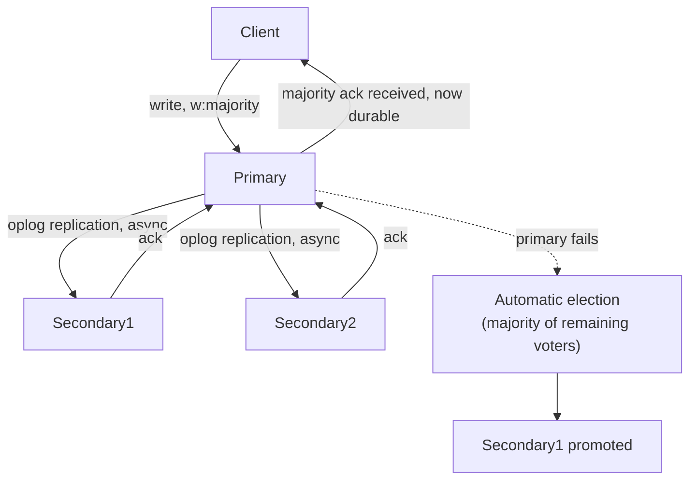

# Module 24 — MongoDB: Consistency, Replica Sets & Multi-Document Transactions

> Domain: MongoDB | Level: Beginner → Expert | Prerequisite: [[01-Data-Modeling-Query-Patterns]], [[../05-PostgreSQL/02-Partitioning-Replication-Logical-Decoding]] §2.3 (synchronous/asynchronous replication trade-offs)

---

## 1. Fundamentals

### What is a replica set, and what are read/write concerns?
A **replica set** is MongoDB's native replication unit — a primary node accepting all writes, plus secondary nodes replicating the primary's oplog (operation log) asynchronously by default, with automatic failover electing a new primary if the current one becomes unavailable. **Write concern** and **read concern** are per-operation, tunable knobs controlling exactly how much durability/consistency a given read or write demands — MongoDB's answer to the same availability-vs-consistency trade-off spectrum covered for PostgreSQL (Module 22 §2.3) and SQL Server (Module 19), but exposed as an explicit, per-operation parameter rather than a database-wide or connection-level setting.

### Why does this matter?
Every write/read against a replicated MongoDB deployment has an implicit or explicit consistency guarantee — misunderstanding the *default* write concern (`w: 1`, acknowledged by the primary alone, not yet replicated) is a common source of "I thought this was durable but it wasn't" data-loss surprises during a primary failover.

### When does this matter?
Any production MongoDB deployment (which is always a replica set, even a single-primary one, for HA); the depth matters for correctly choosing write/read concerns per operation's actual durability requirement, and for understanding multi-document transactions' real cost/limitations before reaching for them reflexively.

### How does it work (30,000-ft view)?
```javascript
db.orders.insertOne(
  { customerId, total },
  { writeConcern: { w: "majority", j: true } } // acknowledged only once a majority of replica-set members have it, durably
);
```

---

## 2. Deep Dive

### 2.1 Write Concern — Precisely What Each Level Guarantees
- **`w: 1`** (default): acknowledged once the **primary alone** has applied the write — fast, but a primary crash before replicating to any secondary loses this write on failover (the newly-elected primary, promoted from a secondary that never received it, has no record of it — a **rollback** scenario if the old primary later rejoins as a secondary and its un-replicated writes are discarded).
- **`w: "majority"`**: acknowledged once a **majority** of voting replica-set members have applied the write — survives a single-node failure without data loss, since any newly-elected primary (itself part of that majority, by the election protocol's requirements) will have the write.
- **`j: true`** (journal): additionally requires the acknowledging node(s) to have durably written to their on-disk journal, not just applied in memory — protects against losing the write even if that specific node crashes immediately after acknowledging (before its own next checkpoint).

### 2.2 Read Concern and Read Preference — Two Distinct, Often-Confused Settings
**Read preference** (`primary`, `secondary`, `secondaryPreferred`, `nearest`) controls **which node** a read is routed to — a read-scaling/latency lever, not a consistency one. **Read concern** (`local`, `available`, `majority`, `linearizable`) controls **what data is visible** for that read, independent of which node serves it — `"majority"` read concern guarantees the returned data has been acknowledged by a majority (and thus won't be rolled back later), while `"local"` (the default) can return data that a subsequent failover/rollback might later undo. Conflating these two settings — assuming routing a read to a secondary (`read preference`) automatically implies any particular consistency guarantee (`read concern`) — is a common, real MongoDB misunderstanding.

### 2.3 Multi-Document ACID Transactions — Real Cost and When They're Actually Needed
MongoDB (4.0+) supports multi-document ACID transactions across a replica set (and, since 4.2, across a sharded cluster) — but they carry meaningfully higher overhead than single-document operations (which have always been atomic in MongoDB, a fact frequently under-appreciated: a single `updateOne` modifying multiple fields within one document is already fully atomic without needing an explicit transaction at all). Reaching for a multi-document transaction should follow directly from the **data-modeling decision** (Module 23) — if a relationship is correctly embedded within one document, no transaction is needed at all for what would otherwise be a "multi-entity" update in a relational schema; transactions become necessary specifically when a genuine business operation must atomically span **multiple separate documents/collections** that couldn't reasonably be embedded together.

### 2.4 Oplog-Based Replication and Idempotent Operation Application
MongoDB's replication mechanism replicates the **oplog** (a log of applied operations) to secondaries, which apply each operation independently — critically, oplog entries are designed to be **idempotent** (an oplog entry for "set field X to value Y," not "increment field X by 1," even if the original operation was an increment) specifically so that re-applying an oplog entry (e.g., during a resync, or if a secondary catches up from a slightly-behind position) never double-applies an effect — a deliberate design choice directly enabling safe replication-recovery semantics.

### 2.5 Change Streams — MongoDB's Native CDC
**Change streams** (`db.collection.watch()`) provide a native, resumable API for subscribing to real-time changes on a collection/database — directly analogous to PostgreSQL's logical decoding/CDC (Module 22 §2.4), but built into MongoDB's own driver-level API rather than requiring an external tool like Debezium — a resumable change stream (tracked via a resume token) can pick back up after a consumer disconnects without missing changes, provided the oplog hasn't rotated past the disconnection point in the meantime (directly analogous to PostgreSQL's replication-slot WAL-retention concern, Module 22 §2.5, though change streams don't retain unbounded history the way an unconsumed replication slot does — they're bounded by the oplog's own retention window).

## 3. Visual Architecture


## 4. Production Example
**Scenario**: A financial-transaction-adjacent service used the default write concern (`w: 1`) for all writes — during an unplanned primary failover (a hardware failure), several recently-written transactions that had been acknowledged to clients as successful were **lost**, since they had never replicated to any secondary before the primary crashed, and the newly-elected primary (promoted from a secondary lacking those writes) had no record of them; worse, when the old primary later recovered and rejoined the replica set as a secondary, its un-replicated writes were explicitly rolled back (written to a rollback file) to bring it in sync with the new primary's now-authoritative oplog. **Investigation**: confirmed via the rollback files' contents that the lost writes were genuinely acknowledged to clients (the client received a success response) before the crash. **Fix**: changed write concern to `{ w: "majority", j: true }` for all financially-significant writes, accepting the added latency (waiting for a majority acknowledgment plus journal durability) in exchange for eliminating this exact data-loss class going forward. **Lesson**: MongoDB's default write concern (`w: 1`) is optimized for throughput/latency, not durability — any operation where "acknowledged but later lost" is unacceptable must explicitly opt into `"majority"` write concern; this is not a rare edge case but the default, ordinary behavior of an unconfigured write, directly analogous to PostgreSQL's asynchronous-replication data-loss window (Module 22 §2.3) — the exact same availability-vs-durability trade-off, expressed as a different but conceptually identical per-operation knob.

## 5. Best Practices
- Use `{ w: "majority", j: true }` write concern for any operation where post-acknowledgment data loss is unacceptable.
- Understand read preference (which node) and read concern (what data visibility guarantee) as two independent settings — never conflate them.
- Prefer correct embedding (Module 23) over reaching for multi-document transactions to paper over a data-modeling mismatch.
- Use change streams for event-driven reactions to MongoDB data changes, tracking resume tokens for resilient reconnection.

## 6. Anti-patterns
- Relying on the default `w: 1` write concern for financially/business-critical writes without evaluating the failover data-loss risk (§4's incident).
- Assuming routing a read to a secondary (read preference) implies any particular consistency guarantee (read concern) about the data returned.
- Reaching for multi-document transactions to compensate for a schema that should have embedded the related data instead (Module 23's central lesson, recurring here).
- Ignoring oplog size/retention when relying on change streams for a consumer that might disconnect for an extended period.

## 7. Performance Engineering
`w: "majority"` write concern adds latency (waiting for a majority acknowledgment, potentially a network round-trip to another node) compared to `w: 1` — a genuine, deliberate durability-vs-latency trade-off to make explicitly per operation's actual requirements, not a blanket setting applied uniformly regardless of the data's actual criticality. Multi-document transactions carry real overhead (locking/snapshot coordination across documents) — reserve them for genuinely necessary cross-document atomicity, not routine single-document operations that are already atomic without one.

## 8. Security
Change streams and oplog access can expose sensitive data-change history to any consumer with appropriate permissions — scope change-stream/oplog access narrowly via MongoDB's role-based access control, exactly as any other sensitive data-access surface requires.

## 9. Scalability
Read preference (`secondaryPreferred`/`nearest`) is a direct, effective read-scaling lever, distributing read load across replica-set members — but must be combined with an appropriate read concern for any read where result staleness/rollback-safety actually matters, exactly the same nuance Module 22 §Advanced Q6 raised for PostgreSQL read-replica staleness.

---

## 10. Interview Questions

### Basic (10)
1. **Q: What is a replica set?** **A:** MongoDB's native replication unit — a primary accepting writes plus secondaries replicating asynchronously, with automatic failover.
2. **Q: What is write concern?** **A:** A per-operation setting controlling how many replica-set members must acknowledge a write before it's considered successful.
3. **Q: What is the default write concern?** **A:** `w: 1` — acknowledged by the primary alone.
4. **Q: What does `w: "majority"` guarantee that `w: 1` doesn't?** **A:** The write survives a single-node failure/failover without being lost, since a majority (including any newly-elected primary) has it.
5. **Q: What is read preference?** **A:** Which node (primary, secondary, nearest) a read is routed to.
6. **Q: What is read concern?** **A:** What data-visibility/durability guarantee a read has, independent of which node serves it.
7. **Q: Are single-document updates atomic in MongoDB without an explicit transaction?** **A:** Yes — a single document's update has always been atomic in MongoDB.
8. **Q: What are multi-document transactions for?** **A:** Atomically spanning genuinely separate documents/collections, when the operation can't be modeled as a single-document update.
9. **Q: What is a change stream?** **A:** A native, resumable API for subscribing to real-time changes on a collection/database.
10. **Q: What does the journal (`j: true`) write-concern option add?** **A:** Requires the acknowledging node to have durably written to its on-disk journal, not just applied the change in memory.

### Intermediate (10)
1. **Q: Why can a write acknowledged under `w: 1` be lost during a primary failover?** **A:** It was only applied on the primary, never replicated to any secondary, before the primary crashed — the newly-elected primary (promoted from a secondary lacking that write) has no record of it, and the old primary's un-replicated write is later rolled back when it rejoins as a secondary.
2. **Q: Why is conflating read preference and read concern a common, real mistake?** **A:** They're independent settings — routing a read to a secondary (preference) says nothing about whether the data returned might later be rolled back (concern); a team might assume "we read from a secondary" implies some consistency property it doesn't actually guarantee without also setting an appropriate read concern.
3. **Q: Why should reaching for a multi-document transaction prompt reconsidering the data model first?** **A:** If the operation naturally fits within one document (embedding the related data, Module 23), it's already atomic without a transaction at all — needing a transaction across multiple documents often signals the schema should have embedded the data instead, unless the relationship is genuinely a reference-appropriate one per Module 23's framework.
4. **Q: Why are oplog entries designed to be idempotent?** **A:** So re-applying an entry (during resync, catch-up, or replication retry) never double-applies its effect — an oplog entry records the resulting state ("set X to Y"), not the operation itself ("increment X"), specifically to make safe re-application possible.
5. **Q: What's the risk of a change-stream consumer disconnecting for an extended period?** **A:** If the oplog rotates past the consumer's last-processed position before it reconnects, the resume token becomes invalid, and the consumer can't resume from where it left off without a full resync — bounded by oplog retention, unlike PostgreSQL's replication slots (Module 22 §2.5) which retain WAL indefinitely for an unconsumed slot.
6. **Q: Why does `j: true` matter in addition to `w: "majority"` for the strongest durability guarantee?** **A:** `w: "majority"` alone guarantees a majority of nodes have *applied* the write, but without `j: true`, an acknowledging node could still lose the write if it crashes before its own next journal checkpoint — `j: true` closes that specific node-level durability gap.
7. **Q: Why might `secondaryPreferred` read preference be risky for a "show my just-placed order" page?** **A:** Secondaries replicate asynchronously and can lag behind the primary — a read immediately following a write, routed to a lagging secondary, might not yet reflect that write at all, showing a confusing "order not found" experience immediately after the user just placed it.
8. **Q: What's the relationship between MongoDB's write concern and PostgreSQL's synchronous/asynchronous replication settings (Module 22 §2.3)?** **A:** They're conceptually the same durability-vs-latency trade-off, expressed differently: PostgreSQL's synchronous replication is a database/connection-level setting; MongoDB's write concern is explicitly tunable per individual operation, letting a single application choose different durability levels for different operations' actual criticality.
9. **Q: Why is single-document atomicity in MongoDB "frequently under-appreciated," per this module's framing?** **A:** Engineers with a relational background often assume atomicity requires an explicit, multi-statement transaction (as in SQL) — MongoDB's single-document operations are atomic by default with no explicit transaction needed, meaning many operations relationally modeled as "needing a transaction" don't need one at all once correctly embedded into a single MongoDB document.
10. **Q: Why would a team explicitly choose `read concern: "linearizable"` for a specific read despite its performance cost?** **A:** It provides the strongest read guarantee (reflecting the absolute latest, majority-committed state, with additional coordination to prevent even a narrow class of stale-read edge cases `"majority"` alone doesn't fully close) — appropriate for a small number of genuinely critical reads (e.g., a read immediately gating an irreversible action) where even `"majority"` read concern's guarantees aren't quite strong enough, at real added latency cost.

### Advanced (10)
1. **Q: Diagnose the write-concern data-loss incident (§4) from first principles, and design the organizational safeguard preventing recurrence.**
   **A:** Root cause: accepting the default `w: 1` write concern for financially-critical writes without an explicit, deliberate evaluation of the failover data-loss risk it carries. Safeguard: require explicit, documented write-concern justification for every write path touching financially/business-critical data during design review (directly this course's recurring governance pattern), with `{ w: "majority", j: true }` as the default recommendation requiring explicit justification to *downgrade* from, rather than `w: 1` being the unexamined default requiring justification to *upgrade* from — flipping the default assumption specifically for critical data paths.
2. **Q: Explain precisely why a rolled-back write on a recovering former-primary is not a "bug" but MongoDB's designed, correct behavior, and what it implies for application design.**
   **A:** Once a new primary is elected and begins accepting writes based on its own oplog position, the old primary's un-replicated writes represent a **divergent history** relative to the new authoritative oplog — allowing the old primary to keep them upon rejoining would create an unresolvable conflict (two different, incompatible versions of "what happened" after the divergence point); MongoDB's designed resolution (discard the divergent writes, written to a rollback file for potential manual recovery/inspection) is the only consistent option once a new primary's oplog has become authoritative — this implies application code must explicitly plan for this exact failure mode (via `w: "majority"`, §4's fix) for any write where this divergence-discarding behavior is unacceptable, since the underlying mechanism is fundamental to how the replication protocol resolves primary-election conflicts, not an implementation bug to be fixed.
3. **Q: Design a hybrid consistency strategy for an e-commerce platform: strong consistency for checkout/payment writes, relaxed consistency for product-catalog browsing reads.**
   **A:** Checkout/payment writes use `{ w: "majority", j: true }` write concern and `"majority"` read concern for any read gating a payment decision (e.g., re-checking inventory immediately before charging); product-catalog browsing reads use `read preference: "nearest"` (routing to whichever replica-set member has the lowest latency, likely geographically closest) with the default `"local"` read concern, since briefly-stale catalog data (a product's price updated moments ago) is an acceptable, low-stakes trade-off for lower latency and better read-scaling — a deliberate, per-operation-type consistency strategy rather than one uniform setting applied to the entire application.
4. **Q: Explain a scenario where multi-document transactions are genuinely necessary despite a well-designed, appropriately-embedded schema.**
   **A:** A "transfer inventory between two warehouse location documents" operation — even with a well-designed schema (each warehouse's inventory correctly embedded within its own document, not over-normalized), the operation itself must atomically decrement one warehouse's stock and increment another's, spanning two genuinely separate documents that shouldn't be merged into one (they're independently large, independently queried, and conceptually distinct entities) — this is exactly the class of genuinely-necessary multi-document transaction Module 23's embedding-vs-referencing framework doesn't eliminate, since the two documents are correctly separate for other reasons, not because of a data-modeling mistake.
5. **Q: How would you design monitoring to detect a replica set at risk of the §4 failure mode before an actual failover occurs?**
   **A:** Monitor replication lag (`rs.printSecondaryReplicationInfo()`-style metrics) for any secondary falling significantly behind the primary — a consistently high-lag secondary reduces the effective "majority" available to promptly acknowledge `w: "majority"` writes (increasing their latency, or, if enough secondaries lag, potentially preventing majority acknowledgment altogether) and reduces the replica set's real resilience margin if the primary fails while secondaries are behind; alert on sustained replication lag as a leading indicator, not just on an actual failover event after the fact.
6. **Q: Explain why `read concern: "majority"` combined with `read preference: "primary"` might still be preferable to `read preference: "secondaryPreferred"` for certain critical reads, despite the read-scaling benefit lost.**
   **A:** Routing to the primary guarantees reading the absolute latest state (no replication lag at all, since it's the source of writes); combined with `"majority"` read concern, this gives both the freshest possible data and the rollback-safety guarantee — appropriate specifically for reads that are both freshness-critical and rollback-sensitive (e.g., a balance check immediately before authorizing a withdrawal), where the read-scaling benefit of routing to secondaries is a worse trade than the risk of acting on stale or later-rolled-back data for this specific, high-stakes read.
7. **Q: Design a change-stream-based event pipeline resilient to a consumer's temporary (but bounded) disconnection, addressing the oplog-rotation risk from Intermediate Q5.**
   **A:** Persist the change stream's resume token durably (in a database, not just in-process memory) after processing each batch of events, so a restarted consumer can resume from the last durably-recorded token rather than losing its position entirely on a process restart; size the oplog (`oplogSizeMB`) generously relative to the expected maximum consumer-disconnection duration the system must tolerate, and monitor consumer lag relative to the oplog's actual retention window as a proactive signal (directly analogous to Module 22's replication-slot-lag monitoring) — if a consumer's lag approaches the oplog's retention boundary, alert before the resume token becomes invalid, not after.
8. **Q: A team argues MongoDB's multi-document transactions "give us the same guarantees as a SQL Server transaction, so we can model our schema exactly like we did in SQL Server." Evaluate this.**
   **A:** Technically, multi-document transactions do provide ACID guarantees across documents — but relying on them to paper over an otherwise-unchanged, relationally-normalized schema (rather than redesigning around MongoDB's embedding strengths, Module 23) sacrifices MongoDB's actual performance advantages (avoiding joins/multiple round-trips via embedding) while paying multi-document-transaction overhead on every operation that should have been a single, atomic, embedded-document update instead — the correct evaluation: transactions are a genuine, necessary tool for the specific cases Advanced Q4 describes, not a general-purpose substitute for correct MongoDB-native schema design.
9. **Q: Explain the interaction between sharding (Module 23 §2.5) and multi-document transactions — what additional constraint does a sharded cluster impose?**
   **A:** A multi-document transaction spanning documents on **different shards** requires cross-shard coordination (a two-phase-commit-style protocol MongoDB implements internally since 4.2) — meaningfully more expensive than a single-replica-set transaction, and a strong additional argument for shard-key design (Module 23 §Advanced Q3) that keeps commonly-transacted-together documents on the **same shard** wherever possible (e.g., a compound shard key including `tenantId`, ensuring a given tenant's related documents co-locate on one shard), directly connecting shard-key design decisions to transaction-cost considerations, not just query-routing efficiency alone.
10. **Q: As a Principal Engineer, how would you build a decision framework helping teams choose write/read concerns per operation without requiring every engineer to deeply understand replica-set internals from first principles?**
    **A:** Publish a small, concrete decision matrix (directly this course's recurring governance-template pattern) mapping common operation categories to recommended settings: "financial/irreversible writes → `{w: majority, j: true}` + `majority` read concern for any pre-action check"; "user-facing writes where brief data-loss-on-rare-failover is tolerable → `w: 1` acceptable, document the trade-off explicitly"; "catalog/reference-data reads → `secondaryPreferred` + `local` read concern acceptable" — giving teams a fast, reliable default recommendation per operation category, with the option to consult a deeper specialist (or this module's full content) for genuinely novel cases the matrix doesn't clearly cover, rather than requiring every engineer to independently re-derive the correct trade-off from first principles for every single write path.

---

## 11. Coding Exercises

### Easy — Explicit majority write concern for a critical write
```javascript
db.payments.insertOne(
  { orderId, amount, status: "completed" },
  { writeConcern: { w: "majority", j: true } }
);
// Explicit, deliberate durability choice -- NOT relying on the w:1 default for a financially-critical write.
```

### Medium — Read preference and read concern combined correctly for a checkout-gating read
```javascript
db.inventory.findOne(
  { sku: "WIDGET-1" },
  { readPreference: "primary", readConcern: { level: "majority" } }
);
// Freshest possible data (primary) + rollback-safety guarantee (majority) --
// appropriate for a stock check immediately gating a payment authorization (Advanced Q6).
```

### Hard — Multi-document transaction for a genuinely cross-document operation (Advanced Q4)
```javascript
const session = client.startSession();
try {
  session.startTransaction({
    readConcern: { level: "majority" },
    writeConcern: { w: "majority", j: true }
  });

  await db.warehouses.updateOne(
    { _id: sourceWarehouseId }, { $inc: { "stock.WIDGET-1": -10 } }, { session }
  );
  await db.warehouses.updateOne(
    { _id: destWarehouseId }, { $inc: { "stock.WIDGET-1": 10 } }, { session }
  );

  await session.commitTransaction();
} catch (error) {
  await session.abortTransaction();
  throw error;
} finally {
  session.endSession();
}
```

### Expert — Resumable change-stream consumer with durable resume-token persistence (Advanced Q7)
```javascript
async function runChangeStreamConsumer(db) {
  const lastToken = await db.collection("_resumeTokens").findOne({ _id: "orderEvents" });
  const changeStream = db.collection("orders").watch([], {
    resumeAfter: lastToken?.token,
    fullDocument: "updateLookup"
  });

  for await (const change of changeStream) {
    await processOrderEvent(change); // application-specific event handling

    // Persist the resume token DURABLY after each processed event, not just in-process memory --
    // survives a consumer restart without losing position or reprocessing already-handled events.
    await db.collection("_resumeTokens").updateOne(
      { _id: "orderEvents" },
      { $set: { token: change._id } },
      { upsert: true }
    );
  }
}
```
**Discussion**: Persisting the resume token to the database itself (rather than in-memory) is precisely what makes this consumer resilient to a process restart — without it, a restarted consumer would either reprocess the entire oplog from the beginning (if no resume position is available at all) or, worse, silently start from "now," skipping any events that occurred during the downtime — directly the durable-checkpoint pattern Advanced Q7 requires.

---

## 12–17. System Design / LLD / Debugging / Decision / Case Study / Principal

An e-commerce platform (Advanced Q3) applies a hybrid consistency strategy — `{w: majority, j: true}` and `majority` read concern for checkout/payment paths, `secondaryPreferred`/`local` for catalog browsing — governed by a published decision matrix (Advanced Q10) rather than requiring every engineer to independently reason about replica-set internals per write path. The signature production incident (§4) — a financially-adjacent write lost during failover because of the unexamined default `w: 1` write concern — is this module's central lesson, directly paralleling PostgreSQL's asynchronous-replication data-loss window (Module 22 §2.3): the exact same availability-vs-durability trade-off, just exposed as a per-operation MongoDB setting rather than a database-wide PostgreSQL one. Principal-level guidance: flip the default assumption for critical data paths — require explicit justification to use `w: 1`, not explicit justification to use `w: "majority"`.

## 18. Revision
**Key takeaways**: Default write concern (`w: 1`) can lose an acknowledged write on primary failover — use `{w: "majority", j: true}` for any operation where this is unacceptable. Read preference (which node) and read concern (what data-visibility guarantee) are independent settings — never conflate them. Single-document operations are already atomic in MongoDB without a transaction; multi-document transactions are for genuinely necessary cross-document atomicity, not a substitute for correct embedding (Module 23). Oplog idempotency enables safe replication recovery; change streams are MongoDB's native, resumable CDC mechanism, bounded by oplog retention rather than PostgreSQL's unboundedly-retaining replication slots.

---

**Next**: This completes the `06-MongoDB` domain (Modules 23–24). Continuing autonomously to `07-Redis`.
