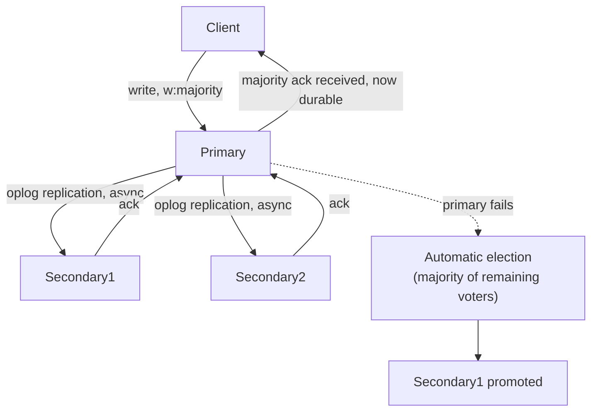
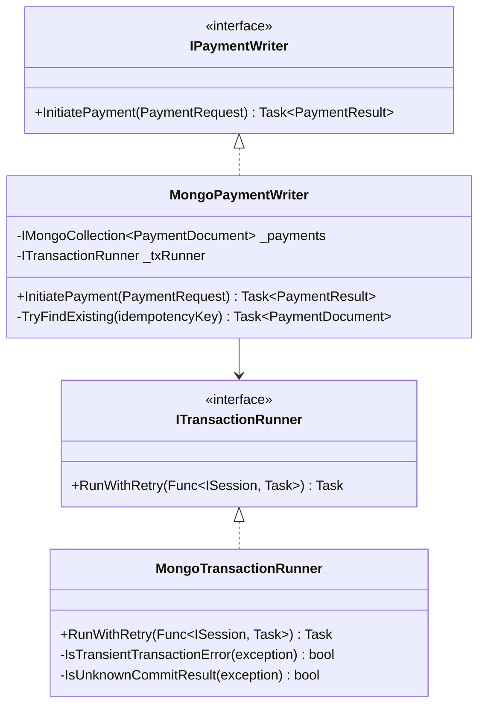
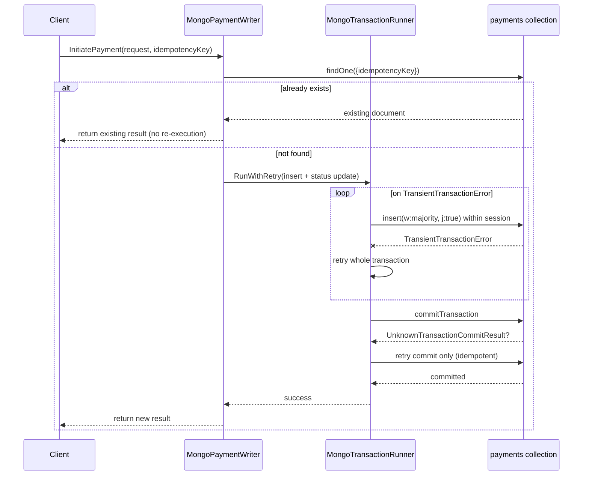

# Module 24 — MongoDB: Consistency, Replica Sets & Multi-Document Transactions

> Domain: MongoDB | Level: Beginner → Expert | Prerequisite: [[01-Data-Modeling-Query-Patterns]], [[../05-PostgreSQL/02-Partitioning-Replication-Logical-Decoding]] (synchronous/asynchronous replication trade-offs)

---

## 1. Topic Description

### Definition

A **replica set** is MongoDB's unit of high availability: one primary accepting writes, plus secondaries that replicate the primary's **oplog** and can serve reads. Failover is a Raft-derived election requiring a majority of voting members. Layered on top, **write concern** and **read concern** are the per-operation controls that let a caller choose where on the durability/latency and consistency/staleness curves each operation sits — `w: "majority"` acknowledges only when a majority has the write, `readConcern: "majority"` returns only data that cannot be rolled back. **Multi-document transactions** provide snapshot-isolated atomicity across documents, collections and (with a caveat) shards, at a cost that makes them an exception rather than the default unit of work.

### Core sub-concepts

- **Replica set topology** — primary, secondaries, arbiters, hidden and delayed members, priority and voting configuration.
- **The oplog** — a capped collection of idempotent operations; oplog window as the bound on how long a member can be offline or a change stream can be resumed.
- **Elections** — majority requirement, election timeouts, why an even number of voting members is a mistake, and the arbiter trade-off.
- **Write concern** — `w: 1`, `w: "majority"`, `journal: true`, `wtimeout`; what each actually guarantees on failover.
- **Rollback** — writes acknowledged at `w: 1` on a primary that loses an election are discarded; the rollback files nobody reads.
- **Read concern** — `local`, `available`, `majority`, `linearizable`, `snapshot`; what each admits and costs.
- **Read preference** — `primary`, `primaryPreferred`, `secondary`, `nearest`, and tag sets for workload isolation.
- **Causal consistency and sessions** — session-scoped guarantees including read-your-own-writes across nodes, and cluster time.
- **Replication lag and staleness** — `maxStalenessSeconds`, flow control, and secondary reads returning stale data.
- **Multi-document transactions** — snapshot isolation, `transactionLifetimeLimitSeconds`, write conflicts and retry, and distributed transactions across shards.
- **Retryable writes and reads** — driver-level automatic retry on transient errors, and the idempotency machinery that makes it safe.
- **Change streams** — resume tokens, oplog dependency, and their relationship to read concern.
- **Sharding interaction** — config servers, the balancer, chunk migration, orphaned documents, and cross-shard transaction cost.
- **Failure modes** — split-brain prevention, network partitions, stepdowns during deploys, and what the driver does during a topology change.
- **Backup and PITR** — why replication is not a backup, and oplog-based point-in-time recovery.

### Where it fits

This layer sits beneath the data model from `01-Data-Modeling-Query-Patterns` and above the application's data-access code. The model determines *what* must be consistent — good document boundaries mean single-document atomicity covers most invariants and transactions are rare — while this layer determines *how strongly* and *at what cost* those guarantees are delivered. Upward, write and read concern choices are what actually set a service's durability and staleness characteristics, so they are the mechanism by which an architectural RPO or read-your-own-writes requirement becomes a runtime reality.

### Why it matters at scale

The defaults are where the danger is. A write acknowledged with `w: 1` is durable on one node only, so if that primary fails before replicating, the write is silently rolled back — the application received a success, the data is gone, and the only trace is a rollback file. Reading from secondaries scales reads and simultaneously introduces staleness that testing never reproduces, producing read-your-own-writes failures that appear as intermittent user-facing bugs. An even number of voting members means a partition can leave no majority, so the cluster has no primary and all writes fail — an availability outage caused by a topology decision. And an oplog window shorter than your longest maintenance or consumer outage means a member or a change-stream consumer cannot resume and must be fully re-synced.

### Common pitfalls / anti-patterns

- **Leaving write concern at the default for financially or legally significant writes** — `w: 1` acknowledges before replication, so an election can discard an acknowledged write; `w: "majority"` is what makes durability survive failover.
- **Reading from secondaries for flows that just wrote** — replication lag makes the write invisible, producing "I saved it and it disappeared" bugs that never reproduce in a single-node test environment.
- **An even number of voting members, or an arbiter used to reach an even count** — a partition can leave no side with a majority, so there is no primary and the cluster is unavailable for writes.
- **Sizing the oplog for normal operation rather than worst-case outage** — a secondary or change-stream consumer down longer than the oplog window cannot resume and requires a full resync at exactly the wrong moment.
- **Using multi-document transactions as the default unit of work** — they hold resources, have a lifetime limit, and produce write conflicts under contention; frequent use means the document model is wrong.
- **Ignoring `wtimeout` semantics** — a write concern timeout is *not* a rollback; the write may still be applied later, so treating the error as failure and retrying without idempotency duplicates it.
- **Treating a replica set as a backup** — a bad `deleteMany` replicates faithfully to every member in milliseconds; only backups plus oplog give point-in-time recovery.
- **Assuming `readConcern: "majority"` means fresh** — it means durable and non-rollbackable, not current; it can return older data than a `local` read.
- **Not handling stepdowns in application code** — deploys and elections cause brief primary unavailability, and code without retryable writes surfaces that as user-visible errors several times a week.

---

## 2. Beginner (10 Q&A)

**Q1. What does a replica set actually give you, and what does it not?**
**A:** Automatic failover and data redundancy: if the primary becomes unavailable, the remaining members elect a new one and the driver reconnects, usually within seconds. It also enables read scale-out and provides members for backups and analytics. What it does not give you is protection from logical errors — a mistaken delete replicates to every member immediately — nor write scale-out, since there is exactly one primary at a time. Conflating replication with backup is the mistake this distinction exists to prevent.
*Follow-up: What would you add to a replica set to protect against an accidental mass delete?*

**Q2. What is the oplog and why does its size matter?**
**A:** A capped collection on each member holding idempotent records of every write, which secondaries tail and apply. Its size determines the **oplog window** — how far back in time it reaches — and that window bounds how long a secondary can be offline and still catch up, and how long a change-stream consumer can be down and still resume. Once a member falls outside the window it needs a full initial sync, which on a large dataset is hours of load. So oplog sizing is really a decision about tolerable outage duration.
*Follow-up: How would you determine the right oplog size for your workload rather than guessing?*

**Q3. Explain write concern and what `w: "majority"` buys you.**
**A:** Write concern specifies how many members must acknowledge a write before the driver reports success. `w: 1` means only the primary has it; if that primary fails before replicating, the write is rolled back and lost despite having been acknowledged. `w: "majority"` means a majority of members have it, which is exactly the condition under which it cannot be lost to an election, because any new primary must come from that majority. Adding `journal: true` additionally requires it to be on disk rather than only in memory.
*Follow-up: What's the latency cost of `w: "majority"` across three nodes in one region, versus across regions?*

**Q4. What is a rollback and when does it happen?**
**A:** When a primary accepts writes, loses contact with the majority, and a new primary is elected without those writes, the old primary must discard them when it rejoins — that is a rollback. The discarded operations are written to rollback files that in practice nobody monitors or replays. It only affects writes that were not majority-acknowledged, which is precisely why write concern is the control that prevents it. Understanding this is what makes the default's risk concrete rather than theoretical.
*Follow-up: The application received a success response for a write that was later rolled back. How would you even detect that?*

**Q5. Walk me through the read concern levels.**
**A:** `local` returns the node's most recent data, which may later be rolled back. `available` is similar but on sharded clusters may include orphaned documents. `majority` returns only data acknowledged by a majority, so it cannot be rolled back — durable, but possibly older than `local`. `linearizable` gives the strongest guarantee, reflecting all prior successful writes, at significant latency and only for single-document reads on the primary. `snapshot` gives a consistent point-in-time view, used with transactions.
*Follow-up: Why can `majority` return older data than `local`? Isn't stronger supposed to mean fresher?*

**Q6. What is read preference and what does it cost?**
**A:** It tells the driver which members may serve a read: `primary` (default), `primaryPreferred`, `secondary`, `secondaryPreferred`, or `nearest`, optionally narrowed by tag sets. Reading from secondaries scales read throughput and can reduce latency geographically, and the cost is staleness — secondaries lag the primary by an amount that is small until it is not. `maxStalenessSeconds` bounds how stale a member may be before the driver excludes it, which turns an unbounded risk into a bounded one.
*Follow-up: Which specific application flows would you never route to a secondary?*

**Q7. Why is an even number of voting members a problem?**
**A:** Elections require a strict majority. With four voting members, a 2–2 network partition leaves neither side with three, so no primary can be elected and the cluster accepts no writes — the very failure the redundancy was meant to prevent. An odd count guarantees one side of any partition can form a majority. This is why replica sets are conventionally three or five members, and why adding a fourth "for extra safety" makes availability worse rather than better.
*Follow-up: When is an arbiter a reasonable answer, and what does it cost you?*

**Q8. What are retryable writes and why do they matter?**
**A:** The driver automatically retries certain write operations once after a transient failure such as a primary stepdown, using a session and a statement identifier so the server can recognise a duplicate and not apply it twice. That is what makes the retry safe where a naive application-level retry would risk duplication. It matters because stepdowns are routine — every rolling deploy causes one — so without retryable writes a service surfaces brief, unexplained errors to users on every maintenance operation.
*Follow-up: Which write operations are not retryable, and what do you do for those?*

**Q9. What guarantees does a causally consistent session give you?**
**A:** Within a session, reads observe writes that causally precede them, so read-your-own-writes holds even when the read is served by a secondary — the driver carries cluster time and the server waits until the node has caught up. It solves the most common practical problem with secondary reads without forcing everything to the primary. The requirements are that the operations share a session and that appropriate read and write concerns are used; the cost is that a lagging secondary may make the read wait.
*Follow-up: What happens to latency if the chosen secondary is 30 seconds behind?*

**Q10. When should you use a multi-document transaction?**
**A:** When an invariant genuinely spans documents that should not be one document — moving value between two accounts is the honest case. They give snapshot isolation and all-or-nothing semantics across collections and databases. The reasons not to use them casually are that they hold resources for their duration, have a default lifetime limit after which they abort, and produce write conflicts under contention that the application must catch and retry. Frequent need for them is a modelling signal rather than a capability requirement.
*Follow-up: Your transaction exceeds the default lifetime limit. Do you raise the limit?*

---

## 3. Intermediate (10 Q&A)

**Q1. Users report that data they just saved sometimes isn't there when the page reloads. Diagnose it.**
**A:** Almost certainly secondary reads plus replication lag: the write went to the primary, the subsequent read was routed to a secondary that had not yet applied it. It is intermittent because it depends on lag at that instant, and it never reproduces locally because a single-node development environment has no lag. I would confirm from read preference configuration and lag metrics, then fix by using a causally consistent session so the read waits for the session's own writes, or by routing that specific flow to the primary. The general lesson is that read preference is a per-flow decision, not a global setting.
*Follow-up: The team's fix is to route everything to the primary. What's your response?*

**Q2. How do you choose write concern for different classes of operation?**
**A:** By the consequence of losing the write. Financial postings, audit records and anything a regulator cares about get `w: "majority"` with journaling, accepting the latency, because a silently discarded write is unacceptable. High-volume telemetry, non-critical logs and idempotent derived data can take `w: 1` for throughput where losing a small window on failover is genuinely tolerable. The important discipline is that this is decided per operation class and written down, rather than inherited from a driver default that nobody chose — and that the tolerance is stated in business terms so it can be challenged.
*Follow-up: How would you enforce that classification in a codebase where any developer can issue a write?*

**Q3. What actually happens to an application during a primary election?**
**A:** For a few seconds there is no primary: writes fail, and drivers buffer or error depending on configuration. A well-behaved application with retryable writes and reads absorbs this and users see nothing; without them, users see errors. Long-running operations in flight are terminated. Since a rolling deploy or a maintenance operation causes a deliberate stepdown, this is a routine event rather than an exceptional one — which is why I would treat "does the application survive a stepdown without user-visible errors" as a testable requirement, exercised deliberately rather than discovered during an upgrade.
*Follow-up: How would you test stepdown resilience in a pre-production environment?*

**Q4. How do you size and monitor the oplog properly?**
**A:** Derive the window from the longest outage you intend to survive without a resync — a maintenance window, a weekend, a change-stream consumer's worst-case downtime — and size the oplog so the write rate over that period fits. Then monitor the *window in time*, not the size in bytes, because a write-rate increase silently shrinks it. I would alert when the window drops below the target, since that is the leading indicator of a future forced resync. This is one of those settings that is correct at provisioning and quietly becomes wrong as traffic grows.
*Follow-up: Your oplog window has silently dropped from 48 hours to 4. What are the possible causes?*

**Q5. How would you isolate an analytics workload from production traffic?**
**A:** Dedicated members with tag sets, so analytical queries are routed only to nodes that serve nothing else — ideally hidden members, which never receive reads by default and cannot be elected, so they carry no production responsibility. Delayed members serve a different purpose and are useful protection against logical errors. The reason this matters is that analytical scans evict the operational working set from cache, and that cost is invisible and shared: production latency degrades and nobody attributes it to the report. I would also consider whether the workload belongs in a separate system entirely.
*Follow-up: The analytics team says the hidden member's lag makes their numbers wrong. How do you respond?*

**Q6. What are the failure modes of multi-document transactions under load?**
**A:** Write conflicts, because snapshot isolation means a transaction that modifies a document another transaction has changed since the snapshot must abort — under contention this produces a high abort rate and the application spends its time retrying. There is also the lifetime limit, which terminates long transactions, and the resource cost of holding a snapshot open, which affects the storage engine's ability to reclaim old versions. The right responses are to keep transactions short and narrow, reduce contention by reshaping the data, and treat a high abort rate as a modelling signal rather than as something to tune around.
*Follow-up: How would you reduce contention on a hot counter that's currently inside a transaction?*

**Q7. How does sharding change the consistency and transaction picture?**
**A:** Transactions spanning shards become distributed transactions with a coordinator and a two-phase commit, so they are markedly more expensive and have more failure modes than single-shard ones. Reads may encounter orphaned documents left by interrupted chunk migrations unless read concern is set appropriately. The design implication is significant: a shard key that keeps related documents on the same shard turns cross-shard transactions into single-shard ones, so shard key choice is partly a *transaction* design decision, not only a distribution one.
*Follow-up: How would you choose a shard key to keep an order and its line items co-located?*

**Q8. How do you handle a `wtimeout` on a write?**
**A:** Carefully, because it is not a failure — it means the write concern was not satisfied within the timeout, but the write may well have been applied and may still replicate afterwards. Treating it as a failure and retrying without idempotency duplicates the operation. The correct handling is to make the write idempotent (a deterministic `_id`, or an upsert on a natural key) so a retry is safe, or to verify the write's presence before retrying. This is one of the clearest cases where an ambiguous outcome must be designed for rather than handled by an exception mapping.
*Follow-up: How would you design an idempotent insert for an event that has no natural unique key?*

**Q9. What's your backup and recovery design for a replica set?**
**A:** Snapshot backups from a dedicated hidden member so production is unaffected, plus the oplog for point-in-time recovery, with retention driven by the recovery objectives rather than by convenience. Critically, restores must be tested on a schedule — an untested backup is a belief. I would also add a delayed member as protection specifically against logical errors, since it gives a window in which a bad delete has not yet been applied there and can be recovered from quickly. The distinction to keep explicit is that replication protects against node failure and backups protect against mistakes.
*Follow-up: How long a delay would you configure on a delayed member, and what determines it?*

**Q10. How do you monitor replication health meaningfully?**
**A:** Replication lag per member in seconds, oplog window in time, election frequency, and the presence of unexpected rollback files — the last one is the signal that acknowledged writes are being lost and it is almost never watched. I would alert on lag against the staleness tolerance the application actually depends on rather than an arbitrary threshold, and on the oplog window against the outage-tolerance target. Election frequency matters because repeated elections usually indicate an underlying network or resource problem that will eventually produce a longer outage.
*Follow-up: You see three elections in an hour with no deployments. Where do you look?*

---

## 4. Expert / Architect (10 Q&A)

**Q1. How do you set consistency and durability policy across a service estate rather than per developer?**
**A:** Classify operations by consequence — regulated or financial writes, ordinary business writes, and disposable telemetry — and attach a mandated write concern, read concern and read preference to each class, delivered through a shared data-access library so the correct behaviour is inherited rather than remembered. The library is the enforcement mechanism; documentation is not. I would also make deviations explicit and reviewable, and expose per-class metrics so the actual behaviour in production can be audited against the policy. The point to communicate upward is that these settings *are* the RPO and staleness characteristics of the system, and leaving them at driver defaults means nobody chose them.
*Follow-up: A team wants `w: 1` on a payments write for latency reasons. How do you handle that request?*

**Q2. Design a multi-region MongoDB topology and be explicit about the trade-offs.**
**A:** The core tension is that `w: "majority"` across regions adds an inter-region round trip to every write, which for most workloads is unacceptable, while keeping the majority in one region means losing that region can leave no primary. A common shape is a majority of voting members in the primary region for write latency, plus members elsewhere for read locality and disaster recovery, accepting that a full regional loss requires a manual, data-loss-bounded intervention. If the requirement is genuinely zero-RPO across regions, the latency cost must be accepted and designed for. I would make the RPO and the failover procedure explicit numbers agreed with the business, because this is a decision that cannot be quietly defaulted.
*Follow-up: Regulation requires EU data to stay in the EU. How does that change the topology?*

**Q3. How do you decide whether an invariant needs a transaction, a different document model, or eventual consistency?**
**A:** Ask what happens if the two facts are briefly inconsistent, in business terms. If nothing meaningful, eventual consistency with a reconciliation process is cheapest and most scalable. If it must never be observable, the first choice is remodelling so the invariant lives in one document and single-document atomicity covers it — that is both cheaper and more robust than a transaction. Transactions are the answer when the entities genuinely cannot be one document, as with a transfer between two accounts. The mistake I would flag is reaching for transactions first, because it locks in a model that fights the database indefinitely.
*Follow-up: An order and an inventory decrement must be consistent. Walk me through your three options and your choice.*

**Q4. What's your position on change streams as an integration backbone?**
**A:** They work well and are resumable, which is what makes them operationally viable, but they publish your *document shape*, so every consumer becomes coupled to your internal model and a modelling change is a breaking change across the estate. They also inherit the oplog window: a consumer down longer than that cannot resume and needs a re-seed, which is a real availability dependency. My preferred shape is a change stream over a deliberately-designed outbox collection rather than over domain collections, giving the same decoupling with an explicit, owned contract. I would also monitor consumer position against the oplog window as a first-class alert.
*Follow-up: How would you migrate consumers from domain-collection streams to an outbox without a flag day?*

**Q5. How would you evaluate MongoDB Atlas or a managed service against self-managed for these capabilities?**
**A:** Managed removes the operational work that most organisations do badly — elections, backups, patching, monitoring configuration — and that is usually decisive. What I would check before committing: whether you control write and read concern and topology shape, what the tested failover time actually is, whether cross-region and tag-set configurations you need are supported, whether backups can be restored to a point in time and how fast, and whether you can stream data out for a future migration. That last point is a lock-in question rather than a feature one, and it determines whether the decision is reversible.
*Follow-up: The service's default write concern differs from your policy. How do you handle that?*

**Q6. How do you approach capacity and scaling decisions between vertical growth, read scale-out and sharding?**
**A:** In that order, because each step adds operational complexity that is hard to reverse. Vertical scaling is the cheapest fix while the working set can still be made to fit in cache. Read scale-out via secondaries addresses read-bound workloads but does nothing for writes and introduces staleness that the application must handle. Sharding addresses write throughput and data volume beyond one machine, but commits you to a shard key that is expensive to change, adds config servers and a balancer, and makes some queries and transactions cross-shard. I would want evidence that the cheaper steps are genuinely exhausted, because premature sharding is a durable mistake.
*Follow-up: What evidence would convince you that sharding is now necessary rather than premature?*

**Q7. How do you make failover and disaster recovery a tested capability rather than a documented one?**
**A:** Schedule it: planned stepdowns during business hours in production as a routine exercise, restore drills from backup into a scratch environment with a measured time-to-recover, and game days that induce the failure modes you claim to survive. Every drill should produce a measured RTO to compare against the target and a list of what surprised you. The organisational argument is that the alternative is discovering your recovery procedure during an incident, when it is most expensive and least likely to work — and in a regulated environment, evidence of testing is itself a requirement.
*Follow-up: A restore drill takes six hours against a four-hour RTO. What do you change?*

**Q8. How do you handle schema and topology changes without user-visible impact?**
**A:** Rolling changes with the application designed to tolerate them: retryable writes and reads so stepdowns are invisible, index builds run in a manner that does not block, and schema changes made additively with version-tolerant readers so old and new shapes coexist. The sequencing rule is that readers must be able to handle the new shape before writers produce it. I would also stage changes through a canary and watch error rates and latency rather than declaring success on completion. The failure mode to design against is a change that is individually safe but whose *combination* with an in-flight deploy is not.
*Follow-up: An index build on a 2 TB collection is needed. How do you run it safely in production?*

**Q9. What are the organisational risks of MongoDB's per-operation consistency controls?**
**A:** That the controls are per-operation means every developer is implicitly making durability and consistency decisions, usually by accepting a default they never saw. Across a large team that produces a system whose actual guarantees nobody can state — some writes durable, some not, some reads stale, with no map of which. The mitigation is to remove the choice from individual call sites: a shared library exposing intent-named operations that carry the right concerns, plus telemetry showing the distribution of concerns actually used in production. This is a governance problem as much as a technical one, and it does not solve itself.
*Follow-up: How would you audit what write concerns are actually being used across a hundred services?*

**Q10. What would tell you a team genuinely understands MongoDB's consistency model?**
**A:** Whether they can state, for their critical operations, what happens on failover and what a secondary read might return — and whether that answer is a decision rather than a discovery. I would look for write concern chosen per operation class rather than defaulted, read preference decided per flow, retryable writes enabled and stepdown-tested, an oplog window sized against a stated outage tolerance, and backups whose restore has been timed. The clearest negative signal is a team that has enabled secondary reads globally for performance, because it means staleness was treated as a configuration setting rather than as a change to the system's contract with its users.
*Follow-up: You find exactly that: global secondary reads, added a year ago for performance. How do you unwind it?*

---

## 5. Reference Material

> Retained from the original module: deep-dive internals, diagrams, production examples, exercises, system/low-level design, debugging walkthroughs and the Principal Engineer perspective.

### 1. Fundamentals

#### What is a replica set, and what are read/write concerns?
A **replica set** is MongoDB's native replication unit — a primary node accepting all writes, plus secondary nodes replicating the primary's oplog (operation log) asynchronously by default, with automatic failover electing a new primary if the current one becomes unavailable. **Write concern** and **read concern** are per-operation, tunable knobs controlling exactly how much durability/consistency a given read or write demands — MongoDB's answer to the same availability-vs-consistency trade-off spectrum covered for PostgreSQL and SQL Server, but exposed as an explicit, per-operation parameter rather than a database-wide or connection-level setting.

#### Why does this matter?
Every write/read against a replicated MongoDB deployment has an implicit or explicit consistency guarantee — misunderstanding the *default* write concern (`w: 1`, acknowledged by the primary alone, not yet replicated) is a common source of "I thought this was durable but it wasn't" data-loss surprises during a primary failover.

#### When does this matter?
Any production MongoDB deployment (which is always a replica set, even a single-primary one, for HA); the depth matters for correctly choosing write/read concerns per operation's actual durability requirement, and for understanding multi-document transactions' real cost/limitations before reaching for them reflexively.

#### How does it work (30,000-ft view)?
```javascript
db.orders.insertOne(
  { customerId, total },
  { writeConcern: { w: "majority", j: true } } // acknowledged only once a majority of replica-set members have it, durably
);
```

### 2. Deep Dive

#### 2.1 Write Concern — Precisely What Each Level Guarantees
- **`w: 1`** (default): acknowledged once the **primary alone** has applied the write — fast, but a primary crash before replicating to any secondary loses this write on failover (the newly-elected primary, promoted from a secondary that never received it, has no record of it — a **rollback** scenario if the old primary later rejoins as a secondary and its un-replicated writes are discarded).
- **`w: "majority"`**: acknowledged once a **majority** of voting replica-set members have applied the write — survives a single-node failure without data loss, since any newly-elected primary (itself part of that majority, by the election protocol's requirements) will have the write.
- **`j: true`** (journal): additionally requires the acknowledging node(s) to have durably written to their on-disk journal, not just applied in memory — protects against losing the write even if that specific node crashes immediately after acknowledging (before its own next checkpoint).

#### 2.2 Read Concern and Read Preference — Two Distinct, Often-Confused Settings
**Read preference** (`primary`, `secondary`, `secondaryPreferred`, `nearest`) controls **which node** a read is routed to — a read-scaling/latency lever, not a consistency one. **Read concern** (`local`, `available`, `majority`, `linearizable`) controls **what data is visible** for that read, independent of which node serves it — `"majority"` read concern guarantees the returned data has been acknowledged by a majority (and thus won't be rolled back later), while `"local"` (the default) can return data that a subsequent failover/rollback might later undo. Conflating these two settings — assuming routing a read to a secondary (`read preference`) automatically implies any particular consistency guarantee (`read concern`) — is a common, real MongoDB misunderstanding.

#### 2.3 Multi-Document ACID Transactions — Real Cost and When They're Actually Needed
MongoDB (4.0+) supports multi-document ACID transactions across a replica set (and, since 4.2, across a sharded cluster) — but they carry meaningfully higher overhead than single-document operations (which have always been atomic in MongoDB, a fact frequently under-appreciated: a single `updateOne` modifying multiple fields within one document is already fully atomic without needing an explicit transaction at all). Reaching for a multi-document transaction should follow directly from the **data-modeling decision** — if a relationship is correctly embedded within one document, no transaction is needed at all for what would otherwise be a "multi-entity" update in a relational schema; transactions become necessary specifically when a genuine business operation must atomically span **multiple separate documents/collections** that couldn't reasonably be embedded together.

#### 2.4 Oplog-Based Replication and Idempotent Operation Application
MongoDB's replication mechanism replicates the **oplog** (a log of applied operations) to secondaries, which apply each operation independently — critically, oplog entries are designed to be **idempotent** (an oplog entry for "set field X to value Y," not "increment field X by 1," even if the original operation was an increment) specifically so that re-applying an oplog entry (e.g., during a resync, or if a secondary catches up from a slightly-behind position) never double-applies an effect — a deliberate design choice directly enabling safe replication-recovery semantics.

#### 2.5 Change Streams — MongoDB's Native CDC
**Change streams** (`db.collection.watch`) provide a native, resumable API for subscribing to real-time changes on a collection/database — directly analogous to PostgreSQL's logical decoding/CDC, but built into MongoDB's own driver-level API rather than requiring an external tool like Debezium — a resumable change stream (tracked via a resume token) can pick back up after a consumer disconnects without missing changes, provided the oplog hasn't rotated past the disconnection point in the meantime (directly analogous to PostgreSQL's replication-slot WAL-retention concern,, though change streams don't retain unbounded history the way an unconsumed replication slot does — they're bounded by the oplog's own retention window).

### 3. Visual Architecture

```mermaid
graph TB
 Client -->|write, w:majority| Primary
 Primary -->|oplog replication, async| Secondary1
 Primary -->|oplog replication, async| Secondary2
 Secondary1 -->|ack| Primary
 Secondary2 -->|ack| Primary
 Primary -->|majority ack received, now durable| Client
 Primary -.->|primary fails| Election["Automatic election<br/>(majority of remaining voters)"]
 Election --> NewPrimary[Secondary1 promoted]
```

### 4. Production Example
**Scenario**: A financial-transaction-adjacent service used the default write concern (`w: 1`) for all writes — during an unplanned primary failover (a hardware failure), several recently-written transactions that had been acknowledged to clients as successful were **lost**, since they had never replicated to any secondary before the primary crashed, and the newly-elected primary (promoted from a secondary lacking those writes) had no record of them; worse, when the old primary later recovered and rejoined the replica set as a secondary, its un-replicated writes were explicitly rolled back (written to a rollback file) to bring it in sync with the new primary's now-authoritative oplog. **Investigation**: confirmed via the rollback files' contents that the lost writes were genuinely acknowledged to clients (the client received a success response) before the crash. **Fix**: changed write concern to `{ w: "majority", j: true }` for all financially-significant writes, accepting the added latency (waiting for a majority acknowledgment plus journal durability) in exchange for eliminating this exact data-loss class going forward. **Lesson**: MongoDB's default write concern (`w: 1`) is optimized for throughput/latency, not durability — any operation where "acknowledged but later lost" is unacceptable must explicitly opt into `"majority"` write concern; this is not a rare edge case but the default, ordinary behavior of an unconfigured write, directly analogous to PostgreSQL's asynchronous-replication data-loss window — the exact same availability-vs-durability trade-off, expressed as a different but conceptually identical per-operation knob.

### 11. Coding Exercises

#### Easy — Explicit majority write concern for a critical write
```javascript
db.payments.insertOne(
  { orderId, amount, status: "completed" },
  { writeConcern: { w: "majority", j: true } }
);
// Explicit, deliberate durability choice -- NOT relying on the w:1 default for a financially-critical write.
```

#### Medium — Read preference and read concern combined correctly for a checkout-gating read
```javascript
db.inventory.findOne(
  { sku: "WIDGET-1" },
  { readPreference: "primary", readConcern: { level: "majority" } }
);
// Freshest possible data (primary) + rollback-safety guarantee (majority) --
// appropriate for a stock check immediately gating a payment authorization (Advanced Q6).
```

#### Hard — Multi-document transaction for a genuinely cross-document operation (Advanced Q4)
```javascript
const session = client.startSession;
try {
  session.startTransaction({
      readConcern: { level: "majority" },
        writeConcern: { w: "majority", j: true }
  });

  await db.warehouses.updateOne(
    { _id: sourceWarehouseId }, { $inc: { "stock.WIDGET-1": -10 } }, { session }
  );
  await db.warehouses.updateOne(
    { _id: destWarehouseId }, { $inc: { "stock.WIDGET-1": 10 } }, { session }
  );

  await session.commitTransaction;
} catch (error) {
  await session.abortTransaction;
  throw error;
} finally {
  session.endSession;
}
```

#### Expert — Resumable change-stream consumer with durable resume-token persistence (Advanced Q7)
```javascript
async function runChangeStreamConsumer(db) {
  const lastToken = await db.collection("_resumeTokens").findOne({ _id: "orderEvents" });
  const changeStream = db.collection("orders").watch([], {
      resumeAfter: lastToken?.token,
        fullDocument: "updateLookup"
  });

  for await (const change of changeStream) {
    await processOrderEvent(change); // application-specific event handling

    // Persist the resume token DURABLY after each processed event, not just in-process memory --
    // survives a consumer restart without losing position or reprocessing already-handled events.
    await db.collection("_resumeTokens").updateOne(
      { _id: "orderEvents" },
      { $set: { token: change._id } },
      { upsert: true }
    );
  }
}
```
**Discussion**: Persisting the resume token to the database itself (rather than in-memory) is precisely what makes this consumer resilient to a process restart — without it, a restarted consumer would either reprocess the entire oplog from the beginning (if no resume position is available at all) or, worse, silently start from "now," skipping any events that occurred during the downtime — directly the durable-checkpoint pattern Advanced Q7 requires.

### 12. System Design

**Scenario: design the replica-set/consistency architecture underpinning a real-time payment-settlement ledger** — a service that records payment-initiation, authorization, and settlement events, exposed to both a customer-facing "payment status" API and an internal settlement-reconciliation pipeline.

**Requirements.**
- *Functional:* record every payment-lifecycle event durably; expose current payment status to customers with low latency; support idempotent retry of payment initiation (§Expert Q5); feed a downstream ledger/reconciliation system via change streams.
- *Non-functional:* zero tolerance for a silently-lost acknowledged payment write (directly Module 24's central incident); RTO under 30 seconds for a primary failure; RPO effectively zero for payment writes; read-your-own-writes consistency for a customer checking their own just-submitted payment's status (§Expert Q1); auditable, regionally-compliant data placement for EU customers (§Expert Q7).

**Core flows, treated separately.** **Payment-write flow:** client submits a payment intent with an idempotency key → server checks for an existing record with that key (Expert Q5) → if none, inserts with `{ w: "majority", j: true }` → returns the durable result. **Status-read flow:** client queries payment status, using a causally-consistent session (Expert Q1) tied to the session that performed the write, so a customer's own just-submitted payment is visible even if the read is served by a lagging secondary.

**Architecture and components.** A replica set (or, at scale, a sharded cluster with per-shard replica sets, Module 23 §9) holds the `payments` collection as the append-only system of record for lifecycle events. A separate `paymentStatus` collection (or a materialized, denormalized `currentStatus` field on the payment document, updated atomically as new lifecycle events arrive) serves the fast customer-facing status read, avoiding an aggregation over the full event history on every status check. A change-stream consumer (§Expert Q8) pushes committed events to the downstream ledger/reconciliation system, with a durably-persisted resume token and continuous lag monitoring against the oplog retention window.

**Database/schema selection.** `payments`: `{ _id, idempotencyKey (unique index), amount: Decimal128, currency, status, events: [...] , createdAt }` — the unique index on `idempotencyKey` is the structural backbone of Expert Q5's double-submit/lost-response handling. Write concern `{ w: "majority", j: true }` on every payment-lifecycle write, non-negotiable per Module 24's central lesson.

**Caching.** The customer-facing status endpoint may cache a **just-written** status locally (in the same request/session context) to avoid a redundant read round-trip immediately after a write the caller already knows the outcome of — but any cache serving *other* callers must respect the causal-consistency/staleness requirements above, not silently serve arbitrarily stale cached status.

**Messaging.** Change streams (not polling) drive the downstream ledger feed — lower latency and lower load on the `payments` collection than a periodic poll-based reconciliation query, with the durable-resume-token discipline (§Expert Q8) as the resilience mechanism against consumer downtime.

**Scaling.** Read-heavy status-check traffic is scaled via secondary read routing (§9) for non-critical reads; write throughput scales via sharding (Module 23 §9) on a key co-locating a given payment's own lifecycle events on one shard (avoiding cross-shard-transaction cost, §Expert Q4) while distributing across many distinct payments/customers.

**Failure handling.** Primary failover is handled by the replica set's automatic election (§3 diagram); application-level retry logic uses the driver's `withTransaction`-style error-label discipline (§Expert Q3) for any multi-document operation, and idempotency-key-based safe retry (§Expert Q5) for the payment-initiation operation as a whole, regardless of *which* underlying failure (network, election, transient error) caused the retry.

**Monitoring.** Replication lag per secondary (leading indicator for both `w: "majority"` latency degradation and DR readiness, §9); change-stream consumer lag against oplog retention (§Expert Q8); write-concern-satisfaction latency distribution (p50/p99) as a direct signal of whether the majority-write-concern cost is within acceptable bounds; periodic game-day chaos-testing results (§Expert Q6) tracked over time as a trend, not a one-off exercise.

**Trade-offs.** Universal `{ w: "majority", j: true }` on payment writes accepts higher write latency in exchange for RPO ≈ 0 — the correct trade for this specific data, explicitly not applied uniformly to every collection in the platform (catalog/reference data elsewhere in the broader system correctly uses relaxed settings, Advanced Q3), directly demonstrating the per-operation-category tuning discipline (§Advanced Q10) rather than a single global consistency policy.

### 13. Low-Level Design

**Requirements.** A payment-write pathway that (a) structurally enforces majority write concern and idempotency-key checking (not left to caller discipline), (b) correctly implements the transaction-retry error-label contract (§Expert Q3) for any multi-step payment operation, and (c) is testable without requiring a live multi-node replica set for ordinary unit tests.


```mermaid
classDiagram
 class IPaymentWriter {
 <<interface>>
 +InitiatePayment(PaymentRequest) Task~PaymentResult~
 }
 class MongoPaymentWriter {
 -IMongoCollection~PaymentDocument~ _payments
 -ITransactionRunner _txRunner
 +InitiatePayment(PaymentRequest) Task~PaymentResult~
 -TryFindExisting(idempotencyKey) Task~PaymentDocument~
 }
 class ITransactionRunner {
 <<interface>>
 +RunWithRetry(Func~ISession, Task~) Task
 }
 class MongoTransactionRunner {
 +RunWithRetry(Func~ISession, Task~) Task
 -IsTransientTransactionError(exception) bool
 -IsUnknownCommitResult(exception) bool
 }
 IPaymentWriter <|.. MongoPaymentWriter
 MongoPaymentWriter --> ITransactionRunner
 ITransactionRunner <|.. MongoTransactionRunner
```

**Sequence diagram — idempotent payment initiation with transaction retry (Expert Q3 + Q5 combined).**

```mermaid
sequenceDiagram
 participant Client
 participant Writer as MongoPaymentWriter
 participant TxRunner as MongoTransactionRunner
 participant DB as payments collection

 Client->>Writer: InitiatePayment(request, idempotencyKey)
 Writer->>DB: findOne({idempotencyKey})
 alt already exists
 DB-->>Writer: existing document
 Writer-->>Client: return existing result (no re-execution)
 else not found
 Writer->>TxRunner: RunWithRetry(insert + status update)
 loop on TransientTransactionError
 TxRunner->>DB: insert(w:majority, j:true) within session
 DB--xTxRunner: TransientTransactionError
 TxRunner->>TxRunner: retry whole transaction
 end
 TxRunner->>DB: commitTransaction
 DB-->>TxRunner: UnknownTransactionCommitResult?
 TxRunner->>DB: retry commit only (idempotent)
 DB-->>TxRunner: committed
 TxRunner-->>Writer: success
 Writer-->>Client: return new result
 end
```

**Design patterns used.** **Idempotent Command pattern** (`InitiatePayment` checks for an existing result before executing, and returns the prior result on a repeat call) directly implements Expert Q5's dual-purpose idempotency-key lookup. **Strategy/Template Method** (`ITransactionRunner.RunWithRetry` encapsulates the transient-error-vs-commit-uncertainty retry contract once, reused by every transactional write path, not reimplemented per call site). **Adapter** (`ITransactionRunner` hides the MongoDB driver's specific `errorLabels` inspection behind a domain-meaningful interface).

**SOLID mapping.** *SRP*: idempotency-key lookup, transaction retry mechanics, and payment-domain logic are each owned by a distinct class. *OCP*: adding a new retriable-error category extends `MongoTransactionRunner`'s internal classification logic without changing `IPaymentWriter`'s callers. *LSP*: a test double implementing `ITransactionRunner` (e.g., one that always succeeds on the first attempt) is a valid substitute for unit tests exercising `MongoPaymentWriter`'s business logic without needing a real replica set. *ISP*: `IPaymentWriter` exposes only `InitiatePayment` to callers — no transaction/session details leak into the domain layer. *DIP*: `MongoPaymentWriter` depends on the `ITransactionRunner` abstraction, not directly on driver-level retry mechanics.

**Concurrency/thread safety.** Two concurrent requests carrying the *same* idempotency key are a real race (both could pass the `findOne` check before either inserts) — closed by the **unique index** on `idempotencyKey` at the database level, not by application-level locking: the second insert fails with a duplicate-key error, which the writer catches and treats identically to "found an existing record," making the check-then-insert race safe by database constraint rather than requiring a distributed lock.

### 14. Production Debugging

**Incident:** During a planned MongoDB version upgrade's rolling maintenance window, the replica set's primary was intentionally stepped down for a routine secondary upgrade — a controlled, expected event — but the payment-initiation service experienced a spike of customer-visible errors and, worse, a cluster of **duplicate payment records** for a small number of customers who had retried a failed request during the brief primary transition.

**Root cause:** Two separate gaps compounded. First, the application's MongoDB driver connection pool did not detect the new primary promptly — its topology-refresh interval was configured conservatively (a longer polling interval, chosen originally to reduce topology-check overhead under normal conditions), so requests continued being routed to the stepped-down former-primary for several seconds longer than the replica set's own election actually took, producing user-visible errors during that gap (directly the "effective RTO exceeds election RTO" pattern named in §Expert Q6). Second — and the more serious finding — the payment-initiation endpoint's idempotency-key check had been implemented as an **application-level check-then-insert without a unique index enforcing it at the database layer** (a gap introduced when the endpoint was first built, before the unique-index-backed pattern in §13 became standard practice) — so when a customer's client retried a failed request during the connection-pool gap, the retry's `findOne` idempotency check and the *original* request's delayed insert raced, and both inserts succeeded, producing the duplicate.

**Investigation:** Correlating the driver's connection-pool logs (topology-change events) against the replica-set's own election timestamps (`rs.status()`/oplog) showed the multi-second gap between actual election completion and the driver's observed primary change. A query against `payments` grouping by `idempotencyKey` with a count greater than one surfaced the exact duplicate records and their timestamps, all falling within that gap window.

**Fix:** Immediately, added the missing **unique index on `idempotencyKey`** (§13's structural fix), converting the race into a caught duplicate-key error rather than a silent double-insert, and reduced the driver's topology-refresh interval to tighten the effective-RTO gap. The existing duplicate records were manually reconciled against the actual downstream payment-provider settlement records to determine which was authoritative, a manual, one-off remediation.

**Prevention:** The unique-index-backed idempotency pattern (§13) was made a mandatory, reviewed requirement for every write path handling a client-retriable operation, verified via a specific code-review checklist item rather than left to individual engineer judgment; a chaos-testing exercise (§Expert Q6) — including this exact "step down primary mid-write-burst" scenario — was added to the pre-upgrade maintenance runbook, so this gap would have been caught in a controlled game-day exercise rather than during an actual maintenance window with real customer traffic.

### 15. Architecture Decision

**Context:** Choosing the consistency/durability posture for the payment-settlement ledger's write path (§12), comparing three concrete options.

| Option | Advantages | Disadvantages | Cost | Complexity | Maintainability | Scalability |
|---|---|---|---|---|---|---|
| **A. `w: 1` (default) everywhere** | Lowest write latency; simplest to reason about | RPO for payment writes equals "whatever was unreplicated at failure time" — directly Module 24's incident, unacceptable for financial writes | Lowest infra cost | Lowest | Deceptively simple — the real cost surfaces only during an actual failover | Best raw write throughput, at an unacceptable durability trade for this data |
| **B. `{w: "majority", j: true}` uniformly for all writes, including low-stakes ones** | RPO ≈ 0 everywhere; one policy, easy to explain/audit | Pays cross-region round-trip latency (§7) even for writes where it's unnecessary (e.g., an internal metrics/logging collection) | Higher (latency cost on every write) | Low (one rule) | High (no per-path judgment needed) | Write latency, not throughput, becomes the bottleneck for latency-sensitive, low-stakes paths unnecessarily |
| **C. Per-operation-category tuning via a published decision matrix (§Advanced Q10)** | Majority concern only where genuinely needed (payment/financial writes); relaxed settings for genuinely low-stakes paths, minimizing unnecessary latency cost | Requires every new write path to be explicitly classified against the matrix; a misclassification (treating a critical path as low-stakes) silently reintroduces the Module 24 risk | Lowest aggregate cost, correctly allocated | Highest (requires governance/review discipline) | Requires the matrix to be actively maintained and enforced, not just published once | Best overall — critical paths get full durability, non-critical paths keep low latency and scale |

**Recommendation:** **Option C**, with the payment-settlement ledger's specific write paths (payment initiation, authorization, settlement events) explicitly, permanently classified as "majority-write-concern-mandatory" in the decision matrix — not subject to ad-hoc reclassification — while the same platform's non-financial collections (audit logging metadata, UI-preference documents) use relaxed settings. This is Option C applied with zero ambiguity for the one collection in this system where Option A's failure mode is genuinely unacceptable, while avoiding Option B's blanket, unexamined latency tax on every other collection in the broader platform — directly the resolution this module's Advanced Q10 and Production Example both converge on, now applied as a concrete, scoped architecture decision for this specific system rather than a general principle.

### 17. Principal Engineer Perspective

**Business impact.** A duplicated payment record (§14) or a silently-lost acknowledged payment write (Module 24's central incident) is not an engineering metric — it's a customer-trust and regulatory-reportable event; a Principal Engineer frames write-concern and idempotency decisions in these terms when securing budget/priority for what might otherwise look like "just a database configuration setting" to a non-technical stakeholder.

**Engineering trade-offs.** Every consistency/durability decision in this module is a latency-vs-durability trade explicitly priced, not assumed — the Principal-level discipline is refusing to accept a default (`w: 1`, a conservative driver topology-refresh interval, an unindexed idempotency check) without first asking "what does this default cost us in the specific failure scenario we care about," since every incident in this module traces back to exactly that unexamined-default pattern.

**Technical leadership and cross-team communication.** The write/read-concern decision matrix (§Advanced Q10) and the residency-driven replica-set topology constraints (§Expert Q7) are not purely engineering artifacts — they require sign-off from compliance/risk teams (data residency, RPO/RTO commitments feeding into regulatory reporting obligations) and should be presented as auditable, versioned documents a Principal Engineer defends in a cross-functional review, not as implementation details buried in a services repository.

**Architecture governance.** The unique-index-backed idempotency pattern (§13) and the mandatory chaos-testing runbook item (§14's prevention) are exactly the kind of hard-won, incident-derived control that should become a **standing architecture-review gate** for any new client-retriable write path — governance that converts a specific, costly incident into a repeatable organizational safeguard rather than a lesson only the team that lived through it remembers.

**Cost optimization.** Universal majority write concern (Option B, §15) is the easy, defensible-sounding default, but a Principal Engineer's job includes pushing back on unexamined blanket policies that impose real latency/infrastructure cost on paths that don't need it — Option C's per-category tuning requires more governance overhead but is the more defensible cost posture once actually measured and justified per path.

**Risk analysis.** The chaos-testing exercise (§Expert Q6) exists specifically because documented RTO/RPO numbers that have never been adversarially tested are *claims*, not *verified properties* — a Principal Engineer treats an untested DR runbook as a known, open risk item requiring active remediation (scheduling and running the exercise), not as a completed control simply because a document describing it exists.

**Long-term maintainability.** The decision matrix, the idempotency-key discipline, and the shard-key/zone-sharding residency constraints all require **active, ongoing maintenance** as the system evolves — a matrix entry or a residency constraint that was correct at design time can silently become stale as new write paths are added or new regulatory requirements emerge, meaning these governance artifacts need an explicit owner and a periodic review cadence, not a one-time authoring exercise treated as permanently complete.

### 18. Revision
**Key takeaways**: Default write concern (`w: 1`) can lose an acknowledged write on primary failover — use `{w: "majority", j: true}` for any operation where this is unacceptable. Read preference (which node) and read concern (what data-visibility guarantee) are independent settings — never conflate them. Single-document operations are already atomic in MongoDB without a transaction; multi-document transactions are for genuinely necessary cross-document atomicity, not a substitute for correct embedding. Oplog idempotency enables safe replication recovery; change streams are MongoDB's native, resumable CDC mechanism, bounded by oplog retention rather than PostgreSQL's unboundedly-retaining replication slots.

---

**Next**: This completes the `06-MongoDB` domain (Modules 23–24). Continuing autonomously to `07-Redis`.
