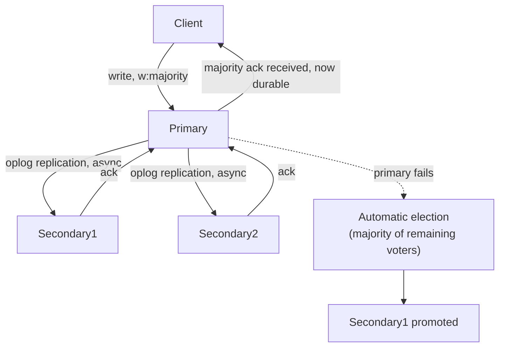
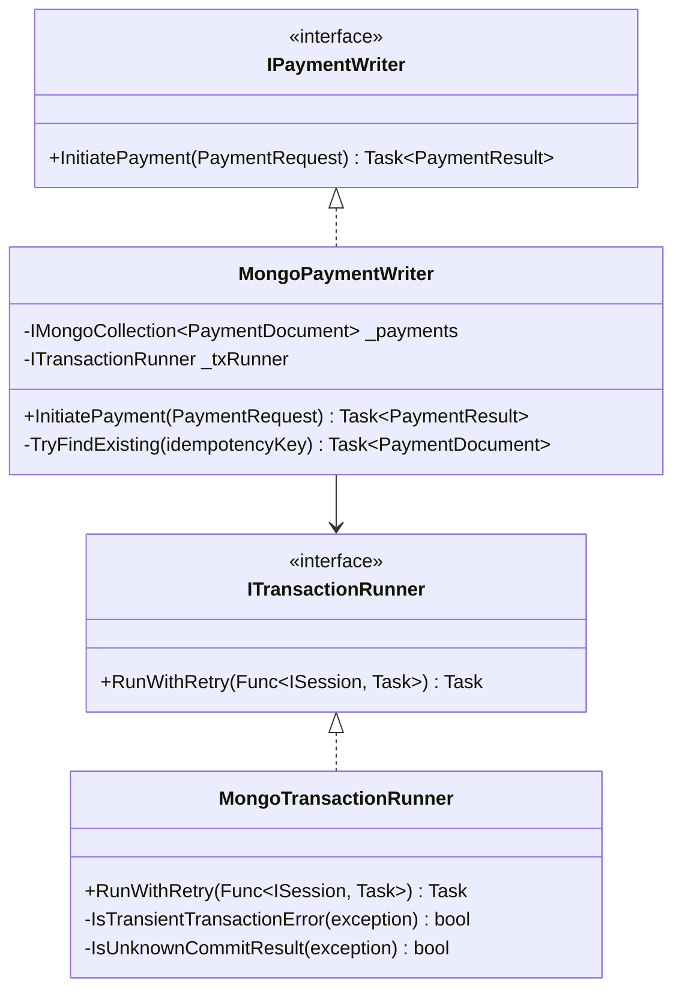
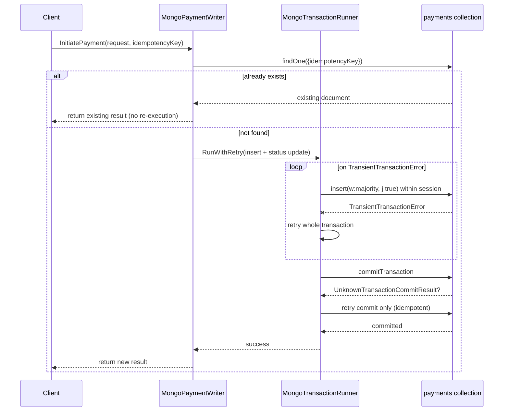

# Module 24 — MongoDB: Consistency, Replica Sets & Multi-Document Transactions

> Domain: MongoDB | Level: Beginner → Expert | Prerequisite: [[01-Data-Modeling-Query-Patterns]], [[../05-PostgreSQL/02-Partitioning-Replication-Logical-Decoding]] (synchronous/asynchronous replication trade-offs)

---

## 1. Fundamentals

### What is a replica set, and what are read/write concerns?
A **replica set** is MongoDB's native replication unit — a primary node accepting all writes, plus secondary nodes replicating the primary's oplog (operation log) asynchronously by default, with automatic failover electing a new primary if the current one becomes unavailable. **Write concern** and **read concern** are per-operation, tunable knobs controlling exactly how much durability/consistency a given read or write demands — MongoDB's answer to the same availability-vs-consistency trade-off spectrum covered for PostgreSQL and SQL Server, but exposed as an explicit, per-operation parameter rather than a database-wide or connection-level setting.

### Why does this matter?
Every write/read against a replicated MongoDB deployment has an implicit or explicit consistency guarantee — misunderstanding the *default* write concern (`w: 1`, acknowledged by the primary alone, not yet replicated) is a common source of "I thought this was durable but it wasn't" data-loss surprises during a primary failover.

### When does this matter?
Any production MongoDB deployment (which is always a replica set, even a single-primary one, for HA); the depth matters for correctly choosing write/read concerns per operation's actual durability requirement, and for understanding multi-document transactions' real cost/limitations before reaching for them reflexively.

### How does it work (30,000-ft view)?
```javascript
db.orders.insertOne(
  { customerId, total },
  { writeConcern: { w: "majority", j: true } } // acknowledged only once a majority of replica-set members have it, durably
);
```

---

## 2. Deep Dive

### 2.1 Write Concern — Precisely What Each Level Guarantees
- **`w: 1`** (default): acknowledged once the **primary alone** has applied the write — fast, but a primary crash before replicating to any secondary loses this write on failover (the newly-elected primary, promoted from a secondary that never received it, has no record of it — a **rollback** scenario if the old primary later rejoins as a secondary and its un-replicated writes are discarded).
- **`w: "majority"`**: acknowledged once a **majority** of voting replica-set members have applied the write — survives a single-node failure without data loss, since any newly-elected primary (itself part of that majority, by the election protocol's requirements) will have the write.
- **`j: true`** (journal): additionally requires the acknowledging node(s) to have durably written to their on-disk journal, not just applied in memory — protects against losing the write even if that specific node crashes immediately after acknowledging (before its own next checkpoint).

### 2.2 Read Concern and Read Preference — Two Distinct, Often-Confused Settings
**Read preference** (`primary`, `secondary`, `secondaryPreferred`, `nearest`) controls **which node** a read is routed to — a read-scaling/latency lever, not a consistency one. **Read concern** (`local`, `available`, `majority`, `linearizable`) controls **what data is visible** for that read, independent of which node serves it — `"majority"` read concern guarantees the returned data has been acknowledged by a majority (and thus won't be rolled back later), while `"local"` (the default) can return data that a subsequent failover/rollback might later undo. Conflating these two settings — assuming routing a read to a secondary (`read preference`) automatically implies any particular consistency guarantee (`read concern`) — is a common, real MongoDB misunderstanding.

### 2.3 Multi-Document ACID Transactions — Real Cost and When They're Actually Needed
MongoDB (4.0+) supports multi-document ACID transactions across a replica set (and, since 4.2, across a sharded cluster) — but they carry meaningfully higher overhead than single-document operations (which have always been atomic in MongoDB, a fact frequently under-appreciated: a single `updateOne` modifying multiple fields within one document is already fully atomic without needing an explicit transaction at all). Reaching for a multi-document transaction should follow directly from the **data-modeling decision** — if a relationship is correctly embedded within one document, no transaction is needed at all for what would otherwise be a "multi-entity" update in a relational schema; transactions become necessary specifically when a genuine business operation must atomically span **multiple separate documents/collections** that couldn't reasonably be embedded together.

### 2.4 Oplog-Based Replication and Idempotent Operation Application
MongoDB's replication mechanism replicates the **oplog** (a log of applied operations) to secondaries, which apply each operation independently — critically, oplog entries are designed to be **idempotent** (an oplog entry for "set field X to value Y," not "increment field X by 1," even if the original operation was an increment) specifically so that re-applying an oplog entry (e.g., during a resync, or if a secondary catches up from a slightly-behind position) never double-applies an effect — a deliberate design choice directly enabling safe replication-recovery semantics.

### 2.5 Change Streams — MongoDB's Native CDC
**Change streams** (`db.collection.watch`) provide a native, resumable API for subscribing to real-time changes on a collection/database — directly analogous to PostgreSQL's logical decoding/CDC, but built into MongoDB's own driver-level API rather than requiring an external tool like Debezium — a resumable change stream (tracked via a resume token) can pick back up after a consumer disconnects without missing changes, provided the oplog hasn't rotated past the disconnection point in the meantime (directly analogous to PostgreSQL's replication-slot WAL-retention concern,, though change streams don't retain unbounded history the way an unconsumed replication slot does — they're bounded by the oplog's own retention window).

## 3. Visual Architecture

```mermaid
graph TB
 Client -->|write, w:majority| Primary
 Primary -->|oplog replication, async| Secondary1
 Primary -->|oplog replication, async| Secondary2
 Secondary1 -->|ack| Primary
 Secondary2 -->|ack| Primary
 Primary -->|majority ack received, now durable| Client
 Primary -.->|primary fails| Election["Automatic election<br/>(majority of remaining voters)"]
 Election --> NewPrimary[Secondary1 promoted]
```

## 4. Production Example
**Scenario**: A financial-transaction-adjacent service used the default write concern (`w: 1`) for all writes — during an unplanned primary failover (a hardware failure), several recently-written transactions that had been acknowledged to clients as successful were **lost**, since they had never replicated to any secondary before the primary crashed, and the newly-elected primary (promoted from a secondary lacking those writes) had no record of them; worse, when the old primary later recovered and rejoined the replica set as a secondary, its un-replicated writes were explicitly rolled back (written to a rollback file) to bring it in sync with the new primary's now-authoritative oplog. **Investigation**: confirmed via the rollback files' contents that the lost writes were genuinely acknowledged to clients (the client received a success response) before the crash. **Fix**: changed write concern to `{ w: "majority", j: true }` for all financially-significant writes, accepting the added latency (waiting for a majority acknowledgment plus journal durability) in exchange for eliminating this exact data-loss class going forward. **Lesson**: MongoDB's default write concern (`w: 1`) is optimized for throughput/latency, not durability — any operation where "acknowledged but later lost" is unacceptable must explicitly opt into `"majority"` write concern; this is not a rare edge case but the default, ordinary behavior of an unconfigured write, directly analogous to PostgreSQL's asynchronous-replication data-loss window — the exact same availability-vs-durability trade-off, expressed as a different but conceptually identical per-operation knob.
## 10. Interview Questions

### Basic (10)
1. **Q: What is a replica set?** **A:** MongoDB's native replication unit — a primary accepting writes plus secondaries replicating asynchronously, with automatic failover.
2. **Q: What is write concern?** **A:** A per-operation setting controlling how many replica-set members must acknowledge a write before it's considered successful.
3. **Q: What is the default write concern?** **A:** `w: 1` — acknowledged by the primary alone.
4. **Q: What does `w: "majority"` guarantee that `w: 1` doesn't?** **A:** The write survives a single-node failure/failover without being lost, since a majority (including any newly-elected primary) has it.
5. **Q: What is read preference?** **A:** Which node (primary, secondary, nearest) a read is routed to.
6. **Q: What is read concern?** **A:** What data-visibility/durability guarantee a read has, independent of which node serves it.
7. **Q: Are single-document updates atomic in MongoDB without an explicit transaction?** **A:** Yes — a single document's update has always been atomic in MongoDB.
8. **Q: What are multi-document transactions for?** **A:** Atomically spanning genuinely separate documents/collections, when the operation can't be modeled as a single-document update.
9. **Q: What is a change stream?** **A:** A native, resumable API for subscribing to real-time changes on a collection/database.
10. **Q: What does the journal (`j: true`) write-concern option add?** **A:** Requires the acknowledging node to have durably written to its on-disk journal, not just applied the change in memory.

### Intermediate (10)
1. **Q: Why can a write acknowledged under `w: 1` be lost during a primary failover?** **A:** It was only applied on the primary, never replicated to any secondary, before the primary crashed — the newly-elected primary (promoted from a secondary lacking that write) has no record of it, and the old primary's un-replicated write is later rolled back when it rejoins as a secondary.
2. **Q: Why is conflating read preference and read concern a common, real mistake?** **A:** They're independent settings — routing a read to a secondary (preference) says nothing about whether the data returned might later be rolled back (concern); a team might assume "we read from a secondary" implies some consistency property it doesn't actually guarantee without also setting an appropriate read concern.
3. **Q: Why should reaching for a multi-document transaction prompt reconsidering the data model first?** **A:** If the operation naturally fits within one document (embedding the related data), it's already atomic without a transaction at all — needing a transaction across multiple documents often signals the schema should have embedded the data instead, unless the relationship is genuinely a reference-appropriate one per the framework.
4. **Q: Why are oplog entries designed to be idempotent?** **A:** So re-applying an entry (during resync, catch-up, or replication retry) never double-applies its effect — an oplog entry records the resulting state ("set X to Y"), not the operation itself ("increment X"), specifically to make safe re-application possible.
5. **Q: What's the risk of a change-stream consumer disconnecting for an extended period?** **A:** If the oplog rotates past the consumer's last-processed position before it reconnects, the resume token becomes invalid, and the consumer can't resume from where it left off without a full resync — bounded by oplog retention, unlike PostgreSQL's replication slots which retain WAL indefinitely for an unconsumed slot.
6. **Q: Why does `j: true` matter in addition to `w: "majority"` for the strongest durability guarantee?** **A:** `w: "majority"` alone guarantees a majority of nodes have *applied* the write, but without `j: true`, an acknowledging node could still lose the write if it crashes before its own next journal checkpoint — `j: true` closes that specific node-level durability gap.
7. **Q: Why might `secondaryPreferred` read preference be risky for a "show my just-placed order" page?** **A:** Secondaries replicate asynchronously and can lag behind the primary — a read immediately following a write, routed to a lagging secondary, might not yet reflect that write at all, showing a confusing "order not found" experience immediately after the user just placed it.
8. **Q: What's the relationship between MongoDB's write concern and PostgreSQL's synchronous/asynchronous replication settings?** **A:** They're conceptually the same durability-vs-latency trade-off, expressed differently: PostgreSQL's synchronous replication is a database/connection-level setting; MongoDB's write concern is explicitly tunable per individual operation, letting a single application choose different durability levels for different operations' actual criticality.
9. **Q: Why is single-document atomicity in MongoDB "frequently under-appreciated," per this module's framing?** **A:** Engineers with a relational background often assume atomicity requires an explicit, multi-statement transaction (as in SQL) — MongoDB's single-document operations are atomic by default with no explicit transaction needed, meaning many operations relationally modeled as "needing a transaction" don't need one at all once correctly embedded into a single MongoDB document.
10. **Q: Why would a team explicitly choose `read concern: "linearizable"` for a specific read despite its performance cost?** **A:** It provides the strongest read guarantee (reflecting the absolute latest, majority-committed state, with additional coordination to prevent even a narrow class of stale-read edge cases `"majority"` alone doesn't fully close) — appropriate for a small number of genuinely critical reads (e.g., a read immediately gating an irreversible action) where even `"majority"` read concern's guarantees aren't quite strong enough, at real added latency cost.

### Advanced (10)
1. **Q: Diagnose the write-concern data-loss incident from first principles, and design the organizational safeguard preventing recurrence.**
 **A:** Root cause: accepting the default `w: 1` write concern for financially-critical writes without an explicit, deliberate evaluation of the failover data-loss risk it carries. Safeguard: require explicit, documented write-concern justification for every write path touching financially/business-critical data during design review (directly this course's recurring governance pattern), with `{ w: "majority", j: true }` as the default recommendation requiring explicit justification to *downgrade* from, rather than `w: 1` being the unexamined default requiring justification to *upgrade* from — flipping the default assumption specifically for critical data paths.
2. **Q: Explain precisely why a rolled-back write on a recovering former-primary is not a "bug" but MongoDB's designed, correct behavior, and what it implies for application design.**
 **A:** Once a new primary is elected and begins accepting writes based on its own oplog position, the old primary's un-replicated writes represent a **divergent history** relative to the new authoritative oplog — allowing the old primary to keep them upon rejoining would create an unresolvable conflict (two different, incompatible versions of "what happened" after the divergence point); MongoDB's designed resolution (discard the divergent writes, written to a rollback file for potential manual recovery/inspection) is the only consistent option once a new primary's oplog has become authoritative — this implies application code must explicitly plan for this exact failure mode (via `w: "majority"`, the fix) for any write where this divergence-discarding behavior is unacceptable, since the underlying mechanism is fundamental to how the replication protocol resolves primary-election conflicts, not an implementation bug to be fixed.
3. **Q: Design a hybrid consistency strategy for an e-commerce platform: strong consistency for checkout/payment writes, relaxed consistency for product-catalog browsing reads.**
 **A:** Checkout/payment writes use `{ w: "majority", j: true }` write concern and `"majority"` read concern for any read gating a payment decision (e.g., re-checking inventory immediately before charging); product-catalog browsing reads use `read preference: "nearest"` (routing to whichever replica-set member has the lowest latency, likely geographically closest) with the default `"local"` read concern, since briefly-stale catalog data (a product's price updated moments ago) is an acceptable, low-stakes trade-off for lower latency and better read-scaling — a deliberate, per-operation-type consistency strategy rather than one uniform setting applied to the entire application.
4. **Q: Explain a scenario where multi-document transactions are genuinely necessary despite a well-designed, appropriately-embedded schema.**
 **A:** A "transfer inventory between two warehouse location documents" operation — even with a well-designed schema (each warehouse's inventory correctly embedded within its own document, not over-normalized), the operation itself must atomically decrement one warehouse's stock and increment another's, spanning two genuinely separate documents that shouldn't be merged into one (they're independently large, independently queried, and conceptually distinct entities) — this is exactly the class of genuinely-necessary multi-document transaction the embedding-vs-referencing framework doesn't eliminate, since the two documents are correctly separate for other reasons, not because of a data-modeling mistake.
5. **Q: How would you design monitoring to detect a replica set at risk of the failure mode before an actual failover occurs?**
 **A:** Monitor replication lag (`rs.printSecondaryReplicationInfo`-style metrics) for any secondary falling significantly behind the primary — a consistently high-lag secondary reduces the effective "majority" available to promptly acknowledge `w: "majority"` writes (increasing their latency, or, if enough secondaries lag, potentially preventing majority acknowledgment altogether) and reduces the replica set's real resilience margin if the primary fails while secondaries are behind; alert on sustained replication lag as a leading indicator, not just on an actual failover event after the fact.
6. **Q: Explain why `read concern: "majority"` combined with `read preference: "primary"` might still be preferable to `read preference: "secondaryPreferred"` for certain critical reads, despite the read-scaling benefit lost.**
 **A:** Routing to the primary guarantees reading the absolute latest state (no replication lag at all, since it's the source of writes); combined with `"majority"` read concern, this gives both the freshest possible data and the rollback-safety guarantee — appropriate specifically for reads that are both freshness-critical and rollback-sensitive (e.g., a balance check immediately before authorizing a withdrawal), where the read-scaling benefit of routing to secondaries is a worse trade than the risk of acting on stale or later-rolled-back data for this specific, high-stakes read.
7. **Q: Design a change-stream-based event pipeline resilient to a consumer's temporary (but bounded) disconnection, addressing the oplog-rotation risk from Intermediate Q5.**
 **A:** Persist the change stream's resume token durably (in a database, not just in-process memory) after processing each batch of events, so a restarted consumer can resume from the last durably-recorded token rather than losing its position entirely on a process restart; size the oplog (`oplogSizeMB`) generously relative to the expected maximum consumer-disconnection duration the system must tolerate, and monitor consumer lag relative to the oplog's actual retention window as a proactive signal (directly analogous to the replication-slot-lag monitoring) — if a consumer's lag approaches the oplog's retention boundary, alert before the resume token becomes invalid, not after.
8. **Q: A team argues MongoDB's multi-document transactions "give us the same guarantees as a SQL Server transaction, so we can model our schema exactly like we did in SQL Server." Evaluate this.**
 **A:** Technically, multi-document transactions do provide ACID guarantees across documents — but relying on them to paper over an otherwise-unchanged, relationally-normalized schema (rather than redesigning around MongoDB's embedding strengths) sacrifices MongoDB's actual performance advantages (avoiding joins/multiple round-trips via embedding) while paying multi-document-transaction overhead on every operation that should have been a single, atomic, embedded-document update instead — the correct evaluation: transactions are a genuine, necessary tool for the specific cases Advanced Q4 describes, not a general-purpose substitute for correct MongoDB-native schema design.
9. **Q: Explain the interaction between sharding and multi-document transactions — what additional constraint does a sharded cluster impose?**
 **A:** A multi-document transaction spanning documents on **different shards** requires cross-shard coordination (a two-phase-commit-style protocol MongoDB implements internally since 4.2) — meaningfully more expensive than a single-replica-set transaction, and a strong additional argument for shard-key design (§Advanced Q3) that keeps commonly-transacted-together documents on the **same shard** wherever possible (e.g., a compound shard key including `tenantId`, ensuring a given tenant's related documents co-locate on one shard), directly connecting shard-key design decisions to transaction-cost considerations, not just query-routing efficiency alone.
10. **Q: As a Principal Engineer, how would you build a decision framework helping teams choose write/read concerns per operation without requiring every engineer to deeply understand replica-set internals from first principles?**
 **A:** Publish a small, concrete decision matrix (directly this course's recurring governance-template pattern) mapping common operation categories to recommended settings: "financial/irreversible writes → `{w: majority, j: true}` + `majority` read concern for any pre-action check"; "user-facing writes where brief data-loss-on-rare-failover is tolerable → `w: 1` acceptable, document the trade-off explicitly"; "catalog/reference-data reads → `secondaryPreferred` + `local` read concern acceptable" — giving teams a fast, reliable default recommendation per operation category, with the option to consult a deeper specialist (or this module's full content) for genuinely novel cases the matrix doesn't clearly cover, rather than requiring every engineer to independently re-derive the correct trade-off from first principles for every single write path.

### Expert (FinTech Principal Panel)

1. **Q: A customer deposits funds, then immediately views their balance — and the read is routed to a secondary that hasn't caught up, so they see the *old* balance and think the deposit failed. How do you fix this "read-your-own-writes" problem without forcing all reads to the primary?**
 **A:** This is a **monotonic/read-your-writes consistency** gap: routing reads to secondaries for scale means a client can read a replica that lags behind its own just-acknowledged write. The targeted fix is **causal consistency** — use a **causally-consistent session** (MongoDB client session with `causalConsistency: true`): the driver tracks the operation/cluster time of the write and, on the subsequent read *in the same session*, ensures the chosen node has applied at least up to that time, so the read reflects the client's own prior write even on a secondary (it may wait briefly for the secondary to catch up rather than returning stale data). This preserves secondary read-scaling for the general case while guaranteeing the specific client sees its own effects. Pair the deposit write with `w: "majority"` so the write is durable (won't be rolled back — Advanced Q2) before the read observes it; otherwise you could read-your-own-write that later vanishes on failover. Alternatives: route only this specific freshness-critical read to the primary (Advanced Q6) — simpler but loses the scaling. The Principal framing: don't fix a read-your-writes problem by sending *all* traffic to the primary; use a causally-consistent session so a client observes its own writes even off a secondary, backed by majority write concern so what it reads is durable.
 **Why correct:** Names causal/read-your-writes consistency, prescribes causally-consistent sessions (+ majority write concern for durability), and preserves secondary scaling instead of blanket primary reads.
 **Common mistakes:** Forcing all reads to the primary (loses scaling); reading a non-majority write that can roll back; assuming secondaries are always current.
 **Follow-ups:** "Why must the deposit be majority-acknowledged before the read?" / "Causal-consistent session vs. routing this read to primary — trade-offs?" / "What consistency does causal consistency *not* give you across different clients?"

2. **Q: For the single most critical read — the definitive current balance before authorizing a large withdrawal — when is `readConcern: "majority"` not strong enough, and what does `"linearizable"` add and cost?**
 **A:** `"majority"` returns data acknowledged by a majority (so it won't be rolled back — durable), but it can still return a value that's *slightly stale* relative to a write that was acknowledged after your read's snapshot was taken — it guarantees durability, not real-time recency. **`"linearizable"`** read concern guarantees you see the effect of **all writes acknowledged (majority) before the read began** — a true "most up-to-date, will-not-be-rolled-back" read, the strongest MongoDB offers. Use it only for the rare read where acting on even slightly-stale-but-durable data is unacceptable and the correctness stakes justify the cost. The cost is significant: `"linearizable"` is **primary-only**, requires `w: "majority"` writes to be meaningful, and forces the primary to confirm it's still the primary (a round trip to a majority) before returning — so it's slower and doesn't scale to secondaries. Most "balance before withdrawal" checks are adequately served by primary + `"majority"` (Advanced Q6); reserve `"linearizable"` for genuinely linearizability-requiring decisions, and even then prefer enforcing the invariant with a conditional atomic update (the withdrawal's own `$inc` guarded by a balance condition in a transaction) so correctness doesn't hinge on a separate read at all. The Principal framing: `"majority"` = durable-but-possibly-slightly-stale; `"linearizable"` = durable *and* most-recent, at a real latency/primary-only cost — use the latter sparingly, and prefer making the mutation itself atomic over relying on any read.
 **Why correct:** Distinguishes majority (durable, possibly stale) from linearizable (durable + most-recent, primary-only, costly) and prefers an atomic guarded mutation over a read where possible.
 **Common mistakes:** Assuming `"majority"` means "latest"; using `"linearizable"` everywhere (latency/scaling hit); relying on a read+decide instead of an atomic conditional update.
 **Follow-ups:** "Why is `linearizable` primary-only?" / "How does a guarded `$inc` in a transaction remove the need for the strong read?" / "Durability vs. recency — which does each read concern give you?"

3. **Q: A multi-document transaction against your payments cluster intermittently throws a `TransientTransactionError` under load. Walk through exactly why this happens and how you build correct retry handling — not just "wrap it in a try/catch and retry once."**
 **A:** `TransientTransactionError` is MongoDB's explicit signal that the **entire transaction** can be safely retried from the start — it's raised for errors like a write conflict (another transaction concurrently modified a document your transaction touched), a replica-set election occurring mid-transaction, or a transient network error, all cases where the transaction *did not commit* and retrying is safe rather than risking a double-apply. The correct pattern is a **retry loop around the whole transaction body** (not just the failing operation), inspecting the error's `errorLabels` array for `"TransientTransactionError"` specifically (not a blanket catch-and-retry-everything, which would incorrectly retry non-transient failures like a validation error) and, separately, checking for `"UnknownTransactionCommitResult"` on the **commit** step specifically — a distinct label meaning the commit's outcome is genuinely unknown (e.g., the acknowledgment was lost after the commit actually succeeded), where blindly retrying the commit is safe **only** because `commitTransaction` is itself idempotent when retried with the same transaction. MongoDB's official drivers provide a `withTransaction` convenience wrapper implementing exactly this two-label retry discipline correctly; hand-rolling a naive single try/catch around the whole operation risks either not retrying genuinely transient failures (leaving the user-facing operation failing when it should have quietly recovered) or, worse, misidentifying a non-transient failure as retriable and looping indefinitely. The Principal framing: transaction retry logic is not generic retry logic — it depends on MongoDB's specific, documented `errorLabels` contract distinguishing "safe to retry the whole transaction," "safe to retry only the commit," and "not safe to retry at all," and using the driver's own `withTransaction` helper rather than a hand-rolled loop is the correct default specifically because it already encodes this contract correctly.
 **Why correct:** Names the specific error-label contract (`TransientTransactionError` vs. `UnknownTransactionCommitResult`), explains why commit-retry is safely idempotent, and recommends the driver's built-in helper over a hand-rolled retry loop.
 **Common mistakes:** A blanket catch-and-retry without checking error labels; retrying only the failed operation rather than the whole transaction; not distinguishing commit-uncertainty retry from transaction-restart retry.
 **Follow-ups:** "Why is retrying `commitTransaction` safe even though retrying an arbitrary write usually isn't?" (commit is itself idempotent by MongoDB's transaction protocol — a repeated commit of an already-committed transaction is a no-op, not a double-apply) / "What retry-count/backoff strategy would you apply on top of `withTransaction`?"

4. **Q: Explain the two-phase-commit-style protocol MongoDB uses internally for a cross-shard transaction, and why this makes shard-key co-location (Module 23 §Advanced Q3/§Advanced Q9) a direct performance and correctness lever, not just a query-routing concern.**
 **A:** When a transaction's operations touch documents on more than one shard, MongoDB's `mongos`/coordinator internally runs a **two-phase-commit-style protocol** (since 4.2): a **prepare phase**, where every participating shard is asked to durably record the transaction's operations and vote whether it can commit (without yet making the changes externally visible), followed by a **commit phase**, where the coordinator, having received "yes" from every participant, instructs all shards to make the changes visible — with the coordinator's own decision durably recorded so that if the coordinator itself crashes mid-protocol, a recovery process can determine and complete the outcome rather than leaving participants in permanent doubt. This is meaningfully more expensive than a single-shard (or single-replica-set) transaction, which needs no cross-shard coordination round-trip at all. The direct consequence: a shard key chosen so that documents which are *typically transacted together* (e.g., the warehouse-transfer example, or — extending it — all documents belonging to one tenant, Module 23 §Advanced Q3) land on the **same shard**, converts what would be an expensive cross-shard 2PC-style transaction into a cheap, single-shard one. This means shard-key design decisions, originally motivated purely by query-routing/write-distribution concerns in Module 23, have a **second, independent justification**: minimizing cross-shard transaction cost for whatever operations the application's actual transactional boundaries turn out to be.
 **Why correct:** Explains the prepare/commit phases and coordinator-crash-recovery property accurately, and draws the direct, correct connection from cross-shard transaction cost back to shard-key co-location design.
 **Common mistakes:** Treating cross-shard and single-shard transactions as equally cheap; not connecting shard-key design to transaction cost, evaluating it purely on query-routing grounds.
 **Follow-ups:** "What happens if the coordinator crashes between prepare and commit?" (a recovery process using the durably-recorded coordinator decision resumes and completes the protocol — the same class of guarantee a distributed 2PC/Saga coordinator needs) / "Why is this a strong argument for tenant-scoped shard keys in a multi-tenant transactional workload?"

5. **Q: Design retryable-writes-based idempotency for a payment-initiation API backed by MongoDB, addressing the specific "client never received the success response" scenario separately from "client double-submitted."**
 **A:** Two distinct failure classes need two distinct mechanisms, and conflating them is the common mistake. **Double-submit** (the client, e.g., a retried HTTP request from a flaky mobile network, sends the *same logical payment request* twice) is solved at the **application/domain layer**: an idempotency key (a client-generated or client-supplied UUID for "this specific payment intent") stored as a unique-indexed field on the `payments` collection — a second insert attempt with the same key fails the unique-index constraint, and the handler catches that specific failure and returns the *original* operation's recorded result rather than creating a duplicate payment, directly the idempotency-key discipline this repo's FinTech modules apply generally, now grounded in a concrete MongoDB unique-index mechanism. **"Response lost after the write succeeded"** (the server durably wrote and would have returned success, but the acknowledgment never reached the client, e.g., a network partition after `w: "majority"` was satisfied) is solved by the *same* idempotency-key lookup: on any retry, the handler's first step is checking whether a payment with this idempotency key already exists and, if so, returning its already-durable result rather than re-executing the payment logic at all — meaning the "was it already done" check and the "prevent duplicate" check are the same mechanism, not two separate ones. MongoDB's own **retryable writes** feature (`retryWrites=true`, default in modern drivers) additionally protects at the **driver/network layer**: a single logical write operation that experiences a network error is automatically retried by the driver using an internal transaction-ID-tagged mechanism ensuring the retry doesn't double-apply *at the storage-engine level* — but this only covers a single write operation's network-level retry, not the application-level "did the whole payment-processing business logic already run" question, which is exactly what the idempotency-key-on-unique-index pattern above answers. The Principal framing: MongoDB's built-in retryable writes solve network-level write duplication; a business-level idempotency key on a unique index is still required, separately, to make the *entire payment-initiation operation* — not just one write within it — safe to retry from the client's perspective.
 **Why correct:** Correctly separates driver-level retryable writes (network-level, single-operation) from application-level idempotency keys (business-level, whole-operation), and shows both the double-submit and lost-response scenarios reduce to the same unique-index-backed lookup mechanism.
 **Common mistakes:** Assuming `retryWrites=true` alone makes the payment API idempotent; using separate mechanisms for "detect duplicate" vs. "recover lost response" instead of recognizing they're the same lookup.
 **Follow-ups:** "What does the unique index actually enforce, precisely?" (uniqueness on the idempotency-key field, so a second insert attempt with the same key throws a duplicate-key error the handler explicitly handles) / "Why isn't `retryWrites=true` alone sufficient for the double-submit case?" (it protects one write's own network retry, not two genuinely separate client-initiated requests carrying the same idempotency key).

6. **Q: You need to run a game-day chaos exercise validating your payments replica set's actual failover behavior against its documented RTO/RPO (§9). Design the exercise, and explain what a "passing" result must demonstrate beyond "the application didn't crash."**
 **A:** Design: in a production-representative (not toy) environment, forcibly step down the current primary (`rs.stepDown()`, or a harder failure — killing the primary process/instance entirely, since a graceful stepdown behaves more favorably than a real crash and testing only the graceful case overstates readiness) while a realistic, sustained write load (representative of actual payment-initiation volume, using the actual application code path, not a synthetic ping) is in flight. A passing result must demonstrate, concretely: (1) election completes within the documented RTO window (§9's ~10s+ election-timeout-driven figure, measured, not assumed); (2) **zero** writes acknowledged under `w: "majority"` before the failure are lost after the new primary is established — verified by comparing a pre-failure write-count/checksum against the post-recovery count, not merely "the app kept running"; (3) any writes that were in-flight (sent but not yet acknowledged) at the exact failure moment are either cleanly retried by the client (via retryable writes/idempotency key, Expert Q5) and end up applied exactly once, or cleanly surfaced as a failure to the caller with no ambiguous partial state; (4) application-level connection-pool/driver behavior actually re-discovers the new primary and resumes writing within an acceptable window — a real, observed failure mode is a driver/connection-pool configuration that takes far longer to detect and reroute to the new primary than the replica-set election itself takes, meaning the *effective* application-observed RTO is worse than the replica set's own election RTO, a gap chaos testing is specifically designed to surface. The Principal framing: "the application didn't crash" is not a passing result — the exercise must produce a **measured** RTO/RPO number from real, adversarial conditions, compared explicitly against the documented DR runbook's claimed numbers, with any gap treated as a finding requiring remediation, not a footnote.
 **Why correct:** Designs a realistic, adversarial (not graceful-only) test, specifies concrete, measurable pass criteria (write-loss count, measured RTO including driver reconnection time), and identifies the common real gap between replica-set-level and application-observed RTO.
 **Common mistakes:** Testing only graceful stepdown, not a hard failure; declaring success based on "the app didn't error" rather than a measured write-loss count and RTO; ignoring driver/connection-pool reconnection time as part of the effective RTO.
 **Follow-ups:** "Why might application-observed RTO exceed the replica set's own election time?" (connection-pool/driver topology-refresh interval, retry/backoff configuration, or a load balancer's own health-check interval, all adding latency on top of the raw election) / "How would you make this exercise a recurring, not one-off, practice?"

7. **Q: Your firm operates a MongoDB replica set spanning an EU region and a US region for a client-servicing application handling EU clients' personal data (GDPR-scoped). What specific replica-set-configuration decisions does this data-residency requirement force, beyond the zone-sharding answer already given for sharded collections (Module 23 §Expert Q3)?**
 **A:** Zone sharding (Module 23 §Expert Q3) solves residency for a *sharded* collection by pinning chunks to region-local shards — but a **replica set's own secondaries**, even for a correctly zone-sharded collection, are a *separate* residency question: each shard's replica set must itself be configured so that **every member holding a full copy of EU-client data** (every voting and non-voting data-bearing secondary) is physically located within the EU, not just the shard's primary — a naively-configured replica set with a "DR secondary" placed in the US region for disaster-recovery convenience would replicate the *full* EU-resident data to US soil, violating the residency requirement regardless of the sharding/zone configuration being otherwise correct. The fix is a **per-shard, region-constrained replica-set member topology**: for shards holding EU-resident data, every member (including any DR member) must be provisioned within EU infrastructure — meaning EU-data DR is achieved via **multi-AZ redundancy within the EU region**, not cross-region replication to the US, accepting a weaker regional-outage DR posture for this specific data than a non-residency-constrained collection would have, as a deliberate, documented trade-off (§15) between DR robustness and regulatory compliance. This is a case where two of this module's own recommendations — "use a cross-region secondary for DR" (§9) and "keep regulated data within its required region" — directly conflict, and residency compliance must win.
 **Why correct:** Correctly extends the sharding-level residency answer to the replica-set-membership level, identifies the specific conflict between cross-region DR and data-residency requirements, and resolves it in the compliance-favoring direction with the trade-off made explicit.
 **Common mistakes:** Assuming zone sharding alone fully solves residency without separately auditing replica-set member placement; defaulting to cross-region DR members without recognizing the residency conflict.
 **Follow-ups:** "How would you achieve acceptable DR for this EU-only replica set without violating residency?" (multi-AZ deployment within the EU region itself, plus EU-region backup/snapshot storage) / "How do you audit that no data-bearing member was ever provisioned outside the required region?" (infrastructure-as-code region constraints plus periodic automated topology audits, not a one-time manual check).

8. **Q: A settlement-reconciliation service uses change streams to consume `trades` collection changes and push them to an external ledger system. During an incident, the consumer was down for several hours (longer than the oplog's retention window), and on restart its resume token was invalid. Design the recovery procedure, and the structural fix preventing this from being a silent data-loss event next time.**
 **A:** Immediate recovery: since the resume token is invalid (the oplog has rotated past it), the consumer cannot resume incrementally — it must fall back to a **full reconciliation pass**, comparing the external ledger's current state against the `trades` collection's actual current state directly (not via the change stream at all) to identify and backfill whatever changes were missed during the outage window, exactly the reconciliation discipline this repo treats as the standing backstop for exactly this class of gap, per the CLAUDE.md instruction that reconciliation remains necessary even when a mechanism is normally reliable. This is only possible because `trades` documents, once written, are effectively immutable (Module 23 §12) — a stable point-in-time full comparison is well-defined; a mutable collection would make "what changed during the gap" much harder to reconstruct after the fact. Structural fix, addressing recurrence: (1) monitor consumer lag **continuously** against the oplog's actual retention window (§9), alerting well before the gap approaches the boundary — this incident's real failure was the *absence* of that leading-indicator alert, not the outage itself (a several-hour consumer outage is a plausible, survivable event *if* caught before oplog rotation); (2) size the oplog generously against the maximum realistic consumer-outage duration the business is willing to tolerate without a full-reconciliation fallback, an explicit capacity decision rather than a default left unexamined (§7); (3) build the "full reconciliation pass" as a **tested, on-demand-runnable tool**, not an improvised incident-time script — since the tool's correctness under real pressure is exactly what this incident needed and, if untested, is a real risk of making the recovery itself unreliable.
 **Why correct:** Provides both the immediate recovery mechanism (full reconciliation against current state, enabled specifically by trade-document immutability) and the structural fix (lag monitoring against the retention boundary as a leading indicator, deliberate oplog sizing, a pre-tested reconciliation tool).
 **Common mistakes:** Treating "resume from the beginning of the oplog" as a valid recovery option (the needed history is already gone); building the reconciliation fallback only after the incident rather than as a pre-tested standing tool.
 **Follow-ups:** "Why does trade-document immutability specifically make the reconciliation fallback tractable?" / "What would the leading-indicator alert threshold be, concretely?" (consumer lag as a percentage of oplog retention window, e.g., alert at 50% consumed, not only at imminent rotation).

---

## 11. Coding Exercises

### Easy — Explicit majority write concern for a critical write
```javascript
db.payments.insertOne(
  { orderId, amount, status: "completed" },
  { writeConcern: { w: "majority", j: true } }
);
// Explicit, deliberate durability choice -- NOT relying on the w:1 default for a financially-critical write.
```

### Medium — Read preference and read concern combined correctly for a checkout-gating read
```javascript
db.inventory.findOne(
  { sku: "WIDGET-1" },
  { readPreference: "primary", readConcern: { level: "majority" } }
);
// Freshest possible data (primary) + rollback-safety guarantee (majority) --
// appropriate for a stock check immediately gating a payment authorization (Advanced Q6).
```

### Hard — Multi-document transaction for a genuinely cross-document operation (Advanced Q4)
```javascript
const session = client.startSession;
try {
  session.startTransaction({
      readConcern: { level: "majority" },
        writeConcern: { w: "majority", j: true }
  });

  await db.warehouses.updateOne(
    { _id: sourceWarehouseId }, { $inc: { "stock.WIDGET-1": -10 } }, { session }
  );
  await db.warehouses.updateOne(
    { _id: destWarehouseId }, { $inc: { "stock.WIDGET-1": 10 } }, { session }
  );

  await session.commitTransaction;
} catch (error) {
  await session.abortTransaction;
  throw error;
} finally {
  session.endSession;
}
```

### Expert — Resumable change-stream consumer with durable resume-token persistence (Advanced Q7)
```javascript
async function runChangeStreamConsumer(db) {
  const lastToken = await db.collection("_resumeTokens").findOne({ _id: "orderEvents" });
  const changeStream = db.collection("orders").watch([], {
      resumeAfter: lastToken?.token,
        fullDocument: "updateLookup"
  });

  for await (const change of changeStream) {
    await processOrderEvent(change); // application-specific event handling

    // Persist the resume token DURABLY after each processed event, not just in-process memory --
    // survives a consumer restart without losing position or reprocessing already-handled events.
    await db.collection("_resumeTokens").updateOne(
      { _id: "orderEvents" },
      { $set: { token: change._id } },
      { upsert: true }
    );
  }
}
```
**Discussion**: Persisting the resume token to the database itself (rather than in-memory) is precisely what makes this consumer resilient to a process restart — without it, a restarted consumer would either reprocess the entire oplog from the beginning (if no resume position is available at all) or, worse, silently start from "now," skipping any events that occurred during the downtime — directly the durable-checkpoint pattern Advanced Q7 requires.

---

## 12. System Design

**Scenario: design the replica-set/consistency architecture underpinning a real-time payment-settlement ledger** — a service that records payment-initiation, authorization, and settlement events, exposed to both a customer-facing "payment status" API and an internal settlement-reconciliation pipeline.

**Requirements.**
- *Functional:* record every payment-lifecycle event durably; expose current payment status to customers with low latency; support idempotent retry of payment initiation (§Expert Q5); feed a downstream ledger/reconciliation system via change streams.
- *Non-functional:* zero tolerance for a silently-lost acknowledged payment write (directly Module 24's central incident); RTO under 30 seconds for a primary failure; RPO effectively zero for payment writes; read-your-own-writes consistency for a customer checking their own just-submitted payment's status (§Expert Q1); auditable, regionally-compliant data placement for EU customers (§Expert Q7).

**Core flows, treated separately.** **Payment-write flow:** client submits a payment intent with an idempotency key → server checks for an existing record with that key (Expert Q5) → if none, inserts with `{ w: "majority", j: true }` → returns the durable result. **Status-read flow:** client queries payment status, using a causally-consistent session (Expert Q1) tied to the session that performed the write, so a customer's own just-submitted payment is visible even if the read is served by a lagging secondary.

**Architecture and components.** A replica set (or, at scale, a sharded cluster with per-shard replica sets, Module 23 §9) holds the `payments` collection as the append-only system of record for lifecycle events. A separate `paymentStatus` collection (or a materialized, denormalized `currentStatus` field on the payment document, updated atomically as new lifecycle events arrive) serves the fast customer-facing status read, avoiding an aggregation over the full event history on every status check. A change-stream consumer (§Expert Q8) pushes committed events to the downstream ledger/reconciliation system, with a durably-persisted resume token and continuous lag monitoring against the oplog retention window.

**Database/schema selection.** `payments`: `{ _id, idempotencyKey (unique index), amount: Decimal128, currency, status, events: [...] , createdAt }` — the unique index on `idempotencyKey` is the structural backbone of Expert Q5's double-submit/lost-response handling. Write concern `{ w: "majority", j: true }` on every payment-lifecycle write, non-negotiable per Module 24's central lesson.

**Caching.** The customer-facing status endpoint may cache a **just-written** status locally (in the same request/session context) to avoid a redundant read round-trip immediately after a write the caller already knows the outcome of — but any cache serving *other* callers must respect the causal-consistency/staleness requirements above, not silently serve arbitrarily stale cached status.

**Messaging.** Change streams (not polling) drive the downstream ledger feed — lower latency and lower load on the `payments` collection than a periodic poll-based reconciliation query, with the durable-resume-token discipline (§Expert Q8) as the resilience mechanism against consumer downtime.

**Scaling.** Read-heavy status-check traffic is scaled via secondary read routing (§9) for non-critical reads; write throughput scales via sharding (Module 23 §9) on a key co-locating a given payment's own lifecycle events on one shard (avoiding cross-shard-transaction cost, §Expert Q4) while distributing across many distinct payments/customers.

**Failure handling.** Primary failover is handled by the replica set's automatic election (§3 diagram); application-level retry logic uses the driver's `withTransaction`-style error-label discipline (§Expert Q3) for any multi-document operation, and idempotency-key-based safe retry (§Expert Q5) for the payment-initiation operation as a whole, regardless of *which* underlying failure (network, election, transient error) caused the retry.

**Monitoring.** Replication lag per secondary (leading indicator for both `w: "majority"` latency degradation and DR readiness, §9); change-stream consumer lag against oplog retention (§Expert Q8); write-concern-satisfaction latency distribution (p50/p99) as a direct signal of whether the majority-write-concern cost is within acceptable bounds; periodic game-day chaos-testing results (§Expert Q6) tracked over time as a trend, not a one-off exercise.

**Trade-offs.** Universal `{ w: "majority", j: true }` on payment writes accepts higher write latency in exchange for RPO ≈ 0 — the correct trade for this specific data, explicitly not applied uniformly to every collection in the platform (catalog/reference data elsewhere in the broader system correctly uses relaxed settings, Advanced Q3), directly demonstrating the per-operation-category tuning discipline (§Advanced Q10) rather than a single global consistency policy.

## 13. Low-Level Design

**Requirements.** A payment-write pathway that (a) structurally enforces majority write concern and idempotency-key checking (not left to caller discipline), (b) correctly implements the transaction-retry error-label contract (§Expert Q3) for any multi-step payment operation, and (c) is testable without requiring a live multi-node replica set for ordinary unit tests.


```mermaid
classDiagram
 class IPaymentWriter {
 <<interface>>
 +InitiatePayment(PaymentRequest) Task~PaymentResult~
 }
 class MongoPaymentWriter {
 -IMongoCollection~PaymentDocument~ _payments
 -ITransactionRunner _txRunner
 +InitiatePayment(PaymentRequest) Task~PaymentResult~
 -TryFindExisting(idempotencyKey) Task~PaymentDocument~
 }
 class ITransactionRunner {
 <<interface>>
 +RunWithRetry(Func~ISession, Task~) Task
 }
 class MongoTransactionRunner {
 +RunWithRetry(Func~ISession, Task~) Task
 -IsTransientTransactionError(exception) bool
 -IsUnknownCommitResult(exception) bool
 }
 IPaymentWriter <|.. MongoPaymentWriter
 MongoPaymentWriter --> ITransactionRunner
 ITransactionRunner <|.. MongoTransactionRunner
```

**Sequence diagram — idempotent payment initiation with transaction retry (Expert Q3 + Q5 combined).**

```mermaid
sequenceDiagram
 participant Client
 participant Writer as MongoPaymentWriter
 participant TxRunner as MongoTransactionRunner
 participant DB as payments collection

 Client->>Writer: InitiatePayment(request, idempotencyKey)
 Writer->>DB: findOne({idempotencyKey})
 alt already exists
 DB-->>Writer: existing document
 Writer-->>Client: return existing result (no re-execution)
 else not found
 Writer->>TxRunner: RunWithRetry(insert + status update)
 loop on TransientTransactionError
 TxRunner->>DB: insert(w:majority, j:true) within session
 DB--xTxRunner: TransientTransactionError
 TxRunner->>TxRunner: retry whole transaction
 end
 TxRunner->>DB: commitTransaction
 DB-->>TxRunner: UnknownTransactionCommitResult?
 TxRunner->>DB: retry commit only (idempotent)
 DB-->>TxRunner: committed
 TxRunner-->>Writer: success
 Writer-->>Client: return new result
 end
```

**Design patterns used.** **Idempotent Command pattern** (`InitiatePayment` checks for an existing result before executing, and returns the prior result on a repeat call) directly implements Expert Q5's dual-purpose idempotency-key lookup. **Strategy/Template Method** (`ITransactionRunner.RunWithRetry` encapsulates the transient-error-vs-commit-uncertainty retry contract once, reused by every transactional write path, not reimplemented per call site). **Adapter** (`ITransactionRunner` hides the MongoDB driver's specific `errorLabels` inspection behind a domain-meaningful interface).

**SOLID mapping.** *SRP*: idempotency-key lookup, transaction retry mechanics, and payment-domain logic are each owned by a distinct class. *OCP*: adding a new retriable-error category extends `MongoTransactionRunner`'s internal classification logic without changing `IPaymentWriter`'s callers. *LSP*: a test double implementing `ITransactionRunner` (e.g., one that always succeeds on the first attempt) is a valid substitute for unit tests exercising `MongoPaymentWriter`'s business logic without needing a real replica set. *ISP*: `IPaymentWriter` exposes only `InitiatePayment` to callers — no transaction/session details leak into the domain layer. *DIP*: `MongoPaymentWriter` depends on the `ITransactionRunner` abstraction, not directly on driver-level retry mechanics.

**Concurrency/thread safety.** Two concurrent requests carrying the *same* idempotency key are a real race (both could pass the `findOne` check before either inserts) — closed by the **unique index** on `idempotencyKey` at the database level, not by application-level locking: the second insert fails with a duplicate-key error, which the writer catches and treats identically to "found an existing record," making the check-then-insert race safe by database constraint rather than requiring a distributed lock.

## 14. Production Debugging

**Incident:** During a planned MongoDB version upgrade's rolling maintenance window, the replica set's primary was intentionally stepped down for a routine secondary upgrade — a controlled, expected event — but the payment-initiation service experienced a spike of customer-visible errors and, worse, a cluster of **duplicate payment records** for a small number of customers who had retried a failed request during the brief primary transition.

**Root cause:** Two separate gaps compounded. First, the application's MongoDB driver connection pool did not detect the new primary promptly — its topology-refresh interval was configured conservatively (a longer polling interval, chosen originally to reduce topology-check overhead under normal conditions), so requests continued being routed to the stepped-down former-primary for several seconds longer than the replica set's own election actually took, producing user-visible errors during that gap (directly the "effective RTO exceeds election RTO" pattern named in §Expert Q6). Second — and the more serious finding — the payment-initiation endpoint's idempotency-key check had been implemented as an **application-level check-then-insert without a unique index enforcing it at the database layer** (a gap introduced when the endpoint was first built, before the unique-index-backed pattern in §13 became standard practice) — so when a customer's client retried a failed request during the connection-pool gap, the retry's `findOne` idempotency check and the *original* request's delayed insert raced, and both inserts succeeded, producing the duplicate.

**Investigation:** Correlating the driver's connection-pool logs (topology-change events) against the replica-set's own election timestamps (`rs.status()`/oplog) showed the multi-second gap between actual election completion and the driver's observed primary change. A query against `payments` grouping by `idempotencyKey` with a count greater than one surfaced the exact duplicate records and their timestamps, all falling within that gap window.

**Fix:** Immediately, added the missing **unique index on `idempotencyKey`** (§13's structural fix), converting the race into a caught duplicate-key error rather than a silent double-insert, and reduced the driver's topology-refresh interval to tighten the effective-RTO gap. The existing duplicate records were manually reconciled against the actual downstream payment-provider settlement records to determine which was authoritative, a manual, one-off remediation.

**Prevention:** The unique-index-backed idempotency pattern (§13) was made a mandatory, reviewed requirement for every write path handling a client-retriable operation, verified via a specific code-review checklist item rather than left to individual engineer judgment; a chaos-testing exercise (§Expert Q6) — including this exact "step down primary mid-write-burst" scenario — was added to the pre-upgrade maintenance runbook, so this gap would have been caught in a controlled game-day exercise rather than during an actual maintenance window with real customer traffic.

## 15. Architecture Decision

**Context:** Choosing the consistency/durability posture for the payment-settlement ledger's write path (§12), comparing three concrete options.

| Option | Advantages | Disadvantages | Cost | Complexity | Maintainability | Scalability |
|---|---|---|---|---|---|---|
| **A. `w: 1` (default) everywhere** | Lowest write latency; simplest to reason about | RPO for payment writes equals "whatever was unreplicated at failure time" — directly Module 24's incident, unacceptable for financial writes | Lowest infra cost | Lowest | Deceptively simple — the real cost surfaces only during an actual failover | Best raw write throughput, at an unacceptable durability trade for this data |
| **B. `{w: "majority", j: true}` uniformly for all writes, including low-stakes ones** | RPO ≈ 0 everywhere; one policy, easy to explain/audit | Pays cross-region round-trip latency (§7) even for writes where it's unnecessary (e.g., an internal metrics/logging collection) | Higher (latency cost on every write) | Low (one rule) | High (no per-path judgment needed) | Write latency, not throughput, becomes the bottleneck for latency-sensitive, low-stakes paths unnecessarily |
| **C. Per-operation-category tuning via a published decision matrix (§Advanced Q10)** | Majority concern only where genuinely needed (payment/financial writes); relaxed settings for genuinely low-stakes paths, minimizing unnecessary latency cost | Requires every new write path to be explicitly classified against the matrix; a misclassification (treating a critical path as low-stakes) silently reintroduces the Module 24 risk | Lowest aggregate cost, correctly allocated | Highest (requires governance/review discipline) | Requires the matrix to be actively maintained and enforced, not just published once | Best overall — critical paths get full durability, non-critical paths keep low latency and scale |

**Recommendation:** **Option C**, with the payment-settlement ledger's specific write paths (payment initiation, authorization, settlement events) explicitly, permanently classified as "majority-write-concern-mandatory" in the decision matrix — not subject to ad-hoc reclassification — while the same platform's non-financial collections (audit logging metadata, UI-preference documents) use relaxed settings. This is Option C applied with zero ambiguity for the one collection in this system where Option A's failure mode is genuinely unacceptable, while avoiding Option B's blanket, unexamined latency tax on every other collection in the broader platform — directly the resolution this module's Advanced Q10 and Production Example both converge on, now applied as a concrete, scoped architecture decision for this specific system rather than a general principle.

## 17. Principal Engineer Perspective

**Business impact.** A duplicated payment record (§14) or a silently-lost acknowledged payment write (Module 24's central incident) is not an engineering metric — it's a customer-trust and regulatory-reportable event; a Principal Engineer frames write-concern and idempotency decisions in these terms when securing budget/priority for what might otherwise look like "just a database configuration setting" to a non-technical stakeholder.

**Engineering trade-offs.** Every consistency/durability decision in this module is a latency-vs-durability trade explicitly priced, not assumed — the Principal-level discipline is refusing to accept a default (`w: 1`, a conservative driver topology-refresh interval, an unindexed idempotency check) without first asking "what does this default cost us in the specific failure scenario we care about," since every incident in this module traces back to exactly that unexamined-default pattern.

**Technical leadership and cross-team communication.** The write/read-concern decision matrix (§Advanced Q10) and the residency-driven replica-set topology constraints (§Expert Q7) are not purely engineering artifacts — they require sign-off from compliance/risk teams (data residency, RPO/RTO commitments feeding into regulatory reporting obligations) and should be presented as auditable, versioned documents a Principal Engineer defends in a cross-functional review, not as implementation details buried in a services repository.

**Architecture governance.** The unique-index-backed idempotency pattern (§13) and the mandatory chaos-testing runbook item (§14's prevention) are exactly the kind of hard-won, incident-derived control that should become a **standing architecture-review gate** for any new client-retriable write path — governance that converts a specific, costly incident into a repeatable organizational safeguard rather than a lesson only the team that lived through it remembers.

**Cost optimization.** Universal majority write concern (Option B, §15) is the easy, defensible-sounding default, but a Principal Engineer's job includes pushing back on unexamined blanket policies that impose real latency/infrastructure cost on paths that don't need it — Option C's per-category tuning requires more governance overhead but is the more defensible cost posture once actually measured and justified per path.

**Risk analysis.** The chaos-testing exercise (§Expert Q6) exists specifically because documented RTO/RPO numbers that have never been adversarially tested are *claims*, not *verified properties* — a Principal Engineer treats an untested DR runbook as a known, open risk item requiring active remediation (scheduling and running the exercise), not as a completed control simply because a document describing it exists.

**Long-term maintainability.** The decision matrix, the idempotency-key discipline, and the shard-key/zone-sharding residency constraints all require **active, ongoing maintenance** as the system evolves — a matrix entry or a residency constraint that was correct at design time can silently become stale as new write paths are added or new regulatory requirements emerge, meaning these governance artifacts need an explicit owner and a periodic review cadence, not a one-time authoring exercise treated as permanently complete.

## 18. Revision
**Key takeaways**: Default write concern (`w: 1`) can lose an acknowledged write on primary failover — use `{w: "majority", j: true}` for any operation where this is unacceptable. Read preference (which node) and read concern (what data-visibility guarantee) are independent settings — never conflate them. Single-document operations are already atomic in MongoDB without a transaction; multi-document transactions are for genuinely necessary cross-document atomicity, not a substitute for correct embedding. Oplog idempotency enables safe replication recovery; change streams are MongoDB's native, resumable CDC mechanism, bounded by oplog retention rather than PostgreSQL's unboundedly-retaining replication slots.

---

**Next**: This completes the `06-MongoDB` domain (Modules 23–24). Continuing autonomously to `07-Redis`.
