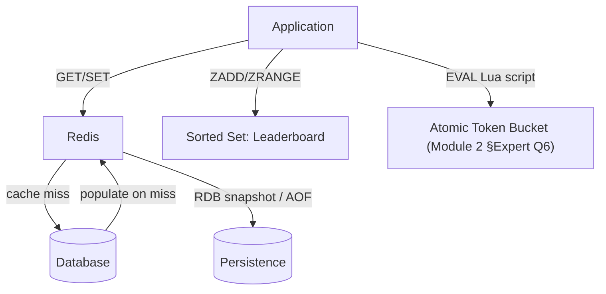

# Module 25 — Redis: Data Structures, Caching Patterns & Persistence

> Domain: Redis | Level: Beginner → Expert | Prerequisite: [[../01-CSharp/02-Async-Await-Internals]] §Expert Q6 (distributed rate limiting), [[../02-DotNet-AspNetCore/04-Authentication-Authorization-Deep-Dive]] §4 (stampede-resistant caching)

---

## 1. Fundamentals

### What is Redis, and why is it more than "just a cache"?
Redis is an **in-memory data structure store** — while overwhelmingly used as a cache, its actual value proposition is a rich set of native, atomically-manipulable data structures (strings, hashes, lists, sets, sorted sets, streams, bitmaps, HyperLogLog) accessible via simple commands with well-defined complexity guarantees, plus optional persistence and pub/sub messaging — a general-purpose, extremely fast building block for many distributed-systems patterns (rate limiting, leaderboards, session storage, distributed locks, job queues) beyond simple key-value caching.

### Why does it exist?
Application-level in-process caching (Module 9 §9's `IMemoryCache`) is fast but doesn't scale beyond one process/replica — a horizontally-scaled fleet needs a **shared**, external cache for fleet-wide consistency (directly the recurring theme from Module 2 §Expert Q6 onward). Redis fills this role with far lower latency than a full relational/document database round-trip, specifically because it's in-memory and single-threaded-per-core with a minimal command-processing overhead.

### When does this matter?
Any horizontally-scaled system needing shared, low-latency state — caching, session storage, rate limiting, distributed locking, real-time leaderboards; the depth matters for choosing the correct data structure per use case (a frequent, high-value interview differentiator) and for understanding Redis's persistence/durability trade-offs, since "it's just a cache" thinking can lead to inappropriate reliance on Redis as a system of record.

### How does it work (30,000-ft view)?
```
SET session:abc123 "{\"userId\":42}" EX 3600   # string, with expiration
ZADD leaderboard 1500 "player1"                 # sorted set, O(log n) insert
INCR page:views:home                            # atomic counter
```

---

## 2. Deep Dive

### 2.1 Core Data Structures and Their Complexity Guarantees
- **String**: simple key-value; `INCR`/`DECR` are atomic (no read-modify-write race even under concurrent access) — the basis for atomic counters.
- **Hash**: a field-value map within one key — efficient for representing an object (a user session) without needing to serialize/deserialize an entire blob for a single-field update.
- **List**: an ordered sequence supporting O(1) push/pop from either end — the basis for simple queue/stack patterns.
- **Set**: unordered unique members, O(1) membership tests — efficient for "is X in this set" checks (deduplication, tag membership).
- **Sorted Set (ZSet)**: members with an associated score, maintained in sorted order — O(log n) insert/update/rank queries — the natural structure for leaderboards, priority queues, and rate-limiting sliding windows (Module 16 §2.2).
- **Stream**: an append-only log with consumer-group support — Redis's answer to a lightweight message-queue/event-log pattern, with at-least-once delivery semantics via consumer acknowledgment.

### 2.2 Atomicity, Lua Scripting, and Why It Matters for Distributed Coordination
Every individual Redis command is atomic (Redis is effectively single-threaded for command execution, eliminating the classic read-modify-write race a naive multi-round-trip implementation would need external locking to prevent) — but a sequence of *multiple* commands is **not** atomic unless wrapped in a transaction (`MULTI`/`EXEC`, which queues commands and executes them together, but without conditional branching) or, for genuinely conditional/computed logic, a **Lua script** (`EVAL`), which executes atomically as a single unit server-side — directly the mechanism Module 2 §Expert Q6/Module 16 §11's distributed token-bucket rate limiter relies on for its atomic check-and-decrement operation.

### 2.3 Eviction Policies — What Happens When Redis Runs Out of Memory
Redis is bounded by available RAM — once `maxmemory` is reached, an **eviction policy** determines behavior: `noeviction` (reject new writes with an error — appropriate when Redis holds data that must never be silently discarded), `allkeys-lru`/`allkeys-lfu` (evict least-recently/frequently-used keys regardless of expiration settings — appropriate for a pure cache where any key is a legitimate eviction candidate), `volatile-lru`/`volatile-ttl` (evict only among keys with an explicit TTL set, preserving keys with no expiration — appropriate when Redis holds a *mix* of genuine cache data and non-expiring, must-not-evict data in the same instance). Choosing the wrong policy for a given workload (e.g., `noeviction` on a pure cache, causing write failures instead of graceful eviction) is a common, avoidable production issue.

### 2.4 Persistence — RDB Snapshots vs AOF, and Why "It's Just a Cache" Can Be Wrong
**RDB** (point-in-time snapshots, periodic) is fast to restore but can lose data since the last snapshot on a crash. **AOF** (Append-Only File, logging every write operation) offers stronger durability (configurable `fsync` policy — `always`, `everysec`, `no`) at higher write overhead, replayable to reconstruct state precisely. Many teams treat Redis purely as an ephemeral, "safe to lose" cache — but if Redis is also used for session storage, distributed locks, or rate-limiting state (§2.1's broader use cases), an unplanned data loss on restart can have real functional impact beyond "the cache is cold," making the persistence-configuration decision a genuine architectural choice, not a default to ignore.

### 2.5 Redis Cluster and Sharding — Hash Slots
Redis Cluster distributes data across nodes via 16,384 fixed **hash slots**, each key mapped to a slot via `CRC16(key) mod 16384` — a client can compute which node owns a given key's slot directly, without a separate routing/lookup service. **Hash tags** (`{user123}.profile`, `{user123}.settings` — the `{...}` portion is what's actually hashed) let related keys be forced onto the **same** slot/node, enabling multi-key operations (which Redis Cluster otherwise restricts to same-slot keys only) for logically-related data — directly analogous to Module 23 §Advanced Q3's shard-key-co-location reasoning for MongoDB transactions, here applied to Redis Cluster's multi-key-command constraint instead.

## 3. Visual Architecture


## 4. Production Example
**Scenario**: A session-storage Redis instance, configured with `allkeys-lru` eviction (copied from a "cache best practices" template without considering this instance's actual purpose), began silently evicting active user sessions under memory pressure during a traffic spike — users were unexpectedly logged out mid-session, with no error surfaced anywhere (eviction is silent by design), making the symptom ("random users report being logged out") very difficult to initially connect to a Redis configuration setting. **Investigation**: correlating logout reports with Redis's `evicted_keys` metric (via `INFO stats`) during the same time window confirmed active session keys were being evicted, not expiring naturally. **Fix**: switched to `noeviction` (rejecting new writes instead of silently discarding active session data once memory pressure hit) combined with proper capacity planning (sizing `maxmemory` and monitoring proactively) and a dedicated, separate Redis instance for genuine cache data using `allkeys-lru` appropriately. **Lesson**: eviction-policy choice must match the actual *purpose* of the data stored in a given Redis instance — a template/default setting copied without considering "is this data safe to silently discard under pressure" can convert a capacity problem into a silent, hard-to-diagnose correctness bug.

## 5. Best Practices
- Choose the eviction policy based on the actual data's tolerance for silent loss — `noeviction` for must-not-lose data, `allkeys-lru`/`lfu` for pure cache data.
- Use Lua scripts (`EVAL`) for any multi-step operation requiring atomicity across multiple keys/conditional logic.
- Choose the correct data structure per access pattern (sorted sets for leaderboards/rankings, hashes for object-like data, lists for simple queues) rather than defaulting to plain string blobs for everything.
- Use hash tags deliberately in Redis Cluster deployments for any multi-key operation on logically-related data.

## 6. Anti-patterns
- Using `allkeys-lru`/`lfu` eviction for data that must not be silently discarded (session state, distributed lock state) — §4's incident.
- Storing complex objects as a single serialized string blob when a native hash structure would allow efficient single-field access/updates.
- Treating Redis purely as "safe to lose" without evaluating whether it's actually holding functionally-important state (sessions, locks) requiring a deliberate persistence strategy.
- Performing multi-key operations across different hash slots in Redis Cluster without hash tags, causing cross-slot operation errors.

## 7. Performance Engineering
Redis's single-threaded command processing means a single slow command (a large `KEYS *` scan, or an inefficient Lua script) blocks every other client's commands for its duration — always use `SCAN` (cursor-based, non-blocking) instead of `KEYS` in production, and keep Lua scripts short and O(1)/O(log n), never O(n) over a large dataset.

## 8. Security
Redis has historically had weak default security posture (no authentication required by default in older configurations) — always enable `requirepass`/ACLs, bind to internal network interfaces only, and never expose a Redis instance directly to the internet, a real, commonly-exploited misconfiguration class.

## 9. Scalability
Redis Cluster's hash-slot sharding provides horizontal write/read scaling beyond a single instance's memory/throughput ceiling — but multi-key operations are constrained to same-slot keys unless hash tags force co-location, a genuine architectural constraint to design around from the start for any Cluster deployment.

---

## 10. Interview Questions

### Basic (10)
1. **Q: What is Redis?** **A:** An in-memory data structure store supporting strings, hashes, lists, sets, sorted sets, and more, commonly used for caching and other low-latency distributed-systems patterns.
2. **Q: Is Redis single-threaded for command execution?** **A:** Yes, effectively — this is what makes every individual command atomic without needing external locking.
3. **Q: What is a sorted set used for?** **A:** Maintaining members in ranked order by score — leaderboards, priority queues, rate-limiting windows.
4. **Q: What does `EXPIRE`/the `EX` option do?** **A:** Sets a time-to-live on a key, after which it's automatically removed.
5. **Q: What's the difference between RDB and AOF persistence?** **A:** RDB takes periodic point-in-time snapshots; AOF logs every write operation for stronger durability at higher overhead.
6. **Q: What does `MULTI`/`EXEC` provide?** **A:** Queuing multiple commands to execute together as a unit, without another client's commands interleaving in between.
7. **Q: Why should `SCAN` be used instead of `KEYS` in production?** **A:** `KEYS` blocks the single-threaded server for its full scan duration on a large dataset; `SCAN` is cursor-based and non-blocking.
8. **Q: What is an eviction policy?** **A:** The rule governing which keys Redis removes when memory limits are reached.
9. **Q: What is a Redis hash tag?** **A:** A `{...}`-delimited portion of a key used as the actual hashing input in Redis Cluster, forcing related keys onto the same slot.
10. **Q: Should Redis be exposed directly to the public internet?** **A:** No — always restrict to internal networks with authentication enabled.

### Intermediate (10)
1. **Q: Why is a single Redis command atomic without external locking?** **A:** Redis processes commands effectively single-threaded, so no other command can interleave mid-execution of another — eliminating the classic read-modify-write race a naive external client would otherwise need a lock to prevent.
2. **Q: Why isn't `MULTI`/`EXEC` sufficient for conditional logic like "decrement only if sufficient balance exists"?** **A:** `MULTI`/`EXEC` queues commands without evaluating conditions between them — it can't branch based on an intermediate command's result; a Lua script (`EVAL`), executing full conditional logic atomically server-side, is required for genuinely conditional multi-step operations.
3. **Q: Why did the session-eviction incident (§4) produce no error/exception anywhere?** **A:** Eviction is a silent, by-design memory-management mechanism — Redis doesn't raise an error when it evicts a key under memory pressure, since that's its intended behavior for a cache; the silence itself was the diagnostic challenge, requiring correlating a business symptom (logout reports) with an infrastructure metric (`evicted_keys`).
4. **Q: What's the difference between `volatile-lru` and `allkeys-lru`?** **A:** `volatile-lru` only considers keys with an explicit TTL set as eviction candidates, preserving non-expiring keys; `allkeys-lru` considers every key, regardless of whether it has a TTL.
5. **Q: Why is a hash structure often more efficient than a serialized string blob for object-like data?** **A:** A hash lets you read/update a single field directly (`HGET`/`HSET`) without needing to deserialize and re-serialize the entire object for every partial access, unlike a string blob requiring full deserialization/reserialization for any single-field change.
6. **Q: Why does Redis Cluster restrict multi-key operations to keys in the same hash slot?** **A:** Because different keys might live on different physical nodes — a multi-key operation spanning nodes would require distributed coordination Redis's core design deliberately avoids for performance/simplicity; hash tags let related keys be deliberately co-located to make multi-key operations on them possible.
7. **Q: What's the risk of running a large, unbounded Lua script against a production Redis instance?** **A:** Since Redis is single-threaded, a long-running script blocks every other client's commands for its entire execution duration — exactly the same blocking-everyone-else risk as `KEYS` on a large dataset.
8. **Q: Why might a team choose AOF with `fsync always` despite its higher write overhead?** **A:** For data where losing even the last few seconds of writes (the risk with `fsync everysec`, AOF's more common default) is unacceptable — trading write throughput for the strongest available durability guarantee within Redis's persistence options.
9. **Q: Why is Redis's raw speed advantage over a relational/document database primarily about being in-memory, not about a fundamentally different algorithmic approach?** **A:** Most Redis operations have complexity guarantees comparable to well-indexed relational/document operations (O(1) or O(log n)) — the dominant performance difference is avoiding disk I/O and the relatively heavier protocol/query-parsing overhead of a full SQL/BSON query engine, not a fundamentally different computational complexity class.
10. **Q: Why would a distributed lock implemented naively via `SET key value NX` alone be insufficient for genuine mutual exclusion under node failure?** **A:** Without an expiration, a lock holder that crashes before releasing it leaves the lock held forever, blocking all future acquisition attempts — `SET key value NX EX <ttl>` (atomic set-if-not-exists with an expiration) is the minimum safe pattern, and even this has known edge cases (a lock expiring while its holder is still legitimately working, e.g., due to a long GC pause) that more sophisticated algorithms like Redlock attempt to address more rigorously.

### Advanced (10)
1. **Q: Diagnose the session-eviction incident (§4) from first principles, and design the standing safeguard preventing recurrence.**
   **A:** Root cause: an eviction-policy setting copied from a generic "cache best practices" template without evaluating this specific instance's actual data-loss tolerance. Safeguard: require explicit, documented eviction-policy justification per Redis instance/use-case during architecture review (this course's recurring governance pattern), defaulting to `noeviction` for any instance whose purpose isn't unambiguously "pure, safely-discardable cache," and adding `evicted_keys`-rate monitoring as a standing alert for any instance where eviction should never occur under normal operation.
2. **Q: Design a distributed rate limiter (directly Module 2 §Expert Q6/Module 16 §11) using Redis sorted sets for a sliding-window (not token-bucket) algorithm, and explain the trade-off versus the token-bucket approach.**
   **A:** Use a sorted set per rate-limited key, with each request's timestamp as both the member and score; on each new request, atomically (via Lua script) remove entries older than the window (`ZREMRANGEBYSCORE`), count remaining entries (`ZCARD`), and if under the limit, add the new request (`ZADD`) — this gives a true sliding window (no boundary-burst problem, Module 16 §2.2) at the cost of O(log n + removed-count) per request and unbounded-in-principle memory per key (proportional to request rate within the window), versus token bucket's O(1) state (just a token count and timestamp) but boundary-adjacent burst tolerance — the sorted-set sliding window is more precise but more resource-intensive; token bucket is simpler and cheaper but allows the burst pattern token buckets are specifically designed to tolerate.
3. **Q: Explain the Redlock algorithm's core idea for distributed locking across multiple independent Redis instances, and a documented criticism of its guarantees.**
   **A:** Redlock acquires a lock by attempting `SET NX EX` against N independent Redis instances, considering the lock acquired only if a majority succeed within a bounded time budget (accounting for the elapsed acquisition attempt time against the lock's TTL) — intended to tolerate a minority of Redis instances being unavailable/slow. A well-known criticism (notably from Martin Kleppmann) is that Redlock's safety guarantees can still be violated under certain clock-drift or process-pause (e.g., a long GC pause or VM migration pause) scenarios where a lock holder believes it still holds the lock past its actual expiration — meaning Redlock is a *reasonable, practical* distributed-locking mechanism for most use cases but should not be relied upon as a mathematically rigorous fencing mechanism for scenarios demanding absolute correctness guarantees (e.g., preventing any possibility of two nodes believing they hold the same lock simultaneously under adversarial timing) without additional application-level safeguards (a fencing token, monotonically increasing, checked by the protected resource itself).
4. **Q: Design a cache-aside pattern implementation resilient to the cache-stampede problem (directly Module 12 §4/§Hard exercise's pattern), applied specifically to Redis.**
   **A:** Combine a short-TTL cached value with a per-key distributed lock (via `SET NX EX`) specifically for the cache-population path: on a cache miss, attempt to acquire a short-lived per-key lock before querying the backing database; if the lock is acquired, query the database and populate the cache, then release the lock; if the lock is already held (another request is already populating this same key), either wait briefly and retry the cache read, or serve a slightly-stale fallback value if one exists — directly the same double-checked-locking-style stampede prevention pattern from Module 12, now implemented using Redis's own `SET NX EX` as the distributed lock primitive rather than an in-process `SemaphoreSlim`.
5. **Q: Explain why a Redis Cluster deployment's hash-slot design makes resharding (adding/removing nodes) less disruptive than a naive modulo-based sharding scheme would be.**
   **A:** With a fixed 16,384 slots (independent of the current node count), adding or removing a node only requires **migrating specific slots** between nodes — the total slot count and each key's slot assignment (`CRC16(key) mod 16384`) never change, only which *node* owns which *slots* changes; a naive `hash(key) mod N` scheme (where N is the node count) would require recomputing every single key's target node whenever N changes, causing a near-total data reshuffle on any cluster resize — the fixed-slot-count design is specifically what makes incremental resharding tractable.
6. **Q: How would you decide whether a given piece of application state belongs in Redis versus the primary relational/document database, beyond "it needs to be fast"?**
   **A:** Evaluate: (a) does this data need to survive an unplanned Redis restart/data loss without functional impact, or is a brief gap tolerable (session data leans toward "needs durability consideration," a pure computed cache leans toward "tolerable")? (b) does the access pattern benefit from Redis's specific data structures (sorted-set ranking, atomic counters) in a way a relational/document query couldn't easily replicate at comparable latency? (c) is this the *only* copy of this data, or a derived/cached view of data that's authoritatively stored elsewhere and could be rebuilt if lost? — data that's the sole source of truth for something functionally important (not just performance-optimizing) needs the deliberate persistence-strategy evaluation from §2.4, not a default "Redis is ephemeral" assumption.
7. **Q: Explain a scenario where using Redis as a message queue (via Lists or Streams) has a meaningfully different delivery guarantee than a dedicated message broker (a later Kafka/RabbitMQ module topic), and why this matters for a specific use case.**
   **A:** Redis Lists (`LPUSH`/`BRPOP`) provide simple FIFO queuing but no built-in consumer-group/acknowledgment tracking — a consumer that crashes after `BRPOP`-ing a message but before finishing processing it **loses that message entirely**, with no redelivery mechanism; Redis Streams improve on this with consumer groups and explicit acknowledgment (`XACK`), giving at-least-once delivery closer to a dedicated broker's guarantees, but still lack some of a mature broker's operational tooling (dead-letter queues, sophisticated routing) — for a use case where message loss on consumer crash is unacceptable, Streams (not Lists) or a dedicated broker is the appropriate choice, not Redis Lists' simpler but weaker guarantee.
8. **Q: Design a monitoring strategy specifically for Redis memory pressure and eviction behavior, generalizing §4's incident into a standing safeguard.**
   **A:** Track `used_memory` relative to `maxmemory` as a proactive capacity signal (alerting well before the limit, giving time to scale/investigate before eviction begins at all); track `evicted_keys` rate as a binary "is eviction happening at all" signal, with **any** non-zero rate treated as an incident-worthy alert for instances configured with `noeviction`-inappropriate policies protecting must-not-lose data (since for such instances, evictions occurring at all indicates the eviction policy or capacity planning is wrong); separately, for genuine cache instances where some eviction is expected/healthy, track the *rate* trend rather than any non-zero occurrence, alerting only on a sudden, anomalous spike.
9. **Q: Explain the trade-off between Lua-script-based atomicity and simply using MongoDB/PostgreSQL's own multi-document/multi-row transaction support (Modules 19, 24) for a use case that could plausibly use either.**
   **A:** Redis's Lua-script atomicity is dramatically lower-latency (in-memory, no disk I/O, no cross-node coordination for a single-instance script) but offers no durability guarantee beyond Redis's own persistence configuration (§2.4) and no relational/document query capability — appropriate for ephemeral or performance-critical coordination (rate limiting, distributed locks, real-time leaderboards) where the *coordination* itself is the primary need; a database transaction is appropriate when the operation's result must be a durable, queryable system-of-record fact (a financial ledger entry) — the choice hinges on whether the operation's primary purpose is fast coordination/computation or durable business-record-keeping.
10. **Q: As a Principal Engineer, how would you build organizational capability preventing Redis-configuration-template-copying incidents (§4) from recurring across a growing set of Redis-backed services?**
    **A:** Publish a small set of pre-vetted, purpose-labeled Redis configuration templates (directly this course's recurring shared-template governance pattern) — e.g., "pure-cache" (allkeys-lru, no persistence needed), "session-store" (noeviction, AOF with everysec fsync), "distributed-coordination" (noeviction, careful capacity planning) — each explicitly named and documented by *purpose*, not just generic "Redis best practices," specifically to prevent a team from copying a template without recognizing which purpose-category their actual use case falls into; require every new Redis instance's provisioning request to declare which template/purpose it matches, making the eviction-policy decision an explicit, reviewed choice rather than an inherited default.

---

## 11. Coding Exercises

### Easy — Atomic counter with expiration for a simple rate limit
```
INCR requests:user123
EXPIRE requests:user123 60 NX
-- NX on EXPIRE (Redis 7+): only sets the expiration if the key has none yet --
-- avoids resetting the TTL on every single request, only setting it once when the window starts.
```

### Medium — Sliding-window rate limiter with a sorted set (Advanced Q2)
```lua
-- Lua script, executed atomically via EVAL
local key = KEYS[1]
local now = tonumber(ARGV[1])
local window = tonumber(ARGV[2])
local limit = tonumber(ARGV[3])

redis.call("ZREMRANGEBYSCORE", key, 0, now - window)
local count = redis.call("ZCARD", key)

if count < limit then
    redis.call("ZADD", key, now, now .. "-" .. math.random())
    redis.call("EXPIRE", key, window)
    return 1 -- allowed
else
    return 0 -- rejected
end
```

### Hard — Cache-aside with stampede protection via distributed lock (Advanced Q4)
```csharp
public async Task<Product> GetProductAsync(string sku)
{
    var cached = await _redis.StringGetAsync($"product:{sku}");
    if (cached.HasValue) return Deserialize<Product>(cached);

    string lockKey = $"lock:product:{sku}";
    bool lockAcquired = await _redis.StringSetAsync(lockKey, "1", TimeSpan.FromSeconds(5), When.NotExists);

    if (lockAcquired)
    {
        try
        {
            var product = await _repository.GetBySkuAsync(sku);
            await _redis.StringSetAsync($"product:{sku}", Serialize(product), TimeSpan.FromMinutes(10));
            return product;
        }
        finally
        {
            await _redis.KeyDeleteAsync(lockKey);
        }
    }
    else
    {
        await Task.Delay(50); // brief wait, then retry the cache read
        return await GetProductAsync(sku); // the populating request should have finished by now
    }
}
```

### Expert — Redlock-style multi-instance distributed lock with a fencing token (Advanced Q3's mitigation)
```csharp
public class FencedDistributedLock
{
    private readonly IDatabase[] _redisInstances; // N independent Redis instances
    private readonly IDatabase _fencingTokenSource; // a durable counter, incremented per lock acquisition

    public async Task<(bool Acquired, long FencingToken)> TryAcquireAsync(string resource, TimeSpan ttl)
    {
        long fencingToken = await _fencingTokenSource.StringIncrementAsync("fencing:counter");
        int successCount = 0;

        foreach (var redis in _redisInstances)
        {
            bool acquired = await redis.StringSetAsync(resource, fencingToken.ToString(), ttl, When.NotExists);
            if (acquired) successCount++;
        }

        bool majorityAcquired = successCount > _redisInstances.Length / 2;
        return (majorityAcquired, fencingToken);
    }
}
// The PROTECTED RESOURCE ITSELF (e.g., the database write the lock guards) must check that any
// incoming fencing token is STRICTLY GREATER than the last one it accepted -- rejecting a stale,
// out-of-order write from a lock holder that outlived its actual lock (the Advanced Q3 mitigation
// for Redlock's clock-drift/pause-related edge cases).
```
**Discussion**: The fencing token is the concrete mechanism addressing Advanced Q3's Redlock criticism — even if a lock holder's process pauses long enough for its lock to expire and be re-acquired by another holder, the *protected resource* itself (not just the lock mechanism) independently rejects any write carrying an older fencing token than one it's already accepted, closing the correctness gap Redlock's pure lock-acquisition guarantee alone can't fully close.

---

## 12–17. System Design / LLD / Debugging / Decision / Case Study / Principal

A high-traffic platform (§4) maintains purpose-labeled Redis instance templates (Advanced Q10) — pure-cache (allkeys-lru), session-store (noeviction, AOF), distributed-coordination (noeviction, careful capacity planning) — with mandatory eviction-policy justification per instance during architecture review, and uses sorted-set-based sliding-window rate limiting (Medium exercise) alongside fenced distributed locks (Expert exercise) for its coordination needs. The signature production incident (§4) — a copied `allkeys-lru` template silently evicting active user sessions under memory pressure — is this module's central lesson: Redis's eviction-policy choice must match the actual data's loss-tolerance, not a generic "cache best practices" default applied without considering the specific instance's real purpose. Principal-level guidance: purpose-labeled configuration templates (not generic "Redis best practices") prevent exactly this class of copy-without-understanding incident from recurring across a growing service fleet.

## 18. Revision
**Key takeaways**: Choose Redis data structures deliberately (sorted sets for ranking/rate-limiting, hashes for object-like partial-update data, strings for simple atomic counters) rather than defaulting to serialized blobs. Individual commands are atomic (single-threaded execution); multi-command atomicity requires `MULTI`/`EXEC` (no conditionals) or Lua scripts (full conditional logic, atomic). Eviction policy must match the data's actual loss-tolerance — `noeviction` for must-not-lose data, `allkeys-lru`/`lfu` for pure cache. RDB vs. AOF is a genuine durability-vs-overhead trade-off, relevant whenever Redis holds more than purely-disposable cache data. Redis Cluster's fixed 16,384 hash slots (not node-count-dependent) make incremental resharding tractable; hash tags force related keys onto the same slot for multi-key operations.

---

**Next**: Continuing autonomously to Module 26 — Redis Pub/Sub, Streams & High Availability (completing the `07-Redis` domain) before advancing to `08-DynamoDB`.
