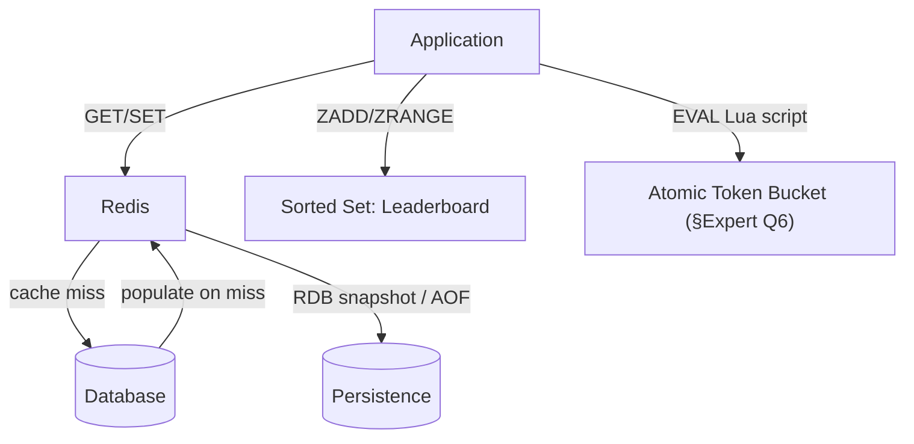
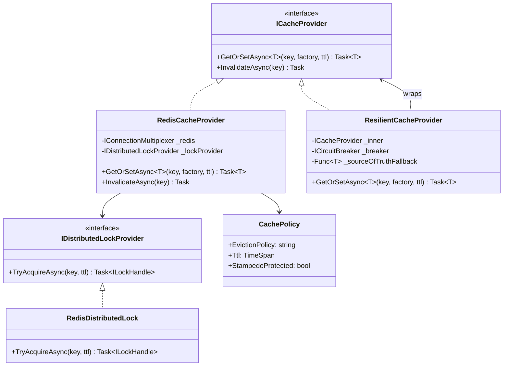
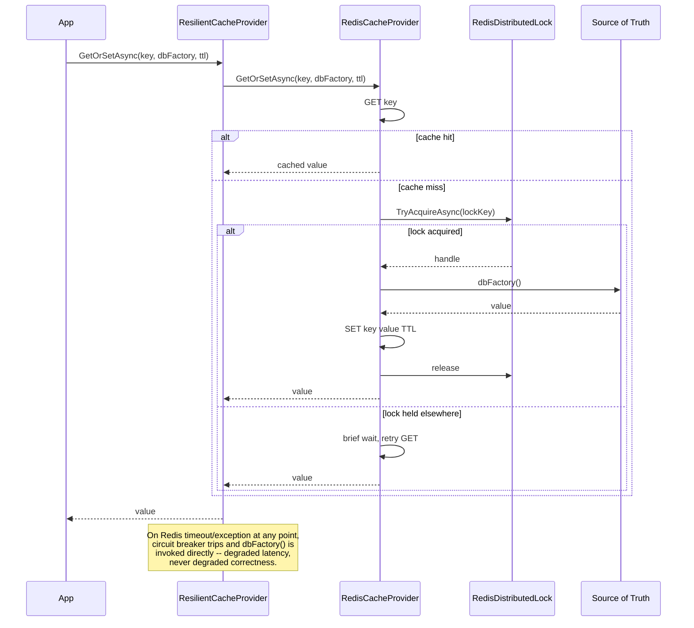

# Module 25 — Redis: Data Structures, Caching Patterns & Persistence

> Domain: Redis | Level: Beginner → Expert | Prerequisite: [[../01-CSharp/02-Async-Await-Internals]] §Expert Q6 (distributed rate limiting), [[../02-DotNet-AspNetCore/04-Authentication-Authorization-Deep-Dive]] (stampede-resistant caching)

---

## 1. Fundamentals

### What is Redis, and why is it more than "just a cache"?
Redis is an **in-memory data structure store** — while overwhelmingly used as a cache, its actual value proposition is a rich set of native, atomically-manipulable data structures (strings, hashes, lists, sets, sorted sets, streams, bitmaps, HyperLogLog) accessible via simple commands with well-defined complexity guarantees, plus optional persistence and pub/sub messaging — a general-purpose, extremely fast building block for many distributed-systems patterns (rate limiting, leaderboards, session storage, distributed locks, job queues) beyond simple key-value caching.

### Why does it exist?
Application-level in-process caching (the `IMemoryCache`) is fast but doesn't scale beyond one process/replica — a horizontally-scaled fleet needs a **shared**, external cache for fleet-wide consistency (directly the recurring theme §Expert Q6 onward). Redis fills this role with far lower latency than a full relational/document database round-trip, specifically because it's in-memory and single-threaded-per-core with a minimal command-processing overhead.

### When does this matter?
Any horizontally-scaled system needing shared, low-latency state — caching, session storage, rate limiting, distributed locking, real-time leaderboards; the depth matters for choosing the correct data structure per use case (a frequent, high-value interview differentiator) and for understanding Redis's persistence/durability trade-offs, since "it's just a cache" thinking can lead to inappropriate reliance on Redis as a system of record.

### How does it work (30,000-ft view)?
```
SET session:abc123 "{\"userId\":42}" EX 3600 # string, with expiration
ZADD leaderboard 1500 "player1" # sorted set, O(log n) insert
INCR page:views:home # atomic counter
```

---

## 2. Deep Dive

### 2.1 Core Data Structures and Their Complexity Guarantees
- **String**: simple key-value; `INCR`/`DECR` are atomic (no read-modify-write race even under concurrent access) — the basis for atomic counters.
- **Hash**: a field-value map within one key — efficient for representing an object (a user session) without needing to serialize/deserialize an entire blob for a single-field update.
- **List**: an ordered sequence supporting O(1) push/pop from either end — the basis for simple queue/stack patterns.
- **Set**: unordered unique members, O(1) membership tests — efficient for "is X in this set" checks (deduplication, tag membership).
- **Sorted Set (ZSet)**: members with an associated score, maintained in sorted order — O(log n) insert/update/rank queries — the natural structure for leaderboards, priority queues, and rate-limiting sliding windows.
- **Stream**: an append-only log with consumer-group support — Redis's answer to a lightweight message-queue/event-log pattern, with at-least-once delivery semantics via consumer acknowledgment.

### 2.2 Atomicity, Lua Scripting, and Why It Matters for Distributed Coordination
Every individual Redis command is atomic (Redis is effectively single-threaded for command execution, eliminating the classic read-modify-write race a naive multi-round-trip implementation would need external locking to prevent) — but a sequence of *multiple* commands is **not** atomic unless wrapped in a transaction (`MULTI`/`EXEC`, which queues commands and executes them together, but without conditional branching) or, for genuinely conditional/computed logic, a **Lua script** (`EVAL`), which executes atomically as a single unit server-side — directly the mechanism §Expert Q6/the distributed token-bucket rate limiter relies on for its atomic check-and-decrement operation.

### 2.3 Eviction Policies — What Happens When Redis Runs Out of Memory
Redis is bounded by available RAM — once `maxmemory` is reached, an **eviction policy** determines behavior: `noeviction` (reject new writes with an error — appropriate when Redis holds data that must never be silently discarded), `allkeys-lru`/`allkeys-lfu` (evict least-recently/frequently-used keys regardless of expiration settings — appropriate for a pure cache where any key is a legitimate eviction candidate), `volatile-lru`/`volatile-ttl` (evict only among keys with an explicit TTL set, preserving keys with no expiration — appropriate when Redis holds a *mix* of genuine cache data and non-expiring, must-not-evict data in the same instance). Choosing the wrong policy for a given workload (e.g., `noeviction` on a pure cache, causing write failures instead of graceful eviction) is a common, avoidable production issue.

### 2.4 Persistence — RDB Snapshots vs AOF, and Why "It's Just a Cache" Can Be Wrong
**RDB** (point-in-time snapshots, periodic) is fast to restore but can lose data since the last snapshot on a crash. **AOF** (Append-Only File, logging every write operation) offers stronger durability (configurable `fsync` policy — `always`, `everysec`, `no`) at higher write overhead, replayable to reconstruct state precisely. Many teams treat Redis purely as an ephemeral, "safe to lose" cache — but if Redis is also used for session storage, distributed locks, or rate-limiting state (the broader use cases), an unplanned data loss on restart can have real functional impact beyond "the cache is cold," making the persistence-configuration decision a genuine architectural choice, not a default to ignore.

### 2.5 Redis Cluster and Sharding — Hash Slots
Redis Cluster distributes data across nodes via 16,384 fixed **hash slots**, each key mapped to a slot via `CRC16(key) mod 16384` — a client can compute which node owns a given key's slot directly, without a separate routing/lookup service. **Hash tags** (`{user123}.profile`, `{user123}.settings` — the `{...}` portion is what's actually hashed) let related keys be forced onto the **same** slot/node, enabling multi-key operations (which Redis Cluster otherwise restricts to same-slot keys only) for logically-related data — directly analogous to §Advanced Q3's shard-key-co-location reasoning for MongoDB transactions, here applied to Redis Cluster's multi-key-command constraint instead.

## 3. Visual Architecture

```mermaid
graph TB
 App[Application] -->|GET/SET| Cache[Redis]
 Cache -->|cache miss| DB[(Database)]
 DB -->|populate on miss| Cache
 App -->|ZADD/ZRANGE| Leaderboard["Sorted Set: Leaderboard"]
 App -->|EVAL Lua script| RateLimiter["Atomic Token Bucket (§Expert Q6)"]
 Cache -->|RDB snapshot / AOF| Disk[(Persistence)]
```

## 4. Production Example
**Scenario**: A session-storage Redis instance, configured with `allkeys-lru` eviction (copied from a "cache best practices" template without considering this instance's actual purpose), began silently evicting active user sessions under memory pressure during a traffic spike — users were unexpectedly logged out mid-session, with no error surfaced anywhere (eviction is silent by design), making the symptom ("random users report being logged out") very difficult to initially connect to a Redis configuration setting. **Investigation**: correlating logout reports with Redis's `evicted_keys` metric (via `INFO stats`) during the same time window confirmed active session keys were being evicted, not expiring naturally. **Fix**: switched to `noeviction` (rejecting new writes instead of silently discarding active session data once memory pressure hit) combined with proper capacity planning (sizing `maxmemory` and monitoring proactively) and a dedicated, separate Redis instance for genuine cache data using `allkeys-lru` appropriately. **Lesson**: eviction-policy choice must match the actual *purpose* of the data stored in a given Redis instance — a template/default setting copied without considering "is this data safe to silently discard under pressure" can convert a capacity problem into a silent, hard-to-diagnose correctness bug.

## 5. Best Practices
- Choose the eviction policy based on the actual data's tolerance for silent loss — `noeviction` for must-not-lose data, `allkeys-lru`/`lfu` for pure cache data.
- Use Lua scripts (`EVAL`) for any multi-step operation requiring atomicity across multiple keys/conditional logic.
- Choose the correct data structure per access pattern (sorted sets for leaderboards/rankings, hashes for object-like data, lists for simple queues) rather than defaulting to plain string blobs for everything.
- Use hash tags deliberately in Redis Cluster deployments for any multi-key operation on logically-related data.

## 6. Anti-patterns
- Using `allkeys-lru`/`lfu` eviction for data that must not be silently discarded (session state, distributed lock state) — the incident.
- Storing complex objects as a single serialized string blob when a native hash structure would allow efficient single-field access/updates.
- Treating Redis purely as "safe to lose" without evaluating whether it's actually holding functionally-important state (sessions, locks) requiring a deliberate persistence strategy.
- Performing multi-key operations across different hash slots in Redis Cluster without hash tags, causing cross-slot operation errors.

---

## 7. Performance Engineering

**CPU — the single-threaded command loop.** Redis executes commands on a single thread (I/O threading, added in Redis 6+, only parallelizes socket reads/writes and protocol parsing — command *execution* remains single-threaded), so total throughput is bounded by how fast one core can process the command stream. A single expensive command (`KEYS *` on a multi-million-key database, an unbounded `SMEMBERS` on a set with millions of members, a large Lua script) blocks every other client for its full duration — the same class of risk as the incident's silent eviction, except manifesting as a latency spike visible in `INFO commandstats`/`latency history` rather than a silent data-loss event. Use `SCAN`/`SSCAN`/`HSCAN`/`ZSCAN` (cursor-based, bounded per-call cost) instead of the unbounded `KEYS`/`SMEMBERS`/`HGETALL` variants against large collections, and budget Lua scripts for microsecond-scale execution, not bulk data processing.

**Memory — fragmentation and `OBJECT ENCODING`.** Redis's allocator (`jemalloc` by default on Linux) can fragment over time, particularly under a workload of frequent small allocations/deallocations at varying sizes (session churn, TTL expiry) — `used_memory_rss` growing meaningfully faster than `used_memory` (visible in `INFO memory`'s `mem_fragmentation_ratio`) indicates fragmentation eating usable capacity without any corresponding increase in actual stored data. `activedefrag yes` (Redis 4+) reclaims this incrementally, at a small ongoing CPU cost, rather than requiring a full restart. Separately, small collections use compact encodings automatically — a hash under `hash-max-listpack-entries`/`-value` thresholds stores as a `listpack` (contiguous, cache-friendly, memory-efficient); crossing the threshold silently converts it to a full hash table, meaningfully larger per-entry — `OBJECT ENCODING <key>` reveals which representation is in play, and sizing a session hash to deliberately stay under the listpack threshold is a real, measurable memory-efficiency lever many teams never check.

**Latency — pipelining.** Each round-trip to Redis costs network RTT regardless of the command's own execution cost (sub-microsecond for most commands) — issuing N independent commands sequentially pays N round-trips, while **pipelining** (batching multiple commands into one network write, reading all responses after) pays one round-trip for all N, a frequently 10-100x throughput improvement for bulk operations (populating a cache after a cold start, batch session lookups) at zero server-side cost, since pipelining is purely a client-side/protocol-level batching technique, not a different execution model.

**Throughput — eviction's hidden cost under memory pressure.** LRU/LFU eviction under `maxmemory` doesn't do a perfect global scan for the least-recently/frequently-used key (too expensive) — it samples a small, configurable number of random keys (`maxmemory-samples`, default 5) and evicts the best candidate among the sample, trading eviction-decision accuracy for speed; a higher sample count improves eviction quality at a small additional CPU cost per eviction, relevant when tuning a genuinely eviction-heavy pure-cache instance (§2.3/§4) for better hit-rate behavior.

**Benchmarking:** `redis-benchmark` and `MEMORY USAGE <key>` are the concrete tools — benchmark against realistic key-size/collection-size distributions (a synthetic all-small-string benchmark will not surface the listpack-threshold or big-key latency risks that dominate real production behavior), and always benchmark pipelined vs. unpipelined for any bulk-access pattern before assuming either is "fast enough."

---

## 8. Security

**Threats:** An unauthenticated, internet-exposed Redis instance is one of the most exploited misconfigurations in cloud infrastructure — attackers routinely scan for open port 6379, then use `CONFIG SET dir`/`CONFIG SET dbfilename` combined with `SET`/`SAVE` to write an attacker-controlled file (an SSH authorized_keys entry, a cron job, a webshell) to disk via Redis's own persistence mechanism, achieving remote code execution with no authentication bypass required at all — this is not a theoretical risk; it's a well-documented, mass-exploited attack pattern (cryptomining botnets, ransomware) against exactly this misconfiguration. A second, subtler threat is **command injection via unsanitized key construction** — building a key name by concatenating unsanitized user input (`$"user:{userInput}:profile"`) without validating that `userInput` can't itself contain a colon or other key-namespace-relevant character lets an attacker construct a key that collides with or overwrites an unrelated key/namespace.

**Mitigations:** Never expose Redis directly to the public internet — bind to internal/private networks only, behind a security group/firewall permitting only known application hosts. Always set `requirepass` (or, better, use ACLs) — Redis's `protected-mode` (default `yes` since Redis 3.2) refuses non-localhost connections without a password configured, a safety net that has prevented a meaningful fraction of these incidents but must not be relied on as the *only* control, since it's trivially disabled by misconfiguration. Sanitize/validate any user-supplied input used to construct a key name (reject or escape delimiter characters) exactly as SQL-injection defenses validate input used to construct a query.

**ACLs (Redis 6+):** Replace the single shared `requirepass` password with per-application, per-purpose **ACL users** (`ACL SETUSER app-readonly on >password ~app:* +get +mget -@write`), scoping each credential to only the commands and key patterns that application genuinely needs — a reporting service given a read-only, namespace-scoped credential cannot accidentally (or maliciously, if compromised) issue `FLUSHALL` or read another application's keyspace, directly the least-privilege discipline applied at the Redis-credential layer rather than left to a single shared, all-powerful password.

**TLS:** Redis 6+ supports native TLS for client-server and replication traffic — required for any deployment where the network path between application and Redis (or between Redis nodes/replicas) isn't provably trusted end-to-end (a multi-AZ/cross-VPC deployment, any path crossing infrastructure a compliance framework doesn't already treat as trusted); prior to Redis 6, TLS required a `stunnel`/proxy sidecar, since the protocol had no native TLS support.

**OWASP mapping:** Misconfiguration (A05:2021) is the dominant real-world Redis risk — the unauthenticated-exposure RCE pattern above is a textbook instance; injection (A03:2021) via unsanitized key construction is the second most relevant category.

---

## 9. Scalability

**Horizontal scaling — Redis Cluster.** §2.5's fixed 16,384 hash slots is the mechanism; operationally, horizontal scaling means adding a new primary node and **migrating a subset of slots** to it (`CLUSTER SETSLOT ... MIGRATING`/`IMPORTING`, or a higher-level tool like `redis-cli --cluster reshard`) — a live, incremental operation that doesn't require full-dataset downtime, though individual keys being actively migrated experience a brief `ASK`-redirect window.

**Vertical scaling and read replicas.** Before reaching for Cluster's sharding complexity, a single primary with **read replicas** (asynchronous replication, §2.5 of Module 26) scales *read* throughput horizontally while keeping writes on a single node — appropriate when the workload is read-heavy and the working set fits comfortably on one node's memory; Cluster's sharding is the correct next step specifically when the dataset itself no longer fits on one node's available RAM, not merely as a default "scale by sharding" reflex.

**Replication lag.** Since replication is asynchronous by default (Module 26 §2.5), a read replica can lag behind its primary by a variable amount under write load — a read-scaling strategy that routes reads to replicas must accept eventually-consistent reads (a replica's `GET` can return a slightly stale value) unless the specific read path genuinely requires primary-fresh data, in which case it must be explicitly routed to the primary, not load-balanced across replicas by default.

**High Availability:** Sentinel (single primary-replica set) or Cluster's built-in per-shard failover (Module 26 §2.3/§2.4) — the correct mechanism depends on whether sharding is already in use; the two are not combined.

**CAP-adjacent trade-off:** Redis Cluster, during a network partition isolating a minority of nodes from the majority, has the minority-side nodes stop accepting writes (assuming `cluster-require-full-coverage`/quorum-appropriate configuration) rather than risk a split-brain divergence — favoring consistency over availability for the isolated minority, the same quorum-based reasoning as any majority-based distributed system, applied here to Redis Cluster's own failure-detection gossip protocol.

---

## 10. Interview Questions

### Basic (10)
1. **Q: What is Redis?** **A:** An in-memory data structure store supporting strings, hashes, lists, sets, sorted sets, and more, commonly used for caching and other low-latency distributed-systems patterns.
2. **Q: Is Redis single-threaded for command execution?** **A:** Yes, effectively — this is what makes every individual command atomic without needing external locking.
3. **Q: What is a sorted set used for?** **A:** Maintaining members in ranked order by score — leaderboards, priority queues, rate-limiting windows.
4. **Q: What does `EXPIRE`/the `EX` option do?** **A:** Sets a time-to-live on a key, after which it's automatically removed.
5. **Q: What's the difference between RDB and AOF persistence?** **A:** RDB takes periodic point-in-time snapshots; AOF logs every write operation for stronger durability at higher overhead.
6. **Q: What does `MULTI`/`EXEC` provide?** **A:** Queuing multiple commands to execute together as a unit, without another client's commands interleaving in between.
7. **Q: Why should `SCAN` be used instead of `KEYS` in production?** **A:** `KEYS` blocks the single-threaded server for its full scan duration on a large dataset; `SCAN` is cursor-based and non-blocking.
8. **Q: What is an eviction policy?** **A:** The rule governing which keys Redis removes when memory limits are reached.
9. **Q: What is a Redis hash tag?** **A:** A `{...}`-delimited portion of a key used as the actual hashing input in Redis Cluster, forcing related keys onto the same slot.
10. **Q: Should Redis be exposed directly to the public internet?** **A:** No — always restrict to internal networks with authentication enabled.

### Intermediate (10)
1. **Q: Why is a single Redis command atomic without external locking?** **A:** Redis processes commands effectively single-threaded, so no other command can interleave mid-execution of another — eliminating the classic read-modify-write race a naive external client would otherwise need a lock to prevent.
2. **Q: Why isn't `MULTI`/`EXEC` sufficient for conditional logic like "decrement only if sufficient balance exists"?** **A:** `MULTI`/`EXEC` queues commands without evaluating conditions between them — it can't branch based on an intermediate command's result; a Lua script (`EVAL`), executing full conditional logic atomically server-side, is required for genuinely conditional multi-step operations.
3. **Q: Why did the session-eviction incident produce no error/exception anywhere?** **A:** Eviction is a silent, by-design memory-management mechanism — Redis doesn't raise an error when it evicts a key under memory pressure, since that's its intended behavior for a cache; the silence itself was the diagnostic challenge, requiring correlating a business symptom (logout reports) with an infrastructure metric (`evicted_keys`).
4. **Q: What's the difference between `volatile-lru` and `allkeys-lru`?** **A:** `volatile-lru` only considers keys with an explicit TTL set as eviction candidates, preserving non-expiring keys; `allkeys-lru` considers every key, regardless of whether it has a TTL.
5. **Q: Why is a hash structure often more efficient than a serialized string blob for object-like data?** **A:** A hash lets you read/update a single field directly (`HGET`/`HSET`) without needing to deserialize and re-serialize the entire object for every partial access, unlike a string blob requiring full deserialization/reserialization for any single-field change.
6. **Q: Why does Redis Cluster restrict multi-key operations to keys in the same hash slot?** **A:** Because different keys might live on different physical nodes — a multi-key operation spanning nodes would require distributed coordination Redis's core design deliberately avoids for performance/simplicity; hash tags let related keys be deliberately co-located to make multi-key operations on them possible.
7. **Q: What's the risk of running a large, unbounded Lua script against a production Redis instance?** **A:** Since Redis is single-threaded, a long-running script blocks every other client's commands for its entire execution duration — exactly the same blocking-everyone-else risk as `KEYS` on a large dataset.
8. **Q: Why might a team choose AOF with `fsync always` despite its higher write overhead?** **A:** For data where losing even the last few seconds of writes (the risk with `fsync everysec`, AOF's more common default) is unacceptable — trading write throughput for the strongest available durability guarantee within Redis's persistence options.
9. **Q: Why is Redis's raw speed advantage over a relational/document database primarily about being in-memory, not about a fundamentally different algorithmic approach?** **A:** Most Redis operations have complexity guarantees comparable to well-indexed relational/document operations (O(1) or O(log n)) — the dominant performance difference is avoiding disk I/O and the relatively heavier protocol/query-parsing overhead of a full SQL/BSON query engine, not a fundamentally different computational complexity class.
10. **Q: Why would a distributed lock implemented naively via `SET key value NX` alone be insufficient for genuine mutual exclusion under node failure?** **A:** Without an expiration, a lock holder that crashes before releasing it leaves the lock held forever, blocking all future acquisition attempts — `SET key value NX EX <ttl>` (atomic set-if-not-exists with an expiration) is the minimum safe pattern, and even this has known edge cases (a lock expiring while its holder is still legitimately working, e.g., due to a long GC pause) that more sophisticated algorithms like Redlock attempt to address more rigorously.

### Advanced (10)
1. **Q: Diagnose the session-eviction incident from first principles, and design the standing safeguard preventing recurrence.**
 **A:** Root cause: an eviction-policy setting copied from a generic "cache best practices" template without evaluating this specific instance's actual data-loss tolerance. Safeguard: require explicit, documented eviction-policy justification per Redis instance/use-case during architecture review (this course's recurring governance pattern), defaulting to `noeviction` for any instance whose purpose isn't unambiguously "pure, safely-discardable cache," and adding `evicted_keys`-rate monitoring as a standing alert for any instance where eviction should never occur under normal operation.
2. **Q: Design a distributed rate limiter (directly §Expert Q6/) using Redis sorted sets for a sliding-window (not token-bucket) algorithm, and explain the trade-off versus the token-bucket approach.**
 **A:** Use a sorted set per rate-limited key, with each request's timestamp as both the member and score; on each new request, atomically (via Lua script) remove entries older than the window (`ZREMRANGEBYSCORE`), count remaining entries (`ZCARD`), and if under the limit, add the new request (`ZADD`) — this gives a true sliding window (no boundary-burst problem) at the cost of O(log n + removed-count) per request and unbounded-in-principle memory per key (proportional to request rate within the window), versus token bucket's O(1) state (just a token count and timestamp) but boundary-adjacent burst tolerance — the sorted-set sliding window is more precise but more resource-intensive; token bucket is simpler and cheaper but allows the burst pattern token buckets are specifically designed to tolerate.
3. **Q: Explain the Redlock algorithm's core idea for distributed locking across multiple independent Redis instances, and a documented criticism of its guarantees.**
 **A:** Redlock acquires a lock by attempting `SET NX EX` against N independent Redis instances, considering the lock acquired only if a majority succeed within a bounded time budget (accounting for the elapsed acquisition attempt time against the lock's TTL) — intended to tolerate a minority of Redis instances being unavailable/slow. A well-known criticism (notably from Martin Kleppmann) is that Redlock's safety guarantees can still be violated under certain clock-drift or process-pause (e.g., a long GC pause or VM migration pause) scenarios where a lock holder believes it still holds the lock past its actual expiration — meaning Redlock is a *reasonable, practical* distributed-locking mechanism for most use cases but should not be relied upon as a mathematically rigorous fencing mechanism for scenarios demanding absolute correctness guarantees (e.g., preventing any possibility of two nodes believing they hold the same lock simultaneously under adversarial timing) without additional application-level safeguards (a fencing token, monotonically increasing, checked by the protected resource itself).
4. **Q: Design a cache-aside pattern implementation resilient to the cache-stampede problem (directly/§Hard exercise's pattern), applied specifically to Redis.**
 **A:** Combine a short-TTL cached value with a per-key distributed lock (via `SET NX EX`) specifically for the cache-population path: on a cache miss, attempt to acquire a short-lived per-key lock before querying the backing database; if the lock is acquired, query the database and populate the cache, then release the lock; if the lock is already held (another request is already populating this same key), either wait briefly and retry the cache read, or serve a slightly-stale fallback value if one exists — directly the same double-checked-locking-style stampede prevention pattern, now implemented using Redis's own `SET NX EX` as the distributed lock primitive rather than an in-process `SemaphoreSlim`.
5. **Q: Explain why a Redis Cluster deployment's hash-slot design makes resharding (adding/removing nodes) less disruptive than a naive modulo-based sharding scheme would be.**
 **A:** With a fixed 16,384 slots (independent of the current node count), adding or removing a node only requires **migrating specific slots** between nodes — the total slot count and each key's slot assignment (`CRC16(key) mod 16384`) never change, only which *node* owns which *slots* changes; a naive `hash(key) mod N` scheme (where N is the node count) would require recomputing every single key's target node whenever N changes, causing a near-total data reshuffle on any cluster resize — the fixed-slot-count design is specifically what makes incremental resharding tractable.
6. **Q: How would you decide whether a given piece of application state belongs in Redis versus the primary relational/document database, beyond "it needs to be fast"?**
 **A:** Evaluate: (a) does this data need to survive an unplanned Redis restart/data loss without functional impact, or is a brief gap tolerable (session data leans toward "needs durability consideration," a pure computed cache leans toward "tolerable")? (b) does the access pattern benefit from Redis's specific data structures (sorted-set ranking, atomic counters) in a way a relational/document query couldn't easily replicate at comparable latency? (c) is this the *only* copy of this data, or a derived/cached view of data that's authoritatively stored elsewhere and could be rebuilt if lost? — data that's the sole source of truth for something functionally important (not just performance-optimizing) needs the deliberate persistence-strategy evaluation, not a default "Redis is ephemeral" assumption.
7. **Q: Explain a scenario where using Redis as a message queue (via Lists or Streams) has a meaningfully different delivery guarantee than a dedicated message broker (a later Kafka/RabbitMQ module topic), and why this matters for a specific use case.**
 **A:** Redis Lists (`LPUSH`/`BRPOP`) provide simple FIFO queuing but no built-in consumer-group/acknowledgment tracking — a consumer that crashes after `BRPOP`-ing a message but before finishing processing it **loses that message entirely**, with no redelivery mechanism; Redis Streams improve on this with consumer groups and explicit acknowledgment (`XACK`), giving at-least-once delivery closer to a dedicated broker's guarantees, but still lack some of a mature broker's operational tooling (dead-letter queues, sophisticated routing) — for a use case where message loss on consumer crash is unacceptable, Streams (not Lists) or a dedicated broker is the appropriate choice, not Redis Lists' simpler but weaker guarantee.
8. **Q: Design a monitoring strategy specifically for Redis memory pressure and eviction behavior, generalizing the incident into a standing safeguard.**
 **A:** Track `used_memory` relative to `maxmemory` as a proactive capacity signal (alerting well before the limit, giving time to scale/investigate before eviction begins at all); track `evicted_keys` rate as a binary "is eviction happening at all" signal, with **any** non-zero rate treated as an incident-worthy alert for instances configured with `noeviction`-inappropriate policies protecting must-not-lose data (since for such instances, evictions occurring at all indicates the eviction policy or capacity planning is wrong); separately, for genuine cache instances where some eviction is expected/healthy, track the *rate* trend rather than any non-zero occurrence, alerting only on a sudden, anomalous spike.
9. **Q: Explain the trade-off between Lua-script-based atomicity and simply using MongoDB/PostgreSQL's own multi-document/multi-row transaction support (Modules 19, 24) for a use case that could plausibly use either.**
 **A:** Redis's Lua-script atomicity is dramatically lower-latency (in-memory, no disk I/O, no cross-node coordination for a single-instance script) but offers no durability guarantee beyond Redis's own persistence configuration and no relational/document query capability — appropriate for ephemeral or performance-critical coordination (rate limiting, distributed locks, real-time leaderboards) where the *coordination* itself is the primary need; a database transaction is appropriate when the operation's result must be a durable, queryable system-of-record fact (a financial ledger entry) — the choice hinges on whether the operation's primary purpose is fast coordination/computation or durable business-record-keeping.
10. **Q: As a Principal Engineer, how would you build organizational capability preventing Redis-configuration-template-copying incidents from recurring across a growing set of Redis-backed services?**
 **A:** Publish a small set of pre-vetted, purpose-labeled Redis configuration templates (directly this course's recurring shared-template governance pattern) — e.g., "pure-cache" (allkeys-lru, no persistence needed), "session-store" (noeviction, AOF with everysec fsync), "distributed-coordination" (noeviction, careful capacity planning) — each explicitly named and documented by *purpose*, not just generic "Redis best practices," specifically to prevent a team from copying a template without recognizing which purpose-category their actual use case falls into; require every new Redis instance's provisioning request to declare which template/purpose it matches, making the eviction-policy decision an explicit, reviewed choice rather than an inherited default.

### Expert (FinTech Principal Panel)

1. **Q: A team uses a Redis distributed lock (`SET NX`) to prevent double-charging: "acquire the lock on the account, then charge." As the Principal, why is this the wrong foundation for a correctness-critical money invariant, and what's correct?**
 **A:** A Redis lock is a **liveness/coordination optimization, not a safety/correctness mechanism** — and the Redlock critique (Advanced Q3) applies precisely here: under a GC/VM pause, clock drift, or the lock's TTL expiring mid-operation, **two processes can both believe they hold the lock**, and if the charge's correctness *depends* on the lock, you double-charge. Locks reduce contention; they don't guarantee mutual exclusion under adversarial timing. The correct foundation makes the **datastore of record the arbiter** of the invariant: enforce it with a **conditional atomic update** (`UPDATE... WHERE balance >= amount`), a **unique-constrained idempotency key** committed with the effect, or an optimistic version check — so even if two processes race, the database admits exactly one. If you *do* use a Redis lock for efficiency, add a **fencing token** (monotonic, issued with the lock) that the protected resource checks and rejects if stale, so a zombie lock-holder's write is refused. The Principal framing: never let money correctness rest on a distributed lock — the lock can be a performance optimization to reduce wasted work, but the *invariant* must be enforced by the transactional system of record (atomic guard / unique key / version), because that's the only layer that stays correct when timing goes adversarial.
 **Why correct:** Correctly classifies a Redis lock as coordination-not-safety, invokes the pause/drift double-hold failure, and moves the invariant to a DB-enforced atomic guard / idempotency key / fencing token.
 **Common mistakes:** Treating a Redis lock as a mutual-exclusion guarantee for money; no fencing token; no DB-level enforcement behind the lock.
 **Follow-ups:** "How does a GC pause defeat a TTL'd lock?" / "What does a fencing token add and who checks it?" / "Why is `UPDATE... WHERE balance >= amount` safe even without any lock?"

2. **Q: Which financial data is safe to cache in Redis and which is dangerous? Walk through caching an account balance vs. an FX rate vs. reference data, including invalidation and staleness.**
 **A:** Cacheability tracks whether stale data can cause a *wrong decision* or an *authorization on stale state*. (1) **Account balance you enforce on** (e.g., to authorize a withdrawal): **do not** cache-and-enforce — a stale cached balance can approve an overdraft/double-spend; the authoritative check must hit the transactional store with an atomic guard. You may cache a balance for *display* (clearly labeled, best-effort), but never as the value a debit is validated against. (2) **FX rates / prices**: cacheable, but with a **short TTL bounded by how fast they move and your risk tolerance**, plus **active invalidation** on a new rate publish — and critically, the rate used to *bind a trade/quote* must be the one you commit to, so capture the exact rate + timestamp with the transaction (don't let a cached rate drift under a live quote). Stale market data can cause real financial loss, so bound staleness tightly and monitor cache age. (3) **Reference/static data** (currency metadata, routing tables, product config): ideal cache candidates — rarely change, invalidate on update, long TTL. General rule: cache **read-only, non-authoritative, staleness-tolerant** data; never cache the value that an irreversible financial decision is validated against. The Principal framing: cache reference data freely, cache prices/rates with tight TTL + invalidation + trade-time capture, and *never* enforce a money invariant against a cached balance — the question is always "what breaks if this is stale," and for balances the answer is "money is created."
 **Why correct:** Ties cacheability to whether staleness causes a wrong/authorizing decision, forbids enforcing on cached balances, bounds rate caching with TTL/invalidation/trade-time capture, and greenlights reference data.
 **Common mistakes:** Enforcing withdrawals against a cached balance; caching FX rates with a loose TTL and no invalidation; not capturing the exact rate at trade time.
 **Follow-ups:** "Why can you cache a balance for display but not for authorization?" / "How do you bound FX-rate staleness and invalidate on a new tick?" / "What must you persist at trade time regardless of the cache?"

3. **Q: You store idempotency keys in Redis (`SET NX`) to dedupe payment retries. What's the durability risk, and how do you make idempotency reliable given Redis can lose data?**
 **A:** The risk: Redis is in-memory and, depending on persistence config, can **lose recent keys** on a crash/failover (an un-fsynced AOF window, or a replica promoted without the latest writes) or **evict** them if the instance has an eviction policy (Advanced Q1/) — and a lost idempotency key means a retried payment is treated as new and **double-charged**. So Redis alone is not a safe idempotency store for money. Make it reliable by: (1) treating the **database as the authoritative idempotency store** — a UNIQUE-constrained key committed in the same transaction as the effect (SQL module) — so exactly-once is a durable committed fact; use Redis only as a fast **front cache** for that check, not the source of truth. (2) If Redis must be authoritative, run it with **AOF `appendfsync everysec`/`always` + `noeviction`** and majority-durable replication, and accept the residual window — but for money, the DB backstop is the right design. (3) Bind the key to the **request hash** (REST module) so a reused key with different content is rejected, not served a wrong cached result. The Principal framing: idempotency for money must survive a crash, and Redis's default durability doesn't guarantee that — so the authoritative dedupe lives in the transactional store (unique key + effect, atomic), with Redis as an optional speed layer in front, never the sole guarantee.
 **Why correct:** Identifies Redis's persistence/eviction data-loss window as a double-charge risk and moves authoritative idempotency to a DB unique constraint, with Redis as a front cache and hardened config only if unavoidable.
 **Common mistakes:** Trusting Redis as the sole idempotency store for money; leaving eviction enabled on the idempotency instance; not binding the key to request content.
 **Follow-ups:** "How can a Redis failover lose an idempotency key?" / "Why put the authoritative dedupe in the DB transaction with the effect?" / "What Redis persistence settings reduce (but don't eliminate) the risk?"

4. **Q: A live FX-rate key is read thousands of times per second by every pricing service in the fleet, and it lives on a single Redis Cluster slot/node. Under load, that one node saturates while the rest of the cluster sits idle. As the Principal, how do you fix a "hot key" that Cluster's sharding structurally cannot spread out?**
 **A:** Cluster sharding distributes *different keys* across nodes — it does nothing for one key read at extreme frequency, since a single key's slot is pinned to one node by definition (§2.5). Options, in order of preference: (1) **client-side caching** — since the value changes at a known, bounded frequency (a rate tick), cache it in-process on each pricing service with a short TTL (milliseconds) matched to acceptable staleness, using Redis's **keyspace notifications** or a lightweight invalidation Pub/Sub message to proactively refresh rather than poll every request — this eliminates the vast majority of Redis round-trips entirely. (2) **read-replica fanout** — add read replicas for that node and route reads across them (accepting the replication-lag staleness, §9), spreading read load without changing the write path. (3) **key splitting** — if the value can be decomposed (e.g., shard the hot key into N sub-keys by a hash of the requester and have clients read a randomly-assigned shard, each independently cache-refreshed), artificially distributing what's logically one value across multiple physical keys/nodes. Client-side caching is almost always the right first move for a genuinely hot, bounded-staleness-tolerant value — it's the only option that actually removes load rather than redistributing it.
 **Why correct:** Correctly identifies that Cluster sharding is a per-key, not intra-key, scaling mechanism, and orders the fixes by how much load they actually remove rather than merely redistribute.
 **Common mistakes:** Assuming Redis Cluster automatically resolves hot-key pressure since "it's sharded"; adding more Redis nodes without addressing the single-node-per-key ceiling.
 **Follow-ups:** "How would you detect a hot key before it causes an incident?" / "What staleness tolerance makes client-side caching safe here?" / "Why is key-splitting the last resort, not the first?"

5. **Q: A session hash (`HSET session:abc field1 val1 field2 val2 ...`) is sized well under the `hash-max-listpack-entries` threshold in staging, but in production some users accumulate hundreds of fields, silently converting the encoding from `listpack` to a full hash table. What's the operational consequence, and how do you catch this class of issue before it reaches production?**
 **A:** The consequence is a meaningfully larger per-key memory footprint (a full hash table carries per-entry overhead a compact listpack avoids) multiplied across every session that crosses the threshold — invisible in application logs, since the conversion is a normal, correct Redis behavior, not an error; the only visible symptom is `used_memory` growing faster than the session count would suggest, discoverable via `OBJECT ENCODING session:abc` returning `hashtable` instead of the expected `listpack`. Catch it by: (1) load-testing with production-realistic field-count distributions, not staging's typically-smaller synthetic data; (2) an explicit application-level cap on session-hash field count, treating an unbounded number of dynamically-added fields as a data-modeling smell in its own right (a session accumulating hundreds of ad hoc fields likely needs restructuring, not just more efficient storage); (3) a standing `OBJECT ENCODING` sample-based check across a representative key population as part of routine capacity-review, surfacing encoding-threshold crossings before they compound at scale.
 **Why correct:** Names the specific mechanism (listpack-to-hashtable conversion), the invisible-until-measured symptom, and both a load-testing and an ongoing-monitoring catch strategy.
 **Common mistakes:** Assuming staging performance/memory characteristics transfer directly to production without validating against production-realistic data shapes; treating an unbounded-field session hash as merely a memory-tuning problem rather than a data-modeling one.
 **Follow-ups:** "Why doesn't staging typically catch this?" / "What does `OBJECT ENCODING` cost to run at scale as a monitoring check?" / "When is an unbounded-field hash actually a modeling smell?"

6. **Q: A trading platform stores a large, actively-updated order book as a single sorted set (millions of members) in Redis. Latency-sensitive commands from unrelated services occasionally spike whenever the order-book service issues a bulk update. Diagnose and fix.**
 **A:** This is the single-threaded command-loop cost (§7) manifesting concretely: a "big key" — a sorted set with millions of members — being operated on with a command whose cost scales with its size (a bulk `ZADD` of many members, a `ZRANGEBYSCORE` returning a large slice, or worst-of-all a `DEL`/blocking synchronous delete of the entire key) blocks the single command-execution thread for the operation's full duration, during which *every other client's command*, including unrelated services' latency-sensitive reads, queues behind it — the exact same "one expensive command blocks everyone" mechanism as `KEYS` on a large dataset, now triggered by a legitimate, expected bulk operation rather than an accidental one. Fix: (1) use `UNLINK` instead of `DEL` for any large-key removal — `UNLINK` reclaims memory asynchronously in a background thread, avoiding the synchronous blocking cost `DEL` pays; (2) batch bulk updates into smaller pipelined chunks rather than one massive `ZADD`, trading slightly more round-trips for bounded per-call blocking time; (3) isolate the order-book workload onto a dedicated Redis instance/shard, so its inherently bulk-update-heavy pattern doesn't share a command queue with latency-sensitive, unrelated services at all — the most robust fix, since it removes the *shared blast radius*, not just the individual operation's cost.
 **Why correct:** Correctly attributes the spike to big-key operations on the shared single-threaded command loop, and layers a command-level fix (`UNLINK`, chunking) with the more robust architectural fix (workload isolation).
 **Common mistakes:** Treating each latency spike as an isolated, unrelated incident rather than recognizing the shared big-key/shared-instance root cause; using `DEL` on large keys reflexively.
 **Follow-ups:** "Why does `UNLINK` not fully eliminate the risk?" / "What would `latency history`/`LATENCY DOCTOR` show during one of these spikes?" / "Why is workload isolation the most robust of the three fixes?"

7. **Q: Explain `mem_fragmentation_ratio` precisely, and design the response when it's sustained above 1.5 on a production cache instance.**
 **A:** `mem_fragmentation_ratio` is `used_memory_rss` (actual OS-reported resident memory) divided by `used_memory` (Redis's own accounting of live data) — a ratio meaningfully above 1.0 means the OS/allocator is holding more physical memory than Redis's data actually needs, typically from allocator fragmentation under a churny workload (frequent small allocations/deallocations of varying sizes, common with TTL-driven session/cache eviction and expiry). A sustained ratio above roughly 1.5 is a real capacity risk — the instance may approach `maxmemory` and trigger eviction (or refuse writes under `noeviction`) despite the *actual* live dataset being well under budget, purely due to fragmentation overhead. Response: enable `activedefrag yes` (Redis 4+) for incremental, low-cost-per-cycle background reclamation without a restart; if fragmentation is already severe and defrag isn't keeping pace, a planned failover to a freshly-started replica (which starts with a clean, unfragmented allocator state) is the more drastic but reliable reset; going forward, monitor the ratio as a standing capacity-planning signal, not just `used_memory` alone, since `used_memory` alone would show this instance as having comfortable headroom while it's actually operationally constrained.
 **Why correct:** States the ratio's exact formula and what a high value indicates, and gives both the incremental (`activedefrag`) and drastic (failover-to-fresh-replica) responses with a monitoring recommendation.
 **Common mistakes:** Monitoring only `used_memory` against `maxmemory`, missing that fragmentation can cause real memory pressure invisible to that single metric; not knowing `activedefrag` exists as a live, no-restart remediation.
 **Follow-ups:** "Why does a churny TTL-heavy workload fragment more than a stable, rarely-updated one?" / "What's the cost of `activedefrag` running continuously?" / "Why does a fresh replica start with a clean fragmentation ratio?"

8. **Q: Design ACLs for a shared Redis Cluster serving three teams — a payments-authorization service (read/write on its own namespace), a fraud-analytics job (read-only, cross-namespace), and a reporting dashboard (read-only, its own namespace) — and explain what a single shared `requirepass` would have gotten wrong.**
 **A:** A single shared `requirepass` gives every credential holder full access to every command and every key — if the reporting dashboard's credential leaked (a far more likely leak surface than the payments service's, given broader access/lower scrutiny), the leaked credential could `FLUSHALL`, read payments-authorization keys, or `CONFIG SET` the instance into an attacker-controlled state, none of which the reporting dashboard ever legitimately needs. Correct ACL design (Redis 6+): `ACL SETUSER payments-svc on >pw ~payments:* +@all` (full access, but only within its own key namespace); `ACL SETUSER fraud-analytics on >pw ~* +get +mget +scan -@write -@dangerous` (read-only, cross-namespace, but explicitly denied any write or administrative command category); `ACL SETUSER reporting-dash on >pw ~reporting:* +get +mget` (read-only, scoped to its own namespace only, no cross-namespace visibility at all). Each credential's blast radius on compromise is now bounded to exactly what that service's legitimate function requires — the least-privilege principle applied per-credential rather than left to a single all-powerful password shared, and therefore equally compromised, across every consumer.
 **Why correct:** Designs three genuinely least-privilege ACL users matched to each service's actual need, and states precisely what blast radius a single shared password would have exposed.
 **Common mistakes:** Granting broader key-pattern or command access than a service actually needs "to be safe/flexible"; using a single shared password across services with meaningfully different trust levels.
 **Follow-ups:** "Why deny `@dangerous` explicitly for the analytics user rather than just not granting write?" / "How would you rotate one compromised credential without affecting the other two?" / "What ACL category would `CONFIG`/`SHUTDOWN` fall under?"

9. **Q: A compliance auditor asks you to prove that a Redis instance holding session/coordination state for a payments platform cannot silently lose data on an unplanned restart. Walk through what you'd actually show them.**
 **A:** Show the concrete, verifiable configuration chain, not a verbal assurance: (1) the instance's persistence configuration — `appendonly yes` with `appendfsync everysec` (or `always` for the strictest guarantee, at its throughput cost) confirmed via `CONFIG GET appendfsync`, demonstrating writes are durably logged, not merely held in memory; (2) the eviction policy — `noeviction` confirmed via `CONFIG GET maxmemory-policy`, demonstrating this instance never silently discards data under memory pressure (directly closing the §4 incident's exact failure mode); (3) replication/durability escalation — `WAIT`-enforced writes (Module 26 §2.5) on the specific critical write paths, with evidence (code review or a runbook) that this is actually invoked, not merely available; (4) a recent, successful **restart-and-verify test** — evidence the AOF file was actually replayed correctly after a controlled restart, recovering the expected data, since a persistence configuration that's never been tested to actually recover is an unverified claim, not a proven control; (5) monitoring showing `evicted_keys` at zero for this instance's history, as ongoing evidence the `noeviction` configuration is holding in practice, not just in configuration. The auditor-facing narrative: durability isn't a single setting, it's a verified chain (fsync policy → eviction policy → tested recovery → ongoing monitoring), and each link is independently demonstrable.
 **Why correct:** Grounds the compliance answer in specific, independently verifiable configuration and monitoring evidence rather than a general assurance, and includes an actual tested-recovery step as the proof a configuration claim is real.
 **Common mistakes:** Answering with "we use AOF" alone, without demonstrating the fsync policy, eviction policy, and — critically — a tested recovery, any of which could be misconfigured or unverified despite AOF being nominally enabled.
 **Follow-ups:** "Why is a tested restart-and-recovery more convincing than the configuration alone?" / "What would `evicted_keys` > 0 on this instance actually indicate to the auditor?" / "How does `WAIT` fit into this durability chain?"

10. **Q: As Principal Engineer, a new team wants to adopt Redis purely because "it's fast" for a brand-new payments-adjacent feature, without yet specifying the actual access pattern. What questions do you ask before approving the design, synthesizing this module's recurring themes?**
 **A:** (1) "What happens to correctness if this specific piece of state is lost on an unplanned restart?" — determining whether this is genuine cache data (loss-tolerant) or functionally important state requiring a deliberate persistence/eviction strategy (§2.3/§2.4, the §4 incident's root question). (2) "Does this data ever get *enforced against* — i.e., does a financial decision get authorized based on this value?" — if yes, Redis (or any cache) must never be the authoritative source for that enforcement decision (Expert Q1/Q2); the transactional system of record enforces it, with Redis as an optional read-path optimization at most. (3) "What's the actual access pattern — is this genuinely a Redis-shaped problem (a sorted-set ranking, an atomic counter, fast coordination) or would a well-indexed database query at acceptable latency serve just as well?" — avoiding adopting Redis purely for its reputation rather than a genuine structural fit. (4) "Which purpose-labeled configuration template (Advanced Q10) does this map to?" — routing the new instance into the organization's existing, reviewed template set rather than a bespoke, unreviewed configuration. This is the same governance discipline recurring throughout this module — Redis is powerful and fast, but "fast" alone is never a sufficient design justification without also answering what happens on loss, what it's enforced against, and whether Redis's specific structural strengths actually apply.
 **Why correct:** Converts "it's fast" into the four concrete, structural questions this module's incidents and Expert-tier reasoning have each independently established as necessary, rather than accepting speed alone as sufficient justification.
 **Common mistakes:** Approving Redis adoption based on performance reputation alone; deferring the loss-tolerance and enforcement questions until after the design is already built around Redis.
 **Follow-ups:** "What's the risk of deferring question 2 until after launch?" / "How would you phrase question 3 to a team convinced Redis is obviously the right choice?" / "Which of these four questions would have prevented the §4 incident specifically?"

---

## 11. Coding Exercises

### Easy — Atomic counter with expiration for a simple rate limit
```
INCR requests:user123
EXPIRE requests:user123 60 NX
-- NX on EXPIRE (Redis 7+): only sets the expiration if the key has none yet --
-- avoids resetting the TTL on every single request, only setting it once when the window starts.
```

### Medium — Sliding-window rate limiter with a sorted set (Advanced Q2)
```lua
-- Lua script, executed atomically via EVAL
local key = KEYS[1]
local now = tonumber(ARGV[1])
local window = tonumber(ARGV[2])
local limit = tonumber(ARGV[3])

redis.call("ZREMRANGEBYSCORE", key, 0, now - window)
local count = redis.call("ZCARD", key)

if count < limit then
 redis.call("ZADD", key, now, now.. "-".. math.random)
 redis.call("EXPIRE", key, window)
 return 1 -- allowed
else
 return 0 -- rejected
end
```

### Hard — Cache-aside with stampede protection via distributed lock (Advanced Q4)
```csharp
public async Task<Product> GetProductAsync(string sku)
{
    var cached = await _redis.StringGetAsync($"product:{sku}");
    if (cached.HasValue) return Deserialize<Product>(cached);

    string lockKey = $"lock:product:{sku}";
    bool lockAcquired = await _redis.StringSetAsync(lockKey, "1", TimeSpan.FromSeconds(5), When.NotExists);

    if (lockAcquired)
    {
        try
        {
            var product = await _repository.GetBySkuAsync(sku);
            await _redis.StringSetAsync($"product:{sku}", Serialize(product), TimeSpan.FromMinutes(10));
            return product;
        }
        finally
        {
            await _redis.KeyDeleteAsync(lockKey);
        }
    }
    else
    {
        await Task.Delay(50); // brief wait, then retry the cache read
        return await GetProductAsync(sku); // the populating request should have finished by now
    }
}
```

### Expert — Redlock-style multi-instance distributed lock with a fencing token (Advanced Q3's mitigation)
```csharp
public class FencedDistributedLock
{
    private readonly IDatabase[] _redisInstances; // N independent Redis instances
    private readonly IDatabase _fencingTokenSource; // a durable counter, incremented per lock acquisition

    public async Task<(bool Acquired, long FencingToken)> TryAcquireAsync(string resource, TimeSpan ttl)
    {
        long fencingToken = await _fencingTokenSource.StringIncrementAsync("fencing:counter");
        int successCount = 0;

        foreach (var redis in _redisInstances)
        {
            bool acquired = await redis.StringSetAsync(resource, fencingToken.ToString, ttl, When.NotExists);
            if (acquired) successCount++;
        }

        bool majorityAcquired = successCount > _redisInstances.Length / 2;
        return (majorityAcquired, fencingToken);
    }
}
// The PROTECTED RESOURCE ITSELF (e.g., the database write the lock guards) must check that any
// incoming fencing token is STRICTLY GREATER than the last one it accepted -- rejecting a stale
// out-of-order write from a lock holder that outlived its actual lock (the Advanced Q3 mitigation
// for Redlock's clock-drift/pause-related edge cases).
```
**Discussion**: The fencing token is the concrete mechanism addressing Advanced Q3's Redlock criticism — even if a lock holder's process pauses long enough for its lock to expire and be re-acquired by another holder, the *protected resource* itself (not just the lock mechanism) independently rejects any write carrying an older fencing token than one it's already accepted, closing the correctness gap Redlock's pure lock-acquisition guarantee alone can't fully close.

---

## 12. System Design

**Scenario:** Design the caching and session layer for a payments platform's customer-facing API (account balance display, session management, idempotency-key dedup front cache, FX-rate distribution) sitting in front of a PostgreSQL system of record, at a scale of ~50,000 requests/second peak, with a hard requirement that no caching decision ever weakens the correctness of a money-moving operation.

**Requirements:**
- *Functional:* fast session lookup/validation on every authenticated request; display-only account-balance caching; short-TTL FX-rate distribution to pricing services; a fast front-cache for idempotency-key dedup (backed by the DB as authoritative, per Expert Q3).
- *Non-functional:* sub-5ms p99 cache read latency; zero silent data loss for session state; horizontal scalability to several million concurrent sessions; graceful, explicit degradation (not silent incorrect behavior) if Redis becomes unavailable.

**Components and database selection:** Redis Cluster (not a single instance) is selected over Memcached specifically for its native data structures (sorted sets for any rate-limiting/leaderboard-adjacent need), Lua-script atomicity for compound operations, and Streams for the event-fanout use cases Module 26 covers — Memcached's simpler pure-key-value model would require reimplementing several of these as application logic. Three **purpose-labeled instance pools** (Advanced Q10), each independently sized and configured: (1) **session-store pool** — `noeviction`, AOF `appendfsync everysec`, holding session tokens and their associated claims; (2) **pure-cache pool** — `allkeys-lru`, holding display-only account-balance snapshots and other safely-discardable derived data, populated cache-aside (§4) with stampede protection (Advanced Q4); (3) **coordination pool** — `noeviction`, careful capacity planning, holding FX-rate keys (short TTL, actively invalidated on new tick) and idempotency-key front-cache entries (backed by the DB's unique-constrained table as the authoritative store, per Expert Q3).

**Caching pattern:** cache-aside with per-key locking against stampede (Advanced Q4/Hard exercise) for account-balance display reads; write-through invalidation (publish an invalidation event on any underlying balance change, rather than relying on TTL expiry alone) to bound display staleness tightly.

**Messaging:** balance-change events published to a Stream (Module 26) that the cache-invalidation consumer reads from, ensuring the invalidation signal survives a consumer restart — deliberately not Pub/Sub, given Module 26's central lesson about Pub/Sub's fire-and-forget loss risk applied here to a correctness-adjacent signal (a missed invalidation means serving a stale, though never enforced-against, balance).

**Scaling:** Redis Cluster sharding (§2.5/§9) for the session-store and pure-cache pools as concurrent-session count grows past a single node's memory; read replicas for the FX-rate/coordination pool, since FX-rate reads vastly outnumber writes.

**Failure handling:** every cache read on the critical path (balance display, session validation) has an explicit, tested fallback to the PostgreSQL system of record on a Redis timeout/unavailability — degraded latency, never degraded correctness; the idempotency-key check specifically always falls back to the DB's unique constraint, never trusting an unreachable Redis cache's absence of a key as proof the operation hasn't already happened (Expert Q3).

**Monitoring:** `evicted_keys` (alerting on any non-zero rate for the session-store/coordination pools, per Advanced Q8); `mem_fragmentation_ratio` (§7/Expert Q7); cache-hit-rate per pool (distinguishing expected cache-miss-driven DB load from an unexpected regression); Redis Cluster node health and hash-slot coverage.

**Trade-offs:** three separately-configured pools cost more operational surface area (three sets of monitoring/alerting, three capacity plans) than a single shared instance, but this is the direct, deliberate trade against the §4 incident's root cause — a single shared configuration cannot simultaneously be `noeviction`-safe for sessions and `allkeys-lru`-efficient for pure cache data, so the added operational surface is the price of correctness per data-purpose, not accidental complexity.

---

## 13. Low-Level Design

**Requirements:** an internal `ICacheProvider` abstraction the API layer depends on, supporting cache-aside reads with stampede protection, explicit fallback-to-source-of-truth on Redis unavailability, and pluggable eviction/TTL policy per logical cache region — without leaking Redis-specific types into calling code, so the provider could be swapped (or backed by an in-process `IMemoryCache` in a test/fallback scenario) without touching business logic.


```mermaid
classDiagram
    class ICacheProvider {
        <<interface>>
        +GetOrSetAsync~T~(key, factory, ttl) Task~T~
        +InvalidateAsync(key) Task
    }
    class RedisCacheProvider {
        -IConnectionMultiplexer _redis
        -IDistributedLockProvider _lockProvider
        +GetOrSetAsync~T~(key, factory, ttl) Task~T~
        +InvalidateAsync(key) Task
    }
    class ResilientCacheProvider {
        -ICacheProvider _inner
        -ICircuitBreaker _breaker
        -Func~T~ _sourceOfTruthFallback
        +GetOrSetAsync~T~(key, factory, ttl) Task~T~
    }
    class IDistributedLockProvider {
        <<interface>>
        +TryAcquireAsync(key, ttl) Task~ILockHandle~
    }
    class RedisDistributedLock {
        +TryAcquireAsync(key, ttl) Task~ILockHandle~
    }
    class CachePolicy {
        +EvictionPolicy: string
        +Ttl: TimeSpan
        +StampedeProtected: bool
    }
    ICacheProvider <|.. RedisCacheProvider
    ICacheProvider <|.. ResilientCacheProvider
    ResilientCacheProvider --> ICacheProvider : wraps
    RedisCacheProvider --> IDistributedLockProvider
    IDistributedLockProvider <|.. RedisDistributedLock
    RedisCacheProvider --> CachePolicy
```


```mermaid
sequenceDiagram
    participant App
    participant Resilient as ResilientCacheProvider
    participant Redis as RedisCacheProvider
    participant Lock as RedisDistributedLock
    participant DB as Source of Truth

    App->>Resilient: GetOrSetAsync(key, dbFactory, ttl)
    Resilient->>Redis: GetOrSetAsync(key, dbFactory, ttl)
    Redis->>Redis: GET key
    alt cache hit
        Redis-->>Resilient: cached value
    else cache miss
        Redis->>Lock: TryAcquireAsync(lockKey)
        alt lock acquired
            Lock-->>Redis: handle
            Redis->>DB: dbFactory()
            DB-->>Redis: value
            Redis->>Redis: SET key value TTL
            Redis->>Lock: release
            Redis-->>Resilient: value
        else lock held elsewhere
            Redis->>Redis: brief wait, retry GET
            Redis-->>Resilient: value
        end
    end
    Resilient-->>App: value
    Note over Resilient: On Redis timeout/exception at any point,<br/>circuit breaker trips and dbFactory() is<br/>invoked directly -- degraded latency,<br/>never degraded correctness.
```

**Design patterns used:** **Decorator** (`ResilientCacheProvider` wraps `RedisCacheProvider`, adding circuit-breaking and fallback without `RedisCacheProvider` itself needing to know about failure-handling policy — directly mirroring the layered-decorator shape used for logging/metrics cross-cutting concerns elsewhere in this course); **Strategy** (`CachePolicy` is injected per logical cache region, letting the session-store, pure-cache, and coordination pools each supply a different eviction/TTL/stampede-protection strategy through the same `ICacheProvider` interface); **Circuit Breaker** (the resilience layer trips after a threshold of Redis failures, avoiding hammering an already-struggling Redis instance with continued requests, and forcing the DB-fallback path explicitly rather than letting every caller independently retry against a down dependency).

**SOLID mapping:** *Single Responsibility* — `RedisCacheProvider` only knows Redis mechanics; `ResilientCacheProvider` only knows failure-handling policy; `RedisDistributedLock` only knows lock acquisition. *Open/Closed* — a new cache region's policy is added via a new `CachePolicy` instance, not by modifying `RedisCacheProvider`'s code. *Liskov Substitution* — any `ICacheProvider` implementation (Redis-backed, in-memory-backed for tests) is substitutable without breaking callers. *Interface Segregation* — `ICacheProvider` and `IDistributedLockProvider` are separate, narrow interfaces rather than one bloated cache-and-locking interface. *Dependency Inversion* — the API layer depends on `ICacheProvider`, never on `IConnectionMultiplexer`/StackExchange.Redis types directly.

**Concurrency/thread safety:** `IConnectionMultiplexer` (StackExchange.Redis) is explicitly designed to be a **single, shared, thread-safe singleton** per application instance — a common, costly misconfiguration is creating a new multiplexer per request, which defeats connection pooling/pipelining and can exhaust Redis's connection limit under load; the LLD registers it as a singleton in DI. The distributed lock (`SET NX EX`) is the concurrency-safety mechanism *across processes* for the cache-population path (Advanced Q4), while `IConnectionMultiplexer`'s own internal thread safety handles *within-process* concurrent access safely without additional application-level locking.

---

## 14. Production Debugging

**Incident:** A payments-adjacent reporting API's p99 latency spiked from ~8ms to over 400ms for roughly six minutes, twice a day, at times that didn't correlate with traffic volume — unrelated services sharing the same Redis instance also showed correlated latency spikes during the same windows, ruling out an application-layer bug in the reporting API itself.

**Investigation:** `LATENCY HISTORY` and `LATENCY DOCTOR` on the shared Redis instance showed recurring `command` latency-event spikes precisely aligned with the incident windows; `MONITOR` (briefly, in a low-traffic staging replica of the pattern, never against the live production instance given its own overhead) combined with `SLOWLOG GET` on production identified the actual offending command — a scheduled reporting job issuing `KEYS reporting:daily:*` against a database that had grown to several million keys, to enumerate that day's report keys for a batch rollup, running twice daily via cron.

**Tools:** `SLOWLOG GET`/`SLOWLOG LEN` (surfaced the exact offending command and its execution time), `LATENCY HISTORY command` (confirmed the pattern's recurrence and duration), `INFO commandstats` (showed `cmdstat_keys` with an unusually high `usec_per_call`, consistent with a full-keyspace scan).

**Root cause:** `KEYS` performs a full, synchronous keyspace scan — on the single-threaded command loop (§7), this blocks every other client's commands for the scan's entire duration, and the database's key count had grown large enough (from unrelated organic growth over several months) that the scan duration crossed from "unnoticeable" to "a multi-hundred-millisecond fleet-wide stall," twice a day, exactly matching the cron schedule.

**Fix:** replaced the `KEYS reporting:daily:*` call with a cursor-based `SCAN` loop (`SCAN 0 MATCH reporting:daily:* COUNT 100`, iterating until cursor returns 0) — each individual `SCAN` call has bounded, small cost, so the same enumeration work completes without ever holding the command loop for more than a few milliseconds at a time, eliminating the stall entirely while producing the identical logical result set.

**Prevention:** added a `SLOWLOG`-based alert (any command exceeding a defined microsecond threshold triggers an alert, not just a passive log entry) as a standing safeguard; added `KEYS`/`SMEMBERS`/`HGETALL`/`SORT` (the unbounded-scan-shaped command family) to a code-review linting rule flagging their use against production Redis instances, requiring an explicit justification comment if genuinely necessary (e.g., confirmed bounded-size collection) rather than a silent default.

---

## 15. Architecture Decision

**Context:** choosing the caching technology for the payments-platform API layer (§12).

**Option A — Redis Cluster (recommended).** *Advantages:* rich native data structures (sorted sets, hashes, streams) covering caching, rate-limiting, and lightweight-messaging needs with one operational technology rather than several; Lua-script atomicity for compound operations; mature ACL/TLS security model (§8); strong ecosystem/tooling and hiring-market familiarity. *Disadvantages:* single-threaded command loop creates a shared blast-radius risk (§14) requiring active operational discipline (`SCAN` not `KEYS`, big-key avoidance); Cluster's multi-key-operation restriction (§2.5) requires hash-tag discipline. *Cost:* moderate — commodity memory-optimized instances, no per-operation licensing. *Complexity:* moderate — Cluster topology, Sentinel/Cluster failover semantics, and purpose-labeled instance-pool governance all require genuine operational maturity. *Scalability:* excellent, both horizontal (Cluster resharding) and read-scaling (replicas).

**Option B — Memcached.** *Advantages:* simpler operational model (pure key-value, no data-structure richness to reason about, no Lua-script atomicity to secure); historically slightly lower per-operation memory overhead for pure string caching; built-in multi-threaded architecture (unlike Redis's single command thread) can give better raw throughput for simple get/set-only workloads. *Disadvantages:* no native data structures (sorted sets, streams) — every rate-limiting/leaderboard/messaging need this platform has would require separate infrastructure or reimplementing atomicity at the application layer; no persistence option at all (pure in-memory, unconditionally loses everything on restart, making it structurally unsuitable for the session-store pool's requirements); no built-in replication/HA (Sentinel/Cluster have no Memcached equivalent — HA is typically bolted on via client-side consistent hashing across independent nodes, with no automatic failover). *Cost:* slightly lower raw compute cost for equivalent throughput on pure caching. *Complexity:* lower for the pure-cache pool alone, but this platform's actual requirements (sessions, rate-limiting, messaging) would force adopting a *second* technology alongside it anyway, increasing overall system complexity rather than reducing it. *Scalability:* horizontal via client-side sharding, but no automatic rebalancing/failover.

**Option C — In-process cache (`IMemoryCache`) only, no shared layer.** *Advantages:* zero network round-trip, lowest possible latency; zero additional infrastructure. *Disadvantages:* not shared across a horizontally-scaled fleet — each instance has its own independently-cold cache, and a session stored only in-process is lost entirely on that specific instance's restart/redeployment or when a request lands on a different instance than the one that created the session, structurally incompatible with a horizontally-scaled, load-balanced API; no cross-instance invalidation. *Cost:* lowest. *Complexity:* lowest, but structurally cannot meet this platform's actual requirements. *Scalability:* does not scale as a *shared* cache at all — this option is disqualified by the requirements, not merely disadvantaged, and is included here only to make the comparison explicit for stakeholders who might otherwise ask "why not just use in-memory caching."

**Recommendation:** Redis Cluster (Option A). Memcached's simplicity advantage is real but narrow — it solves only the pure-cache slice of this platform's actual requirements and would force a second technology for sessions, rate-limiting, and messaging, increasing total system complexity rather than reducing it; Option C is structurally disqualified for a shared, horizontally-scaled requirement. Redis's single-threaded-command-loop risk (§14) is real but manageable through the operational disciplines this module establishes (`SCAN` not `KEYS`, purpose-labeled instance pools, big-key avoidance) rather than a reason to avoid Redis altogether.

---

## 17. Principal Engineer Perspective

**Business impact:** the §4 incident (silent session eviction) and §14 incident (fleet-wide latency stall from a scheduled `KEYS` call) both share a business-impact shape a Principal Engineer must communicate precisely to non-technical stakeholders: neither was a "the system was down" outage in the traditional sense — both were *silent or diffuse* degradations (unexpected logouts; a reporting API's users experiencing intermittent slowness with no clear cause) that are meaningfully harder for the business to detect, prioritize, and trust the fix for than a hard outage would have been, because "it's slow sometimes" and "some users got logged out" don't generate the same urgency signal as a clear red dashboard.

**Engineering trade-offs:** the purpose-labeled instance-pool design (§12) deliberately trades operational surface area (three pools to monitor instead of one) for correctness-per-purpose — a Principal Engineer's job here is defending that trade-off against a natural cost-cutting instinct to consolidate back to "just one Redis instance, it's simpler," by keeping the §4 incident's concrete cost (production, customer-visible, silent) visible and quantified against the consolidation's modest, mostly-imaginary savings.

**Technical leadership:** establishing the `SCAN`-not-`KEYS` and big-key-avoidance disciplines as enforced code-review/lint rules (§14), not merely documented best practices, reflects the recurring lesson that a best practice living only in a wiki page gets rediscovered the hard way by each new team independently — the leadership lever is converting a lesson learned once into an enforced, low-friction standard applying automatically to every future engineer, not into another paragraph in a document nobody reads before their own incident.

**Cross-team communication:** when a shared Redis instance's latency spike affects multiple unrelated teams' services simultaneously (§14), the Principal Engineer's role includes correctly communicating that the *reporting job* is the root cause, not each individually-affected team's own service — resisting the natural but wrong instinct for each affected team to independently investigate their own, blameless service, which wastes parallel investigation effort that a single, correctly-scoped root-cause investigation would have resolved faster.

**Architecture governance:** the purpose-labeled configuration template (Advanced Q10) and the ACL-per-service-credential design (Expert Q8) are both instances of the same governance principle — make the *safe* choice the *default*, low-friction choice (provisioning against a pre-vetted template, requesting a pre-scoped ACL credential), so that the incident-prone path (a copied, unexamined configuration; a broad, shared credential) requires active, visible deviation rather than being the path of least resistance.

**Cost optimization:** memory fragmentation (§7/Expert Q7) and encoding-threshold crossings (Expert Q5) are both real, measurable, frequently-invisible cost levers — a Principal Engineer reviewing infrastructure spend should ask "what's our `mem_fragmentation_ratio` and encoding-distribution across our Redis fleet" before approving a capacity-expansion request, since a meaningful fraction of apparent capacity pressure is often fragmentation or oversized encodings rather than genuine data growth.

**Risk analysis and long-term maintainability:** every correctness-critical Redis use case in this module (idempotency-key dedup, distributed locks near money, cached balances) resolves to the same standing principle — Redis is a coordination/speed layer, and the *system of record* (a relational database with atomic guards, unique constraints, and transactions) remains the authoritative arbiter of correctness; a Principal Engineer's long-term-maintainability lens treats any design that inverts this (Redis as the sole source of truth for something financially consequential) as an architectural risk requiring explicit, documented justification and compensating controls, not a default acceptable pattern.

## 18. Revision
**Key takeaways**: Choose Redis data structures deliberately (sorted sets for ranking/rate-limiting, hashes for object-like partial-update data, strings for simple atomic counters) rather than defaulting to serialized blobs. Individual commands are atomic (single-threaded execution); multi-command atomicity requires `MULTI`/`EXEC` (no conditionals) or Lua scripts (full conditional logic, atomic). Eviction policy must match the data's actual loss-tolerance — `noeviction` for must-not-lose data, `allkeys-lru`/`lfu` for pure cache. RDB vs. AOF is a genuine durability-vs-overhead trade-off, relevant whenever Redis holds more than purely-disposable cache data. Redis Cluster's fixed 16,384 hash slots (not node-count-dependent) make incremental resharding tractable; hash tags force related keys onto the same slot for multi-key operations.

---

**Next**: Continuing autonomously to Module 26 — Redis Pub/Sub, Streams & High Availability (completing the `07-Redis` domain) before advancing to `08-DynamoDB`.
