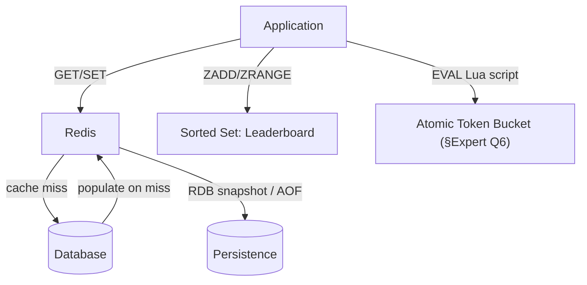
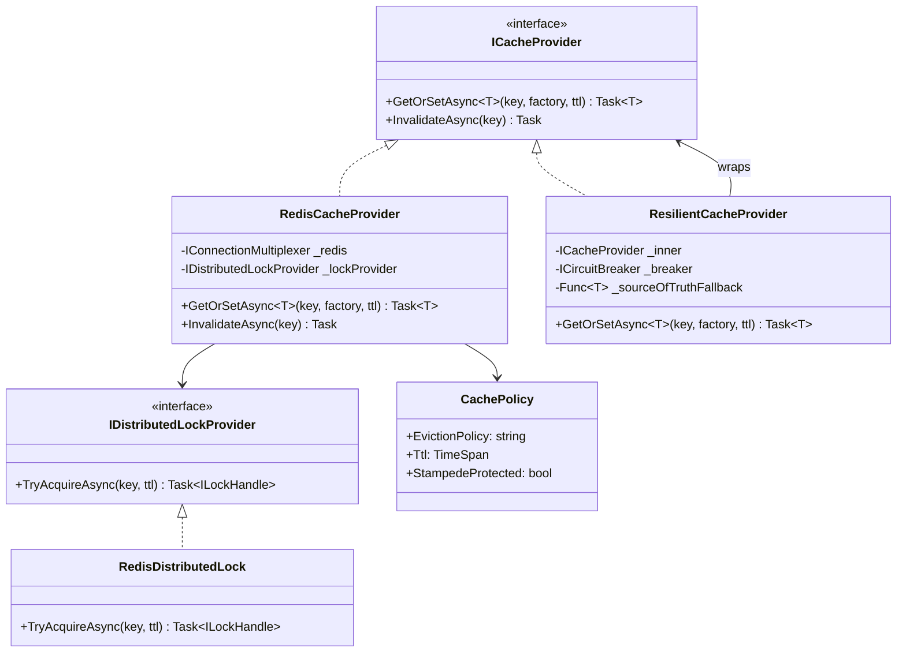
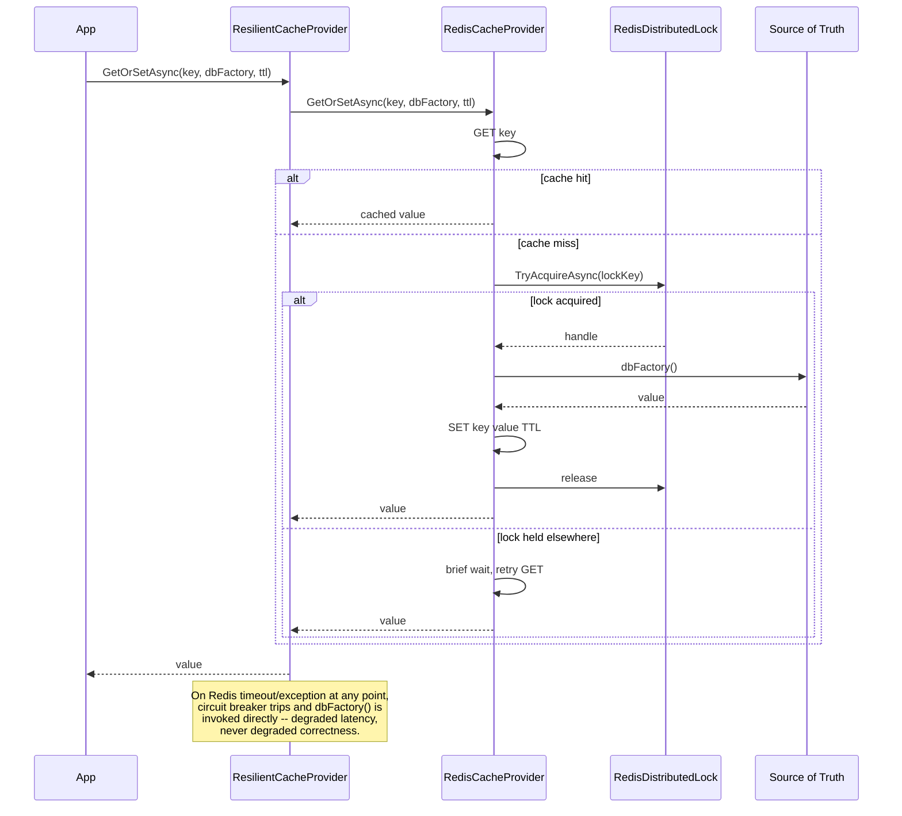

# Module 25 — Redis: Data Structures, Caching Patterns & Persistence

> Domain: Redis | Level: Beginner → Expert | Prerequisite: [[../01-CSharp/02-Async-Await-Internals]] §Expert Q6 (distributed rate limiting), [[../02-DotNet-AspNetCore/04-Authentication-Authorization-Deep-Dive]] (stampede-resistant caching)

---

## 1. Topic Description

### Definition

Redis is a **single-threaded, in-memory data structure server**: commands against a keyspace execute one at a time on one core, which is what makes every individual operation atomic without locks and what makes any single slow command a stall for every other client. Its value is not "a cache with a hash map" but a set of purpose-built structures — strings, hashes, lists, sets, sorted sets, bitmaps, HyperLogLogs, streams — each with its own complexity guarantees. **Caching patterns** are the architectural layer above: cache-aside, read-through, write-through and write-behind describe who is responsible for populating and invalidating the cache, and each makes a different, explicit trade between consistency, latency and failure behaviour.

### Core sub-concepts

- **Single-threaded execution model** — atomicity without locks, and why one O(n) command blocks the whole server.
- **Core data structures and their complexities** — strings, hashes (with field-level access), lists (as queues/stacks), sets, sorted sets (ranking, leaderboards, priority), bitmaps, HyperLogLog (cardinality with fixed memory), geospatial.
- **Key design and namespacing** — key shape as a schema, key size, and why the keyspace *is* the data model.
- **Expiry and eviction** — `TTL`, lazy plus active expiry, `maxmemory` and the eviction policies (`noeviction`, `allkeys-lru`, `allkeys-lfu`, `volatile-*`), and why the policy is a correctness decision when Redis holds non-cache data.
- **Memory model** — encodings (ziplist/listpack, intset), fragmentation, `maxmemory` versus RSS, and per-key overhead.
- **Caching patterns** — cache-aside (lazy), read-through, write-through, write-behind, refresh-ahead, and who owns invalidation in each.
- **Invalidation strategies** — TTL-only, explicit delete on write, versioned keys, tag-based grouping, and why "invalidate on write" is harder than it looks.
- **Cache failure modes** — stampede/dogpile, penetration (missing keys), avalanche (mass simultaneous expiry), and the mitigations for each.
- **Atomic operations and transactions** — `INCR`, `SETNX`, `MULTI`/`EXEC`, `WATCH` for optimistic concurrency, and Lua scripts for read-modify-write atomicity.
- **Pipelining** — batching round trips without changing atomicity.
- **Distributed locks** — `SET NX PX`, fencing tokens, the Redlock debate, and why lock correctness under partition is not free.
- **Rate limiting with Redis** — atomic counters and token buckets implemented in Lua.
- **Persistence** — RDB snapshots versus AOF, and what "durable cache" does and does not mean.
- **Client-side caching and tracking** — server-assisted invalidation to remove the network hop entirely.
- **Serialization and payload size** — value format, compression, and the network cost of large values.

### Where it fits

Redis sits between the application and a slower system of record, absorbing read load and holding derived or ephemeral state — sessions, computed views, counters, rate-limit buckets, locks. It depends on the correctness of the database beneath it and on the application to define invalidation; it is depended on by request paths whose latency budgets assume a cache hit. That last point is what makes it architecturally significant: once a service's capacity assumes a 95% hit rate, Redis is no longer an optimisation but a load-bearing dependency, and its failure is a database outage rather than a slowdown.

### Why it matters at scale

The characteristic failures are cliff-shaped. A single `KEYS *` or a large `HGETALL` on a multi-million-field hash blocks the single thread, so every client across the fleet sees a latency spike simultaneously — a self-inflicted outage from one command. A cache stampede on a popular key means thousands of requests miss at the same instant and all hit the database, converting a cache expiry into a database incident. Mass simultaneous expiry (avalanche) does the same at keyspace scale, which is why identical TTLs set during a warm-up are a time bomb. And an eviction policy of `noeviction` on a Redis holding both cache and session data means writes start failing when memory fills, while `allkeys-lru` silently evicts the sessions — either way, the policy chosen by default is wrong for a mixed keyspace.

### Common pitfalls / anti-patterns

- **Running O(n) commands in production** — `KEYS`, `SMEMBERS` on a huge set, `HGETALL` on a huge hash, or `FLUSHALL`; the single thread means one such command stalls every other client, so use `SCAN`-family cursors instead.
- **Storing a large object as one value and reading it whole** — a multi-megabyte value costs network and memory bandwidth on every access, where a hash with field-level reads would transfer only what is needed.
- **Identical TTLs across many keys** — they expire together, producing an avalanche of simultaneous misses onto the database; TTLs need jitter.
- **No stampede protection on hot keys** — every concurrent miss recomputes the same expensive value; a per-key lock, a single-flight guard, or probabilistic early refresh is required.
- **Caching nothing for a miss (cache penetration)** — repeated requests for a non-existent key pass straight through to the database every time; negative caching or a Bloom filter is the defence.
- **Mixing cache and non-cache data in one instance with an `allkeys-*` eviction policy** — sessions, locks or queue state get evicted under memory pressure, causing correctness failures rather than cache misses.
- **Treating a Redis distributed lock as safe by default** — without a fencing token, a lock holder that pauses (GC, network) can act after its lock expired while another holder believes it owns the resource.
- **Read-modify-write from the application** — fetch, modify, `SET` loses concurrent updates; the atomic operators or a Lua script are the correct tools.
- **Assuming Redis persistence makes it a system of record** — RDB loses the window since the last snapshot and AOF depends on its fsync policy; neither makes Redis a database.

---

## 2. Beginner (10 Q&A)

**Q1. Why does Redis being single-threaded matter to how you use it?**
**A:** Because commands execute one at a time on one core, every command is atomic without locks — but any command that takes milliseconds blocks *every* other client for that duration. So the performance model is not throughput per client but total command time across the whole server, and a single O(n) operation is a fleet-wide latency event. It also means Redis scales by adding instances or shards rather than by adding cores, and that CPU saturation on one core is the ceiling regardless of how many are available.
*Follow-up: Redis has added I/O threads in recent versions. What does that change and what does it not?*

**Q2. When would you choose a hash over separate string keys?**
**A:** When the fields belong to one logical entity and you frequently read or write a subset — a hash gives field-level access (`HGET`, `HSET`) with far lower per-key memory overhead than N separate keys, because each Redis key carries fixed metadata cost. Small hashes are additionally stored in a compact encoding that is very memory-efficient. The trade-off is that a TTL applies to the whole hash, not per field, so if fields need independent expiry they must be separate keys.
*Follow-up: Your hash grows to 100,000 fields. What changes, and what should you do?*

**Q3. What problems are sorted sets uniquely good at?**
**A:** Anything requiring ordering by a score with efficient range and rank queries: leaderboards, priority queues, time-ordered indexes, sliding-window rate limiters where the score is a timestamp, and delayed-job schedules where you pop items whose score is due. `ZADD` and rank queries are logarithmic, and range-by-score is efficient. The insight to convey is that the score is an arbitrary number you choose — using a timestamp turns a sorted set into a time index, which is why it appears in so many patterns.
*Follow-up: How would you implement a sliding-window rate limiter with a sorted set, and what's the memory cost?*

**Q4. Explain the cache-aside pattern and what it makes the application responsible for.**
**A:** The application checks the cache, and on a miss reads the database, populates the cache, and returns. It is simple, resilient (a cache outage degrades to database reads rather than failing), and it caches only what is actually requested. What the application owns is invalidation — on every write it must delete or update the cached entry, and every write path must remember to do so. That distributed responsibility is where staleness bugs come from, and it is the reason read-through and write-through exist as alternatives that centralise it.
*Follow-up: In cache-aside, should a write update the cache or delete the entry? Argue for one.*

**Q5. What is a cache stampede and how do you prevent it?**
**A:** When a popular key expires, every concurrent request misses simultaneously and all of them execute the expensive recomputation against the database — so a cache expiry becomes a database load spike. The defences are: a per-key lock or single-flight mechanism so only one request recomputes while others wait or serve stale; probabilistic early expiration so one request refreshes slightly before expiry; or refresh-ahead where a background process renews hot keys. The point to make is that this is a *predictable* consequence of TTLs on hot keys, not an edge case.
*Follow-up: Serving stale data while one request refreshes — when is that acceptable and when is it not?*

**Q6. What is cache penetration and what's the fix?**
**A:** Requests for keys that do not exist in the cache *or* the database — so every one passes through to the database, and a caller enumerating identifiers can drive unbounded database load through a cache that appears to be working. The defences are caching the negative result with a short TTL, and for large keyspaces a Bloom filter that can definitively say "not present" without a lookup. It is worth recognising as an availability and abuse concern, not only a performance one.
*Follow-up: Negative caching creates its own problem when the key is later created. How do you handle that?*

**Q7. Walk me through the eviction policies and how you choose one.**
**A:** `noeviction` rejects writes when memory is full — correct when Redis holds data that must not disappear, wrong for a pure cache since it turns memory pressure into write failures. `allkeys-lru`/`allkeys-lfu` evict from the whole keyspace, appropriate for a pure cache; LFU is better when access frequency matters more than recency. The `volatile-*` variants evict only keys with a TTL, which is the right choice for a mixed keyspace so that untagged operational data survives. The choice is really a statement about what the instance is for.
*Follow-up: Your instance holds sessions and cached pages together with `allkeys-lru`. What goes wrong?*

**Q8. When would you use `MULTI`/`EXEC` versus a Lua script?**
**A:** `MULTI`/`EXEC` queues commands and executes them together without interleaving, but the commands cannot depend on each other's results — you cannot branch on a value read inside the transaction. A Lua script executes atomically on the server *and* can read, decide and write, which is what you need for any read-modify-write invariant such as "decrement only if above zero". `WATCH` adds optimistic concurrency to `MULTI`, retrying if a key changed. In practice Lua covers most real needs.
*Follow-up: What's the risk of a Lua script that runs for 200 milliseconds?*

**Q9. How does Redis expiry actually work?**
**A:** Two mechanisms: lazy expiry removes a key when it is next accessed and found expired, and an active cycle samples random keys with TTLs and removes expired ones. Neither guarantees immediate removal, so an expired key can occupy memory after its TTL — which matters when memory accounting is tight. It also means expiry is not a scheduling mechanism: you cannot rely on something happening at the moment a key expires, and keyspace notifications for expiry are best-effort rather than guaranteed.
*Follow-up: Someone builds a delayed-job system on expiry notifications. What's your response?*

**Q10. What does Redis persistence give you, and what does it not?**
**A:** RDB writes point-in-time snapshots — compact, fast to restore, and losing everything since the last snapshot on a crash. AOF appends every write, with durability determined by its fsync policy, and rewrites periodically to bound size. Together they make a restart recoverable and speed up warm-up considerably. What they do not do is make Redis a system of record: the durability window is non-zero, replication is asynchronous, and the failure modes are quite different from a database's. Treating a persisted Redis as authoritative storage is how data gets lost.
*Follow-up: You enable AOF with `everysec`. What exactly is your worst-case data loss?*

---

## 3. Intermediate (10 Q&A)

**Q1. Redis latency spikes to hundreds of milliseconds intermittently across all clients. Diagnose it.**
**A:** Because it is single-threaded and all clients spike together, the cause is almost certainly one blocking operation rather than load: an O(n) command on a large collection, a slow Lua script, a large key being deleted synchronously, or a fork for RDB/AOF-rewrite causing copy-on-write pressure on a large dataset. The slow log names the first three directly and is where I would start. I would also check for large-key deletion, since freeing a multi-million-element structure blocks unless `UNLINK` is used, and check whether the spikes correlate with persistence schedules.
*Follow-up: The slow log shows nothing but spikes correlate exactly with the RDB save interval. What's happening?*

**Q2. How do you decide cache TTLs?**
**A:** From how stale the data may be in business terms, not from a convenient round number — that framing is what turns a guess into a decision someone can challenge. Then add jitter so keys do not expire in lockstep, which is what prevents an avalanche after a deployment or warm-up populates everything at once. For expensive-to-compute data I would favour a longer TTL with explicit invalidation on write, and for cheap data a shorter TTL with no invalidation logic at all, because the invalidation code is itself a source of bugs. The general principle is to spend complexity where the recomputation cost justifies it.
*Follow-up: A field is updated rarely but must never be stale. TTL, invalidation, or both?*

**Q3. Cache invalidation on write — update the entry or delete it?**
**A:** Delete, in most cases. Updating means computing the new cached value at write time, which duplicates the read path's logic and races with concurrent readers who may write back an older value they had already fetched. Deleting means the next reader recomputes from the authoritative source, which is simpler and self-correcting — at the cost of a guaranteed miss after every write, which matters for hot keys. Where writes are frequent and reads are hotter still, updating with a version check is defensible, but it is the more dangerous option and deserves justification.
*Follow-up: Delete-then-write or write-then-delete relative to the database update? Does the order matter?*

**Q4. When would you use write-through or write-behind rather than cache-aside?**
**A:** Write-through — writing to cache and database together — centralises invalidation so no write path can forget it, at the cost of write latency and a cache that must be available for writes to succeed. Write-behind, where the cache absorbs writes and flushes asynchronously, gives very high write throughput but makes the cache a system of record for the flush window, so a failure loses data. I would use write-through where correctness of invalidation matters more than write latency, and treat write-behind as a specialised choice requiring durable storage in the cache tier and an explicit acceptance of the loss window.
*Follow-up: Write-behind with Redis persistence enabled — is the loss window acceptable? What determines it?*

**Q5. How would you implement a distributed lock, and what are its limits?**
**A:** `SET key value NX PX ttl` with a unique value, released by a Lua script that deletes only if the value matches — that check-and-delete must be atomic or you can release someone else's lock. The limits are fundamental rather than implementational: the TTL bounds how long a crashed holder blocks others, but it also means a holder that pauses longer than the TTL loses the lock while believing it still holds it. The robust answer is a **fencing token** — a monotonically increasing number the protected resource checks — so a stale holder's writes are rejected. Without that, the lock is an optimisation, not a correctness guarantee.
*Follow-up: What's your view on Redlock across multiple independent Redis nodes?*

**Q6. How do you find and manage large keys?**
**A:** `--bigkeys` or `MEMORY USAGE` sampling to find them, and `SCAN` rather than `KEYS` to enumerate safely. Large keys cause three distinct problems: the commands touching them block the single thread, they transfer large payloads over the network, and in a clustered deployment they create an unbalanced shard that cannot be split because a key is atomic. The remedies are structural — split a huge hash into multiple keys by a sub-key, bucket a huge list, or move genuinely large blobs out of Redis entirely. I would also delete them with `UNLINK` so the free happens on a background thread.
*Follow-up: A single key holds 8 GB in a cluster. Why is that worse than the same data across a thousand keys?*

**Q7. How do you plan Redis memory capacity?**
**A:** Measure real per-key cost rather than the payload size, because per-key overhead, encoding choices and fragmentation dominate for small values — a million tiny keys can cost several times their nominal data. Set `maxmemory` explicitly below the machine's RAM with headroom for the copy-on-write fork during persistence, which can transiently need a large fraction of the dataset size. Then monitor used memory against `maxmemory`, the fragmentation ratio, and the eviction rate. A non-zero eviction rate on a cache is normal; on an instance holding operational data it is an incident.
*Follow-up: Your fragmentation ratio is 1.8. What does that mean and what do you do?*

**Q8. What happens to your service when Redis becomes unavailable, and how should it behave?**
**A:** That depends entirely on whether Redis is an optimisation or a dependency, and most teams discover which one it is during the outage. A cache-aside design degrades to database reads — slower, but functional, provided the database can absorb the full uncached load, which is the assumption worth testing. Sessions, locks or rate-limit state in Redis mean an outage is a functional failure. The design work is to decide per use case: fail open, fail closed, or degrade, with timeouts short enough that a hung Redis does not exhaust the application's threads or connections. That last point is what turns a cache outage into a total outage.
*Follow-up: Your database cannot handle 100% of the load uncached. What do you do about it before the outage?*

**Q9. When is pipelining the right optimisation, and what does it not give you?**
**A:** When you have many independent commands and the round-trip time dominates — pipelining sends them without waiting for individual replies, which can be an order-of-magnitude improvement for bulk operations. It does not give atomicity: other clients' commands can interleave, so pipelining is a network optimisation, not a transaction. It also has a practical limit, since a very large pipeline consumes server output buffer and delays other clients. In a cluster, keys in one pipeline may live on different nodes, which the client must handle.
*Follow-up: What's the difference in guarantees between a pipeline and `MULTI`/`EXEC`?*

**Q10. How would you use Redis for rate limiting correctly?**
**A:** With an atomic operation so concurrent requests cannot both pass — a Lua script implementing a token bucket or a sorted-set sliding window, executed server-side so the read-decide-write is one step. A naive `GET`, compare, `SET` from the application races and permits more than the limit under exactly the load that matters. I would also think about failure behaviour explicitly: if Redis is unreachable, does the limiter fail open (serving traffic, losing protection) or closed (rejecting)? That is a per-endpoint business decision, and a limiter whose failure mode nobody chose is a limiter you cannot rely on.
*Follow-up: The sorted-set sliding window is precise but memory-hungry at high request rates. When would you accept a token bucket's approximation instead?*

---

## 4. Expert / Architect (10 Q&A)

**Q1. How do you decide what belongs in Redis and what does not?**
**A:** Redis earns its place for data that is hot, small per item, and either derivable or genuinely ephemeral — cached reads, sessions, counters, rate-limit state, transient coordination. It is the wrong home for anything that must survive independently of the cache tier, anything large enough that the network transfer dominates, and anything requiring complex querying, because you will end up reimplementing a database badly. The test I apply is what happens if the entire dataset vanishes: if the answer is "we recompute and degrade", Redis is appropriate; if it is "we lose customer data", it needs a real system of record even if Redis remains in front of it.
*Follow-up: A team wants to use Redis as the primary store for a high-write workload because it's faster. How do you engage?*

**Q2. Design a caching strategy for a read-heavy service with strict freshness requirements in some areas and not others.**
**A:** Tier the data by freshness requirement and apply a different pattern to each, rather than choosing one strategy for the service. Data that may be minutes stale gets a long TTL with jitter and no invalidation logic — cheapest and most robust. Data that must reflect writes quickly gets explicit invalidation on write plus a short TTL as a backstop for missed invalidations, which will happen. Data that must never be stale is not cached, or is cached only within a request. I would make the tiering explicit in the code and documented, because the failure mode of an undocumented mixed strategy is that the next engineer applies the wrong one.
*Follow-up: How do you detect that an invalidation path is being missed, given the symptom is just stale data?*

**Q3. How do you handle cache consistency across multiple regions?**
**A:** Accept that a globally consistent cache is not achievable cheaply and design for what the business actually needs. The usual shape is a cache per region, populated locally, with invalidation propagated as events — so each region converges independently with a bounded staleness window. Cross-region replication of the cache itself adds latency and a new failure mode for little benefit, since the cache should be reconstructible. The important architectural decision is what a user experiences when they hit a different region than the one they wrote to, and that has to be a stated behaviour rather than an accident of routing.
*Follow-up: A user writes in the EU and immediately reads in the US. What should they see and how do you achieve it?*

**Q4. How would you approach a Redis instance that has become a single point of failure for many services?**
**A:** Establish the blast radius first — what actually breaks if it disappears — because the answer is usually broader than anyone believes, and shared instances accumulate consumers nobody tracks. Then separate by criticality and workload: cache data whose loss is tolerable, and operational data such as sessions and locks whose loss is not, should not share an instance, an eviction policy, or a failure domain. Beyond that, per-service or per-domain instances limit the radius and prevent one team's large keys or O(n) commands from stalling everyone else. I would frame it to stakeholders as choosing a blast radius and paying for it in instances.
*Follow-up: Splitting means more instances to operate and more memory overhead. How do you justify that?*

**Q5. What's your position on Redis Cluster versus sharding in the client or via a proxy?**
**A:** Redis Cluster handles slot assignment, resharding and failover natively and is the right default when you outgrow one instance, at the cost of constraints teams find surprising: multi-key operations must be in the same hash slot, transactions and Lua scripts cannot span slots, and clients must handle redirections. Client-side sharding gives full control and simplicity but makes resharding a bespoke project. A proxy centralises the complexity at the cost of another hop and another thing to operate. I would take Cluster unless a specific constraint rules it out, and I would design key names with hash tags from the start so related keys can be colocated.
*Follow-up: You need a transaction across two keys that hash to different slots. What are your options?*

**Q6. How do you make cache behaviour observable enough to operate?**
**A:** Hit rate per logical cache (not globally, since one aggregate number hides everything), miss latency, eviction rate, memory against `maxmemory`, connected clients, and the slow log — plus, crucially, the *database* load attributable to cache misses, because that is the number that turns a cache problem into a business impact. I would also alert on hit-rate drops rather than absolute values, since a sudden drop indicates a deploy that changed key shapes or broke invalidation, which is otherwise silent. The signal most often missing is per-key-pattern statistics, which is what identifies the one hot key causing a stampede.
*Follow-up: Hit rate drops from 95% to 80% after a deploy with no cache code changed. What's your first hypothesis?*

**Q7. How do you handle cache warm-up after a failure or deploy?**
**A:** Carefully, because a cold cache means every request is a miss and the database receives the full uncached load — which is precisely when it is least able to cope, and how a cache recovery becomes a database outage. The mitigations are gradual traffic ramp so load builds progressively, request coalescing so concurrent misses for the same key produce one database read, and pre-warming the known-hot keys before accepting traffic. I would also confirm the database can survive the uncached load at reduced traffic, because a design where it cannot means the cache is load-bearing and needs to be treated as a tier-one dependency with matching redundancy.
*Follow-up: Pre-warming takes 20 minutes. How does that interact with your deployment strategy?*

**Q8. How do you govern Redis usage across many teams sharing a platform?**
**A:** Through a paved path plus guardrails: a shared client library that sets sensible timeouts, applies key namespacing, forbids the dangerous commands, and emits standard metrics — so correct behaviour is inherited rather than remembered. Then quotas and monitoring on memory and key count per namespace, and instance separation by criticality so one team cannot evict another's sessions. Culturally, the key point to establish is that Redis is a shared single-threaded resource: one team's `KEYS` command is everyone's outage, which makes it different from a database where a bad query mostly hurts the person running it.
*Follow-up: A team's usage is degrading a shared instance and they dispute the attribution. How do you resolve it?*

**Q9. How do you evaluate managed Redis against self-managed?**
**A:** Managed removes failover, patching, backups and much of the monitoring setup, which is most of the operational burden — usually decisive. What I would check before committing: whether the failover time is measured and acceptable, whether the commands and modules you rely on are available, whether you control `maxmemory` policy and persistence settings, what the network path and latency actually are, and how cluster resharding is performed and how disruptive it is. Cost also behaves differently: memory is the dominant line item, so an inefficient key design becomes directly visible on the bill — which is a useful lever for getting it fixed.
*Follow-up: Failover on the managed service takes 30 seconds. Is that acceptable? What determines it?*

**Q10. What separates an excellent answer from an adequate one when a candidate designs a caching layer?**
**A:** An adequate answer describes cache-aside and a TTL. An excellent one starts from what may be stale and for how long, in business terms; chooses a pattern per data class rather than one for everything; names the failure modes — stampede, penetration, avalanche — and the specific mitigation for each; states what happens when the cache is unavailable and whether the database can absorb it; picks an eviction policy consistent with what else lives in the instance; and considers how the invalidation path will be observed, since its failure is silent. The distinguishing quality is treating the cache as a component with its own failure modes rather than as free speed.
*Follow-up: Given that, what's the first question you'd ask a product owner before designing a cache?*

---

## 5. Reference Material

> Retained from the original module: deep-dive internals, diagrams, production examples, exercises, system/low-level design, debugging walkthroughs and the Principal Engineer perspective.

### 1. Fundamentals

#### What is Redis, and why is it more than "just a cache"?
Redis is an **in-memory data structure store** — while overwhelmingly used as a cache, its actual value proposition is a rich set of native, atomically-manipulable data structures (strings, hashes, lists, sets, sorted sets, streams, bitmaps, HyperLogLog) accessible via simple commands with well-defined complexity guarantees, plus optional persistence and pub/sub messaging — a general-purpose, extremely fast building block for many distributed-systems patterns (rate limiting, leaderboards, session storage, distributed locks, job queues) beyond simple key-value caching.

#### Why does it exist?
Application-level in-process caching (the `IMemoryCache`) is fast but doesn't scale beyond one process/replica — a horizontally-scaled fleet needs a **shared**, external cache for fleet-wide consistency (directly the recurring theme §Expert Q6 onward). Redis fills this role with far lower latency than a full relational/document database round-trip, specifically because it's in-memory and single-threaded-per-core with a minimal command-processing overhead.

#### When does this matter?
Any horizontally-scaled system needing shared, low-latency state — caching, session storage, rate limiting, distributed locking, real-time leaderboards; the depth matters for choosing the correct data structure per use case (a frequent, high-value interview differentiator) and for understanding Redis's persistence/durability trade-offs, since "it's just a cache" thinking can lead to inappropriate reliance on Redis as a system of record.

#### How does it work (30,000-ft view)?
```
SET session:abc123 "{\"userId\":42}" EX 3600 # string, with expiration
ZADD leaderboard 1500 "player1" # sorted set, O(log n) insert
INCR page:views:home # atomic counter
```

### 2. Deep Dive

#### 2.1 Core Data Structures and Their Complexity Guarantees
- **String**: simple key-value; `INCR`/`DECR` are atomic (no read-modify-write race even under concurrent access) — the basis for atomic counters.
- **Hash**: a field-value map within one key — efficient for representing an object (a user session) without needing to serialize/deserialize an entire blob for a single-field update.
- **List**: an ordered sequence supporting O(1) push/pop from either end — the basis for simple queue/stack patterns.
- **Set**: unordered unique members, O(1) membership tests — efficient for "is X in this set" checks (deduplication, tag membership).
- **Sorted Set (ZSet)**: members with an associated score, maintained in sorted order — O(log n) insert/update/rank queries — the natural structure for leaderboards, priority queues, and rate-limiting sliding windows.
- **Stream**: an append-only log with consumer-group support — Redis's answer to a lightweight message-queue/event-log pattern, with at-least-once delivery semantics via consumer acknowledgment.

#### 2.2 Atomicity, Lua Scripting, and Why It Matters for Distributed Coordination
Every individual Redis command is atomic (Redis is effectively single-threaded for command execution, eliminating the classic read-modify-write race a naive multi-round-trip implementation would need external locking to prevent) — but a sequence of *multiple* commands is **not** atomic unless wrapped in a transaction (`MULTI`/`EXEC`, which queues commands and executes them together, but without conditional branching) or, for genuinely conditional/computed logic, a **Lua script** (`EVAL`), which executes atomically as a single unit server-side — directly the mechanism §Expert Q6/the distributed token-bucket rate limiter relies on for its atomic check-and-decrement operation.

#### 2.3 Eviction Policies — What Happens When Redis Runs Out of Memory
Redis is bounded by available RAM — once `maxmemory` is reached, an **eviction policy** determines behavior: `noeviction` (reject new writes with an error — appropriate when Redis holds data that must never be silently discarded), `allkeys-lru`/`allkeys-lfu` (evict least-recently/frequently-used keys regardless of expiration settings — appropriate for a pure cache where any key is a legitimate eviction candidate), `volatile-lru`/`volatile-ttl` (evict only among keys with an explicit TTL set, preserving keys with no expiration — appropriate when Redis holds a *mix* of genuine cache data and non-expiring, must-not-evict data in the same instance). Choosing the wrong policy for a given workload (e.g., `noeviction` on a pure cache, causing write failures instead of graceful eviction) is a common, avoidable production issue.

#### 2.4 Persistence — RDB Snapshots vs AOF, and Why "It's Just a Cache" Can Be Wrong
**RDB** (point-in-time snapshots, periodic) is fast to restore but can lose data since the last snapshot on a crash. **AOF** (Append-Only File, logging every write operation) offers stronger durability (configurable `fsync` policy — `always`, `everysec`, `no`) at higher write overhead, replayable to reconstruct state precisely. Many teams treat Redis purely as an ephemeral, "safe to lose" cache — but if Redis is also used for session storage, distributed locks, or rate-limiting state (the broader use cases), an unplanned data loss on restart can have real functional impact beyond "the cache is cold," making the persistence-configuration decision a genuine architectural choice, not a default to ignore.

#### 2.5 Redis Cluster and Sharding — Hash Slots
Redis Cluster distributes data across nodes via 16,384 fixed **hash slots**, each key mapped to a slot via `CRC16(key) mod 16384` — a client can compute which node owns a given key's slot directly, without a separate routing/lookup service. **Hash tags** (`{user123}.profile`, `{user123}.settings` — the `{...}` portion is what's actually hashed) let related keys be forced onto the **same** slot/node, enabling multi-key operations (which Redis Cluster otherwise restricts to same-slot keys only) for logically-related data — directly analogous to §Advanced Q3's shard-key-co-location reasoning for MongoDB transactions, here applied to Redis Cluster's multi-key-command constraint instead.

### 3. Visual Architecture

```mermaid
graph TB
 App[Application] -->|GET/SET| Cache[Redis]
 Cache -->|cache miss| DB[(Database)]
 DB -->|populate on miss| Cache
 App -->|ZADD/ZRANGE| Leaderboard["Sorted Set: Leaderboard"]
 App -->|EVAL Lua script| RateLimiter["Atomic Token Bucket (§Expert Q6)"]
 Cache -->|RDB snapshot / AOF| Disk[(Persistence)]
```

### 4. Production Example
**Scenario**: A session-storage Redis instance, configured with `allkeys-lru` eviction (copied from a "cache best practices" template without considering this instance's actual purpose), began silently evicting active user sessions under memory pressure during a traffic spike — users were unexpectedly logged out mid-session, with no error surfaced anywhere (eviction is silent by design), making the symptom ("random users report being logged out") very difficult to initially connect to a Redis configuration setting. **Investigation**: correlating logout reports with Redis's `evicted_keys` metric (via `INFO stats`) during the same time window confirmed active session keys were being evicted, not expiring naturally. **Fix**: switched to `noeviction` (rejecting new writes instead of silently discarding active session data once memory pressure hit) combined with proper capacity planning (sizing `maxmemory` and monitoring proactively) and a dedicated, separate Redis instance for genuine cache data using `allkeys-lru` appropriately. **Lesson**: eviction-policy choice must match the actual *purpose* of the data stored in a given Redis instance — a template/default setting copied without considering "is this data safe to silently discard under pressure" can convert a capacity problem into a silent, hard-to-diagnose correctness bug.

### 11. Coding Exercises

#### Easy — Atomic counter with expiration for a simple rate limit
```
INCR requests:user123
EXPIRE requests:user123 60 NX
-- NX on EXPIRE (Redis 7+): only sets the expiration if the key has none yet --
-- avoids resetting the TTL on every single request, only setting it once when the window starts.
```

#### Medium — Sliding-window rate limiter with a sorted set (Advanced Q2)
```lua
-- Lua script, executed atomically via EVAL
local key = KEYS[1]
local now = tonumber(ARGV[1])
local window = tonumber(ARGV[2])
local limit = tonumber(ARGV[3])

redis.call("ZREMRANGEBYSCORE", key, 0, now - window)
local count = redis.call("ZCARD", key)

if count < limit then
 redis.call("ZADD", key, now, now.. "-".. math.random)
 redis.call("EXPIRE", key, window)
 return 1 -- allowed
else
 return 0 -- rejected
end
```

#### Hard — Cache-aside with stampede protection via distributed lock (Advanced Q4)
```csharp
public async Task<Product> GetProductAsync(string sku)
{
    var cached = await _redis.StringGetAsync($"product:{sku}");
    if (cached.HasValue) return Deserialize<Product>(cached);

    string lockKey = $"lock:product:{sku}";
    bool lockAcquired = await _redis.StringSetAsync(lockKey, "1", TimeSpan.FromSeconds(5), When.NotExists);

    if (lockAcquired)
    {
        try
        {
            var product = await _repository.GetBySkuAsync(sku);
            await _redis.StringSetAsync($"product:{sku}", Serialize(product), TimeSpan.FromMinutes(10));
            return product;
        }
        finally
        {
            await _redis.KeyDeleteAsync(lockKey);
        }
    }
    else
    {
        await Task.Delay(50); // brief wait, then retry the cache read
        return await GetProductAsync(sku); // the populating request should have finished by now
    }
}
```

#### Expert — Redlock-style multi-instance distributed lock with a fencing token (Advanced Q3's mitigation)
```csharp
public class FencedDistributedLock
{
    private readonly IDatabase[] _redisInstances; // N independent Redis instances
    private readonly IDatabase _fencingTokenSource; // a durable counter, incremented per lock acquisition

    public async Task<(bool Acquired, long FencingToken)> TryAcquireAsync(string resource, TimeSpan ttl)
    {
        long fencingToken = await _fencingTokenSource.StringIncrementAsync("fencing:counter");
        int successCount = 0;

        foreach (var redis in _redisInstances)
        {
            bool acquired = await redis.StringSetAsync(resource, fencingToken.ToString, ttl, When.NotExists);
            if (acquired) successCount++;
        }

        bool majorityAcquired = successCount > _redisInstances.Length / 2;
        return (majorityAcquired, fencingToken);
    }
}
// The PROTECTED RESOURCE ITSELF (e.g., the database write the lock guards) must check that any
// incoming fencing token is STRICTLY GREATER than the last one it accepted -- rejecting a stale
// out-of-order write from a lock holder that outlived its actual lock (the Advanced Q3 mitigation
// for Redlock's clock-drift/pause-related edge cases).
```
**Discussion**: The fencing token is the concrete mechanism addressing Advanced Q3's Redlock criticism — even if a lock holder's process pauses long enough for its lock to expire and be re-acquired by another holder, the *protected resource* itself (not just the lock mechanism) independently rejects any write carrying an older fencing token than one it's already accepted, closing the correctness gap Redlock's pure lock-acquisition guarantee alone can't fully close.

### 12. System Design

**Scenario:** Design the caching and session layer for a payments platform's customer-facing API (account balance display, session management, idempotency-key dedup front cache, FX-rate distribution) sitting in front of a PostgreSQL system of record, at a scale of ~50,000 requests/second peak, with a hard requirement that no caching decision ever weakens the correctness of a money-moving operation.

**Requirements:**
- *Functional:* fast session lookup/validation on every authenticated request; display-only account-balance caching; short-TTL FX-rate distribution to pricing services; a fast front-cache for idempotency-key dedup (backed by the DB as authoritative, per Expert Q3).
- *Non-functional:* sub-5ms p99 cache read latency; zero silent data loss for session state; horizontal scalability to several million concurrent sessions; graceful, explicit degradation (not silent incorrect behavior) if Redis becomes unavailable.

**Components and database selection:** Redis Cluster (not a single instance) is selected over Memcached specifically for its native data structures (sorted sets for any rate-limiting/leaderboard-adjacent need), Lua-script atomicity for compound operations, and Streams for the event-fanout use cases Module 26 covers — Memcached's simpler pure-key-value model would require reimplementing several of these as application logic. Three **purpose-labeled instance pools** (Advanced Q10), each independently sized and configured: (1) **session-store pool** — `noeviction`, AOF `appendfsync everysec`, holding session tokens and their associated claims; (2) **pure-cache pool** — `allkeys-lru`, holding display-only account-balance snapshots and other safely-discardable derived data, populated cache-aside (§4) with stampede protection (Advanced Q4); (3) **coordination pool** — `noeviction`, careful capacity planning, holding FX-rate keys (short TTL, actively invalidated on new tick) and idempotency-key front-cache entries (backed by the DB's unique-constrained table as the authoritative store, per Expert Q3).

**Caching pattern:** cache-aside with per-key locking against stampede (Advanced Q4/Hard exercise) for account-balance display reads; write-through invalidation (publish an invalidation event on any underlying balance change, rather than relying on TTL expiry alone) to bound display staleness tightly.

**Messaging:** balance-change events published to a Stream (Module 26) that the cache-invalidation consumer reads from, ensuring the invalidation signal survives a consumer restart — deliberately not Pub/Sub, given Module 26's central lesson about Pub/Sub's fire-and-forget loss risk applied here to a correctness-adjacent signal (a missed invalidation means serving a stale, though never enforced-against, balance).

**Scaling:** Redis Cluster sharding (§2.5/§9) for the session-store and pure-cache pools as concurrent-session count grows past a single node's memory; read replicas for the FX-rate/coordination pool, since FX-rate reads vastly outnumber writes.

**Failure handling:** every cache read on the critical path (balance display, session validation) has an explicit, tested fallback to the PostgreSQL system of record on a Redis timeout/unavailability — degraded latency, never degraded correctness; the idempotency-key check specifically always falls back to the DB's unique constraint, never trusting an unreachable Redis cache's absence of a key as proof the operation hasn't already happened (Expert Q3).

**Monitoring:** `evicted_keys` (alerting on any non-zero rate for the session-store/coordination pools, per Advanced Q8); `mem_fragmentation_ratio` (§7/Expert Q7); cache-hit-rate per pool (distinguishing expected cache-miss-driven DB load from an unexpected regression); Redis Cluster node health and hash-slot coverage.

**Trade-offs:** three separately-configured pools cost more operational surface area (three sets of monitoring/alerting, three capacity plans) than a single shared instance, but this is the direct, deliberate trade against the §4 incident's root cause — a single shared configuration cannot simultaneously be `noeviction`-safe for sessions and `allkeys-lru`-efficient for pure cache data, so the added operational surface is the price of correctness per data-purpose, not accidental complexity.

### 13. Low-Level Design

**Requirements:** an internal `ICacheProvider` abstraction the API layer depends on, supporting cache-aside reads with stampede protection, explicit fallback-to-source-of-truth on Redis unavailability, and pluggable eviction/TTL policy per logical cache region — without leaking Redis-specific types into calling code, so the provider could be swapped (or backed by an in-process `IMemoryCache` in a test/fallback scenario) without touching business logic.


```mermaid
classDiagram
    class ICacheProvider {
        <<interface>>
        +GetOrSetAsync~T~(key, factory, ttl) Task~T~
        +InvalidateAsync(key) Task
    }
    class RedisCacheProvider {
        -IConnectionMultiplexer _redis
        -IDistributedLockProvider _lockProvider
        +GetOrSetAsync~T~(key, factory, ttl) Task~T~
        +InvalidateAsync(key) Task
    }
    class ResilientCacheProvider {
        -ICacheProvider _inner
        -ICircuitBreaker _breaker
        -Func~T~ _sourceOfTruthFallback
        +GetOrSetAsync~T~(key, factory, ttl) Task~T~
    }
    class IDistributedLockProvider {
        <<interface>>
        +TryAcquireAsync(key, ttl) Task~ILockHandle~
    }
    class RedisDistributedLock {
        +TryAcquireAsync(key, ttl) Task~ILockHandle~
    }
    class CachePolicy {
        +EvictionPolicy: string
        +Ttl: TimeSpan
        +StampedeProtected: bool
    }
    ICacheProvider <|.. RedisCacheProvider
    ICacheProvider <|.. ResilientCacheProvider
    ResilientCacheProvider --> ICacheProvider : wraps
    RedisCacheProvider --> IDistributedLockProvider
    IDistributedLockProvider <|.. RedisDistributedLock
    RedisCacheProvider --> CachePolicy
```


```mermaid
sequenceDiagram
    participant App
    participant Resilient as ResilientCacheProvider
    participant Redis as RedisCacheProvider
    participant Lock as RedisDistributedLock
    participant DB as Source of Truth

    App->>Resilient: GetOrSetAsync(key, dbFactory, ttl)
    Resilient->>Redis: GetOrSetAsync(key, dbFactory, ttl)
    Redis->>Redis: GET key
    alt cache hit
        Redis-->>Resilient: cached value
    else cache miss
        Redis->>Lock: TryAcquireAsync(lockKey)
        alt lock acquired
            Lock-->>Redis: handle
            Redis->>DB: dbFactory()
            DB-->>Redis: value
            Redis->>Redis: SET key value TTL
            Redis->>Lock: release
            Redis-->>Resilient: value
        else lock held elsewhere
            Redis->>Redis: brief wait, retry GET
            Redis-->>Resilient: value
        end
    end
    Resilient-->>App: value
    Note over Resilient: On Redis timeout/exception at any point,<br/>circuit breaker trips and dbFactory() is<br/>invoked directly -- degraded latency,<br/>never degraded correctness.
```

**Design patterns used:** **Decorator** (`ResilientCacheProvider` wraps `RedisCacheProvider`, adding circuit-breaking and fallback without `RedisCacheProvider` itself needing to know about failure-handling policy — directly mirroring the layered-decorator shape used for logging/metrics cross-cutting concerns elsewhere in this course); **Strategy** (`CachePolicy` is injected per logical cache region, letting the session-store, pure-cache, and coordination pools each supply a different eviction/TTL/stampede-protection strategy through the same `ICacheProvider` interface); **Circuit Breaker** (the resilience layer trips after a threshold of Redis failures, avoiding hammering an already-struggling Redis instance with continued requests, and forcing the DB-fallback path explicitly rather than letting every caller independently retry against a down dependency).

**SOLID mapping:** *Single Responsibility* — `RedisCacheProvider` only knows Redis mechanics; `ResilientCacheProvider` only knows failure-handling policy; `RedisDistributedLock` only knows lock acquisition. *Open/Closed* — a new cache region's policy is added via a new `CachePolicy` instance, not by modifying `RedisCacheProvider`'s code. *Liskov Substitution* — any `ICacheProvider` implementation (Redis-backed, in-memory-backed for tests) is substitutable without breaking callers. *Interface Segregation* — `ICacheProvider` and `IDistributedLockProvider` are separate, narrow interfaces rather than one bloated cache-and-locking interface. *Dependency Inversion* — the API layer depends on `ICacheProvider`, never on `IConnectionMultiplexer`/StackExchange.Redis types directly.

**Concurrency/thread safety:** `IConnectionMultiplexer` (StackExchange.Redis) is explicitly designed to be a **single, shared, thread-safe singleton** per application instance — a common, costly misconfiguration is creating a new multiplexer per request, which defeats connection pooling/pipelining and can exhaust Redis's connection limit under load; the LLD registers it as a singleton in DI. The distributed lock (`SET NX EX`) is the concurrency-safety mechanism *across processes* for the cache-population path (Advanced Q4), while `IConnectionMultiplexer`'s own internal thread safety handles *within-process* concurrent access safely without additional application-level locking.

### 14. Production Debugging

**Incident:** A payments-adjacent reporting API's p99 latency spiked from ~8ms to over 400ms for roughly six minutes, twice a day, at times that didn't correlate with traffic volume — unrelated services sharing the same Redis instance also showed correlated latency spikes during the same windows, ruling out an application-layer bug in the reporting API itself.

**Investigation:** `LATENCY HISTORY` and `LATENCY DOCTOR` on the shared Redis instance showed recurring `command` latency-event spikes precisely aligned with the incident windows; `MONITOR` (briefly, in a low-traffic staging replica of the pattern, never against the live production instance given its own overhead) combined with `SLOWLOG GET` on production identified the actual offending command — a scheduled reporting job issuing `KEYS reporting:daily:*` against a database that had grown to several million keys, to enumerate that day's report keys for a batch rollup, running twice daily via cron.

**Tools:** `SLOWLOG GET`/`SLOWLOG LEN` (surfaced the exact offending command and its execution time), `LATENCY HISTORY command` (confirmed the pattern's recurrence and duration), `INFO commandstats` (showed `cmdstat_keys` with an unusually high `usec_per_call`, consistent with a full-keyspace scan).

**Root cause:** `KEYS` performs a full, synchronous keyspace scan — on the single-threaded command loop (§7), this blocks every other client's commands for the scan's entire duration, and the database's key count had grown large enough (from unrelated organic growth over several months) that the scan duration crossed from "unnoticeable" to "a multi-hundred-millisecond fleet-wide stall," twice a day, exactly matching the cron schedule.

**Fix:** replaced the `KEYS reporting:daily:*` call with a cursor-based `SCAN` loop (`SCAN 0 MATCH reporting:daily:* COUNT 100`, iterating until cursor returns 0) — each individual `SCAN` call has bounded, small cost, so the same enumeration work completes without ever holding the command loop for more than a few milliseconds at a time, eliminating the stall entirely while producing the identical logical result set.

**Prevention:** added a `SLOWLOG`-based alert (any command exceeding a defined microsecond threshold triggers an alert, not just a passive log entry) as a standing safeguard; added `KEYS`/`SMEMBERS`/`HGETALL`/`SORT` (the unbounded-scan-shaped command family) to a code-review linting rule flagging their use against production Redis instances, requiring an explicit justification comment if genuinely necessary (e.g., confirmed bounded-size collection) rather than a silent default.

### 15. Architecture Decision

**Context:** choosing the caching technology for the payments-platform API layer (§12).

**Option A — Redis Cluster (recommended).** *Advantages:* rich native data structures (sorted sets, hashes, streams) covering caching, rate-limiting, and lightweight-messaging needs with one operational technology rather than several; Lua-script atomicity for compound operations; mature ACL/TLS security model (§8); strong ecosystem/tooling and hiring-market familiarity. *Disadvantages:* single-threaded command loop creates a shared blast-radius risk (§14) requiring active operational discipline (`SCAN` not `KEYS`, big-key avoidance); Cluster's multi-key-operation restriction (§2.5) requires hash-tag discipline. *Cost:* moderate — commodity memory-optimized instances, no per-operation licensing. *Complexity:* moderate — Cluster topology, Sentinel/Cluster failover semantics, and purpose-labeled instance-pool governance all require genuine operational maturity. *Scalability:* excellent, both horizontal (Cluster resharding) and read-scaling (replicas).

**Option B — Memcached.** *Advantages:* simpler operational model (pure key-value, no data-structure richness to reason about, no Lua-script atomicity to secure); historically slightly lower per-operation memory overhead for pure string caching; built-in multi-threaded architecture (unlike Redis's single command thread) can give better raw throughput for simple get/set-only workloads. *Disadvantages:* no native data structures (sorted sets, streams) — every rate-limiting/leaderboard/messaging need this platform has would require separate infrastructure or reimplementing atomicity at the application layer; no persistence option at all (pure in-memory, unconditionally loses everything on restart, making it structurally unsuitable for the session-store pool's requirements); no built-in replication/HA (Sentinel/Cluster have no Memcached equivalent — HA is typically bolted on via client-side consistent hashing across independent nodes, with no automatic failover). *Cost:* slightly lower raw compute cost for equivalent throughput on pure caching. *Complexity:* lower for the pure-cache pool alone, but this platform's actual requirements (sessions, rate-limiting, messaging) would force adopting a *second* technology alongside it anyway, increasing overall system complexity rather than reducing it. *Scalability:* horizontal via client-side sharding, but no automatic rebalancing/failover.

**Option C — In-process cache (`IMemoryCache`) only, no shared layer.** *Advantages:* zero network round-trip, lowest possible latency; zero additional infrastructure. *Disadvantages:* not shared across a horizontally-scaled fleet — each instance has its own independently-cold cache, and a session stored only in-process is lost entirely on that specific instance's restart/redeployment or when a request lands on a different instance than the one that created the session, structurally incompatible with a horizontally-scaled, load-balanced API; no cross-instance invalidation. *Cost:* lowest. *Complexity:* lowest, but structurally cannot meet this platform's actual requirements. *Scalability:* does not scale as a *shared* cache at all — this option is disqualified by the requirements, not merely disadvantaged, and is included here only to make the comparison explicit for stakeholders who might otherwise ask "why not just use in-memory caching."

**Recommendation:** Redis Cluster (Option A). Memcached's simplicity advantage is real but narrow — it solves only the pure-cache slice of this platform's actual requirements and would force a second technology for sessions, rate-limiting, and messaging, increasing total system complexity rather than reducing it; Option C is structurally disqualified for a shared, horizontally-scaled requirement. Redis's single-threaded-command-loop risk (§14) is real but manageable through the operational disciplines this module establishes (`SCAN` not `KEYS`, purpose-labeled instance pools, big-key avoidance) rather than a reason to avoid Redis altogether.

### 17. Principal Engineer Perspective

**Business impact:** the §4 incident (silent session eviction) and §14 incident (fleet-wide latency stall from a scheduled `KEYS` call) both share a business-impact shape a Principal Engineer must communicate precisely to non-technical stakeholders: neither was a "the system was down" outage in the traditional sense — both were *silent or diffuse* degradations (unexpected logouts; a reporting API's users experiencing intermittent slowness with no clear cause) that are meaningfully harder for the business to detect, prioritize, and trust the fix for than a hard outage would have been, because "it's slow sometimes" and "some users got logged out" don't generate the same urgency signal as a clear red dashboard.

**Engineering trade-offs:** the purpose-labeled instance-pool design (§12) deliberately trades operational surface area (three pools to monitor instead of one) for correctness-per-purpose — a Principal Engineer's job here is defending that trade-off against a natural cost-cutting instinct to consolidate back to "just one Redis instance, it's simpler," by keeping the §4 incident's concrete cost (production, customer-visible, silent) visible and quantified against the consolidation's modest, mostly-imaginary savings.

**Technical leadership:** establishing the `SCAN`-not-`KEYS` and big-key-avoidance disciplines as enforced code-review/lint rules (§14), not merely documented best practices, reflects the recurring lesson that a best practice living only in a wiki page gets rediscovered the hard way by each new team independently — the leadership lever is converting a lesson learned once into an enforced, low-friction standard applying automatically to every future engineer, not into another paragraph in a document nobody reads before their own incident.

**Cross-team communication:** when a shared Redis instance's latency spike affects multiple unrelated teams' services simultaneously (§14), the Principal Engineer's role includes correctly communicating that the *reporting job* is the root cause, not each individually-affected team's own service — resisting the natural but wrong instinct for each affected team to independently investigate their own, blameless service, which wastes parallel investigation effort that a single, correctly-scoped root-cause investigation would have resolved faster.

**Architecture governance:** the purpose-labeled configuration template (Advanced Q10) and the ACL-per-service-credential design (Expert Q8) are both instances of the same governance principle — make the *safe* choice the *default*, low-friction choice (provisioning against a pre-vetted template, requesting a pre-scoped ACL credential), so that the incident-prone path (a copied, unexamined configuration; a broad, shared credential) requires active, visible deviation rather than being the path of least resistance.

**Cost optimization:** memory fragmentation (§7/Expert Q7) and encoding-threshold crossings (Expert Q5) are both real, measurable, frequently-invisible cost levers — a Principal Engineer reviewing infrastructure spend should ask "what's our `mem_fragmentation_ratio` and encoding-distribution across our Redis fleet" before approving a capacity-expansion request, since a meaningful fraction of apparent capacity pressure is often fragmentation or oversized encodings rather than genuine data growth.

**Risk analysis and long-term maintainability:** every correctness-critical Redis use case in this module (idempotency-key dedup, distributed locks near money, cached balances) resolves to the same standing principle — Redis is a coordination/speed layer, and the *system of record* (a relational database with atomic guards, unique constraints, and transactions) remains the authoritative arbiter of correctness; a Principal Engineer's long-term-maintainability lens treats any design that inverts this (Redis as the sole source of truth for something financially consequential) as an architectural risk requiring explicit, documented justification and compensating controls, not a default acceptable pattern.

### 18. Revision
**Key takeaways**: Choose Redis data structures deliberately (sorted sets for ranking/rate-limiting, hashes for object-like partial-update data, strings for simple atomic counters) rather than defaulting to serialized blobs. Individual commands are atomic (single-threaded execution); multi-command atomicity requires `MULTI`/`EXEC` (no conditionals) or Lua scripts (full conditional logic, atomic). Eviction policy must match the data's actual loss-tolerance — `noeviction` for must-not-lose data, `allkeys-lru`/`lfu` for pure cache. RDB vs. AOF is a genuine durability-vs-overhead trade-off, relevant whenever Redis holds more than purely-disposable cache data. Redis Cluster's fixed 16,384 hash slots (not node-count-dependent) make incremental resharding tractable; hash tags force related keys onto the same slot for multi-key operations.

---

**Next**: Continuing autonomously to Module 26 — Redis Pub/Sub, Streams & High Availability (completing the `07-Redis` domain) before advancing to `08-DynamoDB`.
