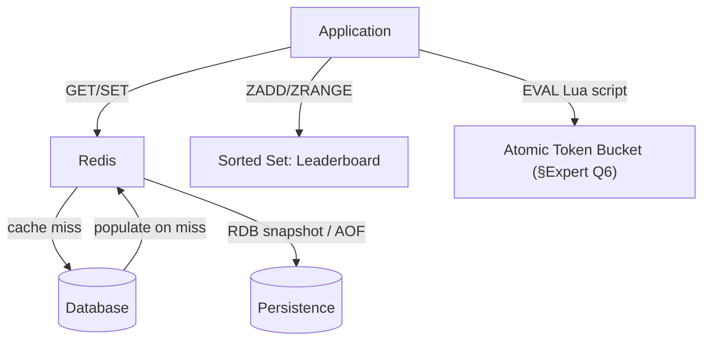
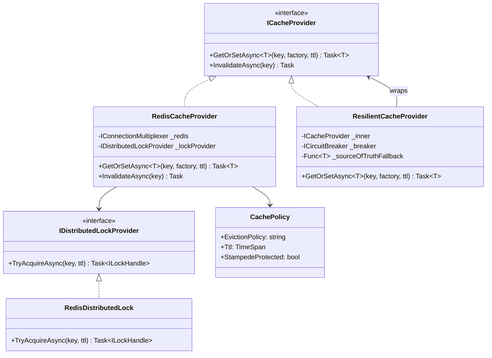
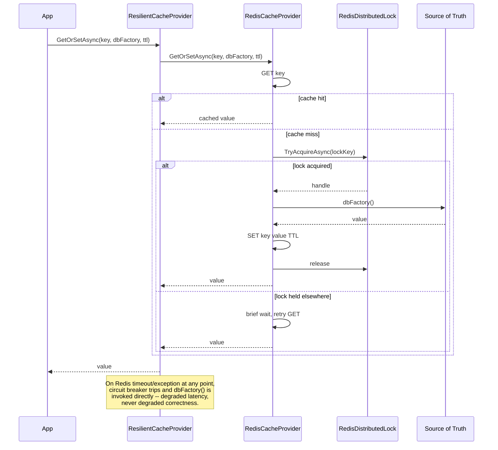
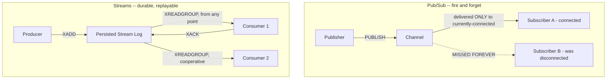
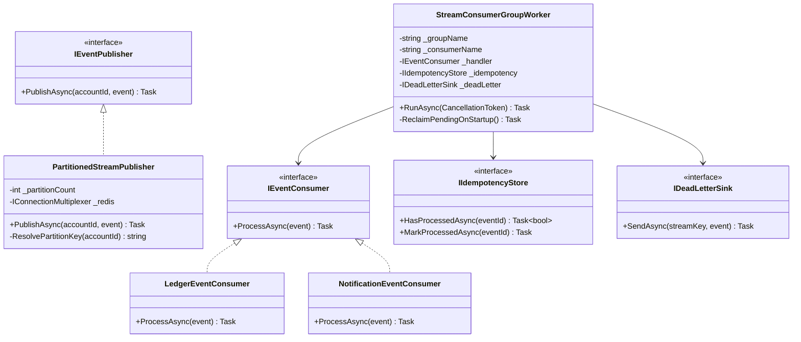
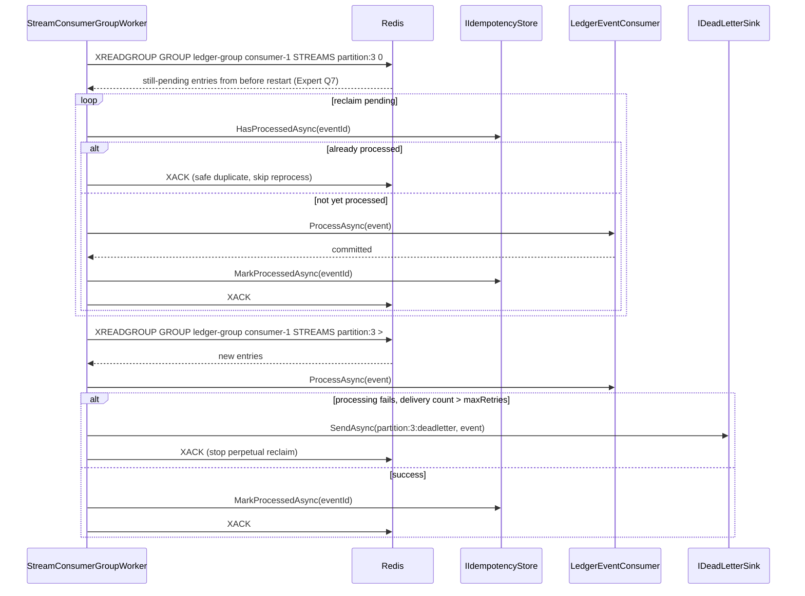

# Redis — Complete Interview Prep (All Topics, One File)

> Domain: Redis | Level: Beginner → Expert | Prerequisite: [[../02-DotNet-AspNetCore/01-DotNet-AspNetCore-Interview-Prep]] (HybridCache, rate limiting), [[../01-CSharp/01-CSharp-Interview-Prep]] (async, concurrency)
> **Quick-prep edition** (consolidated 2026-10-03). This one file replaces Modules 25–26. Originals: `git show ebb2d5c:07-Redis/<file>.md`
> Each topic has: **Key concepts → Code example → Most common interview questions with answers.**

| # | Topic | # | Topic |
|---|---|---|---|
| 1 | Redis fundamentals & execution model | 7 | Pub/Sub & keyspace notifications |
| 2 | Data structures & key design | 8 | Streams & consumer groups |
| 3 | Expiry, eviction & memory | 9 | Persistence (RDB/AOF) |
| 4 | Caching patterns, invalidation & failure modes | 10 | Replication, Sentinel & Cluster (HA) |
| 5 | Atomicity: MULTI/EXEC, WATCH, Lua, pipelining | 11 | Operations, multi-region & governance |
| 6 | Distributed locks & rate limiting | 12 | Top 30 rapid-fire + Principal questions · 13 Mistakes checklist |

---

## 1. Redis Fundamentals & Execution Model

**Key concepts**
- An **in-memory** data-structure server: sub-millisecond latency, ~100k+ ops/sec per core.
- **Commands execute on a single main thread** (I/O threads help with networking since Redis 6) → **every command is atomic**, with no locks needed — but **one slow O(n) command blocks everyone** (`KEYS *`, `SMEMBERS` on a huge set, `DEL` of a huge key, large Lua scripts).
- Use cases: **cache**, sessions, **rate limiting**, **distributed locks**, leaderboards, counters, queues/streams, pub/sub, deduplication (sets/bloom filters), geo queries.
- Not a primary database for critical data by default (asynchronous replication, persistence trade-offs).
- Licensing note: Redis moved to source-available licences in 2024 (Redis 8 adds AGPL); **Valkey** is the Linux Foundation open-source fork used by many cloud providers (ElastiCache/MemoryDB support Valkey).
- **.NET client:** `StackExchange.Redis` — `ConnectionMultiplexer` as a **singleton** (multiplexes, thread-safe). `IDistributedCache` / **`HybridCache`** abstractions.

```csharp
builder.Services.AddSingleton<IConnectionMultiplexer>(_ => ConnectionMultiplexer.Connect(config["Redis"]!));
builder.Services.AddStackExchangeRedisCache(o => o.Configuration = config["Redis"]);   // IDistributedCache
builder.Services.AddHybridCache();                                                    // L1 memory + L2 Redis, stampede protection

public class PriceService(IConnectionMultiplexer mux)
{
    private readonly IDatabase _db = mux.GetDatabase();
    public async Task<decimal?> GetAsync(string sku)
    {
        var v = await _db.StringGetAsync($"price:{sku}");
        return v.HasValue ? (decimal)v : null;
    }
}
```

**Common interview questions**

**Q1. Why does Redis being single-threaded matter?**
Each command runs to completion without interleaving, so single commands (and Lua scripts) are atomic without locks. But any slow command stalls all clients: avoid `KEYS`, use `SCAN`; avoid huge collections; delete big keys with `UNLINK` (asynchronous); keep Lua scripts short.

**Q2. Why is Redis so fast?**
Data lives in RAM, the data structures are efficient, there's no lock contention (single-threaded execution), it uses an event loop with non-blocking I/O, and it has a simple protocol (RESP). Network round trips usually dominate → pipelining.

**Q3. Should Redis be the system of record?**
Generally not for critical data: replication is asynchronous and persistence can lose recent writes. It's fine for derived, reconstructable or ephemeral data. If you need durable Redis semantics, consider AWS MemoryDB (durable multi-AZ log) and still design for loss.

---

## 2. Data Structures & Key Design

| Type | Key commands | Complexity | Use cases |
|---|---|---|---|
| **String** | `SET/GET`, `INCR`, `SETNX`, `SET EX/PX/NX` | O(1) | cache values, counters, locks, flags |
| **Hash** | `HSET/HGET/HINCRBY/HGETALL` | O(1) per field | objects (user profile), partial updates |
| **List** | `LPUSH/RPOP`, `BLMOVE`, `LRANGE` | O(1) ends | simple queues, recent-items lists |
| **Set** | `SADD/SISMEMBER/SINTER` | O(1) membership | unique visitors, tags, dedupe |
| **Sorted set** | `ZADD/ZRANGE/ZRANK/ZRANGEBYSCORE` | O(log n) | leaderboards, priority queues, **sliding-window rate limits**, time-ordered indexes |
| **Bitmap** | `SETBIT/BITCOUNT` | O(1) | daily active flags per user ID |
| **HyperLogLog** | `PFADD/PFCOUNT` | O(1), ~12 KB | approximate unique counts (0.81% error) |
| **Geo** | `GEOADD/GEOSEARCH` | O(log n) | nearby stores and drivers |
| **Stream** | `XADD/XREADGROUP/XACK` | O(1) append | event log, durable-ish queue |
| **JSON / Search / TimeSeries / Bloom** | modules (Redis Stack/Redis 8) | | documents, secondary indexes, vectors |

**Key design**
- Namespaced keys: `app:entity:id[:field]` → e.g., `shop:cart:{user42}`.
- Keep keys short-ish but readable; avoid huge values (>100 KB) and huge collections ("big keys").
- **Hash vs separate strings:** a hash groups fields (partial updates, memory-efficient listpack encoding for small hashes) but has one TTL per key (Redis 7.4 adds per-field TTL via `HEXPIRE`).

```bash
SET session:abc123 "{...}" EX 1800                 # value with a 30-minute TTL
INCR page:views:2026-10-03                         # atomic counter
HSET user:42 name "Ana" plan "gold"; HINCRBY user:42 logins 1
LPUSH recent:user:42 "prod:9"; LTRIM recent:user:42 0 9   # keep the last 10 items
SADD online:2026-10-03 42
ZADD leaderboard 1500 "ana" 1420 "bob"
ZREVRANGE leaderboard 0 9 WITHSCORES               # top 10
ZRANK leaderboard "bob"
PFADD uv:2026-10-03 user42 user43; PFCOUNT uv:2026-10-03
GEOADD stores -3.70 40.41 "madrid-1"; GEOSEARCH stores FROMLONLAT -3.7 40.4 BYRADIUS 5 km ASC
SCAN 0 MATCH "session:*" COUNT 1000                # never KEYS in production
```

**Common interview questions**

**Q1. Which problems are sorted sets uniquely good at?**
Ordered data with fast rank and range queries: leaderboards (`ZREVRANGE`, `ZRANK`), priority or delay queues (score = due time), sliding-window rate limiting (score = timestamp, trim old entries), and time-ordered secondary indexes — all O(log n).

**Q2. When would you use a hash instead of separate string keys?**
For an object with many fields that you read or update partially, to group related data under one key (one TTL, one delete), and for memory efficiency with small hashes. Use separate keys when fields need different TTLs (before 7.4) or are accessed independently at very high rates.

**Q3. How do you find and handle big keys?**
`redis-cli --bigkeys` / `--memkeys`, `MEMORY USAGE key`, and slow log entries. Split them (shard a big hash into buckets, bucket lists or sets), cap collection sizes, and delete with `UNLINK`. Big keys cause latency spikes, uneven cluster memory, and slow replication and migration.

**Q4. Why never use `KEYS *`?**
It's O(N) over the whole keyspace and blocks the server. Use `SCAN` (cursor-based, incremental) — or better, maintain explicit index sets.

---

## 3. Expiry, Eviction & Memory

**Key concepts**
- **TTL:** `EXPIRE`, `SET ... EX`, `PERSIST`, `TTL`. Expiry is **lazy** (checked on access) + **active** (sampling in the background) → expired keys may linger briefly but are never returned.
- **`maxmemory` + eviction policy** (when memory is full):
  - `noeviction` (writes fail — use for data you can't lose, e.g., queues and locks)
  - `allkeys-lru` / **`allkeys-lfu`** (typical for a pure cache)
  - `volatile-lru/lfu/ttl/random` (evict only keys with TTLs)
  - `allkeys-random`
- LRU/LFU are **approximated** by sampling.
- Memory: per-key overhead (~50+ bytes), compact encodings (listpack, intset) for small collections, fragmentation (`mem_fragmentation_ratio`, active defrag), replication buffers, fork copy-on-write during RDB/AOF rewrite (keep headroom ~25–50%).
- **TTL jitter** avoids mass simultaneous expiry.

```bash
CONFIG SET maxmemory 6gb
CONFIG SET maxmemory-policy allkeys-lfu
INFO memory          # used_memory, used_memory_rss, mem_fragmentation_ratio
MEMORY USAGE user:42
```

```csharp
// TTL with jitter to avoid an expiry avalanche
var ttl = TimeSpan.FromMinutes(10) + TimeSpan.FromSeconds(Random.Shared.Next(0, 60));
await db.StringSetAsync($"product:{id}", json, ttl);
```

**Common interview questions**

**Q1. How does expiry actually work?**
Each key with a TTL stores an expiry time. Redis deletes it when it's accessed after expiry (lazy) and also samples keys with TTLs periodically to remove expired ones (active). So memory from expired, never-accessed keys is reclaimed gradually.

**Q2. Walk me through eviction policies and how to choose.**
Pure cache: `allkeys-lfu` (keeps popular items) or `allkeys-lru`. Mixed cache + persistent keys: `volatile-*` so only TTL'd keys are evicted. Data that must never be dropped (queues, locks, rate-limit state): `noeviction` on a separate instance. Don't mix critical data and cache on the same instance.

**Q3. How do you plan Redis memory capacity?**
Estimate the key count × (key + value + per-key overhead), plus replication and client buffers, plus fragmentation, plus fork copy-on-write headroom for persistence. Keep `maxmemory` around 60–75% of RAM when persistence is on, monitor RSS vs used memory, and alert on evictions.

**Q4. How do you decide cache TTLs?**
From the business tolerance for staleness for each data type (prices: seconds; product descriptions: hours), from change frequency, and from cost of a miss; add jitter; use shorter TTLs plus explicit invalidation for data that must be fresh; always have a TTL as a safety net against stale-forever bugs.

---

## 4. Caching Patterns, Invalidation & Failure Modes

**Key concepts — patterns**

| Pattern | Read | Write | Notes |
|---|---|---|---|
| **Cache-aside** (lazy loading) | app reads cache → miss → DB → populate | app writes DB, then **deletes** the key | most common; the app owns everything |
| **Read-through** | the cache library loads from the DB on a miss | — | `HybridCache.GetOrCreateAsync` |
| **Write-through** | — | write the cache and DB synchronously | fresh cache, slower writes |
| **Write-behind** (write-back) | — | write the cache, flush to the DB asynchronously | fast writes, **risk of loss** |
| **Refresh-ahead** | refresh hot keys before expiry | — | avoids latency spikes for hot keys |

**Invalidation**
- **Update the DB, then delete the cache key** (don't SET the new value — concurrent writers can race and leave stale data). There's still a tiny race window → TTLs as a backstop; or use versioned keys.
- Cross-service invalidation via events (outbox → Kafka → delete keys) or CDC.
- Tag-based invalidation (`HybridCache` tags, output cache tags).

**Failure modes**

| Problem | Cause | Fix |
|---|---|---|
| **Stampede / dogpile** | a hot key expires; thousands hit the DB | single-flight locking per key, refresh-ahead or probabilistic early expiry, serve stale while revalidating |
| **Penetration** | requests for keys that don't exist (always a miss) | cache negative results (short TTL), Bloom filter, input validation |
| **Avalanche** | many keys expire at once or the cache restarts | TTL jitter, warm-up, rate-limit the DB, circuit breaker |
| **Hot key** | one key gets massive traffic (one shard overloaded) | local L1 cache, key replication (`key:{1..N}`), read replicas |

```csharp
// Cache-aside with stampede protection (HybridCache does this for you)
public async Task<Product?> GetProductAsync(int id, CancellationToken ct) =>
    await _hybridCache.GetOrCreateAsync($"product:{id}",
        async token => await _db.Products.AsNoTracking().FirstOrDefaultAsync(p => p.Id == id, token),
        new HybridCacheEntryOptions { Expiration = TimeSpan.FromMinutes(10), LocalCacheExpiration = TimeSpan.FromMinutes(1) },
        tags: ["products"], cancellationToken: ct);

// Write path: update the DB, then invalidate
public async Task UpdatePriceAsync(int id, decimal price, CancellationToken ct)
{
    await _db.Products.Where(p => p.Id == id).ExecuteUpdateAsync(s => s.SetProperty(p => p.Price, price), ct);
    await _hybridCache.RemoveAsync($"product:{id}", ct);       // delete, don't set
}

// Negative caching against penetration
if (product is null) await db.StringSetAsync($"product:{id}", "__null__", TimeSpan.FromSeconds(30));
```

**Common interview questions**

**Q1. Explain cache-aside and what the application is responsible for.**
The app checks the cache, loads from the database on a miss and populates the cache with a TTL; on writes it updates the database and invalidates the key. The app owns consistency, TTLs, serialization, stampede protection and fallback when Redis is down.

**Q2. On write, update the cache entry or delete it?**
Delete. Two concurrent writers updating DB then cache can finish in different orders and leave the older value in the cache. Deleting forces the next read to load the latest committed value. Keep TTLs as a backstop for the remaining race (a read loading stale data just before the delete).

**Q3. What is a cache stampede and how do you prevent it?**
Many concurrent misses for the same hot key all hit the database at once (after expiry or a deploy). Prevent with request coalescing (one loader per key — a lock or single-flight; HybridCache does it in-process), serving stale data while one request refreshes, probabilistic early refresh, and TTL jitter.

**Q4. What is cache penetration and the fix?**
Requests for non-existent IDs always miss and hit the database (often malicious). Cache negative results with a short TTL, put a Bloom filter in front, validate IDs, and rate-limit.

**Q5. When would you use write-through or write-behind?**
Write-through when reads must see fresh data immediately and writes are moderate. Write-behind for very high write rates where some loss is acceptable (counters, metrics) — never for financial data unless backed by a durable log.

**Q6. What happens when Redis is unavailable, and how should the service behave?**
For a cache: fall back to the database with protection (circuit breaker, timeouts of a few ms, rate limiting, L1 in-memory cache) so the DB isn't flattened. For locks and rate limiting: decide fail-open vs fail-closed per use case. Test this failure explicitly.

**Q7. Design caching for a service with strict freshness in some areas and not others.**
Classify data: static/reference (long TTL, preloaded), semi-dynamic (cache-aside + event-driven invalidation + short TTL), and strictly fresh (balances, entitlements — don't cache, or cache with version checks against the source). Use L1 + L2 (HybridCache) for hot read-mostly data, and monitor hit rate and staleness.

---

## 5. Atomicity: MULTI/EXEC, WATCH, Lua & Pipelining

**Key concepts**
- **Single commands are atomic** (`INCR`, `SET NX`, `HINCRBY`, `ZADD`).
- **`MULTI`/`EXEC`:** queues commands and runs them together without interleaving — **no rollback** if a command fails at runtime; you **can't read a value and act on it** inside the transaction.
- **`WATCH`:** optimistic concurrency — `EXEC` aborts if a watched key changed → retry.
- **Lua scripts** (`EVAL`/`EVALSHA`) and **Functions** (Redis 7): atomic read-modify-write logic on the server — the right tool for conditional logic (rate limiters, lock release). Keep them fast (they block everything). In Cluster, all keys must hash to the same slot.
- **Pipelining:** send many commands without waiting for each reply → fewer round trips (huge throughput gain) but **not atomic**. StackExchange.Redis pipelines async calls automatically; use `IBatch` for explicit batches.

```bash
WATCH balance:42
GET balance:42
MULTI
DECRBY balance:42 50
EXEC          # nil if balance:42 changed since WATCH → retry
```

```csharp
// Atomic conditional decrement with Lua (no overdraft)
const string Script = @"
local bal = tonumber(redis.call('GET', KEYS[1]) or '0')
local amt = tonumber(ARGV[1])
if bal >= amt then return redis.call('DECRBY', KEYS[1], amt) else return -1 end";
var result = (long)await db.ScriptEvaluateAsync(Script, [ (RedisKey)"credits:42" ], [ 50 ]);

// Explicit batch (pipelined, not atomic)
var batch = db.CreateBatch();
var tasks = ids.Select(id => batch.StringGetAsync($"price:{id}")).ToArray();
batch.Execute();
var prices = await Task.WhenAll(tasks);

// Transaction with a condition (WATCH-like)
var tran = db.CreateTransaction();
tran.AddCondition(Condition.StringEqual("order:9:status", "NEW"));
_ = tran.StringSetAsync("order:9:status", "PAID");
bool committed = await tran.ExecuteAsync();
```

**Common interview questions**

**Q1. `MULTI`/`EXEC` vs a Lua script?**
MULTI/EXEC runs a fixed batch atomically but can't use intermediate results for decisions and doesn't roll back runtime errors; combine it with WATCH for optimistic concurrency. Lua runs arbitrary logic atomically on the server (read, decide, write) in one round trip — preferred for conditional operations like rate limiting and safe lock release.

**Q2. When is pipelining the right optimization, and what doesn't it give you?**
When you have many independent commands and latency is dominated by round trips (bulk loads, multi-key reads): it can give a 5–10× throughput improvement. It doesn't make the commands atomic, and other clients' commands can interleave.

**Q3. Does Redis roll back a failed transaction?**
No. Syntax errors abort the whole MULTI before EXEC, but a runtime error in one command (e.g., the wrong type) doesn't stop the others. Validate first, or use Lua with explicit checks.

---

## 6. Distributed Locks & Rate Limiting

**Key concepts — locks**
- Acquire: **`SET lock:res <unique-token> NX PX 30000`** (atomic set-if-absent with a lease).
- Release: a **Lua script** that deletes only if the value equals your token (never delete someone else's lock).
- Lease expiry problem: a GC pause or network delay can outlast the lease → two holders. Mitigations: renew (watchdog), keep the critical section short, and **fencing tokens** (a monotonically increasing number checked by the protected resource).
- **Redlock** (multiple independent masters): debated (Kleppmann vs antirez) — it still relies on timing assumptions. **Use Redis locks for efficiency (avoid duplicate work), not correctness**; for correctness use DB constraints, fencing, or consensus systems (etcd/ZooKeeper).

**Key concepts — rate limiting**
- **Fixed window:** `INCR key:{window}` + `EXPIRE` (boundary bursts).
- **Sliding window log:** a sorted set of timestamps (`ZREMRANGEBYSCORE` + `ZCARD` + `ZADD`) — precise, more memory.
- **Token bucket:** a Lua script storing tokens + last refill time — burst + steady rate.
- Key by authenticated client/tenant; decide fail-open/closed when Redis is down.

```csharp
// Lock acquire and safe release
var token = Guid.NewGuid().ToString();
bool acquired = await db.StringSetAsync("lock:settlement:2026-10-03", token, TimeSpan.FromSeconds(30), When.NotExists);
if (acquired)
{
    try { await RunSettlementAsync(); }
    finally
    {
        await db.ScriptEvaluateAsync(
            "if redis.call('GET', KEYS[1]) == ARGV[1] then return redis.call('DEL', KEYS[1]) else return 0 end",
            [ (RedisKey)"lock:settlement:2026-10-03" ], [ token ]);
    }
}
// StackExchange.Redis also offers db.LockTakeAsync / LockReleaseAsync with the same semantics.

// Fixed-window limiter: 100 requests per minute per client
var key = $"rl:{clientId}:{DateTime.UtcNow:yyyyMMddHHmm}";
var count = await db.StringIncrementAsync(key);
if (count == 1) await db.KeyExpireAsync(key, TimeSpan.FromMinutes(1));
if (count > 100) return Results.StatusCode(429);
```

```lua
-- Sliding-window log limiter: KEYS[1]=key, ARGV: nowMs, windowMs, limit, uniqueMember
redis.call('ZREMRANGEBYSCORE', KEYS[1], 0, ARGV[1] - ARGV[2])
if redis.call('ZCARD', KEYS[1]) < tonumber(ARGV[3]) then
  redis.call('ZADD', KEYS[1], ARGV[1], ARGV[4])
  redis.call('PEXPIRE', KEYS[1], ARGV[2])
  return 1
end
return 0
```

**Common interview questions**

**Q1. How do you implement a distributed lock with Redis, and what are its limits?**
`SET key token NX PX ttl` to acquire; a Lua compare-and-delete to release; a renewal for long tasks. Limits: with asynchronous replication a failover can lose the lock; a paused client can outlive its lease while another acquires it. So it's safe for efficiency, not for correctness — protect critical resources with fencing tokens or database constraints.

**Q2. What is a fencing token?**
A monotonically increasing number issued with each lock grant; the protected resource (e.g., storage or a DB) rejects writes carrying an older token. Even if two clients think they hold the lock, the stale one's writes are refused.

**Q3. Is Redlock safe?**
It reduces dependency on a single node, but it still assumes bounded clock drift, network delay and process pauses; critics show scenarios where two clients hold the lock. For correctness-critical locking, use consensus systems or database guarantees; use Redis/Redlock where occasional duplicates are tolerable.

**Q4. How would you use Redis for rate limiting correctly?**
Atomic operations only (INCR + EXPIRE in a pipeline/Lua, or a Lua token bucket); key by authenticated identity; pick an algorithm by need (fixed window is simple, sliding window is precise, token bucket allows bursts); keep keys in the same Cluster slot; add a local fallback limit and a fail-open/closed decision if Redis is down; and return 429 with `Retry-After`.

---

## 7. Pub/Sub & Keyspace Notifications

**Key concepts**
- **Pub/Sub:** `PUBLISH channel msg` / `SUBSCRIBE` / `PSUBSCRIBE pattern`. **Fire-and-forget, at-most-once**: no persistence, no acknowledgements; **disconnected subscribers miss messages**.
- Slow subscribers: messages buffer in the client output buffer → when it exceeds `client-output-buffer-limit pubsub`, Redis **disconnects** the client (messages lost).
- In Cluster, classic Pub/Sub broadcasts to all nodes; **sharded Pub/Sub** (`SPUBLISH`, Redis 7) keeps it on the slot's shard.
- Good for: cache invalidation broadcasts, SignalR backplane, ephemeral notifications. Not for: anything that must not be lost.
- **Keyspace notifications** (`notify-keyspace-events`): events on key changes and expirations — **best-effort** (lost if no subscriber is connected; expired events fire when Redis actually deletes the key, which may be late) → not a reliable trigger for business logic.

```csharp
var sub = mux.GetSubscriber();
await sub.SubscribeAsync(RedisChannel.Literal("cache-invalidation"), (ch, msg) => _localCache.Remove(msg.ToString()));
await sub.PublishAsync(RedisChannel.Literal("cache-invalidation"), "product:42");
```

**Common interview questions**

**Q1. What are the delivery semantics of Pub/Sub?**
At-most-once: delivered only to currently connected subscribers, with no storage, replay or acknowledgement. A restart, network blip or slow consumer means lost messages.

**Q2. What happens to a slow Pub/Sub subscriber?**
Its output buffer grows; past the configured limit Redis disconnects it, and it loses every message in that buffer and any published while disconnected.

**Q3. Where shouldn't you use keyspace notifications?**
As a reliable trigger for business processes (e.g., "when this session expires, charge the customer") — events can be lost or delayed. Use a durable scheduler or stream instead.

---

## 8. Streams & Consumer Groups

**Key concepts**
- **Streams:** an append-only log (`XADD`) with IDs `<ms>-<seq>`; read by range (`XRANGE`) or block for new entries (`XREAD BLOCK`).
- **Consumer groups** (`XGROUP CREATE`, `XREADGROUP`): each entry is delivered to **one consumer** in the group (load balancing); multiple groups each get every entry.
- **At-least-once:** an entry stays in the **Pending Entries List (PEL)** until **`XACK`**. Crashed consumer → others reclaim stuck entries with **`XAUTOCLAIM`/`XCLAIM`** after an idle time; track the delivery count → move poison messages to a dead-letter stream.
- **Retention = memory:** trim with `MAXLEN ~ N` (approximate, efficient) or `MINID` → an untrimmed stream is an out-of-memory incident.
- **vs Kafka:** Redis Streams are simpler and lower latency, but in-memory (limited retention), with weaker durability (async replication) and a less mature ecosystem. Good for moderate, short-retention work queues; Kafka for large-scale, durable, replayable event logs.

```bash
XADD payments:events MAXLEN ~ 1000000 * type "captured" paymentId "P1" amount "125.50"
XGROUP CREATE payments:events ledger-writer $ MKSTREAM
XREADGROUP GROUP ledger-writer worker-1 COUNT 10 BLOCK 5000 STREAMS payments:events >
XACK payments:events ledger-writer 1727950500000-0
XPENDING payments:events ledger-writer - + 10                         # stuck messages
XAUTOCLAIM payments:events ledger-writer worker-2 60000 0-0 COUNT 10    # reclaim idle > 60 s
```

```csharp
var entries = await db.StreamReadGroupAsync("payments:events", "ledger-writer", "worker-1", ">", count: 10);
foreach (var e in entries)
{
    await HandleIdempotentlyAsync(e);                                  // at-least-once → dedupe
    await db.StreamAcknowledgeAsync("payments:events", "ledger-writer", e.Id);
}
```

**Common interview questions**

**Q1. How do Streams differ from Pub/Sub?**
Streams persist entries (in memory, plus RDB/AOF), support consumer groups, acknowledgements, pending tracking, replay by ID and backpressure. Pub/Sub is transient fan-out with no storage or acknowledgement.

**Q2. What is the Pending Entries List and why does it matter?**
It tracks entries delivered to a consumer but not yet acknowledged. It enables recovery: if a consumer crashes, another consumer claims its idle pending entries. If you never ACK, the PEL grows forever (memory) and entries are never considered done.

**Q3. Walk me through recovering work from a crashed consumer.**
Periodically run `XAUTOCLAIM` with a minimum idle time to transfer stuck entries to a healthy consumer; process them idempotently; ACK; if the delivery count exceeds a threshold, move the entry to a dead-letter stream and alert.

**Q4. When would you choose Redis Streams over Kafka or SQS?**
When you already run Redis, need low latency, moderate throughput, short retention (minutes or hours) and simple consumer groups — e.g., background job distribution. Choose Kafka for high-volume, long retention and replay, partitioned ordering and a rich ecosystem; SQS for a fully managed queue with no operations.

**Q5. How do you get exactly-once processing on an at-least-once transport?**
You can't get exactly-once delivery; make the *effect* exactly-once: idempotent handlers (a dedupe key stored atomically with the side effect, e.g., `SET processed:{id} NX` or a DB unique constraint in the same transaction as the business write), then ACK.

---

## 9. Persistence: RDB & AOF

**Key concepts**
- **RDB:** point-in-time snapshots via `fork()` (`BGSAVE`) — compact, fast restarts, but you **lose writes since the last snapshot** (minutes). Fork copy-on-write can double memory under heavy writes.
- **AOF:** appends every write; `appendfsync always` (safest, slowest), **`everysec`** (default — lose ≤ ~1 s), `no`. AOF rewrite compacts the log. Redis 7 uses a multi-part AOF.
- Use both (RDB for backups and fast restarts, AOF for durability) or neither (a pure cache).
- A restart with a large dataset takes time to load (minutes for tens of GB) → affects HA design.
- **Persistence ≠ durability across failover:** replication is async, so acknowledged writes can be lost when a replica is promoted.

```conf
save 900 1 300 100 60 10000      # RDB snapshot rules
appendonly yes
appendfsync everysec
aof-use-rdb-preamble yes
```

**Common interview questions**

**Q1. What does Redis persistence give you, and what doesn't it?**
It lets data survive a process restart (RDB snapshot and/or AOF replay). It doesn't guarantee zero data loss: RDB loses the interval since the last snapshot, AOF `everysec` up to ~1 s, and asynchronous replication can lose acknowledged writes on failover.

**Q2. RDB vs AOF?**
RDB is compact, fast to load and good for backups, but loses more data. AOF is more durable (≤ 1 s with everysec), with bigger files and slower restarts. Production stateful Redis usually uses both; a pure cache often disables persistence.

**Q3. Is Redis durable enough for X?**
For caches, sessions and rate limits: yes. For an order queue, balances or anything financial: only with a durable log (AOF always + `WAIT` + `min-replicas-to-write`, or MemoryDB) — and usually better in a database or broker built for durability.

---

## 10. Replication, Sentinel & Cluster (High Availability)

**Key concepts**
- **Replication:** primary → replicas, **asynchronous**; partial resync from the replication backlog; `WAIT numreplicas timeout` waits for acknowledgements (reduces but doesn't eliminate loss); **`min-replicas-to-write` / `min-replicas-max-lag`** stop a primary accepting writes when isolated (limits split-brain loss).
- **Sentinel:** monitors the primary, reaches **quorum** on failure, promotes a replica, and tells clients the new primary. Run ≥ 3 sentinels on separate hosts. For a single dataset that fits on one node.
- **Redis Cluster:** **16,384 hash slots** spread across masters (each with replicas); the client hashes `CRC16(key) mod 16384`; `MOVED`/`ASK` redirects; **multi-key operations, transactions and Lua need all keys in one slot** → **hash tags** `{user42}:cart` and `{user42}:profile`; resharding moves slots online.
- **Sentinel vs Cluster:** Sentinel = HA for one shard; Cluster = HA + horizontal scaling (data and throughput) with key constraints.
- Managed: ElastiCache/MemoryDB, Azure Cache for Redis/Azure Managed Redis.
- Clients must handle failover: reconnect, retry idempotent operations, refresh topology.

```bash
# Cluster: keys sharing a hash tag land in the same slot
SET {order:9}:status PAID
HSET {order:9}:lines sku1 2
CLUSTER KEYSLOT "{order:9}:status"
# Safety: refuse writes if no replica is in sync within 10 s
CONFIG SET min-replicas-to-write 1
CONFIG SET min-replicas-max-lag 10
```

**Common interview questions**

**Q1. Is Redis replication synchronous?**
No — asynchronous. A primary acknowledges writes before replicas have them, so failover can lose recent writes. `WAIT` makes a client wait for replica acknowledgements (still not strictly durable), and `min-replicas-to-write` limits loss during partitions.

**Q2. What does Sentinel do?**
It monitors primaries and replicas, agrees (quorum) that a primary is down, promotes a replica, reconfigures the others, and serves as service discovery so clients find the new primary.

**Q3. What constraints does Redis Cluster impose?**
Multi-key commands, transactions and Lua scripts only work when all keys are in the same slot (use hash tags carefully to avoid hot slots); `SELECT` of other databases isn't supported; clients must be cluster-aware; and big or hot keys can't be split across nodes.

**Q4. Sentinel or Cluster — how do you choose?**
Sentinel when the dataset and throughput fit one primary and you want simple semantics. Cluster when you need more memory or throughput than one node, accepting the hash-slot constraints and more complex operations.

**Q5. How do you bound data loss on failover?**
`min-replicas-to-write` + `min-replicas-max-lag` (an isolated primary stops accepting writes), `WAIT` for critical writes, AOF on replicas, and — above all — not storing non-reconstructable critical data only in Redis.

**Q6. What does a Redis restart cost on a large dataset, and how does that shape HA?**
Loading tens of GB from RDB/AOF can take minutes, and a full resync of a replica transfers the whole dataset. So rely on failover to a warm replica rather than restarts, keep shards moderately sized, and warm caches gradually.

---

## 11. Operations, Multi-Region & Governance

**Key concepts**
- **Latency spikes:** slow commands (`SLOWLOG GET`), big keys, `fork` for persistence on large datasets, swapping, transparent huge pages, network saturation, too many clients, expiry storms, Lua scripts. Tools: `LATENCY DOCTOR`, `INFO`, `MONITOR` (careful — heavy).
- **Metrics:** hit ratio, ops/sec, latency p99, memory used vs maxmemory, evictions, expired keys, connected clients, replication lag/offset, CPU, keyspace size, slowlog.
- **Multi-region:** caches per region (invalidate via events), active-active CRDT replication (Redis Enterprise / Azure Active geo-replication), or global datastores (ElastiCache Global Datastore — one writer region).
- **Shared Redis as a single point of failure:** split by purpose (cache vs locks/rate limits vs queues), by team or domain; set eviction policies per use; key prefixes and quotas; client timeouts and circuit breakers.
- **Cache warm-up** after a deploy or failure: gradual traffic ramp, preload hot keys, rely on stampede protection.
- **Security:** ACLs (Redis 6+), TLS, no public exposure, rename/disable dangerous commands (`FLUSHALL`, `KEYS`, `CONFIG`).

**Common interview questions**

**Q1. Redis latency spikes intermittently across all clients. Diagnose it.**
Check `SLOWLOG` (O(n) commands like `KEYS`, `HGETALL` on big hashes, large `DEL`s), `LATENCY DOCTOR` (fork for RDB/AOF rewrite on a big dataset), memory (swapping, fragmentation), expiry bursts, CPU (Lua scripts), client count and network. Fix big keys, use `SCAN`/`UNLINK`, move persistence to replicas, add jittered TTLs, and scale out.

**Q2. How do you make cache behaviour observable?**
Per-cache-name hit/miss ratio, load latency on misses, evictions, key counts, memory, error rates and timeouts in the client, staleness indicators, plus traces showing cache vs DB spans.

**Q3. How do you handle cache consistency across regions?**
Treat each region's cache as local: invalidate through replicated events (a Kafka topic per region, CDC), keep short TTLs for data changed in other regions, or use active-active CRDT-based Redis for shared counters — accepting eventual consistency.

**Q4. A Redis instance has become a single point of failure for many services. What do you do?**
Inventory its uses; split them by criticality and type (cache, coordination, queues) onto separate HA deployments; give each service timeouts, circuit breakers and fallbacks; enforce key-prefix ownership and per-team quotas; and run failover game days.

---

## 12. Top 30 Rapid-Fire Questions + Principal Questions

1. **Why fast?** In-memory, single-threaded event loop, efficient structures.
2. **Atomic commands?** Yes, every single command.
3. **Slow command impact?** Blocks all clients.
4. **`KEYS` vs `SCAN`?** Blocking O(N) vs incremental cursor.
5. **Leaderboard?** Sorted set.
6. **Unique count, approximate?** HyperLogLog.
7. **Object storage?** Hash.
8. **Expiry mechanism?** Lazy + active sampling.
9. **Cache eviction policy?** `allkeys-lfu`/`lru`.
10. **Queue data?** `noeviction` on a separate instance.
11. **Cache-aside write?** Update the DB, then delete the key.
12. **Stampede?** Coalesce + serve stale + jitter.
13. **Penetration?** Negative caching / Bloom filter.
14. **Avalanche?** TTL jitter + warm-up.
15. **MULTI rollback?** None.
16. **Conditional atomic logic?** Lua.
17. **Pipelining?** Fewer round trips, not atomic.
18. **Lock acquire?** `SET key token NX PX`.
19. **Lock release?** A Lua compare-and-delete.
20. **Lock for correctness?** No → fencing tokens / DB constraints.
21. **Rate limiter?** Lua token bucket or sliding window with a sorted set.
22. **Pub/Sub semantics?** At-most-once, no persistence.
23. **Streams semantics?** At-least-once with consumer groups + ACK.
24. **Stuck messages?** `XAUTOCLAIM` from the PEL.
25. **Stream retention?** `MAXLEN ~` / `MINID` trimming.
26. **RDB vs AOF?** Snapshots vs append log (`everysec`).
27. **Replication?** Asynchronous.
28. **Sentinel?** HA/failover for one shard.
29. **Cluster slots?** 16,384; hash tags for multi-key operations.
30. **.NET client lifetime?** `ConnectionMultiplexer` singleton.

**Principal-level questions**

**P1. How do you decide what belongs in Redis?**
Data that is derived/reconstructable or ephemeral and needs very low latency: caches, sessions, rate-limit counters, leaderboards, short-lived coordination. Not the only copy of business-critical state (orders, balances, audit). Each use gets an owner, TTL policy, eviction policy, capacity estimate and failure behaviour.

**P2. Design the HA topology for a Redis tier that several critical services depend on.**
Separate clusters per purpose (cache vs coordination); Cluster mode with replicas across AZs (or a managed multi-AZ service with automatic failover); `min-replicas-to-write`; persistence on replicas; client timeouts of tens of milliseconds + circuit breakers + fallbacks; capacity at < 70% memory; alerts on evictions, lag and latency; and regular failover drills.

**P3. What separates an excellent caching-layer design answer from an adequate one?**
It states what is cached and why (hit-rate expectations, staleness tolerance per data type), the invalidation strategy and its race windows, stampede/penetration/avalanche protection, behaviour when Redis is down, capacity and eviction choices, multi-region consistency, and the metrics that prove it works — and it names what must *not* be cached.

**P4. Make the case to replace Redis Pub/Sub with a real broker (or keep it).**
Keep it for best-effort fan-out where loss is harmless (cache invalidation with TTL backstop, live UI updates). Replace it when messages drive business processes, need replay, ordering, retention or delivery guarantees — Kafka/Service Bus/SQS, or Redis Streams for moderate needs.

---

## 13. Mistakes Checklist (say why each is wrong)
- [ ] `KEYS *` in production · huge keys/values · long Lua scripts · `DEL` of big keys (use `UNLINK`)
- [ ] No TTLs · identical TTLs (avalanche) · no `maxmemory` · cache and critical data with the same eviction policy
- [ ] Setting the cache on write instead of deleting · no stampede protection · no negative caching
- [ ] Assuming MULTI rolls back · read-then-write in the app instead of Lua
- [ ] Deleting a lock without checking the token · Redis locks for correctness without fencing
- [ ] Per-instance rate-limit counters · limiters keyed on spoofable headers
- [ ] Pub/Sub for messages that must not be lost · keyspace notifications as business triggers
- [ ] Streams without trimming or ACK · no dead-letter handling for poison messages
- [ ] Treating persistence or replication as zero data loss · Redis as the only copy of financial data
- [ ] Multi-key operations across slots in Cluster · hash tags concentrating everything on one slot
- [ ] A new `ConnectionMultiplexer` per request · no client timeouts or fallback when Redis is down

---

## Architecture Diagrams (preserved from the original modules)

> All 6 Mermaid/ASCII diagrams from the original `07-Redis/` files, kept verbatim and grouped by source module. Originals: `git show ebb2d5c:07-Redis/<file>.md`.

### Module 25 — Redis: Data Structures, Caching Patterns & Persistence
*Source: `01-Data-Structures-Caching-Patterns.md`*

**3. Visual Architecture**



**13. Low-Level Design**



**13. Low-Level Design**



### Module 26 — Redis: Pub/Sub, Streams & High Availability
*Source: `02-PubSub-Streams-HighAvailability.md`*

**3. Visual Architecture**



**13. Low-Level Design**



**13. Low-Level Design**


