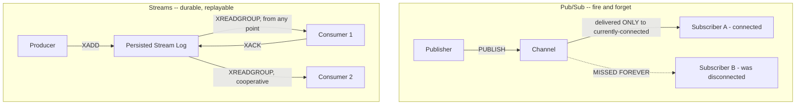

# Module 26 — Redis: Pub/Sub, Streams & High Availability

> Domain: Redis | Level: Beginner → Expert | Prerequisite: [[01-Data-Structures-Caching-Patterns]]

---

## 1. Fundamentals

### What is Redis Pub/Sub, and what is Redis Sentinel/Cluster HA?
**Pub/Sub** is Redis's simplest messaging primitive — publishers send messages to named channels; subscribers connected to those channels receive them in real time. **Sentinel** is Redis's dedicated high-availability system for a **non-clustered** primary-replica deployment — monitoring node health, and orchestrating automatic failover (promoting a replica to primary) if the primary becomes unavailable, without requiring the full Cluster sharding model.

### Why does this matter?
Pub/Sub's simplicity comes with a critical, frequently-misunderstood limitation (§2.1) that makes it unsuitable for many use cases it superficially seems to fit; Sentinel/Cluster's failover mechanics directly determine what happens to in-flight operations and recently-written data during a Redis primary failure — understanding this precisely is essential for correctly reasoning about Redis's actual availability/durability guarantees under failure.

### When does this matter?
Any system using Redis Pub/Sub for anything beyond genuinely ephemeral, loss-tolerant real-time notifications; any production Redis deployment requiring HA (essentially all of them) — the depth matters for choosing between Pub/Sub, Streams, and a dedicated message broker correctly, and for understanding exactly what data-loss window Sentinel/Cluster failover carries.

### How does it work (30,000-ft view)?
```
SUBSCRIBE notifications:order-updates
PUBLISH notifications:order-updates "order 123 shipped"
-- Any subscriber connected AT THE MOMENT of PUBLISH receives it; a subscriber
-- that connects even one millisecond later has PERMANENTLY missed this message.
```

---

## 2. Deep Dive

### 2.1 Pub/Sub's Fundamental Limitation — No Persistence, No Replay
Redis Pub/Sub messages are **fire-and-forget** — if no subscriber is connected to a channel at the exact moment of `PUBLISH`, the message is **gone forever**, with no persistence, no replay, no delivery guarantee whatsoever. This makes Pub/Sub fundamentally unsuitable for anything requiring reliable delivery (a subscriber that briefly disconnects/restarts loses every message published during that gap, permanently) — appropriate only for genuinely ephemeral, loss-tolerant use cases (a live "someone is typing" indicator, a cache-invalidation broadcast where a missed message just means a slightly-stale cache a subsequent TTL expiry will eventually correct anyway) never for anything resembling a durable event/message queue.

### 2.2 Streams — Redis's Answer to Pub/Sub's Durability Gap
Redis **Streams** (`XADD`/`XREAD`/`XREADGROUP`) solve exactly this problem: a stream is an **append-only, persisted log** (subject to Redis's own persistence configuration, Module 25 §2.4) that new consumers can read from **any point**, including from before they connected — directly analogous to Kafka's append-log model (a much later dedicated module) at a smaller, single-process scale. **Consumer groups** (`XREADGROUP`) let multiple consumers cooperatively process a stream's messages with **at-least-once delivery** — each message is delivered to exactly one consumer within the group, tracked as "pending" until explicitly acknowledged (`XACK`), with `XPENDING`/`XCLAIM` allowing detection and reassignment of messages a crashed consumer never acknowledged.

### 2.3 Sentinel — Automatic Failover for Non-Clustered Deployments
Sentinel instances (typically run as a separate quorum of 3+ processes, distinct from the Redis data instances themselves) continuously monitor the primary and replicas' health via periodic pings — upon detecting the primary is unreachable (confirmed by a **quorum** of Sentinels, avoiding a single Sentinel's own network partition from triggering an unnecessary failover), they elect a new primary from among the healthy replicas and reconfigure the remaining replicas to follow it, updating clients (via Sentinel's own client-facing address-discovery protocol) about the new topology. This failover is **not instantaneous** — it takes seconds (configurable detection/failover timeouts), during which writes to the (soon-to-be-former) primary may fail or, worse, succeed but never replicate before the failover completes (directly Module 24 §4's write-concern data-loss scenario, now in a Redis-specific context).

### 2.4 Cluster's Built-in Failover vs Sentinel
Redis Cluster (Module 25 §2.5) has its **own** built-in failover mechanism (each shard's replicas can be promoted automatically if that shard's primary fails) — Sentinel and Cluster are **two different HA mechanisms for two different deployment topologies**, not interchangeable or stackable: Sentinel manages a single (or a few) primary-replica set without sharding; Cluster manages many sharded primary-replica sets with its own internal failover logic, making a separate Sentinel deployment both unnecessary and inapplicable once Cluster mode is in use.

### 2.5 Replication Lag and the Same Async-Replication Trade-off, Again
Redis's primary-to-replica replication is **asynchronous by default** (a write is acknowledged to the client once the primary applies it, before any replica confirms) — the exact same trade-off already covered for PostgreSQL (Module 22 §2.3), SQL Server, and MongoDB (Module 24 §2.1): a primary crash before a write replicates to any replica loses that write on failover. Redis's `WAIT` command (`WAIT numreplicas timeout`) provides an explicit, per-operation mechanism to require acknowledgment from N replicas before considering a write durable — Redis's closest analog to MongoDB's `w: "majority"` write concern, opt-in rather than default, for exactly the same reason (throughput/latency by default, explicit durability escalation when needed).

## 3. Visual Architecture


## 4. Production Example
**Scenario**: A real-time notification service used Redis Pub/Sub to broadcast "order status changed" events to a downstream analytics consumer — during a routine deployment of the analytics service (a brief restart, a few seconds of downtime), every order-status-change event published during that restart window was **permanently lost**, since Pub/Sub delivers only to currently-connected subscribers; the analytics dashboard subsequently showed gaps/inconsistencies in order-status transition counts that took significant investigation to trace back to this specific deployment window, since nothing logged an error anywhere (Pub/Sub doesn't fail loudly — it simply doesn't deliver to a disconnected subscriber, silently). **Investigation**: correlating the analytics discrepancy's timing precisely with the deployment's restart window confirmed the root cause. **Fix**: migrated the notification mechanism from Pub/Sub to Streams (`XADD`/`XREADGROUP`) — the analytics consumer now resumes from its last-acknowledged position after any restart, with zero message loss regardless of downtime duration (bounded only by the stream's own retention/trimming configuration). **Lesson**: Pub/Sub's fire-and-forget semantics make it fundamentally unsuitable for any consumer that isn't guaranteed to be continuously connected — "we'll just use Pub/Sub, it's simpler" is a reasonable choice only for genuinely loss-tolerant notifications, and any consumer with a realistic restart/deployment lifecycle (essentially every production service) needs Streams' durability instead.

## 5. Best Practices
- Use Streams (not Pub/Sub) for any messaging use case where a consumer's temporary disconnection must not cause permanent message loss.
- Reserve Pub/Sub genuinely for loss-tolerant, ephemeral real-time notifications where a missed message has no lasting consequence.
- Use `WAIT` explicitly for any write requiring stronger-than-default durability against primary failover, exactly as MongoDB's `w: "majority"` (Module 24) is used deliberately, not by default.
- Choose Sentinel or Cluster based on deployment topology (single primary-replica set vs. sharded), never attempt to combine them.

## 6. Anti-patterns
- Using Pub/Sub for any message a consumer's restart/deployment cycle could cause to be silently lost (§4's incident).
- Assuming Redis's default asynchronous replication provides the same durability as an explicit `WAIT`-confirmed write.
- Running both Sentinel and Cluster simultaneously, or misunderstanding which HA mechanism applies to a given deployment's actual topology.
- Ignoring consumer-group `XPENDING` monitoring, allowing crashed-consumer messages to remain unacknowledged and unprocessed indefinitely.

---

## 10. Interview Questions

### Basic (10)
1. **Q: What is Redis Pub/Sub?** **A:** A messaging primitive where publishers send messages to channels and currently-connected subscribers receive them in real time.
2. **Q: Does Redis Pub/Sub persist messages for a disconnected subscriber?** **A:** No — a message is permanently lost for any subscriber not connected at the exact moment of publish.
3. **Q: What is a Redis Stream?** **A:** An append-only, persisted log that consumers can read from any point, including before they connected.
4. **Q: What does `XACK` do?** **A:** Acknowledges that a consumer group member has successfully processed a specific stream message.
5. **Q: What is Redis Sentinel?** **A:** A dedicated high-availability system monitoring a non-clustered primary-replica deployment and orchestrating automatic failover.
6. **Q: Is Redis's default replication synchronous or asynchronous?** **A:** Asynchronous — a write is acknowledged before any replica confirms receipt.
7. **Q: What does the `WAIT` command do?** **A:** Blocks until a specified number of replicas acknowledge receipt of prior writes, providing stronger durability than the default.
8. **Q: Can Sentinel and Cluster be used together?** **A:** No — they're separate HA mechanisms for different deployment topologies (non-sharded vs. sharded).
9. **Q: What does `XPENDING` show?** **A:** Messages delivered to a consumer group member but not yet acknowledged.
10. **Q: Why might Sentinel-based failover not be instantaneous?** **A:** It requires a quorum of Sentinels to confirm the primary is genuinely unreachable before triggering failover, taking a configurable detection/timeout period.

### Intermediate (10)
1. **Q: Why is Pub/Sub fundamentally unsuitable for a consumer with a normal restart/deployment lifecycle?** **A:** Any message published during the consumer's disconnected window (even a brief deployment restart) is permanently lost with no replay mechanism — essentially every production consumer has some restart lifecycle, making this a near-universal disqualifying limitation for reliable messaging use cases.
2. **Q: How do Streams' consumer groups provide at-least-once delivery specifically?** **A:** Each message delivered to a consumer group member remains in a "pending" state until explicitly acknowledged (`XACK`) — if the consumer crashes before acknowledging, `XPENDING`/`XCLAIM` let another consumer detect and reprocess that unacknowledged message, ensuring it's eventually processed at least once.
3. **Q: Why does Sentinel require a quorum of monitoring instances rather than a single monitor?** **A:** A single Sentinel experiencing its own network partition (unable to reach the primary) could incorrectly conclude the primary is down when it's actually fine, triggering an unnecessary failover — requiring a quorum of independently-positioned Sentinels to agree prevents one Sentinel's own connectivity issue from causing a false-positive failover.
4. **Q: Why is `WAIT` not the default behavior for every Redis write?** **A:** It adds latency (waiting for replica acknowledgment) to every write — reserved as an opt-in, per-operation choice for writes whose durability requirement genuinely justifies that cost, exactly the same default-fast/opt-in-durable pattern as MongoDB's write concern (Module 24).
5. **Q: Why must a Stream be trimmed (`XTRIM`/`MAXLEN`), unlike Pub/Sub which has no persisted state to manage?** **A:** A Stream is a persisted, append-only log — without trimming, it grows unboundedly, consuming increasing memory/disk over time; Pub/Sub has no such concern since it never persists anything in the first place.
6. **Q: Why would a team choose Cluster's built-in failover over a separate Sentinel deployment for a sharded workload?** **A:** Cluster mode already includes its own failover logic tailored to its sharded topology — Sentinel is designed for non-sharded primary-replica deployments and doesn't apply to (or coexist meaningfully with) Cluster's own shard-level replica-promotion mechanism.
7. **Q: What's a realistic scenario where Redis Pub/Sub's limitations are actually acceptable, not a design flaw?** **A:** A live "user is typing" indicator in a chat application — if a message is missed due to a brief subscriber disconnection, the consequence is trivial (the indicator briefly doesn't show, self-correcting on the next keystroke event), making Pub/Sub's fire-and-forget simplicity an entirely appropriate, deliberate choice rather than a limitation to work around.
8. **Q: Why might `XCLAIM` be needed even with consumer groups' at-least-once guarantee already in place?** **A:** At-least-once delivery guarantees a message *will* eventually be processed, but doesn't automatically reassign a crashed consumer's pending, unacknowledged messages to another consumer on its own — `XCLAIM` is the explicit mechanism another consumer uses to take ownership of messages that have been pending too long, completing the recovery the at-least-once guarantee promises but doesn't automate by itself.
9. **Q: Why does Redis's asynchronous-by-default replication mirror the exact same trade-off already covered for PostgreSQL, MongoDB, and SQL Server across this course?** **A:** It's the same fundamental availability-vs-durability spectrum every replicated system faces — acknowledging a write before it's replicated is faster but risks loss on failover; waiting for replication is safer but slower — Redis's `WAIT` command is simply this course's recurring trade-off expressed as yet another engine-specific, per-operation knob.
10. **Q: Why should Sentinel's own communication be secured with the same rigor as the Redis data instances it monitors?** **A:** Sentinel has privileged visibility into cluster topology and participates in triggering failover — an attacker able to interfere with unsecured Sentinel communication could potentially manipulate failover behavior or gain reconnaissance about the deployment's topology, a real attack surface distinct from but adjacent to the Redis data instances' own security.

### Advanced (10)
1. **Q: Diagnose the Pub/Sub message-loss incident (§4) from first principles, and design the migration strategy to Streams without downtime.**
   **A:** Root cause: Pub/Sub's fundamental lack of persistence/replay combined with a consumer that has a normal (if infrequent) restart lifecycle. Migration strategy: dual-publish to both the existing Pub/Sub channel and a new Stream during a transition period (directly this course's recurring "expand, don't break" incremental-migration pattern, Module 6 §Advanced Q9/Module 23 §Advanced Q6); migrate the consumer to read from the Stream via `XREADGROUP` once validated; only remove the Pub/Sub publish path once the Stream-based consumer has been running reliably, confirming zero regression in event delivery.
2. **Q: Design a monitoring strategy specifically for consumer-group health, catching a stalled/crashed consumer before its unacknowledged backlog becomes a problem.**
   **A:** Track `XPENDING` count and the age of the oldest pending entry per consumer group as standing metrics — a growing pending count or an old, un-aging-out pending entry indicates a consumer that's stopped acknowledging (crashed, stuck, or simply slow) without necessarily having disconnected entirely (which would be separately visible); alert on pending-entry age exceeding a threshold appropriate to the expected processing latency, triggering investigation or automated `XCLAIM`-based reassignment to a healthy consumer before the backlog grows unbounded.
3. **Q: Explain precisely why a Sentinel-orchestrated failover, even once complete, might still result in the exact same write-loss scenario as Module 24 §4's MongoDB incident, and how `WAIT` addresses it.**
   **A:** Sentinel's failover promotes a replica based on **whatever data it already has** — any write acknowledged by the old primary but not yet asynchronously replicated to that promoted replica is lost, precisely the same mechanism as MongoDB's default `w: 1` failover data-loss window (Module 24 §4); `WAIT numreplicas timeout` closes this gap for any specific write by requiring replica acknowledgment before returning success to the client, exactly mirroring MongoDB's `w: "majority"` fix for the identical underlying problem, just expressed via Redis's own command rather than a connection/operation-level setting.
4. **Q: Design a hybrid architecture using both Pub/Sub and Streams for a real-time dashboard requiring both instant live updates and guaranteed historical completeness.**
   **A:** Publish every event to **both** a Pub/Sub channel (for currently-connected dashboard clients wanting instant, low-latency updates with no replay need, since a dashboard actively being viewed doesn't need historical replay for events it was live for) and a Stream (as the durable, replayable system of record for anything needing guaranteed completeness — a newly-opened dashboard tab backfilling recent history, or a downstream analytics consumer that must never miss an event); this deliberately uses each mechanism for what it's actually good at, rather than forcing one mechanism to serve both needs.
5. **Q: How would you decide between Redis Streams and a dedicated message broker (Kafka/RabbitMQ, later modules) for a new event-driven feature?**
   **A:** Redis Streams are appropriate for moderate-scale, single-Redis-cluster-scoped messaging needs where the team already operates Redis and wants to avoid introducing an entirely separate broker's operational complexity; a dedicated broker becomes the better choice once requirements include: multi-datacenter/cross-region replication of the message log itself, very high sustained throughput beyond a single Redis deployment's practical ceiling, sophisticated routing/exchange patterns (RabbitMQ's exchange types), or a mature ecosystem of connectors/tooling (Kafka Connect) — the decision hinges on whether Streams' simpler, Redis-native feature set genuinely covers the requirement, or whether a dedicated broker's more extensive feature set is actually needed, not a default "always use a dedicated broker for messaging" assumption.
6. **Q: Explain why forgetting to trim a Stream can eventually cause a production incident distinct from, but structurally similar to, MongoDB's unbounded oplog/PostgreSQL's orphaned-replication-slot risk (Module 22 §2.5).**
   **A:** An untrimmed Stream grows without bound as new entries accumulate indefinitely — eventually consuming enough memory to threaten the Redis instance's overall stability (potentially triggering eviction of unrelated cache keys if sharing an instance, or an out-of-memory condition) — structurally the same "unbounded retention of historical data because nothing enforces a bound" failure shape as an orphaned PostgreSQL replication slot, just manifesting through a different specific mechanism (Stream growth vs. WAL retention).
7. **Q: Design a strategy for safely handling a "poison message" in a Streams-based consumer group — a message that repeatedly fails processing and gets reclaimed via `XCLAIM` indefinitely.**
   **A:** Track each message's delivery-attempt count (via `XPENDING`'s reported delivery count, or an application-maintained counter); after a configured maximum retry count, move the message to a dedicated "dead-letter" stream instead of continuing to reclaim/retry it indefinitely, and acknowledge (`XACK`) it on the original stream to stop it from remaining perpetually pending — directly the same dead-letter-queue pattern a dedicated message broker provides natively, implemented manually here since Redis Streams don't include this as a built-in feature.
8. **Q: Explain how you would reason about the correct number of Sentinel instances and their placement for a production deployment.**
   **A:** Deploy an **odd** number (typically 3 or 5) specifically to allow a clean majority-quorum determination without ties; distribute Sentinel instances across **different failure domains** (different availability zones/racks) than the Redis data instances themselves, so a single failure domain's outage doesn't simultaneously take down both a Redis node and enough Sentinels to prevent proper quorum-based failover detection — placement strategy matters as much as raw count for genuine resilience.
9. **Q: A team wants to use Redis Streams as a full replacement for their existing Kafka-based event pipeline "to simplify the stack." Evaluate this as a Principal Engineer.**
   **A:** Evaluate against the team's actual scale/requirements, not against Streams' theoretical adequacy alone — if the existing Kafka pipeline relies on features Streams doesn't natively provide equivalently (long-term, cross-region log retention as a system of record; sophisticated consumer-offset management across many independent consumer applications; a mature connector ecosystem for downstream integrations), a full replacement risks losing real capability for a "simpler stack" that isn't actually simpler once those gaps must be manually reimplemented (as in Advanced Q7's dead-letter-queue example); recommend a narrow, specific pilot on a bounded, lower-stakes use case first, rather than a wholesale migration based on architectural simplicity alone without validating the capability gaps don't matter for this specific pipeline's actual requirements.
10. **Q: As a Principal Engineer, how would you build organizational guidance helping teams choose correctly among Pub/Sub, Streams, and a dedicated broker without requiring deep Redis internals knowledge from every engineer?**
    **A:** Publish a simple decision tree (this course's recurring governance-template pattern): "Is losing a message during a brief consumer disconnect acceptable? → Yes: Pub/Sub. No: does the messaging need stay within a single Redis deployment's scale/scope, with modest throughput and simple routing needs? → Yes: Streams. No (need cross-region, very high throughput, or a rich connector ecosystem): a dedicated broker (later module)." — reducing a genuinely nuanced trade-off (this entire module's content) into a fast, reliable, non-expert-usable decision path for the common cases, with an escalation path to deeper consultation for genuinely novel scenarios the tree doesn't clearly resolve.

---

## 11. Coding Exercises

### Easy — Basic Stream produce/consume with acknowledgment
```
XADD orders:events * orderId 123 status "shipped"
XREADGROUP GROUP analytics-group consumer-1 COUNT 10 STREAMS orders:events >
-- process the message --
XACK orders:events analytics-group <message-id>
```

### Medium — Migrate from Pub/Sub to Streams with a dual-write transition (Advanced Q1)
```csharp
public async Task PublishOrderEventAsync(OrderEvent evt)
{
    // Transition period: write to BOTH mechanisms.
    await _redis.PublishAsync("orders:pubsub", Serialize(evt));           // legacy consumers, unchanged
    await _redis.StreamAddAsync("orders:stream", new[] {
        new NameValueEntry("payload", Serialize(evt))
    });                                                                     // new, durable path
}
// Once the Stream-based consumer is validated and reliable, remove the PublishAsync call entirely.
```

### Hard — Consumer-group backlog monitoring with dead-letter handling (Advanced Q7)
```csharp
public async Task ProcessPendingWithDeadLetterAsync(string stream, string group, string consumer, int maxRetries)
{
    var pending = await _redis.StreamPendingMessagesAsync(stream, group, 100, consumer);

    foreach (var entry in pending)
    {
        if (entry.DeliveryCount > maxRetries)
        {
            var messages = await _redis.StreamRangeAsync(stream, entry.MessageId, entry.MessageId);
            await _redis.StreamAddAsync($"{stream}:deadletter", messages[0].Values);
            await _redis.StreamAcknowledgeAsync(stream, group, entry.MessageId); // stop it from being reclaimed forever
        }
        else
        {
            var claimed = await _redis.StreamClaimAsync(stream, group, consumer, minIdleTimeInMs: 30000, messageIds: new[] { entry.MessageId });
            foreach (var msg in claimed) await ProcessMessageAsync(msg); // retry
        }
    }
}
```

### Expert — Sentinel-aware client with `WAIT`-enforced durable writes for critical operations
```csharp
public async Task<bool> WriteCriticalDataAsync(string key, string value)
{
    var db = await _sentinelConnection.GetDatabaseAsync(); // resolves current primary via Sentinel
    await db.StringSetAsync(key, value);

    var replicaAckCount = await db.ExecuteAsync("WAIT", "1", "1000"); // wait for 1 replica, up to 1s
    if ((long)replicaAckCount < 1)
    {
        // Durability NOT confirmed within the timeout -- caller must decide: retry, alert, or accept the risk explicitly.
        _logger.LogWarning("WAIT did not confirm replication for key {Key} within timeout.", key);
        return false;
    }
    return true;
}
```
**Discussion**: This directly implements Advanced Q3's fix — `WAIT` closes the exact same failover data-loss window Module 24 §4's MongoDB incident demonstrated, here made explicit and deliberate for a specific "critical" write path rather than left to Redis's default asynchronous-replication behavior.

---

## 12–17. System Design / LLD / Debugging / Decision / Case Study / Principal

A real-time notification platform (§4) migrates from Pub/Sub to Streams for any consumer with a normal restart lifecycle, using the dual-write transition pattern (Medium exercise) for zero-downtime migration, with consumer-group backlog monitoring (Advanced Q2/Hard exercise) and dead-letter handling for poison messages. The signature production incident (§4) — silent, undetected message loss during a routine consumer deployment restart — is this module's central lesson: Pub/Sub's fire-and-forget semantics make it fundamentally unsuitable for any consumer with a realistic operational lifecycle, and the failure mode is especially dangerous because it produces no error, only a silent gap discovered later through unrelated data-consistency investigation. Principal-level guidance: publish a simple Pub/Sub-vs-Streams-vs-dedicated-broker decision tree (Advanced Q10) so this nuanced trade-off doesn't require re-deriving from first principles by every team choosing a Redis messaging pattern.

## 18. Revision
**Key takeaways**: Pub/Sub is fire-and-forget with zero persistence — a disconnected subscriber permanently misses messages, with no error surfaced anywhere; reserve it for genuinely loss-tolerant, ephemeral notifications. Streams provide a durable, replayable, consumer-group-based alternative with at-least-once delivery via explicit acknowledgment (`XACK`), requiring backlog (`XPENDING`) monitoring and trimming (`XTRIM`) as ongoing operational responsibilities. Redis's default asynchronous replication carries the same failover data-loss window as every other replicated system covered in this course (PostgreSQL, MongoDB, SQL Server) — `WAIT` is Redis's explicit, opt-in durability escalation, exactly mirroring MongoDB's write concern. Sentinel (non-sharded HA) and Cluster (sharded, built-in failover) are separate mechanisms for separate topologies, never combined.

---

**Next**: This completes the `07-Redis` domain (Modules 25–26). Continuing autonomously to `08-DynamoDB`.
