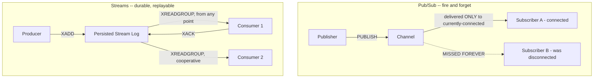
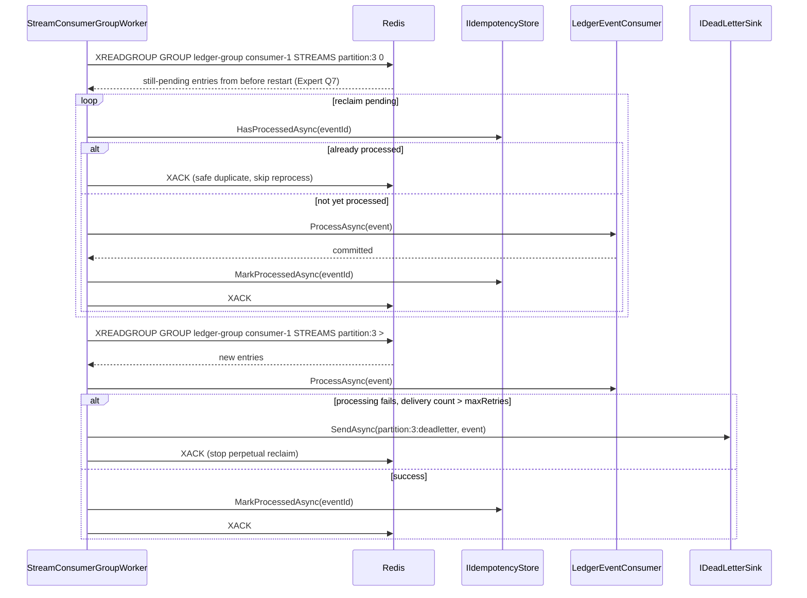

# Module 26 — Redis: Pub/Sub, Streams & High Availability

> Domain: Redis | Level: Beginner → Expert | Prerequisite: [[01-Data-Structures-Caching-Patterns]]

---

## 1. Topic Description

### Definition

Redis offers two fundamentally different messaging primitives and one availability story. **Pub/Sub** is fire-and-forget fan-out: a message is delivered to whoever is subscribed at that instant and is then gone — no persistence, no acknowledgement, no replay. **Streams** are an append-only log with consumer groups, explicit acknowledgement, a pending-entries list for in-flight messages and the ability to replay from any position — semantically much closer to Kafka than to Pub/Sub. **High availability** is provided either by Sentinel (monitoring plus automated failover for a primary/replica pair) or by Redis Cluster (hash-slot sharding with per-shard replicas and its own failover), both of which are asynchronous replication and therefore have a non-zero data-loss window.

### Core sub-concepts

- **Pub/Sub semantics** — at-most-once delivery, no persistence, no consumer state, pattern subscriptions, and sharded Pub/Sub in cluster mode.
- **Pub/Sub failure modes** — messages lost while a subscriber is disconnected; slow subscribers and client output buffer limits causing disconnection.
- **Keyspace notifications** — events on key changes, their best-effort delivery, and why they are unsuitable as a reliable trigger.
- **Streams (`XADD`, `XREAD`)** — append-only entries with monotonic IDs, capped versus uncapped, `MAXLEN`/`MINID` trimming (exact and approximate).
- **Consumer groups** — `XGROUP`, `XREADGROUP`, per-consumer assignment, `XACK`, and at-least-once delivery.
- **The Pending Entries List** — delivered-but-unacknowledged messages, `XPENDING`, `XCLAIM` and `XAUTOCLAIM` for recovering from a dead consumer.
- **Stream retention and memory** — a stream is in memory, so trimming policy *is* your retention policy and an untrimmed stream is an out-of-memory event.
- **Replication** — asynchronous by default, `WAIT` for partial synchronous acknowledgement, replication backlog and partial resynchronisation.
- **Sentinel** — quorum-based monitoring, failover, client discovery, and the configuration mistakes that produce split-brain.
- **Redis Cluster** — 16,384 hash slots, hash tags for colocation, `MOVED`/`ASK` redirection, resharding, and cluster-wide failure conditions.
- **Failure and data loss** — asynchronous replication meaning acknowledged writes can be lost on failover; `min-replicas-to-write` as a partial guard.
- **Client behaviour during failover** — topology discovery, reconnection, retry, and idempotency requirements.
- **Persistence interaction** — RDB/AOF and what a restart or a full resync costs on a large dataset.
- **Choosing Redis Streams versus a real broker** — durability, retention, ordering and operational maturity trade-offs against Kafka or a managed queue.

### Where it fits

This subtopic covers Redis's role beyond the cache: as a lightweight message transport, a work queue, and a highly-available service that other systems depend on. It builds directly on the single-threaded execution and memory model from `01-Data-Structures-Caching-Patterns` — streams live in the same memory budget as everything else, and a blocking command on a stream stalls the same single thread. Upward, it is the boundary at which Redis stops being an optimisation and becomes part of the messaging architecture, at which point it must be evaluated against the durability and delivery guarantees a real broker provides.

### Why it matters at scale

The dominant failure is a semantic one: teams choose Pub/Sub for something that requires delivery. Because Pub/Sub has no persistence and no acknowledgement, a subscriber that restarts, deploys, or is briefly slow simply misses messages — permanently and silently, with no error anywhere. That is a correctness bug that testing never surfaces because tests do not restart subscribers mid-flow. The second failure is memory: a stream with no trimming grows until the instance hits `maxmemory`, at which point either writes fail or the eviction policy starts discarding data, so retention that was never configured becomes an outage. And on availability, replication is asynchronous, so a failover discards writes the replica had not yet received — a service that believes Sentinel gives it durability has an RPO nobody measured.

### Common pitfalls / anti-patterns

- **Using Pub/Sub where delivery matters** — a disconnected or restarting subscriber loses every message published in the interim, with no error and no replay; Streams with consumer groups is the correct primitive.
- **Never trimming a stream** — an unbounded stream consumes memory until `maxmemory`, converting a messaging design into an out-of-memory incident; `MAXLEN ~` trimming must be part of the write path.
- **Ignoring the Pending Entries List** — messages delivered to a consumer that then died stay pending forever unless something claims them, so work silently stops being processed while the stream looks healthy.
- **Assuming failover is lossless** — replication is asynchronous, so writes acknowledged by the primary but not yet replicated are discarded on promotion; `WAIT` or `min-replicas-to-write` reduce but do not eliminate this.
- **An even Sentinel quorum, or Sentinels colocated with the nodes they monitor** — a partition can prevent a quorum forming, so no failover occurs, or it can produce two nodes believing they are primary.
- **Treating keyspace notifications as a reliable event source** — they are best-effort, not persisted, and are lost if no subscriber is listening; building a job scheduler on expiry events fails exactly when the system is under stress.
- **Multi-key operations in Redis Cluster without hash tags** — keys land in different slots, so transactions and Lua scripts fail; colocation must be designed into the key names up front.
- **A slow Pub/Sub subscriber** — the server buffers for it until the client output buffer limit is hit and then disconnects it, so the slowest consumer silently loses messages while everyone else is fine.
- **Using Streams as a durable event log** — it is in-memory with a trimming policy; it is not Kafka, and treating it as long-term retention will lose data.

---

## 2. Beginner (10 Q&A)

**Q1. What are the delivery semantics of Redis Pub/Sub?**
**A:** At-most-once, with no persistence whatsoever. A message is delivered to the clients subscribed at the moment it is published and then discarded — there is no storage, no acknowledgement, and no concept of a subscriber's position. So a subscriber that is disconnected, restarting, or deploying receives nothing for that window and has no way to know it missed anything. That makes Pub/Sub appropriate for genuinely disposable signals and inappropriate for anything a consumer must actually process.
*Follow-up: Give me a use case where Pub/Sub's semantics are genuinely correct.*

**Q2. How do Redis Streams differ from Pub/Sub?**
**A:** A stream is an append-only log: entries persist in memory with monotonic IDs, so consumers can read from any position, replay history, and — with consumer groups — acknowledge individual entries. That gives at-least-once delivery with explicit tracking of what each consumer has and has not processed, which is exactly what Pub/Sub lacks. The cost is that entries occupy memory until trimmed, so you have taken on a retention decision that Pub/Sub did not require.
*Follow-up: What happens to a stream's memory if you never trim it?*

**Q3. What is a consumer group and what problem does it solve?**
**A:** It lets several consumers share the work of one stream: each entry is delivered to exactly one consumer in the group, the group tracks the last-delivered ID, and each delivery must be acknowledged with `XACK`. That gives horizontal scaling of processing plus per-message tracking, which a plain `XREAD` does not — with `XREAD`, every reader independently sees every message. It is the mechanism that makes Streams a work queue rather than only a log.
*Follow-up: Two consumer groups on one stream — do they see the same messages?*

**Q4. What is the Pending Entries List and why does it matter?**
**A:** It records entries that have been delivered to a consumer in a group but not yet acknowledged — the in-flight set. It matters because if a consumer crashes after receiving a message and before acknowledging it, the entry stays pending indefinitely: it will not be redelivered automatically, and the stream continues to look healthy while that work is silently never done. Recovering it requires `XPENDING` to find stale entries and `XCLAIM`/`XAUTOCLAIM` to reassign them, which is code you must write.
*Follow-up: How would you decide the idle threshold before claiming another consumer's pending message?*

**Q5. How do you trim a stream, and what's the difference between exact and approximate trimming?**
**A:** `XADD` with `MAXLEN` or `MINID`, or a separate `XTRIM`. Exact trimming (`MAXLEN 1000`) guarantees the length but may need to remove entries across many internal nodes, which costs more. Approximate trimming (`MAXLEN ~ 1000`) removes whole internal nodes only, so the stream may be somewhat longer than requested but the operation is cheap and constant-ish. In production you almost always want approximate, because exact trimming on a high-throughput stream is a blocking cost on the single thread.
*Follow-up: You need a strict retention guarantee for compliance. Does approximate trimming satisfy that?*

**Q6. What does Sentinel actually do?**
**A:** It monitors a primary and its replicas, and when a quorum of Sentinels agrees the primary is unreachable, it promotes a replica and reconfigures the others — and it acts as a discovery service so clients learn the new primary's address. It is not a proxy; traffic does not flow through it. The essential detail is the quorum: enough independent Sentinels must agree, which is why they should be deployed in odd numbers across separate failure domains rather than alongside the Redis nodes themselves.
*Follow-up: You run three Sentinels on the same three machines as the Redis nodes. What's the risk?*

**Q7. What is Redis Cluster and what constraints does it impose?**
**A:** It shards the keyspace across 16,384 hash slots distributed over primary nodes, each with replicas and automatic failover, and clients are redirected to the node owning a key's slot. The constraints follow from sharding: multi-key operations, transactions and Lua scripts require all keys in the same slot, which you control with hash tags in key names. Clients must understand redirections and topology changes. So Cluster gives horizontal scale at the cost of design constraints that must be anticipated in key naming.
*Follow-up: What's a hash tag and how would you use one to keep a user's keys together?*

**Q8. Is Redis replication synchronous?**
**A:** No — it is asynchronous by default, so a primary acknowledges a write to the client before any replica has it. That means a failover can promote a replica that is missing recently-acknowledged writes, and those writes are lost. `WAIT` lets a client block until a number of replicas have acknowledged, giving partial synchronicity per operation, and `min-replicas-to-write` refuses writes when too few replicas are connected. Neither makes Redis strongly consistent, but both let you bound the exposure deliberately.
*Follow-up: What does `WAIT 1 100` actually guarantee, and what doesn't it?*

**Q9. What are keyspace notifications and where should you not use them?**
**A:** Events published via Pub/Sub when keys are modified or expire, useful for cache invalidation signalling and lightweight reactions. Because they are delivered over Pub/Sub they inherit its semantics entirely: no persistence, no acknowledgement, lost if nobody is listening. So they must not be the trigger for anything that must happen — a delayed-job scheduler built on expiry notifications loses jobs whenever the consumer restarts, which is exactly when you least expect it.
*Follow-up: How would you build a reliable delayed-job mechanism in Redis instead?*

**Q10. What happens to a slow Pub/Sub subscriber?**
**A:** The server buffers pending messages for it, and when that client's output buffer exceeds the configured limit, Redis disconnects the client to protect itself. From the subscriber's perspective it simply drops off and loses everything published while it was gone. This is a quiet failure mode: the publisher and the other subscribers are entirely unaffected, so nothing in the system reports a problem. It is one of the clearest reasons Pub/Sub cannot be used where delivery matters.
*Follow-up: How would you detect that a subscriber is being disconnected for this reason?*

---

## 3. Intermediate (10 Q&A)

**Q1. When would you choose Redis Streams over Kafka or a managed queue?**
**A:** When the volume and retention needs are modest, Redis is already in the architecture, and the operational simplicity of not adding a broker is worth more than durability guarantees — an internal work queue with minutes of retention is the sweet spot. Kafka wins on durable long retention, very high throughput, replay over days or weeks, and a mature ecosystem. The decisive question is what the retention requirement actually is, because Redis Streams live in memory: retention is bounded by RAM, so "we might need to replay last month" rules it out immediately. I would also weigh that adding a broker is a permanent operational commitment, so avoiding one has real value.
*Follow-up: The requirement starts at "one hour of retention" and grows. At what point do you migrate, and how?*

**Q2. Walk me through recovering work from a crashed stream consumer.**
**A:** Its in-flight entries sit in the Pending Entries List, so a surviving consumer must find entries idle beyond a threshold — `XPENDING` with an idle filter — and take ownership with `XCLAIM` or, more simply, `XAUTOCLAIM`. The threshold has to exceed the legitimate maximum processing time, or you will steal messages from a consumer that is merely slow and process them twice. Because delivery is at-least-once, handlers must be idempotent regardless. I would run the claim loop as a routine part of every consumer rather than as a recovery script somebody remembers to invoke.
*Follow-up: An entry has been claimed and failed five times. What should happen to it?*

**Q3. How do you size and configure a stream for a production workload?**
**A:** From the write rate, the entry size and the retention requirement, since those determine memory directly — and memory is shared with everything else in the instance, so the stream's budget must be explicit rather than incidental. I would set approximate `MAXLEN` trimming on every `XADD` so retention is enforced at write time rather than by a job that might not run, and monitor stream length and memory as first-class metrics. I would also decide what happens if consumers fall behind faster than trimming discards: either consumers lose entries they never read, or memory grows — and which of those is acceptable is a design decision, not a default.
*Follow-up: Consumers fall behind and trimming discards unread entries. How would you even know?*

**Q4. How should clients behave during a Sentinel failover?**
**A:** Discover the current primary through Sentinel rather than by configured address, handle the brief window with no primary by retrying with backoff, and treat in-flight writes as ambiguous — because replication is asynchronous, a write acknowledged before the failover may not have survived it. That means retries must be safe, which for Redis usually means using idempotent operations rather than blind re-execution. I would test this by triggering failovers deliberately in a pre-production environment, since the client library's behaviour during topology change is rarely what people assume.
*Follow-up: A write was acknowledged and then lost in a failover. How would the application ever detect that?*

**Q5. What are the operational differences between Sentinel and Cluster, and how do you choose?**
**A:** Sentinel gives HA for a dataset that fits on one node: simpler, no sharding constraints, all commands available. Cluster gives HA *and* horizontal scale but imposes the slot constraints on multi-key operations and requires cluster-aware clients. The choice should follow data size and write throughput: if one node can hold the working set comfortably with headroom, Sentinel is the simpler and better answer. I would resist Cluster as a default "for future scale", because the key-design constraints it imposes are permanent and the migration from Sentinel to Cluster is not especially hard when actually needed.
*Follow-up: You're on Sentinel and the dataset is approaching node capacity. What's the migration path?*

**Q6. How do you bound data loss on failover?**
**A:** Accept that you cannot eliminate it with asynchronous replication, then reduce it deliberately: `min-replicas-to-write` refuses writes when insufficient replicas are connected, which converts silent loss into visible unavailability; `WAIT` blocks a specific critical write until replicas acknowledge; and keeping replicas close reduces lag and therefore the window. Beyond that, the honest answer is architectural — data that genuinely cannot be lost should not have Redis as its only home. I would want the acceptable loss window stated explicitly per use case, since that is the number that determines which of these controls is warranted.
*Follow-up: `min-replicas-to-write` means writes fail when a replica is down. Is that better or worse than losing writes?*

**Q7. How do you handle a Redis Cluster resharding operation safely?**
**A:** Slots migrate while the cluster serves traffic, and during migration clients receive `ASK` redirections for keys in flight, which a cluster-aware client handles transparently — so the first requirement is that every client library actually does. Large keys are the hazard: a slot cannot be split, and a single enormous key makes its slot's migration slow and disruptive. I would identify and remediate big keys before resharding, run the migration during a low-traffic period, and monitor latency throughout since migration competes with normal work on the same single thread per node.
*Follow-up: One key is 5 GB and blocks the migration. What are your options?*

**Q8. What does a Redis restart cost on a large dataset, and how does that shape your HA design?**
**A:** Loading an RDB or replaying an AOF for a large dataset takes minutes, during which the node is unavailable — and if a replica needs a full resynchronisation rather than a partial one, the primary must fork and transfer the entire dataset, which is expensive for both. That is why the replication backlog size matters: a backlog large enough to cover typical disconnections turns a full resync into a partial one. The design implication is that recovery time, not just failover time, belongs in your RTO calculation, and it grows with dataset size.
*Follow-up: Your replica keeps doing full resyncs after brief network blips. What do you change?*

**Q9. How do you monitor a Redis messaging deployment meaningfully?**
**A:** For streams: length, consumer group lag (how far behind the last-delivered ID each group is), pending-entry count and age — the age of the oldest pending entry is the signal that a consumer has died and nobody noticed. For Pub/Sub: subscriber counts and client output buffer disconnections, since silent subscriber loss is the failure mode. For HA: replication lag, failover events, and `min-replicas` violations. I would alert on pending-entry age and consumer lag rather than on throughput, because throughput looks fine right up until the moment work has stopped being processed.
*Follow-up: Consumer lag is zero but the pending list is growing. What does that tell you?*

**Q10. How would you migrate from Pub/Sub to Streams in a live system?**
**A:** Dual-publish to both, stand up the stream consumer alongside the existing subscriber with its output going somewhere observable, and compare — that comparison is what proves the new path handles the cases the old one silently dropped. Then cut consumers over one at a time and remove the Pub/Sub publish last. The gains to verify explicitly are the ones that motivated the change: that a restarted consumer now resumes rather than losing messages, and that failures are visible as pending entries rather than as silence. I would also make sure trimming is configured before the stream carries real volume, since that becomes an availability issue rather than a correctness one.
*Follow-up: During dual-publishing, the stream consumer processes a message the Pub/Sub consumer also processed. How do you handle that?*

---

## 4. Expert / Architect (10 Q&A)

**Q1. How do you decide whether Redis is an acceptable messaging backbone for a system?**
**A:** By the durability and retention requirements, stated as numbers. Redis Streams are in-memory with a trimming policy and asynchronous replication, so the honest characterisation is "a fast queue with a bounded, memory-limited history and a non-zero loss window on failover". That is entirely adequate for internal work distribution, task queues and short-lived fan-out. It is not adequate where messages represent business events that must survive, must be replayable over days, or must be delivered exactly once with audit evidence. I would frame the decision as which of those two the use case is, and resist the middle position where Redis is used for durable events because it was already there.
*Follow-up: A team is using Streams for payment events because "it's already deployed". How do you handle that?*

**Q2. Design the HA topology for a Redis tier that several critical services depend on.**
**A:** Start from the blast radius and the recovery objectives. Separate instances by criticality so cache workloads cannot evict or stall operational data, replicas in distinct failure domains, Sentinels in odd numbers across independent hosts, and `maxmemory` set with headroom for the persistence fork. Then decide the loss tolerance explicitly and configure `min-replicas-to-write` accordingly, accepting that it trades availability for durability. Finally, exercise failover on a schedule and measure the client-visible impact, because the topology's correctness is entirely a function of how clients behave during the transition — which is the part that is never right first time.
*Follow-up: Failover works but clients take 40 seconds to recover. Where do you look?*

**Q3. What's the architectural risk of Redis becoming a shared dependency across many teams?**
**A:** It is single-threaded and memory-bound, so it shares failure in a way most datastores do not: one team's O(n) command stalls everyone, one team's unbounded stream exhausts memory for everyone, and one team's large keys make cluster operations painful for everyone. Unlike a relational database, where a bad query mostly punishes its author, Redis distributes the damage. The mitigations are instance separation by domain and criticality, a shared client library that forbids the dangerous commands and enforces namespacing, and per-namespace memory and key-count visibility so attribution is possible. Without attribution, these incidents become unresolvable disputes.
*Follow-up: How would you attribute memory usage to teams on a shared instance?*

**Q4. How do you handle exactly-once processing requirements on an at-least-once transport?**
**A:** You do not achieve exactly-once delivery; you achieve exactly-once *effect* by making consumers idempotent. That means a deterministic identity for each message and a durable record of what has been processed — often a Redis set or the target database's own uniqueness constraint — checked atomically with the effect. Where the effect is in another system, the idempotency key must be carried there, so the design has to span both. I would treat any requirement stated as "exactly-once delivery" as a requirement to be translated, because accepting it literally leads teams toward transactional designs that do not survive partial failure.
*Follow-up: The side effect is calling an external payment API. How do you make that idempotent?*

**Q5. How do you plan capacity for a Redis tier with mixed cache and stream workloads?**
**A:** Budget them separately even if they share hardware, because their growth characteristics are unrelated: cache size follows the working set and is bounded by eviction, while stream size follows write rate and retention and is bounded only by trimming. Mixing them under one `maxmemory` with an `allkeys-*` eviction policy means cache pressure evicts stream entries or vice versa, which is a correctness failure rather than a performance one. My strong preference is separate instances, and where that is not possible, `volatile-*` eviction with TTLs only on cache keys so operational data is protected. Capacity planning must also reserve headroom for the persistence fork.
*Follow-up: You must share one instance. What specifically do you configure?*

**Q6. How would you approach a multi-region Redis architecture?**
**A:** Regional instances with no cross-region replication for cache data, since it is reconstructible and cross-region replication buys latency and failure modes for little value. For state that must be globally visible, the honest options are routing those operations to a single region's primary, accepting cross-region latency, or partitioning the data so each region owns its own — the last being the design that actually scales. Cross-region Redis replication exists but is asynchronous with a substantial lag, so anything depending on it must tolerate that. I would make the per-data-class decision explicit, because a blanket "replicate Redis globally" hides several different requirements.
*Follow-up: Rate-limit counters need to be global across regions. How do you handle that?*

**Q7. How do you make the case to replace Redis Pub/Sub with a real broker, or to keep it?**
**A:** With evidence of the failure it causes: instrument subscriber disconnections and correlate them with deploys, and demonstrate the messages that were lost — that converts an architectural argument into a defect count. Keep Pub/Sub where the semantics genuinely fit, which is more often than purists allow: transient signals, cache invalidation hints, presence updates. Replace it where a missed message means a business outcome did not happen. The framing that works is to enumerate the specific messages, ask what happens if each is lost, and let that split the list — rather than debating the technology in the abstract.
*Follow-up: The team says "we've never seen a message lost". How do you respond?*

**Q8. What operational maturity would you require before depending on Redis for anything critical?**
**A:** Tested failover with a measured client-visible impact, restore from backup timed against an RTO, monitoring on memory headroom and eviction and slow log, `maxmemory` and eviction policy set deliberately rather than defaulted, big-key detection running routinely, and client timeouts short enough that a hung Redis cannot exhaust application threads. That last one is the most commonly missing and turns a Redis incident into a total service outage. I would also require that someone can state what happens to the service when Redis disappears — if nobody knows, the dependency is not understood well enough to be critical.
*Follow-up: Which of those would you implement first in an environment that has none of them?*

**Q9. How do you evaluate managed Redis offerings for a messaging and HA workload specifically?**
**A:** Beyond the usual managed-service questions, check the things this workload depends on: whether Streams and consumer groups are fully supported, what the measured failover time is and whether it is tested, whether you can configure `min-replicas-to-write` and persistence, how cluster resharding is performed and how disruptive it is, and whether cross-region replication is available and with what lag. Also check the memory pricing model, because streams make memory grow with retention and that becomes a visible, recurring cost. And confirm you can export data, since a messaging tier you cannot migrate off is a durable commitment.
*Follow-up: The service doesn't expose `min-replicas-to-write`. Does that rule it out?*

**Q10. What separates an excellent answer from an adequate one when someone designs a Redis-based queue?**
**A:** An adequate answer picks Streams and consumer groups. An excellent one states the delivery guarantee it is providing and requires consumers to be idempotent accordingly; configures trimming at write time and says what happens when consumers fall behind; handles the pending-entries recovery path as routine rather than exceptional; defines a dead-letter destination and a retry limit; names the data-loss window on failover and says whether that is acceptable for these messages; and says under what conditions this design should be replaced by a real broker. The distinguishing quality is designing for the failure paths — dead consumers, slow consumers, memory pressure, failover — rather than for the happy path, because those are the only parts that differ between a queue that works and one that quietly stops.
*Follow-up: Given that, what would make you tell a team their Redis queue has outgrown Redis?*

---

## 5. Reference Material

> Retained from the original module: deep-dive internals, diagrams, production examples, exercises, system/low-level design, debugging walkthroughs and the Principal Engineer perspective.

### 1. Fundamentals

#### What is Redis Pub/Sub, and what is Redis Sentinel/Cluster HA?
**Pub/Sub** is Redis's simplest messaging primitive — publishers send messages to named channels; subscribers connected to those channels receive them in real time. **Sentinel** is Redis's dedicated high-availability system for a **non-clustered** primary-replica deployment — monitoring node health, and orchestrating automatic failover (promoting a replica to primary) if the primary becomes unavailable, without requiring the full Cluster sharding model.

#### Why does this matter?
Pub/Sub's simplicity comes with a critical, frequently-misunderstood limitation that makes it unsuitable for many use cases it superficially seems to fit; Sentinel/Cluster's failover mechanics directly determine what happens to in-flight operations and recently-written data during a Redis primary failure — understanding this precisely is essential for correctly reasoning about Redis's actual availability/durability guarantees under failure.

#### When does this matter?
Any system using Redis Pub/Sub for anything beyond genuinely ephemeral, loss-tolerant real-time notifications; any production Redis deployment requiring HA (essentially all of them) — the depth matters for choosing between Pub/Sub, Streams, and a dedicated message broker correctly, and for understanding exactly what data-loss window Sentinel/Cluster failover carries.

#### How does it work (30,000-ft view)?
```
SUBSCRIBE notifications:order-updates
PUBLISH notifications:order-updates "order 123 shipped"
-- Any subscriber connected AT THE MOMENT of PUBLISH receives it; a subscriber
-- that connects even one millisecond later has PERMANENTLY missed this message.
```

### 2. Deep Dive

#### 2.1 Pub/Sub's Fundamental Limitation — No Persistence, No Replay
Redis Pub/Sub messages are **fire-and-forget** — if no subscriber is connected to a channel at the exact moment of `PUBLISH`, the message is **gone forever**, with no persistence, no replay, no delivery guarantee whatsoever. This makes Pub/Sub fundamentally unsuitable for anything requiring reliable delivery (a subscriber that briefly disconnects/restarts loses every message published during that gap, permanently) — appropriate only for genuinely ephemeral, loss-tolerant use cases (a live "someone is typing" indicator, a cache-invalidation broadcast where a missed message just means a slightly-stale cache a subsequent TTL expiry will eventually correct anyway) never for anything resembling a durable event/message queue.

#### 2.2 Streams — Redis's Answer to Pub/Sub's Durability Gap
Redis **Streams** (`XADD`/`XREAD`/`XREADGROUP`) solve exactly this problem: a stream is an **append-only, persisted log** (subject to Redis's own persistence configuration) that new consumers can read from **any point**, including from before they connected — directly analogous to Kafka's append-log model (a much later dedicated module) at a smaller, single-process scale. **Consumer groups** (`XREADGROUP`) let multiple consumers cooperatively process a stream's messages with **at-least-once delivery** — each message is delivered to exactly one consumer within the group, tracked as "pending" until explicitly acknowledged (`XACK`), with `XPENDING`/`XCLAIM` allowing detection and reassignment of messages a crashed consumer never acknowledged.

#### 2.3 Sentinel — Automatic Failover for Non-Clustered Deployments
Sentinel instances (typically run as a separate quorum of 3+ processes, distinct from the Redis data instances themselves) continuously monitor the primary and replicas' health via periodic pings — upon detecting the primary is unreachable (confirmed by a **quorum** of Sentinels, avoiding a single Sentinel's own network partition from triggering an unnecessary failover), they elect a new primary from among the healthy replicas and reconfigure the remaining replicas to follow it, updating clients (via Sentinel's own client-facing address-discovery protocol) about the new topology. This failover is **not instantaneous** — it takes seconds (configurable detection/failover timeouts), during which writes to the (soon-to-be-former) primary may fail or, worse, succeed but never replicate before the failover completes (directly the write-concern data-loss scenario, now in a Redis-specific context).

#### 2.4 Cluster's Built-in Failover vs Sentinel
Redis Cluster has its **own** built-in failover mechanism (each shard's replicas can be promoted automatically if that shard's primary fails) — Sentinel and Cluster are **two different HA mechanisms for two different deployment topologies**, not interchangeable or stackable: Sentinel manages a single (or a few) primary-replica set without sharding; Cluster manages many sharded primary-replica sets with its own internal failover logic, making a separate Sentinel deployment both unnecessary and inapplicable once Cluster mode is in use.

#### 2.5 Replication Lag and the Same Async-Replication Trade-off, Again
Redis's primary-to-replica replication is **asynchronous by default** (a write is acknowledged to the client once the primary applies it, before any replica confirms) — the exact same trade-off already covered for PostgreSQL, SQL Server, and MongoDB: a primary crash before a write replicates to any replica loses that write on failover. Redis's `WAIT` command (`WAIT numreplicas timeout`) provides an explicit, per-operation mechanism to require acknowledgment from N replicas before considering a write durable — Redis's closest analog to MongoDB's `w: "majority"` write concern, opt-in rather than default, for exactly the same reason (throughput/latency by default, explicit durability escalation when needed).

### 3. Visual Architecture

```mermaid
graph TB
 subgraph "Pub/Sub -- fire and forget"
 Pub[Publisher] -->|PUBLISH| Ch[Channel]
 Ch -->|delivered ONLY to currently-connected| Sub1[Subscriber A - connected]
 Ch -.->|MISSED FOREVER| Sub2[Subscriber B - was disconnected]
 end
 subgraph "Streams -- durable, replayable"
 P2[Producer] -->|XADD| Stream[Persisted Stream Log]
 Stream -->|XREADGROUP, from any point| C1[Consumer 1]
 Stream -->|XREADGROUP, cooperative| C2[Consumer 2]
 C1 -->|XACK| Stream
 end
```

### 4. Production Example
**Scenario**: A real-time notification service used Redis Pub/Sub to broadcast "order status changed" events to a downstream analytics consumer — during a routine deployment of the analytics service (a brief restart, a few seconds of downtime), every order-status-change event published during that restart window was **permanently lost**, since Pub/Sub delivers only to currently-connected subscribers; the analytics dashboard subsequently showed gaps/inconsistencies in order-status transition counts that took significant investigation to trace back to this specific deployment window, since nothing logged an error anywhere (Pub/Sub doesn't fail loudly — it simply doesn't deliver to a disconnected subscriber, silently). **Investigation**: correlating the analytics discrepancy's timing precisely with the deployment's restart window confirmed the root cause. **Fix**: migrated the notification mechanism from Pub/Sub to Streams (`XADD`/`XREADGROUP`) — the analytics consumer now resumes from its last-acknowledged position after any restart, with zero message loss regardless of downtime duration (bounded only by the stream's own retention/trimming configuration). **Lesson**: Pub/Sub's fire-and-forget semantics make it fundamentally unsuitable for any consumer that isn't guaranteed to be continuously connected — "we'll just use Pub/Sub, it's simpler" is a reasonable choice only for genuinely loss-tolerant notifications, and any consumer with a realistic restart/deployment lifecycle (essentially every production service) needs Streams' durability instead.

### 11. Coding Exercises

#### Easy — Basic Stream produce/consume with acknowledgment
```
XADD orders:events * orderId 123 status "shipped"
XREADGROUP GROUP analytics-group consumer-1 COUNT 10 STREAMS orders:events >
-- process the message --
XACK orders:events analytics-group <message-id>
```

#### Medium — Migrate from Pub/Sub to Streams with a dual-write transition (Advanced Q1)
```csharp
public async Task PublishOrderEventAsync(OrderEvent evt)
{
    // Transition period: write to BOTH mechanisms.
    await _redis.PublishAsync("orders:pubsub", Serialize(evt)); // legacy consumers, unchanged
    await _redis.StreamAddAsync("orders:stream", new[] {
            new NameValueEntry("payload", Serialize(evt))
    }); // new, durable path
}
// Once the Stream-based consumer is validated and reliable, remove the PublishAsync call entirely.
```

#### Hard — Consumer-group backlog monitoring with dead-letter handling (Advanced Q7)
```csharp
public async Task ProcessPendingWithDeadLetterAsync(string stream, string group, string consumer, int maxRetries)
{
    var pending = await _redis.StreamPendingMessagesAsync(stream, group, 100, consumer);

    foreach (var entry in pending)
    {
        if (entry.DeliveryCount > maxRetries)
        {
            var messages = await _redis.StreamRangeAsync(stream, entry.MessageId, entry.MessageId);
            await _redis.StreamAddAsync($"{stream}:deadletter", messages[0].Values);
            await _redis.StreamAcknowledgeAsync(stream, group, entry.MessageId); // stop it from being reclaimed forever
        }
        else
        {
            var claimed = await _redis.StreamClaimAsync(stream, group, consumer, minIdleTimeInMs: 30000, messageIds: new[] { entry.MessageId });
            foreach (var msg in claimed) await ProcessMessageAsync(msg); // retry
        }
    }
}
```

#### Expert — Sentinel-aware client with `WAIT`-enforced durable writes for critical operations
```csharp
public async Task<bool> WriteCriticalDataAsync(string key, string value)
{
    var db = await _sentinelConnection.GetDatabaseAsync; // resolves current primary via Sentinel
    await db.StringSetAsync(key, value);

    var replicaAckCount = await db.ExecuteAsync("WAIT", "1", "1000"); // wait for 1 replica, up to 1s
    if ((long)replicaAckCount < 1)
    {
        // Durability NOT confirmed within the timeout -- caller must decide: retry, alert, or accept the risk explicitly.
        _logger.LogWarning("WAIT did not confirm replication for key {Key} within timeout.", key);
        return false;
    }
    return true;
}
```
**Discussion**: This directly implements Advanced Q3's fix — `WAIT` closes the exact same failover data-loss window the MongoDB incident demonstrated, here made explicit and deliberate for a specific "critical" write path rather than left to Redis's default asynchronous-replication behavior.

### 12. System Design

**Scenario:** Design the internal event-distribution layer for a payments platform's lifecycle pipeline — `authorized` → `settled` → `refunded`/`failed` events fanning out to a ledger-posting consumer, a customer-notification consumer, and an analytics consumer, at ~5,000 events/second peak, with a hard requirement that the ledger consumer never miss or double-post an event undetected.

**Requirements:**
- *Functional:* durable, replayable event delivery per account with strict per-account ordering; at-least-once delivery to each of the three independent consumer types; poison-message isolation so one malformed event doesn't block an entire consumer group; a live, low-latency broadcast path for the customer-notification consumer's WebSocket-facing fan-out.
- *Non-functional:* zero silent event loss on consumer restart/deployment; bounded consumer-group backlog under normal operation, with alerting on abnormal growth; HA surviving a primary failure within a bounded, monitored window; regulatory-grade retention for audit reconstruction, without bloating the operational transport layer.

**Architecture and components:** Redis Cluster running Sentinel-free (Cluster's own built-in per-shard failover, §2.4, chosen over a separate Sentinel deployment since sharding is required for throughput at this event volume anyway). Events are **partitioned by account** into N Streams (`payments:events:{accountHash mod N}`, Expert Q3), each independently placed across Cluster hash slots. Three consumer groups per partition — `ledger-group`, `notifications-group`, `analytics-group` — each reading independently via `XREADGROUP`, so a slow or crashed analytics consumer never blocks the ledger consumer's own progress (the key advantage of Streams' per-group-independent delivery over a single shared queue). The customer-notification path additionally publishes to **sharded Pub/Sub** (`SPUBLISH`, Expert Q5) for the live, loss-tolerant WebSocket-gateway broadcast, kept entirely separate from the durable Stream path, since that use case's loss-tolerance profile and fan-out shape genuinely differ from the ledger/analytics consumers'.

**Database selection (durable system of record):** the Stream is transport, never the system of record — every event's authoritative existence is a row in the PostgreSQL ledger/transaction tables, written via the transactional outbox pattern (a later module's dedicated topic; referenced here as the mechanism tying event publication to the same transaction as the underlying business effect) before `XADD` ever occurs, so a Stream-layer failure can never cause an event that happened in the business sense to simply not exist anywhere.

**Failure handling:** each consumer group is idempotent (Expert Q2) and acks only after its own effect is durably committed, never before; poison messages exceeding a max-redelivery threshold are moved to a dedicated dead-letter stream per consumer group (Advanced Q7) rather than reclaimed forever; `min-replicas-to-write`/`min-replicas-max-lag` (Expert Q4) configured on the primary to refuse writes during a degraded-replication window, converting a silent split-brain-adjacent loss risk into a loud, immediate client-visible rejection.

**Scaling:** partition count N chosen with headroom for projected account-volume growth, since repartitioning later requires careful, deliberate migration (Expert Q3's stability requirement) rather than a live, transparent resize; Cluster resharding (Module 25 §9) for overall data-volume growth independent of partition count.

**Monitoring:** `XPENDING` count and oldest-pending-entry age per consumer group per partition (Advanced Q2), aggregated across all N partitions into a single fleet-wide backlog-health signal; `evicted_keys` (should be zero — this instance holds must-not-lose data, `noeviction`); Sentinel-adjacent split-brain risk monitored via replication-lag and `min-replicas-to-write`-rejection-rate metrics (a non-zero rejection rate is a health signal worth investigating, not silently tolerating).

**Trade-offs:** per-account Stream partitioning (Expert Q3) trades operational complexity (N streams to provision, monitor, and — if ever needed — repartition) for the specific combination of ordering-where-it-matters plus real parallelism that a single shared Stream or an unordered multi-consumer read couldn't provide together; regulatory retention is deliberately kept out of the operational Stream (§14 discussion in Expert Q6) and handled by a dedicated archival consumer instead, avoiding bloating the hot transport path's memory footprint for a requirement it isn't the right tool to satisfy directly.

### 13. Low-Level Design

**Requirements:** an internal event-publishing and consumption abstraction supporting per-account-ordered, partitioned Streams; idempotent, ack-after-commit consumer processing; automatic dead-lettering after a bounded retry count; and a Sentinel/Cluster-aware reconnect-and-resume path (Expert Q7) — without leaking Redis-specific stream-partitioning logic into individual consumers' business code.


```mermaid
classDiagram
    class IEventPublisher {
        <<interface>>
        +PublishAsync(accountId, event) Task
    }
    class PartitionedStreamPublisher {
        -int _partitionCount
        -IConnectionMultiplexer _redis
        +PublishAsync(accountId, event) Task
        -ResolvePartitionKey(accountId) string
    }
    class IEventConsumer {
        <<interface>>
        +ProcessAsync(event) Task
    }
    class StreamConsumerGroupWorker {
        -string _groupName
        -string _consumerName
        -IEventConsumer _handler
        -IIdempotencyStore _idempotency
        -IDeadLetterSink _deadLetter
        +RunAsync(CancellationToken) Task
        -ReclaimPendingOnStartup() Task
    }
    class LedgerEventConsumer {
        +ProcessAsync(event) Task
    }
    class NotificationEventConsumer {
        +ProcessAsync(event) Task
    }
    class IIdempotencyStore {
        <<interface>>
        +HasProcessedAsync(eventId) Task~bool~
        +MarkProcessedAsync(eventId) Task
    }
    class IDeadLetterSink {
        <<interface>>
        +SendAsync(streamKey, event) Task
    }
    IEventPublisher <|.. PartitionedStreamPublisher
    IEventConsumer <|.. LedgerEventConsumer
    IEventConsumer <|.. NotificationEventConsumer
    StreamConsumerGroupWorker --> IEventConsumer
    StreamConsumerGroupWorker --> IIdempotencyStore
    StreamConsumerGroupWorker --> IDeadLetterSink
```


```mermaid
sequenceDiagram
    participant Worker as StreamConsumerGroupWorker
    participant Redis
    participant Idem as IIdempotencyStore
    participant Handler as LedgerEventConsumer
    participant DLQ as IDeadLetterSink

    Worker->>Redis: XREADGROUP GROUP ledger-group consumer-1 STREAMS partition:3 0
    Redis-->>Worker: still-pending entries from before restart (Expert Q7)
    loop reclaim pending
        Worker->>Idem: HasProcessedAsync(eventId)
        alt already processed
            Worker->>Redis: XACK (safe duplicate, skip reprocess)
        else not yet processed
            Worker->>Handler: ProcessAsync(event)
            Handler-->>Worker: committed
            Worker->>Idem: MarkProcessedAsync(eventId)
            Worker->>Redis: XACK
        end
    end
    Worker->>Redis: XREADGROUP GROUP ledger-group consumer-1 STREAMS partition:3 >
    Redis-->>Worker: new entries
    Worker->>Handler: ProcessAsync(event)
    alt processing fails, delivery count > maxRetries
        Worker->>DLQ: SendAsync(partition:3:deadletter, event)
        Worker->>Redis: XACK (stop perpetual reclaim)
    else success
        Worker->>Idem: MarkProcessedAsync(eventId)
        Worker->>Redis: XACK
    end
```

**Design patterns used:** **Strategy** (`IEventConsumer` implementations — `LedgerEventConsumer`, `NotificationEventConsumer` — plug into the same generic `StreamConsumerGroupWorker`, which knows nothing about ledger-posting or notification-dispatch specifics); **Template Method** (`StreamConsumerGroupWorker.RunAsync` fixes the reconnect-reclaim-then-read-new sequence, Expert Q7, as an invariant algorithm shape, while the actual per-event effect is delegated to the injected `IEventConsumer`); **Facade** (`PartitionedStreamPublisher` hides the account-to-partition hashing/routing behind a simple `PublishAsync(accountId, event)` call, so publishing code never needs to know Streams or partitioning exist).

**SOLID mapping:** *Single Responsibility* — partitioning logic lives only in `PartitionedStreamPublisher`; idempotency and dead-lettering are separate, injected collaborators, not embedded in the worker's own logic. *Open/Closed* — a new consumer type (e.g., a future compliance-archival consumer) is added by implementing `IEventConsumer` and registering a new `StreamConsumerGroupWorker` instance, without modifying the worker's core reconnect/reclaim/ack sequence. *Liskov Substitution* — any `IEventConsumer` is safely substitutable into the worker without it needing consumer-specific branching. *Interface Segregation* — `IIdempotencyStore` and `IDeadLetterSink` are narrow, independently mockable interfaces for testing the worker's control flow without a real Redis/DB dependency. *Dependency Inversion* — the worker depends on abstractions for idempotency and dead-lettering, allowing the idempotency store to be backed by the DB (Expert Q3's authoritative-store principle) without the worker's own code changing.

**Concurrency/thread safety:** each `StreamConsumerGroupWorker` instance owns one distinct consumer name within its group — Redis's own consumer-group mechanics guarantee a given message is delivered to only one consumer at a time within the group, so no additional application-level locking is needed for message *distribution*; the idempotency check (`HasProcessedAsync`/`MarkProcessedAsync`) must itself be atomic against concurrent execution (a DB unique constraint, not a check-then-write race) since a redelivery could in principle be processed by a different worker instance than the one that saw it originally, after a reclaim.

### 14. Production Debugging

**Incident:** the ledger-posting consumer group's backlog (`XPENDING` count) grew steadily over several hours, undetected until a downstream reconciliation report flagged a growing gap between "events published" and "ledger entries posted" counts — no consumer crash was visible in application logs, and the consumer process itself reported healthy liveness throughout.

**Investigation:** `XPENDING partition:7 ledger-group` showed a large, steadily growing count of pending, unacknowledged entries, all attributed to a single consumer name; `XPENDING partition:7 ledger-group - + 10 consumer-3` (detailed form) showed the oldest pending entry's idle time climbing well past the expected processing latency, confirming this specific consumer had effectively stalled rather than crashed. Correlating with application-level tracing on `consumer-3` showed it was alive and looping, but each `ProcessAsync` call for this specific partition was blocking indefinitely on a downstream call to a rate-limited third-party compliance-screening API that had begun silently throttling this consumer's requests (an unrelated, recently-deployed screening feature added to the ledger-posting path without a bounded timeout).

**Tools:** `XPENDING` (both summary and detailed forms) as the primary backlog-and-staleness signal; `XINFO GROUPS`/`XINFO CONSUMERS` to confirm which specific consumer instance was the source of the stall rather than a group-wide problem; application-level distributed tracing to find the actual blocking call once the stalled consumer was identified.

**Root cause:** a newly-added downstream dependency call inside the ledger consumer's processing path had no bounded timeout — when the third-party API began throttling, the call blocked indefinitely rather than failing fast, and because the consumer never threw an exception or crashed, none of the existing crash-based alerting fired; the consumer appeared "alive" by every liveness check while making zero actual processing progress, a classic thread/task-starvation-shaped incident (structurally similar to a thread-pool-starvation deadlock elsewhere in this course) now occurring at the Streams-consumer layer instead of an in-process thread pool.

**Fix:** added an explicit, bounded timeout (with a circuit breaker) around the downstream compliance-screening call, converting an indefinite block into a fast, loud failure that correctly routes the affected event toward retry/dead-lettering (Advanced Q7) rather than silently starving the consumer's entire processing loop; additionally, scaled the `ledger-group` to multiple consumer instances per partition-adjacent capacity so a single stalled consumer's pending backlog doesn't represent the *entire* partition's processing capacity.

**Prevention:** added `XPENDING`-oldest-entry-age as a standing, alerted metric (Advanced Q2) specifically calibrated to catch a **stalled-but-alive** consumer, not just a crashed one, since liveness checks alone provably didn't catch this; added a code-review requirement that any downstream call inside a consumer-group processing path must carry an explicit, bounded timeout — no unbounded external call is permitted inside a Streams consumer's critical processing path, generalizing this specific incident into a standing rule.

### 15. Architecture Decision

**Context:** choosing the event-distribution mechanism for the payment-lifecycle pipeline (§12) among Redis Pub/Sub, Redis Streams, and a dedicated broker (Kafka).

**Option A — Redis Pub/Sub.** *Advantages:* lowest latency, simplest mental model, zero persisted-state overhead. *Disadvantages:* fire-and-forget — any consumer restart/deployment silently loses every message published during the gap (the §4 incident), structurally disqualifying for the ledger/analytics consumers, whose correctness this platform's entire mandate depends on; no consumer-group cooperative processing, no replay. *Cost:* lowest. *Complexity:* lowest. *Maintainability:* deceptively simple until the first silent-loss incident, at which point the "simplicity" is revealed to have been a hidden reliability deficit, not a genuine simplification. *Scalability:* broadcast fan-out scales with subscriber count and socket-buffer drain rate, not applicable to competitive-consumption throughput needs.

**Option B — Redis Streams (recommended for this platform, given its current scale).** *Advantages:* durable, replayable, consumer-group cooperative processing with at-least-once delivery and explicit acknowledgment; already-operated Redis infrastructure, no new technology to onboard; sufficient for ~5,000 events/second with per-account partitioning (§12). *Disadvantages:* manual partitioning discipline required for both ordering and throughput (Expert Q3) — Kafka provides this natively; no native cross-region durable replication (§9) — regulatory archival must be handled by a separate durable sink (Expert Q6), not the Stream itself; a single stalled consumer can silently accumulate backlog without a crash-based alert catching it (§14), requiring dedicated pending-entry-age monitoring most teams don't build by default. *Cost:* moderate — reuses existing Redis infrastructure, no new cluster technology. *Complexity:* moderate — requires the partitioning, dead-lettering, and pending-age-monitoring disciplines this module establishes, each a real, non-trivial engineering investment, but bounded and well-understood. *Scalability:* good at this platform's current volume; the graduation criteria (Expert Q8) name the specific thresholds — cross-region durability as system-of-record, throughput beyond comfortable single-Cluster partitioning, or connector-ecosystem needs — at which Streams would need to be reconsidered.

**Option C — Kafka.** *Advantages:* native partitioning with ordering guarantees per partition, mature consumer-offset management, cross-region replication (MirrorMaker/Confluent multi-region clusters), a large connector ecosystem, purpose-built for exactly this event-log use case at large scale. *Disadvantages:* a genuinely new, separate technology stack (ZooKeeper/KRaft, brokers, a different operational and monitoring skill set) — real onboarding cost the team doesn't currently carry; overkill relative to this platform's current 5,000 events/second scale, which Streams' partitioned design comfortably handles. *Cost:* higher — separate cluster infrastructure and the operational expertise to run it well. *Complexity:* higher, justified only once the graduation criteria are actually met. *Scalability:* excellent, effectively unbounded relative to this platform's current or near-term projected needs.

**Recommendation:** Redis Streams (Option B) at this platform's current scale, with the graduation criteria (Expert Q8) explicitly documented and monitored as the trigger for revisiting Kafka — not deferred indefinitely, and not migrated prematurely. Pub/Sub (Option A) is retained only for the genuinely loss-tolerant, broadcast-shaped customer-notification live-view path (§12's sharded-Pub/Sub component), never for the ledger/analytics consumers.

### 17. Principal Engineer Perspective

**Business impact:** the §4 Pub/Sub-loss incident and the §14 stalled-consumer incident share a business-impact pattern this course names repeatedly — both were detected not by any direct alert on the failure itself, but by a **downstream reconciliation process** noticing a discrepancy hours later; a Principal Engineer's standing responsibility is treating "reconciliation caught it" as a valuable but *last-resort* safety net, not a substitute for earlier, direct detection (`XPENDING`-age alerting, per §14's prevention step) — reconciliation delay directly translates to how long a real financial discrepancy sits unresolved and unexplained before anyone even knows to investigate it.

**Engineering trade-offs:** per-account Stream partitioning (§12, Expert Q3) is a deliberate complexity investment purchasing both ordering and parallelism together — a Principal Engineer defending this design against a "just use one Stream, it's simpler" pushback needs to make explicit that the *simpler* single-Stream design would force a choice between global ordering (capping throughput at one processing lane) or abandoning ordering (breaking the ledger's correctness requirement that a `refunded` never process before its `settled`) — the added partitioning complexity isn't gold-plating, it's the mechanism resolving a genuine, otherwise-unresolvable tension.

**Technical leadership:** the "no unbounded downstream call inside a consumer's processing path" rule (§14's prevention) is exactly the kind of lesson that must be converted from a post-incident retrospective bullet point into an enforced code-review/lint standard — otherwise the next team adding a new downstream dependency to a different consumer group rediscovers the identical stalled-consumer failure shape independently, at a different, possibly higher-stakes, moment.

**Cross-team communication:** when the ledger-vs-published-events reconciliation gap surfaced (§14), the Principal Engineer's framing to stakeholders should precisely separate "we found a monitoring gap, not a data-correctness failure in the ledger itself" (the events were never lost — they remained correctly pending in the Stream, merely unprocessed) from a genuinely more severe "the ledger itself is wrong" narrative — precision in incident communication prevents both under-reacting to a real gap and over-reacting into unwarranted, costlier remediation than the actual failure warranted.

**Architecture governance:** the explicit Stream-vs-Pub/Sub-vs-Kafka decision framework (§15, Expert Q5/Q8) exists specifically so that each new messaging use case within the platform is evaluated against the same concrete criteria, rather than each team re-deriving (or worse, guessing at) the right choice independently — architecture governance here means making the *decision procedure* reusable, not mandating a single technology for every use case regardless of fit.

**Cost optimization:** keeping regulatory archival out of the operational Stream (Expert Q6) is simultaneously a correctness decision (the right tool for durable long-term retention) and a cost decision — an un-trimmed, 90-day-deep operational Stream would carry meaningfully higher standing memory cost across every partition than a tightly-trimmed operational Stream plus a cheaper, purpose-built archival sink (object storage, a database table) for the long-tail retention requirement.

**Risk analysis and long-term maintainability:** every consumer-group design in this module assumes at-least-once delivery and mandates idempotency as the compensating control (Expert Q2) — a Principal Engineer's long-term risk lens treats any new consumer added to this pipeline that *doesn't* implement idempotent processing as a standing, uncontained double-posting risk waiting for the first redelivery scenario (a crash, a Sentinel failover, a reconnect) to trigger it, and should block that consumer's production rollout on closing the gap, not accept it as a follow-up item to be addressed "later."

### 18. Revision
**Key takeaways**: Pub/Sub is fire-and-forget with zero persistence — a disconnected subscriber permanently misses messages, with no error surfaced anywhere; reserve it for genuinely loss-tolerant, ephemeral notifications. Streams provide a durable, replayable, consumer-group-based alternative with at-least-once delivery via explicit acknowledgment (`XACK`), requiring backlog (`XPENDING`) monitoring and trimming (`XTRIM`) as ongoing operational responsibilities. Redis's default asynchronous replication carries the same failover data-loss window as every other replicated system covered in this course (PostgreSQL, MongoDB, SQL Server) — `WAIT` is Redis's explicit, opt-in durability escalation, exactly mirroring MongoDB's write concern. Sentinel (non-sharded HA) and Cluster (sharded, built-in failover) are separate mechanisms for separate topologies, never combined.

---

**Next**: This completes the `07-Redis` domain (Modules 25–26). Continuing autonomously to `08-DynamoDB`.
