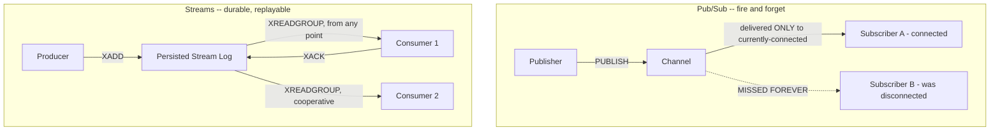
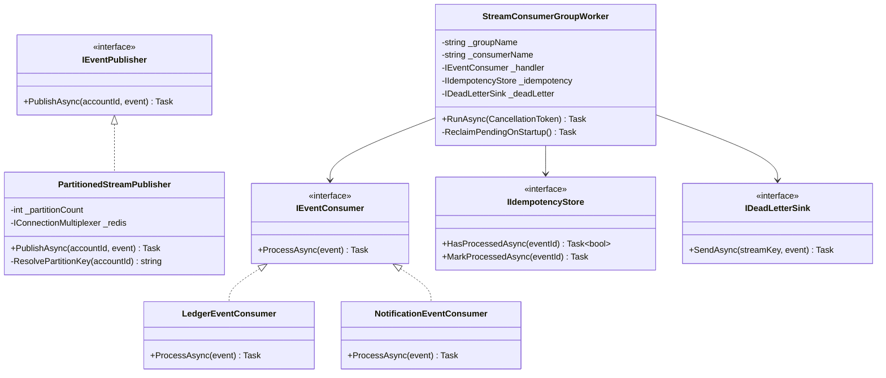
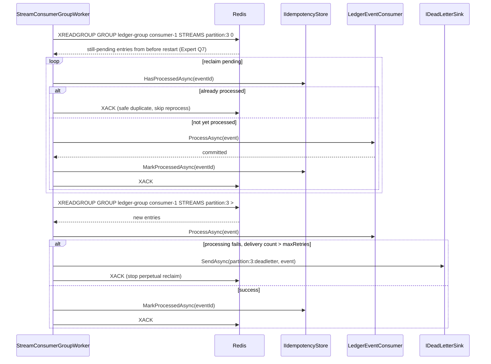

# Module 26 — Redis: Pub/Sub, Streams & High Availability

> Domain: Redis | Level: Beginner → Expert | Prerequisite: [[01-Data-Structures-Caching-Patterns]]

---

## 1. Fundamentals

### What is Redis Pub/Sub, and what is Redis Sentinel/Cluster HA?
**Pub/Sub** is Redis's simplest messaging primitive — publishers send messages to named channels; subscribers connected to those channels receive them in real time. **Sentinel** is Redis's dedicated high-availability system for a **non-clustered** primary-replica deployment — monitoring node health, and orchestrating automatic failover (promoting a replica to primary) if the primary becomes unavailable, without requiring the full Cluster sharding model.

### Why does this matter?
Pub/Sub's simplicity comes with a critical, frequently-misunderstood limitation that makes it unsuitable for many use cases it superficially seems to fit; Sentinel/Cluster's failover mechanics directly determine what happens to in-flight operations and recently-written data during a Redis primary failure — understanding this precisely is essential for correctly reasoning about Redis's actual availability/durability guarantees under failure.

### When does this matter?
Any system using Redis Pub/Sub for anything beyond genuinely ephemeral, loss-tolerant real-time notifications; any production Redis deployment requiring HA (essentially all of them) — the depth matters for choosing between Pub/Sub, Streams, and a dedicated message broker correctly, and for understanding exactly what data-loss window Sentinel/Cluster failover carries.

### How does it work (30,000-ft view)?
```
SUBSCRIBE notifications:order-updates
PUBLISH notifications:order-updates "order 123 shipped"
-- Any subscriber connected AT THE MOMENT of PUBLISH receives it; a subscriber
-- that connects even one millisecond later has PERMANENTLY missed this message.
```

---

## 2. Deep Dive

### 2.1 Pub/Sub's Fundamental Limitation — No Persistence, No Replay
Redis Pub/Sub messages are **fire-and-forget** — if no subscriber is connected to a channel at the exact moment of `PUBLISH`, the message is **gone forever**, with no persistence, no replay, no delivery guarantee whatsoever. This makes Pub/Sub fundamentally unsuitable for anything requiring reliable delivery (a subscriber that briefly disconnects/restarts loses every message published during that gap, permanently) — appropriate only for genuinely ephemeral, loss-tolerant use cases (a live "someone is typing" indicator, a cache-invalidation broadcast where a missed message just means a slightly-stale cache a subsequent TTL expiry will eventually correct anyway) never for anything resembling a durable event/message queue.

### 2.2 Streams — Redis's Answer to Pub/Sub's Durability Gap
Redis **Streams** (`XADD`/`XREAD`/`XREADGROUP`) solve exactly this problem: a stream is an **append-only, persisted log** (subject to Redis's own persistence configuration) that new consumers can read from **any point**, including from before they connected — directly analogous to Kafka's append-log model (a much later dedicated module) at a smaller, single-process scale. **Consumer groups** (`XREADGROUP`) let multiple consumers cooperatively process a stream's messages with **at-least-once delivery** — each message is delivered to exactly one consumer within the group, tracked as "pending" until explicitly acknowledged (`XACK`), with `XPENDING`/`XCLAIM` allowing detection and reassignment of messages a crashed consumer never acknowledged.

### 2.3 Sentinel — Automatic Failover for Non-Clustered Deployments
Sentinel instances (typically run as a separate quorum of 3+ processes, distinct from the Redis data instances themselves) continuously monitor the primary and replicas' health via periodic pings — upon detecting the primary is unreachable (confirmed by a **quorum** of Sentinels, avoiding a single Sentinel's own network partition from triggering an unnecessary failover), they elect a new primary from among the healthy replicas and reconfigure the remaining replicas to follow it, updating clients (via Sentinel's own client-facing address-discovery protocol) about the new topology. This failover is **not instantaneous** — it takes seconds (configurable detection/failover timeouts), during which writes to the (soon-to-be-former) primary may fail or, worse, succeed but never replicate before the failover completes (directly the write-concern data-loss scenario, now in a Redis-specific context).

### 2.4 Cluster's Built-in Failover vs Sentinel
Redis Cluster has its **own** built-in failover mechanism (each shard's replicas can be promoted automatically if that shard's primary fails) — Sentinel and Cluster are **two different HA mechanisms for two different deployment topologies**, not interchangeable or stackable: Sentinel manages a single (or a few) primary-replica set without sharding; Cluster manages many sharded primary-replica sets with its own internal failover logic, making a separate Sentinel deployment both unnecessary and inapplicable once Cluster mode is in use.

### 2.5 Replication Lag and the Same Async-Replication Trade-off, Again
Redis's primary-to-replica replication is **asynchronous by default** (a write is acknowledged to the client once the primary applies it, before any replica confirms) — the exact same trade-off already covered for PostgreSQL, SQL Server, and MongoDB: a primary crash before a write replicates to any replica loses that write on failover. Redis's `WAIT` command (`WAIT numreplicas timeout`) provides an explicit, per-operation mechanism to require acknowledgment from N replicas before considering a write durable — Redis's closest analog to MongoDB's `w: "majority"` write concern, opt-in rather than default, for exactly the same reason (throughput/latency by default, explicit durability escalation when needed).

## 3. Visual Architecture

```mermaid
graph TB
 subgraph "Pub/Sub -- fire and forget"
 Pub[Publisher] -->|PUBLISH| Ch[Channel]
 Ch -->|delivered ONLY to currently-connected| Sub1[Subscriber A - connected]
 Ch -.->|MISSED FOREVER| Sub2[Subscriber B - was disconnected]
 end
 subgraph "Streams -- durable, replayable"
 P2[Producer] -->|XADD| Stream[Persisted Stream Log]
 Stream -->|XREADGROUP, from any point| C1[Consumer 1]
 Stream -->|XREADGROUP, cooperative| C2[Consumer 2]
 C1 -->|XACK| Stream
 end
```

## 4. Production Example
**Scenario**: A real-time notification service used Redis Pub/Sub to broadcast "order status changed" events to a downstream analytics consumer — during a routine deployment of the analytics service (a brief restart, a few seconds of downtime), every order-status-change event published during that restart window was **permanently lost**, since Pub/Sub delivers only to currently-connected subscribers; the analytics dashboard subsequently showed gaps/inconsistencies in order-status transition counts that took significant investigation to trace back to this specific deployment window, since nothing logged an error anywhere (Pub/Sub doesn't fail loudly — it simply doesn't deliver to a disconnected subscriber, silently). **Investigation**: correlating the analytics discrepancy's timing precisely with the deployment's restart window confirmed the root cause. **Fix**: migrated the notification mechanism from Pub/Sub to Streams (`XADD`/`XREADGROUP`) — the analytics consumer now resumes from its last-acknowledged position after any restart, with zero message loss regardless of downtime duration (bounded only by the stream's own retention/trimming configuration). **Lesson**: Pub/Sub's fire-and-forget semantics make it fundamentally unsuitable for any consumer that isn't guaranteed to be continuously connected — "we'll just use Pub/Sub, it's simpler" is a reasonable choice only for genuinely loss-tolerant notifications, and any consumer with a realistic restart/deployment lifecycle (essentially every production service) needs Streams' durability instead.

## 5. Best Practices
- Use Streams (not Pub/Sub) for any messaging use case where a consumer's temporary disconnection must not cause permanent message loss.
- Reserve Pub/Sub genuinely for loss-tolerant, ephemeral real-time notifications where a missed message has no lasting consequence.
- Use `WAIT` explicitly for any write requiring stronger-than-default durability against primary failover, exactly as MongoDB's `w: "majority"` is used deliberately, not by default.
- Choose Sentinel or Cluster based on deployment topology (single primary-replica set vs. sharded), never attempt to combine them.

## 6. Anti-patterns
- Using Pub/Sub for any message a consumer's restart/deployment cycle could cause to be silently lost (the incident).
- Assuming Redis's default asynchronous replication provides the same durability as an explicit `WAIT`-confirmed write.
- Running both Sentinel and Cluster simultaneously, or misunderstanding which HA mechanism applies to a given deployment's actual topology.
- Ignoring consumer-group `XPENDING` monitoring, allowing crashed-consumer messages to remain unacknowledged and unprocessed indefinitely.

---

## 7. Performance Engineering

**CPU — Streams add real per-message bookkeeping cost.** Unlike Pub/Sub (pure fan-out, no persisted state per message), each `XADD` writes a persisted entry plus consumer-group metadata (the pending-entries list, delivery counts) — meaningfully more per-message CPU/memory cost than Pub/Sub's fire-and-forget delivery, which is the direct, structural price of Streams' durability and replay guarantees (§2.2); this is not a flaw, but a trade-off that must be sized into capacity planning when migrating a high-volume Pub/Sub channel to a Stream (the §4 incident's fix), not assumed to be free.

**Memory — unbounded Stream growth.** A Stream is a persisted, append-only log — without `XTRIM`/`MAXLEN` (or `MINID`-based trimming), it grows without bound, exactly the unbounded-retention risk §6/Advanced Q6 names as structurally similar to an orphaned replication slot or an untrimmed WAL. Use `XADD ... MAXLEN ~ 1000000` (the `~` performs approximate, more efficient trimming rather than an exact-count trim on every single add) sized to the actual replay window consumers genuinely need, not left unset "to be safe."

**Latency — Pub/Sub vs. Streams delivery cost.** Pub/Sub delivery is near-instantaneous (a direct in-memory fan-out to connected sockets, no persistence write on the hot path); Streams' `XADD` pays a small additional latency cost for the persisted-write path before the message is available to consumers via `XREADGROUP` — for a genuinely latency-critical, loss-tolerant broadcast (a live UI indicator), this Pub/Sub-vs-Streams latency delta is a real, relevant factor, not merely a durability-vs-none binary choice.

**Throughput — consumer-group fan-out vs. Pub/Sub fan-out.** A Stream's consumer group distributes messages *competitively* across group members (each message goes to exactly one member) — throughput scales with the number of consumers processing in parallel, capped by the single Stream key's placement on one Cluster node (§8 exercise) unless the workload is explicitly partitioned across multiple stream keys; Pub/Sub, by contrast, delivers *every* message to *every* subscriber (broadcast, not competitive), so "throughput" for Pub/Sub is bounded by the slowest subscriber's ability to keep its socket buffer drained, not by a shared consumer-group backlog.

**Replication lag's throughput-adjacent cost:** since replication is asynchronous by default (§2.5), a read-scaling strategy that offloads `XRANGE` historical reads to replicas trades consistency (a replica's view of a Stream can lag the primary) for reduced primary load — appropriate for historical/analytics reads, not for a consumer-group's live `XREADGROUP` position, which must be tracked against the primary's authoritative state.

**Benchmarking:** benchmark Streams under realistic consumer-group counts and pending-entries-list depth, not an idealized single-consumer, always-acknowledged-immediately scenario — the pending-entries-list bookkeeping cost (§2.2) is where real production overhead concentrates under a genuinely lagging or partially-failing consumer population, not in the simple `XADD`/`XACK` happy path most naive benchmarks measure.

---

## 8. Security

**Threats:** Pub/Sub channels and Stream keys are visible to, and consumable by, any client with sufficient permission on the Redis instance — an over-broadly-credentialed client (or one compromised via the unauthenticated-exposure risk, Module 25 §8) can subscribe to or read from channels/streams carrying sensitive payment-lifecycle events it has no legitimate need to see, a confidentiality risk distinct from Module 25's primarily availability/integrity-focused threats. A second, HA-specific threat surface: **Sentinel's own communication channel** (§2.10) — an attacker able to interfere with unsecured Sentinel traffic could manipulate failover behavior or gain topology reconnaissance, a privileged attack surface adjacent to, but distinct from, the Redis data instances' own security.

**Mitigations:** ACLs (Redis 6+, Module 25 §8) scoped per-channel-pattern (`+psubscribe` restricted to a specific channel prefix) and per-stream-key-pattern, exactly mirroring the least-privilege credential design already established for key-space access — a payment-events consumer credential should be scoped to read only its specific stream(s), not the instance's full channel/stream namespace. TLS for both client-to-Redis and Sentinel-to-Redis/Sentinel-to-Sentinel traffic, particularly for any deployment where Sentinel instances communicate across a network boundary not already fully trusted.

**OWASP mapping:** broken access control (A01:2021) if channel/stream ACL scoping isn't enforced per-consumer; misconfiguration (A05:2021) for an unsecured Sentinel deployment, mirroring the unauthenticated-Redis-exposure risk at the HA-orchestration layer instead of the data layer.

**AuthN/AuthZ:** every consumer group member should authenticate with its own scoped ACL credential (not a single shared credential across an entire consumer-group fleet), so that revoking one compromised consumer's access doesn't require rotating every other consumer's credential simultaneously.

**Secrets:** payment-lifecycle event payloads carried on a Stream (account identifiers, transaction amounts) are sensitive data at rest within Redis's own persistence files (RDB/AOF) — encryption-at-rest for the underlying storage volume is a standing requirement wherever Streams carry this class of payload, exactly as for any other persisted financial data.

**Encryption:** in-transit TLS for all publisher/consumer/Sentinel traffic; at-rest encryption for AOF/RDB files backing any Stream carrying sensitive event content.

---

## 9. Scalability

**Horizontal scaling — Streams don't automatically span Cluster slots.** A single Stream is a single key, and a single key lives on a single Redis Cluster hash slot/node (Module 25 §2.5) — Cluster mode does **not** automatically shard one Stream's contents across nodes; scaling a Streams-based pipeline horizontally requires **explicitly partitioning** across multiple stream keys (e.g., `orders:stream:{accountHash mod N}`), each independently placed by Cluster's normal key-to-slot mapping, with consumers responsible for reading across the relevant partition set — directly analogous to a Kafka topic's partition model, but requiring manual partitioning discipline in Streams since Redis doesn't provide it natively the way a dedicated broker does.

**Sentinel failover mechanics (§2.3 recap, scalability lens):** failover time (seconds, not milliseconds) means a Streams-based consumer using `XREADGROUP` against a failed-over primary must handle a connection interruption and resume correctly from its last-acknowledged position — the consumer-group's pending-entries-list state, itself replicated to the new primary (subject to the same async-replication lag caveat as any other write), is what makes this resumption correct rather than requiring the consumer to replay from the very beginning.

**Sentinel split-brain risk under partition:** if a network partition isolates the primary from a majority of Sentinels *and* from its replicas, but the primary itself remains reachable by some clients (a classic partial-partition scenario), those clients can continue writing to what is now a **stale, isolated primary** while Sentinel promotes a replica to be the new primary on the majority side — producing two simultaneously-writable "primaries" for a brief window, with the isolated primary's writes silently diverging and ultimately lost once it's demoted back to a replica on healing. `min-replicas-to-write`/`min-replicas-max-lag` (configuring the primary to refuse writes if it can't confirm replication to at least N replicas within a lag bound) is the mitigating lever — trading some availability (the primary refuses writes during a degraded-replication window) for closing this specific divergence risk, the same availability-vs-consistency trade already recurring throughout this course.

**Replication/Partitioning:** Cluster for data-volume scaling (Module 25 §2.5/§9); explicit Stream-key partitioning (above) for Streams-specific throughput scaling; Sentinel or Cluster's built-in failover (never both) for HA, chosen by topology.

**Cross-region DR:** open-source Redis has no native, built-in asynchronous cross-region replication comparable to a dedicated broker's multi-datacenter mirroring — cross-region DR for a Streams-based pipeline typically requires either a commercial extension (Redis Enterprise's Active-Active/CRDB), application-level dual-write/replay tooling, or accepting that the durable, cross-region system of record lives elsewhere (the transactional database) with Redis Streams as a regional, not global, transport layer — a genuine architectural limit worth surfacing explicitly rather than assuming Streams provides multi-region durability it does not.

---

## 10. Interview Questions

### Basic (10)
1. **Q: What is Redis Pub/Sub?** **A:** A messaging primitive where publishers send messages to channels and currently-connected subscribers receive them in real time.
2. **Q: Does Redis Pub/Sub persist messages for a disconnected subscriber?** **A:** No — a message is permanently lost for any subscriber not connected at the exact moment of publish.
3. **Q: What is a Redis Stream?** **A:** An append-only, persisted log that consumers can read from any point, including before they connected.
4. **Q: What does `XACK` do?** **A:** Acknowledges that a consumer group member has successfully processed a specific stream message.
5. **Q: What is Redis Sentinel?** **A:** A dedicated high-availability system monitoring a non-clustered primary-replica deployment and orchestrating automatic failover.
6. **Q: Is Redis's default replication synchronous or asynchronous?** **A:** Asynchronous — a write is acknowledged before any replica confirms receipt.
7. **Q: What does the `WAIT` command do?** **A:** Blocks until a specified number of replicas acknowledge receipt of prior writes, providing stronger durability than the default.
8. **Q: Can Sentinel and Cluster be used together?** **A:** No — they're separate HA mechanisms for different deployment topologies (non-sharded vs. sharded).
9. **Q: What does `XPENDING` show?** **A:** Messages delivered to a consumer group member but not yet acknowledged.
10. **Q: Why might Sentinel-based failover not be instantaneous?** **A:** It requires a quorum of Sentinels to confirm the primary is genuinely unreachable before triggering failover, taking a configurable detection/timeout period.

### Intermediate (10)
1. **Q: Why is Pub/Sub fundamentally unsuitable for a consumer with a normal restart/deployment lifecycle?** **A:** Any message published during the consumer's disconnected window (even a brief deployment restart) is permanently lost with no replay mechanism — essentially every production consumer has some restart lifecycle, making this a near-universal disqualifying limitation for reliable messaging use cases.
2. **Q: How do Streams' consumer groups provide at-least-once delivery specifically?** **A:** Each message delivered to a consumer group member remains in a "pending" state until explicitly acknowledged (`XACK`) — if the consumer crashes before acknowledging, `XPENDING`/`XCLAIM` let another consumer detect and reprocess that unacknowledged message, ensuring it's eventually processed at least once.
3. **Q: Why does Sentinel require a quorum of monitoring instances rather than a single monitor?** **A:** A single Sentinel experiencing its own network partition (unable to reach the primary) could incorrectly conclude the primary is down when it's actually fine, triggering an unnecessary failover — requiring a quorum of independently-positioned Sentinels to agree prevents one Sentinel's own connectivity issue from causing a false-positive failover.
4. **Q: Why is `WAIT` not the default behavior for every Redis write?** **A:** It adds latency (waiting for replica acknowledgment) to every write — reserved as an opt-in, per-operation choice for writes whose durability requirement genuinely justifies that cost, exactly the same default-fast/opt-in-durable pattern as MongoDB's write concern.
5. **Q: Why must a Stream be trimmed (`XTRIM`/`MAXLEN`), unlike Pub/Sub which has no persisted state to manage?** **A:** A Stream is a persisted, append-only log — without trimming, it grows unboundedly, consuming increasing memory/disk over time; Pub/Sub has no such concern since it never persists anything in the first place.
6. **Q: Why would a team choose Cluster's built-in failover over a separate Sentinel deployment for a sharded workload?** **A:** Cluster mode already includes its own failover logic tailored to its sharded topology — Sentinel is designed for non-sharded primary-replica deployments and doesn't apply to (or coexist meaningfully with) Cluster's own shard-level replica-promotion mechanism.
7. **Q: What's a realistic scenario where Redis Pub/Sub's limitations are actually acceptable, not a design flaw?** **A:** A live "user is typing" indicator in a chat application — if a message is missed due to a brief subscriber disconnection, the consequence is trivial (the indicator briefly doesn't show, self-correcting on the next keystroke event), making Pub/Sub's fire-and-forget simplicity an entirely appropriate, deliberate choice rather than a limitation to work around.
8. **Q: Why might `XCLAIM` be needed even with consumer groups' at-least-once guarantee already in place?** **A:** At-least-once delivery guarantees a message *will* eventually be processed, but doesn't automatically reassign a crashed consumer's pending, unacknowledged messages to another consumer on its own — `XCLAIM` is the explicit mechanism another consumer uses to take ownership of messages that have been pending too long, completing the recovery the at-least-once guarantee promises but doesn't automate by itself.
9. **Q: Why does Redis's asynchronous-by-default replication mirror the exact same trade-off already covered for PostgreSQL, MongoDB, and SQL Server across this course?** **A:** It's the same fundamental availability-vs-durability spectrum every replicated system faces — acknowledging a write before it's replicated is faster but risks loss on failover; waiting for replication is safer but slower — Redis's `WAIT` command is simply this course's recurring trade-off expressed as yet another engine-specific, per-operation knob.
10. **Q: Why should Sentinel's own communication be secured with the same rigor as the Redis data instances it monitors?** **A:** Sentinel has privileged visibility into cluster topology and participates in triggering failover — an attacker able to interfere with unsecured Sentinel communication could potentially manipulate failover behavior or gain reconnaissance about the deployment's topology, a real attack surface distinct from but adjacent to the Redis data instances' own security.

### Advanced (10)
1. **Q: Diagnose the Pub/Sub message-loss incident from first principles, and design the migration strategy to Streams without downtime.**
 **A:** Root cause: Pub/Sub's fundamental lack of persistence/replay combined with a consumer that has a normal (if infrequent) restart lifecycle. Migration strategy: dual-publish to both the existing Pub/Sub channel and a new Stream during a transition period (directly this course's recurring "expand, don't break" incremental-migration pattern, §Advanced Q9/ §Advanced Q6); migrate the consumer to read from the Stream via `XREADGROUP` once validated; only remove the Pub/Sub publish path once the Stream-based consumer has been running reliably, confirming zero regression in event delivery.
2. **Q: Design a monitoring strategy specifically for consumer-group health, catching a stalled/crashed consumer before its unacknowledged backlog becomes a problem.**
 **A:** Track `XPENDING` count and the age of the oldest pending entry per consumer group as standing metrics — a growing pending count or an old, un-aging-out pending entry indicates a consumer that's stopped acknowledging (crashed, stuck, or simply slow) without necessarily having disconnected entirely (which would be separately visible); alert on pending-entry age exceeding a threshold appropriate to the expected processing latency, triggering investigation or automated `XCLAIM`-based reassignment to a healthy consumer before the backlog grows unbounded.
3. **Q: Explain precisely why a Sentinel-orchestrated failover, even once complete, might still result in the exact same write-loss scenario as the MongoDB incident, and how `WAIT` addresses it.**
 **A:** Sentinel's failover promotes a replica based on **whatever data it already has** — any write acknowledged by the old primary but not yet asynchronously replicated to that promoted replica is lost, precisely the same mechanism as MongoDB's default `w: 1` failover data-loss window; `WAIT numreplicas timeout` closes this gap for any specific write by requiring replica acknowledgment before returning success to the client, exactly mirroring MongoDB's `w: "majority"` fix for the identical underlying problem, just expressed via Redis's own command rather than a connection/operation-level setting.
4. **Q: Design a hybrid architecture using both Pub/Sub and Streams for a real-time dashboard requiring both instant live updates and guaranteed historical completeness.**
 **A:** Publish every event to **both** a Pub/Sub channel (for currently-connected dashboard clients wanting instant, low-latency updates with no replay need, since a dashboard actively being viewed doesn't need historical replay for events it was live for) and a Stream (as the durable, replayable system of record for anything needing guaranteed completeness — a newly-opened dashboard tab backfilling recent history, or a downstream analytics consumer that must never miss an event); this deliberately uses each mechanism for what it's actually good at, rather than forcing one mechanism to serve both needs.
5. **Q: How would you decide between Redis Streams and a dedicated message broker (Kafka/RabbitMQ, later modules) for a new event-driven feature?**
 **A:** Redis Streams are appropriate for moderate-scale, single-Redis-cluster-scoped messaging needs where the team already operates Redis and wants to avoid introducing an entirely separate broker's operational complexity; a dedicated broker becomes the better choice once requirements include: multi-datacenter/cross-region replication of the message log itself, very high sustained throughput beyond a single Redis deployment's practical ceiling, sophisticated routing/exchange patterns (RabbitMQ's exchange types), or a mature ecosystem of connectors/tooling (Kafka Connect) — the decision hinges on whether Streams' simpler, Redis-native feature set genuinely covers the requirement, or whether a dedicated broker's more extensive feature set is actually needed, not a default "always use a dedicated broker for messaging" assumption.
6. **Q: Explain why forgetting to trim a Stream can eventually cause a production incident distinct from, but structurally similar to, MongoDB's unbounded oplog/PostgreSQL's orphaned-replication-slot risk.**
 **A:** An untrimmed Stream grows without bound as new entries accumulate indefinitely — eventually consuming enough memory to threaten the Redis instance's overall stability (potentially triggering eviction of unrelated cache keys if sharing an instance, or an out-of-memory condition) — structurally the same "unbounded retention of historical data because nothing enforces a bound" failure shape as an orphaned PostgreSQL replication slot, just manifesting through a different specific mechanism (Stream growth vs. WAL retention).
7. **Q: Design a strategy for safely handling a "poison message" in a Streams-based consumer group — a message that repeatedly fails processing and gets reclaimed via `XCLAIM` indefinitely.**
 **A:** Track each message's delivery-attempt count (via `XPENDING`'s reported delivery count, or an application-maintained counter); after a configured maximum retry count, move the message to a dedicated "dead-letter" stream instead of continuing to reclaim/retry it indefinitely, and acknowledge (`XACK`) it on the original stream to stop it from remaining perpetually pending — directly the same dead-letter-queue pattern a dedicated message broker provides natively, implemented manually here since Redis Streams don't include this as a built-in feature.
8. **Q: Explain how you would reason about the correct number of Sentinel instances and their placement for a production deployment.**
 **A:** Deploy an **odd** number (typically 3 or 5) specifically to allow a clean majority-quorum determination without ties; distribute Sentinel instances across **different failure domains** (different availability zones/racks) than the Redis data instances themselves, so a single failure domain's outage doesn't simultaneously take down both a Redis node and enough Sentinels to prevent proper quorum-based failover detection — placement strategy matters as much as raw count for genuine resilience.
9. **Q: A team wants to use Redis Streams as a full replacement for their existing Kafka-based event pipeline "to simplify the stack." Evaluate this as a Principal Engineer.**
 **A:** Evaluate against the team's actual scale/requirements, not against Streams' theoretical adequacy alone — if the existing Kafka pipeline relies on features Streams doesn't natively provide equivalently (long-term, cross-region log retention as a system of record; sophisticated consumer-offset management across many independent consumer applications; a mature connector ecosystem for downstream integrations), a full replacement risks losing real capability for a "simpler stack" that isn't actually simpler once those gaps must be manually reimplemented (as in Advanced Q7's dead-letter-queue example); recommend a narrow, specific pilot on a bounded, lower-stakes use case first, rather than a wholesale migration based on architectural simplicity alone without validating the capability gaps don't matter for this specific pipeline's actual requirements.
10. **Q: As a Principal Engineer, how would you build organizational guidance helping teams choose correctly among Pub/Sub, Streams, and a dedicated broker without requiring deep Redis internals knowledge from every engineer?**
 **A:** Publish a simple decision tree (this course's recurring governance-template pattern): "Is losing a message during a brief consumer disconnect acceptable? → Yes: Pub/Sub. No: does the messaging need stay within a single Redis deployment's scale/scope, with modest throughput and simple routing needs? → Yes: Streams. No (need cross-region, very high throughput, or a rich connector ecosystem): a dedicated broker (later module)." — reducing a genuinely nuanced trade-off (this entire module's content) into a fast, reliable, non-expert-usable decision path for the common cases, with an escalation path to deeper consultation for genuinely novel scenarios the tree doesn't clearly resolve.

### Expert (FinTech Principal Panel)

1. **Q: You added `WAIT` (Advanced Q3) to make financial writes durable across replicas. A colleague says "now we can't lose a payment event." As the Principal, what's the precise, honest guarantee `WAIT` gives, and where does it still fall short for money?**
 **A:** Be precise: `WAIT numreplicas timeout` blocks until the write has been **received by** that many replicas — but "received" means it reached the replica, **not necessarily fsync'd to disk** there (that depends on each node's AOF/`appendfsync` config), and `WAIT` **does not roll back** if the timeout elapses (it just returns how many replicas actually acked, and your write may already be on the primary). So `WAIT` narrows but does not eliminate loss windows: a correlated failure (primary + the acked replica both crash before disk persistence), or a `WAIT` that timed out but you proceeded anyway, can still lose the event. It also doesn't give you exactly-once or ordering guarantees for downstream consumers. For a payment event that is a **system-of-record fact**, the honest posture is: (a) persist the authoritative fact in a durable transactional store first (the DB with the effect), (b) use the **transactional outbox** so the event's existence is tied to that committed fact, and (c) treat Redis Streams as fast transport with **at-least-once + idempotent consumers**, using `WAIT` + AOF `everysec/always` to *reduce* the window — or graduate to a broker with stronger, disk-durable, replicated guarantees (Kafka `acks=all` + min in-sync replicas) when the event log itself must be the durable record. The Principal framing: `WAIT` improves durability but guarantees *replica receipt*, not *disk-durable, no-loss, exactly-once* delivery — for money, the durable truth lives in the transactional store + outbox, with Redis as transport, not the source of record.
 **Why correct:** States `WAIT`'s exact semantics (receipt not fsync, no rollback on timeout), the residual correlated-failure window, and relocates the durable record to DB+outbox with Redis as at-least-once transport.
 **Common mistakes:** Believing `WAIT` means fsync'd/no-loss; assuming it gives ordering/exactly-once; treating the Redis stream as the authoritative payment record.
 **Follow-ups:** "Does `WAIT` guarantee the replica wrote to disk?" / "What happens on `WAIT` timeout — does your write roll back?" / "Why is the outbox in the DB the real durability guarantee?"

2. **Q: You deliver payment lifecycle events (`authorized`, `settled`, `refunded`) to internal consumers (ledger, notifications, analytics) via Redis Streams consumer groups. What delivery semantics do you actually have, and how do you make the ledger consumer correct?**
 **A:** Redis Streams consumer groups give **at-least-once** delivery: a message stays pending (`XPENDING`) until `XACK`, and a consumer that crashes after processing but before `XACK` will have the message **redelivered** (to itself or via `XCLAIM` to another consumer) — so duplicates are guaranteed possible, and there's no exactly-once. Ordering is **per-stream** (entries have monotonic IDs), so if you need per-account ordering, partition by account into per-key streams (a single stream preserves global order but limits parallelism). To make the ledger consumer correct: (1) **idempotent processing** — each event carries a stable event ID; the ledger dedupes on it (unique constraint / processed-set) so a redelivered `settled` doesn't double-post; (2) **`XACK` only after the effect is durably committed** (commit the ledger posting, then ack — ack-before-commit loses the message on a crash); (3) **poison handling** — after max redeliveries, dead-letter (Advanced Q7) rather than reclaim forever; (4) tolerate **out-of-order/duplicate lifecycle** (a `refunded` after a redelivered `settled`) by keying on state, not assuming order. The Principal framing: Streams are at-least-once and per-stream-ordered, so a correct financial consumer is **idempotent, acks-after-commit, dead-letters poison, and is order-tolerant** — and if you need cross-account global ordering or exactly-once-ish semantics at scale, that's a signal to use a partitioned broker (Kafka) designed for it.
 **Why correct:** Names at-least-once + per-stream ordering, and makes the consumer correct via idempotency, ack-after-commit, DLQ, and order tolerance, with the graduate-to-Kafka trigger.
 **Common mistakes:** Assuming exactly-once/global ordering; `XACK` before the effect commits; no idempotency so redeliveries double-post; infinite reclaim of poison messages.
 **Follow-ups:** "Why ack after commit, not before?" / "How do you get per-account ordering with parallelism?" / "What redelivery scenario double-posts the ledger if consumers aren't idempotent?"

3. **Q: Your payment-events Stream needs both strict per-account ordering (a `refunded` must never be processed before its `settled`) and horizontal consumer throughput beyond one consumer group member. A single Stream key gives you ordering but caps parallelism at effectively one active processing lane; naive multi-consumer reads from one stream break per-account ordering. Design the fix.**
 **A:** Partition by **account** into N separate stream keys (`payments:events:{accountId hash mod N}`), guaranteeing every event for a given account always lands on the *same* partition/stream — since a single stream's entries are strictly ordered by their monotonic entry ID, and all of one account's events share a partition, per-account ordering is preserved *within* that partition. Run N independent consumer-group readers, one per partition, each free to process in parallel with every other partition's reader — throughput scales with N (bounded by however many partitions you provision and however Cluster distributes them across nodes, §9), while ordering is preserved at exactly the granularity that matters (per-account), not globally (which isn't required and would cap throughput at one lane). This is the direct application of the ordering scalability trade-off, and it requires the partitioning to be **deterministic and stable** — the same account must always hash to the same partition, or a mid-stream repartition would scatter one account's events across two partitions and silently break the ordering guarantee the whole design depends on.
 **Why correct:** Correctly resolves the ordering-vs-parallelism tension via deterministic per-account partitioning rather than accepting either "global order, one lane" or "parallel, unordered" as the only two options.
 **Common mistakes:** Reading from a single stream with multiple competing consumer-group members expecting per-account order to be preserved (it isn't — consumer-group delivery order across members isn't guaranteed to respect any sub-key grouping); using a non-deterministic or resizable partitioning scheme that can scatter one account's events.
 **Follow-ups:** "What happens if you need to change N (repartition) later?" / "Why must the hash function be stable across deploys?" / "How does this compare to Kafka's partition-key model?"

4. **Q: Sentinel promotes a replica during a partial network partition, but the old primary — still reachable by some clients due to an asymmetric partition — keeps accepting writes for 8 seconds before those clients notice and reconnect to the new primary. What actually happened to those 8 seconds of writes, and how do you prevent recurrence for a payment-events Stream?**
 **A:** This is Sentinel split-brain (§9) concretely realized: the old primary, isolated from Sentinel's majority and from its own replicas but still reachable by a subset of clients, kept accepting `XADD`s that were never replicated anywhere — when the partition heals, Sentinel demotes the old primary to a replica of the *new* primary, and Redis's replication resynchronization **discards** the old primary's divergent, unreplicated writes entirely (a replica's data is overwritten to match its new primary on resync) — those 8 seconds of payment events are gone, silently, with no error ever surfaced to the clients that "successfully" wrote them. Prevention: `min-replicas-to-write 1 min-replicas-max-lag 10` (or stricter) configures the primary to **refuse writes** the moment it can't confirm at least one sufficiently-current replica connection — during exactly this kind of partition, the isolated primary would reject the writes outright (a loud, immediate client-visible error) rather than silently accepting and later losing them; combined with `WAIT` on the specific critical write path for an even tighter guarantee. The trade: the primary becomes briefly unavailable for writes during a degraded-replication window it previously would have silently accepted work through — a deliberate, and for payment events correct, availability-for-correctness trade.
 **Why correct:** Precisely explains the resync-discards-divergent-writes mechanism and proposes `min-replicas-to-write`/`min-replicas-max-lag` as the structural (not detection-only) prevention, naming its explicit availability trade-off.
 **Common mistakes:** Assuming Sentinel failover always preserves all writes because "Redis has replication"; not knowing `min-replicas-to-write` exists as a lever to convert silent write loss into a loud, immediate rejection.
 **Follow-ups:** "Why does resync discard the old primary's writes instead of merging them?" / "What client-visible behavior does `min-replicas-to-write` produce during the partition?" / "How does this differ from the plain async-replication data-loss window (Advanced Q3) that doesn't involve split-brain?"

5. **Q: A team wants to broadcast trade-confirmation notifications to thousands of ephemeral WebSocket-gateway connections (each connection is short-lived, reconnects on gateway pod restart, and only cares about "the confirmation for the trade I'm currently viewing"). They're debating Streams vs. Pub/Sub. Which is correct, and why does Module 26's own migration lesson (Advanced Q1) not straightforwardly apply here?**
 **A:** Pub/Sub is actually the *better* fit here, and this is a genuine exception to "always prefer Streams for reliability," not a contradiction of it. Consumer-group Streams deliver each message to **exactly one** group member (competitive consumption) — wrong shape for a fan-out-to-many-simultaneous-viewers broadcast, where *every* currently-interested WebSocket connection needs the *same* message, not one connection winning it. And the loss-tolerance profile is genuinely different from the original migration incident's analytics consumer: a WebSocket gateway missing a confirmation during its own brief restart is a UI-only gap for a connection whose client will typically re-fetch current state on reconnect anyway (a genuinely loss-tolerant, ephemeral-viewing use case, precisely the kind Intermediate Q7 already names as legitimate for Pub/Sub) — unlike the original migrated use case, which was a durable analytics system-of-record consumer, not a live-view broadcast. The correct design: Pub/Sub (or Redis's **sharded Pub/Sub**, `SSUBSCRIBE`/`SPUBLISH`, Redis 7+, which scales channel fan-out across Cluster shards rather than requiring every node to relay every message) for the live broadcast, with the durable, authoritative trade-confirmation record living in a Stream (or the DB) as the system of record any client can pull current state from on reconnect — again, each mechanism used for what it's actually good at, not one mechanism forced to serve both needs.
 **Why correct:** Correctly identifies the fan-out-vs-competitive-consumption mismatch and the genuinely different loss-tolerance profile, resisting a mechanical "always migrate to Streams" over-application of Module 26's own general lesson.
 **Common mistakes:** Reflexively applying "Streams are more reliable, always use them" without checking whether the delivery *shape* (competitive vs. broadcast) actually fits; not knowing sharded Pub/Sub exists as a Cluster-scalable broadcast option.
 **Follow-ups:** "Why is 2P — er, why is a WebSocket gateway restart genuinely loss-tolerant here but the original analytics consumer wasn't?" / "What does sharded Pub/Sub solve that plain Pub/Sub doesn't at Cluster scale?" / "Where does the authoritative trade-confirmation record actually need to live?"

6. **Q: A payment-events Stream must be retained for 90 days for regulatory reconstruction of transaction history, but the team is trimming it (`XTRIM MAXLEN ~ 1000000`) sized only for operational replay needs (a few days). As the Principal, how do you reconcile the operational-replay need with the regulatory-retention need without simply setting `MAXLEN` to something enormous?**
 **A:** These are two structurally different requirements masquerading as one setting. **Operational replay** (a consumer resuming after a brief outage) needs only a few days of Stream depth and should stay small/cheap, sized against the realistic maximum outage-and-catch-up window (§7's trimming guidance). **Regulatory retention** (reconstructing transaction history 90 days later for an audit) is a fundamentally different access pattern — infrequent, not latency-sensitive, and about durable archival, not live consumer replay — and should **not** live in the hot, operationally-trimmed Stream at all. Correct design: keep the Stream trimmed tightly for its genuine operational purpose, and separately, durably archive every event (via a downstream consumer that reads the Stream once and writes to a database table or object-storage-backed audit log with its own 90-day-plus retention policy) as the actual regulatory-retention mechanism — exactly the same "the Stream is transport, not the durable system of record" principle Expert Q1/Q2 already establish for payment correctness, now applied to regulatory retention specifically. Setting `MAXLEN` to "90 days worth" conflates transport sizing with archival policy, bloating the operational Stream's memory footprint for a requirement it's the wrong tool to satisfy anyway.
 **Why correct:** Separates the two genuinely distinct requirements (operational replay vs. regulatory archival) and routes each to the tool actually suited to it, rather than overloading `MAXLEN` to serve both.
 **Common mistakes:** Treating Stream retention (`MAXLEN`) as the regulatory-compliance mechanism itself, rather than recognizing regulatory retention needs a separate, durable archival consumer.
 **Follow-ups:** "What would the archival consumer's own failure mode look like, and how would you monitor it?" (Consumer-lag/backlog monitoring, Advanced Q2, applied specifically to the archival consumer group.) / "Why is object storage often preferred over keeping 90 days directly in Redis?" / "Does this pattern recur elsewhere in this course?" (Yes — directly the outbox/durable-record-vs-transport distinction recurring throughout this domain's expert tier.)

7. **Q: Design the client-side reconnect and resume logic for a payment-ledger consumer reading via `XREADGROUP` when Sentinel fails over mid-stream-read, ensuring no gap and no unnecessary reprocessing.**
 **A:** On a connection failure/error mid-`XREADGROUP`, the client should: (1) **not** assume the failure means messages were lost — it means only that this specific connection attempt failed; (2) resolve the current primary via Sentinel's client-facing discovery mechanism (never hardcode the old primary's address, which may now be a demoted replica); (3) reconnect and reissue `XREADGROUP` with `>` (new, undelivered messages) for the ongoing stream, relying on the consumer group's own **pending-entries-list** (tracked server-side, and itself replicated to the new primary subject to the same replication-lag caveat, Expert Q4) to already reflect which messages this consumer had been delivered but not yet acknowledged; (4) on reconnect, first issue an `XREADGROUP` with `0` (not `>`) to **re-read this consumer's own still-pending entries** from before the disconnect — catching any message that was delivered but not yet acknowledged when the connection dropped, since the client cannot assume whether its own `XACK` for the last-processed message actually reached the (old) primary before the connection failed. This makes the resume idempotent-safe (a message might be reprocessed if the `XACK` was in flight when the connection dropped, but never silently skipped) — correctness leans toward "possible duplicate, never a gap," relying on the ledger consumer's own idempotency (Expert Q2) to absorb the possible duplicate safely.
 **Why correct:** Correctly sequences reconnect-via-Sentinel-discovery, then re-claims pending entries before resuming new reads, and explicitly reasons about the ack-in-flight-at-disconnect edge case rather than assuming a clean resume point.
 **Common mistakes:** Resuming only with `>` (new messages) after reconnect, silently skipping a message that was delivered-but-unacknowledged at the moment of disconnect; hardcoding the pre-failover primary's address instead of re-resolving via Sentinel.
 **Follow-ups:** "Why read with `0` before `>` on reconnect specifically?" / "What guarantees the pending-entries-list itself survived the failover intact?" / "How does this connect to the idempotent-consumer design from Expert Q2?"

8. **Q: A Streams-based payment-events pipeline has grown to the point where the team is considering "just moving to Kafka." As the Principal, what's the decision framework, and what would premature migration cost versus premature non-migration?**
 **A:** Apply the same graduation criteria Advanced Q5/Q9 already establish, made concrete for this specific pipeline: does the requirement now include (a) durable, cross-region log retention as the actual system of record (Streams has no native cross-region replication, §9) — if this pipeline's Stream is genuinely being relied on as a durable, long-lived audit trail rather than short-lived transport with the DB as backstop, that's a real gap; (b) sustained throughput or partition count beyond what a single Cluster deployment comfortably handles, requiring the manual partitioning discipline (Expert Q3) to become unwieldy at the scale now needed; (c) a need for a mature connector/consumer ecosystem spanning many independent downstream teams/systems, where Kafka's tooling maturity provides real, not merely aesthetic, value. **Cost of premature migration:** taking on Kafka's genuinely higher operational complexity (a separate cluster technology, ZooKeeper/KRaft, a new team skill requirement) before the pipeline's actual scale/requirements justify it — pure overhead with no realized benefit, and the specific failure mode Advanced Q9 already names for "simplify the stack" reasoning without validating the capability gap actually matters. **Cost of premature non-migration:** continuing to manually reimplement Kafka-native capabilities (partitioning discipline, dead-lettering, cross-region durability workarounds) as this pipeline scales past where those workarounds remain proportionate — eventually paying more in accumulated bespoke tooling than a clean migration would have cost. The Principal framing: this is a scale-and-requirement-triggered decision, evaluated against the three concrete criteria above, not a technology-preference decision made on "Kafka is more standard for this."
 **Why correct:** Grounds the migration decision in three concrete, checkable criteria and names the real cost on both sides of a premature call, rather than treating it as a simplicity-versus-complexity aesthetic preference.
 **Common mistakes:** Migrating to Kafka because it's the more commonly used tool for this problem class in the industry generally, without checking whether this specific pipeline has actually crossed any of the three concrete thresholds.
 **Follow-ups:** "Which of the three criteria is hardest to reverse if you get the call wrong?" (Cross-region durability commitments — once downstream consumers depend on the Stream as an actual system of record, unwinding that assumption later is expensive.) / "What would a low-risk pilot migration look like?" / "How would you quantify 'accumulated bespoke tooling cost' concretely for a go/no-go decision?"

9. **Q: A Redis Cluster hosting the payment-events Streams loses one primary node outright (hardware failure, not a partition). Walk through exactly what happens to (a) writes in flight to that node's slots, (b) the consumer groups reading from streams on those slots, and (c) how long correctness-sensitive consumers are actually blocked.**
 **A:** Cluster's own built-in failover (§2.4) — distinct from Sentinel — detects the primary's unreachability via gossip among the other Cluster nodes; once a majority of primaries agree the node is down, one of *its own replicas* is promoted automatically, and the affected hash slots move to the newly-promoted primary. (a) Any write in flight to the failed node at the moment of failure is lost exactly as in the Sentinel case (Expert Q4) — an async-replicated write not yet on the promoted replica is gone on failover, with no different guarantee just because it's Cluster rather than Sentinel; `min-replicas-to-write`/`WAIT` apply identically per-shard. (b) Consumer groups reading from streams on the affected slots see their connections fail and must reconnect — Cluster clients (e.g., StackExchange.Redis in cluster mode) handle the `MOVED`/`ASK` redirection and slot-map refresh automatically on reconnect, and the consumer group's pending-entries-list state, having been asynchronously replicated to the promoted replica, is available for the reconnect-and-reclaim sequence (Expert Q7) exactly as in the Sentinel case. (c) The blocked window is bounded by Cluster's failure-detection timeout (`cluster-node-timeout`, commonly several seconds) plus the promotion and slot-migration announcement time — during this window, any client operation touching the affected slots (including this consumer group's reads) fails or blocks, while operations on *other*, unaffected slots continue completely unaffected, since Cluster's failure domain is per-shard, not cluster-wide — a structural advantage over a single-primary Sentinel deployment, where the entire dataset shares one failure domain.
 **Why correct:** Correctly separates Cluster's own failover mechanism from Sentinel's, states the identical async-replication write-loss risk applies regardless of which failover mechanism is in play, and identifies the per-shard blast-radius containment as Cluster's specific advantage.
 **Common mistakes:** Assuming Cluster failover eliminates the async-replication data-loss window (it doesn't — it's the same underlying replication mechanism); assuming a single node failure blocks the *entire* Cluster rather than only the affected shard's slots.
 **Follow-ups:** "Why is the failure domain per-shard in Cluster but cluster-wide in a single Sentinel-managed primary-replica set?" / "Does `min-replicas-to-write` apply per-shard or cluster-wide in Cluster mode?" / "What does the client actually see during the `cluster-node-timeout` window — an error or a hang?"

10. **Q: As Principal Engineer, design the standing operational readiness review every new Streams-based, correctness-sensitive consumer must pass before production rollout, synthesizing every expert-tier finding in this module.**
 **A:** A five-point gate, each point traceable to a specific incident or reasoning failure this module establishes: (1) **idempotency** — the consumer's processing is proven idempotent against redelivery (Expert Q2), verified by an explicit test that delivers the same event twice and asserts no duplicate effect; (2) **ack-after-commit ordering** — code review confirms `XACK` is issued only after the consumer's own effect is durably committed, never before (Expert Q2); (3) **bounded downstream calls** — no unbounded-timeout external call exists anywhere in the consumer's processing path (§14's prevention rule), verified by a static-analysis or review checklist item; (4) **backlog monitoring wired in** — `XPENDING` count and oldest-pending-entry age are alerted for this specific consumer group before go-live, not added reactively after an incident (§14); (5) **reconnect/resume correctness** — the consumer's reconnect logic explicitly re-reads pending entries with `0` before resuming with `>` (Expert Q7), tested against a simulated Sentinel/Cluster failover in a staging environment, not merely assumed correct from the client library's defaults. Any new consumer failing any of these five gates is not approved for production against a correctness-sensitive Stream, regardless of schedule pressure — converting five independently-discovered lessons into one standing, enforced checklist rather than leaving each new team to rediscover them independently.
 **Why correct:** Synthesizes every expert-tier finding into five concrete, independently verifiable gates, each traceable to a specific named failure mode this module establishes.
 **Common mistakes:** Treating this module's lessons as historical incident narratives rather than converting them into an enforced, pre-production gate; approving a new consumer based on "the team is experienced" rather than verifying each specific property.
 **Follow-ups:** "Which single gate, if skipped, would have most directly caused the §14 incident?" (Gate 3 — the unbounded downstream call — since gates 1, 2, and 5 were all actually satisfied in that incident; it was purely the missing bounded-timeout discipline that caused it, showing even a well-governed consumer needs every gate, not just the ones already learned from.) / "How would you keep this checklist itself from going stale as new failure modes are discovered?" / "Would this checklist have caught the original §4 Pub/Sub-loss incident?" (No — that was a channel-choice error, upstream of this checklist, which assumes Streams has already been correctly selected; it's addressed by the decision framework in §15/Expert Q8, a separate, earlier gate.)

---

## 11. Coding Exercises

### Easy — Basic Stream produce/consume with acknowledgment
```
XADD orders:events * orderId 123 status "shipped"
XREADGROUP GROUP analytics-group consumer-1 COUNT 10 STREAMS orders:events >
-- process the message --
XACK orders:events analytics-group <message-id>
```

### Medium — Migrate from Pub/Sub to Streams with a dual-write transition (Advanced Q1)
```csharp
public async Task PublishOrderEventAsync(OrderEvent evt)
{
    // Transition period: write to BOTH mechanisms.
    await _redis.PublishAsync("orders:pubsub", Serialize(evt)); // legacy consumers, unchanged
    await _redis.StreamAddAsync("orders:stream", new[] {
            new NameValueEntry("payload", Serialize(evt))
    }); // new, durable path
}
// Once the Stream-based consumer is validated and reliable, remove the PublishAsync call entirely.
```

### Hard — Consumer-group backlog monitoring with dead-letter handling (Advanced Q7)
```csharp
public async Task ProcessPendingWithDeadLetterAsync(string stream, string group, string consumer, int maxRetries)
{
    var pending = await _redis.StreamPendingMessagesAsync(stream, group, 100, consumer);

    foreach (var entry in pending)
    {
        if (entry.DeliveryCount > maxRetries)
        {
            var messages = await _redis.StreamRangeAsync(stream, entry.MessageId, entry.MessageId);
            await _redis.StreamAddAsync($"{stream}:deadletter", messages[0].Values);
            await _redis.StreamAcknowledgeAsync(stream, group, entry.MessageId); // stop it from being reclaimed forever
        }
        else
        {
            var claimed = await _redis.StreamClaimAsync(stream, group, consumer, minIdleTimeInMs: 30000, messageIds: new[] { entry.MessageId });
            foreach (var msg in claimed) await ProcessMessageAsync(msg); // retry
        }
    }
}
```

### Expert — Sentinel-aware client with `WAIT`-enforced durable writes for critical operations
```csharp
public async Task<bool> WriteCriticalDataAsync(string key, string value)
{
    var db = await _sentinelConnection.GetDatabaseAsync; // resolves current primary via Sentinel
    await db.StringSetAsync(key, value);

    var replicaAckCount = await db.ExecuteAsync("WAIT", "1", "1000"); // wait for 1 replica, up to 1s
    if ((long)replicaAckCount < 1)
    {
        // Durability NOT confirmed within the timeout -- caller must decide: retry, alert, or accept the risk explicitly.
        _logger.LogWarning("WAIT did not confirm replication for key {Key} within timeout.", key);
        return false;
    }
    return true;
}
```
**Discussion**: This directly implements Advanced Q3's fix — `WAIT` closes the exact same failover data-loss window the MongoDB incident demonstrated, here made explicit and deliberate for a specific "critical" write path rather than left to Redis's default asynchronous-replication behavior.

---

## 12. System Design

**Scenario:** Design the internal event-distribution layer for a payments platform's lifecycle pipeline — `authorized` → `settled` → `refunded`/`failed` events fanning out to a ledger-posting consumer, a customer-notification consumer, and an analytics consumer, at ~5,000 events/second peak, with a hard requirement that the ledger consumer never miss or double-post an event undetected.

**Requirements:**
- *Functional:* durable, replayable event delivery per account with strict per-account ordering; at-least-once delivery to each of the three independent consumer types; poison-message isolation so one malformed event doesn't block an entire consumer group; a live, low-latency broadcast path for the customer-notification consumer's WebSocket-facing fan-out.
- *Non-functional:* zero silent event loss on consumer restart/deployment; bounded consumer-group backlog under normal operation, with alerting on abnormal growth; HA surviving a primary failure within a bounded, monitored window; regulatory-grade retention for audit reconstruction, without bloating the operational transport layer.

**Architecture and components:** Redis Cluster running Sentinel-free (Cluster's own built-in per-shard failover, §2.4, chosen over a separate Sentinel deployment since sharding is required for throughput at this event volume anyway). Events are **partitioned by account** into N Streams (`payments:events:{accountHash mod N}`, Expert Q3), each independently placed across Cluster hash slots. Three consumer groups per partition — `ledger-group`, `notifications-group`, `analytics-group` — each reading independently via `XREADGROUP`, so a slow or crashed analytics consumer never blocks the ledger consumer's own progress (the key advantage of Streams' per-group-independent delivery over a single shared queue). The customer-notification path additionally publishes to **sharded Pub/Sub** (`SPUBLISH`, Expert Q5) for the live, loss-tolerant WebSocket-gateway broadcast, kept entirely separate from the durable Stream path, since that use case's loss-tolerance profile and fan-out shape genuinely differ from the ledger/analytics consumers'.

**Database selection (durable system of record):** the Stream is transport, never the system of record — every event's authoritative existence is a row in the PostgreSQL ledger/transaction tables, written via the transactional outbox pattern (a later module's dedicated topic; referenced here as the mechanism tying event publication to the same transaction as the underlying business effect) before `XADD` ever occurs, so a Stream-layer failure can never cause an event that happened in the business sense to simply not exist anywhere.

**Failure handling:** each consumer group is idempotent (Expert Q2) and acks only after its own effect is durably committed, never before; poison messages exceeding a max-redelivery threshold are moved to a dedicated dead-letter stream per consumer group (Advanced Q7) rather than reclaimed forever; `min-replicas-to-write`/`min-replicas-max-lag` (Expert Q4) configured on the primary to refuse writes during a degraded-replication window, converting a silent split-brain-adjacent loss risk into a loud, immediate client-visible rejection.

**Scaling:** partition count N chosen with headroom for projected account-volume growth, since repartitioning later requires careful, deliberate migration (Expert Q3's stability requirement) rather than a live, transparent resize; Cluster resharding (Module 25 §9) for overall data-volume growth independent of partition count.

**Monitoring:** `XPENDING` count and oldest-pending-entry age per consumer group per partition (Advanced Q2), aggregated across all N partitions into a single fleet-wide backlog-health signal; `evicted_keys` (should be zero — this instance holds must-not-lose data, `noeviction`); Sentinel-adjacent split-brain risk monitored via replication-lag and `min-replicas-to-write`-rejection-rate metrics (a non-zero rejection rate is a health signal worth investigating, not silently tolerating).

**Trade-offs:** per-account Stream partitioning (Expert Q3) trades operational complexity (N streams to provision, monitor, and — if ever needed — repartition) for the specific combination of ordering-where-it-matters plus real parallelism that a single shared Stream or an unordered multi-consumer read couldn't provide together; regulatory retention is deliberately kept out of the operational Stream (§14 discussion in Expert Q6) and handled by a dedicated archival consumer instead, avoiding bloating the hot transport path's memory footprint for a requirement it isn't the right tool to satisfy directly.

---

## 13. Low-Level Design

**Requirements:** an internal event-publishing and consumption abstraction supporting per-account-ordered, partitioned Streams; idempotent, ack-after-commit consumer processing; automatic dead-lettering after a bounded retry count; and a Sentinel/Cluster-aware reconnect-and-resume path (Expert Q7) — without leaking Redis-specific stream-partitioning logic into individual consumers' business code.


```mermaid
classDiagram
    class IEventPublisher {
        <<interface>>
        +PublishAsync(accountId, event) Task
    }
    class PartitionedStreamPublisher {
        -int _partitionCount
        -IConnectionMultiplexer _redis
        +PublishAsync(accountId, event) Task
        -ResolvePartitionKey(accountId) string
    }
    class IEventConsumer {
        <<interface>>
        +ProcessAsync(event) Task
    }
    class StreamConsumerGroupWorker {
        -string _groupName
        -string _consumerName
        -IEventConsumer _handler
        -IIdempotencyStore _idempotency
        -IDeadLetterSink _deadLetter
        +RunAsync(CancellationToken) Task
        -ReclaimPendingOnStartup() Task
    }
    class LedgerEventConsumer {
        +ProcessAsync(event) Task
    }
    class NotificationEventConsumer {
        +ProcessAsync(event) Task
    }
    class IIdempotencyStore {
        <<interface>>
        +HasProcessedAsync(eventId) Task~bool~
        +MarkProcessedAsync(eventId) Task
    }
    class IDeadLetterSink {
        <<interface>>
        +SendAsync(streamKey, event) Task
    }
    IEventPublisher <|.. PartitionedStreamPublisher
    IEventConsumer <|.. LedgerEventConsumer
    IEventConsumer <|.. NotificationEventConsumer
    StreamConsumerGroupWorker --> IEventConsumer
    StreamConsumerGroupWorker --> IIdempotencyStore
    StreamConsumerGroupWorker --> IDeadLetterSink
```


```mermaid
sequenceDiagram
    participant Worker as StreamConsumerGroupWorker
    participant Redis
    participant Idem as IIdempotencyStore
    participant Handler as LedgerEventConsumer
    participant DLQ as IDeadLetterSink

    Worker->>Redis: XREADGROUP GROUP ledger-group consumer-1 STREAMS partition:3 0
    Redis-->>Worker: still-pending entries from before restart (Expert Q7)
    loop reclaim pending
        Worker->>Idem: HasProcessedAsync(eventId)
        alt already processed
            Worker->>Redis: XACK (safe duplicate, skip reprocess)
        else not yet processed
            Worker->>Handler: ProcessAsync(event)
            Handler-->>Worker: committed
            Worker->>Idem: MarkProcessedAsync(eventId)
            Worker->>Redis: XACK
        end
    end
    Worker->>Redis: XREADGROUP GROUP ledger-group consumer-1 STREAMS partition:3 >
    Redis-->>Worker: new entries
    Worker->>Handler: ProcessAsync(event)
    alt processing fails, delivery count > maxRetries
        Worker->>DLQ: SendAsync(partition:3:deadletter, event)
        Worker->>Redis: XACK (stop perpetual reclaim)
    else success
        Worker->>Idem: MarkProcessedAsync(eventId)
        Worker->>Redis: XACK
    end
```

**Design patterns used:** **Strategy** (`IEventConsumer` implementations — `LedgerEventConsumer`, `NotificationEventConsumer` — plug into the same generic `StreamConsumerGroupWorker`, which knows nothing about ledger-posting or notification-dispatch specifics); **Template Method** (`StreamConsumerGroupWorker.RunAsync` fixes the reconnect-reclaim-then-read-new sequence, Expert Q7, as an invariant algorithm shape, while the actual per-event effect is delegated to the injected `IEventConsumer`); **Facade** (`PartitionedStreamPublisher` hides the account-to-partition hashing/routing behind a simple `PublishAsync(accountId, event)` call, so publishing code never needs to know Streams or partitioning exist).

**SOLID mapping:** *Single Responsibility* — partitioning logic lives only in `PartitionedStreamPublisher`; idempotency and dead-lettering are separate, injected collaborators, not embedded in the worker's own logic. *Open/Closed* — a new consumer type (e.g., a future compliance-archival consumer) is added by implementing `IEventConsumer` and registering a new `StreamConsumerGroupWorker` instance, without modifying the worker's core reconnect/reclaim/ack sequence. *Liskov Substitution* — any `IEventConsumer` is safely substitutable into the worker without it needing consumer-specific branching. *Interface Segregation* — `IIdempotencyStore` and `IDeadLetterSink` are narrow, independently mockable interfaces for testing the worker's control flow without a real Redis/DB dependency. *Dependency Inversion* — the worker depends on abstractions for idempotency and dead-lettering, allowing the idempotency store to be backed by the DB (Expert Q3's authoritative-store principle) without the worker's own code changing.

**Concurrency/thread safety:** each `StreamConsumerGroupWorker` instance owns one distinct consumer name within its group — Redis's own consumer-group mechanics guarantee a given message is delivered to only one consumer at a time within the group, so no additional application-level locking is needed for message *distribution*; the idempotency check (`HasProcessedAsync`/`MarkProcessedAsync`) must itself be atomic against concurrent execution (a DB unique constraint, not a check-then-write race) since a redelivery could in principle be processed by a different worker instance than the one that saw it originally, after a reclaim.

---

## 14. Production Debugging

**Incident:** the ledger-posting consumer group's backlog (`XPENDING` count) grew steadily over several hours, undetected until a downstream reconciliation report flagged a growing gap between "events published" and "ledger entries posted" counts — no consumer crash was visible in application logs, and the consumer process itself reported healthy liveness throughout.

**Investigation:** `XPENDING partition:7 ledger-group` showed a large, steadily growing count of pending, unacknowledged entries, all attributed to a single consumer name; `XPENDING partition:7 ledger-group - + 10 consumer-3` (detailed form) showed the oldest pending entry's idle time climbing well past the expected processing latency, confirming this specific consumer had effectively stalled rather than crashed. Correlating with application-level tracing on `consumer-3` showed it was alive and looping, but each `ProcessAsync` call for this specific partition was blocking indefinitely on a downstream call to a rate-limited third-party compliance-screening API that had begun silently throttling this consumer's requests (an unrelated, recently-deployed screening feature added to the ledger-posting path without a bounded timeout).

**Tools:** `XPENDING` (both summary and detailed forms) as the primary backlog-and-staleness signal; `XINFO GROUPS`/`XINFO CONSUMERS` to confirm which specific consumer instance was the source of the stall rather than a group-wide problem; application-level distributed tracing to find the actual blocking call once the stalled consumer was identified.

**Root cause:** a newly-added downstream dependency call inside the ledger consumer's processing path had no bounded timeout — when the third-party API began throttling, the call blocked indefinitely rather than failing fast, and because the consumer never threw an exception or crashed, none of the existing crash-based alerting fired; the consumer appeared "alive" by every liveness check while making zero actual processing progress, a classic thread/task-starvation-shaped incident (structurally similar to a thread-pool-starvation deadlock elsewhere in this course) now occurring at the Streams-consumer layer instead of an in-process thread pool.

**Fix:** added an explicit, bounded timeout (with a circuit breaker) around the downstream compliance-screening call, converting an indefinite block into a fast, loud failure that correctly routes the affected event toward retry/dead-lettering (Advanced Q7) rather than silently starving the consumer's entire processing loop; additionally, scaled the `ledger-group` to multiple consumer instances per partition-adjacent capacity so a single stalled consumer's pending backlog doesn't represent the *entire* partition's processing capacity.

**Prevention:** added `XPENDING`-oldest-entry-age as a standing, alerted metric (Advanced Q2) specifically calibrated to catch a **stalled-but-alive** consumer, not just a crashed one, since liveness checks alone provably didn't catch this; added a code-review requirement that any downstream call inside a consumer-group processing path must carry an explicit, bounded timeout — no unbounded external call is permitted inside a Streams consumer's critical processing path, generalizing this specific incident into a standing rule.

---

## 15. Architecture Decision

**Context:** choosing the event-distribution mechanism for the payment-lifecycle pipeline (§12) among Redis Pub/Sub, Redis Streams, and a dedicated broker (Kafka).

**Option A — Redis Pub/Sub.** *Advantages:* lowest latency, simplest mental model, zero persisted-state overhead. *Disadvantages:* fire-and-forget — any consumer restart/deployment silently loses every message published during the gap (the §4 incident), structurally disqualifying for the ledger/analytics consumers, whose correctness this platform's entire mandate depends on; no consumer-group cooperative processing, no replay. *Cost:* lowest. *Complexity:* lowest. *Maintainability:* deceptively simple until the first silent-loss incident, at which point the "simplicity" is revealed to have been a hidden reliability deficit, not a genuine simplification. *Scalability:* broadcast fan-out scales with subscriber count and socket-buffer drain rate, not applicable to competitive-consumption throughput needs.

**Option B — Redis Streams (recommended for this platform, given its current scale).** *Advantages:* durable, replayable, consumer-group cooperative processing with at-least-once delivery and explicit acknowledgment; already-operated Redis infrastructure, no new technology to onboard; sufficient for ~5,000 events/second with per-account partitioning (§12). *Disadvantages:* manual partitioning discipline required for both ordering and throughput (Expert Q3) — Kafka provides this natively; no native cross-region durable replication (§9) — regulatory archival must be handled by a separate durable sink (Expert Q6), not the Stream itself; a single stalled consumer can silently accumulate backlog without a crash-based alert catching it (§14), requiring dedicated pending-entry-age monitoring most teams don't build by default. *Cost:* moderate — reuses existing Redis infrastructure, no new cluster technology. *Complexity:* moderate — requires the partitioning, dead-lettering, and pending-age-monitoring disciplines this module establishes, each a real, non-trivial engineering investment, but bounded and well-understood. *Scalability:* good at this platform's current volume; the graduation criteria (Expert Q8) name the specific thresholds — cross-region durability as system-of-record, throughput beyond comfortable single-Cluster partitioning, or connector-ecosystem needs — at which Streams would need to be reconsidered.

**Option C — Kafka.** *Advantages:* native partitioning with ordering guarantees per partition, mature consumer-offset management, cross-region replication (MirrorMaker/Confluent multi-region clusters), a large connector ecosystem, purpose-built for exactly this event-log use case at large scale. *Disadvantages:* a genuinely new, separate technology stack (ZooKeeper/KRaft, brokers, a different operational and monitoring skill set) — real onboarding cost the team doesn't currently carry; overkill relative to this platform's current 5,000 events/second scale, which Streams' partitioned design comfortably handles. *Cost:* higher — separate cluster infrastructure and the operational expertise to run it well. *Complexity:* higher, justified only once the graduation criteria are actually met. *Scalability:* excellent, effectively unbounded relative to this platform's current or near-term projected needs.

**Recommendation:** Redis Streams (Option B) at this platform's current scale, with the graduation criteria (Expert Q8) explicitly documented and monitored as the trigger for revisiting Kafka — not deferred indefinitely, and not migrated prematurely. Pub/Sub (Option A) is retained only for the genuinely loss-tolerant, broadcast-shaped customer-notification live-view path (§12's sharded-Pub/Sub component), never for the ledger/analytics consumers.

---

## 17. Principal Engineer Perspective

**Business impact:** the §4 Pub/Sub-loss incident and the §14 stalled-consumer incident share a business-impact pattern this course names repeatedly — both were detected not by any direct alert on the failure itself, but by a **downstream reconciliation process** noticing a discrepancy hours later; a Principal Engineer's standing responsibility is treating "reconciliation caught it" as a valuable but *last-resort* safety net, not a substitute for earlier, direct detection (`XPENDING`-age alerting, per §14's prevention step) — reconciliation delay directly translates to how long a real financial discrepancy sits unresolved and unexplained before anyone even knows to investigate it.

**Engineering trade-offs:** per-account Stream partitioning (§12, Expert Q3) is a deliberate complexity investment purchasing both ordering and parallelism together — a Principal Engineer defending this design against a "just use one Stream, it's simpler" pushback needs to make explicit that the *simpler* single-Stream design would force a choice between global ordering (capping throughput at one processing lane) or abandoning ordering (breaking the ledger's correctness requirement that a `refunded` never process before its `settled`) — the added partitioning complexity isn't gold-plating, it's the mechanism resolving a genuine, otherwise-unresolvable tension.

**Technical leadership:** the "no unbounded downstream call inside a consumer's processing path" rule (§14's prevention) is exactly the kind of lesson that must be converted from a post-incident retrospective bullet point into an enforced code-review/lint standard — otherwise the next team adding a new downstream dependency to a different consumer group rediscovers the identical stalled-consumer failure shape independently, at a different, possibly higher-stakes, moment.

**Cross-team communication:** when the ledger-vs-published-events reconciliation gap surfaced (§14), the Principal Engineer's framing to stakeholders should precisely separate "we found a monitoring gap, not a data-correctness failure in the ledger itself" (the events were never lost — they remained correctly pending in the Stream, merely unprocessed) from a genuinely more severe "the ledger itself is wrong" narrative — precision in incident communication prevents both under-reacting to a real gap and over-reacting into unwarranted, costlier remediation than the actual failure warranted.

**Architecture governance:** the explicit Stream-vs-Pub/Sub-vs-Kafka decision framework (§15, Expert Q5/Q8) exists specifically so that each new messaging use case within the platform is evaluated against the same concrete criteria, rather than each team re-deriving (or worse, guessing at) the right choice independently — architecture governance here means making the *decision procedure* reusable, not mandating a single technology for every use case regardless of fit.

**Cost optimization:** keeping regulatory archival out of the operational Stream (Expert Q6) is simultaneously a correctness decision (the right tool for durable long-term retention) and a cost decision — an un-trimmed, 90-day-deep operational Stream would carry meaningfully higher standing memory cost across every partition than a tightly-trimmed operational Stream plus a cheaper, purpose-built archival sink (object storage, a database table) for the long-tail retention requirement.

**Risk analysis and long-term maintainability:** every consumer-group design in this module assumes at-least-once delivery and mandates idempotency as the compensating control (Expert Q2) — a Principal Engineer's long-term risk lens treats any new consumer added to this pipeline that *doesn't* implement idempotent processing as a standing, uncontained double-posting risk waiting for the first redelivery scenario (a crash, a Sentinel failover, a reconnect) to trigger it, and should block that consumer's production rollout on closing the gap, not accept it as a follow-up item to be addressed "later."

## 18. Revision
**Key takeaways**: Pub/Sub is fire-and-forget with zero persistence — a disconnected subscriber permanently misses messages, with no error surfaced anywhere; reserve it for genuinely loss-tolerant, ephemeral notifications. Streams provide a durable, replayable, consumer-group-based alternative with at-least-once delivery via explicit acknowledgment (`XACK`), requiring backlog (`XPENDING`) monitoring and trimming (`XTRIM`) as ongoing operational responsibilities. Redis's default asynchronous replication carries the same failover data-loss window as every other replicated system covered in this course (PostgreSQL, MongoDB, SQL Server) — `WAIT` is Redis's explicit, opt-in durability escalation, exactly mirroring MongoDB's write concern. Sentinel (non-sharded HA) and Cluster (sharded, built-in failover) are separate mechanisms for separate topologies, never combined.

---

**Next**: This completes the `07-Redis` domain (Modules 25–26). Continuing autonomously to `08-DynamoDB`.
