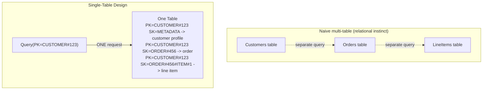

# Module 27 — DynamoDB: Data Modeling, Partition Keys & Single-Table Design

> Domain: DynamoDB | Level: Beginner → Expert | Prerequisite: [[../06-MongoDB/01-Data-Modeling-Query-Patterns]] (embedding vs. referencing, sharding), [[../04-SQL-Server/01-Indexing-Query-Execution-Plans]]

---

## 1. Fundamentals

### What is DynamoDB, and why does its data model demand a fundamentally different design philosophy than every prior module in this course?
DynamoDB is AWS's fully-managed, serverless NoSQL key-value/document database, built for **predictable, single-digit-millisecond latency at any scale** — achieved by a design that **structurally forbids** the flexible ad-hoc querying relational databases (Modules 18-20) and even MongoDB (Module 23) permit. Every query **must** specify a **partition key** (and optionally a sort key) — there is no equivalent of an arbitrary `WHERE` clause scanning across attributes without an index, and a full table `Scan` (reading every item) is an explicitly discouraged, expensive-at-scale escape hatch, not a normal query path.

### Why does this matter?
This isn't a missing feature to work around — it's the **entire point**: DynamoDB trades relational/MongoDB-style query flexibility for a hard guarantee that *every* query, regardless of table size, costs roughly the same (a partition-key lookup is O(1)-ish regardless of whether the table holds a thousand or a billion items). This means **all query patterns must be known and designed for upfront**, at schema-design time — a fundamentally different discipline than "design a normalized schema, then write whatever query you need later," and precisely why DynamoDB data modeling is widely considered one of the hardest adjustments for relationally-trained engineers.

### When does this matter?
Any DynamoDB schema-design decision; the depth matters because a poorly-chosen partition key or access-pattern mismatch discovered *after* a table is in production and populated is expensive and disruptive to fix (directly extending Module 23 §Advanced Q10's "shard key is hard to reverse" lesson to its most extreme form).

### How does it work (30,000-ft view)?
```
Table: Orders
  Partition Key: CustomerId
  Sort Key: OrderId

Query(PartitionKey = "cust-123") -> ALL orders for that customer, efficiently, via ONE partition lookup
Query(PartitionKey = "cust-123", SortKey begins_with "2024-") -> orders from 2024 only, still ONE partition
```

---

## 2. Deep Dive

### 2.1 Partition Keys, Sort Keys, and Physical Data Distribution
DynamoDB physically distributes items across partitions based on a hash of the **partition key** — all items sharing the same partition key value live on the **same physical partition**, and the **sort key** (if defined) determines their order *within* that partition, enabling efficient range queries scoped to one partition key (`begins_with`, `between`, comparison operators on the sort key). This is architecturally identical to Module 23 §2.5's MongoDB sharding and Module 25 §2.5's Redis Cluster hash slots — the same underlying principle (hash-based physical co-location for efficient access) recurring at a third database engine, now as DynamoDB's **foundational**, non-optional design constraint rather than an advanced scaling feature layered on top of a more flexible base model.

### 2.2 Query vs Scan — the Central Performance and Cost Distinction
`Query` operates against a **specific partition key** (efficient, cost proportional to items returned) — the standard, expected access pattern. `Scan` reads **every item in the entire table**, filtering client-side or server-side after the fact — cost proportional to the **entire table's size**, regardless of how few items actually match, and DynamoDB explicitly bills for this full-table read cost even when a filter discards most of it. A `Scan` in a DynamoDB design is the near-exact structural analog of Module 18 §2.2's SQL Server table scan — except DynamoDB's pricing model makes this cost **directly, visibly billed** per request, converting a performance anti-pattern into an immediately obvious cost anti-pattern too.

### 2.3 Single-Table Design — the Signature DynamoDB Modeling Pattern
Because DynamoDB has no efficient joins and per-table provisioned throughput/cost considerations historically favored fewer tables, the community-developed **single-table design** pattern stores **multiple different entity types** (customers, orders, order line items) in **one physical table**, distinguished by carefully-designed partition-key/sort-key **prefixes** (`PK: CUSTOMER#123`, `PK: ORDER#456`, with a `SK` encoding relationship/type information like `SK: METADATA` vs `SK: ORDER#456`) — enabling a **single Query** to retrieve a customer and all their orders together (by querying `PK = CUSTOMER#123`) despite them being logically distinct entity types, something a naive one-table-per-entity-type design (the relationally-instinctive default) cannot achieve without multiple separate queries or an expensive `Scan`.

### 2.4 Global Secondary Indexes (GSI) and Local Secondary Indexes (LSI)
A table's primary key (partition + sort key) supports only queries structured around that specific key — a **Global Secondary Index** (GSI) provides an **alternate** partition/sort key structure over the same data, enabling a genuinely different access pattern (e.g., "find all orders with a given status" when the base table's key is customer-scoped) at the cost of **eventual consistency** (GSI updates propagate asynchronously from the base table) and **additional provisioned/on-demand cost**. A **Local Secondary Index** (LSI) shares the base table's partition key but offers an alternate sort key — strongly-consistent-capable (unlike GSI), but must be defined at table-creation time and cannot be added later, a hard, upfront, difficult-to-reverse design commitment.

### 2.5 Hot Partitions and Adaptive Capacity
A partition key with insufficient cardinality or an access pattern concentrating traffic on one specific key value (e.g., a single, extremely popular customer, or — the classic anti-pattern — using a coarse, low-cardinality attribute like `Status` as the partition key) creates a **hot partition** — all requests for that key value hit the same physical partition, bottlenecked by that partition's own throughput ceiling regardless of the table's overall provisioned capacity. DynamoDB's **adaptive capacity** feature automatically attempts to redistribute throughput toward hot partitions, but this is a mitigation, not a substitute for correct partition-key design upfront — directly the DynamoDB-specific instance of Module 23 §Advanced Q3/Module 25 §2.5's recurring "shard/partition key selection is the highest-stakes, hardest-to-reverse design decision" theme.

## 3. Visual Architecture


## 4. Production Example
**Scenario**: A team modeled a DynamoDB table with `Status` (`Pending`/`Shipped`/`Delivered` — only 3 distinct values) as the partition key, intending to efficiently query "all orders with a given status" — under moderate production load, the table exhibited severe, persistent throttling (`ProvisionedThroughputExceededException`) despite the table's aggregate provisioned capacity being nominally sufficient for the overall request volume. **Investigation**: confirmed via CloudWatch's per-partition metrics that virtually all traffic concentrated on the `Pending` partition (since most orders are queried while still pending, the most operationally relevant status) — with only 3 possible partition-key values, DynamoDB had no way to spread this heavily-skewed load across more than 3 physical partitions, and the `Pending` partition alone was receiving far more than its fair per-partition throughput share. **Fix**: redesigned the schema to use `CustomerId` (or a synthetic, high-cardinality key) as the partition key, with `Status` demoted to a GSI's partition key instead (accepting the GSI's eventual-consistency trade-off for the less latency-critical "all pending orders" reporting query) — distributing the base table's write/read-heavy traffic across a properly high-cardinality key while still supporting the status-based query pattern via the secondary index. **Lesson**: choosing a low-cardinality, access-pattern-skewed attribute as a partition key is the DynamoDB equivalent of MongoDB's monotonically-increasing shard key (Module 23 §2.5) — both create hot-partition/hot-shard concentration that a database's raw aggregate capacity cannot compensate for, since the fundamental constraint is per-partition/per-shard throughput, not table-wide aggregate throughput.

## 5. Best Practices
- Choose partition keys with high cardinality and access patterns that distribute evenly, never a low-cardinality attribute like status/type alone.
- Design the schema around known, upfront access patterns (single-table design where appropriate) rather than a normalized, relationally-instinctive multi-table default.
- Reserve `Scan` for genuinely rare, low-frequency operations (a one-time data export/migration), never a routine application query path.
- Use GSIs for access patterns genuinely different from the base table's key structure, accepting their eventual-consistency trade-off explicitly.

## 6. Anti-patterns
- Using a low-cardinality attribute (status, type, boolean flag) as a partition key, creating hot-partition concentration (§4's incident).
- Defaulting to a naive, relationally-instinctive one-table-per-entity-type design without evaluating single-table design for genuinely related, frequently-co-queried entities.
- Using `Scan` with a client-side filter as a routine query mechanism instead of designing a proper Query-compatible access pattern or GSI.
- Adding an LSI after realizing it's needed post-table-creation (impossible — LSIs must be defined upfront), instead of anticipating this need during initial design.

## 7. Performance Engineering
`Query`'s cost/latency is essentially independent of table size (a partition-key lookup), while `Scan`'s cost scales with the *entire table's* size regardless of match count — this single distinction is the highest-leverage DynamoDB performance concept, directly paralleling Module 18's seek-vs-scan distinction but with DynamoDB's pricing model making the cost difference immediately, financially visible rather than only a latency concern.

## 8. Security
DynamoDB's fine-grained IAM-based access control can restrict access down to specific partition-key values/attributes (via IAM condition keys and `LeadingKeys` policy conditions) — a genuinely distinctive, database-engine-native authorization mechanism worth knowing as an alternative/complement to application-layer authorization (Module 12) for multi-tenant DynamoDB designs specifically.

## 9. Scalability
DynamoDB's entire value proposition **is** predictable scalability — but only when partition-key design correctly distributes load; a poorly-designed key (§4) can make a DynamoDB table scale worse than a well-indexed relational table despite DynamoDB's marketing as "infinitely scalable," precisely because the scalability guarantee is conditional on correct schema design, not automatic regardless of design choices.

---

## 10. Interview Questions

### Basic (10)
1. **Q: What is a partition key?** **A:** The attribute DynamoDB hashes to determine which physical partition an item lives on — every query must specify it.
2. **Q: What is a sort key?** **A:** An optional second key component determining item ordering/range-query capability within a given partition key.
3. **Q: What's the difference between Query and Scan?** **A:** Query operates against a specific partition key efficiently; Scan reads the entire table, filtering afterward, at a cost proportional to total table size.
4. **Q: What is single-table design?** **A:** Storing multiple different entity types in one physical DynamoDB table, distinguished by carefully-designed key prefixes, enabling related entities to be retrieved in one query.
5. **Q: What is a Global Secondary Index (GSI)?** **A:** An alternate partition/sort key structure over the same table's data, enabling a different access pattern, with eventually-consistent updates.
6. **Q: What is a Local Secondary Index (LSI)?** **A:** An alternate sort key sharing the base table's partition key, strongly-consistent-capable, but must be defined at table creation and can't be added later.
7. **Q: What is a hot partition?** **A:** A partition receiving disproportionate traffic due to a low-cardinality or access-pattern-skewed partition key, bottlenecked by that partition's own throughput ceiling.
8. **Q: What does adaptive capacity do?** **A:** Automatically attempts to redistribute throughput toward hot partitions, mitigating (not eliminating) the impact of imperfect key design.
9. **Q: Why is `Scan` discouraged as a routine query mechanism?** **A:** Its cost scales with the entire table's size regardless of how few items match, both slow and expensive at scale.
10. **Q: Must all DynamoDB query patterns be known upfront?** **A:** Effectively yes — the schema/key design must anticipate access patterns, unlike a relational database's flexible ad-hoc querying.

### Intermediate (10)
1. **Q: Why does DynamoDB's design philosophy require knowing access patterns upfront, unlike a relational database?** **A:** Because efficient queries are structurally bound to the partition/sort key design chosen at schema-design time — there's no equivalent of adding an index later to support an unanticipated query pattern with the same ease a relational database or even MongoDB (Module 23) permits, especially for LSIs which cannot be added post-creation at all.
2. **Q: Why is single-table design counter-intuitive for relationally-trained engineers, and what does it actually achieve?** **A:** It deliberately mixes multiple entity types into one physical table (an anti-pattern in relational schema design) specifically to enable retrieving related entities via a single partition-key query, trading normalized-schema clarity for query efficiency — a similar philosophical shift to MongoDB's embedding-over-referencing default (Module 23), just taken further given DynamoDB's stricter query-flexibility constraints.
3. **Q: Why does a GSI have eventual consistency while the base table (and LSI) can be strongly consistent?** **A:** A GSI is a separate, asynchronously-maintained physical structure updated after the base table's write completes — the propagation delay, while typically very short, means a GSI read can briefly reflect a slightly stale view relative to the base table, unlike an LSI which shares the base table's own partition and thus its consistency characteristics.
4. **Q: Why couldn't the team in §4 simply add more provisioned capacity to fix the hot-partition problem?** **A:** DynamoDB's throughput limits apply **per partition**, not just in aggregate at the table level — adding more total provisioned capacity doesn't help a single overloaded partition if the key design concentrates traffic onto that one partition regardless of the table's overall capacity ceiling.
5. **Q: What's the risk of choosing a partition key based on what seems like a natural, meaningful business grouping (like `Status`) without checking cardinality/distribution?** **A:** A business-meaningful grouping can still have very low cardinality or highly skewed access patterns (most orders being actively queried while `Pending`, for instance) — "meaningful to the business" and "well-distributed for DynamoDB's physical partitioning" are independent properties, and only the latter matters for avoiding hot partitions.
6. **Q: Why is `Scan`'s cost model specifically dangerous from a cost-management perspective, beyond just being slow?** **A:** DynamoDB bills for the read capacity consumed by the *entire* scanned dataset, even if a filter discards 99% of it after the fact — a routine `Scan`-based query pattern can silently accumulate substantial, ongoing cost that scales with table growth, not with the actual useful result size.
7. **Q: Why would a team deliberately accept a GSI's eventual consistency for a specific access pattern rather than trying to avoid it?** **A:** For access patterns that are inherently less latency/freshness-critical (a "show all pending orders" operational dashboard, as in §4's fix) the brief propagation delay is an acceptable trade-off for gaining an entirely new, otherwise-unsupported query capability — the alternative (no GSI at all) would mean that access pattern isn't efficiently queryable whatsoever.
8. **Q: How does DynamoDB's `begins_with`/`between` sort-key query capability enable range-query patterns within one partition?** **A:** Since items sharing a partition key are physically co-located and ordered by sort key, a query like `SK begins_with 'ORDER#2024-'` or `SK between 'A' and 'M'` can efficiently retrieve a contiguous range within that one partition without needing to consult any other partition at all.
9. **Q: Why must LSI design be finalized at table-creation time, a stricter constraint than GSIs (which can be added later)?** **A:** An LSI shares the base table's partition structure and requires specific underlying storage co-location guarantees established at table creation — this structural constraint is precisely why LSI design demands more upfront certainty about access patterns than GSIs, which are more flexible, addable structures layered on afterward.
10. **Q: Why might IAM-based fine-grained access control (`LeadingKeys` conditions) be valuable specifically for a multi-tenant, single-table-designed DynamoDB schema?** **A:** With multiple tenants' data co-located in one physical table (differentiated by partition-key prefix, e.g., `TENANT#123#...`), an IAM policy conditioned on the partition key's leading value can enforce that a given caller's credentials only ever access their own tenant's key range — a database-engine-native, code-path-independent authorization layer directly analogous to Module 21 §Advanced Q8's PostgreSQL Row-Level Security discussion, here expressed via IAM policy conditions instead of a `CREATE POLICY` statement.

### Advanced (10)
1. **Q: Diagnose the hot-partition incident (§4) from first principles, and design the schema-review practice preventing recurrence.**
   **A:** Root cause: choosing a partition key based on query-pattern convenience ("I want to query by status") without evaluating cardinality/distribution properties. Safeguard: require an explicit cardinality and access-pattern-distribution analysis for any proposed partition key during schema design — "how many distinct values will this key realistically have, and will traffic distribute evenly across them, or concentrate on a few 'hot' values" as a standing, mandatory design-review question, directly mirroring Module 23 §Advanced Q9's MongoDB shard-key design-review question applied here to DynamoDB's stricter, harder-to-reverse partition-key commitment.
2. **Q: Design a single-table schema for an e-commerce domain (customers, orders, order line items, product catalog) supporting: "get a customer and all their orders," "get an order and its line items," and "get a product by SKU."**
   **A:**
   ```
   PK: CUSTOMER#<id>     SK: METADATA               -> customer profile
   PK: CUSTOMER#<id>     SK: ORDER#<orderId>          -> order summary (embedded, per Module 23's bounded-cardinality logic)
   PK: ORDER#<orderId>   SK: ITEM#<sku>               -> individual line item (separate partition, if order-line-item
                                                          count could be large/queried independently)
   PK: PRODUCT#<sku>     SK: METADATA                -> product catalog entry
   ```
   "Get a customer and all their orders" → `Query(PK = CUSTOMER#<id>)`, one request; "get an order and its line items" → `Query(PK = ORDER#<orderId>)`, one request; "get a product by SKU" → `GetItem(PK = PRODUCT#<sku>, SK = METADATA)` — each named access pattern maps to exactly one efficient key-based operation, precisely the design discipline this module centers on (design the schema *from* the access patterns, not the other way around).
3. **Q: Explain how you would migrate an existing, hot-partition-afflicted DynamoDB table (§4) to a corrected schema without extended downtime, given DynamoDB's lack of an "ALTER TABLE" equivalent for partition-key changes.**
   **A:** Since a table's partition key cannot be changed in place, create an entirely **new** table with the corrected key design; dual-write new data to both the old and new tables during a transition period (the same "expand, don't break" incremental-migration pattern recurring throughout this course); run a backfill process copying/transforming historical data from the old table into the new table's corrected key structure; migrate read paths to the new table once backfill completes and dual-write has run reliably for a validation period; decommission the old table only after full cutover confidence, directly mirroring Module 23 §Advanced Q6's MongoDB schema-migration strategy, now applied to DynamoDB's even-less-flexible (no in-place key change at all) constraint.
4. **Q: Explain a scenario where single-table design's benefits (fewer queries) are outweighed by its costs (schema complexity, harder-to-reason-about access patterns) and a multi-table design is actually preferable.**
   **A:** For entities with **genuinely independent** access patterns, lifecycles, and scaling characteristics (e.g., a completely separate "analytics events" stream unrelated to the customer/order domain, queried by entirely different consumers with different throughput/latency needs) — forcing it into the same single table as the customer/order domain gains no query-consolidation benefit (since it's never queried *together* with customer/order data) while adding schema complexity and potentially concentrating unrelated workloads' capacity needs onto one table's shared throughput considerations; single-table design's value is specifically for entities that **are** frequently co-queried, not a universal "always use one table" rule.
5. **Q: Design a strategy for supporting a genuinely ad-hoc, unanticipated query pattern that emerges after a DynamoDB table is already in production, without a full table redesign.**
   **A:** Add a new GSI (addable post-creation, unlike an LSI) with a partition/sort key structure matching the newly-needed access pattern, backfilling it via DynamoDB Streams (a CDC-like mechanism, directly analogous to Module 22/24's change-stream/logical-decoding discussions) or a one-time batch process populating the new GSI's key attributes on existing items; for a query pattern too irregular/rare to justify a dedicated GSI, consider whether it's genuinely a candidate for a separate analytics pipeline (exporting DynamoDB data to a more query-flexible store like a data warehouse via DynamoDB Streams + a Lambda/ETL pipeline) rather than forcing DynamoDB itself to serve an access pattern its core design isn't suited for.
6. **Q: Explain the interaction between DynamoDB Streams and single-table design for implementing the Outbox pattern (a later dedicated module) natively within DynamoDB.**
   **A:** DynamoDB Streams captures every item-level change (insert/update/delete) as an ordered, consumable event log — a single-table-designed schema can include an "outbox-shaped" item type (`PK: ORDER#<id>, SK: EVENT#<timestamp>`) written atomically alongside the actual business-entity update (DynamoDB supports transactional writes across multiple items via `TransactWriteItems`, giving the same atomicity guarantee a relational transaction would for a business-write-plus-outbox-write pattern), with a DynamoDB Streams consumer (often a Lambda function) reading these outbox-shaped items and publishing them to a downstream message broker — directly the CDC-based Outbox variant referenced in Module 22 §2.4, now expressed via DynamoDB's own native Streams mechanism instead of PostgreSQL's logical decoding.
7. **Q: How would you reason about whether DynamoDB is the right database choice at all for a given new service, versus a relational or MongoDB alternative, based on this module's central themes?**
   **A:** DynamoDB is the right choice when: access patterns are genuinely well-known and stable upfront (or the team is prepared for the migration cost of Advanced Q3/Q5 if they change), the workload benefits from DynamoDB's predictable, scale-independent latency guarantee, and the team is prepared to invest in the specific schema-design discipline (single-table design, partition-key cardinality analysis) this module requires; it's a poor fit for workloads with genuinely ad-hoc, evolving, exploratory query needs (a reporting/analytics use case benefiting from SQL's flexible querying, better served by a relational database or a dedicated analytics store) — the decision should be driven by actual access-pattern predictability and the team's willingness to adopt DynamoDB's specific design discipline, not by DynamoDB's marketing as a generically "highly scalable" database suitable for any workload.
8. **Q: Design a capacity-planning and monitoring strategy specifically to catch a hot-partition risk before it causes production throttling, generalizing §4 into a standing safeguard.**
   **A:** Monitor CloudWatch's per-partition-level metrics (where available) or proxy signals like `ConsumedReadCapacityUnits`/`ConsumedWriteCapacityUnits` skew and `ThrottledRequests`, alerting proactively on any sustained throttling **even if aggregate table-level capacity utilization looks healthy** (exactly the deceptive signal that made §4's incident harder to immediately diagnose) — since aggregate metrics can look fine while one specific partition is severely overloaded, the correct monitoring signal must specifically surface per-partition or throttling-event-based data, not just table-wide utilization percentages.
9. **Q: Explain why `TransactWriteItems` (DynamoDB's multi-item transaction mechanism) has real cost/throughput implications that should inform when it's genuinely necessary versus a single-item write.**
   **A:** `TransactWriteItems` consumes roughly double the write-capacity-unit cost of the equivalent non-transactional writes (accounting for the two-phase commit-style coordination overhead) — exactly the same "transactions have real overhead, reserve them for genuinely necessary cross-entity atomicity" lesson from Module 24 §2.3's MongoDB multi-document transaction discussion, now with DynamoDB's cost model making that overhead directly, quantifiably visible in billing rather than just latency.
10. **Q: As a Principal Engineer, how would you build organizational capability for correct DynamoDB schema design given how counter-intuitive it is relative to both relational and even MongoDB backgrounds?**
    **A:** Require a documented, explicit access-pattern enumeration (directly Advanced Q2's exercise) as a mandatory artifact — listing every anticipated query the schema must support — as the **starting point** of any new DynamoDB table's design review, before any partition/sort key or GSI is chosen, structurally enforcing the "design from access patterns, not from entity relationships" discipline this entire module centers on; pair this with a shared internal reference documenting the organization's own single-table-design patterns and cardinality-analysis checklist (this course's recurring shared-template governance pattern), specifically because DynamoDB's design philosophy is a genuinely larger conceptual leap from prior database experience than any other engine covered in this course, warranting correspondingly more deliberate, structured onboarding support.

---

## 11. Coding Exercises

### Easy — Correct high-cardinality partition key with a GSI for the low-cardinality query need
```
-- Base table: high-cardinality partition key
Table: Orders
  PK: CustomerId
  SK: OrderId

-- GSI for the "all orders with a given status" access pattern (§4's fix)
GSI: StatusIndex
  PK: Status
  SK: OrderDate
-- Base table traffic distributes across many CustomerIds; the status-based query
-- uses the GSI, accepting eventual consistency for this specific, less latency-critical pattern.
```

### Medium — Single-table design query for "customer and all orders" (Advanced Q2)
```csharp
var response = await dynamoDbClient.QueryAsync(new QueryRequest
{
    TableName = "AppTable",
    KeyConditionExpression = "PK = :pk",
    ExpressionAttributeValues = new Dictionary<string, AttributeValue>
    {
        [":pk"] = new AttributeValue { S = $"CUSTOMER#{customerId}" }
    }
});
// Returns BOTH the customer's METADATA item AND every ORDER#... item for this customer,
// in ONE request -- distinguishing item type via the SK prefix in application code afterward.
```

### Hard — DynamoDB Streams-based Outbox consumer (Advanced Q6)
```csharp
public async Task ProcessStreamRecordsAsync(IEnumerable<Record> streamRecords)
{
    foreach (var record in streamRecords)
    {
        if (record.EventName != OperationType.INSERT) continue;

        var newImage = record.Dynamodb.NewImage;
        if (!newImage.TryGetValue("SK", out var sk) || !sk.S.StartsWith("EVENT#")) continue; // only outbox-shaped items

        var eventPayload = newImage["Payload"].S;
        await _messageBroker.PublishAsync(newImage["EventType"].S, eventPayload);
        // No need to separately delete the outbox item here -- DynamoDB Streams already
        // guarantees each record is delivered; a TTL attribute on the item handles eventual cleanup.
    }
}
```

### Expert — Transactional write for atomic business-entity-plus-outbox-item creation
```csharp
await dynamoDbClient.TransactWriteItemsAsync(new TransactWriteItemsRequest
{
    TransactItems = new List<TransactWriteItem>
    {
        new() { Put = new Put {
            TableName = "AppTable",
            Item = new Dictionary<string, AttributeValue> {
                ["PK"] = new() { S = $"ORDER#{orderId}" }, ["SK"] = new() { S = "METADATA" },
                ["Status"] = new() { S = "Placed" }
            }
        }},
        new() { Put = new Put {
            TableName = "AppTable",
            Item = new Dictionary<string, AttributeValue> {
                ["PK"] = new() { S = $"ORDER#{orderId}" }, ["SK"] = new() { S = $"EVENT#{DateTime.UtcNow:O}" },
                ["EventType"] = new() { S = "OrderPlaced" }, ["Payload"] = new() { S = SerializeEvent(orderId) }
            }
        }}
    }
});
```
**Discussion**: Both items commit atomically via `TransactWriteItems` — if either write fails, neither is persisted, guaranteeing the business-entity update and its corresponding outbox event are never inconsistent with each other, exactly the atomicity guarantee Advanced Q6/Advanced Q9's cost discussion centers on, deliberately reserved here for a genuinely necessary cross-item atomicity requirement rather than applied to every ordinary write.

---

## 12–17. System Design / LLD / Debugging / Decision / Case Study / Principal

An e-commerce platform (§4/Advanced Q2) uses single-table design for its customer/order/line-item domain (co-queried entities), a GSI for the less latency-critical status-based reporting access pattern, and DynamoDB Streams for a native Outbox-pattern implementation with `TransactWriteItems` reserved specifically for genuinely necessary cross-item atomicity. The signature production incident (§4) — a low-cardinality `Status` partition key causing severe hot-partition throttling despite adequate aggregate provisioned capacity — is this module's central lesson: DynamoDB's scalability guarantee is conditional on correct partition-key design, not automatic; a poorly-chosen key can scale worse than a well-indexed relational table despite DynamoDB's "infinitely scalable" reputation. Principal-level guidance: require an explicit, documented access-pattern enumeration as the mandatory starting artifact for any new DynamoDB schema, before any key structure is chosen — the single highest-leverage practice preventing this module's entire class of design mistakes.

## 18. Revision
**Key takeaways**: Every DynamoDB query requires a partition key — access patterns must be known and designed for upfront, unlike relational/MongoDB's more flexible ad-hoc querying. Query (partition-key-scoped, efficient) vs. Scan (full-table, expensive, cost-visible in billing) is the central performance/cost distinction. Single-table design co-locates multiple entity types under carefully-designed key prefixes to enable one-query retrieval of related data. GSIs add alternate access patterns with eventual consistency; LSIs share the base partition key with strong consistency but must be defined upfront, unchangeable later. Partition-key cardinality/distribution analysis is the single highest-leverage design practice — a low-cardinality or access-skewed key creates hot partitions no amount of aggregate provisioned capacity can fix.

---

**Next**: This completes the `08-DynamoDB` domain's first module. Continuing autonomously to Module 28 — DynamoDB Consistency Models & Capacity Planning to complete the domain before advancing to `09-OOP`.
