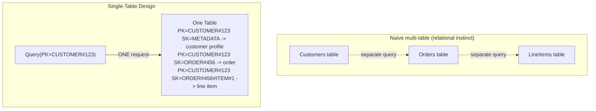
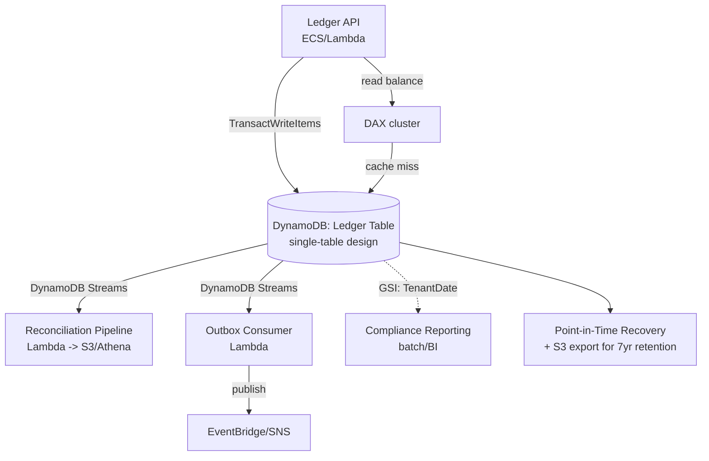
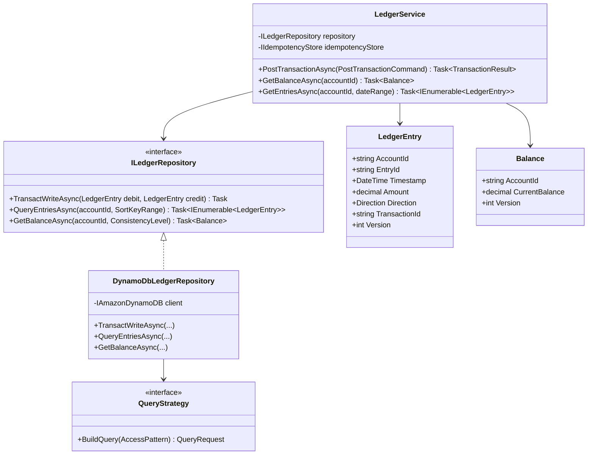
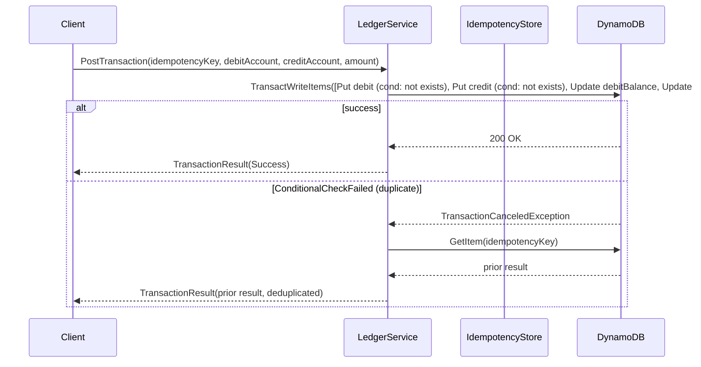

# Module 27 — DynamoDB: Data Modeling, Partition Keys & Single-Table Design

> Domain: DynamoDB | Level: Beginner → Expert | Prerequisite: [[../06-MongoDB/01-Data-Modeling-Query-Patterns]] (embedding vs. referencing, sharding), [[../04-SQL-Server/01-Indexing-Query-Execution-Plans]]

---

## 1. Topic Description

### Definition

DynamoDB data modelling is the discipline of designing a table around a **known, enumerated set of access patterns**, because the only efficient way to retrieve data is by primary key — there is no query planner, no joins, and no index the engine will pick for you. The primary key is either a **partition key** alone (hash) or a **partition key plus sort key** (composite); the partition key determines which physical partition holds an item, and the sort key determines ordering and range access *within* that partition. **Single-table design** follows from this: rather than one table per entity, related entities share a table with generic key attributes and overloaded indexes, so one query can retrieve an item and its related items together.

### Core sub-concepts

- **Partition key and sort key** — hashing to a partition; `Query` within a partition versus `Scan` across the table.
- **Partition mechanics** — how throughput and storage are divided, partition splits, and why key distribution determines achievable throughput.
- **Hot partitions and adaptive capacity** — skewed access concentrating on one partition; write sharding as the structural fix.
- **Item collections** — all items sharing a partition key; the 10 GB limit per collection when an LSI exists.
- **Access-pattern-first design** — enumerating queries before schema; why the table is a *materialisation* of those queries.
- **Single-table design** — entity overloading, generic `PK`/`SK` attributes, entity-type discriminators, and hierarchical sort keys.
- **Secondary indexes** — Global Secondary Index (different partition key, eventually consistent, own capacity) versus Local Secondary Index (same partition key, strongly consistent, created at table creation, 10 GB constraint).
- **Index overloading and sparse indexes** — one GSI serving several access patterns; indexing only items that carry the attribute.
- **Key design patterns** — composite sort keys for hierarchy, inverted index for reverse lookup, adjacency list for many-to-many, time-series keys.
- **Denormalisation and duplication** — copying attributes to avoid a second read, and owning the update fan-out.
- **Item size and limits** — the 400 KB item limit, large-attribute offloading to S3, and attribute-name overhead.
- **Write patterns** — `PutItem` versus `UpdateItem`, condition expressions for optimistic concurrency, atomic counters.
- **Batch and transaction operations** — `BatchGetItem`/`BatchWriteItem` partial failures; `TransactWriteItems` cost and limits.
- **Filter expressions** — applied *after* read, so they cost capacity for items they discard.
- **Pagination** — `LastEvaluatedKey`, page size in bytes rather than items, and stable iteration.
- **TTL** — background expiry, its delay, and what it does not guarantee.

### Where it fits

The table design *is* the query plan: whereas a relational database lets you add an index later to serve a new query, DynamoDB requires the access pattern to be expressible against an existing key or index, so modelling decisions are far less reversible. It sits directly beneath the application's data-access layer and above the storage and capacity model covered in the sibling subtopic — key distribution is what determines whether provisioned or on-demand throughput is actually achievable. Upward, it constrains API design, because an endpoint whose filter has no supporting key will either scan or need a new index.

### Why it matters at scale

Throughput in DynamoDB is per-partition, not per-table, so a poorly distributed partition key means the table's headline capacity is unreachable: a workload concentrated on one key throttles while the table as a whole is nearly idle. That is the hot-partition problem, and it appears exactly when a single entity becomes popular — the celebrity user, the largest tenant, today's date as a partition key. The second scale failure is `Scan`: it reads the entire table and consumes capacity proportional to size, so a query that worked at ten thousand items becomes an outage at ten million while looking identical in code. Both are modelling problems whose remediation at scale means rewriting keys across the whole dataset, which is why up-front design carries so much weight here.

### Common pitfalls / anti-patterns

- **Designing the table before enumerating access patterns** — DynamoDB cannot compensate later; a key that does not match the queries leaves you scanning or adding indexes indefinitely.
- **A low-cardinality or skewed partition key** — status, country, or today's date concentrates traffic on one partition, throttling despite ample table capacity.
- **Using `Scan` in a request path** — cost and latency grow with table size, and a filter expression does not help because filtering happens *after* the read consumes capacity.
- **Relational modelling: one table per entity plus application-side joins** — turns one logical read into several round trips, which is exactly the pattern single-table design exists to avoid.
- **Treating a filter expression as an index** — it reduces the response payload but not the capacity consumed, so a query reading 10,000 items and returning 3 is billed for 10,000.
- **Unbounded item growth** — appending to a list attribute until the 400 KB item limit is hit; writes then fail outright, and every update rewrites the whole item long before that.
- **Adding an LSI without understanding its constraints** — it can only be created with the table, and its presence caps each item collection at 10 GB, which is a wall you cannot move without a migration.
- **Ignoring GSI eventual consistency** — reading your own write through a GSI can miss it, producing intermittent bugs that never reproduce in low-traffic testing.
- **Using `TransactWriteItems` routinely** — it costs twice the capacity and has item limits; frequent need for it usually means the item boundaries are wrong.

---

## 2. Beginner (10 Q&A)

**Q1. What does the partition key actually determine?**
**A:** It is hashed to select the physical partition storing the item, so it determines *where* data lives and therefore how load is distributed. Since throughput is allocated per partition, the partition key also determines the maximum throughput any single value can achieve — concentrating traffic on one key means throttling regardless of how much capacity the table has in total. It is also the only way to `Query` efficiently: every query must specify an exact partition key value.
*Follow-up: What is the per-partition throughput ceiling, and what happens when you exceed it?*

**Q2. What is the difference between `Query` and `Scan`, and when is `Scan` acceptable?**
**A:** `Query` targets a single partition key value and optionally a sort key range, so its cost is proportional to the matching items. `Scan` reads every item in the table and its cost grows with table size. `Scan` is acceptable for genuinely full-table work — an export, a one-off backfill, an analytics job — ideally with parallel segments and rate limiting so it does not starve production traffic. It is never acceptable in a request path, because it converts a constant-time operation into one that degrades as the business grows.
*Follow-up: You need to find all orders with status "PENDING". How do you do that without a scan?*

**Q3. Explain GSI versus LSI.**
**A:** A Global Secondary Index has its own partition and sort key, effectively giving a different view of the data; it has its own capacity, is eventually consistent, and can be created at any time. A Local Secondary Index keeps the table's partition key and only changes the sort key; it shares the table's capacity, supports strongly consistent reads, and must be created with the table. The LSI's hidden cost is that its presence caps each item collection at 10 GB — a hard limit you cannot raise later without rebuilding the table.
*Follow-up: You need strong consistency on an alternate access pattern. GSI or LSI, and what do you give up?*

**Q4. What is single-table design and why does it exist?**
**A:** Putting multiple entity types in one table with generic key attributes, so items that are read together share a partition key and can be retrieved in one `Query`. It exists because DynamoDB has no joins: with one table per entity, retrieving an order and its line items means multiple round trips, whereas a shared partition key returns both in a single request. The cost is a schema that is unreadable without documentation and much harder to query ad hoc, so it is a deliberate trade of human clarity for round-trip efficiency.
*Follow-up: When would you deliberately not use single-table design?*

**Q5. What is a hot partition and how do you fix it?**
**A:** A partition receiving disproportionate traffic because many requests target the same partition key value — a popular product, the largest tenant, or `today` as a date key. Since throughput is divided across partitions, that one partition throttles while the rest of the table is idle. Adaptive capacity mitigates moderate skew automatically, but severe skew needs a structural fix: **write sharding**, appending a suffix to the partition key to spread writes across N logical keys, then reading all N and merging. The trade is read amplification in exchange for write distribution.
*Follow-up: How do you choose the shard count, and what happens when you need to change it?*

**Q6. Why does a filter expression not save you money?**
**A:** Because filtering is applied *after* items are read from the table. The capacity consumed is based on the items examined, not the items returned, so a query that reads 10,000 items and filters down to 3 is billed for all 10,000 and pays the latency of reading them. Filters are useful for reducing response payload size and for convenience, not for efficiency. Anything that needs to be selective must be expressed in the key condition or served by an index.
*Follow-up: How would you turn a common filter into an index-supported access pattern cheaply?*

**Q7. What is the 400 KB item limit and why does it shape design?**
**A:** No single item may exceed 400 KB including attribute names. It shapes design because it rules out embedding unbounded collections in an item — a list that grows with activity will eventually fail writes — and because every update rewrites the entire item, so large items are expensive to modify long before they hit the limit. The standard remedies are splitting a growing collection into separate items sharing a partition key, or storing large blobs in S3 with a pointer in the item.
*Follow-up: An item is 300 KB and updated frequently. What's wrong even though it's under the limit?*

**Q8. How do you achieve optimistic concurrency in DynamoDB?**
**A:** With a condition expression: include a version attribute in the item, and on update assert that the stored version matches what you read, incrementing it as part of the write. If another writer changed it first the condition fails, the write is rejected, and the application re-reads and retries. This is the correct pattern for read-modify-write, and it is cheap because the condition is evaluated server-side. Without it, concurrent updates silently overwrite one another.
*Follow-up: For a counter, would you use a version check or an atomic `ADD`? Why?*

**Q9. What consistency guarantees does DynamoDB offer?**
**A:** Reads on the base table are eventually consistent by default and can be requested as strongly consistent, which costs twice the read capacity and cannot cross regions. Reads from a GSI are **always eventually consistent** — there is no strongly consistent option — because the index is updated asynchronously after the base table write. That GSI property is the one that surprises people: writing an item and immediately querying the GSI can legitimately return nothing.
*Follow-up: How would you design around a flow that writes then immediately reads via a GSI?*

**Q10. How does pagination work and what's the common mistake?**
**A:** A response includes `LastEvaluatedKey` when more results exist, which you pass as `ExclusiveStartKey` on the next request. The mistake is assuming that an empty result page means there is no more data: DynamoDB limits a page by *bytes read* (1 MB), not by items returned, so with a filter expression you can legitimately get zero items back and still have more pages. Code that stops on an empty page silently truncates results.
*Follow-up: How does that interact with a `Limit` parameter?*

---

## 3. Intermediate (10 Q&A)

**Q1. Walk me through designing a table for a known set of access patterns.**
**A:** I would write every access pattern down first — entity, filter, sort order, expected cardinality and frequency — because the table is a materialisation of that list and anything omitted becomes an expensive retrofit. Then group patterns that share an entity relationship into item collections with a shared partition key, choose a sort key that supports the required ordering and range queries, and cover the remaining patterns with GSIs, overloading them where possible so several patterns share one index. Finally I would validate the partition key's cardinality and access distribution, since a design that satisfies every query but concentrates traffic on one key will throttle.
*Follow-up: A new access pattern appears after launch that no key supports. What are your options?*

**Q2. How do you model a many-to-many relationship?**
**A:** With an adjacency list: both sides of the relationship are stored as items in the same table with keys arranged so a `Query` on either side returns the related items — typically the partition key is one entity and the sort key encodes the related entity, with an inverted GSI (sort key as partition key) serving the reverse direction. That gives both directions in one round trip each without joins. The cost is duplication and the responsibility for keeping both directions consistent, which is why the write is usually a transaction or an idempotent pair of writes.
*Follow-up: The relationship carries attributes that change. Where do they live, and what does an update cost?*

**Q3. How do you decide between denormalising an attribute and doing a second read?**
**A:** By read-to-write ratio and staleness tolerance. Denormalise when the attribute is read far more often than it changes and the second read is on the critical path — the classic case of a user's display name on their posts. What you take on is the fan-out update: when the source changes, every copy must be updated, which may be thousands of items and needs to be an asynchronous, resumable process. Sometimes the honest answer is that the copy should *not* be updated at all, because it is a point-in-time record — the price on an order should not follow the current price.
*Follow-up: The fan-out is 50,000 items. How do you execute that update safely?*

**Q4. When is write sharding the right answer, and what does it cost?**
**A:** When a single partition key value legitimately receives more traffic than one partition can serve — a global counter, a high-volume time-series key, a dominant tenant. You append a shard suffix to spread writes across N keys, and reads then query all N and merge. The costs are real: reads become N requests instead of one, ordering across shards must be handled by the application, and changing N later requires migrating data because the hashing changes. So I would size N from the required throughput with headroom and treat it as a semi-permanent decision.
*Follow-up: You need the results in strict time order across shards. How do you handle that?*

**Q5. How do you handle a time-series workload?**
**A:** Avoid the naive design where the partition key is the date, because all of today's traffic lands on one partition — the textbook hot key. Better shapes are a partition key combining the entity with a time bucket, so load spreads across entities and buckets, or a separate table per time period so old tables can be deleted outright rather than expiring items individually. Table-per-period is particularly attractive because deletion is free, whereas TTL expiry consumes no capacity but is delayed and unpredictable, and mass deletes consume write capacity.
*Follow-up: Compliance requires deleting data exactly 90 days after creation. Does TTL satisfy that?*

**Q6. What are the trade-offs of `TransactWriteItems`?**
**A:** It gives all-or-nothing semantics across up to 100 items, with condition checks, which is genuinely valuable for invariants spanning items — reserving inventory while creating an order. The costs are that it consumes twice the write capacity, has item and size limits, adds latency, and can fail with a transaction conflict under contention that the application must retry. Because it is comparatively expensive, frequent use is a signal that the item boundaries are drawn wrongly: data that must change together should usually be in one item, where atomicity is free.
*Follow-up: Your transactions are conflicting under load. What do you change?*

**Q7. How do you diagnose throttling when the table has plenty of capacity?**
**A:** Throttling with headroom means the capacity is not reachable, which is almost always key distribution: traffic concentrated on one partition key, or on a GSI's partition key, which has its own capacity and its own hot-partition behaviour. CloudWatch's throttled-request metrics plus contributor insights identify the specific keys. The other candidate is a GSI whose write capacity is lower than the base table's, since every base write that touches indexed attributes also writes the index — and a throttled GSI back-pressures the base table's writes, which surprises people.
*Follow-up: A throttled GSI is blocking base table writes. What are your immediate options?*

**Q8. How do you handle partial failures in batch operations?**
**A:** `BatchWriteItem` and `BatchGetItem` return `UnprocessedItems` or `UnprocessedKeys` rather than failing outright, so the caller must retry those specifically, with exponential backoff — code that ignores the response and assumes success loses writes silently. They are also not atomic: some items succeed and others do not, which is the difference from a transaction. I would wrap batch operations in a helper that handles the retry loop correctly once, because this is a detail every team gets wrong independently at least once.
*Follow-up: Your retries keep returning unprocessed items. What does that indicate?*

**Q9. How do you evolve a DynamoDB schema?**
**A:** Additively wherever possible, since there is no schema to alter: new attributes can simply appear, and readers must tolerate their absence on older items. Where key structure must change, it is a data migration — write to both shapes, backfill in the background at a controlled rate, verify, then switch reads and remove the old path. A new GSI can be added online and backfills automatically, which covers many new access patterns without touching item structure. I would include an entity-version attribute from the start so readers can branch on shape, because retrofitting that later is much harder.
*Follow-up: You need to change the partition key of an existing 2 TB table. Walk me through it.*

**Q10. How do you keep DynamoDB costs predictable as usage grows?**
**A:** Understand what drives them: capacity units consumed (which is a function of item size and read consistency, not just request count), storage, GSI writes, and cross-region replication. The recurring surprises are strongly consistent reads costing double, GSIs multiplying write cost by the number of indexes touched, and scans consuming capacity proportional to table size. Keeping item sizes small, minimising the number of GSIs, projecting only needed attributes into indexes, and eliminating scans are the levers with real leverage. On-demand versus provisioned is a separate decision driven by predictability of load.
*Follow-up: A table's cost tripled with no traffic increase. What would you check first?*

---

## 4. Expert / Architect (10 Q&A)

**Q1. When is DynamoDB the right choice, and when is it the wrong one?**
**A:** Right when access patterns are known and stable, scale requirements are high, and the operational simplicity of a fully-managed store with predictable single-digit-millisecond latency is valuable — it genuinely removes a category of operational work. Wrong when queries are ad hoc or analytical, when relationships are traversed in unpredictable directions, or when the business is still discovering its data model, because the cost of a wrong key decision is a full migration rather than an index. I would frame it as a trade of query-time flexibility for scale and operability, and be explicit that the trade is made at design time and is expensive to revisit.
*Follow-up: The team is early-stage and the model is uncertain, but they expect huge scale later. What do you recommend?*

**Q2. How do you decide between single-table and multi-table design in practice?**
**A:** Single-table wins when entities are genuinely related and read together, because it collapses round trips — that is its entire justification. It costs readability, makes ad hoc investigation hard, complicates IAM scoping to a per-entity granularity, and couples unrelated entities' capacity and throttling. So for entities that are never read together, separate tables are clearer, independently scalable and easier to secure, and the round-trip argument does not apply. My position is that single-table design is a technique to apply to related item collections, not a doctrine to apply to a whole system, and treating it as the latter produces tables nobody can reason about.
*Follow-up: How do you handle the operational cost of a single-table design when debugging production data?*

**Q3. How would you design for multi-tenancy with extreme tenant size skew?**
**A:** Tenant as the partition key prefix gives isolation and locality, but a dominant tenant becomes a hot partition, so the design must anticipate sharding within a tenant — a shard suffix applied only to large tenants, with the shard count stored in tenant metadata so reads know how many to query. Beyond a threshold, the largest tenants belong in their own table so their capacity, throttling and cost are isolated. I would set that threshold in advance and treat promotion to a dedicated table as a routine operational event, because discovering it during an incident means migrating data under pressure.
*Follow-up: How would you migrate a large tenant to a dedicated table with no downtime?*

**Q4. How do you approach global tables and multi-region writes?**
**A:** Global tables give multi-region active-active replication with last-writer-wins conflict resolution, which is the critical constraint: concurrent writes to the same item in two regions resolve by timestamp and one is silently discarded. That is acceptable for genuinely partitioned data — each region owning its own tenants or users — and unacceptable for a shared counter or any item legitimately written from multiple regions. So the architectural work is partitioning write ownership by region so conflicts cannot occur, rather than relying on the conflict resolution. I would also account for replication lag in any read-after-write flow that crosses regions.
*Follow-up: A regulatory requirement says EU data must not leave the EU. How does that interact with global tables?*

**Q5. How do you use DynamoDB Streams well, and what are the risks?**
**A:** Streams give an ordered, per-partition-key change log with 24-hour retention, which is the natural mechanism for derived data, search indexing, event publication and denormalisation fan-out. The risks are that ordering is only guaranteed within a partition key (not globally), retention is short so a consumer outage beyond 24 hours loses changes permanently, and consumers become coupled to your item shape — the same coupling problem as any database CDC. My preferred pattern is to publish deliberately-designed events from the stream consumer rather than exposing raw item changes to downstream systems.
*Follow-up: Your stream consumer is down for 30 hours. What have you lost and how do you recover?*

**Q6. On-demand versus provisioned capacity — how do you decide at an estate level?**
**A:** On-demand for unpredictable, spiky or new workloads where the operational cost of getting provisioning wrong exceeds the price premium, and for anything where throttling would be a business incident. Provisioned with auto-scaling for steady, predictable, high-volume workloads where the unit cost saving is material — and reserved capacity on top where the baseline is genuinely committed. The decision should be revisited as workloads mature, since teams frequently start on-demand and never revisit it. I would also warn that auto-scaling reacts on a timescale of minutes, so it does not protect against sudden spikes; on-demand does.
*Follow-up: A provisioned table with auto-scaling throttles during a flash sale. Why, and what do you do?*

**Q7. How do you handle analytical and reporting requirements against DynamoDB?**
**A:** Not in DynamoDB. It has no aggregation, no ad hoc query capability, and scans consume production capacity — so the answer is to export: streams into an analytical store, point-in-time exports to S3 for querying with Athena, or a purpose-built pipeline. Doing analytics against the operational table is how a reporting request causes a production throttling incident. I would set this expectation early in the design, because teams choosing DynamoDB for its operational properties frequently do not consider that the reporting story requires a second system, and discovering that late is an unplanned project.
*Follow-up: A stakeholder wants a live dashboard aggregating across all items. What do you build?*

**Q8. How do you migrate an existing relational workload to DynamoDB?**
**A:** By starting from the access patterns rather than the schema — a table-by-table translation produces a relational model in a key-value store, which is the worst of both. I would enumerate the queries the application actually issues, design keys and indexes for them, and identify the patterns DynamoDB cannot serve, because those determine whether the migration is viable at all. Then dual-write with a comparison period, backfill historically, and cut reads over gradually. The honest risk to surface up front is that some ad hoc query capability will be lost permanently, and stakeholders need to agree to that before the work starts rather than after.
*Follow-up: You find three genuinely ad hoc reporting queries. Does that kill the migration?*

**Q9. How do you govern DynamoDB usage across many teams?**
**A:** Through design review at table creation, because that is the only moment when the decisions are cheap — key design, index count, item size expectations and capacity mode. After that, monitoring on throttling, hot keys via contributor insights, consumed capacity against provisioned, and cost per table with an owner. I would publish a small set of reviewed patterns (adjacency list, write sharding, sparse index) so teams copy something correct rather than inventing. The organisational point is that DynamoDB rewards up-front design more than almost any other store, so the review must happen before the table exists, not at code review.
*Follow-up: A team is already in production with a bad key design. How do you prioritise the remediation?*

**Q10. What separates an excellent answer from an adequate one when someone designs a DynamoDB table?**
**A:** An adequate answer produces a key schema. An excellent one starts by enumerating and prioritising access patterns, then justifies the partition key on both *access* and *distribution* grounds, checks for hot-key risk explicitly, states what is bounded within an item collection, chooses indexes deliberately with attention to projection and write cost, names the consistency implications of using a GSI, and says which future access patterns the design forecloses and what the remediation would cost. It also says what it would monitor to know the design is holding. The distinguishing quality is treating the key as a distribution decision as much as a retrieval one, because that is what determines whether the table works at scale.
*Follow-up: Given that framing, what would you insist on knowing before designing a key?*

---

## 5. Reference Material

> Retained from the original module: deep-dive internals, diagrams, production examples, exercises, system/low-level design, debugging walkthroughs and the Principal Engineer perspective.

### 1. Fundamentals

#### What is DynamoDB, and why does its data model demand a fundamentally different design philosophy than every prior module in this course?
DynamoDB is AWS's fully-managed, serverless NoSQL key-value/document database, built for **predictable, single-digit-millisecond latency at any scale** — achieved by a design that **structurally forbids** the flexible ad-hoc querying relational databases (Modules 18-20) and even MongoDB permit. Every query **must** specify a **partition key** (and optionally a sort key) — there is no equivalent of an arbitrary `WHERE` clause scanning across attributes without an index, and a full table `Scan` (reading every item) is an explicitly discouraged, expensive-at-scale escape hatch, not a normal query path.

#### Why does this matter?
This isn't a missing feature to work around — it's the **entire point**: DynamoDB trades relational/MongoDB-style query flexibility for a hard guarantee that *every* query, regardless of table size, costs roughly the same (a partition-key lookup is O(1)-ish regardless of whether the table holds a thousand or a billion items). This means **all query patterns must be known and designed for upfront**, at schema-design time — a fundamentally different discipline than "design a normalized schema, then write whatever query you need later," and precisely why DynamoDB data modeling is widely considered one of the hardest adjustments for relationally-trained engineers.

#### When does this matter?
Any DynamoDB schema-design decision; the depth matters because a poorly-chosen partition key or access-pattern mismatch discovered *after* a table is in production and populated is expensive and disruptive to fix (directly extending §Advanced Q10's "shard key is hard to reverse" lesson to its most extreme form).

#### How does it work (30,000-ft view)?
```
Table: Orders
 Partition Key: CustomerId
 Sort Key: OrderId

Query(PartitionKey = "cust-123") -> ALL orders for that customer, efficiently, via ONE partition lookup
Query(PartitionKey = "cust-123", SortKey begins_with "2024-") -> orders from 2024 only, still ONE partition
```

### 2. Deep Dive

#### 2.1 Partition Keys, Sort Keys, and Physical Data Distribution
DynamoDB physically distributes items across partitions based on a hash of the **partition key** — all items sharing the same partition key value live on the **same physical partition**, and the **sort key** (if defined) determines their order *within* that partition, enabling efficient range queries scoped to one partition key (`begins_with`, `between`, comparison operators on the sort key). This is architecturally identical to the MongoDB sharding and the Redis Cluster hash slots — the same underlying principle (hash-based physical co-location for efficient access) recurring at a third database engine, now as DynamoDB's **foundational**, non-optional design constraint rather than an advanced scaling feature layered on top of a more flexible base model.

#### 2.2 Query vs Scan — the Central Performance and Cost Distinction
`Query` operates against a **specific partition key** (efficient, cost proportional to items returned) — the standard, expected access pattern. `Scan` reads **every item in the entire table**, filtering client-side or server-side after the fact — cost proportional to the **entire table's size**, regardless of how few items actually match, and DynamoDB explicitly bills for this full-table read cost even when a filter discards most of it. A `Scan` in a DynamoDB design is the near-exact structural analog of the SQL Server table scan — except DynamoDB's pricing model makes this cost **directly, visibly billed** per request, converting a performance anti-pattern into an immediately obvious cost anti-pattern too.

#### 2.3 Single-Table Design — the Signature DynamoDB Modeling Pattern
Because DynamoDB has no efficient joins and per-table provisioned throughput/cost considerations historically favored fewer tables, the community-developed **single-table design** pattern stores **multiple different entity types** (customers, orders, order line items) in **one physical table**, distinguished by carefully-designed partition-key/sort-key **prefixes** (`PK: CUSTOMER#123`, `PK: ORDER#456`, with a `SK` encoding relationship/type information like `SK: METADATA` vs `SK: ORDER#456`) — enabling a **single Query** to retrieve a customer and all their orders together (by querying `PK = CUSTOMER#123`) despite them being logically distinct entity types, something a naive one-table-per-entity-type design (the relationally-instinctive default) cannot achieve without multiple separate queries or an expensive `Scan`.

#### 2.4 Global Secondary Indexes (GSI) and Local Secondary Indexes (LSI)
A table's primary key (partition + sort key) supports only queries structured around that specific key — a **Global Secondary Index** (GSI) provides an **alternate** partition/sort key structure over the same data, enabling a genuinely different access pattern (e.g., "find all orders with a given status" when the base table's key is customer-scoped) at the cost of **eventual consistency** (GSI updates propagate asynchronously from the base table) and **additional provisioned/on-demand cost**. A **Local Secondary Index** (LSI) shares the base table's partition key but offers an alternate sort key — strongly-consistent-capable (unlike GSI), but must be defined at table-creation time and cannot be added later, a hard, upfront, difficult-to-reverse design commitment.

#### 2.5 Hot Partitions and Adaptive Capacity
A partition key with insufficient cardinality or an access pattern concentrating traffic on one specific key value (e.g., a single, extremely popular customer, or — the classic anti-pattern — using a coarse, low-cardinality attribute like `Status` as the partition key) creates a **hot partition** — all requests for that key value hit the same physical partition, bottlenecked by that partition's own throughput ceiling regardless of the table's overall provisioned capacity. DynamoDB's **adaptive capacity** feature automatically attempts to redistribute throughput toward hot partitions, but this is a mitigation, not a substitute for correct partition-key design upfront — directly the DynamoDB-specific instance §Advanced Q3/the recurring "shard/partition key selection is the highest-stakes, hardest-to-reverse design decision" theme.

### 3. Visual Architecture

```mermaid
graph TB
 subgraph "Naive multi-table (relational instinct)"
 T1[Customers table] -.->|separate query| T2[Orders table]
 T2 -.->|separate query| T3[LineItems table]
 end
 subgraph "Single-Table Design"
 ST["One Table<br/>PK=CUSTOMER#123 SK=METADATA -> customer profile<br/>PK=CUSTOMER#123 SK=ORDER#456 -> order<br/>PK=CUSTOMER#123 SK=ORDER#456#ITEM#1 -> line item"]
 Q["Query(PK=CUSTOMER#123)"] -->|ONE request| ST
 end
```

### 4. Production Example
**Scenario**: A team modeled a DynamoDB table with `Status` (`Pending`/`Shipped`/`Delivered` — only 3 distinct values) as the partition key, intending to efficiently query "all orders with a given status" — under moderate production load, the table exhibited severe, persistent throttling (`ProvisionedThroughputExceededException`) despite the table's aggregate provisioned capacity being nominally sufficient for the overall request volume. **Investigation**: confirmed via CloudWatch's per-partition metrics that virtually all traffic concentrated on the `Pending` partition (since most orders are queried while still pending, the most operationally relevant status) — with only 3 possible partition-key values, DynamoDB had no way to spread this heavily-skewed load across more than 3 physical partitions, and the `Pending` partition alone was receiving far more than its fair per-partition throughput share. **Fix**: redesigned the schema to use `CustomerId` (or a synthetic, high-cardinality key) as the partition key, with `Status` demoted to a GSI's partition key instead (accepting the GSI's eventual-consistency trade-off for the less latency-critical "all pending orders" reporting query) — distributing the base table's write/read-heavy traffic across a properly high-cardinality key while still supporting the status-based query pattern via the secondary index. **Lesson**: choosing a low-cardinality, access-pattern-skewed attribute as a partition key is the DynamoDB equivalent of MongoDB's monotonically-increasing shard key — both create hot-partition/hot-shard concentration that a database's raw aggregate capacity cannot compensate for, since the fundamental constraint is per-partition/per-shard throughput, not table-wide aggregate throughput.

### 11. Coding Exercises

#### Easy — Correct high-cardinality partition key with a GSI for the low-cardinality query need
```
-- Base table: high-cardinality partition key
Table: Orders
 PK: CustomerId
 SK: OrderId

-- GSI for the "all orders with a given status" access pattern (the fix)
GSI: StatusIndex
 PK: Status
 SK: OrderDate
-- Base table traffic distributes across many CustomerIds; the status-based query
-- uses the GSI, accepting eventual consistency for this specific, less latency-critical pattern.
```

#### Medium — Single-table design query for "customer and all orders" (Advanced Q2)
```csharp
var response = await dynamoDbClient.QueryAsync(new QueryRequest
    {
        TableName = "AppTable",
            KeyConditionExpression = "PK =:pk",
            ExpressionAttributeValues = new Dictionary<string, AttributeValue>
        {
            [":pk"] = new AttributeValue { S = $"CUSTOMER#{customerId}" }
        }
});
// Returns BOTH the customer's METADATA item AND every ORDER#... item for this customer
// in ONE request -- distinguishing item type via the SK prefix in application code afterward.
```

#### Hard — DynamoDB Streams-based Outbox consumer (Advanced Q6)
```csharp
public async Task ProcessStreamRecordsAsync(IEnumerable<Record> streamRecords)
{
    foreach (var record in streamRecords)
    {
        if (record.EventName!= OperationType.INSERT) continue;

        var newImage = record.Dynamodb.NewImage;
        if (!newImage.TryGetValue("SK", out var sk) ||!sk.S.StartsWith("EVENT#")) continue; // only outbox-shaped items

        var eventPayload = newImage["Payload"].S;
        await _messageBroker.PublishAsync(newImage["EventType"].S, eventPayload);
        // No need to separately delete the outbox item here -- DynamoDB Streams already
        // guarantees each record is delivered; a TTL attribute on the item handles eventual cleanup.
    }
}
```

#### Expert — Transactional write for atomic business-entity-plus-outbox-item creation
```csharp
await dynamoDbClient.TransactWriteItemsAsync(new TransactWriteItemsRequest
    {
        TransactItems = new List<TransactWriteItem>
        {
            new { Put = new Put {
                    TableName = "AppTable",
                        Item = new Dictionary<string, AttributeValue> {
                        ["PK"] = new { S = $"ORDER#{orderId}" }, ["SK"] = new { S = "METADATA" },
                            ["Status"] = new { S = "Placed" }
                    }
            }},
            new { Put = new Put {
                    TableName = "AppTable",
                        Item = new Dictionary<string, AttributeValue> {
                        ["PK"] = new { S = $"ORDER#{orderId}" }, ["SK"] = new { S = $"EVENT#{DateTime.UtcNow:O}" },
                            ["EventType"] = new { S = "OrderPlaced" }, ["Payload"] = new { S = SerializeEvent(orderId) }
                    }
            }}
        }
});
```
**Discussion**: Both items commit atomically via `TransactWriteItems` — if either write fails, neither is persisted, guaranteeing the business-entity update and its corresponding outbox event are never inconsistent with each other, exactly the atomicity guarantee Advanced Q6/Advanced Q9's cost discussion centers on, deliberately reserved here for a genuinely necessary cross-item atomicity requirement rather than applied to every ordinary write.

### 12. System Design

#### Scenario: A Multi-Tenant Payment Ledger & Account-Balance Service

**Requirements**

*Functional:* record every account debit/credit as an immutable ledger entry; maintain a real-time queryable current balance per account; support "all entries for account X in date range Y"; support multi-tenant isolation (each tenant is a bank/fintech client, each with many end-customer accounts); support double-entry atomicity (§Expert Q7); support point-in-time balance reconstruction for audit (§Expert Q4).

*Non-functional:* single-digit-millisecond p99 read latency on balance lookups; no data loss (durability); strict tenant isolation (data-access and, for large tenants, throughput); predictable cost at scale (hundreds of tenants, tens of millions of accounts); auditable — every write traceable to a caller and correlation ID; regulatory retention of 7+ years.

**Back-of-the-envelope:** 200 tenants, average 50,000 accounts/tenant = 10M accounts. Assume 5 ledger entries/account/day average (with a 200:1 skew for the largest institutional tenant, §Expert Q5) → 50M entries/day ≈ 580 writes/sec average, with observed peaks (month-end settlement) of 10x average ≈ 5,800 writes/sec. At ~1KB/entry this is a write-heavy, moderate-throughput workload — well within DynamoDB's single-partition ceiling *if* spread across a sufficiently high-cardinality key, but the 200:1 tenant skew and month-end burst are exactly the two risk factors (§Expert Q5, §9.2) this design must explicitly account for, not the raw throughput number, which alone is unremarkable.

**Architecture**


```mermaid
graph TB
    API[Ledger API<br/>ECS/Lambda] -->|TransactWriteItems| Ledger[(DynamoDB: Ledger Table<br/>single-table design)]
    Ledger -->|DynamoDB Streams| Recon[Reconciliation Pipeline<br/>Lambda -> S3/Athena]
    Ledger -->|DynamoDB Streams| Outbox[Outbox Consumer<br/>Lambda] -->|publish| Bus[EventBridge/SNS]
    Ledger -.GSI: TenantDate.-> Reporting[Compliance Reporting<br/>batch/BI]
    API -->|read balance| DAX[DAX cluster]
    DAX -->|cache miss| Ledger
    Ledger --> Backup[Point-in-Time Recovery<br/>+ S3 export for 7yr retention]
```

**Components:** the **Ledger API** is the only write path, enforcing idempotency and the debit/credit pairing (§Expert Q7); the **Ledger table** is single-table-designed (`PK: ACCOUNT#<id>`, `SK: ENTRY#<ts>#<id>` for entries, `SK: METADATA` for the balance projection); a **TenantDate GSI** (`PK: TENANT#<id>#<date>`) supports the tenant-scoped compliance-reporting access pattern without burdening the account-scoped hot path; **DynamoDB Streams** feeds both the reconciliation pipeline (§Expert Q9) and an Outbox-pattern event publisher (§Advanced Q6); **DAX** accelerates the read-heavy balance-lookup path, with strongly-consistent reads bypassing it for the read-after-write cases; **Point-in-Time Recovery + S3 export** satisfies the 7-year retention requirement without keeping cold historical data in the hot table indefinitely.

**Database selection rationale:** DynamoDB is chosen over a relational alternative specifically because the access patterns are fully known upfront and stable (account-scoped entry writes/reads, tenant-scoped reporting), the predictable-latency guarantee matters for a customer-facing balance-check API, and the double-entry atomicity requirement is satisfiable via `TransactWriteItems` without needing arbitrary cross-entity joins — per §Advanced Q7's decision framework. A relational database remains the better choice if the reporting/compliance query needs were genuinely ad-hoc and evolving rather than the few well-defined patterns above.

**Caching:** DAX in front of balance reads only (§9.4) — ledger-entry history reads are comparatively rare (audit/dispute-driven) and don't justify caching investment.

**Messaging:** DynamoDB Streams → Lambda → EventBridge is the outbox mechanism (§Advanced Q6), decoupling downstream consumers (notification service, fraud-monitoring service) from the ledger write path.

**Scaling:** provisioned capacity with auto-scaling for the well-forecasted baseline, with a scheduled capacity increase ahead of known month-end settlement bursts (§9.2, Module 28 §Advanced Q3); large-outlier tenants isolated to dedicated tables (§Expert Q5) once they cross a defined throughput threshold.

**Failure handling:** conditional writes + idempotency keys (§Expert Q1) make retries safe; `TransactWriteItems` guarantees debit/credit atomicity; DLQ on the Streams-consuming Lambda for outbox-publish failures, with alerting on DLQ depth.

**Monitoring:** per-partition-proxy write-skew (§7.1), `ThrottledRequests`, GSI propagation lag (§7.3) alerted specifically for the reporting GSI, DAX cache-hit rate, and reconciliation-break count/classification (§Expert Q9) as a business-correctness metric, not just an infrastructure one.

**Trade-offs:** single-table design gains query efficiency for co-located entities at the cost of schema complexity and the erasure-request complication (§Expert Q8); DynamoDB's predictable latency is gained at the cost of upfront access-pattern rigidity relative to a relational alternative.

### 13. Low-Level Design

**Class diagram**


```mermaid
classDiagram
    class LedgerService {
        -ILedgerRepository repository
        -IIdempotencyStore idempotencyStore
        +PostTransactionAsync(PostTransactionCommand) Task~TransactionResult~
        +GetBalanceAsync(accountId) Task~Balance~
        +GetEntriesAsync(accountId, dateRange) Task~IEnumerable~LedgerEntry~~
    }
    class ILedgerRepository {
        <<interface>>
        +TransactWriteAsync(LedgerEntry debit, LedgerEntry credit) Task
        +QueryEntriesAsync(accountId, SortKeyRange) Task~IEnumerable~LedgerEntry~~
        +GetBalanceAsync(accountId, ConsistencyLevel) Task~Balance~
    }
    class DynamoDbLedgerRepository {
        -IAmazonDynamoDB client
        +TransactWriteAsync(...)
        +QueryEntriesAsync(...)
        +GetBalanceAsync(...)
    }
    class LedgerEntry {
        +string AccountId
        +string EntryId
        +DateTime Timestamp
        +decimal Amount
        +Direction Direction
        +string TransactionId
        +int Version
    }
    class Balance {
        +string AccountId
        +decimal CurrentBalance
        +int Version
    }
    class QueryStrategy {
        <<interface>>
        +BuildQuery(AccessPattern) QueryRequest
    }
    ILedgerRepository <|.. DynamoDbLedgerRepository
    LedgerService --> ILedgerRepository
    DynamoDbLedgerRepository --> QueryStrategy
    LedgerService --> LedgerEntry
    LedgerService --> Balance
```

**Sequence diagram — PostTransaction (double-entry, idempotent)**


```mermaid
sequenceDiagram
    participant Client
    participant LedgerService
    participant IdempotencyStore
    participant DynamoDB

    Client->>LedgerService: PostTransaction(idempotencyKey, debitAccount, creditAccount, amount)
    LedgerService->>DynamoDB: TransactWriteItems([Put debit (cond: not exists), Put credit (cond: not exists), Update debitBalance, Update creditBalance])
    alt success
        DynamoDB-->>LedgerService: 200 OK
        LedgerService-->>Client: TransactionResult(Success)
    else ConditionalCheckFailed (duplicate)
        DynamoDB-->>LedgerService: TransactionCanceledException
        LedgerService->>DynamoDB: GetItem(idempotencyKey)
        DynamoDB-->>LedgerService: prior result
        LedgerService-->>Client: TransactionResult(prior result, deduplicated)
    end
```

**Design patterns used:** **Repository** (`ILedgerRepository` isolates DynamoDB-specific query shaping from `LedgerService`); **Strategy** (`QueryStrategy` selects base-table vs. GSI query construction per access pattern, so adding a new GSI-backed pattern doesn't touch `LedgerService`); **Unit of Work** (`TransactWriteItems` call groups the debit, credit, and both balance updates as one atomic unit); **Idempotent Receiver** (the idempotency-key conditional write pattern, §Expert Q1).

**SOLID mapping:** SRP — `LedgerService` orchestrates business rules, `DynamoDbLedgerRepository` owns DynamoDB API shape, `QueryStrategy` owns per-access-pattern query construction; OCP — a new access pattern is added as a new `QueryStrategy` implementation without modifying `LedgerService`; LSP — any `ILedgerRepository` implementation (DynamoDB today, conceivably a relational adapter later) is substitutable behind the interface; ISP — `ILedgerRepository` exposes only the operations `LedgerService` actually needs, not a generic CRUD-everything interface; DIP — `LedgerService` depends on the `ILedgerRepository` abstraction, not the concrete AWS SDK client.

**Concurrency/thread safety:** the `Version` attribute on `Balance` combined with `ConditionExpression: "Version = :expectedVersion"` on the balance `Update` implements **optimistic concurrency control** — a concurrent balance update racing against another is rejected (`ConditionalCheckFailedException`) rather than silently lost, forcing the caller to retry with the freshly-read version; this composes with, but is distinct from, the idempotency-key check (idempotency prevents the *same* logical operation from double-applying; optimistic locking prevents two *different* concurrent operations from lost-update-clobbering each other's balance change).

### 14. Production Debugging

**Incident:** A trading-settlement reconciliation dashboard, reading from the `TenantDate` GSI, began showing settlement counts that periodically **undercounted** actual settled trades by 3-8% during the last 15 minutes of each trading day's batch window, self-correcting by the next morning's report.

**Investigation:** CloudWatch's `ReplicationLatency` metric for the `TenantDate` GSI (a GSI-specific metric distinct from base-table metrics) showed sustained elevation to 20-45 seconds specifically during the final settlement-batch window, versus a normal sub-second baseline. Cross-referencing with `ConsumedWriteCapacityUnits` on the GSI (not the base table) revealed the GSI's own partition structure — keyed by `TENANT#<id>#<date>` — was concentrating the entire day's final settlement burst onto a small number of `date`-suffixed partitions (every settlement for every tenant, on the same calendar day, landing on the same GSI partition), even though the base table's `ACCOUNT#<id>`-keyed writes were well-distributed. This is a GSI-specific hot partition (§7.3) invisible to base-table monitoring.

**Tools:** CloudWatch GSI-dimensioned metrics (`ReplicationLatency`, per-index `ConsumedWriteCapacityUnits`/`ThrottledRequests`, which are separate CloudWatch dimensions from the base table's own metrics and easy to overlook if dashboards only surface table-level aggregates); AWS X-Ray traces confirmed the dashboard's read path (`Query` against the GSI) was returning correctly per its own consistency model — the data simply hadn't propagated to the GSI yet at read time.

**Fix:** short-term, added an explicit `date`-hour suffix to the GSI's partition key (`TENANT#<id>#<date>#<hourBucket>`) to spread the end-of-day burst across more GSI partitions, reducing propagation lag back to sub-5-second; longer-term, the dashboard's "final" end-of-day figure was changed to read from the **base table** directly (via a scheduled batch `Query` per tenant, tolerable for a once-daily report) rather than the latency-sensitive GSI, reserving the GSI for its originally-intended near-real-time (not final-reconciliation-grade) use case.

**Prevention:** added GSI-specific `ReplicationLatency` and per-index throttling to the standing DynamoDB monitoring checklist (§7.3, §Advanced Q8) as a distinct alerting dimension from base-table metrics — the standing lesson, consistent with this module's central theme, is that a GSI is its **own** independently-partitioned structure with its own hot-partition risk, and monitoring must treat it as such rather than assuming base-table health implies GSI health.

### 15. Architecture Decision

**Options considered for the ledger/account-balance data store:**

| | DynamoDB single-table | DynamoDB multi-table | Relational (SQL Server/PostgreSQL) |
|---|---|---|---|
| **Advantages** | One query for co-located entities (account + entries); predictable latency at scale; native TTL/Streams for outbox | Simpler mental model per entity type; independent scaling/capacity per entity type | Native joins for genuinely ad-hoc reporting; mature tooling/DBA familiarity; native multi-row ACID transactions without WCU-cost doubling |
| **Disadvantages** | Steep schema-design learning curve; hard to reverse key mistakes; GDPR-erasure complexity (§Expert Q8) | Loses single-query co-location benefit; more round-trips for related-entity fetches | Query latency less predictable at very high scale; vertical-scaling ceiling without sharding investment |
| **Cost** | Pay-per-throughput, can be cheaper at predictable steady scale (provisioned) | Similar to single-table, marginally higher due to duplicated capacity overhead per table | License/instance cost (SQL Server) or instance+storage (managed PostgreSQL); read-replica cost for scaling reads |
| **Complexity** | High upfront (access-pattern enumeration mandatory) | Moderate | Low upfront, but reporting-query complexity grows organically over time |
| **Maintainability** | High once correctly modeled; low if key design was wrong (near-full-migration to fix) | Moderate | High — schema evolution via `ALTER TABLE`/migrations is well-understood tooling |
| **Scalability** | Effectively unbounded *given correct key design* | Same, per-table | Requires explicit sharding/read-replica investment beyond a single primary's ceiling |

**Recommendation:** DynamoDB single-table design, for this specific ledger service, given: access patterns are fully known and stable (account-scoped entry read/write, tenant-scoped reporting via GSI); the double-entry atomicity requirement is satisfiable via `TransactWriteItems`; and the predictable-latency guarantee directly serves the customer-facing balance-check SLA. The recommendation is explicitly **conditional**, not universal — per §Advanced Q7's framework, a service whose query needs are genuinely exploratory/ad-hoc (an internal, evolving BI/analytics need over the same ledger data) should read from a **separate**, relationally-modeled or warehouse-based replica fed by DynamoDB Streams, rather than trying to force that access pattern onto the operational ledger table itself.

### 17. Principal Engineer Perspective

**Business impact:** a correctly-modeled ledger service directly enables customer-facing balance-check latency SLAs and regulatory audit-readiness; a poorly-modeled one (the hot-partition-style mistake, generalized to a money-movement system) risks both availability incidents during peak settlement windows and — more severely — audit findings if reconstruction/reconciliation capability wasn't designed in from the start (§Expert Q4, §Expert Q9).

**Engineering trade-offs:** single-table design's query-efficiency gain is explicitly traded against schema-evolution rigidity and erasure-request complexity (§Expert Q8) — a trade-off worth making when access patterns are genuinely stable, and worth explicitly flagging as a risk in the design review when they aren't.

**Technical leadership:** the access-pattern-enumeration artifact (§Advanced Q10) is the single highest-leverage practice this module identifies — as a Principal Engineer, making this a **non-negotiable, reviewed gate** before any new DynamoDB table's key structure is chosen is a higher-leverage intervention than reviewing any individual schema after the fact, because it structurally prevents the entire class of hot-partition and migration-cost mistakes this module's incidents center on.

**Cross-team communication:** the reconciliation pipeline (§Expert Q9, §14) and its break-classification tiers should be a **shared artifact** between engineering and the operations/finance team consuming break reports — a Principal Engineer's job includes ensuring the technical break-classification logic maps to categories operations actually understands and can act on, not just categories convenient for the engineering team to compute.

**Architecture governance:** require dedicated-table isolation criteria (§Expert Q5) to be a documented, objective threshold (e.g., "tenant throughput exceeding N% of shared-table capacity triggers migration to a dedicated table") rather than an ad-hoc, reactive decision made only after a noisy-neighbor incident already occurred.

**Cost optimization:** provisioned capacity with scheduled scaling ahead of known settlement bursts (§9.2) is materially cheaper than on-demand at this workload's steady, forecastable volume — but only once the access-pattern and cardinality assumptions are validated; using on-demand during the initial validation period (§9.2) is the correct, deliberate cost-for-safety trade during that specific window, not a permanent choice.

**Risk analysis:** the largest tail risk this module's incidents point to isn't average-case throughput — it's the **outlier**: the single hot key (§Production Example), the single 200x-larger tenant (§Expert Q5), the single hyperactive trading account (§Expert Q6). A Principal Engineer's risk review for any DynamoDB schema should explicitly ask "what does the 99.9th-percentile key look like," not just "what does the average key look like."

**Long-term maintainability:** document every access pattern the schema was designed for, explicitly, alongside the schema itself — the single most common cause of expensive future migrations (§Advanced Q3) is a schema whose original access-pattern reasoning wasn't recorded, forcing a future engineer to reverse-engineer intent from key names alone before they can safely evolve it.

### 18. Revision
**Key takeaways**: Every DynamoDB query requires a partition key — access patterns must be known and designed for upfront, unlike relational/MongoDB's more flexible ad-hoc querying. Query (partition-key-scoped, efficient) vs. Scan (full-table, expensive, cost-visible in billing) is the central performance/cost distinction. Single-table design co-locates multiple entity types under carefully-designed key prefixes to enable one-query retrieval of related data. GSIs add alternate access patterns with eventual consistency; LSIs share the base partition key with strong consistency but must be defined upfront, unchangeable later. Partition-key cardinality/distribution analysis is the single highest-leverage design practice — a low-cardinality or access-skewed key creates hot partitions no amount of aggregate provisioned capacity can fix.

---

**Next**: This completes the `08-DynamoDB` domain's first module. Continuing autonomously to Module 28 — DynamoDB Consistency Models & Capacity Planning to complete the domain before advancing to `09-OOP`.
