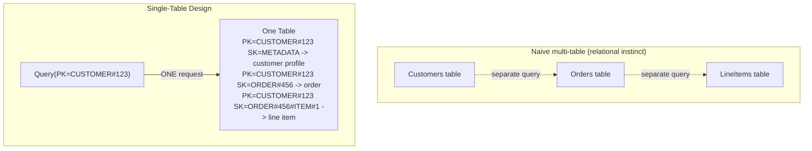
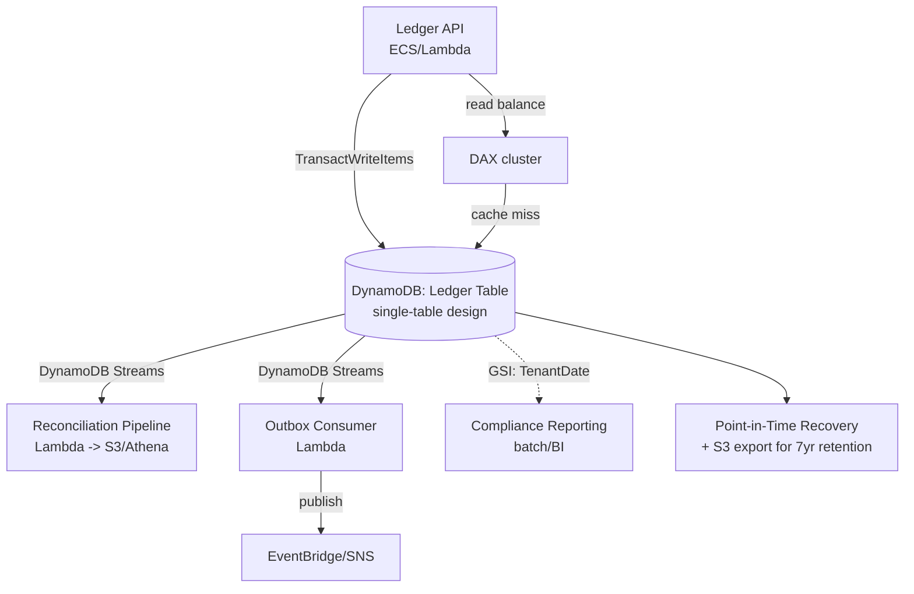
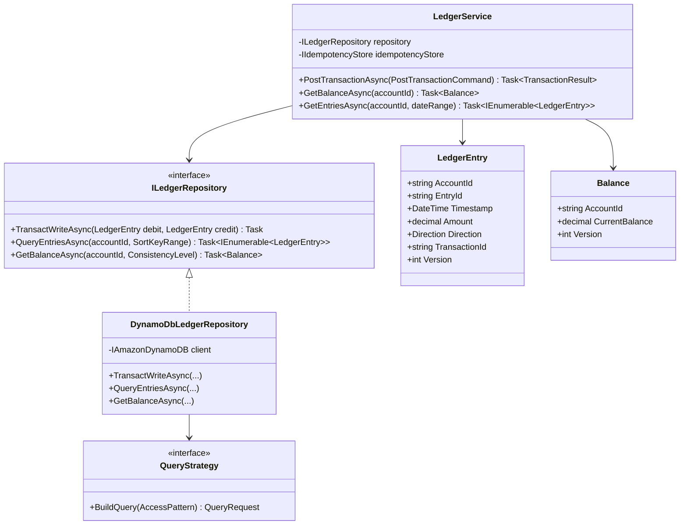
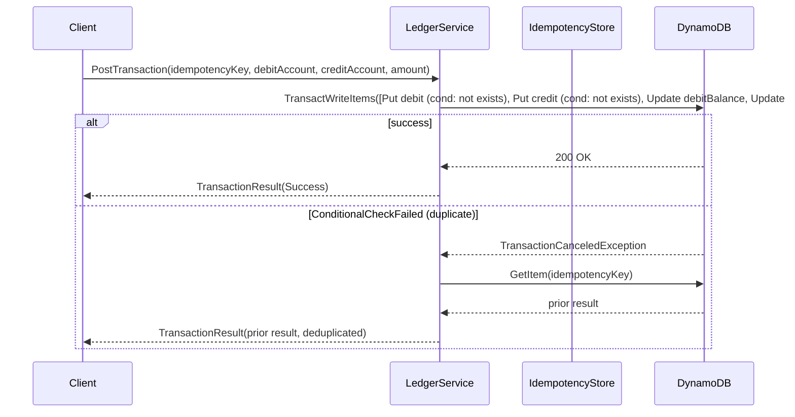

# Module 27 — DynamoDB: Data Modeling, Partition Keys & Single-Table Design

> Domain: DynamoDB | Level: Beginner → Expert | Prerequisite: [[../06-MongoDB/01-Data-Modeling-Query-Patterns]] (embedding vs. referencing, sharding), [[../04-SQL-Server/01-Indexing-Query-Execution-Plans]]

---

## 1. Fundamentals

### What is DynamoDB, and why does its data model demand a fundamentally different design philosophy than every prior module in this course?
DynamoDB is AWS's fully-managed, serverless NoSQL key-value/document database, built for **predictable, single-digit-millisecond latency at any scale** — achieved by a design that **structurally forbids** the flexible ad-hoc querying relational databases (Modules 18-20) and even MongoDB permit. Every query **must** specify a **partition key** (and optionally a sort key) — there is no equivalent of an arbitrary `WHERE` clause scanning across attributes without an index, and a full table `Scan` (reading every item) is an explicitly discouraged, expensive-at-scale escape hatch, not a normal query path.

### Why does this matter?
This isn't a missing feature to work around — it's the **entire point**: DynamoDB trades relational/MongoDB-style query flexibility for a hard guarantee that *every* query, regardless of table size, costs roughly the same (a partition-key lookup is O(1)-ish regardless of whether the table holds a thousand or a billion items). This means **all query patterns must be known and designed for upfront**, at schema-design time — a fundamentally different discipline than "design a normalized schema, then write whatever query you need later," and precisely why DynamoDB data modeling is widely considered one of the hardest adjustments for relationally-trained engineers.

### When does this matter?
Any DynamoDB schema-design decision; the depth matters because a poorly-chosen partition key or access-pattern mismatch discovered *after* a table is in production and populated is expensive and disruptive to fix (directly extending §Advanced Q10's "shard key is hard to reverse" lesson to its most extreme form).

### How does it work (30,000-ft view)?
```
Table: Orders
 Partition Key: CustomerId
 Sort Key: OrderId

Query(PartitionKey = "cust-123") -> ALL orders for that customer, efficiently, via ONE partition lookup
Query(PartitionKey = "cust-123", SortKey begins_with "2024-") -> orders from 2024 only, still ONE partition
```

---

## 2. Deep Dive

### 2.1 Partition Keys, Sort Keys, and Physical Data Distribution
DynamoDB physically distributes items across partitions based on a hash of the **partition key** — all items sharing the same partition key value live on the **same physical partition**, and the **sort key** (if defined) determines their order *within* that partition, enabling efficient range queries scoped to one partition key (`begins_with`, `between`, comparison operators on the sort key). This is architecturally identical to the MongoDB sharding and the Redis Cluster hash slots — the same underlying principle (hash-based physical co-location for efficient access) recurring at a third database engine, now as DynamoDB's **foundational**, non-optional design constraint rather than an advanced scaling feature layered on top of a more flexible base model.

### 2.2 Query vs Scan — the Central Performance and Cost Distinction
`Query` operates against a **specific partition key** (efficient, cost proportional to items returned) — the standard, expected access pattern. `Scan` reads **every item in the entire table**, filtering client-side or server-side after the fact — cost proportional to the **entire table's size**, regardless of how few items actually match, and DynamoDB explicitly bills for this full-table read cost even when a filter discards most of it. A `Scan` in a DynamoDB design is the near-exact structural analog of the SQL Server table scan — except DynamoDB's pricing model makes this cost **directly, visibly billed** per request, converting a performance anti-pattern into an immediately obvious cost anti-pattern too.

### 2.3 Single-Table Design — the Signature DynamoDB Modeling Pattern
Because DynamoDB has no efficient joins and per-table provisioned throughput/cost considerations historically favored fewer tables, the community-developed **single-table design** pattern stores **multiple different entity types** (customers, orders, order line items) in **one physical table**, distinguished by carefully-designed partition-key/sort-key **prefixes** (`PK: CUSTOMER#123`, `PK: ORDER#456`, with a `SK` encoding relationship/type information like `SK: METADATA` vs `SK: ORDER#456`) — enabling a **single Query** to retrieve a customer and all their orders together (by querying `PK = CUSTOMER#123`) despite them being logically distinct entity types, something a naive one-table-per-entity-type design (the relationally-instinctive default) cannot achieve without multiple separate queries or an expensive `Scan`.

### 2.4 Global Secondary Indexes (GSI) and Local Secondary Indexes (LSI)
A table's primary key (partition + sort key) supports only queries structured around that specific key — a **Global Secondary Index** (GSI) provides an **alternate** partition/sort key structure over the same data, enabling a genuinely different access pattern (e.g., "find all orders with a given status" when the base table's key is customer-scoped) at the cost of **eventual consistency** (GSI updates propagate asynchronously from the base table) and **additional provisioned/on-demand cost**. A **Local Secondary Index** (LSI) shares the base table's partition key but offers an alternate sort key — strongly-consistent-capable (unlike GSI), but must be defined at table-creation time and cannot be added later, a hard, upfront, difficult-to-reverse design commitment.

### 2.5 Hot Partitions and Adaptive Capacity
A partition key with insufficient cardinality or an access pattern concentrating traffic on one specific key value (e.g., a single, extremely popular customer, or — the classic anti-pattern — using a coarse, low-cardinality attribute like `Status` as the partition key) creates a **hot partition** — all requests for that key value hit the same physical partition, bottlenecked by that partition's own throughput ceiling regardless of the table's overall provisioned capacity. DynamoDB's **adaptive capacity** feature automatically attempts to redistribute throughput toward hot partitions, but this is a mitigation, not a substitute for correct partition-key design upfront — directly the DynamoDB-specific instance §Advanced Q3/the recurring "shard/partition key selection is the highest-stakes, hardest-to-reverse design decision" theme.

## 3. Visual Architecture

```mermaid
graph TB
 subgraph "Naive multi-table (relational instinct)"
 T1[Customers table] -.->|separate query| T2[Orders table]
 T2 -.->|separate query| T3[LineItems table]
 end
 subgraph "Single-Table Design"
 ST["One Table<br/>PK=CUSTOMER#123 SK=METADATA -> customer profile<br/>PK=CUSTOMER#123 SK=ORDER#456 -> order<br/>PK=CUSTOMER#123 SK=ORDER#456#ITEM#1 -> line item"]
 Q["Query(PK=CUSTOMER#123)"] -->|ONE request| ST
 end
```

## 4. Production Example
**Scenario**: A team modeled a DynamoDB table with `Status` (`Pending`/`Shipped`/`Delivered` — only 3 distinct values) as the partition key, intending to efficiently query "all orders with a given status" — under moderate production load, the table exhibited severe, persistent throttling (`ProvisionedThroughputExceededException`) despite the table's aggregate provisioned capacity being nominally sufficient for the overall request volume. **Investigation**: confirmed via CloudWatch's per-partition metrics that virtually all traffic concentrated on the `Pending` partition (since most orders are queried while still pending, the most operationally relevant status) — with only 3 possible partition-key values, DynamoDB had no way to spread this heavily-skewed load across more than 3 physical partitions, and the `Pending` partition alone was receiving far more than its fair per-partition throughput share. **Fix**: redesigned the schema to use `CustomerId` (or a synthetic, high-cardinality key) as the partition key, with `Status` demoted to a GSI's partition key instead (accepting the GSI's eventual-consistency trade-off for the less latency-critical "all pending orders" reporting query) — distributing the base table's write/read-heavy traffic across a properly high-cardinality key while still supporting the status-based query pattern via the secondary index. **Lesson**: choosing a low-cardinality, access-pattern-skewed attribute as a partition key is the DynamoDB equivalent of MongoDB's monotonically-increasing shard key — both create hot-partition/hot-shard concentration that a database's raw aggregate capacity cannot compensate for, since the fundamental constraint is per-partition/per-shard throughput, not table-wide aggregate throughput.

## 5. Best Practices
- Choose partition keys with high cardinality and access patterns that distribute evenly, never a low-cardinality attribute like status/type alone.
- Design the schema around known, upfront access patterns (single-table design where appropriate) rather than a normalized, relationally-instinctive multi-table default.
- Reserve `Scan` for genuinely rare, low-frequency operations (a one-time data export/migration), never a routine application query path.
- Use GSIs for access patterns genuinely different from the base table's key structure, accepting their eventual-consistency trade-off explicitly.

## 6. Anti-patterns
- Using a low-cardinality attribute (status, type, boolean flag) as a partition key, creating hot-partition concentration (the incident).
- Defaulting to a naive, relationally-instinctive one-table-per-entity-type design without evaluating single-table design for genuinely related, frequently-co-queried entities.
- Using `Scan` with a client-side filter as a routine query mechanism instead of designing a proper Query-compatible access pattern or GSI.
- Adding an LSI after realizing it's needed post-table-creation (impossible — LSIs must be defined upfront), instead of anticipating this need during initial design.

---

## 7. Performance Engineering

### 7.1 Hot-Partition Throttling — the Mechanism Behind the Number
Each DynamoDB partition has a hard per-partition ceiling — historically documented as roughly **3,000 RCU or 1,000 WCU per partition** (the exact figures are an implementation detail AWS doesn't contractually guarantee, but the *existence* of a per-partition ceiling, independent of table-level provisioned/on-demand capacity, is the load-bearing fact). A table provisioned for 40,000 WCU spread evenly across 40 partitions gives each partition ~1,000 WCU of headroom — but if a partition key concentrates 30% of traffic onto one partition (the `Status = "Pending"` incident), that single partition needs ~12,000 WCU worth of throughput and throttles at ~1,000, regardless of the other 39 partitions sitting nearly idle. This is why `ProvisionedThroughputExceededException` can fire while CloudWatch's table-level `ConsumedWriteCapacityUnits` graph looks comfortably under the provisioned ceiling — the aggregate metric averages away the exact signal that matters.

### 7.2 RCU/WCU Cost Modeling — the Arithmetic a Principal Engineer Should Reach For
One RCU = one strongly consistent read of up to 4 KB (or two eventually-consistent reads of up to 4 KB, since eventual consistency is priced at half). One WCU = one write of up to 1 KB. A 10 KB item therefore costs `ceil(10/4) = 3` RCU per strongly-consistent read, 1.5 (rounded up to 2 reads' worth, i.e. still costed per-4KB-chunk halved) for eventually consistent, and `ceil(10/1) = 10` WCU per write. This item-size sensitivity is a direct, quantifiable reason single-table design's "denormalize related data onto one item" instinct has a ceiling: an item bloated with every conceivable related attribute costs proportionally more per read/write than a lean item plus a targeted GSI projection — the same "don't over-embed" tension recurring from MongoDB, expressed here as a directly billed number instead of a query-time cost.

### 7.3 GSI Propagation Lag Under Write Bursts
A GSI's asynchronous propagation (§2.4) is normally sub-second, but under a sustained high-write burst on the base table, GSI propagation can measurably widen — because the GSI itself has its **own** independent partition structure and its **own** per-partition WCU ceiling, and a write-heavy burst that's evenly distributed on the base table's key can still be skewed on the GSI's differently-shaped key (the `StatusIndex` GSI concentrating on `Status = "Pending"` is exactly this: the base table's `CustomerId`-keyed writes are well-distributed, but every one of them also writes into the GSI's narrow `Pending` partition, which then becomes the GSI's own hot-partition bottleneck and throttles GSI propagation specifically, not the base table). The operational consequence: a reporting dashboard querying the GSI can lag the base table by seconds to (in a sustained burst) tens of seconds — a real number to give a stakeholder asking "how stale can the pending-orders dashboard be," not "eventually consistent" as an unquantified hand-wave.

### 7.4 Benchmarking Discipline
Load-test partition-key design decisions at **realistic production key cardinality and skew**, not uniform synthetic keys — a benchmark generating `CustomerId` values from a uniform random distribution will never surface the skew a real customer population (a handful of large institutional accounts alongside many small retail accounts) actually produces. Capture per-partition-proxy metrics (CloudWatch `ConsumedWriteCapacityUnits` filtered/dimensioned where possible, or an application-level histogram of writes-per-key) during the load test, not just aggregate throughput, since aggregate throughput is precisely the metric that hid the incident in production.

## 8. Security

### 8.1 IAM Fine-Grained Access via Leading-Key Conditions
DynamoDB's IAM integration supports `dynamodb:LeadingKeys` policy conditions — scoping a given IAM principal's access to items whose partition key begins with (or equals) a specific value or `${aws:userid}`-style substitution. In a single-table, multi-tenant design (`PK: TENANT#123#...`), this becomes a **database-native, code-path-independent authorization boundary**: even if application code has a bug granting a request broader access than intended, the IAM policy attached to the credentials used for that request still physically cannot read or write another tenant's partition-key range. This is the DynamoDB-native analog of PostgreSQL Row-Level Security — defense-in-depth that doesn't rely on every code path correctly filtering by tenant.

### 8.2 Encryption at Rest and in Transit
DynamoDB encrypts every table at rest by default (AWS-owned key, or optionally a customer-managed KMS key for organizations needing key-rotation/audit control over the encryption key itself — a meaningful distinction for SOX/PCI-DSS environments where "who can access the encryption key, and is that access logged" is itself an audit question). All API traffic is TLS-encrypted in transit. Neither of these is a design decision most schema work touches directly, but the **customer-managed-KMS-key** choice has real operational cost (key rotation policy, cross-account access grants for any Lambda/consumer needing decrypt access) that should be made deliberately for regulated financial data, not left at the default.

### 8.3 VPC Endpoints — Keeping Traffic Off the Public Internet
A **VPC Gateway Endpoint** for DynamoDB routes traffic from resources inside a VPC (Lambda functions, EC2/ECS workloads) to DynamoDB without traversing the public internet or requiring a NAT gateway — both a security posture improvement (traffic never leaves AWS's private network) and, incidentally, a cost optimization (NAT gateway per-GB data-processing charges are avoided). For a payments or ledger workload where the data-residency and network-exposure story matters to a security review, "does application traffic to the ledger table stay entirely within the VPC" is a standing architecture-review question, not an afterthought.

### 8.4 Least-Privilege Table-Level and Action-Level Policies
Beyond leading-key conditions, standard least-privilege discipline applies: a read-only reporting Lambda should hold `dynamodb:Query`/`GetItem` but not `PutItem`/`DeleteItem`/`UpdateItem`; a stream-processing consumer should hold `dynamodb:DescribeStream`/`GetRecords` scoped to the specific stream ARN, not table-wide access. This is the same least-privilege IAM discipline as every other AWS service, but worth stating explicitly because DynamoDB's single-table design pattern (§2.3) creates a natural temptation to grant one broad, table-wide policy to every consumer "since they're all touching the same table anyway" — precisely the temptation that should be resisted in favor of per-consumer, action-scoped policies.

## 9. Scalability

### 9.1 Adaptive Capacity as a Mitigation, Not a Design Substitute
Adaptive capacity (§2.5) automatically shifts a fraction of a table's throughput toward partitions experiencing disproportionate traffic, reacting within minutes — genuinely useful for organic, moderate skew, but it has limits: it cannot manufacture capacity that doesn't exist in the table's overall provisioned ceiling, and it reacts with a lag, so a sudden, severe spike (a single key receiving 10x its normal traffic within seconds) can still throttle before adaptive capacity redistributes. The correct mental model, reinforced from §2.5: adaptive capacity narrows the blast radius of an imperfect key design, it does not make partition-key cardinality analysis (§7.1, the Production Example) optional.

### 9.2 On-Demand as a Scalability Safety Valve for New/Volatile Access Patterns
On-demand capacity mode removes the provisioned-throughput ceiling as a scaling concern entirely (billed per-request, scaling near-instantaneously to observed traffic) — a genuinely different scalability posture than provisioned-with-auto-scaling, which still has a reaction lag. For a new single-table schema whose real-world traffic distribution across partition keys isn't yet validated in production (exactly the situation the incident's table was in before the hot-partition problem surfaced), on-demand capacity removes throttling risk from key-design mistakes during the validation period, at a per-request cost premium — a deliberate, temporary trade favoring safety over cost efficiency until the access-pattern and cardinality assumptions are confirmed against real traffic. Module 28 (§2.3, §9) develops the full provisioned-vs-on-demand decision framework.

### 9.3 Global Tables and Partition-Key Design's Cross-Region Consequence
Global Tables (multi-region, active-active replication) inherit the base table's partition-key design — a hot-partition problem in a single-region table becomes a hot-partition problem replicated identically in every region a Global Table spans, since the underlying partitioning mechanism is unchanged by adding regions. This means partition-key cardinality analysis isn't just a single-region concern to revisit later when going multi-region — a key design flaw discovered only after a single-region table is promoted to a Global Table now requires the full new-table-plus-backfill migration (§Advanced Q3) executed across every region simultaneously, materially raising the cost of the same mistake.

### 9.4 DAX as a Read-Scaling Layer, Scoped to This Module's Key-Design Lens
DAX (fully covered in Module 28 §2.4, §9) caches eventually-consistent reads in front of a table — relevant here because a **well-designed** partition key (high cardinality, evenly distributed) is also a prerequisite for DAX getting a good cache-hit rate on genuinely hot, repeated key lookups; a poorly-designed key that causes application code to compensate with broad `Scan`-based queries (§2.2, §6) gets no benefit from DAX at all, since DAX accelerates key-based `GetItem`/`Query` reads, not `Scan`. Read-scaling investments like DAX only pay off once the underlying key design already supports efficient, targeted access patterns.

---

## 10. Interview Questions

### Basic (10)
1. **Q: What is a partition key?** **A:** The attribute DynamoDB hashes to determine which physical partition an item lives on — every query must specify it.
2. **Q: What is a sort key?** **A:** An optional second key component determining item ordering/range-query capability within a given partition key.
3. **Q: What's the difference between Query and Scan?** **A:** Query operates against a specific partition key efficiently; Scan reads the entire table, filtering afterward, at a cost proportional to total table size.
4. **Q: What is single-table design?** **A:** Storing multiple different entity types in one physical DynamoDB table, distinguished by carefully-designed key prefixes, enabling related entities to be retrieved in one query.
5. **Q: What is a Global Secondary Index (GSI)?** **A:** An alternate partition/sort key structure over the same table's data, enabling a different access pattern, with eventually-consistent updates.
6. **Q: What is a Local Secondary Index (LSI)?** **A:** An alternate sort key sharing the base table's partition key, strongly-consistent-capable, but must be defined at table creation and can't be added later.
7. **Q: What is a hot partition?** **A:** A partition receiving disproportionate traffic due to a low-cardinality or access-pattern-skewed partition key, bottlenecked by that partition's own throughput ceiling.
8. **Q: What does adaptive capacity do?** **A:** Automatically attempts to redistribute throughput toward hot partitions, mitigating (not eliminating) the impact of imperfect key design.
9. **Q: Why is `Scan` discouraged as a routine query mechanism?** **A:** Its cost scales with the entire table's size regardless of how few items match, both slow and expensive at scale.
10. **Q: Must all DynamoDB query patterns be known upfront?** **A:** Effectively yes — the schema/key design must anticipate access patterns, unlike a relational database's flexible ad-hoc querying.

### Intermediate (10)
1. **Q: Why does DynamoDB's design philosophy require knowing access patterns upfront, unlike a relational database?** **A:** Because efficient queries are structurally bound to the partition/sort key design chosen at schema-design time — there's no equivalent of adding an index later to support an unanticipated query pattern with the same ease a relational database or even MongoDB permits, especially for LSIs which cannot be added post-creation at all.
2. **Q: Why is single-table design counter-intuitive for relationally-trained engineers, and what does it actually achieve?** **A:** It deliberately mixes multiple entity types into one physical table (an anti-pattern in relational schema design) specifically to enable retrieving related entities via a single partition-key query, trading normalized-schema clarity for query efficiency — a similar philosophical shift to MongoDB's embedding-over-referencing default, just taken further given DynamoDB's stricter query-flexibility constraints.
3. **Q: Why does a GSI have eventual consistency while the base table (and LSI) can be strongly consistent?** **A:** A GSI is a separate, asynchronously-maintained physical structure updated after the base table's write completes — the propagation delay, while typically very short, means a GSI read can briefly reflect a slightly stale view relative to the base table, unlike an LSI which shares the base table's own partition and thus its consistency characteristics.
4. **Q: Why couldn't the team simply add more provisioned capacity to fix the hot-partition problem?** **A:** DynamoDB's throughput limits apply **per partition**, not just in aggregate at the table level — adding more total provisioned capacity doesn't help a single overloaded partition if the key design concentrates traffic onto that one partition regardless of the table's overall capacity ceiling.
5. **Q: What's the risk of choosing a partition key based on what seems like a natural, meaningful business grouping (like `Status`) without checking cardinality/distribution?** **A:** A business-meaningful grouping can still have very low cardinality or highly skewed access patterns (most orders being actively queried while `Pending`, for instance) — "meaningful to the business" and "well-distributed for DynamoDB's physical partitioning" are independent properties, and only the latter matters for avoiding hot partitions.
6. **Q: Why is `Scan`'s cost model specifically dangerous from a cost-management perspective, beyond just being slow?** **A:** DynamoDB bills for the read capacity consumed by the *entire* scanned dataset, even if a filter discards 99% of it after the fact — a routine `Scan`-based query pattern can silently accumulate substantial, ongoing cost that scales with table growth, not with the actual useful result size.
7. **Q: Why would a team deliberately accept a GSI's eventual consistency for a specific access pattern rather than trying to avoid it?** **A:** For access patterns that are inherently less latency/freshness-critical (a "show all pending orders" operational dashboard, as in the fix) the brief propagation delay is an acceptable trade-off for gaining an entirely new, otherwise-unsupported query capability — the alternative (no GSI at all) would mean that access pattern isn't efficiently queryable whatsoever.
8. **Q: How does DynamoDB's `begins_with`/`between` sort-key query capability enable range-query patterns within one partition?** **A:** Since items sharing a partition key are physically co-located and ordered by sort key, a query like `SK begins_with 'ORDER#2024-'` or `SK between 'A' and 'M'` can efficiently retrieve a contiguous range within that one partition without needing to consult any other partition at all.
9. **Q: Why must LSI design be finalized at table-creation time, a stricter constraint than GSIs (which can be added later)?** **A:** An LSI shares the base table's partition structure and requires specific underlying storage co-location guarantees established at table creation — this structural constraint is precisely why LSI design demands more upfront certainty about access patterns than GSIs, which are more flexible, addable structures layered on afterward.
10. **Q: Why might IAM-based fine-grained access control (`LeadingKeys` conditions) be valuable specifically for a multi-tenant, single-table-designed DynamoDB schema?** **A:** With multiple tenants' data co-located in one physical table (differentiated by partition-key prefix, e.g., `TENANT#123#...`), an IAM policy conditioned on the partition key's leading value can enforce that a given caller's credentials only ever access their own tenant's key range — a database-engine-native, code-path-independent authorization layer directly analogous to §Advanced Q8's PostgreSQL Row-Level Security discussion, here expressed via IAM policy conditions instead of a `CREATE POLICY` statement.

### Advanced (10)
1. **Q: Diagnose the hot-partition incident from first principles, and design the schema-review practice preventing recurrence.**
 **A:** Root cause: choosing a partition key based on query-pattern convenience ("I want to query by status") without evaluating cardinality/distribution properties. Safeguard: require an explicit cardinality and access-pattern-distribution analysis for any proposed partition key during schema design — "how many distinct values will this key realistically have, and will traffic distribute evenly across them, or concentrate on a few 'hot' values" as a standing, mandatory design-review question, directly mirroring §Advanced Q9's MongoDB shard-key design-review question applied here to DynamoDB's stricter, harder-to-reverse partition-key commitment.
2. **Q: Design a single-table schema for an e-commerce domain (customers, orders, order line items, product catalog) supporting: "get a customer and all their orders," "get an order and its line items," and "get a product by SKU."**
 **A:**
 ```
 PK: CUSTOMER#<id> SK: METADATA -> customer profile
 PK: CUSTOMER#<id> SK: ORDER#<orderId> -> order summary (embedded, per the bounded-cardinality logic)
 PK: ORDER#<orderId> SK: ITEM#<sku> -> individual line item (separate partition, if order-line-item
 count could be large/queried independently)
 PK: PRODUCT#<sku> SK: METADATA -> product catalog entry
 ```
 "Get a customer and all their orders" → `Query(PK = CUSTOMER#<id>)`, one request; "get an order and its line items" → `Query(PK = ORDER#<orderId>)`, one request; "get a product by SKU" → `GetItem(PK = PRODUCT#<sku>, SK = METADATA)` — each named access pattern maps to exactly one efficient key-based operation, precisely the design discipline this module centers on (design the schema *from* the access patterns, not the other way around).
3. **Q: Explain how you would migrate an existing, hot-partition-afflicted DynamoDB table to a corrected schema without extended downtime, given DynamoDB's lack of an "ALTER TABLE" equivalent for partition-key changes.**
 **A:** Since a table's partition key cannot be changed in place, create an entirely **new** table with the corrected key design; dual-write new data to both the old and new tables during a transition period (the same "expand, don't break" incremental-migration pattern recurring throughout this course); run a backfill process copying/transforming historical data from the old table into the new table's corrected key structure; migrate read paths to the new table once backfill completes and dual-write has run reliably for a validation period; decommission the old table only after full cutover confidence, directly mirroring §Advanced Q6's MongoDB schema-migration strategy, now applied to DynamoDB's even-less-flexible (no in-place key change at all) constraint.
4. **Q: Explain a scenario where single-table design's benefits (fewer queries) are outweighed by its costs (schema complexity, harder-to-reason-about access patterns) and a multi-table design is actually preferable.**
 **A:** For entities with **genuinely independent** access patterns, lifecycles, and scaling characteristics (e.g., a completely separate "analytics events" stream unrelated to the customer/order domain, queried by entirely different consumers with different throughput/latency needs) — forcing it into the same single table as the customer/order domain gains no query-consolidation benefit (since it's never queried *together* with customer/order data) while adding schema complexity and potentially concentrating unrelated workloads' capacity needs onto one table's shared throughput considerations; single-table design's value is specifically for entities that **are** frequently co-queried, not a universal "always use one table" rule.
5. **Q: Design a strategy for supporting a genuinely ad-hoc, unanticipated query pattern that emerges after a DynamoDB table is already in production, without a full table redesign.**
 **A:** Add a new GSI (addable post-creation, unlike an LSI) with a partition/sort key structure matching the newly-needed access pattern, backfilling it via DynamoDB Streams (a CDC-like mechanism, directly analogous to/24's change-stream/logical-decoding discussions) or a one-time batch process populating the new GSI's key attributes on existing items; for a query pattern too irregular/rare to justify a dedicated GSI, consider whether it's genuinely a candidate for a separate analytics pipeline (exporting DynamoDB data to a more query-flexible store like a data warehouse via DynamoDB Streams + a Lambda/ETL pipeline) rather than forcing DynamoDB itself to serve an access pattern its core design isn't suited for.
6. **Q: Explain the interaction between DynamoDB Streams and single-table design for implementing the Outbox pattern (a later dedicated module) natively within DynamoDB.**
 **A:** DynamoDB Streams captures every item-level change (insert/update/delete) as an ordered, consumable event log — a single-table-designed schema can include an "outbox-shaped" item type (`PK: ORDER#<id>, SK: EVENT#<timestamp>`) written atomically alongside the actual business-entity update (DynamoDB supports transactional writes across multiple items via `TransactWriteItems`, giving the same atomicity guarantee a relational transaction would for a business-write-plus-outbox-write pattern), with a DynamoDB Streams consumer (often a Lambda function) reading these outbox-shaped items and publishing them to a downstream message broker — directly the CDC-based Outbox variant referenced, now expressed via DynamoDB's own native Streams mechanism instead of PostgreSQL's logical decoding.
7. **Q: How would you reason about whether DynamoDB is the right database choice at all for a given new service, versus a relational or MongoDB alternative, based on this module's central themes?**
 **A:** DynamoDB is the right choice when: access patterns are genuinely well-known and stable upfront (or the team is prepared for the migration cost of Advanced Q3/Q5 if they change), the workload benefits from DynamoDB's predictable, scale-independent latency guarantee, and the team is prepared to invest in the specific schema-design discipline (single-table design, partition-key cardinality analysis) this module requires; it's a poor fit for workloads with genuinely ad-hoc, evolving, exploratory query needs (a reporting/analytics use case benefiting from SQL's flexible querying, better served by a relational database or a dedicated analytics store) — the decision should be driven by actual access-pattern predictability and the team's willingness to adopt DynamoDB's specific design discipline, not by DynamoDB's marketing as a generically "highly scalable" database suitable for any workload.
8. **Q: Design a capacity-planning and monitoring strategy specifically to catch a hot-partition risk before it causes production throttling, generalizing into a standing safeguard.**
 **A:** Monitor CloudWatch's per-partition-level metrics (where available) or proxy signals like `ConsumedReadCapacityUnits`/`ConsumedWriteCapacityUnits` skew and `ThrottledRequests`, alerting proactively on any sustained throttling **even if aggregate table-level capacity utilization looks healthy** (exactly the deceptive signal that made the incident harder to immediately diagnose) — since aggregate metrics can look fine while one specific partition is severely overloaded, the correct monitoring signal must specifically surface per-partition or throttling-event-based data, not just table-wide utilization percentages.
9. **Q: Explain why `TransactWriteItems` (DynamoDB's multi-item transaction mechanism) has real cost/throughput implications that should inform when it's genuinely necessary versus a single-item write.**
 **A:** `TransactWriteItems` consumes roughly double the write-capacity-unit cost of the equivalent non-transactional writes (accounting for the two-phase commit-style coordination overhead) — exactly the same "transactions have real overhead, reserve them for genuinely necessary cross-entity atomicity" lesson from the MongoDB multi-document transaction discussion, now with DynamoDB's cost model making that overhead directly, quantifiably visible in billing rather than just latency.
10. **Q: As a Principal Engineer, how would you build organizational capability for correct DynamoDB schema design given how counter-intuitive it is relative to both relational and even MongoDB backgrounds?**
 **A:** Require a documented, explicit access-pattern enumeration (directly Advanced Q2's exercise) as a mandatory artifact — listing every anticipated query the schema must support — as the **starting point** of any new DynamoDB table's design review, before any partition/sort key or GSI is chosen, structurally enforcing the "design from access patterns, not from entity relationships" discipline this entire module centers on; pair this with a shared internal reference documenting the organization's own single-table-design patterns and cardinality-analysis checklist (this course's recurring shared-template governance pattern), specifically because DynamoDB's design philosophy is a genuinely larger conceptual leap from prior database experience than any other engine covered in this course, warranting correspondingly more deliberate, structured onboarding support.

### Expert (FinTech Principal Panel)

1. **Q: In DynamoDB (no server-side transactions across a read-then-write by default), how do you atomically decrement an account balance without going negative, and make a payment write idempotent against retries?**
 **A:** Use **conditional writes** — DynamoDB's `ConditionExpression` makes check-and-act atomic on a single item, which is exactly what you need. (1) **Guarded decrement**: `UpdateItem` with `SET Balance = Balance -:amt` and `ConditionExpression: "Balance >=:amt"` — the condition is evaluated atomically against the current item; if two withdrawals race, only one satisfies the condition and the other fails with `ConditionalCheckFailedException` (rejected, no overdraft). This is the DynamoDB equivalent of `UPDATE... WHERE Balance >= @amt`, and it needs no lock. (2) **Idempotency**: write the operation keyed by the idempotency key with `ConditionExpression: "attribute_not_exists(PK)"` — a duplicate retry fails the condition, so the effect happens exactly once; catch the failure and return the original result. For an effect spanning multiple items (debit + ledger entry + idempotency record), use **`TransactWriteItems`** with per-item conditions so all-or-nothing atomicity holds (at ~2× WCU cost, Advanced Q9). Also note **read consistency**: a balance you enforce on must use a **strongly consistent read** or, better, rely on the conditional write itself rather than a prior eventually-consistent read (which could be stale and let both writes through). The Principal framing: DynamoDB gives you money-safe correctness through **conditional expressions** (guarded decrement + `attribute_not_exists` idempotency) and `TransactWriteItems` for multi-item atomicity — never a read-then-write on eventually-consistent data, because the condition, evaluated server-side at write time, is the only atomic arbiter.
 **Why correct:** Uses `ConditionExpression` for atomic guarded decrement + `attribute_not_exists` idempotency, `TransactWriteItems` for multi-item atomicity, and flags the eventually-consistent-read trap.
 **Common mistakes:** Read-modify-write on an eventually-consistent read (double-spend); no condition on the decrement; relying on app-level "check then put" instead of `attribute_not_exists`.
 **Follow-ups:** "Why does a conditional decrement beat a strongly-consistent read + separate write?" / "How does `attribute_not_exists` give exactly-once?" / "When do you need `TransactWriteItems` vs. a single conditional update?"

2. **Q: How do you store monetary amounts in DynamoDB correctly, and what SDK-level trap causes silent precision loss?**
 **A:** DynamoDB's **Number** type is a variable-length **decimal** with up to 38 significant digits — inherently suitable for exact money *if you never route the value through a binary `double`*. The trap is at the **SDK/serialization layer**: many code paths (JSON marshalling, naive object mappers, JavaScript's native number) convert the DynamoDB number to/from IEEE-754 `double`, reintroducing base-2 error exactly as elsewhere. Mitigations: in.NET, map amounts to **`decimal`** and use the SDK's decimal-aware conversion (the low-level `AttributeValue.N` is a *string*, so preserve it as a string/`decimal`, not a `double`); in other SDKs, use the provided big-decimal/number-wrapper types (e.g., `DynamoDBNumber`/`boto3`'s `Decimal`) and configure the client to **not** parse numbers as floats. Equivalently, store **integer minor units** (a `long`/number) with a currency-scale convention, which sidesteps the float path entirely. Always store the **currency code** alongside and respect per-currency scale. The Principal framing: DynamoDB *can* hold exact money (38-digit decimal Number), but the danger is the client library quietly marshalling through `double` — so pin the SDK to decimal/string number handling (or store integer minor units), because the storage engine isn't the risk, the serialization boundary is.
 **Why correct:** Notes Number is 38-digit decimal (exact-capable) and locates the real risk at the SDK's double-marshalling boundary, prescribing decimal/big-decimal handling or integer minor units + currency code.
 **Common mistakes:** Letting the SDK/JSON path parse amounts as `double`; assuming "it's a Number so it's fine" without checking the client's number handling; no currency code.
 **Follow-ups:** "Why is the low-level `N` attribute a string, and why does that matter?" / "How does JavaScript's number type break DynamoDB money?" / "Integer minor units vs. decimal Number — trade-offs?"

3. **Q: A single very high-activity account (a merchant settlement account, or a house/omnibus account) concentrates writes on one partition key and throttles (hot partition). How do you model a per-account ledger to spread load while still computing a correct balance?**
 **A:** A per-account ledger keyed `PK = ACCOUNT#<id>` funnels all of one hot account's writes to a single partition — DynamoDB's per-partition throughput ceiling then throttles it even if the table's aggregate capacity is fine (/Advanced Q8). **Write-sharding**: spread the account's entries across N sub-partitions by suffixing the key — `PK = ACCOUNT#<id>#<shard>` where `shard = hash(entryId) % N` — so concurrent writes distribute across N partitions instead of one. The trade-off is on **reads**: computing the balance or listing history now requires querying all N shards and merging (scatter-gather), so N is a tuning knob (enough to relieve the hotspot, small enough to keep reads cheap). To keep balance reads O(1) despite sharded entries, maintain a **materialized balance** updated via a conditional/atomic `UpdateItem` (or transactionally with the entry), and treat the sharded entries as the append-only history. Alternatively, offload heavy history/aggregation reads to a stream-fed analytics store (Advanced Q5) so the hot table only serves the atomic balance update. The Principal framing: a hot account is a write-distribution problem solved by **key-suffix write-sharding** (spreading writes at a read-side scatter-gather cost), combined with a **materialized, atomically-updated balance** so correctness and read latency survive the sharding — you're trading read complexity for write scalability, tuned by shard count.
 **Why correct:** Diagnoses the single-key write hotspot and prescribes key-suffix write-sharding + a materialized atomic balance, with the read-side scatter-gather trade-off and shard-count tuning.
 **Common mistakes:** One partition key for a hot account (throttling); sharding writes but then scanning all shards on every balance read; no materialized balance so reads get expensive.
 **Follow-ups:** "How do you pick the shard count?" / "How do you compute the balance without scanning all shards every time?" / "How does a materialized balance stay consistent with sharded entries?"

4. **Q: A regulator asks you to reconstruct the exact state of every account "as of" any point in the last seven years for an audit. Your single-table schema currently only stores current balances. How do you design for this without bolting on a separate audit system after the fact?**
 **A:** Store balances as **derived, not primary** — the primary-source-of-truth is an **append-only ledger of immutable entries** (`PK: ACCOUNT#<id>, SK: ENTRY#<ISO8601-timestamp>#<entryId>`), each entry a delta plus metadata (who, what, why, correlation ID), never mutated or deleted once written; the current balance is a **materialized projection** (`SK: METADATA`) updated transactionally (`TransactWriteItems`) alongside each new entry so it never drifts from the ledger. "As of" reconstruction for any past timestamp becomes `Query(PK = ACCOUNT#<id>, SK <= ENTRY#<asOfTimestamp>)` summed — a range query the sort-key design directly supports, with no separate audit subsystem needed because the audit trail *is* the primary data model, not a bolt-on. Retention/cost for 7 years of entries is managed via time-partitioned sort-key prefixes enabling cheap archival export to S3 for entries past an active window, without breaking the "still queryable if needed" requirement. The Principal framing: build the immutable, timestamp-ordered ledger as the source of truth from day one — regulatory reconstructability is a schema-design decision made *before* the first write, not a feature retrofitted onto a mutable-current-state table after an auditor asks for it.
 **Why correct:** Treats the ledger as the immutable primary source of truth with balance as a transactionally-maintained projection, and uses the sort key's natural ordering for point-in-time reconstruction.
 **Common mistakes:** Storing only current balance and trying to reconstruct history from application logs after the fact; mutating ledger entries instead of appending; no transactional link between ledger entry and balance projection.
 **Follow-ups:** "Why must the balance update be transactional with the ledger write?" / "How do you keep 7 years of entries queryable without the table growing unmanageably?" / "What happens if a correction is needed — do you ever edit a past entry?"

5. **Q: A multi-tenant SaaS trading platform puts every tenant's positions in one single-table-designed table (`PK: TENANT#<id>#POSITION#<symbol>`). One large institutional tenant generates 200x the write volume of a typical tenant. Diagnose the risk and design around it, considering both performance and security isolation.**
 **A:** Two distinct risks compound here. **Performance**: the large tenant's high write volume, even spread across many `symbol`-suffixed partition keys, can still dominate the table's adaptive-capacity redistribution budget, degrading other tenants' throughput during the large tenant's peak (a noisy-neighbor problem — DynamoDB's per-table throughput/adaptive-capacity is shared across all tenants co-located in one table). **Security/isolation**: a single shared table, even with correct `LeadingKeys` IAM conditions (§8.1) scoping each tenant's access to their own `TENANT#<id>#...` prefix, still means a large tenant's traffic pattern can operationally impact a small tenant's *availability* (throttling), which for some regulatory/contractual tenancy tiers (a large institutional client with an SLA) is an unacceptable blast-radius coupling regardless of data-access isolation being correctly enforced. Design: **tier-based table isolation** — small/standard tenants share a well-distributed single table (the noisy-neighbor risk among them is bounded by their comparable size); institutional/high-volume tenants above a defined threshold get their **own dedicated table** (still single-table-designed internally for their own entity types), isolating both their throughput profile and their blast radius from the shared pool entirely. The Principal framing: `LeadingKeys` solves *data* isolation; it does not solve *throughput/availability* isolation — a genuinely large-outlier tenant needs physical table separation, not just a partition-key prefix, once its scale materially threatens co-tenants' SLA.
 **Why correct:** Separates data-access isolation (solved by `LeadingKeys`) from throughput/availability isolation (not solved by it), and prescribes tier-based dedicated-table isolation for outlier tenants.
 **Common mistakes:** Assuming `LeadingKeys` IAM conditions alone provide full tenant isolation; not recognizing shared-table throughput as a noisy-neighbor vector; sizing capacity for the "average" tenant and being surprised by an outlier.
 **Follow-ups:** "What threshold would trigger moving a tenant to a dedicated table?" / "Does adaptive capacity make shared-table noisy-neighbor risk acceptable?" / "How do you migrate one tenant out of a shared table without downtime?"

6. **Q: An options-trading platform needs to query "all open orders for account X within the last 4 hours" as a hot, latency-critical path, and separately "all orders for account X in Q3" as a colder, less latency-sensitive compliance query. Design the partition/sort key structure and explain why one schema shouldn't try to serve both optimally.**
 **A:** Both queries share `AccountId` as the natural grouping, so `PK: ACCOUNT#<id>` with `SK: ORDER#<ISO8601-timestamp>#<orderId>` supports both via range queries on the sort key (`SK between 'ORDER#<4hAgo>' and 'ORDER#<now>'` for the hot path; `SK between 'ORDER#2024-07-01' and 'ORDER#2024-09-30'` for the quarterly compliance query) — structurally, one key design *can* serve both, because both are sort-key range queries within the same partition. The real tension is **item lifecycle and hot-partition risk under a high-frequency trading account**: an actively-trading account can generate thousands of orders per day, meaning `PK: ACCOUNT#<id>` alone concentrates that account's entire order history growth onto one ever-growing partition — fine for the recent-orders hot path (naturally bounded, recent data is a small slice) but a partition-size/throughput risk for the compliance query scanning a full quarter of a hyperactive account's history. Mitigation: time-bucket the partition key itself for accounts crossing an activity threshold (`PK: ACCOUNT#<id>#2024-Q3`), trading a slightly more complex query (the compliance query now issues one `Query` per relevant quarter-bucket instead of one range query) for bounded partition size and throughput isolation between the hot recent-orders path and the cold historical-compliance path. The Principal framing: a single partition key *can* algebraically serve two access patterns via sort-key ranges, but "can" isn't "should" once one of those patterns risks unbounded partition growth for a subset of high-activity keys — time-bucketing the partition key trades query simplicity for the throughput isolation a naive single-partition design can't provide at the tail.
 **Why correct:** Recognizes both queries can share a sort-key-range design in principle, but correctly identifies unbounded partition growth for high-activity accounts as the real constraint requiring time-bucketed partition keys.
 **Common mistakes:** Assuming one partition-key design trivially serves both hot and cold access patterns with no downside; not considering partition-size growth for outlier high-frequency accounts; time-bucketing every account uniformly instead of only high-activity ones.
 **Follow-ups:** "How do you decide the time-bucket granularity?" / "What happens to the hot-path query if it now needs to check two buckets near a boundary?" / "How would you detect which accounts need bucketing before it becomes a problem?"

7. **Q: You're migrating a legacy double-entry-bookkeeping ledger from SQL Server to DynamoDB. Every financial transaction must post as exactly two balanced entries (a debit and a credit) atomically, or neither. Design the schema and write path.**
 **A:** Model each ledger entry as its own item (`PK: ACCOUNT#<id>, SK: ENTRY#<timestamp>#<entryId>`) carrying `Amount`, `Direction` (`DEBIT`/`CREDIT`), and a shared `TransactionId` linking the paired entries. The write path uses `TransactWriteItems` with **both** entries (debit on account A, credit on account B) as `Put` operations in the **same transaction**, each with a `ConditionExpression: attribute_not_exists(PK)` keyed by `TransactionId`-derived sort key for idempotency (§Expert Q1) — guaranteeing both entries commit or neither does, satisfying the double-entry invariant atomically even though the two entries live under different partition keys (accounts A and B), which `TransactWriteItems` supports since it's not restricted to a single partition. Each account's running balance is a separately-maintained, transactionally-updated projection (`SK: METADATA`, `SET Balance = Balance + :delta` in the same transaction) so balance reads stay O(1) rather than requiring a sum over all entries on every read. Reconciliation (verifying the ledger's global debit/credit sum nets to zero) runs as a periodic batch process (via DynamoDB Streams feeding an aggregation pipeline, §Advanced Q6) rather than as a synchronous check on every write, since a global invariant across arbitrarily many accounts cannot be enforced by a single item-scoped conditional write. The Principal framing: `TransactWriteItems`' cross-partition atomicity is exactly what makes double-entry bookkeeping representable in DynamoDB at all — the debit and credit legs living on different accounts (different partition keys) would otherwise have no atomic guarantee linking them, and losing that atomicity for a ledger is a correctness failure, not a performance one.
 **Why correct:** Uses `TransactWriteItems`' cross-partition atomicity for the debit/credit pair, keeps balance as a transactionally-updated projection, and correctly scopes global-invariant reconciliation to an asynchronous batch process rather than a per-write check.
 **Common mistakes:** Writing debit and credit as two separate, non-transactional `PutItem` calls (risking one succeeding without the other); trying to enforce the global zero-sum invariant synchronously on every write; recomputing balance by summing all entries on every read instead of maintaining a projection.
 **Follow-ups:** "Why can't you enforce the global zero-sum invariant with a conditional write?" / "What happens if the transaction partially fails — is DynamoDB really all-or-nothing here?" / "How would you detect a reconciliation break, and what would you do about it?"

8. **Q: A GDPR/CCPA "right to erasure" request comes in for a customer whose data is scattered across a single-table design as `PK: CUSTOMER#<id>` (profile), `PK: ORDER#<id>` (orders referencing the customer), and a GSI keyed by customer email. Design the erasure process.**
 **A:** Single-table design's co-location benefit (§2.3) becomes an erasure *complication*, not a simplification, once data about one logical subject is deliberately spread across multiple item types and a GSI for query-efficiency reasons. Process: (1) `Query(PK = CUSTOMER#<id>)` retrieves every item directly under that partition key — the profile and any customer-scoped orders modeled as `SK: ORDER#...` under the same PK — for direct deletion via `TransactWriteItems` (batched, since a single transaction caps at 100 items). (2) Items that reference the customer but live under a **different** partition key (an order modeled as `PK: ORDER#<id>` for independent order-level access, per Advanced Q2's alternative) must be found via the customer-scoped GSI or an application-maintained reverse-index item, then individually redacted/deleted — this is exactly why the schema design decision in Advanced Q2 (embed vs. separate-partition for order items) has a *downstream* GDPR-erasure cost that should be weighed at design time, not discovered at erasure time. (3) For data that must be **retained** for regulatory reasons (financial transaction records, typically exempt from erasure under retention-law carve-outs) — redact PII fields (name, email) in place via `UpdateItem` rather than deleting the item, preserving the immutable ledger entry's financial integrity while satisfying the erasure request's actual legal scope. (4) The GSI projecting customer email must be included in the redaction pass, since a stale GSI entry retaining PII after the base item is redacted is itself a compliance gap. The Principal framing: GDPR erasure is a schema-design-time consideration, not a query you write reactively — single-table design's "spread related data by access-pattern convenience" philosophy needs an explicit "can every item touching this subject be enumerated and reached" check built into the original access-pattern inventory (§Advanced Q10), because discovering at erasure time that a subject's data isn't fully enumerable is a compliance failure with regulatory consequences.
 **Why correct:** Distinguishes deletable items (direct PK query) from cross-referenced items (requiring GSI/reverse-index lookup), correctly handles regulatory-retention-exempt records via redaction rather than deletion, and ties the finding back to upfront access-pattern design.
 **Common mistakes:** Assuming `Query(PK=CUSTOMER#<id>)` alone finds every item about the customer; deleting financial records that are legally required to be retained instead of redacting PII fields; forgetting the GSI itself retains PII after base-item redaction.
 **Follow-ups:** "How would you design the schema differently upfront to make erasure requests cheaper?" / "What do you do about backups/point-in-time-recovery snapshots that still contain the erased data?" / "How do you prove to an auditor that erasure was complete?"

9. **Q: Nightly reconciliation compares your DynamoDB-based settlement table against an external clearing house's settlement file. Design the reconciliation process and the break-classification logic, considering DynamoDB-specific constraints (no native joins, eventual GSI consistency).**
 **A:** Export the night's settlement items via a `Query` per counterparty/settlement-date partition (or, for a full-table comparison, a `Scan` — explicitly justified here as the rare, legitimate batch use case §6 flags, run during an off-peak maintenance window with dedicated capacity, not against production-serving capacity) and load both DynamoDB's view and the clearing house's file into a comparison engine (commonly an external, join-capable store — Athena over an S3 export, or a relational staging table — since DynamoDB itself cannot natively join two datasets). Classify breaks in three tiers, mirroring the recurring reconciliation pattern: (1) **auto-resolvable** — a timing difference where DynamoDB shows `PENDING` and the clearing file shows `SETTLED` for an item within the expected settlement-lag window, resolved by an automated status-update job; (2) **investigate** — amount or counterparty mismatches beyond a tolerance threshold, routed to an operations queue; (3) **manual** — anything not cleanly classified within the automated rules, requiring human review. A DynamoDB-specific wrinkle: if the reconciliation reads from a **GSI** rather than the base table (common, since the GSI is often keyed by settlement-date for this exact batch access pattern), the GSI's eventual consistency (§2.4) means a very-recently-updated base-table item might not yet be reflected in the GSI read — mitigated by running reconciliation with a deliberate time buffer (excluding the last few minutes of same-day activity from the comparison window) rather than assuming the GSI is instantaneously current. The Principal framing: reconciliation is required **regardless of** DynamoDB's own internal consistency guarantees, because the discrepancy source being checked for is external (the clearing house's independent record), not an internal replication-lag question — but the *implementation* of the reconciliation job still has to correctly account for DynamoDB-specific staleness (GSI propagation) to avoid manufacturing false breaks from its own read path rather than genuine settlement discrepancies.
 **Why correct:** Correctly scopes the rare, justified `Scan` use case, proposes an external join-capable engine for comparison since DynamoDB can't join natively, classifies breaks into the standard three tiers, and flags the GSI-eventual-consistency false-break risk specific to DynamoDB.
 **Common mistakes:** Trying to join two datasets within DynamoDB itself; treating every mismatch as requiring manual investigation instead of classifying auto-resolvable timing differences; reading from a GSI without accounting for propagation lag and generating false breaks close to the comparison cutoff.
 **Follow-ups:** "Why not just always read from the base table to avoid the GSI-consistency issue?" / "How do you size the reconciliation time buffer?" / "What's the audit trail for an auto-resolved break?"

10. **Q: As a Principal Engineer chairing an architecture review, a team proposes DynamoDB for a new core-banking ledger service specifically because "it scales infinitely and we won't have to worry about it." Evaluate this reasoning and describe what you'd actually want to see in the proposal.**
 **A:** Push back on the framing immediately: this module's entire arc (the hot-partition incident, adaptive capacity as mitigation-not-substitute, §7.1's per-partition ceiling) directly refutes "scales infinitely, won't have to worry about it" — DynamoDB scales predictably **only when the partition-key design correctly anticipates the actual production access-pattern distribution**, which is a design discipline the team has to invest in, not a property that comes free with the engine choice. What I'd want to see in the proposal, as the actual bar for approval: (1) a documented access-pattern enumeration (§Advanced Q10) covering every query the ledger service needs, done *before* any key is chosen; (2) an explicit cardinality/skew analysis for the proposed partition key against realistic (not uniform-synthetic) production traffic projections, including known outlier accounts (§Expert Q5's institutional-tenant problem); (3) a stated idempotency and transactional-write strategy for the double-entry write path (§Expert Q7), since correctness under concurrent/retried writes is the actual hard problem for a ledger, not raw throughput; (4) a reconciliation design (§Expert Q9) proving the ledger's internal state can be verified against external truth, because "it's in DynamoDB so it's correct" is never a sufficient claim for money-movement systems; (5) an explicit answer to "what happens when we need a query pattern we didn't anticipate" (§Advanced Q5), given DynamoDB's comparatively high cost of schema evolution versus a relational alternative. If those five things are present and well-reasoned, DynamoDB may well be the right choice — the point of the review isn't to reject DynamoDB, it's to reject "scales infinitely, won't have to worry about it" as a justification, since that specific reasoning is the exact failure mode this entire module is about.
 **Why correct:** Directly refutes the "infinite scaling, no design effort needed" framing using the module's own hot-partition/adaptive-capacity findings, and replaces it with a concrete, five-point bar a proposal must clear — access patterns, cardinality analysis, idempotency/transactional strategy, reconciliation, and schema-evolution cost — before approval.
 **Common mistakes:** Either rubber-stamping DynamoDB because "AWS says it scales" or reflexively rejecting it in favor of a relational default without engaging with what the workload actually needs; not asking for the access-pattern enumeration as a concrete, reviewable artifact.
 **Follow-ups:** "What would change your recommendation toward a relational database instead?" / "How do you hold a team accountable to the access-pattern enumeration after launch, when new features inevitably add new query needs?" / "What's your rollback plan if the DynamoDB schema proves wrong in production?"

---

## 11. Coding Exercises

### Easy — Correct high-cardinality partition key with a GSI for the low-cardinality query need
```
-- Base table: high-cardinality partition key
Table: Orders
 PK: CustomerId
 SK: OrderId

-- GSI for the "all orders with a given status" access pattern (the fix)
GSI: StatusIndex
 PK: Status
 SK: OrderDate
-- Base table traffic distributes across many CustomerIds; the status-based query
-- uses the GSI, accepting eventual consistency for this specific, less latency-critical pattern.
```

### Medium — Single-table design query for "customer and all orders" (Advanced Q2)
```csharp
var response = await dynamoDbClient.QueryAsync(new QueryRequest
    {
        TableName = "AppTable",
            KeyConditionExpression = "PK =:pk",
            ExpressionAttributeValues = new Dictionary<string, AttributeValue>
        {
            [":pk"] = new AttributeValue { S = $"CUSTOMER#{customerId}" }
        }
});
// Returns BOTH the customer's METADATA item AND every ORDER#... item for this customer
// in ONE request -- distinguishing item type via the SK prefix in application code afterward.
```

### Hard — DynamoDB Streams-based Outbox consumer (Advanced Q6)
```csharp
public async Task ProcessStreamRecordsAsync(IEnumerable<Record> streamRecords)
{
    foreach (var record in streamRecords)
    {
        if (record.EventName!= OperationType.INSERT) continue;

        var newImage = record.Dynamodb.NewImage;
        if (!newImage.TryGetValue("SK", out var sk) ||!sk.S.StartsWith("EVENT#")) continue; // only outbox-shaped items

        var eventPayload = newImage["Payload"].S;
        await _messageBroker.PublishAsync(newImage["EventType"].S, eventPayload);
        // No need to separately delete the outbox item here -- DynamoDB Streams already
        // guarantees each record is delivered; a TTL attribute on the item handles eventual cleanup.
    }
}
```

### Expert — Transactional write for atomic business-entity-plus-outbox-item creation
```csharp
await dynamoDbClient.TransactWriteItemsAsync(new TransactWriteItemsRequest
    {
        TransactItems = new List<TransactWriteItem>
        {
            new { Put = new Put {
                    TableName = "AppTable",
                        Item = new Dictionary<string, AttributeValue> {
                        ["PK"] = new { S = $"ORDER#{orderId}" }, ["SK"] = new { S = "METADATA" },
                            ["Status"] = new { S = "Placed" }
                    }
            }},
            new { Put = new Put {
                    TableName = "AppTable",
                        Item = new Dictionary<string, AttributeValue> {
                        ["PK"] = new { S = $"ORDER#{orderId}" }, ["SK"] = new { S = $"EVENT#{DateTime.UtcNow:O}" },
                            ["EventType"] = new { S = "OrderPlaced" }, ["Payload"] = new { S = SerializeEvent(orderId) }
                    }
            }}
        }
});
```
**Discussion**: Both items commit atomically via `TransactWriteItems` — if either write fails, neither is persisted, guaranteeing the business-entity update and its corresponding outbox event are never inconsistent with each other, exactly the atomicity guarantee Advanced Q6/Advanced Q9's cost discussion centers on, deliberately reserved here for a genuinely necessary cross-item atomicity requirement rather than applied to every ordinary write.

---

## 12. System Design

### Scenario: A Multi-Tenant Payment Ledger & Account-Balance Service

**Requirements**

*Functional:* record every account debit/credit as an immutable ledger entry; maintain a real-time queryable current balance per account; support "all entries for account X in date range Y"; support multi-tenant isolation (each tenant is a bank/fintech client, each with many end-customer accounts); support double-entry atomicity (§Expert Q7); support point-in-time balance reconstruction for audit (§Expert Q4).

*Non-functional:* single-digit-millisecond p99 read latency on balance lookups; no data loss (durability); strict tenant isolation (data-access and, for large tenants, throughput); predictable cost at scale (hundreds of tenants, tens of millions of accounts); auditable — every write traceable to a caller and correlation ID; regulatory retention of 7+ years.

**Back-of-the-envelope:** 200 tenants, average 50,000 accounts/tenant = 10M accounts. Assume 5 ledger entries/account/day average (with a 200:1 skew for the largest institutional tenant, §Expert Q5) → 50M entries/day ≈ 580 writes/sec average, with observed peaks (month-end settlement) of 10x average ≈ 5,800 writes/sec. At ~1KB/entry this is a write-heavy, moderate-throughput workload — well within DynamoDB's single-partition ceiling *if* spread across a sufficiently high-cardinality key, but the 200:1 tenant skew and month-end burst are exactly the two risk factors (§Expert Q5, §9.2) this design must explicitly account for, not the raw throughput number, which alone is unremarkable.

**Architecture**


```mermaid
graph TB
    API[Ledger API<br/>ECS/Lambda] -->|TransactWriteItems| Ledger[(DynamoDB: Ledger Table<br/>single-table design)]
    Ledger -->|DynamoDB Streams| Recon[Reconciliation Pipeline<br/>Lambda -> S3/Athena]
    Ledger -->|DynamoDB Streams| Outbox[Outbox Consumer<br/>Lambda] -->|publish| Bus[EventBridge/SNS]
    Ledger -.GSI: TenantDate.-> Reporting[Compliance Reporting<br/>batch/BI]
    API -->|read balance| DAX[DAX cluster]
    DAX -->|cache miss| Ledger
    Ledger --> Backup[Point-in-Time Recovery<br/>+ S3 export for 7yr retention]
```

**Components:** the **Ledger API** is the only write path, enforcing idempotency and the debit/credit pairing (§Expert Q7); the **Ledger table** is single-table-designed (`PK: ACCOUNT#<id>`, `SK: ENTRY#<ts>#<id>` for entries, `SK: METADATA` for the balance projection); a **TenantDate GSI** (`PK: TENANT#<id>#<date>`) supports the tenant-scoped compliance-reporting access pattern without burdening the account-scoped hot path; **DynamoDB Streams** feeds both the reconciliation pipeline (§Expert Q9) and an Outbox-pattern event publisher (§Advanced Q6); **DAX** accelerates the read-heavy balance-lookup path, with strongly-consistent reads bypassing it for the read-after-write cases; **Point-in-Time Recovery + S3 export** satisfies the 7-year retention requirement without keeping cold historical data in the hot table indefinitely.

**Database selection rationale:** DynamoDB is chosen over a relational alternative specifically because the access patterns are fully known upfront and stable (account-scoped entry writes/reads, tenant-scoped reporting), the predictable-latency guarantee matters for a customer-facing balance-check API, and the double-entry atomicity requirement is satisfiable via `TransactWriteItems` without needing arbitrary cross-entity joins — per §Advanced Q7's decision framework. A relational database remains the better choice if the reporting/compliance query needs were genuinely ad-hoc and evolving rather than the few well-defined patterns above.

**Caching:** DAX in front of balance reads only (§9.4) — ledger-entry history reads are comparatively rare (audit/dispute-driven) and don't justify caching investment.

**Messaging:** DynamoDB Streams → Lambda → EventBridge is the outbox mechanism (§Advanced Q6), decoupling downstream consumers (notification service, fraud-monitoring service) from the ledger write path.

**Scaling:** provisioned capacity with auto-scaling for the well-forecasted baseline, with a scheduled capacity increase ahead of known month-end settlement bursts (§9.2, Module 28 §Advanced Q3); large-outlier tenants isolated to dedicated tables (§Expert Q5) once they cross a defined throughput threshold.

**Failure handling:** conditional writes + idempotency keys (§Expert Q1) make retries safe; `TransactWriteItems` guarantees debit/credit atomicity; DLQ on the Streams-consuming Lambda for outbox-publish failures, with alerting on DLQ depth.

**Monitoring:** per-partition-proxy write-skew (§7.1), `ThrottledRequests`, GSI propagation lag (§7.3) alerted specifically for the reporting GSI, DAX cache-hit rate, and reconciliation-break count/classification (§Expert Q9) as a business-correctness metric, not just an infrastructure one.

**Trade-offs:** single-table design gains query efficiency for co-located entities at the cost of schema complexity and the erasure-request complication (§Expert Q8); DynamoDB's predictable latency is gained at the cost of upfront access-pattern rigidity relative to a relational alternative.

## 13. Low-Level Design

**Class diagram**


```mermaid
classDiagram
    class LedgerService {
        -ILedgerRepository repository
        -IIdempotencyStore idempotencyStore
        +PostTransactionAsync(PostTransactionCommand) Task~TransactionResult~
        +GetBalanceAsync(accountId) Task~Balance~
        +GetEntriesAsync(accountId, dateRange) Task~IEnumerable~LedgerEntry~~
    }
    class ILedgerRepository {
        <<interface>>
        +TransactWriteAsync(LedgerEntry debit, LedgerEntry credit) Task
        +QueryEntriesAsync(accountId, SortKeyRange) Task~IEnumerable~LedgerEntry~~
        +GetBalanceAsync(accountId, ConsistencyLevel) Task~Balance~
    }
    class DynamoDbLedgerRepository {
        -IAmazonDynamoDB client
        +TransactWriteAsync(...)
        +QueryEntriesAsync(...)
        +GetBalanceAsync(...)
    }
    class LedgerEntry {
        +string AccountId
        +string EntryId
        +DateTime Timestamp
        +decimal Amount
        +Direction Direction
        +string TransactionId
        +int Version
    }
    class Balance {
        +string AccountId
        +decimal CurrentBalance
        +int Version
    }
    class QueryStrategy {
        <<interface>>
        +BuildQuery(AccessPattern) QueryRequest
    }
    ILedgerRepository <|.. DynamoDbLedgerRepository
    LedgerService --> ILedgerRepository
    DynamoDbLedgerRepository --> QueryStrategy
    LedgerService --> LedgerEntry
    LedgerService --> Balance
```

**Sequence diagram — PostTransaction (double-entry, idempotent)**


```mermaid
sequenceDiagram
    participant Client
    participant LedgerService
    participant IdempotencyStore
    participant DynamoDB

    Client->>LedgerService: PostTransaction(idempotencyKey, debitAccount, creditAccount, amount)
    LedgerService->>DynamoDB: TransactWriteItems([Put debit (cond: not exists), Put credit (cond: not exists), Update debitBalance, Update creditBalance])
    alt success
        DynamoDB-->>LedgerService: 200 OK
        LedgerService-->>Client: TransactionResult(Success)
    else ConditionalCheckFailed (duplicate)
        DynamoDB-->>LedgerService: TransactionCanceledException
        LedgerService->>DynamoDB: GetItem(idempotencyKey)
        DynamoDB-->>LedgerService: prior result
        LedgerService-->>Client: TransactionResult(prior result, deduplicated)
    end
```

**Design patterns used:** **Repository** (`ILedgerRepository` isolates DynamoDB-specific query shaping from `LedgerService`); **Strategy** (`QueryStrategy` selects base-table vs. GSI query construction per access pattern, so adding a new GSI-backed pattern doesn't touch `LedgerService`); **Unit of Work** (`TransactWriteItems` call groups the debit, credit, and both balance updates as one atomic unit); **Idempotent Receiver** (the idempotency-key conditional write pattern, §Expert Q1).

**SOLID mapping:** SRP — `LedgerService` orchestrates business rules, `DynamoDbLedgerRepository` owns DynamoDB API shape, `QueryStrategy` owns per-access-pattern query construction; OCP — a new access pattern is added as a new `QueryStrategy` implementation without modifying `LedgerService`; LSP — any `ILedgerRepository` implementation (DynamoDB today, conceivably a relational adapter later) is substitutable behind the interface; ISP — `ILedgerRepository` exposes only the operations `LedgerService` actually needs, not a generic CRUD-everything interface; DIP — `LedgerService` depends on the `ILedgerRepository` abstraction, not the concrete AWS SDK client.

**Concurrency/thread safety:** the `Version` attribute on `Balance` combined with `ConditionExpression: "Version = :expectedVersion"` on the balance `Update` implements **optimistic concurrency control** — a concurrent balance update racing against another is rejected (`ConditionalCheckFailedException`) rather than silently lost, forcing the caller to retry with the freshly-read version; this composes with, but is distinct from, the idempotency-key check (idempotency prevents the *same* logical operation from double-applying; optimistic locking prevents two *different* concurrent operations from lost-update-clobbering each other's balance change).

## 14. Production Debugging

**Incident:** A trading-settlement reconciliation dashboard, reading from the `TenantDate` GSI, began showing settlement counts that periodically **undercounted** actual settled trades by 3-8% during the last 15 minutes of each trading day's batch window, self-correcting by the next morning's report.

**Investigation:** CloudWatch's `ReplicationLatency` metric for the `TenantDate` GSI (a GSI-specific metric distinct from base-table metrics) showed sustained elevation to 20-45 seconds specifically during the final settlement-batch window, versus a normal sub-second baseline. Cross-referencing with `ConsumedWriteCapacityUnits` on the GSI (not the base table) revealed the GSI's own partition structure — keyed by `TENANT#<id>#<date>` — was concentrating the entire day's final settlement burst onto a small number of `date`-suffixed partitions (every settlement for every tenant, on the same calendar day, landing on the same GSI partition), even though the base table's `ACCOUNT#<id>`-keyed writes were well-distributed. This is a GSI-specific hot partition (§7.3) invisible to base-table monitoring.

**Tools:** CloudWatch GSI-dimensioned metrics (`ReplicationLatency`, per-index `ConsumedWriteCapacityUnits`/`ThrottledRequests`, which are separate CloudWatch dimensions from the base table's own metrics and easy to overlook if dashboards only surface table-level aggregates); AWS X-Ray traces confirmed the dashboard's read path (`Query` against the GSI) was returning correctly per its own consistency model — the data simply hadn't propagated to the GSI yet at read time.

**Fix:** short-term, added an explicit `date`-hour suffix to the GSI's partition key (`TENANT#<id>#<date>#<hourBucket>`) to spread the end-of-day burst across more GSI partitions, reducing propagation lag back to sub-5-second; longer-term, the dashboard's "final" end-of-day figure was changed to read from the **base table** directly (via a scheduled batch `Query` per tenant, tolerable for a once-daily report) rather than the latency-sensitive GSI, reserving the GSI for its originally-intended near-real-time (not final-reconciliation-grade) use case.

**Prevention:** added GSI-specific `ReplicationLatency` and per-index throttling to the standing DynamoDB monitoring checklist (§7.3, §Advanced Q8) as a distinct alerting dimension from base-table metrics — the standing lesson, consistent with this module's central theme, is that a GSI is its **own** independently-partitioned structure with its own hot-partition risk, and monitoring must treat it as such rather than assuming base-table health implies GSI health.

## 15. Architecture Decision

**Options considered for the ledger/account-balance data store:**

| | DynamoDB single-table | DynamoDB multi-table | Relational (SQL Server/PostgreSQL) |
|---|---|---|---|
| **Advantages** | One query for co-located entities (account + entries); predictable latency at scale; native TTL/Streams for outbox | Simpler mental model per entity type; independent scaling/capacity per entity type | Native joins for genuinely ad-hoc reporting; mature tooling/DBA familiarity; native multi-row ACID transactions without WCU-cost doubling |
| **Disadvantages** | Steep schema-design learning curve; hard to reverse key mistakes; GDPR-erasure complexity (§Expert Q8) | Loses single-query co-location benefit; more round-trips for related-entity fetches | Query latency less predictable at very high scale; vertical-scaling ceiling without sharding investment |
| **Cost** | Pay-per-throughput, can be cheaper at predictable steady scale (provisioned) | Similar to single-table, marginally higher due to duplicated capacity overhead per table | License/instance cost (SQL Server) or instance+storage (managed PostgreSQL); read-replica cost for scaling reads |
| **Complexity** | High upfront (access-pattern enumeration mandatory) | Moderate | Low upfront, but reporting-query complexity grows organically over time |
| **Maintainability** | High once correctly modeled; low if key design was wrong (near-full-migration to fix) | Moderate | High — schema evolution via `ALTER TABLE`/migrations is well-understood tooling |
| **Scalability** | Effectively unbounded *given correct key design* | Same, per-table | Requires explicit sharding/read-replica investment beyond a single primary's ceiling |

**Recommendation:** DynamoDB single-table design, for this specific ledger service, given: access patterns are fully known and stable (account-scoped entry read/write, tenant-scoped reporting via GSI); the double-entry atomicity requirement is satisfiable via `TransactWriteItems`; and the predictable-latency guarantee directly serves the customer-facing balance-check SLA. The recommendation is explicitly **conditional**, not universal — per §Advanced Q7's framework, a service whose query needs are genuinely exploratory/ad-hoc (an internal, evolving BI/analytics need over the same ledger data) should read from a **separate**, relationally-modeled or warehouse-based replica fed by DynamoDB Streams, rather than trying to force that access pattern onto the operational ledger table itself.

## 17. Principal Engineer Perspective

**Business impact:** a correctly-modeled ledger service directly enables customer-facing balance-check latency SLAs and regulatory audit-readiness; a poorly-modeled one (the hot-partition-style mistake, generalized to a money-movement system) risks both availability incidents during peak settlement windows and — more severely — audit findings if reconstruction/reconciliation capability wasn't designed in from the start (§Expert Q4, §Expert Q9).

**Engineering trade-offs:** single-table design's query-efficiency gain is explicitly traded against schema-evolution rigidity and erasure-request complexity (§Expert Q8) — a trade-off worth making when access patterns are genuinely stable, and worth explicitly flagging as a risk in the design review when they aren't.

**Technical leadership:** the access-pattern-enumeration artifact (§Advanced Q10) is the single highest-leverage practice this module identifies — as a Principal Engineer, making this a **non-negotiable, reviewed gate** before any new DynamoDB table's key structure is chosen is a higher-leverage intervention than reviewing any individual schema after the fact, because it structurally prevents the entire class of hot-partition and migration-cost mistakes this module's incidents center on.

**Cross-team communication:** the reconciliation pipeline (§Expert Q9, §14) and its break-classification tiers should be a **shared artifact** between engineering and the operations/finance team consuming break reports — a Principal Engineer's job includes ensuring the technical break-classification logic maps to categories operations actually understands and can act on, not just categories convenient for the engineering team to compute.

**Architecture governance:** require dedicated-table isolation criteria (§Expert Q5) to be a documented, objective threshold (e.g., "tenant throughput exceeding N% of shared-table capacity triggers migration to a dedicated table") rather than an ad-hoc, reactive decision made only after a noisy-neighbor incident already occurred.

**Cost optimization:** provisioned capacity with scheduled scaling ahead of known settlement bursts (§9.2) is materially cheaper than on-demand at this workload's steady, forecastable volume — but only once the access-pattern and cardinality assumptions are validated; using on-demand during the initial validation period (§9.2) is the correct, deliberate cost-for-safety trade during that specific window, not a permanent choice.

**Risk analysis:** the largest tail risk this module's incidents point to isn't average-case throughput — it's the **outlier**: the single hot key (§Production Example), the single 200x-larger tenant (§Expert Q5), the single hyperactive trading account (§Expert Q6). A Principal Engineer's risk review for any DynamoDB schema should explicitly ask "what does the 99.9th-percentile key look like," not just "what does the average key look like."

**Long-term maintainability:** document every access pattern the schema was designed for, explicitly, alongside the schema itself — the single most common cause of expensive future migrations (§Advanced Q3) is a schema whose original access-pattern reasoning wasn't recorded, forcing a future engineer to reverse-engineer intent from key names alone before they can safely evolve it.

## 18. Revision
**Key takeaways**: Every DynamoDB query requires a partition key — access patterns must be known and designed for upfront, unlike relational/MongoDB's more flexible ad-hoc querying. Query (partition-key-scoped, efficient) vs. Scan (full-table, expensive, cost-visible in billing) is the central performance/cost distinction. Single-table design co-locates multiple entity types under carefully-designed key prefixes to enable one-query retrieval of related data. GSIs add alternate access patterns with eventual consistency; LSIs share the base partition key with strong consistency but must be defined upfront, unchangeable later. Partition-key cardinality/distribution analysis is the single highest-leverage design practice — a low-cardinality or access-skewed key creates hot partitions no amount of aggregate provisioned capacity can fix.

---

**Next**: This completes the `08-DynamoDB` domain's first module. Continuing autonomously to Module 28 — DynamoDB Consistency Models & Capacity Planning to complete the domain before advancing to `09-OOP`.
