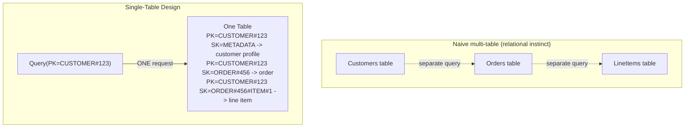
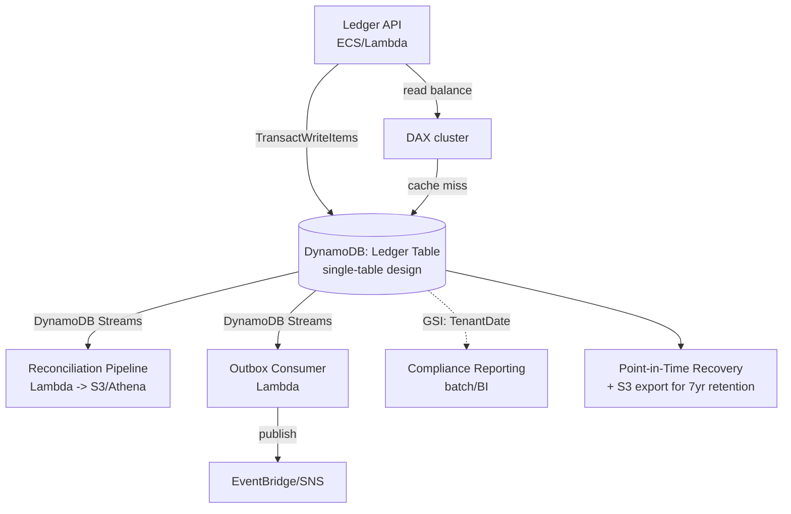
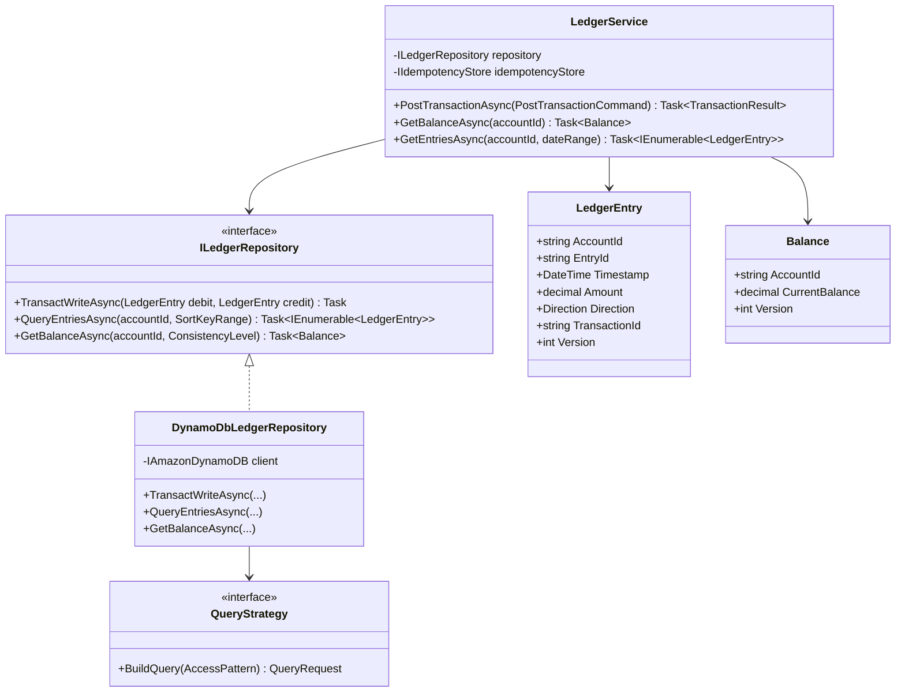
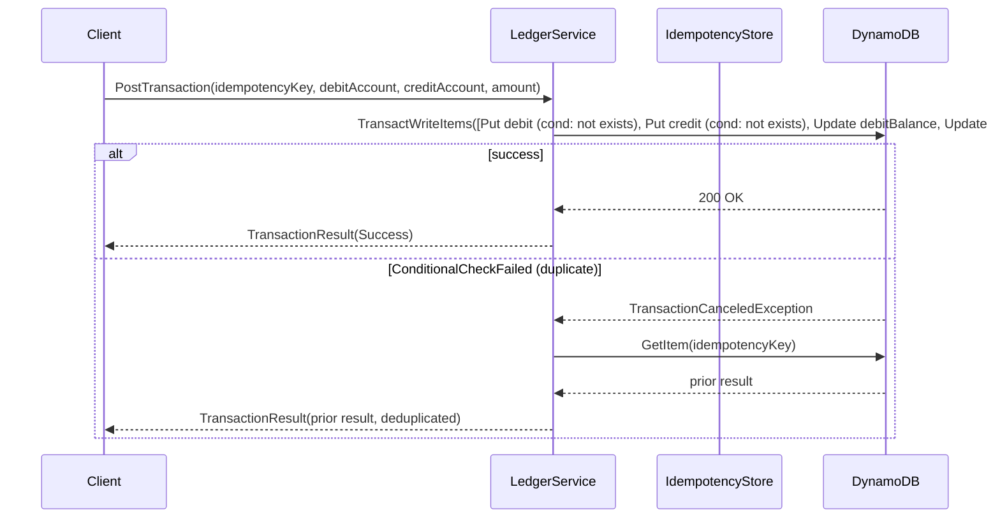
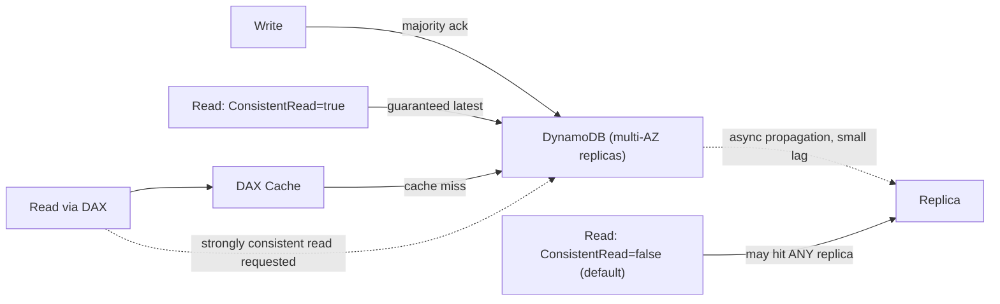
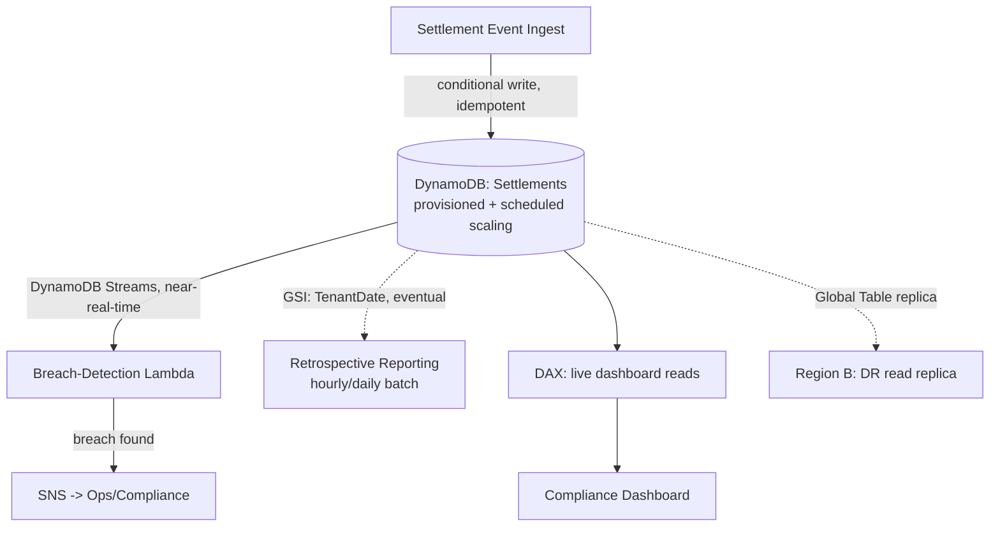
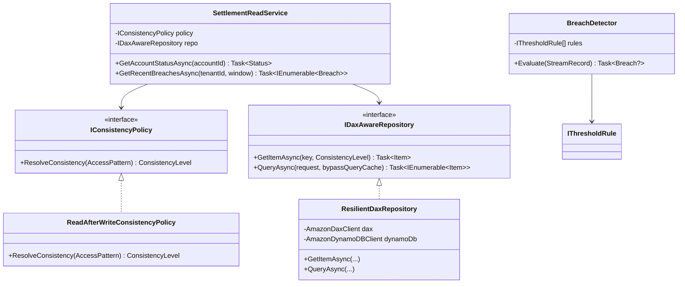
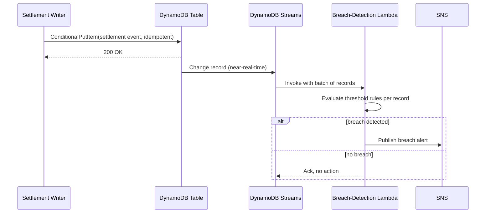

# DynamoDB — Complete Interview Prep (All Topics, One File)

> Domain: DynamoDB | Level: Beginner → Expert | Prerequisite: [[../06-MongoDB/01-MongoDB-Interview-Prep]] (document modelling, sharding), [[../04-SQL-Server/01-SQL-Server-Interview-Prep]]
> **Quick-prep edition** (consolidated 2026-10-03). This one file replaces Modules 27–28. Originals: `git show ebb2d5c:08-DynamoDB/<file>.md`
> Each topic has: **Key concepts → Code example → Most common interview questions with answers.**

| # | Topic | # | Topic |
|---|---|---|---|
| 1 | Fundamentals: tables, items, keys, partitions | 7 | Capacity: RCU/WCU, provisioned vs on-demand, throttling |
| 2 | Access-pattern-first & single-table design | 8 | Global tables, DAX, Streams & integrations |
| 3 | Secondary indexes (GSI vs LSI), sparse & overloaded | 9 | Backups, security, cost, analytics & migration |
| 4 | Reads & writes: Query/Scan, conditions, batches, transactions | 10 | Top 30 rapid-fire + Principal questions |
| 5 | Hot partitions & write sharding | 11 | Mistakes checklist |
| 6 | Consistency models | | |

---

## 1. Fundamentals: Tables, Items, Keys, Partitions

**Key concepts**
- A fully managed, serverless **key-value and document** database with single-digit-millisecond latency at any scale.
- **Table → items** (max **400 KB** each) → attributes (schemaless except the key).
- **Primary key:** **partition key (PK)** only, or **PK + sort key (SK)**. The PK is hashed to choose a **partition**; items with the same PK form an **item collection**, sorted by SK.
- **Partitions:** each holds ~10 GB and delivers up to **3,000 RCU and 1,000 WCU** (per-partition limits) → throughput depends on spreading traffic across many partition-key values. Partitions split automatically as data and throughput grow.
- **Operations:** `GetItem` (by full key), **`Query`** (one PK, optional SK conditions — efficient), **`Scan`** (the whole table — expensive), `PutItem`, `UpdateItem`, `DeleteItem`, batch and transactional APIs, PartiQL.
- No joins, no ad hoc queries → **design the table from access patterns**.
- Features: TTL, Streams, global tables, PITR, on-demand/provisioned capacity, DAX, encryption at rest, IAM fine-grained access.

```csharp
// AWS SDK for .NET — low-level client and the object persistence model
builder.Services.AddAWSService<IAmazonDynamoDB>();

[DynamoDBTable("Orders")]
public class OrderItem
{
    [DynamoDBHashKey("PK")]  public string PK { get; set; } = default!;   // CUSTOMER#123
    [DynamoDBRangeKey("SK")] public string SK { get; set; } = default!;   // ORDER#2026-10-03#O-9
    public decimal Total { get; set; }
    public string Status { get; set; } = "NEW";
    [DynamoDBVersion] public int? Version { get; set; }                    // optimistic locking
}

var ctx = new DynamoDBContext(client);
await ctx.SaveAsync(new OrderItem { PK = "CUSTOMER#123", SK = "ORDER#2026-10-03#O-9", Total = 125.50m });
```

**Common interview questions**

**Q1. What does the partition key actually determine?**
Which physical partition stores the item (via a hash), and therefore how load spreads. All items with the same PK live together (an item collection) and are ordered by SK. Since each partition has throughput limits, a low-cardinality or skewed partition key caps the whole table's performance no matter how much capacity you buy.

**Q2. When is DynamoDB the right choice, and when is it the wrong one?**
Right: known, stable access patterns at large or spiky scale, key-value/document lookups needing predictable low latency, serverless architectures (Lambda), session/cart/profile/device data, and event-driven systems with Streams. Wrong: ad hoc queries and reporting, complex joins and relational integrity, evolving access patterns, aggregations, or small apps where relational is simpler.

**Q3. What is the 400 KB item limit and why does it shape design?**
Items can't exceed 400 KB (including attribute names). Large payloads go to S3 with a pointer in the item; growing collections become multiple items under one PK rather than lists inside one item. Item size also drives cost (capacity units round up per 1 KB written / 4 KB read).

---

## 2. Access-Pattern-First & Single-Table Design

**Key concepts**
- **Step 1: list every access pattern** (with frequency and latency needs) before designing: "get customer by ID", "list a customer's orders newest first", "get order with its lines", "orders by status for ops", etc.
- **Step 2:** design PK/SK and indexes so **each pattern is a single `GetItem` or `Query`** (no scans, minimal round trips).
- **Single-table design:** store several entity types in one table with generic `PK`/`SK` attributes and an entity-type attribute → related items share a PK (**pre-joined**), so one Query returns a customer + their orders.
- **Key patterns:**
  - Hierarchical SKs: `ORDER#2026-10-03#O-9`, `LINE#001` → `begins_with` queries.
  - **Adjacency list** for many-to-many (items `PK=A, SK=B` and an inverted GSI `GSI1PK=B, GSI1SK=A`).
  - **Inverted index** GSI (swap PK and SK) for reverse lookups.
  - Composite sort keys for multi-dimension filtering: `STATUS#PAID#2026-10-03`.
  - Time-series: a PK per entity + time bucket (`DEVICE#1#2026-10`), SK = timestamp.
- **Single vs multi-table:** single-table minimizes requests and suits stable, well-understood patterns; multi-table is simpler to understand, evolve and analyse (and is recommended by AWS for many teams now). Choose per bounded context.
- **Denormalize and duplicate** to avoid extra reads — you own the update fan-out (Streams can propagate).

```text
Table: Shop   (PK, SK) + GSI1 (GSI1PK, GSI1SK)
PK              SK                          Attributes
CUSTOMER#123    PROFILE                     name, email
CUSTOMER#123    ORDER#2026-10-01#O-7        total, status=SHIPPED, GSI1PK=STATUS#SHIPPED, GSI1SK=2026-10-01
CUSTOMER#123    ORDER#2026-10-03#O-9        total, status=PAID,    GSI1PK=STATUS#PAID,    GSI1SK=2026-10-03
ORDER#O-9       LINE#001                    sku, qty, price
ORDER#O-9       LINE#002                    sku, qty, price

Access patterns:
1. Customer profile + recent orders → Query PK=CUSTOMER#123 (ScanIndexForward=false)
2. Customer's orders in October     → Query PK=CUSTOMER#123, SK BETWEEN ORDER#2026-10-01 AND ORDER#2026-10-31~
3. Order lines                       → Query PK=ORDER#O-9, SK begins_with LINE#
4. Ops: all PAID orders by date      → Query GSI1 PK=STATUS#PAID (consider write sharding if hot)
```

**Common interview questions**

**Q1. Walk me through designing a table for known access patterns.**
Enumerate entities and every access pattern with its frequency; choose a partition key that spreads load and groups items fetched together; design sort keys so range or prefix queries answer the patterns; add GSIs only for patterns the base table can't serve; check item sizes, hot keys and the capacity estimate; then validate each pattern maps to one Query/GetItem.

**Q2. What is single-table design and why does it exist?**
Storing multiple entity types in one table, keyed so that related items share a partition key. It exists because DynamoDB has no joins: putting a customer and their orders in one item collection lets one Query return both, reducing latency and cost. The trade-off is a less intuitive schema and harder evolution and analytics.

**Q3. How do you model a many-to-many relationship?**
The adjacency-list pattern: an item per relationship edge (`PK=STUDENT#1, SK=COURSE#9`) and a GSI that inverts the keys (`GSI1PK=COURSE#9, GSI1SK=STUDENT#1`) so you can query both directions; duplicate the commonly needed attributes onto the edge items.

**Q4. Denormalize an attribute or do a second read?**
Denormalize if it's read with the item frequently and changes rarely (a customer name on an order); do a second read (BatchGetItem) if it changes often or is large. If you denormalize, define how updates propagate (Streams + Lambda) and whether stale copies are acceptable.

**Q5. How do you evolve a DynamoDB schema?**
Adding attributes is free (schemaless). New access patterns usually mean a new GSI (backfilled automatically) or new item types; changing keys requires a migration: write a new item format (dual-write), backfill with a parallel scan or export, switch reads, clean up. Keep a version attribute on items.

---

## 3. Secondary Indexes: GSI vs LSI, Sparse & Overloaded

| | **GSI** (Global Secondary Index) | **LSI** (Local Secondary Index) |
|---|---|---|
| Keys | any PK + SK | same PK, different SK |
| When created | any time | only at table creation |
| Consistency | **eventually consistent only** | strong or eventual |
| Capacity | its own (provisioned separately) | shares the table's |
| Size limit | none | **10 GB per item collection** |
| Limit | 20 per table (default) | 5 per table |

- **Projection:** `KEYS_ONLY`, `INCLUDE`, `ALL` — what's copied into the index (fetching non-projected attributes needs another read; projecting everything costs storage and write capacity).
- **Write amplification:** every write that changes indexed or projected attributes consumes WCU on each affected GSI.
- **GSI back-pressure:** if a GSI is under-provisioned and throttles, **base-table writes are throttled too**.
- **Sparse index:** only items with the GSI key attribute appear → an efficient "work queue" (e.g., only orders with `PendingShipment` set).
- **Index overloading:** one GSI with generic `GSI1PK/GSI1SK` serving several entity types and patterns.

```csharp
// Query a GSI
var resp = await client.QueryAsync(new QueryRequest
{
    TableName = "Shop",
    IndexName = "GSI1",
    KeyConditionExpression = "GSI1PK = :pk AND GSI1SK BETWEEN :from AND :to",
    ExpressionAttributeValues = new()
    {
        [":pk"]   = new AttributeValue("STATUS#PAID"),
        [":from"] = new AttributeValue("2026-10-01"),
        [":to"]   = new AttributeValue("2026-10-31")
    }
});
```

**Common interview questions**

**Q1. GSI vs LSI?**
A GSI has a different partition key, can be added any time, has its own capacity and is eventually consistent only. An LSI shares the table's partition key with a different sort key, must be created with the table, supports strongly consistent reads, and limits each item collection to 10 GB. Default to GSIs; use LSIs only when you need strong consistency on an alternate sort order and collections stay small.

**Q2. What does index projection control and why does it matter?**
Which attributes are copied into the index. Projecting too little forces extra reads back to the table; projecting ALL increases storage and write cost (amplification). Project exactly what the access pattern needs.

**Q3. How does GSI capacity relate to the base table?**
GSIs have separate capacity (in provisioned mode). Writes to the table propagate to each relevant GSI; if a GSI lacks write capacity, it throttles and back-pressures the base table — table writes fail even though the table has capacity. Monitor GSI throttling separately.

**Q4. What is a sparse index and when is it useful?**
A GSI whose key attribute exists only on some items, so only those appear in it — e.g., set `OpenTicketGSI` only while a ticket is open, then remove the attribute when it closes. Querying it finds the "active" subset cheaply without scanning.

**Q5. How many GSIs, and how do you design them?**
As few as possible: each costs storage and write capacity and adds an eventual-consistency surface. Use overloading (generic keys shared by several patterns) and sparse indexes; add one only for a real, frequent access pattern.

---

## 4. Reads & Writes: Query/Scan, Conditions, Batches, Transactions

**Key concepts**
- **`Query`:** requires the PK (equality) + optional SK condition (`=`, `<`, `BETWEEN`, `begins_with`); returns sorted items; `ScanIndexForward=false` for descending; `Limit`.
- **`Scan`:** reads every item (consumes capacity for all of them) → only for exports, backfills and small tables; use **parallel scan** (segments) and rate limiting for big jobs.
- **Filter expressions** are applied **after** items are read → **you pay for everything read**, not what's returned. Put selectivity in the key design.
- **Pagination:** responses cap at **1 MB**; use `LastEvaluatedKey` → `ExclusiveStartKey`. A page can have fewer items than `Limit` (or zero) and still have more data — **loop until `LastEvaluatedKey` is null**.
- **Condition expressions** make writes conditional: `attribute_not_exists(PK)` (insert-if-absent / idempotency), `Version = :v` (optimistic locking), `Balance >= :amt`. A failure → `ConditionalCheckFailedException`.
- **`UpdateItem`** with update expressions: `SET`, `ADD` (atomic counters), `REMOVE`, `list_append`.
- **Batch APIs:** `BatchGetItem` (100 items / 16 MB), `BatchWriteItem` (25 put/deletes, no conditions) → **partial failures** returned as `UnprocessedItems/Keys` → retry them with backoff.
- **Transactions:** `TransactWriteItems` / `TransactGetItems` — up to **100 items**, ACID across items and tables in one region, **2× the capacity cost**, conflicts → `TransactionCanceledException`; `ClientRequestToken` for idempotency (10-minute window).
- **TTL:** an epoch-seconds attribute; deletion happens in the background (typically within a few days), so filter expired items in queries if precision matters; deletions appear in Streams.

```csharp
// Idempotent create: fails if the payment already exists
await client.PutItemAsync(new PutItemRequest
{
    TableName = "Payments",
    Item = new() { ["PK"] = new($"PAYMENT#{id}"), ["SK"] = new("META"),
                   ["Amount"] = new() { N = "125.50" }, ["Status"] = new("CREATED") },
    ConditionExpression = "attribute_not_exists(PK)"
});

// Atomic, conditional balance debit (no overdraft)
await client.UpdateItemAsync(new UpdateItemRequest
{
    TableName = "Accounts",
    Key = new() { ["PK"] = new("ACCOUNT#42"), ["SK"] = new("BALANCE") },
    UpdateExpression = "SET Balance = Balance - :amt",
    ConditionExpression = "Balance >= :amt",
    ExpressionAttributeValues = new() { [":amt"] = new() { N = "50" } }
});

// Transfer with a transaction (both or neither) + ledger entry
await client.TransactWriteItemsAsync(new TransactWriteItemsRequest
{
    ClientRequestToken = transferId,      // idempotent retries for 10 minutes
    TransactItems =
    [
        new() { Update = new() { TableName = "Accounts", Key = Key("ACCOUNT#1"), UpdateExpression = "SET Balance = Balance - :a",
                                 ConditionExpression = "Balance >= :a", ExpressionAttributeValues = Amt(50) } },
        new() { Update = new() { TableName = "Accounts", Key = Key("ACCOUNT#2"), UpdateExpression = "SET Balance = Balance + :a",
                                 ExpressionAttributeValues = Amt(50) } },
        new() { Put = new() { TableName = "Ledger", Item = LedgerItem(transferId),
                              ConditionExpression = "attribute_not_exists(PK)" } }
    ]
});

// Paginate correctly
Dictionary<string, AttributeValue>? startKey = null;
do
{
    var page = await client.QueryAsync(new QueryRequest { TableName = "Shop",
        KeyConditionExpression = "PK = :pk", ExpressionAttributeValues = new() { [":pk"] = new("CUSTOMER#123") },
        ExclusiveStartKey = startKey });
    Process(page.Items);
    startKey = page.LastEvaluatedKey is { Count: > 0 } k ? k : null;
} while (startKey is not null);
```

**Common interview questions**

**Q1. Query vs Scan — when is Scan acceptable?**
Query reads one item collection by key (cost proportional to the data returned). Scan reads the whole table (cost proportional to table size). Scan is acceptable for small tables, one-off exports, backfills (parallel scan with throttling), or analytics via export — never on a hot request path.

**Q2. Why doesn't a filter expression save money?**
Filters run after DynamoDB reads the items, so you consume read capacity for everything read, even items discarded. To save cost and latency, encode the selectivity in the partition and sort keys or a GSI.

**Q3. How do you achieve optimistic concurrency?**
Keep a version attribute; update with `ConditionExpression: Version = :expected` and `SET Version = Version + 1`; on `ConditionalCheckFailedException`, re-read and retry or report a conflict. The .NET `DynamoDBContext` does this with `[DynamoDBVersion]`.

**Q4. What's the common pagination mistake?**
Assuming a page with fewer items than `Limit` (or an empty page with filters) means the end. The end is only when `LastEvaluatedKey` is absent. Also, `Limit` caps items *evaluated*, not returned after filtering.

**Q5. What are the trade-offs of `TransactWriteItems`?**
You get ACID across up to 100 items/tables, but it costs twice the capacity, has higher latency, can be cancelled by conflicts with other transactions or writes, and is single-region (global tables replicate transactions non-atomically). Use it for genuine multi-item invariants (transfers, uniqueness constraints), not as a default.

**Q6. How do you handle partial failures in batch operations?**
Batch calls succeed partially: inspect `UnprocessedItems`/`UnprocessedKeys` and retry only those with exponential backoff and jitter. BatchWrite has no conditions — if you need conditional or idempotent writes, use individual conditional writes or transactions.

**Q7. How do you enforce uniqueness on a non-key attribute (e.g., email)?**
A separate uniqueness item (`PK=EMAIL#ana@x.com`) written in the same transaction as the user item with `attribute_not_exists(PK)`; changing the email deletes the old marker and puts the new one in a transaction.

---

## 5. Hot Partitions & Write Sharding

**Key concepts**
- **Hot partition:** a disproportionate share of traffic on one partition key (a viral product, `PK = today's date`, a status GSI key like `STATUS#PENDING`, one huge tenant) → throttling at **3,000 RCU / 1,000 WCU per partition** even when the table has spare capacity.
- **Adaptive capacity** automatically shifts throughput toward hot partitions and **isolates very hot items** onto their own partition — but it **can't exceed the per-partition limits for a single key**.
- **Write sharding:** append a suffix to spread one logical key across N physical keys: `STATUS#PENDING#0..9` (random or calculated from an ID), then query all N shards in parallel (scatter-gather) when reading.
- Other fixes: high-cardinality keys (`userId` rather than `country`), caching hot reads (DAX/ElastiCache), batching hot counters (aggregate in memory, write periodically), and time-bucketed keys.
- Diagnose with **CloudWatch Contributor Insights** (most-accessed and most-throttled keys).

```csharp
// Write sharding: spread a hot GSI key over 10 shards
int shard = Math.Abs(orderId.GetHashCode()) % 10;     // or Random.Shared.Next(10)
item["GSI1PK"] = new AttributeValue($"STATUS#PENDING#{shard}");

// Read: query all shards in parallel and merge
var tasks = Enumerable.Range(0, 10).Select(s => client.QueryAsync(new QueryRequest
{
    TableName = "Shop", IndexName = "GSI1",
    KeyConditionExpression = "GSI1PK = :pk",
    ExpressionAttributeValues = new() { [":pk"] = new($"STATUS#PENDING#{s}") }
}));
var all = (await Task.WhenAll(tasks)).SelectMany(r => r.Items).ToList();
```

**Common interview questions**

**Q1. What is a hot partition and how do you fix it?**
Traffic concentrated on one partition-key value exceeds that partition's throughput limit, causing throttling despite unused table capacity. Fix: redesign to a higher-cardinality key, write-shard the hot key with suffixes, cache hot reads, aggregate hot counters, and verify with Contributor Insights.

**Q2. A table throttles at 20% of its provisioned capacity. Diagnose it.**
Usually a hot key or partition (Contributor Insights shows the top keys), a throttled GSI back-pressuring writes, bursts exceeding the per-second rate even though the minute average looks low, or a recent capacity change with too few partitions. Fix the key distribution, GSI capacity and burst smoothing.

**Q3. When is write sharding the right answer, and what does it cost?**
When a single logical key must absorb more writes than one partition allows (status queues, global counters, a time-bucketed key). The cost: reads must fan out to all shards and merge (more requests and latency), and the shard count is hard to change later.

**Q4. What is adaptive capacity and what are its limits?**
DynamoDB automatically gives hot partitions more of the table's unused throughput and can split out very hot items. It handles moderate skew instantly, but it can't make one key exceed the per-partition maximum or create capacity the table doesn't have.

---

## 6. Consistency Models

**Key concepts**
- Data is replicated across **3 AZs**. A write is acknowledged once durable on a quorum.
- **Eventually consistent reads** (default): may return slightly stale data (usually consistent within a second); **half the cost** of strong reads.
- **Strongly consistent reads:** return the latest acknowledged write; 2× cost; **not available on GSIs**; only in the region where the write happened (for global tables).
- **Transactional reads** (`TransactGetItems`): a serializable snapshot across items; 2× cost.
- **GSI propagation is asynchronous** → a write followed immediately by a GSI query may not see it ("read-after-write on an index").
- **Global tables:** cross-region replication is asynchronous with **last-writer-wins** conflict resolution (multi-region strong consistency became available in 2025 as an option for some configurations — verify current AWS docs before relying on it).

```csharp
var item = await client.GetItemAsync(new GetItemRequest
{
    TableName = "Accounts",
    Key = new() { ["PK"] = new("ACCOUNT#42"), ["SK"] = new("BALANCE") },
    ConsistentRead = true                       // strong read: latest committed value, 2× RCU
});
```

**Common interview questions**

**Q1. Eventually vs strongly consistent reads in practice?**
Eventual reads may miss writes from the last moment (usually ~a second) and cost half. Strong reads always reflect all acknowledged writes, cost double, and aren't available on GSIs or cross-region. Use strong reads for read-after-write correctness on the base table (balances, inventory checks).

**Q2. How do you handle the GSI eventual-consistency problem in a write-then-read flow?**
Return the written data directly from the write path (don't re-query); read from the base table with a strong read using the primary key; design the UI for eventual consistency; or, if you must query the GSI, retry with backoff until the item appears.

**Q3. When is DynamoDB's consistency model inadequate?**
When you need multi-item invariants across many items or regions (complex ledgers with cross-account queries), strong consistency on alternate access paths (GSIs), or multi-region active-active writes to the same items without conflicts. Use transactions within limits, route writes for an entity to a home region, or choose a relational/distributed SQL database.

---

## 7. Capacity: RCU/WCU, Provisioned vs On-Demand, Throttling

**Key concepts**
- **1 RCU** = one strongly consistent read/sec of an item up to **4 KB** (or **2** eventually consistent reads). **1 WCU** = one write/sec of up to **1 KB**. Sizes **round up**; transactions cost **2×**.
  - E.g., reading a 9 KB item strongly = 3 RCU (eventually = 1.5); writing a 3.5 KB item = 4 WCU (×2 in a transaction = 8).
- **Provisioned mode:** set RCU/WCU; **auto scaling** (target tracking, e.g., 70%) reacts in **minutes** (not seconds); cheaper for steady, predictable load; reserved capacity discounts.
- **On-demand mode:** pay per request, no planning; handles spikes up to ~2× the previous peak instantly (more with ramp-up time); higher unit price — best for spiky, unknown or low-traffic workloads. You can switch modes (limited switches per 24 h).
- **Burst capacity:** up to 300 seconds of unused capacity banked for short spikes.
- **Throttling:** `ProvisionedThroughputExceededException` / `ThrottlingException` → the SDK retries with exponential backoff; identify table vs GSI vs partition throttling in CloudWatch.
- Cost levers: smaller items (short attribute names, compression, S3 offload), fewer and leaner GSIs (projections), eventual reads, TTL for expiry, Standard-IA table class for rarely accessed data, and avoiding scans.

```csharp
// Item size math helper (illustrative)
static int Wcu(int itemBytes, bool transactional) => (int)Math.Ceiling(itemBytes / 1024.0) * (transactional ? 2 : 1);
static double Rcu(int itemBytes, bool strong) => Math.Ceiling(itemBytes / 4096.0) * (strong ? 1.0 : 0.5);
```

**Common interview questions**

**Q1. What are RCUs and WCUs, and why do they add up faster than expected?**
Units of read/write throughput per second for 4 KB reads and 1 KB writes. They add up because sizes round up, every GSI write costs extra WCU, transactions double the cost, strong reads double read cost, and filters and scans charge for everything read.

**Q2. Provisioned or on-demand?**
On-demand for new, unpredictable, spiky or low-volume workloads (no throttling from under-provisioning, no ops). Provisioned + auto scaling (+ reserved capacity) for steady, predictable, high-volume load — often much cheaper. Review periodically using actual consumption.

**Q3. How does auto scaling behave and where does it fail you?**
It adjusts provisioned capacity toward a target utilization based on CloudWatch metrics, reacting over minutes — too slow for sudden spikes (flash sales, batch jobs). Pre-scale for known events, use on-demand for unpredictable spikes, and keep burst/adaptive capacity in mind.

**Q4. How should an application respond to throttling?**
Retry with exponential backoff and jitter (the SDK does this by default), shed or queue non-critical writes, and alert. Then fix the cause: a hot key, under-provisioned table or GSI, or traffic spikes (switch to on-demand or pre-scale).

**Q5. How do you plan capacity for a new workload?**
Estimate the peak reads and writes per access pattern × item sizes (rounded) × consistency/transaction multipliers, plus GSI write amplification; check that per-key traffic stays under partition limits; start on-demand to measure real traffic, then switch to provisioned when stable.

**Q6. How do you optimize DynamoDB costs?**
Right-size the mode (on-demand vs provisioned + reserved), shrink items (attribute names, compression, S3 offload), trim GSIs and projections, use eventual reads, avoid scans and filter-heavy queries, TTL old data or archive it to S3, use the Standard-IA table class for cold tables, and add DAX/caching for read-heavy hot items.

---

## 8. Global Tables, DAX, Streams & Integrations

**Key concepts**
- **Global tables:** multi-region, multi-active replication (typically under a second); **last-writer-wins** on conflicts (by timestamp) → design writes so an item is written in one "home" region, or make updates commutative; replicated writes consume capacity in every region; strong reads only reflect same-region writes.
- **DAX** (DynamoDB Accelerator): an in-memory write-through cache with microsecond reads, API-compatible. **Item cache + query cache**, eventually consistent (strong reads bypass it); stale query results after writes; another cluster to run → use only for read-heavy, latency-critical, repeated reads.
- **DynamoDB Streams:** an ordered (per item) change log for 24 hours; consumers: Lambda (event source mapping, batching, retries, bisect on error, DLQ/on-failure destination), Kinesis Data Streams (longer retention, more consumers). Use for projections, materialized aggregates, search indexing (OpenSearch), CDC to other services, and an outbox-like pattern. **At-least-once** → idempotent consumers.
- **Integrations:** export to S3 (no capacity impact) for analytics with Athena/Glue; zero-ETL to Redshift/OpenSearch; import from S3.

```csharp
// Lambda consuming DynamoDB Streams (idempotent projection)
public async Task<StreamsEventResponse> Handler(DynamoDBEvent evt, ILambdaContext ctx)
{
    var failures = new List<StreamsEventResponse.BatchItemFailure>();
    foreach (var record in evt.Records)
    {
        try
        {
            if (record.EventName == "INSERT" || record.EventName == "MODIFY")
                await _search.UpsertAsync(record.Dynamodb.NewImage);   // idempotent by key
        }
        catch { failures.Add(new() { ItemIdentifier = record.Dynamodb.SequenceNumber }); }
    }
    return new StreamsEventResponse { BatchItemFailures = failures };  // partial batch retry
}
```

**Common interview questions**

**Q1. What do global tables give you and what's the catch?**
Multi-region, active-active replication for low-latency local reads and writes and regional DR. The catch: asynchronous replication (sub-second lag), last-writer-wins conflicts that can silently drop concurrent updates, strong consistency only for same-region writes, and per-region replicated write costs. Mitigate with a home region per item or idempotent, commutative updates.

**Q2. What are the failure modes of DAX?**
Stale reads (eventual consistency; the query cache isn't invalidated by item writes to other keys), cache misses on cold start or failover causing load spikes on DynamoDB, additional cost and ops, and no benefit for write-heavy or strongly consistent workloads.

**Q3. How do you use DynamoDB Streams well, and what are the risks?**
For derived data (projections, search indexes, aggregates, events to other services) via Lambda with batching, partial batch failure reporting, retries with bisect and an on-failure destination. Risks: 24-hour retention (fall behind and data is lost — consider Kinesis), at-least-once delivery (need idempotency), ordering only per item, and the consumer's own throttling or capacity.

**Q4. How do you plan for a regional failure?**
Global tables (or PITR + cross-region backup copies for lower tiers), routing (Route 53 health checks) to a healthy region, a defined RPO (replication lag) and RTO, idempotent writes for retries during failover, and regular game-day failover tests.

---

## 9. Backups, Security, Cost, Analytics & Migration

**Key concepts**
- **PITR:** continuous backups, restore to any second within the last 35 days (to a **new table**). **On-demand backups** for long retention (AWS Backup, cross-region/account copies). They protect against **accidental deletes and bad writes**, which replication doesn't.
- **Security:** IAM policies (fine-grained by leading key, e.g., `dynamodb:LeadingKeys = ${cognito-identity.amazonaws.com:sub}` for per-user isolation), VPC endpoints, encryption at rest (AWS-owned/managed/customer-managed KMS keys), CloudTrail data events for auditing, deletion protection.
- **Analytics:** never scan production tables for reporting → export to S3 + Athena, zero-ETL to Redshift, or Streams to a warehouse.
- **Multi-tenancy:** tenant ID as the partition key prefix + IAM leading-key conditions; a table per tenant for very large or regulated tenants; watch extreme size skew (hot tenants → write sharding or dedicated tables).
- **Migrating from relational:** start from the access patterns (not the schema), denormalize, design keys, use AWS DMS or a custom backfill + dual-write + cutover; expect some queries to move to other systems (search, analytics).

```json
{
  "Effect": "Allow",
  "Action": ["dynamodb:GetItem", "dynamodb:Query", "dynamodb:PutItem", "dynamodb:UpdateItem"],
  "Resource": "arn:aws:dynamodb:eu-west-1:123456789012:table/Shop",
  "Condition": { "ForAllValues:StringLike": { "dynamodb:LeadingKeys": ["TENANT#${aws:PrincipalTag/tenant}*"] } }
}
```

**Common interview questions**

**Q1. What does PITR protect against that replication doesn't?**
Logical errors: accidental deletes, bad deployments writing corrupt data, malicious changes — replication copies those instantly to every replica and region. PITR lets you restore the table as it was at a moment before the mistake.

**Q2. How do you handle analytics and reporting against DynamoDB?**
Export to S3 (Parquet via Glue or the native export) and query with Athena, use zero-ETL integration into Redshift, or stream changes into a warehouse or OpenSearch. Don't run scans against the production table.

**Q3. How do you design multi-tenancy with extreme tenant size skew?**
Tenant-prefixed partition keys with a further high-cardinality component (`TENANT#t1#ORDER#...`) so a big tenant spreads across partitions; write sharding for the biggest tenants' hot keys; per-tenant rate limits; IAM leading-key isolation; and dedicated tables for the largest or regulated tenants.

**Q4. How do you migrate a relational workload to DynamoDB?**
List access patterns from the application (queries, frequencies), design a key schema and GSIs to serve them, decide what moves elsewhere (reports → analytics, search → OpenSearch), migrate with DMS or a custom ETL, dual-write during transition, verify with comparison jobs, then cut over. Don't port tables one-to-one.

**Q5. How do you handle a large backfill without disrupting production?**
Rate-limit writes (token bucket) below spare capacity or temporarily raise capacity / use on-demand; spread keys to avoid hot partitions; make writes idempotent and resumable (checkpoint progress); monitor throttling; and run during off-peak hours.

---

## 10. Top 30 Rapid-Fire Questions + Principal Questions

1. **Max item size?** 400 KB.
2. **Primary key types?** PK only, or PK + SK.
3. **Per-partition limits?** 3,000 RCU / 1,000 WCU, ~10 GB.
4. **Query vs Scan?** One partition by key vs the whole table.
5. **Filter expression cost?** You pay for all items read.
6. **Pagination?** `LastEvaluatedKey`; 1 MB pages.
7. **GSI consistency?** Eventual only.
8. **LSI creation?** Only at table creation; 10 GB per item collection.
9. **GSI throttling effect?** Back-pressures base-table writes.
10. **Sparse index?** Only items with the key attribute.
11. **Single-table design?** Multiple entities pre-joined under shared PKs.
12. **Many-to-many?** Adjacency list + inverted GSI.
13. **Optimistic locking?** Version attribute + condition expression.
14. **Insert-if-absent?** `attribute_not_exists(PK)`.
15. **Atomic counter?** `UpdateItem ... ADD` / `SET x = x + :n`.
16. **Transactions?** 100 items, 2× cost, single-region ACID.
17. **Batch failures?** Retry `UnprocessedItems` with backoff.
18. **Hot partition fix?** Higher cardinality / write sharding / caching.
19. **Adaptive capacity?** Redistributes, but can't exceed partition limits.
20. **1 RCU?** 1 strong (or 2 eventual) reads/s of ≤ 4 KB.
21. **1 WCU?** 1 write/s of ≤ 1 KB.
22. **Strong read cost?** 2× eventual; not on GSIs.
23. **On-demand vs provisioned?** Spiky/unknown vs steady/cheaper.
24. **Auto scaling speed?** Minutes — not for sudden spikes.
25. **Global tables conflicts?** Last-writer-wins.
26. **DAX?** Microsecond, eventually consistent read cache.
27. **Streams retention?** 24 hours; at-least-once.
28. **TTL deletion timing?** Background, can lag (days) → filter if exact.
29. **PITR window?** 35 days, restore to a new table.
30. **Tenant isolation?** Leading-key IAM conditions + tenant-prefixed PKs.

**Principal-level questions**

**P1. Single-table or multi-table design in practice?**
Single-table where access patterns are stable, latency-critical and benefit from pre-joined item collections (one Query returns an aggregate). Multi-table where the team is new to DynamoDB, patterns are evolving, entities are independent, or analytics and operations clarity matter more. Either way: one service owns its tables; never share across services.

**P2. Design capacity and consistency for a global, multi-region application.**
Global tables with a home region per user or tenant for writes (avoiding last-writer-wins conflicts), local eventual reads, strong reads only in the home region for critical flows, on-demand or pre-scaled provisioned capacity in every region (replicated writes count everywhere), idempotent writes, health-check routing, and RPO equal to the replication lag documented for the business.

**P3. A table's cost has become a major line item. What do you do?**
Break the cost down (reads vs writes vs storage vs GSIs vs backups vs replication) with Cost Explorer and CloudWatch; find the waste (scans, filters, over-projected GSIs, oversized items, strong reads where eventual would do, idle provisioned capacity); fix the top items; switch the mode or buy reserved capacity; archive cold data with TTL → S3; and set budgets and alerts per table.

**P4. What separates an excellent DynamoDB design answer from an adequate one?**
It starts with an explicit access-pattern list with volumes, shows the key schema mapping each pattern to one request, does the capacity math (sizes, RCU/WCU, GSI amplification, transactions), addresses hot keys and pagination, picks consistency per pattern, explains Streams-based derived data and idempotency, and states what the design can't do (ad hoc queries) and where that goes instead.

**P5. How do you govern DynamoDB usage across many teams?**
Design reviews of access patterns and keys before launch, standard libraries for retries, pagination and idempotency, mandatory PITR + deletion protection, tagging and per-table budgets, Contributor Insights and throttle alarms, and IaC modules with safe defaults (encryption, autoscaling or on-demand, alarms).

---

## 11. Mistakes Checklist (say why each is wrong)
- [ ] Designing tables from a relational schema instead of access patterns · porting tables one-to-one
- [ ] Low-cardinality or time-of-day partition keys → hot partitions · ignoring per-partition limits
- [ ] Scans on hot paths · relying on filter expressions for selectivity · assuming short pages mean the end
- [ ] Strongly consistent reads expected on GSIs · read-after-write on an index
- [ ] Too many GSIs · projecting ALL by default · under-provisioned GSIs throttling the base table
- [ ] BatchWrite without retrying `UnprocessedItems` · transactions as the default write path
- [ ] Large items (> tens of KB) instead of S3 offload · long attribute names at huge scale
- [ ] Unconditional puts that overwrite (no idempotency/locking) · non-idempotent stream consumers
- [ ] Global-table concurrent writes to the same item across regions (lost updates)
- [ ] No PITR / deletion protection · treating replication as backup
- [ ] Reporting via scans on production · relying on TTL for exact-time deletion

---

## Architecture Diagrams (preserved from the original modules)

> All 8 Mermaid/ASCII diagrams from the original `08-DynamoDB/` files, kept verbatim and grouped by source module. Originals: `git show ebb2d5c:08-DynamoDB/<file>.md`.

### Module 27 — DynamoDB: Data Modeling, Partition Keys & Single-Table Design
*Source: `01-Data-Modeling-Partition-Key-Design.md`*

**3. Visual Architecture**



**Scenario: A Multi-Tenant Payment Ledger & Account-Balance Service**



**13. Low-Level Design**



**13. Low-Level Design**



### Module 28 — DynamoDB: Consistency Models, Capacity Planning & DAX
*Source: `02-Consistency-Models-Capacity-Planning.md`*

**3. Visual Architecture**



**Scenario: A Real-Time Trade-Settlement Monitoring & Compliance Dashboard**



**13. Low-Level Design**



**13. Low-Level Design**


