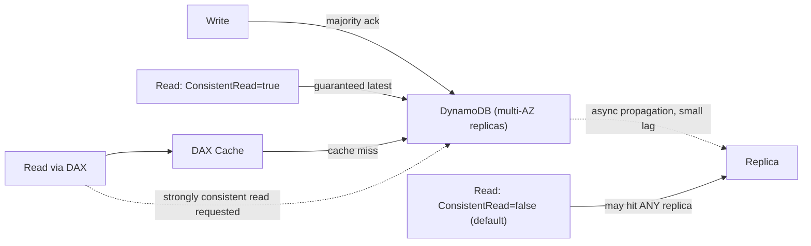

# Module 28 — DynamoDB: Consistency Models, Capacity Planning & DAX

> Domain: DynamoDB | Level: Beginner → Expert | Prerequisite: [[01-Data-Modeling-Partition-Key-Design]]

---

## 1. Fundamentals

### What are DynamoDB's consistency models, and what is capacity planning?
DynamoDB offers a per-read, explicit choice between **eventually consistent reads** (default — may reflect a slightly stale view, but cost half the read-capacity of the alternative) and **strongly consistent reads** (guaranteed to reflect the most recent successful write, at full read-capacity cost, and unavailable on GSIs, Module 27 §2.4). **Capacity planning** covers choosing between DynamoDB's **provisioned** (pre-allocated read/write capacity units, cost-predictable but requiring accurate forecasting) and **on-demand** (auto-scaling per-request billing, operationally simpler but potentially costlier at sustained high volume) throughput modes.

### Why does this matter?
The eventually-consistent-by-default behavior is a genuine, easy-to-miss correctness trap for any read immediately following a write within the same logical operation (a classic "read-your-own-write" requirement) — and provisioned-vs-on-demand is a real cost/operational-complexity trade-off with production consequences either way if chosen without deliberate analysis.

### When does this matter?
Every DynamoDB read operation implicitly makes a consistency choice (even if by not overriding the default); every table's throughput mode is a standing capacity-planning decision — the depth matters for correctly reasoning about read-your-writes requirements and for choosing capacity modes matching actual traffic patterns.

### How does it work (30,000-ft view)?
```csharp
var response = await client.GetItemAsync(new GetItemRequest
{
    TableName = "Orders",
    Key = key,
    ConsistentRead = true // opt into strong consistency for THIS specific read
});
```

---

## 2. Deep Dive

### 2.1 Eventual vs Strong Consistency — the Precise Mechanism
DynamoDB replicates each item across **multiple Availability Zones** for durability — a write is acknowledged once a majority of these replicas confirm it, but an eventually-consistent read may be served by **any** replica, including one that hasn't yet received the most recent write's propagation (typically within a very short window, often single-digit milliseconds, but not zero). A strongly consistent read specifically routes to (or confirms with) a replica guaranteed to reflect the latest acknowledged write — architecturally the same underlying replication-lag concept as every prior module's consistency discussion (PostgreSQL, MongoDB, Redis), here exposed as a **per-read-request** parameter rather than a connection-level or database-wide setting, arguably the most granular consistency control of any engine covered in this course.

### 2.2 The Read-Your-Own-Writes Trap
A common, realistic bug pattern: a service writes an item, then **immediately** reads it back (e.g., to return the newly-created resource in an API response, Module 15 §2.3's 201-with-body pattern) using the default eventually-consistent read — under most conditions this works fine (the propagation window is typically very short), but under load or specific timing, the read can occasionally return stale (or, for a brand-new item, entirely absent) data, producing an intermittent, hard-to-reproduce "the item I just created doesn't exist yet" bug. The fix is straightforward once recognized: use `ConsistentRead: true` specifically for any read that must reflect a write from the *same logical operation/request*, while leaving unrelated, independent reads at the default eventually-consistent (cheaper) setting.

### 2.3 Provisioned vs On-Demand Capacity
**Provisioned** capacity requires forecasting read/write capacity units (RCU/WCU) in advance — cost-efficient and predictable for steady, well-understood traffic, but risks throttling if actual traffic exceeds provisioned capacity (mitigated by auto-scaling, which itself reacts with some lag, not instantaneously). **On-demand** capacity automatically scales to actual request volume with no pre-provisioning, billed per-request — operationally simpler and safer against unexpected traffic spikes, but typically **more expensive per-request** than well-utilized provisioned capacity at sustained volume, making it better suited to unpredictable, spiky, or new/unknown-traffic-pattern workloads than steady, high-volume, well-forecasted ones.

### 2.4 DAX (DynamoDB Accelerator) — a Managed, Write-Through Cache
DAX is a fully-managed, in-memory caching layer sitting in front of DynamoDB, API-compatible with the DynamoDB SDK (minimal application code changes) — providing microsecond-level read latency for cache hits, at the cost of introducing its **own** consistency consideration: DAX's item cache has its own TTL, and a strongly-consistent read *through* DAX still bypasses the cache entirely, going directly to DynamoDB (since DAX cannot guarantee cache freshness matches DynamoDB's own strong-consistency guarantee) — meaning DAX primarily accelerates eventually-consistent reads, and teams needing strong consistency on a hot read path don't get DAX's latency benefit for those specific reads.

### 2.5 Time-To-Live (TTL) and Its Interaction with Streams/GSIs
DynamoDB's native TTL feature automatically deletes items past a specified epoch-timestamp attribute — a background process, not instantaneous (deletion can lag the actual expiration time by up to 48 hours in practice), and TTL-driven deletions **do** appear in DynamoDB Streams (marked distinctly from an application-initiated delete), enabling downstream consumers (e.g., an audit/archival Lambda) to react specifically to expiration-driven removals — directly relevant to the Outbox-pattern-via-Streams design from Module 27 §Advanced Q6/Hard exercise, where outbox items are commonly TTL'd for automatic cleanup after successful publication rather than requiring an explicit delete call.

## 3. Visual Architecture


## 4. Production Example
**Scenario**: An order-creation API returned the newly-created order in its `201 Created` response body (Module 15 §2.3's standard pattern) by writing the order item and then immediately performing a `GetItem` to construct the response — under normal load this worked reliably, but under a specific traffic pattern (a burst of concurrent order creations), a small but consistent percentage of responses intermittently returned an empty/stale result for the just-written order, confusing client integrations that expected the just-created resource to always be immediately retrievable. **Investigation**: confirmed the `GetItem` call used the default eventually-consistent read, and the failure rate correlated with request concurrency/load, consistent with the propagation-lag window occasionally exceeding the time between write and read under contention. **Fix**: added `ConsistentRead: true` specifically to this read-after-write path (accepting its doubled read-capacity cost only for this specific, low-volume-relative-to-overall-traffic operation), eliminating the intermittent empty-response bug entirely. **Lesson**: the default eventually-consistent read is usually fine for independent, unrelated reads, but any read explicitly reading back data from the *same* logical write operation needs strong consistency — a subtle, load-dependent bug that's easy to miss in low-concurrency testing and only manifests reliably under realistic production traffic patterns, directly echoing this course's recurring "test at representative scale" theme (Module 20 §Advanced Q7, Module 23 §4).

## 5. Best Practices
- Use `ConsistentRead: true` for any read-after-write within the same logical operation; leave independent reads at the cheaper eventually-consistent default.
- Choose provisioned capacity (with auto-scaling) for steady, well-forecasted traffic; on-demand for unpredictable, spiky, or new workloads.
- Use DAX specifically for read-heavy, latency-critical, eventually-consistency-tolerant access patterns — not as a blanket cache for every read.
- Use TTL for automatic item expiration (session data, outbox items post-publication) rather than a manual cleanup job, but account for its up-to-48-hour deletion lag in any design depending on precise expiration timing.

## 6. Anti-patterns
- Reading back a just-written item with the default eventually-consistent read and assuming it will always reflect the write (§4's incident).
- Choosing on-demand capacity for steady, high-volume, well-understood traffic without evaluating provisioned capacity's cost efficiency for that specific pattern.
- Assuming DAX accelerates every read uniformly, without recognizing strongly-consistent reads bypass its cache entirely.
- Relying on TTL for precise, time-sensitive expiration without accounting for its documented deletion-lag window.

---

## 10. Interview Questions

### Basic (10)
1. **Q: What is the default read consistency in DynamoDB?** **A:** Eventually consistent — a read may be served by a replica that hasn't yet received the latest write (staleness typically well under a second), which is why read-your-own-write flows must either request `ConsistentRead: true` or be designed to tolerate a just-written item briefly not appearing.
2. **Q: How do you request a strongly consistent read?** **A:** Set `ConsistentRead: true` on the read request.
3. **Q: What's the cost difference between eventually and strongly consistent reads?** **A:** Strongly consistent reads cost double the read-capacity units.
4. **Q: Can a GSI serve a strongly consistent read?** **A:** No — GSIs only support eventually consistent reads.
5. **Q: What's the difference between provisioned and on-demand capacity?** **A:** Provisioned requires pre-forecasted capacity, cost-efficient for steady traffic; on-demand auto-scales per-request, simpler but typically costlier at sustained volume.
6. **Q: What is DAX?** **A:** DynamoDB Accelerator — a managed, in-memory, API-compatible caching layer in front of DynamoDB.
7. **Q: Does a strongly consistent read through DAX use the cache?** **A:** No — it bypasses the DAX cache entirely and goes directly to DynamoDB.
8. **Q: What is DynamoDB TTL?** **A:** A feature automatically deleting items past a specified expiration timestamp attribute.
9. **Q: Is TTL deletion instantaneous at the exact expiration time?** **A:** No — it can lag by up to about 48 hours in practice.
10. **Q: Do TTL-driven deletions appear in DynamoDB Streams?** **A:** Yes, marked distinctly from application-initiated deletes.

### Intermediate (10)
1. **Q: Why can a read immediately following a write occasionally return stale/absent data under the default consistency setting?** **A:** The write is acknowledged once a majority of multi-AZ replicas confirm it, but an eventually-consistent read may be served by any replica, including one that hasn't yet received the write's propagation — typically a very short window, but not zero, especially under load/contention.
2. **Q: Why should `ConsistentRead: true` be applied selectively rather than universally?** **A:** It doubles read-capacity cost — applying it only to reads genuinely needing to reflect a same-operation write (not every read in the system) keeps the added cost proportional to the actual correctness requirement.
3. **Q: Why is on-demand capacity often more expensive per-request than well-utilized provisioned capacity?** **A:** On-demand's pricing bakes in the operational simplicity of not needing forecasting/auto-scaling reaction lag, at a per-request premium — provisioned capacity, correctly sized and consistently utilized, avoids paying that premium, but only pays off if the forecast is accurate.
4. **Q: Why doesn't a strongly consistent read benefit from DAX's cache?** **A:** DAX's cached item may be stale relative to DynamoDB's own latest state — since strong consistency specifically requires the guaranteed-latest value, DAX cannot serve it from cache without potentially violating that guarantee, so it passes the request through to DynamoDB directly.
5. **Q: Why might TTL's up-to-48-hour deletion lag matter for a design relying on it?** **A:** Any logic assuming an item is guaranteed gone immediately at its TTL timestamp (e.g., a uniqueness check relying on expired items being absent) could observe the "expired" item still present for a meaningful window afterward — TTL is a convenience for eventual cleanup, not a precise, immediate deletion guarantee.
6. **Q: Why would provisioned capacity's auto-scaling not fully prevent throttling during a sudden traffic spike?** **A:** Auto-scaling reacts to observed utilization with some lag (it's not instantaneous), so a very sudden spike can exceed currently-provisioned capacity before auto-scaling has a chance to react and add more.
7. **Q: What's a realistic scenario where a team would deliberately choose on-demand capacity despite having reasonably predictable traffic?** **A:** A new service with limited historical traffic data to forecast from — on-demand avoids the risk of under-provisioning (and resulting throttling) during the early period before enough real traffic data exists to make an informed provisioned-capacity forecast, with a later migration to provisioned capacity once patterns are well-understood.
8. **Q: Why is DAX's write-through behavior relevant to cache consistency, beyond just read acceleration?** **A:** Writes going through DAX update both the cache and the underlying table, keeping DAX's cache reasonably fresh for subsequent eventually-consistent reads — without write-through, a separately-cached read layer could serve increasingly stale data as the underlying table changes without DAX's awareness.
9. **Q: Why might a low-concurrency test suite fail to catch the read-your-own-writes bug (§4) that only manifests under production load?** **A:** The propagation-lag window is typically very short, and under low concurrency/no contention, a read shortly after a write is very likely to succeed even with eventual consistency — only under realistic concurrent load does the window's actual, non-zero duration become likely enough to occasionally manifest as a visible failure.
10. **Q: Why would a team monitor DynamoDB's `ConsumedReadCapacityUnits`/`ConsumedWriteCapacityUnits` relative to provisioned capacity as a standing operational metric?** **A:** To proactively catch capacity utilization trending toward the provisioned ceiling (risking throttling) before it actually causes throttled requests, and to inform whether current provisioned levels still match actual traffic patterns as they evolve over time.

### Advanced (10)
1. **Q: Diagnose the read-your-own-writes production incident (§4) from first principles, and design the code-review practice preventing recurrence.**
   **A:** Root cause: an implicit assumption that a `GetItem` immediately following a `PutItem` would always reflect it, without recognizing the default eventually-consistent read doesn't guarantee this. Safeguard: a code-review checklist item explicitly flagging any read-immediately-following-a-write-in-the-same-operation pattern, requiring either `ConsistentRead: true` or, more robustly, avoiding the extra read entirely by constructing the response directly from the data just written (the values are already known in application code from the write itself, making the "read it back" step often unnecessary rather than merely needing a consistency-setting fix) — the *best* fix for this specific pattern is frequently eliminating the redundant read altogether, not just making it strongly consistent.
2. **Q: Explain why "always use ConsistentRead: true everywhere, to be safe" is not a cost-free, obviously-correct universal policy.**
   **A:** It doubles read-capacity cost for every single read in the system, including the (likely large) majority of reads that are entirely independent of any recent write and have no read-your-own-writes requirement at all — applying it universally trades a substantial, ongoing cost increase for a correctness guarantee only a small fraction of reads actually need, precisely the same "don't apply a stronger guarantee everywhere when only specific paths need it" principle recurring throughout this course (Module 19's isolation levels, Module 24's write concern).
3. **Q: Design a capacity-mode migration strategy for a service currently on on-demand capacity that has grown into steady, predictable, high-volume traffic, without risking a throttling regression during the transition.**
   **A:** Analyze several weeks/months of on-demand `ConsumedCapacityUnits` metrics to establish an accurate provisioned-capacity forecast (mean plus a safety margin for observed peak variance); switch to provisioned capacity with auto-scaling configured with a conservative minimum well above the forecasted baseline and a maximum with headroom above observed peaks; monitor closely during and after the transition for any throttling, ready to revert to on-demand quickly if the forecast proves inaccurate — treating the migration as a reversible, monitored experiment rather than a one-way, high-risk cutover.
4. **Q: Explain a scenario where DAX's own failure/unavailability could cause a production incident distinct from a DynamoDB table's own availability issues, and how you'd design around it.**
   **A:** If application code has no fallback path and DAX becomes unavailable (its own cluster issue, not a DynamoDB problem), reads routed exclusively through the DAX client could fail entirely even though the underlying DynamoDB table is perfectly healthy — design the application's data-access layer to catch DAX-specific connectivity failures and fall back to querying DynamoDB directly (at higher latency, but still functional) rather than treating DAX as a single, unconditional dependency with no degradation path.
5. **Q: How would you design a read-heavy access pattern to correctly balance DAX's latency benefit against the read-your-own-writes correctness requirement from §4?**
   **A:** Route the overwhelming majority of independent, latency-sensitive reads (e.g., repeated catalog/product lookups) through DAX for its cache-hit latency benefit, while routing the specific, low-volume read-immediately-after-write path directly to DynamoDB with `ConsistentRead: true` (bypassing DAX entirely for that specific operation, since DAX wouldn't serve a strongly-consistent read from cache anyway per §2.4) — a deliberate, access-pattern-specific routing strategy rather than uniformly routing every read through one single mechanism.
6. **Q: Explain why relying on TTL's deletion timing for a business-logic uniqueness constraint (e.g., "no two active reservations for the same resource within a time window, using TTL to auto-expire old reservations") is a design risk, and how you'd fix it.**
   **A:** TTL's up-to-48-hour deletion lag (§2.5) means an "expired" reservation item can remain present and satisfy a uniqueness-check query for a meaningful window past its intended expiration, potentially blocking a legitimate new reservation that should be allowed once the old one is logically expired — the fix is checking the item's expiration timestamp attribute explicitly in the uniqueness-check query logic itself (treating TTL purely as an eventual storage-cleanup convenience), rather than relying on the item's physical absence (which TTL doesn't guarantee promptly) as the actual business-logic signal.
7. **Q: Design a monitoring and alerting strategy distinguishing "normal, occasional auto-scaling-triggered throttling during a traffic ramp" from "sustained, capacity-forecast-error-driven throttling requiring an urgent capacity increase."**
   **A:** Track `ThrottledRequests` **duration/persistence**, not just occurrence — a brief throttling blip during auto-scaling's reaction lag to a sudden spike, resolving within the scaling adjustment's typical response time, is expected and self-resolving; sustained throttling persisting well beyond that expected reaction window indicates the provisioned baseline itself is genuinely mismatched to actual sustained demand, warranting an urgent, deliberate capacity increase (or a capacity-mode reconsideration, Advanced Q3) rather than waiting for auto-scaling to "eventually" resolve what's actually a forecasting error, not a transient spike.
8. **Q: Explain how you would test for the read-your-own-writes bug class (§4) proactively, before it manifests in production under real load.**
   **A:** A load test specifically exercising the write-then-immediate-read code path at realistic production concurrency (not just correctness-level, low-concurrency testing) — directly the same "test at representative scale" principle from Module 20 §Advanced Q7 and Module 23 §4, here applied specifically to consistency-window-dependent bugs rather than N+1 query-count-scaling bugs, since both bug classes share the property of being invisible at low test volume and only manifesting under realistic concurrent load.
9. **Q: A team proposes enabling DAX universally across their entire DynamoDB-backed application "for the free latency win," without analyzing specific access patterns. Evaluate this as a Principal Engineer.**
   **A:** Push back on "free" — DAX has its own operational cost (cluster provisioning/management), its own potential single-point-of-failure risk if not designed with a fallback (Advanced Q4), and provides genuine latency benefit only for eventually-consistency-tolerant, sufficiently-read-heavy, cache-hit-friendly access patterns — for access patterns with poor cache-hit characteristics (highly unique, rarely-repeated key lookups) or those requiring strong consistency, DAX adds operational complexity without delivering its intended benefit; recommend a targeted rollout to specifically-identified, DAX-suited access patterns (validated via actual cache-hit-rate measurement) rather than a blanket, unanalyzed "enable it everywhere" adoption.
10. **Q: As a Principal Engineer, how would you build organizational guidance helping teams correctly navigate DynamoDB's consistency/capacity trade-off space without requiring deep expertise from every engineer?**
    **A:** Publish a concrete decision matrix (this course's recurring governance-template pattern) explicitly mapping common scenarios to recommendations: "read-immediately-after-write in the same operation → ConsistentRead: true, or better, avoid the extra read"; "independent, latency-tolerant reads → eventually consistent, consider DAX if read-heavy and cache-hit-friendly"; "new/unpredictable traffic → on-demand capacity, migrate to provisioned once patterns stabilize (per Advanced Q3's process)"; require this matrix's reasoning to be referenced explicitly in any DynamoDB-related design review, converting this module's nuanced, easy-to-get-wrong trade-off space into a fast, reliable, broadly-usable decision process.

---

## 11. Coding Exercises

### Easy — Strongly consistent read for a read-after-write path
```csharp
await client.PutItemAsync(new PutItemRequest { TableName = "Orders", Item = orderItem });

var readBack = await client.GetItemAsync(new GetItemRequest
{
    TableName = "Orders",
    Key = key,
    ConsistentRead = true // explicit, deliberate -- guarantees this reflects the write just performed
});
```

### Medium — Eliminate the redundant read entirely (Advanced Q1's better fix)
```csharp
public async Task<OrderDto> CreateOrderAsync(CreateOrderRequest request)
{
    var order = new Order { Id = Guid.NewGuid().ToString(), CustomerId = request.CustomerId, Total = request.Total };
    await _dynamoDb.PutItemAsync(new PutItemRequest { TableName = "Orders", Item = ToAttributeMap(order) });

    // No read-back needed at all -- we already have every value we just wrote, in memory.
    return new OrderDto(order.Id, order.CustomerId, order.Total);
}
```
**Discussion**: This is deliberately the preferred fix over merely adding `ConsistentRead: true` — it removes both the correctness risk (§4) and the doubled-read-capacity cost entirely, since the "read" was never actually necessary once recognized that the just-written values are already known in application code.

### Hard — Capacity-aware retry with exponential backoff for throttled requests
```csharp
public async Task<T> ExecuteWithThrottleRetryAsync<T>(Func<Task<T>> operation, int maxAttempts = 5)
{
    for (int attempt = 1; ; attempt++)
    {
        try
        {
            return await operation();
        }
        catch (ProvisionedThroughputExceededException) when (attempt < maxAttempts)
        {
            var delay = TimeSpan.FromMilliseconds(50 * Math.Pow(2, attempt - 1) + Random.Shared.Next(0, 50));
            await Task.Delay(delay); // exactly Module 2's retry-with-backoff pattern, applied to DynamoDB throttling
        }
    }
}
```

### Expert — DAX client with fallback to direct DynamoDB access (Advanced Q4)
```csharp
public class ResilientDaxClient
{
    private readonly AmazonDaxClient _dax;
    private readonly AmazonDynamoDBClient _dynamoDb;

    public async Task<GetItemResponse> GetItemAsync(GetItemRequest request)
    {
        try
        {
            return await _dax.GetItemAsync(request); // fast path: cache hit or DAX-mediated fetch
        }
        catch (Exception ex) when (ex is AmazonServiceException or TimeoutException)
        {
            // DAX cluster itself is unavailable/degraded -- fall back to DynamoDB directly,
            // at higher latency but WITHOUT taking the whole read path down.
            return await _dynamoDb.GetItemAsync(request);
        }
    }
}
```

---

## 12–17. System Design / LLD / Debugging / Decision / Case Study / Principal

An order-processing platform (§4) eliminates redundant read-after-write calls where possible (Medium exercise's preferred fix), applies `ConsistentRead: true` deliberately only where a genuine read-back is unavoidable, uses provisioned capacity with auto-scaling for steady traffic (migrated from on-demand once patterns stabilized, per Advanced Q3), and layers DAX with an explicit fallback path (Expert exercise) for its read-heavy, eventually-consistency-tolerant catalog lookups specifically. The signature production incident (§4) — an intermittent, load-dependent "just-created order not found" bug from the default eventually-consistent read — is this module's central lesson: DynamoDB's consistency model is per-read and explicit, and any read-after-write-in-the-same-operation pattern requires deliberate attention, ideally by eliminating the redundant read entirely rather than merely upgrading its consistency setting. Principal-level guidance: publish a concrete decision matrix (Advanced Q10) mapping common DynamoDB scenarios to consistency/capacity recommendations, converting this nuanced trade-off space into fast, reliable, broadly-applicable guidance.

## 18. Revision
**Key takeaways**: Eventually consistent reads (default) can occasionally miss a very recent write, especially under load — use `ConsistentRead: true` for any read-after-write-in-the-same-operation, or better, eliminate the redundant read entirely since the just-written values are already known. GSIs never support strong consistency. Provisioned (forecasted, cost-efficient for steady traffic) vs. on-demand (auto-scaling, simpler, costlier at sustained volume) capacity is a genuine trade-off, not a strictly-better-either-way choice. DAX accelerates eventually-consistent reads specifically — strongly consistent reads bypass its cache entirely, and DAX needs its own fallback-path design for resilience. TTL deletion can lag up to ~48 hours — never rely on it for precise-timing business logic.

---

**Next**: This completes the `08-DynamoDB` domain (Modules 27–28), and with it, the full data-layer arc of this course (SQL Server, PostgreSQL, MongoDB, Redis, DynamoDB — Modules 18–28). Continuing autonomously to `09-OOP`.
