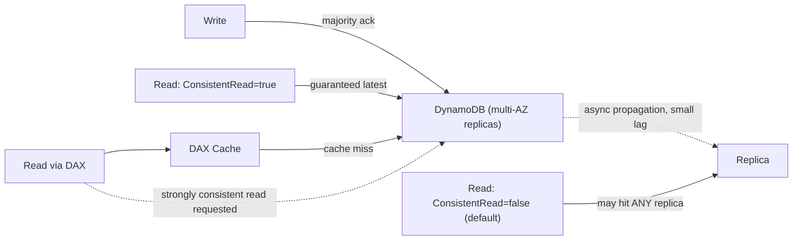
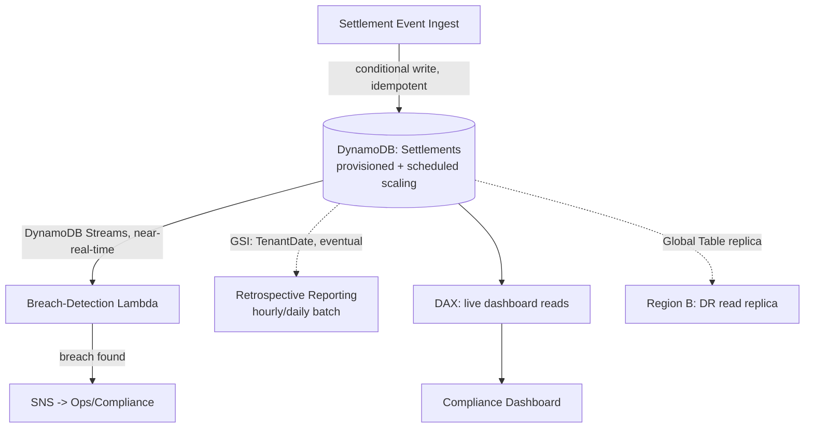
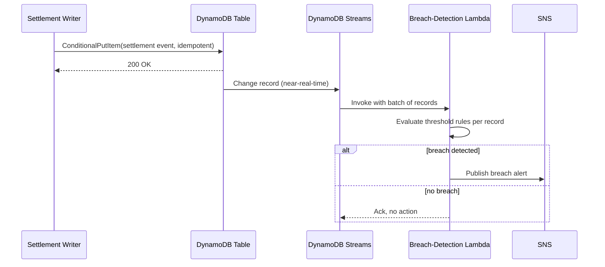

# Module 28 — DynamoDB: Consistency Models, Capacity Planning & DAX

> Domain: DynamoDB | Level: Beginner → Expert | Prerequisite: [[01-Data-Modeling-Partition-Key-Design]]

---

## 1. Fundamentals

### What are DynamoDB's consistency models, and what is capacity planning?
DynamoDB offers a per-read, explicit choice between **eventually consistent reads** (default — may reflect a slightly stale view, but cost half the read-capacity of the alternative) and **strongly consistent reads** (guaranteed to reflect the most recent successful write, at full read-capacity cost, and unavailable on GSIs). **Capacity planning** covers choosing between DynamoDB's **provisioned** (pre-allocated read/write capacity units, cost-predictable but requiring accurate forecasting) and **on-demand** (auto-scaling per-request billing, operationally simpler but potentially costlier at sustained high volume) throughput modes.

### Why does this matter?
The eventually-consistent-by-default behavior is a genuine, easy-to-miss correctness trap for any read immediately following a write within the same logical operation (a classic "read-your-own-write" requirement) — and provisioned-vs-on-demand is a real cost/operational-complexity trade-off with production consequences either way if chosen without deliberate analysis.

### When does this matter?
Every DynamoDB read operation implicitly makes a consistency choice (even if by not overriding the default); every table's throughput mode is a standing capacity-planning decision — the depth matters for correctly reasoning about read-your-writes requirements and for choosing capacity modes matching actual traffic patterns.

### How does it work (30,000-ft view)?
```csharp
var response = await client.GetItemAsync(new GetItemRequest
    {
        TableName = "Orders",
            Key = key,
            ConsistentRead = true // opt into strong consistency for THIS specific read
});
```

---

## 2. Deep Dive

### 2.1 Eventual vs Strong Consistency — the Precise Mechanism
DynamoDB replicates each item across **multiple Availability Zones** for durability — a write is acknowledged once a majority of these replicas confirm it, but an eventually-consistent read may be served by **any** replica, including one that hasn't yet received the most recent write's propagation (typically within a very short window, often single-digit milliseconds, but not zero). A strongly consistent read specifically routes to (or confirms with) a replica guaranteed to reflect the latest acknowledged write — architecturally the same underlying replication-lag concept as every prior module's consistency discussion (PostgreSQL, MongoDB, Redis), here exposed as a **per-read-request** parameter rather than a connection-level or database-wide setting, arguably the most granular consistency control of any engine covered in this course.

### 2.2 The Read-Your-Own-Writes Trap
A common, realistic bug pattern: a service writes an item, then **immediately** reads it back (e.g., to return the newly-created resource in an API response, the 201-with-body pattern) using the default eventually-consistent read — under most conditions this works fine (the propagation window is typically very short), but under load or specific timing, the read can occasionally return stale (or, for a brand-new item, entirely absent) data, producing an intermittent, hard-to-reproduce "the item I just created doesn't exist yet" bug. The fix is straightforward once recognized: use `ConsistentRead: true` specifically for any read that must reflect a write from the *same logical operation/request*, while leaving unrelated, independent reads at the default eventually-consistent (cheaper) setting.

### 2.3 Provisioned vs On-Demand Capacity
**Provisioned** capacity requires forecasting read/write capacity units (RCU/WCU) in advance — cost-efficient and predictable for steady, well-understood traffic, but risks throttling if actual traffic exceeds provisioned capacity (mitigated by auto-scaling, which itself reacts with some lag, not instantaneously). **On-demand** capacity automatically scales to actual request volume with no pre-provisioning, billed per-request — operationally simpler and safer against unexpected traffic spikes, but typically **more expensive per-request** than well-utilized provisioned capacity at sustained volume, making it better suited to unpredictable, spiky, or new/unknown-traffic-pattern workloads than steady, high-volume, well-forecasted ones.

### 2.4 DAX (DynamoDB Accelerator) — a Managed, Write-Through Cache
DAX is a fully-managed, in-memory caching layer sitting in front of DynamoDB, API-compatible with the DynamoDB SDK (minimal application code changes) — providing microsecond-level read latency for cache hits, at the cost of introducing its **own** consistency consideration: DAX's item cache has its own TTL, and a strongly-consistent read *through* DAX still bypasses the cache entirely, going directly to DynamoDB (since DAX cannot guarantee cache freshness matches DynamoDB's own strong-consistency guarantee) — meaning DAX primarily accelerates eventually-consistent reads, and teams needing strong consistency on a hot read path don't get DAX's latency benefit for those specific reads.

### 2.5 Time-To-Live (TTL) and Its Interaction with Streams/GSIs
DynamoDB's native TTL feature automatically deletes items past a specified epoch-timestamp attribute — a background process, not instantaneous (deletion can lag the actual expiration time by up to 48 hours in practice), and TTL-driven deletions **do** appear in DynamoDB Streams (marked distinctly from an application-initiated delete), enabling downstream consumers (e.g., an audit/archival Lambda) to react specifically to expiration-driven removals — directly relevant to the Outbox-pattern-via-Streams design §Advanced Q6/Hard exercise, where outbox items are commonly TTL'd for automatic cleanup after successful publication rather than requiring an explicit delete call.

## 3. Visual Architecture

```mermaid
graph LR
 Write[Write] -->|majority ack| Primary["DynamoDB (multi-AZ replicas)"]
 Primary -.->|async propagation, small lag| Replica2[Replica]
 Client1["Read: ConsistentRead=false (default)"] -->|may hit ANY replica| Replica2
 Client2["Read: ConsistentRead=true"] -->|guaranteed latest| Primary
 Client3[Read via DAX] --> DAX[DAX Cache] -->|cache miss| Primary
 Client3 -.->|strongly consistent read requested| Primary
```

## 4. Production Example
**Scenario**: An order-creation API returned the newly-created order in its `201 Created` response body (the standard pattern) by writing the order item and then immediately performing a `GetItem` to construct the response — under normal load this worked reliably, but under a specific traffic pattern (a burst of concurrent order creations), a small but consistent percentage of responses intermittently returned an empty/stale result for the just-written order, confusing client integrations that expected the just-created resource to always be immediately retrievable. **Investigation**: confirmed the `GetItem` call used the default eventually-consistent read, and the failure rate correlated with request concurrency/load, consistent with the propagation-lag window occasionally exceeding the time between write and read under contention. **Fix**: added `ConsistentRead: true` specifically to this read-after-write path (accepting its doubled read-capacity cost only for this specific, low-volume-relative-to-overall-traffic operation), eliminating the intermittent empty-response bug entirely. **Lesson**: the default eventually-consistent read is usually fine for independent, unrelated reads, but any read explicitly reading back data from the *same* logical write operation needs strong consistency — a subtle, load-dependent bug that's easy to miss in low-concurrency testing and only manifests reliably under realistic production traffic patterns, directly echoing this course's recurring "test at representative scale" theme.

## 5. Best Practices
- Use `ConsistentRead: true` for any read-after-write within the same logical operation; leave independent reads at the cheaper eventually-consistent default.
- Choose provisioned capacity (with auto-scaling) for steady, well-forecasted traffic; on-demand for unpredictable, spiky, or new workloads.
- Use DAX specifically for read-heavy, latency-critical, eventually-consistency-tolerant access patterns — not as a blanket cache for every read.
- Use TTL for automatic item expiration (session data, outbox items post-publication) rather than a manual cleanup job, but account for its up-to-48-hour deletion lag in any design depending on precise expiration timing.

## 6. Anti-patterns
- Reading back a just-written item with the default eventually-consistent read and assuming it will always reflect the write (the incident).
- Choosing on-demand capacity for steady, high-volume, well-understood traffic without evaluating provisioned capacity's cost efficiency for that specific pattern.
- Assuming DAX accelerates every read uniformly, without recognizing strongly-consistent reads bypass its cache entirely.
- Relying on TTL for precise, time-sensitive expiration without accounting for its documented deletion-lag window.

---

## 7. Performance Engineering

### 7.1 The RCU Cost of Consistency — Modeling It Precisely
A strongly consistent read of a 4KB item costs 1 RCU; the equivalent eventually consistent read costs 0.5 RCU — a straightforward 2x multiplier, but one that compounds non-trivially across a high-read-volume service. A balance-check API serving 5,000 reads/sec, if every read is (over-cautiously) upgraded to `ConsistentRead: true` per Advanced Q2's warning, costs 5,000 RCU/sec versus 2,500 RCU/sec at eventual consistency — at provisioned pricing, this is a direct, ongoing, easily-avoidable doubling of the service's read-capacity bill for the (typically large) majority of reads that have no actual read-your-own-writes requirement. The performance-engineering discipline here is precise: profile which specific code paths genuinely need strong consistency (immediately-after-write reads) versus which are independent lookups, and apply `ConsistentRead: true` surgically, not as a blanket "safer" default.

### 7.2 DAX Latency Characteristics — the Numbers That Matter
DAX serves cache hits in **microseconds** (typically under 1ms, often in the hundreds-of-microseconds range) versus DynamoDB's own single-digit-millisecond p99 for a direct table read — roughly a 10x latency improvement on cache hits, which matters disproportionately for latency-budget-constrained synchronous call chains (a payment-authorization path checking a cached rate-limit counter or fraud-score lookup mid-flow, where every millisecond of the synchronous chain counts toward the overall authorization SLA). On a cache **miss**, DAX adds its own round-trip overhead on top of the underlying DynamoDB read, meaning a poorly-tuned cache with a low hit rate can be net *slower* than reading DynamoDB directly — making cache-hit-rate monitoring (§7.4) not an optional nicety but the metric determining whether DAX is actually helping.

### 7.3 GSI Propagation Lag Interacting with Consistency Choices
A GSI never supports strongly consistent reads (§Basic Q4) — meaning for any access pattern routed through a GSI, the propagation-lag question (Module 27 §7.3) isn't a tunable trade-off, it's a structural given. Performance engineering for a GSI-backed read path means designing the *application* around this — e.g., a reporting dashboard reading a GSI should display a "as of" timestamp reflecting the known propagation-lag envelope, rather than presenting GSI data with the same freshness confidence as a base-table strongly-consistent read.

### 7.4 Benchmarking DAX Cache-Hit Rate Before Committing to It
Before adopting DAX for a given access pattern, measure the pattern's actual **key-repetition rate** in production traffic (how often the same partition/sort-key combination is re-requested within DAX's TTL window) — a uniformly-unique-key access pattern (each request touching a distinct, rarely-repeated key) will show a near-zero cache-hit rate regardless of DAX's raw capability, making the DAX cluster's operational cost (Advanced Q9) pure overhead with none of §7.2's latency benefit realized. This is a pre-adoption benchmarking step, not a post-adoption tuning step — the decision to adopt DAX for a given access pattern should be evidence-based (measured hit-rate potential), not assumed.

## 8. Security

### 8.1 IAM Conditions on Consistency and Capacity Operations
Beyond the `LeadingKeys` data-isolation pattern (Module 27 §8.1), IAM policies can also restrict which principals may perform capacity-affecting operations (`dynamodb:UpdateTable`, changing provisioned throughput or switching capacity mode) — a meaningful control for a regulated environment where an unreviewed capacity-mode change (e.g., an engineer switching a production ledger table to on-demand without a cost/throttling-behavior review) should require an elevated, audited permission rather than being available to every service-role credential with table read/write access.

### 8.2 Encryption Considerations Specific to DAX
DAX supports encryption at rest and TLS in transit for cluster-to-client and cluster-to-DynamoDB traffic, but — a detail worth calling out explicitly in a security review — DAX's in-memory cache holds **decrypted** item data in the cluster nodes' memory for serving fast reads, meaning DAX cluster nodes themselves become part of the sensitive-data trust boundary and need the same VPC/security-group isolation discipline as the underlying DynamoDB table, not a lesser standard just because it's "only a cache."

### 8.3 VPC Endpoints for DAX
Like DynamoDB itself, a DAX cluster should be deployed inside a VPC with access restricted via security groups to only the specific application tier consuming it — DAX clusters are inherently VPC-resident (unlike DynamoDB's public-endpoint-capable default), which is actually a stronger default security posture, but still requires deliberate security-group scoping rather than an overly permissive "allow from anywhere in the VPC" rule.

### 8.4 Auditability of Capacity-Mode and Consistency-Setting Changes
For a SOX/PCI-DSS-relevant workload, changes to a table's capacity mode (provisioned ↔ on-demand) or to auto-scaling policy thresholds should be captured in CloudTrail and reviewed as part of standard change-management process — the same audit-trail discipline this course applies to schema/infrastructure changes generally, specifically relevant here because a capacity-mode change has direct cost and availability-risk implications that a compliance-minded organization expects to trace back to an approved change record.

## 9. Scalability

### 9.1 Adaptive Capacity and Its Interaction With On-Demand Mode
On-demand capacity mode has its own internal analog of adaptive capacity — DynamoDB provisions and rebalances partition-level capacity automatically based on observed traffic, without the customer specifying RCU/WCU at all. This means on-demand mode doesn't eliminate the underlying per-partition-throughput-ceiling physics (Module 27 §7.1) — a severely skewed key can still, in principle, hit a per-partition ceiling under on-demand — but it removes the customer's own forecasting burden and reacts to organic traffic growth faster than provisioned-mode auto-scaling's polling-based reaction, at the cost premium already discussed (§2.3).

### 9.2 Provisioned-with-Scheduled-Scaling for Predictable Bursts
For a workload with a **known, calendar-predictable** burst (month-end settlement, quarter-end reporting, a retail Black Friday spike) — as opposed to a genuinely unpredictable one — the correct scalability tool is neither pure on-demand (paying its per-request premium for the entire steady-state period, not just the burst) nor unaided provisioned auto-scaling (which reacts with lag right as the predictable burst begins) but **scheduled scaling**: a pre-configured capacity increase timed ahead of the known burst window, reverting afterward. This captures on-demand's safety for the burst window specifically while retaining provisioned's cost efficiency for the (much longer) steady-state period — the single highest-leverage capacity-planning move for a workload whose bursts are calendar-predictable rather than genuinely random.

### 9.3 Global Tables — Read-Scaling and DR, Not a Write-Scaling Mechanism
Global Tables (Module 27 §9.3, Expert Q1) replicate a table across regions for **read locality and disaster-recovery** purposes — each region serves local reads at local latency, and a regional outage can fail over to a healthy region. It is explicitly **not** a write-throughput-scaling mechanism for a single logical entity: concurrent writes to the same item across regions resolve via last-writer-wins (Expert Q1), meaning Global Tables scale *aggregate* write capacity for *different* items/keys well, but do not provide a safe way to scale writes to the *same* hot item beyond what write-sharding (Module 27 Expert Q3) already provides within a single region.

### 9.4 DAX as a Scalability Multiplier for Read-Heavy Workloads
For a genuinely read-heavy, cache-hit-friendly access pattern (§7.4), DAX effectively multiplies the read capacity available to an application without a corresponding multiplication of DynamoDB's own provisioned/on-demand cost — cache hits are served entirely from DAX's memory, never consuming DynamoDB read capacity at all. This makes DAX a legitimate scalability lever specifically for the read side of a workload, distinct from and complementary to Global Tables' cross-region read-locality scaling — a single-region service under heavy read load from a *concentrated* set of hot keys benefits more from DAX; a globally-distributed user base benefits more from Global Tables' regional read locality; the two are frequently combined (DAX deployed per-region in front of a Global Table).

---

## 10. Interview Questions

### Basic (10)
1. **Q: What is the default read consistency in DynamoDB?** **A:** Eventually consistent — a read may be served by a replica that hasn't yet received the latest write (staleness typically well under a second), which is why read-your-own-write flows must either request `ConsistentRead: true` or be designed to tolerate a just-written item briefly not appearing.
2. **Q: How do you request a strongly consistent read?** **A:** Set `ConsistentRead: true` on the read request.
3. **Q: What's the cost difference between eventually and strongly consistent reads?** **A:** Strongly consistent reads cost double the read-capacity units.
4. **Q: Can a GSI serve a strongly consistent read?** **A:** No — GSIs only support eventually consistent reads.
5. **Q: What's the difference between provisioned and on-demand capacity?** **A:** Provisioned requires pre-forecasted capacity, cost-efficient for steady traffic; on-demand auto-scales per-request, simpler but typically costlier at sustained volume.
6. **Q: What is DAX?** **A:** DynamoDB Accelerator — a managed, in-memory, API-compatible caching layer in front of DynamoDB.
7. **Q: Does a strongly consistent read through DAX use the cache?** **A:** No — it bypasses the DAX cache entirely and goes directly to DynamoDB.
8. **Q: What is DynamoDB TTL?** **A:** A feature automatically deleting items past a specified expiration timestamp attribute.
9. **Q: Is TTL deletion instantaneous at the exact expiration time?** **A:** No — it can lag by up to about 48 hours in practice.
10. **Q: Do TTL-driven deletions appear in DynamoDB Streams?** **A:** Yes, marked distinctly from application-initiated deletes.

### Intermediate (10)
1. **Q: Why can a read immediately following a write occasionally return stale/absent data under the default consistency setting?** **A:** The write is acknowledged once a majority of multi-AZ replicas confirm it, but an eventually-consistent read may be served by any replica, including one that hasn't yet received the write's propagation — typically a very short window, but not zero, especially under load/contention.
2. **Q: Why should `ConsistentRead: true` be applied selectively rather than universally?** **A:** It doubles read-capacity cost — applying it only to reads genuinely needing to reflect a same-operation write (not every read in the system) keeps the added cost proportional to the actual correctness requirement.
3. **Q: Why is on-demand capacity often more expensive per-request than well-utilized provisioned capacity?** **A:** On-demand's pricing bakes in the operational simplicity of not needing forecasting/auto-scaling reaction lag, at a per-request premium — provisioned capacity, correctly sized and consistently utilized, avoids paying that premium, but only pays off if the forecast is accurate.
4. **Q: Why doesn't a strongly consistent read benefit from DAX's cache?** **A:** DAX's cached item may be stale relative to DynamoDB's own latest state — since strong consistency specifically requires the guaranteed-latest value, DAX cannot serve it from cache without potentially violating that guarantee, so it passes the request through to DynamoDB directly.
5. **Q: Why might TTL's up-to-48-hour deletion lag matter for a design relying on it?** **A:** Any logic assuming an item is guaranteed gone immediately at its TTL timestamp (e.g., a uniqueness check relying on expired items being absent) could observe the "expired" item still present for a meaningful window afterward — TTL is a convenience for eventual cleanup, not a precise, immediate deletion guarantee.
6. **Q: Why would provisioned capacity's auto-scaling not fully prevent throttling during a sudden traffic spike?** **A:** Auto-scaling reacts to observed utilization with some lag (it's not instantaneous), so a very sudden spike can exceed currently-provisioned capacity before auto-scaling has a chance to react and add more.
7. **Q: What's a realistic scenario where a team would deliberately choose on-demand capacity despite having reasonably predictable traffic?** **A:** A new service with limited historical traffic data to forecast from — on-demand avoids the risk of under-provisioning (and resulting throttling) during the early period before enough real traffic data exists to make an informed provisioned-capacity forecast, with a later migration to provisioned capacity once patterns are well-understood.
8. **Q: Why is DAX's write-through behavior relevant to cache consistency, beyond just read acceleration?** **A:** Writes going through DAX update both the cache and the underlying table, keeping DAX's cache reasonably fresh for subsequent eventually-consistent reads — without write-through, a separately-cached read layer could serve increasingly stale data as the underlying table changes without DAX's awareness.
9. **Q: Why might a low-concurrency test suite fail to catch the read-your-own-writes bug that only manifests under production load?** **A:** The propagation-lag window is typically very short, and under low concurrency/no contention, a read shortly after a write is very likely to succeed even with eventual consistency — only under realistic concurrent load does the window's actual, non-zero duration become likely enough to occasionally manifest as a visible failure.
10. **Q: Why would a team monitor DynamoDB's `ConsumedReadCapacityUnits`/`ConsumedWriteCapacityUnits` relative to provisioned capacity as a standing operational metric?** **A:** To proactively catch capacity utilization trending toward the provisioned ceiling (risking throttling) before it actually causes throttled requests, and to inform whether current provisioned levels still match actual traffic patterns as they evolve over time.

### Advanced (10)
1. **Q: Diagnose the read-your-own-writes production incident from first principles, and design the code-review practice preventing recurrence.**
 **A:** Root cause: an implicit assumption that a `GetItem` immediately following a `PutItem` would always reflect it, without recognizing the default eventually-consistent read doesn't guarantee this. Safeguard: a code-review checklist item explicitly flagging any read-immediately-following-a-write-in-the-same-operation pattern, requiring either `ConsistentRead: true` or, more robustly, avoiding the extra read entirely by constructing the response directly from the data just written (the values are already known in application code from the write itself, making the "read it back" step often unnecessary rather than merely needing a consistency-setting fix) — the *best* fix for this specific pattern is frequently eliminating the redundant read altogether, not just making it strongly consistent.
2. **Q: Explain why "always use ConsistentRead: true everywhere, to be safe" is not a cost-free, obviously-correct universal policy.**
 **A:** It doubles read-capacity cost for every single read in the system, including the (likely large) majority of reads that are entirely independent of any recent write and have no read-your-own-writes requirement at all — applying it universally trades a substantial, ongoing cost increase for a correctness guarantee only a small fraction of reads actually need, precisely the same "don't apply a stronger guarantee everywhere when only specific paths need it" principle recurring throughout this course.
3. **Q: Design a capacity-mode migration strategy for a service currently on on-demand capacity that has grown into steady, predictable, high-volume traffic, without risking a throttling regression during the transition.**
 **A:** Analyze several weeks/months of on-demand `ConsumedCapacityUnits` metrics to establish an accurate provisioned-capacity forecast (mean plus a safety margin for observed peak variance); switch to provisioned capacity with auto-scaling configured with a conservative minimum well above the forecasted baseline and a maximum with headroom above observed peaks; monitor closely during and after the transition for any throttling, ready to revert to on-demand quickly if the forecast proves inaccurate — treating the migration as a reversible, monitored experiment rather than a one-way, high-risk cutover.
4. **Q: Explain a scenario where DAX's own failure/unavailability could cause a production incident distinct from a DynamoDB table's own availability issues, and how you'd design around it.**
 **A:** If application code has no fallback path and DAX becomes unavailable (its own cluster issue, not a DynamoDB problem), reads routed exclusively through the DAX client could fail entirely even though the underlying DynamoDB table is perfectly healthy — design the application's data-access layer to catch DAX-specific connectivity failures and fall back to querying DynamoDB directly (at higher latency, but still functional) rather than treating DAX as a single, unconditional dependency with no degradation path.
5. **Q: How would you design a read-heavy access pattern to correctly balance DAX's latency benefit against the read-your-own-writes correctness requirement?**
 **A:** Route the overwhelming majority of independent, latency-sensitive reads (e.g., repeated catalog/product lookups) through DAX for its cache-hit latency benefit, while routing the specific, low-volume read-immediately-after-write path directly to DynamoDB with `ConsistentRead: true` (bypassing DAX entirely for that specific operation, since DAX wouldn't serve a strongly-consistent read from cache anyway) — a deliberate, access-pattern-specific routing strategy rather than uniformly routing every read through one single mechanism.
6. **Q: Explain why relying on TTL's deletion timing for a business-logic uniqueness constraint (e.g., "no two active reservations for the same resource within a time window, using TTL to auto-expire old reservations") is a design risk, and how you'd fix it.**
 **A:** TTL's up-to-48-hour deletion lag means an "expired" reservation item can remain present and satisfy a uniqueness-check query for a meaningful window past its intended expiration, potentially blocking a legitimate new reservation that should be allowed once the old one is logically expired — the fix is checking the item's expiration timestamp attribute explicitly in the uniqueness-check query logic itself (treating TTL purely as an eventual storage-cleanup convenience), rather than relying on the item's physical absence (which TTL doesn't guarantee promptly) as the actual business-logic signal.
7. **Q: Design a monitoring and alerting strategy distinguishing "normal, occasional auto-scaling-triggered throttling during a traffic ramp" from "sustained, capacity-forecast-error-driven throttling requiring an urgent capacity increase."**
 **A:** Track `ThrottledRequests` **duration/persistence**, not just occurrence — a brief throttling blip during auto-scaling's reaction lag to a sudden spike, resolving within the scaling adjustment's typical response time, is expected and self-resolving; sustained throttling persisting well beyond that expected reaction window indicates the provisioned baseline itself is genuinely mismatched to actual sustained demand, warranting an urgent, deliberate capacity increase (or a capacity-mode reconsideration, Advanced Q3) rather than waiting for auto-scaling to "eventually" resolve what's actually a forecasting error, not a transient spike.
8. **Q: Explain how you would test for the read-your-own-writes bug class proactively, before it manifests in production under real load.**
 **A:** A load test specifically exercising the write-then-immediate-read code path at realistic production concurrency (not just correctness-level, low-concurrency testing) — directly the same "test at representative scale" principle §Advanced Q7 and, here applied specifically to consistency-window-dependent bugs rather than N+1 query-count-scaling bugs, since both bug classes share the property of being invisible at low test volume and only manifesting under realistic concurrent load.
9. **Q: A team proposes enabling DAX universally across their entire DynamoDB-backed application "for the free latency win," without analyzing specific access patterns. Evaluate this as a Principal Engineer.**
 **A:** Push back on "free" — DAX has its own operational cost (cluster provisioning/management), its own potential single-point-of-failure risk if not designed with a fallback (Advanced Q4), and provides genuine latency benefit only for eventually-consistency-tolerant, sufficiently-read-heavy, cache-hit-friendly access patterns — for access patterns with poor cache-hit characteristics (highly unique, rarely-repeated key lookups) or those requiring strong consistency, DAX adds operational complexity without delivering its intended benefit; recommend a targeted rollout to specifically-identified, DAX-suited access patterns (validated via actual cache-hit-rate measurement) rather than a blanket, unanalyzed "enable it everywhere" adoption.
10. **Q: As a Principal Engineer, how would you build organizational guidance helping teams correctly navigate DynamoDB's consistency/capacity trade-off space without requiring deep expertise from every engineer?**
 **A:** Publish a concrete decision matrix (this course's recurring governance-template pattern) explicitly mapping common scenarios to recommendations: "read-immediately-after-write in the same operation → ConsistentRead: true, or better, avoid the extra read"; "independent, latency-tolerant reads → eventually consistent, consider DAX if read-heavy and cache-hit-friendly"; "new/unpredictable traffic → on-demand capacity, migrate to provisioned once patterns stabilize (per Advanced Q3's process)"; require this matrix's reasoning to be referenced explicitly in any DynamoDB-related design review, converting this module's nuanced, easy-to-get-wrong trade-off space into a fast, reliable, broadly-usable decision process.

### Expert (FinTech Principal Panel)

1. **Q: A payments platform uses DynamoDB Global Tables (multi-region, active-active) for low latency and DR. What's the specific danger for money, and how do you design around it?**
 **A:** Global Tables replicate asynchronously and resolve concurrent cross-region writes to the same item with **last-writer-wins (LWW)** based on timestamps — which for money is dangerous: if the same account/item is written in two regions within the replication window, **one update silently overwrites the other** (a lost update — money created or destroyed), and there's no conflict *error*, just a silently-chosen winner. Also, a read in one region may not yet reflect a write in another (eventual cross-region consistency), so a balance check in Region B can miss a debit committed in Region A. Design around it: (1) **single-writer-region per entity** — route all writes for a given account to one "home" region (by account affinity/sharding), so the same item is never concurrently written in two regions and LWW conflicts can't arise; other regions read locally and forward writes to the home region. (2) **Conditional writes + idempotency** so even a mis-routed or retried write is guarded and exactly-once. (3) Treat the **authoritative money mutation as region-pinned**, using Global Tables for read locality and DR failover, not for concurrent multi-region writes to the same balance. (4) On regional failover, ensure a clean cutover of write ownership (fencing) so two regions don't both accept writes for the same account. The Principal framing: Global Tables' LWW is fine for read-scaling and DR but **unsafe as a concurrent multi-region writer for money** — pin each account's writes to one region (single-writer), use conditional/idempotent writes, and reserve the multi-region capability for locality and failover, because a silent LWW lost update on a balance is exactly the failure a payments platform cannot have.
 **Why correct:** Identifies LWW silent lost-update + cross-region read staleness and prescribes single-writer-region affinity + conditional/idempotent writes + fenced failover, scoping Global Tables to locality/DR.
 **Common mistakes:** Concurrent multi-region writes to the same balance under LWW; assuming replication is synchronous/conflict-safe; no write-ownership fencing on failover.
 **Follow-ups:** "Why is LWW a silent lost update rather than an error?" / "How does single-writer-region eliminate the conflict?" / "What must happen to write ownership during a regional failover?"

2. **Q: To authorize a withdrawal you need the current balance, but DynamoDB reads are eventually consistent by default. Do you use a strongly consistent read — and is that even sufficient? Reason it through.**
 **A:** A default eventually-consistent read can return a **stale** balance that misses a just-committed debit, which would wrongly approve a withdrawal — so at minimum an authorization read must be **`ConsistentRead: true`** (strongly consistent, ~2× RCU, single-region only — it does *not* extend across Global Tables regions). But even a strong read is **not sufficient by itself**, because between the read and your subsequent write another transaction can change the balance (a read-then-write race — the classic lost-update/double-spend, same as elsewhere in this course). The robust answer is to **not authorize on a separate read at all**: enforce the invariant on the *write* with a **conditional update** — `UpdateItem SET Balance = Balance -:amt` with `ConditionExpression: "Balance >=:amt"` — which evaluates the current value atomically at write time, so only one of two racing withdrawals succeeds regardless of what any prior read saw. Use a strongly consistent read only when you genuinely need to *display/decide* on current state before writing, and even then back it with the conditional write as the actual guard. The Principal framing: an eventually-consistent read is unsafe for authorization (stale → over-approve), a strongly consistent read fixes staleness but not the read-then-write race, and the correct design pushes the invariant into an **atomic conditional write** so the datastore is the arbiter — a separate balance read is at best advisory, never the enforcement point.
 **Why correct:** Rules out eventually-consistent reads for authorization, notes strong reads fix staleness but not the race, and lands on the atomic conditional write as the real enforcement (with the single-region caveat of strong reads).
 **Common mistakes:** Authorizing on an eventually-consistent read; trusting a strong read + separate write (race); assuming `ConsistentRead` works across Global Tables regions.
 **Follow-ups:** "Why doesn't a strongly consistent read alone prevent double-spend?" / "Does `ConsistentRead` work across regions?" (no) / "How does the conditional write make the separate read unnecessary?"

3. **Q: A real-time risk engine reads positions from a DynamoDB Global Table spanning three regions to compute intraday exposure limits. How do you bound the staleness a risk calculation might be operating on, and what happens if a limit breach is computed against stale data?**
 **A:** Global Tables replicate asynchronously — a region's local read (even a `ConsistentRead: true` request, which only guarantees consistency **within that region**, not against other regions' latest writes) can lag another region's most recent write by the current replication latency, which is typically sub-second but not bounded by any hard SLA guarantee from AWS. For a risk engine, this means a locally-strongly-consistent read is not equivalent to a globally-strongly-consistent one — a position update written in Region A moments ago may not yet be visible to a risk calculation running in Region B. Mitigation: (1) **pin the authoritative risk calculation to the same region as the position-update writer** (the single-writer-region pattern, Expert Q1) for any calculation where staleness has genuine financial-risk consequences, eliminating the cross-region staleness question entirely for that critical path; (2) where a genuinely multi-region risk view is unavoidable (aggregating global exposure across regional books), **instrument and expose the measured replication lag** (via CloudWatch's `ReplicationLatency` metric) as an input to the risk calculation itself — a risk engine that knows it might be working with data up to N seconds stale can apply a conservative buffer to its limit thresholds rather than treating the read as ground truth; (3) treat any limit-breach determination computed against cross-region data as **provisional**, triggering a same-region confirming read before an automated action (e.g., halting trading) is taken, since a false-positive breach from stale data has real business cost, and a false negative (missing a genuine breach due to staleness) has real risk cost — neither is acceptable to leave to chance. The Principal framing: staleness in a risk engine isn't a data-freshness inconvenience, it's a **quantifiable risk-model input** — measure it, bound it, and design the critical decision path (single-writer-region for authoritative calculations) to avoid depending on it at all where the stakes are highest.
 **Why correct:** Correctly identifies that regional strong consistency doesn't extend cross-region, prescribes single-writer-region pinning for the critical path, and treats measured replication lag as an explicit input to risk-threshold conservatism rather than an ignored detail.
 **Common mistakes:** Assuming `ConsistentRead: true` provides cross-region consistency; treating all regions' views as equally authoritative for a risk calculation; not distinguishing "this specific breach determination is provisional pending confirmation" from a final action.
 **Follow-ups:** "How would you measure and expose replication lag to the risk calculation?" / "What's the cost of pinning writes to a single region for a globally-distributed trading desk?" / "How do you handle a regional failover for the pinned writer region?"

4. **Q: A settlement-batch system runs a predictable, massive write spike every night at 8pm (10x normal volume, for exactly 45 minutes) as trades settle. The team is debating on-demand vs. provisioned-with-auto-scaling vs. something else. Walk through the decision.**
 **A:** On-demand handles the spike safely but pays its per-request premium for the other 23+ hours/day of steady, well-below-peak traffic — a poor fit given how *predictable* (not just bursty) this pattern is. Provisioned-with-auto-scaling risks a throttling window at the start of each night's spike, because auto-scaling reacts to observed utilization with a polling-interval lag, and a spike arriving at a known, fixed time every night will trigger that same lag every single night — a recurring, self-inflicted incident rather than a rare surprise. The correct tool is **provisioned capacity with scheduled scaling** (§9.2): a pre-configured capacity increase (via Application Auto Scaling's scheduled actions, or a simple cron-triggered `UpdateTable` call) that raises WCU ahead of 8pm and reverts afterward — capturing on-demand's safety for the exact 45-minute window that needs it, at provisioned's steady-state cost efficiency for the remaining ~23 hours. This requires operational discipline the other two options don't (someone must configure and maintain the schedule, and a settlement-time change requires updating it), but for a genuinely calendar-predictable pattern, that operational cost is smaller than either on-demand's ongoing premium or provisioned-auto-scaling's recurring throttling risk. The Principal framing: "predictable" and "bursty" are different properties — on-demand is the right tool for **unpredictable** bursts, scheduled scaling is the right tool for **predictable** ones, and conflating them leads to either paying an unnecessary ongoing premium or accepting a recurring, avoidable throttling incident.
 **Why correct:** Distinguishes predictable from unpredictable bursts, correctly identifies unaided auto-scaling's recurring lag-driven throttling risk for a fixed-time spike, and prescribes scheduled scaling as the properly-fitted tool.
 **Common mistakes:** Defaulting to on-demand for any burst without checking whether it's actually predictable; assuming provisioned auto-scaling reacts fast enough for a spike whose timing is precisely known in advance; not accounting for the operational maintenance cost of a scheduled-scaling configuration.
 **Follow-ups:** "What if the settlement time occasionally shifts by an hour — how brittle is a fixed schedule?" / "How would you size the scheduled capacity increase?" / "What's your fallback if the scheduled scaling itself fails to apply in time?"

5. **Q: A payment-processing service uses DynamoDB-stored idempotency keys with a 24-hour TTL to deduplicate retried payment requests, cached in front by DAX for latency. Walk through a scenario where DAX's write-through caching and TTL's deletion lag interact to create a subtle correctness gap, and how you'd close it.**
 **A:** DAX's write-through behavior updates the cache on writes, but **TTL-driven deletions are not application writes** — they're a DynamoDB-internal background process, and DAX's item cache has its **own independent TTL configuration**, separate from the DynamoDB table's TTL attribute. If DAX's own cache TTL is configured longer than the DynamoDB table's TTL (a plausible misconfiguration if the two were set independently, by different engineers, at different times), a scenario emerges: an idempotency-key item expires and is deleted from the base DynamoDB table (after the table's 24-hour TTL, itself subject to up to ~48 hours of lag, §2.5/§6), but DAX's cache — unaware of the base-table deletion, since deletion isn't a write DAX observes as a cache-invalidating event unless DAX itself is queried through for the delete — could still be serving a cached "yes, this idempotency key exists, here's the prior result" response for a stale cache entry past its own, longer TTL window, or conversely could be serving a cache **miss** (correctly reporting the key as gone) prematurely, before DynamoDB's lagged TTL deletion has even physically occurred — either direction is a subtle mismatch between what the cache believes and what the source of truth's *actual* (not nominal) state is. The fix: **align DAX's item-cache TTL to be equal to or shorter than the DynamoDB table's TTL configuration**, ensuring DAX never serves a cached idempotency result the base table itself would already consider expired (the safe-direction mismatch), and — more fundamentally — treat DAX's cache as strictly a **latency optimization for the exists-check**, never the sole arbiter of idempotency-key validity; the actual conditional write against DynamoDB (`attribute_not_exists`) remains the authoritative, correctness-bearing check regardless of what DAX's cache reported. The Principal framing: TTL's deletion-lag imprecision (§2.5) compounds with a second, independently-configured cache layer's own TTL — the two must be explicitly reasoned about together, and DAX should never be trusted as the sole source of idempotency truth, only as an accelerator in front of the conditional-write check that actually enforces it.
 **Why correct:** Identifies DAX's independent cache-TTL configuration as a second, separately-tunable staleness source compounding TTL's own deletion lag, and correctly keeps the conditional write as the sole authoritative idempotency check regardless of cache state.
 **Common mistakes:** Assuming DAX's write-through behavior also captures TTL-driven deletions as cache-invalidating events; configuring DAX's cache TTL independently of the base table's TTL without reasoning about the interaction; trusting a DAX cache hit/miss as the actual idempotency determination instead of the conditional write.
 **Follow-ups:** "Why doesn't DAX automatically invalidate its cache when a TTL deletion happens on the base table?" / "What TTL alignment would you configure, and why?" / "Should idempotency-key checks even go through DAX at all, given they need strong correctness?"

6. **Q: A real-time compliance-monitoring system needs to detect a specific trading-limit breach within 2 seconds of it occurring, reading from a GSI (since the query pattern — "all trades exceeding threshold X across all accounts" — doesn't match the base table's account-scoped key). Given GSIs never support strong consistency, how do you meet a hard latency-to-detection SLA?**
 **A:** The GSI's own propagation lag (Module 27 §7.3, this module §7.3) — typically sub-second but not SLA-guaranteed, and capable of widening materially under write bursts — is in direct tension with a hard 2-second detection SLA, since GSI eventual consistency provides no upper bound on staleness the application can rely on contractually. Two complementary approaches: (1) **Don't route the detection path through the GSI at all** — instead, consume DynamoDB Streams directly (near-real-time, ordered, and not subject to a *separate* propagation-lag layer the way a GSI read is) with a stream-processing consumer (Kinesis Data Streams for DynamoDB, or a Lambda trigger) evaluating the threshold condition on each write event as it occurs, giving a detection latency bounded by Streams' own near-real-time delivery rather than GSI query-time propagation; the GSI remains useful for **retrospective** querying ("show me all breaches from the last hour") but is explicitly not the real-time detection mechanism. (2) Where a GSI-based query genuinely is part of the real-time path, **measure** `ReplicationLatency` continuously and treat a detection made through the GSI as **provisional pending a confirming direct base-table read** for the specific account/trade flagged — trading a small amount of additional latency for eliminating the unbounded-staleness risk on the specific item the alert concerns. The Principal framing: eventual consistency without a bound is fundamentally incompatible with a *hard* real-time SLA — the answer isn't to force the GSI to be "consistent enough," it's to recognize that DynamoDB Streams (an ordered, near-real-time event feed) is the architecturally correct primitive for real-time detection, with the GSI properly scoped to retrospective/reporting queries where its consistency model is actually an acceptable fit.
 **Why correct:** Recognizes GSI eventual consistency has no SLA-suitable staleness bound, and correctly redirects the hard-real-time detection requirement to DynamoDB Streams rather than trying to force GSI reads to meet a latency guarantee the underlying mechanism can't promise.
 **Common mistakes:** Trying to "tune" GSI propagation to meet a hard SLA it fundamentally can't guarantee; using the GSI for both real-time detection and retrospective reporting without recognizing they have different consistency requirements; not knowing DynamoDB Streams exists as a lower-latency alternative primitive for this exact class of problem.
 **Follow-ups:** "Why is DynamoDB Streams lower-latency than a GSI for this use case?" / "What happens if the Streams consumer itself falls behind under load?" / "How would you handle a false-positive detection from the Streams path?"

7. **Q: Your team is debating whether "eventually consistent" in DynamoDB's documentation means the same thing as "eventually consistent" in a distributed system generally (e.g., DNS propagation, CDN cache invalidation). Clarify the distinction and explain why conflating them causes design mistakes.**
 **A:** DynamoDB's eventual consistency has a specific, narrow, well-bounded mechanism (§2.1): a write is majority-acknowledged across multi-AZ replicas within the same region, and an eventually-consistent read may hit a replica that hasn't yet received that specific write's propagation — typically resolving within milliseconds, not the seconds-to-minutes (or longer) staleness windows associated with DNS TTL propagation or CDN edge-cache invalidation, which involve entirely different mechanisms (independent caching layers with their own, often much longer, TTLs, potentially thousands of geographically distributed nodes). Conflating the two leads to two opposite mistakes: (1) **underestimating** DynamoDB's actual staleness window because "eventually consistent" sounds vague and scary, leading to unnecessarily defensive `ConsistentRead: true` usage everywhere (§7.1's cost problem) when the actual risk window is narrow and specific (read-immediately-after-write); (2) **overestimating** DynamoDB's freshness guarantee by assuming "it's basically instant, eventual consistency is a formality" and therefore not building any read-your-own-writes discipline at all, missing the genuine (if narrow) staleness window that DOES cause real, if infrequent, production bugs (Module 28's central incident). The correct mental model treats DynamoDB's eventual consistency as a **precisely-scoped, single-region, sub-second-typical** phenomenon with a specific cause (multi-AZ replication lag) — distinct from, and much tighter-bounded than, "eventual consistency" as a general distributed-systems term covering mechanisms with vastly different staleness characteristics.
 **Why correct:** Correctly distinguishes DynamoDB's specific, narrow replication-lag mechanism from the broader distributed-systems usage of "eventually consistent," and identifies the two opposite design mistakes (over- and under-caution) that conflating them produces.
 **Common mistakes:** Assuming "eventually consistent" always implies a large, unpredictable staleness window regardless of the specific system; assuming all "eventually consistent" systems are interchangeable in their staleness characteristics; applying a CDN/DNS-appropriate caution level to a fundamentally different, much-tighter-bounded DynamoDB mechanism (or vice versa).
 **Follow-ups:** "What specifically causes DynamoDB's replication lag, mechanistically?" / "Is there a documented upper bound on DynamoDB's eventual-consistency window?" / "How would you explain this distinction to a team defaulting to `ConsistentRead: true` everywhere out of caution?"

8. **Q: On-demand capacity mode is billed per-request with automatic scaling. During an incident where a downstream service starts retrying failed calls aggressively (a retry storm) against a DynamoDB table in on-demand mode, what happens to cost and availability, and how do you defend against it?**
 **A:** On-demand mode's core value proposition — automatically absorbing traffic spikes without throttling — becomes a **liability** under a retry storm specifically because it removes the natural backpressure a provisioned table's throttling would otherwise provide: a provisioned table under a retry storm would throttle once its capacity ceiling is hit, which (while causing errors) at least **bounds the cost** and signals the problem loudly via `ThrottledRequests`; an on-demand table instead **scales to absorb the storm**, meaning every retried request succeeds and is billed — converting what should be a bounded, alarmed failure into an **unbounded, silently-expensive** one, since the system "working as designed" (successfully scaling) is exactly what masks the underlying problem (a downstream consumer stuck in a retry loop) from being loudly surfaced. Defense: (1) the retry logic itself must have **capped, backoff-based retries with a circuit breaker** (this course's standing resilience pattern) so a downstream failure doesn't translate into unbounded request volume against DynamoDB regardless of capacity mode; (2) even on on-demand tables, configure **AWS Budgets/CloudWatch billing alarms** on the table's cost specifically, since on-demand's "no throttling ceiling" removes the natural cost-bounding signal a provisioned ceiling provides; (3) monitor **request-rate anomalies** (a sudden, sustained multiple-of-baseline request volume) as its own alert, independent of throttling (which on-demand mode may never trigger even during a genuine incident) — the absence of throttling errors is not evidence the system is healthy under on-demand mode, precisely because on-demand is designed to prevent that signal from firing. The Principal framing: on-demand mode trades a *visible, bounded* failure mode (provisioned throttling) for an *invisible, unbounded* one (successfully-absorbed-but-expensive retry storms) — the mitigation isn't avoiding on-demand mode, it's ensuring the actual backpressure/circuit-breaking discipline lives in the calling code, not implicitly relying on DynamoDB's own capacity ceiling to provide it.
 **Why correct:** Correctly identifies that on-demand mode removes the natural cost-bounding/alerting signal a provisioned ceiling provides during a retry storm, and prescribes caller-side circuit breaking plus independent cost/request-rate alerting rather than relying on DynamoDB itself to surface the problem.
 **Common mistakes:** Assuming on-demand mode is strictly safer than provisioned because "it never throttles"; not recognizing that successfully-absorbed traffic under on-demand can still represent a serious, expensive incident; relying solely on `ThrottledRequests`-based alerting, which on-demand mode may never trigger.
 **Follow-ups:** "Why would a provisioned table's throttling actually be a useful signal here?" / "What billing-alarm threshold would you set, and how would you avoid false positives from legitimate growth?" / "Where should the circuit breaker actually live in the call chain?"

9. **Q: Explain the difference between DAX's item cache and its query cache, and describe a scenario where relying on the wrong one produces stale results even though your consistency setting is technically correct.**
 **A:** DAX maintains two distinct caches with different invalidation behavior: the **item cache** stores individual item results (`GetItem` by primary key) and is invalidated per-item on a write-through basis for writes that go **through DAX itself** — reasonably fresh for the specific-item-lookup pattern. The **query cache** stores the **result sets** of `Query`/`Scan` operations, keyed by the full request parameters — and critically, is invalidated only by its own **separately configured TTL**, not by write-through, because DAX has no general way to know which specific writes would change a given arbitrary query's result set membership. The stale-result scenario: an application queries `Query(PK = ACCOUNT#123)` through DAX (populating the query cache with that result set), then a **new item** is written under that same partition key (e.g., a new ledger entry) — even through DAX itself (triggering item-cache invalidation for that specific new item), the **query cache's** previously-cached result set for `Query(PK = ACCOUNT#123)` is **not** invalidated by this write, since DAX doesn't attempt to determine which cached queries a given write might affect. A subsequent identical query, served from the (stale) query cache, would omit the newly-written item until the query cache's own TTL expires — even though `ConsistentRead` was never the issue and the item cache is behaving correctly. The fix: configure the query-cache TTL deliberately short for any access pattern where new items can appear that must be reflected promptly (or bypass the query cache entirely for that pattern, reading `Query` results directly from DynamoDB), and never assume a `Query` result served through DAX has the same write-through freshness guarantee a single-item `GetItem` through DAX provides. The Principal framing: DAX's two caches have fundamentally different consistency mechanisms — item-cache write-through freshness does not extend to the query cache, and a team assuming uniform DAX freshness behavior across both `GetItem` and `Query` access patterns will be surprised by stale `Query` results specifically.
 **Why correct:** Correctly distinguishes DAX's item cache (write-through invalidated) from its query cache (TTL-only invalidated, since arbitrary query-result-set membership can't be write-through-tracked), and identifies the specific stale-query-result failure mode this asymmetry produces.
 **Common mistakes:** Assuming DAX's write-through behavior applies uniformly to both item and query caches; not configuring the query cache's TTL deliberately for access patterns with frequently-changing result-set membership; debugging a stale-query-result symptom by checking `ConsistentRead` settings instead of the query-cache TTL.
 **Follow-ups:** "Why can't DAX write-through-invalidate the query cache the same way it does the item cache?" / "How would you detect this staleness in production before a user reports it?" / "Would bypassing the query cache for this access pattern eliminate the DAX benefit entirely?"

10. **Q: As a Principal Engineer reviewing a proposal to migrate a steady, well-understood, high-volume DynamoDB table from provisioned to on-demand capacity "to simplify operations," what would you want quantified before approving it, and why might you push back?**
 **A:** "Simplify operations" is a real and legitimate benefit (no more capacity forecasting, no auto-scaling policy tuning, no throttling-during-organic-growth risk) — but it's not free, and a Principal-level review should quantify the trade rather than accept the simplification argument at face value. What I'd want quantified: (1) **actual cost delta** — pull the table's historical `ConsumedReadCapacityUnits`/`ConsumedWriteCapacityUnits` and compute what the same traffic would cost under on-demand's per-request pricing versus current provisioned spend; for genuinely steady, well-forecasted traffic, this is very often a **substantial cost increase** (on-demand's per-request premium is real), and "simplify operations" should be weighed explicitly against that number, not treated as free; (2) **retry-storm/cost-runaway exposure** (§Expert Q8) — does this table sit behind a call chain with adequate caller-side circuit breaking, or would on-demand's removal of the natural throttling backstop create new, unbounded-cost exposure during a downstream incident that provisioned mode's throttling ceiling currently (if painfully) bounds; (3) **whether the "operational simplicity" argument is solving a real, recently-experienced pain point** (repeated throttling incidents, frequent manual capacity adjustments) or a hypothetical one — if the team hasn't actually experienced provisioned-mode operational pain, the migration may be solving a problem that doesn't exist at meaningful cost. My likely recommendation for a **steady, well-understood, high-volume** table specifically: keep provisioned-with-auto-scaling (tuned correctly, this already handles organic growth reasonably well) and reserve on-demand for tables whose traffic is genuinely volatile or new — but I'd want the actual cost-delta number in front of me before making that call, not a general principle, because the right answer for the case in front of me is a quantified engineering trade-off, not a category-based, one-size-fits-all rule.
 **Why correct:** Refuses to accept "simplify operations" as a free win, insists on quantifying the actual cost delta and retry-storm exposure change before approving, and grounds the recommendation in whether the team has genuinely experienced provisioned-mode operational pain rather than a hypothetical one.
 **Common mistakes:** Approving a capacity-mode migration based on the qualitative "simpler" argument alone without a cost analysis; assuming on-demand is a strictly-safer default without considering the retry-storm cost-exposure trade-off; applying a blanket policy ("always use on-demand" or "always use provisioned") instead of evaluating the specific table's traffic characteristics.
 **Follow-ups:** "How would you present this cost-delta analysis to a stakeholder who just wants 'less to manage'?" / "What would make you approve the migration despite a cost increase?" / "How do you monitor after the migration to confirm the cost projection held?"

---

## 11. Coding Exercises

### Easy — Strongly consistent read for a read-after-write path
```csharp
await client.PutItemAsync(new PutItemRequest { TableName = "Orders", Item = orderItem });

var readBack = await client.GetItemAsync(new GetItemRequest
    {
        TableName = "Orders",
            Key = key,
            ConsistentRead = true // explicit, deliberate -- guarantees this reflects the write just performed
});
```

### Medium — Eliminate the redundant read entirely (Advanced Q1's better fix)
```csharp
public async Task<OrderDto> CreateOrderAsync(CreateOrderRequest request)
{
    var order = new Order { Id = Guid.NewGuid.ToString, CustomerId = request.CustomerId, Total = request.Total };
    await _dynamoDb.PutItemAsync(new PutItemRequest { TableName = "Orders", Item = ToAttributeMap(order) });

    // No read-back needed at all -- we already have every value we just wrote, in memory.
    return new OrderDto(order.Id, order.CustomerId, order.Total);
}
```
**Discussion**: This is deliberately the preferred fix over merely adding `ConsistentRead: true` — it removes both the correctness risk and the doubled-read-capacity cost entirely, since the "read" was never actually necessary once recognized that the just-written values are already known in application code.

### Hard — Capacity-aware retry with exponential backoff for throttled requests
```csharp
public async Task<T> ExecuteWithThrottleRetryAsync<T>(Func<Task<T>> operation, int maxAttempts = 5)
{
    for (int attempt = 1;; attempt++)
    {
        try
        {
            return await operation;
        }
        catch (ProvisionedThroughputExceededException) when (attempt < maxAttempts)
        {
            var delay = TimeSpan.FromMilliseconds(50 * Math.Pow(2, attempt - 1) + Random.Shared.Next(0, 50));
            await Task.Delay(delay); // exactly the retry-with-backoff pattern, applied to DynamoDB throttling
        }
    }
}
```

### Expert — DAX client with fallback to direct DynamoDB access (Advanced Q4)
```csharp
public class ResilientDaxClient
{
    private readonly AmazonDaxClient _dax;
    private readonly AmazonDynamoDBClient _dynamoDb;

    public async Task<GetItemResponse> GetItemAsync(GetItemRequest request)
    {
        try
        {
            return await _dax.GetItemAsync(request); // fast path: cache hit or DAX-mediated fetch
        }
        catch (Exception ex) when (ex is AmazonServiceException or TimeoutException)
        {
            // DAX cluster itself is unavailable/degraded -- fall back to DynamoDB directly
            // at higher latency but WITHOUT taking the whole read path down.
            return await _dynamoDb.GetItemAsync(request);
        }
    }
}
```

---

## 12. System Design

### Scenario: A Real-Time Trade-Settlement Monitoring & Compliance Dashboard

**Requirements**

*Functional:* ingest trade-settlement events in near-real-time; detect trading-limit breaches within a hard 2-second SLA (§Expert Q6); serve a compliance dashboard showing current settlement status per account/tenant; serve a retrospective "all breaches in the last N hours" reporting view; survive a predictable nightly 10x settlement-batch write spike (§Expert Q4) without throttling or runaway cost.

*Non-functional:* p99 balance/status-read latency under 10ms for the dashboard's live view; breach-detection latency bounded and monitored, not just "eventually"; cost proportional to genuine traffic, not vulnerable to a retry-storm cost runaway (§Expert Q8); regionally resilient (a regional outage must not silently serve stale risk data as if it were current, §Expert Q3).

*Back-of-the-envelope:* 200 tenants, ~500 settlement events/sec average, 5,000/sec during the nightly 45-minute batch window. Breach-detection must evaluate every event within 2 seconds — at 5,000 events/sec peak, this is a stream-processing throughput requirement, not a simple polling-query requirement, which is the number that rules out a GSI-polling design for the detection path (§Expert Q6) and points directly at DynamoDB Streams.

**Architecture**


```mermaid
graph TB
    Ingest[Settlement Event Ingest] -->|conditional write, idempotent| Table[(DynamoDB: Settlements<br/>provisioned + scheduled scaling)]
    Table -->|DynamoDB Streams, near-real-time| BreachDetector[Breach-Detection Lambda]
    BreachDetector -->|breach found| Alerts[SNS -> Ops/Compliance]
    Table -.GSI: TenantDate, eventual.-> Reporting[Retrospective Reporting<br/>hourly/daily batch]
    Table --> DAX[DAX: live dashboard reads]
    DAX --> Dashboard[Compliance Dashboard]
    Table -.Global Table replica.-> RegionB[Region B: DR read replica]
```

**Components:** the **Settlements table** is the source of truth, written with conditional/idempotent writes (Module 27 §Expert Q1); **DynamoDB Streams feeding a Breach-Detection Lambda** is the real-time detection path (§Expert Q6) — bounded by Streams' near-real-time delivery, not GSI propagation; a **TenantDate GSI** serves only the retrospective/reporting access pattern, explicitly scoped away from the real-time SLA (§Expert Q6); **DAX** accelerates the live dashboard's repeated status reads (§9.4), sized against a measured cache-hit-rate benchmark (§7.4) before adoption; a **Global Table replica** in a second region provides DR read capability, with the explicit understanding (§Expert Q1, §Expert Q3) that cross-region reads are not authoritative for real-time risk decisions — only for regional-failover continuity.

**Database/consistency selection rationale:** the real-time detection requirement rules out relying on GSI eventual consistency (§Expert Q6) and rules out on-demand-alone for the predictable nightly spike (§Expert Q4) — the design deliberately uses **provisioned capacity with scheduled scaling** for the base table (cost efficiency for the predictable pattern) plus **DynamoDB Streams** (not GSI polling) for the latency-critical detection path, a combination only reachable by reasoning through both this module's consistency-model material and its capacity-planning material together, which is precisely why the two are one module.

**Caching:** DAX for the dashboard's live-status reads only; the query-cache staleness trap (§Expert Q9) is explicitly avoided by using item-cache-pattern `GetItem` lookups (per-account status) rather than caching broad `Query` result sets for the dashboard's most frequently-refreshed view.

**Messaging:** DynamoDB Streams → Lambda → SNS is the alerting path; retrospective reporting reads the GSI on a scheduled batch cadence, not synchronously.

**Scaling:** scheduled scaling (§9.2) ahead of the nightly batch window; Global Table for regional read locality/DR, not for write-scaling (§9.3).

**Failure handling:** breach-detection Lambda failures route to a DLQ with alerting on DLQ depth; a GSI-served retrospective report that appears inconsistent with the Streams-detected breach log during a discrepancy investigation is treated as an expected artifact of GSI propagation timing, not a data-integrity bug, per this module's central distinction.

**Monitoring:** GSI `ReplicationLatency` (alerted separately from base-table health, per Module 27 §14's incident), DAX cache-hit rate, Streams-consumer lag, and a billing-anomaly alarm (§Expert Q8) independent of `ThrottledRequests` to catch a retry-storm-driven on-demand cost spike that would otherwise go undetected.

**Trade-offs:** real-time correctness (Streams-based detection) is prioritized over query simplicity (a single GSI-based polling query would have been simpler to build but structurally cannot meet the 2-second SLA); scheduled scaling trades a small amount of operational maintenance for materially lower cost than pure on-demand at this workload's predictable-burst profile.

## 13. Low-Level Design

**Class diagram**


```mermaid
classDiagram
    class SettlementReadService {
        -IConsistencyPolicy policy
        -IDaxAwareRepository repo
        +GetAccountStatusAsync(accountId) Task~Status~
        +GetRecentBreachesAsync(tenantId, window) Task~IEnumerable~Breach~~
    }
    class IConsistencyPolicy {
        <<interface>>
        +ResolveConsistency(AccessPattern) ConsistencyLevel
    }
    class ReadAfterWriteConsistencyPolicy {
        +ResolveConsistency(AccessPattern) ConsistencyLevel
    }
    class IDaxAwareRepository {
        <<interface>>
        +GetItemAsync(key, ConsistencyLevel) Task~Item~
        +QueryAsync(request, bypassQueryCache) Task~IEnumerable~Item~~
    }
    class ResilientDaxRepository {
        -AmazonDaxClient dax
        -AmazonDynamoDBClient dynamoDb
        +GetItemAsync(...)
        +QueryAsync(...)
    }
    class BreachDetector {
        -IThresholdRule[] rules
        +Evaluate(StreamRecord) Task~Breach?~
    }
    SettlementReadService --> IConsistencyPolicy
    SettlementReadService --> IDaxAwareRepository
    IDaxAwareRepository <|.. ResilientDaxRepository
    IConsistencyPolicy <|.. ReadAfterWriteConsistencyPolicy
    BreachDetector --> IThresholdRule
```

**Sequence diagram — breach detection via Streams (not GSI polling)**


```mermaid
sequenceDiagram
    participant Writer as Settlement Writer
    participant Table as DynamoDB Table
    participant Streams as DynamoDB Streams
    participant Detector as Breach-Detection Lambda
    participant SNS

    Writer->>Table: ConditionalPutItem(settlement event, idempotent)
    Table-->>Writer: 200 OK
    Table->>Streams: Change record (near-real-time)
    Streams->>Detector: Invoke with batch of records
    Detector->>Detector: Evaluate threshold rules per record
    alt breach detected
        Detector->>SNS: Publish breach alert
    else no breach
        Detector-->>Streams: Ack, no action
    end
```

**Design patterns used:** **Strategy** (`IConsistencyPolicy` selects strong vs. eventual per access pattern — §Advanced Q1/Q2's "apply selectively" discipline made an explicit, testable policy object rather than scattered inline `ConsistentRead: true` flags); **Decorator/Fallback** (`ResilientDaxRepository` wraps DAX with a DynamoDB-direct fallback, Module 27's Expert exercise pattern, extended here to also route around the query-cache staleness trap via `bypassQueryCache`); **Chain of Responsibility** (`BreachDetector`'s `IThresholdRule[]` evaluates each stream record against an ordered set of independently-addable rules).

**SOLID mapping:** SRP — `SettlementReadService` orchestrates, `IConsistencyPolicy` owns the consistency decision, `IDaxAwareRepository` owns the DAX/DynamoDB access mechanics, `BreachDetector` owns detection logic, each independently testable; OCP — a new threshold rule is added as a new `IThresholdRule` without modifying `BreachDetector`; LSP — any `IConsistencyPolicy` implementation is substitutable (e.g., swapping in a per-tenant-configurable policy later); ISP — `IDaxAwareRepository` exposes only `GetItemAsync`/`QueryAsync`, not the full DynamoDB SDK surface; DIP — `SettlementReadService` depends on both interfaces, never the concrete AWS SDK/DAX clients directly.

**Concurrency/thread safety:** the same optimistic-locking (`Version` + `ConditionExpression`) pattern from Module 27 §13 applies to any settlement-status projection updated by both the primary write path and a correction/reconciliation process — a concurrent correction racing against a new settlement event is resolved by the conditional write rejecting the stale-versioned update rather than silently overwriting it.

## 14. Production Debugging

**Incident:** During a month-end settlement batch, the compliance dashboard (reading account status through DAX) displayed **correct** balances for most accounts but showed **zero new breach alerts** for a roughly 12-minute window despite the breach-detection Lambda's own CloudWatch logs confirming it processed and correctly flagged several genuine breaches during that exact window — the alerts fired (SNS delivered them), but the dashboard's "recent breaches" panel, which read via a `Query` against the GSI (not the Streams path), simply didn't show them yet.

**Investigation:** Confirmed via CloudWatch that GSI `ReplicationLatency` spiked to ~11 minutes during the batch window — coinciding exactly with the batch's write-volume peak. Cross-referencing WCU consumption on the GSI specifically (not the base table, which was healthy under its scheduled-scaling headroom) showed the GSI's own partition structure (keyed by `TENANT#<id>#<date>`, per Module 27 §14's earlier, structurally identical incident) was again concentrating the batch's write volume onto a small number of GSI partitions.

**Tools:** CloudWatch GSI-dimensioned `ReplicationLatency` and per-index `ConsumedWriteCapacityUnits`; comparing Streams-consumer-confirmed breach timestamps against the dashboard's GSI-query-visible timestamps quantified the exact 11-minute gap.

**Fix:** the dashboard's "recent breaches" panel was changed to read from a **materialized view maintained by the Streams-consuming Breach-Detection Lambda itself** (writing a compact "recent breaches" item directly, updated in near-real-time as breaches are detected) rather than querying the GSI — eliminating the GSI-propagation dependency from the dashboard's most time-sensitive panel entirely, while leaving the GSI in place for genuinely retrospective, longer-window reporting where its propagation lag is immaterial.

**Prevention:** this is the **second occurrence** of the same GSI-hot-partition-under-burst pattern first seen in Module 27 §14 — formally documented as a recurring failure signature in the team's DynamoDB design-review checklist: "any dashboard/alerting panel with a latency-sensitive freshness requirement must not read through a GSI experiencing burst-correlated propagation lag; prefer a Streams-derived materialized view for any panel with a sub-minute freshness requirement." Naming the recurrence explicitly (rather than treating each incident as a one-off) is what converts it from "a surprising bug, twice" into a standing, checklist-enforced architectural rule.

## 15. Architecture Decision

**Options considered for the breach-detection mechanism:**

| | Poll a GSI on a timer | Query the GSI on-demand per dashboard refresh | DynamoDB Streams → Lambda (chosen) |
|---|---|---|---|
| **Advantages** | Simple to implement; no new infrastructure | Simplest possible; no background process | Bounded, near-real-time latency; decoupled from GSI propagation entirely |
| **Disadvantages** | Detection latency bounded by poll interval AND GSI propagation lag (compounds both) | Detection latency entirely at the mercy of GSI propagation, worse under burst (§14's incident) | Requires stream-processing infrastructure (Lambda, DLQ, monitoring) |
| **Cost** | Poll-frequency-proportional GSI read cost, recurring even when nothing changed | Lowest infra cost, but functionally inadequate for the SLA | Streams reads are billed but typically cheaper than frequent polling; Lambda invocation cost |
| **Complexity** | Moderate — timer infrastructure plus GSI query logic | Low | Moderate-high — stream consumer, idempotent processing, DLQ handling |
| **Maintainability** | Two latency sources to reason about jointly | Simple but fragile under load, as demonstrated twice | One clear latency source (Streams delivery), well-understood failure modes |
| **Scalability** | Poll frequency doesn't scale with actual event rate | Degrades precisely when write volume is highest (worst-case timing) | Scales naturally with event volume; Streams shards scale with the table |

**Recommendation:** DynamoDB Streams → Lambda, for the breach-detection path specifically, given the hard 2-second SLA and the now-twice-demonstrated (Module 27 §14, this module §14) unreliability of GSI-based reads for latency-sensitive panels under burst load. The GSI itself is **retained**, but explicitly re-scoped to retrospective reporting only — not removed, since it remains the right tool for its actual, non-latency-critical use case (§Expert Q6's framework).

## 17. Principal Engineer Perspective

**Business impact:** a compliance-monitoring system that silently under-reports breaches for an 11-minute window during exactly the highest-volume period (month-end settlement) is a severe regulatory and business risk — the highest-volume window is precisely when a genuine breach is most likely to occur, making the failure's timing correlation with its likelihood of mattering the most damaging possible combination, not a coincidental inconvenience.

**Engineering trade-offs:** the Streams-based detection path costs more upfront engineering complexity (stream-processing infrastructure, idempotent record handling, DLQ design) than the simpler GSI-polling alternative — a trade-off justified here specifically because the SLA is hard and the consequence of missing it is regulatory, not because Streams is unconditionally "better" than a GSI-based read.

**Technical leadership:** naming the GSI-hot-partition-under-burst pattern as a **recurring** failure signature (§14) — rather than re-diagnosing it from scratch a second time — is the concrete leadership act that converts institutional knowledge into a standing checklist rule, directly preventing a third occurrence in some other, not-yet-built dashboard.

**Cross-team communication:** the distinction between "the GSI is retrospectively accurate, just not real-time" and "the system dropped data" must be communicated precisely to the compliance/operations stakeholders consuming the dashboard — conflating eventual-consistency lag with a data-loss bug (an easy mistake for a non-engineering stakeholder to make when a panel simply looks empty) erodes trust in the system unnecessarily; a Principal Engineer should ensure the dashboard itself surfaces a "data as of" freshness indicator so this distinction is visible to the end user, not just documented internally.

**Architecture governance:** require any new latency-sensitive read path in a DynamoDB-backed system to explicitly state, in its design review, whether it reads from the base table (strong-consistency-capable), a GSI (never strong, propagation-lag-exposed), or a Streams-derived materialized view (near-real-time, decoupled from GSI propagation) — making this classification a mandatory, reviewed field in the design document rather than an implicit assumption discovered only after an incident.

**Cost optimization:** scheduled scaling (§9.2) for the predictable nightly batch, combined with DAX scoped only to the genuinely cache-hit-friendly dashboard-status pattern (validated via §7.4's pre-adoption benchmark, not assumed), keeps this system's cost proportional to its actual, forecastable traffic — with an independent billing-anomaly alarm (§Expert Q8) as the safety net against the one genuinely unpredictable cost-risk scenario (a retry storm).

**Risk analysis:** the compounding of two independently-plausible failure modes — a predictable burst (§Expert Q4) landing exactly during the highest-detection-stakes window, interacting with a GSI's burst-correlated propagation-lag widening (§7.3) — is exactly the kind of tail scenario a Principal-level risk review should explicitly game out ("what does the system do during the specific 45 minutes each night when both the write-volume risk and the detection-stakes are simultaneously at their peak"), rather than reviewing burst-handling and detection-latency as if they were independent, separately-assessed risks.

**Long-term maintainability:** document, alongside the schema, an explicit table of "which read path serves which consistency/freshness guarantee" (base table strong / base table eventual / GSI eventual-with-unbounded-propagation / Streams-derived near-real-time) — the single artifact that would have let a future engineer building the next dashboard panel avoid re-discovering this module's central incident a third time.

## 18. Revision
**Key takeaways**: Eventually consistent reads (default) can occasionally miss a very recent write, especially under load — use `ConsistentRead: true` for any read-after-write-in-the-same-operation, or better, eliminate the redundant read entirely since the just-written values are already known. GSIs never support strong consistency. Provisioned (forecasted, cost-efficient for steady traffic) vs. on-demand (auto-scaling, simpler, costlier at sustained volume) capacity is a genuine trade-off, not a strictly-better-either-way choice. DAX accelerates eventually-consistent reads specifically — strongly consistent reads bypass its cache entirely, and DAX needs its own fallback-path design for resilience. TTL deletion can lag up to ~48 hours — never rely on it for precise-timing business logic.

---

**Next**: This completes the `08-DynamoDB` domain (Modules 27–28), and with it, the full data-layer arc of this course (SQL Server, PostgreSQL, MongoDB, Redis, DynamoDB — Modules 18–28). Continuing autonomously to `09-OOP`.
