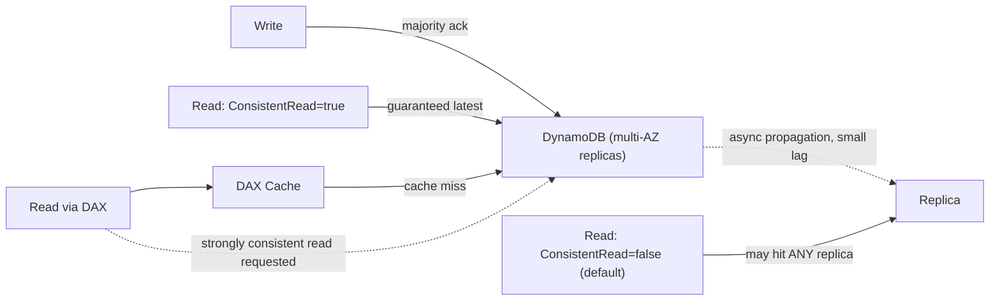
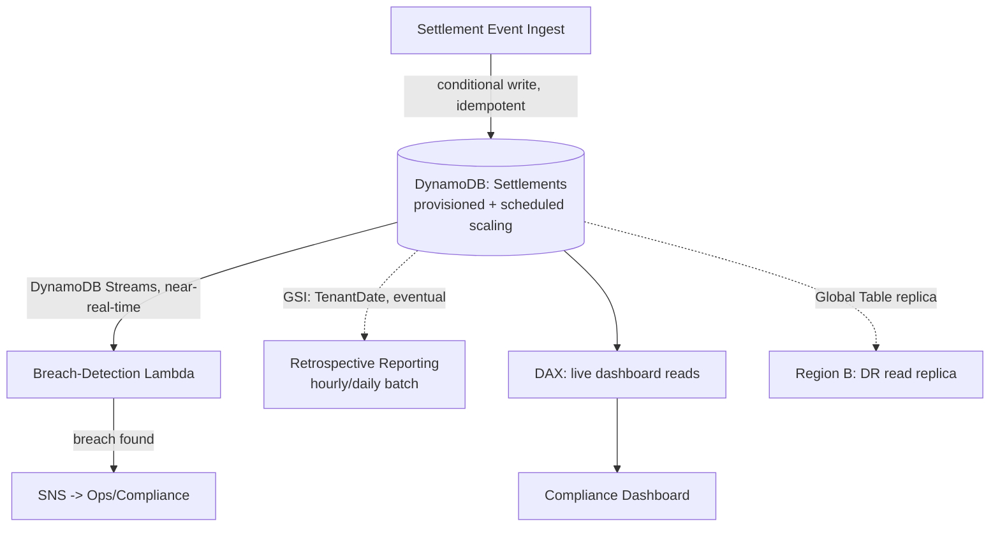
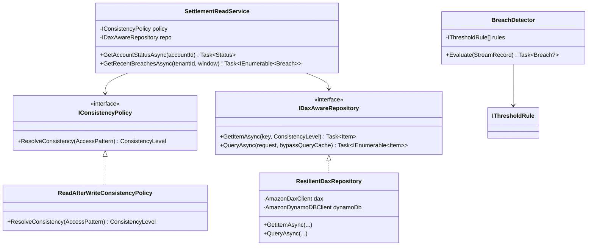
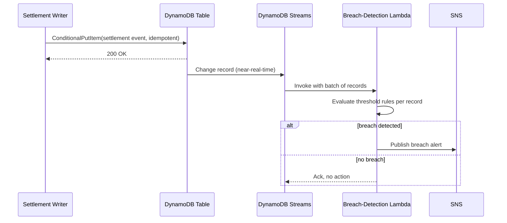

# Module 28 — DynamoDB: Consistency Models, Capacity Planning & DAX

> Domain: DynamoDB | Level: Beginner → Expert | Prerequisite: [[01-Data-Modeling-Partition-Key-Design]]

---

## 1. Topic Description

### Definition

DynamoDB's **consistency model** is a per-request choice on a replicated store: every item is held on multiple nodes, and a read either returns from any replica (eventually consistent, the default and half the cost) or from a quorum reflecting all prior successful writes (strongly consistent, double the cost, single-region only, and unavailable on GSIs). **Capacity** is the metering and admission-control layer: work is measured in Read and Write Capacity Units, allocated either as reserved throughput (**provisioned**, with auto-scaling) or billed per request (**on-demand**), and enforced per partition rather than per table — which is why capacity planning and key design are inseparable problems.

### Core sub-concepts

- **Replication and read consistency** — eventually consistent versus strongly consistent reads; the cost multiple; why GSIs offer no strong option.
- **Transactional reads** — `TransactGetItems` for a consistent snapshot across items, and its capacity cost.
- **Capacity units** — RCU and WCU definitions, how item size rounds up, and how consistency and transactions multiply consumption.
- **Provisioned capacity** — reserved throughput, auto-scaling behaviour and its reaction latency, reserved capacity pricing.
- **On-demand capacity** — per-request billing, instant accommodation of spikes, the previous-peak doubling behaviour, and the price premium.
- **Burst capacity and adaptive capacity** — unused capacity banked for short spikes; automatic redistribution toward hot partitions and its limits.
- **Per-partition throughput limits** — the hard ceiling on a single partition key regardless of table capacity.
- **Throttling** — `ProvisionedThroughputExceededException`, SDK retry with exponential backoff, and distinguishing table, GSI and partition-level throttling.
- **GSI capacity** — independently provisioned, and back-pressure onto base-table writes when a GSI throttles.
- **Write amplification** — a single item write consuming capacity on every index whose projected attributes changed.
- **Item size economics** — capacity rounding, attribute-name overhead, and compression or S3 offload for large payloads.
- **Global tables** — multi-region replication, replicated write capacity units, last-writer-wins conflict resolution, replication lag.
- **DAX and caching** — microsecond reads, write-through behaviour, and the consistency implications of caching in front of a store with tunable consistency.
- **Backup, PITR and restore** — continuous backups, restore time, and what replication does not protect against.
- **Observability** — consumed versus provisioned capacity, throttled requests, contributor insights for hot keys, and per-operation latency.

### Where it fits

This subtopic sits beneath the data model from `01-Data-Modeling-Partition-Key-Design` and above the application's read/write paths. The relationship is causal rather than adjacent: the partition key decides how work is distributed, and capacity is enforced per partition, so a key design problem presents as a *capacity* problem — throttling with headroom. Upward, the consistency choice is what determines whether a service can read its own writes, and the capacity mode is what determines its cost curve and its behaviour under an unexpected spike, both of which are architectural properties rather than tuning settings.

### Why it matters at scale

Capacity is enforced where the data lives, so the headline table number is an upper bound that a skewed workload never reaches — the characteristic incident is throttling at 20% of provisioned capacity because one partition key is absorbing the traffic. Consistency choices bite differently: because GSIs are only ever eventually consistent, a write-then-read-via-index flow works in testing and fails intermittently under production concurrency, and the resulting bug is attributed to almost everything except the index. On cost, write amplification is the usual surprise — each GSI touched by a write consumes its own capacity, so adding a fourth index can raise the write bill by a third with no change in traffic. And auto-scaling reacts over minutes, so a flash sale throttles a provisioned table long before scaling responds.

### Common pitfalls / anti-patterns

- **Reading your own write through a GSI** — GSIs are always eventually consistent, so the item may not be there yet; the failure is intermittent, load-dependent, and never reproduces in a quiet environment.
- **Provisioning against table-level averages** — capacity is enforced per partition, so an even-looking average hides a hot key that throttles while the table appears underused.
- **Relying on auto-scaling to absorb spikes** — it responds on a timescale of minutes, so a sudden surge throttles first and scales afterwards; burst capacity covers only a short window.
- **Ignoring GSI write capacity** — every base write that changes projected attributes also writes the index, and a throttled GSI back-pressures the base table, so writes fail for a reason nowhere near the write path.
- **Projecting `ALL` attributes into every GSI** — multiplies both storage and write capacity for attributes no query reads; projection should be the minimum that avoids a base-table fetch.
- **Using strongly consistent reads everywhere by default** — double the read cost for a guarantee most reads do not need, and unavailable across regions anyway.
- **Treating global tables' conflict resolution as a merge** — it is last-writer-wins by timestamp, so a concurrent write in another region is silently discarded rather than reconciled.
- **Ignoring `UnprocessedItems` on batch calls or treating a throttle as a hard failure** — throttling is a normal backpressure signal that the SDK retries; code that surfaces it as an error creates incidents out of routine behaviour.
- **Treating replication as backup** — global tables and multi-AZ replication faithfully replicate a bad delete; only PITR or on-demand backups recover from a logical error.

---

## 2. Beginner (10 Q&A)

**Q1. What is the practical difference between an eventually and a strongly consistent read?**
**A:** An eventually consistent read may be served by a replica that has not yet received the most recent write, so it can return stale data; a strongly consistent read reflects all successful prior writes. Strongly consistent reads cost twice as many read capacity units, add latency, are not available across regions, and cannot be used on a GSI at all. In practice the vast majority of reads tolerate eventual consistency, and the discipline is to identify the specific flows that do not rather than defaulting everything to strong.
*Follow-up: How stale can an eventually consistent read actually be in practice?*

**Q2. What are RCUs and WCUs, and what makes them add up faster than people expect?**
**A:** One WCU covers a write of up to 1 KB; one RCU covers a strongly consistent read of up to 4 KB, or two eventually consistent reads of that size. The surprises are that item size rounds *up*, so a 4.1 KB item costs the same as an 8 KB one; that transactional operations cost double; and that every GSI touched by a write consumes its own WCUs. So a single logical write to an item with three indexes can consume several times the capacity the base write suggests.
*Follow-up: Your average item is 1.2 KB. What does that mean for your write capacity planning?*

**Q3. What is throttling and how should an application respond?**
**A:** DynamoDB rejects requests that exceed the available capacity for the relevant partition or index, returning a throughput-exceeded error. The correct response is retry with exponential backoff and jitter, which the AWS SDKs implement by default — so throttling is a normal backpressure signal, not necessarily an incident. It becomes an incident when it is sustained, because that means capacity or distribution is genuinely inadequate. The mistake is surfacing a single throttle as a user-visible error rather than letting the retry absorb it.
*Follow-up: How would you distinguish "normal, absorbed by retries" throttling from a real problem?*

**Q4. Provisioned or on-demand — how do you choose?**
**A:** On-demand for unpredictable, spiky or new workloads, and for anything where throttling would be a business incident, because it accommodates traffic changes instantly with no capacity management. Provisioned with auto-scaling for steady, predictable, high-volume workloads, where the per-request price is substantially lower and the savings are material. The judgement is really about whether you can forecast the load: if you cannot, the operational cost and risk of guessing wrong exceeds on-demand's premium.
*Follow-up: On-demand has a limit based on your previous peak. What does that mean for a launch event?*

**Q5. What is burst capacity?**
**A:** DynamoDB banks a portion of your unused capacity from the preceding period and lets you draw on it during a short spike, so brief bursts above your provisioned level succeed rather than throttle. It is a smoothing mechanism, not headroom you can plan against: the reserve is finite and depletes quickly, and once exhausted throttling begins. Treating burst as spare capacity is how a workload appears fine in testing and throttles in production once the reserve has been consumed by earlier traffic.
*Follow-up: Your load test passes but production throttles at the same rate. What might explain that?*

**Q6. What is adaptive capacity and what are its limits?**
**A:** DynamoDB automatically shifts throughput toward partitions receiving disproportionate traffic, so moderate imbalance is handled without intervention — it substantially reduces the hot-partition problem that older designs had to engineer around. Its limits are that it cannot exceed the hard per-partition ceiling, and it reacts rather than predicts, so a sudden concentration still throttles initially. So it removes the need to shard for mild skew but not for a genuinely hot key.
*Follow-up: At what point do you conclude adaptive capacity isn't enough and you need write sharding?*

**Q7. How does GSI capacity relate to the base table's?**
**A:** In provisioned mode a GSI has its own read and write capacity, independent of the table's. Every base-table write that changes an attribute projected into the index also consumes that index's write capacity — so index writes are additive, not shared. Critically, if a GSI's write capacity is exhausted, the base table's writes are throttled too, because DynamoDB will not let the index fall arbitrarily behind. That back-pressure is why a write path can fail for a reason that is not visible anywhere in the write path.
*Follow-up: Your base table has headroom but writes are throttling. Where do you look?*

**Q8. What does index projection control, and why does it matter?**
**A:** It determines which attributes are copied into the index: keys only, a specific list, or all attributes. It matters on both cost axes — projected attributes consume index storage and index write capacity — and on the read side, because a query that needs an attribute not projected must fetch the full item from the base table, adding latency and capacity. So projection is a trade between index cost and read amplification, and `ALL` is the lazy default that quietly multiplies write bills.
*Follow-up: How would you decide the projection for a new GSI?*

**Q9. What do global tables give you and what is the catch?**
**A:** Multi-region, active-active replication with local read and write latency in each region, which is genuinely powerful for global applications and for regional failover. The catch is conflict resolution: concurrent writes to the same item in different regions are resolved last-writer-wins by timestamp, so one is silently discarded with no merge and no error. Replication is also asynchronous with a lag, so cross-region read-after-write is not guaranteed. Global tables therefore suit data whose write ownership is partitioned by region.
*Follow-up: Two regions increment the same counter simultaneously. What's the result?*

**Q10. What does point-in-time recovery protect against that replication does not?**
**A:** Logical errors. Replication — across AZs or across regions — faithfully applies a bad `DeleteItem` or a buggy batch update everywhere within moments, so it protects against infrastructure failure and not against mistakes. PITR retains continuous backups allowing restore to any second within the retention window, into a *new* table, which is what you need after a bad deploy or an operator error. The restore-to-a-new-table detail matters operationally, because recovery involves a cutover rather than an in-place rollback.
*Follow-up: You need to recover 200 items deleted an hour ago from a 5 TB table. What does that actually involve?*

---

## 3. Intermediate (10 Q&A)

**Q1. A table throttles at 20% of its provisioned capacity. Walk me through the diagnosis.**
**A:** Capacity is enforced per partition, so this is nearly always distribution rather than volume: one partition key is absorbing a disproportionate share and hitting the per-partition ceiling while the table's aggregate is idle. Contributor Insights identifies the specific keys, which is the fastest route to confirmation. The other candidate is a GSI throttling and back-pressuring base-table writes, which presents identically from the application's perspective. The fix is structural — write sharding for a genuinely hot key, or correcting a low-cardinality partition key — not more capacity, which will not be reachable either.
*Follow-up: The hot key is a single large tenant. What's your short-term mitigation and your long-term fix?*

**Q2. How do you plan capacity for a new workload?**
**A:** Estimate from item size and request rate rather than from request rate alone, since size rounding and index amplification dominate — and then validate the *distribution*, because an accurate total with a skewed key still throttles. I would start on-demand for anything new so an estimation error is a cost surprise rather than an outage, gather several weeks of real consumption, and only move to provisioned once the shape is understood and the savings justify the management. I would also model the write amplification explicitly: base write plus one per index touched, doubled for transactions.
*Follow-up: You move to provisioned and get it wrong on launch day. What's your rollback?*

**Q3. When are strongly consistent reads actually necessary?**
**A:** For read-after-write flows where the user must see their own change immediately, for read-modify-write sequences where acting on stale data would violate an invariant, and for conditional operations that depend on current state. Everything else — browsing, listing, reporting, most reads by far — tolerates eventual consistency and should use it, because the cost difference is a factor of two across the highest-volume operation type in most systems. The design habit worth building is to make strong consistency an explicit, justified choice at specific call sites rather than a global default.
*Follow-up: A flow needs read-after-write but the query has to go through a GSI. What are your options?*

**Q4. How do you handle the GSI eventual-consistency problem in a write-then-read flow?**
**A:** Avoid needing it: return the written item from the write response rather than re-reading, or read the base table by primary key (which can be strongly consistent) rather than through the index. Where the index genuinely must be queried, the options are to accept and design for the delay in the user experience, to retry briefly, or to restructure the access pattern so the base-table key serves it. What does not work is assuming the delay is short enough not to matter — it is short until the system is under load, which is exactly when the flow is exercised most.
*Follow-up: The UI lists items via a GSI immediately after creating one. How would you make that feel correct?*

**Q5. How do you optimise DynamoDB costs without degrading the service?**
**A:** Start with the biggest levers: eliminate scans, reduce item size (shorter attribute names genuinely matter at scale, and large blobs belong in S3), narrow GSI projections to what queries actually need, and remove indexes nothing uses. Then review consistency — strongly consistent reads used by default are a straightforward halving opportunity. Then capacity mode, comparing on-demand spend against a provisioned-plus-reserved model using real consumption data. I would sequence it that way because the first group reduces the work being done, which is durable, while capacity mode only changes how the same work is priced.
*Follow-up: Which of those would you expect to give the biggest single saving in a typical table, and why?*

**Q6. How does auto-scaling actually behave, and where does it fail you?**
**A:** It watches consumed capacity against a target utilisation and adjusts provisioned capacity, but the loop involves CloudWatch alarms and takes minutes to react — so it handles gradual growth well and sudden spikes badly. During that lag, burst capacity absorbs some of the excess and then throttling begins. It also scales down cautiously, which is intentional but means you pay for headroom after a spike. For known events such as a sale or a batch window, scheduled scaling ahead of time is far more effective than reactive scaling, and for genuinely unpredictable spikes on-demand is the right answer.
*Follow-up: You have a predictable 10x spike every weekday at 09:00. How do you configure for it?*

**Q7. What are the failure modes of DAX in front of DynamoDB?**
**A:** It is a write-through cache, so writes go through DAX to DynamoDB, but reads served from the cache reflect its own consistency, not DynamoDB's — so strongly consistent reads bypass the cache entirely and get no benefit. Items written directly to DynamoDB, bypassing DAX, produce stale cache entries until TTL. And DAX is a cluster you now operate and pay for, with its own failure modes. It earns its place for genuinely read-heavy workloads with high repeat-read rates where microsecond latency matters; it is not a general answer to DynamoDB cost or latency.
*Follow-up: Half your writes go through DAX and half through the SDK directly. What happens?*

**Q8. How do you monitor a DynamoDB table meaningfully?**
**A:** Consumed versus provisioned capacity for reads and writes separately and per index; throttled request counts split by table and index; successful request latency; and Contributor Insights for key distribution, which is the one that identifies hot partitions before they become incidents. I would alert on sustained throttling rather than any throttling, since transient throttles absorbed by retries are normal, and on consumed capacity approaching provisioned so scaling decisions are proactive. Cost per table with an owner is the other metric that changes behaviour, because it makes index proliferation visible.
*Follow-up: You see throttling on the table but not on any index, and no hot key in Contributor Insights. What now?*

**Q9. How do you handle a large backfill or migration without disrupting production?**
**A:** Rate-limit the writer explicitly rather than relying on throttling as flow control, because throttling affects production traffic sharing the same partitions. On a provisioned table I would temporarily raise capacity and use a token-bucket limiter in the migration job; on on-demand I would still rate-limit, because the previous-peak scaling behaviour means a burst can be throttled anyway and the cost is real. I would also make the job resumable with a checkpoint, since a multi-hour backfill will be interrupted, and run it in parallel segments keyed to spread across partitions rather than sequentially through one.
*Follow-up: The backfill is throttling despite rate limiting. What's the likely cause?*

**Q10. How do you decide GSI count and design at a table level?**
**A:** Each GSI is a permanent tax on every write that touches its projected attributes, plus storage — so the question for each is which access patterns it serves and whether an existing index could serve them through overloading. Index overloading, where one GSI's generic key attributes serve several entity types and patterns, is the technique that keeps the count low. I would treat the index count as a budget requiring justification rather than something added per feature, and I would review usage periodically, since an index serving a removed feature keeps charging indefinitely.
*Follow-up: How would you determine whether an existing GSI is actually being queried?*

---

## 4. Expert / Architect (10 Q&A)

**Q1. How do you set consistency and capacity policy across an estate rather than per team?**
**A:** Make the default correct and the deviation explicit: eventually consistent reads and on-demand capacity as the starting point for new tables, since those fail toward cost predictability and availability rather than toward outages. Strongly consistent reads and provisioned capacity both require a stated reason — a specific read-after-write flow, or a stable measured load profile. Deliver it through a shared data-access layer and infrastructure modules so the defaults are inherited, and expose per-table cost and throttling with an owner so the economics are visible to the team making the decisions. Policy that relies on each developer choosing correctly at each call site does not hold.
*Follow-up: A team wants strongly consistent reads across the board "to avoid bugs". How do you engage?*

**Q2. Design the capacity and consistency strategy for a global, multi-region application.**
**A:** Partition write ownership by region so each item has a home region and global tables' last-writer-wins conflict resolution never actually fires — that is the design decision that makes multi-region viable, and everything else follows from it. Reads are served locally with eventual consistency, and any flow requiring read-after-write is routed to the item's home region or restructured to return the written value. Capacity must be provisioned per region against that region's load, not divided evenly, and replicated write capacity is an additional cost line that scales with the number of regions. I would state the replication lag and the failover data-loss window explicitly, because both are properties the business must accept.
*Follow-up: A user travels and writes from a different region than their home. What happens?*

**Q3. How would you approach a table whose cost has become a significant line item?**
**A:** Attribute it first — reads, writes, storage, index writes and replication are separate drivers with different fixes, and teams routinely optimise the wrong one. Then work down the leverage: eliminate scans, shrink items, prune and narrow indexes, remove default strong consistency, and only then revisit capacity mode with real consumption data. I would set a cost target and track it, because optimisation without a target stops when someone gets bored. The framing to leadership is that most DynamoDB cost problems are design problems — a table that costs too much is usually doing more work than the access patterns require, which is a fixable and durable saving rather than a discount to negotiate.
*Follow-up: The dominant cost is GSI writes on an index used by one low-traffic feature. What do you do?*

**Q4. How do you decide when DynamoDB's consistency model is inadequate for a use case?**
**A:** When the domain requires invariants across many items that cannot be reduced to a single item or a small transaction — an inventory system with complex allocation rules, or a ledger requiring multi-entity balance guarantees at high concurrency. DynamoDB gives per-item atomicity and bounded transactions, which covers a great deal, but the transaction limits and cost make it a poor fit where multi-entity consistency is the *dominant* pattern rather than an occasional need. I would surface that early, because the alternative is a design that fights the store with transactions everywhere and pays double capacity for it.
*Follow-up: The team proposes putting a relational database alongside DynamoDB for those flows. What are your concerns?*

**Q5. How do you make throttling a non-event operationally?**
**A:** Design so that transient throttling is absorbed invisibly — SDK retries with backoff and jitter, idempotent writes so a retry is safe, and queues in front of write-heavy paths so bursts are smoothed rather than rejected. Then separate the signal: alert on *sustained* throttling and on capacity approaching limits, not on individual throttled requests, so the alert means something. Finally, ensure the key design cannot produce a hot partition under foreseeable load, since that is the one throttling cause retries cannot fix. The goal is that throttling is backpressure the system handles, and only a structural problem reaches a human.
*Follow-up: Retries are absorbing throttling but P99 latency has tripled. Is that acceptable?*

**Q6. What's your position on using DynamoDB Streams for capacity-sensitive derived data?**
**A:** Streams are the right mechanism for maintaining derived views, search indexes and denormalised copies, and they decouple that work from the write path so it does not consume the caller's latency budget. The capacity consideration is that the consumer's writes back into DynamoDB consume capacity of their own, so a fan-out update triggered by one write can multiply capacity consumption considerably — that has to be modelled, not discovered. The other constraint is the 24-hour retention: a consumer outage beyond that loses changes permanently, so the recovery path must be a rebuild from the base table rather than a replay.
*Follow-up: Your stream consumer writes 50 items per source write. How do you keep that from throttling the table?*

**Q7. How do you evaluate DynamoDB against alternatives on total cost of ownership rather than unit price?**
**A:** Include the operational cost that DynamoDB removes — no patching, no failover engineering, no capacity provisioning of servers, no backup infrastructure — because for many organisations that is larger than the database bill and it is the honest basis for comparison. Against that, include the costs it adds: design rigidity, a second system for analytics, and the engineering effort that up-front modelling requires. My experience is that DynamoDB wins clearly for high-scale, well-understood access patterns and loses for evolving models and ad hoc querying, and that unit-price comparisons against a self-managed database usually omit the operational side entirely.
*Follow-up: A team benchmarks DynamoDB against self-managed PostgreSQL and finds Postgres cheaper. What's likely missing?*

**Q8. How do you plan for a regional failure with DynamoDB?**
**A:** Global tables give you a live copy in another region, so failover is a routing decision rather than a restore — but the design work is in what the application does about the replication lag and about writes that were in flight. That means an explicit RPO, idempotent writes so retries after failover are safe, and a tested runbook for the routing change. Capacity in the failover region must be provisioned for full load, not standby load, or you fail over into throttling. I would exercise the failover on a schedule, because an untested regional failover is a plan rather than a capability.
*Follow-up: Your failover region is provisioned at 30% of primary capacity to save money. What happens during a failover?*

**Q9. How do you govern index and capacity decisions across many teams?**
**A:** At table creation, through a review that covers key design, index count and projection, capacity mode, and expected item size — because those are the decisions that are cheap now and expensive later. Then ongoing visibility: per-table cost with an owner, throttling and hot-key dashboards, and a periodic review of index usage, since unused indexes charge forever and nobody notices. I would also provide infrastructure modules encoding the defaults so most tables are created correctly without a review at all, reserving human attention for the unusual ones. The organisational failure to avoid is treating DynamoDB as self-service with no design gate, because its mistakes are the least reversible of any managed store.
*Follow-up: How would you find every unused GSI across hundreds of tables?*

**Q10. What separates an excellent answer from an adequate one on capacity and consistency?**
**A:** An adequate answer knows RCUs, WCUs and the two read modes. An excellent one reasons about *where* capacity is enforced — per partition, per index — and therefore treats a throttling question as a key-distribution question; models write amplification across indexes and transactions rather than counting requests; chooses consistency per call site with a stated reason; knows that auto-scaling reacts over minutes and plans spikes accordingly; and connects the cost model back to design decisions rather than to pricing negotiations. It also says what it would monitor to catch each failure before it becomes an incident. The distinguishing quality is understanding that in DynamoDB, capacity problems are usually design problems wearing a billing costume.
*Follow-up: Given that, what's the first thing you'd check when a team reports "DynamoDB is throttling us"?*

---

## 5. Reference Material

> Retained from the original module: deep-dive internals, diagrams, production examples, exercises, system/low-level design, debugging walkthroughs and the Principal Engineer perspective.

### 1. Fundamentals

#### What are DynamoDB's consistency models, and what is capacity planning?
DynamoDB offers a per-read, explicit choice between **eventually consistent reads** (default — may reflect a slightly stale view, but cost half the read-capacity of the alternative) and **strongly consistent reads** (guaranteed to reflect the most recent successful write, at full read-capacity cost, and unavailable on GSIs). **Capacity planning** covers choosing between DynamoDB's **provisioned** (pre-allocated read/write capacity units, cost-predictable but requiring accurate forecasting) and **on-demand** (auto-scaling per-request billing, operationally simpler but potentially costlier at sustained high volume) throughput modes.

#### Why does this matter?
The eventually-consistent-by-default behavior is a genuine, easy-to-miss correctness trap for any read immediately following a write within the same logical operation (a classic "read-your-own-write" requirement) — and provisioned-vs-on-demand is a real cost/operational-complexity trade-off with production consequences either way if chosen without deliberate analysis.

#### When does this matter?
Every DynamoDB read operation implicitly makes a consistency choice (even if by not overriding the default); every table's throughput mode is a standing capacity-planning decision — the depth matters for correctly reasoning about read-your-writes requirements and for choosing capacity modes matching actual traffic patterns.

#### How does it work (30,000-ft view)?
```csharp
var response = await client.GetItemAsync(new GetItemRequest
    {
        TableName = "Orders",
            Key = key,
            ConsistentRead = true // opt into strong consistency for THIS specific read
});
```

### 2. Deep Dive

#### 2.1 Eventual vs Strong Consistency — the Precise Mechanism
DynamoDB replicates each item across **multiple Availability Zones** for durability — a write is acknowledged once a majority of these replicas confirm it, but an eventually-consistent read may be served by **any** replica, including one that hasn't yet received the most recent write's propagation (typically within a very short window, often single-digit milliseconds, but not zero). A strongly consistent read specifically routes to (or confirms with) a replica guaranteed to reflect the latest acknowledged write — architecturally the same underlying replication-lag concept as every prior module's consistency discussion (PostgreSQL, MongoDB, Redis), here exposed as a **per-read-request** parameter rather than a connection-level or database-wide setting, arguably the most granular consistency control of any engine covered in this course.

#### 2.2 The Read-Your-Own-Writes Trap
A common, realistic bug pattern: a service writes an item, then **immediately** reads it back (e.g., to return the newly-created resource in an API response, the 201-with-body pattern) using the default eventually-consistent read — under most conditions this works fine (the propagation window is typically very short), but under load or specific timing, the read can occasionally return stale (or, for a brand-new item, entirely absent) data, producing an intermittent, hard-to-reproduce "the item I just created doesn't exist yet" bug. The fix is straightforward once recognized: use `ConsistentRead: true` specifically for any read that must reflect a write from the *same logical operation/request*, while leaving unrelated, independent reads at the default eventually-consistent (cheaper) setting.

#### 2.3 Provisioned vs On-Demand Capacity
**Provisioned** capacity requires forecasting read/write capacity units (RCU/WCU) in advance — cost-efficient and predictable for steady, well-understood traffic, but risks throttling if actual traffic exceeds provisioned capacity (mitigated by auto-scaling, which itself reacts with some lag, not instantaneously). **On-demand** capacity automatically scales to actual request volume with no pre-provisioning, billed per-request — operationally simpler and safer against unexpected traffic spikes, but typically **more expensive per-request** than well-utilized provisioned capacity at sustained volume, making it better suited to unpredictable, spiky, or new/unknown-traffic-pattern workloads than steady, high-volume, well-forecasted ones.

#### 2.4 DAX (DynamoDB Accelerator) — a Managed, Write-Through Cache
DAX is a fully-managed, in-memory caching layer sitting in front of DynamoDB, API-compatible with the DynamoDB SDK (minimal application code changes) — providing microsecond-level read latency for cache hits, at the cost of introducing its **own** consistency consideration: DAX's item cache has its own TTL, and a strongly-consistent read *through* DAX still bypasses the cache entirely, going directly to DynamoDB (since DAX cannot guarantee cache freshness matches DynamoDB's own strong-consistency guarantee) — meaning DAX primarily accelerates eventually-consistent reads, and teams needing strong consistency on a hot read path don't get DAX's latency benefit for those specific reads.

#### 2.5 Time-To-Live (TTL) and Its Interaction with Streams/GSIs
DynamoDB's native TTL feature automatically deletes items past a specified epoch-timestamp attribute — a background process, not instantaneous (deletion can lag the actual expiration time by up to 48 hours in practice), and TTL-driven deletions **do** appear in DynamoDB Streams (marked distinctly from an application-initiated delete), enabling downstream consumers (e.g., an audit/archival Lambda) to react specifically to expiration-driven removals — directly relevant to the Outbox-pattern-via-Streams design §Advanced Q6/Hard exercise, where outbox items are commonly TTL'd for automatic cleanup after successful publication rather than requiring an explicit delete call.

### 3. Visual Architecture

```mermaid
graph LR
 Write[Write] -->|majority ack| Primary["DynamoDB (multi-AZ replicas)"]
 Primary -.->|async propagation, small lag| Replica2[Replica]
 Client1["Read: ConsistentRead=false (default)"] -->|may hit ANY replica| Replica2
 Client2["Read: ConsistentRead=true"] -->|guaranteed latest| Primary
 Client3[Read via DAX] --> DAX[DAX Cache] -->|cache miss| Primary
 Client3 -.->|strongly consistent read requested| Primary
```

### 4. Production Example
**Scenario**: An order-creation API returned the newly-created order in its `201 Created` response body (the standard pattern) by writing the order item and then immediately performing a `GetItem` to construct the response — under normal load this worked reliably, but under a specific traffic pattern (a burst of concurrent order creations), a small but consistent percentage of responses intermittently returned an empty/stale result for the just-written order, confusing client integrations that expected the just-created resource to always be immediately retrievable. **Investigation**: confirmed the `GetItem` call used the default eventually-consistent read, and the failure rate correlated with request concurrency/load, consistent with the propagation-lag window occasionally exceeding the time between write and read under contention. **Fix**: added `ConsistentRead: true` specifically to this read-after-write path (accepting its doubled read-capacity cost only for this specific, low-volume-relative-to-overall-traffic operation), eliminating the intermittent empty-response bug entirely. **Lesson**: the default eventually-consistent read is usually fine for independent, unrelated reads, but any read explicitly reading back data from the *same* logical write operation needs strong consistency — a subtle, load-dependent bug that's easy to miss in low-concurrency testing and only manifests reliably under realistic production traffic patterns, directly echoing this course's recurring "test at representative scale" theme.

### 11. Coding Exercises

#### Easy — Strongly consistent read for a read-after-write path
```csharp
await client.PutItemAsync(new PutItemRequest { TableName = "Orders", Item = orderItem });

var readBack = await client.GetItemAsync(new GetItemRequest
    {
        TableName = "Orders",
            Key = key,
            ConsistentRead = true // explicit, deliberate -- guarantees this reflects the write just performed
});
```

#### Medium — Eliminate the redundant read entirely (Advanced Q1's better fix)
```csharp
public async Task<OrderDto> CreateOrderAsync(CreateOrderRequest request)
{
    var order = new Order { Id = Guid.NewGuid.ToString, CustomerId = request.CustomerId, Total = request.Total };
    await _dynamoDb.PutItemAsync(new PutItemRequest { TableName = "Orders", Item = ToAttributeMap(order) });

    // No read-back needed at all -- we already have every value we just wrote, in memory.
    return new OrderDto(order.Id, order.CustomerId, order.Total);
}
```
**Discussion**: This is deliberately the preferred fix over merely adding `ConsistentRead: true` — it removes both the correctness risk and the doubled-read-capacity cost entirely, since the "read" was never actually necessary once recognized that the just-written values are already known in application code.

#### Hard — Capacity-aware retry with exponential backoff for throttled requests
```csharp
public async Task<T> ExecuteWithThrottleRetryAsync<T>(Func<Task<T>> operation, int maxAttempts = 5)
{
    for (int attempt = 1;; attempt++)
    {
        try
        {
            return await operation;
        }
        catch (ProvisionedThroughputExceededException) when (attempt < maxAttempts)
        {
            var delay = TimeSpan.FromMilliseconds(50 * Math.Pow(2, attempt - 1) + Random.Shared.Next(0, 50));
            await Task.Delay(delay); // exactly the retry-with-backoff pattern, applied to DynamoDB throttling
        }
    }
}
```

#### Expert — DAX client with fallback to direct DynamoDB access (Advanced Q4)
```csharp
public class ResilientDaxClient
{
    private readonly AmazonDaxClient _dax;
    private readonly AmazonDynamoDBClient _dynamoDb;

    public async Task<GetItemResponse> GetItemAsync(GetItemRequest request)
    {
        try
        {
            return await _dax.GetItemAsync(request); // fast path: cache hit or DAX-mediated fetch
        }
        catch (Exception ex) when (ex is AmazonServiceException or TimeoutException)
        {
            // DAX cluster itself is unavailable/degraded -- fall back to DynamoDB directly
            // at higher latency but WITHOUT taking the whole read path down.
            return await _dynamoDb.GetItemAsync(request);
        }
    }
}
```

### 12. System Design

#### Scenario: A Real-Time Trade-Settlement Monitoring & Compliance Dashboard

**Requirements**

*Functional:* ingest trade-settlement events in near-real-time; detect trading-limit breaches within a hard 2-second SLA (§Expert Q6); serve a compliance dashboard showing current settlement status per account/tenant; serve a retrospective "all breaches in the last N hours" reporting view; survive a predictable nightly 10x settlement-batch write spike (§Expert Q4) without throttling or runaway cost.

*Non-functional:* p99 balance/status-read latency under 10ms for the dashboard's live view; breach-detection latency bounded and monitored, not just "eventually"; cost proportional to genuine traffic, not vulnerable to a retry-storm cost runaway (§Expert Q8); regionally resilient (a regional outage must not silently serve stale risk data as if it were current, §Expert Q3).

*Back-of-the-envelope:* 200 tenants, ~500 settlement events/sec average, 5,000/sec during the nightly 45-minute batch window. Breach-detection must evaluate every event within 2 seconds — at 5,000 events/sec peak, this is a stream-processing throughput requirement, not a simple polling-query requirement, which is the number that rules out a GSI-polling design for the detection path (§Expert Q6) and points directly at DynamoDB Streams.

**Architecture**


```mermaid
graph TB
    Ingest[Settlement Event Ingest] -->|conditional write, idempotent| Table[(DynamoDB: Settlements<br/>provisioned + scheduled scaling)]
    Table -->|DynamoDB Streams, near-real-time| BreachDetector[Breach-Detection Lambda]
    BreachDetector -->|breach found| Alerts[SNS -> Ops/Compliance]
    Table -.GSI: TenantDate, eventual.-> Reporting[Retrospective Reporting<br/>hourly/daily batch]
    Table --> DAX[DAX: live dashboard reads]
    DAX --> Dashboard[Compliance Dashboard]
    Table -.Global Table replica.-> RegionB[Region B: DR read replica]
```

**Components:** the **Settlements table** is the source of truth, written with conditional/idempotent writes (Module 27 §Expert Q1); **DynamoDB Streams feeding a Breach-Detection Lambda** is the real-time detection path (§Expert Q6) — bounded by Streams' near-real-time delivery, not GSI propagation; a **TenantDate GSI** serves only the retrospective/reporting access pattern, explicitly scoped away from the real-time SLA (§Expert Q6); **DAX** accelerates the live dashboard's repeated status reads (§9.4), sized against a measured cache-hit-rate benchmark (§7.4) before adoption; a **Global Table replica** in a second region provides DR read capability, with the explicit understanding (§Expert Q1, §Expert Q3) that cross-region reads are not authoritative for real-time risk decisions — only for regional-failover continuity.

**Database/consistency selection rationale:** the real-time detection requirement rules out relying on GSI eventual consistency (§Expert Q6) and rules out on-demand-alone for the predictable nightly spike (§Expert Q4) — the design deliberately uses **provisioned capacity with scheduled scaling** for the base table (cost efficiency for the predictable pattern) plus **DynamoDB Streams** (not GSI polling) for the latency-critical detection path, a combination only reachable by reasoning through both this module's consistency-model material and its capacity-planning material together, which is precisely why the two are one module.

**Caching:** DAX for the dashboard's live-status reads only; the query-cache staleness trap (§Expert Q9) is explicitly avoided by using item-cache-pattern `GetItem` lookups (per-account status) rather than caching broad `Query` result sets for the dashboard's most frequently-refreshed view.

**Messaging:** DynamoDB Streams → Lambda → SNS is the alerting path; retrospective reporting reads the GSI on a scheduled batch cadence, not synchronously.

**Scaling:** scheduled scaling (§9.2) ahead of the nightly batch window; Global Table for regional read locality/DR, not for write-scaling (§9.3).

**Failure handling:** breach-detection Lambda failures route to a DLQ with alerting on DLQ depth; a GSI-served retrospective report that appears inconsistent with the Streams-detected breach log during a discrepancy investigation is treated as an expected artifact of GSI propagation timing, not a data-integrity bug, per this module's central distinction.

**Monitoring:** GSI `ReplicationLatency` (alerted separately from base-table health, per Module 27 §14's incident), DAX cache-hit rate, Streams-consumer lag, and a billing-anomaly alarm (§Expert Q8) independent of `ThrottledRequests` to catch a retry-storm-driven on-demand cost spike that would otherwise go undetected.

**Trade-offs:** real-time correctness (Streams-based detection) is prioritized over query simplicity (a single GSI-based polling query would have been simpler to build but structurally cannot meet the 2-second SLA); scheduled scaling trades a small amount of operational maintenance for materially lower cost than pure on-demand at this workload's predictable-burst profile.

### 13. Low-Level Design

**Class diagram**


```mermaid
classDiagram
    class SettlementReadService {
        -IConsistencyPolicy policy
        -IDaxAwareRepository repo
        +GetAccountStatusAsync(accountId) Task~Status~
        +GetRecentBreachesAsync(tenantId, window) Task~IEnumerable~Breach~~
    }
    class IConsistencyPolicy {
        <<interface>>
        +ResolveConsistency(AccessPattern) ConsistencyLevel
    }
    class ReadAfterWriteConsistencyPolicy {
        +ResolveConsistency(AccessPattern) ConsistencyLevel
    }
    class IDaxAwareRepository {
        <<interface>>
        +GetItemAsync(key, ConsistencyLevel) Task~Item~
        +QueryAsync(request, bypassQueryCache) Task~IEnumerable~Item~~
    }
    class ResilientDaxRepository {
        -AmazonDaxClient dax
        -AmazonDynamoDBClient dynamoDb
        +GetItemAsync(...)
        +QueryAsync(...)
    }
    class BreachDetector {
        -IThresholdRule[] rules
        +Evaluate(StreamRecord) Task~Breach?~
    }
    SettlementReadService --> IConsistencyPolicy
    SettlementReadService --> IDaxAwareRepository
    IDaxAwareRepository <|.. ResilientDaxRepository
    IConsistencyPolicy <|.. ReadAfterWriteConsistencyPolicy
    BreachDetector --> IThresholdRule
```

**Sequence diagram — breach detection via Streams (not GSI polling)**


```mermaid
sequenceDiagram
    participant Writer as Settlement Writer
    participant Table as DynamoDB Table
    participant Streams as DynamoDB Streams
    participant Detector as Breach-Detection Lambda
    participant SNS

    Writer->>Table: ConditionalPutItem(settlement event, idempotent)
    Table-->>Writer: 200 OK
    Table->>Streams: Change record (near-real-time)
    Streams->>Detector: Invoke with batch of records
    Detector->>Detector: Evaluate threshold rules per record
    alt breach detected
        Detector->>SNS: Publish breach alert
    else no breach
        Detector-->>Streams: Ack, no action
    end
```

**Design patterns used:** **Strategy** (`IConsistencyPolicy` selects strong vs. eventual per access pattern — §Advanced Q1/Q2's "apply selectively" discipline made an explicit, testable policy object rather than scattered inline `ConsistentRead: true` flags); **Decorator/Fallback** (`ResilientDaxRepository` wraps DAX with a DynamoDB-direct fallback, Module 27's Expert exercise pattern, extended here to also route around the query-cache staleness trap via `bypassQueryCache`); **Chain of Responsibility** (`BreachDetector`'s `IThresholdRule[]` evaluates each stream record against an ordered set of independently-addable rules).

**SOLID mapping:** SRP — `SettlementReadService` orchestrates, `IConsistencyPolicy` owns the consistency decision, `IDaxAwareRepository` owns the DAX/DynamoDB access mechanics, `BreachDetector` owns detection logic, each independently testable; OCP — a new threshold rule is added as a new `IThresholdRule` without modifying `BreachDetector`; LSP — any `IConsistencyPolicy` implementation is substitutable (e.g., swapping in a per-tenant-configurable policy later); ISP — `IDaxAwareRepository` exposes only `GetItemAsync`/`QueryAsync`, not the full DynamoDB SDK surface; DIP — `SettlementReadService` depends on both interfaces, never the concrete AWS SDK/DAX clients directly.

**Concurrency/thread safety:** the same optimistic-locking (`Version` + `ConditionExpression`) pattern from Module 27 §13 applies to any settlement-status projection updated by both the primary write path and a correction/reconciliation process — a concurrent correction racing against a new settlement event is resolved by the conditional write rejecting the stale-versioned update rather than silently overwriting it.

### 14. Production Debugging

**Incident:** During a month-end settlement batch, the compliance dashboard (reading account status through DAX) displayed **correct** balances for most accounts but showed **zero new breach alerts** for a roughly 12-minute window despite the breach-detection Lambda's own CloudWatch logs confirming it processed and correctly flagged several genuine breaches during that exact window — the alerts fired (SNS delivered them), but the dashboard's "recent breaches" panel, which read via a `Query` against the GSI (not the Streams path), simply didn't show them yet.

**Investigation:** Confirmed via CloudWatch that GSI `ReplicationLatency` spiked to ~11 minutes during the batch window — coinciding exactly with the batch's write-volume peak. Cross-referencing WCU consumption on the GSI specifically (not the base table, which was healthy under its scheduled-scaling headroom) showed the GSI's own partition structure (keyed by `TENANT#<id>#<date>`, per Module 27 §14's earlier, structurally identical incident) was again concentrating the batch's write volume onto a small number of GSI partitions.

**Tools:** CloudWatch GSI-dimensioned `ReplicationLatency` and per-index `ConsumedWriteCapacityUnits`; comparing Streams-consumer-confirmed breach timestamps against the dashboard's GSI-query-visible timestamps quantified the exact 11-minute gap.

**Fix:** the dashboard's "recent breaches" panel was changed to read from a **materialized view maintained by the Streams-consuming Breach-Detection Lambda itself** (writing a compact "recent breaches" item directly, updated in near-real-time as breaches are detected) rather than querying the GSI — eliminating the GSI-propagation dependency from the dashboard's most time-sensitive panel entirely, while leaving the GSI in place for genuinely retrospective, longer-window reporting where its propagation lag is immaterial.

**Prevention:** this is the **second occurrence** of the same GSI-hot-partition-under-burst pattern first seen in Module 27 §14 — formally documented as a recurring failure signature in the team's DynamoDB design-review checklist: "any dashboard/alerting panel with a latency-sensitive freshness requirement must not read through a GSI experiencing burst-correlated propagation lag; prefer a Streams-derived materialized view for any panel with a sub-minute freshness requirement." Naming the recurrence explicitly (rather than treating each incident as a one-off) is what converts it from "a surprising bug, twice" into a standing, checklist-enforced architectural rule.

### 15. Architecture Decision

**Options considered for the breach-detection mechanism:**

| | Poll a GSI on a timer | Query the GSI on-demand per dashboard refresh | DynamoDB Streams → Lambda (chosen) |
|---|---|---|---|
| **Advantages** | Simple to implement; no new infrastructure | Simplest possible; no background process | Bounded, near-real-time latency; decoupled from GSI propagation entirely |
| **Disadvantages** | Detection latency bounded by poll interval AND GSI propagation lag (compounds both) | Detection latency entirely at the mercy of GSI propagation, worse under burst (§14's incident) | Requires stream-processing infrastructure (Lambda, DLQ, monitoring) |
| **Cost** | Poll-frequency-proportional GSI read cost, recurring even when nothing changed | Lowest infra cost, but functionally inadequate for the SLA | Streams reads are billed but typically cheaper than frequent polling; Lambda invocation cost |
| **Complexity** | Moderate — timer infrastructure plus GSI query logic | Low | Moderate-high — stream consumer, idempotent processing, DLQ handling |
| **Maintainability** | Two latency sources to reason about jointly | Simple but fragile under load, as demonstrated twice | One clear latency source (Streams delivery), well-understood failure modes |
| **Scalability** | Poll frequency doesn't scale with actual event rate | Degrades precisely when write volume is highest (worst-case timing) | Scales naturally with event volume; Streams shards scale with the table |

**Recommendation:** DynamoDB Streams → Lambda, for the breach-detection path specifically, given the hard 2-second SLA and the now-twice-demonstrated (Module 27 §14, this module §14) unreliability of GSI-based reads for latency-sensitive panels under burst load. The GSI itself is **retained**, but explicitly re-scoped to retrospective reporting only — not removed, since it remains the right tool for its actual, non-latency-critical use case (§Expert Q6's framework).

### 17. Principal Engineer Perspective

**Business impact:** a compliance-monitoring system that silently under-reports breaches for an 11-minute window during exactly the highest-volume period (month-end settlement) is a severe regulatory and business risk — the highest-volume window is precisely when a genuine breach is most likely to occur, making the failure's timing correlation with its likelihood of mattering the most damaging possible combination, not a coincidental inconvenience.

**Engineering trade-offs:** the Streams-based detection path costs more upfront engineering complexity (stream-processing infrastructure, idempotent record handling, DLQ design) than the simpler GSI-polling alternative — a trade-off justified here specifically because the SLA is hard and the consequence of missing it is regulatory, not because Streams is unconditionally "better" than a GSI-based read.

**Technical leadership:** naming the GSI-hot-partition-under-burst pattern as a **recurring** failure signature (§14) — rather than re-diagnosing it from scratch a second time — is the concrete leadership act that converts institutional knowledge into a standing checklist rule, directly preventing a third occurrence in some other, not-yet-built dashboard.

**Cross-team communication:** the distinction between "the GSI is retrospectively accurate, just not real-time" and "the system dropped data" must be communicated precisely to the compliance/operations stakeholders consuming the dashboard — conflating eventual-consistency lag with a data-loss bug (an easy mistake for a non-engineering stakeholder to make when a panel simply looks empty) erodes trust in the system unnecessarily; a Principal Engineer should ensure the dashboard itself surfaces a "data as of" freshness indicator so this distinction is visible to the end user, not just documented internally.

**Architecture governance:** require any new latency-sensitive read path in a DynamoDB-backed system to explicitly state, in its design review, whether it reads from the base table (strong-consistency-capable), a GSI (never strong, propagation-lag-exposed), or a Streams-derived materialized view (near-real-time, decoupled from GSI propagation) — making this classification a mandatory, reviewed field in the design document rather than an implicit assumption discovered only after an incident.

**Cost optimization:** scheduled scaling (§9.2) for the predictable nightly batch, combined with DAX scoped only to the genuinely cache-hit-friendly dashboard-status pattern (validated via §7.4's pre-adoption benchmark, not assumed), keeps this system's cost proportional to its actual, forecastable traffic — with an independent billing-anomaly alarm (§Expert Q8) as the safety net against the one genuinely unpredictable cost-risk scenario (a retry storm).

**Risk analysis:** the compounding of two independently-plausible failure modes — a predictable burst (§Expert Q4) landing exactly during the highest-detection-stakes window, interacting with a GSI's burst-correlated propagation-lag widening (§7.3) — is exactly the kind of tail scenario a Principal-level risk review should explicitly game out ("what does the system do during the specific 45 minutes each night when both the write-volume risk and the detection-stakes are simultaneously at their peak"), rather than reviewing burst-handling and detection-latency as if they were independent, separately-assessed risks.

**Long-term maintainability:** document, alongside the schema, an explicit table of "which read path serves which consistency/freshness guarantee" (base table strong / base table eventual / GSI eventual-with-unbounded-propagation / Streams-derived near-real-time) — the single artifact that would have let a future engineer building the next dashboard panel avoid re-discovering this module's central incident a third time.

### 18. Revision
**Key takeaways**: Eventually consistent reads (default) can occasionally miss a very recent write, especially under load — use `ConsistentRead: true` for any read-after-write-in-the-same-operation, or better, eliminate the redundant read entirely since the just-written values are already known. GSIs never support strong consistency. Provisioned (forecasted, cost-efficient for steady traffic) vs. on-demand (auto-scaling, simpler, costlier at sustained volume) capacity is a genuine trade-off, not a strictly-better-either-way choice. DAX accelerates eventually-consistent reads specifically — strongly consistent reads bypass its cache entirely, and DAX needs its own fallback-path design for resilience. TTL deletion can lag up to ~48 hours — never rely on it for precise-timing business logic.

---

**Next**: This completes the `08-DynamoDB` domain (Modules 27–28), and with it, the full data-layer arc of this course (SQL Server, PostgreSQL, MongoDB, Redis, DynamoDB — Modules 18–28). Continuing autonomously to `09-OOP`.
