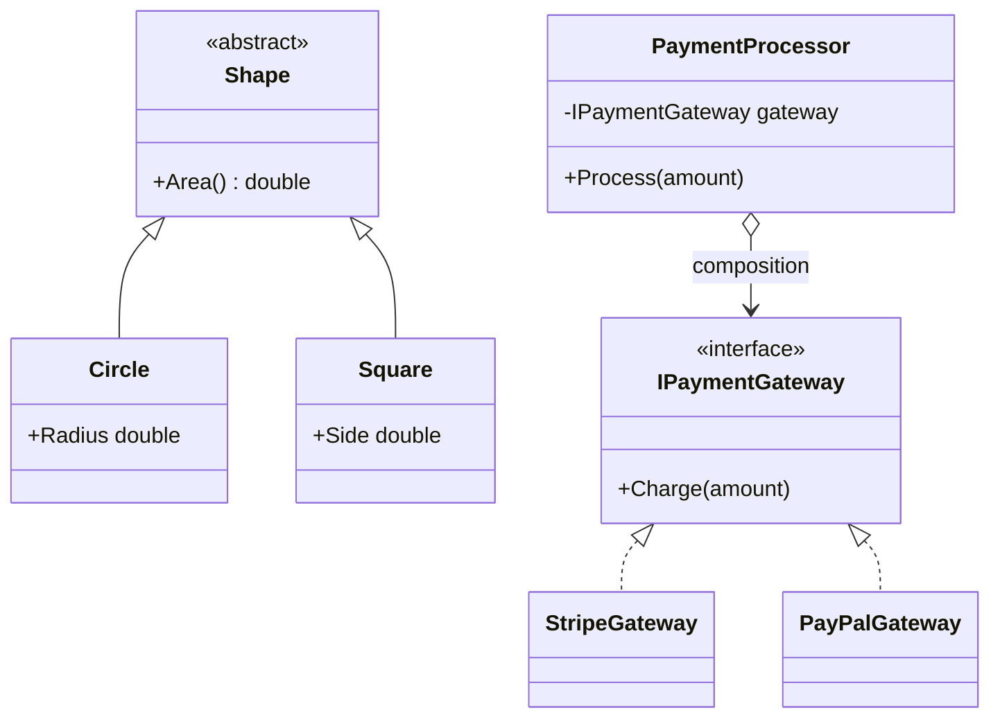

# Module 29 — OOP: Encapsulation, Inheritance, Polymorphism & Composition

> Domain: OOP | Level: Beginner → Expert | Prerequisite: [[../01-CSharp/06-Generics-Variance]] (variance and substitutability), [[../01-CSharp/07-Records-Pattern-Matching-Immutability]] (discriminated-union alternative to inheritance)

---

## 1. Fundamentals

### What are the four pillars of OOP?
**Encapsulation** (bundling data with the behavior that operates on it, hiding internal representation behind a controlled interface), **Inheritance** (a type acquiring/extending another type's members), **Polymorphism** (code operating uniformly over multiple concrete types through a shared interface/base type, with the *actual* behavior determined at runtime by the concrete type — dynamic dispatch), and **Abstraction** (modeling essential characteristics while hiding implementation complexity behind a simpler conceptual interface).

### Why do these exist?
Encapsulation exists to let a type's internal representation change without breaking every caller (an invariant the C# `private`/property system, Module 7's `init`-only properties, and Module 6's interface-based abstraction all enforce at different levels). Inheritance/polymorphism exist to let code written against an abstraction work correctly with types that don't exist yet at the time that code was written — the actual mechanism behind extensible, "open for extension" designs.

### When does this matter?
Every object-oriented codebase; the depth matters for correctly applying **composition over inheritance** (a widely-cited but often superficially-understood principle) and for recognizing when inheritance is genuinely the right tool versus when it creates fragile, over-coupled hierarchies.

### How does it work (30,000-ft view)?
```csharp
public abstract class Shape { public abstract double Area(); }
public class Circle : Shape { public double Radius; public override double Area() => Math.PI * Radius * Radius; }
public class Square : Shape { public double Side; public override double Area() => Side * Side; }

double TotalArea(IEnumerable<Shape> shapes) => shapes.Sum(s => s.Area()); // polymorphic: works for ANY Shape subtype
```

---

## 2. Deep Dive

### 2.1 The Liskov Substitution Principle — Precisely What "Substitutable" Means
A subtype must be substitutable for its base type **without altering the correctness of any code using the base type** — not merely "compiles when substituted," but genuinely preserves the base type's **behavioral contract** (preconditions no stronger, postconditions no weaker, invariants preserved). The canonical violation example (a `Square` inheriting from `Rectangle`, overriding `SetWidth`/`SetHeight` to keep both sides equal) breaks any code that assumes setting `Rectangle.Width` doesn't affect `Height` — the substitution compiles but violates the base type's implicit behavioral contract, producing a genuinely subtle, hard-to-locate bug in any caller relying on that contract.

### 2.2 Composition Over Inheritance — the Actual Reasoning, Not Just the Slogan
Inheritance creates the **tightest possible coupling** between two types — a subclass depends on its base class's *implementation details*, not just its public interface (the "fragile base class problem": a seemingly-safe internal change to a base class can silently break every derived class depending on undocumented, implicit behavior). Composition (a type *holding a reference to* another type and delegating to it, rather than inheriting from it) couples only through the held type's **public interface**, and can be changed/swapped at runtime (a held `IStrategy` reference can be reassigned; a base class cannot be "reassigned" after construction) — this is precisely why "favor composition over inheritance" is standard guidance: it minimizes coupling to exactly the deliberate, public contract, not incidental implementation detail.

### 2.3 Interface-Based Polymorphism vs Inheritance-Based Polymorphism
Inheritance-based polymorphism (a shared base class) forces a single-inheritance hierarchy (in C#) and couples derived types to shared base-class state/implementation, even if unwanted; interface-based polymorphism (Module 6's variance discussion) allows a type to implement **multiple** interfaces, coupling only to method signatures, not shared implementation — modern C# design (and this course's recurring Module 6/7 discussion of sealed-hierarchy discriminated unions as a records-based alternative) increasingly favors composing small, focused interfaces over deep inheritance hierarchies specifically to avoid the fragile-base-class problem entirely.

### 2.4 When Inheritance Is Genuinely the Right Tool
Despite composition's general preference, inheritance remains the correct choice when there's a genuine **"is-a" relationship with shared, stable behavior** the derived types should not need to reimplement or explicitly delegate to (a template-method-pattern base class providing a fixed algorithm skeleton with specific steps overridden by subclasses) — the deciding factor is whether the relationship is genuinely one of *is-a* substitutability (LSP-compliant) versus merely *has-a*/*can-do* (better modeled via composition/interfaces).

### 2.5 Encapsulation Beyond `private` — Invariant Protection
True encapsulation isn't just hiding fields behind properties — it's ensuring an object **can never be observed in an invalid state** by any external code, at any point in its lifetime. A class with a public setter allowing `order.Quantity = -5` (a value violating the domain's actual invariant) has *technically* encapsulated its field behind a property, but has **not** actually encapsulated its invariant — genuine encapsulation requires validating state transitions (a setter/method rejecting invalid values, or Module 7's `init`-only properties combined with constructor validation) so external code can never construct or mutate the object into an invalid state, not merely hiding the storage mechanism.

## 3. Visual Architecture


## 4. Production Example
**Scenario**: A codebase modeled `PriorityCustomer : Customer` (inheritance), overriding `Customer.ApplyDiscount()` to always return a minimum 10% discount regardless of the base class's usual tiered-discount calculation logic — this silently violated LSP: code elsewhere iterating over a mixed `List<Customer>` and calling `ApplyDiscount()` expecting the base class's documented "discount never exceeds order total" postcondition broke when a `PriorityCustomer`'s override, combined with an unrelated promotional-discount stacking feature added later, could produce a discount **exceeding** the order total, since the override hadn't been designed with that later feature's interaction in mind. **Investigation**: traced to the `PriorityCustomer` subclass's override changing behavior in a way the base class's calling code implicitly, but not explicitly, assumed would never happen. **Fix**: replaced the inheritance hierarchy with composition — a single `Customer` class holding an `IDiscountStrategy` (with `StandardDiscountStrategy`, `PriorityDiscountStrategy` implementations), and a shared, enforced invariant check (`Math.Min(calculatedDiscount, orderTotal)`) applied uniformly regardless of which strategy computed the raw discount — eliminating the LSP violation structurally, since the invariant is now enforced once, centrally, rather than depending on every subclass's override to independently uphold it correctly. **Lesson**: an inheritance hierarchy where a subclass overrides behavior in a way that isn't provably compatible with the base class's full behavioral contract (including contracts assumed by code that doesn't yet exist, like the later promotional-stacking feature) is a standing LSP-violation risk — composition centralizes invariant enforcement in one place, making it structurally harder to bypass than trusting every subclass override to independently respect it.

## 5. Best Practices
- Favor composition/interfaces over inheritance by default; reserve inheritance for genuine, LSP-compliant is-a relationships with stable shared behavior.
- Enforce class invariants centrally (constructor validation, guarded setters) rather than trusting every caller/subclass to respect them independently.
- Design interfaces small and focused (directly Module 6's Interface Segregation discussion) rather than large, multi-purpose base classes forcing unwanted coupling.
- Explicitly document a base class's behavioral contract (not just its method signatures) for any type designed to be inherited from.

## 6. Anti-patterns
- Using inheritance purely for code reuse without a genuine is-a relationship (the classic "inheritance for convenience" mistake).
- Overriding a base class method in a way that violates its implicit behavioral contract, even if it compiles (§4's incident).
- Deep inheritance hierarchies (more than 2-3 levels) making it hard to reason about a derived type's actual, effective behavior.
- Public setters with no validation, allowing an object to be mutated into an invalid domain state.

## 7. Performance Engineering
Virtual/interface dispatch has real, if usually small, indirection cost compared to a direct, non-polymorphic call (Module 1's JIT-devirtualization discussion) — composition via an interface reference incurs the same dispatch cost as inheritance-based polymorphism through a virtual method; neither is inherently faster than the other at the dispatch-mechanism level, so this is not the deciding factor in the composition-vs-inheritance choice.

## 8. Security
An LSP violation in an authorization-related class hierarchy (a subclass silently weakening a base class's security check) is a genuine, real vulnerability class — treat any override of security-relevant base-class behavior with the same scrutiny as directly Module 12's resource-based-authorization discussion, since a compiling-but-contract-violating override is exactly the kind of subtle bug that can silently bypass an intended security invariant.

## 9. Scalability
Not a direct scaling-mechanism concern; the practical connection is that composition-based designs (small, swappable, interface-bound components) are typically easier to test, mock, and evolve independently across a growing team/codebase than deep inheritance hierarchies, indirectly supporting a codebase's ability to scale in complexity/team size without becoming unmaintainable.

---

## 10. Interview Questions

### Basic (10)
1. **Q: What are the four pillars of OOP?** **A:** Encapsulation, Inheritance, Polymorphism, Abstraction.
2. **Q: What is encapsulation?** **A:** Bundling data with the behavior operating on it, hiding internal representation behind a controlled interface.
3. **Q: What is polymorphism?** **A:** Code operating uniformly over multiple concrete types through a shared interface/base type, with actual behavior determined at runtime by the concrete type.
4. **Q: What does "favor composition over inheritance" mean?** **A:** Prefer a type holding and delegating to another type over inheriting from it, to minimize coupling.
5. **Q: What is the Liskov Substitution Principle?** **A:** A subtype must be substitutable for its base type without altering the correctness of any code using the base type.
6. **Q: What is the fragile base class problem?** **A:** A subclass depending on a base class's implementation details, such that a seemingly-safe base class change can silently break derived classes.
7. **Q: Can a C# class inherit from multiple classes?** **A:** No — single inheritance only, though a class can implement multiple interfaces.
8. **Q: What is an "is-a" versus "has-a" relationship?** **A:** "Is-a" suggests inheritance (a Circle is-a Shape); "has-a" suggests composition (a Car has-a Engine).
9. **Q: Does a public property with a getter and setter automatically mean a class is well-encapsulated?** **A:** No — true encapsulation requires the setter to also validate/prevent invalid states, not just hide the backing field.
10. **Q: What is abstraction, distinct from encapsulation?** **A:** Modeling essential characteristics while hiding implementation complexity behind a simpler conceptual interface, distinct from encapsulation's focus on controlling access to internal state.

### Intermediate (10)
1. **Q: Why does the classic Square-extends-Rectangle example violate LSP?** **A:** Because forcing width and height to stay equal (to maintain "squareness") breaks the base class's implicit contract that setting `Width` doesn't affect `Height` — any code relying on that independence breaks when substituted with a `Square`.
2. **Q: Why is the fragile base class problem specifically a coupling concern, not just a bug-risk concern?** **A:** It means a derived class's correctness depends on the base class's *current implementation*, not just its documented public contract — any future base-class change, even one that preserves its public interface, can silently break derived classes relying on undocumented implementation details.
3. **Q: Why does composition allow runtime flexibility inheritance doesn't?** **A:** A composed dependency (e.g., an injected `IDiscountStrategy`) can be swapped/reassigned at runtime; an object's inheritance hierarchy is fixed at compile time and construction, with no equivalent runtime-swappable mechanism.
4. **Q: Why might a large, multi-purpose base class violate the Interface Segregation Principle even if it's technically an interface, not a base class?** **A:** A large interface forces every implementing type to provide (or explicitly stub out) methods it may not actually need, exactly the same unwanted-coupling problem as a fat base class — Interface Segregation (Module 6-adjacent, a later dedicated SOLID module) addresses this by preferring several small, focused interfaces over one large one.
5. **Q: Why is "code reuse" alone an insufficient justification for choosing inheritance?** **A:** Reuse can be achieved via composition (delegating to a shared, reusable component) without the tight coupling and LSP-substitutability obligations inheritance specifically implies — inheritance should be justified by a genuine is-a relationship, not merely by wanting to avoid duplicating code.
6. **Q: Why does deep inheritance (more than 2-3 levels) make a codebase harder to reason about?** **A:** A derived type's actual, effective behavior is the combination of every ancestor's contributions — the deeper the hierarchy, the more distant, indirect base classes an engineer must trace through to understand what a specific derived instance actually does, compounding the fragile-base-class risk at every additional level.
7. **Q: Why might centralizing invariant enforcement (§4's fix) be more robust than trusting every subclass to enforce it independently?** **A:** Because it removes the correctness burden from every individual subclass author (who might not anticipate every future interaction, as in §4's promotional-stacking scenario) and places it in one, single, reviewable location that every code path passes through regardless of which subclass/strategy produced the input.
8. **Q: What's the relationship between LSP violations and unit testing?** **A:** A well-designed test suite exercising the base type's documented contract (not just each subclass's specific behavior) against every subclass polymorphically is a direct, mechanical way to catch LSP violations — if a subclass fails a test written purely against the base type's contract, that's the LSP violation surfacing concretely.
9. **Q: Why does an authorization-related class hierarchy warrant extra scrutiny for LSP compliance?** **A:** A subclass silently weakening a base class's security check (e.g., an override that skips a validation step the base class always performs) compiles and appears functionally correct in isolation, but violates the base class's implicit "always enforces this check" contract — exactly the kind of subtle, hard-to-catch bug that can become a genuine security vulnerability if not caught.
10. **Q: Why would a Staff/Principal-level interview specifically probe "when would you choose inheritance despite generally preferring composition"?** **A:** Because reflexively citing "composition over inheritance" without understanding *when* inheritance is still the correct tool (genuine is-a relationships with stable, shared behavior, like a template-method pattern) suggests a surface-level, slogan-level understanding rather than a genuine grasp of the underlying coupling/substitutability trade-offs.

### Advanced (10)
1. **Q: Diagnose the discount-calculation LSP violation (§4) from first principles, and explain precisely why composition's fix structurally prevents recurrence, not just this specific instance.**
   **A:** The root cause was delegating both "compute the raw discount" and "ensure the discount is a valid amount" to the same override, with no structural guarantee the second concern was upheld — the composition-based fix separates these two concerns explicitly: `IDiscountStrategy` implementations are responsible **only** for computing a raw discount value, while the invariant check (`Math.Min(discount, orderTotal)`) lives in exactly one place, applied uniformly to *every* strategy's output regardless of which one produced it — this isn't just fixing the one instance where `PriorityDiscountStrategy` and promotional stacking interacted badly, it structurally prevents *any* current or future strategy from ever bypassing the invariant, since the invariant enforcement is no longer something each strategy implementation must independently remember to include.
2. **Q: Design a template-method-pattern base class where inheritance is genuinely the correct tool, and explain why composition wouldn't serve as well here.**
   **A:**
   ```csharp
   public abstract class ReportGenerator
   {
       public string Generate() // fixed algorithm skeleton -- the "template"
       {
           var data = FetchData();
           var formatted = FormatData(data);
           return WrapWithHeaderFooter(formatted); // shared, stable, non-overridable behavior
       }
       protected abstract IEnumerable<object> FetchData();
       protected abstract string FormatData(IEnumerable<object> data);
       private string WrapWithHeaderFooter(string body) => $"--- REPORT ---\n{body}\n--- END ---";
   }
   ```
   Composition would require every concrete report type to separately implement (or remember to call) the shared header/footer-wrapping logic and the fixed fetch-then-format sequencing — the entire point of this pattern is that the **algorithm's structure itself** (fetch, then format, then wrap) is the shared, stable, is-a-"a kind of report generation process" behavior, which inheritance's "share behavior automatically, override only specific steps" mechanism expresses more directly and safely (a subclass literally cannot skip the header/footer wrapping, since it's `private` in the base class) than composition, which would require every composed caller to remember to invoke the shared logic correctly and in the right order.
3. **Q: Explain how you would refactor a deep (4+ level) inheritance hierarchy exhibiting fragile-base-class symptoms, without a risky, all-at-once rewrite.**
   **A:** Identify, level by level starting from the deepest, which derived classes' behavior is genuinely "is-a" (LSP-compliant, benefiting from automatic base-class behavior) versus which have accumulated ad-hoc overrides that actually represent a "has-a"/strategy-like variation (a red flag for a should-be-composed concern trapped inside an inheritance hierarchy); extract the strategy-like variations into composed, injected interfaces one at a time (directly the "expand, don't break" incremental-migration pattern recurring throughout this course), flattening the hierarchy's depth incrementally rather than attempting a single, large, all-at-once redesign that risks introducing new bugs across the entire hierarchy simultaneously.
4. **Q: How would you write an automated test specifically designed to catch LSP violations across an entire inheritance hierarchy, generalizing beyond manually reasoning about each subclass individually?**
   **A:** Write a **shared, parameterized contract test suite** expressed purely in terms of the base type's documented behavior/postconditions (e.g., "discount never exceeds order total," "calling Dispose twice never throws"), then run that **identical** test suite against every concrete subclass in the hierarchy (via a test framework's parameterized/theory-based test mechanism, instantiating each subclass in turn) — any subclass failing a test written purely against the base contract is a mechanically-detected LSP violation, directly generalizing this course's recurring "test the actual contract, not just each specific implementation" theme (REST APIs module's contract testing, Module 20's query-count regression testing) to the OOP inheritance-hierarchy context specifically.
5. **Q: Explain a scenario where an interface (not a class hierarchy) can still suffer from an LSP-like violation, despite interfaces having no shared implementation to inherit incorrectly.**
   **A:** If an interface's documentation implies a behavioral contract beyond its method signatures (e.g., `IRepository<T>.GetByIdAsync` is documented/expected to return `null` for a non-existent ID, never throw), an implementation that instead throws an exception for a missing ID **compiles** and satisfies the interface's *signature* but violates its *behavioral* contract — any caller written against the documented contract (expecting `null`, handling it gracefully) breaks when given this particular implementation, demonstrating that LSP-style substitutability concerns apply to interface implementations just as much as class inheritance, even without any shared implementation code to blame.
6. **Q: How would you decide whether a "Manager" role needing most of an "Employee" class's behavior plus a few additional capabilities should be modeled via inheritance (`Manager : Employee`) or composition (`Manager` having an `Employee` plus additional manager-specific data/behavior)?**
   **A:** Ask whether every piece of code that operates on `Employee` should also correctly, safely operate on a `Manager` substituted in its place (the LSP test) — if yes (a `Manager` genuinely "is-a" `Employee` in every behaviorally-relevant sense the codebase cares about), inheritance is appropriate; if a `Manager`'s additional responsibilities create scenarios where treating it uniformly as "just an Employee" would be incorrect or requires special-casing elsewhere in the codebase, that's a signal the relationship is better modeled as `Manager` composing/holding employee-related data alongside its own distinct manager-specific behavior, rather than forcing an is-a relationship that doesn't actually hold cleanly.
7. **Q: Explain why "the derived class only adds new methods, never overrides existing ones" is not, by itself, sufficient to guarantee LSP compliance.**
   **A:** LSP concerns aren't limited to overridden methods — a derived class can also violate the base type's contract through **new invariants it introduces that conflict with existing base-class assumptions** (e.g., a derived class adding a constructor precondition stricter than the base class's, such that code polymorphically constructing/using base-typed objects via a factory now fails for this specific subtype in a way the base contract never anticipated) — LSP is about the full behavioral contract (preconditions, postconditions, invariants) across the type's entire public surface, not merely "did you override an existing method in an incompatible way."
8. **Q: Design a strategy for safely introducing a new interface-based composition point into an existing, working inheritance hierarchy without breaking existing subclasses.**
   **A:** Add the new interface as an **additional**, optional composed dependency on the base class (injected via constructor with a sensible default implementation for backward compatibility), rather than immediately removing the corresponding inherited-and-overridden behavior — existing subclasses continue working unchanged (their overrides still apply, since nothing was removed), while new code can be written against the new, composition-based extension point; gradually migrate existing subclasses' logic into the new composed mechanism one at a time, only removing the old inheritance-based override path once every subclass has been migrated and validated — directly the same additive, non-breaking migration discipline recurring throughout this course.
9. **Q: A team argues "we should never use inheritance at all, only composition, as an absolute rule." Evaluate this as a Principal Engineer.**
   **A:** Push back on the absolutism: composition-over-inheritance is a strong **default preference**, not a rule with zero exceptions — the template-method pattern (Advanced Q2) and other genuine is-a relationships with stable shared algorithmic structure are legitimate, LSP-compliant uses of inheritance that composition would express more awkwardly; recommend the nuanced guidance this module actually teaches ("default to composition; use inheritance deliberately, only for genuine, LSP-verified is-a relationships") rather than either extreme (always inherit, or never inherit) — dogmatic rule-following in either direction misses the actual underlying engineering judgment this principle exists to develop.
10. **Q: As a Principal Engineer conducting an architecture review, how would you evaluate a proposed new class hierarchy for LSP compliance and appropriate inheritance-vs-composition usage before it's built, rather than discovering issues after the fact (as in §4)?**
    **A:** Require the proposal to explicitly state the base type's full behavioral contract (not just method signatures) and walk through, for each proposed subclass, whether it genuinely preserves every part of that contract — specifically probing any override with "what does this override change about the base class's behavior, and can you identify any existing or plausible-future caller that might rely on the behavior being changed?" (directly the question that would have caught §4's incident before it shipped); for any relationship where the answer reveals genuine behavioral divergence rather than pure specialization, recommend composition/strategy-pattern instead, structurally preventing the LSP violation from ever being built rather than needing to be discovered and refactored later.

---

## 11. Coding Exercises

### Easy — Fix an LSP violation by removing an incompatible override
```csharp
// BEFORE: violates LSP -- ReadOnlyList's Add silently does nothing, breaking callers
// that assume Add() actually adds an item (the base List<T> contract).
public class ReadOnlyList<T> : List<T>
{
    public new void Add(T item) { /* no-op, silently ignores */ }
}

// AFTER: don't inherit from List<T> at all -- compose it, expose only read operations,
// making the type's actual (narrower) contract honest and impossible to misuse.
public class ReadOnlyList<T> : IReadOnlyList<T>
{
    private readonly List<T> _items;
    public ReadOnlyList(IEnumerable<T> items) => _items = items.ToList();
    public T this[int index] => _items[index];
    public int Count => _items.Count;
    public IEnumerator<T> GetEnumerator() => _items.GetEnumerator();
    IEnumerator IEnumerable.GetEnumerator() => GetEnumerator();
}
```

### Medium — Replace an inheritance-based discount hierarchy with composition (§4's fix)
```csharp
public interface IDiscountStrategy { decimal ComputeDiscount(Order order); }
public class StandardDiscountStrategy : IDiscountStrategy
{
    public decimal ComputeDiscount(Order order) => order.Total * 0.05m;
}
public class PriorityDiscountStrategy : IDiscountStrategy
{
    public decimal ComputeDiscount(Order order) => Math.Max(order.Total * 0.10m, 5.00m);
}

public class Customer
{
    private readonly IDiscountStrategy _discountStrategy;
    public Customer(IDiscountStrategy discountStrategy) => _discountStrategy = discountStrategy;

    public decimal ApplyDiscount(Order order)
    {
        var raw = _discountStrategy.ComputeDiscount(order);
        return Math.Min(raw, order.Total); // invariant enforced ONCE, centrally, regardless of strategy
    }
}
```

### Hard — Parameterized LSP contract test across a hierarchy (Advanced Q4)
```csharp
public abstract class ShapeContractTests<TShape> where TShape : Shape
{
    protected abstract TShape CreateShapeWithArea(double expectedArea);

    [Fact]
    public void Area_Should_Never_Be_Negative()
    {
        var shape = CreateShapeWithArea(10.0);
        Assert.True(shape.Area() >= 0, "Area contract violated: Area() returned a negative value.");
    }
}

public class CircleContractTests : ShapeContractTests<Circle>
{
    protected override Circle CreateShapeWithArea(double expectedArea) => new Circle { Radius = Math.Sqrt(expectedArea / Math.PI) };
}
public class SquareContractTests : ShapeContractTests<Square>
{
    protected override Square CreateShapeWithArea(double expectedArea) => new Square { Side = Math.Sqrt(expectedArea) };
}
// Both CircleContractTests and SquareContractTests automatically inherit and run the SAME
// base-contract test -- any future Shape subclass violating the "Area is never negative"
// contract is caught by simply adding one more contract-test subclass, not hand-writing a new test.
```

### Expert — Template-method pattern with a composed, swappable step (hybrid design)
```csharp
public abstract class ReportGenerator
{
    private readonly IReportFormatter _formatter; // composition for the genuinely variable part
    protected ReportGenerator(IReportFormatter formatter) => _formatter = formatter;

    public string Generate() // fixed algorithm skeleton -- inheritance's strength
    {
        var data = FetchData(); // subclass-specific, is-a-variation (inheritance appropriate)
        return _formatter.Format(data); // swappable at runtime (composition appropriate)
    }
    protected abstract IEnumerable<object> FetchData();
}
```
**Discussion**: This deliberately combines both tools where each is actually the better fit — `FetchData()` varies by genuine report-type specialization (an is-a relationship, appropriately expressed via inheritance's override mechanism), while the formatting strategy is swappable independent of report type (appropriately expressed via composition) — a concrete demonstration that "composition over inheritance" and "inheritance is sometimes right" aren't in tension when applied to the specific part of a design each is actually suited for, directly synthesizing Advanced Q2 and Advanced Q9's nuanced guidance into one cohesive example.

---

## 12–17. System Design / LLD / Debugging / Decision / Case Study / Principal

An e-commerce platform (§4) replaces its discount-calculation inheritance hierarchy with a composed `IDiscountStrategy` design, centralizing invariant enforcement in one location rather than trusting every subclass override to independently uphold it, and adopts a parameterized contract-test pattern (Hard exercise) across its remaining, genuinely-appropriate inheritance hierarchies (shape/geometry types) to mechanically catch LSP violations before they ship. The signature production incident (§4) — a `PriorityCustomer` subclass's override silently violating the base class's "discount never exceeds order total" contract once combined with a later, unrelated feature — is this module's central lesson: LSP violations are dangerous specifically because they compile cleanly and often work correctly in isolation, only manifesting once a change elsewhere in the codebase interacts with the violated contract in an unanticipated way. Principal-level guidance: require every inheritance-hierarchy proposal to explicitly document the base type's full behavioral contract and walk through each subclass's compliance during design review, catching this class of issue before it's built rather than after it ships.

## 18. Revision
**Key takeaways**: LSP requires genuine behavioral-contract preservation (preconditions, postconditions, invariants), not just compile-time substitutability. The fragile base class problem is fundamentally a coupling-to-implementation-detail issue, distinct from ordinary API coupling. Composition minimizes coupling to a held type's public interface and allows runtime swappability; inheritance is appropriate specifically for genuine, stable is-a relationships (template-method patterns) where sharing algorithm structure automatically is the actual goal. Centralize invariant enforcement in one location rather than trusting every subclass/strategy implementation to independently uphold it — this structurally prevents an entire class of LSP-violation bugs, not just one instance.

---

**Next**: Continuing autonomously to Module 30 — SOLID Principles Deep Dive (completing the OOP-adjacent foundation before Design Patterns).
