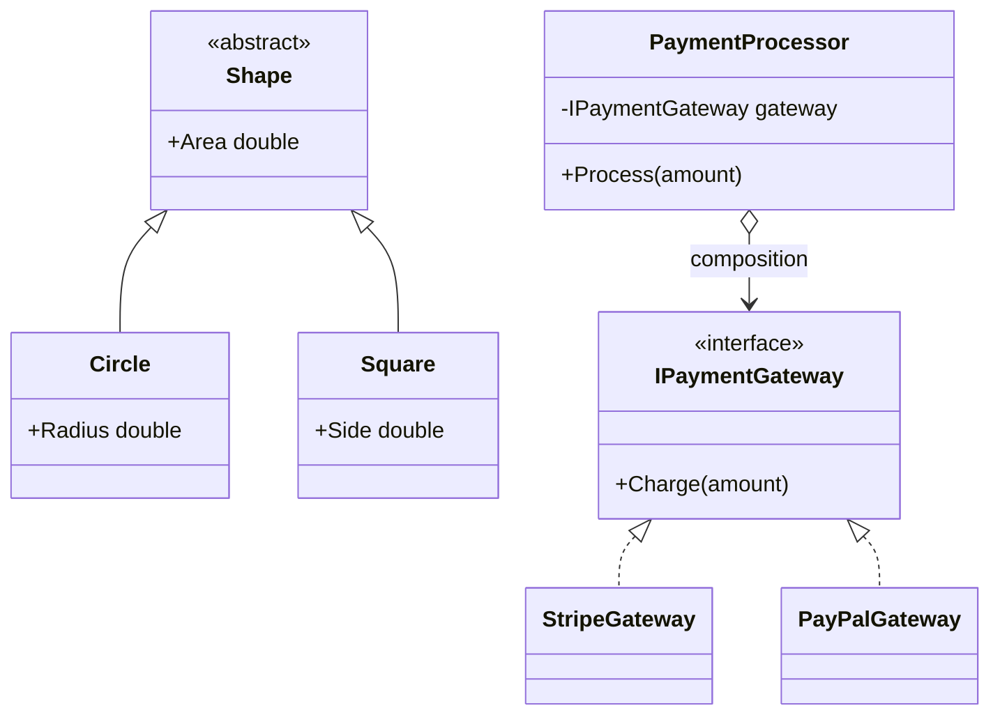
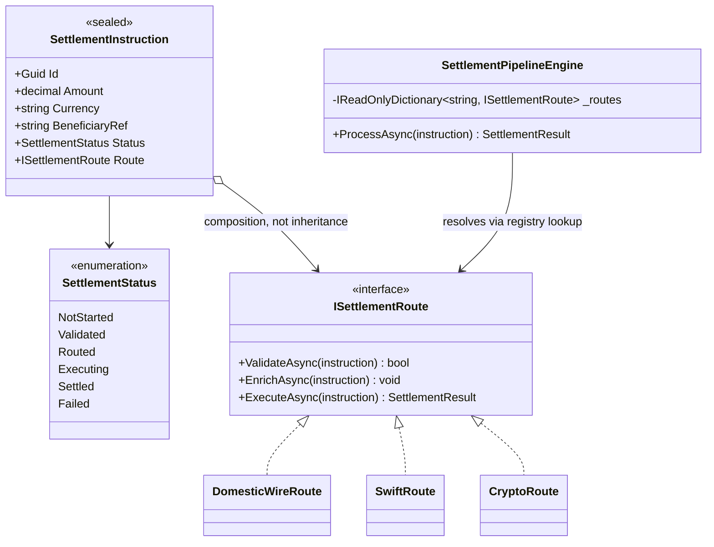
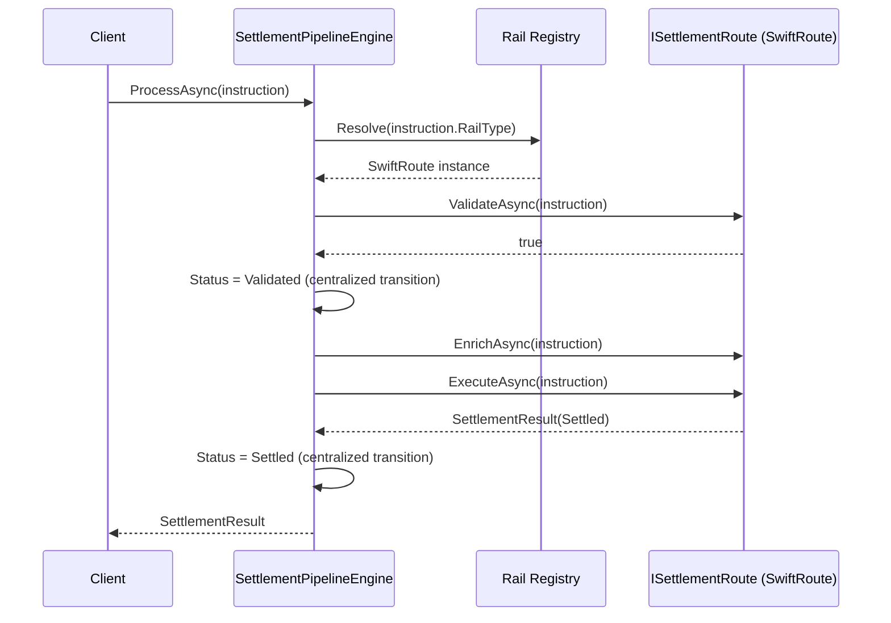

# Module 29 — OOP: Encapsulation, Inheritance, Polymorphism & Composition

> Domain: OOP | Level: Beginner → Expert | Prerequisite: [[../01-CSharp/06-Generics-Variance]] (variance and substitutability), [[../01-CSharp/07-Records-Pattern-Matching-Immutability]] (discriminated-union alternative to inheritance)

---

## 1. Topic Description

### Definition

Object-oriented programming organises a system as collaborating objects that own state and expose behaviour, with **encapsulation** hiding representation behind an interface, **abstraction** exposing intent rather than mechanism, **inheritance** establishing a subtype relationship, and **polymorphism** allowing one call site to work against many implementations. At senior level the interesting content is not the four pillars as vocabulary but their *consequences*: which relationships are substitutable, where behaviour should live, when inheritance is a modelling error, and how a language's dispatch mechanics (virtual tables, hiding versus overriding, interface dispatch) determine what a design actually does at runtime.

### Core sub-concepts

- **Encapsulation** — invariants protected by the type; the difference between a public field and a property; "tell, don't ask".
- **Abstraction** — interfaces as contracts of intent; abstraction chosen by the consumer's need, not by mirroring the implementation.
- **Inheritance versus composition** — is-a versus has-a, the fragile base class problem, and why composition is the default.
- **Polymorphism** — subtype (virtual dispatch), parametric (generics), and ad hoc (overloading); dispatch at runtime versus compile time.
- **Virtual, abstract, override, sealed, and `new` hiding** — what each does to dispatch, and why hiding is a bug magnet.
- **Liskov substitutability in practice** — strengthened preconditions, weakened postconditions, and the classic square/rectangle failure.
- **Interfaces versus abstract classes** — contract versus partial implementation; default interface members and what they change.
- **Object identity versus equality** — reference equality, value equality, `Equals`/`GetHashCode` contracts, mutability and hash stability.
- **Object lifecycle and ownership** — construction invariants, `IDisposable` ownership, and who is responsible for a collaborator's lifetime.
- **Cohesion and coupling** — the actual measures behind "good design"; law of Demeter and train-wreck chains.
- **Anemic domain model versus rich behaviour** — data bags with external procedures versus objects that enforce their own invariants.
- **Static state and testability** — hidden dependencies, global mutable state, and why they break substitution.
- **Value objects and entities** — equality semantics as a modelling decision.
- **Immutability in object design** — invariants that cannot be broken after construction.
- **Composition patterns without inheritance** — delegation, strategy-shaped collaborators, extension methods and their limits.

### Where it fits

OOP is the modelling layer between the language's type system and the architectural patterns built on top of it. Downward it depends on runtime dispatch mechanics and on equality, generics and lifetime semantics. Upward, it is the substrate for the SOLID principles, which are a set of rules *about* OOP design, and for the GoF patterns, which are named solutions expressed in OOP terms — both covered in their own folders. In a layered application it determines where business rules live: an object model that owns its invariants produces a domain layer, whereas one that exposes data produces a procedural service layer with the rules scattered through it.

### Why it matters at scale

The cost of OOP mistakes is paid in change velocity rather than in latency. A deep inheritance hierarchy means a change to a base class ripples unpredictably through subclasses nobody has read, so every change becomes a risk assessment — the fragile base class problem, and the reason large codebases with deep hierarchies slow down over years. An anemic model with rules spread across services means the same invariant is enforced in five places and eventually only four, which is how invalid data enters a system that "validates everything". Substitutability violations produce the worst class of defect: a subclass that behaves subtly differently breaks callers that never referenced it, and the failure surfaces far from the change. None of these show up in a profiler; they show up as a team that can no longer estimate.

### Common pitfalls / anti-patterns

- **Inheriting to reuse code rather than to express substitutability** — the subclass is not an is-a of the base, so callers written against the base receive surprising behaviour, and the base cannot change without breaking unrelated subclasses.
- **The anemic domain model** — classes with public getters and setters and no behaviour, with rules in "service" classes; the object cannot protect its own invariants, so they are enforced inconsistently and duplicated.
- **Method hiding with `new` instead of `override`** — dispatch depends on the *static* type of the reference, so the same object behaves differently depending on which variable holds it; a genuine source of unreproducible bugs.
- **Liskov violations that compile fine** — a subclass throwing `NotSupportedException` for an inherited operation, or tightening a precondition, so substituting it breaks callers that were correct against the base contract.
- **Exposing mutable internal collections** — returning `List<T>` from a property lets callers mutate state behind the object's back, defeating every invariant the class claims to enforce.
- **Train-wreck chains (`a.B.C.D.DoThing()`)** — couples the caller to the whole object graph's shape, so an internal restructuring anywhere along the chain breaks distant code.
- **Static mutable state and singletons used as global variables** — hidden dependencies invisible in constructors, untestable in isolation, and shared across requests in a server.
- **Mutable objects used as dictionary keys or in hash sets** — a field change alters the hash, so the entry becomes unreachable while still present.
- **Interfaces that mirror one implementation one-to-one** — an "abstraction" with a single implementer and no consumer-driven shape adds indirection without decoupling anything.

---

## 2. Beginner (10 Q&A)

**Q1. What is encapsulation actually protecting, and how do you know it's been broken?**
**A:** It protects *invariants* — the conditions that must always hold for the object to be valid — by ensuring every state change goes through code that can enforce them. You know it is broken when a caller can put the object into a state its own methods would have rejected: a public setter that bypasses validation, an exposed mutable collection, or a constructor that permits a half-built object. Properties with private setters and read-only collections are mechanisms; the test is whether an invalid state is *representable*, not whether fields are private.
*Follow-up: A class has a public getter returning its internal `List<T>`. What specifically can go wrong?*

**Q2. When is inheritance the right tool, and what's the default alternative?**
**A:** Inheritance is right when the subtype is genuinely substitutable for the base — every caller written against the base must work correctly with the subtype, with no surprises. That is a strong claim, and most reuse motivations do not meet it. Composition is the default: hold a collaborator and delegate, which gives reuse without the coupling, allows the relationship to change at runtime, and avoids the fragile base class problem. The rule of thumb I apply is that inheritance expresses a *contract*, composition expresses a *capability*.
*Follow-up: You have five classes sharing 80% of their code. Does that justify a base class?*

**Q3. Explain the fragile base class problem.**
**A:** Subclasses depend not just on a base class's public contract but on its internal behaviour — which methods call which, in what order. So a change inside the base that preserves its public contract can still break subclasses, because they relied on the internal call sequence. The classic example is a base collection whose `AddRange` calls `Add` internally; a subclass overriding both to count items double-counts, and a later refactor of the base changes the count silently. It is fragile because the coupling is invisible: nothing in the base's signature warns you.
*Follow-up: How would you design a base class to be safely inheritable despite this?*

**Q4. What's the difference between `override` and `new` method hiding, and why does it matter?**
**A:** `override` replaces the virtual method in the dispatch table, so the subclass's implementation runs regardless of the reference's static type. `new` declares a separate method that *hides* the base's, so which implementation runs depends on the compile-time type of the variable holding the object. That means the same instance behaves differently through a base-typed reference than through a derived-typed one — a genuinely confusing bug source, because the object is identical and only the variable's declared type differs. Hiding is almost always a mistake rather than an intent.
*Follow-up: When is `new` hiding legitimately the right choice?*

**Q5. State the Liskov Substitution Principle in practical terms and give a violation.**
**A:** Anywhere a base type is expected, a subtype must work without the caller needing to know. Practically that means a subtype may not strengthen preconditions, weaken postconditions, or throw for operations the base contract supports. The canonical violation is a `Square` inheriting `Rectangle`: setting width independently of height is valid for a rectangle and impossible for a square, so code correct against `Rectangle` breaks. A more common real one is a read-only collection inheriting a mutable interface and throwing on `Add`.
*Follow-up: Where does the square/rectangle problem actually come from — the code or the model?*

**Q6. Interface or abstract class — how do you choose?**
**A:** An interface defines a contract with no implementation and allows a type to satisfy several unrelated contracts, which makes it the right choice for capabilities and for anything a consumer defines. An abstract class provides shared implementation and state and can enforce a template of behaviour, at the cost of consuming the single-inheritance slot and coupling every subclass to its internals. My default is an interface for the contract, with composition supplying shared behaviour; an abstract class earns its place when there is genuine shared state and a template method the subclasses fill in.
*Follow-up: Default interface members blur this line. What do they change and what do they not?*

**Q7. What is the contract between `Equals` and `GetHashCode`?**
**A:** Objects that are equal must return the same hash code; unequal objects may collide but ideally do not. Breaking it means hash-based collections misbehave: an item is inserted, then cannot be found, because the lookup hashes to a different bucket than the one it was stored in. The related trap is mutability — if a field participating in the hash changes while the object is in a dictionary, the entry becomes unreachable while still occupying space. That is why keys must be immutable for as long as they are keys.
*Follow-up: You override `Equals` but not `GetHashCode`. What happens, and when will you notice?*

**Q8. What is an anemic domain model and why is it criticised?**
**A:** A model where classes hold data with public accessors and no behaviour, and all the rules live in separate service classes operating on them. It is criticised because the object cannot enforce its own invariants — anyone can set any field to anything — so the rules are enforced only if every caller remembers to route through the right service, and over time they are duplicated and drift. It is not always wrong: for genuinely data-shaped concerns like DTOs, that is exactly correct. It is wrong when the domain has real rules and they end up scattered.
*Follow-up: Where's the legitimate boundary between a rich domain object and an application service?*

**Q9. What does the Law of Demeter actually prevent?**
**A:** It says an object should only talk to its immediate collaborators, not reach through them — so `order.Customer.Address.Country` couples the caller to the shape of three classes it does not own. The consequence is that restructuring any of them breaks distant code that never mentioned them, and every such chain is also a null-check burden. The remedy is to ask the immediate collaborator for what you need (`order.ShippingCountry`), which keeps the traversal inside the object that owns the relationship. Its purpose is limiting the blast radius of an internal change.
*Follow-up: Does this apply to fluent APIs and LINQ chains, which look like the same shape?*

**Q10. Why is static mutable state a design problem rather than a style preference?**
**A:** Because it is a dependency that does not appear in any constructor, so a class's real requirements are invisible, and it is shared across every caller including concurrent ones. That makes the class untestable in isolation — tests interfere through the shared state and pass or fail by ordering — and in a server it means one request can observe another's data. Static *immutable* state is fine; it is the mutability plus the invisibility together that causes the damage.
*Follow-up: A team uses a static cache for performance. What would you require before accepting it?*

---

## 3. Intermediate (10 Q&A)

**Q1. You inherit a five-level deep hierarchy that everyone is afraid to change. How do you approach it?**
**A:** First understand what the hierarchy is actually expressing — usually it is code reuse rather than substitutability, which means the inheritance relationship is fictional and callers do not truly rely on polymorphism. I would map which subclasses are used polymorphically versus instantiated directly, because that determines whether the base type can be dissolved. Then flatten incrementally: extract shared behaviour into composed collaborators, replace inherited behaviour with delegation, and remove levels from the leaves upward with tests at each step. I would resist a rewrite, because the hierarchy encodes years of behaviour nobody has documented.
*Follow-up: One subclass overrides a base method and calls `base` conditionally. How does that constrain your refactor?*

**Q2. How do you decide where a piece of behaviour belongs?**
**A:** With the data it operates on and the invariants it protects — behaviour that only reads and writes one object's state belongs on that object, because that is what lets the object enforce its own rules. Behaviour coordinating several objects belongs in an application service or a domain service, since putting it on one of them arbitrarily creates coupling in the wrong direction. The test that catches the common error is: if a method's body is mostly getters and setters on another object, the behaviour is on the wrong class and should move to where the data lives.
*Follow-up: The behaviour needs data from two aggregates. Where does it go?*

**Q3. When does an interface add value, and when is it noise?**
**A:** It adds value when there are, or credibly will be, multiple implementations, when it defines a boundary you want to test across, or when it expresses a consumer's need rather than a provider's shape. It is noise when it mirrors a single class one-to-one with the same method names — that adds a file and an indirection while coupling the "abstraction" to the implementation's shape, so it decouples nothing. The useful discipline is to let the *consumer* define the interface it needs, which naturally produces small, meaningful contracts rather than mirrored ones.
*Follow-up: A team's convention is an interface for every service class. What's your argument against it?*

**Q4. How do you design a class hierarchy that will be extended by other teams?**
**A:** By being explicit about the extension points and closing everything else — sealed by default, with specific virtual members documented as the intended seams and a stated contract for what an override must and must not do. The template method pattern works well here: the base owns the algorithm and the invariants, and subclasses fill in named steps. What I would avoid is a large open base class, because every non-sealed member is an implicit promise about internal call ordering that you can no longer change. Where extension is genuinely open-ended, composition with an injected strategy is safer than inheritance.
*Follow-up: You sealed a class and an internal team says it blocks them. How do you handle that?*

**Q5. How do you spot a Liskov violation in code review?**
**A:** Look for overrides that throw for supported operations, that check the runtime type of their arguments, or that add a precondition the base did not have. Also look for callers doing type tests or casts on a base-typed reference, since that is a strong signal the subtypes are not actually substitutable and the caller has learned to compensate. A third signal is a subclass whose override ignores the base's parameters or silently does nothing. Each of these means the abstraction is claiming more than the implementations deliver.
*Follow-up: You find `if (x is SpecialCustomer)` in a service. What does that tell you and what do you do?*

**Q6. How does the choice between value and reference equality affect design?**
**A:** It determines whether two instances with the same contents are the same thing, which is a domain question rather than a technical one. Value objects — money, a date range, an address — should compare by value and be immutable, so they can be freely shared, cached and used as keys. Entities have identity that persists through state change, so two customers with identical details are still different customers, and value equality on them corrupts collections, change tracking and set operations. Getting this backwards is one of the more damaging modelling errors because the symptoms appear far from the cause.
*Follow-up: An ORM tracks entities by identity. What breaks if you give an entity value equality?*

**Q7. What are the trade-offs of favouring immutability in an object model?**
**A:** Immutable objects cannot be put into an invalid state after construction, are safe to share across threads without synchronisation, and are safe to cache — which eliminates whole categories of bug. The costs are allocation on every change, more ceremony for objects with many fields, and awkwardness for entities whose whole purpose is to change over time. My position is immutable by default for value objects, DTOs and events, mutable for entities and aggregates where mutation is the point, and that forcing immutability everywhere produces rebuild-the-world code that fights both the ORM and the domain.
*Follow-up: An aggregate has 20 fields and one changes frequently. Immutable or mutable?*

**Q8. How do you handle a class that has grown to twenty responsibilities?**
**A:** Identify the clusters — fields used together by the same subset of methods are a strong signal of a hidden class trying to get out — and extract them as collaborators, one at a time, with the original class delegating so callers are unaffected. The mistake is splitting by layer or by naming convention rather than by cohesion, which produces classes that always change together and so gains nothing. I would also check whether the class is large because it is a coordinator, in which case the fix is different: push behaviour down to the objects that own the data rather than extracting more coordinators.
*Follow-up: How would you measure cohesion to decide where the seams are?*

**Q9. How does OOP design affect testability, concretely?**
**A:** Dependencies passed in are substitutable in a test; dependencies constructed internally or reached through statics are not, so the class can only be tested with its real collaborators. Objects that own their invariants can be tested by asserting behaviour, whereas anemic ones require testing the service *and* setting up data in exactly the right shape. Deep hierarchies make tests brittle because a base change breaks many subclasses' tests at once. The general principle is that difficulty writing a test is design feedback: if setup is painful, the coupling is real and the test is telling you about it.
*Follow-up: A class is hard to test because it constructs a `HttpClient` internally. What are the options and which do you prefer?*

**Q10. When is procedural code the better choice than an object model?**
**A:** When the problem genuinely is a transformation rather than a set of entities with rules — a data pipeline, a report, a parser, a mapping layer. Forcing an object model onto that produces classes with no invariants to protect and behaviour that would read more clearly as functions. Equally, in a codebase where most types are DTOs crossing a boundary, insisting on rich objects at every layer adds mapping cost for no benefit. The judgement is whether there are invariants worth protecting; where there are not, objects add ceremony without buying anything.
*Follow-up: Where would you draw that line in a typical CRUD-heavy web service?*

---

## 4. Expert / Architect (10 Q&A)

**Q1. How do you evaluate whether a codebase's object model is helping or hindering?**
**A:** By where changes land. In a healthy model, a business rule change touches one class; in an unhealthy one it touches a service, a validator, a DTO, a mapper and a database call, because the rule lives nowhere in particular. I would look at the ratio of behaviour to data on domain types, the depth and branching of hierarchies, the frequency of type tests on base-typed references, and whether the same invariant is enforced in several places. The most useful evidence is a recent set of changes: tracing three real feature changes through the codebase tells you more than any static metric.
*Follow-up: The model looks anemic but the team ships quickly. Is that a problem?*

**Q2. How do you set design standards for OOP across many teams without producing dogma?**
**A:** By writing down the *failures* to avoid rather than the rules to follow — sealed by default with justified extension points, composition preferred over inheritance with inheritance requiring a substitutability argument, no static mutable state, invariants enforced by the type that owns them. Then reinforce with exemplars in the codebase, because teams copy the nearest example far more reliably than they read guidance. I would explicitly avoid mandating interfaces-for-everything or a fixed layering, since those produce ceremony that people follow while missing the point. The measure of good standards is whether they resolve real disagreements in review.
*Follow-up: Two senior engineers disagree on inheritance versus composition for a specific case. How do you adjudicate?*

**Q3. How do you approach modelling a domain you don't yet understand well?**
**A:** Start with the language the domain experts use and model the concepts they actually name, keeping the objects small and the invariants explicit as you learn them — the naming is the highest-value early artefact because it constrains everything afterwards. I would deliberately avoid deep hierarchies and premature abstraction, since both encode assumptions that are expensive to unwind, and prefer composition which can be rearranged. And I would expect the model to be wrong initially, so the priority is keeping it *changeable*: small types, few dependencies between them, and behaviour close to data so a rule change is local.
*Follow-up: Six months in, you realise a core concept was modelled wrongly. How do you unwind it?*

**Q4. What's your view on rich domain models versus a service-oriented, procedural style at scale?**
**A:** It depends on where the complexity actually is. Where the domain has genuine, intricate rules — pricing, settlement, eligibility, regulatory logic — a rich model that owns its invariants pays for itself, because the rules stay in one place and are testable without infrastructure. Where the system is mostly moving data between a database and an API with light validation, a rich model is ceremony and a straightforward procedural style is honest and faster. The failure I see most is applying a rich-domain style uniformly across a system that is 80% CRUD, which produces a lot of structure protecting nothing.
*Follow-up: How would you decide, per bounded context, which style applies?*

**Q5. How do you manage the tension between OOP encapsulation and the demands of ORMs and serialisers?**
**A:** By keeping the domain model free of their requirements and mapping at the boundary — private setters, factory methods and no parameterless constructor are things a domain model should be allowed to have, and if the persistence framework cannot cope, that is the framework's problem to work around, not the domain's. Where the mapping cost becomes genuinely large, it is worth asking whether the domain's complexity justifies a separate persistence model; for a simple domain, sharing the types is pragmatic and honest. What I would resist is the gradual leaking of persistence concerns into the model, because it happens one attribute at a time and is very hard to reverse.
*Follow-up: The team argues that a separate persistence model doubles the code. How do you respond?*

**Q6. How do dispatch mechanics affect architectural decisions?**
**A:** Virtual and interface calls are indirect and generally not inlined, so an abstraction boundary inside a hot loop has a measurable cost, whereas sealed types and struct-generic constraints let the JIT devirtualise. That rarely matters — but it matters decisively in a few places, and knowing it lets you place abstraction boundaries where they cost nothing rather than removing them everywhere. The architectural consequence is that "abstraction is free" is false at the extremes and true almost everywhere else, so the correct response is to measure the specific path rather than to adopt a general policy in either direction.
*Follow-up: A team wants to remove interfaces for performance. What evidence would you ask for?*

**Q7. How do you handle inheritance in a published library where consumers subclass your types?**
**A:** Treat every non-sealed member as part of the public contract, because subclasses depend on internal call ordering, not just signatures — so a refactor that preserves the API can still break them. That means sealing by default, documenting the exact contract of each intended override, and versioning any change to protected members as a breaking change. Where I want extensibility without that commitment, I prefer injected strategies or events over virtual members, since those have an explicit, narrow contract. The organisational point is that a library's inheritance surface is far more expensive to maintain than its interface surface.
*Follow-up: You need to change the internal call order of a base class in v2. What are your options?*

**Q8. What does a good abstraction actually cost, and how do you decide it's worth it?**
**A:** It costs indirection — one more thing to read to understand a call path — and it costs the risk of being *wrong*, because a bad abstraction is harder to remove than duplication is to consolidate. So the decision rule I use is that an abstraction should be introduced when there is a second real implementation or a genuine boundary to test across, not in anticipation of one. Premature abstraction is expensive precisely because it shapes the code around a guess, and everything built on it inherits the guess. Duplication is a cheaper mistake than a wrong abstraction.
*Follow-up: You have two similar implementations. How do you tell whether they're really the same abstraction?*

**Q9. How do you evaluate the design health of a system you're inheriting, in a week?**
**A:** Trace three real recent changes end to end and count the files touched and the surprises encountered — that reveals more than any diagram. Then check the shape of the domain types: do they have behaviour, or are the rules elsewhere; how deep are the hierarchies; how many type tests exist on base references; how much static mutable state. Then look at the tests, because untestable design shows up as tests that require heavy setup or are absent entirely. I would also ask the team where they are afraid to change things, since fear maps precisely onto the parts where coupling is worst.
*Follow-up: Everything looks reasonable but velocity is poor. Where else do you look?*

**Q10. What distinguishes an excellent answer from an adequate one when a candidate designs a class model?**
**A:** An adequate answer produces sensible classes with reasonable names. An excellent one starts from the invariants — what must always be true, and which type is responsible for each — and lets the structure follow; justifies each inheritance relationship with a substitutability argument rather than a reuse one; states which types are values and which are entities and why; identifies where behaviour lives and why not elsewhere; and names what the design makes hard, since every model closes some doors. It also treats the model as provisional and says what would make it revisit the shape. The distinguishing quality is reasoning about responsibility and change, rather than about taxonomy.
*Follow-up: Given that framing, what's the first question you'd ask before designing any class model?*

---

## 5. Reference Material

> Retained from the original module: deep-dive internals, diagrams, production examples, exercises, system/low-level design, debugging walkthroughs and the Principal Engineer perspective.

### 1. Fundamentals

#### What are the four pillars of OOP?
**Encapsulation** (bundling data with the behavior that operates on it, hiding internal representation behind a controlled interface), **Inheritance** (a type acquiring/extending another type's members), **Polymorphism** (code operating uniformly over multiple concrete types through a shared interface/base type, with the *actual* behavior determined at runtime by the concrete type — dynamic dispatch), and **Abstraction** (modeling essential characteristics while hiding implementation complexity behind a simpler conceptual interface).

#### Why do these exist?
Encapsulation exists to let a type's internal representation change without breaking every caller (an invariant the C# `private`/property system, the `init`-only properties, and the interface-based abstraction all enforce at different levels). Inheritance/polymorphism exist to let code written against an abstraction work correctly with types that don't exist yet at the time that code was written — the actual mechanism behind extensible, "open for extension" designs.

#### When does this matter?
Every object-oriented codebase; the depth matters for correctly applying **composition over inheritance** (a widely-cited but often superficially-understood principle) and for recognizing when inheritance is genuinely the right tool versus when it creates fragile, over-coupled hierarchies.

#### How does it work (30,000-ft view)?
```csharp
// C#
public abstract class Shape { public abstract double Area { get; } }
public sealed class Circle(double radius) : Shape { public override double Area => Math.PI * radius * radius; }
public sealed class Square(double side)   : Shape { public override double Area => side * side; }

double TotalArea(IEnumerable<Shape> shapes) => shapes.Sum(s => s.Area); // polymorphic: works for ANY Shape subtype
```
```java
// Java — same design, different mechanics (no properties; final for "sealed"; Streams for LINQ)
public abstract class Shape { public abstract double area(); }
public final class Circle extends Shape {
    private final double radius;
    public Circle(double radius) { this.radius = radius; }
    @Override public double area() { return Math.PI * radius * radius; }
}
public final class Square extends Shape {
    private final double side;
    public Square(double side) { this.side = side; }
    @Override public double area() { return side * side; }
}

double totalArea(List<Shape> shapes) {
    return shapes.stream().mapToDouble(Shape::area).sum(); // polymorphic over ANY Shape subtype
}
```

### 2. Deep Dive

#### 2.1 The Liskov Substitution Principle — Precisely What "Substitutable" Means
A subtype must be substitutable for its base type **without altering the correctness of any code using the base type** — not merely "compiles when substituted," but genuinely preserves the base type's **behavioral contract** (preconditions no stronger, postconditions no weaker, invariants preserved). The canonical violation example (a `Square` inheriting from `Rectangle`, overriding `SetWidth`/`SetHeight` to keep both sides equal) breaks any code that assumes setting `Rectangle.Width` doesn't affect `Height` — the substitution compiles but violates the base type's implicit behavioral contract, producing a genuinely subtle, hard-to-locate bug in any caller relying on that contract.

#### 2.2 Composition Over Inheritance — the Actual Reasoning, Not Just the Slogan
Inheritance creates the **tightest possible coupling** between two types — a subclass depends on its base class's *implementation details*, not just its public interface (the "fragile base class problem": a seemingly-safe internal change to a base class can silently break every derived class depending on undocumented, implicit behavior). Composition (a type *holding a reference to* another type and delegating to it, rather than inheriting from it) couples only through the held type's **public interface**, and can be changed/swapped at runtime (a held `IStrategy` reference can be reassigned; a base class cannot be "reassigned" after construction) — this is precisely why "favor composition over inheritance" is standard guidance: it minimizes coupling to exactly the deliberate, public contract, not incidental implementation detail.

#### 2.3 Interface-Based Polymorphism vs Inheritance-Based Polymorphism
Inheritance-based polymorphism (a shared base class) forces a single-inheritance hierarchy (in C# and Java) and couples derived types to shared base-class state/implementation, even when that coupling is unwanted; interface-based polymorphism allows a type to implement **multiple** interfaces, coupling only to method signatures, not shared implementation — modern C# and Java design (and this course's recurring treatment of sealed-hierarchy discriminated unions — `sealed record` + exhaustive `switch` in C#, `sealed interface ... permits` + `switch` pattern matching in Java 21 — as a records-based alternative to deep inheritance) increasingly favors composing small, focused interfaces over deep inheritance hierarchies specifically to avoid the fragile-base-class problem entirely.

#### 2.4 When Inheritance Is Genuinely the Right Tool
Despite composition's general preference, inheritance remains the correct choice when there's a genuine **"is-a" relationship with shared, stable behavior** the derived types should not need to reimplement or explicitly delegate to (a template-method-pattern base class providing a fixed algorithm skeleton with specific steps overridden by subclasses) — the deciding factor is whether the relationship is genuinely one of *is-a* substitutability (LSP-compliant) versus merely *has-a*/*can-do* (better modeled via composition/interfaces).

#### 2.5 Encapsulation Beyond `private` — Invariant Protection
True encapsulation isn't just hiding fields behind properties — it's ensuring an object **can never be observed in an invalid state** by any external code, at any point in its lifetime. A class with a public setter allowing `order.Quantity = -5` (a value violating the domain's actual invariant) has *technically* encapsulated its field behind a property, but has **not** actually encapsulated its invariant — genuine encapsulation requires validating state transitions (a setter/method rejecting invalid values, or the `init`-only properties combined with constructor validation) so external code can never construct or mutate the object into an invalid state, not merely hiding the storage mechanism.

#### 2.6 Expressing OOP in C# and Java — the Same Principles, Different Mechanics

The four pillars, LSP, composition-over-inheritance, and the fragile-base-class problem are properties of *type relationships*, not syntax — they translate word-for-word between C# and Java. What differs is the language machinery you reach for, and a FinTech interviewer at a Java shop will phrase the same questions in Java idiom (getters vs. properties, `final` vs. `sealed`, "when do you make a class `final`" instead of "when do you `seal`").

| Concept | C# | Java |
|---|---|---|
| Encapsulated field, no external mutation | `public decimal Amount { get; init; }` + ctor validation | `private final BigDecimal amount;` + validating constructor + `getAmount()`, **no setter** |
| Immutable value object with value equality | `record` / `readonly record struct` | `record` (Java 16+); or a `final` class with `final` fields + `equals`/`hashCode` |
| Validate on construction of a value type | `init` accessor or ctor body | **compact canonical constructor** in a `record` (a bare `record` does *not* validate — the same "`init`-only alone isn't enough" caveat as Expert Q8) |
| Non-destructive update ("change" = new instance) | `x with { Amount = y }` — free, runs through validated construction | **no `with`** — a hand-written *wither* (`x.withAmount(y)`) or a builder; the "every change re-runs validation" property is upheld by convention, not the language (a place C# is genuinely stronger out of the box) |
| Close a concrete class to inheritance | `sealed class` (any version) | `final class` |
| Closed, exhaustive hierarchy (discriminated union) | `abstract record` + `switch` expression with pattern matching + exhaustiveness | `sealed interface Foo permits A, B` (Java 17+) + `switch` pattern matching with exhaustiveness (Java 21) |
| Read-only view of an internal collection | `IReadOnlyList<T>` / `list.AsReadOnly()` — mutating methods gone from the compile-time surface | `List.copyOf(...)` (a true immutable copy) — prefer this; `Collections.unmodifiableList(...)` keeps the static type `List<T>` so `.add(...)` *compiles* and throws `UnsupportedOperationException` at runtime |
| Virtual dispatch default | **opt-in** — methods are non-virtual unless marked `virtual`; the fragile-base-class surface is exactly what the base author deliberately exposed | **opt-out** — every non-`private`/non-`static` instance method is overridable unless `final`; the fragile-base-class surface is the *entire* method set unless actively locked down |
| Devirtualization / inlining lever | `sealed`, `struct`, dynamic PGO | `final`, JIT class-hierarchy analysis + monomorphic inline caches |
| Error signalling in a base contract | unchecked exceptions only | checked + unchecked — an interface method that doesn't declare `throws IOException` **cannot** be implemented by a subtype that needs to throw one (a compile-time LSP guardrail C# lacks on that axis, but also the source of the "wrap everything in `RuntimeException`" anti-pattern) |
| Polymorphic aggregation | LINQ: `shapes.Sum(s => s.Area)` | Streams: `shapes.stream().mapToDouble(Shape::area).sum()` |

**The load-bearing divergence is virtual-by-default.** In C#, "seal concrete classes by default" (Expert Q6) is a modest hardening of an already opt-in system. In Java it is *the* default discipline — Effective Java Item 19 ("design and document for inheritance or else prohibit it") exists precisely because every unsealed method is an implicit, unbounded extension point, so a Java codebase that doesn't mark classes `final` by default has the maximal fragile-base-class surface on every class. The incident in §4 (a `PriorityCustomer` override silently violating a base contract) is *easier* to create accidentally in Java and the `final`-by-default + composed-strategy fix is *more* necessary there.

**Encapsulation of an invariant is identical in spirit, with more ceremony in Java** — no property syntax, no `init`, an explicit getter — which makes the discipline ("validate in the constructor, no setter, defensive-copy in and out") more visibly the thing doing the work rather than something the language hands you. Java `record` closes most of the boilerplate gap and gives value equality, but only validates if you write the compact constructor.

**LSP, ISP, DIP, and strategy-via-composition are unchanged** — the Square/Rectangle trap, capability-interface segregation (`IRefundable` / `interface Refundable`), and domain-owned interfaces + per-vendor adapters all port directly. The §8 "exposing mutable internals" fix differs only in the return type: C# → `IReadOnlyList<T>` over a copy/wrapper; Java → `List.copyOf(...)` and never leak the field.

### 3. Visual Architecture

```mermaid
classDiagram
 class Shape {
 <<abstract>>
 +Area double
 }
 class Circle { +Radius double }
 class Square { +Side double }
 Shape <|-- Circle
 Shape <|-- Square

 class PaymentProcessor {
 -IPaymentGateway gateway
 +Process(amount)
 }
 class IPaymentGateway {
 <<interface>>
 +Charge(amount)
 }
 class StripeGateway
 class PayPalGateway
 PaymentProcessor o--> IPaymentGateway: composition
 IPaymentGateway <|.. StripeGateway
 IPaymentGateway <|.. PayPalGateway
```

### 4. Production Example
**Scenario**: A codebase modeled `PriorityCustomer: Customer` (inheritance), overriding `Customer.ApplyDiscount` to always return a minimum 10% discount regardless of the base class's usual tiered-discount calculation logic — this silently violated LSP: code elsewhere iterating over a mixed `List<Customer>` and calling `ApplyDiscount` expecting the base class's documented "discount never exceeds order total" postcondition broke when a `PriorityCustomer`'s override, combined with an unrelated promotional-discount stacking feature added later, could produce a discount **exceeding** the order total, since the override hadn't been designed with that later feature's interaction in mind. **Investigation**: traced to the `PriorityCustomer` subclass's override changing behavior in a way the base class's calling code implicitly, but not explicitly, assumed would never happen. **Fix**: replaced the inheritance hierarchy with composition — a single `Customer` class holding an `IDiscountStrategy` (with `StandardDiscountStrategy`, `PriorityDiscountStrategy` implementations), and a shared, enforced invariant check (`Math.Min(calculatedDiscount, orderTotal)`) applied uniformly regardless of which strategy computed the raw discount — eliminating the LSP violation structurally, since the invariant is now enforced once, centrally, rather than depending on every subclass's override to independently uphold it correctly. **Lesson**: an inheritance hierarchy where a subclass overrides behavior in a way that isn't provably compatible with the base class's full behavioral contract (including contracts assumed by code that doesn't yet exist, like the later promotional-stacking feature) is a standing LSP-violation risk — composition centralizes invariant enforcement in one place, making it structurally harder to bypass than trusting every subclass override to independently respect it.

### 11. Coding Exercises

#### Easy — Fix an LSP violation by removing an incompatible override
```csharp
// C# — BEFORE: violates LSP. ReadOnlyList.Add silently does nothing, breaking callers
// that assume Add actually adds an item (the base List<T> contract).
public class ReadOnlyList<T> : List<T>
{
    public new void Add(T item) { /* no-op, silently ignores */ }
}

// AFTER: don't inherit from List<T> at all -- compose it, expose only read operations,
// making the type's actual (narrower) contract honest and impossible to misuse.
public sealed class ReadOnlyList<T> : IReadOnlyList<T>
{
    private readonly List<T> _items;
    public ReadOnlyList(IEnumerable<T> items) => _items = items.ToList();
    public T this[int index] => _items[index];
    public int Count => _items.Count;
    public IEnumerator<T> GetEnumerator() => _items.GetEnumerator();
    IEnumerator IEnumerable.GetEnumerator() => GetEnumerator();
}
```
```java
// Java — BEFORE: same LSP violation. Overriding add() to no-op breaks the List<T> contract
// (and inheriting ArrayList also leaks addAll/set/remove that all lie).
public class ReadOnlyList<T> extends ArrayList<T> {
    @Override public boolean add(T item) { return false; /* silently ignores */ }
}

// AFTER: implement the read-only interface only; delegate to a private copy.
// (In practice: prefer List.copyOf(items) directly and skip the wrapper class.)
public final class ReadOnlyList<T> extends AbstractList<T> {
    private final List<T> items;
    public ReadOnlyList(Collection<? extends T> items) { this.items = List.copyOf(items); }
    @Override public T get(int index) { return items.get(index); }
    @Override public int size() { return items.size(); }
    // AbstractList's add/set/remove already throw UnsupportedOperationException — the
    // narrower contract is honest, and List.copyOf means the source can't mutate it either.
}
```

#### Medium — Replace an inheritance-based discount hierarchy with composition (the fix)
```csharp
// C#
public interface IDiscountStrategy { decimal ComputeDiscount(Order order); }
public sealed class StandardDiscountStrategy : IDiscountStrategy
{
    public decimal ComputeDiscount(Order order) => order.Total * 0.05m;
}
public sealed class PriorityDiscountStrategy : IDiscountStrategy
{
    public decimal ComputeDiscount(Order order) => Math.Max(order.Total * 0.10m, 5.00m);
}

public sealed class Customer
{
    private readonly IDiscountStrategy _discountStrategy;
    public Customer(IDiscountStrategy discountStrategy) => _discountStrategy = discountStrategy;

    public decimal ApplyDiscount(Order order)
    {
        var raw = _discountStrategy.ComputeDiscount(order);
        return Math.Min(raw, order.Total); // invariant enforced ONCE, centrally, regardless of strategy
    }
}
```
```java
// Java — identical design. BigDecimal for money (never double); strategy injected, not inherited.
public interface DiscountStrategy { BigDecimal computeDiscount(Order order); }

public final class StandardDiscountStrategy implements DiscountStrategy {
    public BigDecimal computeDiscount(Order order) {
        return order.total().multiply(new BigDecimal("0.05"));
    }
}
public final class PriorityDiscountStrategy implements DiscountStrategy {
    public BigDecimal computeDiscount(Order order) {
        return order.total().multiply(new BigDecimal("0.10")).max(new BigDecimal("5.00"));
    }
}

public final class Customer {
    private final DiscountStrategy discountStrategy;
    public Customer(DiscountStrategy discountStrategy) { this.discountStrategy = discountStrategy; }

    public BigDecimal applyDiscount(Order order) {
        BigDecimal raw = discountStrategy.computeDiscount(order);
        return raw.min(order.total()); // the invariant lives in ONE place, not in every strategy
    }
}
```

#### Hard — Parameterized LSP contract test across a hierarchy (Advanced Q4)
```csharp
// C# (xUnit) — the base-contract test is written ONCE, run against every subtype.
public abstract class ShapeContractTests<TShape> where TShape : Shape
{
    protected abstract TShape CreateShapeWithArea(double expectedArea);

    [Fact]
    public void Area_Should_Never_Be_Negative()
    {
        var shape = CreateShapeWithArea(10.0);
        Assert.True(shape.Area >= 0, "Area contract violated: Area returned a negative value.");
    }
}

public class CircleContractTests : ShapeContractTests<Circle>
{
    protected override Circle CreateShapeWithArea(double area) => new Circle(Math.Sqrt(area / Math.PI));
}
public class SquareContractTests : ShapeContractTests<Square>
{
    protected override Square CreateShapeWithArea(double area) => new Square(Math.Sqrt(area));
}
// Any future Shape subclass that breaks "Area is never negative" is caught by adding ONE
// contract-test subclass, not by hand-writing a fresh test.
```
```java
// Java (JUnit 5) — same idea; abstract test base + one concrete subclass per implementation.
abstract class ShapeContractTest<T extends Shape> {
    protected abstract T createShapeWithArea(double expectedArea);

    @Test
    void area_should_never_be_negative() {
        T shape = createShapeWithArea(10.0);
        assertTrue(shape.area() >= 0, "Area contract violated: area() returned a negative value.");
    }
}

class CircleContractTest extends ShapeContractTest<Circle> {
    @Override protected Circle createShapeWithArea(double area) { return new Circle(Math.sqrt(area / Math.PI)); }
}
class SquareContractTest extends ShapeContractTest<Square> {
    @Override protected Square createShapeWithArea(double area) { return new Square(Math.sqrt(area)); }
}
// Alternatively a single @ParameterizedTest with a MethodSource of Supplier<Shape> factories —
// same guarantee: the base type's documented contract is asserted against every implementation.
```

#### Expert — Template-method pattern with a composed, swappable step (hybrid design)
```csharp
// C#
public abstract class ReportGenerator
{
    private readonly IReportFormatter _formatter; // composition for the genuinely variable part
    protected ReportGenerator(IReportFormatter formatter) => _formatter = formatter;

    public string Generate() // fixed algorithm skeleton -- inheritance's strength
    {
        var data = FetchData();          // subclass-specific, is-a-variation (inheritance appropriate)
        return _formatter.Format(data);  // swappable at runtime (composition appropriate)
    }
    protected abstract IEnumerable<object> FetchData();
}
```
```java
// Java — final template method (locks the skeleton), abstract hook for the is-a step,
// injected collaborator for the runtime-swappable step.
public abstract class ReportGenerator {
    private final ReportFormatter formatter;         // composition for the variable part
    protected ReportGenerator(ReportFormatter formatter) { this.formatter = formatter; }

    public final String generate() {                 // 'final' == a subclass cannot skip/reorder the skeleton
        List<Object> data = fetchData();             // subclass-specific hook
        return formatter.format(data);               // swappable strategy
    }
    protected abstract List<Object> fetchData();
}
```
**Discussion**: This deliberately combines both tools where each is actually the better fit — `FetchData` varies by genuine report-type specialization (an is-a relationship, appropriately expressed via inheritance's override mechanism), while the formatting strategy is swappable independent of report type (appropriately expressed via composition) — a concrete demonstration that "composition over inheritance" and "inheritance is sometimes right" aren't in tension when applied to the specific part of a design each is actually suited for, directly synthesizing Advanced Q2 and Advanced Q9's nuanced guidance into one cohesive example.

### 12. System Design

**Scenario:** design the object model underpinning a **multi-instrument settlement-instruction engine** for a FinTech platform that must represent domestic wires, cross-border SWIFT payments, and crypto-rail settlements, each with genuinely different lifecycle steps, but all flowing through one shared settlement pipeline (validation → enrichment → routing → execution → confirmation).

**Requirements.**
- *Functional*: represent every settlement type through a common pipeline; support adding new settlement rails without modifying the pipeline's existing, already-certified code; guarantee no settlement instruction can be executed in an invalid state (missing beneficiary details, unvalidated amount).
- *Non-functional*: the object model must be safely usable by multiple engineering teams (rails team, compliance team, reconciliation team) without one team's change silently breaking another's; must support unit testing each rail's logic in isolation, with no live network dependency; must remain correct under concurrent processing of thousands of settlement instructions per minute.

**Object-model architecture.** Model `SettlementInstruction` as a **sealed, immutable** value-object-like entity (§2.5 taken to its structural extreme, and directly Expert Q8's `record` discussion) carrying only universally-shared fields (amount as `decimal`, currency, beneficiary reference, a `Status` enum driven through an explicit state machine) — it is *not* the base of an inheritance hierarchy. Rail-specific behavior (how to validate a SWIFT BIC versus a crypto wallet address, how to compute settlement date for a domestic wire versus a cross-border payment) is expressed via a composed **`ISettlementRoute` strategy** per rail (`DomesticWireRoute`, `SwiftRoute`, `CryptoRoute`), resolved from a **rail registry** the same way discount strategies are resolved in this module's own composition-based fix, and the same way the sibling SOLID module resolves `IFeeRule`s in its settlement-core Expert Q1 — deliberately reusing that architecture here, since both are the identical "keep a high-assurance core closed, let genuinely-varying rail logic vary via composition" shape.

**Component walkthrough:**
1. **Intake API** receives a settlement request, constructs a `SettlementInstruction` through validated construction only (no path exists to build one with an unvalidated amount or missing beneficiary — Expert Q8's invariant-by-construction).
2. **Pipeline engine** resolves the correct `ISettlementRoute` from the rail registry based on the instruction's declared rail type (a lookup, not a `switch` — OCP-compliant, directly this module's discount-strategy pattern), and drives every instruction through the same four pipeline stages regardless of rail.
3. Each `ISettlementRoute` implementation supplies rail-specific validation/enrichment/execution logic behind the same interface — new rails (adding a real-time-payments rail) are new classes plus one registry entry, zero modification to the pipeline engine (OCP, §9's "extend without redeploying the core").
4. **State transitions** (`NOT_STARTED → VALIDATED → ROUTED → EXECUTING → SETTLED | FAILED`) are enforced centrally by the pipeline engine, not by each route — exactly the fix's "centralize invariant enforcement in one place" discipline, so no individual rail implementation can skip a required transition.

**Failure handling:** a route implementation throwing an unhandled exception fails only that specific instruction (caught at the pipeline-engine boundary, instruction marked `FAILED` with a captured reason), never the pipeline engine itself or any other in-flight instruction — the same per-request isolation the notification-channel fix achieves for unrelated channels.

**Monitoring:** per-rail success/failure counters and per-rail p99 processing latency (rail-specific bottlenecks — a crypto rail's on-chain confirmation wait genuinely differs from a domestic wire's — must be independently visible, not averaged away into one aggregate pipeline metric).

**Trade-offs:** the strategy-per-rail design costs one extra layer of indirection (a registry lookup) versus a simple inheritance hierarchy per rail, but buys exactly what the requirements demand — new-rail addition without touching certified pipeline code, independent per-rail unit testing with no shared base-class coupling, and no risk of a rail-specific override silently violating a shared contract (this module's own incident, structurally prevented by never allowing rail-specific behavior to be expressed as an override in the first place).

### 13. Low-Level Design


```mermaid
classDiagram
    class SettlementInstruction {
        <<sealed>>
        +Guid Id
        +decimal Amount
        +string Currency
        +string BeneficiaryRef
        +SettlementStatus Status
        +ISettlementRoute Route
    }
    class SettlementStatus {
        <<enumeration>>
        NotStarted
        Validated
        Routed
        Executing
        Settled
        Failed
    }
    class ISettlementRoute {
        <<interface>>
        +ValidateAsync(instruction) bool
        +EnrichAsync(instruction) void
        +ExecuteAsync(instruction) SettlementResult
    }
    class DomesticWireRoute
    class SwiftRoute
    class CryptoRoute
    class SettlementPipelineEngine {
        -IReadOnlyDictionary~string, ISettlementRoute~ _routes
        +ProcessAsync(instruction) SettlementResult
    }
    SettlementInstruction --> SettlementStatus
    SettlementInstruction o--> ISettlementRoute : composition, not inheritance
    ISettlementRoute <|.. DomesticWireRoute
    ISettlementRoute <|.. SwiftRoute
    ISettlementRoute <|.. CryptoRoute
    SettlementPipelineEngine --> ISettlementRoute : resolves via registry lookup
```


```mermaid
sequenceDiagram
    participant Client
    participant Pipeline as SettlementPipelineEngine
    participant Registry as Rail Registry
    participant Route as ISettlementRoute (SwiftRoute)

    Client->>Pipeline: ProcessAsync(instruction)
    Pipeline->>Registry: Resolve(instruction.RailType)
    Registry-->>Pipeline: SwiftRoute instance
    Pipeline->>Route: ValidateAsync(instruction)
    Route-->>Pipeline: true
    Pipeline->>Pipeline: Status = Validated (centralized transition)
    Pipeline->>Route: EnrichAsync(instruction)
    Pipeline->>Route: ExecuteAsync(instruction)
    Route-->>Pipeline: SettlementResult(Settled)
    Pipeline->>Pipeline: Status = Settled (centralized transition)
    Pipeline-->>Client: SettlementResult
```

**Design patterns used:** Strategy (`ISettlementRoute` per rail — the direct LLD realization of this module's composition-over-inheritance fix), Registry (rail-type-to-strategy lookup, avoiding a growing `switch`), Template-method-adjacent centralized state machine (the pipeline engine, not any individual route, owns every status transition — Advanced Q1's "centralize invariant enforcement" applied structurally).

**SOLID mapping:** SRP — `SettlementInstruction` holds data and its own invariant (validated construction); each `ISettlementRoute` implementation owns exactly one rail's validation/enrichment/execution logic and nothing else. OCP — new rails add a class and a registry entry, zero modification to `SettlementPipelineEngine`. LSP — every `ISettlementRoute` implementation is fully substitutable because the interface's contract (`ValidateAsync` returns `bool`, never throws for a merely-invalid instruction; `ExecuteAsync` always returns a `SettlementResult`, never leaves the instruction in an undefined state) is deliberately narrow enough that every rail can genuinely honor it — directly avoiding the sibling SOLID module's `Refund`/`CalculateAccruedInterest` over-promising trap (Expert Q9) by keeping the shared interface to only what every rail can truly deliver. ISP — routes expose exactly three methods, no rail is forced to stub out capability it doesn't have. DIP — `SettlementPipelineEngine` depends only on `ISettlementRoute`, never on a concrete rail implementation.

**Extensibility:** a new rail is a new `ISettlementRoute` implementation plus one DI registration — no existing class is modified, directly OCP in its most concrete, buildable form.

**Concurrency/thread safety:** `SettlementInstruction` is immutable after validated construction (status transitions produce a new instance via a `with`-style non-destructive update, Expert Q8), so concurrently processing thousands of instructions requires no locking on the instruction itself; the rail registry is populated once at startup (read-only thereafter, safe for concurrent lookup without synchronization); each `ISettlementRoute` implementation is stateless (all per-instruction state lives on the `SettlementInstruction` parameter, never on route instance fields), so a single route instance is safely shared and invoked concurrently across many simultaneously-processing instructions without per-call instantiation cost.

### 14. Production Debugging

**Incident:** overnight batch reconciliation flags a settlement instruction stuck in `EXECUTING` for 11 hours with no corresponding execution record at the downstream rail — a state the pipeline's own state machine should make unreachable (every transition into `EXECUTING` is supposed to be followed, within seconds, by a transition to `SETTLED` or `FAILED`).

**Investigation:** the `CryptoRoute` implementation had, three weeks earlier, been given an additional constructor parameter (an injected `IBlockchainConfirmationPoller`) by a different engineer than the one who originally wrote it, and — critically — that engineer had also added a `private bool _hasPolledOnce` field to `CryptoRoute` itself, intended as a local optimization to skip a redundant first poll. Because `CryptoRoute` (like every route) was registered in DI as a **singleton** (a design choice made when routes were believed stateless, per the LLD's concurrency assumption), that one boolean field was silently shared across *every* concurrently-processing crypto settlement instruction routed through the same `CryptoRoute` instance — the first instruction to execute set `_hasPolledOnce = true`, causing every subsequent concurrent instruction's confirmation poll to be incorrectly skipped, leaving them parked in `EXECUTING` indefinitely with no poll ever confirming their on-chain settlement.

**Tools:** correlating the stuck instruction's thread/request ID against nearby `CryptoRoute` invocations in structured logs showed several concurrent settlement instructions entering `ExecuteAsync` within the same few-hundred-millisecond window; a heap snapshot of the running service (via `dotnet-dump`) confirmed exactly one live `CryptoRoute` instance was shared across all of them, with `_hasPolledOnce` already `true` at the time the stuck instruction entered `ExecuteAsync`.

**Root cause:** the LLD's stated invariant — "each `ISettlementRoute` implementation is stateless... a single route instance is safely shared" — was silently violated by a later, well-intentioned change that added instance state to a class registered as a DI singleton, without anyone re-verifying the statelessness assumption the singleton registration depended on. This is precisely §9's object-pooling caution and §2.5's encapsulation-of-invariant discussion converging on a single, concrete bug: `_hasPolledOnce` was correctly encapsulated (private field, no external mutation), but the invariant it silently broke — "this instance's state doesn't leak across logically-unrelated concurrent operations" — was never itself documented or enforced anywhere a later change could be checked against.

**Fix:** removed the `_hasPolledOnce` field from `CryptoRoute` entirely; the "skip a redundant first poll" optimization was reimplemented as a value carried on the `SettlementInstruction`/`SettlementResult` being processed (per-call state, not per-instance state), restoring genuine statelessness. Added an explicit unit test asserting a single `CryptoRoute` instance produces correct, independent results when its `ExecuteAsync` is invoked concurrently for two different instructions — a stateless-instance contract test, directly generalizing this module's Hard exercise (a parameterized contract test across a hierarchy) to a *concurrency* contract, not just a behavioral one.

**Prevention:** any class registered as a DI singleton now requires an explicit code-review checklist item — "does this class have any mutable instance field, and if so, is it genuinely safe to share across every concurrent caller?" — and the LLD's stated statelessness invariant for `ISettlementRoute` implementations was promoted from a design comment into an enforced analyzer rule flagging any mutable, non-readonly instance field added to a class implementing `ISettlementRoute`.

### 15. Architecture Decision

**Decision:** how should rail-specific settlement behavior (§12/§13) be structured — (A) one inheritance hierarchy (`SettlementInstruction` base class, `SwiftSettlement`/`CryptoSettlement` subclasses overriding execution logic), (B) composed `ISettlementRoute` strategy objects (the design adopted), or (C) a single monolithic `SettlementProcessor` class with an internal `switch` per rail type?

| | (A) Inheritance hierarchy | (B) Composed strategy (adopted) | (C) Monolithic switch |
|---|---|---|---|
| **Advantages** | Familiar OOP shape; shared fields/behavior inherited automatically | New rails added with zero modification to existing code (OCP); each rail independently unit-testable with no shared base-class coupling; instruction remains immutable/thread-safe | Simplest to write initially; all rail logic visible in one file |
| **Disadvantages** | Rail-specific overrides risk silently violating the base contract (this module's own core incident, replayed here); adding a rail-specific field pollutes the shared base for every other rail; instruction can no longer be a clean immutable value type once subtype-specific mutable state is involved | One extra indirection layer (registry lookup) per instruction | Every new rail requires modifying the shared, certified `switch` (OCP violation, directly the sibling SOLID module's notification-dispatcher incident, replayed in a settlement context); one rail's bug risks affecting adjacent `case` branches |
| **Cost/complexity** | Moderate — one class per rail, but coupled to the base | Moderate — one class per rail plus a registry, but decoupled | Low upfront, but complexity concentrated and growing unboundedly in one method |
| **Maintainability** | Degrades as rail count grows (Expert Q7's override-ratio decay risk) | Stays flat as rail count grows — each addition is isolated | Degrades sharply — every change touches shared, high-risk code |
| **Scalability (team)** | Poor — multiple teams editing subclasses of a shared base risk fragile-base-class conflicts | Good — each rail team owns its own `ISettlementRoute` class independently | Poor — every team's rail changes collide in the same method/file |

**Recommendation:** (B), composed strategy — for the exact reasons this module's own production incident and the sibling SOLID module's Expert Q1 both independently converge on: a high-assurance, frequently-audited core (the settlement pipeline / state machine) must stay closed to modification as rail count grows, rail-specific behavior must be independently testable and team-ownable, and — most specifically for this domain — no rail's execution logic should be expressible as an *override* of shared behavior, since that's precisely the structural shape that let this module's central incident happen once already. Option (A) reintroduces the module's own lesson; option (C) reintroduces the sibling module's OCP incident. Only (B) avoids both simultaneously.

### 17. Principal Engineer Perspective

**Business impact.** The settlement-engine object model isn't an academic OOP exercise — a design that lets rail-specific behavior silently violate a shared contract (option A above) is a design one incident away from mis-settling client funds, with direct regulatory and client-trust consequences; the extra indirection cost of the composed-strategy design (B) is cheap insurance against a failure mode whose downside is disproportionately larger than its avoided complexity.

**Engineering trade-offs.** Every decision in this module — composition over inheritance, sealed-by-default, centralized invariant enforcement, capability-interface segregation — trades a small, upfront, deliberate cost (an extra interface, a registry, a review checklist item) against a much larger, deferred, probabilistic cost (a production incident whose root cause is subtle enough to survive code review and pass initial tests). A Principal Engineer's job is making that trade-off *visible and deliberate* rather than leaving it implicit — the DI-singleton statelessness incident (§14) happened precisely because an invariant the original design depended on was never made explicit enough for a later, well-intentioned change to check itself against.

**Technical leadership.** The override-ratio heuristic (Expert Q7), the sealed-by-default default (Expert Q6), and the DI-singleton-statelessness checklist item (§14) are all examples of converting a hard-won, incident-derived lesson into a *cheap, repeatable, reviewable check* rather than an anecdote passed down informally — this is the actual mechanism by which an organization's engineering judgment compounds across teams and time instead of each team re-learning the same lesson via its own incident.

**Cross-team communication.** The rail-registry/strategy design (§12) is deliberately also an *organizational* boundary (§9): the rails team, compliance team, and reconciliation team can each own their slice (routes, validation rules, reconciliation consumers) against one shared, stable interface contract, communicating primarily through that contract rather than through ongoing, ad-hoc coordination about a shared base class's evolving behavior — a Principal Engineer designing this object model is simultaneously designing the team topology that will maintain it.

**Architecture governance.** Any proposed new inheritance hierarchy in a money-movement-adjacent codebase should be required, at design-review time, to answer Advanced Q10's question explicitly (document the base contract; walk every subclass's compliance) — governance here means making the review question standard and expected, not relying on any individual reviewer to happen to ask the right question on a given day.

**Cost optimization.** §7's performance discussion (devirtualization, boxing, object headers) matters at a specific, identifiable scale (a tick-processing/matching-engine hot path) and is actively harmful as a *default* optimization applied to ordinary settlement/business logic, where the extra interface indirection of the composed-strategy design is immaterial next to network/database latency — a Principal Engineer's job includes stopping premature micro-optimization of code that isn't the bottleneck, exactly as much as catching genuine bottlenecks that need it.

**Risk analysis and long-term maintainability.** The single biggest long-term risk this module's design pattern addresses is *decay* — a clean composed-strategy design can still decay back toward the fragile-base-class/God-object failure modes it was built to avoid (Expert Q7's override-ratio drift, §14's silently-reintroduced shared mutable state) if the invariants it depends on (statelessness, narrow interface contracts, sealed-by-default) aren't kept explicit and periodically re-verified — good architecture is not a one-time decision but a set of invariants that must remain continuously true as the system evolves, which is precisely why this module pairs every design principle with both a production incident and a concrete, ongoing mechanism (analyzer rule, review checklist, contract test) for keeping the invariant true going forward.

### 18. Revision
**Language note**: every principle here is a property of type relationships, not of C# — §2.6 gives the C#↔Java mapping and the code samples throughout are shown in both. At the FinTech Principal bar you are expected to express LSP, composition-over-inheritance, capability-interface segregation, and invariant-protecting construction fluently in *either* idiom; the one divergence worth internalising is that Java is virtual-by-default, so "seal / `final` concrete classes by default" is a stronger, more load-bearing discipline there (Effective Java Item 19) than in opt-in-virtual C#.

**Key takeaways**: LSP requires genuine behavioral-contract preservation (preconditions, postconditions, invariants), not just compile-time substitutability. The fragile base class problem is fundamentally a coupling-to-implementation-detail issue, distinct from ordinary API coupling. Composition minimizes coupling to a held type's public interface and allows runtime swappability; inheritance is appropriate specifically for genuine, stable is-a relationships (template-method patterns) where sharing algorithm structure automatically is the actual goal. Centralize invariant enforcement in one location rather than trusting every subclass/strategy implementation to independently uphold it — this structurally prevents an entire class of LSP-violation bugs, not just one instance.

---

**Next**: Continuing autonomously to Module 30 — SOLID Principles Deep Dive (completing the OOP-adjacent foundation before Design Patterns).
