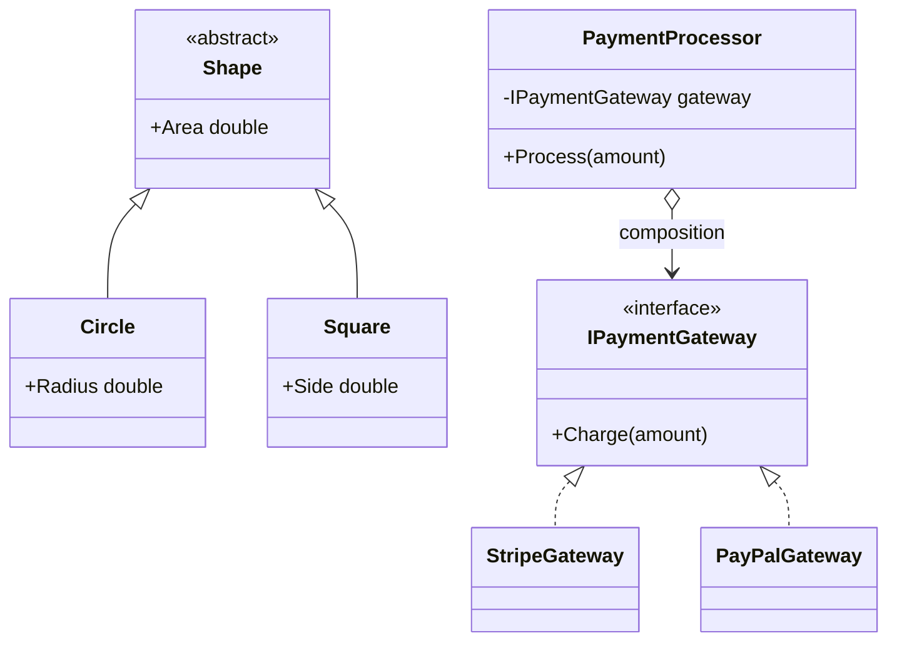

# Module 29 — OOP: Encapsulation, Inheritance, Polymorphism & Composition

> Domain: OOP | Level: Beginner → Expert | Prerequisite: [[../01-CSharp/06-Generics-Variance]] (variance and substitutability), [[../01-CSharp/07-Records-Pattern-Matching-Immutability]] (discriminated-union alternative to inheritance)

---

## 1. Fundamentals

### What are the four pillars of OOP?
**Encapsulation** (bundling data with the behavior that operates on it, hiding internal representation behind a controlled interface), **Inheritance** (a type acquiring/extending another type's members), **Polymorphism** (code operating uniformly over multiple concrete types through a shared interface/base type, with the *actual* behavior determined at runtime by the concrete type — dynamic dispatch), and **Abstraction** (modeling essential characteristics while hiding implementation complexity behind a simpler conceptual interface).

### Why do these exist?
Encapsulation exists to let a type's internal representation change without breaking every caller (an invariant the C# `private`/property system, the `init`-only properties, and the interface-based abstraction all enforce at different levels). Inheritance/polymorphism exist to let code written against an abstraction work correctly with types that don't exist yet at the time that code was written — the actual mechanism behind extensible, "open for extension" designs.

### When does this matter?
Every object-oriented codebase; the depth matters for correctly applying **composition over inheritance** (a widely-cited but often superficially-understood principle) and for recognizing when inheritance is genuinely the right tool versus when it creates fragile, over-coupled hierarchies.

### How does it work (30,000-ft view)?
```csharp
public abstract class Shape { public abstract double Area; }
public class Circle: Shape { public double Radius; public override double Area => Math.PI * Radius * Radius; }
public class Square: Shape { public double Side; public override double Area => Side * Side; }

double TotalArea(IEnumerable<Shape> shapes) => shapes.Sum(s => s.Area); // polymorphic: works for ANY Shape subtype
```

---

## 2. Deep Dive

### 2.1 The Liskov Substitution Principle — Precisely What "Substitutable" Means
A subtype must be substitutable for its base type **without altering the correctness of any code using the base type** — not merely "compiles when substituted," but genuinely preserves the base type's **behavioral contract** (preconditions no stronger, postconditions no weaker, invariants preserved). The canonical violation example (a `Square` inheriting from `Rectangle`, overriding `SetWidth`/`SetHeight` to keep both sides equal) breaks any code that assumes setting `Rectangle.Width` doesn't affect `Height` — the substitution compiles but violates the base type's implicit behavioral contract, producing a genuinely subtle, hard-to-locate bug in any caller relying on that contract.

### 2.2 Composition Over Inheritance — the Actual Reasoning, Not Just the Slogan
Inheritance creates the **tightest possible coupling** between two types — a subclass depends on its base class's *implementation details*, not just its public interface (the "fragile base class problem": a seemingly-safe internal change to a base class can silently break every derived class depending on undocumented, implicit behavior). Composition (a type *holding a reference to* another type and delegating to it, rather than inheriting from it) couples only through the held type's **public interface**, and can be changed/swapped at runtime (a held `IStrategy` reference can be reassigned; a base class cannot be "reassigned" after construction) — this is precisely why "favor composition over inheritance" is standard guidance: it minimizes coupling to exactly the deliberate, public contract, not incidental implementation detail.

### 2.3 Interface-Based Polymorphism vs Inheritance-Based Polymorphism
Inheritance-based polymorphism (a shared base class) forces a single-inheritance hierarchy (in C#) and couples derived types to shared base-class state/implementation, even if unwanted; interface-based polymorphism (the variance discussion) allows a type to implement **multiple** interfaces, coupling only to method signatures, not shared implementation — modern C# design (and this course's recurring/7 discussion of sealed-hierarchy discriminated unions as a records-based alternative) increasingly favors composing small, focused interfaces over deep inheritance hierarchies specifically to avoid the fragile-base-class problem entirely.

### 2.4 When Inheritance Is Genuinely the Right Tool
Despite composition's general preference, inheritance remains the correct choice when there's a genuine **"is-a" relationship with shared, stable behavior** the derived types should not need to reimplement or explicitly delegate to (a template-method-pattern base class providing a fixed algorithm skeleton with specific steps overridden by subclasses) — the deciding factor is whether the relationship is genuinely one of *is-a* substitutability (LSP-compliant) versus merely *has-a*/*can-do* (better modeled via composition/interfaces).

### 2.5 Encapsulation Beyond `private` — Invariant Protection
True encapsulation isn't just hiding fields behind properties — it's ensuring an object **can never be observed in an invalid state** by any external code, at any point in its lifetime. A class with a public setter allowing `order.Quantity = -5` (a value violating the domain's actual invariant) has *technically* encapsulated its field behind a property, but has **not** actually encapsulated its invariant — genuine encapsulation requires validating state transitions (a setter/method rejecting invalid values, or the `init`-only properties combined with constructor validation) so external code can never construct or mutate the object into an invalid state, not merely hiding the storage mechanism.

## 3. Visual Architecture

```mermaid
classDiagram
 class Shape {
 <<abstract>>
 +Area double
 }
 class Circle { +Radius double }
 class Square { +Side double }
 Shape <|-- Circle
 Shape <|-- Square

 class PaymentProcessor {
 -IPaymentGateway gateway
 +Process(amount)
 }
 class IPaymentGateway {
 <<interface>>
 +Charge(amount)
 }
 class StripeGateway
 class PayPalGateway
 PaymentProcessor o--> IPaymentGateway: composition
 IPaymentGateway <|.. StripeGateway
 IPaymentGateway <|.. PayPalGateway
```

## 4. Production Example
**Scenario**: A codebase modeled `PriorityCustomer: Customer` (inheritance), overriding `Customer.ApplyDiscount` to always return a minimum 10% discount regardless of the base class's usual tiered-discount calculation logic — this silently violated LSP: code elsewhere iterating over a mixed `List<Customer>` and calling `ApplyDiscount` expecting the base class's documented "discount never exceeds order total" postcondition broke when a `PriorityCustomer`'s override, combined with an unrelated promotional-discount stacking feature added later, could produce a discount **exceeding** the order total, since the override hadn't been designed with that later feature's interaction in mind. **Investigation**: traced to the `PriorityCustomer` subclass's override changing behavior in a way the base class's calling code implicitly, but not explicitly, assumed would never happen. **Fix**: replaced the inheritance hierarchy with composition — a single `Customer` class holding an `IDiscountStrategy` (with `StandardDiscountStrategy`, `PriorityDiscountStrategy` implementations), and a shared, enforced invariant check (`Math.Min(calculatedDiscount, orderTotal)`) applied uniformly regardless of which strategy computed the raw discount — eliminating the LSP violation structurally, since the invariant is now enforced once, centrally, rather than depending on every subclass's override to independently uphold it correctly. **Lesson**: an inheritance hierarchy where a subclass overrides behavior in a way that isn't provably compatible with the base class's full behavioral contract (including contracts assumed by code that doesn't yet exist, like the later promotional-stacking feature) is a standing LSP-violation risk — composition centralizes invariant enforcement in one place, making it structurally harder to bypass than trusting every subclass override to independently respect it.

## 5. Best Practices
- Favor composition/interfaces over inheritance by default; reserve inheritance for genuine, LSP-compliant is-a relationships with stable shared behavior.
- Enforce class invariants centrally (constructor validation, guarded setters) rather than trusting every caller/subclass to respect them independently.
- Design interfaces small and focused (directly the Interface Segregation discussion) rather than large, multi-purpose base classes forcing unwanted coupling.
- Explicitly document a base class's behavioral contract (not just its method signatures) for any type designed to be inherited from.

## 6. Anti-patterns
- Using inheritance purely for code reuse without a genuine is-a relationship (the classic "inheritance for convenience" mistake).
- Overriding a base class method in a way that violates its implicit behavioral contract, even if it compiles (the incident).
- Deep inheritance hierarchies (more than 2-3 levels) making it hard to reason about a derived type's actual, effective behavior.
- Public setters with no validation, allowing an object to be mutated into an invalid domain state.

---

## 7. Performance Engineering

**Virtual dispatch cost.** A virtual/interface call is not free: the CLR resolves it through a **method table (vtable) lookup** — for a virtual call, an indirect jump through the object's type's method table; for an interface call, an additional indirection through an interface map to locate the concrete slot — versus a non-virtual call, which the JIT can resolve directly to a fixed address at compile time. On modern hardware the per-call cost is small (single-digit nanoseconds), but it matters in two specific ways: (1) it defeats **inlining** — the JIT generally cannot inline a virtual call because it doesn't know the concrete type until runtime, so a hot-path method that would otherwise be inlined into its caller (eliminating call overhead entirely) instead pays a real call plus dispatch on every invocation; (2) it defeats **branch prediction locality** in tight loops iterating over a polymorphic collection (`IEnumerable<Shape>` mixing `Circle`/`Square`), since each element's concrete type — and therefore dispatch target — can differ from the previous one, causing the CPU's indirect-branch predictor to mispredict far more often than a monomorphic call site.

**Devirtualization.** The JIT *can* eliminate virtual-dispatch overhead automatically in specific, provable cases: calling a virtual method on a `sealed class`, on a `struct` (structs can't be subtyped, so any call is provably non-virtual), or when profile-guided/tiered compilation observes a call site is monomorphic in practice (.NET's dynamic PGO). This is a genuine, measurable reason to mark classes `sealed` by default unless inheritance is deliberately intended — not just a style preference, but a concrete devirtualization/inlining opportunity for the JIT that an unsealed class forecloses.

**Boxing.** A `struct` implementing an interface and stored in an interface-typed variable (`IShape shape = someStructShape;`) is **boxed** — heap-allocated and copied — because the interface reference must point to something on the heap with a method table. In a hot loop processing many small `struct`s through interface-typed polymorphism, this silently reintroduces heap allocation and GC pressure that using the concrete struct type directly (monomorphic, no interface) would have avoided entirely; this is precisely why performance-sensitive .NET code (`Span<T>`-heavy paths, hot serialization loops) is often written to avoid interface-typed struct usage, or uses `readonly struct` + generic constraints (`where T: IShape`) so the JIT can specialize the generic and avoid both boxing and virtual dispatch.

**Object header overhead.** Every reference-typed object carries a fixed overhead (a sync block index and a type-handle pointer — 16 bytes on 64-bit) *in addition to* its fields — a design favoring composition of many small objects (one object per responsibility, per SRP) has a real, measurable per-object memory cost at scale (millions of small objects each carrying that fixed 16-byte header) that a single struct or a flatter data layout avoids; this is a genuine trade-off against SRP-driven decomposition in allocation-hot paths, not a reason to abandon SRP, but a reason to consider value types/pooling for the specific hot path where it's measured to matter.

**Where this actually matters:** for the overwhelming majority of business/domain code (order processing, discount calculation, the `Customer`/`IDiscountStrategy` example), virtual dispatch and small allocation counts are immaterial next to I/O, database, and network latency — the cost only becomes worth optimizing for in genuinely hot, tight loops (a market-data tick-processing pipeline handling millions of events/second, a matching engine) where profiling has specifically identified dispatch/boxing/allocation as the bottleneck, never as a default, premature optimization applied to ordinary application code.

## 8. Security

**Encapsulation as a security boundary, not just an organizational one.** A class's `private` state plus validated mutation (§2.5) is the mechanism by which an object *cannot be coerced into an invalid or unsafe state* by a caller, malicious or otherwise — a `BankAccount` with a public `Balance` setter is not just poorly encapsulated, it's an object whose core invariant (balance never goes negative without an authorized overdraft path) is trivially violated by any caller, including a compromised or buggy upstream component. This is the same discipline that later shows up as domain-driven design's "aggregate as consistency/security boundary" — OOP encapsulation is the mechanical foundation that aggregate boundaries are built on.

**Exposing mutable internal collections.** A widespread, subtle violation: `public List<Trade> Trades => _trades;` looks read-only (no setter) but returns a direct, mutable reference to the internal list — any caller can `account.Trades.Clear` or `account.Trades.Add(forgedTrade)`, bypassing every validation the class's own methods would have enforced, because the encapsulation is cosmetic (no public setter) rather than real (no external mutation path at all). The fix is returning `IReadOnlyList<Trade>` backed by a defensive copy, or `AsReadOnly`, so external code genuinely cannot mutate the internal state through the exposed reference — a direct security-relevant instance of the Easy coding exercise's `ReadOnlyList` lesson.

**Polymorphic deserialization as an attack surface.** Deserializers that support polymorphic type resolution (a JSON payload specifying `"$type": "AdminUser"` to select which concrete class to instantiate) are a well-documented, real-world remote-code-execution/privilege-escalation vector (insecure deserialization, OWASP A08) — if the deserializer trusts a type discriminator supplied by an untrusted caller, it can be made to instantiate an attacker-chosen type entirely unrelated to what the API contract intended, including types with dangerous constructors or property setters. Mitigation: an explicit allow-list of exactly which concrete types a given polymorphic deserialization call site may instantiate — never resolving an arbitrary type name against the whole loaded-assembly universe, and never using LSP-style substitutability as an implicit trust boundary (a type being "substitutable" for `Shape` says nothing about whether it's *safe* for a given untrusted caller to have instantiated in this context).

**LSP violations as security regressions.** Intermediate Q9 already names the core risk precisely: a subclass silently weakening or skipping a security check the base class always performs (an `override` that omits an authorization check, or degrades a validation to a no-op) compiles cleanly and passes ordinary functional tests, since nothing about "does this method still return the right type" catches "does this method still enforce the same security invariant." A base class whose contract includes "always calls `AuthorizeAsync` before proceeding" needs that obligation captured in a way an override cannot silently bypass — e.g., a non-overridable template method performing the authorization check, with only the post-authorization business logic left as the overridable extension point (the same template-method structure as Advanced Q2, applied here specifically to make a security check un-skippable rather than merely "expected" of every override).

## 9. Scalability

**Composition as an organizational/team-scaling mechanism, not just a technical one.** A composed dependency (`IPaymentGateway`) creates a genuine team boundary: the team owning `PaymentProcessor` and the team owning `StripeGateway` can develop, test, deploy, and version their code independently, coordinating only through the shared interface's contract — an inheritance-based design (a `PaymentProcessor: StripeGatewayBase`) instead ties the two teams' code into the same compiled hierarchy, where a base-class change by one team can silently break the other's derived behavior (the fragile base class problem, §2.2, now viewed as an *organizational* scaling failure, not merely a technical one). This is precisely why large engineering organizations decomposing a monolith into team-owned microservices lean on interface/composition boundaries internally first — the technical discipline (favor composition, small interfaces) is a direct rehearsal for the service-boundary discipline the later Microservices/DDD modules build on.

**Immutability and safe concurrent sharing.** An immutable object (§2.5's invariant-protecting construction taken to its logical extreme — no mutation path exists at all after construction) can be freely shared, cached, and read concurrently across threads, requests, or even distributed nodes with zero synchronization, since there is no mutable state for concurrent access to race on — this is a direct, load-bearing scalability property (not just a correctness one): a `Money`/`Currency`/discount-strategy-configuration object designed immutably can be cached once and served to every concurrent request without a lock, whereas the equivalent mutable object would require either per-request cloning or synchronization, both of which cost throughput at scale.

**Interface-based polymorphism enables horizontal extension without redeploying the core.** OCP-compliant, interface-driven designs (§2.3, and directly this module's discount-strategy fix) let new behavior (a new `IDiscountStrategy`, a new payment method) be added as a new, independently deployable unit (in a plugin architecture, even a separately-loaded assembly) without modifying or redeploying the core dispatching logic — at scale, this is the difference between a change that requires coordinating a release of the entire monolith versus one that ships as an isolated addition, a direct technical precondition for scaling deployment velocity across a growing number of concurrent feature teams.

**Object pooling for high-allocation-rate polymorphic hierarchies.** In a high-throughput system instantiating many short-lived polymorphic objects (a market-data event hierarchy, one object per tick), even correctly-encapsulated, well-designed objects can become a GC-pressure scalability bottleneck purely from allocation *volume* — pooling (`ObjectPool<T>`, reusing pre-allocated instances rather than allocating and collecting continuously) trades a small amount of design complexity (explicit reset-before-reuse logic, which itself must be encapsulated correctly to avoid leaking prior state into a reused instance) for materially reduced GC pause frequency under sustained high load, a genuine production concern distinct from, and additional to, §7's dispatch/boxing costs.

---

## 10. Interview Questions

### Basic (10)
1. **Q: What are the four pillars of OOP?** **A:** Encapsulation (hiding state behind behavior-exposing interfaces), Inheritance (deriving specialized types from general ones), Polymorphism (one interface, many runtime behaviors via dispatch), and Abstraction (modeling essential characteristics while omitting irrelevant detail).
2. **Q: What is encapsulation?** **A:** Bundling data with the behavior operating on it, hiding internal representation behind a controlled interface.
3. **Q: What is polymorphism?** **A:** Code operating uniformly over multiple concrete types through a shared interface/base type, with actual behavior determined at runtime by the concrete type.
4. **Q: What does "favor composition over inheritance" mean?** **A:** Prefer a type holding and delegating to another type over inheriting from it, to minimize coupling.
5. **Q: What is the Liskov Substitution Principle?** **A:** A subtype must be substitutable for its base type without altering the correctness of any code using the base type.
6. **Q: What is the fragile base class problem?** **A:** A subclass depending on a base class's implementation details, such that a seemingly-safe base class change can silently break derived classes.
7. **Q: Can a C# class inherit from multiple classes?** **A:** No — single inheritance only, though a class can implement multiple interfaces.
8. **Q: What is an "is-a" versus "has-a" relationship?** **A:** "Is-a" suggests inheritance (a Circle is-a Shape); "has-a" suggests composition (a Car has-a Engine).
9. **Q: Does a public property with a getter and setter automatically mean a class is well-encapsulated?** **A:** No — true encapsulation requires the setter to also validate/prevent invalid states, not just hide the backing field.
10. **Q: What is abstraction, distinct from encapsulation?** **A:** Modeling essential characteristics while hiding implementation complexity behind a simpler conceptual interface, distinct from encapsulation's focus on controlling access to internal state.

### Intermediate (10)
1. **Q: Why does the classic Square-extends-Rectangle example violate LSP?** **A:** Because forcing width and height to stay equal (to maintain "squareness") breaks the base class's implicit contract that setting `Width` doesn't affect `Height` — any code relying on that independence breaks when substituted with a `Square`.
2. **Q: Why is the fragile base class problem specifically a coupling concern, not just a bug-risk concern?** **A:** It means a derived class's correctness depends on the base class's *current implementation*, not just its documented public contract — any future base-class change, even one that preserves its public interface, can silently break derived classes relying on undocumented implementation details.
3. **Q: Why does composition allow runtime flexibility inheritance doesn't?** **A:** A composed dependency (e.g., an injected `IDiscountStrategy`) can be swapped/reassigned at runtime; an object's inheritance hierarchy is fixed at compile time and construction, with no equivalent runtime-swappable mechanism.
4. **Q: Why might a large, multi-purpose base class violate the Interface Segregation Principle even if it's technically an interface, not a base class?** **A:** A large interface forces every implementing type to provide (or explicitly stub out) methods it may not actually need, exactly the same unwanted-coupling problem as a fat base class — Interface Segregation (adjacent, a later dedicated SOLID module) addresses this by preferring several small, focused interfaces over one large one.
5. **Q: Why is "code reuse" alone an insufficient justification for choosing inheritance?** **A:** Reuse can be achieved via composition (delegating to a shared, reusable component) without the tight coupling and LSP-substitutability obligations inheritance specifically implies — inheritance should be justified by a genuine is-a relationship, not merely by wanting to avoid duplicating code.
6. **Q: Why does deep inheritance (more than 2-3 levels) make a codebase harder to reason about?** **A:** A derived type's actual, effective behavior is the combination of every ancestor's contributions — the deeper the hierarchy, the more distant, indirect base classes an engineer must trace through to understand what a specific derived instance actually does, compounding the fragile-base-class risk at every additional level.
7. **Q: Why might centralizing invariant enforcement (the fix) be more robust than trusting every subclass to enforce it independently?** **A:** Because it removes the correctness burden from every individual subclass author (who might not anticipate every future interaction, as in the promotional-stacking scenario) and places it in one, single, reviewable location that every code path passes through regardless of which subclass/strategy produced the input.
8. **Q: What's the relationship between LSP violations and unit testing?** **A:** A well-designed test suite exercising the base type's documented contract (not just each subclass's specific behavior) against every subclass polymorphically is a direct, mechanical way to catch LSP violations — if a subclass fails a test written purely against the base type's contract, that's the LSP violation surfacing concretely.
9. **Q: Why does an authorization-related class hierarchy warrant extra scrutiny for LSP compliance?** **A:** A subclass silently weakening a base class's security check (e.g., an override that skips a validation step the base class always performs) compiles and appears functionally correct in isolation, but violates the base class's implicit "always enforces this check" contract — exactly the kind of subtle, hard-to-catch bug that can become a genuine security vulnerability if not caught.
10. **Q: Why would a Staff/Principal-level interview specifically probe "when would you choose inheritance despite generally preferring composition"?** **A:** Because reflexively citing "composition over inheritance" without understanding *when* inheritance is still the correct tool (genuine is-a relationships with stable, shared behavior, like a template-method pattern) suggests a surface-level, slogan-level understanding rather than a genuine grasp of the underlying coupling/substitutability trade-offs.

### Advanced (10)
1. **Q: Diagnose the discount-calculation LSP violation from first principles, and explain precisely why composition's fix structurally prevents recurrence, not just this specific instance.**
 **A:** The root cause was delegating both "compute the raw discount" and "ensure the discount is a valid amount" to the same override, with no structural guarantee the second concern was upheld — the composition-based fix separates these two concerns explicitly: `IDiscountStrategy` implementations are responsible **only** for computing a raw discount value, while the invariant check (`Math.Min(discount, orderTotal)`) lives in exactly one place, applied uniformly to *every* strategy's output regardless of which one produced it — this isn't just fixing the one instance where `PriorityDiscountStrategy` and promotional stacking interacted badly, it structurally prevents *any* current or future strategy from ever bypassing the invariant, since the invariant enforcement is no longer something each strategy implementation must independently remember to include.
2. **Q: Design a template-method-pattern base class where inheritance is genuinely the correct tool, and explain why composition wouldn't serve as well here.**
 **A:**
 ```csharp
public abstract class ReportGenerator
{
    public string Generate // fixed algorithm skeleton -- the "template"
    {
        var data = FetchData;
        var formatted = FormatData(data);
        return WrapWithHeaderFooter(formatted); // shared, stable, non-overridable behavior
    }
    protected abstract IEnumerable<object> FetchData;
    protected abstract string FormatData(IEnumerable<object> data);
    private string WrapWithHeaderFooter(string body) => $"--- REPORT ---\n{body}\n--- END ---";
}
 ```
 Composition would require every concrete report type to separately implement (or remember to call) the shared header/footer-wrapping logic and the fixed fetch-then-format sequencing — the entire point of this pattern is that the **algorithm's structure itself** (fetch, then format, then wrap) is the shared, stable, is-a-"a kind of report generation process" behavior, which inheritance's "share behavior automatically, override only specific steps" mechanism expresses more directly and safely (a subclass literally cannot skip the header/footer wrapping, since it's `private` in the base class) than composition, which would require every composed caller to remember to invoke the shared logic correctly and in the right order.
3. **Q: Explain how you would refactor a deep (4+ level) inheritance hierarchy exhibiting fragile-base-class symptoms, without a risky, all-at-once rewrite.**
 **A:** Identify, level by level starting from the deepest, which derived classes' behavior is genuinely "is-a" (LSP-compliant, benefiting from automatic base-class behavior) versus which have accumulated ad-hoc overrides that actually represent a "has-a"/strategy-like variation (a red flag for a should-be-composed concern trapped inside an inheritance hierarchy); extract the strategy-like variations into composed, injected interfaces one at a time (directly the "expand, don't break" incremental-migration pattern recurring throughout this course), flattening the hierarchy's depth incrementally rather than attempting a single, large, all-at-once redesign that risks introducing new bugs across the entire hierarchy simultaneously.
4. **Q: How would you write an automated test specifically designed to catch LSP violations across an entire inheritance hierarchy, generalizing beyond manually reasoning about each subclass individually?**
 **A:** Write a **shared, parameterized contract test suite** expressed purely in terms of the base type's documented behavior/postconditions (e.g., "discount never exceeds order total," "calling Dispose twice never throws"), then run that **identical** test suite against every concrete subclass in the hierarchy (via a test framework's parameterized/theory-based test mechanism, instantiating each subclass in turn) — any subclass failing a test written purely against the base contract is a mechanically-detected LSP violation, directly generalizing this course's recurring "test the actual contract, not just each specific implementation" theme (REST APIs module's contract testing, the query-count regression testing) to the OOP inheritance-hierarchy context specifically.
5. **Q: Explain a scenario where an interface (not a class hierarchy) can still suffer from an LSP-like violation, despite interfaces having no shared implementation to inherit incorrectly.**
 **A:** If an interface's documentation implies a behavioral contract beyond its method signatures (e.g., `IRepository<T>.GetByIdAsync` is documented/expected to return `null` for a non-existent ID, never throw), an implementation that instead throws an exception for a missing ID **compiles** and satisfies the interface's *signature* but violates its *behavioral* contract — any caller written against the documented contract (expecting `null`, handling it gracefully) breaks when given this particular implementation, demonstrating that LSP-style substitutability concerns apply to interface implementations just as much as class inheritance, even without any shared implementation code to blame.
6. **Q: How would you decide whether a "Manager" role needing most of an "Employee" class's behavior plus a few additional capabilities should be modeled via inheritance (`Manager: Employee`) or composition (`Manager` having an `Employee` plus additional manager-specific data/behavior)?**
 **A:** Ask whether every piece of code that operates on `Employee` should also correctly, safely operate on a `Manager` substituted in its place (the LSP test) — if yes (a `Manager` genuinely "is-a" `Employee` in every behaviorally-relevant sense the codebase cares about), inheritance is appropriate; if a `Manager`'s additional responsibilities create scenarios where treating it uniformly as "just an Employee" would be incorrect or requires special-casing elsewhere in the codebase, that's a signal the relationship is better modeled as `Manager` composing/holding employee-related data alongside its own distinct manager-specific behavior, rather than forcing an is-a relationship that doesn't actually hold cleanly.
7. **Q: Explain why "the derived class only adds new methods, never overrides existing ones" is not, by itself, sufficient to guarantee LSP compliance.**
 **A:** LSP concerns aren't limited to overridden methods — a derived class can also violate the base type's contract through **new invariants it introduces that conflict with existing base-class assumptions** (e.g., a derived class adding a constructor precondition stricter than the base class's, such that code polymorphically constructing/using base-typed objects via a factory now fails for this specific subtype in a way the base contract never anticipated) — LSP is about the full behavioral contract (preconditions, postconditions, invariants) across the type's entire public surface, not merely "did you override an existing method in an incompatible way."
8. **Q: Design a strategy for safely introducing a new interface-based composition point into an existing, working inheritance hierarchy without breaking existing subclasses.**
 **A:** Add the new interface as an **additional**, optional composed dependency on the base class (injected via constructor with a sensible default implementation for backward compatibility), rather than immediately removing the corresponding inherited-and-overridden behavior — existing subclasses continue working unchanged (their overrides still apply, since nothing was removed), while new code can be written against the new, composition-based extension point; gradually migrate existing subclasses' logic into the new composed mechanism one at a time, only removing the old inheritance-based override path once every subclass has been migrated and validated — directly the same additive, non-breaking migration discipline recurring throughout this course.
9. **Q: A team argues "we should never use inheritance at all, only composition, as an absolute rule." Evaluate this as a Principal Engineer.**
 **A:** Push back on the absolutism: composition-over-inheritance is a strong **default preference**, not a rule with zero exceptions — the template-method pattern (Advanced Q2) and other genuine is-a relationships with stable shared algorithmic structure are legitimate, LSP-compliant uses of inheritance that composition would express more awkwardly; recommend the nuanced guidance this module actually teaches ("default to composition; use inheritance deliberately, only for genuine, LSP-verified is-a relationships") rather than either extreme (always inherit, or never inherit) — dogmatic rule-following in either direction misses the actual underlying engineering judgment this principle exists to develop.
10. **Q: As a Principal Engineer conducting an architecture review, how would you evaluate a proposed new class hierarchy for LSP compliance and appropriate inheritance-vs-composition usage before it's built, rather than discovering issues after the fact (as)?**
 **A:** Require the proposal to explicitly state the base type's full behavioral contract (not just method signatures) and walk through, for each proposed subclass, whether it genuinely preserves every part of that contract — specifically probing any override with "what does this override change about the base class's behavior, and can you identify any existing or plausible-future caller that might rely on the behavior being changed?" (directly the question that would have caught the incident before it shipped); for any relationship where the answer reveals genuine behavioral divergence rather than pure specialization, recommend composition/strategy-pattern instead, structurally preventing the LSP violation from ever being built rather than needing to be discovered and refactored later.

### Expert (FinTech Principal Panel)

1. **Q: Design a `Money` value object. What OOP properties must it have, and what bugs does each prevent?**
 **A:** `Money` is the textbook FinTech value object, and each property maps to a bug it prevents: (1) **Immutable** (`readonly`/`init`) — a Money instance can't be mutated after construction, so it's safe to share across threads without locks and can't be changed under an alias (prevents accidental mutation of a shared amount). (2) **Value equality** (`record`/overridden `Equals`+`GetHashCode`) — two Moneys with the same amount+currency are equal, so it works correctly as a dictionary key and in comparisons (prevents reference-equality bugs). (3) **No invalid state** — constructor validates and stores `decimal` amount (never `double`) + a required currency; there is no way to build a Money without a currency, and scale is normalized to the currency (prevents `double` precision loss and currency-less amounts). (4) **Currency-safe arithmetic** — `+`/`-` operators throw (or won't compile, if you go the phantom-typed route) on mismatched currencies; conversion requires an explicit rate (prevents adding USD to EUR). (5) **Explicit rounding** — any division/allocation uses a documented rounding mode, and allocation across parts is remainder-aware (splitting $10 three ways yields 3.34/3.33/3.33, summing back to exactly $10 — no lost cent). (6) **Encapsulated behavior** — the object owns `Add`, `Allocate`, `Percentage`, not scattered helper functions. The Principal framing: `Money` demonstrates why value objects exist — immutability + value equality + no-invalid-state + currency-safe operators + explicit rounding together make an entire class of monetary bugs *unrepresentable*, moving correctness into the type instead of relying on every caller to remember the rules.
 **Why correct:** Enumerates immutability, value equality, invariant-enforcing construction (`decimal`+currency), currency-safe operators, remainder-aware rounding, and encapsulated behavior — each tied to a prevented bug.
 **Common mistakes:** `double` amount; mutable Money; no currency or currency-blind arithmetic; naive division that loses a cent; logic in services instead of the object.
 **Follow-ups:** "How do you split $10 across 3 line items without losing a cent?" / "Why value equality for a dictionary key?" / "Compile-time vs. runtime currency safety — trade-offs?"

2. **Q: A `Payment` entity is a bag of public setters, and a `PaymentService` mutates its `Status` and fields directly ("anemic domain model"). Why is that dangerous for money, and how does a rich domain model fix it?**
 **A:** An anemic model — data with public setters, all behavior in services — scatters the invariants across every service that touches the object, so nothing structurally prevents an illegal transition: a service can set `Status = Captured` on an already-refunded payment, capture more than was authorized, or move to a state that skips authorization, because the object doesn't guard itself. For money that's how you get double-captures and impossible states in production. A **rich domain model** puts the invariants *inside the aggregate*: `Payment` exposes intent-revealing methods (`Authorize`, `Capture(Money amount)`, `Refund(Money amount)`) that enforce the rules — capture only from an `Authorized` state, capture ≤ authorized amount, no refund beyond captured — and keeps its fields private with no public setters, so the *only* way to change a payment is through a method that upholds the invariants. Illegal transitions become impossible to express, not merely discouraged. This is encapsulation doing its actual job (protecting invariants), and it centralizes the state machine in one tested place instead of duplicated across services. The Principal framing: anemic models leave money invariants to the discipline of every caller; a rich aggregate makes the object responsible for its own consistency (private state + guarded methods + an explicit state machine), which is the only design where "you can't double-capture" is a property of the type rather than a hope about the callers.
 **Why correct:** Contrasts scattered/unguarded invariants with an aggregate that owns its state machine via private state + guarded intent methods, making illegal transitions unrepresentable.
 **Common mistakes:** Public setters + service-driven mutation; duplicated/absent transition checks; treating the entity as a DTO.
 **Follow-ups:** "How does `Capture` prevent capturing more than authorized?" / "Where does the state machine live in a rich model?" / "How does this connect to DDD aggregates?"

3. **Q: You model payment methods / financial instruments as a class hierarchy (`Card`, `BankTransfer`, `Wallet`: `PaymentMethod`; or `FixedRateLoan`, `ZeroInterestLoan`: `Loan`). Give a concrete LSP trap in a financial hierarchy and how you'd avoid it.**
 **A:** The classic trap: a base contract that a subtype can't honor. E.g., `Loan.CalculateInterest` documented to "return a positive accrued interest," then `ZeroInterestLoan` returns 0 — if callers assume `> 0`, they break (an interest-allocation loop divides by it, or a report filters it out incorrectly). Or `PaymentMethod.Refund(amount)` assumed always supported, but `BankTransfer`/certain rails can't refund programmatically, so the subtype throws `NotSupportedException` — a caller iterating payment methods to refund now fails for one type (a Rectangle/Square-shaped LSP violation). Avoid it by: (1) making the **base contract only promise what every subtype can truly deliver** (don't put `Refund` on the base if not all methods refund — split into a capability interface `IRefundable` and check for it, so non-refundable methods simply don't implement it — ISP + composition); (2) modeling variation via **strategy/composition** where behavior genuinely differs (an `IInterestPolicy` the loan holds, so zero-interest is just a policy, not a subtype that breaks the base's postcondition); (3) writing a **contract test** run against every subtype (Advanced Q4) asserting the base's documented behavior. The Principal framing: financial hierarchies tempt you to put universal-looking operations (`Refund`, `CalculateInterest`) on a base that not every instrument honors — the LSP-safe design promises only the common contract on the base, expresses genuine capability differences via capability interfaces/strategy, and verifies substitutability with a shared contract test, so no subtype silently violates what callers rely on.
 **Why correct:** Gives a concrete financial LSP violation (unsupported `Refund`/zero-interest postcondition break) and fixes it via capability interfaces (ISP) + strategy + contract tests rather than an over-promising base.
 **Common mistakes:** `Refund`/`CalculateInterest` on a base not all subtypes honor; `NotSupportedException` overrides; encoding behavioral variation as subtypes that break base postconditions.
 **Follow-ups:** "How does splitting out `IRefundable` fix the substitutability problem?" / "Why is zero-interest better as a policy than a subtype?" / "How would a contract test catch this before production?"

4. **Q: A trading desk's `OrderBook` class exposes `public List<Order> Orders` for "convenience" so downstream reporting code can iterate it directly. Six months later, a reconciliation bug traces back to a reporting job calling `Orders.RemoveAll(o => o.IsStale)` to "clean up its own view." Diagnose the encapsulation failure and fix it structurally, not by convention.**
 **A:** The failure is that `OrderBook`'s encapsulation was cosmetic: no public setter exists, but the getter returns a direct, mutable reference to the live internal list, so any caller — including one that only intended to affect its own local view — can mutate the order book's actual, shared state. "Don't mutate what you're given" is a convention, not an enforced invariant, and conventions get violated the moment a caller under deadline pressure reaches for the obvious-looking `RemoveAll`. The structural fix: return `IReadOnlyList<Order>` backed by either a defensive copy or a true read-only wrapper (`AsReadOnly`), so the compile-time type itself makes mutation impossible for any external caller — no code review discipline or naming convention required, because the invalid operation simply doesn't compile. If callers genuinely need to filter/derive a view, they call `.Where(...)` (an allocation of a new sequence, never touching the source) rather than being handed a mutation-capable handle to the source of truth. The Principal framing: this is the exact same lesson as §8's "exposing mutable internal collections," now shown as the actual root cause of a reconciliation incident rather than a hypothetical — cosmetic encapsulation (no setter) is not real encapsulation (no external mutation path at all), and the gap between the two is exactly where this kind of bug lives.
 **Why correct:** Identifies that a getter-only property returning a mutable reference is not real encapsulation, and fixes it by making mutation impossible at the type level (`IReadOnlyList<T>`/defensive copy) rather than relying on caller discipline.
 **Common mistakes:** Treating "no public setter" as sufficient encapsulation; fixing this via a code-review rule or documentation comment instead of a type-level guarantee; not distinguishing "read a copy" from "read a live, mutable reference."
 **Follow-ups:** "What's the cost of a defensive copy on every access versus a cached read-only wrapper?" / "How would you catch this class of bug in code review before it ships?" / "Does `IReadOnlyList<T>` actually guarantee immutability, or just that this particular reference can't mutate it?"

5. **Q: Your firm's risk-calculation engine polymorphically dispatches over `IRiskModel` implementations (`VaRModel`, `StressTestModel`, `MonteCarloModel`) via a shared `IEnumerable<IRiskModel>` resolved through DI. A new `MonteCarloModel` implementation is added, and overnight batch risk numbers silently change by a material amount with no code review flagging why. Walk through how you'd diagnose this as an OOP/polymorphism issue specifically, not a numerical one.**
 **A:** Before treating this as a numerical/algorithmic bug, verify the polymorphic dispatch itself: confirm exactly which concrete `IRiskModel` instances are actually being resolved and invoked at runtime, in what order, and whether the new registration silently changed the *set* or *order* of models being aggregated (a common, easy-to-miss cause: DI's multiple-registration resolution order is not guaranteed stable across container versions/registration order, and if the aggregation logic implicitly depended on order — e.g., "the last model's output wins" or a mistaken `First()` instead of intended aggregation over `All()` — adding a new registration changes behavior without any individual model's code being wrong). Separately, verify the new `MonteCarloModel` genuinely satisfies the same behavioral contract every other `IRiskModel` implementation is assumed to uphold (does `CalculateRisk` return a value in the same units, on the same scale, under the same "never negative" postcondition as the others?) — an LSP violation at the interface level (Advanced Q5) is just as real a suspect as an inheritance-hierarchy one. Only once polymorphic dispatch and interface-contract compliance are both confirmed correct does the investigation narrow to the new model's actual numerical logic. The Principal framing: in a system built on polymorphism, "a new implementation was added and behavior changed" has *two* distinct failure classes — the new implementation's own logic is wrong, or the *dispatch/aggregation mechanism* silently changed because it depended on an assumption (registration order, count) the interface contract never actually promised — and conflating the two wastes investigation time chasing numerical bugs that are actually dispatch bugs.
 **Why correct:** Separates polymorphic-dispatch/ordering failure from interface-contract (LSP) failure from genuine numerical-logic failure as three distinct, independently-checkable causes, rather than assuming the newest code is automatically the culprit.
 **Common mistakes:** Assuming the newest change is automatically where the bug lives; not checking whether aggregation logic implicitly depends on DI registration order/count; treating "it compiles against the interface" as proof the contract is honored.
 **Follow-ups:** "How would you make the aggregation logic's order-independence an explicit, tested property rather than an assumption?" / "How would a contract test (Hard exercise) have caught the new model's LSP violation, if that's what it turns out to be?" / "Should risk-model registration order ever be allowed to matter?"

6. **Q: Contrast `sealed class` and interface-based design as two different ways of "closing" a type against unwanted extension, and explain when a FinTech codebase should reach for each.**
 **A:** `sealed` closes a *concrete class* against further inheritance — no one can subclass `sealed class LedgerEntry`, guaranteeing every `LedgerEntry` instance behaves exactly as that one class defines, with no possibility of a future override silently changing its behavior (directly the incident's prevention: had `Customer`/`PriorityCustomer` been designed as a `sealed Customer` with a composed `IDiscountStrategy` from the start, the override-based violation couldn't have been expressed at all). An interface, by contrast, deliberately stays *open* to multiple implementations — that openness is the entire point of DIP/OCP-driven design. The two aren't in tension; they compose: a well-designed system exposes small, focused **interfaces** as its extension points (where genuine multi-implementation variability is wanted and safe, because each implementation is independently substitutable and testable against a documented contract) while marking **concrete classes** `sealed` by default (where a class is a specific, finished implementation, not itself meant to be further specialized via inheritance) — this also nets the §7 devirtualization benefit for free. The FinTech-specific reasoning: in a codebase where an unreviewed subclass silently overriding money-movement or risk logic is a genuine incident risk (the entire module's throughline), defaulting concrete classes to `sealed` converts "can this be subclassed to bypass an invariant" from a code-review question asked on every PR into a compile-time impossibility — the same "make the violation unrepresentable" discipline recurring throughout this course, applied here to inheritance-openness itself.
 **Why correct:** Correctly distinguishes what each mechanism closes (concrete implementation vs. extension point), shows they compose rather than conflict, and ties `sealed`-by-default to both the incident's prevention and a concrete performance benefit.
 **Common mistakes:** Treating `sealed` as generally discouraged/unidiomatic rather than a deliberate default; conflating "closed for modification" (OCP) with "sealed against inheritance" (a compile-time mechanism enforcing a stronger, different guarantee); not connecting sealing to devirtualization.
 **Follow-ups:** "Why default to `sealed` rather than reviewing case-by-case?" / "How does this interact with unit testing via mocking, if a class needs to be substitutable for tests but not for production subclassing?" / "What's the equivalent discipline in a language without `sealed`?"

7. **Q: A settlement-instruction hierarchy (`DomesticSettlement`, `CrossBorderSettlement`, `CryptoSettlement`: `SettlementInstruction`) has grown organically over three years, with `CrossBorderSettlement` now overriding six of the base class's eight virtual methods. A new engineer proposes this is "clearly fine, it compiles and all tests pass." Evaluate as a Principal Engineer conducting an architecture review.**
 **A:** "Compiles and passes tests" is necessary but nowhere near sufficient evidence of a sound design — six of eight overridden methods is a strong, concrete signal (directly Advanced Q3's diagnostic) that `CrossBorderSettlement` shares almost none of the base class's actual behavior, meaning the inheritance relationship is providing little genuine reuse while still imposing the full fragile-base-class coupling cost (§2.2) on every one of those eight methods, including the two it didn't override — a future base-class change to any of those two "shared" methods still risks silently affecting `CrossBorderSettlement` in ways no one is specifically testing for, precisely because the team's mental model has already implicitly written it off as "basically its own thing." The review should ask, for each overridden method, Advanced Q10's question: does this override represent genuine specialization of shared behavior, or does it reveal that cross-border settlement's actual semantics were never well-modeled by the base contract to begin with? Given six-of-eight, the far more likely answer is the latter — recommend extracting `CrossBorderSettlement`'s distinct behavior into its own composed, independently-testable path (an `ISettlementRoute` strategy per instruction type, Advanced Q3's incremental extraction pattern) rather than continuing to force it into an inheritance relationship that's already, empirically, mostly not being reused. The Principal framing: override-count-versus-total-method-count is a cheap, mechanically-trackable proxy for "is this still a genuine is-a relationship," and a review process waiting for a production incident to notice a hierarchy has quietly become mostly-overridden is reactive where this metric could be proactive (directly generalizing Advanced Q7's dispatch-growth signal to inheritance-hierarchy health specifically).
 **Why correct:** Uses override-ratio as a concrete, proactive health signal for a decaying is-a relationship, ties the risk to the *still-shared* methods (not just the overridden ones), and recommends the same incremental extraction discipline as Advanced Q3.
 **Common mistakes:** Accepting "tests pass" as sufficient validation of a design decision; not recognizing that fragile-base-class risk applies to the *non*-overridden methods just as much as the overridden ones; proposing an immediate full rewrite instead of incremental extraction.
 **Follow-ups:** "What override-ratio threshold would you set as a review-flagging heuristic, and why not a hard gate?" / "How do you avoid this decay happening again after the refactor?" / "What would you tell the engineer who says 'it works, why touch it'?"

8. **Q: Explain why `record` types and `with`-expression-based "non-destructive mutation" in modern C# are a deliberate, structural answer to the encapsulation-invariant problem (§2.5), rather than just syntactic sugar.**
 **A:** A traditional mutable class with a public setter, even a validated one, still requires every call site to *remember* to call the validating setter rather than reaching directly for a field — the invariant's enforcement depends on discipline at every mutation site. A `record` with `init`-only properties removes the mutation path entirely after construction — validation happens exactly once, in the constructor (or an `init` accessor's own validation logic), and after that point the instance is provably, structurally incapable of being mutated into an invalid state by anything, anywhere, because there is no mutation capability left to misuse. Apparent "mutation" via `with { Amount = newAmount }` doesn't mutate the existing instance at all — it constructs an entirely new instance, running through the exact same validating construction path as any other construction, meaning the invariant is enforced identically for "changes" as it is for original creation, with no separate, potentially-forgotten validation path for updates the way a mutable setter design requires. This is genuine language-level support for §2.5's "an object can never be observed in an invalid state" — not merely more concise syntax for the same guarantee a hand-written immutable class could already provide, but a design that makes the *discipline-free-by-default* version the path of least resistance, which is precisely why it matters at Principal scale: a guarantee that requires every engineer to remember to uphold it decays over time and team growth; a guarantee the type system enforces does not.
 **Why correct:** Connects `record`/`init`/`with` directly to §2.5's invariant-protection discussion, explaining specifically why immutable-by-default construction is structurally stronger than a mutable class with disciplined, validated setters, not merely shorter to write.
 **Common mistakes:** Describing records as "just less boilerplate" without connecting to the invariant-enforcement guarantee; not explaining that `with` still runs through validated construction; assuming `init`-only alone (without constructor/init-accessor validation) is sufficient for invariant safety.
 **Follow-ups:** "Where would `init`-only alone still be insufficient to prevent an invalid state?" / "What's the performance cost of `with`-based updates on a large object versus true mutation?" / "How does this interact with the `Money` value object from earlier Expert Q1?"

9. **Q: A codebase's `abstract class Instrument` has grown a dozen subclasses (`Bond`, `Equity`, `Option`, `Future`, ...), each implementing a large, shared `abstract` surface — `CalculatePrice`, `CalculateRisk`, `CalculateAccruedInterest`, `GetSettlementDate`, several more — and half the subclasses throw `NotSupportedException` for methods that don't semantically apply to them (`Equity.CalculateAccruedInterest` throws, since equities don't accrue interest). Diagnose and redesign.**
 **A:** This is the ISP violation (a large interface/abstract surface forcing every implementer to provide, or explicitly stub, methods it doesn't need) manifesting as *also* an LSP violation the moment it's expressed as an inheritance hierarchy: every caller polymorphically iterating `IEnumerable<Instrument>` and calling `CalculateAccruedInterest` now has to know, and specifically handle, that some concrete types will throw rather than return a meaningful value — the base class's implicit contract ("returns accrued interest") is violated by exactly the subtypes for which the concept doesn't apply, precisely the `Loan`/`ZeroInterestLoan` trap from the SOLID module's Expert Q3, now shown at the OOP-hierarchy-design level rather than the SOLID-principle-naming level. The fix: split the fat base class into **capability interfaces** matching genuine, universal-across-all-instruments behavior (`IPriceable.CalculatePrice`, `IHasSettlementDate.GetSettlementDate` — things every instrument genuinely has) versus **opt-in capability interfaces** for behavior only some instrument types genuinely possess (`IAccruesInterest.CalculateAccruedInterest`, implemented only by `Bond` and similar interest-bearing instruments) — callers that need accrued-interest specifically pattern-match or filter for `IAccruesInterest` (`instruments.OfType<IAccruesInterest>`) rather than calling a universally-present method that secretly isn't universal, converting a runtime `NotSupportedException` surprise into a compile-time-visible, type-system-enforced fact about which instruments support which operations. The Principal framing: a `NotSupportedException` override anywhere in a hierarchy is a direct, mechanical signal — not a matter of taste — that the base contract over-promises, and the fix is always the same shape (split by genuine capability, let callers query for capability) regardless of whether the domain is loans, instruments, or payment methods; the pattern recurs because the underlying design mistake (one contract assumed universal, actually only partially universal) recurs.
 **Why correct:** Correctly identifies the fat-interface-plus-`NotSupportedException` pattern as simultaneously an ISP and LSP violation, and fixes it via capability-interface segregation with runtime capability querying, generalizing the exact pattern named in the sibling SOLID module.
 **Common mistakes:** Treating this as "just" an ISP problem without recognizing the LSP consequence for polymorphic callers; fixing it by adding more `virtual`/default-implementation methods that just quietly return `null`/`0` instead of genuinely segregating; not providing callers a compile-time-visible way to query for capability.
 **Follow-ups:** "How does `OfType<T>` at a call site compare to a `TryGet`-style capability check?" / "Why is a silently-returning `0` almost worse than throwing `NotSupportedException`?" / "How would you migrate a dozen existing subclasses to this design without a big-bang rewrite?"

10. **Q: As a Principal Engineer setting engineering standards across multiple teams, would you mandate "no inheritance, composition only" as a firm-wide linting rule for a large FinTech codebase? Justify your answer with the trade-offs a purely mechanical rule misses.**
 **A:** No — and the reasoning has to go beyond "it's a slogan" (Advanced Q9) into concrete, checkable engineering criteria, because a firm-wide mandate needs to be defensible to teams who will ask "why." A blanket "no inheritance" rule would force the template-method pattern (Advanced Q2, and this module's own Expert-adjacent report-generator example) into an awkward composition-based approximation that's *harder* to get right (every caller must remember to invoke shared steps in the correct order, rather than the compiler enforcing it structurally) — trading a small, genuine LSP-violation risk for a larger, guaranteed-every-time correctness burden on every caller. Instead, mandate the actually load-bearing criteria this module has built throughout: (1) any inheritance relationship must pass an explicit LSP check during design review (Advanced Q10) — document the base contract, verify every subclass upholds it; (2) `sealed` by default on concrete classes not specifically designed as extension points (Expert Q6); (3) an override-ratio or dispatch-growth heuristic (Expert Q7, Advanced Q7) flags hierarchies drifting away from genuine shared behavior, triggering a review rather than an automatic rewrite; (4) composition remains the *default* choice absent a specific, articulable reason inheritance is a better structural fit. This is more work to specify and enforce than a single linting rule, but a single linting rule optimizes for the wrong thing — it can be satisfied by objectively worse code (an awkward composition-based template-method workaround) while providing zero protection against composition's own failure modes (Advanced Q4's over-abstraction, a `PaymentProcessor` composing twelve single-method strategy interfaces where three well-designed virtual methods would have been clearer). The Principal framing: firm-wide engineering standards should encode the *underlying judgment* (verify substitutability, minimize unnecessary coupling, default toward the lower-coupling option) in checkable, review-time criteria, not a single mechanical proxy rule that predictably gets gamed or produces worse code in the specific cases it doesn't fit — the same distinction Advanced Q9 draws for a static "SOLID compliance score," now applied to inheritance-versus-composition specifically.
 **Why correct:** Rejects a purely mechanical firm-wide rule in favor of specific, checkable design-review criteria (LSP verification, sealed-by-default, override-ratio heuristics), and explicitly identifies composition's own failure mode (over-abstraction) as a reason a one-directional mandate is itself unbalanced.
 **Common mistakes:** Either mandating "no inheritance, ever" or dismissing the question as "it depends" without specifying concrete, enforceable criteria; not acknowledging composition has its own over-abstraction failure mode; treating firm-wide standards and case-by-case judgment as mutually exclusive rather than the standard encoding *how* to exercise judgment.
 **Follow-ups:** "How would you roll this out across teams who've already built large inheritance hierarchies?" / "What's the cost of getting this standard wrong in either direction, at firm scale?" / "How do you measure whether the standard is actually improving outcomes, a year later?"

---

## 11. Coding Exercises

### Easy — Fix an LSP violation by removing an incompatible override
```csharp
// BEFORE: violates LSP -- ReadOnlyList's Add silently does nothing, breaking callers
// that assume Add actually adds an item (the base List<T> contract).
public class ReadOnlyList<T>: List<T>
{
    public new void Add(T item) { /* no-op, silently ignores */ }
}

// AFTER: don't inherit from List<T> at all -- compose it, expose only read operations
// making the type's actual (narrower) contract honest and impossible to misuse.
public class ReadOnlyList<T>: IReadOnlyList<T>
{
    private readonly List<T> _items;
    public ReadOnlyList(IEnumerable<T> items) => _items = items.ToList;
    public T this[int index] => _items[index];
    public int Count => _items.Count;
    public IEnumerator<T> GetEnumerator => _items.GetEnumerator;
    IEnumerator IEnumerable.GetEnumerator => GetEnumerator;
}
```

### Medium — Replace an inheritance-based discount hierarchy with composition (the fix)
```csharp
public interface IDiscountStrategy { decimal ComputeDiscount(Order order); }
public class StandardDiscountStrategy: IDiscountStrategy
{
    public decimal ComputeDiscount(Order order) => order.Total * 0.05m;
}
public class PriorityDiscountStrategy: IDiscountStrategy
{
    public decimal ComputeDiscount(Order order) => Math.Max(order.Total * 0.10m, 5.00m);
}

public class Customer
{
    private readonly IDiscountStrategy _discountStrategy;
    public Customer(IDiscountStrategy discountStrategy) => _discountStrategy = discountStrategy;

    public decimal ApplyDiscount(Order order)
    {
        var raw = _discountStrategy.ComputeDiscount(order);
        return Math.Min(raw, order.Total); // invariant enforced ONCE, centrally, regardless of strategy
    }
}
```

### Hard — Parameterized LSP contract test across a hierarchy (Advanced Q4)
```csharp
public abstract class ShapeContractTests<TShape> where TShape: Shape
{
    protected abstract TShape CreateShapeWithArea(double expectedArea);

    [Fact]
    public void Area_Should_Never_Be_Negative
    {
        var shape = CreateShapeWithArea(10.0);
        Assert.True(shape.Area >= 0, "Area contract violated: Area returned a negative value.");
    }
}

public class CircleContractTests: ShapeContractTests<Circle>
{
    protected override Circle CreateShapeWithArea(double expectedArea) => new Circle { Radius = Math.Sqrt(expectedArea / Math.PI) };
}
public class SquareContractTests: ShapeContractTests<Square>
{
    protected override Square CreateShapeWithArea(double expectedArea) => new Square { Side = Math.Sqrt(expectedArea) };
}
// Both CircleContractTests and SquareContractTests automatically inherit and run the SAME
// base-contract test -- any future Shape subclass violating the "Area is never negative"
// contract is caught by simply adding one more contract-test subclass, not hand-writing a new test.
```

### Expert — Template-method pattern with a composed, swappable step (hybrid design)
```csharp
public abstract class ReportGenerator
{
    private readonly IReportFormatter _formatter; // composition for the genuinely variable part
    protected ReportGenerator(IReportFormatter formatter) => _formatter = formatter;

    public string Generate // fixed algorithm skeleton -- inheritance's strength
    {
        var data = FetchData; // subclass-specific, is-a-variation (inheritance appropriate)
        return _formatter.Format(data); // swappable at runtime (composition appropriate)
    }
    protected abstract IEnumerable<object> FetchData;
}
```
**Discussion**: This deliberately combines both tools where each is actually the better fit — `FetchData` varies by genuine report-type specialization (an is-a relationship, appropriately expressed via inheritance's override mechanism), while the formatting strategy is swappable independent of report type (appropriately expressed via composition) — a concrete demonstration that "composition over inheritance" and "inheritance is sometimes right" aren't in tension when applied to the specific part of a design each is actually suited for, directly synthesizing Advanced Q2 and Advanced Q9's nuanced guidance into one cohesive example.

---

## 12–17. System Design / LLD / Debugging / Decision / Case Study / Principal

An e-commerce platform replaces its discount-calculation inheritance hierarchy with a composed `IDiscountStrategy` design, centralizing invariant enforcement in one location rather than trusting every subclass override to independently uphold it, and adopts a parameterized contract-test pattern (Hard exercise) across its remaining, genuinely-appropriate inheritance hierarchies (shape/geometry types) to mechanically catch LSP violations before they ship. The signature production incident — a `PriorityCustomer` subclass's override silently violating the base class's "discount never exceeds order total" contract once combined with a later, unrelated feature — is this module's central lesson: LSP violations are dangerous specifically because they compile cleanly and often work correctly in isolation, only manifesting once a change elsewhere in the codebase interacts with the violated contract in an unanticipated way. Principal-level guidance: require every inheritance-hierarchy proposal to explicitly document the base type's full behavioral contract and walk through each subclass's compliance during design review, catching this class of issue before it's built rather than after it ships.

## 18. Revision
**Key takeaways**: LSP requires genuine behavioral-contract preservation (preconditions, postconditions, invariants), not just compile-time substitutability. The fragile base class problem is fundamentally a coupling-to-implementation-detail issue, distinct from ordinary API coupling. Composition minimizes coupling to a held type's public interface and allows runtime swappability; inheritance is appropriate specifically for genuine, stable is-a relationships (template-method patterns) where sharing algorithm structure automatically is the actual goal. Centralize invariant enforcement in one location rather than trusting every subclass/strategy implementation to independently uphold it — this structurally prevents an entire class of LSP-violation bugs, not just one instance.

---

**Next**: Continuing autonomously to Module 30 — SOLID Principles Deep Dive (completing the OOP-adjacent foundation before Design Patterns).
