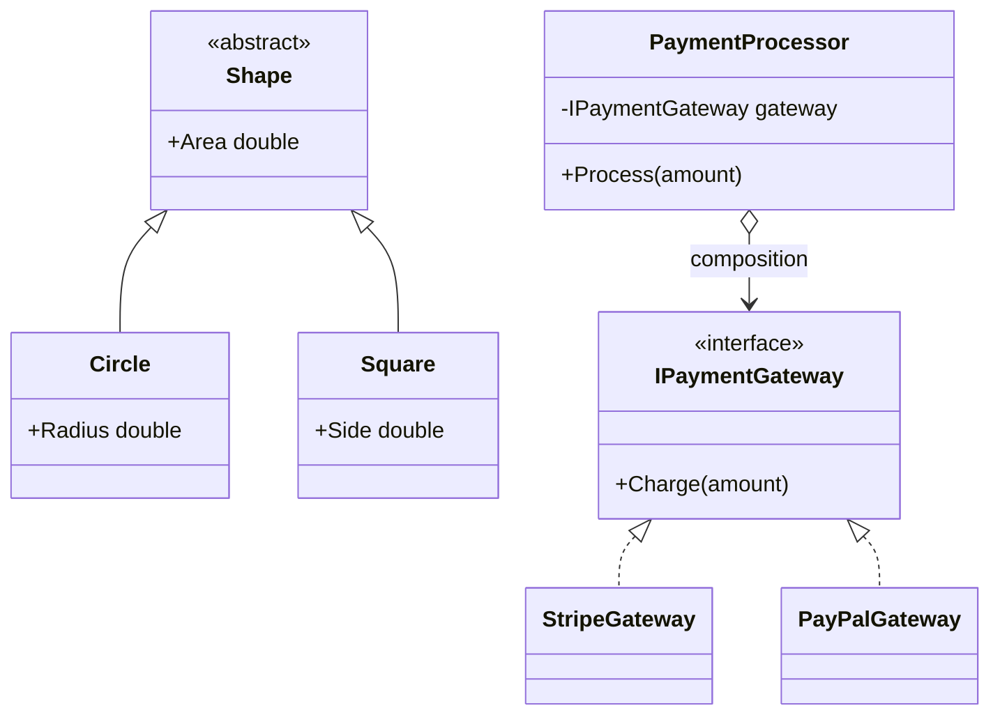
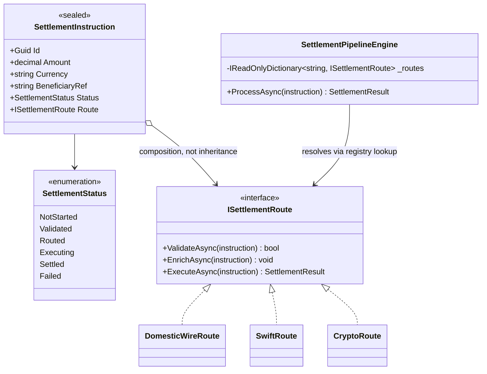
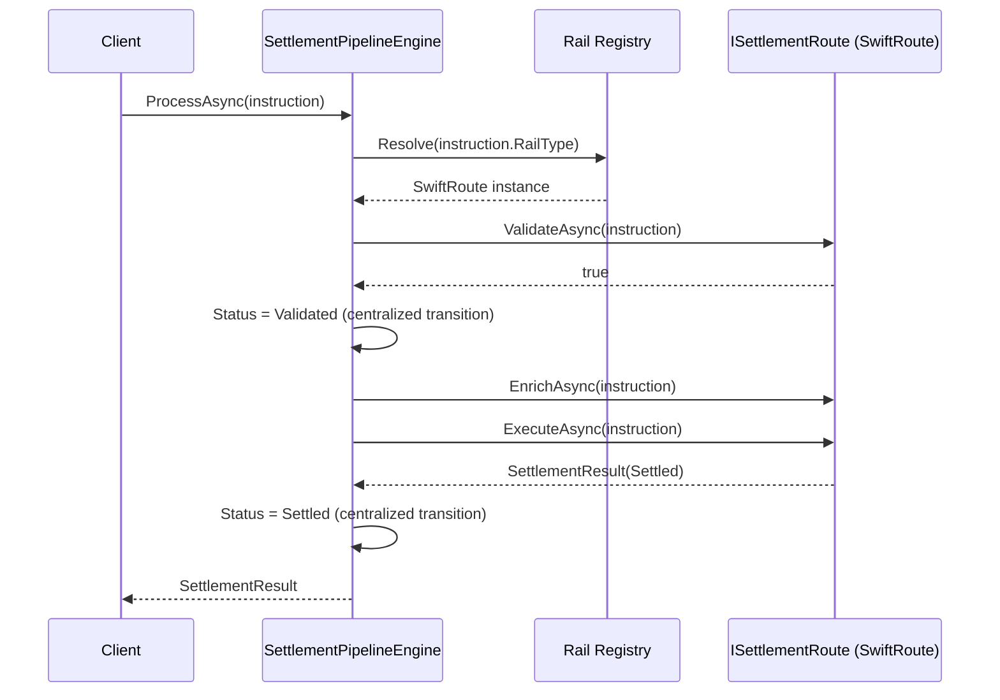

# Module 29 — OOP: Encapsulation, Inheritance, Polymorphism & Composition

> Domain: OOP | Level: Beginner → Expert | Prerequisite: [[../01-CSharp/06-Generics-Variance]] (variance and substitutability), [[../01-CSharp/07-Records-Pattern-Matching-Immutability]] (discriminated-union alternative to inheritance)

---

## 1. Fundamentals

### What are the four pillars of OOP?
**Encapsulation** (bundling data with the behavior that operates on it, hiding internal representation behind a controlled interface), **Inheritance** (a type acquiring/extending another type's members), **Polymorphism** (code operating uniformly over multiple concrete types through a shared interface/base type, with the *actual* behavior determined at runtime by the concrete type — dynamic dispatch), and **Abstraction** (modeling essential characteristics while hiding implementation complexity behind a simpler conceptual interface).

### Why do these exist?
Encapsulation exists to let a type's internal representation change without breaking every caller (an invariant the C# `private`/property system, the `init`-only properties, and the interface-based abstraction all enforce at different levels). Inheritance/polymorphism exist to let code written against an abstraction work correctly with types that don't exist yet at the time that code was written — the actual mechanism behind extensible, "open for extension" designs.

### When does this matter?
Every object-oriented codebase; the depth matters for correctly applying **composition over inheritance** (a widely-cited but often superficially-understood principle) and for recognizing when inheritance is genuinely the right tool versus when it creates fragile, over-coupled hierarchies.

### How does it work (30,000-ft view)?
```csharp
// C#
public abstract class Shape { public abstract double Area { get; } }
public sealed class Circle(double radius) : Shape { public override double Area => Math.PI * radius * radius; }
public sealed class Square(double side)   : Shape { public override double Area => side * side; }

double TotalArea(IEnumerable<Shape> shapes) => shapes.Sum(s => s.Area); // polymorphic: works for ANY Shape subtype
```
```java
// Java — same design, different mechanics (no properties; final for "sealed"; Streams for LINQ)
public abstract class Shape { public abstract double area(); }
public final class Circle extends Shape {
    private final double radius;
    public Circle(double radius) { this.radius = radius; }
    @Override public double area() { return Math.PI * radius * radius; }
}
public final class Square extends Shape {
    private final double side;
    public Square(double side) { this.side = side; }
    @Override public double area() { return side * side; }
}

double totalArea(List<Shape> shapes) {
    return shapes.stream().mapToDouble(Shape::area).sum(); // polymorphic over ANY Shape subtype
}
```

---

## 2. Deep Dive

### 2.1 The Liskov Substitution Principle — Precisely What "Substitutable" Means
A subtype must be substitutable for its base type **without altering the correctness of any code using the base type** — not merely "compiles when substituted," but genuinely preserves the base type's **behavioral contract** (preconditions no stronger, postconditions no weaker, invariants preserved). The canonical violation example (a `Square` inheriting from `Rectangle`, overriding `SetWidth`/`SetHeight` to keep both sides equal) breaks any code that assumes setting `Rectangle.Width` doesn't affect `Height` — the substitution compiles but violates the base type's implicit behavioral contract, producing a genuinely subtle, hard-to-locate bug in any caller relying on that contract.

### 2.2 Composition Over Inheritance — the Actual Reasoning, Not Just the Slogan
Inheritance creates the **tightest possible coupling** between two types — a subclass depends on its base class's *implementation details*, not just its public interface (the "fragile base class problem": a seemingly-safe internal change to a base class can silently break every derived class depending on undocumented, implicit behavior). Composition (a type *holding a reference to* another type and delegating to it, rather than inheriting from it) couples only through the held type's **public interface**, and can be changed/swapped at runtime (a held `IStrategy` reference can be reassigned; a base class cannot be "reassigned" after construction) — this is precisely why "favor composition over inheritance" is standard guidance: it minimizes coupling to exactly the deliberate, public contract, not incidental implementation detail.

### 2.3 Interface-Based Polymorphism vs Inheritance-Based Polymorphism
Inheritance-based polymorphism (a shared base class) forces a single-inheritance hierarchy (in C# and Java) and couples derived types to shared base-class state/implementation, even when that coupling is unwanted; interface-based polymorphism allows a type to implement **multiple** interfaces, coupling only to method signatures, not shared implementation — modern C# and Java design (and this course's recurring treatment of sealed-hierarchy discriminated unions — `sealed record` + exhaustive `switch` in C#, `sealed interface ... permits` + `switch` pattern matching in Java 21 — as a records-based alternative to deep inheritance) increasingly favors composing small, focused interfaces over deep inheritance hierarchies specifically to avoid the fragile-base-class problem entirely.

### 2.4 When Inheritance Is Genuinely the Right Tool
Despite composition's general preference, inheritance remains the correct choice when there's a genuine **"is-a" relationship with shared, stable behavior** the derived types should not need to reimplement or explicitly delegate to (a template-method-pattern base class providing a fixed algorithm skeleton with specific steps overridden by subclasses) — the deciding factor is whether the relationship is genuinely one of *is-a* substitutability (LSP-compliant) versus merely *has-a*/*can-do* (better modeled via composition/interfaces).

### 2.5 Encapsulation Beyond `private` — Invariant Protection
True encapsulation isn't just hiding fields behind properties — it's ensuring an object **can never be observed in an invalid state** by any external code, at any point in its lifetime. A class with a public setter allowing `order.Quantity = -5` (a value violating the domain's actual invariant) has *technically* encapsulated its field behind a property, but has **not** actually encapsulated its invariant — genuine encapsulation requires validating state transitions (a setter/method rejecting invalid values, or the `init`-only properties combined with constructor validation) so external code can never construct or mutate the object into an invalid state, not merely hiding the storage mechanism.

### 2.6 Expressing OOP in C# and Java — the Same Principles, Different Mechanics

The four pillars, LSP, composition-over-inheritance, and the fragile-base-class problem are properties of *type relationships*, not syntax — they translate word-for-word between C# and Java. What differs is the language machinery you reach for, and a FinTech interviewer at a Java shop will phrase the same questions in Java idiom (getters vs. properties, `final` vs. `sealed`, "when do you make a class `final`" instead of "when do you `seal`").

| Concept | C# | Java |
|---|---|---|
| Encapsulated field, no external mutation | `public decimal Amount { get; init; }` + ctor validation | `private final BigDecimal amount;` + validating constructor + `getAmount()`, **no setter** |
| Immutable value object with value equality | `record` / `readonly record struct` | `record` (Java 16+); or a `final` class with `final` fields + `equals`/`hashCode` |
| Validate on construction of a value type | `init` accessor or ctor body | **compact canonical constructor** in a `record` (a bare `record` does *not* validate — the same "`init`-only alone isn't enough" caveat as Expert Q8) |
| Non-destructive update ("change" = new instance) | `x with { Amount = y }` — free, runs through validated construction | **no `with`** — a hand-written *wither* (`x.withAmount(y)`) or a builder; the "every change re-runs validation" property is upheld by convention, not the language (a place C# is genuinely stronger out of the box) |
| Close a concrete class to inheritance | `sealed class` (any version) | `final class` |
| Closed, exhaustive hierarchy (discriminated union) | `abstract record` + `switch` expression with pattern matching + exhaustiveness | `sealed interface Foo permits A, B` (Java 17+) + `switch` pattern matching with exhaustiveness (Java 21) |
| Read-only view of an internal collection | `IReadOnlyList<T>` / `list.AsReadOnly()` — mutating methods gone from the compile-time surface | `List.copyOf(...)` (a true immutable copy) — prefer this; `Collections.unmodifiableList(...)` keeps the static type `List<T>` so `.add(...)` *compiles* and throws `UnsupportedOperationException` at runtime |
| Virtual dispatch default | **opt-in** — methods are non-virtual unless marked `virtual`; the fragile-base-class surface is exactly what the base author deliberately exposed | **opt-out** — every non-`private`/non-`static` instance method is overridable unless `final`; the fragile-base-class surface is the *entire* method set unless actively locked down |
| Devirtualization / inlining lever | `sealed`, `struct`, dynamic PGO | `final`, JIT class-hierarchy analysis + monomorphic inline caches |
| Error signalling in a base contract | unchecked exceptions only | checked + unchecked — an interface method that doesn't declare `throws IOException` **cannot** be implemented by a subtype that needs to throw one (a compile-time LSP guardrail C# lacks on that axis, but also the source of the "wrap everything in `RuntimeException`" anti-pattern) |
| Polymorphic aggregation | LINQ: `shapes.Sum(s => s.Area)` | Streams: `shapes.stream().mapToDouble(Shape::area).sum()` |

**The load-bearing divergence is virtual-by-default.** In C#, "seal concrete classes by default" (Expert Q6) is a modest hardening of an already opt-in system. In Java it is *the* default discipline — Effective Java Item 19 ("design and document for inheritance or else prohibit it") exists precisely because every unsealed method is an implicit, unbounded extension point, so a Java codebase that doesn't mark classes `final` by default has the maximal fragile-base-class surface on every class. The incident in §4 (a `PriorityCustomer` override silently violating a base contract) is *easier* to create accidentally in Java and the `final`-by-default + composed-strategy fix is *more* necessary there.

**Encapsulation of an invariant is identical in spirit, with more ceremony in Java** — no property syntax, no `init`, an explicit getter — which makes the discipline ("validate in the constructor, no setter, defensive-copy in and out") more visibly the thing doing the work rather than something the language hands you. Java `record` closes most of the boilerplate gap and gives value equality, but only validates if you write the compact constructor.

**LSP, ISP, DIP, and strategy-via-composition are unchanged** — the Square/Rectangle trap, capability-interface segregation (`IRefundable` / `interface Refundable`), and domain-owned interfaces + per-vendor adapters all port directly. The §8 "exposing mutable internals" fix differs only in the return type: C# → `IReadOnlyList<T>` over a copy/wrapper; Java → `List.copyOf(...)` and never leak the field.

## 3. Visual Architecture

```mermaid
classDiagram
 class Shape {
 <<abstract>>
 +Area double
 }
 class Circle { +Radius double }
 class Square { +Side double }
 Shape <|-- Circle
 Shape <|-- Square

 class PaymentProcessor {
 -IPaymentGateway gateway
 +Process(amount)
 }
 class IPaymentGateway {
 <<interface>>
 +Charge(amount)
 }
 class StripeGateway
 class PayPalGateway
 PaymentProcessor o--> IPaymentGateway: composition
 IPaymentGateway <|.. StripeGateway
 IPaymentGateway <|.. PayPalGateway
```

## 4. Production Example
**Scenario**: A codebase modeled `PriorityCustomer: Customer` (inheritance), overriding `Customer.ApplyDiscount` to always return a minimum 10% discount regardless of the base class's usual tiered-discount calculation logic — this silently violated LSP: code elsewhere iterating over a mixed `List<Customer>` and calling `ApplyDiscount` expecting the base class's documented "discount never exceeds order total" postcondition broke when a `PriorityCustomer`'s override, combined with an unrelated promotional-discount stacking feature added later, could produce a discount **exceeding** the order total, since the override hadn't been designed with that later feature's interaction in mind. **Investigation**: traced to the `PriorityCustomer` subclass's override changing behavior in a way the base class's calling code implicitly, but not explicitly, assumed would never happen. **Fix**: replaced the inheritance hierarchy with composition — a single `Customer` class holding an `IDiscountStrategy` (with `StandardDiscountStrategy`, `PriorityDiscountStrategy` implementations), and a shared, enforced invariant check (`Math.Min(calculatedDiscount, orderTotal)`) applied uniformly regardless of which strategy computed the raw discount — eliminating the LSP violation structurally, since the invariant is now enforced once, centrally, rather than depending on every subclass's override to independently uphold it correctly. **Lesson**: an inheritance hierarchy where a subclass overrides behavior in a way that isn't provably compatible with the base class's full behavioral contract (including contracts assumed by code that doesn't yet exist, like the later promotional-stacking feature) is a standing LSP-violation risk — composition centralizes invariant enforcement in one place, making it structurally harder to bypass than trusting every subclass override to independently respect it.
## 10. Interview Questions

### Basic (10)

**B1. Q: What are the four pillars of OOP?**
*Ideal answer:* Encapsulation (hiding state behind behavior-exposing interfaces), Inheritance (deriving specialized types from general ones), Polymorphism (one interface, many runtime behaviors via dynamic dispatch), and Abstraction (modeling essential characteristics while omitting irrelevant detail).
*Common mistake:* Listing "classes and objects" as a pillar, or conflating abstraction with encapsulation.
*Follow-up:* "Which two of the four are most often confused, and how do you distinguish them?" (abstraction = *what* to model; encapsulation = *how* access to state is controlled).

**B2. Q: What is encapsulation?**
*Ideal answer:* Bundling data with the behavior that operates on it and hiding internal representation behind a controlled interface, so the representation can change without breaking callers — and, done properly, so the object can never be observed in an invalid state.
*Common mistake:* Equating it with "make fields private and add getters/setters" — that hides storage but not the invariant (B9).
*Follow-up:* "Is a class with a public validating setter fully encapsulated?" (still weaker than immutable construction — every mutation site must remember to go through the setter).

**B3. Q: What is polymorphism?**
*Ideal answer:* Code operating uniformly over multiple concrete types through a shared interface or base type, with the actual behavior chosen at runtime by the concrete type (dynamic dispatch).
*Common mistake:* Describing method overloading (compile-time, same class) as polymorphism — that's ad-hoc, not subtype, polymorphism; the interview means runtime dispatch.
*Follow-up:* "Interface-based vs inheritance-based polymorphism — what does each couple you to?" (§2.3: method signatures only vs shared base-class state/implementation).

**B4. Q: What does "favor composition over inheritance" mean?**
*Ideal answer:* Prefer a type *holding a reference to* another type and delegating to it over *inheriting from* it — composition couples only to the held type's public interface and can be swapped at runtime, whereas inheritance couples to the base class's implementation details and is fixed at construction.
*Common mistake:* Treating it as an absolute ban on inheritance rather than a default preference with genuine exceptions (Advanced Q2/Q9).
*Follow-up:* "Name a case where inheritance is still the right tool." (a template-method base class — stable shared algorithm skeleton).

**B5. Q: What is the Liskov Substitution Principle?**
*Ideal answer:* A subtype must be substitutable for its base type without altering the correctness of any code that uses the base type — meaning the subtype preserves the base's *behavioral* contract: preconditions no stronger, postconditions no weaker, invariants preserved.
*Common mistake:* Reducing it to "it compiles when you substitute" — substitution that compiles can still break behavioral assumptions (the Square/Rectangle case).
*Follow-up:* "Give a violation that isn't an overridden method." (Advanced Q7: a stricter constructor precondition in the subtype).

**B6. Q: What is the fragile base class problem?**
*Ideal answer:* A subclass depends on a base class's *implementation details*, not just its public contract, so a seemingly-safe internal change to the base class can silently break every derived class that relied on undocumented behavior.
*Common mistake:* Calling it "just a versioning problem" — it's a coupling problem: the derived class's correctness is tied to the base's *current implementation*, not its interface (Intermediate Q2).
*Follow-up:* "Does composition have an equivalent failure mode?" (much narrower — you couple only to the held type's deliberate public contract).

**B7. Q: Can a C# class inherit from multiple classes? Java?**
*Ideal answer:* No — both C# and Java are single-inheritance for classes. Both allow implementing multiple interfaces, and both allow interface *default* methods (C# 8+, Java 8+) which reintroduces a limited multiple-inheritance-of-behavior with explicit conflict resolution rules.
*Common mistake:* Saying "interfaces give you multiple inheritance" without noting it's inheritance of *contract* (and, with defaults, limited behavior), never of state.
*Follow-up:* "Two default methods with the same signature from two interfaces — what happens?" (compile error until the implementing type explicitly overrides/disambiguates).

**B8. Q: What is an "is-a" versus "has-a" relationship?**
*Ideal answer:* "Is-a" implies a genuine subtype relationship where the subtype is substitutable everywhere the supertype is used (a `Circle` is-a `Shape`) — a candidate for inheritance. "Has-a" implies one type contains/uses another (a `Car` has-a `Engine`) — a candidate for composition.
*Common mistake:* Using "is-a" loosely for "shares code with" — `PriorityCustomer` shares fields with `Customer` but isn't behaviorally substitutable, so it's not is-a (§4).
*Follow-up:* "How do you test whether an is-a relationship actually holds?" (the LSP test — does every consumer of the base type stay correct with the subtype substituted).

**B9. Q: Does a public property with a getter and setter automatically mean a class is well-encapsulated?**
*Ideal answer:* No. True encapsulation means external code can never put the object into an invalid state — so the setter must validate and reject invalid values (or the property is `init`-only / `final` + constructor-validated). A bare `Quantity` setter that accepts `-5` has hidden the field but not the invariant.
*Common mistake:* Treating "no public field, has a property" as sufficient; also returning a mutable internal collection from a getter-only property (§8 — cosmetic, not real, encapsulation).
*Follow-up:* "How would you expose a list of child items without letting callers mutate the parent's state?" (`IReadOnlyList<T>` over a copy/wrapper in C#; `List.copyOf(...)` in Java).

**B10. Q: What is abstraction, distinct from encapsulation?**
*Ideal answer:* Abstraction is deciding *what* to model — which essential characteristics to expose and which complexity to hide behind a simpler conceptual interface. Encapsulation is the *mechanism* that enforces the hiding by controlling access to internal state. Abstraction is a design choice; encapsulation is its enforcement.
*Common mistake:* Using the two words interchangeably; or describing abstraction purely as `abstract class`/`interface` syntax rather than as a modelling decision.
*Follow-up:* "Can you have good encapsulation with a bad abstraction?" (yes — perfectly private state behind an interface that models the wrong concept).

### Intermediate (10)

**I1. Q: Why does the classic Square-extends-Rectangle example violate LSP?**
*Ideal answer:* `Rectangle`'s implicit contract is that `Width` and `Height` are independent — setting one doesn't affect the other. To stay a valid square, `Square` must override the setters to keep both equal, breaking that contract. Any code written against `Rectangle` (e.g. "set width to 5, set height to 4, assert area is 20") now fails when handed a `Square`, even though it compiled.
*Why correct:* It identifies the *behavioral* contract being violated (setter independence), not just the type mismatch, and names the concrete caller that breaks.
*Common mistakes:* Saying "a square isn't a rectangle mathematically" (it is) — the violation is about mutable-setter semantics, not geometry; or claiming immutable `Square`/`Rectangle` value types have the same problem (they don't — with no setters there's no contract to break).
*Follow-up:* "How would you model squares and rectangles without an LSP violation?" (immutable value types, or a shared `IShape` with `Area` and no dimension setters).

**I2. Q: Why is the fragile base class problem specifically a coupling concern, not just a bug-risk concern?**
*Ideal answer:* Because the derived class's correctness depends on the base class's *current implementation* — undocumented ordering of internal calls, which method a base method delegates to, side effects — not on the base's published contract. Any future base-class change that preserves the public interface can still silently break the subclass. That's coupling to implementation, the tightest coupling in the language.
*Why correct:* It ties the failure to *what* the subclass depends on (implementation, not contract), which is why it's structural and not fixable by better testing alone.
*Common mistakes:* Framing it as "the base class had a bug" — the base change can be entirely correct against its own contract; or thinking `sealed`/`final` "fixes" it rather than *prevents* it by removing the subclass.
*Follow-up:* "Your base class must be extensible. How do you make its inheritance contract safe?" (document the behavioral contract including which methods are template hooks; make everything else `sealed`/`final` or non-virtual; a template method that calls only documented `protected abstract` hooks).

**I3. Q: Why does composition allow runtime flexibility inheritance doesn't?**
*Ideal answer:* A composed dependency is a field holding a reference — it can be reassigned, injected differently per instance, decorated, or swapped by configuration at runtime. An object's base class is fixed at construction and for the object's lifetime; there is no "re-parent this instance" operation.
*Why correct:* It names the concrete mechanism (a reassignable reference vs a fixed vtable) rather than just asserting "more flexible."
*Common mistakes:* Claiming inheritance can achieve the same with a factory — a factory chooses the concrete type at *construction*, not per-call afterward; or ignoring that composition also enables *multiple* varying behaviors on one object (several injected strategies) where single inheritance allows one.
*Follow-up:* "When is that runtime swappability actually valuable vs speculative?" (per-tenant/per-region policy, test doubles, A/B strategies, feature flags — not `IRoundingStrategy` for one stable implementation).

**I4. Q: Why might a large, multi-purpose base class violate the Interface Segregation Principle even though ISP is stated for interfaces?**
*Ideal answer:* ISP's underlying concern — "no client should be forced to depend on members it doesn't use" — applies to any shared contract. A fat base class forces every subclass to inherit (and every consumer to depend on) its entire surface, so a change to a method half the subclasses don't use still recompiles and re-tests all of them. Splitting into small focused interfaces (or composed capabilities) lets each type depend on exactly what it needs.
*Why correct:* It generalizes ISP from "interface" to "any unwanted-coupling-via-a-broad-contract" and states the concrete cost (recompile/retest blast radius).
*Common mistakes:* Insisting ISP "only applies to interfaces" as a technicality; or over-correcting into one-method-per-interface proliferation (the SOLID module's over-application warning).
*Follow-up:* "A subclass throws `NotSupportedException` for an inherited method — what does that tell you?" (the base contract over-promises; segregate by genuine capability and let callers query for it — §Advanced-adjacent, and the SOLID module's Expert Q9).

**I5. Q: Why is "code reuse" alone an insufficient justification for choosing inheritance?**
*Ideal answer:* Reuse is fully achievable by composition — delegate to a shared component — without inheritance's obligations: LSP substitutability, the fragile-base-class coupling, and a permanent place in a single-inheritance hierarchy. Inheritance should be chosen for a genuine is-a relationship with stable shared behavior, not because it's a convenient way to avoid duplicating a few methods.
*Why correct:* It separates the *goal* (reuse) from the *mechanism* and shows the cheaper mechanism has none of the liabilities.
*Common mistakes:* "But composition means writing delegating boilerplate" — true and usually worth it; language features (C# `record` positional members, Java Lombok `@Delegate`, extension methods) reduce it. Or reaching for inheritance to reuse *state* — that's the worst case (shared mutable base state).
*Follow-up:* "You inherited to reuse three methods and now override five of eight — what's the signal?" (the is-a relationship has decayed; extract to a composed strategy — Expert Q7's override-ratio heuristic).

**I6. Q: Why does deep inheritance (more than 2–3 levels) make a codebase harder to reason about?**
*Ideal answer:* A leaf type's effective behavior is the composite of every ancestor's contributions and overrides. The deeper the chain, the more files an engineer must trace to answer "what does this call actually do here," and the more base classes exist whose internal change could break this leaf (fragile-base-class risk multiplies per level).
*Why correct:* It names both costs — comprehension (trace depth) and stability (more fragile-base surfaces) — and ties them to hierarchy depth specifically.
*Common mistakes:* Blaming the depth on "bad naming" rather than the structural coupling; or assuming an IDE "go to definition" makes it fine — it shows *a* definition, not the resolved runtime behavior across the chain.
*Follow-up:* "How do you flatten a 5-level hierarchy safely?" (Advanced Q3 — extract strategy-like overrides to composed interfaces one level at a time, deepest first, behind characterization tests).

**I7. Q: Why is centralizing invariant enforcement more robust than trusting every subclass to enforce it?**
*Ideal answer:* A per-subclass obligation is only as strong as the least careful subclass author, and no author can anticipate every future interaction (the §4 promotional-stacking case). Moving the invariant to one location that every code path passes through — a single `Math.Min(discount, total)` after any strategy runs — makes the invariant a property of the design, not a hope about N implementations.
*Why correct:* It frames the difference as "N independent chances to get it wrong" vs "one reviewed enforcement point," which is why it prevents *future* violations, not just the known one.
*Common mistakes:* Putting the check in a base-class method subclasses can override (back to per-subclass trust); or centralizing it but on a path a subclass can bypass (must be non-overridable / applied by the caller of the strategy).
*Follow-up:* "Where exactly does the enforcement live so a subclass structurally cannot skip it?" (in the context that *calls* the strategy, or a `sealed`/`final` template method — never in an overridable hook).

**I8. Q: What's the relationship between LSP violations and unit testing?**
*Ideal answer:* LSP violations are caught mechanically by writing tests against the *base type's documented contract* (not each subclass's specific behavior) and running that identical suite against every concrete subclass. A subclass that fails a base-contract test is a demonstrated LSP violation.
*Why correct:* It shifts testing from per-implementation assertions to contract assertions, which is the only kind that can detect substitutability breakage.
*Common mistakes:* Testing each subclass only against its own expected behavior — that will never catch a contract violation; or writing the contract test but instantiating only one subclass.
*Follow-up:* "Show the test structure." (a parameterized/abstract test base with an abstract factory method, one concrete test subclass per implementation — §11 Hard exercise).

**I9. Q: Why does an authorization-related class hierarchy warrant extra LSP scrutiny?**
*Ideal answer:* A subclass override that silently weakens or skips a security check the base class always performs (an `override` that omits `Authorize`, or degrades a validation to a no-op) compiles cleanly and passes ordinary functional tests — nothing about "returns the right type" detects "no longer enforces the same check." A subtle LSP violation here is a security vulnerability.
*Why correct:* It connects the general "behavioral contract" argument to the specific, high-consequence case where the contract *is* a control.
*Common mistakes:* Assuming code review catches it (a one-line omitted call in a large override is easy to miss); or relying on "the base class calls Authorize" without making that call un-overridable.
*Follow-up:* "How do you make the auth check un-skippable by any override?" (non-overridable template method does `Authorize` then calls a `protected abstract` post-auth hook — the only extension point — §8).

**I10. Q: Why would a Staff/Principal interview specifically probe "when would you choose inheritance despite preferring composition"?**
*Ideal answer:* Because reciting "composition over inheritance" is the slogan; knowing *when it doesn't apply* is the judgment. A candidate who can't name a legitimate inheritance case (template method, a genuine stable is-a with shared algorithm structure) is pattern-matching, not reasoning about the underlying coupling/substitutability trade-off.
*Why correct:* It identifies the question as a judgment probe, and names what a good answer contains (a concrete legitimate case + the deciding criterion).
*Common mistakes:* Answering "never" (dogma); or answering "whenever there's shared code" (that's the reuse trap, I5).
*Follow-up:* "Your one inheritance case is a template method — why not compose the varying steps as strategies instead?" (you can, and often should; inheritance wins specifically when the *sequencing and non-overridable skeleton* is the thing being shared and must be un-bypassable).

### Advanced (10)

**A1. Q: Diagnose the discount-calculation LSP violation from first principles, and explain precisely why composition's fix structurally prevents recurrence, not just this instance.**
*Ideal answer:* The root cause was a single override (`PriorityCustomer.ApplyDiscount`) owning *two* responsibilities — compute the raw discount *and* keep the result within the "discount ≤ order total" invariant — with no structural guarantee the second held, especially once a later promotional-stacking feature interacted with it. The composition fix splits them: `IDiscountStrategy` implementations compute only a raw number; the invariant check `Math.Min(raw, order.Total)` lives in exactly one place (`Customer.ApplyDiscount`), applied to every strategy's output regardless of which produced it. This prevents *any* current or future strategy from bypassing the invariant, because upholding it is no longer each strategy's job.
*Why correct:* It separates the two conflated concerns explicitly and shows the invariant moved from "N implementations must each remember it" to "one path enforces it," which is what makes the fix structural.
*Common mistakes:* "Fix the `PriorityCustomer` override" — patches this instance, leaves the shape; or centralizing the check but in an overridable base method (a subclass can still skip it).
*Follow-up:* "Where does the `Math.Min` actually need to sit so a new strategy can't route around it?" / "How would a base-contract test (I8) have caught the original override?"

**A2. Q: Design a template-method-pattern base class where inheritance is genuinely the correct tool, and explain why composition wouldn't serve as well.**
*Ideal answer:*
 ```csharp
// C#
public abstract class ReportGenerator
{
    public string Generate() // fixed algorithm skeleton -- the "template"
    {
        var data = FetchData();
        var formatted = FormatData(data);
        return WrapWithHeaderFooter(formatted); // shared, stable, non-overridable behavior
    }
    protected abstract IEnumerable<object> FetchData();
    protected abstract string FormatData(IEnumerable<object> data);
    private string WrapWithHeaderFooter(string body) => $"--- REPORT ---\n{body}\n--- END ---";
}
 ```
 ```java
 // Java — 'final' on the template method is what makes "a subclass literally cannot skip
 // the header/footer wrapping" a compile-time guarantee rather than a convention.
 public abstract class ReportGenerator {
     public final String generate() {
         List<Object> data = fetchData();
         String formatted = formatData(data);
         return wrapWithHeaderFooter(formatted);
     }
     protected abstract List<Object> fetchData();
     protected abstract String formatData(List<Object> data);
     private String wrapWithHeaderFooter(String body) { return "--- REPORT ---\n" + body + "\n--- END ---"; }
 }
 ```
 Composition would require every concrete report type to separately implement (or remember to call) the shared header/footer-wrapping logic and the fixed fetch-then-format sequencing — the entire point of this pattern is that the **algorithm's structure itself** (fetch, then format, then wrap) is the shared, stable, is-a-"a kind of report generation process" behavior, which inheritance's "share behavior automatically, override only specific steps" mechanism expresses more directly and safely (a subclass literally cannot skip the header/footer wrapping, since it's `private` in C# / the template method is `final` in Java) than composition, which would require every composed caller to remember to invoke the shared logic correctly and in the right order.
*Why correct:* It identifies the shared thing as the *algorithm's structure and its non-bypassable steps*, not shared data or reusable helpers — which is exactly the case inheritance expresses better than composition.
*Common mistakes:* Choosing template-method for shared *code* rather than shared *sequencing* (that's the I5 reuse trap); leaving the template method overridable so a subclass can skip the wrapping; putting varying steps as `virtual` with default bodies instead of `abstract` hooks (invites silent partial overrides).
*Follow-up:* "Why not compose the varying steps as injected strategies instead?" (you can for the steps; inheritance still owns the un-bypassable skeleton — the hybrid in §11 Expert exercise does both).

**A3. Q: Explain how you would refactor a deep (4+ level) inheritance hierarchy exhibiting fragile-base-class symptoms, without a risky all-at-once rewrite.**
*Ideal answer:* Working from the deepest level up, classify each derived class's overrides: genuine "is-a" specialization (keep) versus accumulated ad-hoc overrides that are really a "has-a"/strategy variation trapped in the hierarchy (the target). Extract the strategy-like variations into composed, injected interfaces one class at a time, behind characterization tests that capture current behavior before each extraction. Flatten depth incrementally as overrides move out, never attempting a single redesign that would put every leaf at risk simultaneously.
*Why correct:* It gives a classification criterion (is-a vs trapped-strategy), a safe order (deepest first, one at a time), and a safety net (characterization tests) — an incremental "expand, don't break" migration.
*Common mistakes:* Extracting the money-moving core first (highest risk, least independent); "big bang" rewrite; classifying by method name rather than by whether the override represents genuine specialization.
*Follow-up:* "How do you pick which class to extract first?" (the shallowest genuinely-independent concern with the clearest boundary and its own change cadence — e.g. formatting, notifications).

**A4. Q: How would you write an automated test designed to catch LSP violations across an entire inheritance hierarchy, generalizing beyond reasoning about each subclass individually?**
*Ideal answer:* A shared, parameterized **contract test suite** written purely in terms of the base type's documented postconditions/invariants ("discount never exceeds order total", "double `Dispose` never throws"), run *identically* against every concrete subclass via the framework's parameterized/abstract-base-test mechanism (one concrete test subclass per implementation, or a `MethodSource` of factories). Any subclass that fails a base-contract test is a mechanically detected LSP violation.
*Why correct:* It moves assertions from per-implementation behavior to the *contract*, which is the only kind of test that can detect substitutability breakage; and it's re-runnable automatically as new subclasses are added.
*Common mistakes:* Testing each subclass only against its own expected outputs; writing the contract test but instantiating one subclass; asserting implementation details (which strategy ran) instead of contract outcomes.
*Follow-up:* "A new subclass is added six months later — what makes the test cover it?" (registering it as one more parameterization is the whole cost; nothing else changes).

**A5. Q: Explain a scenario where an interface (not a class hierarchy) still suffers an LSP-like violation, despite interfaces having no shared implementation to inherit incorrectly.**
*Ideal answer:* When the interface's documented contract exceeds its signatures. `IRepository<T>.GetByIdAsync` documented to return `null` for a missing id, never throw — an implementation that throws `NotFoundException` for a missing id compiles and satisfies the *signature* but breaks every caller written to the documented behavior (expecting `null`, handling it gracefully). Substitutability is a property of behavior, not of whether code is inherited.
*Why correct:* It shows LSP is about the full behavioral contract of *any* substitutable abstraction, and gives a concrete caller that breaks.
*Common mistakes:* Believing "no shared implementation" means "no LSP risk"; not documenting the behavioral contract, so there's nothing to violate *or* to test against.
*Follow-up:* "How do you enforce the `null`-not-throw contract across implementations?" (a shared contract test — A4 — plus the contract written into the interface's XML doc / Javadoc).

**A6. Q: How would you decide whether "Manager" (needs most of `Employee`'s behavior plus extra capabilities) should be `Manager : Employee` or `Manager` composing an `Employee`?**
*Ideal answer:* Apply the LSP test: should every piece of code that operates on `Employee` remain correct with a `Manager` substituted? If yes in every behaviorally-relevant sense the codebase cares about, inheritance is defensible. If a `Manager`'s extra responsibilities create places where treating it as "just an Employee" is wrong or needs special-casing elsewhere, that's the signal to compose (hold employee data + add manager behavior) rather than force an is-a that doesn't hold.
*Why correct:* It uses substitutability (not "shares fields") as the deciding criterion and names the observable symptom of a bad fit (special-casing appearing at call sites).
*Common mistakes:* Choosing inheritance because `Manager` "has a name and an ID too"; ignoring that org-chart modelling (`Manager` *has* reports who are `Employee`s) is composition, not subtyping.
*Follow-up:* "Payroll iterates `List<Employee>` and calls `CalculatePay()` — does `Manager` fit?" (only if a manager's pay calc is genuinely the same contract; bonuses/equity often make it not).

**A7. Q: Explain why "the derived class only adds new methods, never overrides existing ones" is not sufficient to guarantee LSP compliance.**
*Ideal answer:* LSP covers the whole behavioral contract, not just overridden methods. An additive subclass can still violate it by introducing a *stronger precondition* (a constructor that rejects inputs the base accepts, so a factory constructing base-typed objects now fails for this subtype), a new invariant that conflicts with base-class assumptions, or a new method whose side effects break an invariant callers rely on.
*Why correct:* It names the specific non-override violation mechanisms (strengthened preconditions, conflicting invariants) that "no overrides" doesn't rule out.
*Common mistakes:* Treating "additive-only" as automatically safe; forgetting constructors and invariants are part of the contract.
*Follow-up:* "Give a one-line example of a strengthened precondition breaking a polymorphic caller." (subtype ctor requires a non-null `Region`; a generic factory that constructs the base with `Region = null` throws only for this subtype).

**A8. Q: Design a strategy for safely introducing a new interface-based composition point into an existing, working inheritance hierarchy without breaking existing subclasses.**
*Ideal answer:* Add the new interface as an *additional*, optional composed dependency on the base class — constructor-injected with a default implementation that preserves current behavior — without removing the inherited-and-overridden path. Existing subclasses keep working unchanged (nothing was removed); new code targets the composition point. Then migrate subclasses' logic into the composed mechanism one at a time, removing the old override path only after every subclass is migrated and validated.
*Why correct:* It's an additive, non-breaking (expand → migrate → contract) migration: both paths coexist until the old one is provably unused.
*Common mistakes:* Removing the inherited path in the same change (breaks unmigrated subclasses); no default implementation (forces every subclass to change at once); migrating all subclasses in one PR.
*Follow-up:* "How do you know the old override path is safe to delete?" (no subclass overrides it any more, and a contract test confirms the composed path produces equivalent behavior).

**A9. Q: A team argues "never use inheritance at all, only composition, as an absolute rule." Evaluate this as a Principal Engineer.**
*Ideal answer:* Push back on the absolutism. Composition-over-inheritance is a strong default, not a zero-exception rule: the template-method pattern (A2) and genuine stable is-a relationships with shared, non-bypassable algorithm structure are legitimate, LSP-compliant inheritance that composition expresses more awkwardly (every caller must remember to sequence the shared steps). Recommend the actual discipline — default to composition; use inheritance deliberately, only for LSP-verified is-a with stable shared behavior — because a blanket ban trades a small, checkable LSP risk for a guaranteed correctness burden on every caller in the cases it doesn't fit.
*Why correct:* It rejects both dogmas, names a concrete legitimate inheritance case, and states the cost of the blanket rule (worse code in its non-fitting cases).
*Common mistakes:* Agreeing with the absolute rule to seem principled; or defending inheritance broadly — the answer is "default one way, with a named, narrow exception."
*Follow-up:* "How would you encode this as a team standard without it becoming a lint rule that gets gamed?" (design-review LSP check + `sealed`/`final`-by-default + an override-ratio heuristic that flags a hierarchy for review — Expert Q10).

**A10. Q: As a Principal conducting an architecture review, how would you evaluate a proposed new class hierarchy for LSP compliance and inheritance-vs-composition *before* it's built, rather than discovering issues after the fact (as in §4)?**
*Ideal answer:* Require the proposal to state the base type's *full behavioral contract* — preconditions, postconditions, invariants — not just method signatures. Then, for each proposed subclass, walk its compliance with every part of that contract, probing each override with: "what does this change about the base's behavior, and can you name an existing or plausible-future caller that relies on the behavior you're changing?" Where the answer reveals genuine behavioral divergence rather than pure specialization, recommend composition/strategy instead — structurally preventing the violation from being built.
*Why correct:* It makes the review question standard and specific (contract first, then per-override probing), which is exactly the question that would have caught §4 at design time.
*Common mistakes:* Reviewing the class diagram and method names only; accepting "it compiles and tests pass" as design validation; asking about overrides but not about the callers that depend on the behavior being overridden.
*Follow-up:* "The author can't name a caller that relies on the behavior — does that make the override safe?" (no — plausible-future callers count; if the divergence is real, compose).

### Expert (FinTech Principal Panel)

1. **Q: Design a `Money` value object. What OOP properties must it have, and what bugs does each prevent?**
 **A:** `Money` is the textbook FinTech value object, and each property maps to a bug it prevents: (1) **Immutable** (`readonly`/`init`) — a Money instance can't be mutated after construction, so it's safe to share across threads without locks and can't be changed under an alias (prevents accidental mutation of a shared amount). (2) **Value equality** (`record`/overridden `Equals`+`GetHashCode`) — two Moneys with the same amount+currency are equal, so it works correctly as a dictionary key and in comparisons (prevents reference-equality bugs). (3) **No invalid state** — constructor validates and stores `decimal` amount (never `double`) + a required currency; there is no way to build a Money without a currency, and scale is normalized to the currency (prevents `double` precision loss and currency-less amounts). (4) **Currency-safe arithmetic** — `+`/`-` operators throw (or won't compile, if you go the phantom-typed route) on mismatched currencies; conversion requires an explicit rate (prevents adding USD to EUR). (5) **Explicit rounding** — any division/allocation uses a documented rounding mode, and allocation across parts is remainder-aware (splitting $10 three ways yields 3.34/3.33/3.33, summing back to exactly $10 — no lost cent). (6) **Encapsulated behavior** — the object owns `Add`, `Allocate`, `Percentage`, not scattered helper functions. The Principal framing: `Money` demonstrates why value objects exist — immutability + value equality + no-invalid-state + currency-safe operators + explicit rounding together make an entire class of monetary bugs *unrepresentable*, moving correctness into the type instead of relying on every caller to remember the rules.
 **Why correct:** Enumerates immutability, value equality, invariant-enforcing construction (`decimal`+currency), currency-safe operators, remainder-aware rounding, and encapsulated behavior — each tied to a prevented bug.
 **Common mistakes:** `double` amount; mutable Money; no currency or currency-blind arithmetic; naive division that loses a cent; logic in services instead of the object.
 **Follow-ups:** "How do you split $10 across 3 line items without losing a cent?" / "Why value equality for a dictionary key?" / "Compile-time vs. runtime currency safety — trade-offs?"

2. **Q: A `Payment` entity is a bag of public setters, and a `PaymentService` mutates its `Status` and fields directly ("anemic domain model"). Why is that dangerous for money, and how does a rich domain model fix it?**
 **A:** An anemic model — data with public setters, all behavior in services — scatters the invariants across every service that touches the object, so nothing structurally prevents an illegal transition: a service can set `Status = Captured` on an already-refunded payment, capture more than was authorized, or move to a state that skips authorization, because the object doesn't guard itself. For money that's how you get double-captures and impossible states in production. A **rich domain model** puts the invariants *inside the aggregate*: `Payment` exposes intent-revealing methods (`Authorize`, `Capture(Money amount)`, `Refund(Money amount)`) that enforce the rules — capture only from an `Authorized` state, capture ≤ authorized amount, no refund beyond captured — and keeps its fields private with no public setters, so the *only* way to change a payment is through a method that upholds the invariants. Illegal transitions become impossible to express, not merely discouraged. This is encapsulation doing its actual job (protecting invariants), and it centralizes the state machine in one tested place instead of duplicated across services. The Principal framing: anemic models leave money invariants to the discipline of every caller; a rich aggregate makes the object responsible for its own consistency (private state + guarded methods + an explicit state machine), which is the only design where "you can't double-capture" is a property of the type rather than a hope about the callers.
 **Why correct:** Contrasts scattered/unguarded invariants with an aggregate that owns its state machine via private state + guarded intent methods, making illegal transitions unrepresentable.
 **Common mistakes:** Public setters + service-driven mutation; duplicated/absent transition checks; treating the entity as a DTO.
 **Follow-ups:** "How does `Capture` prevent capturing more than authorized?" / "Where does the state machine live in a rich model?" / "How does this connect to DDD aggregates?"

3. **Q: You model payment methods / financial instruments as a class hierarchy (`Card`, `BankTransfer`, `Wallet`: `PaymentMethod`; or `FixedRateLoan`, `ZeroInterestLoan`: `Loan`). Give a concrete LSP trap in a financial hierarchy and how you'd avoid it.**
 **A:** The classic trap: a base contract that a subtype can't honor. E.g., `Loan.CalculateInterest` documented to "return a positive accrued interest," then `ZeroInterestLoan` returns 0 — if callers assume `> 0`, they break (an interest-allocation loop divides by it, or a report filters it out incorrectly). Or `PaymentMethod.Refund(amount)` assumed always supported, but `BankTransfer`/certain rails can't refund programmatically, so the subtype throws `NotSupportedException` — a caller iterating payment methods to refund now fails for one type (a Rectangle/Square-shaped LSP violation). Avoid it by: (1) making the **base contract only promise what every subtype can truly deliver** (don't put `Refund` on the base if not all methods refund — split into a capability interface `IRefundable` and check for it, so non-refundable methods simply don't implement it — ISP + composition); (2) modeling variation via **strategy/composition** where behavior genuinely differs (an `IInterestPolicy` the loan holds, so zero-interest is just a policy, not a subtype that breaks the base's postcondition); (3) writing a **contract test** run against every subtype (Advanced Q4) asserting the base's documented behavior. The Principal framing: financial hierarchies tempt you to put universal-looking operations (`Refund`, `CalculateInterest`) on a base that not every instrument honors — the LSP-safe design promises only the common contract on the base, expresses genuine capability differences via capability interfaces/strategy, and verifies substitutability with a shared contract test, so no subtype silently violates what callers rely on.
 **Why correct:** Gives a concrete financial LSP violation (unsupported `Refund`/zero-interest postcondition break) and fixes it via capability interfaces (ISP) + strategy + contract tests rather than an over-promising base.
 **Common mistakes:** `Refund`/`CalculateInterest` on a base not all subtypes honor; `NotSupportedException` overrides; encoding behavioral variation as subtypes that break base postconditions.
 **Follow-ups:** "How does splitting out `IRefundable` fix the substitutability problem?" / "Why is zero-interest better as a policy than a subtype?" / "How would a contract test catch this before production?"

4. **Q: A trading desk's `OrderBook` class exposes `public List<Order> Orders` for "convenience" so downstream reporting code can iterate it directly. Six months later, a reconciliation bug traces back to a reporting job calling `Orders.RemoveAll(o => o.IsStale)` to "clean up its own view." Diagnose the encapsulation failure and fix it structurally, not by convention.**
 **A:** The failure is that `OrderBook`'s encapsulation was cosmetic: no public setter exists, but the getter returns a direct, mutable reference to the live internal list, so any caller — including one that only intended to affect its own local view — can mutate the order book's actual, shared state. "Don't mutate what you're given" is a convention, not an enforced invariant, and conventions get violated the moment a caller under deadline pressure reaches for the obvious-looking `RemoveAll`. The structural fix: return `IReadOnlyList<Order>` backed by either a defensive copy or a true read-only wrapper (`AsReadOnly`), so the compile-time type itself makes mutation impossible for any external caller — no code review discipline or naming convention required, because the invalid operation simply doesn't compile. If callers genuinely need to filter/derive a view, they call `.Where(...)` (an allocation of a new sequence, never touching the source) rather than being handed a mutation-capable handle to the source of truth. The Principal framing: this is the exact same lesson as §8's "exposing mutable internal collections," now shown as the actual root cause of a reconciliation incident rather than a hypothetical — cosmetic encapsulation (no setter) is not real encapsulation (no external mutation path at all), and the gap between the two is exactly where this kind of bug lives.
 **Why correct:** Identifies that a getter-only property returning a mutable reference is not real encapsulation, and fixes it by making mutation impossible at the type level (`IReadOnlyList<T>`/defensive copy) rather than relying on caller discipline.
 **Common mistakes:** Treating "no public setter" as sufficient encapsulation; fixing this via a code-review rule or documentation comment instead of a type-level guarantee; not distinguishing "read a copy" from "read a live, mutable reference."
 **Follow-ups:** "What's the cost of a defensive copy on every access versus a cached read-only wrapper?" / "How would you catch this class of bug in code review before it ships?" / "Does `IReadOnlyList<T>` actually guarantee immutability, or just that this particular reference can't mutate it?"

5. **Q: Your firm's risk-calculation engine polymorphically dispatches over `IRiskModel` implementations (`VaRModel`, `StressTestModel`, `MonteCarloModel`) via a shared `IEnumerable<IRiskModel>` resolved through DI. A new `MonteCarloModel` implementation is added, and overnight batch risk numbers silently change by a material amount with no code review flagging why. Walk through how you'd diagnose this as an OOP/polymorphism issue specifically, not a numerical one.**
 **A:** Before treating this as a numerical/algorithmic bug, verify the polymorphic dispatch itself: confirm exactly which concrete `IRiskModel` instances are actually being resolved and invoked at runtime, in what order, and whether the new registration silently changed the *set* or *order* of models being aggregated (a common, easy-to-miss cause: DI's multiple-registration resolution order is not guaranteed stable across container versions/registration order, and if the aggregation logic implicitly depended on order — e.g., "the last model's output wins" or a mistaken `First()` instead of intended aggregation over `All()` — adding a new registration changes behavior without any individual model's code being wrong). Separately, verify the new `MonteCarloModel` genuinely satisfies the same behavioral contract every other `IRiskModel` implementation is assumed to uphold (does `CalculateRisk` return a value in the same units, on the same scale, under the same "never negative" postcondition as the others?) — an LSP violation at the interface level (Advanced Q5) is just as real a suspect as an inheritance-hierarchy one. Only once polymorphic dispatch and interface-contract compliance are both confirmed correct does the investigation narrow to the new model's actual numerical logic. The Principal framing: in a system built on polymorphism, "a new implementation was added and behavior changed" has *two* distinct failure classes — the new implementation's own logic is wrong, or the *dispatch/aggregation mechanism* silently changed because it depended on an assumption (registration order, count) the interface contract never actually promised — and conflating the two wastes investigation time chasing numerical bugs that are actually dispatch bugs.
 **Why correct:** Separates polymorphic-dispatch/ordering failure from interface-contract (LSP) failure from genuine numerical-logic failure as three distinct, independently-checkable causes, rather than assuming the newest code is automatically the culprit.
 **Common mistakes:** Assuming the newest change is automatically where the bug lives; not checking whether aggregation logic implicitly depends on DI registration order/count; treating "it compiles against the interface" as proof the contract is honored.
 **Follow-ups:** "How would you make the aggregation logic's order-independence an explicit, tested property rather than an assumption?" / "How would a contract test (Hard exercise) have caught the new model's LSP violation, if that's what it turns out to be?" / "Should risk-model registration order ever be allowed to matter?"

6. **Q: Contrast `sealed class` and interface-based design as two different ways of "closing" a type against unwanted extension, and explain when a FinTech codebase should reach for each.**
 **A:** `sealed` closes a *concrete class* against further inheritance — no one can subclass `sealed class LedgerEntry`, guaranteeing every `LedgerEntry` instance behaves exactly as that one class defines, with no possibility of a future override silently changing its behavior (directly the incident's prevention: had `Customer`/`PriorityCustomer` been designed as a `sealed Customer` with a composed `IDiscountStrategy` from the start, the override-based violation couldn't have been expressed at all). An interface, by contrast, deliberately stays *open* to multiple implementations — that openness is the entire point of DIP/OCP-driven design. The two aren't in tension; they compose: a well-designed system exposes small, focused **interfaces** as its extension points (where genuine multi-implementation variability is wanted and safe, because each implementation is independently substitutable and testable against a documented contract) while marking **concrete classes** `sealed` by default (where a class is a specific, finished implementation, not itself meant to be further specialized via inheritance) — this also nets the §7 devirtualization benefit for free. The FinTech-specific reasoning: in a codebase where an unreviewed subclass silently overriding money-movement or risk logic is a genuine incident risk (the entire module's throughline), defaulting concrete classes to `sealed` converts "can this be subclassed to bypass an invariant" from a code-review question asked on every PR into a compile-time impossibility — the same "make the violation unrepresentable" discipline recurring throughout this course, applied here to inheritance-openness itself.
 **Why correct:** Correctly distinguishes what each mechanism closes (concrete implementation vs. extension point), shows they compose rather than conflict, and ties `sealed`-by-default to both the incident's prevention and a concrete performance benefit.
 **Common mistakes:** Treating `sealed` as generally discouraged/unidiomatic rather than a deliberate default; conflating "closed for modification" (OCP) with "sealed against inheritance" (a compile-time mechanism enforcing a stronger, different guarantee); not connecting sealing to devirtualization.
 **Follow-ups:** "Why default to `sealed` rather than reviewing case-by-case?" / "How does this interact with unit testing via mocking, if a class needs to be substitutable for tests but not for production subclassing?" / "What's the equivalent discipline in a language without `sealed`?"

7. **Q: A settlement-instruction hierarchy (`DomesticSettlement`, `CrossBorderSettlement`, `CryptoSettlement`: `SettlementInstruction`) has grown organically over three years, with `CrossBorderSettlement` now overriding six of the base class's eight virtual methods. A new engineer proposes this is "clearly fine, it compiles and all tests pass." Evaluate as a Principal Engineer conducting an architecture review.**
 **A:** "Compiles and passes tests" is necessary but nowhere near sufficient evidence of a sound design — six of eight overridden methods is a strong, concrete signal (directly Advanced Q3's diagnostic) that `CrossBorderSettlement` shares almost none of the base class's actual behavior, meaning the inheritance relationship is providing little genuine reuse while still imposing the full fragile-base-class coupling cost (§2.2) on every one of those eight methods, including the two it didn't override — a future base-class change to any of those two "shared" methods still risks silently affecting `CrossBorderSettlement` in ways no one is specifically testing for, precisely because the team's mental model has already implicitly written it off as "basically its own thing." The review should ask, for each overridden method, Advanced Q10's question: does this override represent genuine specialization of shared behavior, or does it reveal that cross-border settlement's actual semantics were never well-modeled by the base contract to begin with? Given six-of-eight, the far more likely answer is the latter — recommend extracting `CrossBorderSettlement`'s distinct behavior into its own composed, independently-testable path (an `ISettlementRoute` strategy per instruction type, Advanced Q3's incremental extraction pattern) rather than continuing to force it into an inheritance relationship that's already, empirically, mostly not being reused. The Principal framing: override-count-versus-total-method-count is a cheap, mechanically-trackable proxy for "is this still a genuine is-a relationship," and a review process waiting for a production incident to notice a hierarchy has quietly become mostly-overridden is reactive where this metric could be proactive (directly generalizing Advanced Q7's dispatch-growth signal to inheritance-hierarchy health specifically).
 **Why correct:** Uses override-ratio as a concrete, proactive health signal for a decaying is-a relationship, ties the risk to the *still-shared* methods (not just the overridden ones), and recommends the same incremental extraction discipline as Advanced Q3.
 **Common mistakes:** Accepting "tests pass" as sufficient validation of a design decision; not recognizing that fragile-base-class risk applies to the *non*-overridden methods just as much as the overridden ones; proposing an immediate full rewrite instead of incremental extraction.
 **Follow-ups:** "What override-ratio threshold would you set as a review-flagging heuristic, and why not a hard gate?" / "How do you avoid this decay happening again after the refactor?" / "What would you tell the engineer who says 'it works, why touch it'?"

8. **Q: Explain why `record` types and `with`-expression-based "non-destructive mutation" in modern C# are a deliberate, structural answer to the encapsulation-invariant problem (§2.5), rather than just syntactic sugar.**
 **A:** A traditional mutable class with a public setter, even a validated one, still requires every call site to *remember* to call the validating setter rather than reaching directly for a field — the invariant's enforcement depends on discipline at every mutation site. A `record` with `init`-only properties removes the mutation path entirely after construction — validation happens exactly once, in the constructor (or an `init` accessor's own validation logic), and after that point the instance is provably, structurally incapable of being mutated into an invalid state by anything, anywhere, because there is no mutation capability left to misuse. Apparent "mutation" via `with { Amount = newAmount }` doesn't mutate the existing instance at all — it constructs an entirely new instance, running through the exact same validating construction path as any other construction, meaning the invariant is enforced identically for "changes" as it is for original creation, with no separate, potentially-forgotten validation path for updates the way a mutable setter design requires. This is genuine language-level support for §2.5's "an object can never be observed in an invalid state" — not merely more concise syntax for the same guarantee a hand-written immutable class could already provide, but a design that makes the *discipline-free-by-default* version the path of least resistance, which is precisely why it matters at Principal scale: a guarantee that requires every engineer to remember to uphold it decays over time and team growth; a guarantee the type system enforces does not.
 **Why correct:** Connects `record`/`init`/`with` directly to §2.5's invariant-protection discussion, explaining specifically why immutable-by-default construction is structurally stronger than a mutable class with disciplined, validated setters, not merely shorter to write.
 **Common mistakes:** Describing records as "just less boilerplate" without connecting to the invariant-enforcement guarantee; not explaining that `with` still runs through validated construction; assuming `init`-only alone (without constructor/init-accessor validation) is sufficient for invariant safety.
 **Follow-ups:** "Where would `init`-only alone still be insufficient to prevent an invalid state?" / "What's the performance cost of `with`-based updates on a large object versus true mutation?" / "How does this interact with the `Money` value object from earlier Expert Q1?"

9. **Q: A codebase's `abstract class Instrument` has grown a dozen subclasses (`Bond`, `Equity`, `Option`, `Future`, ...), each implementing a large, shared `abstract` surface — `CalculatePrice`, `CalculateRisk`, `CalculateAccruedInterest`, `GetSettlementDate`, several more — and half the subclasses throw `NotSupportedException` for methods that don't semantically apply to them (`Equity.CalculateAccruedInterest` throws, since equities don't accrue interest). Diagnose and redesign.**
 **A:** This is the ISP violation (a large interface/abstract surface forcing every implementer to provide, or explicitly stub, methods it doesn't need) manifesting as *also* an LSP violation the moment it's expressed as an inheritance hierarchy: every caller polymorphically iterating `IEnumerable<Instrument>` and calling `CalculateAccruedInterest` now has to know, and specifically handle, that some concrete types will throw rather than return a meaningful value — the base class's implicit contract ("returns accrued interest") is violated by exactly the subtypes for which the concept doesn't apply, precisely the `Loan`/`ZeroInterestLoan` trap from the SOLID module's Expert Q3, now shown at the OOP-hierarchy-design level rather than the SOLID-principle-naming level. The fix: split the fat base class into **capability interfaces** matching genuine, universal-across-all-instruments behavior (`IPriceable.CalculatePrice`, `IHasSettlementDate.GetSettlementDate` — things every instrument genuinely has) versus **opt-in capability interfaces** for behavior only some instrument types genuinely possess (`IAccruesInterest.CalculateAccruedInterest`, implemented only by `Bond` and similar interest-bearing instruments) — callers that need accrued-interest specifically pattern-match or filter for `IAccruesInterest` (`instruments.OfType<IAccruesInterest>`) rather than calling a universally-present method that secretly isn't universal, converting a runtime `NotSupportedException` surprise into a compile-time-visible, type-system-enforced fact about which instruments support which operations. The Principal framing: a `NotSupportedException` override anywhere in a hierarchy is a direct, mechanical signal — not a matter of taste — that the base contract over-promises, and the fix is always the same shape (split by genuine capability, let callers query for capability) regardless of whether the domain is loans, instruments, or payment methods; the pattern recurs because the underlying design mistake (one contract assumed universal, actually only partially universal) recurs.
 **Why correct:** Correctly identifies the fat-interface-plus-`NotSupportedException` pattern as simultaneously an ISP and LSP violation, and fixes it via capability-interface segregation with runtime capability querying, generalizing the exact pattern named in the sibling SOLID module.
 **Common mistakes:** Treating this as "just" an ISP problem without recognizing the LSP consequence for polymorphic callers; fixing it by adding more `virtual`/default-implementation methods that just quietly return `null`/`0` instead of genuinely segregating; not providing callers a compile-time-visible way to query for capability.
 **Follow-ups:** "How does `OfType<T>` at a call site compare to a `TryGet`-style capability check?" / "Why is a silently-returning `0` almost worse than throwing `NotSupportedException`?" / "How would you migrate a dozen existing subclasses to this design without a big-bang rewrite?"

10. **Q: As a Principal Engineer setting engineering standards across multiple teams, would you mandate "no inheritance, composition only" as a firm-wide linting rule for a large FinTech codebase? Justify your answer with the trade-offs a purely mechanical rule misses.**
 **A:** No — and the reasoning has to go beyond "it's a slogan" (Advanced Q9) into concrete, checkable engineering criteria, because a firm-wide mandate needs to be defensible to teams who will ask "why." A blanket "no inheritance" rule would force the template-method pattern (Advanced Q2, and this module's own Expert-adjacent report-generator example) into an awkward composition-based approximation that's *harder* to get right (every caller must remember to invoke shared steps in the correct order, rather than the compiler enforcing it structurally) — trading a small, genuine LSP-violation risk for a larger, guaranteed-every-time correctness burden on every caller. Instead, mandate the actually load-bearing criteria this module has built throughout: (1) any inheritance relationship must pass an explicit LSP check during design review (Advanced Q10) — document the base contract, verify every subclass upholds it; (2) `sealed` by default on concrete classes not specifically designed as extension points (Expert Q6); (3) an override-ratio or dispatch-growth heuristic (Expert Q7, Advanced Q7) flags hierarchies drifting away from genuine shared behavior, triggering a review rather than an automatic rewrite; (4) composition remains the *default* choice absent a specific, articulable reason inheritance is a better structural fit. This is more work to specify and enforce than a single linting rule, but a single linting rule optimizes for the wrong thing — it can be satisfied by objectively worse code (an awkward composition-based template-method workaround) while providing zero protection against composition's own failure modes (Advanced Q4's over-abstraction, a `PaymentProcessor` composing twelve single-method strategy interfaces where three well-designed virtual methods would have been clearer). The Principal framing: firm-wide engineering standards should encode the *underlying judgment* (verify substitutability, minimize unnecessary coupling, default toward the lower-coupling option) in checkable, review-time criteria, not a single mechanical proxy rule that predictably gets gamed or produces worse code in the specific cases it doesn't fit — the same distinction Advanced Q9 draws for a static "SOLID compliance score," now applied to inheritance-versus-composition specifically.
 **Why correct:** Rejects a purely mechanical firm-wide rule in favor of specific, checkable design-review criteria (LSP verification, sealed-by-default, override-ratio heuristics), and explicitly identifies composition's own failure mode (over-abstraction) as a reason a one-directional mandate is itself unbalanced.
 **Common mistakes:** Either mandating "no inheritance, ever" or dismissing the question as "it depends" without specifying concrete, enforceable criteria; not acknowledging composition has its own over-abstraction failure mode; treating firm-wide standards and case-by-case judgment as mutually exclusive rather than the standard encoding *how* to exercise judgment.
 **Follow-ups:** "How would you roll this out across teams who've already built large inheritance hierarchies?" / "What's the cost of getting this standard wrong in either direction, at firm scale?" / "How do you measure whether the standard is actually improving outcomes, a year later?"

---

## 11. Coding Exercises

### Easy — Fix an LSP violation by removing an incompatible override
```csharp
// C# — BEFORE: violates LSP. ReadOnlyList.Add silently does nothing, breaking callers
// that assume Add actually adds an item (the base List<T> contract).
public class ReadOnlyList<T> : List<T>
{
    public new void Add(T item) { /* no-op, silently ignores */ }
}

// AFTER: don't inherit from List<T> at all -- compose it, expose only read operations,
// making the type's actual (narrower) contract honest and impossible to misuse.
public sealed class ReadOnlyList<T> : IReadOnlyList<T>
{
    private readonly List<T> _items;
    public ReadOnlyList(IEnumerable<T> items) => _items = items.ToList();
    public T this[int index] => _items[index];
    public int Count => _items.Count;
    public IEnumerator<T> GetEnumerator() => _items.GetEnumerator();
    IEnumerator IEnumerable.GetEnumerator() => GetEnumerator();
}
```
```java
// Java — BEFORE: same LSP violation. Overriding add() to no-op breaks the List<T> contract
// (and inheriting ArrayList also leaks addAll/set/remove that all lie).
public class ReadOnlyList<T> extends ArrayList<T> {
    @Override public boolean add(T item) { return false; /* silently ignores */ }
}

// AFTER: implement the read-only interface only; delegate to a private copy.
// (In practice: prefer List.copyOf(items) directly and skip the wrapper class.)
public final class ReadOnlyList<T> extends AbstractList<T> {
    private final List<T> items;
    public ReadOnlyList(Collection<? extends T> items) { this.items = List.copyOf(items); }
    @Override public T get(int index) { return items.get(index); }
    @Override public int size() { return items.size(); }
    // AbstractList's add/set/remove already throw UnsupportedOperationException — the
    // narrower contract is honest, and List.copyOf means the source can't mutate it either.
}
```

### Medium — Replace an inheritance-based discount hierarchy with composition (the fix)
```csharp
// C#
public interface IDiscountStrategy { decimal ComputeDiscount(Order order); }
public sealed class StandardDiscountStrategy : IDiscountStrategy
{
    public decimal ComputeDiscount(Order order) => order.Total * 0.05m;
}
public sealed class PriorityDiscountStrategy : IDiscountStrategy
{
    public decimal ComputeDiscount(Order order) => Math.Max(order.Total * 0.10m, 5.00m);
}

public sealed class Customer
{
    private readonly IDiscountStrategy _discountStrategy;
    public Customer(IDiscountStrategy discountStrategy) => _discountStrategy = discountStrategy;

    public decimal ApplyDiscount(Order order)
    {
        var raw = _discountStrategy.ComputeDiscount(order);
        return Math.Min(raw, order.Total); // invariant enforced ONCE, centrally, regardless of strategy
    }
}
```
```java
// Java — identical design. BigDecimal for money (never double); strategy injected, not inherited.
public interface DiscountStrategy { BigDecimal computeDiscount(Order order); }

public final class StandardDiscountStrategy implements DiscountStrategy {
    public BigDecimal computeDiscount(Order order) {
        return order.total().multiply(new BigDecimal("0.05"));
    }
}
public final class PriorityDiscountStrategy implements DiscountStrategy {
    public BigDecimal computeDiscount(Order order) {
        return order.total().multiply(new BigDecimal("0.10")).max(new BigDecimal("5.00"));
    }
}

public final class Customer {
    private final DiscountStrategy discountStrategy;
    public Customer(DiscountStrategy discountStrategy) { this.discountStrategy = discountStrategy; }

    public BigDecimal applyDiscount(Order order) {
        BigDecimal raw = discountStrategy.computeDiscount(order);
        return raw.min(order.total()); // the invariant lives in ONE place, not in every strategy
    }
}
```

### Hard — Parameterized LSP contract test across a hierarchy (Advanced Q4)
```csharp
// C# (xUnit) — the base-contract test is written ONCE, run against every subtype.
public abstract class ShapeContractTests<TShape> where TShape : Shape
{
    protected abstract TShape CreateShapeWithArea(double expectedArea);

    [Fact]
    public void Area_Should_Never_Be_Negative()
    {
        var shape = CreateShapeWithArea(10.0);
        Assert.True(shape.Area >= 0, "Area contract violated: Area returned a negative value.");
    }
}

public class CircleContractTests : ShapeContractTests<Circle>
{
    protected override Circle CreateShapeWithArea(double area) => new Circle(Math.Sqrt(area / Math.PI));
}
public class SquareContractTests : ShapeContractTests<Square>
{
    protected override Square CreateShapeWithArea(double area) => new Square(Math.Sqrt(area));
}
// Any future Shape subclass that breaks "Area is never negative" is caught by adding ONE
// contract-test subclass, not by hand-writing a fresh test.
```
```java
// Java (JUnit 5) — same idea; abstract test base + one concrete subclass per implementation.
abstract class ShapeContractTest<T extends Shape> {
    protected abstract T createShapeWithArea(double expectedArea);

    @Test
    void area_should_never_be_negative() {
        T shape = createShapeWithArea(10.0);
        assertTrue(shape.area() >= 0, "Area contract violated: area() returned a negative value.");
    }
}

class CircleContractTest extends ShapeContractTest<Circle> {
    @Override protected Circle createShapeWithArea(double area) { return new Circle(Math.sqrt(area / Math.PI)); }
}
class SquareContractTest extends ShapeContractTest<Square> {
    @Override protected Square createShapeWithArea(double area) { return new Square(Math.sqrt(area)); }
}
// Alternatively a single @ParameterizedTest with a MethodSource of Supplier<Shape> factories —
// same guarantee: the base type's documented contract is asserted against every implementation.
```

### Expert — Template-method pattern with a composed, swappable step (hybrid design)
```csharp
// C#
public abstract class ReportGenerator
{
    private readonly IReportFormatter _formatter; // composition for the genuinely variable part
    protected ReportGenerator(IReportFormatter formatter) => _formatter = formatter;

    public string Generate() // fixed algorithm skeleton -- inheritance's strength
    {
        var data = FetchData();          // subclass-specific, is-a-variation (inheritance appropriate)
        return _formatter.Format(data);  // swappable at runtime (composition appropriate)
    }
    protected abstract IEnumerable<object> FetchData();
}
```
```java
// Java — final template method (locks the skeleton), abstract hook for the is-a step,
// injected collaborator for the runtime-swappable step.
public abstract class ReportGenerator {
    private final ReportFormatter formatter;         // composition for the variable part
    protected ReportGenerator(ReportFormatter formatter) { this.formatter = formatter; }

    public final String generate() {                 // 'final' == a subclass cannot skip/reorder the skeleton
        List<Object> data = fetchData();             // subclass-specific hook
        return formatter.format(data);               // swappable strategy
    }
    protected abstract List<Object> fetchData();
}
```
**Discussion**: This deliberately combines both tools where each is actually the better fit — `FetchData` varies by genuine report-type specialization (an is-a relationship, appropriately expressed via inheritance's override mechanism), while the formatting strategy is swappable independent of report type (appropriately expressed via composition) — a concrete demonstration that "composition over inheritance" and "inheritance is sometimes right" aren't in tension when applied to the specific part of a design each is actually suited for, directly synthesizing Advanced Q2 and Advanced Q9's nuanced guidance into one cohesive example.

---

## 12. System Design

**Scenario:** design the object model underpinning a **multi-instrument settlement-instruction engine** for a FinTech platform that must represent domestic wires, cross-border SWIFT payments, and crypto-rail settlements, each with genuinely different lifecycle steps, but all flowing through one shared settlement pipeline (validation → enrichment → routing → execution → confirmation).

**Requirements.**
- *Functional*: represent every settlement type through a common pipeline; support adding new settlement rails without modifying the pipeline's existing, already-certified code; guarantee no settlement instruction can be executed in an invalid state (missing beneficiary details, unvalidated amount).
- *Non-functional*: the object model must be safely usable by multiple engineering teams (rails team, compliance team, reconciliation team) without one team's change silently breaking another's; must support unit testing each rail's logic in isolation, with no live network dependency; must remain correct under concurrent processing of thousands of settlement instructions per minute.

**Object-model architecture.** Model `SettlementInstruction` as a **sealed, immutable** value-object-like entity (§2.5 taken to its structural extreme, and directly Expert Q8's `record` discussion) carrying only universally-shared fields (amount as `decimal`, currency, beneficiary reference, a `Status` enum driven through an explicit state machine) — it is *not* the base of an inheritance hierarchy. Rail-specific behavior (how to validate a SWIFT BIC versus a crypto wallet address, how to compute settlement date for a domestic wire versus a cross-border payment) is expressed via a composed **`ISettlementRoute` strategy** per rail (`DomesticWireRoute`, `SwiftRoute`, `CryptoRoute`), resolved from a **rail registry** the same way discount strategies are resolved in this module's own composition-based fix, and the same way the sibling SOLID module resolves `IFeeRule`s in its settlement-core Expert Q1 — deliberately reusing that architecture here, since both are the identical "keep a high-assurance core closed, let genuinely-varying rail logic vary via composition" shape.

**Component walkthrough:**
1. **Intake API** receives a settlement request, constructs a `SettlementInstruction` through validated construction only (no path exists to build one with an unvalidated amount or missing beneficiary — Expert Q8's invariant-by-construction).
2. **Pipeline engine** resolves the correct `ISettlementRoute` from the rail registry based on the instruction's declared rail type (a lookup, not a `switch` — OCP-compliant, directly this module's discount-strategy pattern), and drives every instruction through the same four pipeline stages regardless of rail.
3. Each `ISettlementRoute` implementation supplies rail-specific validation/enrichment/execution logic behind the same interface — new rails (adding a real-time-payments rail) are new classes plus one registry entry, zero modification to the pipeline engine (OCP, §9's "extend without redeploying the core").
4. **State transitions** (`NOT_STARTED → VALIDATED → ROUTED → EXECUTING → SETTLED | FAILED`) are enforced centrally by the pipeline engine, not by each route — exactly the fix's "centralize invariant enforcement in one place" discipline, so no individual rail implementation can skip a required transition.

**Failure handling:** a route implementation throwing an unhandled exception fails only that specific instruction (caught at the pipeline-engine boundary, instruction marked `FAILED` with a captured reason), never the pipeline engine itself or any other in-flight instruction — the same per-request isolation the notification-channel fix achieves for unrelated channels.

**Monitoring:** per-rail success/failure counters and per-rail p99 processing latency (rail-specific bottlenecks — a crypto rail's on-chain confirmation wait genuinely differs from a domestic wire's — must be independently visible, not averaged away into one aggregate pipeline metric).

**Trade-offs:** the strategy-per-rail design costs one extra layer of indirection (a registry lookup) versus a simple inheritance hierarchy per rail, but buys exactly what the requirements demand — new-rail addition without touching certified pipeline code, independent per-rail unit testing with no shared base-class coupling, and no risk of a rail-specific override silently violating a shared contract (this module's own incident, structurally prevented by never allowing rail-specific behavior to be expressed as an override in the first place).

## 13. Low-Level Design


```mermaid
classDiagram
    class SettlementInstruction {
        <<sealed>>
        +Guid Id
        +decimal Amount
        +string Currency
        +string BeneficiaryRef
        +SettlementStatus Status
        +ISettlementRoute Route
    }
    class SettlementStatus {
        <<enumeration>>
        NotStarted
        Validated
        Routed
        Executing
        Settled
        Failed
    }
    class ISettlementRoute {
        <<interface>>
        +ValidateAsync(instruction) bool
        +EnrichAsync(instruction) void
        +ExecuteAsync(instruction) SettlementResult
    }
    class DomesticWireRoute
    class SwiftRoute
    class CryptoRoute
    class SettlementPipelineEngine {
        -IReadOnlyDictionary~string, ISettlementRoute~ _routes
        +ProcessAsync(instruction) SettlementResult
    }
    SettlementInstruction --> SettlementStatus
    SettlementInstruction o--> ISettlementRoute : composition, not inheritance
    ISettlementRoute <|.. DomesticWireRoute
    ISettlementRoute <|.. SwiftRoute
    ISettlementRoute <|.. CryptoRoute
    SettlementPipelineEngine --> ISettlementRoute : resolves via registry lookup
```


```mermaid
sequenceDiagram
    participant Client
    participant Pipeline as SettlementPipelineEngine
    participant Registry as Rail Registry
    participant Route as ISettlementRoute (SwiftRoute)

    Client->>Pipeline: ProcessAsync(instruction)
    Pipeline->>Registry: Resolve(instruction.RailType)
    Registry-->>Pipeline: SwiftRoute instance
    Pipeline->>Route: ValidateAsync(instruction)
    Route-->>Pipeline: true
    Pipeline->>Pipeline: Status = Validated (centralized transition)
    Pipeline->>Route: EnrichAsync(instruction)
    Pipeline->>Route: ExecuteAsync(instruction)
    Route-->>Pipeline: SettlementResult(Settled)
    Pipeline->>Pipeline: Status = Settled (centralized transition)
    Pipeline-->>Client: SettlementResult
```

**Design patterns used:** Strategy (`ISettlementRoute` per rail — the direct LLD realization of this module's composition-over-inheritance fix), Registry (rail-type-to-strategy lookup, avoiding a growing `switch`), Template-method-adjacent centralized state machine (the pipeline engine, not any individual route, owns every status transition — Advanced Q1's "centralize invariant enforcement" applied structurally).

**SOLID mapping:** SRP — `SettlementInstruction` holds data and its own invariant (validated construction); each `ISettlementRoute` implementation owns exactly one rail's validation/enrichment/execution logic and nothing else. OCP — new rails add a class and a registry entry, zero modification to `SettlementPipelineEngine`. LSP — every `ISettlementRoute` implementation is fully substitutable because the interface's contract (`ValidateAsync` returns `bool`, never throws for a merely-invalid instruction; `ExecuteAsync` always returns a `SettlementResult`, never leaves the instruction in an undefined state) is deliberately narrow enough that every rail can genuinely honor it — directly avoiding the sibling SOLID module's `Refund`/`CalculateAccruedInterest` over-promising trap (Expert Q9) by keeping the shared interface to only what every rail can truly deliver. ISP — routes expose exactly three methods, no rail is forced to stub out capability it doesn't have. DIP — `SettlementPipelineEngine` depends only on `ISettlementRoute`, never on a concrete rail implementation.

**Extensibility:** a new rail is a new `ISettlementRoute` implementation plus one DI registration — no existing class is modified, directly OCP in its most concrete, buildable form.

**Concurrency/thread safety:** `SettlementInstruction` is immutable after validated construction (status transitions produce a new instance via a `with`-style non-destructive update, Expert Q8), so concurrently processing thousands of instructions requires no locking on the instruction itself; the rail registry is populated once at startup (read-only thereafter, safe for concurrent lookup without synchronization); each `ISettlementRoute` implementation is stateless (all per-instruction state lives on the `SettlementInstruction` parameter, never on route instance fields), so a single route instance is safely shared and invoked concurrently across many simultaneously-processing instructions without per-call instantiation cost.

## 14. Production Debugging

**Incident:** overnight batch reconciliation flags a settlement instruction stuck in `EXECUTING` for 11 hours with no corresponding execution record at the downstream rail — a state the pipeline's own state machine should make unreachable (every transition into `EXECUTING` is supposed to be followed, within seconds, by a transition to `SETTLED` or `FAILED`).

**Investigation:** the `CryptoRoute` implementation had, three weeks earlier, been given an additional constructor parameter (an injected `IBlockchainConfirmationPoller`) by a different engineer than the one who originally wrote it, and — critically — that engineer had also added a `private bool _hasPolledOnce` field to `CryptoRoute` itself, intended as a local optimization to skip a redundant first poll. Because `CryptoRoute` (like every route) was registered in DI as a **singleton** (a design choice made when routes were believed stateless, per the LLD's concurrency assumption), that one boolean field was silently shared across *every* concurrently-processing crypto settlement instruction routed through the same `CryptoRoute` instance — the first instruction to execute set `_hasPolledOnce = true`, causing every subsequent concurrent instruction's confirmation poll to be incorrectly skipped, leaving them parked in `EXECUTING` indefinitely with no poll ever confirming their on-chain settlement.

**Tools:** correlating the stuck instruction's thread/request ID against nearby `CryptoRoute` invocations in structured logs showed several concurrent settlement instructions entering `ExecuteAsync` within the same few-hundred-millisecond window; a heap snapshot of the running service (via `dotnet-dump`) confirmed exactly one live `CryptoRoute` instance was shared across all of them, with `_hasPolledOnce` already `true` at the time the stuck instruction entered `ExecuteAsync`.

**Root cause:** the LLD's stated invariant — "each `ISettlementRoute` implementation is stateless... a single route instance is safely shared" — was silently violated by a later, well-intentioned change that added instance state to a class registered as a DI singleton, without anyone re-verifying the statelessness assumption the singleton registration depended on. This is precisely §9's object-pooling caution and §2.5's encapsulation-of-invariant discussion converging on a single, concrete bug: `_hasPolledOnce` was correctly encapsulated (private field, no external mutation), but the invariant it silently broke — "this instance's state doesn't leak across logically-unrelated concurrent operations" — was never itself documented or enforced anywhere a later change could be checked against.

**Fix:** removed the `_hasPolledOnce` field from `CryptoRoute` entirely; the "skip a redundant first poll" optimization was reimplemented as a value carried on the `SettlementInstruction`/`SettlementResult` being processed (per-call state, not per-instance state), restoring genuine statelessness. Added an explicit unit test asserting a single `CryptoRoute` instance produces correct, independent results when its `ExecuteAsync` is invoked concurrently for two different instructions — a stateless-instance contract test, directly generalizing this module's Hard exercise (a parameterized contract test across a hierarchy) to a *concurrency* contract, not just a behavioral one.

**Prevention:** any class registered as a DI singleton now requires an explicit code-review checklist item — "does this class have any mutable instance field, and if so, is it genuinely safe to share across every concurrent caller?" — and the LLD's stated statelessness invariant for `ISettlementRoute` implementations was promoted from a design comment into an enforced analyzer rule flagging any mutable, non-readonly instance field added to a class implementing `ISettlementRoute`.

## 15. Architecture Decision

**Decision:** how should rail-specific settlement behavior (§12/§13) be structured — (A) one inheritance hierarchy (`SettlementInstruction` base class, `SwiftSettlement`/`CryptoSettlement` subclasses overriding execution logic), (B) composed `ISettlementRoute` strategy objects (the design adopted), or (C) a single monolithic `SettlementProcessor` class with an internal `switch` per rail type?

| | (A) Inheritance hierarchy | (B) Composed strategy (adopted) | (C) Monolithic switch |
|---|---|---|---|
| **Advantages** | Familiar OOP shape; shared fields/behavior inherited automatically | New rails added with zero modification to existing code (OCP); each rail independently unit-testable with no shared base-class coupling; instruction remains immutable/thread-safe | Simplest to write initially; all rail logic visible in one file |
| **Disadvantages** | Rail-specific overrides risk silently violating the base contract (this module's own core incident, replayed here); adding a rail-specific field pollutes the shared base for every other rail; instruction can no longer be a clean immutable value type once subtype-specific mutable state is involved | One extra indirection layer (registry lookup) per instruction | Every new rail requires modifying the shared, certified `switch` (OCP violation, directly the sibling SOLID module's notification-dispatcher incident, replayed in a settlement context); one rail's bug risks affecting adjacent `case` branches |
| **Cost/complexity** | Moderate — one class per rail, but coupled to the base | Moderate — one class per rail plus a registry, but decoupled | Low upfront, but complexity concentrated and growing unboundedly in one method |
| **Maintainability** | Degrades as rail count grows (Expert Q7's override-ratio decay risk) | Stays flat as rail count grows — each addition is isolated | Degrades sharply — every change touches shared, high-risk code |
| **Scalability (team)** | Poor — multiple teams editing subclasses of a shared base risk fragile-base-class conflicts | Good — each rail team owns its own `ISettlementRoute` class independently | Poor — every team's rail changes collide in the same method/file |

**Recommendation:** (B), composed strategy — for the exact reasons this module's own production incident and the sibling SOLID module's Expert Q1 both independently converge on: a high-assurance, frequently-audited core (the settlement pipeline / state machine) must stay closed to modification as rail count grows, rail-specific behavior must be independently testable and team-ownable, and — most specifically for this domain — no rail's execution logic should be expressible as an *override* of shared behavior, since that's precisely the structural shape that let this module's central incident happen once already. Option (A) reintroduces the module's own lesson; option (C) reintroduces the sibling module's OCP incident. Only (B) avoids both simultaneously.

## 17. Principal Engineer Perspective

**Business impact.** The settlement-engine object model isn't an academic OOP exercise — a design that lets rail-specific behavior silently violate a shared contract (option A above) is a design one incident away from mis-settling client funds, with direct regulatory and client-trust consequences; the extra indirection cost of the composed-strategy design (B) is cheap insurance against a failure mode whose downside is disproportionately larger than its avoided complexity.

**Engineering trade-offs.** Every decision in this module — composition over inheritance, sealed-by-default, centralized invariant enforcement, capability-interface segregation — trades a small, upfront, deliberate cost (an extra interface, a registry, a review checklist item) against a much larger, deferred, probabilistic cost (a production incident whose root cause is subtle enough to survive code review and pass initial tests). A Principal Engineer's job is making that trade-off *visible and deliberate* rather than leaving it implicit — the DI-singleton statelessness incident (§14) happened precisely because an invariant the original design depended on was never made explicit enough for a later, well-intentioned change to check itself against.

**Technical leadership.** The override-ratio heuristic (Expert Q7), the sealed-by-default default (Expert Q6), and the DI-singleton-statelessness checklist item (§14) are all examples of converting a hard-won, incident-derived lesson into a *cheap, repeatable, reviewable check* rather than an anecdote passed down informally — this is the actual mechanism by which an organization's engineering judgment compounds across teams and time instead of each team re-learning the same lesson via its own incident.

**Cross-team communication.** The rail-registry/strategy design (§12) is deliberately also an *organizational* boundary (§9): the rails team, compliance team, and reconciliation team can each own their slice (routes, validation rules, reconciliation consumers) against one shared, stable interface contract, communicating primarily through that contract rather than through ongoing, ad-hoc coordination about a shared base class's evolving behavior — a Principal Engineer designing this object model is simultaneously designing the team topology that will maintain it.

**Architecture governance.** Any proposed new inheritance hierarchy in a money-movement-adjacent codebase should be required, at design-review time, to answer Advanced Q10's question explicitly (document the base contract; walk every subclass's compliance) — governance here means making the review question standard and expected, not relying on any individual reviewer to happen to ask the right question on a given day.

**Cost optimization.** §7's performance discussion (devirtualization, boxing, object headers) matters at a specific, identifiable scale (a tick-processing/matching-engine hot path) and is actively harmful as a *default* optimization applied to ordinary settlement/business logic, where the extra interface indirection of the composed-strategy design is immaterial next to network/database latency — a Principal Engineer's job includes stopping premature micro-optimization of code that isn't the bottleneck, exactly as much as catching genuine bottlenecks that need it.

**Risk analysis and long-term maintainability.** The single biggest long-term risk this module's design pattern addresses is *decay* — a clean composed-strategy design can still decay back toward the fragile-base-class/God-object failure modes it was built to avoid (Expert Q7's override-ratio drift, §14's silently-reintroduced shared mutable state) if the invariants it depends on (statelessness, narrow interface contracts, sealed-by-default) aren't kept explicit and periodically re-verified — good architecture is not a one-time decision but a set of invariants that must remain continuously true as the system evolves, which is precisely why this module pairs every design principle with both a production incident and a concrete, ongoing mechanism (analyzer rule, review checklist, contract test) for keeping the invariant true going forward.

## 18. Revision
**Language note**: every principle here is a property of type relationships, not of C# — §2.6 gives the C#↔Java mapping and the code samples throughout are shown in both. At the FinTech Principal bar you are expected to express LSP, composition-over-inheritance, capability-interface segregation, and invariant-protecting construction fluently in *either* idiom; the one divergence worth internalising is that Java is virtual-by-default, so "seal / `final` concrete classes by default" is a stronger, more load-bearing discipline there (Effective Java Item 19) than in opt-in-virtual C#.

**Key takeaways**: LSP requires genuine behavioral-contract preservation (preconditions, postconditions, invariants), not just compile-time substitutability. The fragile base class problem is fundamentally a coupling-to-implementation-detail issue, distinct from ordinary API coupling. Composition minimizes coupling to a held type's public interface and allows runtime swappability; inheritance is appropriate specifically for genuine, stable is-a relationships (template-method patterns) where sharing algorithm structure automatically is the actual goal. Centralize invariant enforcement in one location rather than trusting every subclass/strategy implementation to independently uphold it — this structurally prevents an entire class of LSP-violation bugs, not just one instance.

---

**Next**: Continuing autonomously to Module 30 — SOLID Principles Deep Dive (completing the OOP-adjacent foundation before Design Patterns).
