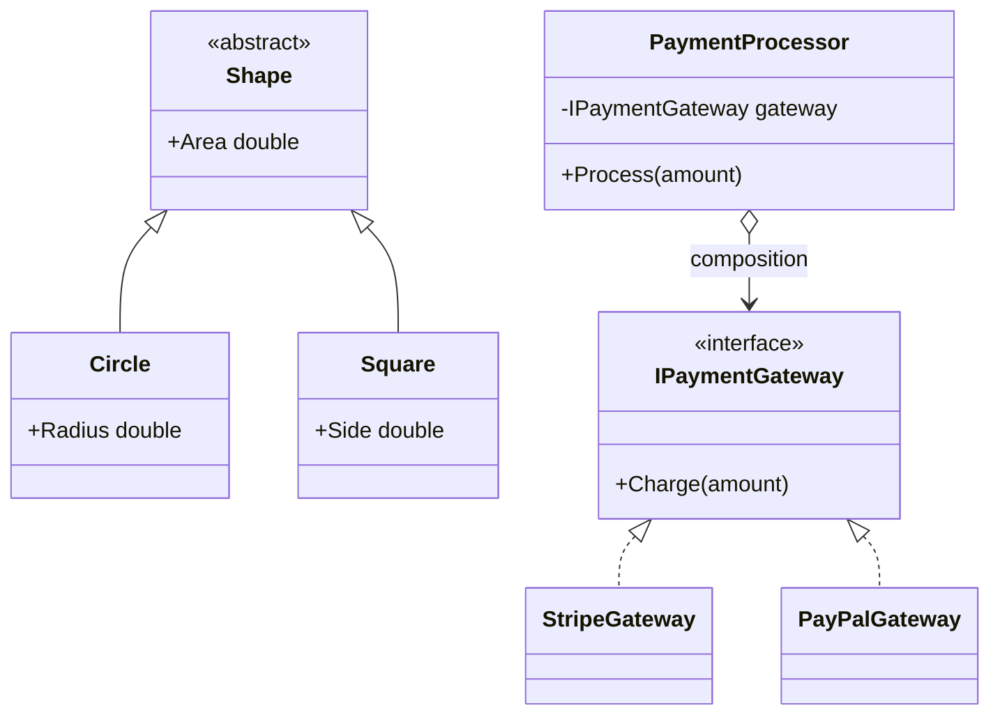
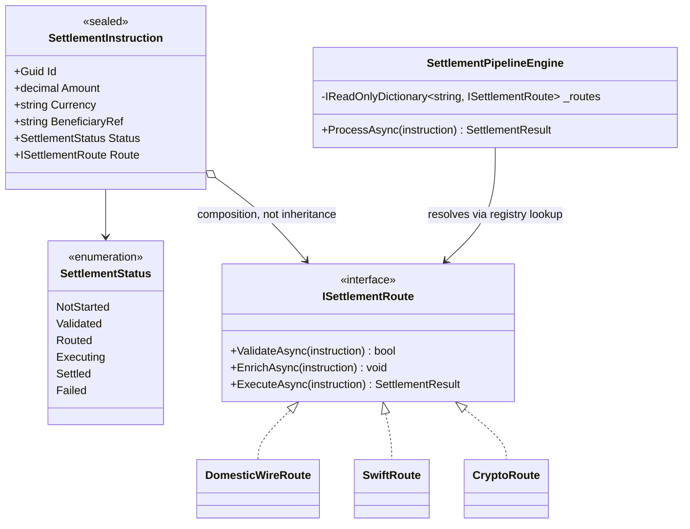
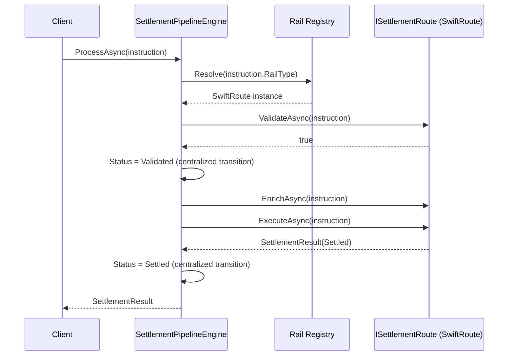

# OOP — Complete Interview Prep (All Topics, One File)

> Domain: OOP | Level: Beginner → Expert | Prerequisite: [[../01-CSharp/01-CSharp-Interview-Prep]] (C# OOP syntax, records, equality)
> **Quick-prep edition** (consolidated 2026-10-03). This one file replaces Module 29. Original: `git show ebb2d5c:09-OOP/01-OOP-Fundamentals-Advanced.md`
> Each topic has: **Key concepts → Code example → Most common interview questions with answers.** Next: [[../10-SOLID/01-SOLID-Interview-Prep]]

| # | Topic | # | Topic |
|---|---|---|---|
| 1 | The four pillars | 7 | Value objects, entities, equality & immutability |
| 2 | Encapsulation & "tell, don't ask" | 8 | Cohesion, coupling & the Law of Demeter |
| 3 | Abstraction: interfaces vs abstract classes | 9 | Anemic vs rich domain models |
| 4 | Inheritance vs composition (fragile base class) | 10 | Static state, lifecycle & testability |
| 5 | Polymorphism & dispatch (virtual/override/new/sealed) | 11 | Top 25 rapid-fire + Principal questions |
| 6 | Liskov substitutability in practice | 12 | Mistakes checklist |

---

## 1. The Four Pillars

| Pillar | One line | C# mechanism |
|---|---|---|
| **Encapsulation** | the object protects its own invariants; state changes only through behaviour | private fields, methods, `init`, read-only collections |
| **Abstraction** | expose *what* something does, hide *how* | interfaces, abstract classes |
| **Inheritance** | reuse and specialise an *is-a* type | `class B : A`, `virtual/override` |
| **Polymorphism** | one call, different behaviour by runtime type | virtual dispatch, interfaces, generics, overloading |

```csharp
public interface IPaymentMethod { Task<PaymentResult> PayAsync(Money amount); }    // abstraction

public sealed class CardPayment(ICardGateway gateway) : IPaymentMethod              // composition
{
    public Task<PaymentResult> PayAsync(Money amount) => gateway.ChargeAsync(amount);
}
public sealed class WalletPayment(Wallet wallet) : IPaymentMethod
{
    public Task<PaymentResult> PayAsync(Money amount) => Task.FromResult(wallet.Debit(amount));   // encapsulated rule
}

foreach (IPaymentMethod m in methods) await m.PayAsync(total);                      // polymorphism
```

**Common interview questions**

**Q1. Explain the four pillars with one example.**
In a payments system: a `Wallet` encapsulates its balance (only `Debit`/`Credit` change it and they enforce "no overdraft"); `IPaymentMethod` abstracts how payment happens; `SavingsAccount : Account` inherits shared account behaviour; and calling `PayAsync` on any `IPaymentMethod` runs card, wallet or UPI logic polymorphically.

**Q2. What kinds of polymorphism exist?**
Subtype (virtual or interface dispatch at runtime), parametric (generics — one algorithm for many types), and ad hoc (method overloading and operator overloading, resolved at compile time).

**Q3. Is OOP always the right paradigm?**
No. Data transformation pipelines, batch jobs, stateless calculations and simple CRUD often read better as functional or procedural code. OOP pays off when there are invariants to protect and variation to manage. Modern C# mixes paradigms (records, pattern matching, LINQ).

---

## 2. Encapsulation & "Tell, Don't Ask"

**Key concepts**
- Encapsulation protects **invariants** (rules that must always hold: balance ≥ 0, an order can't ship before it's paid) — not just "making fields private".
- A public setter on every property = no encapsulation (anyone can break the invariant).
- **Tell, don't ask:** tell the object to do something (`account.Withdraw(50)`), instead of asking for its data and deciding outside (`if (account.Balance >= 50) account.Balance -= 50`).
- Don't leak mutable internals: return `IReadOnlyList<T>`/copies, not your `List<T>`.
- Constructors establish valid state (no "half-built" objects); factory methods for complex creation.

```csharp
// BAD: no encapsulation — any caller can corrupt state
public class Account { public decimal Balance { get; set; } public List<Txn> Transactions { get; set; } = []; }

// GOOD: invariants enforced inside
public sealed class Account
{
    private readonly List<Txn> _transactions = [];
    public string Id { get; }
    public decimal Balance { get; private set; }
    public IReadOnlyList<Txn> Transactions => _transactions.AsReadOnly();

    public Account(string id) => Id = !string.IsNullOrWhiteSpace(id) ? id : throw new ArgumentException("Id required");

    public void Withdraw(decimal amount)
    {
        if (amount <= 0) throw new ArgumentOutOfRangeException(nameof(amount));
        if (amount > Balance) throw new InsufficientFundsException(Id, amount - Balance);
        Balance -= amount;
        _transactions.Add(new Txn(-amount, DateTime.UtcNow));
    }
}
```

**Common interview questions**

**Q1. What is encapsulation actually protecting, and how do you know it's broken?**
It protects invariants. It's broken when rules about an object's state live outside it (in services, controllers), when callers can set state directly (public setters, exposed mutable collections), or when the same validation is duplicated in many places.

**Q2. Property vs public field?**
A property is a method pair, so you can add validation, lazy loading, change notification or computed values later without breaking callers (binary compatibility), and control access (`private set`, `init`). Public fields expose raw storage.

**Q3. What is "tell, don't ask"?**
Put the decision where the data is: ask the object to perform the behaviour rather than pulling its data out and deciding elsewhere. This keeps rules in one place and reduces coupling to internal state.

---

## 3. Abstraction: Interfaces vs Abstract Classes

**Key concepts**
- An **interface** = a contract of *capability*; a class can implement many; no instance state (C# 8 adds default methods, C# 11 static abstract members).
- An **abstract class** = a partial implementation with state, constructors and protected helpers; single inheritance; use the **Template Method** shape.
- **Design abstractions from the consumer's needs** ("what does the caller need?") — not by mirroring one implementation's methods ("header interfaces").
- An interface with one implementation is fine when it's a real seam (testing, a boundary to infrastructure) — noise when it's ceremony.

```csharp
// Interface: a capability many unrelated types can provide
public interface IFeeCalculator { Money Calculate(Payment p); }

// Abstract class: shared skeleton + state (Template Method)
public abstract class ReportGenerator
{
    protected readonly ILogger Log;
    protected ReportGenerator(ILogger log) => Log = log;

    public async Task<byte[]> GenerateAsync(DateOnly day)            // fixed algorithm
    {
        var rows = await LoadAsync(day);
        Log.LogInformation("Loaded {Count} rows", rows.Count);
        return Render(rows);
    }
    protected abstract Task<IReadOnlyList<Row>> LoadAsync(DateOnly day);  // steps vary
    protected abstract byte[] Render(IReadOnlyList<Row> rows);
}
```

**Common interview questions**

**Q1. Interface or abstract class — how do you choose?**
Interface for a contract that different, possibly unrelated types implement, for DI and testing seams, and for multiple capabilities. Abstract class when subclasses share real state and implementation and you want a fixed algorithm with variable steps. Prefer interfaces + composition; use abstract bases sparingly.

**Q2. When does an interface add value, and when is it noise?**
Value: multiple implementations, a boundary to infrastructure (DB, HTTP, clock), a test seam that matters, or a plug-in point for other teams. Noise: a 1:1 copy of one class's public methods with no consumer-driven shape and no second implementation in sight.

**Q3. What changed with default interface methods?**
Interfaces can add new members with a default implementation without breaking existing implementers — useful for evolving published APIs. They still can't hold instance state, and overusing them blurs the interface/abstract-class distinction.

---

## 4. Inheritance vs Composition (Fragile Base Class)

**Key concepts**
- **Inheritance** = an *is-a* relationship + tight coupling to the base's implementation. **Composition** = *has-a*: build behaviour from collaborators.
- **Fragile base class problem:** a change in a base class (a new call, a changed method order) breaks subclasses that depended on internal behaviour.
- Inheritance to **reuse code** (not to express substitutability) is the classic mistake → use composition, extension methods or helpers.
- Deep hierarchies (> 2–3 levels) are hard to understand and change.
- Composition enables **Strategy** and **Decorator** — swapping behaviour at runtime, combining features without class explosion.

```csharp
// Inheritance explosion: LoggingRetryingCachingPricingService : RetryingCachingPricingService : ...
// Composition with decorators instead:
public interface IPricing { Task<decimal> GetAsync(string sku); }
public sealed class DbPricing(AppDb db) : IPricing { public Task<decimal> GetAsync(string sku) => db.PriceAsync(sku); }
public sealed class CachedPricing(IPricing inner, IMemoryCache cache) : IPricing
{
    public Task<decimal> GetAsync(string sku) =>
        cache.GetOrCreateAsync(sku, _ => inner.GetAsync(sku))!;
}
// Wiring: new CachedPricing(new DbPricing(db), cache) — add or remove features freely
```

**Common interview questions**

**Q1. When is inheritance the right tool?**
For a genuine, stable is-a relationship where subclasses are fully substitutable, in a hierarchy you control (often sealed or shallow) — e.g., framework base classes like `ControllerBase`, or a closed set of domain variants. Otherwise default to composition.

**Q2. Explain the fragile base class problem.**
Subclasses depend on the base class's internal behaviour (which methods call which, in what order). A seemingly safe change to the base — e.g., `AddRange` now calling `Add` — changes behaviour in subclasses that override `Add`, causing double counting or recursion. Composition avoids this by depending only on a public contract.

**Q3. You inherit a five-level hierarchy everyone is afraid to change. Approach?**
Add characterization tests around current behaviour; map which subclasses override what and who uses them; extract varying behaviour into strategies or collaborators; flatten level by level (composition, sealed leaves); deprecate the deep base gradually behind an interface — never a big-bang rewrite.

---

## 5. Polymorphism & Dispatch

**Key concepts**
- `virtual` → can be overridden; `override` → replaces it (runtime dispatch on the actual object type); `abstract` → must be overridden; `sealed` → no further overriding or inheritance (lets the JIT devirtualize).
- **`new` hides** a member: which method runs depends on the **compile-time type of the variable** → surprising behaviour.
- Overloads are chosen at **compile time** from static types; overrides at **runtime**.
- Interface dispatch vs virtual dispatch: both are runtime; the JIT can devirtualize sealed types and use Dynamic PGO for hot interface calls.
- Alternatives to inheritance polymorphism: pattern matching over closed record hierarchies (discriminated-union style), strategy dictionaries.

```csharp
class Fee { public virtual decimal Rate() => 0.02m; public decimal Label() => 1; }
class VipFee : Fee { public override decimal Rate() => 0.01m; public new decimal Label() => 2; }

Fee f = new VipFee();
f.Rate();   // 0.01 → override, runtime type
f.Label();  // 1    → hidden, static type Fee

// Overload resolution is static
void Print(object o) => Console.WriteLine("object");
void Print(string s) => Console.WriteLine("string");
object x = "hi"; Print(x);   // "object"

// Closed hierarchy + pattern matching instead of virtual methods
public abstract record Shape;
public sealed record Circle(double R) : Shape;
public sealed record Square(double Side) : Shape;
double Area(Shape s) => s switch { Circle c => Math.PI * c.R * c.R, Square q => q.Side * q.Side, _ => throw new UnreachableException() };
```

**Common interview questions**

**Q1. `override` vs `new` — why does it matter?**
`override` participates in virtual dispatch: the object's real type decides. `new` hides the base member: the variable's declared type decides, so the same object behaves differently through different references — a frequent source of bugs. The compiler warns about hiding; treat it as an error unless intentional.

**Q2. Virtual methods vs pattern matching for variation?**
Virtual methods suit open sets of types (new types added by others; behaviour lives with the data). Pattern matching over a sealed record hierarchy suits closed sets where new *operations* are added more often than new types — and the compiler can check exhaustiveness.

**Q3. Why seal classes by default?**
It prevents accidental inheritance coupling, keeps the public API change-safe, documents intent, and helps the JIT devirtualize and inline calls.

---

## 6. Liskov Substitutability in Practice

**Key concepts**
- **LSP:** objects of a subtype must be usable anywhere the base type is expected **without changing correct behaviour**.
- Violations: subclasses that **strengthen preconditions** (reject inputs the base accepts), **weaken postconditions** (return less than promised), break **invariants**, throw new exception types (`NotSupportedException`), or have surprising side effects.
- Classic: **Square : Rectangle** (setting the width also changes the height → breaks the callers' expectations).
- .NET example: `ReadOnlyCollection<T>` implements `IList<T>` but throws on `Add` → `IsReadOnly` flags are an LSP smell; prefer segregated interfaces (`IReadOnlyList<T>`).
- Detect in review: `is`/type checks on subtypes in callers, `NotImplementedException`/`NotSupportedException` overrides, overrides that ignore base behaviour, tests that need special cases per subclass.

```csharp
// Violation
class Rectangle { public virtual int W { get; set; } public virtual int H { get; set; } public int Area => W * H; }
class Square : Rectangle { public override int W { set { base.W = base.H = value; } } public override int H { set { base.W = base.H = value; } } }
Rectangle r = new Square(); r.W = 5; r.H = 4;   // caller expects 20, gets 16

// Fix: separate types, no false is-a
public interface IShape { int Area { get; } }
public sealed record Rect(int W, int H) : IShape { public int Area => W * H; }
public sealed record Sq(int Side) : IShape { public int Area => Side * Side; }
```

**Common interview questions**

**Q1. State LSP practically and give a violation.**
"A subclass must honour everything the base promises." Violation: a `ReadOnlyRepository : Repository` whose `Save` throws — every caller written against `Repository` now breaks. Fix: split the interface (`IReader`, `IWriter`) so the read-only type never claims to write.

**Q2. How do you spot LSP violations in code review?**
Overrides throwing `NotSupportedException`, type checks or casts on subtypes in consumers, extra validation in overrides that the base didn't require, overrides that skip `base` calls the contract depends on, and boolean "capability" flags like `CanX`.

**Q3. How do you fix pervasive LSP violations?**
Redesign the abstraction around consumer roles (ISP), replace inheritance with composition, introduce separate types for genuinely different behaviour, and add contract tests that run against every implementation of an interface.

---

## 7. Value Objects, Entities, Equality & Immutability

**Key concepts**
- **Entity:** identity matters (two customers named "Ana" are different); equality by ID; mutable over its lifetime.
- **Value object:** defined by its values (`Money(10, "EUR")`), immutable, equality by value, self-validating → **records/readonly structs** in C#.
- **`Equals`/`GetHashCode` contract:** equal objects → equal hashes; hashes must not change while the object is in a hash collection → don't use mutable objects as keys.
- **Immutability benefits:** thread-safety, safe sharing, no defensive copies, easier reasoning; costs: allocations for changes (`with`), awkward with some ORMs/serializers.

```csharp
public readonly record struct Money(decimal Amount, string Currency)
{
    public Money { if (Currency is not { Length: 3 }) throw new ArgumentException("ISO currency"); }
    public Money Add(Money other) => other.Currency == Currency
        ? this with { Amount = Amount + other.Amount }
        : throw new InvalidOperationException("Currency mismatch");
}

public sealed class Customer : IEquatable<Customer>          // entity: identity equality
{
    public Guid Id { get; }
    public string Name { get; private set; }
    public Customer(Guid id, string name) { Id = id; Name = name; }
    public void Rename(string name) => Name = name;
    public bool Equals(Customer? other) => other is not null && Id == other.Id;
    public override bool Equals(object? obj) => Equals(obj as Customer);
    public override int GetHashCode() => Id.GetHashCode();
}
```

**Common interview questions**

**Q1. Entity vs value object?**
Entities have a stable identity and lifecycle (Customer, Order); value objects are interchangeable when their values are equal (Money, Address, DateRange) and should be immutable. Modelling amounts as `Money` instead of `decimal` prevents currency-mixing bugs.

**Q2. What's the `Equals`/`GetHashCode` contract?**
If `a.Equals(b)`, then `a.GetHashCode() == b.GetHashCode()`; `Equals` must be reflexive, symmetric and transitive; hash codes should be stable while an object is in a hash-based collection. Breaking it makes `Dictionary`/`HashSet` lose items.

**Q3. Trade-offs of favouring immutability?**
Pros: thread safety, no aliasing bugs, predictable state, safe caching and sharing. Cons: allocation on every change (usually negligible), more ceremony for large aggregates, and friction with ORMs needing setters (EF Core supports constructor binding and private setters).

---

## 8. Cohesion, Coupling & the Law of Demeter

**Key concepts**
- **Cohesion:** how strongly the members of a module belong together (high = good). **Coupling:** how much modules depend on each other's details (low = good). Most design principles are proxies for these two.
- **Law of Demeter** ("only talk to your immediate friends"): avoid train wrecks like `order.Customer.Address.Country.TaxRule.Rate` → coupling to the whole object graph.
- Coupling types: to concrete types, to internal data structures, temporal coupling (methods must be called in order), shared mutable state.

```csharp
// Train wreck: caller knows the whole graph
var rate = order.Customer.Address.Country.TaxRule.Rate;

// Better: ask the object that owns the knowledge
var rate = order.TaxRate();                       // Order delegates internally
// or pass what's needed: _tax.RateFor(order.ShippingCountry)
```

**Common interview questions**

**Q1. What does the Law of Demeter prevent?**
Callers depending on the internal structure of objects several hops away. When any link in the chain changes (Address restructured), every caller breaks. It pushes behaviour to the objects that own the data.

**Q2. How do you decide where a piece of behaviour belongs?**
With the data it uses most (information expert), where its invariants live, where its reason to change is, and so that coupling stays low — e.g., discount calculation belongs to the pricing component that owns discount rules, not to the controller.

**Q3. How do you handle a class with twenty responsibilities?**
Identify the reasons to change (actors), group methods and fields by which ones they use (cohesion clusters), extract classes along those seams with tests in place, introduce interfaces where consumers need only a subset, and move step by step.

---

## 9. Anemic vs Rich Domain Models

**Key concepts**
- **Anemic model:** entities are data bags (getters and setters); business rules live in "service" classes → invariants scattered, easy to bypass, duplicated.
- **Rich model:** entities and aggregates expose behaviour (`order.Pay(...)`, `order.Ship()`) and enforce their invariants; application services orchestrate (load, call behaviour, save).
- Anemic isn't always wrong: for simple CRUD and reporting, a rich model is ceremony.
- ORM tension: EF Core supports private setters, backing fields, constructors and owned types → you can keep encapsulation.

```csharp
// Rich model with a state machine
public sealed class Order
{
    public Guid Id { get; private set; }
    public OrderStatus Status { get; private set; } = OrderStatus.Created;
    private readonly List<OrderLine> _lines = [];
    public IReadOnlyCollection<OrderLine> Lines => _lines;

    public void AddLine(string sku, int qty, Money price)
    {
        if (Status != OrderStatus.Created) throw new InvalidOperationException("Order is locked");
        _lines.Add(new OrderLine(sku, qty, price));
    }
    public void Pay(PaymentId paymentId)
    {
        if (Status != OrderStatus.Created || _lines.Count == 0) throw new InvalidOperationException("Cannot pay");
        Status = OrderStatus.Paid;
    }
}

// Application service orchestrates; it doesn't own the rules
public async Task PayOrderAsync(Guid id, PaymentId pid, CancellationToken ct)
{
    var order = await _orders.GetAsync(id, ct);
    order.Pay(pid);
    await _uow.SaveChangesAsync(ct);
}
```

**Common interview questions**

**Q1. What is an anemic domain model and why is it criticised?**
Objects with only data and no behaviour, with logic in procedural services. Invariants can be bypassed by any code that sets properties, rules get duplicated across services, and the model doesn't express the domain. It's acceptable for simple CRUD where there are few rules.

**Q2. Rich domain model or service-oriented procedural style at scale?**
Rich models for complex, rule-heavy core domains (payments, pricing, underwriting) where invariants matter; transaction-script/procedural style for simple CRUD, reporting and integration glue. Choose per bounded context, not per company.

**Q3. How do you reconcile encapsulation with ORMs and serializers?**
Map private fields and backing fields in EF Core, use constructors for materialization, keep DTOs separate from domain objects for serialization, and use owned types and value converters for value objects.

---

## 10. Static State, Lifecycle & Testability

**Key concepts**
- **Static mutable state** = a global variable: hidden dependencies, shared across requests and tenants, untestable in isolation, thread-safety problems.
- Static is fine for **pure functions** and constants.
- Hidden dependencies (`DateTime.Now`, `new HttpClient()`, static singletons) → inject them (`TimeProvider`, `IHttpClientFactory`).
- **Lifecycle and ownership:** the creator disposes; DI lifetimes (singleton/scoped/transient) must match the state an object holds.
- Hard-to-test code is a design smell (tight coupling, hidden dependencies, too many responsibilities).

```csharp
// Hidden dependency on time → untestable
public bool IsExpired() => DateTime.UtcNow > _expiresAt;

// Injected time → testable
public sealed class Token(TimeProvider clock, DateTimeOffset expiresAt)
{
    public bool IsExpired() => clock.GetUtcNow() > expiresAt;
}
// Test: new Token(new FakeTimeProvider(start), start.AddMinutes(5))
```

**Common interview questions**

**Q1. Why is static mutable state a design problem, not a style preference?**
It creates invisible coupling (nothing in a constructor reveals it), shares state across requests, tenants and tests, causes race conditions, and prevents substitution in tests. In a web server it's effectively a cross-user data store.

**Q2. How does OOP design affect testability concretely?**
Dependencies passed through constructors (DIP) can be replaced with fakes; small cohesive classes need few test cases; immutable value objects are trivially testable; static, hidden dependencies and deep inheritance require heavy setup or can't be isolated at all.

---

## 11. Top 25 Rapid-Fire Questions + Principal Questions

1. **Encapsulation?** Protecting invariants; state changes via behaviour.
2. **Abstraction?** Exposing what, hiding how.
3. **Inheritance?** An is-a relationship with code reuse — tight coupling.
4. **Polymorphism kinds?** Subtype, parametric (generics), ad hoc (overloading).
5. **Composition over inheritance?** Has-a collaborators, flexible, testable.
6. **Fragile base class?** Base changes break subclasses relying on internals.
7. **Interface vs abstract class?** Contract vs partial implementation with state.
8. **`override` vs `new`?** Runtime vs compile-time binding.
9. **`sealed`?** No inheritance; devirtualization; API safety.
10. **Overloading vs overriding?** Compile-time signature choice vs runtime replacement.
11. **LSP?** Subtypes must honour the base contract.
12. **Square/Rectangle?** A classic LSP violation.
13. **Entity vs value object?** Identity vs value equality.
14. **Equals/GetHashCode?** Equal → same hash; stable while hashed.
15. **Tell, don't ask?** Command objects instead of pulling their data.
16. **Law of Demeter?** No train wrecks.
17. **Cohesion/coupling?** High cohesion, low coupling.
18. **Anemic model?** Data bags + logic in services.
19. **Rich model?** Behaviour + invariants inside entities.
20. **Static state issue?** Hidden global coupling, untestable.
21. **Constructor role?** Establish a valid object.
22. **Header interface?** Mirrors one class; adds little.
23. **Template Method?** Abstract-class skeleton with varying steps.
24. **Decorator vs inheritance?** Runtime composition vs class explosion.
25. **When not OOP?** Pipelines, scripts, simple CRUD, stateless math.

**Principal-level questions**

**P1. How do you evaluate whether a codebase's object model is helping or hindering?**
Look at change cost: how many files change for a typical feature, where bugs cluster, test setup size, duplicated rules, deep hierarchies, type checks in consumers, and anemic entities with fat services. Use hotspot analysis (churn × complexity) to target refactoring.

**P2. How do you set OOP design standards across teams without dogma?**
State the goals (protect invariants, low coupling, testability), give examples and anti-examples, review for coupling and change cost rather than rule compliance, allow procedural styles where rules are few, and use architecture tests for the few hard rules (layer dependencies).

**P3. How do you handle inheritance in a published library that consumers subclass?**
Seal by default, expose explicit extension points (protected virtual hooks, strategies, events), document the contracts of overridable members, avoid calling virtual members from constructors, and treat changes to them as breaking (semantic versioning).

**P4. What distinguishes an excellent class-model answer from an adequate one?**
It starts from behaviour and invariants rather than data, separates entities from value objects, uses composition for variation, keeps aggregates small, explains equality and immutability choices, shows how it will be tested, and states what it deliberately didn't abstract.

---

## 12. Mistakes Checklist (say why each is wrong)
- [ ] Public setters everywhere · exposing mutable internal collections · validation outside the object
- [ ] Inheritance for code reuse · deep hierarchies · unsealed classes by default
- [ ] `new` hiding instead of `override` · virtual calls in constructors
- [ ] Overrides throwing `NotSupportedException` (LSP) · type checks on subclasses in callers
- [ ] Header interfaces for every class · abstractions with no consumer-driven shape
- [ ] Mutable objects as dictionary keys · `Equals` without `GetHashCode`
- [ ] Train-wreck chains · god classes with twenty responsibilities
- [ ] Anemic entities with all rules in services (in rule-heavy domains)
- [ ] Static mutable state · hidden dependencies on `DateTime.Now`/`new HttpClient()`

---

## Architecture Diagrams (preserved from the original modules)

> All 3 Mermaid/ASCII diagrams from the original `09-OOP/` files, kept verbatim and grouped by source module. Originals: `git show ebb2d5c:09-OOP/<file>.md`.

### Module 29 — OOP: Encapsulation, Inheritance, Polymorphism & Composition
*Source: `01-OOP-Fundamentals-Advanced.md`*

**3. Visual Architecture**



**13. Low-Level Design**



**13. Low-Level Design**


