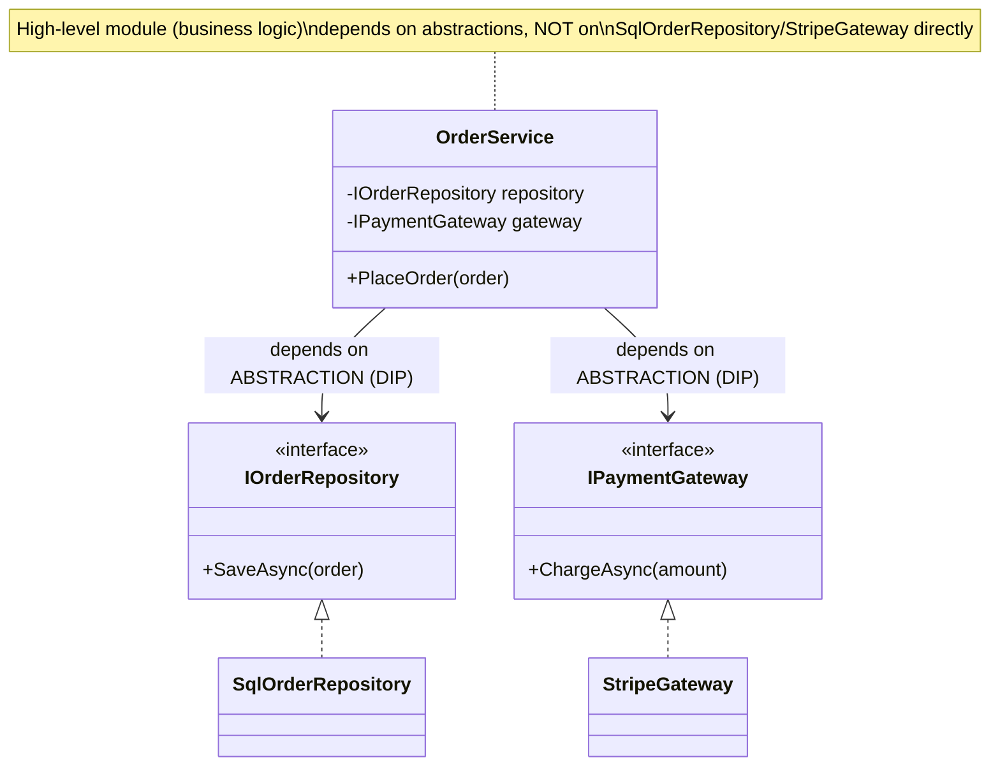
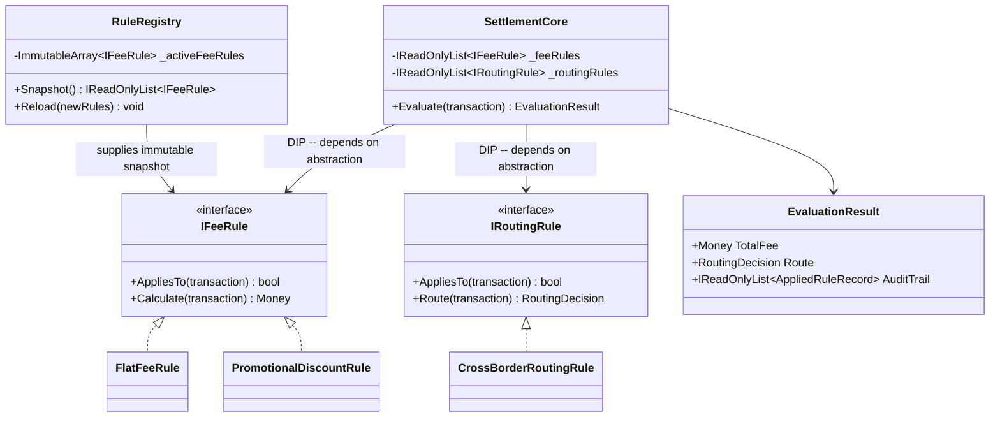
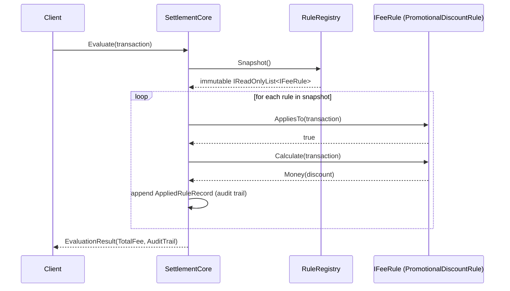

# SOLID — Complete Interview Prep (All Topics, One File)

> Domain: SOLID | Level: Beginner → Expert | Prerequisite: [[../09-OOP/01-OOP-Interview-Prep]] (encapsulation, composition, LSP basics)
> **Quick-prep edition** (consolidated 2026-10-03). This one file replaces Module 30. Original: `git show ebb2d5c:10-SOLID/01-SOLID-Principles-Deep-Dive.md`
> Each topic has: **Key concepts → Code example → Most common interview questions with answers.** Patterns that implement these principles: [[../11-Design-Patterns/00-Design-Patterns-Interview-Master-Guide-DotNet-TechLead]]

| # | Topic | # | Topic |
|---|---|---|---|
| 1 | SOLID overview & why it exists | 7 | DIP vs DI vs IoC containers |
| 2 | S — Single Responsibility | 8 | How the principles interact; SOLID ↔ patterns |
| 3 | O — Open/Closed | 9 | When SOLID does not apply (and over-engineering) |
| 4 | L — Liskov Substitution | 10 | SOLID at architecture level & team scale |
| 5 | I — Interface Segregation | 11 | Top 25 rapid-fire + Principal questions |
| 6 | D — Dependency Inversion | 12 | Mistakes checklist |

---

## 1. SOLID Overview & Why It Exists

| Letter | Principle | One-line meaning | Smell when violated |
|---|---|---|---|
| **S** | Single Responsibility | a module should have **one reason to change** (one actor) | god classes, unrelated changes in one file |
| **O** | Open/Closed | open for extension, closed for modification | `switch` on type growing with every feature |
| **L** | Liskov Substitution | subtypes must be substitutable for their base | `NotSupportedException` overrides, type checks |
| **I** | Interface Segregation | clients shouldn't depend on methods they don't use | fat interfaces, empty implementations |
| **D** | Dependency Inversion | high-level policy depends on abstractions it owns, not on details | `new SqlRepository()` inside business logic |

- Coined by Robert C. Martin; the goal is code that is **easy to change, test and understand**.
- All five are proxies for **high cohesion and low coupling**.
- They are **heuristics, not laws** — applied where change and variation actually happen.

**Common interview questions**

**Q1. Explain SOLID in one minute.**
SRP: group code by the reason it changes. OCP: add new behaviour by adding code (new strategies or handlers), not by editing stable code. LSP: subclasses must keep the base's promises. ISP: give each client a small interface for what it needs. DIP: business logic depends on interfaces it defines; infrastructure implements them. Together they reduce the cost and risk of change.

**Q2. Which principle is most often violated, and why?**
SRP — classes grow because adding a method to an existing class is the path of least resistance under deadline pressure, so "OrderService" accumulates validation, pricing, notification and persistence. DIP is a close second (direct `new` of infrastructure in business code).

---

## 2. S — Single Responsibility Principle

**Key concepts**
- "**One reason to change**" = **one actor** (stakeholder group) whose requirements drive changes — not "does one thing" or "has one method".
- Mixed actors in one class → a change for finance breaks something for compliance.
- Cohesion is the real measure: methods that use the same data and change together belong together.
- Splitting too far scatters one behaviour across many tiny classes (also bad).

```csharp
// Violation: three actors in one class (finance: pricing; ops: persistence; marketing: emails)
public class InvoiceService
{
    public decimal CalculateTotal(Invoice i) { /* tax + discounts rules */ return 0; }
    public void Save(Invoice i) { /* SQL */ }
    public void EmailCustomer(Invoice i) { /* SMTP + template */ }
}

// Split by reason to change
public sealed class InvoiceCalculator { public Money Total(Invoice i) => /* pricing rules */ default; }
public interface IInvoiceRepository { Task SaveAsync(Invoice i, CancellationToken ct); }
public interface IInvoiceNotifier { Task SendAsync(Invoice i, CancellationToken ct); }

public sealed class IssueInvoiceHandler(InvoiceCalculator calc, IInvoiceRepository repo, IInvoiceNotifier notifier)
{
    public async Task HandleAsync(Invoice i, CancellationToken ct)        // orchestration only
    {
        i.SetTotal(calc.Total(i));
        await repo.SaveAsync(i, ct);
        await notifier.SendAsync(i, ct);
    }
}
```

**Common interview questions**

**Q1. What does "one reason to change" actually mean?**
One source of change requests — one actor or business capability. A class that holds tax rules (finance), report formatting (operations) and persistence (DBAs) has three reasons; changes for one risk breaking the others.

**Q2. A service class has grown to 1,500 lines. How do you split it?**
Add characterization tests; cluster methods by the fields and dependencies they use and by who requests their changes; extract each cluster into a cohesive class (calculator, policy, repository, notifier); keep a thin orchestrator; move incrementally, one extraction per PR.

**Q3. Where does SRP conflict with practicality?**
Over-splitting creates navigation overhead and "ravioli code" where one feature spans 15 files. Resolve it by splitting on real change axes observed in history (git churn), and keeping small related logic together until it actually diverges.

---

## 3. O — Open/Closed Principle

**Key concepts**
- Add new behaviour by **adding code** (new class/handler/strategy), not by **modifying** working, tested code.
- Mechanisms: polymorphism (interfaces), **Strategy**, **Decorator**, plug-in registration via DI, pipelines/middleware, configuration.
- **Choose the extension axis from real variation** (new payment methods are added monthly → make that pluggable). Speculative extension points = YAGNI and permanent indirection.
- A `switch` on type/enum that's edited for every new case is the classic OCP smell (but a `switch` in one factory is fine).

```csharp
// Violation: edit this method for every new payment method
public decimal Fee(Payment p) => p.Method switch
{
    "card" => p.Amount * 0.029m + 0.30m,
    "upi"  => 0m,
    "wallet" => p.Amount * 0.01m,
    _ => throw new NotSupportedException()
};

// OCP: add a new IFeePolicy class + one DI registration; nothing existing changes
public interface IFeePolicy { string Method { get; } decimal Fee(Payment p); }
public sealed class CardFee : IFeePolicy { public string Method => "card"; public decimal Fee(Payment p) => p.Amount * 0.029m + 0.30m; }
public sealed class UpiFee  : IFeePolicy { public string Method => "upi";  public decimal Fee(Payment p) => 0m; }

public sealed class FeeCalculator(IEnumerable<IFeePolicy> policies)
{
    private readonly Dictionary<string, IFeePolicy> _byMethod = policies.ToDictionary(p => p.Method);
    public decimal Fee(Payment p) => _byMethod.TryGetValue(p.Method, out var policy)
        ? policy.Fee(p) : throw new NotSupportedException($"No fee policy for {p.Method}");
}
// builder.Services.AddSingleton<IFeePolicy, CardFee>(); builder.Services.AddSingleton<IFeePolicy, UpiFee>();
```

**Common interview questions**

**Q1. Give a concrete OCP example done properly.**
Payment fee policies: each method is an `IFeePolicy` registered in DI; adding "BNPL" means one new class and one registration — the calculator and existing policies stay untouched, and existing tests stay valid. Same idea: ASP.NET Core middleware, EF Core interceptors, MediatR pipeline behaviours.

**Q2. How do you decide where to put an extension point?**
Where variation has already happened or is on the roadmap (look at git history and product plans) — the "rule of three": after the second or third similar change, extract the seam. Don't add seams for imagined futures; you'll likely guess the wrong axis.

**Q3. Is every `switch` statement an OCP violation?**
No. A switch in a single factory or composition root, or over a closed set that rarely changes (days of the week), is fine. The smell is the same switch duplicated across the codebase and edited for every new case.

---

## 4. L — Liskov Substitution Principle

**Key concepts**
- A subtype must be usable through the base type **without the caller noticing**: honour preconditions (don't strengthen), postconditions (don't weaken), invariants and exception contracts.
- LSP is **behavioural**, not syntactic: the compiler can't check it.
- Smells: `NotSupportedException`/`NotImplementedException` overrides, `if (x is SpecialSubtype)` in callers, overrides that ignore input the base accepted, `IsReadOnly`-style capability flags.
- Fixes: split interfaces by capability (ISP), use composition, model different behaviour as different types.
- **Contract tests** run the same test suite against every implementation of an interface.

```csharp
// Violation: the base promises Withdraw works for amounts ≤ balance
public class Account { public virtual void Withdraw(decimal amt) { /* ... */ } }
public class FixedDepositAccount : Account
{
    public override void Withdraw(decimal amt) => throw new NotSupportedException("Locked until maturity");
}

// Fix: separate capabilities
public interface IAccount { decimal Balance { get; } }
public interface IWithdrawable : IAccount { void Withdraw(decimal amt); }
public sealed class CurrentAccount : IWithdrawable { public decimal Balance { get; private set; } public void Withdraw(decimal amt) { /* ... */ } }
public sealed class FixedDeposit : IAccount { public decimal Balance { get; } }

// Contract test for all implementations
public abstract class WithdrawableContract
{
    protected abstract IWithdrawable CreateWithBalance(decimal b);
    [Fact] public void Withdraw_within_balance_reduces_balance()
    { var a = CreateWithBalance(100); a.Withdraw(40); Assert.Equal(60, a.Balance); }
}
```

**Common interview questions**

**Q1. How do you detect an LSP violation without a formal specification?**
Callers type-checking subclasses; overrides that throw for inherited operations or add validation the base didn't have; tests written against the base that fail for one implementation; documentation saying "except for X". Contract tests across all implementations make this explicit.

**Q2. Give a real LSP violation from production code and its fix.**
A `CachedRepository : Repository` that returns stale data after `Save` — callers that save then read expect the new value (a weakened postcondition). Fix: invalidate on write, or make the cache a decorator with explicit consistency semantics documented in the interface.

**Q3. How does LSP relate to OCP?**
OCP relies on substitutable extensions: if a new implementation breaks callers' expectations, "extending without modifying" just moves bugs into production. OCP without LSP = unsafe extension.

---

## 5. I — Interface Segregation Principle

**Key concepts**
- Clients shouldn't be forced to depend on methods they don't use.
- **Role interfaces** shaped by consumer needs (`IOrderReader`, `IOrderWriter`) vs **header interfaces** mirroring a class (`IOrderService` with 25 methods).
- Fat interfaces force dummy implementations (an LSP risk), widen the blast radius of changes, and make mocks huge.
- Split by **client role**, not by mechanism.
- .NET examples: `IReadOnlyList<T>` vs `IList<T>`, `IEnumerable<T>`, `IAsyncDisposable`, ASP.NET Core feature interfaces (`IHttpResponseBodyFeature`).

```csharp
// Fat interface: the reporting job needs only reads, but depends on everything
public interface IOrderRepository
{
    Task<Order?> GetAsync(Guid id); Task<IReadOnlyList<Order>> SearchAsync(OrderQuery q);
    Task AddAsync(Order o); Task UpdateAsync(Order o); Task DeleteAsync(Guid id);
    Task<byte[]> ExportCsvAsync(DateOnly day); Task ArchiveAsync(DateOnly before);
}

// Segregated by client role
public interface IOrderReader   { Task<Order?> GetAsync(Guid id); Task<IReadOnlyList<Order>> SearchAsync(OrderQuery q); }
public interface IOrderWriter   { Task AddAsync(Order o); Task UpdateAsync(Order o); }
public interface IOrderExporter { Task<byte[]> ExportCsvAsync(DateOnly day); }

public sealed class SqlOrderStore : IOrderReader, IOrderWriter, IOrderExporter { /* one implementation, many roles */ }
public sealed class DailyReportJob(IOrderExporter exporter) { /* depends only on what it uses */ }
```

**Common interview questions**

**Q1. What problem does ISP actually solve?**
Unnecessary coupling: consumers recompile, re-test and break when unrelated members change; implementers write dummy methods; mocks become huge. Small role interfaces limit the blast radius of changes and clarify what each consumer depends on.

**Q2. How do you refactor a fat interface that many classes implement?**
Identify the consumer groups and which members each uses; extract role interfaces; make the fat interface inherit from them temporarily (no breaking change); migrate consumers to the role interfaces; then shrink or remove the fat interface.

**Q3. Isn't splitting interfaces just more files?**
Only if split by mechanism. Split by real client roles, and each consumer gets a precise, stable contract — fewer changes ripple, and tests mock less.

---

## 6. D — Dependency Inversion Principle

**Key concepts**
- High-level modules (business policy) shouldn't depend on low-level modules (DB, HTTP, files); **both depend on abstractions**, and **the abstraction is owned by the high-level module** (the domain/application layer defines `IPaymentGateway`; infrastructure implements it).
- What's inverted is the **source-code dependency direction** relative to the runtime call flow: at runtime the domain calls the database; at compile time the database adapter references the domain's interface.
- An interface placed in the infrastructure project and referenced by the domain **inverts nothing**.
- Foundation of Clean/Hexagonal architecture (ports and adapters).

```csharp
// Domain/Application project owns the port
namespace Payments.Application;
public interface IPaymentGateway { Task<GatewayResult> ChargeAsync(ChargeRequest r, CancellationToken ct); }
public sealed class CapturePaymentHandler(IPaymentGateway gateway, IPaymentRepository repo)
{
    public async Task HandleAsync(CapturePayment cmd, CancellationToken ct)
    {
        var payment = await repo.GetAsync(cmd.PaymentId, ct);
        var result = await gateway.ChargeAsync(payment.ToChargeRequest(), ct);   // depends on the abstraction
        payment.MarkCaptured(result.Reference);
        await repo.SaveAsync(payment, ct);
    }
}

// Infrastructure project references Application and implements the port (an adapter)
namespace Payments.Infrastructure;
public sealed class StripeGateway(HttpClient http) : Payments.Application.IPaymentGateway
{
    public async Task<GatewayResult> ChargeAsync(ChargeRequest r, CancellationToken ct) { /* Stripe API */ return default!; }
}

// Composition root (API project) wires it
builder.Services.AddHttpClient<IPaymentGateway, StripeGateway>();
```

**Common interview questions**

**Q1. What is actually being "inverted"?**
The direction of the compile-time dependency. Naively, business code references the database code it calls. With DIP, the business layer defines the interface it needs and the infrastructure layer references the business layer to implement it — so infrastructure depends on policy, not the other way round.

**Q2. How do you apply DIP in a layered app without ceremony?**
Introduce abstractions only at real boundaries — I/O (DB, HTTP, queues, clock, file system) and genuinely variable policies. Don't create interfaces for pure in-process domain classes with one implementation; test them directly.

**Q3. Who should own the abstraction?**
The consumer (high-level policy). That's why `IPaymentGateway` lives in the application layer and is shaped by what the use case needs (ISP), not by the Stripe SDK's API.

---

## 7. DIP vs DI vs IoC Containers

| Concept | What it is | Example |
|---|---|---|
| **Dependency Inversion Principle** | a *design principle* about the direction of dependencies and abstraction ownership | domain defines `IClock`, infrastructure implements it |
| **Dependency Injection** | a *technique*: pass dependencies in (constructor/method/property) instead of creating them | `public Handler(IClock clock)` |
| **Inversion of Control** | a broader idea: the framework calls your code and controls flow/creation | ASP.NET Core invoking controllers, middleware |
| **IoC/DI container** | a *tool* that builds object graphs and manages lifetimes | `Microsoft.Extensions.DependencyInjection`, Autofac |

```csharp
// DI without DIP: injected, but still depends on a concrete detail
public sealed class ReportService(SqlServerReportRepository repo) { }

// DI + DIP: injected abstraction owned by the consumer's layer
public sealed class ReportService(IReportSource source) { }

// DIP without a container: manual wiring in tests or a console app
var service = new ReportService(new InMemoryReportSource(rows));
```

**Common interview questions**

**Q1. Is dependency injection the same as dependency inversion?**
No. DI is a way of supplying dependencies; DIP is about which way dependencies point and who owns abstractions. You can inject a concrete class (DI without DIP) or follow DIP with manual wiring and no container.

**Q2. Do you need a DI container to follow SOLID?**
No — containers are a convenience for wiring large graphs and lifetimes. The principles are about design; "pure DI" (manual composition) works fine for small apps and tests.

---

## 8. How the Principles Interact; SOLID ↔ Design Patterns

- **SRP + ISP:** small, cohesive classes with small consumer-shaped interfaces.
- **ISP + DIP:** consumer-owned, minimal abstractions (ports).
- **OCP needs LSP:** extensions must be substitutable.
- **OCP via DIP:** new behaviour plugs in behind an abstraction.

| Pattern | Principle it serves |
|---|---|
| **Strategy** | OCP (new algorithms), DIP (depend on the strategy interface) |
| **Decorator** | OCP + SRP (add caching/logging/retry without modifying the core) |
| **Factory** | DIP (create via abstraction), SRP (separate creation) |
| **Adapter** | DIP (wrap third-party APIs behind your port) |
| **Chain of Responsibility / pipeline** | OCP (add steps), SRP (one concern per handler) |
| **Repository** | DIP + SRP (isolate persistence) |
| **Observer / domain events** | OCP (new reactions without touching the publisher) |

```csharp
// Decorator: add retry and logging (OCP + SRP) without touching StripeGateway
public sealed class LoggingGateway(IPaymentGateway inner, ILogger<LoggingGateway> log) : IPaymentGateway
{
    public async Task<GatewayResult> ChargeAsync(ChargeRequest r, CancellationToken ct)
    {
        log.LogInformation("Charging {PaymentId}", r.PaymentId);
        var result = await inner.ChargeAsync(r, ct);
        log.LogInformation("Charged {PaymentId}: {Status}", r.PaymentId, result.Status);
        return result;
    }
}
```

**Common interview questions**

**Q1. How do the five principles relate to each other?**
They reinforce one another around cohesion and coupling: SRP and ISP keep units and contracts small; DIP points dependencies at those contracts; OCP adds behaviour through them; LSP guarantees the new implementations are safe to plug in.

**Q2. How do SOLID and GoF patterns relate?**
Patterns are concrete, reusable implementations of the principles: Strategy and Decorator are OCP in practice, Adapter and Repository implement DIP at boundaries, Chain of Responsibility enforces SRP per step. Applying a pattern without the underlying need is over-engineering.

---

## 9. When SOLID Does Not Apply (and Over-Engineering)

**Key concepts**
- **Don't apply heavy SOLID to:** DTOs and records, mappers, simple CRUD, small scripts and tools, data pipelines with no invariants, stable code with one implementation, prototypes.
- **Over-application symptoms:** an interface per class, a strategy per `if`, factories of factories, 10 files to follow one request, "AbstractBaseManagerFactoryProvider".
- **Performance:** extra indirection is usually negligible; in rare ultra-hot paths, virtual and interface calls and allocations matter (sealed classes, generics with struct constraints, or plain code).
- Use **YAGNI**, **KISS** and the **rule of three** as counterweights.

**Common interview questions**

**Q1. When does SOLID not apply?**
When there's no variation and no invariant to protect: DTOs, configuration classes, glue code, one-off scripts, simple CRUD endpoints, and stable code that hasn't changed in years. Adding abstractions there adds cost with no benefit.

**Q2. A team has over-applied SOLID into unreadable indirection. What do you do?**
Measure the pain (time to trace a request, onboarding feedback, change cost); collapse single-implementation interfaces that aren't boundaries; inline trivial strategies and factories; keep abstractions only at I/O boundaries and real variation points; document the guideline with examples; and review for coupling rather than principle compliance.

**Q3. How do you tell a useful abstraction from a speculative one in review?**
Useful: more than one implementation exists or is imminent, it isolates I/O for testing, or it's a boundary between teams or layers; its shape comes from the consumer. Speculative: one implementation, "might need it later", mirrors the class 1:1, adds a hop with no test or variation benefit.

**Q4. How do SOLID principles interact with performance?**
Mostly negligible (nanoseconds per virtual call versus milliseconds of I/O). In hot paths, prefer sealed types and generics (devirtualization, no boxing), avoid per-call allocations of decorators, and measure before trading clarity for speed.

---

## 10. SOLID at Architecture Level & Team Scale

**Key concepts**
- **SRP → service boundaries:** one service per business capability (bounded context) with one owning team.
- **OCP → plugin architectures, event-driven extension** (new consumers subscribe without changing producers).
- **LSP → API/contract compatibility:** a new version or alternative implementation must honour existing consumer contracts (contract tests).
- **ISP → client-specific APIs** (BFFs, fine-grained topics, GraphQL).
- **DIP → Clean/Hexagonal architecture:** domain at the centre; adapters depend inward.
- **Conway's Law:** module boundaries mirror team boundaries; SRP at the architecture level means one team owns each reason to change.

**Common interview questions**

**Q1. How do you use SOLID as an architectural tool rather than a class-level one?**
Draw service and module boundaries by reason to change (SRP); make integration extensible through events (OCP); keep API contracts backward compatible (LSP); give each consumer the API shape it needs (ISP); and keep business logic independent of frameworks and infrastructure (DIP → hexagonal).

**Q2. Where does SOLID conflict with other architectural goals?**
Performance (indirection in hot paths), simplicity and onboarding (too many layers), delivery speed for throwaway features, and operational simplicity (more services ≠ better). Trade-offs should be explicit and recorded (ADRs).

**Q3. How do you review for coupling rather than principle compliance?**
Ask: what would change if requirement X changed, and how many modules or teams does it touch? Look at dependency graphs, change coupling in git history (files that always change together), and test setup size — not at whether every class has an interface.

---

## 11. Top 25 Rapid-Fire Questions + Principal Questions

1. **SRP?** One reason to change (one actor).
2. **SRP misreading?** "Does one thing / one method".
3. **OCP?** Extend by adding code, not modifying it.
4. **OCP mechanisms?** Strategy, decorator, DI plug-ins, pipelines.
5. **OCP risk?** Speculative extension points.
6. **LSP?** Subtypes keep the base's promises.
7. **LSP smell?** `NotSupportedException` overrides, type checks.
8. **LSP checker?** Contract tests across implementations.
9. **ISP?** Small role interfaces per client.
10. **Header interface?** A 1:1 mirror of one class → little value.
11. **DIP?** Policy owns abstractions; details depend inward.
12. **What's inverted?** The compile-time dependency direction.
13. **DIP vs DI?** Principle vs technique.
14. **IoC container?** A tool for wiring and lifetimes.
15. **Most violated?** SRP (god classes).
16. **SOLID + testability?** DIP enables fakes; SRP shrinks test surface.
17. **Strategy serves?** OCP + DIP.
18. **Decorator serves?** OCP + SRP.
19. **Adapter serves?** DIP at third-party boundaries.
20. **When not SOLID?** DTOs, scripts, simple CRUD, stable code.
21. **Over-engineering signs?** An interface per class, factories of factories.
22. **Performance impact?** Usually negligible; measure hot paths.
23. **Rule of three?** Abstract after repeated variation.
24. **Architecture-level DIP?** Hexagonal/Clean architecture.
25. **Architecture-level SRP?** One capability per service and team.

**Principal-level questions**

**P1. How do you evaluate whether a codebase's abstractions earn their cost?**
For each abstraction: how many implementations, how often it changes, whether it isolates I/O for tests, how many hops to trace a request, and whether changes ripple through it. Combine with git change-coupling analysis; delete abstractions with one implementation, no boundary role and no test benefit.

**P2. How do you introduce SOLID thinking to a team without dogma?**
Teach through refactoring real code from the team's backlog, frame the principles as answers to "what will make the next change cheap?", pair on reviews asking about change scenarios, and celebrate deleting unnecessary abstractions as much as adding useful ones.

**P3. How do you calibrate SOLID knowledge when hiring?**
Ask for a real example where applying a principle paid off and one where it was over-applied; give a small code sample with a hidden LSP or SRP problem; listen for trade-off language ("one reason to change", "who owns the abstraction", "rule of three") rather than recited definitions.

**P4. What separates an excellent SOLID answer from an adequate one?**
Adequate recites the five definitions. Excellent explains each with a production example, the cost of applying it, when not to apply it, how the principles interact (OCP needs LSP), and how they scale up to service boundaries and team ownership.

---

## 12. Mistakes Checklist (say why each is wrong)
- [ ] Reading SRP as "one method per class" · god classes · splitting by technical layer only
- [ ] Speculative extension points · switch statements duplicated across the codebase
- [ ] Overrides that throw or tighten preconditions · capability flags instead of segregated interfaces
- [ ] Fat interfaces · header interfaces mirroring one class · splitting interfaces by mechanism
- [ ] Interfaces defined in the infrastructure layer · confusing DIP with "using a container"
- [ ] Injecting `IServiceProvider` everywhere (service locator)
- [ ] Applying SOLID to DTOs and scripts · an interface for every class · code-review checklists instead of change-cost thinking

---

## Architecture Diagrams (preserved from the original modules)

> All 3 Mermaid/ASCII diagrams from the original `10-SOLID/` files, kept verbatim and grouped by source module. Originals: `git show ebb2d5c:10-SOLID/<file>.md`.

### Module 30 — SOLID Principles Deep Dive
*Source: `01-SOLID-Principles-Deep-Dive.md`*

**3. Visual Architecture**



**13. Low-Level Design**



**13. Low-Level Design**


