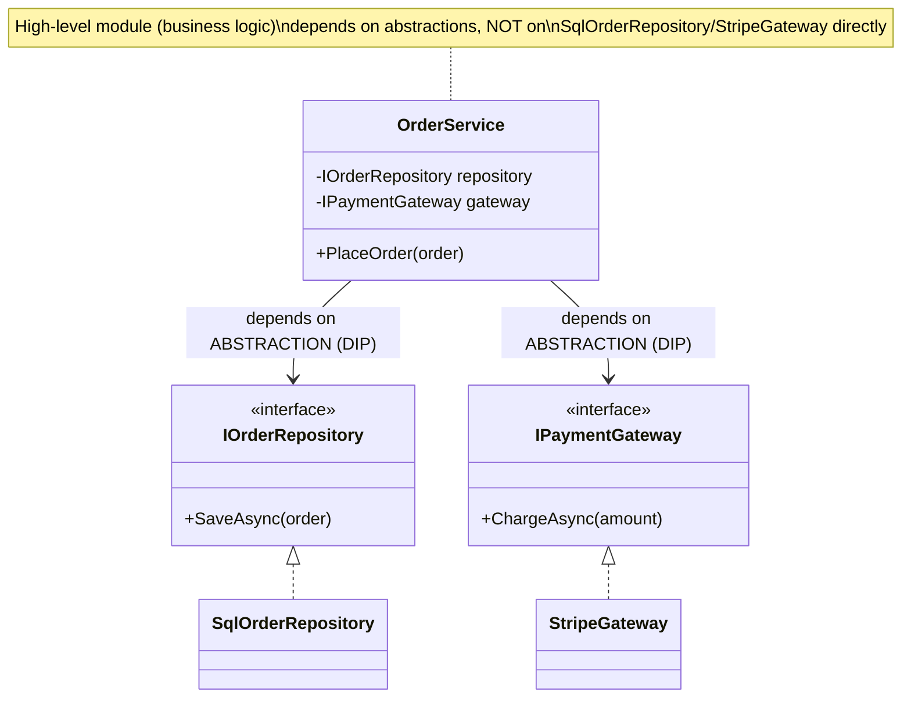

# Module 30 — SOLID Principles Deep Dive

> Domain: SOLID | Level: Beginner → Expert | Prerequisite: [[../09-OOP/01-OOP-Fundamentals-Advanced]] (LSP is one of the five SOLID principles, already covered in depth there)

---

## 1. Fundamentals

### What is SOLID?
SOLID is an acronym for five object-oriented design principles: **S**ingle Responsibility Principle, **O**pen/Closed Principle, **L**iskov Substitution Principle (Module 29 §2.1), **I**nterface Segregation Principle, **D**ependency Inversion Principle — collectively describing how to design classes/modules that are easy to understand, extend, and maintain as a codebase grows, by managing **coupling** and **responsibility boundaries** deliberately.

### Why do these exist?
Each principle addresses a specific, recurring failure mode that emerges as codebases grow: classes that do too much and become hard to change safely (SRP), designs that require modifying existing, working code to add new behavior (OCP), substitutability violations (LSP, Module 29), interfaces forcing unwanted coupling (ISP), and high-level business logic depending directly on low-level implementation details (DIP) — precisely the mechanism behind Module 10's entire dependency-injection discussion.

### When does this matter?
Every non-trivial codebase; the depth matters for applying these principles with genuine judgment (recognizing when a principle is being over-applied into needless abstraction, versus under-applied into a maintenance liability) rather than reciting them as slogans.

### How does it work (30,000-ft view)?
```csharp
// Violates SRP: OrderProcessor both computes business logic AND handles persistence AND sends email
public class OrderProcessor
{
    public void Process(Order order) { /* validate, save to DB, send email -- three responsibilities */ }
}

// SRP-compliant: each class has ONE reason to change
public class OrderValidator { public bool IsValid(Order order) => ...; }
public class OrderRepository { public Task SaveAsync(Order order) => ...; }
public class OrderNotifier { public Task NotifyAsync(Order order) => ...; }
```

---

## 2. Deep Dive

### 2.1 Single Responsibility Principle — "One Reason to Change," Precisely
SRP is frequently mis-stated as "a class should do one thing" — the more precise, original formulation (Robert Martin) is **"a class should have only one reason to change"** — i.e., one class shouldn't be coupled to multiple, independently-varying **stakeholders/concerns** (a class handling both tax-calculation logic, which changes when tax law changes, and report-formatting logic, which changes when the marketing team wants a different layout, has two independent reasons to change, and should be split even if each individual method is small). The "one thing" framing is a useful mnemonic but can lead to over-splitting classes into meaninglessly tiny pieces if taken too literally without the underlying "independently-varying stakeholder" reasoning.

### 2.2 Open/Closed Principle — Open for Extension, Closed for Modification
A module should be extensible with new behavior **without modifying its existing, already-tested source code** — achieved via polymorphism/interfaces (adding a new class implementing an existing interface, rather than adding a new `if`/`switch` branch to an existing method every time a new case is needed). This directly connects to Module 7's discriminated-union discussion: a **sealed** hierarchy with exhaustive pattern matching is a **deliberate, informed violation** of OCP (adding a new case *requires* modifying every exhaustive switch) — chosen specifically because the domain benefits more from compiler-enforced exhaustiveness than from OCP's extensibility-without-modification benefit, a concrete illustration that SOLID principles sometimes trade off against each other, requiring judgment about which trade-off fits a given domain's actual needs.

### 2.3 Interface Segregation Principle — Small, Focused Interfaces
No client should be forced to depend on methods it doesn't use — a large, multi-purpose interface (`IRepository` with `GetById`, `GetAll`, `Add`, `Update`, `Delete`, `BulkImport`, `Archive`) forces every implementation to provide (or stub with `NotImplementedException`) methods irrelevant to its actual use case, and forces every *consumer* to depend on (and be recompiled/retested when) the entire interface's surface, even if it only calls one method. Splitting into focused interfaces (`IReadableRepository<T>`, `IWritableRepository<T>`) — directly the same reasoning as Module 6 §4's covariant-reader/invariant-writer interface split — lets consumers depend on exactly what they need.

### 2.4 Dependency Inversion Principle — the Precise Distinction from "Dependency Injection"
DIP states: **high-level modules should not depend on low-level modules; both should depend on abstractions** — a business-logic class (`OrderService`) should depend on an `IOrderRepository` interface, not directly on a concrete `SqlOrderRepository` class, inverting the naive dependency direction (business logic depending on data-access details) into both depending on a shared abstraction the business logic itself defines the shape of. **Dependency Injection** (Module 10) is the **mechanism** commonly used to *supply* the concrete implementation satisfying that abstraction at runtime — DIP is the *design principle*; DI is one (very common, but not the only) *technique* for satisfying it. This distinction — frequently blurred, with candidates using the terms interchangeably — is a genuine, testable interview differentiator.

### 2.5 How the Five Principles Interact and Sometimes Tension Against Each Other
SRP and OCP work together (small, focused classes are easier to extend without modification); ISP and DIP work together (small interfaces make it easier for high-level modules to depend only on the abstraction slice they actually need); but LSP can tension against OCP (extending a hierarchy with a new subclass that technically satisfies OCP's "no modification needed" while violating LSP's behavioral-contract requirement, exactly Module 29 §4's incident) — recognizing that these principles are not five independent, additive rules but an interacting system requiring holistic judgment is itself a Staff/Principal-level signal.

## 3. Visual Architecture


## 4. Production Example
**Scenario**: A codebase's `NotificationService` had grown to directly implement email-sending, SMS-sending, and push-notification logic all within one class, with a large `switch (channel)` statement dispatching to the appropriate inline logic — every time a new notification channel (Slack, in-app) was added, the team modified this same central class, and a bug introduced while adding Slack support (an off-by-one in the switch's fallthrough logic) caused SMS notifications to silently stop sending for several days, discovered only via a customer complaint, since the SMS code path itself hadn't been touched but was inadvertently affected by the modification to a shared, monolithic class. **Investigation**: root-caused to the `switch` statement's shared, easy-to-accidentally-affect structure — modifying one case's logic had an unintended side effect on an adjacent case due to a missing `break`/fallthrough interaction the change author hadn't anticipated (an OCP violation directly causing a concrete production bug, not just a "code smell"). **Fix**: refactored into an `INotificationChannel` interface with one implementation per channel (`EmailChannel`, `SmsChannel`, `SlackChannel`), each independently deployable/testable, dispatched via a `IEnumerable<INotificationChannel>` collection resolved through DI (Module 10 §2.7's multiple-registration pattern) rather than a shared switch statement — adding a new channel now means adding a new class and one registration line, with **zero modification** to any existing channel's code, structurally eliminating this exact bug class going forward. **Lesson**: OCP violations aren't merely aesthetic — a shared, modification-requiring structure (a large switch statement, a monolithic class) creates a genuine, demonstrated risk that an unrelated addition inadvertently breaks working, untouched functionality, precisely because "unrelated" isn't actually true when everything lives in one, shared, frequently-modified location.

## 5. Best Practices
- Apply SRP based on "independently-varying stakeholders/concerns," not a literal "does exactly one thing" reading that risks over-splitting.
- Prefer polymorphic extension (new implementing classes) over modifying existing, shared dispatch logic (switch statements, large if-chains) for genuinely open-ended, growing case sets.
- Split large interfaces into focused ones matching actual distinct consumer needs (Module 6 §4/§13's reader/writer pattern).
- Recognize DIP as the design principle and DI as one implementation technique — don't conflate the two when explaining architecture decisions.

## 6. Anti-patterns
- A monolithic class/switch statement handling an open-ended, growing set of cases, where adding a new case risks affecting existing ones (§4's incident).
- Splitting classes so granularly (one method per class) that the codebase becomes harder, not easier, to navigate — an SRP over-application.
- A single large interface forcing every implementation to stub out irrelevant methods.
- High-level business logic directly instantiating/depending on concrete low-level classes (`new SqlOrderRepository()`), rather than depending on an abstraction.

## 7. Performance Engineering
SOLID principles are primarily about maintainability/coupling, not runtime performance — interface-based dispatch (DIP, ISP) has the same small virtual-dispatch cost as any polymorphic call (Module 1's devirtualization discussion), generally negligible relative to the design-quality benefit; don't reject SOLID-compliant designs on performance grounds without measuring first, consistent with this course's recurring measure-first discipline.

## 8. Security
An OCP-violating, monolithic authorization-check class (a large switch/if-chain handling many different permission types) carries the same "modifying one case risks silently breaking another" risk as §4's incident, but with security-relevant stakes — a change adding a new permission type could inadvertently weaken an existing, unrelated permission check, directly connecting to Module 29 §8's LSP-and-security discussion.

## 9. Scalability
Not a direct scaling-mechanism concern; SOLID-compliant, loosely-coupled designs are generally easier for multiple teams to work on independently and extend without stepping on each other's code, indirectly supporting a codebase's ability to scale across a growing engineering organization.

---

## 10. Interview Questions

### Basic (10)
1. **Q: What does SOLID stand for?** **A:** Single Responsibility, Open/Closed, Liskov Substitution, Interface Segregation, Dependency Inversion.
2. **Q: What is the Single Responsibility Principle?** **A:** A class should have only one reason to change.
3. **Q: What is the Open/Closed Principle?** **A:** Modules should be open for extension but closed for modification.
4. **Q: What is the Interface Segregation Principle?** **A:** No client should be forced to depend on methods it doesn't use.
5. **Q: What is the Dependency Inversion Principle?** **A:** High-level modules shouldn't depend on low-level modules; both should depend on abstractions.
6. **Q: Is Dependency Injection the same thing as Dependency Inversion?** **A:** No — DIP is the design principle; DI is a common technique/mechanism for satisfying it.
7. **Q: Which SOLID principle did Module 29 already cover in depth?** **A:** Liskov Substitution Principle.
8. **Q: What's a common symptom of an SRP violation?** **A:** A class changes for multiple, unrelated reasons (e.g., both a business-rule change and a formatting change require touching the same class).
9. **Q: What's a common way to achieve OCP compliance?** **A:** Using polymorphism/interfaces — adding a new implementing class instead of modifying existing dispatch logic.
10. **Q: What's a symptom of an ISP violation?** **A:** An implementing class has to stub out/throw `NotImplementedException` for methods it doesn't actually support.

### Intermediate (10)
1. **Q: Why is "a class should do one thing" a risky, oversimplified restatement of SRP?** **A:** Taken literally, it can lead to over-splitting classes into meaninglessly tiny pieces — the more precise formulation ("one reason to change," tied to independently-varying stakeholders/concerns) better captures when splitting is actually warranted versus unnecessary.
2. **Q: Why does a large switch statement handling a growing set of cases violate OCP specifically?** **A:** Adding a new case requires modifying the existing, already-tested switch statement's source code, rather than adding new code without touching what already works — exactly the "closed for modification" violation OCP is meant to prevent.
3. **Q: Why can a sealed, discriminated-union-style hierarchy with exhaustive switches (Module 7) be considered a deliberate OCP violation, and why might that be the right choice anyway?** **A:** Adding a new case genuinely does require modifying every exhaustive switch handling that hierarchy — a real OCP violation — but this trade-off is deliberately accepted because the domain benefits more from compiler-enforced exhaustiveness (catching a missed case at compile time) than from OCP's modification-avoidance benefit, illustrating that OCP isn't an absolute rule but one consideration to weigh against others.
4. **Q: Why does splitting a large `IRepository` interface into `IReadableRepository`/`IWritableRepository` address both ISP and, indirectly, support DIP better?** **A:** ISP is directly addressed since consumers now depend only on the read or write slice they actually need; DIP is indirectly supported because a high-level module depending on the narrower, focused abstraction is more precisely and minimally coupled than depending on the full, broad interface's entire surface.
5. **Q: Why is DIP described as inverting the "naive" dependency direction, specifically?** **A:** Without DIP, a natural, naive design has business logic directly depending on and calling into data-access/infrastructure code (a "top-down" dependency); DIP inverts this so that both the business logic and the infrastructure code depend on a shared abstraction (often defined by/for the business logic's needs), meaning the infrastructure layer now depends on an abstraction the business layer defines, not the other way around.
6. **Q: Why might over-applying ISP lead to interface proliferation that itself becomes a maintainability problem?** **A:** Splitting every interface into extremely narrow, single-method pieces can scatter related behavior across so many small interfaces that understanding a type's full capability requires assembling many fragments — ISP should split along genuinely distinct consumer-need boundaries, not mechanically minimize every interface to one method regardless of whether that reflects real, separate use cases.
7. **Q: How does the §4 production incident demonstrate that OCP violations are not merely stylistic concerns?** **A:** A modification to add a new notification channel inadvertently broke an existing, unrelated channel's functionality (SMS) because both lived in the same shared, modification-requiring switch statement — a concrete, demonstrated production bug directly caused by the OCP violation, not just a hypothetical maintainability concern.
8. **Q: Why does SRP's "reason to change" framing require identifying stakeholders, not just code structure?** **A:** Two pieces of logic can look structurally similar (both are "calculation" methods) while actually varying for entirely different business reasons (tax law changes vs. marketing's formatting preferences) — SRP is about *why* code changes, which requires understanding the business/organizational context driving those changes, not just the code's syntactic shape.
9. **Q: Why does the Dependency Inversion Principle apply even in codebases that don't use a formal DI container?** **A:** DIP is about the *direction of source-code dependencies* (which module's code references which), independent of *how* a concrete implementation is ultimately supplied — a codebase could satisfy DIP via manual "poor man's DI" (constructing and passing dependencies explicitly in a composition root) without any DI container at all, as long as high-level modules still depend only on abstractions.
10. **Q: Why is it valuable to recognize that SOLID principles can tension against each other (§2.5), rather than treating them as five independent, always-compatible rules?** **A:** Real design decisions frequently require choosing which principle's benefit matters more for a specific situation (Module 7's OCP-vs-exhaustiveness trade-off) — presenting them as always-harmonious slogans misses the genuine engineering judgment SOLID is meant to develop, and a Staff/Principal-level engineer should be able to articulate these tensions explicitly, not just recite the five letters.

### Advanced (10)
1. **Q: Diagnose the notification-service OCP violation (§4) from first principles, and design the code-review practice preventing recurrence for future growing-case-set scenarios.**
   **A:** Root cause: an open-ended, growing set of cases (notification channels) implemented as a single, shared, modification-requiring dispatch structure (a switch statement) rather than a polymorphic, independently-extensible design. Safeguard: a code-review heuristic flagging any switch/if-chain whose case set is expected to grow over time (new payment methods, new notification channels, new file-format exporters) as a signal to consider a polymorphic/strategy-pattern refactor **before** the case set grows large enough for this exact "modifying one case affects another" risk to materialize, rather than waiting for an incident to prompt the refactor reactively.
2. **Q: Explain precisely how the Interface Segregation Principle and the Dependency Inversion Principle work together in a well-designed layered architecture, using a concrete example beyond a simple repository split.**
   **A:** Consider an `IOrderNotifier` interface a high-level `OrderService` depends on (DIP) — if it's segregated correctly (ISP) into exactly the notification capability `OrderService` actually needs (`NotifyOrderPlaced(order)`) rather than a broad `INotificationService` also including unrelated capabilities (`SendMarketingEmail`, `SendPasswordReset`), `OrderService`'s dependency is both **inverted** (depends on an abstraction, not a concrete notifier) and **minimally coupled** (depends on exactly the slice of notification capability relevant to its own responsibility) — the two principles compound: DIP ensures the *direction* of dependency is correct; ISP ensures the *abstraction itself* is appropriately narrow, together producing a dependency that's both correctly-directed and minimally-scoped.
3. **Q: Design a refactoring strategy for the §4 incident's fix that avoids a risky, all-at-once "big bang" rewrite of the entire notification dispatch mechanism.**
   **A:** Extract one notification channel (the most recently problematic, or the simplest) into its own `INotificationChannel` implementation first, leaving the remaining channels in the existing switch statement temporarily, with the dispatcher checking the new interface-based channels first and falling back to the legacy switch for anything not yet migrated — incrementally extract each remaining channel into its own class over subsequent, independently-reviewable changes, removing the legacy switch statement entirely only once every channel has been migrated — directly the same incremental, "expand, don't break" migration pattern recurring throughout this course, applied here to an OCP refactor specifically.
4. **Q: Explain a scenario where naively applying DIP (introducing an abstraction for every dependency) adds unnecessary complexity without a corresponding benefit.**
   **A:** A class that will only ever have one, stable, unlikely-to-change concrete dependency (e.g., a wrapper around `DateTime.UtcNow` for testability is a legitimate, common exception, but a wrapper around a genuinely stable, unlikely-to-vary utility like `Math.Round` with no plausible alternative implementation or testing need) gains no real benefit from an introduced `IRoundingStrategy` abstraction — the abstraction adds an extra layer of indirection and a file/interface to maintain without ever being substituted with a different implementation in practice; DIP is justified specifically when there's a genuine need for substitutability (testing, multiple real implementations, decoupling from an external system) — applying it reflexively to every single dependency regardless of actual variability need is the "premature abstraction" anti-pattern this course has repeatedly warned against (Module 1's opening guidance, restated here).
5. **Q: How would you reason about whether a proposed class split satisfies genuine SRP compliance versus merely scattering related logic across multiple files without an actual coupling-reduction benefit?**
   **A:** Verify each resulting class can genuinely be modified, tested, and reasoned about **independently** of the others for its own specific reason-to-change — if two "split" classes still need to change together in lockstep for the same underlying reason (e.g., splitting `OrderValidator` into `OrderFieldValidator` and `OrderBusinessRuleValidator` when both actually always change together whenever the single underlying validation policy changes), the split hasn't achieved genuine independence, it's merely relocated the same coupling across more files — true SRP compliance is measured by independent-changeability, not merely by file/class count.
6. **Q: Explain how the Liskov Substitution Principle (Module 29) and the Open/Closed Principle can come into direct conflict, using a concrete scenario beyond Module 7's discriminated-union example.**
   **A:** A codebase adds a new `Penguin : Bird` subclass to an existing, OCP-compliant hierarchy (extending without modifying any existing code, satisfying OCP) — but if the base `Bird` class's contract implicitly assumes `Fly()` is always meaningfully callable (as much pre-existing calling code might reasonably assume for a `Bird`), `Penguin`'s override (throwing `NotSupportedException`, or silently doing nothing) satisfies OCP's "no modification needed" while violating LSP's "substitutable without altering correctness" — this is precisely why OCP's "closed for modification, open for extension" framing, taken alone, doesn't guarantee a *correct* extension, only a *non-modifying* one; LSP must be independently verified for any OCP-compliant extension, exactly the tension recurring in Module 7's sealed-hierarchy trade-off, now shown via a different, classic example.
7. **Q: Design a metric or code-review signal that would have flagged the §4 notification-service class as an OCP-risk candidate before the incident occurred.**
   **A:** Track cyclomatic complexity/branch count growth over time for dispatch-shaped methods (switch statements, long if-else chains) specifically — a method whose branch count has grown across multiple, unrelated PRs (each adding "just one more case") is a strong, mechanically-detectable signal of exactly the accumulating-shared-structure risk this incident demonstrates; flagging any dispatch method exceeding a branch-count threshold, combined with evidence of it being modified by multiple different feature PRs over time, as a refactor candidate **before** the case set grows large enough for an incident like §4's to occur, converts a reactive, incident-driven fix into a proactive, metric-driven one.
8. **Q: Explain why the Dependency Inversion Principle is foundational to unit testing, beyond just "it lets you use mocks."**
   **A:** Without DIP, a high-level module directly instantiating its low-level dependencies (`new SqlOrderRepository()` inside `OrderService`) has no way to substitute a test double **at all** without modifying `OrderService`'s own source code — DIP's abstraction-based design is what makes substituting a test double (a mock/stub/fake implementing the same interface) possible without touching the class under test, which is the actual mechanical prerequisite for isolated unit testing, not merely a convenience mocking frameworks happen to rely on.
9. **Q: A team proposes measuring "SOLID compliance" via a static-analysis tool counting interface implementations, class sizes, and dependency-injection usage as a single composite score, gated in CI. Evaluate this as a Principal Engineer.**
   **A:** Push back on reducing SOLID to a purely mechanical, composite metric — as Advanced Q4/Q5 demonstrate, genuine SOLID compliance requires judgment about actual variability/coupling-reduction benefit, which a static count of interfaces/class sizes cannot distinguish from superficial, benefit-free abstraction proliferation (an anti-pattern in its own right, per Advanced Q4); recommend targeted, judgment-requiring code-review practices (the branch-count/dispatch-growth signal from Advanced Q7, explicit SRP "reason to change" discussion in reviews) over a single automated composite score that could easily reward over-engineering (many tiny classes, unnecessary interfaces) as highly as it rewards genuine SOLID compliance.
10. **Q: As a Principal Engineer, how would you teach SOLID to a team in a way that builds genuine design judgment rather than slogan-level pattern-matching, directly addressing this module's recurring theme?**
    **A:** Teach each principle paired with both a concrete production incident it would have prevented (this module's §4 for OCP, Module 29's §4 for LSP) **and** a concrete scenario where over-applying it creates unnecessary complexity (Advanced Q4's DIP-overuse example, the over-splitting SRP concern) — presenting both the failure-to-apply and the over-application failure modes together, rather than teaching each principle only as an unconditionally-good practice, is what builds the actual engineering judgment (when does this principle's benefit outweigh its complexity cost, for *this* specific situation) that distinguishes a Principal Engineer's application of SOLID from a junior engineer's mechanical recitation of the five letters.

---

## 11. Coding Exercises

### Easy — Fix an SRP violation by separating independently-varying concerns
```csharp
// BEFORE: two independently-varying concerns (tax calculation, report formatting) in one class
public class InvoiceProcessor
{
    public decimal CalculateTax(Invoice invoice) => invoice.Subtotal * GetTaxRate(invoice.Region);
    public string FormatForDisplay(Invoice invoice) => $"Invoice #{invoice.Id}: ${invoice.Total:F2}";
}

// AFTER: split along "reason to change" -- tax law changes independently of display formatting
public class TaxCalculator { public decimal CalculateTax(Invoice invoice) => invoice.Subtotal * GetTaxRate(invoice.Region); }
public class InvoiceFormatter { public string FormatForDisplay(Invoice invoice) => $"Invoice #{invoice.Id}: ${invoice.Total:F2}"; }
```

### Medium — Fix an OCP violation with a strategy-pattern refactor (§4)
```csharp
public interface INotificationChannel
{
    string ChannelName { get; }
    Task SendAsync(Notification notification);
}

public class EmailChannel : INotificationChannel
{
    public string ChannelName => "Email";
    public Task SendAsync(Notification notification) => /* email-specific logic */ Task.CompletedTask;
}
public class SmsChannel : INotificationChannel
{
    public string ChannelName => "SMS";
    public Task SendAsync(Notification notification) => /* SMS-specific logic, UNTOUCHED by future additions */ Task.CompletedTask;
}

public class NotificationDispatcher
{
    private readonly IEnumerable<INotificationChannel> _channels; // resolved via DI, Module 10 §2.7
    public NotificationDispatcher(IEnumerable<INotificationChannel> channels) => _channels = channels;

    public async Task DispatchAsync(Notification notification)
    {
        var channel = _channels.FirstOrDefault(c => c.ChannelName == notification.PreferredChannel);
        if (channel is not null) await channel.SendAsync(notification);
    }
}
// Adding Slack support: ONE new class (SlackChannel), ONE registration line -- ZERO modification
// to EmailChannel or SmsChannel's existing, working code.
```

### Hard — Fix an ISP violation by splitting a fat repository interface
```csharp
// BEFORE: forces every implementation/consumer to depend on the ENTIRE surface
public interface IRepository<T>
{
    Task<T?> GetByIdAsync(string id);
    Task<IEnumerable<T>> GetAllAsync();
    Task AddAsync(T item);
    Task UpdateAsync(T item);
    Task DeleteAsync(string id);
    Task BulkImportAsync(IEnumerable<T> items);
}

// AFTER: segregated by actual consumer need
public interface IReadableRepository<T>
{
    Task<T?> GetByIdAsync(string id);
    Task<IEnumerable<T>> GetAllAsync();
}
public interface IWritableRepository<T> : IReadableRepository<T>
{
    Task AddAsync(T item);
    Task UpdateAsync(T item);
    Task DeleteAsync(string id);
}
public interface IBulkImportable<T>
{
    Task BulkImportAsync(IEnumerable<T> items);
}
// A read-only reporting service depends ONLY on IReadableRepository<T> -- never recompiled/retested
// when BulkImportAsync's signature changes, since it doesn't even know that method exists.
```

### Expert — Demonstrate DIP with a composition root, no DI container required (Advanced Q9)
```csharp
// Business logic (high-level module) depends ONLY on abstractions -- DIP satisfied
// regardless of HOW the concrete implementations are ultimately supplied.
public interface IOrderRepository { Task SaveAsync(Order order); }
public interface IPaymentGateway { Task<bool> ChargeAsync(decimal amount); }

public class OrderService
{
    private readonly IOrderRepository _repository;
    private readonly IPaymentGateway _gateway;
    public OrderService(IOrderRepository repository, IPaymentGateway gateway)
    {
        _repository = repository; _gateway = gateway;
    }
    public async Task PlaceOrderAsync(Order order)
    {
        if (await _gateway.ChargeAsync(order.Total)) await _repository.SaveAsync(order);
    }
}

// "Poor man's DI" -- manual composition root, NO DI container library at all:
var repository = new SqlOrderRepository(connectionString);
var gateway = new StripeGateway(apiKey);
var orderService = new OrderService(repository, gateway); // manually wired, but DIP is STILL satisfied
```
**Discussion**: `OrderService`'s source code has zero reference to `SqlOrderRepository`/`StripeGateway` at all — DIP is fully satisfied here despite using no DI container, framework, or `Microsoft.Extensions.DependencyInjection` whatsoever, directly demonstrating Advanced Q9's point that DIP is about dependency *direction*, entirely independent of the *mechanism* (a full DI container, manual composition, or any other wiring approach) used to supply concrete implementations at the application's entry point.

---

## 12–17. System Design / LLD / Debugging / Decision / Case Study / Principal

A notification platform (§4) replaces its monolithic, switch-statement-based channel dispatcher with an `INotificationChannel`-per-channel design (Medium exercise), resolved via DI's multiple-registration pattern (Module 10 §2.7), and applies a proactive branch-count/dispatch-growth code-review signal (Advanced Q7) to catch similar OCP-risk patterns in other growing case sets before they cause an incident. The signature production incident (§4) — an unrelated channel addition silently breaking an existing, untouched channel due to shared switch-statement structure — is this module's central lesson: OCP violations are not merely aesthetic code-smell concerns, they create genuine, demonstrated risk that unrelated modifications inadvertently affect working functionality, precisely because a shared, modification-requiring structure means "unrelated" changes aren't actually isolated from each other. Principal-level guidance: teach every SOLID principle paired with both a failure-to-apply incident and an over-application anti-pattern, building genuine engineering judgment about when each principle's benefit outweighs its complexity cost, rather than slogan-level pattern-matching.

## 18. Revision
**Key takeaways**: SRP = "one reason to change" (tied to independently-varying stakeholders), not literally "does one thing." OCP = extend via new code (polymorphism), not by modifying existing, shared dispatch logic — violated OCP has demonstrated, concrete production-bug risk (§4), not just aesthetic cost. ISP = split interfaces along genuine, distinct consumer-need boundaries, not mechanically to one method each. DIP = dependency *direction* (high-level and low-level both depend on abstractions) — distinct from Dependency Injection, which is one *mechanism* (among several, including manual composition) for supplying concrete implementations. The five principles can tension against each other (OCP vs. LSP, Module 7's exhaustiveness trade-off) — genuine mastery requires judgment about these interactions, not rote recitation.

---

**Next**: Continuing autonomously to Module 31 — Design Patterns (Creational, Structural, Behavioral) launching the `11-Design-Patterns` domain.
