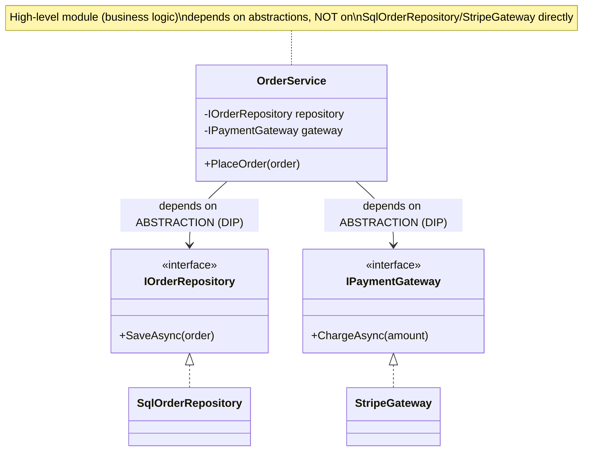
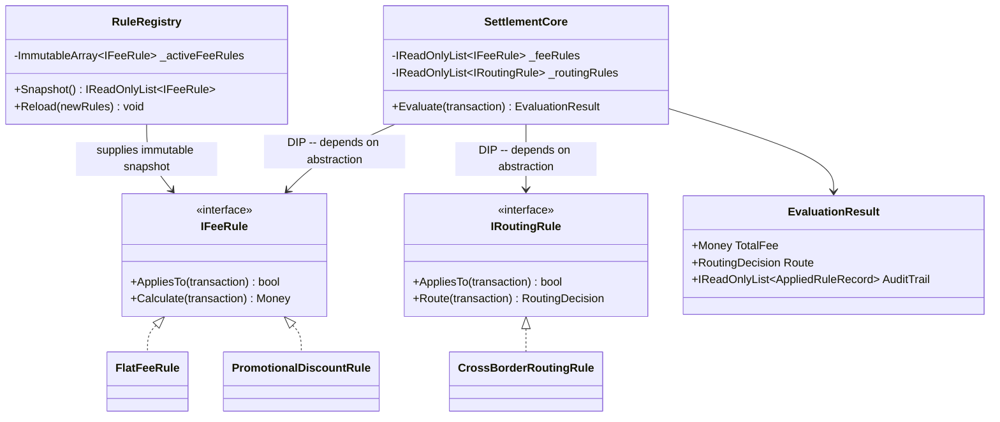
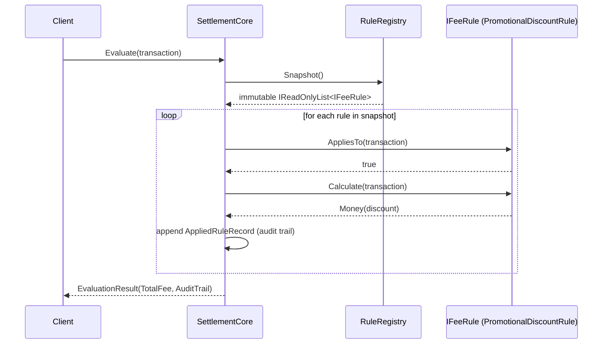

# Module 30 — SOLID Principles Deep Dive

> Domain: SOLID | Level: Beginner → Expert | Prerequisite: [[../09-OOP/01-OOP-Fundamentals-Advanced]] (LSP is one of the five SOLID principles, already covered in depth there)

---

## 1. Topic Description

### Definition

SOLID is five design principles that together describe how to structure object-oriented code so that change is localised. **SRP** says a class should have one reason to change — one *actor* it answers to. **OCP** says a module should be extensible without modifying its existing code. **LSP** says subtypes must be usable wherever their base type is expected. **ISP** says clients should not be forced to depend on methods they do not use. **DIP** says high-level policy should depend on abstractions, and those abstractions should be owned by the policy rather than by the details. They are heuristics about *coupling and change*, not laws, and applying them mechanically produces worse designs than applying none.

### Core sub-concepts

- **Single Responsibility Principle** — "one reason to change" restated as *one actor*; cohesion as the real measure; why "does one thing" is a misleading paraphrase.
- **Open/Closed Principle** — extension via polymorphism, strategy or composition; the cost of predicting the wrong extension axis.
- **Liskov Substitution Principle** — preconditions, postconditions, invariants and exception contracts; substitutability as a *behavioural* not a syntactic property.
- **Interface Segregation Principle** — fat interfaces forcing dummy implementations; role interfaces defined by the consumer.
- **Dependency Inversion Principle** — direction of source-code dependency versus direction of runtime flow; who owns the abstraction.
- **DIP versus dependency injection versus IoC containers** — a principle, a technique and a tool, frequently conflated.
- **Cohesion and coupling** — the underlying properties all five principles are proxies for.
- **The reason-to-change test** — identifying actors and change axes to decide whether a class does too much.
- **Extension points and their cost** — every seam is a commitment; speculative generality as the failure mode of OCP.
- **Role interfaces versus header interfaces** — consumer-shaped contracts versus mirrored implementations.
- **Composition over inheritance as the enabling mechanic** — how strategies and decorators deliver OCP without hierarchies.
- **Testability as a symptom** — hard-to-test code as feedback about SRP and DIP violations.
- **When SOLID does not apply** — DTOs, data pipelines, small scripts, and stable code with a single implementation.
- **Interaction between principles** — how ISP and DIP together produce small consumer-owned contracts, and how OCP without LSP produces unsafe extension.

### Where it fits

SOLID sits directly above the OOP mechanics covered in `09-OOP` — it presupposes encapsulation, polymorphism and substitutability and tells you how to arrange them. It sits directly below the GoF patterns in `11-Design-Patterns`, most of which are concrete mechanisms for satisfying one or more of these principles: strategy and decorator implement OCP, adapter serves ISP, and the abstract factory serves DIP. Architecturally, DIP is the principle that makes layered, hexagonal and clean architectures possible at all, because it is what allows a domain layer to be depended upon without depending on infrastructure.

### Why it matters at scale

These principles matter in proportion to how many people change a codebase and for how long. In a large system, an SRP violation means one class is edited by three teams for unrelated reasons, so merge conflicts and regressions accumulate and nobody owns it. An LSP violation is worse: it breaks callers that never referenced the offending subtype, so the failure appears far from the change and defies attribution. A DIP violation means the business logic cannot be tested or reused without a database, which quietly makes the test suite slow and unreliable, which makes the team stop trusting it. Conversely, over-application is equally costly — a codebase where every class has an interface and every behaviour is a strategy has traded one kind of rigidity for a maze of indirection that is genuinely harder to change.

### Common pitfalls / anti-patterns

- **Reading SRP as "a class should do one thing"** — leads to classes with a single method and no cohesion, scattering one behaviour across many types; the principle is about *one reason to change*, meaning one actor requesting changes.
- **Speculative OCP** — building extension points for variation that never arrives, guessing the wrong axis, and paying indirection cost permanently while the real change still requires modification.
- **A subclass that throws `NotSupportedException`** — the textbook LSP violation; the type claims a contract it does not honour, so substitution breaks callers who were correct against the base.
- **Header interfaces mirroring a single implementation** — `IOrderService` with the same methods as `OrderService`, which decouples nothing because the interface's shape is dictated by the implementation.
- **Splitting an interface by mechanism rather than by client role** — satisfies ISP superficially while every consumer still needs all the pieces, so nothing is gained.
- **Confusing DIP with "use a DI container"** — injecting a concrete type through a constructor still points the dependency at a detail; inversion is about *who owns the abstraction*, not about how instances are supplied.
- **Abstractions owned by the infrastructure layer** — an interface defined next to its database implementation and referenced by the domain inverts nothing; the domain still depends on the detail's shape.
- **Applying SOLID to DTOs, mappers and data pipelines** — adds interfaces and indirection to code with no invariants and no variation, producing ceremony rather than flexibility.
- **Treating the principles as a checklist in code review** — produces mechanical compliance (an interface per class, a strategy per branch) while the actual coupling problems go unexamined.

---

## 2. Beginner (10 Q&A)

**Q1. What does "one reason to change" actually mean in SRP?**
**A:** It means one *actor* — one group of stakeholders whose requests cause this class to change. A class that formats a report for finance and also calculates the figures for accounting has two actors, so a change requested by either can break the other. The common paraphrase "does one thing" is misleading, because it drives people to split classes by verb into fragments with no cohesion. The useful test is to ask who would ask for a change to this class, and whether the answer is more than one group.
*Follow-up: A class calculates tax and also persists the result. Same actor or different?*

**Q2. Give a concrete example of the Open/Closed Principle done properly.**
**A:** A payment processor that dispatches to a strategy per payment method: adding a new method means adding a class and registering it, with no edit to the existing dispatch code. It is closed to modification because existing, tested code is untouched, and open to extension because a new behaviour plugs in. What makes it genuine rather than speculative is that the variation axis — payment methods — is one you already know varies, because you have several. Building the same seam for something that has one implementation and no roadmap is the failure mode.
*Follow-up: A new payment method needs an extra piece of data the others don't have. Does that break OCP?*

**Q3. How would you detect an LSP violation without a formal specification?**
**A:** Look for overrides that throw for supported operations, that add validation the base did not have, or that silently do nothing. Then look at the callers: type tests or casts on a base-typed reference are strong evidence, because they mean someone learned that the subtypes are not interchangeable and coded around it. A third signal is documentation or comments saying "do not use X with Y", which is a substitutability constraint expressed in prose because it could not be expressed in the type system.
*Follow-up: You find a `switch` on the concrete type inside a method that takes the base type. What's the fix?*

**Q4. What problem does the Interface Segregation Principle actually solve?**
**A:** Being forced to depend on — and often implement — methods you do not use. A fat interface means every implementer must supply all of it, producing empty or throwing methods, and every consumer recompiles or is affected when any part of it changes. Segregating by *client role* means each consumer depends only on what it uses, so changes are localised. The key detail is that the split should follow how the interface is consumed, not how the implementation is organised, or you get more interfaces with no reduction in coupling.
*Follow-up: One class legitimately implements four role interfaces. Is that a smell?*

**Q5. What is actually being "inverted" in the Dependency Inversion Principle?**
**A:** The direction of the *source-code* dependency relative to the direction of control flow. Normally high-level policy calls a low-level detail and therefore depends on it; DIP inverts that by having the policy define an abstraction that the detail implements, so at compile time the detail depends on the policy while at runtime the policy still calls the detail. The critical part — and the part most often missed — is *ownership*: the abstraction must belong to the high-level module, or you have merely added an interface without inverting anything.
*Follow-up: Where should the repository interface live — with the domain or with the data-access implementation?*

**Q6. Is dependency injection the same as dependency inversion?**
**A:** No. Dependency injection is a technique for supplying collaborators from outside; dependency inversion is a principle about which module owns the abstraction. You can inject a concrete type through a constructor and satisfy DI while violating DIP entirely, because the dependency still points at a detail. Equally you can satisfy DIP with a manually-constructed object graph and no container at all. Conflating them is why so many codebases have containers and interfaces everywhere while the domain still depends on infrastructure types.
*Follow-up: Show me a DI-satisfying, DIP-violating constructor signature.*

**Q7. When does SOLID not apply?**
**A:** To code with no invariants and no variation: DTOs, mapping code, configuration objects, data pipelines and short-lived scripts. Adding interfaces, strategies and layers there produces ceremony protecting nothing and makes the code harder to read. It also applies weakly to code that genuinely has one implementation and no plausible second one — the abstraction can be added when the second arrives, and adding it earlier bakes in a guess. The principles are about managing change in code that changes; stable, simple code needs less of them.
*Follow-up: A team applies interface-per-class to their DTO assembly. What's your argument?*

**Q8. How do SOLID and testability relate?**
**A:** Difficulty writing a test is usually a symptom of an SRP or DIP violation. A class with several responsibilities needs elaborate setup because each test drags in all of them; a class that constructs its own dependencies cannot be isolated at all. So when a test requires a database, a clock or a network call to exercise a business rule, the design is telling you that policy and detail are entangled. The productive response is to treat the test difficulty as feedback about coupling rather than as a reason to reach for a heavier mocking framework.
*Follow-up: A class is hard to test because it calls `DateTime.Now`. What's the SOLID diagnosis?*

**Q9. Which SOLID principle do you think is most often violated, and why?**
**A:** SRP, because it is the vaguest and because violations accumulate gradually — nobody creates a 2,000-line service; it grows one reasonable addition at a time, each defensible in isolation. LSP violations are rarer but far more damaging when they occur, because they break code that never referenced the change. DIP is the most often *claimed* and least often achieved, since teams add interfaces and a container and believe they have inverted dependencies while the abstractions still live with the implementations. Naming that distinction is usually the most useful thing in a real review.
*Follow-up: How would you catch SRP drift before a class reaches 2,000 lines?*

**Q10. How do the five principles relate to each other?**
**A:** They are all proxies for low coupling and high cohesion, approached from different angles. SRP and ISP are about not bundling unrelated things — one at the class level, one at the interface level. OCP and DIP are about depending on stable abstractions so change is additive. LSP is the constraint that makes OCP safe: extension via polymorphism only works if the subtypes are genuinely substitutable. So OCP without LSP gives you extension points that break callers, and DIP without ISP gives you inverted dependencies on interfaces that are too big to be stable.
*Follow-up: Which pair would you say is most commonly satisfied together by accident?*

---

## 3. Intermediate (10 Q&A)

**Q1. A service class has grown to 1,500 lines. Walk me through splitting it.**
**A:** I would look for clusters rather than split by size: fields used together by the same subset of methods indicate a hidden collaborator, and methods that change for different reasons indicate different actors. Extract one cluster at a time into a collaborator with the original delegating, so callers are unaffected and each step is verifiable. The mistake to avoid is splitting by layer or naming convention — `OrderValidator`, `OrderMapper`, `OrderCalculator` — because if they always change together you have gained files and lost locality. I would validate each extraction by asking whether the two parts can now change independently.
*Follow-up: After splitting, three of the new classes are always modified together. What does that tell you?*

**Q2. How do you decide where to put an extension point?**
**A:** Only where variation has actually occurred, or is genuinely committed on the roadmap — because each seam costs indirection permanently, and the axis you guess is frequently not the one that varies. The practical heuristic is the rule of three: duplicate, duplicate again, and on the third instance you can see the real shape of the variation and abstract it correctly. Abstracting on the first instance means designing against one example, which reliably produces a seam in the wrong place that still requires modification when the real second case arrives.
*Follow-up: You waited for the third case and now the refactor is expensive. Was waiting still right?*

**Q3. How do you apply DIP in a layered application without it becoming ceremony?**
**A:** Apply it at the boundaries that matter — the domain defining the repository and gateway interfaces it needs, with infrastructure implementing them — and not between every internal collaborator. That gives you the property DIP exists for: the domain is testable and reusable without infrastructure, and the database can be replaced without touching business rules. Inverting every internal dependency inside a layer adds indirection with no boundary being protected. The test I apply is whether the abstraction is protecting a genuine change axis or an imagined one.
*Follow-up: An internal helper class is behind an interface with one implementation. Keep it or remove it?*

**Q4. How would you refactor a fat interface that many classes implement?**
**A:** Segregate by consumer role rather than by method category: look at what each *client* actually calls, and define an interface per cohesive role, then have the implementation implement several. That way each consumer depends only on what it uses, and adding a method for one role does not disturb the others. To do it safely on a widely-implemented interface, I would introduce the role interfaces alongside, migrate consumers to depend on the narrower ones, then remove the fat interface once nothing references it. The verification is that each new interface has a consumer that uses all of it.
*Follow-up: One consumer genuinely needs all twelve methods. Does that invalidate the segregation?*

**Q5. Where does SRP conflict with practicality, and how do you resolve it?**
**A:** When splitting produces classes that must always change together — the split has increased the number of files and the distance between related code without decoupling anything. It also conflicts when the "responsibilities" are cohesive parts of one behaviour that only make sense together, in which case a large class is honest. I resolve it by testing whether the parts can genuinely change independently and be understood separately; if not, keeping them together is the better design, and I would rather defend a cohesive 400-line class than four artificial 100-line ones.
*Follow-up: A reviewer insists the 400-line class violates SRP. How do you make the case?*

**Q6. Give a real LSP violation you'd expect to find in production code and its fix.**
**A:** A read-only collection type inheriting from a mutable collection interface and throwing on `Add`, or a caching decorator that changes an operation's exception behaviour so callers' `catch` blocks no longer match. Another common one is a subclass that tightens validation — a `PremiumOrder` rejecting quantities the base `Order` accepted — so code correct against `Order` fails unpredictably depending on which instance it received. The fix in each case is to correct the *model*: separate the mutable and immutable contracts, or represent the stricter type as a different type rather than a subtype.
*Follow-up: The stricter subtype is required by an existing framework's base class. What are your options?*

**Q7. How do SOLID principles interact with performance?**
**A:** Mostly not at all — indirection through an interface is nanoseconds against the milliseconds of real work in a typical request. They interact where an abstraction boundary sits inside a genuinely hot loop, since virtual and interface calls resist inlining, and where excessive object graphs increase allocation. The correct response is to measure the specific path and place the boundary elsewhere, rather than to adopt a general policy against abstraction. What I would push back on hardest is removing interfaces across a codebase for performance without a profile, because the readability cost is certain and the gain is usually unmeasurable.
*Follow-up: A profile shows interface dispatch at 6% in a hot path. What do you do?*

**Q8. How do you introduce SOLID thinking to a team without producing dogma?**
**A:** By anchoring each principle to a concrete failure the team has actually experienced — the class three teams keep conflicting in, the subclass that broke a caller, the test that needs a database to check a calculation. Principles taught as rules become checklists; principles taught as explanations of remembered pain change judgement. I would also be explicit about where they do *not* apply, because a team that has just learned SOLID will otherwise apply it to DTOs and mappers. And I would review for coupling and change locality rather than for principle compliance, so the conversation stays on the real property.
*Follow-up: A reviewer starts rejecting PRs for "SRP violations" with no concrete harm identified. How do you intervene?*

**Q9. How do you tell a useful abstraction from a speculative one in review?**
**A:** Ask what the second implementation is. If there is one in the codebase, or a committed requirement, the abstraction is grounded. If the answer is "we might need to swap the database" or "in case we change providers", it is speculative — and the abstraction is being shaped by one implementation anyway, so it would not survive the swap it was built for. The other signal is whether the interface's shape is defined by the consumer's needs or mirrors the implementation's methods, since the latter means no design work happened.
*Follow-up: The team's counter is that adding the abstraction later is expensive. Is that true?*

**Q10. How do SOLID and the GoF patterns relate in practice?**
**A:** Most patterns are concrete mechanisms for satisfying a principle: strategy and decorator deliver OCP, adapter serves ISP by narrowing a foreign interface, abstract factory serves DIP by letting policy create details without naming them. That relationship is useful because it gives the *reason* to apply a pattern — the goal is the coupling property, and the pattern is one way to reach it. Reaching for a pattern without that reasoning produces the classic failure: a codebase full of correctly-implemented patterns that is nonetheless hard to change, because the patterns were applied where no variation existed.
*Follow-up: When would you satisfy OCP without using any named pattern?*

---

## 4. Expert / Architect (10 Q&A)

**Q1. How do you use SOLID as an architectural tool rather than a class-level one?**
**A:** The same properties scale up: a module or service should have one reason to change (one actor or capability), should be extensible without modifying its core, should depend on abstractions it owns rather than on another team's implementation details, and should expose narrow role-based contracts rather than a fat API. DIP in particular is the principle behind hexagonal and clean architecture — the domain owning its ports is what makes infrastructure replaceable. Framed that way, SOLID gives you a vocabulary for arguing about service boundaries that is more precise than "coupling", and it maps cleanly onto team ownership.
*Follow-up: Two services always change together for the same business reason. What does SRP say about that boundary?*

**Q2. How do you evaluate whether a codebase's abstractions are earning their cost?**
**A:** By counting implementations and tracing changes. An interface with one implementation and no test seam is pure cost; an abstraction whose consumers all use every member and whose shape mirrors its single implementer has not decoupled anything. I would trace a few real changes and see whether the abstractions localised them or whether each change still touched both sides of every boundary. Where a boundary is crossed by every change, it is not a boundary. That evidence is far more persuasive in a review than an appeal to principle.
*Follow-up: You find 200 single-implementation interfaces. Do you remove them, and how do you decide?*

**Q3. How do you handle a team that has over-applied SOLID into unreadable indirection?**
**A:** Establish the cost concretely — time to trace a call path, onboarding time, the number of files touched by a trivial change — because the team believes they are doing good work and an abstract argument will not land. Then remove abstractions where there is a single implementation and no test boundary, starting somewhere visible so the improvement is felt. I would also replace the rule they are following with a better one: abstraction requires a second implementation or a boundary worth testing across. The tone matters here, because over-application usually comes from conscientiousness rather than carelessness.
*Follow-up: Removing an interface breaks a mocking-based test suite. How do you sequence that?*

**Q4. Where does SOLID actively conflict with other architectural goals?**
**A:** With performance in hot paths, where abstraction boundaries resist devirtualisation; with simplicity in small systems, where the indirection costs more than the change-locality it buys; and with framework constraints, where an ORM or serialiser demands shapes a well-encapsulated model would not choose. It also conflicts with data-oriented design, where behaviour deliberately lives apart from data for cache-locality reasons. The mature position is that SOLID is a set of defaults for code that many people will change over years, and that specific, measured contexts legitimately override defaults.
*Follow-up: A high-throughput component would benefit from data-oriented design. How do you contain that decision?*

**Q5. How do you review for coupling rather than for principle compliance?**
**A:** Ask what change this code makes hard. Look at how many files a plausible next change touches; whether a rule is enforced in one place or several; whether the class can be tested without infrastructure; whether adding a case requires editing existing code. Those questions get at the property the principles are proxies for, and they produce actionable feedback where "this violates SRP" produces argument. I would also review the *direction* of dependencies at module boundaries, because that is where the damage is largest and where individual code review is least likely to look.
*Follow-up: How would you make dependency direction visible enough to review automatically?*

**Q6. How do you set expectations about SOLID when hiring and calibrating engineers?**
**A:** I look for whether a candidate can say when a principle does *not* apply, because that indicates they have used it rather than memorised it. Reciting definitions is table stakes; the discriminator is explaining a case where they deliberately did not abstract, or where they collapsed an abstraction that was not paying for itself. I would also probe LSP specifically, since it is the least-understood and the one whose violations cause the most damage. A candidate who treats SOLID as a checklist will produce over-abstracted code, which is a real and expensive failure mode.
*Follow-up: A candidate says "I always create an interface for every service." How do you probe that?*

**Q7. How do the principles apply to code you don't own — libraries, frameworks, legacy?**
**A:** Through boundaries: wrap a third-party dependency behind an abstraction *you* own, shaped by your needs rather than mirroring theirs, which is DIP plus ISP applied at an integration seam. That gives you a single place to absorb their breaking changes and a substitution point for testing. For legacy code you cannot restructure, the same technique creates a seam at the edge of the mess so new code depends on your contract rather than on their shape. I would apply it selectively at boundaries that are genuinely volatile, since wrapping everything is its own form of over-application.
*Follow-up: The wrapper ends up mirroring the library's interface exactly. What went wrong?*

**Q8. What is the relationship between SOLID and team topology?**
**A:** SRP at module scale is really about ownership: a module changed by two teams for unrelated reasons is a coordination cost paid on every change, and it is the same failure as a class with two actors. DIP determines whether one team can change its implementation without breaking another, which is what makes independent deployment possible. So the principles are a technical vocabulary for a socio-technical property, and boundaries drawn against them produce systems where teams block each other. I would use them explicitly when arguing about service ownership, because they make the coupling argument concrete.
*Follow-up: A shared library is edited by five teams. How do you assess whether that's a problem?*

**Q9. How would you approach a system where LSP violations are pervasive?**
**A:** Find them first, because they are usually invisible: search for type tests on base-typed references, overrides that throw, and comments describing which subtypes are safe where. Each one marks a place where the abstraction promises more than the implementations deliver. Then fix the *model* rather than the symptom — usually by splitting a conflated hierarchy into separate types with separate contracts, or by replacing inheritance with composition so no substitutability claim is made. I would prioritise by blast radius, since an LSP violation on a widely-used base type is a latent defect in every caller.
*Follow-up: Fixing the hierarchy requires changing a public API. How do you sequence that?*

**Q10. What separates an excellent answer from an adequate one on SOLID?**
**A:** An adequate answer defines the five principles correctly. An excellent one treats them as heuristics for coupling and change, gives a concrete violation and its actual production consequence for each, explains where each does not apply, distinguishes DIP from dependency injection and identifies who must own the abstraction, and can describe a case where they deliberately violated one and why. It also connects the principles to change locality and team ownership rather than to file structure. The distinguishing quality is judgement about *when* — because mechanical application produces codebases that satisfy every principle and are still hard to change.
*Follow-up: Given that, which principle would you drop if you could only teach four?*

---

## 5. Reference Material

> Retained from the original module: deep-dive internals, diagrams, production examples, exercises, system/low-level design, debugging walkthroughs and the Principal Engineer perspective.

### 1. Fundamentals

#### What is SOLID?
SOLID is an acronym for five object-oriented design principles: **S**ingle Responsibility Principle, **O**pen/Closed Principle, **L**iskov Substitution Principle, **I**nterface Segregation Principle, **D**ependency Inversion Principle — collectively describing how to design classes/modules that are easy to understand, extend, and maintain as a codebase grows, by managing **coupling** and **responsibility boundaries** deliberately.

#### Why do these exist?
Each principle addresses a specific, recurring failure mode that emerges as codebases grow: classes that do too much and become hard to change safely (SRP), designs that require modifying existing, working code to add new behavior (OCP), substitutability violations (LSP), interfaces forcing unwanted coupling (ISP), and high-level business logic depending directly on low-level implementation details (DIP) — precisely the mechanism behind the entire dependency-injection discussion.

#### When does this matter?
Every non-trivial codebase; the depth matters for applying these principles with genuine judgment (recognizing when a principle is being over-applied into needless abstraction, versus under-applied into a maintenance liability) rather than reciting them as slogans.

#### How does it work (30,000-ft view)?
```csharp
// C# — Violates SRP: OrderProcessor computes business logic AND persists AND sends email
public class OrderProcessor
{
    public void Process(Order order) { /* validate, save to DB, send email -- three reasons to change */ }
}

// SRP-compliant: each class has ONE reason to change
public interface IOrderValidator  { bool IsValid(Order order); }
public interface IOrderRepository  { Task SaveAsync(Order order); }
public interface IOrderNotifier    { Task NotifyAsync(Order order); }
```
```java
// Java — same split. The principle is identical; only the syntax (no properties, Streams, checked
// exceptions, CompletableFuture instead of Task) changes. See §2.6 for the full mapping.
public class OrderProcessor {
    public void process(Order order) { /* validate, save, notify -- three reasons to change */ }
}

public interface OrderValidator { boolean isValid(Order order); }
public interface OrderRepository { CompletableFuture<Void> save(Order order); }
public interface OrderNotifier  { CompletableFuture<Void> notify(Order order); }
```

### 2. Deep Dive

#### 2.1 Single Responsibility Principle — "One Reason to Change," Precisely
SRP is frequently mis-stated as "a class should do one thing" — the more precise, original formulation (Robert Martin) is **"a class should have only one reason to change"** — i.e., one class shouldn't be coupled to multiple, independently-varying **stakeholders/concerns** (a class handling both tax-calculation logic, which changes when tax law changes, and report-formatting logic, which changes when the marketing team wants a different layout, has two independent reasons to change, and should be split even if each individual method is small). The "one thing" framing is a useful mnemonic but can lead to over-splitting classes into meaninglessly tiny pieces if taken too literally without the underlying "independently-varying stakeholder" reasoning.

#### 2.2 Open/Closed Principle — Open for Extension, Closed for Modification
A module should be extensible with new behavior **without modifying its existing, already-tested source code** — achieved via polymorphism/interfaces (adding a new class implementing an existing interface, rather than adding a new `if`/`switch` branch to an existing method every time a new case is needed). This directly connects to the discriminated-union discussion: a **sealed** hierarchy with exhaustive pattern matching is a **deliberate, informed violation** of OCP (adding a new case *requires* modifying every exhaustive switch) — chosen specifically because the domain benefits more from compiler-enforced exhaustiveness than from OCP's extensibility-without-modification benefit, a concrete illustration that SOLID principles sometimes trade off against each other, requiring judgment about which trade-off fits a given domain's actual needs.

#### 2.3 Interface Segregation Principle — Small, Focused Interfaces
No client should be forced to depend on methods it doesn't use — a large, multi-purpose interface (`IRepository` with `GetById`, `GetAll`, `Add`, `Update`, `Delete`, `BulkImport`, `Archive`) forces every implementation to provide (or stub with `NotImplementedException`) methods irrelevant to its actual use case, and forces every *consumer* to depend on (and be recompiled/retested when) the entire interface's surface, even if it only calls one method. Splitting into focused interfaces (`IReadableRepository<T>`, `IWritableRepository<T>`) — directly the same reasoning as the covariant-reader/invariant-writer interface split — lets consumers depend on exactly what they need.

#### 2.4 Dependency Inversion Principle — the Precise Distinction from "Dependency Injection"
DIP states: **high-level modules should not depend on low-level modules; both should depend on abstractions** — a business-logic class (`OrderService`) should depend on an `IOrderRepository` interface, not directly on a concrete `SqlOrderRepository` class, inverting the naive dependency direction (business logic depending on data-access details) into both depending on a shared abstraction the business logic itself defines the shape of. **Dependency Injection** is the **mechanism** commonly used to *supply* the concrete implementation satisfying that abstraction at runtime — DIP is the *design principle*; DI is one (very common, but not the only) *technique* for satisfying it. This distinction — frequently blurred, with candidates using the terms interchangeably — is a genuine, testable interview differentiator.

#### 2.5 How the Five Principles Interact and Sometimes Tension Against Each Other
SRP and OCP work together (small, focused classes are easier to extend without modification); ISP and DIP work together (small interfaces make it easier for high-level modules to depend only on the abstraction slice they actually need); but LSP can tension against OCP (extending a hierarchy with a new subclass that technically satisfies OCP's "no modification needed" while violating LSP's behavioral-contract requirement — the OOP module's §4 `PriorityCustomer` case, and Advanced Q6's `Penguin : Bird`) — recognizing that these principles are not five independent, additive rules but an interacting system requiring holistic judgment is itself a Staff/Principal-level signal.

#### 2.6 SOLID in C# and Java — the Same Judgment, Different Machinery

All five principles are about *coupling and responsibility boundaries*, which are language-independent. A Java-shop interviewer asks the identical questions; only the vocabulary and a few structural details shift.

| Principle / mechanism | C# | Java |
|---|---|---|
| **SRP** split | classes / `partial` types; `record` for data holders | classes; `record` (Java 16+) for data holders — no semantic difference |
| **OCP** via strategy + registry | `interface IFeeRule` + `IEnumerable<IFeeRule>` injected; `Dictionary<string,IFeeRule>` | `interface FeeRule` + `List<FeeRule>` injected; `Map<String,FeeRule>`; or the **`ServiceLoader`** SPI / a Spring `List<FeeRule>` autowire for plugin-style registration |
| **OCP** deliberate violation (exhaustive union) | `abstract record` + `switch` expression, compiler exhaustiveness | `sealed interface ... permits ...` (17+) + `switch` pattern matching exhaustiveness (21) |
| **LSP** guardrail on error contract | base method's exceptions are unchecked — LSP compliance is by documentation + contract test | a subtype **cannot** add a checked exception the interface method didn't declare (`throws`) — a compile-time partial LSP guarantee C# lacks; the flip side is the "wrap in `RuntimeException`" smell |
| **ISP** split | `IReadableRepository<T>` / `IWritableRepository<T>` / `IBulkImportable<T>` | identical: `ReadableRepository<T>` / `WritableRepository<T>` / `BulkImportable<T>`; Java's `default` methods (8+) let you evolve an interface without breaking implementers, same as C# 8 default interface methods |
| **DIP** wiring | `Microsoft.Extensions.DependencyInjection`; or manual composition root (Expert exercise) | **Spring** / Guice / Dagger; or manual composition root — the principle is unchanged, and "poor man's DI" (constructor-wire everything in `main`) satisfies DIP with zero framework in *both* languages |
| **DIP** for external systems | domain-owned `IPaymentGateway` + per-vendor adapter | domain-owned `PaymentGateway` interface + per-vendor adapter; hexagonal ports-and-adapters is the same shape |
| Constructor injection idiom | primary constructors (C# 12) or explicit ctor | explicit ctor; **avoid field injection** (`@Autowired` on a field) — it defeats `final` and hides the dependency, the Java-specific anti-pattern equivalent of a service-locator |
| Read-only exposure (ISP-as-least-privilege) | return `IReadOnlyList<T>` | return `List.copyOf(...)`; `Collections.unmodifiableList` still types as `List<T>` so it fails at *runtime*, not compile time |

**Where the languages genuinely differ for SOLID:**

- **DIP + checked exceptions (Java only).** An interface designed DIP-style — `interface Ledger { void post(Entry e); }` — that later needs an implementation which does I/O forces a choice: declare `throws LedgerException` on the interface (leaking an implementation concern into the abstraction — a DIP/anti-corruption smell, Expert Q6) or wrap in an unchecked exception in every adapter. The disciplined answer is the same as C#: the interface throws a *domain* exception (`throws SettlementRejected`) it owns, and adapters translate. C# sidesteps the syntax but faces the identical design question.
- **OCP registration mechanics.** Java has `ServiceLoader` (a JDK SPI) and Spring's "inject `List<T>` of every bean implementing `T`" — both give you the "add a class, no core edit" property more idiomatically than hand-rolling a `Dictionary`. C#'s equivalent is `services.AddSingleton<IFeeRule, X>()` per implementation (or an assembly-scanning helper). The *principle* — the core iterates a registry, never a `switch` — is identical.
- **ISP-as-least-privilege is slightly weaker in Java at the collection boundary** (runtime-throwing unmodifiable wrappers vs. compile-time-absent mutators on `IReadOnlyList<T>`), so a Java codebase leans harder on `List.copyOf` and on *never* returning the internal field.
- **`sealed` means different things.** C# `sealed` = "no subclass" (a devirtualization + fragile-base-class lever). Java `sealed` (17+) = "only *these named* subclasses" — a tool for building the closed, exhaustive hierarchy that is the *deliberate OCP violation* of §2.2. Java's "no subclass at all" is `final`.

**Everything else — SRP's "one reason to change", OCP's registry-not-switch, ISP's split-by-consumer-need, DIP's direction-of-dependency, and the tensions between them (OCP vs. LSP, over-applied DIP) — is word-for-word portable.** The Expert Q&A scenarios (settlement-core governance, fee-rule engine, `NotImplementedException`/`NotImplementedException`-equivalent trap, "DIP in letter not spirit") all translate directly; a Java implementer stubs with `throw new UnsupportedOperationException()` where the C# version throws `NotImplementedException`, and the design defect (a fat interface promising an unsupported capability) is identical.

### 3. Visual Architecture

```mermaid
classDiagram
 class OrderService {
 -IOrderRepository repository
 -IPaymentGateway gateway
 +PlaceOrder(order)
 }
 class IOrderRepository {
 <<interface>>
 +SaveAsync(order)
 }
 class IPaymentGateway {
 <<interface>>
 +ChargeAsync(amount)
 }
 class SqlOrderRepository
 class StripeGateway
 OrderService --> IOrderRepository: depends on ABSTRACTION (DIP)
 OrderService --> IPaymentGateway: depends on ABSTRACTION (DIP)
 IOrderRepository <|.. SqlOrderRepository
 IPaymentGateway <|.. StripeGateway
 note for OrderService "High-level module (business logic)\ndepends on abstractions, NOT on\nSqlOrderRepository/StripeGateway directly"
```

### 4. Production Example
**Scenario**: A codebase's `NotificationService` had grown to directly implement email-sending, SMS-sending, and push-notification logic all within one class, with a large `switch (channel)` statement dispatching to the appropriate inline logic — every time a new notification channel (Slack, in-app) was added, the team modified this same central class, and a bug introduced while adding Slack support (an off-by-one in the switch's fallthrough logic) caused SMS notifications to silently stop sending for several days, discovered only via a customer complaint, since the SMS code path itself hadn't been touched but was inadvertently affected by the modification to a shared, monolithic class. **Investigation**: root-caused to the `switch` statement's shared, easy-to-accidentally-affect structure — modifying one case's logic had an unintended side effect on an adjacent case due to a missing `break`/fallthrough interaction the change author hadn't anticipated (an OCP violation directly causing a concrete production bug, not just a "code smell"). **Fix**: refactored into an `INotificationChannel` interface with one implementation per channel (`EmailChannel`, `SmsChannel`, `SlackChannel`), each independently deployable/testable, dispatched via a `IEnumerable<INotificationChannel>` collection resolved through DI (the multiple-registration pattern) rather than a shared switch statement — adding a new channel now means adding a new class and one registration line, with **zero modification** to any existing channel's code, structurally eliminating this exact bug class going forward. **Lesson**: OCP violations aren't merely aesthetic — a shared, modification-requiring structure (a large switch statement, a monolithic class) creates a genuine, demonstrated risk that an unrelated addition inadvertently breaks working, untouched functionality, precisely because "unrelated" isn't actually true when everything lives in one, shared, frequently-modified location.

### 11. Coding Exercises

#### Easy — Fix an SRP violation by separating independently-varying concerns
```csharp
// C# — BEFORE: two independently-varying concerns (tax calc, display formatting) in one class
public class InvoiceProcessor
{
    public decimal CalculateTax(Invoice invoice) => invoice.Subtotal * GetTaxRate(invoice.Region);
    public string FormatForDisplay(Invoice invoice) => $"Invoice #{invoice.Id}: ${invoice.Total:F2}";
}

// AFTER: split along "reason to change" -- tax law changes independently of display formatting
public sealed class TaxCalculator   { public decimal CalculateTax(Invoice i) => i.Subtotal * GetTaxRate(i.Region); }
public sealed class InvoiceFormatter { public string FormatForDisplay(Invoice i) => $"Invoice #{i.Id}: ${i.Total:F2}"; }
```
```java
// Java — BEFORE
public class InvoiceProcessor {
    public BigDecimal calculateTax(Invoice i) { return i.subtotal().multiply(taxRate(i.region())); }
    public String formatForDisplay(Invoice i) { return "Invoice #" + i.id() + ": " + i.total().toPlainString(); }
}

// AFTER — tax law and marketing's formatting preference are different masters
public final class TaxCalculator {
    public BigDecimal calculateTax(Invoice i) { return i.subtotal().multiply(taxRate(i.region())); }
}
public final class InvoiceFormatter {
    public String formatForDisplay(Invoice i) { return "Invoice #" + i.id() + ": " + i.total().toPlainString(); }
}
```

#### Medium — Fix an OCP violation with a strategy-pattern refactor
```csharp
// C#
public interface INotificationChannel
{
    string ChannelName { get; }
    Task SendAsync(Notification notification);
}

public sealed class EmailChannel : INotificationChannel
{
    public string ChannelName => "Email";
    public Task SendAsync(Notification n) => /* email-specific logic */ Task.CompletedTask;
}
public sealed class SmsChannel : INotificationChannel
{
    public string ChannelName => "SMS";
    public Task SendAsync(Notification n) => /* SMS logic -- UNTOUCHED by future additions */ Task.CompletedTask;
}

public sealed class NotificationDispatcher
{
    private readonly IEnumerable<INotificationChannel> _channels; // resolved via DI
    public NotificationDispatcher(IEnumerable<INotificationChannel> channels) => _channels = channels;

    public Task DispatchAsync(Notification n)
    {
        var channel = _channels.FirstOrDefault(c => c.ChannelName == n.PreferredChannel);
        return channel?.SendAsync(n) ?? Task.CompletedTask;
    }
}
// Adding Slack: ONE new class + ONE registration line. ZERO edits to Email/Sms channels.
```
```java
// Java — the "inject a List of every implementation" pattern (Spring autowires it;
// or build it by hand / via ServiceLoader) is the idiomatic OCP registry.
public interface NotificationChannel {
    String channelName();
    CompletableFuture<Void> send(Notification n);
}

public final class EmailChannel implements NotificationChannel {
    public String channelName() { return "Email"; }
    public CompletableFuture<Void> send(Notification n) { /* email logic */ return CompletableFuture.completedFuture(null); }
}
public final class SmsChannel implements NotificationChannel {
    public String channelName() { return "SMS"; }
    public CompletableFuture<Void> send(Notification n) { /* SMS logic — untouched by additions */ return CompletableFuture.completedFuture(null); }
}

public final class NotificationDispatcher {
    private final Map<String, NotificationChannel> byName;
    public NotificationDispatcher(List<NotificationChannel> channels) {
        this.byName = channels.stream()
            .collect(Collectors.toUnmodifiableMap(NotificationChannel::channelName, c -> c));
    }
    public CompletableFuture<Void> dispatch(Notification n) {
        NotificationChannel c = byName.get(n.preferredChannel());
        return c != null ? c.send(n) : CompletableFuture.completedFuture(null);
    }
}
// Adding SlackChannel: a new class; Spring picks it up automatically, or one line in the wiring.
```

#### Hard — Fix an ISP violation by splitting a fat repository interface
```csharp
// C# — BEFORE: forces every implementation/consumer to depend on the ENTIRE surface
public interface IRepository<T>
{
    Task<T?> GetByIdAsync(string id);
    Task<IReadOnlyList<T>> GetAllAsync();
    Task AddAsync(T item);
    Task UpdateAsync(T item);
    Task DeleteAsync(string id);
    Task BulkImportAsync(IEnumerable<T> items);
}

// AFTER: segregated by actual consumer need
public interface IReadableRepository<T>
{
    Task<T?> GetByIdAsync(string id);
    Task<IReadOnlyList<T>> GetAllAsync();
}
public interface IWritableRepository<T> : IReadableRepository<T>
{
    Task AddAsync(T item);
    Task UpdateAsync(T item);
    Task DeleteAsync(string id);
}
public interface IBulkImportable<T>
{
    Task BulkImportAsync(IEnumerable<T> items);
}
// A read-only reporting service depends ONLY on IReadableRepository<T> -- never recompiled/retested
// when BulkImportAsync changes, and structurally cannot call DeleteAsync (ISP == least privilege).
```
```java
// Java — same segregation. RiskLimitRepository simply does NOT implement BulkImportable<T>,
// so the batch job that needs bulk import is typed on List<BulkImportable<T>> and can never
// be handed a repo that would throw UnsupportedOperationException at runtime.
public interface ReadableRepository<T> {
    Optional<T> findById(String id);
    List<T> findAll();
}
public interface WritableRepository<T> extends ReadableRepository<T> {
    void add(T item);
    void update(T item);
    void delete(String id);
}
public interface BulkImportable<T> {
    void bulkImport(Collection<T> items);
}

// A reporting service:
public final class LimitReport {
    private final ReadableRepository<RiskLimit> repo;   // read-only slice only
    public LimitReport(ReadableRepository<RiskLimit> repo) { this.repo = repo; }
    // 'repo' has no delete()/bulkImport() in scope at all — the narrow type IS the boundary.
}
```

#### Expert — Demonstrate DIP with a composition root, no DI container required (Advanced Q9)
```csharp
// C# — business logic depends ONLY on abstractions; the wiring MECHANISM is irrelevant to DIP.
public interface IOrderRepository { Task SaveAsync(Order order); }
public interface IPaymentGateway  { Task<bool> ChargeAsync(decimal amount); }

public sealed class OrderService
{
    private readonly IOrderRepository _repository;
    private readonly IPaymentGateway _gateway;
    public OrderService(IOrderRepository repository, IPaymentGateway gateway)
        => (_repository, _gateway) = (repository, gateway);

    public async Task PlaceOrderAsync(Order order)
    {
        if (await _gateway.ChargeAsync(order.Total)) await _repository.SaveAsync(order);
    }
}

// "Poor man's DI" -- manual composition root, NO container library:
var repository   = new SqlOrderRepository(connectionString);
var gateway      = new StripeGateway(apiKey);
var orderService = new OrderService(repository, gateway); // hand-wired, DIP STILL satisfied
```
```java
// Java — identical. OrderService imports neither JdbcOrderRepository nor StripeGateway.
public interface OrderRepository { void save(Order order); }
public interface PaymentGateway  { boolean charge(BigDecimal amount); }

public final class OrderService {
    private final OrderRepository repository;
    private final PaymentGateway gateway;
    public OrderService(OrderRepository repository, PaymentGateway gateway) {
        this.repository = repository;
        this.gateway = gateway;
    }
    public void placeOrder(Order order) {
        if (gateway.charge(order.total())) repository.save(order);
    }
}

// Composition root in main() — no Spring, no Guice:
OrderRepository repository   = new JdbcOrderRepository(dataSource);
PaymentGateway  gateway      = new StripeGateway(apiKey);
OrderService    orderService = new OrderService(repository, gateway); // DIP satisfied, framework-free
```
**Discussion**: `OrderService`'s source code has zero reference to `SqlOrderRepository`/`StripeGateway` at all — DIP is fully satisfied here despite using no DI container, framework, or `Microsoft.Extensions.DependencyInjection` whatsoever, directly demonstrating Advanced Q9's point that DIP is about dependency *direction*, entirely independent of the *mechanism* (a full DI container, manual composition, or any other wiring approach) used to supply concrete implementations at the application's entry point.

### 12. System Design

**Scenario:** design a **rule-driven fee and routing engine** for a payments platform (directly Expert Q1's scenario, developed here to full system-design depth) that must apply an evolving, business-team-managed set of fee rules, promotions, and routing rules to every transaction, without any rule change ever requiring modification or re-certification of the settlement core.

**Requirements.**
- *Functional*: evaluate an ordered, potentially-composed set of fee/routing rules per transaction; support adding, retiring, or A/B-testing a rule without a core-engine deployment; produce a deterministic, auditable record of which rules applied and why.
- *Non-functional*: settlement core must remain a small, stable, infrequently-changed, heavily-reviewed codebase (SRP + OCP together — one core reason to change: correctness of money movement itself); rule addition must be independently deployable per rule/team (ISP + DIP); throughput target of 5,000 transactions/second at peak, each evaluated against ~50 active rules.

**Architecture.** The **settlement core** depends only on an `IEnumerable<IFeeRule>`/`IEnumerable<IRoutingRule>` abstraction (DIP) — it has no knowledge of, or compiled dependency on, any concrete rule. A **rule registry**, populated at startup (and refreshable without a full redeploy via a feature-flag-gated reload), supplies the active rule set. Each rule is its own class implementing a narrow interface (`IFeeRule { bool AppliesTo(Transaction t); Money Calculate(Transaction t); }`) — narrow specifically so ISP prevents any rule from being handed capabilities (direct ledger write access, direct network calls) it doesn't need, containing the blast radius of a buggy or malicious rule implementation (§8's OCP-blast-radius point).

**Database selection.** Rule *definitions* (metadata: author, effective date, regulatory citation, enabled/disabled flag) live in a relational store (SQL Server) — this data has strict consistency and auditability requirements (a rule's effective-date and author must never be ambiguous or eventually-consistent for compliance purposes), directly the "boring ACID store for regulated financial metadata" reasoning this repo's System-Design standard names explicitly. Rule *evaluation* happens entirely in-process against the loaded, compiled rule set — no per-transaction database round-trip for rule logic itself, since that would violate the throughput requirement.

**Caching.** The active rule set is loaded once at startup and cached in-memory as an immutable snapshot (directly the sibling OOP module's §9 immutability-enables-safe-concurrent-sharing point) — every concurrent transaction-processing thread reads the same immutable rule-set reference with zero locking; a rule-set change triggers an atomic reference swap (a new immutable snapshot replaces the old one), never an in-place mutation of the live, currently-in-use rule collection.

**Messaging/audit.** Every transaction's rule-evaluation outcome (which rules applied, in what order, with what individual contribution to the final fee) is emitted as a structured audit event to an append-only store/topic — directly satisfying Expert Q5's audit-trail requirement, and enabling the reconciliation/regulatory-reporting consumers to be built independently of the core (SRP: the core's one job is correct evaluation; audit-record consumption is a separate, independently-evolving concern).

**Scaling.** Stateless rule evaluation (§9's SRP-and-horizontal-scale point: no rule holds mutable per-transaction state across calls) means the engine scales horizontally by simply running more instances behind a load balancer, each loading the identical immutable rule-set snapshot; rule *evaluation count* (§7) is the actual per-transaction cost driver, kept bounded by indexing rules on cheap applicability predicates (currency, instrument type) evaluated before the more expensive `Calculate` step, so a transaction only pays the cost of rules that could plausibly apply to it.

**Failure handling.** A single rule implementation throwing is caught at the registry-iteration boundary and recorded as a rule-level failure (with the transaction either failing closed — rejected pending investigation — or proceeding without that specific rule's contribution, per a explicit, reviewed policy decision per rule category) — never permitted to fail the entire evaluation pipeline or affect any other rule's independent evaluation, directly the same per-unit isolation as the sibling OOP module's per-channel notification isolation.

**Monitoring.** Per-rule evaluation latency and failure-rate metrics (a slow or frequently-failing rule must be individually visible, not averaged into one aggregate "rule evaluation" metric); a rule-set-version gauge so any incident investigation can immediately determine exactly which rule-set snapshot was active at the time of a specific transaction.

**Trade-offs.** The registry/strategy design costs a small amount of indirection and an explicit rule-ordering/composition policy (rules that stack must have defined precedence — Expert Q1's determinism requirement) versus a simpler, single switch-based engine; it buys exactly what the non-functional requirements demand — independent rule deployability, a stable/rarely-touched core, contained blast radius per rule, and a structural (not merely disciplined) audit trail.

### 13. Low-Level Design


```mermaid
classDiagram
    class SettlementCore {
        -IReadOnlyList~IFeeRule~ _feeRules
        -IReadOnlyList~IRoutingRule~ _routingRules
        +Evaluate(transaction) EvaluationResult
    }
    class IFeeRule {
        <<interface>>
        +AppliesTo(transaction) bool
        +Calculate(transaction) Money
    }
    class IRoutingRule {
        <<interface>>
        +AppliesTo(transaction) bool
        +Route(transaction) RoutingDecision
    }
    class FlatFeeRule
    class PromotionalDiscountRule
    class CrossBorderRoutingRule
    class RuleRegistry {
        -ImmutableArray~IFeeRule~ _activeFeeRules
        +Snapshot() IReadOnlyList~IFeeRule~
        +Reload(newRules) void
    }
    class EvaluationResult {
        +Money TotalFee
        +RoutingDecision Route
        +IReadOnlyList~AppliedRuleRecord~ AuditTrail
    }
    SettlementCore --> IFeeRule : DIP -- depends on abstraction
    SettlementCore --> IRoutingRule : DIP -- depends on abstraction
    IFeeRule <|.. FlatFeeRule
    IFeeRule <|.. PromotionalDiscountRule
    IRoutingRule <|.. CrossBorderRoutingRule
    RuleRegistry --> IFeeRule : supplies immutable snapshot
    SettlementCore --> EvaluationResult
```


```mermaid
sequenceDiagram
    participant Client
    participant Core as SettlementCore
    participant Registry as RuleRegistry
    participant Rule as IFeeRule (PromotionalDiscountRule)

    Client->>Core: Evaluate(transaction)
    Core->>Registry: Snapshot()
    Registry-->>Core: immutable IReadOnlyList<IFeeRule>
    loop for each rule in snapshot
        Core->>Rule: AppliesTo(transaction)
        Rule-->>Core: true
        Core->>Rule: Calculate(transaction)
        Rule-->>Core: Money(discount)
        Core->>Core: append AppliedRuleRecord (audit trail)
    end
    Core-->>Client: EvaluationResult(TotalFee, AuditTrail)
```

**Design patterns used:** Strategy (`IFeeRule`/`IRoutingRule` per rule), Registry (startup-loaded, atomically-swappable immutable rule set), Composite-evaluation (the core aggregates many independent rule outcomes into one `EvaluationResult`), Null-Object-adjacent (a rule category with zero active rules simply contributes nothing, no special-casing required in the core).

**SOLID mapping:** SRP — `SettlementCore`'s one reason to change is "how rule outcomes get aggregated into a final result," never "what a specific rule computes"; each `IFeeRule` implementation's one reason to change is its own business logic. OCP — new rules are new classes plus a registry entry; `SettlementCore` is never modified to add a rule (this module's central, recurring lesson, now at full system-design scale). LSP — every `IFeeRule` implementation is safely substitutable because the interface promises only what every rule can genuinely deliver (`AppliesTo`/`Calculate`, never a capability like `Refund` some rules can't honor — directly avoiding Expert Q4's `NotImplementedException` trap). ISP — the interface is deliberately minimal, containing what any single malicious/buggy rule implementation could affect (§8). DIP — `SettlementCore` depends only on `IFeeRule`/`IRoutingRule`, never on any concrete rule or on `RuleRegistry`'s loading mechanism.

**Extensibility:** a new rule ships as an independently-reviewed, independently-deployable class plus one registry entry — zero modification to `SettlementCore`, directly satisfying the compliance/audit requirement from Expert Q5 as a structural, not disciplinary, property.

**Concurrency/thread safety:** `RuleRegistry.Snapshot` returns an immutable collection reference; a rule-set reload constructs an entirely new immutable snapshot and atomically swaps the reference (`Interlocked.Exchange` or an equivalent atomic publish) rather than mutating the live collection in place — every concurrently-evaluating transaction reads a self-consistent snapshot with zero locking required, and no transaction ever observes a rule set "half-updated" mid-reload; each `IFeeRule` implementation must itself be stateless across calls (directly the sibling OOP module's §14 incident — a rule with an instance-level mutable field registered as a shared singleton would reintroduce that exact concurrency bug here).

### 14. Production Debugging

**Incident:** a promotional discount campaign's rule (`PromotionalDiscountRule`, added independently by the marketing-integrations team, deployed without touching `SettlementCore`) begins applying a discount **twice** to a subset of cross-border transactions starting the moment a second, unrelated rule (`CrossBorderFeeWaiverRule`, added independently by a different team the same week) goes live — neither team's own tests catch it, since each team tested its own rule in isolation against `SettlementCore` with only its own rule registered.

**Investigation:** `SettlementCore`'s aggregation logic, written years earlier by neither team, summed every applicable fee-rule's `Calculate` output unconditionally — a design choice that was correct and invisible for years while every rule computed a genuinely independent, additive fee component. `PromotionalDiscountRule` and `CrossBorderFeeWaiverRule`, evaluated independently and correctly by their own unit tests, both happened to key their applicability off an overlapping condition (`transaction.IsCrossBorder && transaction.HasActivePromotion`) without either rule's author being aware the other rule existed or evaluated the same condition — each rule's *own* logic was individually correct; the *composition* of the two, summed unconditionally, double-applied the intended net discount.

**Tools:** replaying the flagged transactions against a rule-by-rule evaluation trace (the `AuditTrail` field on `EvaluationResult`, §12/§13) showed both rules' `AppliedRuleRecord` entries firing for the same transaction with overlapping intent — immediately visible once the audit trail was inspected, but invisible to either team's isolated unit test suite, since neither test suite ever exercised both rules registered simultaneously.

**Root cause:** OCP's "add a rule without modifying the core" guarantee correctly held — no rule broke another rule's *individual* correctness — but the system-design requirement §12 identified explicitly ("rules that stack must have defined precedence") had never actually been implemented; `SettlementCore`'s unconditional summation implicitly assumed every registered rule combination was mutually exclusive or genuinely additive, an assumption that held by accident for years until two independently-correct rules happened to overlap in applicability. This is precisely Expert Q1's determinism requirement, violated not by any single rule's bug but by the *composition* of two individually-correct rules — the OCP/DIP-compliant extension mechanism worked exactly as designed; the gap was a missing cross-rule invariant the design had never made explicit or enforced.

**Fix:** `SettlementCore`'s aggregation logic was changed from unconditional summation to an explicit **conflict-detection step**: before summing, the core checks whether more than one *discount-category* rule (a category each `IFeeRule` now declares as metadata, not inferred from its logic) applied to the same transaction, and if so, applies a declared, reviewed **precedence policy** (highest single discount wins, rather than summing) rather than silently combining them — directly closing the gap between "each rule is individually LSP/OCP-compliant" and "the aggregate of any combination of rules is correct," the same composition-risk distinction the sibling Distributed-Systems CRDT module names explicitly for a different domain.

**Prevention:** any new rule PR now requires declaring its discount category as part of the interface contract (`IFeeRule.Category`), and a new, mandatory **cross-rule interaction test suite** runs every currently-registered rule combination against a representative transaction set nightly — specifically designed to catch overlapping-applicability combinations neither individual team's isolated unit tests could ever surface, directly generalizing this module's Hard exercise (a contract test run across implementations) to a *combinatorial*, cross-implementation contract, not just a per-implementation one.

### 15. Architecture Decision

**Decision:** how should the fee/routing rule engine (§12–§14) prevent the double-discount class of bug from recurring — (A) revert to a single, centrally-reviewed `switch`-based engine so all rule interactions are visible in one place, (B) keep the OCP-compliant registry design but add explicit rule categories and a cross-rule interaction test suite (the fix adopted), or (C) require every new rule's PR to be reviewed against every existing rule's logic manually before merge?

| | (A) Revert to switch | (B) Categories + interaction tests (adopted) | (C) Manual cross-rule review |
|---|---|---|---|
| **Advantages** | All interactions visible in one file to one reviewer | Preserves OCP's independent-deployability benefit; interaction risk is caught mechanically, not by hoping a reviewer notices | No new tooling/process to build |
| **Disadvantages** | Reintroduces this module's own central incident (a shared, modification-requiring core, and the settlement-core governance loss from Expert Q1) — trades one bug class for a worse, already-demonstrated one | Requires upfront investment in category metadata + interaction-test infrastructure | Doesn't scale — reviewer cannot realistically hold 50+ rules' full interaction space in mind, and the bug reproduces the moment review discipline lapses once |
| **Cost/complexity** | Low to revert, but reintroduces coordination bottleneck as rule count grows | Moderate upfront (category metadata, nightly combinatorial suite) | Low to state as policy, unenforceable in practice |
| **Maintainability** | Degrades with rule count exactly as before | Stays flat — new rules add to the interaction-test matrix automatically | Degrades immediately — the same failure mode as this incident, guaranteed to recur |
| **Scalability (team)** | Poor — reverses the independent-team-deployability property this design exists for | Good — independent deployability preserved, safety net is automated | Poor — creates an unscalable, single-reviewer bottleneck |

**Recommendation:** (B) — categories plus a mechanical cross-rule interaction test suite. Option (A) is a false fix: it solves this specific incident by reintroducing the exact incident class (a shared, modification-requiring core) this entire module exists to warn against, trading independent-team deployability for a single point of coordination that will itself eventually fail under load, just via a different mechanism. Option (C) fails for the same underlying reason distributed testing/review discipline always fails at scale — it depends on a human reliably holding an unbounded, growing interaction space in their head. Option (B) is the only choice that closes the actual gap (an unstated cross-rule invariant) without sacrificing the properties (independent deployability, contained blast radius, OCP compliance) the entire architecture was built to provide.

### 17. Principal Engineer Perspective

**Business impact.** A double-applied promotional discount is a direct margin leak at transaction volume — the incident's cost is proportional to transaction count during the exposure window, and in a regulated payments context, an unintended discount discovered by a client before the firm catches it internally is also a reputational and potential compliance-disclosure event; the interaction-test-suite fix is cheap relative to either cost.

**Engineering trade-offs.** This module's throughline — OCP's independent-deployability benefit versus the coordination cost of ensuring independently-developed extensions genuinely compose correctly — is not resolved by picking one side; it's resolved by recognizing that OCP guarantees *non-interference at the modification level* (no rule's code is touched by another rule's addition) but says nothing about *semantic composition* (whether the aggregate of many independently-correct rules remains correct), and building a second, explicit mechanism (categories, interaction tests) for the guarantee OCP was never designed to provide in the first place.

**Technical leadership.** The fix converts a hard-won, incident-derived lesson (individually-correct extensions can still combine incorrectly) into a standing, automated check (the nightly interaction-test suite) rather than a lesson that lives only in the memory of the two teams involved — directly the same "compound institutional judgment via cheap, repeatable checks" discipline the sibling OOP module's §17 names, applied here to cross-team rule composition specifically.

**Cross-team communication.** The incident's root cause was not a communication failure in the usual sense — neither team needed to talk to the other for their own rule to be correct — it was a **missing shared contract** (declared discount categories) that would have let each team's rule declare its own composition-relevant metadata without needing to know about the other team's rule at all; this is the more scalable communication pattern than "teams must talk to each other before shipping" (which doesn't scale past a handful of teams) — a Principal Engineer's job is designing the *structural* mechanism (shared, declared metadata) that substitutes for direct coordination, not mandating more meetings.

**Architecture governance.** Every new `IFeeRule`/`IRoutingRule` addition now goes through a lightweight governance gate — declare a category, pass the automated interaction-test suite — that is cheap enough not to erode the independent-deployability benefit that motivated this architecture in the first place, while still closing the actual gap the incident revealed; governance that's too heavy defeats the architecture's purpose, and governance that's absent reproduces the incident — the calibration between the two is itself a Principal-level judgment call.

**Cost optimization.** §7's performance analysis already establishes that DIP's dispatch overhead is immaterial next to what it wraps (a network call, a database write) — the real, worth-optimizing cost driver in this design is rule-evaluation count at scale, and the interaction-test suite's nightly (not per-commit, not per-transaction) cadence is itself a deliberate cost/latency trade-off: catching composition bugs before they reach production without imposing combinatorial test cost on every single commit.

**Risk analysis and long-term maintainability.** The single largest long-term risk in any registry/strategy-based OCP design is exactly what this incident demonstrates: individual-unit correctness (per-rule LSP/OCP compliance) silently does not imply aggregate correctness, and that gap doesn't announce itself until two independently-correct units happen to interact — the durable mitigation is never "review more carefully" (Option C's failure mode) but building a standing, automated mechanism that scales with the system rather than with any individual engineer's attention span, which is precisely why this module pairs SRP/OCP/ISP/DIP's benefits with an equally explicit account of what each principle does *not* guarantee.

### 18. Revision
**Language note**: SOLID is about coupling and responsibility boundaries — nothing in it is C#-specific. §2.6 gives the full C#↔Java mapping and every code sample here is shown in both. The Java-specific points worth carrying into an interview: (1) inject a `List<T>` of every implementation (Spring autowire / `ServiceLoader`) as the idiomatic OCP registry; (2) `final class` = "no subclass", Java `sealed` = "only these subclasses" (the deliberate-OCP-violation tool); (3) checked exceptions give a partial compile-time LSP guarantee C# lacks, at the cost of the "wrap in `RuntimeException`" smell; (4) `Collections.unmodifiableList` throws at runtime, `List.copyOf` is a true immutable copy — prefer the latter for the ISP-as-least-privilege boundary; (5) avoid field injection (`@Autowired` on a field) — it hides the dependency and defeats `final`.

**Key takeaways**: SRP = "one reason to change" (tied to independently-varying stakeholders), not literally "does one thing." OCP = extend via new code (polymorphism), not by modifying existing, shared dispatch logic — violated OCP has demonstrated, concrete production-bug risk, not just aesthetic cost. ISP = split interfaces along genuine, distinct consumer-need boundaries, not mechanically to one method each. DIP = dependency *direction* (high-level and low-level both depend on abstractions) — distinct from Dependency Injection, which is one *mechanism* (among several, including manual composition) for supplying concrete implementations. The five principles can tension against each other (OCP vs. LSP, the exhaustiveness trade-off) — genuine mastery requires judgment about these interactions, not rote recitation.

---

**Next**: Continuing autonomously to Module 31 — Design Patterns (Creational, Structural, Behavioral) launching the `11-Design-Patterns` domain.
