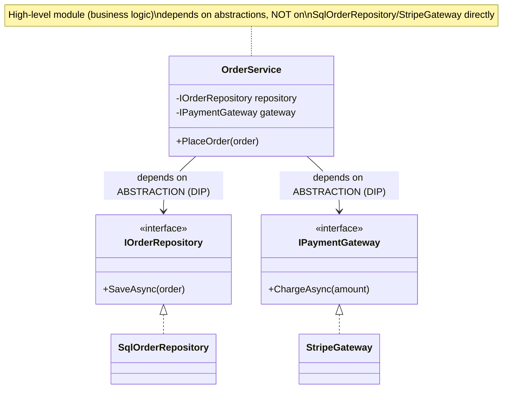
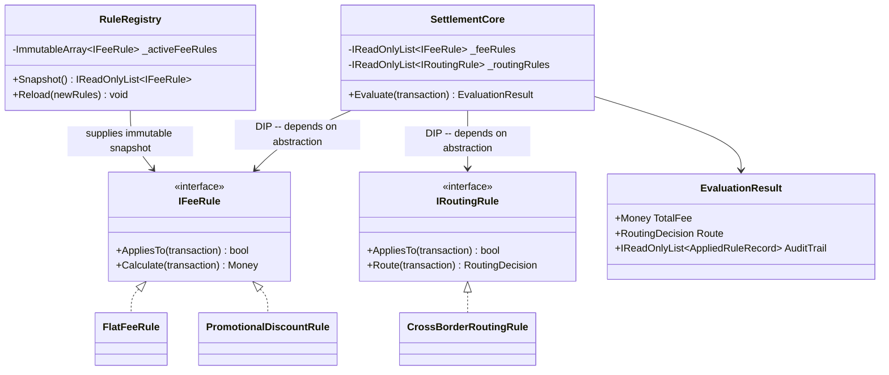
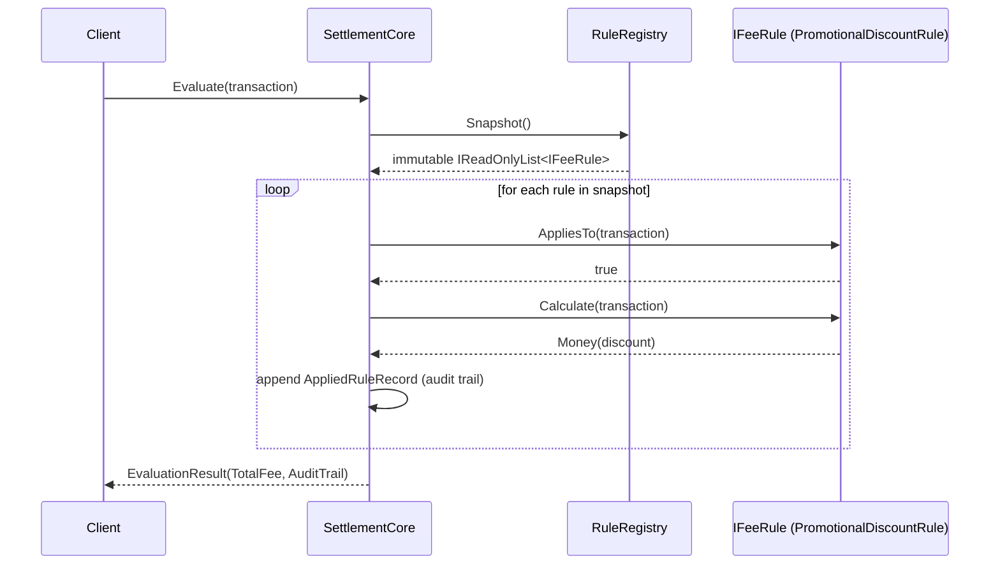

# Module 30 — SOLID Principles Deep Dive

> Domain: SOLID | Level: Beginner → Expert | Prerequisite: [[../09-OOP/01-OOP-Fundamentals-Advanced]] (LSP is one of the five SOLID principles, already covered in depth there)

---

## 1. Fundamentals

### What is SOLID?
SOLID is an acronym for five object-oriented design principles: **S**ingle Responsibility Principle, **O**pen/Closed Principle, **L**iskov Substitution Principle, **I**nterface Segregation Principle, **D**ependency Inversion Principle — collectively describing how to design classes/modules that are easy to understand, extend, and maintain as a codebase grows, by managing **coupling** and **responsibility boundaries** deliberately.

### Why do these exist?
Each principle addresses a specific, recurring failure mode that emerges as codebases grow: classes that do too much and become hard to change safely (SRP), designs that require modifying existing, working code to add new behavior (OCP), substitutability violations (LSP), interfaces forcing unwanted coupling (ISP), and high-level business logic depending directly on low-level implementation details (DIP) — precisely the mechanism behind the entire dependency-injection discussion.

### When does this matter?
Every non-trivial codebase; the depth matters for applying these principles with genuine judgment (recognizing when a principle is being over-applied into needless abstraction, versus under-applied into a maintenance liability) rather than reciting them as slogans.

### How does it work (30,000-ft view)?
```csharp
// Violates SRP: OrderProcessor both computes business logic AND handles persistence AND sends email
public class OrderProcessor
{
    public void Process(Order order) { /* validate, save to DB, send email -- three responsibilities */ }
}

// SRP-compliant: each class has ONE reason to change
public class OrderValidator { public bool IsValid(Order order) =>...; }
public class OrderRepository { public Task SaveAsync(Order order) =>...; }
public class OrderNotifier { public Task NotifyAsync(Order order) =>...; }
```

---

## 2. Deep Dive

### 2.1 Single Responsibility Principle — "One Reason to Change," Precisely
SRP is frequently mis-stated as "a class should do one thing" — the more precise, original formulation (Robert Martin) is **"a class should have only one reason to change"** — i.e., one class shouldn't be coupled to multiple, independently-varying **stakeholders/concerns** (a class handling both tax-calculation logic, which changes when tax law changes, and report-formatting logic, which changes when the marketing team wants a different layout, has two independent reasons to change, and should be split even if each individual method is small). The "one thing" framing is a useful mnemonic but can lead to over-splitting classes into meaninglessly tiny pieces if taken too literally without the underlying "independently-varying stakeholder" reasoning.

### 2.2 Open/Closed Principle — Open for Extension, Closed for Modification
A module should be extensible with new behavior **without modifying its existing, already-tested source code** — achieved via polymorphism/interfaces (adding a new class implementing an existing interface, rather than adding a new `if`/`switch` branch to an existing method every time a new case is needed). This directly connects to the discriminated-union discussion: a **sealed** hierarchy with exhaustive pattern matching is a **deliberate, informed violation** of OCP (adding a new case *requires* modifying every exhaustive switch) — chosen specifically because the domain benefits more from compiler-enforced exhaustiveness than from OCP's extensibility-without-modification benefit, a concrete illustration that SOLID principles sometimes trade off against each other, requiring judgment about which trade-off fits a given domain's actual needs.

### 2.3 Interface Segregation Principle — Small, Focused Interfaces
No client should be forced to depend on methods it doesn't use — a large, multi-purpose interface (`IRepository` with `GetById`, `GetAll`, `Add`, `Update`, `Delete`, `BulkImport`, `Archive`) forces every implementation to provide (or stub with `NotImplementedException`) methods irrelevant to its actual use case, and forces every *consumer* to depend on (and be recompiled/retested when) the entire interface's surface, even if it only calls one method. Splitting into focused interfaces (`IReadableRepository<T>`, `IWritableRepository<T>`) — directly the same reasoning as the covariant-reader/invariant-writer interface split — lets consumers depend on exactly what they need.

### 2.4 Dependency Inversion Principle — the Precise Distinction from "Dependency Injection"
DIP states: **high-level modules should not depend on low-level modules; both should depend on abstractions** — a business-logic class (`OrderService`) should depend on an `IOrderRepository` interface, not directly on a concrete `SqlOrderRepository` class, inverting the naive dependency direction (business logic depending on data-access details) into both depending on a shared abstraction the business logic itself defines the shape of. **Dependency Injection** is the **mechanism** commonly used to *supply* the concrete implementation satisfying that abstraction at runtime — DIP is the *design principle*; DI is one (very common, but not the only) *technique* for satisfying it. This distinction — frequently blurred, with candidates using the terms interchangeably — is a genuine, testable interview differentiator.

### 2.5 How the Five Principles Interact and Sometimes Tension Against Each Other
SRP and OCP work together (small, focused classes are easier to extend without modification); ISP and DIP work together (small interfaces make it easier for high-level modules to depend only on the abstraction slice they actually need); but LSP can tension against OCP (extending a hierarchy with a new subclass that technically satisfies OCP's "no modification needed" while violating LSP's behavioral-contract requirement, exactly the incident) — recognizing that these principles are not five independent, additive rules but an interacting system requiring holistic judgment is itself a Staff/Principal-level signal.

## 3. Visual Architecture

```mermaid
classDiagram
 class OrderService {
 -IOrderRepository repository
 -IPaymentGateway gateway
 +PlaceOrder(order)
 }
 class IOrderRepository {
 <<interface>>
 +SaveAsync(order)
 }
 class IPaymentGateway {
 <<interface>>
 +ChargeAsync(amount)
 }
 class SqlOrderRepository
 class StripeGateway
 OrderService --> IOrderRepository: depends on ABSTRACTION (DIP)
 OrderService --> IPaymentGateway: depends on ABSTRACTION (DIP)
 IOrderRepository <|.. SqlOrderRepository
 IPaymentGateway <|.. StripeGateway
 note for OrderService "High-level module (business logic)\ndepends on abstractions, NOT on\nSqlOrderRepository/StripeGateway directly"
```

## 4. Production Example
**Scenario**: A codebase's `NotificationService` had grown to directly implement email-sending, SMS-sending, and push-notification logic all within one class, with a large `switch (channel)` statement dispatching to the appropriate inline logic — every time a new notification channel (Slack, in-app) was added, the team modified this same central class, and a bug introduced while adding Slack support (an off-by-one in the switch's fallthrough logic) caused SMS notifications to silently stop sending for several days, discovered only via a customer complaint, since the SMS code path itself hadn't been touched but was inadvertently affected by the modification to a shared, monolithic class. **Investigation**: root-caused to the `switch` statement's shared, easy-to-accidentally-affect structure — modifying one case's logic had an unintended side effect on an adjacent case due to a missing `break`/fallthrough interaction the change author hadn't anticipated (an OCP violation directly causing a concrete production bug, not just a "code smell"). **Fix**: refactored into an `INotificationChannel` interface with one implementation per channel (`EmailChannel`, `SmsChannel`, `SlackChannel`), each independently deployable/testable, dispatched via a `IEnumerable<INotificationChannel>` collection resolved through DI (the multiple-registration pattern) rather than a shared switch statement — adding a new channel now means adding a new class and one registration line, with **zero modification** to any existing channel's code, structurally eliminating this exact bug class going forward. **Lesson**: OCP violations aren't merely aesthetic — a shared, modification-requiring structure (a large switch statement, a monolithic class) creates a genuine, demonstrated risk that an unrelated addition inadvertently breaks working, untouched functionality, precisely because "unrelated" isn't actually true when everything lives in one, shared, frequently-modified location.

## 5. Best Practices
- Apply SRP based on "independently-varying stakeholders/concerns," not a literal "does exactly one thing" reading that risks over-splitting.
- Prefer polymorphic extension (new implementing classes) over modifying existing, shared dispatch logic (switch statements, large if-chains) for genuinely open-ended, growing case sets.
- Split large interfaces into focused ones matching actual distinct consumer needs (/the reader/writer pattern).
- Recognize DIP as the design principle and DI as one implementation technique — don't conflate the two when explaining architecture decisions.

## 6. Anti-patterns
- A monolithic class/switch statement handling an open-ended, growing set of cases, where adding a new case risks affecting existing ones (the incident).
- Splitting classes so granularly (one method per class) that the codebase becomes harder, not easier, to navigate — an SRP over-application.
- A single large interface forcing every implementation to stub out irrelevant methods.
- High-level business logic directly instantiating/depending on concrete low-level classes (`new SqlOrderRepository`), rather than depending on an abstraction.

---

## 7. Performance Engineering

**DIP's indirection cost, and why it's almost never the bottleneck.** Every DIP-compliant call through an interface (`_gateway.ChargeAsync`) pays the same virtual-dispatch cost as any interface call (the sibling OOP module's §7 covers the mechanics in full) — an indirect method-table lookup the JIT generally cannot inline away, since the concrete implementation isn't known until runtime. In practice this cost (single-digit nanoseconds) is dwarfed by what the call is usually *for* — a network call to a payment gateway, a database round-trip — so DIP's abstraction layer is essentially free relative to what it wraps; the one place it's worth measuring is a tight, allocation-free, in-memory hot path (a pricing/risk-calculation loop iterating thousands of `IFeeRule`/`IRoutingRule` strategies per second) where dispatch overhead across many small, in-memory-only calls can become a measurable fraction of total time, and where `sealed` strategy implementations plus profile-guided devirtualization (OOP §7) is the right lever, not abandoning the abstraction.

**SRP-driven decomposition and allocation count.** Splitting a monolithic class into several single-responsibility collaborators (`OrderValidator`, `OrderRepository`, `OrderNotifier`) generally means more objects get constructed per logical operation than one God-object would require — each carries its own fixed object-header overhead (OOP §7's 16-byte header) and, if resolved fresh per request from a DI container rather than registered as scoped/singleton where safe, more allocations per request. This is a real, measurable cost at high request volumes, but the standard mitigation is DI lifetime management (register genuinely stateless SRP-decomposed services as `Singleton`, not `Transient`), not abandoning the decomposition — the fix targets the allocation pattern, not the design principle.

**OCP's registry/strategy-lookup cost.** A strategy registry (`Dictionary<string, IFeeRule>` resolved once at startup, looked up per transaction) is an O(1) dictionary lookup — negligible next to the switch-statement alternative it replaces, and the switch statement itself was never faster in any way that mattered; the real performance question for a rule-based OCP design is **rule-evaluation count** (iterating N registered fee rules per transaction), which scales linearly with N and is worth capping/indexing (only evaluate rules whose declared applicability — currency, region, instrument type — actually matches the transaction) once N grows large enough to matter, a genuine, measurable design concern distinct from the lookup mechanism itself.

**ISP and call-site surface size.** A narrow, segregated interface (`IReadableRepository<T>`) has no runtime performance advantage over a fat one at the call-site level (dispatch cost is identical either way) — its value is entirely at compile/build time (smaller recompilation surface when the interface changes) and code-clarity time, not runtime throughput; a candidate claiming ISP has a runtime performance benefit is conflating a build-time/maintainability property with a runtime one.

## 8. Security

**DIP as the mechanism that makes security boundaries testable.** A high-level module depending on `IPaymentGateway` rather than a concrete `StripeGateway` isn't just a testability convenience — it's what allows security-critical failure paths (a declined charge, a timeout, a fraud-flagged transaction) to be **deterministically simulated** in tests via a fake/mock implementing the same interface, rather than only being exercisable against a live vendor sandbox that may not reliably reproduce every failure mode on demand. A codebase that can't deterministically test "what happens when the payment gateway returns a fraud-hold response" because its business logic is wired directly to a concrete vendor SDK type has a genuine security-testing gap DIP directly closes.

**ISP as least-privilege applied to interfaces.** Interface Segregation is the object-oriented expression of the security principle of least privilege: a component depending on a narrow, focused interface (`IReadableRepository<T>`) is *structurally incapable* of calling a destructive operation (`DeleteAsync`) that a fat `IRepository<T>` would have exposed to it whether it needed it or not — this is a genuine, compile-time-enforced security boundary, not merely a maintainability nicety, and is precisely why a reporting/read-only service should depend on a read-only interface even if the concrete backing implementation happens to also support writes: the *dependency's declared type* is what bounds what the consuming code can possibly do, accidentally or maliciously.

**OCP and the blast radius of a compromised or buggy extension.** A polymorphic, registry-based extension point (a new `IFeeRule`, a new `INotificationChannel`) is, from a security standpoint, also a new unit of **trust boundary** — a maliciously or carelessly written new strategy implementation can only affect what its narrow interface contract allows it to affect (§8's ISP point again), and can be reviewed, sandboxed, or feature-flagged independently of the certified core, exactly the settlement-core governance benefit named in this module's own Expert Q1. Contrast this with an OCP violation (a shared, editable `switch` in the core) where a new case's bug has no equivalent containment — it runs inside the same trusted, already-certified code path as every other case, with no structural isolation at all.

**SRP and secrets/PII exposure surface.** A class conflating business logic with logging/serialization (a `PaymentProcessor` that both charges a card and logs the full request payload for "debugging") has a single, unreviewed code path with the power to accidentally leak a card number or other sensitive field into logs — splitting logging into its own single-responsibility collaborator, with an explicit, reviewed redaction step as part of *its* one job, is a direct, concrete SRP-driven security improvement, not merely an organizational one: the redaction logic has exactly one place it can be forgotten (the logger), instead of being one easily-overlooked line buried inside a large, multi-purpose method.

## 9. Scalability

**DIP as the mechanism enabling horizontal team scaling.** This module's own Expert Q2 already establishes DIP's role in vendor swappability and testability; the same abstraction boundary is equally what allows a payments team and a settlement team to develop against `IPaymentGateway`/`ILedger` in parallel, each mocking the other's abstraction rather than blocking on the other's implementation being finished — DIP is the technical precondition for parallelizable team throughput, not merely a testing convenience, directly the same "composition scales teams" point the sibling OOP module's §9 makes, generalized here to the interface-abstraction boundary specifically.

**OCP and deployment/release velocity at scale.** As the number of concurrently-shipping feature teams grows, a shared, modification-requiring core (any OCP violation) becomes a **release bottleneck**, not just a bug-risk: every team needing to add a case to a shared switch statement must coordinate around the same file/PR, serializing what should be independent, parallel releases — a registry-based OCP-compliant design decouples release cadence per extension (a new `IFeeRule` ships on its own team's schedule, registered independently) from the core's own, presumably slower, more heavily-reviewed release cadence, a genuine scalability property measured in engineering throughput, not just request throughput.

**ISP and independent service/module deployability.** A consumer depending on a narrow interface slice is unaffected by, and doesn't need to be redeployed/retested for, an unrelated change to a different slice of a fat interface it never depended on — at scale, this is what allows a large system to be decomposed into independently deployable services/modules along interface boundaries without a change to one module's surface forcing a ripple of retesting/redeployment across every consumer, directly the technical precondition the later microservices/API-gateway modules build their service-boundary discipline on.

**SRP and horizontal request-handling scale.** Classes with a single, narrow responsibility and no shared mutable state (a stateless `OrderValidator`) are trivially safe to run behind a load balancer across many horizontally-scaled instances/pods — the God-object anti-pattern this module warns against frequently accumulates incidental shared state (a cache, a connection, a counter) as more responsibilities get bolted on, which becomes a genuine horizontal-scaling hazard (state that must now be externalized, synchronized, or sharded) that a cleanly SRP-decomposed design never needed to solve in the first place, since each narrow, focused collaborator had no reason to hold onto shared state to begin with.

---

## 10. Interview Questions

### Basic (10)
1. **Q: What does SOLID stand for?** **A:** Single Responsibility, Open/Closed, Liskov Substitution, Interface Segregation, Dependency Inversion.
2. **Q: What is the Single Responsibility Principle?** **A:** A class should have only one reason to change — "reason to change" meaning one *actor/stakeholder* whose requirements drive modifications; a class serving both accounting rules and report formatting has two masters and will be broken by either's evolution.
3. **Q: What is the Open/Closed Principle?** **A:** Modules should be open for extension but closed for modification.
4. **Q: What is the Interface Segregation Principle?** **A:** No client should be forced to depend on methods it doesn't use.
5. **Q: What is the Dependency Inversion Principle?** **A:** High-level modules shouldn't depend on low-level modules; both should depend on abstractions.
6. **Q: Is Dependency Injection the same thing as Dependency Inversion?** **A:** No — DIP is the design principle; DI is a common technique/mechanism for satisfying it.
7. **Q: Which SOLID principle did already cover in depth?** **A:** Liskov Substitution Principle.
8. **Q: What's a common symptom of an SRP violation?** **A:** A class changes for multiple, unrelated reasons (e.g., both a business-rule change and a formatting change require touching the same class).
9. **Q: What's a common way to achieve OCP compliance?** **A:** Using polymorphism/interfaces — adding a new implementing class instead of modifying existing dispatch logic.
10. **Q: What's a symptom of an ISP violation?** **A:** An implementing class has to stub out/throw `NotImplementedException` for methods it doesn't actually support.

### Intermediate (10)
1. **Q: Why is "a class should do one thing" a risky, oversimplified restatement of SRP?** **A:** Taken literally, it can lead to over-splitting classes into meaninglessly tiny pieces — the more precise formulation ("one reason to change," tied to independently-varying stakeholders/concerns) better captures when splitting is actually warranted versus unnecessary.
2. **Q: Why does a large switch statement handling a growing set of cases violate OCP specifically?** **A:** Adding a new case requires modifying the existing, already-tested switch statement's source code, rather than adding new code without touching what already works — exactly the "closed for modification" violation OCP is meant to prevent.
3. **Q: Why can a sealed, discriminated-union-style hierarchy with exhaustive switches be considered a deliberate OCP violation, and why might that be the right choice anyway?** **A:** Adding a new case genuinely does require modifying every exhaustive switch handling that hierarchy — a real OCP violation — but this trade-off is deliberately accepted because the domain benefits more from compiler-enforced exhaustiveness (catching a missed case at compile time) than from OCP's modification-avoidance benefit, illustrating that OCP isn't an absolute rule but one consideration to weigh against others.
4. **Q: Why does splitting a large `IRepository` interface into `IReadableRepository`/`IWritableRepository` address both ISP and, indirectly, support DIP better?** **A:** ISP is directly addressed since consumers now depend only on the read or write slice they actually need; DIP is indirectly supported because a high-level module depending on the narrower, focused abstraction is more precisely and minimally coupled than depending on the full, broad interface's entire surface.
5. **Q: Why is DIP described as inverting the "naive" dependency direction, specifically?** **A:** Without DIP, a natural, naive design has business logic directly depending on and calling into data-access/infrastructure code (a "top-down" dependency); DIP inverts this so that both the business logic and the infrastructure code depend on a shared abstraction (often defined by/for the business logic's needs), meaning the infrastructure layer now depends on an abstraction the business layer defines, not the other way around.
6. **Q: Why might over-applying ISP lead to interface proliferation that itself becomes a maintainability problem?** **A:** Splitting every interface into extremely narrow, single-method pieces can scatter related behavior across so many small interfaces that understanding a type's full capability requires assembling many fragments — ISP should split along genuinely distinct consumer-need boundaries, not mechanically minimize every interface to one method regardless of whether that reflects real, separate use cases.
7. **Q: How does the production incident demonstrate that OCP violations are not merely stylistic concerns?** **A:** A modification to add a new notification channel inadvertently broke an existing, unrelated channel's functionality (SMS) because both lived in the same shared, modification-requiring switch statement — a concrete, demonstrated production bug directly caused by the OCP violation, not just a hypothetical maintainability concern.
8. **Q: Why does SRP's "reason to change" framing require identifying stakeholders, not just code structure?** **A:** Two pieces of logic can look structurally similar (both are "calculation" methods) while actually varying for entirely different business reasons (tax law changes vs. marketing's formatting preferences) — SRP is about *why* code changes, which requires understanding the business/organizational context driving those changes, not just the code's syntactic shape.
9. **Q: Why does the Dependency Inversion Principle apply even in codebases that don't use a formal DI container?** **A:** DIP is about the *direction of source-code dependencies* (which module's code references which), independent of *how* a concrete implementation is ultimately supplied — a codebase could satisfy DIP via manual "poor man's DI" (constructing and passing dependencies explicitly in a composition root) without any DI container at all, as long as high-level modules still depend only on abstractions.
10. **Q: Why is it valuable to recognize that SOLID principles can tension against each other, rather than treating them as five independent, always-compatible rules?** **A:** Real design decisions frequently require choosing which principle's benefit matters more for a specific situation (the OCP-vs-exhaustiveness trade-off) — presenting them as always-harmonious slogans misses the genuine engineering judgment SOLID is meant to develop, and a Staff/Principal-level engineer should be able to articulate these tensions explicitly, not just recite the five letters.

### Advanced (10)
1. **Q: Diagnose the notification-service OCP violation from first principles, and design the code-review practice preventing recurrence for future growing-case-set scenarios.**
 **A:** Root cause: an open-ended, growing set of cases (notification channels) implemented as a single, shared, modification-requiring dispatch structure (a switch statement) rather than a polymorphic, independently-extensible design. Safeguard: a code-review heuristic flagging any switch/if-chain whose case set is expected to grow over time (new payment methods, new notification channels, new file-format exporters) as a signal to consider a polymorphic/strategy-pattern refactor **before** the case set grows large enough for this exact "modifying one case affects another" risk to materialize, rather than waiting for an incident to prompt the refactor reactively.
2. **Q: Explain precisely how the Interface Segregation Principle and the Dependency Inversion Principle work together in a well-designed layered architecture, using a concrete example beyond a simple repository split.**
 **A:** Consider an `IOrderNotifier` interface a high-level `OrderService` depends on (DIP) — if it's segregated correctly (ISP) into exactly the notification capability `OrderService` actually needs (`NotifyOrderPlaced(order)`) rather than a broad `INotificationService` also including unrelated capabilities (`SendMarketingEmail`, `SendPasswordReset`), `OrderService`'s dependency is both **inverted** (depends on an abstraction, not a concrete notifier) and **minimally coupled** (depends on exactly the slice of notification capability relevant to its own responsibility) — the two principles compound: DIP ensures the *direction* of dependency is correct; ISP ensures the *abstraction itself* is appropriately narrow, together producing a dependency that's both correctly-directed and minimally-scoped.
3. **Q: Design a refactoring strategy for the incident's fix that avoids a risky, all-at-once "big bang" rewrite of the entire notification dispatch mechanism.**
 **A:** Extract one notification channel (the most recently problematic, or the simplest) into its own `INotificationChannel` implementation first, leaving the remaining channels in the existing switch statement temporarily, with the dispatcher checking the new interface-based channels first and falling back to the legacy switch for anything not yet migrated — incrementally extract each remaining channel into its own class over subsequent, independently-reviewable changes, removing the legacy switch statement entirely only once every channel has been migrated — directly the same incremental, "expand, don't break" migration pattern recurring throughout this course, applied here to an OCP refactor specifically.
4. **Q: Explain a scenario where naively applying DIP (introducing an abstraction for every dependency) adds unnecessary complexity without a corresponding benefit.**
 **A:** A class that will only ever have one, stable, unlikely-to-change concrete dependency (e.g., a wrapper around `DateTime.UtcNow` for testability is a legitimate, common exception, but a wrapper around a genuinely stable, unlikely-to-vary utility like `Math.Round` with no plausible alternative implementation or testing need) gains no real benefit from an introduced `IRoundingStrategy` abstraction — the abstraction adds an extra layer of indirection and a file/interface to maintain without ever being substituted with a different implementation in practice; DIP is justified specifically when there's a genuine need for substitutability (testing, multiple real implementations, decoupling from an external system) — applying it reflexively to every single dependency regardless of actual variability need is the "premature abstraction" anti-pattern this course has repeatedly warned against (the opening guidance, restated here).
5. **Q: How would you reason about whether a proposed class split satisfies genuine SRP compliance versus merely scattering related logic across multiple files without an actual coupling-reduction benefit?**
 **A:** Verify each resulting class can genuinely be modified, tested, and reasoned about **independently** of the others for its own specific reason-to-change — if two "split" classes still need to change together in lockstep for the same underlying reason (e.g., splitting `OrderValidator` into `OrderFieldValidator` and `OrderBusinessRuleValidator` when both actually always change together whenever the single underlying validation policy changes), the split hasn't achieved genuine independence, it's merely relocated the same coupling across more files — true SRP compliance is measured by independent-changeability, not merely by file/class count.
6. **Q: Explain how the Liskov Substitution Principle and the Open/Closed Principle can come into direct conflict, using a concrete scenario beyond the discriminated-union example.**
 **A:** A codebase adds a new `Penguin: Bird` subclass to an existing, OCP-compliant hierarchy (extending without modifying any existing code, satisfying OCP) — but if the base `Bird` class's contract implicitly assumes `Fly` is always meaningfully callable (as much pre-existing calling code might reasonably assume for a `Bird`), `Penguin`'s override (throwing `NotSupportedException`, or silently doing nothing) satisfies OCP's "no modification needed" while violating LSP's "substitutable without altering correctness" — this is precisely why OCP's "closed for modification, open for extension" framing, taken alone, doesn't guarantee a *correct* extension, only a *non-modifying* one; LSP must be independently verified for any OCP-compliant extension, exactly the tension recurring in the sealed-hierarchy trade-off, now shown via a different, classic example.
7. **Q: Design a metric or code-review signal that would have flagged the notification-service class as an OCP-risk candidate before the incident occurred.**
 **A:** Track cyclomatic complexity/branch count growth over time for dispatch-shaped methods (switch statements, long if-else chains) specifically — a method whose branch count has grown across multiple, unrelated PRs (each adding "just one more case") is a strong, mechanically-detectable signal of exactly the accumulating-shared-structure risk this incident demonstrates; flagging any dispatch method exceeding a branch-count threshold, combined with evidence of it being modified by multiple different feature PRs over time, as a refactor candidate **before** the case set grows large enough for an incident like the to occur, converts a reactive, incident-driven fix into a proactive, metric-driven one.
8. **Q: Explain why the Dependency Inversion Principle is foundational to unit testing, beyond just "it lets you use mocks."**
 **A:** Without DIP, a high-level module directly instantiating its low-level dependencies (`new SqlOrderRepository` inside `OrderService`) has no way to substitute a test double **at all** without modifying `OrderService`'s own source code — DIP's abstraction-based design is what makes substituting a test double (a mock/stub/fake implementing the same interface) possible without touching the class under test, which is the actual mechanical prerequisite for isolated unit testing, not merely a convenience mocking frameworks happen to rely on.
9. **Q: A team proposes measuring "SOLID compliance" via a static-analysis tool counting interface implementations, class sizes, and dependency-injection usage as a single composite score, gated in CI. Evaluate this as a Principal Engineer.**
 **A:** Push back on reducing SOLID to a purely mechanical, composite metric — as Advanced Q4/Q5 demonstrate, genuine SOLID compliance requires judgment about actual variability/coupling-reduction benefit, which a static count of interfaces/class sizes cannot distinguish from superficial, benefit-free abstraction proliferation (an anti-pattern in its own right, per Advanced Q4); recommend targeted, judgment-requiring code-review practices (the branch-count/dispatch-growth signal from Advanced Q7, explicit SRP "reason to change" discussion in reviews) over a single automated composite score that could easily reward over-engineering (many tiny classes, unnecessary interfaces) as highly as it rewards genuine SOLID compliance.
10. **Q: As a Principal Engineer, how would you teach SOLID to a team in a way that builds genuine design judgment rather than slogan-level pattern-matching, directly addressing this module's recurring theme?**
 **A:** Teach each principle paired with both a concrete production incident it would have prevented (this module's for OCP, the for LSP) **and** a concrete scenario where over-applying it creates unnecessary complexity (Advanced Q4's DIP-overuse example, the over-splitting SRP concern) — presenting both the failure-to-apply and the over-application failure modes together, rather than teaching each principle only as an unconditionally-good practice, is what builds the actual engineering judgment (when does this principle's benefit outweigh its complexity cost, for *this* specific situation) that distinguishes a Principal Engineer's application of SOLID from a junior engineer's mechanical recitation of the five letters.

### Expert (FinTech Principal Panel)

1. **Q: A payments platform constantly adds fee rules, routing rules, and promotions, and each change currently means editing the settlement core — a high-risk, heavily-regulated code path. Apply OCP so new rules are added without modifying (or re-certifying) the money-critical core, and address the governance angle.**
 **A:** Model each rule as a polymorphic **strategy** (`IFeeRule`/`IRoutingRule`) evaluated by a core engine that iterates a **registry** of rules rather than a growing `switch` (the exact anti-pattern) — adding a rule means adding a *new class* (and registering it), never editing the engine, so the settlement core is **closed for modification, open for extension**. Beyond the code, this OCP structure delivers a *governance* win specific to regulated finance: because new rules don't touch the certified core, they can be reviewed, tested, and (where the org allows) enabled via **configuration/feature flags** with their own change-control, without re-certifying the high-assurance money path — dramatically shrinking the blast radius and the compliance re-review scope of a routine fee change. Add: each rule independently unit-tested; an explicit, ordered, deterministic evaluation (rules that compose must have defined precedence — money math can't depend on undefined ordering); and an audit record of which rules applied to each transaction (regulators ask). Caveat (Advanced Q4): don't over-abstract genuinely-stable single-implementation logic into a strategy for its own sake. The Principal framing: OCP here isn't just tidy code — it isolates a volatile, frequently-changing concern (rules) from a stable, high-assurance, expensively-governed core (settlement), so change velocity on rules doesn't impose change *risk* on money movement.
 **Why correct:** Uses strategy + registry to keep the core closed, and connects OCP to the regulatory blast-radius/change-control win plus deterministic ordering and audit.
 **Common mistakes:** A growing `switch` in the settlement core; non-deterministic rule ordering; over-abstracting stable logic; no audit of applied rules.
 **Follow-ups:** "How does OCP shrink the compliance re-certification scope of a fee change?" / "How do you make composed rule evaluation deterministic?" / "Where do feature flags fit and what governs them?"

2. **Q: Your system integrates external card networks, banks, and market-data feeds. Apply DIP so this is testable and providers are swappable, and explain how this leads toward a ports-and-adapters (hexagonal) boundary.**
 **A:** The core domain (authorize, settle, price) must **depend on abstractions it owns** — `IPaymentGateway`, `IMarketDataFeed`, `ILedger` — not on a vendor SDK's concrete types (DIP). Each external system gets an **adapter** implementing the core's interface, and the interface is defined in terms of the *domain's* needs, not the vendor's API shape — an **anti-corruption layer** that keeps a provider's quirks (odd status codes, field names, retry semantics) from leaking into the core. Benefits: (1) **testability** — the domain is unit-tested against fakes/mocks with no network or vendor sandbox (DIP's real payoff, Advanced Q8), and you can simulate declines/timeouts/partial failures deterministically, which is exactly what money code must be tested against; (2) **swappability/multi-provider** — add or replace a processor by writing a new adapter, no core change (this is also OCP), enabling failover between providers and vendor migration without touching business logic; (3) **isolation from vendor outages/changes** in one place. This is precisely **hexagonal architecture**: the domain at the center, `ports` (the interfaces) at its edge, `adapters` (vendor implementations) outside — DIP is the principle, ports-and-adapters is the architecture it produces at the system boundary. The Principal framing: for a system whose correctness depends on external rails you don't control, DIP-owned domain interfaces + per-vendor adapters (an anti-corruption layer) make the core deterministically testable and vendor-independent — the money logic never knows or cares which processor it's talking to, which is both a testing and a resilience/portability property.
 **Why correct:** Applies DIP with domain-owned interfaces + adapters/anti-corruption layer, ties it to deterministic testability and provider swap/failover, and correctly identifies it as hexagonal architecture.
 **Common mistakes:** Domain depending on vendor SDK types; interfaces shaped by the vendor not the domain (leaky abstraction); no fakes so money paths are only tested against a live sandbox.
 **Follow-ups:** "Why define the interface in the domain's terms, not the vendor's?" / "How does this enable failover between two processors?" / "How does the anti-corruption layer stop vendor quirks leaking in?"

3. **Q: In a regulated settlement system, a change to reporting or notifications sometimes forces a change to — and re-testing/re-certification of — the core money-movement code, because they're entangled in one class. Frame this as an SRP problem and explain the risk-isolation payoff.**
 **A:** This is SRP viewed through its most important FinTech lens: **blast radius and change-risk isolation**. When money movement, reporting, notification, and audit all live in one class (or one method), they change together, so a low-stakes tweak (reword a notification, add a report column) drags the high-assurance settlement path into the diff — meaning re-review, re-test, and often re-certification of code that didn't functionally change, plus the genuine risk of a reporting change introducing a settlement bug. SRP says each of these is a **separate reason to change** owned by a separate component: the settlement core does money movement and nothing else; reporting, notification, and audit subscribe to its outcomes (domain events / an outbox) rather than being inlined. The payoff isn't just cleaner code — it's that the **volatile, frequently-changing, lower-assurance concerns can change freely without touching the stable, expensively-governed core**, so change velocity on the periphery doesn't impose change risk (or compliance cost) on the money path. Verify it the SRP way (Advanced Q5): the settlement core and the reporting code must be *independently changeable and testable* — if a reporting change still forces a settlement-core edit, the split isn't real. The Principal framing: in regulated finance SRP is a risk-management tool — separating concerns by their reason-to-change keeps the high-assurance core small, stable, and rarely-touched, which minimizes both the blast radius of bugs and the scope of compliance re-certification, and that isolation is worth far more than the aesthetic of "one class, one job."
 **Why correct:** Frames SRP as change-risk/blast-radius and compliance-scope isolation, separates the core from reporting/notification/audit via events, and validates via independent changeability.
 **Common mistakes:** Entangling money movement with reporting/notification; measuring SRP by file count not independent changeability; letting peripheral changes drag the core into re-certification.
 **Follow-ups:** "How do reporting/notification consume settlement outcomes without being inlined?" / "How does SRP reduce compliance re-certification scope?" / "How do you prove the split is real, not cosmetic?"

4. **Q: A `IRepository<T>` interface in a trading-limits service exposes `GetById`, `GetAll`, `Add`, `Update`, `Delete`, and `BulkImport`. A junior engineer implements a new `RiskLimitRepository`, stubs `BulkImport` with `throw new NotImplementedException`, and the PR passes review because "it compiles and the tests we wrote pass." Three months later, an unrelated batch-reconciliation job calls `BulkImport` polymorphically against a collection of `IRepository<T>` implementations and crashes in production. Diagnose using both ISP and LSP, and propose the durable fix.**
 **A:** Two SOLID violations, not one, and distinguishing them matters for the fix. The **ISP violation** is the root design flaw: `IRepository<T>` bundles a capability (`BulkImport`) not every implementation genuinely supports, forcing `RiskLimitRepository` to either implement something meaningless for its domain or stub it — there was never a clean option. The **LSP violation** is the downstream consequence: once stubbed with `NotImplementedException`, `RiskLimitRepository` is no longer safely substitutable everywhere `IRepository<T>` is used, because the interface's implicit contract ("all these operations work") is violated for this specific implementation — and this is exactly why "it compiles and passes the tests *we* wrote" was never sufficient evidence: the tests exercised only the paths `RiskLimitRepository`'s own author anticipated, not the full contract every `IRepository<T>` consumer is entitled to assume. The durable fix is ISP-driven, not a better stub: split into `IReadableRepository<T>`, `IWritableRepository<T>`, and a separate `IBulkImportable<T>` (the Hard exercise's exact segregation), so `RiskLimitRepository` simply never implements `IBulkImportable<T>` — the batch-reconciliation job's polymorphic loop then either compiles against `IEnumerable<IBulkImportable<T>>` specifically (structurally excluding `RiskLimitRepository` from ever being handed to it) or explicitly filters via `OfType<IBulkImportable<T>>`, converting a runtime crash into a compile-time-visible, correctly-scoped set of participants. The Principal framing: an interface promising a capability not every implementation can honor is a design defect that *will* eventually be exercised by a caller who reasonably trusted the interface's full contract — segregating the interface removes the possibility of the crash entirely, rather than requiring every future implementer to remember to review "for capabilities I don't support, will anyone call this."
 **Why correct:** Correctly separates the ISP root cause (a fat interface promising an unsupported capability) from the LSP consequence (a stub breaking substitutability for any caller relying on the full contract), and fixes it via segregation rather than a better exception or documentation.
 **Common mistakes:** Treating this as "the junior engineer should have implemented `BulkImport` properly" rather than recognizing the interface itself was mis-designed; fixing it with a more descriptive exception message instead of removing the false promise structurally; not recognizing "tests pass" only validates the paths the test author anticipated.
 **Follow-ups:** "How would a code-review checklist have caught this before merge?" / "Why is `NotImplementedException` almost always a design smell rather than a legitimate implementation choice?" / "How do you retrofit this fix onto a live interface with a dozen existing implementations?"

5. **Q: Your firm's compliance team mandates that every change to trade-surveillance rule logic be independently auditable — reviewable and attributable to a specific rule author, without requiring re-review of the surveillance engine itself. The current design has all rules as `if` branches inside one `SurveillanceEngine.Evaluate` method, authored collectively by the whole team in one shared file. Redesign using OCP and SRP together, and explain precisely how the redesign satisfies the audit requirement, not just "cleaner code."**
 **A:** Model each rule as its own `ISurveillanceRule` implementation (`WashTradeRule`, `SpoofingRule`, `LayeringRule`), each in its own file/class with a clear, single author and git-blame history scoped to exactly that rule's logic — OCP structurally guarantees the shared `SurveillanceEngine` (which iterates a registered collection of rules and aggregates their flags) never needs modification when a rule is added, changed, or removed, so no rule change ever touches, or requires re-review of, the engine itself. This directly satisfies the compliance requirement in a way "cleaner code" alone doesn't: the **audit trail is structural, not just cosmetic** — a compliance reviewer examining "who changed the wash-trade detection logic and when" gets a precise, scoped git history for `WashTradeRule.cs` alone, with zero unrelated diffs from other rules' evolution mixed in, because SRP ensures each rule class has exactly one reason to change (its own detection logic) and OCP ensures adding/modifying a rule never requires touching the shared engine's own, separately-certified code. Additionally, each rule can carry its own metadata (author, effective date, regulatory citation) as part of its class definition, queryable and reportable independently — something impossible when all rules live as anonymous branches inside one shared method with one collective commit history. The Principal framing: "auditable" is not an abstract virtue here — it's a specific, checkable property (can I attribute and scope a change to exactly the logic it affects, without noise from unrelated logic) that SRP+OCP deliver as a direct structural consequence, not as a byproduct that happens to also look tidier.
 **Why correct:** Ties OCP's "no core modification" and SRP's "one reason to change" directly to the concrete, checkable compliance requirement (scoped git-history attribution per rule), not just general code-quality language.
 **Common mistakes:** Describing the refactor only in terms of "cleaner" or "more maintainable" without connecting to the specific audit/attribution requirement; not addressing how rule metadata (author, regulatory citation) is captured structurally; assuming code cleanliness alone satisfies a compliance requirement without checking the actual audit need.
 **Follow-ups:** "How would you version a rule that changes its detection threshold over time, while preserving old audit history?" / "Where does rule-evaluation ordering matter, and how do you make it deterministic and auditable?" / "How does this connect to the settlement-core governance point from Expert Q1?"

6. **Q: A codebase has an `IAuditLogger` interface with a single method, `LogAsync(AuditEvent)`, injected into every service via DIP. A Principal Engineer reviewing the design flags it as "DIP in letter, not in spirit." What's the likely underlying problem, and how do you diagnose it?**
 **A:** DIP requires the abstraction to be genuinely owned by, and shaped around, the high-level module's actual needs — not merely "any interface, injected via constructor" satisfying the mechanical letter of "depend on an abstraction." The likely problem: `IAuditLogger` was probably designed by copying the concrete logging vendor's own API shape (a single generic `LogAsync(AuditEvent)` mirroring, say, a specific SIEM vendor's ingestion API) rather than being shaped around what each high-level module actually needs to express (an `OrderService` wants to say "this order was rejected for this specific regulatory reason"; a `SettlementService` wants to say "this settlement was flagged for manual review") — if `AuditEvent` is really just a thin wrapper around the vendor's own event schema, the abstraction hasn't actually inverted anything: swapping SIEM vendors still requires touching every call site's construction of `AuditEvent`, because the "abstraction" leaked the vendor's shape through it. This is the DIP equivalent of Expert Q2's "shape the interface around the domain, not the vendor" (anti-corruption layer) principle, now shown failing specifically in a supposedly-DIP-compliant design that technically has an interface and constructor injection, but not the actual decoupling DIP exists to provide. Diagnosis: check whether swapping the concrete `IAuditLogger` implementation (a different SIEM vendor, a different transport) requires touching any call site beyond the DI registration — if yes, the abstraction is vendor-shaped, not domain-shaped, and DIP is satisfied only mechanically. Fix: redesign `IAuditLogger`'s surface (and `AuditEvent`'s shape) around what the *domain* needs to express, with the concrete implementation responsible for translating that domain-shaped call into whatever the specific vendor's actual API requires.
 **Why correct:** Distinguishes DIP's mechanical form (an interface, constructor injection) from its actual substance (an abstraction shaped by the high-level module's needs, not leaking the low-level vendor's shape through it), with a concrete diagnostic test (does swapping the implementation touch call sites).
 **Common mistakes:** Treating "has an interface and uses constructor injection" as sufficient proof of DIP compliance; not checking whether the abstraction's shape actually originates from vendor API design rather than domain need; conflating this with a simple ISP fat-interface problem when the real issue is *whose vocabulary* the interface speaks.
 **Follow-ups:** "What's the concrete test for whether an abstraction is domain-shaped versus vendor-shaped?" / "How does this connect to the anti-corruption-layer discussion in Expert Q2?" / "Would splitting `IAuditLogger` into per-domain-event interfaces fix this, or is that an orthogonal ISP concern?"

7. **Q: You're brought in to review a five-year-old core-banking ledger codebase. `LedgerEntry` is a 40-method class handling posting, reversal, currency conversion, regulatory-report formatting, and notification-triggering, all touched by four different teams. Every team reports the class as "too risky to touch." Walk through how you'd apply SRP, OCP, and ISP together to de-risk it — and specifically address why a full rewrite is the wrong first move.**
 **A:** A full rewrite is the wrong first move because a 40-method, multi-team-owned class handling money movement is precisely the highest-risk code to attempt a big-bang replacement of — any behavioral drift introduced during a rewrite is maximally expensive to detect and correct in exactly this domain, and "too risky to touch" is itself evidence the team lacks the test coverage/confidence a safe rewrite would require. The de-risking path is **incremental extraction along genuine reason-to-change boundaries** (SRP), starting with the concern that changes most independently of the others and has the clearest boundary — likely regulatory-report formatting (changes on the regulator's schedule, not the ledger's) or notification-triggering (changes on the product team's schedule) — extracted into its own class behind a narrow interface, with the original `LedgerEntry` method becoming a thin delegating call, verified via characterization tests (capturing existing behavior before extraction, not after) so the extraction is provably behavior-preserving at each step. Once posting/reversal/conversion (the genuinely core, money-moving concerns) are the only logic left directly in `LedgerEntry`, apply OCP: currency-conversion logic likely already has, or will grow, a switch-shaped set of cases (per currency pair or provider) that should become a registered `ICurrencyConverter` strategy set rather than remaining inline growth inside the core class — closing the highest-risk remaining logic to future modification. Finally, apply ISP to whatever's left: the four teams likely each need only a slice of `LedgerEntry`'s full surface (posting-only, reporting-only, etc.) — segregating into role-specific interfaces (`IPostable`, `IReversible`, `ILedgerReportSource`) lets each team depend on, and be shielded from changes to, only their own slice, directly reducing the "everyone is afraid to touch it because everyone else depends on all of it" dynamic that made the class feel untouchable in the first place. The Principal framing: the fear of touching this class *is* the SOLID violation made visible as an organizational symptom — untangling it via incremental, test-verified extraction along genuine reason-to-change boundaries is both the technically safer path and the one that directly dissolves the cross-team coordination fear driving the "too risky" assessment, whereas a rewrite would recreate the same fear on day one of the new system with none of the accumulated institutional knowledge the old one has already encoded.
 **Why correct:** Sequences SRP extraction (safest, most independent concerns first, via characterization tests) before OCP (closing the genuinely core, highest-risk logic) before ISP (segregating remaining surface per team), and explicitly explains why a rewrite is riskier than incremental de-risking for exactly this domain.
 **Common mistakes:** Recommending a rewrite as the primary answer; extracting the money-moving core logic first instead of the safer peripheral concerns; not connecting "too risky to touch" to the underlying SOLID violations as a diagnostic, treating it as merely a team-culture problem.
 **Follow-ups:** "What are characterization tests, and why write them before extracting, not after?" / "How do you sequence which concern to extract first, in general?" / "How would you measure whether this de-risking effort is actually working, incrementally, rather than only at the end?"

---

## 11. Coding Exercises

### Easy — Fix an SRP violation by separating independently-varying concerns
```csharp
// BEFORE: two independently-varying concerns (tax calculation, report formatting) in one class
public class InvoiceProcessor
{
    public decimal CalculateTax(Invoice invoice) => invoice.Subtotal * GetTaxRate(invoice.Region);
    public string FormatForDisplay(Invoice invoice) => $"Invoice #{invoice.Id}: ${invoice.Total:F2}";
}

// AFTER: split along "reason to change" -- tax law changes independently of display formatting
public class TaxCalculator { public decimal CalculateTax(Invoice invoice) => invoice.Subtotal * GetTaxRate(invoice.Region); }
public class InvoiceFormatter { public string FormatForDisplay(Invoice invoice) => $"Invoice #{invoice.Id}: ${invoice.Total:F2}"; }
```

### Medium — Fix an OCP violation with a strategy-pattern refactor
```csharp
public interface INotificationChannel
{
    string ChannelName { get; }
    Task SendAsync(Notification notification);
}

public class EmailChannel: INotificationChannel
{
    public string ChannelName => "Email";
    public Task SendAsync(Notification notification) => /* email-specific logic */ Task.CompletedTask;
}
public class SmsChannel: INotificationChannel
{
    public string ChannelName => "SMS";
    public Task SendAsync(Notification notification) => /* SMS-specific logic, UNTOUCHED by future additions */ Task.CompletedTask;
}

public class NotificationDispatcher
{
    private readonly IEnumerable<INotificationChannel> _channels; // resolved via DI
    public NotificationDispatcher(IEnumerable<INotificationChannel> channels) => _channels = channels;

    public async Task DispatchAsync(Notification notification)
    {
        var channel = _channels.FirstOrDefault(c => c.ChannelName == notification.PreferredChannel);
        if (channel is not null) await channel.SendAsync(notification);
    }
}
// Adding Slack support: ONE new class (SlackChannel), ONE registration line -- ZERO modification
// to EmailChannel or SmsChannel's existing, working code.
```

### Hard — Fix an ISP violation by splitting a fat repository interface
```csharp
// BEFORE: forces every implementation/consumer to depend on the ENTIRE surface
public interface IRepository<T>
{
    Task<T?> GetByIdAsync(string id);
    Task<IEnumerable<T>> GetAllAsync;
    Task AddAsync(T item);
    Task UpdateAsync(T item);
    Task DeleteAsync(string id);
    Task BulkImportAsync(IEnumerable<T> items);
}

// AFTER: segregated by actual consumer need
public interface IReadableRepository<T>
{
    Task<T?> GetByIdAsync(string id);
    Task<IEnumerable<T>> GetAllAsync;
}
public interface IWritableRepository<T>: IReadableRepository<T>
{
    Task AddAsync(T item);
    Task UpdateAsync(T item);
    Task DeleteAsync(string id);
}
public interface IBulkImportable<T>
{
    Task BulkImportAsync(IEnumerable<T> items);
}
// A read-only reporting service depends ONLY on IReadableRepository<T> -- never recompiled/retested
// when BulkImportAsync's signature changes, since it doesn't even know that method exists.
```

### Expert — Demonstrate DIP with a composition root, no DI container required (Advanced Q9)
```csharp
// Business logic (high-level module) depends ONLY on abstractions -- DIP satisfied
// regardless of HOW the concrete implementations are ultimately supplied.
public interface IOrderRepository { Task SaveAsync(Order order); }
public interface IPaymentGateway { Task<bool> ChargeAsync(decimal amount); }

public class OrderService
{
    private readonly IOrderRepository _repository;
    private readonly IPaymentGateway _gateway;
    public OrderService(IOrderRepository repository, IPaymentGateway gateway)
    {
        _repository = repository; _gateway = gateway;
    }
    public async Task PlaceOrderAsync(Order order)
    {
        if (await _gateway.ChargeAsync(order.Total)) await _repository.SaveAsync(order);
    }
}

// "Poor man's DI" -- manual composition root, NO DI container library at all:
var repository = new SqlOrderRepository(connectionString);
var gateway = new StripeGateway(apiKey);
var orderService = new OrderService(repository, gateway); // manually wired, but DIP is STILL satisfied
```
**Discussion**: `OrderService`'s source code has zero reference to `SqlOrderRepository`/`StripeGateway` at all — DIP is fully satisfied here despite using no DI container, framework, or `Microsoft.Extensions.DependencyInjection` whatsoever, directly demonstrating Advanced Q9's point that DIP is about dependency *direction*, entirely independent of the *mechanism* (a full DI container, manual composition, or any other wiring approach) used to supply concrete implementations at the application's entry point.

---

## 12. System Design

**Scenario:** design a **rule-driven fee and routing engine** for a payments platform (directly Expert Q1's scenario, developed here to full system-design depth) that must apply an evolving, business-team-managed set of fee rules, promotions, and routing rules to every transaction, without any rule change ever requiring modification or re-certification of the settlement core.

**Requirements.**
- *Functional*: evaluate an ordered, potentially-composed set of fee/routing rules per transaction; support adding, retiring, or A/B-testing a rule without a core-engine deployment; produce a deterministic, auditable record of which rules applied and why.
- *Non-functional*: settlement core must remain a small, stable, infrequently-changed, heavily-reviewed codebase (SRP + OCP together — one core reason to change: correctness of money movement itself); rule addition must be independently deployable per rule/team (ISP + DIP); throughput target of 5,000 transactions/second at peak, each evaluated against ~50 active rules.

**Architecture.** The **settlement core** depends only on an `IEnumerable<IFeeRule>`/`IEnumerable<IRoutingRule>` abstraction (DIP) — it has no knowledge of, or compiled dependency on, any concrete rule. A **rule registry**, populated at startup (and refreshable without a full redeploy via a feature-flag-gated reload), supplies the active rule set. Each rule is its own class implementing a narrow interface (`IFeeRule { bool AppliesTo(Transaction t); Money Calculate(Transaction t); }`) — narrow specifically so ISP prevents any rule from being handed capabilities (direct ledger write access, direct network calls) it doesn't need, containing the blast radius of a buggy or malicious rule implementation (§8's OCP-blast-radius point).

**Database selection.** Rule *definitions* (metadata: author, effective date, regulatory citation, enabled/disabled flag) live in a relational store (SQL Server) — this data has strict consistency and auditability requirements (a rule's effective-date and author must never be ambiguous or eventually-consistent for compliance purposes), directly the "boring ACID store for regulated financial metadata" reasoning this repo's System-Design standard names explicitly. Rule *evaluation* happens entirely in-process against the loaded, compiled rule set — no per-transaction database round-trip for rule logic itself, since that would violate the throughput requirement.

**Caching.** The active rule set is loaded once at startup and cached in-memory as an immutable snapshot (directly the sibling OOP module's §9 immutability-enables-safe-concurrent-sharing point) — every concurrent transaction-processing thread reads the same immutable rule-set reference with zero locking; a rule-set change triggers an atomic reference swap (a new immutable snapshot replaces the old one), never an in-place mutation of the live, currently-in-use rule collection.

**Messaging/audit.** Every transaction's rule-evaluation outcome (which rules applied, in what order, with what individual contribution to the final fee) is emitted as a structured audit event to an append-only store/topic — directly satisfying Expert Q5's audit-trail requirement, and enabling the reconciliation/regulatory-reporting consumers to be built independently of the core (SRP: the core's one job is correct evaluation; audit-record consumption is a separate, independently-evolving concern).

**Scaling.** Stateless rule evaluation (§9's SRP-and-horizontal-scale point: no rule holds mutable per-transaction state across calls) means the engine scales horizontally by simply running more instances behind a load balancer, each loading the identical immutable rule-set snapshot; rule *evaluation count* (§7) is the actual per-transaction cost driver, kept bounded by indexing rules on cheap applicability predicates (currency, instrument type) evaluated before the more expensive `Calculate` step, so a transaction only pays the cost of rules that could plausibly apply to it.

**Failure handling.** A single rule implementation throwing is caught at the registry-iteration boundary and recorded as a rule-level failure (with the transaction either failing closed — rejected pending investigation — or proceeding without that specific rule's contribution, per a explicit, reviewed policy decision per rule category) — never permitted to fail the entire evaluation pipeline or affect any other rule's independent evaluation, directly the same per-unit isolation as the sibling OOP module's per-channel notification isolation.

**Monitoring.** Per-rule evaluation latency and failure-rate metrics (a slow or frequently-failing rule must be individually visible, not averaged into one aggregate "rule evaluation" metric); a rule-set-version gauge so any incident investigation can immediately determine exactly which rule-set snapshot was active at the time of a specific transaction.

**Trade-offs.** The registry/strategy design costs a small amount of indirection and an explicit rule-ordering/composition policy (rules that stack must have defined precedence — Expert Q1's determinism requirement) versus a simpler, single switch-based engine; it buys exactly what the non-functional requirements demand — independent rule deployability, a stable/rarely-touched core, contained blast radius per rule, and a structural (not merely disciplined) audit trail.

## 13. Low-Level Design


```mermaid
classDiagram
    class SettlementCore {
        -IReadOnlyList~IFeeRule~ _feeRules
        -IReadOnlyList~IRoutingRule~ _routingRules
        +Evaluate(transaction) EvaluationResult
    }
    class IFeeRule {
        <<interface>>
        +AppliesTo(transaction) bool
        +Calculate(transaction) Money
    }
    class IRoutingRule {
        <<interface>>
        +AppliesTo(transaction) bool
        +Route(transaction) RoutingDecision
    }
    class FlatFeeRule
    class PromotionalDiscountRule
    class CrossBorderRoutingRule
    class RuleRegistry {
        -ImmutableArray~IFeeRule~ _activeFeeRules
        +Snapshot() IReadOnlyList~IFeeRule~
        +Reload(newRules) void
    }
    class EvaluationResult {
        +Money TotalFee
        +RoutingDecision Route
        +IReadOnlyList~AppliedRuleRecord~ AuditTrail
    }
    SettlementCore --> IFeeRule : DIP -- depends on abstraction
    SettlementCore --> IRoutingRule : DIP -- depends on abstraction
    IFeeRule <|.. FlatFeeRule
    IFeeRule <|.. PromotionalDiscountRule
    IRoutingRule <|.. CrossBorderRoutingRule
    RuleRegistry --> IFeeRule : supplies immutable snapshot
    SettlementCore --> EvaluationResult
```


```mermaid
sequenceDiagram
    participant Client
    participant Core as SettlementCore
    participant Registry as RuleRegistry
    participant Rule as IFeeRule (PromotionalDiscountRule)

    Client->>Core: Evaluate(transaction)
    Core->>Registry: Snapshot()
    Registry-->>Core: immutable IReadOnlyList<IFeeRule>
    loop for each rule in snapshot
        Core->>Rule: AppliesTo(transaction)
        Rule-->>Core: true
        Core->>Rule: Calculate(transaction)
        Rule-->>Core: Money(discount)
        Core->>Core: append AppliedRuleRecord (audit trail)
    end
    Core-->>Client: EvaluationResult(TotalFee, AuditTrail)
```

**Design patterns used:** Strategy (`IFeeRule`/`IRoutingRule` per rule), Registry (startup-loaded, atomically-swappable immutable rule set), Composite-evaluation (the core aggregates many independent rule outcomes into one `EvaluationResult`), Null-Object-adjacent (a rule category with zero active rules simply contributes nothing, no special-casing required in the core).

**SOLID mapping:** SRP — `SettlementCore`'s one reason to change is "how rule outcomes get aggregated into a final result," never "what a specific rule computes"; each `IFeeRule` implementation's one reason to change is its own business logic. OCP — new rules are new classes plus a registry entry; `SettlementCore` is never modified to add a rule (this module's central, recurring lesson, now at full system-design scale). LSP — every `IFeeRule` implementation is safely substitutable because the interface promises only what every rule can genuinely deliver (`AppliesTo`/`Calculate`, never a capability like `Refund` some rules can't honor — directly avoiding Expert Q4's `NotImplementedException` trap). ISP — the interface is deliberately minimal, containing what any single malicious/buggy rule implementation could affect (§8). DIP — `SettlementCore` depends only on `IFeeRule`/`IRoutingRule`, never on any concrete rule or on `RuleRegistry`'s loading mechanism.

**Extensibility:** a new rule ships as an independently-reviewed, independently-deployable class plus one registry entry — zero modification to `SettlementCore`, directly satisfying the compliance/audit requirement from Expert Q5 as a structural, not disciplinary, property.

**Concurrency/thread safety:** `RuleRegistry.Snapshot` returns an immutable collection reference; a rule-set reload constructs an entirely new immutable snapshot and atomically swaps the reference (`Interlocked.Exchange` or an equivalent atomic publish) rather than mutating the live collection in place — every concurrently-evaluating transaction reads a self-consistent snapshot with zero locking required, and no transaction ever observes a rule set "half-updated" mid-reload; each `IFeeRule` implementation must itself be stateless across calls (directly the sibling OOP module's §14 incident — a rule with an instance-level mutable field registered as a shared singleton would reintroduce that exact concurrency bug here).

## 14. Production Debugging

**Incident:** a promotional discount campaign's rule (`PromotionalDiscountRule`, added independently by the marketing-integrations team, deployed without touching `SettlementCore`) begins applying a discount **twice** to a subset of cross-border transactions starting the moment a second, unrelated rule (`CrossBorderFeeWaiverRule`, added independently by a different team the same week) goes live — neither team's own tests catch it, since each team tested its own rule in isolation against `SettlementCore` with only its own rule registered.

**Investigation:** `SettlementCore`'s aggregation logic, written years earlier by neither team, summed every applicable fee-rule's `Calculate` output unconditionally — a design choice that was correct and invisible for years while every rule computed a genuinely independent, additive fee component. `PromotionalDiscountRule` and `CrossBorderFeeWaiverRule`, evaluated independently and correctly by their own unit tests, both happened to key their applicability off an overlapping condition (`transaction.IsCrossBorder && transaction.HasActivePromotion`) without either rule's author being aware the other rule existed or evaluated the same condition — each rule's *own* logic was individually correct; the *composition* of the two, summed unconditionally, double-applied the intended net discount.

**Tools:** replaying the flagged transactions against a rule-by-rule evaluation trace (the `AuditTrail` field on `EvaluationResult`, §12/§13) showed both rules' `AppliedRuleRecord` entries firing for the same transaction with overlapping intent — immediately visible once the audit trail was inspected, but invisible to either team's isolated unit test suite, since neither test suite ever exercised both rules registered simultaneously.

**Root cause:** OCP's "add a rule without modifying the core" guarantee correctly held — no rule broke another rule's *individual* correctness — but the system-design requirement §12 identified explicitly ("rules that stack must have defined precedence") had never actually been implemented; `SettlementCore`'s unconditional summation implicitly assumed every registered rule combination was mutually exclusive or genuinely additive, an assumption that held by accident for years until two independently-correct rules happened to overlap in applicability. This is precisely Expert Q1's determinism requirement, violated not by any single rule's bug but by the *composition* of two individually-correct rules — the OCP/DIP-compliant extension mechanism worked exactly as designed; the gap was a missing cross-rule invariant the design had never made explicit or enforced.

**Fix:** `SettlementCore`'s aggregation logic was changed from unconditional summation to an explicit **conflict-detection step**: before summing, the core checks whether more than one *discount-category* rule (a category each `IFeeRule` now declares as metadata, not inferred from its logic) applied to the same transaction, and if so, applies a declared, reviewed **precedence policy** (highest single discount wins, rather than summing) rather than silently combining them — directly closing the gap between "each rule is individually LSP/OCP-compliant" and "the aggregate of any combination of rules is correct," the same composition-risk distinction the sibling Distributed-Systems CRDT module names explicitly for a different domain.

**Prevention:** any new rule PR now requires declaring its discount category as part of the interface contract (`IFeeRule.Category`), and a new, mandatory **cross-rule interaction test suite** runs every currently-registered rule combination against a representative transaction set nightly — specifically designed to catch overlapping-applicability combinations neither individual team's isolated unit tests could ever surface, directly generalizing this module's Hard exercise (a contract test run across implementations) to a *combinatorial*, cross-implementation contract, not just a per-implementation one.

## 15. Architecture Decision

**Decision:** how should the fee/routing rule engine (§12–§14) prevent the double-discount class of bug from recurring — (A) revert to a single, centrally-reviewed `switch`-based engine so all rule interactions are visible in one place, (B) keep the OCP-compliant registry design but add explicit rule categories and a cross-rule interaction test suite (the fix adopted), or (C) require every new rule's PR to be reviewed against every existing rule's logic manually before merge?

| | (A) Revert to switch | (B) Categories + interaction tests (adopted) | (C) Manual cross-rule review |
|---|---|---|---|
| **Advantages** | All interactions visible in one file to one reviewer | Preserves OCP's independent-deployability benefit; interaction risk is caught mechanically, not by hoping a reviewer notices | No new tooling/process to build |
| **Disadvantages** | Reintroduces this module's own central incident (a shared, modification-requiring core, and the settlement-core governance loss from Expert Q1) — trades one bug class for a worse, already-demonstrated one | Requires upfront investment in category metadata + interaction-test infrastructure | Doesn't scale — reviewer cannot realistically hold 50+ rules' full interaction space in mind, and the bug reproduces the moment review discipline lapses once |
| **Cost/complexity** | Low to revert, but reintroduces coordination bottleneck as rule count grows | Moderate upfront (category metadata, nightly combinatorial suite) | Low to state as policy, unenforceable in practice |
| **Maintainability** | Degrades with rule count exactly as before | Stays flat — new rules add to the interaction-test matrix automatically | Degrades immediately — the same failure mode as this incident, guaranteed to recur |
| **Scalability (team)** | Poor — reverses the independent-team-deployability property this design exists for | Good — independent deployability preserved, safety net is automated | Poor — creates an unscalable, single-reviewer bottleneck |

**Recommendation:** (B) — categories plus a mechanical cross-rule interaction test suite. Option (A) is a false fix: it solves this specific incident by reintroducing the exact incident class (a shared, modification-requiring core) this entire module exists to warn against, trading independent-team deployability for a single point of coordination that will itself eventually fail under load, just via a different mechanism. Option (C) fails for the same underlying reason distributed testing/review discipline always fails at scale — it depends on a human reliably holding an unbounded, growing interaction space in their head. Option (B) is the only choice that closes the actual gap (an unstated cross-rule invariant) without sacrificing the properties (independent deployability, contained blast radius, OCP compliance) the entire architecture was built to provide.

## 17. Principal Engineer Perspective

**Business impact.** A double-applied promotional discount is a direct margin leak at transaction volume — the incident's cost is proportional to transaction count during the exposure window, and in a regulated payments context, an unintended discount discovered by a client before the firm catches it internally is also a reputational and potential compliance-disclosure event; the interaction-test-suite fix is cheap relative to either cost.

**Engineering trade-offs.** This module's throughline — OCP's independent-deployability benefit versus the coordination cost of ensuring independently-developed extensions genuinely compose correctly — is not resolved by picking one side; it's resolved by recognizing that OCP guarantees *non-interference at the modification level* (no rule's code is touched by another rule's addition) but says nothing about *semantic composition* (whether the aggregate of many independently-correct rules remains correct), and building a second, explicit mechanism (categories, interaction tests) for the guarantee OCP was never designed to provide in the first place.

**Technical leadership.** The fix converts a hard-won, incident-derived lesson (individually-correct extensions can still combine incorrectly) into a standing, automated check (the nightly interaction-test suite) rather than a lesson that lives only in the memory of the two teams involved — directly the same "compound institutional judgment via cheap, repeatable checks" discipline the sibling OOP module's §17 names, applied here to cross-team rule composition specifically.

**Cross-team communication.** The incident's root cause was not a communication failure in the usual sense — neither team needed to talk to the other for their own rule to be correct — it was a **missing shared contract** (declared discount categories) that would have let each team's rule declare its own composition-relevant metadata without needing to know about the other team's rule at all; this is the more scalable communication pattern than "teams must talk to each other before shipping" (which doesn't scale past a handful of teams) — a Principal Engineer's job is designing the *structural* mechanism (shared, declared metadata) that substitutes for direct coordination, not mandating more meetings.

**Architecture governance.** Every new `IFeeRule`/`IRoutingRule` addition now goes through a lightweight governance gate — declare a category, pass the automated interaction-test suite — that is cheap enough not to erode the independent-deployability benefit that motivated this architecture in the first place, while still closing the actual gap the incident revealed; governance that's too heavy defeats the architecture's purpose, and governance that's absent reproduces the incident — the calibration between the two is itself a Principal-level judgment call.

**Cost optimization.** §7's performance analysis already establishes that DIP's dispatch overhead is immaterial next to what it wraps (a network call, a database write) — the real, worth-optimizing cost driver in this design is rule-evaluation count at scale, and the interaction-test suite's nightly (not per-commit, not per-transaction) cadence is itself a deliberate cost/latency trade-off: catching composition bugs before they reach production without imposing combinatorial test cost on every single commit.

**Risk analysis and long-term maintainability.** The single largest long-term risk in any registry/strategy-based OCP design is exactly what this incident demonstrates: individual-unit correctness (per-rule LSP/OCP compliance) silently does not imply aggregate correctness, and that gap doesn't announce itself until two independently-correct units happen to interact — the durable mitigation is never "review more carefully" (Option C's failure mode) but building a standing, automated mechanism that scales with the system rather than with any individual engineer's attention span, which is precisely why this module pairs SRP/OCP/ISP/DIP's benefits with an equally explicit account of what each principle does *not* guarantee.

## 18. Revision
**Key takeaways**: SRP = "one reason to change" (tied to independently-varying stakeholders), not literally "does one thing." OCP = extend via new code (polymorphism), not by modifying existing, shared dispatch logic — violated OCP has demonstrated, concrete production-bug risk, not just aesthetic cost. ISP = split interfaces along genuine, distinct consumer-need boundaries, not mechanically to one method each. DIP = dependency *direction* (high-level and low-level both depend on abstractions) — distinct from Dependency Injection, which is one *mechanism* (among several, including manual composition) for supplying concrete implementations. The five principles can tension against each other (OCP vs. LSP, the exhaustiveness trade-off) — genuine mastery requires judgment about these interactions, not rote recitation.

---

**Next**: Continuing autonomously to Module 31 — Design Patterns (Creational, Structural, Behavioral) launching the `11-Design-Patterns` domain.
