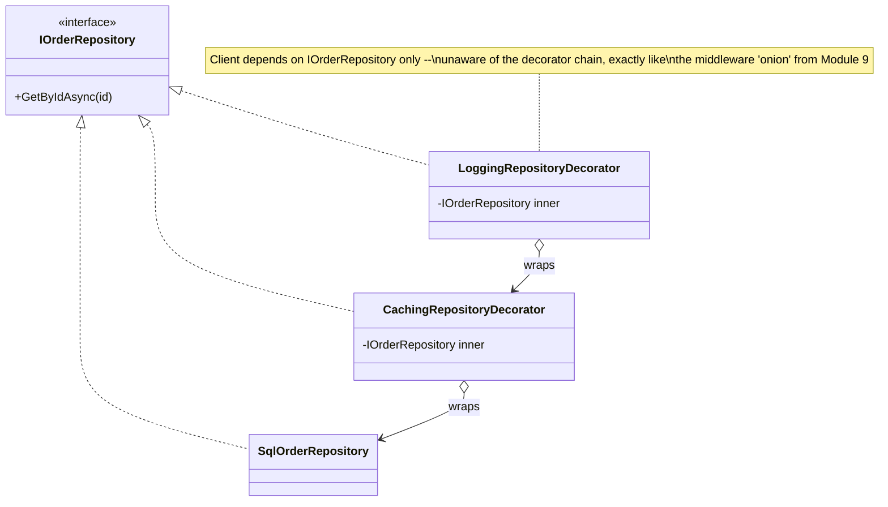

# Module 31 — Design Patterns: Creational & Structural Patterns

> Domain: Design Patterns | Level: Beginner → Expert | Prerequisite: [[../10-SOLID/01-SOLID-Principles-Deep-Dive]] (OCP, DIP — the principles these patterns operationalize), [[../02-DotNet-AspNetCore/02-DI-Container-Internals]]

---

## 1. Fundamentals

### What are design patterns, and what distinguishes creational from structural patterns?
Design patterns are **named, reusable solutions to recurring design problems** — a shared vocabulary letting engineers communicate a design intent concisely ("use a Decorator here") rather than re-explaining the mechanism from scratch every time. **Creational patterns** (Factory Method, Abstract Factory, Builder, Singleton, Prototype) address **how objects are constructed**, decoupling client code from the concrete types being instantiated. **Structural patterns** (Adapter, Decorator, Facade, Proxy, Composite, Bridge) address **how objects/classes are composed** into larger structures while keeping those structures flexible and loosely coupled.

### Why do these exist?
Both categories directly operationalize SOLID principles (Module 30) into concrete, reusable mechanisms — creational patterns are essentially DIP/OCP applied specifically to the *construction* problem (how do you introduce a new concrete type without modifying every call site that constructs objects), while structural patterns apply composition-over-inheritance (Module 29 §2.2) to specific, recurring composition needs (adapting an incompatible interface, adding behavior without subclassing, simplifying a complex subsystem's interface).

### When does this matter?
Any codebase with genuine construction complexity or structural composition needs; the depth matters for recognizing *which* pattern actually fits a given problem (a common interview and real-world failure: forcing a pattern where a simpler solution suffices) versus reflexively applying "design patterns" as an end in themselves.

### How does it work (30,000-ft view)?
```csharp
// Factory Method: defer WHICH concrete type to instantiate to a subclass/injected factory
public interface IPaymentGatewayFactory { IPaymentGateway Create(string region); }
public class PaymentGatewayFactory : IPaymentGatewayFactory
{
    public IPaymentGateway Create(string region) => region switch
    {
        "US" => new StripeGateway(),
        "EU" => new AdyenGateway(),
        _ => throw new NotSupportedException()
    };
}
```

---

## 2. Deep Dive — Creational Patterns

### 2.1 Factory Method vs Abstract Factory — the Precise Distinction
**Factory Method** defines an interface/abstract method for creating **one** object, letting subclasses/implementations decide the concrete type — a single-product creation concern. **Abstract Factory** provides an interface for creating **families of related objects** (e.g., a UI theme factory producing a matching `Button`, `Checkbox`, and `ScrollBar` all in the same visual style) — ensuring the *family's* internal consistency (you can't accidentally get a "dark theme" button with a "light theme" checkbox) is impossible to violate, since one factory instance produces the entire consistent set. The distinction matters precisely because "Abstract Factory" is frequently used loosely/incorrectly to describe what's actually just a Factory Method — the family-consistency guarantee is the defining, distinguishing feature.

### 2.2 Builder — Separating Complex Construction from Representation
The Builder pattern addresses constructing an object with **many optional parameters/configuration steps** without a telescoping-constructor anti-pattern (`new Pizza(size, crust, cheese, pepperoni, mushroom, olives, ...)` with a dozen boolean flags) — a fluent builder (`new PizzaBuilder().WithSize(Large).WithCrust(Thin).AddTopping(Pepperoni).Build()`) makes construction readable and self-documenting, and can enforce invariants (a `Build()` method validating the final configuration is coherent) that a plain object initializer or long constructor can't easily express. Module 6 §13's `Result<T>`/Module 7's record-with-`with`-expression patterns are a related but distinct "flexible object construction" concern — Builder specifically addresses **multi-step, conditional, validated** construction, not simple value-object creation.

### 2.3 Singleton — the Most Misunderstood and Misapplied Pattern
Singleton ensures a class has **exactly one instance**, globally accessible — but it is widely considered the **most over-used and problematic** GoF pattern in modern practice, specifically because it introduces global mutable state (making unit testing difficult — a Singleton's state persists across tests unless explicitly reset) and hides a dependency (any code calling `MySingleton.Instance` has an invisible, untracked dependency not visible in its constructor signature, directly the Service Locator anti-pattern from Module 10 §6). **Modern C#/DI-container practice achieves the same "one instance" guarantee via `Singleton`-lifetime DI registration** (Module 10 §2.1) instead of the classic static-instance Singleton pattern — getting the "one instance" benefit while keeping the dependency visible/injectable/mockable, and this substitution is precisely why the classic Singleton pattern is now considered largely obsolete in DI-container-based codebases, worth stating explicitly in an interview rather than presenting Singleton as an unconditionally good, still-current practice.

### 2.4 Prototype — Cloning as an Alternative to Construction
The Prototype pattern creates new objects by **cloning an existing instance** rather than constructing from scratch — useful when construction is expensive (a complex object graph) or when the exact concrete type isn't known at the call site (only that "a clone of this existing prototype instance" is needed) — directly related to, but distinct from, Module 7 §2.3's `with` expression (a language-level, shallow-clone-based non-destructive mutation mechanism for records specifically), and requiring the same shallow-vs-deep-copy vigilance Module 7 §4's incident demonstrated for `with`.

## 2. Deep Dive — Structural Patterns

### 2.5 Adapter — Making Incompatible Interfaces Work Together
Adapter wraps an existing class with an incompatible interface, translating calls to make it conform to the interface client code actually expects — the standard tool for integrating a third-party library (with its own, fixed API shape) into a codebase's own abstraction (an `IPaymentGateway` interface, with a `StripeGatewayAdapter` wrapping Stripe's actual SDK client to conform to that interface) — directly enabling DIP (Module 30 §2.4) even when the concrete dependency's native shape doesn't already match the abstraction the high-level module depends on.

### 2.6 Decorator — Adding Behavior Without Subclassing
Decorator wraps an object with the **same interface**, adding behavior before/after delegating to the wrapped instance — enabling **composable** behavior stacking (a `LoggingRepositoryDecorator` wrapping a `CachingRepositoryDecorator` wrapping the real `SqlRepository`, each adding one concern independently) without the combinatorial subclass explosion inheritance-based extension would require (a `LoggingCachingSqlRepository`, a `LoggingSqlRepository`, a `CachingSqlRepository`, etc., for every combination) — directly the exact mechanism behind Module 10 §11 Expert exercise's caching-repository-decorator example, and the Module 9 middleware pipeline's own "onion" composition model (Module 9 §2.1) is architecturally a Decorator-pattern-shaped design at the framework level.

### 2.7 Facade — Simplifying a Complex Subsystem's Interface
Facade provides a single, simplified interface over a complex subsystem with many interacting classes — not adding new capability, but **hiding complexity** behind a coherent, purpose-built entry point (an `OrderCheckoutFacade` internally coordinating inventory-checking, payment-processing, and shipping-calculation subsystems, exposing just `Checkout(cart)` to calling code) — the key distinguishing feature from Adapter is intent: Adapter exists to make an *incompatible* interface compatible; Facade exists to make a *complex* (but already-compatible) subsystem *simpler* to use.

### 2.8 Proxy — Controlling Access to an Object
Proxy provides a stand-in for another object, controlling access to it — common variants: a **virtual proxy** (deferring expensive object creation until actually needed, directly related to Module 10 §6's lazy-Singleton-construction discussion), a **protection proxy** (adding an authorization check before delegating, directly Module 12's resource-based authorization applied structurally as a proxy), and a **remote proxy** (representing an object that actually lives in a different process/machine — the conceptual shape underlying any generated gRPC/WCF client stub). The structural shape (same interface, wraps and delegates to a real object) is nearly identical to Decorator — the distinguishing factor is *intent*: Decorator adds behavior; Proxy controls access, often without the caller even being aware a proxy is interposed at all.

## 3. Visual Architecture


## 4. Production Example
**Scenario**: A team needed to add response caching, retry-with-backoff, and logging to an existing `IPaymentGateway` implementation (a third-party SDK wrapper) — the initial approach created a single `EnhancedPaymentGateway` class directly containing all three concerns' logic inline, which quickly became difficult to test in isolation (a bug in the retry logic required mocking through caching and logging code irrelevantly) and impossible to reuse the caching/retry logic for a *different* interface (`IShippingRateProvider`) without duplicating it. **Investigation**: recognized the underlying problem as forcing three genuinely independent, composable concerns into one monolithic class rather than three independently-testable, stackable Decorators. **Fix**: refactored into `CachingGatewayDecorator`, `RetryGatewayDecorator`, and `LoggingGatewayDecorator`, each implementing `IPaymentGateway` and wrapping an inner `IPaymentGateway`, composed at the DI registration point (`services.AddScoped<IPaymentGateway>(sp => new LoggingGatewayDecorator(new RetryGatewayDecorator(new CachingGatewayDecorator(new StripeGatewayAdapter(...)))))`) — each decorator independently unit-testable (mocking only its immediate inner dependency), and the retry/caching decorators directly reusable for `IShippingRateProvider` by simply making them generic over the wrapped interface type where the logic was interface-agnostic. **Lesson**: when multiple genuinely independent cross-cutting concerns need to wrap a single core operation, Decorator's composability is the correct structural pattern — a monolithic class combining all concerns inline both fails single-responsibility (Module 30 §2.1) and forfeits the reuse opportunity a properly-factored Decorator chain provides across multiple unrelated interfaces.

## 5. Best Practices
- Use Factory Method/Abstract Factory when construction logic needs to vary by context, especially for maintaining a consistent "family" of related objects (Abstract Factory specifically).
- Use Builder for objects with many optional/conditional construction parameters needing validation, not for simple, few-parameter object creation.
- Prefer DI-container `Singleton` lifetime over the classic static-instance Singleton pattern in DI-container-based codebases.
- Use Decorator for independently-composable cross-cutting concerns (caching, retry, logging) around a shared interface, rather than a monolithic class combining them inline.

## 6. Anti-patterns
- Using the classic static-instance Singleton pattern in a DI-container-based codebase instead of `Singleton`-lifetime registration (Module 10's captive-dependency/testability concerns apply identically).
- Forcing an Abstract Factory where a simple Factory Method suffices (no genuine "family consistency" requirement exists).
- A monolithic class combining multiple independent cross-cutting concerns inline instead of composable Decorators (§4's incident).
- Confusing Adapter and Facade's intent — using an Adapter to "simplify" an already-compatible interface, or a Facade to bridge a genuinely incompatible one.

---

## 10. Interview Questions

### Basic (10)
1. **Q: What's the difference between Factory Method and Abstract Factory?** **A:** Factory Method creates one type of object; Abstract Factory creates families of related objects, guaranteeing internal consistency across the family.
2. **Q: What problem does Builder solve?** **A:** Constructing an object with many optional/conditional parameters readably and with validation, avoiding a telescoping-constructor anti-pattern.
3. **Q: What does the Singleton pattern guarantee?** **A:** Exactly one instance of a class, globally accessible — with the modern caveat that hand-rolled Singletons (static instance + global access) are usually inferior to DI-container-managed singleton lifetimes, which give the same guarantee without hidden global state or testability loss.
4. **Q: Why is the classic Singleton pattern considered problematic in modern DI-based codebases?** **A:** It introduces global mutable state, hides dependencies from constructor signatures, and makes unit testing harder — largely superseded by DI-container `Singleton`-lifetime registration.
5. **Q: What does Adapter do?** **A:** Wraps a class with an incompatible interface, translating calls to conform to the interface client code expects.
6. **Q: What does Decorator do?** **A:** Wraps an object with the same interface, adding behavior before/after delegating, composably stackable.
7. **Q: What does Facade do?** **A:** Provides a single, simplified interface over a complex subsystem.
8. **Q: What does Proxy do?** **A:** Provides a stand-in controlling access to another object (deferred creation, authorization checks, or remote representation).
9. **Q: What's the key structural difference between Decorator and Proxy?** **A:** They're structurally nearly identical; the distinguishing factor is intent — Decorator adds behavior, Proxy controls access.
10. **Q: What is Prototype?** **A:** Creating new objects by cloning an existing instance rather than constructing from scratch.

### Intermediate (10)
1. **Q: Why does Abstract Factory's "family consistency" guarantee matter, concretely?** **A:** It makes it structurally impossible to accidentally mix incompatible components (a dark-theme button with a light-theme checkbox) since one factory instance produces the entire matched set — a plain Factory Method, called independently per component, offers no such guarantee.
2. **Q: Why can a Builder enforce invariants a plain object initializer can't?** **A:** The `Build()` method can validate the fully-assembled configuration before returning the object, rejecting an incoherent combination (e.g., "gluten-free crust" with "regular flour dusting") — an object initializer has no equivalent validation hook at the point of construction.
3. **Q: Why does the classic Singleton pattern hide a dependency, specifically?** **A:** Code calling `MySingleton.Instance` doesn't declare this dependency in its constructor signature — it's invisible to anyone reading the class's public API, unlike an injected dependency, which is visibly part of the constructor's parameter list.
4. **Q: Why is Adapter specifically valuable for satisfying DIP (Module 30 §2.4) when integrating a third-party library?** **A:** The third-party library's concrete shape rarely matches the abstraction a codebase's high-level modules depend on — Adapter bridges this gap, letting the high-level module depend on its own abstraction while the Adapter (a low-level detail) handles the translation to the actual third-party API.
5. **Q: Why does Decorator avoid the combinatorial subclass explosion inheritance-based extension would require?** **A:** Each decorator adds one concern independently and can be composed in any combination/order at runtime (via composition, Module 29 §2.2), whereas inheritance would require a distinct subclass for every combination of concerns needed (logging+caching, logging-only, caching-only, etc.).
6. **Q: Why might a Facade internally use Adapters, without the two patterns conflicting?** **A:** A Facade's job (simplifying a complex subsystem) can naturally involve some subsystem components having incompatible interfaces the Facade needs to bridge internally via Adapters — the two patterns operate at different levels of concern (Facade: simplification of the client-facing interface; Adapter: interface-compatibility bridging of specific internal components) and compose naturally.
7. **Q: Why is a virtual proxy (deferred construction) especially valuable for expensive-to-construct objects that are only conditionally needed?** **A:** It avoids paying the construction cost at all for the (possibly common) case where the object is never actually used, deferring the cost to the specific moment it's genuinely needed — directly the same lazy-construction trade-off discussed for Singletons in Module 10 §6.
8. **Q: Why does Prototype's cloning approach require the same shallow-vs-deep-copy vigilance as Module 7's `with` expressions?** **A:** A naive clone that only shallow-copies reference-type fields shares mutable state between the original and the clone, exactly Module 7 §2.3/§4's shallow-copy gotcha — a correct Prototype implementation must deliberately deep-copy (or use immutable member types) any mutable reference-type state to avoid unintended sharing.
9. **Q: Why would a protection proxy be preferable to scattering authorization checks directly inside business-logic methods?** **A:** It centralizes the authorization concern in one, consistently-applied location transparent to calling code, rather than requiring every business-logic method to remember to include its own check — directly the same "centralize invariant enforcement" reasoning from Module 29 §4's LSP-violation fix, applied here to authorization instead of a discount-calculation invariant.
10. **Q: Why might a remote proxy (a generated gRPC client stub) be considered a Proxy pattern instance even though it's auto-generated, not hand-written?** **A:** It still fulfills the Proxy pattern's defining structural/intent shape — presenting the same interface as if the real object were local, while actually delegating (over the network) to a remote implementation — code generation is just the *mechanism* producing the proxy, not a different pattern.

### Advanced (10)
1. **Q: Diagnose the monolithic-payment-gateway-wrapper production issue (§4) from first principles, and explain precisely why the Decorator refactor also improved code reuse, not just testability.**
   **A:** Root cause: three genuinely independent, composable concerns (caching, retry, logging) forced into one class, violating SRP (Module 30 §2.1) and making each concern's logic untestable in isolation from the others. The Decorator refactor's reuse benefit specifically comes from each decorator being written generically against the wrapped interface's *shape* where the cross-cutting logic itself doesn't care about the interface's specific business meaning (retry logic doesn't need to know it's wrapping a payment gateway versus a shipping-rate provider) — this is precisely why the same `RetryGatewayDecorator`-shaped logic (generalized to `RetryDecorator<TInterface>` if written generically) could be reused for `IShippingRateProvider` without duplication, a benefit the monolithic, business-logic-aware class could never have provided regardless of how well-tested it was.
2. **Q: Design an Abstract Factory for a multi-cloud deployment strategy needing to produce a consistent family of cloud-provider-specific clients (storage, queue, compute) for whichever provider a given deployment targets.**
   **A:**
   ```csharp
   public interface ICloudProviderFactory
   {
       IBlobStorage CreateBlobStorage();
       IMessageQueue CreateMessageQueue();
       ICompute CreateCompute();
   }
   public class AwsProviderFactory : ICloudProviderFactory
   {
       public IBlobStorage CreateBlobStorage() => new S3Storage();
       public IMessageQueue CreateMessageQueue() => new SqsQueue();
       public ICompute CreateCompute() => new Ec2Compute();
   }
   public class AzureProviderFactory : ICloudProviderFactory
   {
       public IBlobStorage CreateBlobStorage() => new BlobStorageAdapter();
       public IMessageQueue CreateMessageQueue() => new ServiceBusQueue();
       public ICompute CreateCompute() => new VirtualMachineCompute();
   }
   ```
   The family-consistency guarantee here is structural: resolving `ICloudProviderFactory` once (via DI, based on deployment configuration) and using it to construct all three dependent services guarantees they're all from the **same** provider — preventing an accidental, inconsistent mix (an AWS storage client paired with an Azure queue client) that independent Factory Methods for each service, chosen separately, could not structurally prevent.
3. **Q: Explain why a Builder pattern's fluent interface, if not carefully designed, can itself violate the Open/Closed Principle when new optional parameters are added over time.**
   **A:** If the Builder's `Build()` method contains a large, growing validation/assembly method handling every possible combination of configured options inline (rather than each `With*` method encapsulating its own validation/assignment independently), adding a new optional parameter requires modifying that shared `Build()` method — reproducing the exact OCP-violation shape from Module 30 §4's incident, just inside a Builder instead of a notification dispatcher; a well-designed Builder keeps each configuration step's logic self-contained, and `Build()`'s role limited to final, holistic cross-field validation that genuinely can't be expressed per-step, minimizing (though not always eliminating) this risk.
4. **Q: How would you decide between deep-copying a Prototype's mutable state versus redesigning the underlying object to be immutable (Module 7) entirely, eliminating the shallow-copy risk at its root?**
   **A:** If the object's mutable state is genuinely needed to change after construction (a stateful, long-lived entity with legitimate in-place mutation requirements), deep-copying in the clone operation is the necessary, correct fix; if the object is conceptually a value (its "identity" doesn't matter, only its data) and mutation-after-construction isn't actually a genuine requirement, redesigning it as an immutable record (Module 7) eliminates the shallow-copy risk category entirely, since `with`-based non-destructive "cloning" then only requires the same immutable-member-type discipline Module 7 §5 already establishes — the deeper architectural fix (immutability) is preferable whenever the object's actual semantics support it, rather than perpetually managing deep-copy correctness for an object that didn't need mutable identity in the first place.
5. **Q: Design a virtual proxy for a very expensive-to-construct reporting-data object, and explain how it interacts with the captive-dependency concerns from Module 10.**
   **A:**
   ```csharp
   public class LazyReportDataProxy : IReportData
   {
       private readonly Lazy<IReportData> _lazyInner;
       public LazyReportDataProxy(Func<IReportData> factory) => _lazyInner = new Lazy<IReportData>(factory);
       public ReportSummary GetSummary() => _lazyInner.Value.GetSummary(); // construction deferred until FIRST actual use
   }
   ```
   If `factory` itself resolves a `Scoped` dependency (e.g., a `DbContext`-backed report builder), this proxy must itself be `Scoped` (not `Singleton`) to avoid exactly Module 10 §2.2's captive-dependency violation — a virtual proxy's deferred-construction benefit doesn't exempt it from the same DI-lifetime rules governing whatever it ultimately constructs; the proxy's own lifetime must still correctly match its wrapped dependency's actual lifetime requirements.
6. **Q: Explain a scenario where using Adapter to wrap a legacy system creates a long-term architectural liability if not deliberately time-boxed.**
   **A:** An Adapter wrapping a legacy, soon-to-be-replaced system is often introduced as a deliberate, temporary bridge during a migration (directly this course's recurring "expand, don't break" incremental-migration pattern) — but if the "temporary" Adapter is never revisited once the migration stalls or is deprioritized, the codebase can end up permanently depending on an ever-more-elaborate Adapter compensating for the legacy system's ongoing quirks, effectively freezing the legacy system's replacement indefinitely since the Adapter's existence removes the *visible pressure* to actually complete the migration; treating any migration-motivated Adapter as carrying an explicit, tracked "removal date"/follow-up ticket (not just a design pattern applied and forgotten) is the practical mitigation.
7. **Q: How would you test a Decorator chain (§4's fix) to ensure the decorators compose correctly in the intended order, beyond just testing each decorator in isolation?**
   **A:** In addition to isolated unit tests for each decorator (mocking only its immediate inner dependency), write an **integration-style test** constructing the actual, fully-composed chain (`LoggingGatewayDecorator(RetryGatewayDecorator(CachingGatewayDecorator(mockInnerGateway)))`) and asserting the end-to-end *observable* behavior is correct for a scenario exercising the interaction between layers (e.g., "a transient failure is retried, and the eventual successful result is then cached, and the whole sequence is logged exactly once") — isolated per-decorator tests alone can't catch an ordering mistake (e.g., caching wrapping retry instead of the reverse, which would incorrectly cache a result from only the first, possibly-failed attempt) that only manifests in the composed chain's actual behavior.
8. **Q: Explain why a protection proxy (§8) is architecturally similar to, but not identical to, the ASP.NET Core authorization middleware/filter mechanisms covered in Module 12.**
   **A:** Both intercept a call and enforce an authorization decision before allowing it to proceed — the structural difference is scope and mechanism: Module 12's middleware/filters operate at the HTTP-request-pipeline level, wrapping an entire endpoint's execution; a protection proxy operates at the level of an individual object/interface, wrapping any specific method call regardless of whether it's reached via an HTTP request at all (e.g., protecting a domain object accessed from a background job, not just a web request) — the protection-proxy pattern is the more general, HTTP-independent formulation of the same underlying "intercept and authorize before delegating" idea Module 12 applies specifically within the ASP.NET Core request pipeline.
9. **Q: A team proposes wrapping every single service interface in the codebase with a logging Decorator "for consistency and observability," regardless of whether that specific service's calls are actually valuable to log. Evaluate this as a Principal Engineer.**
   **A:** Push back on blanket, undifferentiated application — logging every single interface call indiscriminately (including high-frequency, low-diagnostic-value calls) adds real overhead (Module 1's allocation/CPU cost for the added logging calls, potentially significant at high call volume) and log-noise cost (making genuinely important log entries harder to find amid routine ones) without a corresponding, deliberate diagnostic benefit; recommend applying the logging Decorator **selectively**, to specifically-identified, genuinely valuable-to-observe boundaries (external API calls, database operations at a coarse granularity) — the same "apply the pattern where its benefit is deliberately justified, not reflexively everywhere" discipline recurring throughout this course's treatment of every architectural technique.
10. **Q: As a Principal Engineer, how would you teach a team to recognize *which* creational/structural pattern fits a given problem, rather than memorizing pattern names and definitions?**
    **A:** Teach pattern recognition via the **problem shape**, not the pattern name: "do you need to guarantee a consistent family of related objects?" → Abstract Factory; "is construction complex/multi-step with validation needs?" → Builder; "do you need to add independently-composable behavior around an existing interface?" → Decorator; "do you need to bridge an incompatible interface?" → Adapter; "do you need to simplify a complex subsystem's interface?" → Facade; "do you need to control/defer access to an object?" → Proxy — framing pattern selection as answering a specific, diagnostic question about the actual problem at hand (directly mirroring this course's recurring "match the tool to the demonstrated need, not a default reflex" theme) builds transferable design judgment, whereas memorizing UML diagrams and definitions in isolation produces exactly the "reflexively apply patterns without matching them to genuine need" anti-pattern this module's §6/Advanced Q9 explicitly warn against.

---

## 11. Coding Exercises

### Easy — Factory Method for region-specific payment gateways
```csharp
public interface IPaymentGatewayFactory { IPaymentGateway Create(string region); }
public class PaymentGatewayFactory : IPaymentGatewayFactory
{
    public IPaymentGateway Create(string region) => region switch
    {
        "US" => new StripeGateway(),
        "EU" => new AdyenGateway(),
        _ => throw new NotSupportedException($"No gateway configured for region {region}")
    };
}
```

### Medium — Builder with validated, multi-step construction
```csharp
public class ReportBuilder
{
    private readonly List<string> _columns = new();
    private DateRange? _dateRange;
    private string? _groupBy;

    public ReportBuilder WithColumns(params string[] columns) { _columns.AddRange(columns); return this; }
    public ReportBuilder WithDateRange(DateTime from, DateTime to) { _dateRange = new DateRange(from, to); return this; }
    public ReportBuilder GroupBy(string column) { _groupBy = column; return this; }

    public Report Build()
    {
        if (_columns.Count == 0) throw new InvalidOperationException("At least one column is required.");
        if (_dateRange is null) throw new InvalidOperationException("A date range is required.");
        if (_groupBy is not null && !_columns.Contains(_groupBy))
            throw new InvalidOperationException("GroupBy column must be one of the selected columns."); // cross-field validation
        return new Report(_columns, _dateRange, _groupBy);
    }
}
```

### Hard — Composable Decorator chain (§4's fix, generalized)
```csharp
public class RetryDecorator<TService> where TService : class
{
    // Illustrative -- a genuinely generic retry decorator requires dynamic proxy generation
    // (e.g., via Castle DynamicProxy or a source generator) to implement TService generically;
    // shown here in its concrete, interface-specific form for clarity:
}

public class RetryGatewayDecorator : IPaymentGateway
{
    private readonly IPaymentGateway _inner;
    public RetryGatewayDecorator(IPaymentGateway inner) => _inner = inner;

    public async Task<bool> ChargeAsync(decimal amount)
    {
        for (int attempt = 1; ; attempt++)
        {
            try { return await _inner.ChargeAsync(amount); }
            catch (TransientGatewayException) when (attempt < 3)
            {
                await Task.Delay(TimeSpan.FromMilliseconds(100 * attempt));
            }
        }
    }
}

public class CachingGatewayDecorator : IPaymentGateway
{
    private readonly IPaymentGateway _inner;
    private readonly IMemoryCache _cache;
    public CachingGatewayDecorator(IPaymentGateway inner, IMemoryCache cache) { _inner = inner; _cache = cache; }

    public Task<bool> ChargeAsync(decimal amount) => _inner.ChargeAsync(amount); // caching N/A for charges (non-idempotent!) --
                                                                                    // shown here only to illustrate composition structure

}
// Composition order matters (Advanced Q7): Retry MUST wrap the innermost real gateway call
// so each retry attempt genuinely re-executes; Logging typically wraps OUTERMOST to observe
// the full retry sequence's eventual outcome as ONE logged event.
```

### Expert — Protection proxy enforcing resource-based authorization transparently (Advanced Q8)
```csharp
public class AuthorizingOrderRepositoryProxy : IOrderRepository
{
    private readonly IOrderRepository _inner;
    private readonly IAuthorizationService _authService;
    private readonly ClaimsPrincipal _currentUser;

    public AuthorizingOrderRepositoryProxy(IOrderRepository inner, IAuthorizationService authService, ClaimsPrincipal currentUser)
    {
        _inner = inner; _authService = authService; _currentUser = currentUser;
    }

    public async Task<Order?> GetByIdAsync(string id)
    {
        var order = await _inner.GetByIdAsync(id);
        if (order is null) return null;

        var authResult = await _authService.AuthorizeAsync(_currentUser, order, "OrderAccess");
        return authResult.Succeeded ? order : null; // caller sees "not found," never distinguishing unauthorized (Module 12 §8)
    }
}
// Callers depend on IOrderRepository as normal -- COMPLETELY UNAWARE that authorization
// enforcement is happening transparently via this proxy, wired in at the DI registration point.
```
**Discussion**: This directly operationalizes Module 12 §2.4's resource-based authorization as a structural, Proxy-pattern-shaped design — every caller of `IOrderRepository.GetByIdAsync` automatically gets authorization enforcement without needing to remember to call `IAuthorizationService` manually at every call site, exactly the "centralize the enforcement, don't trust every call site to remember it independently" principle this course returns to repeatedly (Module 29 §4, Module 30's OCP discussion).

---

## 12–17. System Design / LLD / Debugging / Decision / Case Study / Principal

A payments platform (§4) uses Decorator chains for composable cross-cutting concerns (caching, retry, logging) around its `IPaymentGateway` abstraction, an Abstract Factory (Advanced Q2) for its multi-cloud provider-consistency guarantee, and a protection proxy (Expert exercise) transparently enforcing resource-based authorization across every repository access path. The signature production incident (§4) — a monolithic gateway wrapper combining independent concerns inline, both untestable in isolation and unreusable across interfaces — is this module's central lesson: genuinely independent, composable cross-cutting concerns are Decorator's textbook use case, and forcing them into one class violates SRP while forfeiting the reuse benefit a properly-factored chain provides. Principal-level guidance: teach pattern selection via problem-shape diagnostic questions (Advanced Q10), building transferable design judgment rather than pattern-name memorization — and apply every pattern deliberately, where its benefit is demonstrated, never reflexively (Advanced Q9's logging-Decorator-everywhere anti-pattern).

## 18. Revision
**Key takeaways**: Factory Method (one product) vs. Abstract Factory (a consistent family of related products) — the family-consistency guarantee is the defining distinction. Builder handles complex, multi-step, validated construction; classic Singleton is largely superseded by DI-container `Singleton`-lifetime registration in modern codebases. Adapter bridges incompatible interfaces (enabling DIP with third-party code); Decorator composably adds behavior around a shared interface (avoiding inheritance's combinatorial subclass explosion); Facade simplifies a complex subsystem's interface; Proxy controls/defers access (virtual, protection, remote variants) — structurally near-identical to Decorator, distinguished by intent (access control vs. behavior addition).

---

**Next**: Continuing autonomously to Module 32 — Behavioral Design Patterns (Strategy, Observer, Command, Template Method, Chain of Responsibility) to complete the `11-Design-Patterns` domain.
