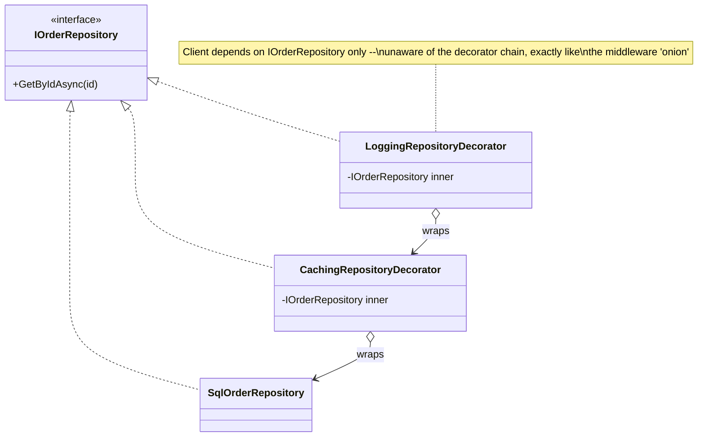
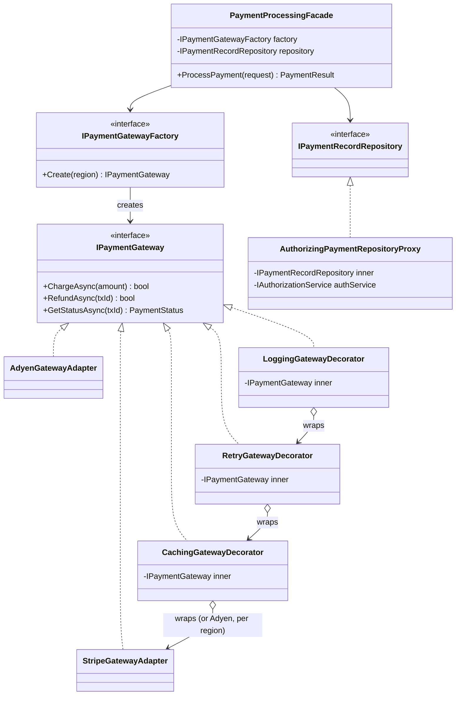
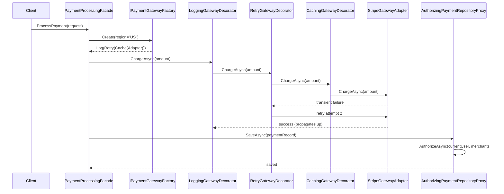

# Module 31 — Design Patterns: Creational & Structural Patterns

> Domain: Design Patterns | Level: Beginner → Expert | Prerequisite: [[../10-SOLID/01-SOLID-Principles-Deep-Dive]] (OCP, DIP — the principles these patterns operationalize), [[../02-DotNet-AspNetCore/02-DI-Container-Internals]]

---

## 1. Fundamentals

### What are design patterns, and what distinguishes creational from structural patterns?
Design patterns are **named, reusable solutions to recurring design problems** — a shared vocabulary letting engineers communicate a design intent concisely ("use a Decorator here") rather than re-explaining the mechanism from scratch every time. **Creational patterns** (Factory Method, Abstract Factory, Builder, Singleton, Prototype) address **how objects are constructed**, decoupling client code from the concrete types being instantiated. **Structural patterns** (Adapter, Decorator, Facade, Proxy, Composite, Bridge) address **how objects/classes are composed** into larger structures while keeping those structures flexible and loosely coupled.

### Why do these exist?
Both categories directly operationalize SOLID principles into concrete, reusable mechanisms — creational patterns are essentially DIP/OCP applied specifically to the *construction* problem (how do you introduce a new concrete type without modifying every call site that constructs objects), while structural patterns apply composition-over-inheritance to specific, recurring composition needs (adapting an incompatible interface, adding behavior without subclassing, simplifying a complex subsystem's interface).

### When does this matter?
Any codebase with genuine construction complexity or structural composition needs; the depth matters for recognizing *which* pattern actually fits a given problem (a common interview and real-world failure: forcing a pattern where a simpler solution suffices) versus reflexively applying "design patterns" as an end in themselves.

### How does it work (30,000-ft view)?
```csharp
// C# — Factory Method: defer WHICH concrete type to instantiate to an injected factory
public interface IPaymentGatewayFactory { IPaymentGateway Create(string region); }
public sealed class PaymentGatewayFactory : IPaymentGatewayFactory
{
    public IPaymentGateway Create(string region) => region switch
    {
        "US" => new StripeGateway(),
        "EU" => new AdyenGateway(),
        _    => throw new NotSupportedException($"No gateway for region {region}")
    };
}
```
```java
// Java — same pattern. GoF patterns are language-neutral; only the syntax and a few
// idioms shift (functional interfaces, no properties, Streams). See §2.9 for the full mapping.
public interface PaymentGatewayFactory { PaymentGateway create(String region); }

public final class DefaultPaymentGatewayFactory implements PaymentGatewayFactory {
    public PaymentGateway create(String region) {
        return switch (region) {
            case "US" -> new StripeGateway();
            case "EU" -> new AdyenGateway();
            default   -> throw new UnsupportedOperationException("No gateway for region " + region);
        };
    }
}
```

---

## 2. Deep Dive — Creational Patterns

### 2.1 Factory Method vs Abstract Factory — the Precise Distinction
**Factory Method** defines an interface/abstract method for creating **one** object, letting subclasses/implementations decide the concrete type — a single-product creation concern. **Abstract Factory** provides an interface for creating **families of related objects** (e.g., a UI theme factory producing a matching `Button`, `Checkbox`, and `ScrollBar` all in the same visual style) — ensuring the *family's* internal consistency (you can't accidentally get a "dark theme" button with a "light theme" checkbox) is impossible to violate, since one factory instance produces the entire consistent set. The distinction matters precisely because "Abstract Factory" is frequently used loosely/incorrectly to describe what's actually just a Factory Method — the family-consistency guarantee is the defining, distinguishing feature.

### 2.2 Builder — Separating Complex Construction from Representation
The Builder pattern addresses constructing an object with **many optional parameters/configuration steps** without a telescoping-constructor anti-pattern (`new Pizza(size, crust, cheese, pepperoni, mushroom, olives, ...)` with a dozen boolean flags) — a fluent builder (`new PizzaBuilder().WithSize(Large).WithCrust(Thin).AddTopping(Pepperoni).Build()`) makes construction readable and self-documenting, and can enforce invariants (a `Build()` method validating the final configuration is coherent) that a plain object initializer or long constructor can't easily express. The `record`-with-`with`-expression pattern is a related but distinct "flexible object construction" concern — Builder specifically addresses **multi-step, conditional, validated** construction, not simple value-object creation. (Java leans on Builder more heavily because it has no object-initializer or `with` syntax — §2.9.)

### 2.3 Singleton — the Most Misunderstood and Misapplied Pattern
Singleton ensures a class has **exactly one instance**, globally accessible — but it is widely considered the **most over-used and problematic** GoF pattern in modern practice, specifically because it introduces global mutable state (making unit testing difficult — a Singleton's state persists across tests unless explicitly reset) and hides a dependency (any code calling `MySingleton.Instance` has an invisible, untracked dependency not visible in its constructor signature, directly the Service Locator anti-pattern). **Modern C#/DI-container practice achieves the same "one instance" guarantee via `Singleton`-lifetime DI registration** instead of the classic static-instance Singleton pattern — getting the "one instance" benefit while keeping the dependency visible/injectable/mockable, and this substitution is precisely why the classic Singleton pattern is now considered largely obsolete in DI-container-based codebases, worth stating explicitly in an interview rather than presenting Singleton as an unconditionally good, still-current practice.

### 2.4 Prototype — Cloning as an Alternative to Construction
The Prototype pattern creates new objects by **cloning an existing instance** rather than constructing from scratch — useful when construction is expensive (a complex object graph) or when the exact concrete type isn't known at the call site (only that "a clone of this existing prototype instance" is needed) — directly related to, but distinct from, the `with` expression (a language-level, shallow-clone-based non-destructive mutation mechanism for records specifically), and requiring the same shallow-vs-deep-copy vigilance a `with` expression does (it copies references, not the graphs behind them).

## 2. Deep Dive — Structural Patterns

### 2.5 Adapter — Making Incompatible Interfaces Work Together
Adapter wraps an existing class with an incompatible interface, translating calls to make it conform to the interface client code actually expects — the standard tool for integrating a third-party library (with its own, fixed API shape) into a codebase's own abstraction (an `IPaymentGateway` interface, with a `StripeGatewayAdapter` wrapping Stripe's actual SDK client to conform to that interface) — directly enabling DIP even when the concrete dependency's native shape doesn't already match the abstraction the high-level module depends on.

### 2.6 Decorator — Adding Behavior Without Subclassing
Decorator wraps an object with the **same interface**, adding behavior before/after delegating to the wrapped instance — enabling **composable** behavior stacking (a `LoggingRepositoryDecorator` wrapping a `CachingRepositoryDecorator` wrapping the real `SqlRepository`, each adding one concern independently) without the combinatorial subclass explosion inheritance-based extension would require (a `LoggingCachingSqlRepository`, a `LoggingSqlRepository`, a `CachingSqlRepository`, etc., for every combination) — directly the exact mechanism behind the caching-repository-decorator example, and the middleware pipeline's own "onion" composition model is architecturally a Decorator-pattern-shaped design at the framework level.

### 2.7 Facade — Simplifying a Complex Subsystem's Interface
Facade provides a single, simplified interface over a complex subsystem with many interacting classes — not adding new capability, but **hiding complexity** behind a coherent, purpose-built entry point (an `OrderCheckoutFacade` internally coordinating inventory-checking, payment-processing, and shipping-calculation subsystems, exposing just `Checkout(cart)` to calling code) — the key distinguishing feature from Adapter is intent: Adapter exists to make an *incompatible* interface compatible; Facade exists to make a *complex* (but already-compatible) subsystem *simpler* to use.

### 2.8 Proxy — Controlling Access to an Object
Proxy provides a stand-in for another object, controlling access to it — common variants: a **virtual proxy** (deferring expensive object creation until actually needed, directly related to the lazy-Singleton-construction discussion), a **protection proxy** (adding an authorization check before delegating, directly the resource-based authorization applied structurally as a proxy), and a **remote proxy** (representing an object that actually lives in a different process/machine — the conceptual shape underlying any generated gRPC/WCF client stub). The structural shape (same interface, wraps and delegates to a real object) is nearly identical to Decorator — the distinguishing factor is *intent*: Decorator adds behavior; Proxy controls access, often without the caller even being aware a proxy is interposed at all.

### 2.9 Creational & Structural Patterns in C# and Java — the Same Patterns, Different Machinery

The GoF patterns are language-neutral; a FinTech interviewer at a Java shop asks the identical questions. What shifts is the idiom, and a few patterns are *subsumed by the language* differently in each.

| Pattern / concern | C# | Java |
|---|---|---|
| **Factory Method** | `switch` expression returning `new X()`; or an injected `Func<string, IGateway>` | `switch` expression (Java 14+); or an injected `Function<String, Gateway>` |
| **Abstract Factory** | interface producing a family; DI registers the concrete factory | identical; or an `enum` where each constant overrides factory methods (a very Java idiom for a fixed family) |
| **Builder** | fluent methods returning `this` + `Build()` validating; or a `record` + `with` for simple cases | fluent methods returning `this` + `build()` validating; **no `with`** so the Builder does more work here; Lombok `@Builder` is common but hides the validation hook |
| **Singleton** | **superseded** by `services.AddSingleton<T>()` DI lifetime | **superseded** by a Spring `@Component` (singleton scope by default) / Guice `@Singleton`; the classic form is `enum Singleton { INSTANCE }` (Effective Java Item 3 — serialization- and reflection-safe), or a static holder class for lazy init |
| **Prototype** | `ICloneable` (discouraged); `record` `with`; a hand-written `Clone()` | `Cloneable`/`clone()` is a **known-broken** JDK design (Effective Java Item 13) — prefer a copy constructor or copy factory; `record` (16+) gives value semantics but no built-in copy-with-change |
| **Adapter** | a wrapper class implementing your `IGateway`, delegating to the vendor SDK | identical wrapper class implementing your `Gateway` interface |
| **Decorator** | wrapper implementing the same interface; DI can chain them; dynamic proxy via Castle for generic decorators | wrapper implementing the same interface; **`java.lang.reflect.Proxy`** (JDK, no library) for a generic interface decorator; Spring AOP for cross-cutting decoration |
| **Facade** | a coordinating class exposing one method | identical |
| **Proxy** | a wrapper class; or `DispatchProxy` (BCL) / Castle DynamicProxy for runtime generation | a wrapper class; or **`Proxy.newProxyInstance(...)`** with an `InvocationHandler` — runtime interface proxying is *built into the JDK*, which is why AOP-style protection/logging proxies are so idiomatic in Java |
| Object initialization | object initializers `new X { A = 1 }`; primary constructors (C# 12) | constructors only; the Builder is reached for sooner because there is no initializer syntax |

**Where the languages genuinely diverge for these patterns:**

- **Runtime proxying is a JDK primitive in Java.** `java.lang.reflect.Proxy` + `InvocationHandler` lets you wrap *any* interface with cross-cutting behavior (auth, logging, retry, transactions) with no code generation and no library — which is why the Decorator/Proxy patterns, and frameworks built on them (Spring AOP, JPA lazy-loading, mock libraries), are pervasive. C#'s nearest built-in is `DispatchProxy`; the richer story (`Castle.DynamicProxy`) is a library. So a Java answer to "add authorization transparently to every repository call" (Expert exercise) idiomatically reaches for a dynamic proxy / AOP aspect; the C# answer reaches for a hand-written decorator per interface or a source generator.
- **Singleton's canonical safe form differs.** C#: don't write it — use DI. Java: if you truly need one without a container, `enum Singleton { INSTANCE }` is the recommended form because it's immune to reflection and serialization attacks that break lazy-holder implementations; still, DI (Spring's default singleton scope) is the real answer in application code.
- **`clone()` / `ICloneable` are both discouraged, for different reasons.** Java's `Cloneable` is a broken contract (no `clone()` method on the interface, shallow-by-default, `protected`); the fix is a copy constructor. C#'s `ICloneable` is discouraded because it doesn't specify deep vs. shallow. Both languages land on "write an explicit copy constructor / factory," and both face the same shallow-vs-deep vigilance the `with`-expression incident showed.
- **Builder carries more weight in Java** precisely because there is no object-initializer or `with` syntax — the telescoping-constructor problem is sharper, so Builder (or a `record` with a compact canonical constructor for validation) shows up earlier and more often.

**Adapter, Facade, Decorator (hand-written), and Factory Method port line-for-line** — the intent distinctions (Adapter = incompatible→compatible; Facade = complex→simple; Proxy = access control; Decorator = behavior addition) are identical in both languages.

## 3. Visual Architecture

```mermaid
classDiagram
 class IOrderRepository {
 <<interface>>
 +GetByIdAsync(id)
 }
 class SqlOrderRepository
 class CachingRepositoryDecorator {
 -IOrderRepository inner
 }
 class LoggingRepositoryDecorator {
 -IOrderRepository inner
 }
 IOrderRepository <|.. SqlOrderRepository
 IOrderRepository <|.. CachingRepositoryDecorator
 IOrderRepository <|.. LoggingRepositoryDecorator
 LoggingRepositoryDecorator o--> CachingRepositoryDecorator: wraps
 CachingRepositoryDecorator o--> SqlOrderRepository: wraps
 note for LoggingRepositoryDecorator "Client depends on IOrderRepository only --\nunaware of the decorator chain, exactly like\nthe middleware 'onion' "
```

## 4. Production Example
**Scenario**: A team needed to add response caching, retry-with-backoff, and logging to an existing `IPaymentGateway` implementation (a third-party SDK wrapper) — the initial approach created a single `EnhancedPaymentGateway` class directly containing all three concerns' logic inline, which quickly became difficult to test in isolation (a bug in the retry logic required mocking through caching and logging code irrelevantly) and impossible to reuse the caching/retry logic for a *different* interface (`IShippingRateProvider`) without duplicating it. **Investigation**: recognized the underlying problem as forcing three genuinely independent, composable concerns into one monolithic class rather than three independently-testable, stackable Decorators. **Fix**: refactored into `CachingGatewayDecorator`, `RetryGatewayDecorator`, and `LoggingGatewayDecorator`, each implementing `IPaymentGateway` and wrapping an inner `IPaymentGateway`, composed at the DI registration point (`services.AddScoped<IPaymentGateway>(sp => new LoggingGatewayDecorator(new RetryGatewayDecorator(new CachingGatewayDecorator(new StripeGatewayAdapter(...)))))`) — each decorator independently unit-testable (mocking only its immediate inner dependency), and the retry/caching decorators directly reusable for `IShippingRateProvider` by simply making them generic over the wrapped interface type where the logic was interface-agnostic. **Lesson**: when multiple genuinely independent cross-cutting concerns need to wrap a single core operation, Decorator's composability is the correct structural pattern — a monolithic class combining all concerns inline both fails single-responsibility and forfeits the reuse opportunity a properly-factored Decorator chain provides across multiple unrelated interfaces.

## 5. Best Practices
- Use Factory Method/Abstract Factory when construction logic needs to vary by context, especially for maintaining a consistent "family" of related objects (Abstract Factory specifically).
- Use Builder for objects with many optional/conditional construction parameters needing validation, not for simple, few-parameter object creation.
- Prefer DI-container `Singleton` lifetime over the classic static-instance Singleton pattern in DI-container-based codebases.
- Use Decorator for independently-composable cross-cutting concerns (caching, retry, logging) around a shared interface, rather than a monolithic class combining them inline.

## 6. Anti-patterns
- Using the classic static-instance Singleton pattern in a DI-container-based codebase instead of `Singleton`-lifetime registration (the captive-dependency/testability concerns apply identically).
- Forcing an Abstract Factory where a simple Factory Method suffices (no genuine "family consistency" requirement exists).
- A monolithic class combining multiple independent cross-cutting concerns inline instead of composable Decorators (the §4 payment-gateway-wrapper incident).
- Confusing Adapter and Facade's intent — using an Adapter to "simplify" an already-compatible interface, or a Facade to bridge a genuinely incompatible one.

---

## 7. Performance Engineering

**CPU/allocation cost of pattern overhead:** A Decorator chain of depth *n* adds *n* virtual-dispatch hops per call — for the `LoggingGatewayDecorator(RetryGatewayDecorator(CachingGatewayDecorator(StripeGatewayAdapter)))` chain, every `ChargeAsync` call pays three extra virtual calls before reaching the real gateway. On modern .NET this is typically 1-3ns per virtual call (a vtable/interface-dispatch lookup, not a heap allocation) — negligible against an actual network round-trip to a payment provider (50-300ms), but measurable and worth avoiding in a hot, in-process, allocation-sensitive path (e.g., a market-data tick-processing pipeline calling a Decorator-wrapped price normalizer millions of times/second, where 3ns × millions of calls/sec becomes a visible line in a CPU profile).

**Allocation cost:** Each Decorator/Proxy/Adapter instance is itself a heap allocation, but these are typically constructed **once** at DI-composition time (`services.AddScoped<IPaymentGateway>(sp => new Logging(new Retry(new Caching(...))))`), not per-call — the real allocation cost to watch for is a Decorator that captures per-call state via closures or boxes value types on every invocation (e.g., a logging decorator that builds a new `Dictionary<string,object>` of structured-log properties on every call instead of using a pre-allocated, pooled buffer or `LoggerMessage` source-generated delegates).

**Factory allocation patterns:** A Factory Method invoked in a hot path (e.g., re-resolving `IPaymentGatewayFactory.Create(region)` per request instead of caching the resolved gateway per region) repeats a `switch`-based lookup and, depending on implementation, a fresh object allocation each time — for genuinely stateless gateway adapters, caching the constructed instance per region (a `ConcurrentDictionary<string, IPaymentGateway>` memoized inside the factory, or simply registering region-specific gateways as DI singletons keyed by region) eliminates the repeated allocation entirely.

**Builder cost:** A fluent Builder that mutates and returns `this` (the common case) allocates once regardless of how many `With*` calls chain onto it; a Builder implemented as an immutable `record`-returning-`with` chain instead allocates one new object per step — fine for a handful of Builder calls per request, but a real cost difference to know when justifying "why does our Builder mutate an internal list instead of using `with` expressions" in a code review.

**Proxy/virtual-dispatch cost for high-frequency paths:** A protection proxy (Expert exercise) adds an authorization-service call on **every** access — acceptable for a `GetByIdAsync` called once per HTTP request, but if the same proxy wraps a repository called in a tight loop (e.g., authorizing each of 10,000 rows individually while streaming a report), the authorization check's cost (frequently itself a database or cache round-trip) dominates; the fix is batching the authorization decision (authorize the *query*, not each *row*) rather than removing the proxy.

**Benchmarking guidance:** Benchmark a Decorator/Proxy chain's overhead with `BenchmarkDotNet` against the raw, undecorated call to get an honest per-hop cost, and always benchmark in the context the pattern will actually run in (in-process CPU-bound loop vs. I/O-bound network call) — the same 3ns virtual-dispatch cost that's completely irrelevant wrapped around a 100ms network call becomes the dominant cost wrapped around a 10ns in-memory computation.

---

## 8. Security

**Threats:** The classic static-instance Singleton (§2.3) holding **mutable, request-scoped-looking state** (e.g., a "current user" or "current tenant" field set by one request and read by another) is a direct multi-tenant data-leak vector in any ASP.NET Core app, because a Singleton's lifetime spans the entire process, not one request — if code ever assigns to a Singleton's mutable field from within a request handler, that assignment is visible to **every concurrently-executing request** on the same process, not just the request that set it. This is precisely the shape of the Production Debugging incident below.

**Mitigations:** Never store per-request/per-tenant mutable state in a `Singleton`-lifetime object; if a Singleton needs per-request context, inject `IHttpContextAccessor` (itself safe, since it reads `AsyncLocal`-flowed, per-request-scoped context) rather than storing the context as a field. Treat any Singleton with a settable, non-`readonly` field as a code-review red flag requiring justification.

**Untrusted-type instantiation via Factory:** A Factory Method or Abstract Factory that constructs a type by name from **untrusted input** (e.g., `Type.GetType(userSuppliedTypeName)` or a `switch` driven by a deserialized string from an external payload, then `Activator.CreateInstance`) is a direct code-execution/deserialization-gadget risk — an attacker able to influence the "which type to construct" input can potentially instantiate an arbitrary type on the classpath with attacker-controlled constructor arguments, one of the standard mechanisms behind insecure-deserialization CVEs (the same underlying risk class as `BinaryFormatter`/`Newtonsoft.Json TypeNameHandling.All`). A Factory's `switch`/lookup **must** be closed over a fixed, hardcoded, allow-listed set of known types (exactly as `PaymentGatewayFactory`'s region `switch` does) — never open-ended reflection driven directly by untrusted input.

**OWASP mapping:** A mutable-state Singleton leaking data across tenants maps to OWASP's Broken Access Control / sensitive-data-exposure categories; a reflection-driven Factory instantiating attacker-influenced types maps to Insecure Deserialization (A08:2021 — Software and Data Integrity Failures).

**AuthN/AuthZ:** A protection proxy (§2.8) centralizes authorization — but only as strongly as its own placement is enforced; if any code path can reach the wrapped `SqlOrderRepository` directly (bypassing the `AuthorizingOrderRepositoryProxy`), the proxy provides no real guarantee. DI registration must bind the interface exclusively to the proxy-wrapped chain, and the inner, unwrapped implementation should not itself be separately registered/resolvable.

**Secrets:** A Decorator/Proxy that logs request/response payloads (the `LoggingGatewayDecorator`) must be reviewed for what it actually logs — a naive `logger.LogInformation("Charging {Amount} with card {Card}", amount, cardNumber)` inside a logging decorator wrapping a payment gateway is a PCI-DSS violation baked directly into a "harmless" cross-cutting concern; logging decorators need the same secret/PII redaction discipline as any other logging code, arguably more so since they're applied broadly and easy to forget are on the hot path of every call.

**Encryption:** Not pattern-specific; standard in-transit/at-rest requirements apply to whatever the Adapter/Proxy/Decorator ultimately transmits or persists.

---

## 9. Scalability

**Codebase/team scaling:** Decorator's composability is a direct enabler of **team-boundary scaling** — a platform team can own the caching/retry/logging decorators as shared, independently-versioned components while product teams own the core business-logic implementations they wrap, with the DI composition root as the single, small point of integration between the two ownership domains; a monolithic class combining all concerns (the §4 incident) has no such natural ownership seam, forcing every team touching any concern to coordinate changes to the same file.

**Abstract Factory and family consistency at scale:** As a codebase grows to support more "families" (more cloud providers, more regions, more payment-gateway tiers), Abstract Factory keeps the family-consistency guarantee **structural** regardless of team count — any team adding a new family (a new `ICloudProviderFactory` implementation) cannot accidentally produce an inconsistent mix, without needing cross-team code review of every other team's factory to verify compatibility.

**Singleton and horizontal scaling:** A DI-container `Singleton` is one-instance-**per-process**, not one-instance-globally — in a horizontally-scaled deployment (multiple pod/instance replicas), each replica has its own Singleton instance; any invariant a team assumes a Singleton enforces ("only one instance exists, so this in-memory counter is authoritative") silently breaks the moment the service scales beyond one replica, a frequent source of subtly wrong assumptions when a service that was safely running as a single instance is later horizontally scaled for load.

**Proxy and remote-call fan-out:** A remote proxy (a generated gRPC client stub, §2.8) that doesn't pool/reuse underlying channels can become a scaling bottleneck under load (channel/connection exhaustion) — the proxy pattern's transparency (callers don't know they're crossing a process boundary) is exactly what makes this easy to overlook, since nothing in the calling code's shape signals "this call has network-scaling implications the way a local method call doesn't."

**Facade and organizational scaling:** A Facade over a complex subsystem is also an organizational tool — it lets a subsystem-owning team evolve internal structure freely (splitting/merging internal components) without breaking every consuming team, as long as the Facade's own contract stays stable; this is the same "stable public contract, free internal evolution" property that makes microservice API boundaries valuable at a much larger organizational scale.

---

## 10. Interview Questions

### Basic (10)

**B1. Q: What's the difference between Factory Method and Abstract Factory?**
*Ideal answer:* Factory Method defers *which single concrete type* to create to a subclass or injected factory. Abstract Factory produces a whole *family of related objects* (e.g. a matching `Button`, `Checkbox`, `ScrollBar` in one theme) from one factory instance, guaranteeing the family is internally consistent.
*Common mistake:* Calling any class with a `Create` method an "Abstract Factory" — the defining feature is the *family-consistency* guarantee, not the name.
*Follow-up:* "Give a case where family consistency is the whole point." (multi-cloud clients — storage/queue/compute must all be the same provider — Advanced Q2).

**B2. Q: What problem does Builder solve?**
*Ideal answer:* Constructing an object with many optional/conditional steps readably and with validation, avoiding a telescoping constructor (`new Pizza(size, crust, true, false, true, …)`). The `Build()` method is a validation hook that a long constructor or object initializer doesn't have.
*Common mistake:* Reaching for Builder for a simple value object with 2–3 fields — that's a constructor or a `record`.
*Follow-up:* "Why does Builder show up more in Java than C#?" (no object-initializer or `with` syntax — §2.9).

**B3. Q: What does the Singleton pattern guarantee, and what's the modern caveat?**
*Ideal answer:* Exactly one instance of a class, globally accessible. Modern caveat: a hand-rolled Singleton (static instance + global accessor) is usually inferior to a DI container's singleton *lifetime*, which gives the same one-instance guarantee without hidden global state and without breaking testability.
*Common mistake:* Presenting Singleton as an unconditionally good, current pattern.
*Follow-up:* "The container isn't an option — safest Singleton in Java?" (`enum Singleton { INSTANCE }` — reflection- and serialization-safe).

**B4. Q: Why is the classic Singleton considered problematic in DI-based codebases?**
*Ideal answer:* It introduces global mutable state (persists across tests unless explicitly reset), hides a dependency (callers of `X.Instance` have an undeclared dependency invisible in the constructor), and makes substitution for tests hard. DI-container singleton-lifetime registration supersedes it — same guarantee, dependency stays visible and injectable.
*Common mistake:* Only citing "global state" and missing the hidden-dependency (service-locator) problem.
*Follow-up:* "When is a genuine process-wide single instance still fine?" (immutable or externally-synchronized global state — a read-only reference-data cache — Expert Q1).

**B5. Q: What does Adapter do?**
*Ideal answer:* Wraps a class whose interface is *incompatible* with what the client expects, translating calls so it conforms — the standard way to make a third-party SDK satisfy your own `IPaymentGateway`-style abstraction.
*Common mistake:* Confusing it with Facade (which simplifies an *already-compatible* but complex subsystem) or Decorator (same interface, adds behavior).
*Follow-up:* "How does Adapter enable DIP with a vendor SDK?" (your domain owns the interface; the adapter conforms the vendor's shape to it — Intermediate Q4).

**B6. Q: What does Decorator do?**
*Ideal answer:* Wraps an object with the *same* interface, adding behavior before/after delegating to the wrapped instance — composably stackable, so caching, retry, and logging can each be one decorator and combined in any order.
*Common mistake:* Implementing it by subclassing the concrete type rather than the interface (defeats composability).
*Follow-up:* "Java route for a *generic* decorator over any interface?" (`java.lang.reflect.Proxy` + one `InvocationHandler`, no library — §2.9).

**B7. Q: What does Facade do?**
*Ideal answer:* Provides one simplified, purpose-built interface over a complex subsystem of many interacting classes — it hides complexity, it doesn't add capability.
*Common mistake:* Calling any wrapper a Facade — the intent is *simplification of an already-compatible* subsystem, distinct from Adapter's incompatibility bridging.
*Follow-up:* "Can a Facade use Adapters internally?" (yes — different levels of concern, they compose — Intermediate Q6).

**B8. Q: What does Proxy do?**
*Ideal answer:* Provides a stand-in that *controls access* to another object — variants: virtual proxy (defer expensive construction), protection proxy (authorization check before delegating), remote proxy (a local stand-in for an object in another process).
*Common mistake:* Describing it as "adds behavior" — that's Decorator; Proxy's intent is access control, often invisibly.
*Follow-up:* "Java's built-in mechanism for runtime proxies?" (`Proxy.newProxyInstance` + `InvocationHandler`; also Spring AOP).

**B9. Q: What's the key structural difference between Decorator and Proxy?**
*Ideal answer:* Structurally almost none — both implement the same interface and wrap/delegate. The distinction is *intent*: Decorator adds behavior the caller wants; Proxy controls access, often without the caller knowing it's there.
*Common mistake:* Trying to find a structural difference — there isn't a reliable one; it's intent.
*Follow-up:* "A caching wrapper — Decorator or Proxy?" (arguably either; if the caller expects caching it's a Decorator, if it's transparent optimization it's a Proxy — the intent framing decides).

**B10. Q: What is Prototype?**
*Ideal answer:* Creating new objects by *cloning an existing instance* rather than constructing from scratch — useful when construction is expensive (a large object graph) or the concrete type is known only as "a copy of this."
*Common mistake:* Reaching for `ICloneable`/`Cloneable` — both are discouraged (C#: unspecified deep/shallow; Java: a broken contract — Effective Java Item 13). Prefer a copy constructor / copy factory.
*Follow-up:* "How does Prototype relate to the `with` expression?" (a language-level shallow-clone-with-changes for records — same deep-vs-shallow vigilance).

### Intermediate (10)

**I1. Q: Why does Abstract Factory's "family consistency" guarantee matter, concretely?**
*Ideal answer:* Resolving one factory instance and using it to build every member of the family makes an inconsistent mix *structurally impossible* — you cannot get a dark-theme button with a light-theme checkbox, or an AWS storage client with an Azure queue client. Independent Factory Methods, each chosen separately, provide no such guarantee.
*Why correct:* It states the mechanism (one factory → whole family) and the concrete bad state it prevents.
*Common mistakes:* Thinking any collection of factory methods gives the guarantee; using Abstract Factory where the members are genuinely independent (then it's over-structure).
*Follow-up:* "Where does the single factory instance come from?" (resolved once from config/DI based on the target provider or theme).

**I2. Q: Why can a Builder enforce invariants a plain object initializer can't?**
*Ideal answer:* `Build()` runs *after* all steps are set, so it can validate the fully-assembled configuration and reject an incoherent combination ("gluten-free crust" + "regular flour dusting", or `groupBy` referencing a column not selected). An object initializer / constructor with defaults has no post-assembly validation point.
*Why correct:* It locates the capability precisely — a validation hook at "construction complete," which cross-field rules need.
*Common mistakes:* Putting cross-field validation in the `With*` methods (they run before the picture is complete); assuming `required` members / non-null checks cover cross-field rules (they don't).
*Follow-up:* "Where can a Builder *reintroduce* an OCP violation?" (a giant `Build()` that grows an `if` per new option — Advanced Q3).

**I3. Q: Why does the classic Singleton pattern hide a dependency, specifically?**
*Ideal answer:* Code that calls `MySingleton.Instance` has a real dependency on it that appears nowhere in the class's constructor signature or public API — a reader can't see it, a test can't substitute it without static hackery. An injected dependency is visibly a constructor parameter.
*Why correct:* It contrasts the two on *visibility of the dependency*, which is the service-locator anti-pattern's core problem.
*Common mistakes:* Framing it only as "global state" (that's B4's other half); thinking a `static readonly` field is fine because it's readonly (the hidden-dependency problem remains).
*Follow-up:* "How does this make a class harder to reason about?" (you must read the whole body to discover what it actually depends on).

**I4. Q: Why is Adapter specifically valuable for satisfying DIP when integrating a third-party library?**
*Ideal answer:* The library's concrete shape (odd status codes, its own types, its retry semantics) rarely matches the abstraction your high-level modules should depend on. Adapter lets the high-level module depend on *your* interface while the adapter — a low-level detail — translates to the actual SDK, keeping vendor quirks out of the domain (an anti-corruption layer).
*Why correct:* It ties Adapter to the *ownership direction* of the abstraction (domain-owned) and to keeping the vendor's shape from leaking.
*Common mistakes:* Shaping your interface to mirror the vendor's API (a leaky abstraction — swapping vendors then still touches call sites); putting the adapter in the domain layer.
*Follow-up:* "You have two payment providers — how many adapters, how many interfaces?" (one interface, one adapter per provider — that's also OCP).

**I5. Q: Why does Decorator avoid the combinatorial subclass explosion of inheritance-based extension?**
*Ideal answer:* Each decorator adds one concern and composes with the others at runtime in any order, so N concerns need N decorators. Inheritance would need a distinct subclass per *combination* — `LoggingCachingSqlRepo`, `LoggingSqlRepo`, `CachingSqlRepo`, … — which is 2^N.
*Why correct:* It quantifies the difference (N vs 2^N) and names the mechanism (runtime composition vs compile-time subclass).
*Common mistakes:* Claiming decorators must be applied in a fixed order (order matters for *correctness* sometimes, but the composition is still free-form); forgetting each decorator must implement the *interface*, not extend a concrete class.
*Follow-up:* "Which decorator must be innermost in a retry+cache+log stack, and why?" (retry closest to the real call so each attempt re-executes; log outermost so the whole sequence is one event — Advanced Q7).

**I6. Q: Why might a Facade internally use Adapters without the two patterns conflicting?**
*Ideal answer:* They operate at different levels. The Facade simplifies the *client-facing* interface over a subsystem; some components *within* that subsystem may have incompatible interfaces the Facade bridges with Adapters. One is about the outer simplification, the other about inner compatibility — they compose.
*Why correct:* It separates the concerns by level (client-facing vs internal component) so the "aren't they both wrappers?" confusion is resolved.
*Common mistakes:* Thinking you must pick one; conflating "the Facade wraps things" with "the Facade is an Adapter."
*Follow-up:* "How do you tell whether you're writing a Facade or an Adapter?" (is the subsystem interface *incompatible* or just *complex*? incompatible → Adapter; complex-but-usable → Facade).

**I7. Q: Why is a virtual proxy (deferred construction) especially valuable for an expensive object that's only conditionally needed?**
*Ideal answer:* If the object is often never used, a virtual proxy pays *zero* construction cost for that common case, deferring it to the first genuine use. It's the same lazy-construction trade-off as a lazily-initialized Singleton.
*Why correct:* It identifies the win as "skip the cost entirely in the no-use case," not just "delay it."
*Common mistakes:* Using a virtual proxy where the object is almost always used (you've added indirection for nothing); ignoring that the deferred factory may capture a scoped dependency (Advanced Q5).
*Follow-up:* "The deferred factory resolves a `DbContext`-backed builder — what lifetime must the proxy have?" (`Scoped`, not `Singleton` — captive-dependency risk).

**I8. Q: Why does Prototype's cloning require the same shallow-vs-deep-copy vigilance as a `with` expression?**
*Ideal answer:* A naive clone that shallow-copies reference-type fields leaves the original and the clone *sharing* the same mutable inner objects — mutating one silently mutates the other. A correct Prototype must deliberately deep-copy (or make the member types immutable) any mutable reference state. `with` on a record has the identical trap: it copies references, not the graphs behind them.
*Why correct:* It names the exact failure (shared mutable inner state) and the two valid fixes (deep copy or immutable members).
*Common mistakes:* Assuming a clone is automatically independent; deep-copying everything indiscriminately (expensive, and wrong if some sharing is intended).
*Follow-up:* "When would you redesign the object as immutable instead of maintaining deep-copy logic forever?" (whenever it's conceptually a value with no genuine mutate-after-construction need — Advanced Q4).

**I9. Q: Why is a protection proxy preferable to scattering authorization checks inside business-logic methods?**
*Ideal answer:* It centralizes the authorization concern in one consistently-applied place, transparent to callers, instead of relying on every business method to remember its own check. It's the same "centralize the enforcement, don't trust every call site" reasoning as the OOP module's LSP-fix invariant centralization — applied to authorization.
*Why correct:* It frames the benefit as removing a per-call-site obligation (which decays) and connects it to the recurring centralization principle.
*Common mistakes:* Putting the check in the proxy *and* leaving copies in the methods (drift); a proxy that authorizes reads but a code path that bypasses it (must wrap the only path).
*Follow-up:* "How does the proxy avoid leaking 'unauthorized' vs 'not found' to the caller?" (return `null`/empty for both — the §11 Expert exercise).

**I10. Q: Why is a generated gRPC client stub still a Proxy pattern instance even though it's auto-generated?**
*Ideal answer:* It fulfills the pattern's defining shape — presents the same interface as if the real object were local, while actually delegating (over the network) to a remote implementation. Code generation is the *mechanism* that produces the proxy; the pattern is defined by structure and intent, not by who typed it.
*Why correct:* It separates "what makes it a Proxy" (structure + remote-delegation intent) from "how it was created" (a generator).
*Common mistakes:* Thinking "a pattern" must be hand-written; not recognizing ORM lazy-loading proxies and mock objects as the same pattern.
*Follow-up:* "Name two other everyday auto-generated proxies." (ORM lazy-loading entities; mocking-framework test doubles).

### Advanced (10)

**A1. Q: Diagnose the monolithic-payment-gateway-wrapper production issue from first principles, and explain precisely why the Decorator refactor improved code *reuse*, not just testability.**
*Ideal answer:* Root cause: three independent, composable cross-cutting concerns (caching, retry, logging) forced into one class — an SRP violation that also made each concern's logic impossible to test in isolation. The reuse win comes from each decorator being written against the wrapped interface's *shape*, not its business meaning: retry logic doesn't care whether it wraps `IPaymentGateway` or `IShippingRateProvider`. So the same retry/logging decorator (generalized to `RetryDecorator<T>`, or a `java.lang.reflect.Proxy` handler in Java) is reusable across unrelated interfaces — something the business-aware monolith could never provide no matter how well tested.
*Why correct:* It separates the SRP/testability failure from the reuse failure and pins the reuse benefit on interface-shape-only coupling.
*Common mistakes:* Citing only testability; claiming the monolith "could be refactored to be reusable" without the decomposition; over-generalizing — a decorator that *does* need business context (currency-aware caching) isn't cross-interface reusable.
*Follow-up:* "How would you write the retry decorator once for every interface?" (C#: `DispatchProxy` / Castle DynamicProxy / source generator; Java: `Proxy.newProxyInstance` + one `InvocationHandler`, or a Spring AOP aspect).

**A2. Q: Design an Abstract Factory for a multi-cloud deployment that must produce a consistent family of provider-specific clients (storage, queue, compute) for whichever provider a deployment targets.**
*Ideal answer:*
 ```csharp
public interface ICloudProviderFactory
{
    IBlobStorage CreateBlobStorage;
    IMessageQueue CreateMessageQueue;
    ICompute CreateCompute;
}
public class AwsProviderFactory: ICloudProviderFactory
{
    public IBlobStorage CreateBlobStorage => new S3Storage;
    public IMessageQueue CreateMessageQueue => new SqsQueue;
    public ICompute CreateCompute => new Ec2Compute;
}
public class AzureProviderFactory: ICloudProviderFactory
{
    public IBlobStorage CreateBlobStorage => new BlobStorageAdapter;
    public IMessageQueue CreateMessageQueue => new ServiceBusQueue;
    public ICompute CreateCompute => new VirtualMachineCompute;
}
 ```
 The family-consistency guarantee is structural: resolve `ICloudProviderFactory` once (via DI, from deployment config) and build all three services from it — they're guaranteed to be the *same* provider. An accidental AWS-storage-with-Azure-queue mix, which independent per-service Factory Methods chosen separately can't prevent, is now unrepresentable. *(Java: an `enum CloudProvider { AWS { ... }, AZURE { ... } }` with per-constant factory methods is the idiomatic form.)*
*Why correct:* It shows the guarantee comes from "one factory instance → whole family," and names the specific inconsistent state it makes impossible.
*Common mistakes:* Exposing the three `Create*` methods as separate injectables (loses the guarantee); adding Abstract Factory where the three services are genuinely independent per deployment.
*Follow-up:* "A fourth service (secrets manager) is added — what changes?" (one method on the interface, one method per concrete factory — that's the OCP cost, paid once per provider).

**A3. Q: Explain why a Builder's fluent interface, if not carefully designed, can itself violate OCP as new optional parameters are added over time.**
*Ideal answer:* If `Build()` grows into one large method with an `if` per option and every cross-combination handled inline, adding a new option means editing that shared method — the same OCP-violation shape as the §4 notification `switch`, just inside a Builder. A well-designed Builder keeps each `With*` step's validation/assignment self-contained, and limits `Build()` to genuine cross-field checks that can't be expressed per-step — minimizing (not always eliminating) the growth in one place.
*Why correct:* It identifies the specific structure that decays (a monolithic `Build()`) and the fix (per-step encapsulation), tying it back to the recurring OCP shape.
*Common mistakes:* Assuming "it's a Builder, so it's OCP-safe"; pushing *all* validation per-step (some cross-field rules genuinely need the assembled picture).
*Follow-up:* "Which validations legitimately belong in `Build()` and not in a `With*` method?" (ones spanning multiple options — "groupBy column must be among selected columns").

**A4. Q: How would you decide between deep-copying a Prototype's mutable state vs redesigning the object as immutable to eliminate the shallow-copy risk at the root?**
*Ideal answer:* If the object genuinely needs to mutate after construction (a stateful, long-lived entity with real in-place-mutation requirements), deep-copy in the clone is the correct fix. If it's conceptually a *value* — identity doesn't matter, only data, and post-construction mutation isn't a real requirement — redesign it as an immutable record: `with`-based copying then only needs immutable member types, and the shallow-copy risk category is gone. Prefer the immutability fix wherever the semantics allow, rather than maintaining deep-copy correctness forever for an object that never needed mutable identity.
*Why correct:* It uses "does this object genuinely need mutable identity?" as the deciding criterion and prefers the root fix when semantics permit.
*Common mistakes:* Deep-copying everything as a reflex (expensive, and wrong where sharing is intended); making it immutable when it genuinely is a mutable entity (fights the domain).
*Follow-up:* "The object has one mutable field and twenty immutable ones — what's the cheapest correct design?" (make the twenty `init`/`final`; isolate the one mutable field behind its own small mutable type, or push it out to a separate stateful object).

**A5. Q: Design a virtual proxy for a very expensive-to-construct reporting-data object, and explain how it interacts with captive-dependency concerns.**
*Ideal answer:*
 ```csharp
public sealed class LazyReportDataProxy : IReportData
{
    private readonly Lazy<IReportData> _lazyInner;
    public LazyReportDataProxy(Func<IReportData> factory) => _lazyInner = new Lazy<IReportData>(factory);
    public ReportSummary GetSummary() => _lazyInner.Value.GetSummary(); // construction deferred to first use
}
 ```
If `factory` resolves a `Scoped` dependency (a `DbContext`-backed builder), the proxy must itself be `Scoped`, not `Singleton` — the deferred-construction benefit doesn't exempt it from DI-lifetime rules. A `Singleton` proxy that lazily constructs a `Scoped` object *captures* it past its intended lifetime (the captive-dependency bug), and the first request to trigger construction pins that request's scoped state for the whole process.
*Why correct:* It shows the pattern *and* that the proxy's own lifetime must match whatever it ultimately constructs — deferral doesn't change lifetime rules.
*Common mistakes:* Registering the proxy as `Singleton` "because it's cheap"; capturing the `DbContext` directly instead of a factory.
*Follow-up:* "Java equivalent of `Lazy<T>` here?" (a `Supplier<T>` memoized — e.g. `Suppliers.memoize` (Guava) or a double-checked holder; Spring's `@Lazy` on the injection point does it declaratively).

**A6. Q: Explain a scenario where using Adapter to wrap a legacy system becomes a long-term architectural liability if not deliberately time-boxed.**
*Ideal answer:* An Adapter around a soon-to-be-replaced legacy system is usually a deliberate temporary migration bridge ("expand, don't break"). But if the migration stalls and the "temporary" Adapter is never revisited, the codebase ends up permanently depending on an ever-more-elaborate Adapter compensating for the legacy system's quirks — and the Adapter's existence *removes the visible pressure* to finish the migration, effectively freezing the replacement indefinitely. Mitigation: every migration-motivated Adapter carries an explicit tracked removal date / follow-up ticket, not "pattern applied and forgotten."
*Why correct:* It names the second-order effect (the Adapter hides the incomplete-migration pain) and a concrete organizational mitigation (tracked removal date).
*Common mistakes:* Treating an Adapter as always-good because it "encapsulates the legacy system"; no owner or removal criterion.
*Follow-up:* "How do you keep the removal ticket from rotting in the backlog?" (tie it to a metric — % of calls still going through the adapter — and review it in architecture governance).

**A7. Q: How would you test a Decorator chain to ensure the decorators compose in the intended order, beyond testing each in isolation?**
*Ideal answer:* Keep the isolated unit tests (each decorator with a mocked immediate inner). Add an *integration-style* test that builds the real composed chain — `Logging(Retry(Caching(mockInner)))` — and asserts end-to-end observable behavior for a scenario that exercises the *interaction*: "a transient failure is retried, the eventual success is then cached, and the whole sequence is logged exactly once." Isolated tests can't catch an ordering mistake (caching *outside* retry would cache a result from a single possibly-failed attempt) that only shows up in the composed behavior.
*Why correct:* It identifies the gap isolated tests leave (cross-layer ordering) and gives a concrete composed-chain assertion that would catch it.
*Common mistakes:* Testing only in isolation; building the chain in the test differently from how production wires it (test the actual composition root's output).
*Follow-up:* "Where should the canonical chain composition live so test and prod agree?" (one factory / DI registration that both use).

**A8. Q: Explain why a protection proxy is architecturally similar to, but not identical to, ASP.NET Core authorization middleware/filters (or a Servlet `Filter`).**
*Ideal answer:* Both intercept a call and enforce an authorization decision before it proceeds. The difference is *scope*: middleware/filters operate at the HTTP-request-pipeline level, wrapping a whole endpoint's execution; a protection proxy operates at an individual object/interface level, wrapping a specific method call whether or not it's reached via HTTP at all — e.g. protecting a domain object called from a background job. The protection proxy is the general, transport-independent formulation; the middleware/filter is that same "intercept and authorize before delegating" idea applied specifically inside the web request pipeline.
*Why correct:* It contrasts them on scope/transport-dependence rather than mechanism, and correctly frames one as the specialization of the other.
*Common mistakes:* Treating them as the same thing; concluding you never need object-level proxies because you have middleware (background jobs and internal callers don't hit the pipeline).
*Follow-up:* "You need the same authorization rule enforced from both a controller and a scheduled job — where does it live?" (in the proxy / a shared authorization service the proxy calls — not duplicated in the middleware and the job).

**A9. Q: A team proposes wrapping *every* service interface with a logging Decorator "for consistency and observability." Evaluate this as a Principal.**
*Ideal answer:* Push back on blanket application. Logging every interface call indiscriminately — including high-frequency, low-diagnostic-value ones — adds real CPU/allocation cost (significant at volume) and log-noise cost (important entries buried in routine ones), with no deliberate diagnostic payoff. Apply the logging Decorator *selectively* at genuinely valuable boundaries — external API calls, coarse-grained DB operations, cross-service edges — the same "apply the pattern where its benefit is justified, not reflexively" discipline this course applies to every technique.
*Why correct:* It quantifies both costs (compute + noise) and gives the selective-application criterion (valuable observation boundaries).
*Common mistakes:* Endorsing it "for consistency"; or banning cross-cutting logging entirely — the answer is targeted, not none.
*Follow-up:* "How do you make selective logging *consistent* without wrapping everything?" (a standard decorator + a policy/convention for which boundary types get it, applied in the composition root).

**A10. Q: As a Principal, how would you teach a team to recognize *which* creational/structural pattern fits a problem, rather than memorizing names?**
*Ideal answer:* Teach recognition by *problem shape*, as a diagnostic question: "need to guarantee a consistent family of related objects?" → Abstract Factory; "complex/multi-step construction with validation?" → Builder; "add independently-composable behavior around an existing interface?" → Decorator; "bridge an incompatible interface?" → Adapter; "simplify a complex subsystem's interface?" → Facade; "control or defer access to an object?" → Proxy. Framing selection as answering a specific question about the actual problem builds transferable judgment; memorizing UML diagrams produces exactly the "apply patterns reflexively without matching them to a genuine need" anti-pattern §6 and Advanced Q9 warn against.
*Why correct:* It gives a concrete question-per-pattern recognition table and contrasts it with the failure mode of definition-memorization.
*Common mistakes:* Teaching the GoF catalog structure-first; not pairing each pattern with a "when NOT to use it."
*Follow-up:* "Two patterns seem to fit — how do you break the tie?" (which *intent* matches — e.g. Decorator vs Proxy: are you adding behavior the caller wants, or controlling access transparently?).

### Expert (10)
1. **Q: A Singleton-lifetime `TenantContextCache` in a multi-tenant trading-risk platform is found to occasionally return one customer's risk limits to a different customer's request under load. Diagnose the class of bug and the correct architectural fix — not just the immediate patch.**
 **A:** The class of bug is a Singleton holding **request-scoped mutable state** (§8) — a field set during one request's processing and read during another's, made visible across concurrent requests because the Singleton's lifetime spans the whole process, not one request. The immediate patch (a lock around the field) only serializes the race without fixing the architectural error, and directly harms throughput (§9). The correct fix removes the mutable field from the Singleton entirely: per-request tenant context flows through method parameters or a `Scoped`-lifetime service (backed by `IHttpContextAccessor` or `AsyncLocal`), while the Singleton is restricted to genuinely global, immutable, or externally-synchronized state (e.g., a read-only, periodically-refreshed reference-data cache).
 **Why this answer is correct:** It identifies the structural cause (lifetime mismatch between the Singleton's scope and the data's actual scope), rejects the superficial concurrency patch as inadequate, and states the durable fix in terms of correct DI lifetime matching, not ad hoc locking.
 **Common mistakes:** Treating this as "just add a lock" or "just use `ConcurrentDictionary`" without addressing that the field shouldn't be Singleton-scoped mutable state at all; assuming the bug is rare/theoretical rather than the guaranteed outcome of concurrent requests sharing one process-lifetime instance.
 **Follow-ups:** "How would you have caught this in code review before it reached production?" (A standing rule flagging any non-`readonly` field on a `Singleton`-lifetime class as requiring explicit justification, per §8's mitigation.)

2. **Q: Design a Factory Method that must construct a handler type based on a string received from an external, partially-trusted API payload (e.g., a webhook "event_type" field), without introducing the reflection-driven instantiation risk from §8.**
 **A:**
 ```csharp
public interface IWebhookHandlerFactory { IWebhookHandler? TryCreate(string eventType); }
public class WebhookHandlerFactory : IWebhookHandlerFactory
{
    // Fixed, closed, allow-listed set -- NEVER Type.GetType(eventType) or Activator.CreateInstance
    private static readonly IReadOnlyDictionary<string, Func<IWebhookHandler>> _handlers = new Dictionary<string, Func<IWebhookHandler>>
    {
        ["payment.succeeded"] = () => new PaymentSucceededHandler(),
        ["payment.failed"] = () => new PaymentFailedHandler(),
    };
    public IWebhookHandler? TryCreate(string eventType) =>
        _handlers.TryGetValue(eventType, out var factory) ? factory() : null; // unknown type => null, never "construct anything"
}
 ```
 The defining safety property: the *set of constructible types* is fixed at compile time by the dictionary's literal entries, not derived from the untrusted string itself — the untrusted input can only ever select among pre-approved handlers or fail closed (returning `null` for anything unrecognized), never cause an arbitrary type to be instantiated.
 **Why this answer is correct:** It satisfies the Factory Method's core contract (defer type selection based on runtime input) while eliminating the injection surface by keeping the input a *lookup key* into a closed set, never a type descriptor.
 **Common mistakes:** Using `Type.GetType` or a `switch` on the raw string that falls through to a generic reflection-based fallback "for extensibility"; failing to fail closed (throwing/constructing a default handler) for unrecognized event types instead of safely no-op-ing.
 **Follow-ups:** "How would you extend this to plugin-contributed handlers safely?" (Require plugins to register their handler factories explicitly at startup into the same fixed dictionary, not to be discovered/loaded from untrusted runtime input.)

3. **Q: A Decorator chain (logging → retry → caching → real gateway) is found in a profiler to add ~40µs of overhead per call in a service handling 50,000 requests/second. Walk through how you'd determine whether this is a real problem, and what you'd change if it is.**
 **A:** First, contextualize: 40µs × 50,000/sec ≈ 2 seconds of aggregate CPU-time per second across the fleet — whether that's a "real problem" depends entirely on available CPU headroom, not the microsecond figure in isolation (§7's benchmarking-context principle). Profile *which* decorator contributes the overhead — commonly a logging decorator building a structured-log property dictionary per call, not the virtual-dispatch hops themselves (those are ~1-3ns each, negligible even ×4 hops). If the logging decorator is the cost, replace ad hoc dictionary-based structured logging with `LoggerMessage`-source-generated, allocation-minimized logging delegates — fixing the actual allocation hot spot rather than removing the Decorator pattern itself, which isn't the source of the cost.
 **Why this answer is correct:** It insists on profiling to find the *actual* cost driver before concluding the pattern itself is the problem, and proposes a targeted fix (logging-call efficiency) rather than a wholesale architectural rollback that would sacrifice the Decorator chain's real composability benefits for a cost that isn't actually structural to the pattern.
 **Common mistakes:** Concluding "Decorator is too slow, collapse it into one class" without first identifying which specific decorator/operation is actually expensive; optimizing virtual-dispatch cost (genuinely negligible here) instead of the actual allocation hot spot.
 **Follow-ups:** "At what request volume would virtual-dispatch cost itself start to matter?" (Only in genuinely hot, allocation-free, in-process loops — millions of calls/second territory, not typical I/O-bound service request rates.)

4. **Q: Compare Abstract Factory against a generic, configuration-driven `IServiceProvider`-based resolution approach (resolving each of `IBlobStorage`, `IMessageQueue`, `ICompute` independently by named/keyed DI registration) for the multi-cloud scenario (Advanced Q2). When is the DI-keyed approach actually preferable?**
 **A:** Abstract Factory's advantage is the **structural** family-consistency guarantee (§2.1) — one factory instance, resolved once, guarantees every dependent service comes from the same provider family, impossible to violate by construction. A DI-keyed approach (`sp.GetRequiredKeyedService<IBlobStorage>(providerName)` called independently per service) offers no equivalent guarantee — nothing prevents resolving `IBlobStorage` keyed "AWS" alongside `IMessageQueue` keyed "Azure" by a coding mistake, since each resolution is independent. The DI-keyed approach becomes preferable specifically when the family-consistency invariant genuinely doesn't apply — e.g., an application legitimately needing to mix providers per service for cost/feature reasons, where "consistency" was never actually a requirement, only "configurability" was.
 **Why this answer is correct:** It correctly locates the deciding factor as whether the family-consistency invariant is a genuine business requirement, not merely a preference between DI mechanisms.
 **Common mistakes:** Treating the two approaches as interchangeable "just different DI syntax," missing that they provide genuinely different correctness guarantees.
 **Follow-ups:** "Could you get both — DI convenience and consistency — at once?" (Register `ICloudProviderFactory` itself as the keyed/resolved DI service, then have the *factory* — not the caller — construct all three dependent services, combining DI's configuration flexibility with Abstract Factory's structural guarantee.)

5. **Q: A protection proxy (Expert exercise) wraps `IOrderRepository`, but a performance investigation finds it's issuing one authorization-service call per row while streaming a 50,000-row report, adding ~35 minutes to what should be a 90-second query. Diagnose and fix, without removing the security guarantee.**
 **A:** Diagnosis: the proxy authorizes at the wrong granularity — per-**row** instead of per-**query** (§7's "batching the authorization decision" guidance) — each of 50,000 rows independently pays an authorization-service round-trip. Fix: change the authorization model to authorize the *query's scope* once (e.g., "does this user have access to this customer's orders at all," a single check) and push any genuinely row-level filtering into the query itself (a `WHERE CustomerId = @authorizedCustomerId` predicate applied before the data ever leaves the database) rather than post-filtering each row through an authorization-service call — preserving the same security guarantee (no unauthorized row is ever returned) while eliminating 49,999 unnecessary round-trips.
 **Why this answer is correct:** It fixes the actual granularity mismatch rather than either accepting the performance cost or removing the authorization proxy (which would silently reintroduce the security gap it exists to close).
 **Common mistakes:** Removing or bypassing the proxy "for this one report" to fix performance, silently reintroducing an unauthorized-data-exposure risk; caching authorization decisions per-row with a TTL, which reduces but doesn't eliminate the fundamentally wrong granularity and adds staleness risk.
 **Follow-ups:** "How would you unit-test that the query-level authorization genuinely prevents unauthorized rows, not just that it's fast?" (An integration test asserting a user without the required claim receives zero rows for another customer's data, run alongside — not instead of — a performance test.)

6. **Q: Explain how the Bridge pattern (not covered in §2's catalog) differs from Adapter, and design a scenario where a team mistakenly reaches for Adapter when Bridge is the better fit.**
 **A:** Bridge decouples an **abstraction from its implementation** so both can vary independently — designed in *up front*, before either side exists, typically via composition (an abstraction class holding a reference to an implementation interface, both with their own independent hierarchies). Adapter is applied **after the fact**, to make one already-existing, fixed-shape class work with an already-existing, incompatible interface — a retrofit, not an up-front design choice. A team building a `NotificationSender` abstraction that must support multiple channels (email/SMS/push) *and* multiple regional providers per channel, designed from scratch, mistakenly reaches for "an Adapter per provider" (retrofitting each provider's SDK to a common interface, which is a reasonable individual step) but misses that the *combination* of channel-type and provider needs Bridge's two-independent-hierarchies structure to avoid a combinatorial explosion of adapter classes (`EmailAwsAdapter`, `EmailTwilioAdapter`, `SmsAwsAdapter`, `SmsTwilioAdapter`, ...) — Bridge would instead compose one `Channel` abstraction with an independently-varying `IProvider` implementation, each combination assembled at runtime rather than requiring its own class.
 **Why this answer is correct:** It correctly distinguishes Bridge's up-front, two-independent-hierarchies design intent from Adapter's after-the-fact, single-retrofit intent, and shows the concrete combinatorial cost of reaching for the wrong one.
 **Common mistakes:** Treating Bridge and Adapter as basically the same pattern because both involve "wrapping" — the structural similarity is real, but the design *intent and timing* (up-front decoupling vs. after-the-fact compatibility fix) is the actual distinguishing factor, echoing Adapter-vs-Facade's own intent-based distinction (§2.7).
 **Follow-ups:** "Is Bridge still valuable if you never need more than one implementation per abstraction?" (No — Bridge's cost, an extra layer of indirection, is only justified when both sides genuinely, demonstrably need to vary independently; otherwise it's premature complexity for a need that doesn't yet exist.)

7. **Q: Design a thread-safe, lazily-initialized DI-container `Singleton` that must perform expensive, one-time initialization (loading a large reference-data set), and explain the specific .NET mechanism that makes it correct under concurrent first access.**
 **A:**
 ```csharp
public class ReferenceDataCache : IReferenceDataCache
{
    private readonly Lazy<ReferenceData> _data;
    public ReferenceDataCache(IReferenceDataLoader loader) =>
        _data = new Lazy<ReferenceData>(loader.LoadAll, LazyThreadSafetyMode.ExecutionAndPublication);
    public ReferenceData Current => _data.Value; // safe under concurrent first access
}
 ```
 `LazyThreadSafetyMode.ExecutionAndPublication` guarantees the factory delegate (`loader.LoadAll`) executes **at most once**, even if multiple threads call `.Value` concurrently before initialization completes — later threads block until the first thread's initialization finishes, then all threads observe the same, single, fully-initialized instance. Registering this as `Singleton`-lifetime in DI is safe specifically because the *class itself* (not the DI container) owns the thread-safety guarantee for its lazy state, rather than relying on the DI container to somehow synchronize construction.
 **Why this answer is correct:** It names the exact BCL mechanism (`Lazy<T>` with `ExecutionAndPublication`) and explains precisely why it prevents the expensive load from racing or double-executing under concurrent access — a common, concrete follow-up to the virtual-proxy lazy-construction discussion (Advanced Q5).
 **Common mistakes:** Using `LazyThreadSafetyMode.None` (no thread safety at all — a real race) or hand-rolling a double-checked-locking pattern instead of using the BCL's already-correct `Lazy<T>`, reintroducing a well-known class of subtle bugs the framework type exists specifically to eliminate.
 **Follow-ups:** "What happens if `loader.LoadAll` throws?" (By default, `Lazy<T>` caches the exception and rethrows it on every subsequent `.Value` access, permanently — use `LazyThreadSafetyMode.PublicationOnly` if retry-after-failure is the desired behavior instead.)

8. **Q: A Principal Engineer reviewing a new microservice finds it uses Facade over a subsystem, but the Facade's single method (`ProcessOrder(order)`) has grown to accept 14 optional parameters over 18 months as new subsystem capabilities were exposed. Diagnose the architectural drift and the fix.**
 **A:** The Facade's job — simplifying a complex subsystem's interface (§2.7) — has been undermined by exposing every new subsystem capability as another parameter on the *same* method rather than deciding, deliberately, which capabilities genuinely belong in the simplified surface versus which should remain internal subsystem detail; a 14-parameter method is no longer simple, it has simply relocated the subsystem's complexity into its parameter list instead of hiding it. The fix combines two moves: (1) apply Builder (§2.2) to the Facade's own entry point if genuinely many optional, validated combinations are needed by legitimate callers, and (2) more importantly, revisit whether every one of those 14 parameters reflects something *callers* actually need to control, or whether several are subsystem-internal decisions that leaked outward because it was easier to add a parameter than to make a deliberate abstraction decision — pushing those back inside the Facade as internal, non-configurable behavior restores the simplification the pattern exists to provide.
 **Why this answer is correct:** It identifies architectural drift (parameter creep undermining the pattern's core purpose) rather than treating the symptom (too many parameters) as merely a Builder-shaped refactoring exercise, and insists on re-examining whether the complexity genuinely belongs at the caller-facing boundary at all.
 **Common mistakes:** Reflexively applying Builder to the 14-parameter method without first asking whether most of those parameters should never have been caller-facing in the first place — treating the symptom instead of the cause.
 **Follow-ups:** "How would you prevent this drift going forward?" (A standing review question at any Facade-method-parameter-addition PR: "does the caller genuinely need to control this, or are we leaking subsystem detail because it was the path of least resistance?" — directly the same discipline as Advanced Q9's "apply deliberately, not reflexively" theme.)

9. **Q: How would you migrate a legacy codebase's classic static-instance Singletons (§2.3) to DI-container `Singleton`-lifetime registrations incrementally, in a large codebase where hundreds of call sites reference `MySingleton.Instance` directly, without a risky big-bang rewrite?**
 **A:** Apply the same incremental "expand, don't break" discipline used throughout this course: (1) register the existing class as a DI `Singleton` *alongside* keeping its static `Instance` property, but have the static property internally delegate to a statically-held reference to the DI-constructed instance (set once, e.g., via a `IHostApplicationLifetime`-triggered startup hook) — this makes the DI registration and the legacy static access point *the same underlying instance*, so both old and new call sites observe consistent state during migration; (2) migrate call sites incrementally to constructor-inject the interface instead of calling `.Instance`, validating each migrated call site's tests still pass; (3) once all call sites are migrated, remove the static `Instance` property entirely. This avoids ever having two divergent instances (the classic Singleton's static one and the DI container's one) coexisting incorrectly during the transition.
 **Why this answer is correct:** It provides a concrete bridging mechanism (the static property delegating to the DI-constructed instance) that keeps exactly one true instance throughout the migration, rather than either a risky simultaneous rewrite of all call sites or a period where two different "singleton" instances could diverge.
 **Common mistakes:** Registering a *new*, separate DI singleton without wiring it back to the legacy static accessor, creating two independent "singleton" instances that can observably diverge during the migration window — a subtle, hard-to-detect correctness bug specific to Singleton's "exactly one instance" contract being silently violated mid-migration.
 **Follow-ups:** "How do you test that the bridging step is correct?" (An integration test asserting `MySingleton.Instance` and the DI-resolved instance are reference-equal, `object.ReferenceEquals`, throughout the migration window — a mechanical, cheap guardrail against exactly this divergence risk.)

10. **Q: As a Principal Engineer setting architecture governance for a large FinTech platform, what would you standardize about creational/structural pattern usage across dozens of teams, and why is over-standardization itself a risk?**
 **A:** Standardize the **decision criteria** (the problem-shape diagnostic questions from Advanced Q10), a small set of **security-critical rules** (§8: no reflection-driven Factory construction from untrusted input; no mutable state on `Singleton`-lifetime classes without explicit sign-off; every protection proxy's wrapped interface must not be independently resolvable), and a **shared library** of the genuinely cross-cutting Decorators (logging, retry, caching) so teams compose from vetted, centrally-maintained building blocks rather than each reimplementing them with subtly different correctness properties. Do **not** standardize which specific pattern a team must use for a given local problem — mandating "always use Abstract Factory for construction" or banning Facade outright removes the team's ability to match the tool to its actual, locally-varying need (the recurring "match tool to demonstrated need" theme), and over-standardization at this level tends to produce exactly the kind of reflexive, need-mismatched pattern application (Advanced Q9) the governance was meant to prevent, just now mandated top-down instead of chosen bottom-up.
 **Why this answer is correct:** It distinguishes what genuinely benefits from centralized governance (security invariants, shared reusable infrastructure, decision-making discipline) from what should remain a local team judgment call (which specific pattern fits a specific local problem), avoiding both under-governance (repeated security mistakes across teams) and over-governance (removing legitimate local design judgment).
 **Common mistakes:** Either governing too little (leaving every team to independently rediscover the same security pitfalls) or governing too much (mandating specific pattern choices platform-wide, producing cargo-cult pattern application disconnected from actual local need).
 **Follow-ups:** "How would you audit compliance with the security-critical rules across dozens of teams without becoming a bottleneck?" (Automated static-analysis rules — a Roslyn analyzer flagging non-readonly fields on `Singleton`-registered classes or `Type.GetType`/`Activator.CreateInstance` calls fed by non-constant strings — enforced in CI, not manual, per-PR human review at platform scale.)

---

## 11. Coding Exercises

### Easy — Factory Method for region-specific payment gateways
```csharp
// C#
public interface IPaymentGatewayFactory { IPaymentGateway Create(string region); }
public sealed class PaymentGatewayFactory : IPaymentGatewayFactory
{
    public IPaymentGateway Create(string region) => region switch
    {
        "US" => new StripeGateway(),
        "EU" => new AdyenGateway(),
        _    => throw new NotSupportedException($"No gateway configured for region {region}")
    };
}
```
```java
// Java
public interface PaymentGatewayFactory { PaymentGateway create(String region); }
public final class DefaultPaymentGatewayFactory implements PaymentGatewayFactory {
    public PaymentGateway create(String region) {
        return switch (region) {
            case "US" -> new StripeGateway();
            case "EU" -> new AdyenGateway();
            default   -> throw new IllegalArgumentException("No gateway configured for region " + region);
        };
    }
}
```

### Medium — Builder with validated, multi-step construction
```csharp
// C#
public sealed class ReportBuilder
{
    private readonly List<string> _columns = new();
    private DateRange? _dateRange;
    private string? _groupBy;

    public ReportBuilder WithColumns(params string[] columns) { _columns.AddRange(columns); return this; }
    public ReportBuilder WithDateRange(DateTime from, DateTime to) { _dateRange = new DateRange(from, to); return this; }
    public ReportBuilder GroupBy(string column) { _groupBy = column; return this; }

    public Report Build()
    {
        if (_columns.Count == 0) throw new InvalidOperationException("At least one column is required.");
        if (_dateRange is null)  throw new InvalidOperationException("A date range is required.");
        if (_groupBy is not null && !_columns.Contains(_groupBy))
            throw new InvalidOperationException("GroupBy column must be one of the selected columns."); // cross-field validation
        return new Report(_columns, _dateRange, _groupBy);
    }
}
```
```java
// Java — Builder carries more weight here (no object initializer, no 'with').
// The build() method is where cross-field validation lives — the reason to hand-write it
// rather than lean on Lombok's @Builder, which has no validation hook.
public final class ReportBuilder {
    private final List<String> columns = new ArrayList<>();
    private DateRange dateRange;
    private String groupBy;

    public ReportBuilder withColumns(String... cols) { columns.addAll(List.of(cols)); return this; }
    public ReportBuilder withDateRange(LocalDate from, LocalDate to) { this.dateRange = new DateRange(from, to); return this; }
    public ReportBuilder groupBy(String column) { this.groupBy = column; return this; }

    public Report build() {
        if (columns.isEmpty())  throw new IllegalStateException("At least one column is required.");
        if (dateRange == null)  throw new IllegalStateException("A date range is required.");
        if (groupBy != null && !columns.contains(groupBy))
            throw new IllegalStateException("GroupBy column must be one of the selected columns.");
        return new Report(List.copyOf(columns), dateRange, groupBy);
    }
}
```

### Hard — Composable Decorator chain (the fix, generalized)
```csharp
// C# — each decorator implements IPaymentGateway, wraps one, adds one concern.
public sealed class RetryGatewayDecorator : IPaymentGateway
{
    private readonly IPaymentGateway _inner;
    public RetryGatewayDecorator(IPaymentGateway inner) => _inner = inner;

    public async Task<bool> ChargeAsync(decimal amount)
    {
        for (int attempt = 1; ; attempt++)
        {
            try { return await _inner.ChargeAsync(amount); }
            catch (TransientGatewayException) when (attempt < 3)
            {
                await Task.Delay(TimeSpan.FromMilliseconds(100 * attempt));
            }
        }
    }
}

public sealed class LoggingGatewayDecorator : IPaymentGateway
{
    private readonly IPaymentGateway _inner;
    private readonly ILogger _log;
    public LoggingGatewayDecorator(IPaymentGateway inner, ILogger log) { _inner = inner; _log = log; }

    public async Task<bool> ChargeAsync(decimal amount)
    {
        var ok = await _inner.ChargeAsync(amount);
        _log.LogInformation("Charge {Amount} -> {Result}", amount, ok);
        return ok;
    }
}

// Wire: Logging(outermost) -> Retry -> real gateway(innermost)
IPaymentGateway gw = new LoggingGatewayDecorator(new RetryGatewayDecorator(new StripeGateway()), log);
```
```java
// Java — same hand-written decorators. Or: java.lang.reflect.Proxy wraps ANY interface
// with one InvocationHandler (no library) — the idiomatic Java route for a generic decorator.
public final class RetryGatewayDecorator implements PaymentGateway {
    private final PaymentGateway inner;
    public RetryGatewayDecorator(PaymentGateway inner) { this.inner = inner; }

    public boolean charge(BigDecimal amount) {
        for (int attempt = 1; ; attempt++) {
            try { return inner.charge(amount); }
            catch (TransientGatewayException e) {
                if (attempt >= 3) throw e;
                try { Thread.sleep(100L * attempt); } catch (InterruptedException ie) { Thread.currentThread().interrupt(); throw e; }
            }
        }
    }
}

public final class LoggingGatewayDecorator implements PaymentGateway {
    private final PaymentGateway inner;
    private final System.Logger log;
    public LoggingGatewayDecorator(PaymentGateway inner, System.Logger log) { this.inner = inner; this.log = log; }

    public boolean charge(BigDecimal amount) {
        boolean ok = inner.charge(amount);
        log.log(System.Logger.Level.INFO, "Charge {0} -> {1}", amount, ok);
        return ok;
    }
}

PaymentGateway gw = new LoggingGatewayDecorator(new RetryGatewayDecorator(new StripeGateway()), log);
```
**Composition order matters (Advanced Q7):** Retry must wrap the innermost real call so each attempt genuinely re-executes; Logging wraps outermost so the full retry sequence's eventual outcome is one logged event.

### Expert — Protection proxy enforcing resource-based authorization transparently (Advanced Q8)
```csharp
// C# — hand-written proxy per interface, wired at the DI registration point.
public sealed class AuthorizingOrderRepositoryProxy : IOrderRepository
{
    private readonly IOrderRepository _inner;
    private readonly IAuthorizationService _authService;
    private readonly ClaimsPrincipal _currentUser;

    public AuthorizingOrderRepositoryProxy(IOrderRepository inner, IAuthorizationService authService, ClaimsPrincipal currentUser)
        => (_inner, _authService, _currentUser) = (inner, authService, currentUser);

    public async Task<Order?> GetByIdAsync(string id)
    {
        var order = await _inner.GetByIdAsync(id);
        if (order is null) return null;
        var authResult = await _authService.AuthorizeAsync(_currentUser, order, "OrderAccess");
        return authResult.Succeeded ? order : null; // caller sees "not found," never distinguishing unauthorized
    }
}
```
```java
// Java — hand-written proxy (below), OR java.lang.reflect.Proxy to authorize EVERY method
// of ANY repository interface with one handler. The dynamic form is the idiomatic Java answer.
public final class AuthorizingOrderRepositoryProxy implements OrderRepository {
    private final OrderRepository inner;
    private final AuthorizationService authService;
    private final Principal currentUser;

    public AuthorizingOrderRepositoryProxy(OrderRepository inner, AuthorizationService authService, Principal currentUser) {
        this.inner = inner; this.authService = authService; this.currentUser = currentUser;
    }

    public Optional<Order> findById(String id) {
        return inner.findById(id)
            .filter(order -> authService.authorize(currentUser, order, "OrderAccess").succeeded());
    }
}

// Generic form — no per-interface class, no library:
@SuppressWarnings("unchecked")
static <T> T authorizing(T target, AuthorizationService authz, Principal user, Class<T> iface) {
    return (T) Proxy.newProxyInstance(iface.getClassLoader(), new Class<?>[]{ iface },
        (proxy, method, args) -> {
            Object result = method.invoke(target, args);
            if (result instanceof Optional<?> opt && opt.isPresent()
                    && !authz.authorize(user, opt.get(), "OrderAccess").succeeded()) {
                return Optional.empty();
            }
            return result;
        });
}
```
Callers depend on `IOrderRepository` / `OrderRepository` as normal — **completely unaware** that authorization is enforced transparently, wired in at the composition/DI point.
**Discussion**: This directly operationalizes the resource-based authorization as a structural, Proxy-pattern-shaped design — every caller of `IOrderRepository.GetByIdAsync` automatically gets authorization enforcement without needing to remember to call `IAuthorizationService` manually at every call site, exactly the "centralize the enforcement, don't trust every call site to remember it independently" principle this course returns to repeatedly.

---

## 12. System Design

**Scenario:** A multi-region FinTech platform's **Payment Gateway Abstraction Layer** — a service that lets the rest of the platform charge/refund/query payments through one internal interface (`IPaymentGateway`) while transparently routing to Stripe (US), Adyen (EU), and a regional partner gateway (APAC), each with its own SDK shape, region-specific compliance requirements, and reliability characteristics.

**Functional requirements**
- Route a charge/refund/query request to the correct regional gateway based on the merchant's configured region, with a consistent internal API regardless of provider.
- Apply retry-with-backoff, response caching (for idempotent query operations only), and structured audit logging uniformly across every provider, without duplicating that logic per provider.
- Enforce resource-based authorization (a caller may only access payment records for merchants it's authorized for) transparently, without every call site remembering to check.

**Non-functional requirements**
- No single provider's SDK quirks may leak into the platform's core payment-processing logic (DIP, satisfied via Adapter).
- Adding a new regional provider must not require modifying existing, tested provider-integration code (OCP, satisfied via Factory Method + Adapter).
- Cross-cutting concerns (retry/caching/logging) must be independently unit-testable and reusable for a sibling interface (`IShippingRateProvider`) without duplication (the Production Example's fix).
- Every payment-record access must be authorized, with no code path able to bypass the check (the Expert exercise's proxy).

**Back-of-the-envelope estimation:** ~5,000 payment operations/second at peak across all regions; at ~40µs of Decorator-chain overhead per call (§7), aggregate Decorator overhead is ~200ms of CPU-time/second across the fleet — negligible against the 50-300ms per-call network latency to the actual provider, confirming (per §7) the chain's overhead is not the bottleneck worth optimizing here; the real design driver is **correctness and provider-consistency**, not raw throughput.

**Architecture:**
1. `IPaymentGatewayFactory` (Factory Method, §2.1) resolves the correct provider adapter by merchant region.
2. Each provider gets its own Adapter (`StripeGatewayAdapter`, `AdyenGatewayAdapter`, `RegionalPartnerGatewayAdapter`) implementing `IPaymentGateway`, translating the platform's internal request/response shape to/from each SDK's native shape (§2.5).
3. The resolved adapter is wrapped, at DI-composition time, in a fixed Decorator chain: `LoggingGatewayDecorator(RetryGatewayDecorator(CachingGatewayDecorator(adapter)))` (§2.6, the Production Example's fix) — retry innermost (so each attempt genuinely re-executes against the real adapter), logging outermost (observing the whole sequence's eventual outcome as one logged event, Advanced Q7 in §10).
4. Every repository access to persisted payment records passes through an `AuthorizingPaymentRepositoryProxy` (§2.8, the Expert exercise), transparently enforcing resource-based authorization.
5. A `PaymentProcessingFacade` (§2.7) exposes a single, simplified `ProcessPayment(request)` entry point to the rest of the platform, internally coordinating gateway resolution, fraud-check subsystem calls, and ledger-recording — hiding that complexity from calling services.

**Components:** `IPaymentGatewayFactory`, per-provider Adapters, the fixed Decorator chain, `AuthorizingPaymentRepositoryProxy`, `PaymentProcessingFacade`, a `ReferenceDataCache` Singleton (§10 Expert Q7) for provider-routing configuration.

**Database selection:** A boring, ACID relational store (SQL Server) for payment records and audit logs — payment state transitions need strong consistency and auditability, not NoSQL's scale/flexibility trade-offs, echoing this repo's standing "prefer a boring ACID database for money-movement state" guidance.

**Caching:** Only idempotent, read-only operations (payment-status queries) are cached, with a short TTL (seconds, not minutes) and explicit invalidation on any state-changing operation for the same payment ID — charges/refunds are never cached (the Coding Exercises section's Hard example explicitly notes this).

**Messaging:** Payment-state-change events published to an internal event stream (settlement, reconciliation, and notification subsystems subscribe independently) — decoupling the gateway layer from every downstream consumer of a payment's outcome.

**Scaling:** Each region's adapter and Decorator chain are stateless and horizontally scalable behind a load balancer; the `ReferenceDataCache` Singleton is one-instance-**per-process** (§9), so provider-routing configuration changes must propagate via a refresh mechanism (a `Lazy<T>` reset triggered by a config-change event), not an assumption of one global instance.

**Failure handling:** Retry decorator handles transient provider failures (network timeouts, 5xx responses) with exponential backoff and a bounded attempt count; non-retryable failures (a declined card, a validation error) propagate immediately without retry, classified via the provider Adapter translating provider-specific error codes into a shared `PaymentException` taxonomy the Retry decorator inspects.

**Monitoring:** Per-provider success/failure rate and latency (surfaced by the Logging decorator's structured events); Decorator-chain overhead tracked separately from provider-call latency (§7's profiling discipline) so a regression in the chain itself is distinguishable from a regression in an external provider; authorization-proxy denial rate as a security signal (a spike may indicate a misconfigured caller or an attempted unauthorized access pattern).

**Trade-offs:** The fixed Decorator-chain composition (retry innermost, logging outermost, §10 Advanced Q7) is a deliberate, tested ordering — allowing chain order to vary per call site would reintroduce the exact ordering-mistake risk (caching wrapping retry instead of the reverse) the Production Example's testing strategy exists to catch; trading a small amount of flexibility for a verified-correct, single composition order.

---

## 13. Low-Level Design

**Requirements:** One internal `IPaymentGateway` interface; per-provider Adapters; a fixed, composable Decorator chain; a transparent authorization proxy over payment-record access; new providers addable without modifying existing code.

**Class diagram:**

```mermaid
classDiagram
 class IPaymentGateway {
 <<interface>>
 +ChargeAsync(amount) bool
 +RefundAsync(txId) bool
 +GetStatusAsync(txId) PaymentStatus
 }
 class StripeGatewayAdapter
 class AdyenGatewayAdapter
 class RetryGatewayDecorator {
 -IPaymentGateway inner
 }
 class CachingGatewayDecorator {
 -IPaymentGateway inner
 }
 class LoggingGatewayDecorator {
 -IPaymentGateway inner
 }
 class IPaymentGatewayFactory {
 <<interface>>
 +Create(region) IPaymentGateway
 }
 class IPaymentRecordRepository {
 <<interface>>
 }
 class AuthorizingPaymentRepositoryProxy {
 -IPaymentRecordRepository inner
 -IAuthorizationService authService
 }
 class PaymentProcessingFacade {
 -IPaymentGatewayFactory factory
 -IPaymentRecordRepository repository
 +ProcessPayment(request) PaymentResult
 }

 IPaymentGateway <|.. StripeGatewayAdapter
 IPaymentGateway <|.. AdyenGatewayAdapter
 IPaymentGateway <|.. RetryGatewayDecorator
 IPaymentGateway <|.. CachingGatewayDecorator
 IPaymentGateway <|.. LoggingGatewayDecorator
 IPaymentRecordRepository <|.. AuthorizingPaymentRepositoryProxy
 IPaymentGatewayFactory --> IPaymentGateway : creates
 LoggingGatewayDecorator o--> RetryGatewayDecorator : wraps
 RetryGatewayDecorator o--> CachingGatewayDecorator : wraps
 CachingGatewayDecorator o--> StripeGatewayAdapter : wraps (or Adyen, per region)
 PaymentProcessingFacade --> IPaymentGatewayFactory
 PaymentProcessingFacade --> IPaymentRecordRepository
```

**Sequence diagram — a charge request through the full composed system:**

```mermaid
sequenceDiagram
 participant Client
 participant Facade as PaymentProcessingFacade
 participant Factory as IPaymentGatewayFactory
 participant Log as LoggingGatewayDecorator
 participant Retry as RetryGatewayDecorator
 participant Cache as CachingGatewayDecorator
 participant Adapter as StripeGatewayAdapter
 participant Proxy as AuthorizingPaymentRepositoryProxy

 Client->>Facade: ProcessPayment(request)
 Facade->>Factory: Create(region="US")
 Factory-->>Facade: Log(Retry(Cache(Adapter)))
 Facade->>Log: ChargeAsync(amount)
 Log->>Retry: ChargeAsync(amount)
 Retry->>Cache: ChargeAsync(amount)
 Cache->>Adapter: ChargeAsync(amount)
 Adapter-->>Retry: transient failure
 Retry->>Adapter: retry attempt 2
 Adapter-->>Log: success (propagates up)
 Facade->>Proxy: SaveAsync(paymentRecord)
 Proxy->>Proxy: AuthorizeAsync(currentUser, merchant)
 Proxy-->>Facade: saved
```

**Design patterns used:** Factory Method (provider resolution), Adapter (per-provider SDK translation), Decorator (retry/caching/logging composition), Proxy (transparent authorization), Facade (`PaymentProcessingFacade`'s simplified entry point), Singleton (DI-lifetime `ReferenceDataCache` for routing config, §10 Expert Q7).

**SOLID mapping:** SRP — each Decorator and Adapter owns exactly one concern. OCP — a new provider is added via a new Adapter + one new Factory `switch` arm, with zero modification to existing Adapters or Decorators. LSP — every `IPaymentGateway` implementation (real Adapter or Decorator) must be substitutable anywhere the interface is expected, including under failure conditions (a Decorator that swallows exceptions the real Adapter would throw violates this). ISP — `IPaymentGateway` exposes only charge/refund/status, not provider-specific configuration methods. DIP — `PaymentProcessingFacade` depends on `IPaymentGatewayFactory` and `IPaymentRecordRepository` abstractions, never a concrete provider SDK type.

**Extensibility:** A new region/provider requires only a new Adapter class and one new Factory `switch` arm (or DI-keyed registration) — no change to `RetryGatewayDecorator`, `CachingGatewayDecorator`, `LoggingGatewayDecorator`, or `PaymentProcessingFacade`.

**Concurrency/thread safety:** Each Decorator/Adapter instance is stateless per-call (no mutable instance fields beyond the wrapped `inner` reference, itself immutable post-construction) and safe for concurrent use by multiple requests; the `CachingGatewayDecorator`'s underlying `IMemoryCache` is internally thread-safe; the `ReferenceDataCache` Singleton uses `Lazy<T>` with `ExecutionAndPublication` (§10 Expert Q7) to guarantee correct, single initialization under concurrent first access.

---

## 14. Production Debugging

**Incident:** A shared, multi-tenant risk-limits service — used by several trading-desk applications to check a customer's current position limits before allowing a trade — was registered as a DI `Singleton` (for the legitimate reason that its underlying reference-data load was expensive and genuinely process-global). Three weeks after a refactor added a "current customer context" field to the same Singleton class (to avoid passing the customer ID through several layers of method calls, a shortcut taken under deadline pressure), a support ticket reported that Customer B had briefly seen Customer A's position limits during a period of high concurrent load.

**Root cause:** The refactor added a mutable, non-`readonly` field (`CurrentCustomerId`) to a `Singleton`-lifetime class, set at the start of each risk check and read later in the same method — an assumption that "the field will only be read by the same logical request that set it," which is true for a single-threaded, single-request mental model but false the instant two requests execute concurrently on the same Singleton instance: Request A sets `CurrentCustomerId = "A"`, is pre-empted by the thread scheduler, Request B sets `CurrentCustomerId = "B"`, and Request A resumes and reads the now-overwritten `"B"` value — retrieving and briefly displaying Customer B's limits to Customer A's session. This is exactly §8's threat model, materialized under real production concurrency.

**Investigation:** The bug was intermittent and load-dependent (only reproducible under genuinely concurrent requests, never in single-request manual QA), which delayed diagnosis for several days. The eventual finding came from a focused code review specifically looking for non-`readonly` fields on every `Singleton`-lifetime-registered class in the DI container startup configuration (`services.AddSingleton<...>()` call sites), applying the exact review heuristic named in §8's mitigation and §10 Expert Q10's proposed static-analysis rule — the mutable `CurrentCustomerId` field was the only match, and its introduction correlated exactly with the refactor commit that preceded the first support ticket.

**Tools:** DI-container registration audit (grep for `AddSingleton` call sites, then manual review of each registered class's field mutability); a load test reproducing genuine request concurrency against the risk-limits service (single-request QA had never exercised the race); structured logs correlating `CurrentCustomerId` field reads against the originating request's actual authenticated customer ID, confirming the mismatch pattern.

**Fix:** The `CurrentCustomerId` field was removed from the Singleton entirely; the customer ID was instead threaded explicitly as a method parameter through the risk-check call chain (the straightforward, if less convenient, correct fix), with the Singleton restricted back to genuinely global, immutable reference data only (exactly the boundary §8 draws).

**Prevention:** (1) A Roslyn analyzer (§10 Expert Q10's follow-up) added to CI, flagging any non-`readonly` instance field on a class registered with `Singleton` lifetime, failing the build rather than relying on manual review to catch a recurrence. (2) A load test specifically targeting concurrent-request isolation added to the risk-limits service's test suite, asserting that two concurrent requests for different customers never observe each other's data — a test category (concurrent-isolation testing) the team's existing pyramid hadn't previously included. (3) A team-wide review noting the specific shortcut that caused this — "avoid passing an ID through several method-call layers" — as a recognized anti-pattern trade-off: the convenience of a shared field is never worth the multi-tenant data-leak risk it introduces on a Singleton-lifetime class, and the correct fix for "too many parameters through several layers" is a `Scoped`-lifetime context object or an explicit parameter object, never a Singleton field.

---

## 15. Architecture Decision

**Context:** Choosing how to integrate three regional payment providers (Stripe, Adyen, a regional partner) behind one internal `IPaymentGateway` interface.

**Option A — Factory Method + per-provider Adapter (the recommended architecture, §12):**
*Advantages:* New providers added without modifying existing code (OCP); each provider's SDK quirks fully isolated behind its own Adapter; cross-cutting Decorators (retry/caching/logging) reused unchanged across every provider.
*Disadvantages:* More upfront classes/files than a single "God" gateway class; requires discipline to keep each Adapter genuinely thin (translation only, no business logic).
*Cost:* Moderate upfront (one Adapter class per provider); low ongoing (new-provider addition is additive, not a modification).
*Complexity:* Moderate — the Factory + Adapter + Decorator composition requires developers to understand the layering, a real onboarding cost for new team members.
*Maintainability:* High — each layer (routing, translation, cross-cutting concerns) is independently testable and independently owned.
*Scalability (team):* High — platform team owns Decorators, each regional/product team can own its own provider Adapter without touching shared code (§9).

**Option B — a single generic gateway client with a large, provider-branching configuration object (no Adapter per provider, one class internally `switch`-ing on provider type at every method):**
*Advantages:* Fewer classes initially; feels simpler for a single-provider MVP.
*Disadvantages:* Every new provider requires modifying the same shared class (direct OCP violation); provider-specific SDK quirks leak into shared code, coupling unrelated providers' correctness to the same file; testing one provider's logic requires navigating branches for every other provider.
*Cost:* Low upfront, but grows superlinearly as providers are added — this is precisely the §4 incident's monolithic-wrapper shape (§4), reproduced here at the provider-integration layer instead of the cross-cutting-concern layer.
*Complexity:* Low initially, high and worsening over time.
*Maintainability:* Low — the shape this course has repeatedly shown to accumulate exactly the kind of boundary-condition and cross-provider-interference bugs a properly-factored design avoids.
*Scalability (team):* Low — every team touching any provider must coordinate changes to the same shared class, a direct scaling bottleneck as more regional teams are added.

**Option C — a fully generic, reflection/configuration-driven provider loader (providers described entirely by external configuration, dynamically instantiated at runtime):**
*Advantages:* New providers addable via configuration alone, no code deployment.
*Disadvantages:* Directly the §8 untrusted-instantiation risk if provider configuration isn't tightly, separately access-controlled (this configuration is not "untrusted input" in the same sense as an external API payload, but the same reflection-driven-construction risk class applies if configuration provenance isn't equally trusted); genuinely dynamic-typed configuration also loses compile-time verification that a configured provider actually implements `IPaymentGateway` correctly.
*Cost:* Low per-provider addition, but high upfront (building safe, validated dynamic loading) and ongoing (configuration governance).
*Complexity:* High — dynamic loading is inherently harder to reason about and debug than compiled Adapter classes.
*Maintainability:* Moderate — configuration-driven behavior is often harder to trace/debug than explicit code.
*Scalability (team):* Moderate — avoids code-change coordination but introduces configuration-governance coordination instead.

**Recommendation: Option A.** For a regulated FinTech payment-integration boundary, the compile-time verifiability, clean OCP compliance, and clean team-ownership boundaries of Factory Method + Adapter outweigh Option B's short-term simplicity (which degrades exactly as this module's Production Example incident demonstrates) and Option C's dynamic-instantiation risk profile, which is particularly unwelcome in a payment-processing boundary subject to PCI-DSS scrutiny. Option C's configurability benefit is only worth its added risk/complexity for genuinely high-provider-churn domains (e.g., a marketplace platform onboarding dozens of small, self-service integrations) — not a fixed, small set of regionally-mandated payment providers, where Option A's compile-time-verified, OCP-compliant structure is the better fit.

---

## 17. Principal Engineer Perspective

**Business impact:** The Singleton-mutable-state incident (§14) is a direct, quantifiable business risk in a regulated FinTech context — a cross-tenant data leak of financial position/limit information is a regulatory-reportable event in most jurisdictions, independent of whether any customer was financially harmed; the cost of the architectural discipline described throughout this module (correct DI lifetime matching, the reflection-instantiation ban, transparent authorization proxies) is trivial against the cost of a single such incident's regulatory, reputational, and customer-trust fallout.

**Engineering trade-offs:** Every pattern in this module trades a small amount of upfront structural complexity (more classes, an extra layer of indirection) for a demonstrated reduction in a specific, recurring failure mode — Decorator against the monolithic-wrapper incident, Adapter/Factory Method against provider-coupling, Proxy against inconsistent authorization enforcement. The Principal-level judgment is recognizing *when* that trade is worth making (a payment-processing boundary, definitely) versus when it's premature complexity for a need that doesn't yet exist (§10 Expert Q6's Bridge-vs-Adapter caution) — the same "match the tool to the demonstrated need" discipline recurring throughout this module, now applied at the trade-off-justification level rather than the pattern-selection level.

**Technical leadership:** Teaching a team to recognize the Singleton-mutable-state anti-pattern *before* it reaches production (via the code-review heuristic and the CI analyzer, §14's prevention) is higher-leverage than catching any single instance of it after the fact — a Principal Engineer's real influence on incident rate is disproportionately through the review heuristics and automated guardrails a team internalizes, not through personally reviewing every PR.

**Cross-team communication:** The Payment Gateway Abstraction Layer's Facade (§12) and clean Adapter boundaries are as much a communication mechanism as a technical one — they let a regional-provider-owning team evolve their Adapter's internals freely without coordinating with every consuming team, as long as the shared `IPaymentGateway` contract stays stable, directly the same "stable public contract, free internal evolution" principle established for Facade generally (§9).

**Architecture governance:** Standardize the security-critical rules (§8, §10 Expert Q10) platform-wide via automated enforcement (the CI analyzer), not manual review — manual review doesn't scale past a handful of teams, and the Singleton incident's multi-week detection delay is a direct argument for shifting this class of check left, into automated, blocking CI gates rather than relying on eventual, reactive code review.

**Cost optimization:** The Decorator chain's ~40µs/call overhead (§7, §10 Expert Q3) is a negligible cost correctly *not* optimized away — a Principal Engineer's cost-optimization judgment includes recognizing when a measured cost is genuinely below the threshold worth engineering effort against, redirecting that effort toward the actual dominant costs (external provider latency, authorization-proxy round-trips at the wrong granularity, §10 Expert Q5) instead.

**Risk analysis:** The dominant risk pattern across this module — a Singleton's lifetime mismatched against the true scope of the state it holds, a Factory's input-trust boundary mismatched against where untrusted data actually enters the system, a Decorator chain's ordering assumption not mechanically re-verified after composition — is, in every case, a **mismatch between a pattern's implicit assumption and the system's actual, current reality**, not a flaw in the pattern itself; risk registers for pattern-heavy architectures should track these assumption/reality correspondences explicitly (which classes are genuinely safe as Singletons, which Factories have genuinely closed input sets), not merely "we use design patterns" as an unqualified, presumed-safe line item.

**Long-term maintainability:** What decays over time, across this module's incidents, is exactly this correspondence — a Singleton that was genuinely stateless at introduction can silently acquire mutable state during a later, deadline-pressured refactor (§14); a Factory's fixed, allow-listed type set can be "temporarily" extended with a reflection-based fallback "just for this one integration" and never revisited. The practice that prevents this drift — the same periodic, structural re-audit discipline recurring across this repo's other domains — is the correct standing governance response here as well: a scheduled, recurring audit of every `Singleton`-lifetime registration's field mutability and every Factory's input-trust boundary, not a one-time architecture review assumed to remain valid indefinitely.

---

## 18. Revision
**Language note**: GoF patterns are language-neutral — §2.9 has the full C#↔Java mapping and the code samples are shown in both. Java-specific points for an interview: (1) `java.lang.reflect.Proxy` + `InvocationHandler` gives you runtime interface proxying with **no library**, so Decorator/Proxy for cross-cutting concerns (auth, logging, retry, transactions) is idiomatically a dynamic proxy / Spring AOP aspect, not a hand-written class per interface; (2) the safe Singleton without a container is `enum Singleton { INSTANCE }` (Effective Java Item 3), but Spring's default singleton scope is the real answer; (3) `Cloneable`/`clone()` is a broken JDK design — use a copy constructor (Item 13); (4) Builder shows up sooner because Java has no object-initializer or `with` syntax; (5) an `enum` with per-constant method overrides is a clean Abstract Factory for a fixed family.

**Key takeaways**: Factory Method (one product) vs. Abstract Factory (a consistent family of related products) — the family-consistency guarantee is the defining distinction. Builder handles complex, multi-step, validated construction; classic Singleton is largely superseded by DI-container `Singleton`-lifetime registration in modern codebases. Adapter bridges incompatible interfaces (enabling DIP with third-party code); Decorator composably adds behavior around a shared interface (avoiding inheritance's combinatorial subclass explosion); Facade simplifies a complex subsystem's interface; Proxy controls/defers access (virtual, protection, remote variants) — structurally near-identical to Decorator, distinguished by intent (access control vs. behavior addition).

---

**Next**: Continuing autonomously to Module 32 — Behavioral Design Patterns (Strategy, Observer, Command, Template Method, Chain of Responsibility) to complete the `11-Design-Patterns` domain.
