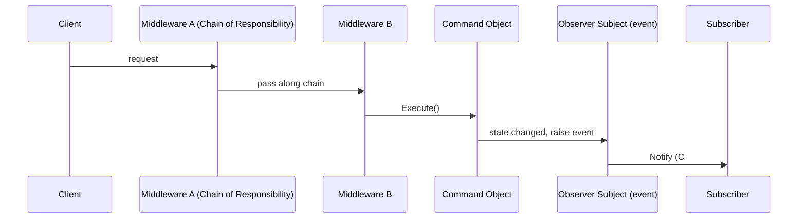

# Module 32 — Design Patterns: Behavioral Patterns

> Domain: Design Patterns | Level: Beginner → Expert | Prerequisite: [[01-Creational-Structural-Patterns]], [[../09-OOP/01-OOP-Fundamentals-Advanced]] §Advanced Q2 (Template Method), [[../01-CSharp/04-Delegates-Events-Closures]] (Observer's C#-native realization)

---

## 1. Fundamentals

### What are behavioral patterns?
Behavioral patterns address **how objects communicate and distribute responsibility** for a given algorithm/workflow — Strategy (swappable algorithms), Observer (one-to-many notification), Command (encapsulating a request as an object), Template Method (fixed algorithm skeleton with overridable steps, Module 29 §Advanced Q2), Chain of Responsibility (passing a request along a chain of potential handlers), State (behavior varying by internal state), Mediator (centralizing complex inter-object communication), and Iterator (uniform traversal, C#'s `foreach`/`IEnumerable`, Module 5 §2.1).

### Why do these exist?
Each addresses a specific coordination/communication problem that, done naively, creates tight coupling between the objects involved — Strategy decouples an algorithm's *choice* from its *usage site*; Observer decouples a publisher from knowing its subscribers' concrete types; Command decouples the *invoker* of an action from the action's actual implementation, enabling queuing/undo/logging of the action itself as data.

### When does this matter?
Nearly universally — several of these patterns (Strategy, Observer, Iterator) are so foundational they're built directly into C#'s own language features (delegates/interfaces, events, `IEnumerable`) rather than requiring hand-written GoF-style class hierarchies, making recognizing "this is Strategy/Observer, just expressed via C# idioms" a genuine interview and design-literacy skill.

### How does it work (30,000-ft view)?
```csharp
// Strategy, expressed idiomatically via a C# interface + DI (not a classic GoF class hierarchy)
public interface IShippingCostStrategy { decimal Calculate(Order order); }
public class OrderService
{
    private readonly IShippingCostStrategy _shippingStrategy; // swappable algorithm
    public OrderService(IShippingCostStrategy shippingStrategy) => _shippingStrategy = shippingStrategy;
}
```

---

## 2. Deep Dive

### 2.1 Strategy — Already the De Facto C# Idiom for "Swappable Algorithm"
Strategy encapsulates an interchangeable algorithm/policy behind a shared interface, injected into the context that uses it — this is precisely Module 6/12/29's recurring `IDiscountStrategy`/`IAuthorizationHandler`/`IDiscountStrategy` pattern already covered extensively across this course; the GoF's classic Strategy pattern and modern C# DI-based "inject an interface implementation" design are, in practice, the **same pattern**, just described in different vocabularies from different eras — a strong synthesis point worth stating explicitly ("we've been using Strategy throughout this entire course under the name 'inject an interface'") rather than treating Strategy as a separate, newly-introduced concept.

### 2.2 Observer — C# Events Are a Language-Native Observer Implementation
The Observer pattern (a subject maintains a list of observers, notifying them of state changes) is, as established in Module 4 §2.5, **directly implemented as a first-class language feature** via C# events — `event`/delegate subscription **is** Observer, with the language handling the subscribe/unsubscribe/notify mechanics automatically. The GoF's textbook Observer (an explicit `IObserver` interface with `Attach`/`Detach`/`Notify` methods) predates C# events and represents the *manual*, hand-rolled version of what C# events later made a built-in language construct — worth recognizing that "does this codebase use the Observer pattern" should be answered "yes, via its events" for the overwhelming majority of C# codebases, not "no, we don't have any `IObserver` interfaces."

### 2.3 Command — Encapsulating a Request as a First-Class Object
Command wraps a request (an action to perform, plus its parameters) as an object implementing a common interface (typically just `Execute()`), decoupling the code that *invokes* an action from the code that *implements* it — enabling the action to be **queued, logged, undone, or retried** as data, since it's now an object, not just a direct method call. This is the conceptual foundation behind: a job queue (each queued job is a Command object), an undo/redo stack (each Command stores enough state to reverse itself), and — directly connecting to Module 4's Expert exercise — the DI-mediator pattern's `INotificationHandler<T>`/request objects are architecturally Command-pattern-shaped (a request object dispatched to a handler, decoupling the caller from the handling logic).

### 2.4 Chain of Responsibility — Already Covered as the Middleware Pipeline
Chain of Responsibility passes a request along a chain of potential handlers, each deciding to handle it, pass it along, or both — this is, precisely, Module 9 §2.1's ASP.NET Core middleware pipeline and Module 11 §2.1/§2.4's `IEndpointFilter` chain, **already covered in full depth** as a concrete, production framework realization of this exact pattern; recognizing "the middleware pipeline is Chain of Responsibility" is a direct, valuable cross-module synthesis rather than new material to learn from scratch.

### 2.5 State — Behavior Varying by Internal State, and Its Records-Based Alternative
The classic State pattern models an object whose behavior changes based on its internal state by delegating to a swappable "current state" object (each state implementing a shared interface with state-specific behavior) — Module 7 §13's sealed-record-hierarchy-plus-exhaustive-switch design (`OrderState` → `Pending`/`Paid`/`Shipped`/`Cancelled`) is a **modern, idiomatic C# alternative** to the classic State pattern, already covered in depth there, trading State's "each state is a swappable, polymorphic object" mechanism for "each state is an immutable record, transitions are pure functions with compiler-enforced exhaustiveness" — both solve the same underlying problem; which is preferable depends on whether compile-time exhaustiveness (records) or genuine polymorphic extensibility (classic State pattern, if new states must be pluggable by external code without recompiling the core logic) is the more valuable property for a given domain, directly echoing Module 7 §13's own discussion of this exact trade-off.

## 3. Visual Architecture


## 4. Production Example
**Scenario**: A codebase implemented an order-approval workflow using a large, deeply-nested `if`/`else if` chain checking approval-level thresholds (`if (amount < 1000) autoApprove(); else if (amount < 10000) requireManagerApproval(); else if (amount < 100000) requireDirectorApproval(); else requireVPApproval();`), directly inline in the order-submission handler — adding a new approval tier (a "regional VP" level inserted between director and VP) required carefully inserting a new branch in the exact right position within this deeply-nested structure, and a bug during one such insertion (an off-by-one in the threshold comparison) caused orders in a specific dollar range to skip required approval entirely for several days before being caught by an unrelated finance audit. **Investigation**: root-caused to the fragile, deeply-nested conditional structure making it easy to introduce a subtle threshold-boundary error when inserting a new tier, and equally easy for that error to go unnoticed in code review given the structure's overall complexity. **Fix**: refactored into a Chain of Responsibility — a list of `IApprovalHandler` objects, each checking whether it's the correct threshold tier for the order's amount and either handling it or passing to the next handler in the chain, with a new tier added by inserting one new handler class at the correct position in a simple, explicit **list** (not a nested conditional structure) making the tier ordering and boundaries visually obvious and independently unit-testable per handler. **Lesson**: exactly Module 30 §4's OCP-violation lesson, now in a behavioral-pattern-specific form — a growing, ordered set of conditional cases (approval tiers) is precisely Chain of Responsibility's textbook use case, and forcing it into a nested if/else chain creates the same "modifying to add one case risks silently breaking adjacent cases" risk Module 30 already demonstrated, here manifesting as a genuine, financially-significant approval-bypass bug rather than a notification-channel bug.

## 5. Best Practices
- Recognize and name existing C# idioms (`event`, DI-injected interfaces, middleware pipelines) as their corresponding GoF patterns explicitly, rather than treating patterns as separate, unapplied theory.
- Use Chain of Responsibility (an ordered list of handler objects) for growing, ordered conditional logic instead of a deeply-nested if/else chain (§4's incident).
- Choose between Module 7's records-based State alternative and the classic polymorphic State pattern based on whether compile-time exhaustiveness or genuine external extensibility matters more for the specific domain.
- Use Command objects for any action needing to be queued, logged, retried, or undone as data, not for simple, immediate, one-off method calls.

## 6. Anti-patterns
- A deeply-nested if/else chain for a growing, ordered set of conditional cases instead of Chain of Responsibility (§4's incident).
- Treating GoF patterns as separate, must-be-explicitly-implemented constructs when the language/framework already provides an idiomatic equivalent (hand-rolling an `IObserver` interface instead of using C# events).
- Using Command objects for simple, immediate, non-queued/non-undoable actions, adding unnecessary indirection with no corresponding benefit.
- Forcing an exhaustive, records-based State design (Module 7 §13) onto a domain genuinely requiring third-party-pluggable state extensibility the sealed hierarchy structurally prevents.

## 7. Performance Engineering
Chain of Responsibility's per-handler dispatch cost (checking each handler in sequence until one handles the request) is generally negligible for reasonably-short chains (a few dozen handlers at most in realistic designs) — not a performance concern at typical scale, though a very long chain evaluated on every single request could warrant profiling if genuinely proven to matter (this course's recurring measure-first discipline).

## 8. Security
An authorization-approval Chain of Responsibility (§4's fix) directly benefits from the same "centralize enforcement, don't trust a fragile conditional structure" principle recurring throughout this course (Module 29 §4, Module 30 §4, Module 31's protection proxy) — each handler's boundary condition is independently testable, directly reducing the risk of a subtle threshold bug silently bypassing required approval, exactly the demonstrated failure mode in §4.

## 9. Scalability
Not a direct scaling-mechanism concern for most behavioral patterns; Mediator (centralizing complex many-to-many object communication into one coordinating object) can indirectly support scaling a codebase's *complexity* across a growing team by preventing an unmanageable web of direct object-to-object references, similar in spirit to Facade's complexity-management benefit (Module 31 §2.7).

---

## 10. Interview Questions

### Basic (10)
1. **Q: What does the Strategy pattern do?** **A:** Encapsulates an interchangeable algorithm/policy behind a shared interface, injected into the context that uses it.
2. **Q: What C# language feature is a native implementation of the Observer pattern?** **A:** Events (`event`/delegate subscription).
3. **Q: What does the Command pattern do?** **A:** Encapsulates a request/action as an object, decoupling the invoker from the implementation, enabling queuing/logging/undo.
4. **Q: What ASP.NET Core mechanism is a concrete realization of Chain of Responsibility?** **A:** The middleware pipeline (and `IEndpointFilter` chains).
5. **Q: What does the State pattern address?** **A:** An object whose behavior changes based on its internal state, via a swappable "current state" object.
6. **Q: What is the records-based alternative to the classic State pattern?** **A:** A sealed record hierarchy with exhaustive pattern matching (Module 7 §13).
7. **Q: What does the Iterator pattern provide?** **A:** Uniform traversal over a collection, realized in C# via `IEnumerable`/`foreach`.
8. **Q: What does Mediator do?** **A:** Centralizes complex many-to-many inter-object communication into one coordinating object.
9. **Q: Is "inject an interface implementation via DI" the same as the Strategy pattern?** **A:** Yes, in practice — the same underlying pattern, described in different vocabularies.
10. **Q: What's the relationship between GoF's classic Observer and C# events?** **A:** C# events are a built-in, language-native implementation of the same Observer pattern GoF describes manually via `IObserver`-style interfaces.

### Intermediate (10)
1. **Q: Why is recognizing "our DI-injected interfaces are Strategy" valuable beyond terminology?** **A:** It connects a team's everyday practice to the broader design-pattern vocabulary and literature, making it easier to communicate design intent concisely and to recognize when a different, less-familiar pattern might better fit a related problem.
2. **Q: Why does Command's "encapsulate as an object" property enable undo functionality that a direct method call can't?** **A:** A Command object can store the state needed to reverse its own effect (e.g., the previous value before a change) as part of the object itself — a direct, ephemeral method call has no persistent representation to later "undo" once it returns.
3. **Q: Why is a deeply-nested if/else chain for approval tiers (§4) structurally the same risk as Module 30 §4's notification-switch-statement incident?** **A:** Both are a growing, ordered set of conditional cases sharing one modification-requiring structure — inserting a new case risks disturbing adjacent cases' boundary conditions in either shape (a switch statement or a nested if/else chain), exactly the OCP-violation risk pattern recurring across both incidents.
4. **Q: Why might a team choose the classic, polymorphic State pattern over Module 7's records-based alternative despite the latter's compile-time exhaustiveness benefit?** **A:** If the domain genuinely requires third-party/plugin code to introduce new states without recompiling the core state-machine logic (true open extensibility), a sealed record hierarchy structurally prevents this (Module 7 §6's deliberate sealed-hierarchy trade-off) — the classic State pattern's polymorphic, non-sealed design permits genuine external extensibility the records-based alternative deliberately forecloses.
5. **Q: Why does Chain of Responsibility's list-based handler ordering make boundary conditions more visually obvious than a nested if/else chain?** **A:** Each handler's own threshold check is self-contained within its own class, and the chain's ordering is an explicit, visible list (or DI registration order) rather than implicit nesting depth — a reviewer can see the full ordered sequence of handlers at a glance, rather than needing to trace through nested indentation levels to understand the full conditional structure.
6. **Q: Why is Mediator's centralization benefit conceptually similar to, but distinct from, Facade's?** **A:** Both reduce direct coupling between many components by introducing a central coordinating point — Facade specifically simplifies a *client-facing* interface to an existing complex subsystem; Mediator specifically manages *communication/coordination between peer objects* that would otherwise need direct references to each other, a subtly different concern (external simplification vs. internal coordination).
7. **Q: Why would hand-rolling a classic `IObserver`/`Attach`/`Detach` interface in modern C# generally be considered an anti-pattern rather than "correctly implementing Observer"?** **A:** It reimplements, less efficiently and with more code, exactly what C# events already provide natively (subscribe/unsubscribe/notify, Module 4 §2.1-§2.2) — using the language's built-in mechanism is both less code and better-understood by other C# engineers than a hand-rolled equivalent, unless a genuine, specific reason exists to deviate (e.g., needing async-aware notification semantics events don't natively support well).
8. **Q: How does Module 4's DI-mediator pattern (an alternative to raw C# events for cross-module communication) relate to both Observer and Command?** **A:** It has properties of both — like Observer, multiple handlers can independently react to one published notification; like Command, the notification itself is an encapsulated, dispatched object (not a direct method call) — illustrating that real-world designs often blend multiple GoF patterns' properties rather than fitting one pattern's textbook description in isolation.
9. **Q: Why might a Chain of Responsibility handler need to explicitly decide "handle and stop" versus "handle and continue to the next handler," and what determines the right choice per use case?**
   **A:** Some use cases (a single, definitive "this handler owns this request" decision, like the approval-tier example) need exactly one handler to claim and fully process the request, stopping the chain; others (a logging/auditing chain where every applicable handler should observe the request, like a validation pipeline collecting all applicable errors) need every matching handler to process it and continue — the choice depends on whether the domain's semantics are "first matching handler wins" or "every matching handler contributes," and must be an explicit, deliberate design decision per chain, not assumed uniformly.
10. **Q: Why does recognizing existing framework/language features as "already implementing pattern X" matter for interview performance specifically?** **A:** It demonstrates genuine, applied design-pattern literacy (connecting abstract pattern theory to concrete, familiar framework behavior) rather than only being able to recite textbook pattern definitions in isolation — a strong differentiator between candidates who've memorized GoF pattern names and those who genuinely understand the underlying coordination problems these patterns solve, wherever they appear.

### Advanced (10)
1. **Q: Diagnose the approval-bypass production incident (§4) from first principles, and design the testing strategy specifically preventing recurrence for any future Chain of Responsibility refactor.**
   **A:** Root cause: a deeply-nested conditional structure making a boundary-condition error both easy to introduce and hard to catch in review, directly the OCP-violation risk shape from Module 30 §4. Testing strategy: write a **parameterized boundary test** (directly Module 29 §Advanced Q4's contract-test pattern, applied here) asserting the correct handler is selected for values at and immediately adjacent to every tier boundary (e.g., $999, $1000, $1001 for the auto-approve/manager-approval boundary) across the **entire** chain, run as a single, comprehensive test suite that must pass whenever a new handler is inserted — directly, mechanically catching an off-by-one boundary error at the exact class of value that caused the original incident, rather than relying on manual code review alone to spot it.
2. **Q: Design a Command-based implementation of an undo/redo stack for a document-editing application, explaining what state each Command must capture.**
   **A:**
   ```csharp
   public interface ICommand { void Execute(); void Undo(); }
   public class InsertTextCommand : ICommand
   {
       private readonly Document _document;
       private readonly int _position;
       private readonly string _text;
       public InsertTextCommand(Document document, int position, string text)
       {
           _document = document; _position = position; _text = text;
       }
       public void Execute() => _document.InsertAt(_position, _text);
       public void Undo() => _document.RemoveAt(_position, _text.Length); // reverses using the SAME captured state
   }
   ```
   Each Command must capture **exactly the state needed to both perform and reverse its specific action** (the insertion position and text, sufficient to compute the exact removal needed to undo it) — a `Stack<ICommand>` of executed commands supports undo (pop and call `Undo()`); a parallel redo stack supports redo (push undone commands there, allowing `Execute()` to be replayed) — directly demonstrating Command's defining "encapsulate enough state to make the action reversible/replayable as data" property.
3. **Q: Explain a scenario where combining Chain of Responsibility with Strategy produces a more flexible design than either pattern alone.**
   **A:** An approval-chain handler (Chain of Responsibility, deciding *whether* this tier applies) that delegates its actual approval-decision *logic* to an injected `IApprovalPolicy` (Strategy, deciding *how* to evaluate approval for this tier, e.g., a configurable multi-approver requirement) separates "which tier handles this request" (the chain's structural concern) from "what does approval actually require at this tier" (the strategy's configurable-policy concern) — allowing the approval *policy* for a given tier to change (e.g., requiring two approvers instead of one) without touching the chain's structure at all, and vice versa, a genuine example of two patterns composing to address two independently-varying concerns (directly Module 30 §2.1's SRP "independently-varying stakeholders" reasoning, now expressed via two composed behavioral patterns).
4. **Q: How would you decide whether a growing, ordered set of business rules is better modeled as Chain of Responsibility or as Module 7's sealed-hierarchy-plus-exhaustive-switch pattern?**
   **A:** Chain of Responsibility fits when handlers genuinely need to be **added/removed/reordered dynamically at runtime** (e.g., a configurable pipeline where tiers can be enabled/disabled per deployment) or when third-party/plugin code needs to contribute new handlers without recompiling the core logic; the records-based exhaustive-switch approach fits when the complete set of cases is **known and fixed at compile time**, and the primary value is the compiler catching a missed case when the set changes (Module 7 §5) — the deciding question is the same "genuine runtime/external extensibility versus a fixed, compile-time-verifiable set" trade-off Module 7 §13 and this module's Intermediate Q4 already establish for State specifically, generalized here to any ordered-rule-set design decision.
5. **Q: Explain why a Mediator-based design (Module 4's DI-mediator, Expert exercise) can itself become a "god object" anti-pattern if not carefully scoped, despite solving the direct-coupling problem it's meant to address.**
   **A:** If a single Mediator ends up coordinating an ever-growing number of unrelated concerns (order processing, user notifications, inventory management, all funneled through one central dispatcher), it can accumulate the same "too many independently-varying responsibilities" SRP violation (Module 30 §2.1) the pattern was meant to prevent at the *object-coupling* level, just relocated to the *mediator* itself — the fix is the same SRP discipline applied to the Mediator's own scope: multiple, smaller, domain-scoped mediators (an order-domain mediator, a notification-domain mediator) rather than one universal, all-encompassing coordinator.
6. **Q: Design a State-pattern-based (not records-based) implementation for a scenario genuinely requiring third-party pluggable states, and explain the key structural difference from Module 7 §13's approach.**
   **A:**
   ```csharp
   public interface IOrderState
   {
       IOrderState Pay(Order order, string transactionId);
       IOrderState Ship(Order order, string trackingNumber);
   }
   public class PendingState : IOrderState
   {
       public IOrderState Pay(Order order, string transactionId) => new PaidState(transactionId);
       public IOrderState Ship(Order order, string trackingNumber) =>
           throw new InvalidOperationException("Cannot ship an unpaid order.");
   }
   // A third-party plugin can implement IOrderState with an entirely NEW state (e.g., PartiallyRefundedState)
   // WITHOUT modifying OrderService or any existing state class -- true OCP-compliant extensibility,
   // the exact property Module 7 §13's SEALED record hierarchy deliberately forecloses.
   ```
   The key structural difference: `IOrderState` is a **non-sealed, open interface** any external assembly can implement, genuinely satisfying OCP (Module 30 §2.2) for the "add a new state" case — Module 7 §13's sealed-record approach deliberately trades this openness for compile-time exhaustiveness checking, and this classic State-pattern version is precisely the right tool when that trade must go the other way.
7. **Q: Explain how you would refactor the §4 incident's fix (Chain of Responsibility) to also support Advanced Q3's Strategy-based configurable-policy composition, incrementally, without a risky rewrite.**
   **A:** Introduce `IApprovalPolicy` as an **additional**, optional constructor dependency on each existing `IApprovalHandler` implementation, defaulting to each handler's current, hardcoded behavior wrapped as a default policy implementation (preserving existing behavior unchanged) — then incrementally migrate specific tiers' hardcoded logic into genuinely configurable policy implementations one at a time, only once each migration is validated, directly the same incremental "expand, don't break" pattern (Module 6 §Advanced Q9, Module 23 §Advanced Q6, Module 27 §Advanced Q3) recurring throughout this course, now applied to composing two behavioral patterns together.
8. **Q: A team proposes replacing all of their codebase's C# events with a hand-rolled, custom `IObserver<T>`-based Observer implementation "to be more explicitly following the GoF pattern." Evaluate this as a Principal Engineer.**
   **A:** Push back firmly — this is a regression, not an improvement: C# events already provide the Observer pattern's benefits (subscribe/unsubscribe/notify) as a well-understood, well-tooled, compiler-checked language feature (Module 4's entire treatment), and replacing them with a hand-rolled equivalent reintroduces exactly the kind of unnecessary reimplementation Intermediate Q7 warns against, adding code and cognitive overhead for zero corresponding benefit — "more explicitly following the GoF pattern" is not itself a valuable goal when the language already provides an idiomatic, native realization of the same pattern; recommend keeping events, and instead invest any "more explicit pattern adherence" effort into areas where a genuine gap exists (e.g., Module 4 §Expert Q2's DI-mediator migration for cross-module communication, which addresses real, demonstrated limitations of raw events for that specific use case).
9. **Q: Explain how you would apply this module's "recognize the pattern in existing code/frameworks" skill to identify which behavioral pattern(s) EF Core's `SaveChanges()`/change-tracking mechanism most resembles.**
   **A:** EF Core's change tracker, which detects modified entities and generates the appropriate SQL on `SaveChanges()`, has properties resembling both **Command** (each tracked change is effectively a deferred, encapsulated "operation to perform," executed as a batch when `SaveChanges()` is called, rather than immediately) and, more loosely, **Memento** (a GoF pattern not covered in depth in this module, capturing an object's prior state to support rollback — the change tracker's "original values" snapshot per entity serves a similar "remember prior state for comparison/potential reversal" role) — recognizing these structural resemblances, even for patterns not explicitly named in a framework's own documentation, is exactly the transferable design-pattern literacy this module aims to build.
10. **Q: As a Principal Engineer, how would you use this module's cross-referencing approach (connecting patterns to already-covered course material) as a teaching technique for a team learning design patterns for the first time?**
    **A:** Introduce each pattern by first asking "where have you already seen this in code you use every day?" (C# events for Observer, the middleware pipeline for Chain of Responsibility, DI-injected interfaces for Strategy) **before** presenting the formal GoF definition/UML diagram — this reverses the typical "learn the abstract pattern, then try to spot it in the wild" teaching order into "recognize you already understand the underlying mechanism, then learn its name and formal shape," which research on learning transfer suggests is generally more effective for retention and genuine understanding than memorizing abstract definitions first — directly the pedagogical approach this entire module has modeled throughout.

---

## 11. Coding Exercises

### Easy — Strategy pattern for shipping-cost calculation
```csharp
public interface IShippingCostStrategy { decimal Calculate(Order order); }
public class StandardShipping : IShippingCostStrategy { public decimal Calculate(Order order) => 5.99m; }
public class ExpressShipping : IShippingCostStrategy { public decimal Calculate(Order order) => 19.99m; }

public class CheckoutService
{
    private readonly IShippingCostStrategy _shippingStrategy;
    public CheckoutService(IShippingCostStrategy shippingStrategy) => _shippingStrategy = shippingStrategy;
    public decimal ComputeTotal(Order order) => order.Subtotal + _shippingStrategy.Calculate(order);
}
```

### Medium — Chain of Responsibility fixing the approval-tier incident (§4)
```csharp
public interface IApprovalHandler
{
    IApprovalHandler? Next { get; set; }
    ApprovalResult Handle(decimal amount);
}

public abstract class ApprovalHandlerBase : IApprovalHandler
{
    public IApprovalHandler? Next { get; set; }
    public abstract ApprovalResult Handle(decimal amount);
    protected ApprovalResult PassToNext(decimal amount) =>
        Next?.Handle(amount) ?? throw new InvalidOperationException("No handler found for this amount.");
}

public class AutoApproveHandler : ApprovalHandlerBase
{
    public override ApprovalResult Handle(decimal amount) =>
        amount < 1000 ? ApprovalResult.AutoApproved() : PassToNext(amount);
}
public class ManagerApprovalHandler : ApprovalHandlerBase
{
    public override ApprovalResult Handle(decimal amount) =>
        amount < 10000 ? ApprovalResult.RequiresApproval("Manager") : PassToNext(amount);
}
// Adding a new tier: insert ONE new handler class into the chain construction list --
// no modification to AutoApproveHandler or ManagerApprovalHandler's existing, tested code.
```

### Hard — Parameterized boundary test across the full chain (Advanced Q1)
```csharp
public class ApprovalChainBoundaryTests
{
    private readonly IApprovalHandler _chain = BuildChain(); // AutoApprove -> Manager -> Director -> VP

    [Theory]
    [InlineData(999, "AutoApproved")]
    [InlineData(1000, "Manager")]
    [InlineData(9999, "Manager")]
    [InlineData(10000, "Director")]
    [InlineData(99999, "Director")]
    [InlineData(100000, "VP")]
    public void Chain_Should_Route_To_Correct_Tier_At_Every_Boundary(decimal amount, string expectedTier)
    {
        var result = _chain.Handle(amount);
        Assert.Equal(expectedTier, result.RequiredApprover ?? "AutoApproved");
    }
}
// This SINGLE test suite, re-run whenever a new handler is inserted, mechanically catches
// exactly the off-by-one boundary error that caused the original production incident.
```

### Expert — Command pattern with undo/redo stacks (Advanced Q2)
```csharp
public class CommandManager
{
    private readonly Stack<ICommand> _undoStack = new();
    private readonly Stack<ICommand> _redoStack = new();

    public void ExecuteAndTrack(ICommand command)
    {
        command.Execute();
        _undoStack.Push(command);
        _redoStack.Clear(); // a new action invalidates any previously-available redo history
    }

    public void Undo()
    {
        if (_undoStack.Count == 0) return;
        var command = _undoStack.Pop();
        command.Undo();
        _redoStack.Push(command);
    }

    public void Redo()
    {
        if (_redoStack.Count == 0) return;
        var command = _redoStack.Pop();
        command.Execute();
        _undoStack.Push(command);
    }
}
```

---

## 12–17. System Design / LLD / Debugging / Decision / Case Study / Principal

A financial-approval platform (§4) refactors its deeply-nested approval-tier conditional logic into a Chain of Responsibility (Medium exercise), backed by a parameterized boundary-test suite (Hard exercise) mechanically catching any future off-by-one insertion error, and composes it with Strategy (Advanced Q3) for configurable per-tier approval policies. The signature production incident (§4) — an approval-bypass bug from a fragile, deeply-nested conditional structure — is this module's central lesson, directly paralleling Module 30 §4's OCP-violation incident in shape: a growing, ordered set of conditional cases sharing one modification-requiring structure is a recurring, demonstrated production-risk pattern regardless of the specific domain (notification channels there, approval tiers here), and Chain of Responsibility is its structural, pattern-named fix. Principal-level guidance: teach behavioral patterns by first connecting them to code the team already writes daily (C# events, middleware pipelines, DI-injected interfaces) before introducing formal GoF terminology — building genuine, transferable pattern-recognition literacy rather than memorized, disconnected theory.

## 18. Revision
**Key takeaways**: Strategy is already the de facto C# idiom for "inject an interface implementation" — recognize the connection, don't treat it as new theory. C# events are Observer, natively implemented by the language. Chain of Responsibility is the middleware pipeline's underlying pattern, and the correct fix for a growing, ordered conditional-case set (replacing a fragile nested if/else or switch statement, directly paralleling Module 30 §4's OCP-violation lesson). Command encapsulates a request as an object specifically to enable queuing/logging/undo. State's classic polymorphic form suits genuine runtime/external extensibility; Module 7's records-based alternative suits fixed, compile-time-verifiable case sets — the same trade-off recurring across this course's discriminated-union discussions.

---

**Next**: This completes the `11-Design-Patterns` domain (Modules 31–32). Continuing autonomously to `12-Data-Structures`.
