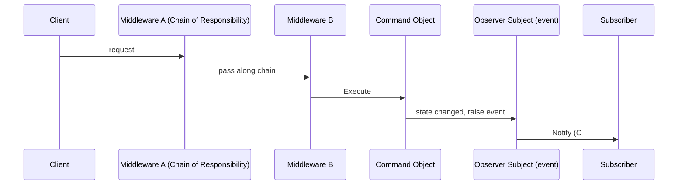
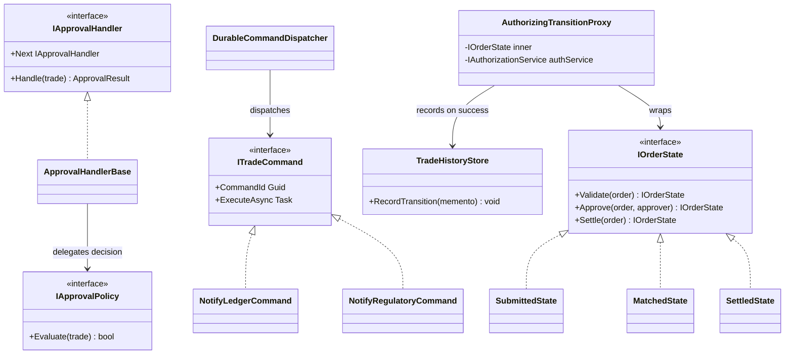
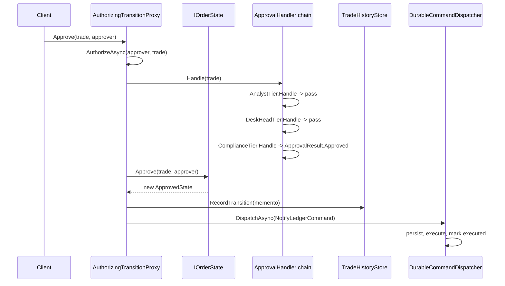

# Module 32 — Design Patterns: Behavioral Patterns

> Domain: Design Patterns | Level: Beginner → Expert | Prerequisite: [[01-Creational-Structural-Patterns]], [[../09-OOP/01-OOP-Fundamentals-Advanced]] §Advanced Q2 (Template Method), [[../01-CSharp/04-Delegates-Events-Closures]] (Observer's C#-native realization)

---

## 1. Fundamentals

### What are behavioral patterns?
Behavioral patterns address **how objects communicate and distribute responsibility** for a given algorithm/workflow — Strategy (swappable algorithms), Observer (one-to-many notification), Command (encapsulating a request as an object), Template Method (fixed algorithm skeleton with overridable steps, §Advanced Q2), Chain of Responsibility (passing a request along a chain of potential handlers), State (behavior varying by internal state), Mediator (centralizing complex inter-object communication), and Iterator (uniform traversal, C#'s `foreach`/`IEnumerable`).

### Why do these exist?
Each addresses a specific coordination/communication problem that, done naively, creates tight coupling between the objects involved — Strategy decouples an algorithm's *choice* from its *usage site*; Observer decouples a publisher from knowing its subscribers' concrete types; Command decouples the *invoker* of an action from the action's actual implementation, enabling queuing/undo/logging of the action itself as data.

### When does this matter?
Nearly universally — several of these patterns (Strategy, Observer, Iterator) are so foundational they're built directly into C#'s own language features (delegates/interfaces, events, `IEnumerable`) rather than requiring hand-written GoF-style class hierarchies, making recognizing "this is Strategy/Observer, just expressed via C# idioms" a genuine interview and design-literacy skill.

### How does it work (30,000-ft view)?
```csharp
// Strategy, expressed idiomatically via a C# interface + DI (not a classic GoF class hierarchy)
public interface IShippingCostStrategy { decimal Calculate(Order order); }
public class OrderService
{
    private readonly IShippingCostStrategy _shippingStrategy; // swappable algorithm
    public OrderService(IShippingCostStrategy shippingStrategy) => _shippingStrategy = shippingStrategy;
}
```

---

## 2. Deep Dive

### 2.1 Strategy — Already the De Facto C# Idiom for "Swappable Algorithm"
Strategy encapsulates an interchangeable algorithm/policy behind a shared interface, injected into the context that uses it — this is precisely/12/29's recurring `IDiscountStrategy`/`IAuthorizationHandler`/`IDiscountStrategy` pattern already covered extensively across this course; the GoF's classic Strategy pattern and modern C# DI-based "inject an interface implementation" design are, in practice, the **same pattern**, just described in different vocabularies from different eras — a strong synthesis point worth stating explicitly ("we've been using Strategy throughout this entire course under the name 'inject an interface'") rather than treating Strategy as a separate, newly-introduced concept.

### 2.2 Observer — C# Events Are a Language-Native Observer Implementation
The Observer pattern (a subject maintains a list of observers, notifying them of state changes) is, as established, **directly implemented as a first-class language feature** via C# events — `event`/delegate subscription **is** Observer, with the language handling the subscribe/unsubscribe/notify mechanics automatically. The GoF's textbook Observer (an explicit `IObserver` interface with `Attach`/`Detach`/`Notify` methods) predates C# events and represents the *manual*, hand-rolled version of what C# events later made a built-in language construct — worth recognizing that "does this codebase use the Observer pattern" should be answered "yes, via its events" for the overwhelming majority of C# codebases, not "no, we don't have any `IObserver` interfaces."

### 2.3 Command — Encapsulating a Request as a First-Class Object
Command wraps a request (an action to perform, plus its parameters) as an object implementing a common interface (typically just `Execute`), decoupling the code that *invokes* an action from the code that *implements* it — enabling the action to be **queued, logged, undone, or retried** as data, since it's now an object, not just a direct method call. This is the conceptual foundation behind: a job queue (each queued job is a Command object), an undo/redo stack (each Command stores enough state to reverse itself), and — directly connecting to the Expert exercise — the DI-mediator pattern's `INotificationHandler<T>`/request objects are architecturally Command-pattern-shaped (a request object dispatched to a handler, decoupling the caller from the handling logic).

### 2.4 Chain of Responsibility — Already Covered as the Middleware Pipeline
Chain of Responsibility passes a request along a chain of potential handlers, each deciding to handle it, pass it along, or both — this is, precisely, the ASP.NET Core middleware pipeline and/the `IEndpointFilter` chain, **already covered in full depth** as a concrete, production framework realization of this exact pattern; recognizing "the middleware pipeline is Chain of Responsibility" is a direct, valuable cross-module synthesis rather than new material to learn from scratch.

### 2.5 State — Behavior Varying by Internal State, and Its Records-Based Alternative
The classic State pattern models an object whose behavior changes based on its internal state by delegating to a swappable "current state" object (each state implementing a shared interface with state-specific behavior) — the sealed-record-hierarchy-plus-exhaustive-switch design (`OrderState` → `Pending`/`Paid`/`Shipped`/`Cancelled`) is a **modern, idiomatic C# alternative** to the classic State pattern, already covered in depth there, trading State's "each state is a swappable, polymorphic object" mechanism for "each state is an immutable record, transitions are pure functions with compiler-enforced exhaustiveness" — both solve the same underlying problem; which is preferable depends on whether compile-time exhaustiveness (records) or genuine polymorphic extensibility (classic State pattern, if new states must be pluggable by external code without recompiling the core logic) is the more valuable property for a given domain, directly echoing the own discussion of this exact trade-off.

## 3. Visual Architecture

```mermaid
sequenceDiagram
 participant Client
 participant MW1 as Middleware A (Chain of Responsibility)
 participant MW2 as Middleware B
 participant Handler as Command Object
 participant Subject as Observer Subject (event)
 participant Sub as Subscriber

 Client->>MW1: request
 MW1->>MW2: pass along chain
 MW2->>Handler: Execute
 Handler->>Subject: state changed, raise event
 Subject->>Sub: Notify (C# event mechanism)
```

## 4. Production Example
**Scenario**: A codebase implemented an order-approval workflow using a large, deeply-nested `if`/`else if` chain checking approval-level thresholds (`if (amount < 1000) autoApprove; else if (amount < 10000) requireManagerApproval; else if (amount < 100000) requireDirectorApproval; else requireVPApproval;`), directly inline in the order-submission handler — adding a new approval tier (a "regional VP" level inserted between director and VP) required carefully inserting a new branch in the exact right position within this deeply-nested structure, and a bug during one such insertion (an off-by-one in the threshold comparison) caused orders in a specific dollar range to skip required approval entirely for several days before being caught by an unrelated finance audit. **Investigation**: root-caused to the fragile, deeply-nested conditional structure making it easy to introduce a subtle threshold-boundary error when inserting a new tier, and equally easy for that error to go unnoticed in code review given the structure's overall complexity. **Fix**: refactored into a Chain of Responsibility — a list of `IApprovalHandler` objects, each checking whether it's the correct threshold tier for the order's amount and either handling it or passing to the next handler in the chain, with a new tier added by inserting one new handler class at the correct position in a simple, explicit **list** (not a nested conditional structure) making the tier ordering and boundaries visually obvious and independently unit-testable per handler. **Lesson**: exactly the OCP-violation lesson, now in a behavioral-pattern-specific form — a growing, ordered set of conditional cases (approval tiers) is precisely Chain of Responsibility's textbook use case, and forcing it into a nested if/else chain creates the same "modifying to add one case risks silently breaking adjacent cases" risk already demonstrated, here manifesting as a genuine, financially-significant approval-bypass bug rather than a notification-channel bug.

## 5. Best Practices
- Recognize and name existing C# idioms (`event`, DI-injected interfaces, middleware pipelines) as their corresponding GoF patterns explicitly, rather than treating patterns as separate, unapplied theory.
- Use Chain of Responsibility (an ordered list of handler objects) for growing, ordered conditional logic instead of a deeply-nested if/else chain (the incident).
- Choose between the records-based State alternative and the classic polymorphic State pattern based on whether compile-time exhaustiveness or genuine external extensibility matters more for the specific domain.
- Use Command objects for any action needing to be queued, logged, retried, or undone as data, not for simple, immediate, one-off method calls.

## 6. Anti-patterns
- A deeply-nested if/else chain for a growing, ordered set of conditional cases instead of Chain of Responsibility (the incident).
- Treating GoF patterns as separate, must-be-explicitly-implemented constructs when the language/framework already provides an idiomatic equivalent (hand-rolling an `IObserver` interface instead of using C# events).
- Using Command objects for simple, immediate, non-queued/non-undoable actions, adding unnecessary indirection with no corresponding benefit.
- Forcing an exhaustive, records-based State design onto a domain genuinely requiring third-party-pluggable state extensibility the sealed hierarchy structurally prevents.

---

## 7. Performance Engineering

**Observer/event fan-out cost:** A C# event with *n* subscribers dispatches synchronously, in subscription order, on the invoking thread — raising an event with 50 subscribers means the raising code doesn't return until all 50 handlers have run; a single slow or blocking handler (e.g., one doing synchronous I/O inside an event handler) stalls every other subscriber and the original caller, a genuine, easy-to-miss latency cliff since nothing in `MyEvent?.Invoke(this, args)`'s syntax signals "this call's latency is the sum of every subscriber's latency." High-fan-out notification scenarios (a market-data tick fan-out to hundreds of subscribing strategies) should measure this directly, not assume event dispatch is "just a method call."

**Command allocation cost:** Each Command object (§2.3) is a heap allocation, typically small and short-lived (Gen 0 garbage) — for a job queue processing thousands of commands/second, this is a normal, well-handled GC pattern, but an undo/redo stack (Advanced Q2) that never bounds its stack depth retains every Command object indefinitely, converting normally-transient Gen 0 allocations into a slow, accumulating memory footprint — bounding the undo stack's maximum depth (evicting the oldest command once a cap is reached) is the standard, necessary mitigation.

**Chain of Responsibility dispatch cost:** Each handler in the chain (§2.4) adds one virtual-dispatch hop plus, typically, one conditional check before either handling or forwarding — for the approval-tier chain (§4), a request needing the *last* handler in a long chain pays every prior handler's check first; for a chain expected to grow long (dozens of tiers) and where request volume is very high, ordering handlers by expected frequency (the most commonly-hit tier first) is a legitimate micro-optimization, though correctness (the boundary tests, §10 Advanced Q1) must never be sacrificed for this ordering.

**State pattern vs. exhaustive-switch allocation:** The classic, polymorphic State pattern (§2.5, Advanced Q6) allocates a new state object on every transition (`Pay` returns `new PaidState(...)`); the records-based, exhaustive-switch alternative typically also allocates a new record per transition (unless states are cached, stateless singletons) — the allocation profile is comparable between the two approaches; the real performance-relevant difference is virtual dispatch (classic State, one hop per behavior call) versus a `switch` expression (typically compiled to a jump table or sequential type-test, often marginally cheaper per-call, though rarely the dominant cost in a state-machine-driven workflow).

**Mediator/DI-notification dispatch:** A DI-mediator (§2.3, Advanced Q9's connection to Command) that resolves and invokes all `INotificationHandler<T>` implementations for a published notification pays a DI-container resolution cost per publish, typically a cached, fast lookup after JIT warm-up — but a Mediator accumulating dozens of unrelated notification types (Advanced Q5's "god object" risk) can also become a resolution/dispatch bottleneck under very high publish volume if handler resolution isn't itself cached per notification type.

**Benchmarking guidance:** Benchmark event/notification fan-out cost with a **realistic subscriber count and realistic per-handler cost**, not a synthetic, empty handler — the true cost of high-fan-out Observer/Mediator usage is dominated by the slowest subscriber, not the dispatch mechanism itself, so benchmarking dispatch overhead alone (with no-op handlers) systematically understates real-world latency.

---

## 8. Security

**Command deserialization risk:** A Command object queued for later, asynchronous execution (§2.3) — e.g., serialized onto a message queue and deserialized by a worker process — carries the same insecure-deserialization risk class named for Factory Method if the deserializer is configured to allow polymorphic type resolution from the payload itself (`TypeNameHandling.All`-equivalent settings). A Command payload should be deserialized into a **fixed, known set of concrete Command types** (a discriminated, closed contract, mirroring the closed-Factory-set discipline), never into an open-ended `object`/`ICommand` resolved by an attacker-influenced type name embedded in the message.

**Chain of Responsibility authorization-skipping risk:** If an authorization check is implemented as **one handler within a Chain of Responsibility** (e.g., an `AuthorizationHandler` inserted at some position in the approval chain) rather than as a structurally-mandatory gate every request must pass through first, a future maintainer adding, reordering, or conditionally skipping handlers (an entirely reasonable-looking chain-configuration change) can silently remove the authorization check from the path a specific request type takes — the chain's flexibility, which is its core benefit, is also exactly the risk: nothing in the chain's structure *requires* the authorization handler to remain present or first, unlike a check hard-coded at a fixed call site. The mitigation is architectural: authorization belongs in a structurally-separate, non-optional layer (middleware, a protection proxy) wrapping the chain's entry point, not as an ordinary, removable link within it.

**State-transition authorization gaps:** A State-pattern (or records-based state-machine) transition method (`Pay`, `Ship`, `Cancel`) that doesn't itself verify the caller is authorized to trigger that specific transition is a common gap — e.g., `Ship` transitioning an order from `Paid` to `Shipped` should verify the caller has fulfillment-role authorization, not merely that the *state* permits the transition; conflating "is this state transition structurally valid" (the State pattern's actual concern) with "is this caller allowed to trigger it" (a separate, authorization concern) is a recurring source of privilege-escalation-shaped bugs — a state-machine implementation should require an explicit authorization check as an input to every mutating transition method, not assume state-validity alone is sufficient.

**Mediator/god-object attack surface:** A single, overgrown Mediator (Advanced Q5) coordinating many unrelated domains becomes a single, large attack surface — a vulnerability in how it dispatches or validates one notification type can potentially be reachable from any code path that can publish through the shared Mediator, whereas properly SRP-scoped, domain-specific mediators naturally bound the blast radius of any one handler's vulnerability to its own domain.

**OWASP mapping:** Command deserialization from an open type set maps to A08:2021 (Software and Data Integrity Failures); an authorization check embedded as a removable Chain-of-Responsibility link, or missing from a state-transition method, maps to A01:2021 (Broken Access Control).

**AuthN/AuthZ, Secrets, Encryption:** Standard requirements apply; the pattern-specific risk is architectural placement (is authorization structurally mandatory or incidentally present), not a distinct secrets/encryption concern.

---

## 9. Scalability

**Chain of Responsibility as team-ownership boundary:** An explicit, ordered list of handler objects (§4's fix) is a genuine team-scaling win over a nested if/else chain — different teams can own different tiers' handler classes independently, adding a new tier by adding one new class rather than editing a shared, deeply-nested conditional structure every team touching approval logic must otherwise coordinate around; this mirrors Decorator's team-boundary benefit in Module 31 §9, now for ordered conditional logic rather than composable cross-cutting concerns.

**Observer/event fan-out at scale:** A publisher with many subscribers scales fan-out cost linearly with subscriber count and, per §7, with the slowest subscriber's latency — at genuinely large fan-out (thousands of interested consumers, e.g., a market-data event reaching many downstream strategies), synchronous, in-process C# events stop scaling and the architecture typically needs to move to an actual message broker (Kafka/RabbitMQ) providing asynchronous, decoupled fan-out — recognizing "our event has outgrown in-process Observer and needs a broker" as a deliberate architectural transition, not a sign C# events were "wrong" for the smaller scale they were introduced at.

**Mediator centralization limits:** Mediator's core benefit — replacing many-to-many direct object references with one central coordinator — has a scaling ceiling: past a certain number of independently-evolving domains routed through one Mediator, the Mediator itself becomes the coordination bottleneck the pattern was meant to eliminate at the object level, just relocated to the Mediator's own change surface (Advanced Q5) — the scaling fix (multiple, domain-scoped mediators) is itself an application of bounded-context thinking to a design pattern's own scope.

**Command queues and horizontal scaling:** Because a Command object fully encapsulates the state needed to execute an action (§2.3), Command queues are naturally horizontally scalable — any worker instance can dequeue and execute any Command without needing shared, in-process state, directly why the job-queue/message-queue architecture is Command-pattern-shaped at its core.

**State machines and horizontal scaling:** Both the classic State pattern and the records-based alternative are safe to scale horizontally *as long as the entity's current state is persisted centrally* (a database row, not an in-memory object) — a common mistake is holding a State-pattern instance in a single process's memory as the source of truth for a long-lived entity (an order, a trade) in a horizontally-scaled service, which breaks the moment a different instance handles a subsequent request for the same entity; the state object should be reconstructed from persisted state per request, not held as long-lived in-process state.

---

## 10. Interview Questions

### Basic (10)
1. **Q: What does the Strategy pattern do?** **A:** Encapsulates an interchangeable algorithm/policy behind a shared interface, injected into the context that uses it.
2. **Q: What C# language feature is a native implementation of the Observer pattern?** **A:** Events (`event`/delegate subscription).
3. **Q: What does the Command pattern do?** **A:** Encapsulates a request/action as an object, decoupling the invoker from the implementation, enabling queuing/logging/undo.
4. **Q: What ASP.NET Core mechanism is a concrete realization of Chain of Responsibility?** **A:** The middleware pipeline (and `IEndpointFilter` chains).
5. **Q: What does the State pattern address?** **A:** An object whose behavior changes based on its internal state, via a swappable "current state" object.
6. **Q: What is the records-based alternative to the classic State pattern?** **A:** A sealed record hierarchy with exhaustive pattern matching.
7. **Q: What does the Iterator pattern provide?** **A:** Uniform traversal over a collection, realized in C# via `IEnumerable`/`foreach`.
8. **Q: What does Mediator do?** **A:** Centralizes complex many-to-many inter-object communication into one coordinating object.
9. **Q: Is "inject an interface implementation via DI" the same as the Strategy pattern?** **A:** Yes, in practice — the same underlying pattern, described in different vocabularies.
10. **Q: What's the relationship between GoF's classic Observer and C# events?** **A:** C# events are a built-in, language-native implementation of the same Observer pattern GoF describes manually via `IObserver`-style interfaces.

### Intermediate (10)
1. **Q: Why is recognizing "our DI-injected interfaces are Strategy" valuable beyond terminology?** **A:** It connects a team's everyday practice to the broader design-pattern vocabulary and literature, making it easier to communicate design intent concisely and to recognize when a different, less-familiar pattern might better fit a related problem.
2. **Q: Why does Command's "encapsulate as an object" property enable undo functionality that a direct method call can't?** **A:** A Command object can store the state needed to reverse its own effect (e.g., the previous value before a change) as part of the object itself — a direct, ephemeral method call has no persistent representation to later "undo" once it returns.
3. **Q: Why is a deeply-nested if/else chain for approval tiers structurally the same risk as the notification-switch-statement incident?** **A:** Both are a growing, ordered set of conditional cases sharing one modification-requiring structure — inserting a new case risks disturbing adjacent cases' boundary conditions in either shape (a switch statement or a nested if/else chain), exactly the OCP-violation risk pattern recurring across both incidents.
4. **Q: Why might a team choose the classic, polymorphic State pattern over the records-based alternative despite the latter's compile-time exhaustiveness benefit?** **A:** If the domain genuinely requires third-party/plugin code to introduce new states without recompiling the core state-machine logic (true open extensibility), a sealed record hierarchy structurally prevents this (the deliberate sealed-hierarchy trade-off) — the classic State pattern's polymorphic, non-sealed design permits genuine external extensibility the records-based alternative deliberately forecloses.
5. **Q: Why does Chain of Responsibility's list-based handler ordering make boundary conditions more visually obvious than a nested if/else chain?** **A:** Each handler's own threshold check is self-contained within its own class, and the chain's ordering is an explicit, visible list (or DI registration order) rather than implicit nesting depth — a reviewer can see the full ordered sequence of handlers at a glance, rather than needing to trace through nested indentation levels to understand the full conditional structure.
6. **Q: Why is Mediator's centralization benefit conceptually similar to, but distinct from, Facade's?** **A:** Both reduce direct coupling between many components by introducing a central coordinating point — Facade specifically simplifies a *client-facing* interface to an existing complex subsystem; Mediator specifically manages *communication/coordination between peer objects* that would otherwise need direct references to each other, a subtly different concern (external simplification vs. internal coordination).
7. **Q: Why would hand-rolling a classic `IObserver`/`Attach`/`Detach` interface in modern C# generally be considered an anti-pattern rather than "correctly implementing Observer"?** **A:** It reimplements, less efficiently and with more code, exactly what C# events already provide natively (subscribe/unsubscribe/notify,-) — using the language's built-in mechanism is both less code and better-understood by other C# engineers than a hand-rolled equivalent, unless a genuine, specific reason exists to deviate (e.g., needing async-aware notification semantics events don't natively support well).
8. **Q: How does the DI-mediator pattern (an alternative to raw C# events for cross-module communication) relate to both Observer and Command?** **A:** It has properties of both — like Observer, multiple handlers can independently react to one published notification; like Command, the notification itself is an encapsulated, dispatched object (not a direct method call) — illustrating that real-world designs often blend multiple GoF patterns' properties rather than fitting one pattern's textbook description in isolation.
9. **Q: Why might a Chain of Responsibility handler need to explicitly decide "handle and stop" versus "handle and continue to the next handler," and what determines the right choice per use case?**
 **A:** Some use cases (a single, definitive "this handler owns this request" decision, like the approval-tier example) need exactly one handler to claim and fully process the request, stopping the chain; others (a logging/auditing chain where every applicable handler should observe the request, like a validation pipeline collecting all applicable errors) need every matching handler to process it and continue — the choice depends on whether the domain's semantics are "first matching handler wins" or "every matching handler contributes," and must be an explicit, deliberate design decision per chain, not assumed uniformly.
10. **Q: Why does recognizing existing framework/language features as "already implementing pattern X" matter for interview performance specifically?** **A:** It demonstrates genuine, applied design-pattern literacy (connecting abstract pattern theory to concrete, familiar framework behavior) rather than only being able to recite textbook pattern definitions in isolation — a strong differentiator between candidates who've memorized GoF pattern names and those who genuinely understand the underlying coordination problems these patterns solve, wherever they appear.

### Advanced (10)
1. **Q: Diagnose the approval-bypass production incident from first principles, and design the testing strategy specifically preventing recurrence for any future Chain of Responsibility refactor.**
 **A:** Root cause: a deeply-nested conditional structure making a boundary-condition error both easy to introduce and hard to catch in review, directly the OCP-violation risk shape. Testing strategy: write a **parameterized boundary test** (directly §Advanced Q4's contract-test pattern, applied here) asserting the correct handler is selected for values at and immediately adjacent to every tier boundary (e.g., $999, $1000, $1001 for the auto-approve/manager-approval boundary) across the **entire** chain, run as a single, comprehensive test suite that must pass whenever a new handler is inserted — directly, mechanically catching an off-by-one boundary error at the exact class of value that caused the original incident, rather than relying on manual code review alone to spot it.
2. **Q: Design a Command-based implementation of an undo/redo stack for a document-editing application, explaining what state each Command must capture.**
 **A:**
 ```csharp
public interface ICommand { void Execute; void Undo; }
public class InsertTextCommand: ICommand
{
    private readonly Document _document;
    private readonly int _position;
    private readonly string _text;
    public InsertTextCommand(Document document, int position, string text)
    {
        _document = document; _position = position; _text = text;
    }
    public void Execute => _document.InsertAt(_position, _text);
    public void Undo => _document.RemoveAt(_position, _text.Length); // reverses using the SAME captured state
}
 ```
 Each Command must capture **exactly the state needed to both perform and reverse its specific action** (the insertion position and text, sufficient to compute the exact removal needed to undo it) — a `Stack<ICommand>` of executed commands supports undo (pop and call `Undo`); a parallel redo stack supports redo (push undone commands there, allowing `Execute` to be replayed) — directly demonstrating Command's defining "encapsulate enough state to make the action reversible/replayable as data" property.
3. **Q: Explain a scenario where combining Chain of Responsibility with Strategy produces a more flexible design than either pattern alone.**
 **A:** An approval-chain handler (Chain of Responsibility, deciding *whether* this tier applies) that delegates its actual approval-decision *logic* to an injected `IApprovalPolicy` (Strategy, deciding *how* to evaluate approval for this tier, e.g., a configurable multi-approver requirement) separates "which tier handles this request" (the chain's structural concern) from "what does approval actually require at this tier" (the strategy's configurable-policy concern) — allowing the approval *policy* for a given tier to change (e.g., requiring two approvers instead of one) without touching the chain's structure at all, and vice versa, a genuine example of two patterns composing to address two independently-varying concerns (directly the SRP "independently-varying stakeholders" reasoning, now expressed via two composed behavioral patterns).
4. **Q: How would you decide whether a growing, ordered set of business rules is better modeled as Chain of Responsibility or as the sealed-hierarchy-plus-exhaustive-switch pattern?**
 **A:** Chain of Responsibility fits when handlers genuinely need to be **added/removed/reordered dynamically at runtime** (e.g., a configurable pipeline where tiers can be enabled/disabled per deployment) or when third-party/plugin code needs to contribute new handlers without recompiling the core logic; the records-based exhaustive-switch approach fits when the complete set of cases is **known and fixed at compile time**, and the primary value is the compiler catching a missed case when the set changes — the deciding question is the same "genuine runtime/external extensibility versus a fixed, compile-time-verifiable set" trade-off and this module's Intermediate Q4 already establish for State specifically, generalized here to any ordered-rule-set design decision.
5. **Q: Explain why a Mediator-based design (the DI-mediator, Expert exercise) can itself become a "god object" anti-pattern if not carefully scoped, despite solving the direct-coupling problem it's meant to address.**
 **A:** If a single Mediator ends up coordinating an ever-growing number of unrelated concerns (order processing, user notifications, inventory management, all funneled through one central dispatcher), it can accumulate the same "too many independently-varying responsibilities" SRP violation the pattern was meant to prevent at the *object-coupling* level, just relocated to the *mediator* itself — the fix is the same SRP discipline applied to the Mediator's own scope: multiple, smaller, domain-scoped mediators (an order-domain mediator, a notification-domain mediator) rather than one universal, all-encompassing coordinator.
6. **Q: Design a State-pattern-based (not records-based) implementation for a scenario genuinely requiring third-party pluggable states, and explain the key structural difference from the approach.**
 **A:**
 ```csharp
public interface IOrderState
{
    IOrderState Pay(Order order, string transactionId);
    IOrderState Ship(Order order, string trackingNumber);
}
public class PendingState: IOrderState
{
    public IOrderState Pay(Order order, string transactionId) => new PaidState(transactionId);
    public IOrderState Ship(Order order, string trackingNumber) =>
        throw new InvalidOperationException("Cannot ship an unpaid order.");
}
// A third-party plugin can implement IOrderState with an entirely NEW state (e.g., PartiallyRefundedState)
// WITHOUT modifying OrderService or any existing state class -- true OCP-compliant extensibility
// the exact property the SEALED record hierarchy deliberately forecloses.
 ```
 The key structural difference: `IOrderState` is a **non-sealed, open interface** any external assembly can implement, genuinely satisfying OCP for the "add a new state" case — the sealed-record approach deliberately trades this openness for compile-time exhaustiveness checking, and this classic State-pattern version is precisely the right tool when that trade must go the other way.
7. **Q: Explain how you would refactor the incident's fix (Chain of Responsibility) to also support Advanced Q3's Strategy-based configurable-policy composition, incrementally, without a risky rewrite.**
 **A:** Introduce `IApprovalPolicy` as an **additional**, optional constructor dependency on each existing `IApprovalHandler` implementation, defaulting to each handler's current, hardcoded behavior wrapped as a default policy implementation (preserving existing behavior unchanged) — then incrementally migrate specific tiers' hardcoded logic into genuinely configurable policy implementations one at a time, only once each migration is validated, directly the same incremental "expand, don't break" pattern recurring throughout this course, now applied to composing two behavioral patterns together.
8. **Q: A team proposes replacing all of their codebase's C# events with a hand-rolled, custom `IObserver<T>`-based Observer implementation "to be more explicitly following the GoF pattern." Evaluate this as a Principal Engineer.**
 **A:** Push back firmly — this is a regression, not an improvement: C# events already provide the Observer pattern's benefits (subscribe/unsubscribe/notify) as a well-understood, well-tooled, compiler-checked language feature (the entire treatment), and replacing them with a hand-rolled equivalent reintroduces exactly the kind of unnecessary reimplementation Intermediate Q7 warns against, adding code and cognitive overhead for zero corresponding benefit — "more explicitly following the GoF pattern" is not itself a valuable goal when the language already provides an idiomatic, native realization of the same pattern; recommend keeping events, and instead invest any "more explicit pattern adherence" effort into areas where a genuine gap exists (e.g., §Expert Q2's DI-mediator migration for cross-module communication, which addresses real, demonstrated limitations of raw events for that specific use case).
9. **Q: Explain how you would apply this module's "recognize the pattern in existing code/frameworks" skill to identify which behavioral pattern(s) EF Core's `SaveChanges`/change-tracking mechanism most resembles.**
 **A:** EF Core's change tracker, which detects modified entities and generates the appropriate SQL on `SaveChanges`, has properties resembling both **Command** (each tracked change is effectively a deferred, encapsulated "operation to perform," executed as a batch when `SaveChanges` is called, rather than immediately) and, more loosely, **Memento** (a GoF pattern not covered in depth in this module, capturing an object's prior state to support rollback — the change tracker's "original values" snapshot per entity serves a similar "remember prior state for comparison/potential reversal" role) — recognizing these structural resemblances, even for patterns not explicitly named in a framework's own documentation, is exactly the transferable design-pattern literacy this module aims to build.
10. **Q: As a Principal Engineer, how would you use this module's cross-referencing approach (connecting patterns to already-covered course material) as a teaching technique for a team learning design patterns for the first time?**
 **A:** Introduce each pattern by first asking "where have you already seen this in code you use every day?" (C# events for Observer, the middleware pipeline for Chain of Responsibility, DI-injected interfaces for Strategy) **before** presenting the formal GoF definition/UML diagram — this reverses the typical "learn the abstract pattern, then try to spot it in the wild" teaching order into "recognize you already understand the underlying mechanism, then learn its name and formal shape," which research on learning transfer suggests is generally more effective for retention and genuine understanding than memorizing abstract definitions first — directly the pedagogical approach this entire module has modeled throughout.

### Expert (10)
1. **Q: A settlement-notification service using a C# event (`OrderSettled`) to notify five downstream subscribers (ledger update, client notification, regulatory reporting, risk recalculation, audit log) is found, months after a new subscriber was added, to occasionally miss the regulatory-reporting subscriber's write entirely under load, with no exception thrown anywhere. Diagnose the root cause and the fix.**
 **A:** The most likely root cause is a race in subscription lifecycle, not the event-dispatch mechanism itself: if the regulatory-reporting subscriber subscribes during its own component's async initialization (e.g., `await SetupAsync` before calling `publisher.OrderSettled += Handler`), and an `OrderSettled` event can fire before that initialization completes under load-dependent timing, the event dispatches to only the four already-subscribed handlers — C# events silently skip handlers that simply haven't subscribed yet, throwing no exception, since from the publisher's perspective there is nothing wrong with fewer subscribers on a given invocation. The fix ensures subscription happens synchronously, before the publisher can possibly be reached by any external trigger (e.g., subscribing in the DI composition root before the host starts accepting work, not in a lazily-triggered async setup path) — converting an implicit, timing-dependent invariant ("every subscriber is subscribed before the first event fires") into a structurally-guaranteed one.
 **Why this answer is correct:** It correctly identifies that C# events have no "did every expected subscriber receive this" guarantee — silence is the *expected*, undetectable behavior for an unsubscribed handler, not a bug in the dispatch mechanism — and proposes a structural fix (subscription-ordering guarantee) rather than a reactive one (retrying or alerting after the fact).
 **Common mistakes:** Assuming a missed handler would throw or log something, and searching for an exception that was never going to occur; not considering subscription-timing races as a root cause since "the event obviously worked for the other four subscribers."
 **Follow-ups:** "How would you make this failure detectable rather than silent?" (A startup-time assertion or health check verifying the expected, fixed set of subscriber count/identities is attached before the service is marked ready to receive traffic — converting a silent timing gap into a fail-fast startup check.)

2. **Q: Design a Command pattern implementation for a trade-execution system where each Command must be durably persisted before execution (for audit and crash-recovery purposes), and explain how this interacts with the idempotency/exactly-once concerns.**
 **A:**
 ```csharp
public interface ITradeCommand { Guid CommandId { get; } Task ExecuteAsync; }
public class ExecuteTradeCommand : ITradeCommand
{
    public Guid CommandId { get; }
    private readonly TradeRequest _request;
    public ExecuteTradeCommand(Guid commandId, TradeRequest request) { CommandId = commandId; _request = request; }
    public async Task ExecuteAsync => await _tradingEngine.ExecuteAsync(_request);
}

public class DurableCommandDispatcher
{
    public async Task DispatchAsync(ITradeCommand command)
    {
        if (await _store.HasBeenExecutedAsync(command.CommandId)) return; // idempotency check FIRST
        await _store.PersistAsync(command); // durable BEFORE execution, for crash recovery
        await command.ExecuteAsync;
        await _store.MarkExecutedAsync(command.CommandId);
    }
}
 ```
 The Command's `CommandId` doubles as an **idempotency key** (directly the exactly-once discipline) — persisting the Command *before* executing it means a crash between persist and mark-executed leaves a durable, recoverable record a restart process can detect and safely re-drive (re-checking `HasBeenExecutedAsync` before re-executing, never blindly re-running), while persisting *after* execution would risk losing the record of an action that already had real, external effect if a crash occurred in that gap.
 **Why this answer is correct:** It correctly orders persist-before-execute (durability precedes effect) and ties the Command's own identity directly to idempotency-key semantics rather than treating persistence and idempotency as separate concerns.
 **Common mistakes:** Persisting the Command only *after* successful execution (for a false sense of "only save what worked"), which loses exactly the crash-recovery guarantee durable Commands are meant to provide, since a crash mid-execution then leaves no record the action was ever attempted.
 **Follow-ups:** "How would this recover after a process crash mid-execution?" (A recovery sweep at startup querying for persisted-but-not-marked-executed commands, re-checking each against the trading engine's own authoritative state — not blindly re-executing — before deciding whether to complete or discard.)

3. **Q: A Chain of Responsibility implementing fraud-check rules (each handler evaluating one rule, passing to the next regardless of outcome, to collect ALL applicable fraud flags) is refactored by a well-meaning engineer to stop at the first matching handler "for performance," mirroring the approval-chain's first-match-wins shape. What breaks, and why does this module's Intermediate Q9 directly predict it?**
 **A:** Intermediate Q9 establishes that a Chain of Responsibility's "stop at first match" versus "every matching handler contributes" behavior is a **domain-specific semantic choice**, not a universal default — the approval-tier chain genuinely needs exactly one tier to own a request (first-match-wins is correct there), but a fraud-check chain's entire value is in **collecting every applicable signal** (a transaction might simultaneously trigger a velocity-limit flag AND a geography-mismatch flag AND an amount-anomaly flag, and the downstream fraud-scoring logic needs all three, not just whichever rule happened to be checked first) — refactoring it to stop-at-first-match silently discards every fraud signal beyond the first matched one, directly weakening fraud detection while looking, superficially, like a harmless, even beneficial, performance optimization.
 **Why this answer is correct:** It correctly applies the general principle (first-match vs. collect-all is domain-specific) to identify precisely why an optimization that's valid in one context (approval tiers) is actively harmful in a structurally similar-looking but semantically different one (fraud checks).
 **Common mistakes:** Treating "stop early" as a universally safe optimization for any Chain of Responsibility, without checking whether the specific chain's correctness depends on exhaustive evaluation.
 **Follow-ups:** "How would you make this mistake harder to introduce in review?" (An explicit code comment and a naming convention distinguishing `IExclusiveHandler` [stop-at-first-match] chains from `ICollectingHandler` [every-handler-contributes] chains, making the chain's semantic contract visible in its type rather than only in prose documentation a refactor might not read.)

4. **Q: Explain how you would apply the Memento pattern (named but not built out in §Advanced Q9's EF Core discussion) as a complement to the classic State pattern for an auditable trade-lifecycle state machine, and why State alone is insufficient for audit requirements.**
 **A:** The State pattern (§2.5) correctly governs *which transitions are structurally valid from the current state* — but it has no inherent memory of *prior* states or *when* a transition occurred, which a regulated trade-lifecycle audit trail requires (SOX/SEC-style requirements typically mandate a complete, immutable history of every state a trade passed through, with timestamps and the triggering actor). Memento complements State by having each transition, in addition to moving to the new `IOrderState`, capture a snapshot (a Memento — the prior state, the new state, the timestamp, the triggering user/system) into an **append-only** history store, separate from the State pattern's own "current state" concern — State answers "what can happen next," Memento (as applied here) answers "what happened, and when," and conflating the two (e.g., trying to derive full audit history by inspecting only the current `IOrderState`) loses exactly the historical record a regulator will ask for.
 **Why this answer is correct:** It correctly separates State's forward-looking transition-validity concern from Memento's backward-looking history-capture concern, and ties the combination to a genuine regulatory requirement rather than treating it as abstract pattern-composition trivia.
 **Common mistakes:** Assuming a State-pattern-based system automatically provides an audit trail because "the states are modeled explicitly," missing that State's design intent (govern valid transitions) says nothing about *retaining* a history of past transitions.
 **Follow-ups:** "Where does this append-only Memento history store map onto Event Sourcing?" (Directly — an append-only sequence of "what happened" snapshots is Event Sourcing's core structure; a Memento-per-transition design is effectively a narrow, State-pattern-scoped instance of the same idea, worth explicitly connecting for a candidate who's covered Event Sourcing.)

5. **Q: A DI-mediator-based notification (`INotificationHandler<OrderSettledNotification>`) has grown three independent handlers: one updates the ledger (must succeed or the whole operation must fail), one sends a client email (best-effort, failure shouldn't block settlement), and one triggers regulatory reporting (must succeed, but can retry asynchronously if the mediator publish itself succeeded). Diagnose why publishing this notification through a single, synchronous Mediator dispatch is an architectural mismatch, and redesign it.**
 **A:** The mismatch: a single, synchronous Mediator publish typically either (a) fails the entire publish if any one handler throws, incorrectly coupling the best-effort email handler's failure to the must-succeed ledger update, or (b) swallows individual handler failures uniformly, incorrectly treating the must-succeed ledger update's failure the same as the best-effort email's — neither behavior matches the three handlers' genuinely different failure-tolerance requirements, because Mediator's dispatch model has no built-in concept of "some handlers are must-succeed, some are best-effort, some are async-retryable." The redesign separates by requirement: the ledger update happens **synchronously, in the same transaction/unit of work** as the settlement itself (not as a Mediator-dispatched side effect at all); the email notification is dispatched as a genuinely fire-and-forget, best-effort Command (§2.3) queued for async delivery, its failure logged but never propagated back; regulatory reporting is published as a durable, retryable message (the outbox pattern) guaranteed to eventually succeed independent of the initial publish's synchronous outcome.
 **Why this answer is correct:** It recognizes that "publish one notification, let all handlers react" silently assumes uniform failure semantics across handlers, and correctly decomposes the three genuinely different reliability requirements into three different mechanisms rather than forcing all three through one Mediator publish.
 **Common mistakes:** Trying to fix this by adding per-handler try/catch inside the Mediator dispatch loop, which addresses the symptom (an exception propagating incorrectly) without addressing the root mismatch — that must-succeed, best-effort, and eventually-consistent operations have fundamentally different correct failure-handling shapes that no single dispatch mechanism can uniformly provide.
 **Follow-ups:** "Why shouldn't the ledger update remain a Mediator-dispatched handler, even a first, prioritized one?" (Because "first in dispatch order" still doesn't provide transactional atomicity with the settlement operation itself — if the settlement's core operation succeeds but the ledger-update handler subsequently fails, the system is left in an inconsistent state a Mediator's dispatch ordering alone cannot prevent; only a shared transaction/unit of work can.)

6. **Q: Compare implementing a multi-step order-fulfillment workflow (validate → reserve inventory → charge payment → ship) as (a) a Chain of Responsibility, (b) a Command sequence with a compensating-transaction (Saga-style) rollback, and (c) Template Method. Which genuinely fits, and why do the other two look plausible but don't?**
 **A:** Template Method fits: the four steps occur in a **fixed, unvarying order** with each step's specific implementation varying (which validation rules, which inventory system, which payment gateway) — exactly Template Method's "fixed algorithm skeleton, overridable steps" shape (§Prerequisite reference to Module 9's Template Method coverage). Chain of Responsibility looks plausible because it also involves an ordered sequence of steps, but its defining property (each handler independently decides to handle/pass/both, and the chain's membership can vary at runtime) doesn't match a workflow where **every** step must always run in the same fixed order — Chain of Responsibility is for *conditional, variable* participation, not a *mandatory, fixed* sequence. A Command-sequence-with-compensation (Saga) fits when the four steps are **independently, potentially remotely executed and must support partial rollback on failure** (e.g., inventory reservation and payment charging are separate services that can each independently fail, requiring a compensating "release inventory" command if payment fails after reservation succeeds) — if the workflow's steps are genuinely distributed across services with real partial-failure/compensation needs, Saga is the correct fit over Template Method's simpler, single-process assumption.
 **Why this answer is correct:** It correctly distinguishes fixed-sequence-with-varying-steps (Template Method) from conditional-variable-participation (Chain of Responsibility) from distributed-with-compensation (Saga/Command), rather than treating "a sequence of steps" as automatically implying any one specific pattern.
 **Common mistakes:** Choosing Chain of Responsibility for any multi-step process merely because it "sounds sequential," without checking whether the chain's actual defining property (variable, conditional handler participation) genuinely applies.
 **Follow-ups:** "If inventory and payment are separate microservices, does Template Method still apply at all?" (Only for the in-process orchestration logic's own step-ordering; the actual distributed-failure/compensation handling requires Saga regardless — the two patterns can coexist at different layers, Template Method sequencing the orchestrator's local logic, Saga handling the distributed transaction's failure semantics.)

7. **Q: Explain why unsubscribing from a C# event is a common, production-relevant memory-leak source, and design the fix for a long-lived publisher with short-lived subscribers (e.g., a long-lived `MarketDataFeed` singleton and short-lived, per-request `PriceAlertSubscriber` instances).**
 **A:** A C# event subscription (`publisher.PriceUpdated += subscriber.OnPriceUpdated`) creates a **strong reference from the publisher to the subscriber** (the event's invocation list holds a delegate referencing the subscriber instance) — if the subscriber's own lifetime is meant to be short (garbage-collected once its owning request/scope ends) but never explicitly unsubscribes, the long-lived publisher's invocation list keeps the subscriber alive indefinitely, a genuine, classic .NET memory leak (the subscriber, and everything it transitively references, is retained for the publisher's entire lifetime instead of the subscriber's intended, shorter one). The fix: either explicitly unsubscribe (`publisher.PriceUpdated -= subscriber.OnPriceUpdated`) in the subscriber's disposal path (requiring `IDisposable` discipline), or use a **weak event pattern** (`WeakReference`-based subscription, or the `System.Windows.WeakEventManager` equivalent) so the publisher holds only a weak reference, allowing the subscriber to be collected even without explicit unsubscription.
 **Why this answer is correct:** It correctly identifies the strong-reference direction (publisher → subscriber, the commonly-missed direction since intuition often assumes it's the reverse) and offers both the standard disposal-based fix and the weak-reference alternative for cases where deterministic disposal isn't reliably guaranteed.
 **Common mistakes:** Assuming garbage collection "just handles" event subscriptions like any other reference, missing that a live, reachable publisher keeping a subscriber in its invocation list is a completely ordinary, GC-respected strong reference — the GC is working correctly; the leak is a design/lifetime-management gap, not a GC defect.
 **Follow-ups:** "How would you detect this leak in production before it causes an OOM?" (A memory-dump analysis, or `dotnet-gcdump`/`dotnet-trace`, showing an unexpectedly large object count of a type that should be short-lived, with a retention path tracing back through a long-lived publisher's event invocation list — a specific, recognizable signature this course's OOM-debugging discussions treat as a standard diagnostic pattern.)

8. **Q: A Principal Engineer is asked to evaluate whether a proposed "generic, fully data-driven rules engine" (rules and their ordering stored entirely in a database table, evaluated by one generic interpreter) should replace the existing Chain-of-Responsibility-based approval system. Evaluate the trade-off.**
 **A:** The generic, data-driven rules engine offers genuine configurability-without-deployment (business users could theoretically adjust tier thresholds without a code change) — but it trades away the Chain of Responsibility's compile-time-verified, individually-unit-testable handler classes (§10 Advanced Q1's boundary-test suite) for interpreted, generic rule logic that's substantially harder to unit-test exhaustively, harder to code-review for correctness (reviewing a database row's rule definition is a fundamentally weaker review than reviewing typed C# code), and reintroduces a version of the exact untrusted-instantiation risk class if rule logic can reference arbitrary code paths dynamically. For a financially consequential approval workflow (the incident's own domain), the loss of compile-time verification and strong, typed unit-testability is a significant regression in exactly the dimension (silent, boundary-condition correctness) that caused the original incident — recommend against the wholesale replacement; if genuine business-user-configurable thresholds are a real requirement, extract *only the threshold values* (not the handler logic or ordering) into configuration, keeping the handler chain's structure and logic in compiled, tested, reviewed code.
 **Why this answer is correct:** It weighs the configurability benefit against a concrete, demonstrated cost (loss of the exact correctness properties that fixed the original incident) rather than treating "more configurable" as an unqualified improvement, and proposes a scoped middle ground (configurable thresholds, fixed logic) instead of an all-or-nothing choice.
 **Common mistakes:** Evaluating "configurability" as an intrinsically positive property without weighing what specific, already-hard-won correctness guarantees (typed code, unit tests, code review) it would trade away for a system in a domain where those guarantees have already prevented a real incident.
 **Follow-ups:** "Under what conditions would the fully data-driven rules engine be the right call?" (A domain with very high rule-change frequency, lower per-mistake financial consequence, and a genuine business need for non-engineer rule authorship — none of which apply to the approval-tier chain's actual profile.)

9. **Q: Design a testing strategy for a Mediator-dispatched notification pipeline (Advanced Q9's EF-Core-change-tracker-resembling Command/Memento hybrid) to catch a scenario where a newly-added handler silently changes the *side-effect ordering* other handlers implicitly depend on.**
 **A:** Because Mediator's contract typically doesn't guarantee handler execution order (multiple `INotificationHandler<T>` implementations for the same notification are, by design, meant to be independent — Intermediate Q8's "every matching handler contributes" shape), any handler that implicitly relies on running before/after another handler has an undeclared, untested dependency the Mediator pattern doesn't structurally support. The test: **explicitly randomize handler registration/execution order in a test harness** (many DI containers resolve `IEnumerable<INotificationHandler<T>>` in registration order by default, which can mask an ordering dependency that only manifests if registration order ever changes) and assert the pipeline's observable outcome is identical regardless of execution order — a test that would fail immediately for the earlier ledger-update/email/regulatory-reporting scenario if it had been left as three uniform Mediator handlers instead of being correctly decomposed by reliability requirement.
 **Why this answer is correct:** It identifies the specific, easy-to-miss assumption (implicit ordering dependency) that Mediator's design explicitly doesn't support, and proposes a concrete test technique (execution-order randomization) that would surface a violation the default, stable registration-order testing would never catch.
 **Common mistakes:** Testing only the "happy path, default registration order" behavior, which can pass even when a genuine, undeclared ordering dependency exists — the test needs to actively perturb order to be a meaningful check of Mediator's actual, order-independent contract.
 **Follow-ups:** "Why is this the same underlying lesson as this module's CRDT-adjacent commutativity discussion?" (Because both are asking the same question — "does this operation's correctness genuinely not depend on order/grouping" — Mediator notification handlers should be commutative in their observable side effects, exactly the property CRDT merges are mathematically required, and here only testably verified, to have.)

10. **Q: As a Principal Engineer, a team lead reports that behavioral-pattern usage across their team has become inconsistent — some engineers reach for Strategy, others hardcode conditionals, for what looks like the same underlying problem shape. How would you diagnose whether this is a genuine problem requiring intervention, versus healthy engineering judgment operating on legitimately different contexts?**
 **A:** Investigate before intervening: pull several concrete examples of both "Strategy used" and "conditional hardcoded" instances and check whether the *actual* problem shape genuinely differs between them (a hardcoded conditional for a permanently-fixed, two-case business rule that will never gain a third case is legitimately simpler and *correctly* not over-engineered into Strategy; a hardcoded conditional for a genuinely growing, swappable-policy concern is a real gap). If the underlying shapes are truly comparable and the inconsistency is genuinely engineer-preference-driven rather than context-driven, the intervention is **not** a blanket mandate ("always use Strategy") — per Module 31's own Expert Q10 governance principle, over-standardizing pattern choice removes legitimate local judgment — but rather a shared, written decision heuristic (the same "problem shape, not pattern name" diagnostic questions from Advanced Q10) the team applies consistently, paired with pointing out in code review, case by case, where a hardcoded conditional's growth trajectory (is a third/fourth case plausible soon) suggests Strategy's swappability is actually earning its complexity now, versus where it would be premature.
 **Why this answer is correct:** It resists the instinct to standardize pattern choice top-down before verifying whether the inconsistency reflects a genuine gap or legitimate, context-sensitive judgment, and locates the correct intervention (a shared diagnostic heuristic, applied case by case) rather than a blanket rule.
 **Common mistakes:** Mandating "always use Strategy for swappable behavior" without first checking whether some of the "inconsistent" hardcoded-conditional instances are actually the *correct*, simpler choice for their specific, legitimately fixed context — directly repeating Module 31 Expert Q10's over-governance risk in the behavioral-pattern domain.
 **Follow-ups:** "How would you measure whether the intervention actually worked, six months later?" (Not "how many places now use Strategy" — a raw pattern-usage count is itself a Goodhart's-Law-vulnerable metric — but whether code-review discussion time spent on "should this be Strategy or a conditional" has decreased, and whether any production incident traceable to a hardcoded-conditional-that-should-have-been-Strategy has recurred.)

---

## 11. Coding Exercises

### Easy — Strategy pattern for shipping-cost calculation
```csharp
public interface IShippingCostStrategy { decimal Calculate(Order order); }
public class StandardShipping: IShippingCostStrategy { public decimal Calculate(Order order) => 5.99m; }
public class ExpressShipping: IShippingCostStrategy { public decimal Calculate(Order order) => 19.99m; }

public class CheckoutService
{
    private readonly IShippingCostStrategy _shippingStrategy;
    public CheckoutService(IShippingCostStrategy shippingStrategy) => _shippingStrategy = shippingStrategy;
    public decimal ComputeTotal(Order order) => order.Subtotal + _shippingStrategy.Calculate(order);
}
```

### Medium — Chain of Responsibility fixing the approval-tier incident
```csharp
public interface IApprovalHandler
{
    IApprovalHandler? Next { get; set; }
    ApprovalResult Handle(decimal amount);
}

public abstract class ApprovalHandlerBase: IApprovalHandler
{
    public IApprovalHandler? Next { get; set; }
    public abstract ApprovalResult Handle(decimal amount);
    protected ApprovalResult PassToNext(decimal amount) =>
        Next?.Handle(amount)?? throw new InvalidOperationException("No handler found for this amount.");
}

public class AutoApproveHandler: ApprovalHandlerBase
{
    public override ApprovalResult Handle(decimal amount) =>
        amount < 1000? ApprovalResult.AutoApproved: PassToNext(amount);
}
public class ManagerApprovalHandler: ApprovalHandlerBase
{
    public override ApprovalResult Handle(decimal amount) =>
        amount < 10000? ApprovalResult.RequiresApproval("Manager"): PassToNext(amount);
}
// Adding a new tier: insert ONE new handler class into the chain construction list --
// no modification to AutoApproveHandler or ManagerApprovalHandler's existing, tested code.
```

### Hard — Parameterized boundary test across the full chain (Advanced Q1)
```csharp
public class ApprovalChainBoundaryTests
{
    private readonly IApprovalHandler _chain = BuildChain; // AutoApprove -> Manager -> Director -> VP

    [Theory]
    [InlineData(999, "AutoApproved")]
    [InlineData(1000, "Manager")]
    [InlineData(9999, "Manager")]
    [InlineData(10000, "Director")]
    [InlineData(99999, "Director")]
    [InlineData(100000, "VP")]
    public void Chain_Should_Route_To_Correct_Tier_At_Every_Boundary(decimal amount, string expectedTier)
    {
        var result = _chain.Handle(amount);
        Assert.Equal(expectedTier, result.RequiredApprover?? "AutoApproved");
    }
}
// This SINGLE test suite, re-run whenever a new handler is inserted, mechanically catches
// exactly the off-by-one boundary error that caused the original production incident.
```

### Expert — Command pattern with undo/redo stacks (Advanced Q2)
```csharp
public class CommandManager
{
    private readonly Stack<ICommand> _undoStack = new;
    private readonly Stack<ICommand> _redoStack = new;

    public void ExecuteAndTrack(ICommand command)
    {
        command.Execute;
        _undoStack.Push(command);
        _redoStack.Clear; // a new action invalidates any previously-available redo history
    }

    public void Undo
    {
        if (_undoStack.Count == 0) return;
        var command = _undoStack.Pop;
        command.Undo;
        _redoStack.Push(command);
    }

    public void Redo
    {
        if (_redoStack.Count == 0) return;
        var command = _redoStack.Pop;
        command.Execute;
        _undoStack.Push(command);
    }
}
```

---

## 12. System Design

**Scenario:** A **Trade Settlement Workflow Engine** for a broker-dealer platform — orchestrating a trade through its full lifecycle (submitted → validated → matched → settled → confirmed, or rejected/cancelled at various points), enforcing a growing, tiered approval-and-review process for high-value or flagged trades, and notifying multiple downstream systems (ledger, client reporting, regulatory reporting, risk) as the trade progresses.

**Functional requirements**
- Route a trade through a fixed, ordered lifecycle sequence, with each stage's specific validation/processing logic swappable per instrument type or venue.
- Route flagged/high-value trades through a growing, ordered set of review tiers (analyst → desk-head → compliance), addable without modifying existing tiers' code (directly the Production Example's fix).
- Notify multiple, independent downstream systems of each lifecycle transition, with differing reliability requirements per subscriber (some must-succeed synchronously, some best-effort, some eventually-consistent).
- Support undo of a not-yet-settled trade submission (a genuine "cancel and reverse" business operation) with full audit history of every state the trade passed through.

**Non-functional requirements**
- Every trade-lifecycle transition and every review-tier decision must be independently unit-testable, with boundary conditions across the review-tier chain mechanically, exhaustively verified (§10 Advanced Q1).
- No single point in the codebase should require modification to add a new review tier or a new downstream notification subscriber (OCP).
- Authorization for triggering a lifecycle transition must be structurally mandatory, never merely an optional, reorderable link in a processing chain (§8's Chain-of-Responsibility authorization-skipping risk).
- A complete, immutable audit history of every state transition must be retained (§10 Expert Q4's Memento complement to State).

**Back-of-the-envelope estimation:** ~2,000 trades/second at peak across the platform; each trade fires roughly 5 lifecycle-transition notifications to downstream subscribers (ledger, client reporting, regulatory reporting, risk, audit) — ~10,000 notification dispatches/second. At this volume, synchronous, in-process C# events (§9) are approaching the scale where a message-broker-based fan-out becomes the correct architecture rather than in-process Observer — the numbers tell us **notification durability and delivery guarantees, not raw dispatch throughput, are the actual design driver**, since several subscribers (regulatory reporting) have must-eventually-succeed requirements no in-process, synchronous event can provide.

**Architecture:**
1. **Trade lifecycle** modeled via the classic, polymorphic State pattern (§2.5, §10 Expert Q6) — `IOrderState` non-sealed, since third-party/venue-specific plugins genuinely need to contribute new lifecycle states (e.g., a venue-specific "pending clearing" intermediate state) without recompiling the core engine.
2. **Review-tier routing** via Chain of Responsibility (§2.4, the Production Example's fix), each tier an independently-owned, independently-testable handler class, composed with Strategy (§10 Advanced Q3) for per-tier, configurable review policy.
3. **Lifecycle-transition notification** decomposed by reliability requirement (§10 Expert Q5): the ledger update happens synchronously within the same transaction as the transition; client/risk notifications dispatch as best-effort Commands (§2.3); regulatory reporting publishes via the outbox pattern for guaranteed eventual delivery.
4. **Audit history** captured via a Memento snapshot (§10 Expert Q4) on every transition, written to an append-only store, structurally separate from the State pattern's own "current state" concern.
5. **Authorization** enforced as a structurally mandatory gate (a protection proxy wrapping every transition-triggering entry point), never as a removable Chain-of-Responsibility link (§8).

**Components:** `IOrderState` hierarchy; `IApprovalHandler` chain with injected `IApprovalPolicy` strategies; `DurableCommandDispatcher` (§10 Expert Q2) for notification dispatch; append-only `TradeHistoryStore` (Memento); `AuthorizingTransitionProxy`.

**Database selection:** A boring, ACID relational store (SQL Server) for current trade state and the append-only history table — the audit-trail requirement specifically favors a relational store's strong consistency and mature tooling for regulatory query/reporting needs over a NoSQL store's eventual-consistency trade-offs.

**Caching:** Review-tier threshold configuration cached in memory (a `ReferenceDataCache`-style Singleton, Module 31 §10 Expert Q7) with explicit refresh on configuration change; trade state itself is never cached as a long-lived in-process object (§9's horizontal-scaling caution) — always reconstructed from persisted state per request.

**Messaging:** Regulatory-reporting and other must-eventually-succeed notifications via the outbox pattern over a durable broker; best-effort notifications (client email) via a lightweight, fire-and-forget queue; the ledger update is never a message at all, it's a synchronous, same-transaction operation (§10 Expert Q5).

**Scaling:** Review-tier handler chain and lifecycle-state logic are stateless per-request and horizontally scalable; the underlying persisted trade-state store is the actual scaling-sensitive component, using the same replication/partitioning strategies established in this repo's distributed-systems modules.

**Failure handling:** A trade stuck mid-transition (a crash between persisting a Command and marking it executed, §10 Expert Q2) is recovered via a startup reconciliation sweep, never blindly re-executed; regulatory-reporting failures retry via the outbox's own retry/DLQ discipline rather than blocking the trade's own lifecycle progression.

**Monitoring:** Review-tier boundary-test pass rate in CI (a leading indicator, not just a post-deploy signal); notification-dispatch success rate per subscriber, broken out by reliability tier (must-succeed vs. best-effort vs. eventually-consistent) so a regression in one tier's delivery is distinguishable from another's; audit-history write-completeness (every transition has a corresponding Memento record, checked via periodic reconciliation).

**Trade-offs:** Choosing the classic, non-sealed State pattern over the records-based exhaustive-switch alternative trades away compile-time exhaustiveness (a missed case in a `switch` would be a compiler error; a missed case in an open `IOrderState` hierarchy is not) for genuine, required third-party/venue extensibility — a deliberate, domain-justified choice (§2.5, §10 Expert Q6), not a default.

---

## 13. Low-Level Design

**Requirements:** A fixed-order, pluggable-state trade lifecycle; a growing, ordered, independently-testable review-tier chain; reliability-differentiated notification dispatch; complete, append-only audit history; structurally mandatory authorization.

**Class diagram:**

```mermaid
classDiagram
 class IOrderState {
 <<interface>>
 +Validate(order) IOrderState
 +Approve(order, approver) IOrderState
 +Settle(order) IOrderState
 }
 class SubmittedState
 class MatchedState
 class SettledState
 class IApprovalHandler {
 <<interface>>
 +Next IApprovalHandler
 +Handle(trade) ApprovalResult
 }
 class IApprovalPolicy {
 <<interface>>
 +Evaluate(trade) bool
 }
 class ITradeCommand {
 <<interface>>
 +CommandId Guid
 +ExecuteAsync Task
 }
 class DurableCommandDispatcher
 class TradeHistoryStore {
 +RecordTransition(memento) void
 }
 class AuthorizingTransitionProxy {
 -IOrderState inner
 -IAuthorizationService authService
 }

 IOrderState <|.. SubmittedState
 IOrderState <|.. MatchedState
 IOrderState <|.. SettledState
 IApprovalHandler <|.. ApprovalHandlerBase
 ApprovalHandlerBase --> IApprovalPolicy : delegates decision
 ITradeCommand <|.. NotifyLedgerCommand
 ITradeCommand <|.. NotifyRegulatoryCommand
 DurableCommandDispatcher --> ITradeCommand : dispatches
 AuthorizingTransitionProxy --> IOrderState : wraps
 AuthorizingTransitionProxy --> TradeHistoryStore : records on success
```

**Sequence diagram — a trade transition through approval and notification:**

```mermaid
sequenceDiagram
 participant Client
 participant Proxy as AuthorizingTransitionProxy
 participant State as IOrderState
 participant Chain as ApprovalHandler chain
 participant History as TradeHistoryStore
 participant Dispatcher as DurableCommandDispatcher

 Client->>Proxy: Approve(trade, approver)
 Proxy->>Proxy: AuthorizeAsync(approver, trade)
 Proxy->>Chain: Handle(trade)
 Chain->>Chain: AnalystTier.Handle -> pass
 Chain->>Chain: DeskHeadTier.Handle -> pass
 Chain->>Chain: ComplianceTier.Handle -> ApprovalResult.Approved
 Proxy->>State: Approve(trade, approver)
 State-->>Proxy: new ApprovedState
 Proxy->>History: RecordTransition(memento)
 Proxy->>Dispatcher: DispatchAsync(NotifyLedgerCommand)
 Dispatcher->>Dispatcher: persist, execute, mark executed
```

**Design patterns used:** State (lifecycle), Chain of Responsibility (review tiers), Strategy (per-tier policy), Command (notification dispatch, durably persisted per §10 Expert Q2), Memento (audit history), Proxy (structurally mandatory authorization).

**SOLID mapping:** SRP — each state, each tier handler, each Command type owns exactly one concern. OCP — a new review tier or a new venue-specific state is added without modifying existing classes. LSP — every `IOrderState` implementation must genuinely honor the interface's transition contract (a state that silently allows an invalid transition, rather than throwing, would violate substitutability for any code relying on the contract). ISP — `IApprovalHandler` and `IApprovalPolicy` are separate, narrow interfaces (chain-membership concern vs. decision-logic concern). DIP — `AuthorizingTransitionProxy` depends on `IOrderState` and `IAuthorizationService` abstractions, never concrete state or authorization implementations.

**Extensibility:** A new review tier is one new `IApprovalHandler` implementation inserted into the chain-construction list; a new venue-specific lifecycle state is one new `IOrderState` implementation, requiring no change to the core engine (the exact property the sealed-record alternative would foreclose, §10 Expert Q6).

**Concurrency/thread safety:** `IOrderState` instances are immutable per-transition (each transition returns a *new* state instance, never mutates in place) — safe for concurrent reads of a given snapshot; the persisted trade-state row itself requires standard optimistic-concurrency control (a version/rowversion column) to prevent two concurrent transition attempts from silently overwriting each other, since the State pattern's in-memory immutability alone doesn't address concurrent *persistence* races.

---

## 14. Production Debugging

**Incident:** A long-lived `MarketDataFeed` singleton service, publishing price-update events to strategy components via a plain C# event (`PriceUpdated += ...`), was observed — via a routine memory-growth alert, not a functional bug report — to have grown from a stable ~400MB working set to over 6GB in the trading application's memory footprint over roughly three trading days, eventually triggering `OutOfMemoryException`-driven restarts during peak trading hours.

**Root cause:** Each `PriceAlertSubscriber` was a short-lived, per-request object, constructed when a trader opened a specific instrument's price-alert panel in the UI and intended to be garbage-collected when the panel was closed. Each subscriber's constructor subscribed to the long-lived `MarketDataFeed` singleton's `PriceUpdated` event (`marketDataFeed.PriceUpdated += OnPriceUpdated`) — but the subscriber's disposal path (triggered when the panel closed) never called the corresponding `-=` unsubscription. Exactly per §10 Expert Q7's mechanism: the long-lived publisher's event invocation list held a strong reference to every subscriber ever constructed, for the singleton's entire process lifetime — traders opening and closing thousands of price-alert panels over three trading days left thousands of "closed" but never-collected `PriceAlertSubscriber` instances (and everything each one transitively referenced — UI view-models, cached instrument metadata) permanently retained.

**Investigation:** The memory-growth alert initially pointed only at "growing managed heap," with no obvious single large allocation to explain it — the eventual finding came from a heap-dump analysis (`dotnet-gcdump`) showing an unexpectedly large live-object count of `PriceAlertSubscriber` instances (tens of thousands, far exceeding any plausible concurrently-open-panel count), each with a GC retention path tracing directly back through `MarketDataFeed.PriceUpdated`'s delegate invocation list — the exact diagnostic signature named in §10 Expert Q7's follow-up.

**Tools:** `dotnet-gcdump`/`dotnet-trace` for the heap-dump and retention-path analysis; a targeted code search for every `+=` event subscription against `MarketDataFeed` across the codebase, cross-referenced against each subscriber's disposal path to confirm which ones were missing the corresponding `-=`.

**Fix:** `PriceAlertSubscriber` was made `IDisposable`, with `Dispose` explicitly unsubscribing (`marketDataFeed.PriceUpdated -= OnPriceUpdated`); the UI panel's close handler was audited to guarantee `Dispose` is always called, not merely assumed. For a second, harder-to-guarantee subscriber type (a dynamically-created diagnostic overlay whose disposal timing was less reliably deterministic), the weak-event pattern (§10 Expert Q7's alternative) was adopted instead, so the publisher holds only a weak reference and correctly allows collection even without perfectly reliable explicit disposal.

**Prevention:** (1) A Roslyn analyzer added to CI flagging any class subscribing to an event (`+=`) without a corresponding `Dispose`/`-=` in the same class, mirroring the same "automated, CI-enforced guardrail over manual review" discipline established for the Singleton-mutable-state rule in Module 31 §14. (2) A standing architectural guideline: any event subscription crossing a **lifetime boundary** (a short-lived object subscribing to a long-lived publisher) must use either explicit, guaranteed disposal or the weak-event pattern — subscriptions where publisher and subscriber share the same lifetime (both request-scoped, or both process-lifetime) carry no equivalent risk and don't require this discipline. (3) Memory-growth alerting thresholds were tightened and made a standard, dashboarded signal reviewed daily during active trading hours, rather than only firing reactively near the `OutOfMemoryException` threshold — catching the next instance of this pattern days earlier.

---

## 15. Architecture Decision

**Context:** Choosing how to route a trade through a growing set of value/risk-based review tiers before final approval.

**Option A — Chain of Responsibility with independently-owned handler classes (the recommended architecture, §12, the Production Example's fix):**
*Advantages:* Boundary conditions mechanically, exhaustively testable (§10 Advanced Q1); new tiers added without modifying existing, tested code; each tier independently team-ownable (§9).
*Disadvantages:* More classes than an inline conditional; the chain's flexibility is itself a risk if authorization is ever incorrectly embedded as a removable link rather than a structurally separate gate (§8) — requires disciplined architecture, not just pattern application.
*Cost:* Moderate upfront; low ongoing (additive tier changes).
*Complexity:* Moderate — requires understanding chain composition and construction-order semantics.
*Maintainability:* High, once the boundary-test suite (§10 Advanced Q1) is in place and kept current with every tier addition.
*Scalability (team):* High — the incident's own resolution.

**Option B — A data-driven rules engine (tier thresholds and ordering stored in configuration, evaluated by one generic interpreter, §10 Expert Q8):**
*Advantages:* Business-user-configurable thresholds without a code deployment.
*Disadvantages:* Loses compile-time verification and strong, typed unit-testability for tier *logic* itself (not just thresholds); harder to code-review a configuration row than typed C# code; reintroduces an untrusted-instantiation-shaped risk if rule logic can reference arbitrary code dynamically (§8).
*Cost:* Low per-threshold change; high upfront and ongoing governance cost to build and keep safe.
*Complexity:* High — dynamic rule interpretation is inherently harder to reason about than compiled handler classes.
*Maintainability:* Lower for a financially consequential workflow, per §10 Expert Q8's direct analysis of this exact trade-off.
*Scalability (team):* Moderate — avoids code-change coordination for threshold tweaks but introduces configuration-governance coordination instead.

**Option C — the original, deeply-nested if/else chain (retained, unrefactored):**
*Advantages:* None beyond initial-authorship familiarity; explicitly the incident's own root cause.
*Disadvantages:* Directly caused the production approval-bypass bug (§4); every tier addition risks silently disturbing adjacent tiers' boundary conditions.
*Cost:* Deceptively low upfront, arbitrarily high on the next boundary-condition incident.
*Complexity:* Low-looking, high actual (implicit, nesting-depth-encoded structure).
*Maintainability:* Low — this module's own central cautionary example.
*Scalability (team):* Low — every team touching approval logic must coordinate around the same shared, fragile structure.

**Recommendation: Option A**, with the specific refinement that tier *thresholds* (not tier logic or ordering) may additionally be extracted into configuration if genuine business-user adjustability is required (§10 Expert Q8's scoped middle ground) — combining Option A's compile-time-verified, independently-testable structure with a narrow, deliberately-scoped slice of Option B's configurability, rather than adopting either extreme wholesale. Option C is rejected outright — it is this module's own documented incident, not a genuine architectural alternative.

---

## 17. Principal Engineer Perspective

**Business impact:** The approval-bypass incident (§4) had direct, quantifiable financial-control impact — a trade escaping required review is a control-failure event with regulatory-reporting implications independent of whether any individual trade caused financial loss; the memory-leak incident (§14) had availability impact — `OutOfMemoryException`-driven restarts during peak trading hours are themselves a business-continuity risk in a latency-sensitive trading context, distinct from but comparably serious to a correctness failure.

**Engineering trade-offs:** This module's central trade-off — Chain of Responsibility's flexible, additive extensibility against the discipline required to keep authorization structurally separate from it (§8) — recurs across both incidents in different form: the memory leak is the same "a language/framework feature (events) provides real power but requires disciplined lifetime management most call sites won't think about by default" trade, now at the Observer-pattern layer instead of the Chain-of-Responsibility layer. A Principal Engineer's role is recognizing these as instances of one recurring shape — power/flexibility requiring an explicit, teachable discipline to use safely — rather than treating each incident as an isolated, unrelated bug.

**Technical leadership:** The CI-enforced Roslyn analyzers (both this module's event-subscription-disposal rule and Module 31's Singleton-mutable-state rule) represent the highest-leverage form of technical leadership available here — converting a discipline that would otherwise depend on every engineer independently remembering a non-obvious rule into an automated, blocking guardrail; a Principal Engineer's actual influence on long-term incident rate is disproportionately through building these guardrails, not through personally reviewing every PR for the same recurring mistake.

**Cross-team communication:** The review-tier chain's independent, per-tier ownership (§9) is a direct cross-team communication mechanism — a compliance team can add or adjust the compliance-tier handler's logic without needing sign-off from the team owning the analyst tier, as long as the shared `IApprovalHandler` contract and the boundary-test suite (§10 Advanced Q1) stay green, exactly mirroring the Facade-boundary communication benefit established in Module 31 §17.

**Architecture governance:** Both incidents' prevention mechanisms (the boundary-test suite; the event-subscription-disposal analyzer) should be treated as **standing, platform-level governance artifacts**, not one-off fixes local to the team that experienced the incident — the same discipline established in Module 31 §17's cost-optimization/governance section, now instantiated for behavioral-pattern-specific risks (chain-boundary correctness; event-lifetime-boundary correctness).

**Cost optimization:** The memory-leak incident's true cost wasn't the eventual `OutOfMemoryException` restarts (a visible, bounded cost) but the roughly three days of gradual, invisible degradation preceding it — a reminder that memory-growth monitoring with a *tightened*, proactively-reviewed threshold (§14's third prevention step) is cheap relative to the cost of discovering a leak only at its crisis point, directly the same "shift detection left" cost-optimization logic recurring across this repo's production-debugging sections.

**Risk analysis:** Both incidents share the deeper pattern this repo returns to repeatedly: an individually well-understood, individually-correct mechanism (a nested conditional worked fine when small; a C# event correctly delivers to every currently-subscribed handler) failing specifically as it **scales or evolves past its original, implicit assumptions** (a small, stable tier count; a stable, small subscriber population with well-behaved lifetimes) — risk registers for behavioral-pattern-heavy systems should track not just "which pattern is used" but the specific scaling/evolution assumption each usage currently relies on, and whether that assumption still holds as the system grows.

**Long-term maintainability:** The generalizable governance lesson closing this module: a pattern's textbook correctness (Chain of Responsibility genuinely does prevent the boundary-condition risk of nested conditionals; C# events genuinely do provide a correct, well-tested Observer mechanism) is necessary but not sufficient — the surrounding discipline (structurally separate authorization; disciplined event-lifetime management, enforced automatically rather than left to individual engineer diligence) is what keeps a correctly-chosen pattern correct as the system it lives in continues to grow, change owners, and outlive its original authors' assumptions.

---

## 18. Revision
**Key takeaways**: Strategy is already the de facto C# idiom for "inject an interface implementation" — recognize the connection, don't treat it as new theory. C# events are Observer, natively implemented by the language. Chain of Responsibility is the middleware pipeline's underlying pattern, and the correct fix for a growing, ordered conditional-case set (replacing a fragile nested if/else or switch statement, directly paralleling the OCP-violation lesson). Command encapsulates a request as an object specifically to enable queuing/logging/undo. State's classic polymorphic form suits genuine runtime/external extensibility; the records-based alternative suits fixed, compile-time-verifiable case sets — the same trade-off recurring across this course's discriminated-union discussions.

---

**Next**: This completes the `11-Design-Patterns` domain (Modules 31–32). Continuing autonomously to `12-Data-Structures`.
