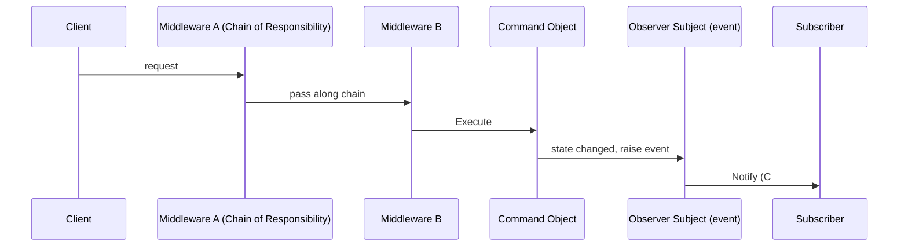
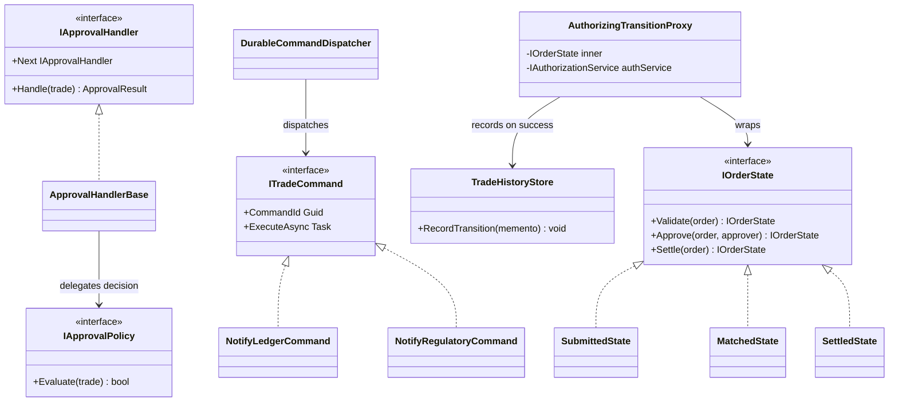
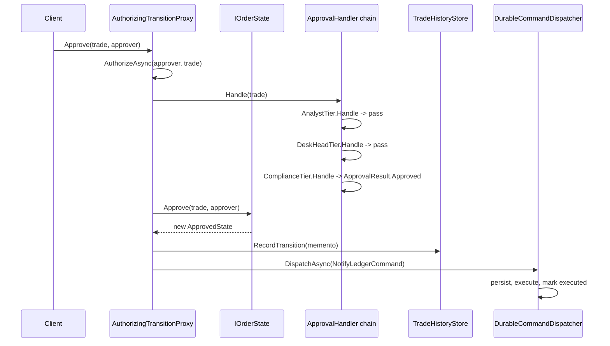

# Module 32 — Design Patterns: Behavioral Patterns

> Domain: Design Patterns | Level: Beginner → Expert | Prerequisite: [[01-Creational-Structural-Patterns]], [[../09-OOP/01-OOP-Fundamentals-Advanced]] §Advanced Q2 (Template Method), [[../01-CSharp/04-Delegates-Events-Closures]] (Observer's C#-native realization)

---

## 1. Fundamentals

### What are behavioral patterns?
Behavioral patterns address **how objects communicate and distribute responsibility** for a given algorithm/workflow — Strategy (swappable algorithms), Observer (one-to-many notification), Command (encapsulating a request as an object), Template Method (fixed algorithm skeleton with overridable steps, §Advanced Q2), Chain of Responsibility (passing a request along a chain of potential handlers), State (behavior varying by internal state), Mediator (centralizing complex inter-object communication), and Iterator (uniform traversal, C#'s `foreach`/`IEnumerable`).

### Why do these exist?
Each addresses a specific coordination/communication problem that, done naively, creates tight coupling between the objects involved — Strategy decouples an algorithm's *choice* from its *usage site*; Observer decouples a publisher from knowing its subscribers' concrete types; Command decouples the *invoker* of an action from the action's actual implementation, enabling queuing/undo/logging of the action itself as data.

### When does this matter?
Nearly universally — several of these patterns (Strategy, Observer, Iterator) are so foundational they're built directly into C#'s own language features (delegates/interfaces, events, `IEnumerable`) rather than requiring hand-written GoF-style class hierarchies, making recognizing "this is Strategy/Observer, just expressed via C# idioms" a genuine interview and design-literacy skill.

### How does it work (30,000-ft view)?
```csharp
// C# — Strategy via an interface + DI (not a classic GoF class hierarchy)
public interface IShippingCostStrategy { decimal Calculate(Order order); }
public sealed class OrderService
{
    private readonly IShippingCostStrategy _shippingStrategy; // swappable algorithm
    public OrderService(IShippingCostStrategy shippingStrategy) => _shippingStrategy = shippingStrategy;
}
```
```java
// Java — Strategy is a FUNCTIONAL interface; the "implementation" is often just a lambda.
// (This is the biggest behavioral-pattern idiom gap between the languages — see §2.6.)
@FunctionalInterface
public interface ShippingCostStrategy { BigDecimal calculate(Order order); }

public final class OrderService {
    private final ShippingCostStrategy shippingStrategy;
    public OrderService(ShippingCostStrategy shippingStrategy) { this.shippingStrategy = shippingStrategy; }
}
// new OrderService(order -> new BigDecimal("5.99"));   // no named class needed
```

---

## 2. Deep Dive

### 2.1 Strategy — Already the De Facto C# Idiom for "Swappable Algorithm"
Strategy encapsulates an interchangeable algorithm/policy behind a shared interface, injected into the context that uses it — the same `IDiscountStrategy` / `IApprovalPolicy` / `IAuthorizationHandler` shape recurring throughout this course (the OOP and SOLID modules especially). The GoF's classic Strategy pattern and the modern "inject an interface implementation" design (C# DI, or a Java `@FunctionalInterface` + lambda) are, in practice, the **same pattern**, described in different vocabularies from different eras — a synthesis point worth stating explicitly ("we've been using Strategy all along under the name 'inject an interface'") rather than treating Strategy as a new concept.

### 2.2 Observer — C# Events Are a Language-Native Observer Implementation
The Observer pattern (a subject maintains a list of observers, notifying them of state changes) is, as established, **directly implemented as a first-class language feature** via C# events — `event`/delegate subscription **is** Observer, with the language handling the subscribe/unsubscribe/notify mechanics automatically. The GoF's textbook Observer (an explicit `IObserver` interface with `Attach`/`Detach`/`Notify` methods) predates C# events and represents the *manual*, hand-rolled version of what C# events later made a built-in language construct — worth recognizing that "does this codebase use the Observer pattern" should be answered "yes, via its events" for the overwhelming majority of C# codebases, not "no, we don't have any `IObserver` interfaces."

### 2.3 Command — Encapsulating a Request as a First-Class Object
Command wraps a request (an action to perform, plus its parameters) as an object implementing a common interface (typically just `Execute`), decoupling the code that *invokes* an action from the code that *implements* it — enabling the action to be **queued, logged, undone, or retried** as data, since it's now an object, not just a direct method call. This is the conceptual foundation behind: a job queue (each queued job is a Command object), an undo/redo stack (each Command stores enough state to reverse itself), and — directly connecting to the Expert exercise — the DI-mediator pattern's `INotificationHandler<T>`/request objects are architecturally Command-pattern-shaped (a request object dispatched to a handler, decoupling the caller from the handling logic).

### 2.4 Chain of Responsibility — Already Covered as the Middleware Pipeline
Chain of Responsibility passes a request along a chain of potential handlers, each deciding to handle it, pass it along, or both — this is, precisely, the ASP.NET Core middleware pipeline and/the `IEndpointFilter` chain, **already covered in full depth** as a concrete, production framework realization of this exact pattern; recognizing "the middleware pipeline is Chain of Responsibility" is a direct, valuable cross-module synthesis rather than new material to learn from scratch.

### 2.5 State — Behavior Varying by Internal State, and Its Records-Based Alternative
The classic State pattern models an object whose behavior changes based on its internal state by delegating to a swappable "current state" object (each state implementing a shared interface with state-specific behavior) — the sealed-record-hierarchy-plus-exhaustive-switch design (`OrderState` → `Pending`/`Paid`/`Shipped`/`Cancelled`) is a **modern, idiomatic C# alternative** to the classic State pattern, already covered in depth there, trading State's "each state is a swappable, polymorphic object" mechanism for "each state is an immutable record, transitions are pure functions with compiler-enforced exhaustiveness" — both solve the same underlying problem; which is preferable depends on whether compile-time exhaustiveness (records / `sealed`) or genuine polymorphic extensibility (classic State pattern, when new states must be pluggable by external code without recompiling the core logic) is the more valuable property for a given domain — the same discriminated-union trade-off this course revisits wherever a closed-vs-open case set is in play (Advanced Q6; the SOLID module's Intermediate Q3).

### 2.6 Behavioral Patterns in C# and Java — Where the Idioms Genuinely Diverge

Behavioral patterns are the ones most *absorbed into language features*, and C# and Java absorbed different ones. A FinTech interviewer at a Java shop will not accept "we use C# events for Observer" — you need the Java answer.

| Pattern | C# idiom | Java idiom |
|---|---|---|
| **Strategy** | inject an `interface` implementation (a named class, usually via DI); or a `Func<...>` | a **`@FunctionalInterface`** — the "implementation" is typically a **lambda or method reference**, no named class; `Function<Order,BigDecimal>` / `Comparator` / `Predicate` are Strategy |
| **Observer** | **`event` + delegate** — a first-class language feature; `+=` / `-=` / `Invoke` | **no language events.** Options: a hand-rolled `List<Listener>` + `notifyAll`; `java.beans.PropertyChangeSupport`/`PropertyChangeListener` (Swing/bean world); **`java.util.concurrent.Flow`** (JDK 9, reactive-streams SPI) or a library (RxJava, Project Reactor, `Flow` via `SubmissionPublisher`) for backpressure-aware pub/sub. **`java.util.Observable`/`Observer` were deprecated in Java 9** — never propose them |
| **Command** | an `ICommand` interface with `Execute()`; MediatR `IRequest`/`IRequestHandler` | a `Runnable` / `Callable<T>` / a `@FunctionalInterface`; an explicit `Command` interface when you need `undo()`; the "request object + handler" shape is done with an explicit interface or a library (Axon, Spring's `ApplicationEventPublisher` for events) |
| **Chain of Responsibility** | ASP.NET Core middleware (`RequestDelegate` pipeline); `IEndpointFilter` chain | **Servlet `Filter`** chain; Spring `HandlerInterceptor`; a hand-built linked list of handlers; `java.util.function.Function::andThen` composition |
| **Template Method** | `abstract` base with an overridable `protected` step; often a `virtual` hook | identical — `abstract` base with abstract hook methods; mark the template method **`final`** so a subclass can't skip the skeleton (a compile-time guarantee C#'s opt-in-virtual doesn't need to state) |
| **State** | classic polymorphic state objects, **or** `sealed record` hierarchy + exhaustive `switch` | classic polymorphic state objects, **or** `sealed interface OrderState permits Pending, Paid, ...` + exhaustive `switch` pattern matching (Java 21); an `enum` with per-constant method overrides for a small fixed state set |
| **Iterator** | `IEnumerable<T>` / `IEnumerator<T>`; `yield return` generators; `foreach` | `Iterable<T>` / `Iterator<T>`; the enhanced `for` loop; **no `yield`** — a generator is a hand-written `Iterator`, or a `Stream` (`Stream.iterate`, `Stream.generate`), or a `Spliterator` |
| **Mediator** | MediatR (`IMediator.Send`/`Publish`) is near-ubiquitous | no dominant equivalent; Spring's `ApplicationEventPublisher` for the publish side, or an explicit mediator class; libraries exist but none is standard |

**The two that will trip up a C#-only candidate in a Java interview:**

1. **Observer.** There is no `event` keyword. If asked "how does Observer look in Java," the strong answer is: for in-process, low-volume notification, a hand-rolled listener list or `PropertyChangeSupport`; for anything with volume, ordering, or backpressure concerns, **`java.util.concurrent.Flow`** (`SubmissionPublisher` as the subject, `Flow.Subscriber` as the observer, with `request(n)` backpressure) or Project Reactor / RxJava. And you must know `java.util.Observable` is deprecated and why (no generics, `setChanged()` foot-gun, extends-not-implements forces single inheritance).

2. **Strategy.** In Java 8+, "create a Strategy" often means "pass a lambda to a method that takes a `Function`/`Comparator`/`Predicate`" — the pattern is so absorbed into functional interfaces that writing a named `class StandardShipping implements ShippingCostStrategy` can read as over-ceremony unless the strategy carries state or is DI-managed. The C# story is similar with `Func<>`, but named-class-per-strategy is more common in idiomatic C# codebases.

**Command (with `undo`), Chain of Responsibility, Template Method, and the classic polymorphic State pattern port line-for-line** — the design intent is identical; only Observer and lambda-Strategy require a genuinely different Java answer.

## 3. Visual Architecture

```mermaid
sequenceDiagram
 participant Client
 participant MW1 as Middleware A (Chain of Responsibility)
 participant MW2 as Middleware B
 participant Handler as Command Object
 participant Subject as Observer Subject (event)
 participant Sub as Subscriber

 Client->>MW1: request
 MW1->>MW2: pass along chain
 MW2->>Handler: Execute
 Handler->>Subject: state changed, raise event
 Subject->>Sub: Notify (C# event mechanism)
```

## 4. Production Example
**Scenario**: A codebase implemented an order-approval workflow using a large, deeply-nested `if`/`else if` chain checking approval-level thresholds (`if (amount < 1000) autoApprove; else if (amount < 10000) requireManagerApproval; else if (amount < 100000) requireDirectorApproval; else requireVPApproval;`), directly inline in the order-submission handler — adding a new approval tier (a "regional VP" level inserted between director and VP) required carefully inserting a new branch in the exact right position within this deeply-nested structure, and a bug during one such insertion (an off-by-one in the threshold comparison) caused orders in a specific dollar range to skip required approval entirely for several days before being caught by an unrelated finance audit. **Investigation**: root-caused to the fragile, deeply-nested conditional structure making it easy to introduce a subtle threshold-boundary error when inserting a new tier, and equally easy for that error to go unnoticed in code review given the structure's overall complexity. **Fix**: refactored into a Chain of Responsibility — a list of `IApprovalHandler` objects, each checking whether it's the correct threshold tier for the order's amount and either handling it or passing to the next handler in the chain, with a new tier added by inserting one new handler class at the correct position in a simple, explicit **list** (not a nested conditional structure) making the tier ordering and boundaries visually obvious and independently unit-testable per handler. **Lesson**: exactly the OCP-violation lesson, now in a behavioral-pattern-specific form — a growing, ordered set of conditional cases (approval tiers) is precisely Chain of Responsibility's textbook use case, and forcing it into a nested if/else chain creates the same "modifying to add one case risks silently breaking adjacent cases" risk already demonstrated, here manifesting as a genuine, financially-significant approval-bypass bug rather than a notification-channel bug.
## 10. Interview Questions

### Basic (10)

**B1. Q: What does the Strategy pattern do?**
*Ideal answer:* Encapsulates an interchangeable algorithm/policy behind a shared interface, injected into the context that uses it — so the *choice* of algorithm is decoupled from the *usage site*.
*Common mistake:* Treating it as a distinct heavyweight construct rather than recognizing that "inject an interface implementation" *is* Strategy.
*Follow-up:* "How does Strategy look in Java 8+?" (a `@FunctionalInterface` satisfied by a lambda — `Comparator`, `Function`, `Predicate` are Strategy — §2.6).

**B2. Q: How is the Observer pattern realized natively in C#, and what's the Java equivalent?**
*Ideal answer:* C#: the `event` keyword + delegate subscription (`+=`/`-=`/`Invoke`) — a first-class language feature. Java has **no** language events: options are a hand-rolled `List<Listener>` + notify loop, `java.beans.PropertyChangeSupport`/`PropertyChangeListener`, or, for volume/ordering/backpressure, `java.util.concurrent.Flow` (`SubmissionPublisher` + `Flow.Subscriber`) / Reactor / RxJava. `java.util.Observable`/`Observer` were **deprecated in Java 9**.
*Common mistake:* Answering "use `java.util.Observable`" in a Java context — deprecated, no generics, `setChanged()` foot-gun.
*Follow-up:* "When does the hand-rolled listener list stop being adequate?" (when you need backpressure, ordering guarantees, or async delivery — move to `Flow`/Reactor).

**B3. Q: What does the Command pattern do?**
*Ideal answer:* Encapsulates a request/action (plus its parameters) as an object implementing a common interface, decoupling the *invoker* from the *implementation* — which lets the action be queued, logged, retried, or undone as data.
*Common mistake:* Confusing it with Strategy — Command represents *a request to do something*; Strategy represents *how to compute something*.
*Follow-up:* "When is a bare `Runnable`/`Callable` enough, and when do you need an explicit `Command` interface?" (bare functional interface for fire-and-forget; explicit interface when you need `undo()` or metadata like an idempotency key).

**B4. Q: What mechanism in ASP.NET Core (or the Servlet world) realizes Chain of Responsibility?**
*Ideal answer:* C#: the middleware pipeline (`RequestDelegate` chain) and `IEndpointFilter` chains. Java: the Servlet `Filter` chain, or Spring `HandlerInterceptor` — each element handles, passes on, or both.
*Common mistake:* Not recognizing the middleware pipeline as this pattern at all ("it's just framework plumbing").
*Follow-up:* "What decision does each element in the chain make?" (handle-and-stop, pass-through, or handle-and-continue — Intermediate Q9).

**B5. Q: What does the State pattern address?**
*Ideal answer:* An object whose behavior changes with its internal state, modelled by delegating to a swappable "current state" object — each state implementing a shared interface with state-specific behavior and transition logic.
*Common mistake:* Implementing it as a big `switch (this.status)` in every method (that's the thing State replaces); or using it where an `enum` + a couple of guards would do.
*Follow-up:* "What's the modern alternative and its trade-off?" (a `sealed`/`sealed record` hierarchy + exhaustive `switch` — compile-time exhaustiveness vs the classic pattern's open extensibility — B6, Intermediate Q4).

**B6. Q: What is the records-based alternative to the classic State pattern?**
*Ideal answer:* A `sealed` hierarchy of immutable state types (`sealed record OrderState` + `Pending`/`Paid`/`Shipped`/`Cancelled` in C#; `sealed interface OrderState permits ...` in Java 17+) with transitions as pure functions and an **exhaustive `switch`** the compiler checks — a missed case is a compile error.
*Common mistake:* Assuming it's strictly better than the classic pattern — it deliberately forecloses external extensibility (Intermediate Q4).
*Follow-up:* "Which do you pick if plugins must add states without recompiling the core?" (the classic polymorphic pattern — Advanced Q6).

**B7. Q: What does the Iterator pattern provide, and how is it expressed in each language?**
*Ideal answer:* Uniform traversal over a collection without exposing its internal structure. C#: `IEnumerable<T>`/`IEnumerator<T>` + `foreach`, with `yield return` generators. Java: `Iterable<T>`/`Iterator<T>` + the enhanced `for` loop — but **no `yield`**, so a generator is a hand-written `Iterator`, a `Stream` (`Stream.iterate`/`generate`), or a `Spliterator`.
*Common mistake:* Assuming Java has a `yield`-style generator (it doesn't for iterators; `yield` in Java is only the `switch`-expression keyword).
*Follow-up:* "How would you lazily produce an infinite sequence in each?" (C#: `yield return` in a loop; Java: `Stream.iterate(seed, next)`).

**B8. Q: What does Mediator do?**
*Ideal answer:* Centralizes complex many-to-many communication between peer objects into one coordinating object, so peers reference the mediator instead of each other.
*Common mistake:* Confusing it with Facade — Facade simplifies a *client-facing* interface to a subsystem; Mediator coordinates *peers* internally (Intermediate Q6).
*Follow-up:* "What's the risk if the mediator's scope grows?" (it becomes a god object — Advanced Q5).

**B9. Q: Is "inject an interface implementation via DI" the same as the Strategy pattern?**
*Ideal answer:* Yes, in practice — the same underlying pattern (a swappable algorithm behind an interface), described in the vocabulary of a different era. The whole course has used Strategy under the name "inject an interface."
*Common mistake:* Insisting they're different because one uses a container — the container is just the wiring mechanism.
*Follow-up:* "So is there ever a reason to write a named `class XStrategy` instead of passing a lambda?" (when the strategy carries state, needs DI of its own dependencies, or benefits from a name in stack traces/logs).

**B10. Q: What's the relationship between GoF's classic Observer and C# events / a Java listener list?**
*Ideal answer:* C# `event` is a built-in, language-native implementation of exactly the Observer pattern GoF describes manually (a subject with `Attach`/`Detach`/`Notify` and an `IObserver` interface). In Java, the hand-rolled listener list (or `PropertyChangeSupport`, or `Flow`) *is* that manual GoF form, because the language provides no event keyword.
*Common mistake:* Answering "we don't use Observer" for a C# codebase that's full of events; or proposing to hand-roll `IObserver` in C# "to follow the pattern" (Intermediate Q7).
*Follow-up:* "Name a limitation of C# events that pushes teams to a different mechanism." (no async-aware delivery, no per-subscriber error isolation, no delivery guarantee — Expert Q1).

### Intermediate (10)

**I1. Q: Why is recognizing "our DI-injected interfaces are Strategy" valuable beyond terminology?**
*Ideal answer:* It connects everyday practice to the pattern literature, so a team can communicate design intent in one word ("use Strategy here") and, more importantly, recognize when an *adjacent* less-familiar pattern (State, Chain of Responsibility) fits a related problem better than reflexively reaching for another injected interface.
*Why correct:* It names the concrete payoff — shared vocabulary + pattern-adjacency awareness — rather than "it's good to know theory."
*Common mistakes:* Treating pattern names as trivia; over-formalizing ("we must call it StrategyImpl").
*Follow-up:* "Give a case where the problem looks like Strategy but State fits better." (behavior varies by the object's own lifecycle stage and transitions between behaviors matter — that's State, not a stateless injected policy).

**I2. Q: Why does Command's "encapsulate as an object" property enable undo that a direct method call can't?**
*Ideal answer:* A Command object persists — it can store the exact state needed to reverse its effect (the prior value, the insertion position + text) as fields, and a stack of executed commands is a durable history. A direct method call is ephemeral: once it returns there's no representation left to invert.
*Why correct:* It ties undo to the Command's *persistence and captured reversal state*, contrasted with a call's ephemerality.
*Common mistakes:* Storing a reference to "the document before" (whole-object snapshots don't scale — capture the *delta*); assuming every action is invertible (some need an inverse command, some need a snapshot).
*Follow-up:* "What does the Command capture for `InsertText` vs `DeleteSelection`?" (insert: position + text; delete: position + the removed text, so undo can re-insert it).

**I3. Q: Why is a deeply-nested if/else chain for approval tiers structurally the same risk as the §4 notification-switch incident?**
*Ideal answer:* Both are a growing, ordered set of conditional cases sharing one modification-requiring structure. Inserting a new tier means editing shared code and risks disturbing an adjacent case's boundary condition — the same OCP-violation shape whether it's a `switch` or nested `if`s. Nesting arguably makes it worse because the boundary conditions are spread across indentation levels.
*Why correct:* It identifies the shared structural property (one edited-to-extend conditional) and notes nesting's added hazard (dispersed boundaries).
*Common mistakes:* Thinking `if`/`else` is safer than `switch` (it's the same risk); blaming the specific off-by-one rather than the structure that invited it.
*Follow-up:* "Chain of Responsibility fixes the structure — what new failure does it introduce?" (independently-correct handlers can still compose wrongly, and boundary bugs move to *ordering* — Advanced Q1's boundary test addresses exactly this).

**I4. Q: Why might a team choose the classic polymorphic State pattern over the records-based alternative despite the latter's compile-time exhaustiveness?**
*Ideal answer:* If the domain genuinely needs third-party/plugin code to add new states *without recompiling the core*, a `sealed` hierarchy structurally forbids that. The classic pattern's open, non-sealed `IState` interface any assembly can implement is the right tool when the extensibility trade must go that way.
*Why correct:* It states the exact property being traded (external extensibility vs compile-time exhaustiveness) and when each wins.
*Common mistakes:* Assuming the records approach is always the modern-correct choice; using the open pattern when the state set is actually fixed (then you've lost exhaustiveness for nothing).
*Follow-up:* "How common is genuine plugin-added-state in practice?" (rare — most state machines are closed; default to the sealed/exhaustive form unless plugin extensibility is a real, named requirement).

**I5. Q: Why does Chain of Responsibility's list-based ordering make boundary conditions more visually obvious than a nested if/else chain?**
*Ideal answer:* Each handler's threshold check is self-contained in its own class, and the chain order is an explicit list (or DI registration order) a reviewer sees at a glance — versus tracing nested indentation to reconstruct the full conditional structure and where each boundary sits.
*Why correct:* It contrasts "one visible ordered list of small, independently-reviewable units" with "one large method whose structure is implicit in nesting."
*Common mistakes:* Assuming the chain removes boundary bugs (it relocates them to handler ordering and per-handler thresholds — still test them, Advanced Q1); building the chain order implicitly and undocumented.
*Follow-up:* "Where does the chain's order get defined, and how do you test it's right?" (one composition point; a parameterized boundary test across the whole assembled chain).

**I6. Q: Why is Mediator's centralization benefit similar to, but distinct from, Facade's?**
*Ideal answer:* Both cut direct coupling by introducing a central point. Facade simplifies a *client-facing* interface to an existing complex subsystem (outward simplification). Mediator manages *communication between peer objects* that would otherwise hold references to each other (inward coordination). Different direction, different problem.
*Why correct:* It distinguishes them by direction of concern (client-facing simplification vs peer coordination), not by "both are central objects."
*Common mistakes:* Treating them as interchangeable; using a Mediator where a Facade (or just direct calls) would be simpler.
*Follow-up:* "You have five services that each call the other four — Facade or Mediator?" (Mediator — the problem is peer-to-peer coupling, not a hard-to-use subsystem interface).

**I7. Q: Why is hand-rolling a classic `IObserver`/`Attach`/`Detach` interface in modern C# an anti-pattern rather than "correctly implementing Observer"?**
*Ideal answer:* It reimplements, with more code and worse tooling, exactly what the `event` keyword already provides (subscribe/unsubscribe/notify, compiler-checked, understood by every C# engineer). Use the native mechanism unless you have a specific, named reason to deviate — e.g. async-aware notification, per-subscriber error isolation, or delivery ordering that events don't give you. *(In Java the calculus is reversed — there is no native event, so the hand-rolled listener list or `Flow` is the correct implementation.)*
*Why correct:* It weighs "reinvent a language feature" against "no benefit" and carves out the genuine exceptions, and notes the Java difference.
*Common mistakes:* Doing it "to follow the GoF pattern" (Advanced Q8); or the reverse — assuming C# events are always sufficient (Expert Q1 shows a case they aren't).
*Follow-up:* "Name a real limitation of C# events." (all handlers run synchronously on the publisher's thread; one throwing can abort the rest; no built-in async or backpressure).

**I8. Q: How does the DI-mediator pattern (an alternative to raw events for cross-module communication) relate to both Observer and Command?**
*Ideal answer:* It blends both — like Observer, multiple handlers independently react to one published notification; like Command, the notification is an encapsulated, dispatched *object* rather than a direct call, so it can be logged, validated, or routed. Real designs often combine pattern properties rather than matching one textbook shape.
*Why correct:* It maps the mediator's two salient properties onto the two patterns precisely (fan-out = Observer; request-as-object = Command).
*Common mistakes:* Insisting it "is" one pattern; using a mediator library where a plain event or direct call suffices.
*Follow-up:* "What does the mediator buy over a raw event for cross-module notification?" (a typed request object, pipeline behaviors — validation/logging/transactions — and testability of the dispatch; Expert Q2).

**I9. Q: Why might a Chain of Responsibility handler need to explicitly choose "handle and stop" vs "handle and continue," and what determines the right choice?**
*Ideal answer:* Some chains have "first matching handler owns it" semantics (approval tiers — exactly one tier claims the request and stops the chain); others have "every matching handler contributes" semantics (a validation pipeline collecting all errors; an audit chain where every applicable handler must observe). The domain's semantics decide, and it must be a deliberate per-chain design decision, not an assumed default.
*Why correct:* It names the two semantic models and states the deciding criterion (does the domain want one winner or all contributors).
*Common mistakes:* Assuming all chains are "first wins"; mixing both semantics in one chain without a clear rule.
*Follow-up:* "A validation chain where one failure should abort the rest — which semantics, and how do you express it?" (handle-and-continue normally, but a handler can signal 'fatal' to stop — a third, explicit outcome).

**I10. Q: Why does recognizing framework/language features as "already implementing pattern X" matter for interview performance specifically?**
*Ideal answer:* It demonstrates *applied* design-pattern literacy — connecting abstract theory to concrete, familiar behavior — rather than only reciting definitions. It's a strong differentiator between a candidate who memorized GoF names and one who understands the coordination problems the patterns solve and can spot them anywhere.
*Why correct:* It frames the skill as "recognize the mechanism in the wild," which is what a Staff/Principal interviewer is actually probing.
*Common mistakes:* Reciting the pattern catalog; being unable to name a real framework instance of a pattern you can define.
*Follow-up:* "Which behavioral pattern does an ORM's unit-of-work / change tracker most resemble?" (Command — deferred, batched, encapsulated operations — and loosely Memento for the original-values snapshot; Advanced Q9).

### Advanced (10)

**A1. Q: Diagnose the approval-bypass production incident from first principles, and design the testing strategy that specifically prevents recurrence for any future Chain of Responsibility refactor.**
*Ideal answer:* Root cause: a deeply-nested conditional structure that made a boundary-condition error easy to introduce and hard to catch in review — the OCP-violation risk shape. Testing strategy: a **parameterized boundary test** asserting the correct handler is selected for values *at and immediately adjacent to every tier boundary* ($999 / $1000 / $1001, etc.) across the *entire assembled chain*, run as one suite that must pass whenever a handler is inserted or reordered. It mechanically catches an off-by-one at the exact value class that caused the §4 incident, instead of relying on review.
*Why correct:* It ties the fix to a mechanical test at the specific failure class (boundary values across the whole chain), re-run on every structural change.
*Common mistakes:* Testing each handler's threshold in isolation only (misses ordering/gap bugs between handlers); testing round numbers but not the ±1 neighbours where off-by-one lives.
*Follow-up:* "A new tier is inserted between two existing ones — what must the test already cover for the insertion to be safe?" (the boundaries on *both* sides of the new tier, which the every-boundary parameterization already includes once the new boundary values are added).

**A2. Q: Design a Command-based undo/redo stack for a document editor, explaining what state each Command must capture.**
*Ideal answer:*
 ```csharp
public interface ICommand { void Execute(); void Undo(); }

public sealed class InsertTextCommand : ICommand
{
    private readonly Document _document;
    private readonly int _position;
    private readonly string _text;
    public InsertTextCommand(Document document, int position, string text)
        => (_document, _position, _text) = (document, position, text);

    public void Execute() => _document.InsertAt(_position, _text);
    public void Undo()    => _document.RemoveAt(_position, _text.Length); // reverses using the SAME captured state
}
 ```
 Each Command captures **exactly the state needed to both perform and reverse its specific action** — insert captures position + text (enough to compute the removal that undoes it); a delete command captures position + the *removed* text (so undo can re-insert it). A `Stack<ICommand>` of executed commands drives undo (pop, call `Undo`); a parallel redo stack drives redo (push undone commands, replay `Execute`). A new action clears the redo stack. *(Java: an explicit `Command` interface — not a bare `Runnable`, because you need `undo()` — with `Deque` as the stack.)*
*Why correct:* It states the capture rule (delta, not whole-object snapshot) with a per-command-type example, and the two-stack mechanics including the redo-invalidation rule.
*Common mistakes:* Snapshotting the whole document per command (doesn't scale); forgetting to clear redo on a new action; assuming every action has a trivial inverse (some need the removed data stored, some need a full inverse command).
*Follow-up:* "How do you make a group of edits one undo step?" (a `CompositeCommand` holding a list, whose `Undo` reverses them in reverse order).

**A3. Q: Explain a scenario where combining Chain of Responsibility with Strategy produces a more flexible design than either alone.**
*Ideal answer:* An approval-chain handler (Chain of Responsibility — decides *whether this tier applies*) delegates its actual approval-decision *logic* to an injected `IApprovalPolicy` (Strategy — decides *what approval requires at this tier*, e.g. one approver vs a configurable multi-approver rule). This separates "which tier handles this request" (structural, the chain's concern) from "what does approval mean here" (configurable, the policy's concern), so a tier's policy can change without touching chain structure, and vice versa — two patterns composing to isolate two independently-varying concerns (the SRP "independently-varying stakeholders" reasoning, via composed patterns).
*Why correct:* It maps each pattern to a distinct axis of variation (tier selection vs policy) and shows changing one doesn't touch the other.
*Common mistakes:* Putting the configurable policy logic *in* the handler (re-couples the two concerns); adding the Strategy layer when tier policies are actually fixed (needless indirection).
*Follow-up:* "How do you migrate an existing hardcoded chain to this without a rewrite?" (add `IApprovalPolicy` as an optional ctor dep defaulting to the current hardcoded behavior; migrate tiers one at a time — Advanced Q7).

**A4. Q: How would you decide whether a growing, ordered set of business rules is better modeled as Chain of Responsibility or as a sealed-hierarchy-plus-exhaustive-`switch`?**
*Ideal answer:* Chain of Responsibility when handlers genuinely need to be added/removed/reordered at *runtime* (a configurable pipeline, per-deployment enable/disable) or when plugins must contribute handlers without recompiling the core. The sealed-hierarchy + exhaustive-`switch` when the case set is *known and fixed at compile time* and the value is the compiler forcing you to handle a new case everywhere. Same "runtime/external extensibility vs fixed compile-time-verifiable set" trade-off this module's Intermediate Q4 establishes for State, generalized to any ordered-rule-set decision.
*Why correct:* It gives the deciding criterion (runtime/plugin extensibility need vs compile-time exhaustiveness value) and connects it to the recurring State trade-off.
*Common mistakes:* Choosing the chain for its "flexibility" when the rule set is actually fixed (you gave up exhaustiveness checking for nothing); choosing the sealed switch when plugins really do need to add rules.
*Follow-up:* "The rule set is fixed but you want per-deployment enable/disable of specific rules — which, and how?" (still the exhaustive switch for the logic; a config flag consulted per rule for enable/disable — you don't need a runtime-reorderable chain for a boolean toggle).

**A5. Q: Explain why a Mediator-based design can itself become a "god object" anti-pattern if not carefully scoped, despite solving the direct-coupling problem it's meant to address.**
*Ideal answer:* If one Mediator ends up coordinating an ever-growing set of unrelated concerns — order processing, notifications, inventory, all through one central dispatcher — it accumulates the same "too many independently-varying responsibilities" SRP violation the pattern was meant to prevent, just relocated from the peers to the mediator. Fix: apply SRP to the mediator's own scope — several smaller domain-scoped mediators (order, notification), not one universal coordinator.
*Why correct:* It identifies that the pattern relocates coupling to the mediator and that SRP applies to the mediator too, with the concrete fix (domain-scoped mediators).
*Common mistakes:* Assuming "we have a mediator, so coupling is solved"; one mediator per application as a default.
*Follow-up:* "How do you draw the boundary between mediators?" (by bounded context / domain — the same reason-to-change seams as any SRP split).

**A6. Q: Design a classic (not records-based) State-pattern implementation for a scenario genuinely requiring third-party pluggable states, and explain the key structural difference from the sealed-hierarchy approach.**
*Ideal answer:*
 ```csharp
public interface IOrderState
{
    IOrderState Pay(Order order, string transactionId);
    IOrderState Ship(Order order, string trackingNumber);
}
public sealed class PendingState : IOrderState
{
    public IOrderState Pay(Order order, string transactionId) => new PaidState(transactionId);
    public IOrderState Ship(Order order, string trackingNumber)
        => throw new InvalidOperationException("Cannot ship an unpaid order.");
}
// A third-party plugin can implement IOrderState with an entirely NEW state (PartiallyRefundedState)
// WITHOUT modifying OrderService or any existing state class -- OCP-compliant "add a state"
// extensibility, the exact property a SEALED hierarchy + exhaustive switch deliberately forecloses.
 ```
 *(Java: identical — a plain `interface OrderState`, not `sealed`, so any module can `implements` it.)*
*Why correct:* It shows the open, non-`sealed` interface as the enabler of plugin-added states and names precisely what the sealed approach trades away (that openness, in exchange for compile-time exhaustiveness).
*Common mistakes:* Sealing the interface "for safety" and then wondering why plugins can't extend it; using this open form when the state set is actually closed (you lost exhaustiveness for no gain).
*Follow-up:* "With the open form, how do you catch a state that forgot to handle a transition?" (you can't at compile time — you need a contract test per state asserting every transition method either transitions or throws a defined exception).

**A7. Q: Explain how you'd refactor the §4 chain fix to also support Advanced Q3's Strategy-based configurable-policy composition, incrementally, without a risky rewrite.**
*Ideal answer:* Add `IApprovalPolicy` as an *additional, optional* constructor dependency on each existing `IApprovalHandler`, defaulting to each handler's current hardcoded behavior wrapped as a default policy — so existing behavior is unchanged. Then migrate specific tiers' hardcoded logic into genuinely configurable policy implementations one at a time, validating each. The same "expand, don't break" migration, applied to composing two behavioral patterns.
*Why correct:* Both behaviors coexist (default policy preserves current behavior), each tier migrates independently, and nothing is a big-bang change.
*Common mistakes:* Making the policy dependency required (forces every handler to change at once); migrating all tiers in one PR.
*Follow-up:* "How do you know a tier's default-policy wrapper is behavior-equivalent to its old hardcoded logic before you swap in a configurable one?" (the Advanced Q1 boundary test suite must still pass with the default policy in place).

**A8. Q: A team proposes replacing all of their C# events with a hand-rolled `IObserver<T>`-based implementation "to more explicitly follow the GoF pattern." Evaluate this as a Principal.**
*Ideal answer:* Push back — it's a regression. C# `event` already *is* the Observer pattern, as a compiler-checked, well-tooled, universally-understood language feature; replacing it with a hand-rolled equivalent adds code and cognitive load for zero benefit (Intermediate Q7's reimplementation anti-pattern). "More explicitly following GoF" is not a goal when the language provides an idiomatic native realization. Keep events; spend any "pattern rigor" effort where there's a *real* gap — e.g. migrating cross-module communication to a DI-mediator (Expert Q2), which addresses demonstrated limitations of raw events (no async delivery, no per-subscriber error isolation, no delivery guarantee — Expert Q1).
*Why correct:* It names the cost (reimplementing a language feature), rejects "GoF-explicitness" as a value in itself, and redirects effort to a genuine gap.
*Common mistakes:* Agreeing because "explicit patterns are good practice"; or dismissing all custom event infrastructure (Expert Q1/Q2 show cases where events genuinely fall short).
*Follow-up:* "What specific event limitation would justify a custom mechanism?" (need for async/ordered delivery, per-handler failure isolation, or a delivery/subscription guarantee — none of which `event` provides).

**A9. Q: Apply this module's "recognize the pattern in existing code" skill: which behavioral pattern(s) does an ORM's change-tracker / `SaveChanges` most resemble?**
*Ideal answer:* Mostly **Command** — each tracked change is a deferred, encapsulated "operation to perform," executed as a batch when `SaveChanges`/`commit` is called rather than immediately. Loosely **Memento** — the change tracker's per-entity "original values" snapshot plays the "remember prior state for comparison / potential reversal" role. Recognizing these resemblances even when the framework's own docs don't name them is the transferable literacy this module builds.
*Why correct:* It maps the two salient behaviors (deferred batched operations; original-values snapshot) onto Command and Memento correctly, with appropriate confidence ("mostly", "loosely").
*Common mistakes:* Forcing it to be exactly one pattern; missing the deferred-execution (Command) aspect entirely.
*Follow-up:* "Where does the Unit of Work pattern fit relative to those?" (Unit of Work is the container that *collects* the commands and coordinates the single commit — a structural wrapper around the Command-like change set).

**A10. Q: As a Principal, how would you use this module's cross-referencing approach as a teaching technique for a team learning design patterns for the first time?**
*Ideal answer:* Introduce each pattern by first asking "where have you already seen this in code you use every day?" — C# events / a listener list for Observer, the middleware or Servlet-filter pipeline for Chain of Responsibility, DI-injected interfaces for Strategy — *before* the formal GoF definition and UML. This reverses the usual "learn the abstraction, then spot it in the wild" order into "recognize you already understand the mechanism, then learn its name and shape," which transfers and retains better than memorizing definitions first.
*Why correct:* It gives a concrete pedagogical order (familiar instance → name → formal shape) with the rationale (recognition before abstraction aids transfer).
*Common mistakes:* Teaching the GoF catalog cover-to-cover with toy examples; not pairing each pattern with a real codebase instance the team already relies on.
*Follow-up:* "How do you check the team internalized it rather than memorized 23 names?" (in design review, do they say "this is Chain of Responsibility, and here's why it fits / doesn't" — pattern reasoning, not pattern labeling).

### Expert (10)
1. **Q: A settlement-notification service using a C# event (`OrderSettled`) to notify five downstream subscribers (ledger update, client notification, regulatory reporting, risk recalculation, audit log) is found, months after a new subscriber was added, to occasionally miss the regulatory-reporting subscriber's write entirely under load, with no exception thrown anywhere. Diagnose the root cause and the fix.**
 **A:** The most likely root cause is a race in subscription lifecycle, not the event-dispatch mechanism itself: if the regulatory-reporting subscriber subscribes during its own component's async initialization (e.g., `await SetupAsync` before calling `publisher.OrderSettled += Handler`), and an `OrderSettled` event can fire before that initialization completes under load-dependent timing, the event dispatches to only the four already-subscribed handlers — C# events silently skip handlers that simply haven't subscribed yet, throwing no exception, since from the publisher's perspective there is nothing wrong with fewer subscribers on a given invocation. The fix ensures subscription happens synchronously, before the publisher can possibly be reached by any external trigger (e.g., subscribing in the DI composition root before the host starts accepting work, not in a lazily-triggered async setup path) — converting an implicit, timing-dependent invariant ("every subscriber is subscribed before the first event fires") into a structurally-guaranteed one.
 **Why this answer is correct:** It correctly identifies that C# events have no "did every expected subscriber receive this" guarantee — silence is the *expected*, undetectable behavior for an unsubscribed handler, not a bug in the dispatch mechanism — and proposes a structural fix (subscription-ordering guarantee) rather than a reactive one (retrying or alerting after the fact).
 **Common mistakes:** Assuming a missed handler would throw or log something, and searching for an exception that was never going to occur; not considering subscription-timing races as a root cause since "the event obviously worked for the other four subscribers."
 **Follow-ups:** "How would you make this failure detectable rather than silent?" (A startup-time assertion or health check verifying the expected, fixed set of subscriber count/identities is attached before the service is marked ready to receive traffic — converting a silent timing gap into a fail-fast startup check.)

2. **Q: Design a Command pattern implementation for a trade-execution system where each Command must be durably persisted before execution (for audit and crash-recovery purposes), and explain how this interacts with the idempotency/exactly-once concerns.**
 **A:**
 ```csharp
public interface ITradeCommand { Guid CommandId { get; } Task ExecuteAsync; }
public class ExecuteTradeCommand : ITradeCommand
{
    public Guid CommandId { get; }
    private readonly TradeRequest _request;
    public ExecuteTradeCommand(Guid commandId, TradeRequest request) { CommandId = commandId; _request = request; }
    public async Task ExecuteAsync => await _tradingEngine.ExecuteAsync(_request);
}

public class DurableCommandDispatcher
{
    public async Task DispatchAsync(ITradeCommand command)
    {
        if (await _store.HasBeenExecutedAsync(command.CommandId)) return; // idempotency check FIRST
        await _store.PersistAsync(command); // durable BEFORE execution, for crash recovery
        await command.ExecuteAsync;
        await _store.MarkExecutedAsync(command.CommandId);
    }
}
 ```
 The Command's `CommandId` doubles as an **idempotency key** (the same idempotency-key discipline as at-least-once messaging) — persisting the Command *before* executing it means a crash between persist and mark-executed leaves a durable, recoverable record a restart process can detect and safely re-drive (re-checking `HasBeenExecutedAsync` before re-executing, never blindly re-running), while persisting *after* execution would risk losing the record of an action that already had real, external effect if a crash occurred in that gap.
 **Why this answer is correct:** It correctly orders persist-before-execute (durability precedes effect) and ties the Command's own identity directly to idempotency-key semantics rather than treating persistence and idempotency as separate concerns.
 **Common mistakes:** Persisting the Command only *after* successful execution (for a false sense of "only save what worked"), which loses exactly the crash-recovery guarantee durable Commands are meant to provide, since a crash mid-execution then leaves no record the action was ever attempted.
 **Follow-ups:** "How would this recover after a process crash mid-execution?" (A recovery sweep at startup querying for persisted-but-not-marked-executed commands, re-checking each against the trading engine's own authoritative state — not blindly re-executing — before deciding whether to complete or discard.)

3. **Q: A Chain of Responsibility implementing fraud-check rules (each handler evaluating one rule, passing to the next regardless of outcome, to collect ALL applicable fraud flags) is refactored by a well-meaning engineer to stop at the first matching handler "for performance," mirroring the approval-chain's first-match-wins shape. What breaks, and why does this module's Intermediate Q9 directly predict it?**
 **A:** Intermediate Q9 establishes that a Chain of Responsibility's "stop at first match" versus "every matching handler contributes" behavior is a **domain-specific semantic choice**, not a universal default — the approval-tier chain genuinely needs exactly one tier to own a request (first-match-wins is correct there), but a fraud-check chain's entire value is in **collecting every applicable signal** (a transaction might simultaneously trigger a velocity-limit flag AND a geography-mismatch flag AND an amount-anomaly flag, and the downstream fraud-scoring logic needs all three, not just whichever rule happened to be checked first) — refactoring it to stop-at-first-match silently discards every fraud signal beyond the first matched one, directly weakening fraud detection while looking, superficially, like a harmless, even beneficial, performance optimization.
 **Why this answer is correct:** It correctly applies the general principle (first-match vs. collect-all is domain-specific) to identify precisely why an optimization that's valid in one context (approval tiers) is actively harmful in a structurally similar-looking but semantically different one (fraud checks).
 **Common mistakes:** Treating "stop early" as a universally safe optimization for any Chain of Responsibility, without checking whether the specific chain's correctness depends on exhaustive evaluation.
 **Follow-ups:** "How would you make this mistake harder to introduce in review?" (An explicit code comment and a naming convention distinguishing `IExclusiveHandler` [stop-at-first-match] chains from `ICollectingHandler` [every-handler-contributes] chains, making the chain's semantic contract visible in its type rather than only in prose documentation a refactor might not read.)

4. **Q: Explain how you would apply the Memento pattern (named but not built out in §Advanced Q9's EF Core discussion) as a complement to the classic State pattern for an auditable trade-lifecycle state machine, and why State alone is insufficient for audit requirements.**
 **A:** The State pattern (§2.5) correctly governs *which transitions are structurally valid from the current state* — but it has no inherent memory of *prior* states or *when* a transition occurred, which a regulated trade-lifecycle audit trail requires (SOX/SEC-style requirements typically mandate a complete, immutable history of every state a trade passed through, with timestamps and the triggering actor). Memento complements State by having each transition, in addition to moving to the new `IOrderState`, capture a snapshot (a Memento — the prior state, the new state, the timestamp, the triggering user/system) into an **append-only** history store, separate from the State pattern's own "current state" concern — State answers "what can happen next," Memento (as applied here) answers "what happened, and when," and conflating the two (e.g., trying to derive full audit history by inspecting only the current `IOrderState`) loses exactly the historical record a regulator will ask for.
 **Why this answer is correct:** It correctly separates State's forward-looking transition-validity concern from Memento's backward-looking history-capture concern, and ties the combination to a genuine regulatory requirement rather than treating it as abstract pattern-composition trivia.
 **Common mistakes:** Assuming a State-pattern-based system automatically provides an audit trail because "the states are modeled explicitly," missing that State's design intent (govern valid transitions) says nothing about *retaining* a history of past transitions.
 **Follow-ups:** "Where does this append-only Memento history store map onto Event Sourcing?" (Directly — an append-only sequence of "what happened" snapshots is Event Sourcing's core structure; a Memento-per-transition design is effectively a narrow, State-pattern-scoped instance of the same idea, worth explicitly connecting for a candidate who's covered Event Sourcing.)

5. **Q: A DI-mediator-based notification (`INotificationHandler<OrderSettledNotification>`) has grown three independent handlers: one updates the ledger (must succeed or the whole operation must fail), one sends a client email (best-effort, failure shouldn't block settlement), and one triggers regulatory reporting (must succeed, but can retry asynchronously if the mediator publish itself succeeded). Diagnose why publishing this notification through a single, synchronous Mediator dispatch is an architectural mismatch, and redesign it.**
 **A:** The mismatch: a single, synchronous Mediator publish typically either (a) fails the entire publish if any one handler throws, incorrectly coupling the best-effort email handler's failure to the must-succeed ledger update, or (b) swallows individual handler failures uniformly, incorrectly treating the must-succeed ledger update's failure the same as the best-effort email's — neither behavior matches the three handlers' genuinely different failure-tolerance requirements, because Mediator's dispatch model has no built-in concept of "some handlers are must-succeed, some are best-effort, some are async-retryable." The redesign separates by requirement: the ledger update happens **synchronously, in the same transaction/unit of work** as the settlement itself (not as a Mediator-dispatched side effect at all); the email notification is dispatched as a genuinely fire-and-forget, best-effort Command (§2.3) queued for async delivery, its failure logged but never propagated back; regulatory reporting is published as a durable, retryable message (the outbox pattern) guaranteed to eventually succeed independent of the initial publish's synchronous outcome.
 **Why this answer is correct:** It recognizes that "publish one notification, let all handlers react" silently assumes uniform failure semantics across handlers, and correctly decomposes the three genuinely different reliability requirements into three different mechanisms rather than forcing all three through one Mediator publish.
 **Common mistakes:** Trying to fix this by adding per-handler try/catch inside the Mediator dispatch loop, which addresses the symptom (an exception propagating incorrectly) without addressing the root mismatch — that must-succeed, best-effort, and eventually-consistent operations have fundamentally different correct failure-handling shapes that no single dispatch mechanism can uniformly provide.
 **Follow-ups:** "Why shouldn't the ledger update remain a Mediator-dispatched handler, even a first, prioritized one?" (Because "first in dispatch order" still doesn't provide transactional atomicity with the settlement operation itself — if the settlement's core operation succeeds but the ledger-update handler subsequently fails, the system is left in an inconsistent state a Mediator's dispatch ordering alone cannot prevent; only a shared transaction/unit of work can.)

6. **Q: Compare implementing a multi-step order-fulfillment workflow (validate → reserve inventory → charge payment → ship) as (a) a Chain of Responsibility, (b) a Command sequence with a compensating-transaction (Saga-style) rollback, and (c) Template Method. Which genuinely fits, and why do the other two look plausible but don't?**
 **A:** Template Method fits: the four steps occur in a **fixed, unvarying order** with each step's specific implementation varying (which validation rules, which inventory system, which payment gateway) — exactly Template Method's "fixed algorithm skeleton, overridable steps" shape (§Prerequisite reference to Module 9's Template Method coverage). Chain of Responsibility looks plausible because it also involves an ordered sequence of steps, but its defining property (each handler independently decides to handle/pass/both, and the chain's membership can vary at runtime) doesn't match a workflow where **every** step must always run in the same fixed order — Chain of Responsibility is for *conditional, variable* participation, not a *mandatory, fixed* sequence. A Command-sequence-with-compensation (Saga) fits when the four steps are **independently, potentially remotely executed and must support partial rollback on failure** (e.g., inventory reservation and payment charging are separate services that can each independently fail, requiring a compensating "release inventory" command if payment fails after reservation succeeds) — if the workflow's steps are genuinely distributed across services with real partial-failure/compensation needs, Saga is the correct fit over Template Method's simpler, single-process assumption.
 **Why this answer is correct:** It correctly distinguishes fixed-sequence-with-varying-steps (Template Method) from conditional-variable-participation (Chain of Responsibility) from distributed-with-compensation (Saga/Command), rather than treating "a sequence of steps" as automatically implying any one specific pattern.
 **Common mistakes:** Choosing Chain of Responsibility for any multi-step process merely because it "sounds sequential," without checking whether the chain's actual defining property (variable, conditional handler participation) genuinely applies.
 **Follow-ups:** "If inventory and payment are separate microservices, does Template Method still apply at all?" (Only for the in-process orchestration logic's own step-ordering; the actual distributed-failure/compensation handling requires Saga regardless — the two patterns can coexist at different layers, Template Method sequencing the orchestrator's local logic, Saga handling the distributed transaction's failure semantics.)

7. **Q: Explain why unsubscribing from a C# event is a common, production-relevant memory-leak source, and design the fix for a long-lived publisher with short-lived subscribers (e.g., a long-lived `MarketDataFeed` singleton and short-lived, per-request `PriceAlertSubscriber` instances).**
 **A:** A C# event subscription (`publisher.PriceUpdated += subscriber.OnPriceUpdated`) creates a **strong reference from the publisher to the subscriber** (the event's invocation list holds a delegate referencing the subscriber instance) — if the subscriber's own lifetime is meant to be short (garbage-collected once its owning request/scope ends) but never explicitly unsubscribes, the long-lived publisher's invocation list keeps the subscriber alive indefinitely, a genuine, classic .NET memory leak (the subscriber, and everything it transitively references, is retained for the publisher's entire lifetime instead of the subscriber's intended, shorter one). The fix: either explicitly unsubscribe (`publisher.PriceUpdated -= subscriber.OnPriceUpdated`) in the subscriber's disposal path (requiring `IDisposable` discipline), or use a **weak event pattern** (`WeakReference`-based subscription, or the `System.Windows.WeakEventManager` equivalent) so the publisher holds only a weak reference, allowing the subscriber to be collected even without explicit unsubscription.
 **Why this answer is correct:** It correctly identifies the strong-reference direction (publisher → subscriber, the commonly-missed direction since intuition often assumes it's the reverse) and offers both the standard disposal-based fix and the weak-reference alternative for cases where deterministic disposal isn't reliably guaranteed.
 **Common mistakes:** Assuming garbage collection "just handles" event subscriptions like any other reference, missing that a live, reachable publisher keeping a subscriber in its invocation list is a completely ordinary, GC-respected strong reference — the GC is working correctly; the leak is a design/lifetime-management gap, not a GC defect.
 **Follow-ups:** "How would you detect this leak in production before it causes an OOM?" (A memory-dump analysis, or `dotnet-gcdump`/`dotnet-trace`, showing an unexpectedly large object count of a type that should be short-lived, with a retention path tracing back through a long-lived publisher's event invocation list — a specific, recognizable signature this course's OOM-debugging discussions treat as a standard diagnostic pattern.)

8. **Q: A Principal Engineer is asked to evaluate whether a proposed "generic, fully data-driven rules engine" (rules and their ordering stored entirely in a database table, evaluated by one generic interpreter) should replace the existing Chain-of-Responsibility-based approval system. Evaluate the trade-off.**
 **A:** The generic, data-driven rules engine offers genuine configurability-without-deployment (business users could theoretically adjust tier thresholds without a code change) — but it trades away the Chain of Responsibility's compile-time-verified, individually-unit-testable handler classes (§10 Advanced Q1's boundary-test suite) for interpreted, generic rule logic that's substantially harder to unit-test exhaustively, harder to code-review for correctness (reviewing a database row's rule definition is a fundamentally weaker review than reviewing typed C# code), and reintroduces a version of the exact untrusted-instantiation risk class if rule logic can reference arbitrary code paths dynamically. For a financially consequential approval workflow (the §4 incident.s own domain), the loss of compile-time verification and strong, typed unit-testability is a significant regression in exactly the dimension (silent, boundary-condition correctness) that caused the original incident — recommend against the wholesale replacement; if genuine business-user-configurable thresholds are a real requirement, extract *only the threshold values* (not the handler logic or ordering) into configuration, keeping the handler chain's structure and logic in compiled, tested, reviewed code.
 **Why this answer is correct:** It weighs the configurability benefit against a concrete, demonstrated cost (loss of the exact correctness properties that fixed the original incident) rather than treating "more configurable" as an unqualified improvement, and proposes a scoped middle ground (configurable thresholds, fixed logic) instead of an all-or-nothing choice.
 **Common mistakes:** Evaluating "configurability" as an intrinsically positive property without weighing what specific, already-hard-won correctness guarantees (typed code, unit tests, code review) it would trade away for a system in a domain where those guarantees have already prevented a real incident.
 **Follow-ups:** "Under what conditions would the fully data-driven rules engine be the right call?" (A domain with very high rule-change frequency, lower per-mistake financial consequence, and a genuine business need for non-engineer rule authorship — none of which apply to the approval-tier chain's actual profile.)

9. **Q: Design a testing strategy for a Mediator-dispatched notification pipeline (Advanced Q9's EF-Core-change-tracker-resembling Command/Memento hybrid) to catch a scenario where a newly-added handler silently changes the *side-effect ordering* other handlers implicitly depend on.**
 **A:** Because Mediator's contract typically doesn't guarantee handler execution order (multiple `INotificationHandler<T>` implementations for the same notification are, by design, meant to be independent — Intermediate Q8's "every matching handler contributes" shape), any handler that implicitly relies on running before/after another handler has an undeclared, untested dependency the Mediator pattern doesn't structurally support. The test: **explicitly randomize handler registration/execution order in a test harness** (many DI containers resolve `IEnumerable<INotificationHandler<T>>` in registration order by default, which can mask an ordering dependency that only manifests if registration order ever changes) and assert the pipeline's observable outcome is identical regardless of execution order — a test that would fail immediately for the earlier ledger-update/email/regulatory-reporting scenario if it had been left as three uniform Mediator handlers instead of being correctly decomposed by reliability requirement.
 **Why this answer is correct:** It identifies the specific, easy-to-miss assumption (implicit ordering dependency) that Mediator's design explicitly doesn't support, and proposes a concrete test technique (execution-order randomization) that would surface a violation the default, stable registration-order testing would never catch.
 **Common mistakes:** Testing only the "happy path, default registration order" behavior, which can pass even when a genuine, undeclared ordering dependency exists — the test needs to actively perturb order to be a meaningful check of Mediator's actual, order-independent contract.
 **Follow-ups:** "Why is this the same underlying lesson as this module's CRDT-adjacent commutativity discussion?" (Because both are asking the same question — "does this operation's correctness genuinely not depend on order/grouping" — Mediator notification handlers should be commutative in their observable side effects, exactly the property CRDT merges are mathematically required, and here only testably verified, to have.)

10. **Q: As a Principal Engineer, a team lead reports that behavioral-pattern usage across their team has become inconsistent — some engineers reach for Strategy, others hardcode conditionals, for what looks like the same underlying problem shape. How would you diagnose whether this is a genuine problem requiring intervention, versus healthy engineering judgment operating on legitimately different contexts?**
 **A:** Investigate before intervening: pull several concrete examples of both "Strategy used" and "conditional hardcoded" instances and check whether the *actual* problem shape genuinely differs between them (a hardcoded conditional for a permanently-fixed, two-case business rule that will never gain a third case is legitimately simpler and *correctly* not over-engineered into Strategy; a hardcoded conditional for a genuinely growing, swappable-policy concern is a real gap). If the underlying shapes are truly comparable and the inconsistency is genuinely engineer-preference-driven rather than context-driven, the intervention is **not** a blanket mandate ("always use Strategy") — per Module 31's own Expert Q10 governance principle, over-standardizing pattern choice removes legitimate local judgment — but rather a shared, written decision heuristic (the same "problem shape, not pattern name" diagnostic questions from Advanced Q10) the team applies consistently, paired with pointing out in code review, case by case, where a hardcoded conditional's growth trajectory (is a third/fourth case plausible soon) suggests Strategy's swappability is actually earning its complexity now, versus where it would be premature.
 **Why this answer is correct:** It resists the instinct to standardize pattern choice top-down before verifying whether the inconsistency reflects a genuine gap or legitimate, context-sensitive judgment, and locates the correct intervention (a shared diagnostic heuristic, applied case by case) rather than a blanket rule.
 **Common mistakes:** Mandating "always use Strategy for swappable behavior" without first checking whether some of the "inconsistent" hardcoded-conditional instances are actually the *correct*, simpler choice for their specific, legitimately fixed context — directly repeating Module 31 Expert Q10's over-governance risk in the behavioral-pattern domain.
 **Follow-ups:** "How would you measure whether the intervention actually worked, six months later?" (Not "how many places now use Strategy" — a raw pattern-usage count is itself a Goodhart's-Law-vulnerable metric — but whether code-review discussion time spent on "should this be Strategy or a conditional" has decreased, and whether any production incident traceable to a hardcoded-conditional-that-should-have-been-Strategy has recurred.)

---

## 11. Coding Exercises

### Easy — Strategy pattern for shipping-cost calculation
```csharp
// C#
public interface IShippingCostStrategy { decimal Calculate(Order order); }
public sealed class StandardShipping : IShippingCostStrategy { public decimal Calculate(Order o) => 5.99m; }
public sealed class ExpressShipping  : IShippingCostStrategy { public decimal Calculate(Order o) => 19.99m; }

public sealed class CheckoutService
{
    private readonly IShippingCostStrategy _shippingStrategy;
    public CheckoutService(IShippingCostStrategy shippingStrategy) => _shippingStrategy = shippingStrategy;
    public decimal ComputeTotal(Order order) => order.Subtotal + _shippingStrategy.Calculate(order);
}
```
```java
// Java — Strategy as a functional interface. Named classes still fine, but lambdas are idiomatic.
@FunctionalInterface
public interface ShippingCostStrategy { BigDecimal calculate(Order order); }

public final class CheckoutService {
    private final ShippingCostStrategy shippingStrategy;
    public CheckoutService(ShippingCostStrategy shippingStrategy) { this.shippingStrategy = shippingStrategy; }
    public BigDecimal computeTotal(Order order) {
        return order.subtotal().add(shippingStrategy.calculate(order));
    }
}
// var standard = new CheckoutService(o -> new BigDecimal("5.99"));
// var express  = new CheckoutService(o -> new BigDecimal("19.99"));
```

### Medium — Chain of Responsibility fixing the approval-tier incident
```csharp
// C#
public abstract class ApprovalHandlerBase
{
    public ApprovalHandlerBase? Next { get; set; }
    public abstract ApprovalResult Handle(decimal amount);
    protected ApprovalResult PassToNext(decimal amount) =>
        Next?.Handle(amount) ?? throw new InvalidOperationException("No handler found for this amount.");
}

public sealed class AutoApproveHandler : ApprovalHandlerBase
{
    public override ApprovalResult Handle(decimal amount) =>
        amount < 1000 ? ApprovalResult.AutoApproved : PassToNext(amount);
}
public sealed class ManagerApprovalHandler : ApprovalHandlerBase
{
    public override ApprovalResult Handle(decimal amount) =>
        amount < 10000 ? ApprovalResult.RequiresApproval("Manager") : PassToNext(amount);
}
// New tier == one new handler class inserted into the chain; existing handlers untouched.
```
```java
// Java — same structure. (A Servlet Filter chain or Spring HandlerInterceptor is this pattern
// provided by the framework; hand-rolled here to match the C# shape.)
public abstract class ApprovalHandlerBase {
    protected ApprovalHandlerBase next;
    public ApprovalHandlerBase setNext(ApprovalHandlerBase next) { this.next = next; return next; }
    public abstract ApprovalResult handle(BigDecimal amount);
    protected ApprovalResult passToNext(BigDecimal amount) {
        if (next == null) throw new IllegalStateException("No handler found for this amount.");
        return next.handle(amount);
    }
}

public final class AutoApproveHandler extends ApprovalHandlerBase {
    private static final BigDecimal LIMIT = new BigDecimal("1000");
    public ApprovalResult handle(BigDecimal amount) {
        return amount.compareTo(LIMIT) < 0 ? ApprovalResult.autoApproved() : passToNext(amount);
    }
}
public final class ManagerApprovalHandler extends ApprovalHandlerBase {
    private static final BigDecimal LIMIT = new BigDecimal("10000");
    public ApprovalResult handle(BigDecimal amount) {
        return amount.compareTo(LIMIT) < 0 ? ApprovalResult.requiresApproval("Manager") : passToNext(amount);
    }
}
```

### Hard — Parameterized boundary test across the full chain (Advanced Q1)
```csharp
// C# (xUnit)
public class ApprovalChainBoundaryTests
{
    private readonly ApprovalHandlerBase _chain = BuildChain(); // AutoApprove -> Manager -> Director -> VP

    [Theory]
    [InlineData(999, "AutoApproved")]
    [InlineData(1000, "Manager")]
    [InlineData(9999, "Manager")]
    [InlineData(10000, "Director")]
    [InlineData(99999, "Director")]
    [InlineData(100000, "VP")]
    public void Chain_Routes_To_Correct_Tier_At_Every_Boundary(decimal amount, string expectedTier)
    {
        var result = _chain.Handle(amount);
        Assert.Equal(expectedTier, result.RequiredApprover ?? "AutoApproved");
    }
}
```
```java
// Java (JUnit 5)
class ApprovalChainBoundaryTest {
    private final ApprovalHandlerBase chain = buildChain(); // AutoApprove -> Manager -> Director -> VP

    static Stream<Arguments> boundaries() {
        return Stream.of(
            arguments(new BigDecimal("999"),    "AutoApproved"),
            arguments(new BigDecimal("1000"),   "Manager"),
            arguments(new BigDecimal("9999"),   "Manager"),
            arguments(new BigDecimal("10000"),  "Director"),
            arguments(new BigDecimal("99999"),  "Director"),
            arguments(new BigDecimal("100000"), "VP"));
    }

    @ParameterizedTest
    @MethodSource("boundaries")
    void routes_to_correct_tier_at_every_boundary(BigDecimal amount, String expectedTier) {
        ApprovalResult result = chain.handle(amount);
        assertEquals(expectedTier, result.requiredApprover().orElse("AutoApproved"));
    }
}
// One suite, re-run whenever a handler is inserted — mechanically catches the off-by-one
// boundary error that caused the original incident.
```

### Expert — Command pattern with undo/redo stacks (Advanced Q2)
```csharp
// C#
public interface ICommand { void Execute(); void Undo(); }

public sealed class CommandManager
{
    private readonly Stack<ICommand> _undo = new();
    private readonly Stack<ICommand> _redo = new();

    public void ExecuteAndTrack(ICommand command)
    {
        command.Execute();
        _undo.Push(command);
        _redo.Clear(); // a new action invalidates any redo history
    }

    public void Undo()
    {
        if (_undo.Count == 0) return;
        var c = _undo.Pop();
        c.Undo();
        _redo.Push(c);
    }

    public void Redo()
    {
        if (_redo.Count == 0) return;
        var c = _redo.Pop();
        c.Execute();
        _undo.Push(c);
    }
}
```
```java
// Java — explicit Command interface (needs undo(), so not a bare Runnable). Deque as a stack.
public interface Command { void execute(); void undo(); }

public final class CommandManager {
    private final Deque<Command> undo = new ArrayDeque<>();
    private final Deque<Command> redo = new ArrayDeque<>();

    public void executeAndTrack(Command command) {
        command.execute();
        undo.push(command);
        redo.clear(); // a new action invalidates any redo history
    }

    public void undo() {
        if (undo.isEmpty()) return;
        Command c = undo.pop();
        c.undo();
        redo.push(c);
    }

    public void redo() {
        if (redo.isEmpty()) return;
        Command c = redo.pop();
        c.execute();
        undo.push(c);
    }
}
```

---

## 12. System Design

**Scenario:** A **Trade Settlement Workflow Engine** for a broker-dealer platform — orchestrating a trade through its full lifecycle (submitted → validated → matched → settled → confirmed, or rejected/cancelled at various points), enforcing a growing, tiered approval-and-review process for high-value or flagged trades, and notifying multiple downstream systems (ledger, client reporting, regulatory reporting, risk) as the trade progresses.

**Functional requirements**
- Route a trade through a fixed, ordered lifecycle sequence, with each stage's specific validation/processing logic swappable per instrument type or venue.
- Route flagged/high-value trades through a growing, ordered set of review tiers (analyst → desk-head → compliance), addable without modifying existing tiers' code (directly the Production Example's fix).
- Notify multiple, independent downstream systems of each lifecycle transition, with differing reliability requirements per subscriber (some must-succeed synchronously, some best-effort, some eventually-consistent).
- Support undo of a not-yet-settled trade submission (a genuine "cancel and reverse" business operation) with full audit history of every state the trade passed through.

**Non-functional requirements**
- Every trade-lifecycle transition and every review-tier decision must be independently unit-testable, with boundary conditions across the review-tier chain mechanically, exhaustively verified (§10 Advanced Q1).
- No single point in the codebase should require modification to add a new review tier or a new downstream notification subscriber (OCP).
- Authorization for triggering a lifecycle transition must be structurally mandatory, never merely an optional, reorderable link in a processing chain (§8's Chain-of-Responsibility authorization-skipping risk).
- A complete, immutable audit history of every state transition must be retained (§10 Expert Q4's Memento complement to State).

**Back-of-the-envelope estimation:** ~2,000 trades/second at peak across the platform; each trade fires roughly 5 lifecycle-transition notifications to downstream subscribers (ledger, client reporting, regulatory reporting, risk, audit) — ~10,000 notification dispatches/second. At this volume, synchronous, in-process C# events (§9) are approaching the scale where a message-broker-based fan-out becomes the correct architecture rather than in-process Observer — the numbers tell us **notification durability and delivery guarantees, not raw dispatch throughput, are the actual design driver**, since several subscribers (regulatory reporting) have must-eventually-succeed requirements no in-process, synchronous event can provide.

**Architecture:**
1. **Trade lifecycle** modeled via the classic, polymorphic State pattern (§2.5, §10 Expert Q6) — `IOrderState` non-sealed, since third-party/venue-specific plugins genuinely need to contribute new lifecycle states (e.g., a venue-specific "pending clearing" intermediate state) without recompiling the core engine.
2. **Review-tier routing** via Chain of Responsibility (§2.4, the Production Example's fix), each tier an independently-owned, independently-testable handler class, composed with Strategy (§10 Advanced Q3) for per-tier, configurable review policy.
3. **Lifecycle-transition notification** decomposed by reliability requirement (§10 Expert Q5): the ledger update happens synchronously within the same transaction as the transition; client/risk notifications dispatch as best-effort Commands (§2.3); regulatory reporting publishes via the outbox pattern for guaranteed eventual delivery.
4. **Audit history** captured via a Memento snapshot (§10 Expert Q4) on every transition, written to an append-only store, structurally separate from the State pattern's own "current state" concern.
5. **Authorization** enforced as a structurally mandatory gate (a protection proxy wrapping every transition-triggering entry point), never as a removable Chain-of-Responsibility link (§8).

**Components:** `IOrderState` hierarchy; `IApprovalHandler` chain with injected `IApprovalPolicy` strategies; `DurableCommandDispatcher` (§10 Expert Q2) for notification dispatch; append-only `TradeHistoryStore` (Memento); `AuthorizingTransitionProxy`.

**Database selection:** A boring, ACID relational store (SQL Server) for current trade state and the append-only history table — the audit-trail requirement specifically favors a relational store's strong consistency and mature tooling for regulatory query/reporting needs over a NoSQL store's eventual-consistency trade-offs.

**Caching:** Review-tier threshold configuration cached in memory (a `ReferenceDataCache`-style Singleton, Module 31 §10 Expert Q7) with explicit refresh on configuration change; trade state itself is never cached as a long-lived in-process object (§9's horizontal-scaling caution) — always reconstructed from persisted state per request.

**Messaging:** Regulatory-reporting and other must-eventually-succeed notifications via the outbox pattern over a durable broker; best-effort notifications (client email) via a lightweight, fire-and-forget queue; the ledger update is never a message at all, it's a synchronous, same-transaction operation (§10 Expert Q5).

**Scaling:** Review-tier handler chain and lifecycle-state logic are stateless per-request and horizontally scalable; the underlying persisted trade-state store is the actual scaling-sensitive component, using the same replication/partitioning strategies established in this repo's distributed-systems modules.

**Failure handling:** A trade stuck mid-transition (a crash between persisting a Command and marking it executed, §10 Expert Q2) is recovered via a startup reconciliation sweep, never blindly re-executed; regulatory-reporting failures retry via the outbox's own retry/DLQ discipline rather than blocking the trade's own lifecycle progression.

**Monitoring:** Review-tier boundary-test pass rate in CI (a leading indicator, not just a post-deploy signal); notification-dispatch success rate per subscriber, broken out by reliability tier (must-succeed vs. best-effort vs. eventually-consistent) so a regression in one tier's delivery is distinguishable from another's; audit-history write-completeness (every transition has a corresponding Memento record, checked via periodic reconciliation).

**Trade-offs:** Choosing the classic, non-sealed State pattern over the records-based exhaustive-switch alternative trades away compile-time exhaustiveness (a missed case in a `switch` would be a compiler error; a missed case in an open `IOrderState` hierarchy is not) for genuine, required third-party/venue extensibility — a deliberate, domain-justified choice (§2.5, §10 Expert Q6), not a default.

---

## 13. Low-Level Design

**Requirements:** A fixed-order, pluggable-state trade lifecycle; a growing, ordered, independently-testable review-tier chain; reliability-differentiated notification dispatch; complete, append-only audit history; structurally mandatory authorization.

**Class diagram:**

```mermaid
classDiagram
 class IOrderState {
 <<interface>>
 +Validate(order) IOrderState
 +Approve(order, approver) IOrderState
 +Settle(order) IOrderState
 }
 class SubmittedState
 class MatchedState
 class SettledState
 class IApprovalHandler {
 <<interface>>
 +Next IApprovalHandler
 +Handle(trade) ApprovalResult
 }
 class IApprovalPolicy {
 <<interface>>
 +Evaluate(trade) bool
 }
 class ITradeCommand {
 <<interface>>
 +CommandId Guid
 +ExecuteAsync Task
 }
 class DurableCommandDispatcher
 class TradeHistoryStore {
 +RecordTransition(memento) void
 }
 class AuthorizingTransitionProxy {
 -IOrderState inner
 -IAuthorizationService authService
 }

 IOrderState <|.. SubmittedState
 IOrderState <|.. MatchedState
 IOrderState <|.. SettledState
 IApprovalHandler <|.. ApprovalHandlerBase
 ApprovalHandlerBase --> IApprovalPolicy : delegates decision
 ITradeCommand <|.. NotifyLedgerCommand
 ITradeCommand <|.. NotifyRegulatoryCommand
 DurableCommandDispatcher --> ITradeCommand : dispatches
 AuthorizingTransitionProxy --> IOrderState : wraps
 AuthorizingTransitionProxy --> TradeHistoryStore : records on success
```

**Sequence diagram — a trade transition through approval and notification:**

```mermaid
sequenceDiagram
 participant Client
 participant Proxy as AuthorizingTransitionProxy
 participant State as IOrderState
 participant Chain as ApprovalHandler chain
 participant History as TradeHistoryStore
 participant Dispatcher as DurableCommandDispatcher

 Client->>Proxy: Approve(trade, approver)
 Proxy->>Proxy: AuthorizeAsync(approver, trade)
 Proxy->>Chain: Handle(trade)
 Chain->>Chain: AnalystTier.Handle -> pass
 Chain->>Chain: DeskHeadTier.Handle -> pass
 Chain->>Chain: ComplianceTier.Handle -> ApprovalResult.Approved
 Proxy->>State: Approve(trade, approver)
 State-->>Proxy: new ApprovedState
 Proxy->>History: RecordTransition(memento)
 Proxy->>Dispatcher: DispatchAsync(NotifyLedgerCommand)
 Dispatcher->>Dispatcher: persist, execute, mark executed
```

**Design patterns used:** State (lifecycle), Chain of Responsibility (review tiers), Strategy (per-tier policy), Command (notification dispatch, durably persisted per §10 Expert Q2), Memento (audit history), Proxy (structurally mandatory authorization).

**SOLID mapping:** SRP — each state, each tier handler, each Command type owns exactly one concern. OCP — a new review tier or a new venue-specific state is added without modifying existing classes. LSP — every `IOrderState` implementation must genuinely honor the interface's transition contract (a state that silently allows an invalid transition, rather than throwing, would violate substitutability for any code relying on the contract). ISP — `IApprovalHandler` and `IApprovalPolicy` are separate, narrow interfaces (chain-membership concern vs. decision-logic concern). DIP — `AuthorizingTransitionProxy` depends on `IOrderState` and `IAuthorizationService` abstractions, never concrete state or authorization implementations.

**Extensibility:** A new review tier is one new `IApprovalHandler` implementation inserted into the chain-construction list; a new venue-specific lifecycle state is one new `IOrderState` implementation, requiring no change to the core engine (the exact property the sealed-record alternative would foreclose, §10 Expert Q6).

**Concurrency/thread safety:** `IOrderState` instances are immutable per-transition (each transition returns a *new* state instance, never mutates in place) — safe for concurrent reads of a given snapshot; the persisted trade-state row itself requires standard optimistic-concurrency control (a version/rowversion column) to prevent two concurrent transition attempts from silently overwriting each other, since the State pattern's in-memory immutability alone doesn't address concurrent *persistence* races.

---

## 14. Production Debugging

**Incident:** A long-lived `MarketDataFeed` singleton service, publishing price-update events to strategy components via a plain C# event (`PriceUpdated += ...`), was observed — via a routine memory-growth alert, not a functional bug report — to have grown from a stable ~400MB working set to over 6GB in the trading application's memory footprint over roughly three trading days, eventually triggering `OutOfMemoryException`-driven restarts during peak trading hours.

**Root cause:** Each `PriceAlertSubscriber` was a short-lived, per-request object, constructed when a trader opened a specific instrument's price-alert panel in the UI and intended to be garbage-collected when the panel was closed. Each subscriber's constructor subscribed to the long-lived `MarketDataFeed` singleton's `PriceUpdated` event (`marketDataFeed.PriceUpdated += OnPriceUpdated`) — but the subscriber's disposal path (triggered when the panel closed) never called the corresponding `-=` unsubscription. Exactly per §10 Expert Q7's mechanism: the long-lived publisher's event invocation list held a strong reference to every subscriber ever constructed, for the singleton's entire process lifetime — traders opening and closing thousands of price-alert panels over three trading days left thousands of "closed" but never-collected `PriceAlertSubscriber` instances (and everything each one transitively referenced — UI view-models, cached instrument metadata) permanently retained.

**Investigation:** The memory-growth alert initially pointed only at "growing managed heap," with no obvious single large allocation to explain it — the eventual finding came from a heap-dump analysis (`dotnet-gcdump`) showing an unexpectedly large live-object count of `PriceAlertSubscriber` instances (tens of thousands, far exceeding any plausible concurrently-open-panel count), each with a GC retention path tracing directly back through `MarketDataFeed.PriceUpdated`'s delegate invocation list — the exact diagnostic signature named in §10 Expert Q7's follow-up.

**Tools:** `dotnet-gcdump`/`dotnet-trace` for the heap-dump and retention-path analysis; a targeted code search for every `+=` event subscription against `MarketDataFeed` across the codebase, cross-referenced against each subscriber's disposal path to confirm which ones were missing the corresponding `-=`.

**Fix:** `PriceAlertSubscriber` was made `IDisposable`, with `Dispose` explicitly unsubscribing (`marketDataFeed.PriceUpdated -= OnPriceUpdated`); the UI panel's close handler was audited to guarantee `Dispose` is always called, not merely assumed. For a second, harder-to-guarantee subscriber type (a dynamically-created diagnostic overlay whose disposal timing was less reliably deterministic), the weak-event pattern (§10 Expert Q7's alternative) was adopted instead, so the publisher holds only a weak reference and correctly allows collection even without perfectly reliable explicit disposal.

**Prevention:** (1) A Roslyn analyzer added to CI flagging any class subscribing to an event (`+=`) without a corresponding `Dispose`/`-=` in the same class, mirroring the same "automated, CI-enforced guardrail over manual review" discipline established for the Singleton-mutable-state rule in Module 31 §14. (2) A standing architectural guideline: any event subscription crossing a **lifetime boundary** (a short-lived object subscribing to a long-lived publisher) must use either explicit, guaranteed disposal or the weak-event pattern — subscriptions where publisher and subscriber share the same lifetime (both request-scoped, or both process-lifetime) carry no equivalent risk and don't require this discipline. (3) Memory-growth alerting thresholds were tightened and made a standard, dashboarded signal reviewed daily during active trading hours, rather than only firing reactively near the `OutOfMemoryException` threshold — catching the next instance of this pattern days earlier.

---

## 15. Architecture Decision

**Context:** Choosing how to route a trade through a growing set of value/risk-based review tiers before final approval.

**Option A — Chain of Responsibility with independently-owned handler classes (the recommended architecture, §12, the Production Example's fix):**
*Advantages:* Boundary conditions mechanically, exhaustively testable (§10 Advanced Q1); new tiers added without modifying existing, tested code; each tier independently team-ownable (§9).
*Disadvantages:* More classes than an inline conditional; the chain's flexibility is itself a risk if authorization is ever incorrectly embedded as a removable link rather than a structurally separate gate (§8) — requires disciplined architecture, not just pattern application.
*Cost:* Moderate upfront; low ongoing (additive tier changes).
*Complexity:* Moderate — requires understanding chain composition and construction-order semantics.
*Maintainability:* High, once the boundary-test suite (§10 Advanced Q1) is in place and kept current with every tier addition.
*Scalability (team):* High — the §4 incident.s own resolution.

**Option B — A data-driven rules engine (tier thresholds and ordering stored in configuration, evaluated by one generic interpreter, §10 Expert Q8):**
*Advantages:* Business-user-configurable thresholds without a code deployment.
*Disadvantages:* Loses compile-time verification and strong, typed unit-testability for tier *logic* itself (not just thresholds); harder to code-review a configuration row than typed C# code; reintroduces an untrusted-instantiation-shaped risk if rule logic can reference arbitrary code dynamically (§8).
*Cost:* Low per-threshold change; high upfront and ongoing governance cost to build and keep safe.
*Complexity:* High — dynamic rule interpretation is inherently harder to reason about than compiled handler classes.
*Maintainability:* Lower for a financially consequential workflow, per §10 Expert Q8's direct analysis of this exact trade-off.
*Scalability (team):* Moderate — avoids code-change coordination for threshold tweaks but introduces configuration-governance coordination instead.

**Option C — the original, deeply-nested if/else chain (retained, unrefactored):**
*Advantages:* None beyond initial-authorship familiarity; explicitly the §4 incident.s own root cause.
*Disadvantages:* Directly caused the production approval-bypass bug (§4); every tier addition risks silently disturbing adjacent tiers' boundary conditions.
*Cost:* Deceptively low upfront, arbitrarily high on the next boundary-condition incident.
*Complexity:* Low-looking, high actual (implicit, nesting-depth-encoded structure).
*Maintainability:* Low — this module's own central cautionary example.
*Scalability (team):* Low — every team touching approval logic must coordinate around the same shared, fragile structure.

**Recommendation: Option A**, with the specific refinement that tier *thresholds* (not tier logic or ordering) may additionally be extracted into configuration if genuine business-user adjustability is required (§10 Expert Q8's scoped middle ground) — combining Option A's compile-time-verified, independently-testable structure with a narrow, deliberately-scoped slice of Option B's configurability, rather than adopting either extreme wholesale. Option C is rejected outright — it is this module's own documented incident, not a genuine architectural alternative.

---

## 17. Principal Engineer Perspective

**Business impact:** The approval-bypass incident (§4) had direct, quantifiable financial-control impact — a trade escaping required review is a control-failure event with regulatory-reporting implications independent of whether any individual trade caused financial loss; the memory-leak incident (§14) had availability impact — `OutOfMemoryException`-driven restarts during peak trading hours are themselves a business-continuity risk in a latency-sensitive trading context, distinct from but comparably serious to a correctness failure.

**Engineering trade-offs:** This module's central trade-off — Chain of Responsibility's flexible, additive extensibility against the discipline required to keep authorization structurally separate from it (§8) — recurs across both incidents in different form: the memory leak is the same "a language/framework feature (events) provides real power but requires disciplined lifetime management most call sites won't think about by default" trade, now at the Observer-pattern layer instead of the Chain-of-Responsibility layer. A Principal Engineer's role is recognizing these as instances of one recurring shape — power/flexibility requiring an explicit, teachable discipline to use safely — rather than treating each incident as an isolated, unrelated bug.

**Technical leadership:** The CI-enforced Roslyn analyzers (both this module's event-subscription-disposal rule and Module 31's Singleton-mutable-state rule) represent the highest-leverage form of technical leadership available here — converting a discipline that would otherwise depend on every engineer independently remembering a non-obvious rule into an automated, blocking guardrail; a Principal Engineer's actual influence on long-term incident rate is disproportionately through building these guardrails, not through personally reviewing every PR for the same recurring mistake.

**Cross-team communication:** The review-tier chain's independent, per-tier ownership (§9) is a direct cross-team communication mechanism — a compliance team can add or adjust the compliance-tier handler's logic without needing sign-off from the team owning the analyst tier, as long as the shared `IApprovalHandler` contract and the boundary-test suite (§10 Advanced Q1) stay green, exactly mirroring the Facade-boundary communication benefit established in Module 31 §17.

**Architecture governance:** Both incidents' prevention mechanisms (the boundary-test suite; the event-subscription-disposal analyzer) should be treated as **standing, platform-level governance artifacts**, not one-off fixes local to the team that experienced the incident — the same discipline established in Module 31 §17's cost-optimization/governance section, now instantiated for behavioral-pattern-specific risks (chain-boundary correctness; event-lifetime-boundary correctness).

**Cost optimization:** The memory-leak incident's true cost wasn't the eventual `OutOfMemoryException` restarts (a visible, bounded cost) but the roughly three days of gradual, invisible degradation preceding it — a reminder that memory-growth monitoring with a *tightened*, proactively-reviewed threshold (§14's third prevention step) is cheap relative to the cost of discovering a leak only at its crisis point, directly the same "shift detection left" cost-optimization logic recurring across this repo's production-debugging sections.

**Risk analysis:** Both incidents share the deeper pattern this repo returns to repeatedly: an individually well-understood, individually-correct mechanism (a nested conditional worked fine when small; a C# event correctly delivers to every currently-subscribed handler) failing specifically as it **scales or evolves past its original, implicit assumptions** (a small, stable tier count; a stable, small subscriber population with well-behaved lifetimes) — risk registers for behavioral-pattern-heavy systems should track not just "which pattern is used" but the specific scaling/evolution assumption each usage currently relies on, and whether that assumption still holds as the system grows.

**Long-term maintainability:** The generalizable governance lesson closing this module: a pattern's textbook correctness (Chain of Responsibility genuinely does prevent the boundary-condition risk of nested conditionals; C# events genuinely do provide a correct, well-tested Observer mechanism) is necessary but not sufficient — the surrounding discipline (structurally separate authorization; disciplined event-lifetime management, enforced automatically rather than left to individual engineer diligence) is what keeps a correctly-chosen pattern correct as the system it lives in continues to grow, change owners, and outlive its original authors' assumptions.

---

## 18. Revision
**Language note**: §2.6 has the full C#↔Java behavioral-pattern mapping; code samples are shown in both. The two that trip up a C#-only candidate in a Java interview: (1) **Observer** — there is no `event` keyword; the Java answer is a hand-rolled listener list / `PropertyChangeSupport` for small in-process cases, or **`java.util.concurrent.Flow`** (`SubmissionPublisher` + `Flow.Subscriber` with `request(n)` backpressure) / Reactor / RxJava for anything with volume — and `java.util.Observable` is **deprecated** (Java 9); (2) **Strategy** — in Java 8+ it's usually a `@FunctionalInterface` satisfied by a **lambda**, not a named class. Command-with-undo, Chain of Responsibility, Template Method (mark it `final`), and the classic polymorphic State pattern port line-for-line.

**Key takeaways**: Strategy is already the de facto C# idiom for "inject an interface implementation" — recognize the connection, don't treat it as new theory. C# events are Observer, natively implemented by the language. Chain of Responsibility is the middleware pipeline's underlying pattern, and the correct fix for a growing, ordered conditional-case set (replacing a fragile nested if/else or switch statement, directly paralleling the OCP-violation lesson). Command encapsulates a request as an object specifically to enable queuing/logging/undo. State's classic polymorphic form suits genuine runtime/external extensibility; the records-based alternative suits fixed, compile-time-verifiable case sets — the same trade-off recurring across this course's discriminated-union discussions.

---

**Next**: This completes the `11-Design-Patterns` domain (Modules 31–32). Continuing autonomously to `12-Data-Structures`.
