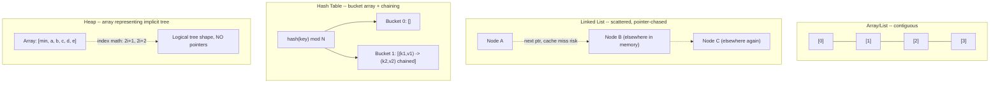

# Module 33 — Data Structures: Arrays, Linked Lists, Trees, Heaps & Hash Tables

> Domain: Data Structures | Level: Beginner → Expert | Prerequisite: [[../01-CSharp/01-CLR-JIT-GC-Memory-Management]] (stack/heap, object header overhead), [[../04-SQL-Server/01-Indexing-Query-Execution-Plans]] (B+ trees)

---

## 1. Fundamentals

### What is a data structure, and why does choosing the right one matter more than optimizing code?
A data structure is an organized way of storing data enabling specific operations (insert, lookup, delete, traversal) at specific time/space complexity trade-offs. Choosing the right one for a given access pattern is frequently a **larger performance lever than micro-optimizing algorithmic code** — an O(n) linear search through a `List<T>` where an O(1) `Dictionary<K,V>` lookup would suffice can dominate an application's performance far more than any amount of code-level tuning within the O(n) search itself, directly the same "fix the actual bottleneck, not what's easy to optimize" discipline recurring throughout this course (Module 18's index-vs-query-tuning distinction, restated at the data-structure level).

### Why does each structure exist?
Arrays/`List<T>` provide O(1) index-based access with cache-friendly contiguous memory layout (Module 1 §2.1's memory-layout discussion) but O(n) insertion/deletion in the middle. Linked lists provide O(1) insertion/deletion at a known position but O(n) access and poor cache locality (each node a separate heap allocation, Module 1 §2.6). Trees provide ordered, O(log n) operations when balanced. Hash tables provide O(1) average-case lookup by trading ordering for a hash-based direct-addressing scheme. Heaps provide O(log n) insertion with O(1) access to the minimum/maximum element, the specific shape needed for priority-queue semantics.

### When does this matter?
Every performance-sensitive code path processing collections of meaningful size; the depth matters for correctly reasoning about the **actual** complexity of .NET's built-in collection types (a frequent interview gap — knowing "Dictionary is O(1)" without understanding *why*, or the specific conditions under which it degrades) and for choosing the right structure for a given access pattern rather than defaulting to `List<T>` for everything.

### How does it work (30,000-ft view)?
```csharp
var list = new List<Order>();           // O(n) Contains/lookup by value
var lookup = new Dictionary<string, Order>(); // O(1) average lookup by key
var sorted = new SortedSet<int>();       // O(log n) insert/lookup, maintains order
var priorityQueue = new PriorityQueue<Job, int>(); // O(log n) insert, O(1) peek min
```

---

## 2. Deep Dive

### 2.1 Arrays and `List<T>` — Contiguous Memory and Amortized Growth
A .NET array is a single, contiguous block of memory — O(1) index access (direct address computation, `baseAddress + index * elementSize`), excellent CPU cache locality (Module 1's memory-layout discussion) since sequential elements are physically adjacent. `List<T>` wraps a backing array with **amortized O(1) `Add`** — when the backing array is full, it allocates a new array (typically double the current capacity) and copies all existing elements, an O(n) operation that happens infrequently enough (each doubling roughly halves the frequency of the next resize) that the *average* cost per `Add` across many operations is O(1) — the same amortized-analysis reasoning applies to `StringBuilder` (Module 1 §6) and any doubling-strategy growable buffer. Insertion/removal **in the middle** of a `List<T>` is O(n) regardless (every subsequent element must shift), a frequently-overlooked complexity trap for code assuming `List<T>.Insert(0, item)` is cheap.

### 2.2 Linked Lists — When O(1) Insertion Beats Contiguous Memory, and When It Doesn't
`LinkedList<T>` provides genuine O(1) insertion/removal at a known node (no shifting required) — but each node is an **independent heap allocation** (Module 1 §2.6's object-header overhead applies per node) with poor cache locality (traversing the list means following pointers to scattered memory locations, each a potential cache miss) — for most realistic workloads, `List<T>`'s cache-friendly contiguous layout **outperforms** `LinkedList<T>` even for insertion-heavy workloads, unless insertions/removals are genuinely happening at arbitrary, already-known positions (not requiring an O(n) search to find the position first, which would dominate any insertion-cost savings anyway) — a specific, narrow condition rarely met in practice, which is precisely why `LinkedList<T>` is used far less often in real C# code than its Big-O characteristics might naively suggest.

### 2.3 Hash Tables — Precisely Why (and When) Lookup Is O(1)
A `Dictionary<K,V>` computes a hash of the key, maps it to a bucket index (`hash mod bucketCount`), and stores the key-value pair in that bucket — average-case O(1) lookup **assumes a good hash function distributing keys evenly across buckets** and a **load factor** kept reasonable via automatic resizing (similar amortized-growth reasoning to `List<T>`). **Hash collisions** (two different keys hashing to the same bucket) are resolved via chaining (a small list per bucket) — a pathologically bad hash function (or, in an adversarial context, a deliberately-crafted set of colliding keys — a genuine, historically-exploited **hash-flooding denial-of-service attack** against naive hash-table implementations) degrades lookup toward O(n) in the worst case, which is precisely why .NET's `string.GetHashCode()` is **randomized per-process** by default (a security hardening measure directly preventing pre-computed hash-collision attacks from working identically across every process/restart).

### 2.4 Trees — Balance Is Everything
A binary search tree's O(log n) operations depend entirely on the tree remaining **balanced** (roughly equal-depth left/right subtrees) — an unbalanced tree (e.g., built by inserting already-sorted data into a naive BST with no rebalancing) degenerates toward a linked list, with O(n) operations despite being nominally "a tree." **Self-balancing trees** (Red-Black trees — the structure underlying `SortedDictionary<K,V>`/`SortedSet<T>` in .NET; B-trees/B+ trees — the structure underlying most database indexes, Module 18 §2.1) maintain balance automatically via rotation operations during insertion/deletion, guaranteeing O(log n) worst-case, not just average-case, performance — directly the mechanism that makes Module 18's clustered/nonclustered index seeks reliably O(log n) regardless of insertion order/history.

### 2.5 Heaps — the Priority Queue's Natural Structure
A binary heap (a complete binary tree satisfying the heap property — every parent ≤/≥ its children) provides O(log n) insertion and O(log n) removal-of-min/max, with O(1) peek-at-min/max — implemented efficiently as a **flat array** (not actual tree nodes with pointers) using index arithmetic (`parent = (i-1)/2`, `leftChild = 2i+1`, `rightChild = 2i+2`) to navigate the implicit tree structure without any pointer overhead at all — genuinely combining a tree's logical shape with an array's cache-friendly, allocation-free physical layout, precisely why .NET's `PriorityQueue<TElement, TPriority>` (added in .NET 6, a comparatively recent addition to the BCL) is implemented this way rather than with explicit node objects.

## 3. Visual Architecture


## 4. Production Example
**Scenario**: A service processing incoming webhook payloads used a `List<string>` of already-processed webhook IDs, checked via `.Contains(id)` before processing each new webhook to prevent duplicate processing — this worked fine during initial testing (a few dozen webhooks) but degraded severely in production as the list grew into the tens of thousands, since `List<T>.Contains` is an O(n) linear scan, meaning each new webhook's duplicate check got progressively slower as the processed-ID list grew, eventually dominating the entire request-handling latency. **Investigation**: `dotnet-trace` CPU profiling showed the vast majority of request-handling time spent inside `List<string>.Contains`'s internal linear-scan loop, scaling directly with the accumulated list size — confirmed via correlating latency growth precisely with the processed-webhook count over time. **Fix**: replaced `List<string>` with `HashSet<string>` for the processed-ID tracking, converting the duplicate check from O(n) to O(1) average-case — latency immediately flattened, no longer growing with accumulated history size. **Lesson**: choosing `List<T>` reflexively for "a collection of things" without considering the actual access pattern (here, frequent membership testing, not ordered iteration or index access) is one of the most common, most easily-fixed real-world performance bugs — directly this course's recurring "test at representative scale" theme (Module 20, Module 23, Module 27), since the O(n) cost was invisible at small testing scale and only became dominant once accumulated data volume grew past what testing had exercised.

## 5. Best Practices
- Choose the collection type based on the **actual dominant operation** (lookup by key → `Dictionary`/`HashSet`; ordered iteration with occasional insertion → `List<T>`; frequent min/max extraction → a heap/`PriorityQueue`), not a reflexive default.
- Use `HashSet<T>`/`Dictionary<K,V>` for any membership-testing or key-based-lookup access pattern, never `List<T>.Contains`/linear search, once the collection could plausibly grow beyond a handful of elements.
- Prefer `List<T>` over `LinkedList<T>` for the overwhelming majority of realistic workloads, given cache-locality's practical dominance over Big-O-only reasoning (§2.2).
- Trust .NET's built-in balanced-tree/hash-table implementations (`SortedDictionary`, `Dictionary`) rather than hand-rolling a custom tree/hash structure without a specific, demonstrated need the built-in types don't meet.

## 6. Anti-patterns
- Using `List<T>.Contains`/linear search for a frequently-checked membership test on a growing collection (§4's incident).
- Choosing `LinkedList<T>` based purely on its O(1) insertion Big-O characteristic without accounting for cache-locality's practical dominance for most realistic workloads.
- Building a naive, non-self-balancing binary search tree for data with a non-random insertion order (e.g., already-sorted input), risking O(n) degeneration.
- Hand-rolling a custom hash table/priority queue when .NET's built-in `Dictionary`/`PriorityQueue` already meets the actual requirement.

## 7. Performance Engineering
The dominant, highest-leverage performance lesson in this entire module: **choosing the right data structure for the actual access pattern usually matters far more than any code-level micro-optimization within a poorly-chosen structure's operations** — directly Module 18's "check the index/access pattern before optimizing the query's internals" lesson, restated at the general data-structures level. Amortized-cost reasoning (List<T>'s doubling growth, Dictionary's resizing) means occasional expensive operations are a normal, expected, and acceptable part of average-O(1) performance — don't mistake a periodic O(n) resize for a performance bug in isolation.

## 8. Security
Hash-flooding attacks (§2.3) are a genuine, historically-exploited DoS vector against naive hash-table implementations — .NET's per-process-randomized string hashing is a deliberate, built-in mitigation; never disable or work around this randomization (some legacy code has historically attempted to force a fixed hash seed for reproducibility, reintroducing exactly this vulnerability class) without understanding the security trade-off being made.

## 9. Scalability
Choosing O(1)/O(log n) data structures over O(n) alternatives directly determines whether a system's performance degrades gracefully or catastrophically as data volume scales — precisely §4's incident, where an O(n) structure's cost, invisible at small scale, became the dominant bottleneck exactly as production data volume grew, a direct, concrete illustration of why algorithmic complexity (not just infrastructure capacity) is a genuine scalability concern.

---

## 10. Interview Questions

### Basic (10)
1. **Q: What is the time complexity of index-based access on an array?** **A:** O(1).
2. **Q: What is the time complexity of `List<T>.Contains`?** **A:** O(n) — a linear scan.
3. **Q: What is the average-case time complexity of a `Dictionary<K,V>` lookup?** **A:** O(1).
4. **Q: What is amortized O(1), in the context of `List<T>.Add`?** **A:** Individual `Add` calls are usually O(1), with an occasional O(n) resize, averaging out to O(1) per operation across many calls.
5. **Q: What data structure underlies .NET's `PriorityQueue<TElement,TPriority>`?** **A:** A binary heap, implemented as a flat array.
6. **Q: What is a hash collision?** **A:** Two different keys hashing to the same bucket in a hash table.
7. **Q: What is a self-balancing tree?** **A:** A tree that automatically maintains balanced subtree depths during insertion/deletion, guaranteeing O(log n) worst-case operations.
8. **Q: What is `SortedDictionary<K,V>` implemented as, internally?** **A:** A self-balancing (Red-Black) tree.
9. **Q: Why does `LinkedList<T>` often underperform `List<T>` in practice despite better Big-O for insertion?** **A:** Poor cache locality — each node is a separate heap allocation scattered in memory, unlike `List<T>`'s contiguous backing array.
10. **Q: Why is .NET's string hashing randomized per process?** **A:** To prevent hash-flooding denial-of-service attacks using precomputed colliding keys.

### Intermediate (10)
1. **Q: Why is `List<T>.Insert(0, item)` an O(n) operation despite `List<T>.Add` being amortized O(1)?** **A:** Inserting at the beginning requires shifting every existing element one position to make room, an O(n) operation, whereas `Add` appends at the end where no shifting is needed (barring an occasional resize).
2. **Q: Why does a hash table's average-case O(1) lookup degrade toward O(n) with a poor hash function?** **A:** A poor hash function concentrates many keys into the same few buckets (excessive collisions), turning each bucket's chained lookup into an effectively linear scan over a large sublist rather than a small, evenly-distributed one.
3. **Q: Why does inserting already-sorted data into a naive, non-self-balancing BST degenerate its performance to O(n)?** **A:** Each new element, always being greater (or always less) than all previous ones, gets inserted as a chain of single-child nodes, producing a tree shaped exactly like a linked list rather than a balanced structure.
4. **Q: Why is a binary heap implemented as a flat array rather than explicit node objects with child pointers?** **A:** The heap's complete-binary-tree shape allows navigating parent/child relationships via simple index arithmetic on a contiguous array, avoiding both per-node heap allocation overhead and pointer-chasing cache misses entirely.
5. **Q: Why might `HashSet<T>` be preferred over `List<T>` even for a collection that will never need ordered iteration?** **A:** If the dominant operation is membership testing ("is this value already in the collection"), `HashSet<T>`'s O(1) average-case `Contains` avoids the O(n) linear-scan cost `List<T>.Contains` would otherwise incur as the collection grows.
6. **Q: Why does a `Dictionary<K,V>`'s resizing (when its load factor threshold is exceeded) share the same amortized-cost reasoning as `List<T>`'s array-doubling growth?** **A:** Both allocate a new, larger backing structure and copy/rehash all existing entries — an expensive O(n) operation happening infrequently enough (each resize roughly doubles capacity, delaying the next resize proportionally) that the average cost per operation across many insertions remains O(1).
7. **Q: Why would a B-tree (not a binary search tree) be the preferred structure for a disk-backed database index rather than an in-memory application data structure?** **A:** B-trees have a much higher branching factor (many children per node) specifically tuned to minimize the number of disk-page reads needed to traverse from root to leaf — a binary tree's much deeper structure (only 2 children per node) would require many more disk I/O operations for the same total element count, a cost that matters enormously for disk-backed storage but far less for in-memory structures.
8. **Q: Why is choosing the right data structure often described as a "bigger lever" than algorithmic micro-optimization?** **A:** Fixing an O(n)-where-O(1)-was-possible structural mismatch produces an asymptotic complexity-class improvement that scales increasingly favorably as data grows, whereas micro-optimizing code *within* an already-poorly-chosen O(n) structure only ever improves the constant factor, never the fundamental growth rate — at sufficient scale, the structural fix dominates regardless of how well-optimized the O(n) code itself is.
9. **Q: Why does a `List<T>`'s contiguous memory layout provide better cache locality than a `LinkedList<T>`'s node-based layout, mechanically?** **A:** CPU caches load data in fixed-size cache lines, and accessing one array element typically brings several subsequent elements into cache "for free" (spatial locality) since they're physically adjacent; a linked list's nodes are independently heap-allocated and can be scattered anywhere in memory, so following the `next` pointer to a different node frequently misses the cache entirely, requiring a full, slower main-memory fetch.
10. **Q: Why did the webhook-deduplication incident (§4) not manifest during initial testing?** **A:** The O(n) `List<T>.Contains` cost is proportional to the accumulated list size — at small testing scale (a few dozen entries), this cost is negligible regardless of the underlying complexity; it only became dominant once production data volume grew large enough for the linear-scan cost itself to matter, exactly this course's recurring "invisible at small scale, dominant at production scale" bug pattern.

### Advanced (10)
1. **Q: Diagnose the webhook-deduplication incident (§4) from first principles, and design a proactive code-review/testing practice preventing recurrence for similar "collection that grows unboundedly over the service's lifetime" scenarios.**
   **A:** Root cause: choosing `List<T>` for a membership-testing access pattern without considering how the collection's size would grow over the service's actual operational lifetime (not just a single test run). Safeguard: a code-review heuristic flagging any `.Contains()`/linear-search call on a collection whose size isn't provably small and bounded (a fixed, small configuration list is fine; anything accumulating over the application's runtime — processed IDs, seen items, a growing cache — warrants using `HashSet`/`Dictionary` by default) as requiring explicit justification if `List<T>` is still chosen; combined with a load test specifically exercising the collection at a size representative of realistic multi-day/multi-week accumulated production volume, not just a single test session's small scale (directly Module 20 §Advanced Q7's "test at representative scale" principle, restated here).
2. **Q: Explain precisely how a hash-flooding denial-of-service attack works against a hash table with a predictable, non-randomized hash function, and why per-process randomization specifically defeats it.**
   **A:** An attacker who knows (or can compute) the exact hash function computes a large set of keys that all hash to the **same** bucket — inserting these specifically-crafted, colliding keys into the target hash table degrades every subsequent lookup/insertion involving that bucket toward O(n) (a linear scan through the bucket's chained collisions), potentially reducing an entire service's throughput catastrophically with a comparatively small, precomputed attacker payload; per-process hash-seed randomization means the attacker's precomputed colliding-key set (valid for one specific hash seed) won't actually collide against a **different**, randomly-chosen seed used by the actual target process, defeating a precomputed attack entirely since the attacker cannot know the target's specific randomized seed in advance.
3. **Q: Design a scenario where `LinkedList<T>`'s O(1) insertion-at-known-position genuinely outperforms `List<T>`, and quantify the conditions under which this holds.**
   **A:** A scenario maintaining an already-referenced position (e.g., an LRU cache's internal ordering, where the "most recently used" node is already directly referenced via a companion `Dictionary<TKey, LinkedListNode<T>>` mapping, avoiding any O(n) search to locate the node) genuinely benefits from `LinkedList<T>`'s O(1) move-to-front/remove operations — this is, in fact, precisely how a hand-rolled LRU cache is classically implemented (a `Dictionary` for O(1) key lookup, paired with a `LinkedList` for O(1) reordering by reference) — the condition for `LinkedList<T>`'s benefit to actually materialize is having the target node's reference **already in hand**, never requiring a linear traversal to find it, which is the narrow, specific condition most naive "just use LinkedList for insertion-heavy code" reasoning fails to actually satisfy.
4. **Q: Explain how you would implement an LRU (Least Recently Used) cache combining a `Dictionary` and a `LinkedList`, and analyze its complexity.**
   **A:**
   ```csharp
   public class LruCache<TKey, TValue> where TKey : notnull
   {
       private readonly int _capacity;
       private readonly Dictionary<TKey, LinkedListNode<(TKey Key, TValue Value)>> _map = new();
       private readonly LinkedList<(TKey Key, TValue Value)> _order = new();

       public LruCache(int capacity) => _capacity = capacity;

       public bool TryGet(TKey key, out TValue value)
       {
           if (_map.TryGetValue(key, out var node))
           {
               _order.Remove(node);
               _order.AddFirst(node); // O(1) -- node reference already in hand, no search needed
               value = node.Value.Value;
               return true;
           }
           value = default!;
           return false;
       }

       public void Put(TKey key, TValue value)
       {
           if (_map.TryGetValue(key, out var existing)) _order.Remove(existing);
           else if (_map.Count >= _capacity)
           {
               var lru = _order.Last!;
               _map.Remove(lru.Value.Key);
               _order.RemoveLast();
           }
           var node = _order.AddFirst((key, value));
           _map[key] = node;
       }
   }
   ```
   Both `TryGet` and `Put` are O(1) — the `Dictionary` provides O(1) key-to-node lookup, and the `LinkedList` provides O(1) reordering/removal **given** the node reference the dictionary just supplied, exactly the condition from Advanced Q3 that makes `LinkedList<T>` genuinely the right tool here, not a reflexive choice.
5. **Q: Explain why choosing `SortedDictionary<K,V>` over `Dictionary<K,V>` has a real, quantifiable performance cost, and when that cost is justified.**
   **A:** `SortedDictionary<K,V>`'s Red-Black-tree backing gives O(log n) operations (versus `Dictionary`'s O(1) average-case) in exchange for maintaining sorted key order, enabling efficient ordered iteration and range queries (`GetViewBetween`-style operations aren't directly available, but ordered enumeration is) — the cost is justified specifically when ordered iteration/range-based access is a genuine, frequent requirement; if only key-based lookup matters and ordering is never needed, `Dictionary<K,V>`'s better average-case complexity makes it the correct default, with `SortedDictionary` reserved for the specific access patterns that actually need ordering.
6. **Q: How would you design a monitoring/detection strategy to catch a "data structure choice degrading as data volume grows" bug class (§4) proactively in production, before it becomes customer-visible?**
   **A:** Track per-endpoint/per-operation latency **specifically correlated against a growing internal state size** (e.g., the processed-webhook-ID collection's count over time) as a custom metric — a latency trend that tracks linearly (or worse) with an internal collection's size, rather than remaining flat regardless of that size, is a strong, proactive signal of exactly this bug class, catchable via dashboard-trend analysis before the absolute latency crosses a customer-impacting threshold, rather than only being discovered reactively once it does.
7. **Q: Explain a scenario where a naive binary heap's O(log n) insertion is insufficient, and describe the specialized structure that would better fit.**
   **A:** A workload needing to efficiently **decrease a specific, already-inserted element's priority** (not just insert new elements or extract the min) — a plain binary heap has no efficient way to locate an arbitrary element to decrease its key without an O(n) search first — a scenario like Dijkstra's shortest-path algorithm, which needs exactly this "decrease-key" operation frequently, benefits from a specialized structure like a **Fibonacci heap** (offering amortized O(1) decrease-key, at the cost of more complex implementation and higher constant-factor overhead) or, in practice, a simpler common workaround: allowing duplicate, stale entries in a standard binary heap and lazily skipping/discarding them upon extraction if they're found to be outdated when popped.
8. **Q: Explain why a Bloom filter (a probabilistic data structure not covered in depth in this module) might be a better fit than a `HashSet<T>` for a specific class of membership-testing problem, and what trade-off it introduces.**
   **A:** A Bloom filter provides extremely space-efficient, O(1) membership testing at the cost of **allowing false positives** (it might say "possibly present" for an item that was never actually added, though it never produces false negatives) — appropriate for scenarios where an enormous set of items must be checked with minimal memory footprint and an occasional false positive is acceptable (e.g., "should I even bother checking the expensive backing database for this key" as a fast, memory-cheap pre-filter, tolerating rare unnecessary database round-trips for false positives) — a specialized tool for a specific "check membership against a huge set, cheaply, tolerating rare false positives" problem shape that neither `HashSet<T>` (exact but memory-heavier at very large scale) nor a linear scan would serve as efficiently.
9. **Q: A team proposes hand-rolling a custom hash table implementation "to have full control over collision handling and avoid the .NET Dictionary's per-process hash randomization overhead." Evaluate this as a Principal Engineer.**
   **A:** Push back strongly — the per-process hash randomization overhead is negligible (computed once, not per-operation) relative to the security benefit it provides (§8/Advanced Q2's hash-flooding-attack mitigation), and hand-rolling a custom hash table reintroduces significant implementation-correctness risk (collision handling, resizing/rehashing logic, load-factor tuning) that .NET's extensively-tested, heavily-optimized `Dictionary<K,V>` has already solved correctly — recommend using the built-in type unless a specific, demonstrated, measured limitation of `Dictionary<K,V>` genuinely can't be worked around (a rare situation for the overwhelming majority of application code), directly the same "don't hand-roll what the framework already provides well" discipline recurring throughout this course (Module 3's BCL-vectorized-operations point, Module 8's exception-hierarchy-library-reuse point).
10. **Q: As a Principal Engineer, how would you build organizational awareness that data-structure choice is a first-class architectural decision deserving the same deliberate consideration as, e.g., a database index or a DI lifetime choice?**
    **A:** Include "what's the actual dominant access pattern for this collection, and does the chosen data structure's complexity match it" as a standing code-review question for any new, non-trivial collection introduced in business logic (directly this course's recurring "make the right default the path of least resistance via governance" pattern), paired with a load/scale test requirement for any collection expected to grow meaningfully over a service's operational lifetime (Advanced Q1's safeguard) — treating data-structure selection with the same architectural seriousness this course has applied to partition-key design (Module 27), DI lifetimes (Module 10), and index design (Module 18), since all four are fundamentally the same category of decision: "does this structure's complexity characteristics match the actual, real-world access pattern and data volume this code will face in production."

---

## 11. Coding Exercises

### Easy — Fix an O(n) membership check with a HashSet (§4)
```csharp
// BEFORE: O(n) per check, growing with accumulated history
private readonly List<string> _processedIds = new();
public bool TryProcess(string webhookId)
{
    if (_processedIds.Contains(webhookId)) return false; // O(n) linear scan
    _processedIds.Add(webhookId);
    return true;
}

// AFTER: O(1) average-case
private readonly HashSet<string> _processedIds = new();
public bool TryProcess(string webhookId) => _processedIds.Add(webhookId); // Add returns false if already present
```

### Medium — Implement a min-heap-based priority queue manually (understanding the mechanism)
```csharp
public class MinHeap<T> where T : IComparable<T>
{
    private readonly List<T> _items = new();

    public void Push(T item)
    {
        _items.Add(item);
        int i = _items.Count - 1;
        while (i > 0)
        {
            int parent = (i - 1) / 2;
            if (_items[parent].CompareTo(_items[i]) <= 0) break;
            (_items[parent], _items[i]) = (_items[i], _items[parent]); // swap up
            i = parent;
        }
    }

    public T PopMin()
    {
        var min = _items[0];
        _items[0] = _items[^1];
        _items.RemoveAt(_items.Count - 1);
        int i = 0;
        while (true)
        {
            int left = 2 * i + 1, right = 2 * i + 2, smallest = i;
            if (left < _items.Count && _items[left].CompareTo(_items[smallest]) < 0) smallest = left;
            if (right < _items.Count && _items[right].CompareTo(_items[smallest]) < 0) smallest = right;
            if (smallest == i) break;
            (_items[i], _items[smallest]) = (_items[smallest], _items[i]);
            i = smallest;
        }
        return min;
    }
}
```
**Discussion**: Directly demonstrates §2.5's index-arithmetic mechanism (`(i-1)/2` for parent, `2i+1`/`2i+2` for children) over a plain `List<T>` backing store — no node objects, no pointers, exactly how .NET's own `PriorityQueue<TElement,TPriority>` is implemented internally, worth building by hand once to fully understand the abstraction used daily thereafter (the same "build the primitive once, for understanding" pedagogical pattern used in Module 8's Expert exercise for `ExceptionDispatchInfo`).

### Hard — LRU Cache combining Dictionary and LinkedList (Advanced Q4, already shown above)
See Advanced Q4's full implementation — the canonical "combine two structures, each providing exactly the O(1) property the other lacks" data-structure design exercise.

### Expert — Bloom-filter-backed pre-check reducing expensive database round-trips (Advanced Q8)
```csharp
public class BloomFilterPreCheck
{
    private readonly BitArray _bits;
    private readonly int _hashCount;
    private readonly int _size;

    public BloomFilterPreCheck(int expectedItems, double falsePositiveRate)
    {
        _size = (int)(-expectedItems * Math.Log(falsePositiveRate) / (Math.Log(2) * Math.Log(2)));
        _hashCount = (int)(_size / (double)expectedItems * Math.Log(2));
        _bits = new BitArray(_size);
    }

    public void Add(string item)
    {
        foreach (int hash in ComputeHashes(item)) _bits[hash] = true;
    }

    public bool MightContain(string item) => ComputeHashes(item).All(hash => _bits[hash]);
    // Returns TRUE for definite non-members correctly (no false negatives);
    // may return TRUE for some non-members too (false positives) -- caller must
    // still verify against the real backing store, using this ONLY as a cheap pre-filter.

    private IEnumerable<int> ComputeHashes(string item)
    {
        int h1 = item.GetHashCode(), h2 = (item + "salt").GetHashCode();
        for (int i = 0; i < _hashCount; i++)
            yield return Math.Abs((h1 + i * h2) % _size);
    }
}

// Usage: cheap pre-filter before an expensive database existence check
if (bloomFilter.MightContain(userId) && await db.Users.AnyAsync(u => u.Id == userId))
{
    // genuinely exists -- proceed
}
// If MightContain returns false, we SKIP the database call entirely -- guaranteed correct,
// since Bloom filters never produce false negatives.
```
**Discussion**: The `MightContain(false)` case is the filter's entire value proposition — it lets the caller skip an expensive downstream check with a **hard guarantee** of correctness (no false negatives), while accepting a tunable, small false-positive rate (configured via `expectedItems`/`falsePositiveRate` at construction) that only costs an occasional unnecessary downstream check, never a missed one — a genuinely different correctness/space trade-off than `HashSet<T>` (exact, but requiring space proportional to the actual item count, not the tunably-smaller Bloom filter footprint).

---

## 12–17. System Design / LLD / Debugging / Decision / Case Study / Principal

A webhook-processing platform (§4) replaces its O(n) `List<T>`-based deduplication check with `HashSet<T>` (Easy exercise), and, for a related, much-higher-volume deduplication scenario (checking against millions of historical IDs where even a `HashSet<T>`'s memory footprint becomes a concern), layers a Bloom filter (Expert exercise) as a cheap pre-filter ahead of an authoritative but expensive backing-store check. The signature production incident (§4) — an O(n) linear-scan deduplication check whose cost was invisible at testing scale and became the dominant bottleneck at production data volume — is this module's central lesson, directly paralleling this course's recurring "invisible at small scale, dominant at production scale" bug pattern (Module 20's N+1 incident, Module 23's unbounded-embedding incident, Module 28's read-your-own-writes incident). Principal-level guidance: treat data-structure selection as a first-class architectural decision warranting the same deliberate, access-pattern-driven consideration as index design (Module 18), DI lifetimes (Module 10), and partition-key selection (Module 27) — all fundamentally the same category of "match the tool's complexity characteristics to the actual, real-world access pattern" decision.

## 18. Revision
**Key takeaways**: Choosing the right data structure for the actual dominant access pattern is frequently a bigger performance lever than any code-level micro-optimization within a poorly-chosen structure. `List<T>` (contiguous, cache-friendly, amortized O(1) `Add`, O(n) middle insertion/membership-test) generally outperforms `LinkedList<T>` in practice despite Big-O suggesting otherwise, except when a node reference is already in hand (LRU cache pattern). `Dictionary<K,V>`/`HashSet<T>` provide O(1) average-case lookup/membership-testing — always prefer them over `List<T>.Contains` for any growing, frequently-checked collection. Self-balancing trees guarantee O(log n) worst-case (not just average-case) performance regardless of insertion order. Binary heaps are naturally, efficiently array-backed via index arithmetic, requiring no node/pointer overhead at all.

---

**Next**: Continuing autonomously to Module 34 — Graphs & Advanced Data Structures (Tries, Union-Find, Graph representations) to complete the `12-Data-Structures` domain before advancing to `13-Algorithms`.
