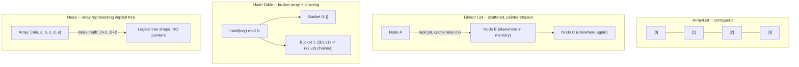
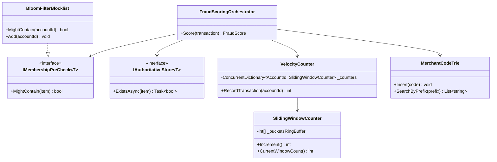
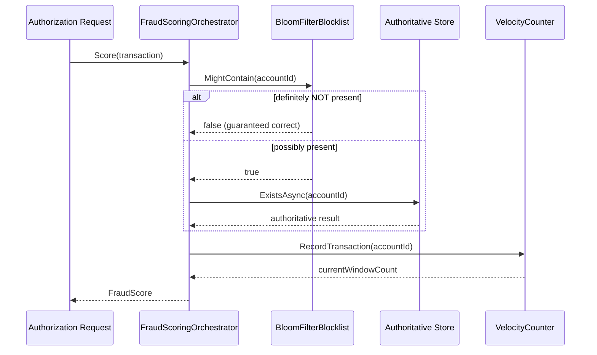

# Module 33 — Data Structures: Arrays, Linked Lists, Trees, Heaps & Hash Tables

> Domain: Data Structures | Level: Beginner → Expert | Prerequisite: [[../01-CSharp/01-CLR-JIT-GC-Memory-Management]] (stack/heap, object header overhead), [[../04-SQL-Server/01-Indexing-Query-Execution-Plans]] (B+ trees)

---

## 1. Fundamentals

### What is a data structure, and why does choosing the right one matter more than optimizing code?
A data structure is an organized way of storing data enabling specific operations (insert, lookup, delete, traversal) at specific time/space complexity trade-offs. Choosing the right one for a given access pattern is frequently a **larger performance lever than micro-optimizing algorithmic code** — an O(n) linear search through a `List<T>` where an O(1) `Dictionary<K,V>` lookup would suffice can dominate an application's performance far more than any amount of code-level tuning within the O(n) search itself, directly the same "fix the actual bottleneck, not what's easy to optimize" discipline recurring throughout this course (the index-vs-query-tuning distinction, restated at the data-structure level).

### Why does each structure exist?
Arrays/`List<T>` provide O(1) index-based access with cache-friendly contiguous memory layout (the memory-layout discussion) but O(n) insertion/deletion in the middle. Linked lists provide O(1) insertion/deletion at a known position but O(n) access and poor cache locality (each node a separate heap allocation). Trees provide ordered, O(log n) operations when balanced. Hash tables provide O(1) average-case lookup by trading ordering for a hash-based direct-addressing scheme. Heaps provide O(log n) insertion with O(1) access to the minimum/maximum element, the specific shape needed for priority-queue semantics.

### When does this matter?
Every performance-sensitive code path processing collections of meaningful size; the depth matters for correctly reasoning about the **actual** complexity of.NET's built-in collection types (a frequent interview gap — knowing "Dictionary is O(1)" without understanding *why*, or the specific conditions under which it degrades) and for choosing the right structure for a given access pattern rather than defaulting to `List<T>` for everything.

### How does it work (30,000-ft view)?
```csharp
var list = new List<Order>; // O(n) Contains/lookup by value
var lookup = new Dictionary<string, Order>; // O(1) average lookup by key
var sorted = new SortedSet<int>; // O(log n) insert/lookup, maintains order
var priorityQueue = new PriorityQueue<Job, int>; // O(log n) insert, O(1) peek min
```

---

## 2. Deep Dive

### 2.1 Arrays and `List<T>` — Contiguous Memory and Amortized Growth
A.NET array is a single, contiguous block of memory — O(1) index access (direct address computation, `baseAddress + index * elementSize`), excellent CPU cache locality (the memory-layout discussion) since sequential elements are physically adjacent. `List<T>` wraps a backing array with **amortized O(1) `Add`** — when the backing array is full, it allocates a new array (typically double the current capacity) and copies all existing elements, an O(n) operation that happens infrequently enough (each doubling roughly halves the frequency of the next resize) that the *average* cost per `Add` across many operations is O(1) — the same amortized-analysis reasoning applies to `StringBuilder` and any doubling-strategy growable buffer. Insertion/removal **in the middle** of a `List<T>` is O(n) regardless (every subsequent element must shift), a frequently-overlooked complexity trap for code assuming `List<T>.Insert(0, item)` is cheap.

### 2.2 Linked Lists — When O(1) Insertion Beats Contiguous Memory, and When It Doesn't
`LinkedList<T>` provides genuine O(1) insertion/removal at a known node (no shifting required) — but each node is an **independent heap allocation** (the object-header overhead applies per node) with poor cache locality (traversing the list means following pointers to scattered memory locations, each a potential cache miss) — for most realistic workloads, `List<T>`'s cache-friendly contiguous layout **outperforms** `LinkedList<T>` even for insertion-heavy workloads, unless insertions/removals are genuinely happening at arbitrary, already-known positions (not requiring an O(n) search to find the position first, which would dominate any insertion-cost savings anyway) — a specific, narrow condition rarely met in practice, which is precisely why `LinkedList<T>` is used far less often in real C# code than its Big-O characteristics might naively suggest.

### 2.3 Hash Tables — Precisely Why (and When) Lookup Is O(1)
A `Dictionary<K,V>` computes a hash of the key, maps it to a bucket index (`hash mod bucketCount`), and stores the key-value pair in that bucket — average-case O(1) lookup **assumes a good hash function distributing keys evenly across buckets** and a **load factor** kept reasonable via automatic resizing (similar amortized-growth reasoning to `List<T>`). **Hash collisions** (two different keys hashing to the same bucket) are resolved via chaining (a small list per bucket) — a pathologically bad hash function (or, in an adversarial context, a deliberately-crafted set of colliding keys — a genuine, historically-exploited **hash-flooding denial-of-service attack** against naive hash-table implementations) degrades lookup toward O(n) in the worst case, which is precisely why.NET's `string.GetHashCode` is **randomized per-process** by default (a security hardening measure directly preventing pre-computed hash-collision attacks from working identically across every process/restart).

### 2.4 Trees — Balance Is Everything
A binary search tree's O(log n) operations depend entirely on the tree remaining **balanced** (roughly equal-depth left/right subtrees) — an unbalanced tree (e.g., built by inserting already-sorted data into a naive BST with no rebalancing) degenerates toward a linked list, with O(n) operations despite being nominally "a tree." **Self-balancing trees** (Red-Black trees — the structure underlying `SortedDictionary<K,V>`/`SortedSet<T>` in.NET; B-trees/B+ trees — the structure underlying most database indexes) maintain balance automatically via rotation operations during insertion/deletion, guaranteeing O(log n) worst-case, not just average-case, performance — directly the mechanism that makes the clustered/nonclustered index seeks reliably O(log n) regardless of insertion order/history.

### 2.5 Heaps — the Priority Queue's Natural Structure
A binary heap (a complete binary tree satisfying the heap property — every parent ≤/≥ its children) provides O(log n) insertion and O(log n) removal-of-min/max, with O(1) peek-at-min/max — implemented efficiently as a **flat array** (not actual tree nodes with pointers) using index arithmetic (`parent = (i-1)/2`, `leftChild = 2i+1`, `rightChild = 2i+2`) to navigate the implicit tree structure without any pointer overhead at all — genuinely combining a tree's logical shape with an array's cache-friendly, allocation-free physical layout, precisely why.NET's `PriorityQueue<TElement, TPriority>` (added in.NET 6, a comparatively recent addition to the BCL) is implemented this way rather than with explicit node objects.

## 3. Visual Architecture

```mermaid
graph TB
 subgraph "Array/List<T> -- contiguous"
 A1["[0]"] --- A2["[1]"] --- A3["[2]"] --- A4["[3]"]
 end
 subgraph "Linked List -- scattered, pointer-chased"
 L1["Node A"] -.->|next ptr, cache miss risk| L2["Node B (elsewhere in memory)"]
 L2 -.-> L3["Node C (elsewhere again)"]
 end
 subgraph "Hash Table -- bucket array + chaining"
 H["hash(key) mod N"] --> B0["Bucket 0: []"]
 H --> B1["Bucket 1: [(k1,v1) -> (k2,v2) chained]"]
 end
 subgraph "Heap -- array representing implicit tree"
 HeapArr["Array: [min, a, b, c, d, e]"]
 HeapArr -.->|"index math: 2i+1, 2i+2"| Tree["Logical tree shape, NO pointers"]
 end
```

## 4. Production Example
**Scenario**: A service processing incoming webhook payloads used a `List<string>` of already-processed webhook IDs, checked via `.Contains(id)` before processing each new webhook to prevent duplicate processing — this worked fine during initial testing (a few dozen webhooks) but degraded severely in production as the list grew into the tens of thousands, since `List<T>.Contains` is an O(n) linear scan, meaning each new webhook's duplicate check got progressively slower as the processed-ID list grew, eventually dominating the entire request-handling latency. **Investigation**: `dotnet-trace` CPU profiling showed the vast majority of request-handling time spent inside `List<string>.Contains`'s internal linear-scan loop, scaling directly with the accumulated list size — confirmed via correlating latency growth precisely with the processed-webhook count over time. **Fix**: replaced `List<string>` with `HashSet<string>` for the processed-ID tracking, converting the duplicate check from O(n) to O(1) average-case — latency immediately flattened, no longer growing with accumulated history size. **Lesson**: choosing `List<T>` reflexively for "a collection of things" without considering the actual access pattern (here, frequent membership testing, not ordered iteration or index access) is one of the most common, most easily-fixed real-world performance bugs — directly this course's recurring "test at representative scale" theme, since the O(n) cost was invisible at small testing scale and only became dominant once accumulated data volume grew past what testing had exercised.
## 10. Interview Questions

### Basic (10)
1. **Q: What is the time complexity of index-based access on an array?** **A:** O(1) — the element's address is computed directly as base address + index × element size, one arithmetic step regardless of array length (plus cache-friendly contiguous layout, which is why arrays beat node-based structures in practice too).
2. **Q: What is the time complexity of `List<T>.Contains`?** **A:** O(n) — a linear scan.
3. **Q: What is the average-case time complexity of a `Dictionary<K,V>` lookup?** **A:** O(1) average — the key's hash code selects a bucket directly, with only same-bucket collisions to scan; it degrades toward O(n) only under pathological collision behavior (bad `GetHashCode` implementations, or hash-flooding attacks on predictable hashes).
4. **Q: What is amortized O(1), in the context of `List<T>.Add`?** **A:** Individual `Add` calls are usually O(1), with an occasional O(n) resize, averaging out to O(1) per operation across many calls.
5. **Q: What data structure underlies.NET's `PriorityQueue<TElement,TPriority>`?** **A:** A binary heap, implemented as a flat array.
6. **Q: What is a hash collision?** **A:** Two different keys hashing to the same bucket in a hash table.
7. **Q: What is a self-balancing tree?** **A:** A tree that automatically maintains balanced subtree depths during insertion/deletion, guaranteeing O(log n) worst-case operations.
8. **Q: What is `SortedDictionary<K,V>` implemented as, internally?** **A:** A self-balancing (Red-Black) tree.
9. **Q: Why does `LinkedList<T>` often underperform `List<T>` in practice despite better Big-O for insertion?** **A:** Poor cache locality — each node is a separate heap allocation scattered in memory, unlike `List<T>`'s contiguous backing array.
10. **Q: Why is.NET's string hashing randomized per process?** **A:** To prevent hash-flooding denial-of-service attacks using precomputed colliding keys.

### Intermediate (10)
1. **Q: Why is `List<T>.Insert(0, item)` an O(n) operation despite `List<T>.Add` being amortized O(1)?** **A:** Inserting at the beginning requires shifting every existing element one position to make room, an O(n) operation, whereas `Add` appends at the end where no shifting is needed (barring an occasional resize).
2. **Q: Why does a hash table's average-case O(1) lookup degrade toward O(n) with a poor hash function?** **A:** A poor hash function concentrates many keys into the same few buckets (excessive collisions), turning each bucket's chained lookup into an effectively linear scan over a large sublist rather than a small, evenly-distributed one.
3. **Q: Why does inserting already-sorted data into a naive, non-self-balancing BST degenerate its performance to O(n)?** **A:** Each new element, always being greater (or always less) than all previous ones, gets inserted as a chain of single-child nodes, producing a tree shaped exactly like a linked list rather than a balanced structure.
4. **Q: Why is a binary heap implemented as a flat array rather than explicit node objects with child pointers?** **A:** The heap's complete-binary-tree shape allows navigating parent/child relationships via simple index arithmetic on a contiguous array, avoiding both per-node heap allocation overhead and pointer-chasing cache misses entirely.
5. **Q: Why might `HashSet<T>` be preferred over `List<T>` even for a collection that will never need ordered iteration?** **A:** If the dominant operation is membership testing ("is this value already in the collection"), `HashSet<T>`'s O(1) average-case `Contains` avoids the O(n) linear-scan cost `List<T>.Contains` would otherwise incur as the collection grows.
6. **Q: Why does a `Dictionary<K,V>`'s resizing (when its load factor threshold is exceeded) share the same amortized-cost reasoning as `List<T>`'s array-doubling growth?** **A:** Both allocate a new, larger backing structure and copy/rehash all existing entries — an expensive O(n) operation happening infrequently enough (each resize roughly doubles capacity, delaying the next resize proportionally) that the average cost per operation across many insertions remains O(1).
7. **Q: Why would a B-tree (not a binary search tree) be the preferred structure for a disk-backed database index rather than an in-memory application data structure?** **A:** B-trees have a much higher branching factor (many children per node) specifically tuned to minimize the number of disk-page reads needed to traverse from root to leaf — a binary tree's much deeper structure (only 2 children per node) would require many more disk I/O operations for the same total element count, a cost that matters enormously for disk-backed storage but far less for in-memory structures.
8. **Q: Why is choosing the right data structure often described as a "bigger lever" than algorithmic micro-optimization?** **A:** Fixing an O(n)-where-O(1)-was-possible structural mismatch produces an asymptotic complexity-class improvement that scales increasingly favorably as data grows, whereas micro-optimizing code *within* an already-poorly-chosen O(n) structure only ever improves the constant factor, never the fundamental growth rate — at sufficient scale, the structural fix dominates regardless of how well-optimized the O(n) code itself is.
9. **Q: Why does a `List<T>`'s contiguous memory layout provide better cache locality than a `LinkedList<T>`'s node-based layout, mechanically?** **A:** CPU caches load data in fixed-size cache lines, and accessing one array element typically brings several subsequent elements into cache "for free" (spatial locality) since they're physically adjacent; a linked list's nodes are independently heap-allocated and can be scattered anywhere in memory, so following the `next` pointer to a different node frequently misses the cache entirely, requiring a full, slower main-memory fetch.
10. **Q: Why did the webhook-deduplication incident not manifest during initial testing?** **A:** The O(n) `List<T>.Contains` cost is proportional to the accumulated list size — at small testing scale (a few dozen entries), this cost is negligible regardless of the underlying complexity; it only became dominant once production data volume grew large enough for the linear-scan cost itself to matter, exactly this course's recurring "invisible at small scale, dominant at production scale" bug pattern.

### Advanced (10)
1. **Q: Diagnose the webhook-deduplication incident from first principles, and design a proactive code-review/testing practice preventing recurrence for similar "collection that grows unboundedly over the service's lifetime" scenarios.**
 **A:** Root cause: choosing `List<T>` for a membership-testing access pattern without considering how the collection's size would grow over the service's actual operational lifetime (not just a single test run). Safeguard: a code-review heuristic flagging any `.Contains`/linear-search call on a collection whose size isn't provably small and bounded (a fixed, small configuration list is fine; anything accumulating over the application's runtime — processed IDs, seen items, a growing cache — warrants using `HashSet`/`Dictionary` by default) as requiring explicit justification if `List<T>` is still chosen; combined with a load test specifically exercising the collection at a size representative of realistic multi-day/multi-week accumulated production volume, not just a single test session's small scale (directly §Advanced Q7's "test at representative scale" principle, restated here).
2. **Q: Explain precisely how a hash-flooding denial-of-service attack works against a hash table with a predictable, non-randomized hash function, and why per-process randomization specifically defeats it.**
 **A:** An attacker who knows (or can compute) the exact hash function computes a large set of keys that all hash to the **same** bucket — inserting these specifically-crafted, colliding keys into the target hash table degrades every subsequent lookup/insertion involving that bucket toward O(n) (a linear scan through the bucket's chained collisions), potentially reducing an entire service's throughput catastrophically with a comparatively small, precomputed attacker payload; per-process hash-seed randomization means the attacker's precomputed colliding-key set (valid for one specific hash seed) won't actually collide against a **different**, randomly-chosen seed used by the actual target process, defeating a precomputed attack entirely since the attacker cannot know the target's specific randomized seed in advance.
3. **Q: Design a scenario where `LinkedList<T>`'s O(1) insertion-at-known-position genuinely outperforms `List<T>`, and quantify the conditions under which this holds.**
 **A:** A scenario maintaining an already-referenced position (e.g., an LRU cache's internal ordering, where the "most recently used" node is already directly referenced via a companion `Dictionary<TKey, LinkedListNode<T>>` mapping, avoiding any O(n) search to locate the node) genuinely benefits from `LinkedList<T>`'s O(1) move-to-front/remove operations — this is, in fact, precisely how a hand-rolled LRU cache is classically implemented (a `Dictionary` for O(1) key lookup, paired with a `LinkedList` for O(1) reordering by reference) — the condition for `LinkedList<T>`'s benefit to actually materialize is having the target node's reference **already in hand**, never requiring a linear traversal to find it, which is the narrow, specific condition most naive "just use LinkedList for insertion-heavy code" reasoning fails to actually satisfy.
4. **Q: Explain how you would implement an LRU (Least Recently Used) cache combining a `Dictionary` and a `LinkedList`, and analyze its complexity.**
 **A:**
 ```csharp
public class LruCache<TKey, TValue> where TKey: notnull
{
    private readonly int _capacity;
    private readonly Dictionary<TKey, LinkedListNode<(TKey Key, TValue Value)>> _map = new;
    private readonly LinkedList<(TKey Key, TValue Value)> _order = new;

    public LruCache(int capacity) => _capacity = capacity;

    public bool TryGet(TKey key, out TValue value)
    {
        if (_map.TryGetValue(key, out var node))
        {
            _order.Remove(node);
            _order.AddFirst(node); // O(1) -- node reference already in hand, no search needed
            value = node.Value.Value;
            return true;
        }
        value = default!;
        return false;
    }

    public void Put(TKey key, TValue value)
    {
        if (_map.TryGetValue(key, out var existing)) _order.Remove(existing);
        else if (_map.Count >= _capacity)
        {
            var lru = _order.Last!;
            _map.Remove(lru.Value.Key);
            _order.RemoveLast;
        }
        var node = _order.AddFirst((key, value));
        _map[key] = node;
    }
}
 ```
 Both `TryGet` and `Put` are O(1) — the `Dictionary` provides O(1) key-to-node lookup, and the `LinkedList` provides O(1) reordering/removal **given** the node reference the dictionary just supplied, exactly the condition from Advanced Q3 that makes `LinkedList<T>` genuinely the right tool here, not a reflexive choice.
5. **Q: Explain why choosing `SortedDictionary<K,V>` over `Dictionary<K,V>` has a real, quantifiable performance cost, and when that cost is justified.**
 **A:** `SortedDictionary<K,V>`'s Red-Black-tree backing gives O(log n) operations (versus `Dictionary`'s O(1) average-case) in exchange for maintaining sorted key order, enabling efficient ordered iteration and range queries (`GetViewBetween`-style operations aren't directly available, but ordered enumeration is) — the cost is justified specifically when ordered iteration/range-based access is a genuine, frequent requirement; if only key-based lookup matters and ordering is never needed, `Dictionary<K,V>`'s better average-case complexity makes it the correct default, with `SortedDictionary` reserved for the specific access patterns that actually need ordering.
6. **Q: How would you design a monitoring/detection strategy to catch a "data structure choice degrading as data volume grows" bug class proactively in production, before it becomes customer-visible?**
 **A:** Track per-endpoint/per-operation latency **specifically correlated against a growing internal state size** (e.g., the processed-webhook-ID collection's count over time) as a custom metric — a latency trend that tracks linearly (or worse) with an internal collection's size, rather than remaining flat regardless of that size, is a strong, proactive signal of exactly this bug class, catchable via dashboard-trend analysis before the absolute latency crosses a customer-impacting threshold, rather than only being discovered reactively once it does.
7. **Q: Explain a scenario where a naive binary heap's O(log n) insertion is insufficient, and describe the specialized structure that would better fit.**
 **A:** A workload needing to efficiently **decrease a specific, already-inserted element's priority** (not just insert new elements or extract the min) — a plain binary heap has no efficient way to locate an arbitrary element to decrease its key without an O(n) search first — a scenario like Dijkstra's shortest-path algorithm, which needs exactly this "decrease-key" operation frequently, benefits from a specialized structure like a **Fibonacci heap** (offering amortized O(1) decrease-key, at the cost of more complex implementation and higher constant-factor overhead) or, in practice, a simpler common workaround: allowing duplicate, stale entries in a standard binary heap and lazily skipping/discarding them upon extraction if they're found to be outdated when popped.
8. **Q: Explain why a Bloom filter (a probabilistic data structure not covered in depth in this module) might be a better fit than a `HashSet<T>` for a specific class of membership-testing problem, and what trade-off it introduces.**
 **A:** A Bloom filter provides extremely space-efficient, O(1) membership testing at the cost of **allowing false positives** (it might say "possibly present" for an item that was never actually added, though it never produces false negatives) — appropriate for scenarios where an enormous set of items must be checked with minimal memory footprint and an occasional false positive is acceptable (e.g., "should I even bother checking the expensive backing database for this key" as a fast, memory-cheap pre-filter, tolerating rare unnecessary database round-trips for false positives) — a specialized tool for a specific "check membership against a huge set, cheaply, tolerating rare false positives" problem shape that neither `HashSet<T>` (exact but memory-heavier at very large scale) nor a linear scan would serve as efficiently.
9. **Q: A team proposes hand-rolling a custom hash table implementation "to have full control over collision handling and avoid the.NET Dictionary's per-process hash randomization overhead." Evaluate this as a Principal Engineer.**
 **A:** Push back strongly — the per-process hash randomization overhead is negligible (computed once, not per-operation) relative to the security benefit it provides (/Advanced Q2's hash-flooding-attack mitigation), and hand-rolling a custom hash table reintroduces significant implementation-correctness risk (collision handling, resizing/rehashing logic, load-factor tuning) that.NET's extensively-tested, heavily-optimized `Dictionary<K,V>` has already solved correctly — recommend using the built-in type unless a specific, demonstrated, measured limitation of `Dictionary<K,V>` genuinely can't be worked around (a rare situation for the overwhelming majority of application code), directly the same "don't hand-roll what the framework already provides well" discipline recurring throughout this course (the BCL-vectorized-operations point, the exception-hierarchy-library-reuse point).
10. **Q: As a Principal Engineer, how would you build organizational awareness that data-structure choice is a first-class architectural decision deserving the same deliberate consideration as, e.g., a database index or a DI lifetime choice?**
 **A:** Include "what's the actual dominant access pattern for this collection, and does the chosen data structure's complexity match it" as a standing code-review question for any new, non-trivial collection introduced in business logic (directly this course's recurring "make the right default the path of least resistance via governance" pattern), paired with a load/scale test requirement for any collection expected to grow meaningfully over a service's operational lifetime (Advanced Q1's safeguard) — treating data-structure selection with the same architectural seriousness this course has applied to partition-key design, DI lifetimes, and index design, since all four are fundamentally the same category of decision: "does this structure's complexity characteristics match the actual, real-world access pattern and data volume this code will face in production."

### Expert (10)

1. **Q: A trading-risk service maintains an in-memory `Dictionary<string, Position>` keyed by instrument ID, rebuilt from a full database scan on every service restart, and mutated tens of thousands of times per second during market hours. A production incident showed p99.9 update latency spiking to 40ms during specific seconds, though average latency was under 100 microseconds. Diagnose and fix.**
 **A:** This is the classic **hash-table resize-and-rehash tail-latency spike** (§7's "predictable worst case vs. good average case" trade-off made concrete): under sustained high-throughput insertion, `Dictionary<K,V>`'s occasional O(n) resize-and-rehash (§2.3's amortized-growth mechanism) coincides, for a small fraction of updates, with the resize threshold being crossed — for a dictionary with hundreds of thousands of positions, a single resize can briefly stall the calling thread for tens of milliseconds while every existing entry is rehashed into the new backing array. Fix: pre-size the `Dictionary` with an initial capacity close to the known, expected steady-state position count (the constructor's `capacity` parameter) so resizes during the trading day become rare-to-nonexistent, since the growth happens once at startup (a controlled, non-latency-sensitive moment) rather than unpredictably during peak trading activity; additionally, consider whether `ConcurrentDictionary<K,V>` (if genuinely multi-threaded access) has its own, distinct resize-locking behavior that needs the same pre-sizing treatment.
 **Why correct:** Correctly attributes the tail-latency spike to amortized-cost resize behavior colliding with real-time constraints, and proposes pre-sizing as the concrete, low-risk fix rather than switching data structures entirely.
 **Common mistakes:** Assuming average-case O(1) means *every* operation is fast, missing that "amortized" explicitly means some operations absorb the cost others don't pay; reaching for a different structure entirely before trying the much simpler pre-sizing fix.
 **Follow-ups:** "How would you determine the right initial capacity?" (Steady-state position count from historical data, with headroom for peak-day growth, verified via load testing at realistic instrument-count scale.) "Would `SortedDictionary` avoid this problem?" (No — Red-Black tree insertion is O(log n) with no amortized-resize spike, but its per-operation cost is higher on average; trading one tail-latency risk for a different, more uniform but higher baseline cost is a legitimate alternative worth benchmarking.)

2. **Q: Explain, precisely, why a self-balancing tree's O(log n) worst-case guarantee and a hash table's O(1) average-case guarantee are not directly comparable claims, and design a decision framework for choosing between `Dictionary<K,V>` and `SortedDictionary<K,V>` for a latency-SLA-bound production service.**
 **A:** They differ on two independent axes: (1) *average vs. worst-case* — `Dictionary`'s O(1) is an average across operations, permitting rare, expensive outliers (Expert Q1); `SortedDictionary`'s O(log n) is a guaranteed ceiling on *every single* operation, with no such outlier risk. (2) *what's being optimized* — `Dictionary` optimizes raw lookup speed at the cost of no ordering; `SortedDictionary` sacrifices some average-case speed for both a worst-case guarantee and ordered iteration. Decision framework: if the service has a strict p99.9 (not just p50/average) latency SLA and cannot tolerate an occasional resize-driven spike, `SortedDictionary`'s uniform O(log n) may actually be the *safer* choice despite being slower on average — a direct, quantified instance of "predictable beats merely fast" for tail-latency-sensitive financial systems (order-matching, risk-limit checks) where an occasional 40ms stall (Expert Q1) is unacceptable regardless of how rare it is.
 **Why correct:** Correctly separates the average-vs-worst-case axis from the ordering-tradeoff axis and gives a concrete, SLA-driven decision rule rather than a blanket "Dictionary is always faster" claim.
 **Common mistakes:** Treating "O(1) average" as strictly superior to "O(log n) worst-case" without considering that a latency-SLA-bound system may specifically need the tail-latency guarantee the average-case structure cannot provide.
 **Follow-ups:** "Does pre-sizing (Expert Q1) eliminate the need to consider `SortedDictionary` here?" (It substantially mitigates but doesn't eliminate the risk — a `Dictionary` can still resize if the pre-sized capacity is exceeded by an unexpected volume spike, whereas `SortedDictionary`'s guarantee holds unconditionally regardless of capacity planning accuracy.)

3. **Q: A settlement-reconciliation batch job processes millions of trade records nightly, building a `Dictionary<TradeId, Trade>` from one data source and a second `Dictionary<TradeId, SettlementRecord>` from another, then joining them via key lookup to detect breaks. The job's memory footprint during peak processing is nearly double what the raw record data alone would justify. Diagnose the overhead source and propose a fix.**
 **A:** Each `Dictionary<K,V>` entry carries overhead beyond the raw key/value payload: the internal bucket array, a linked "next" index for collision chaining, the stored hash code per entry, and — critically for reference-type values — each `Trade`/`SettlementRecord` object itself carries .NET's object-header overhead (§7, 16-24 bytes) *independent of* the dictionary's own per-entry overhead, meaning two dictionaries each holding millions of heap-allocated reference-type objects compounds both the dictionary structural overhead and the per-object header overhead twice over. Fixes, in order of impact: (1) if `Trade`/`SettlementRecord` can be modeled as `struct` (value types) rather than `class`, storing them directly in the dictionary's backing array eliminates the separate per-object heap allocation and header entirely — a substantial win at millions-of-records scale, provided the structs are reasonably small and not frequently boxed; (2) pre-size both dictionaries to the known record count to avoid the resize-driven ephemeral memory spike (Expert Q1's mechanism, here manifesting as peak *memory* rather than latency); (3) if only a join-then-discard operation is genuinely needed (not repeated random-access lookups over the join's lifetime), consider whether a sort-merge-join over two arrays (avoiding hash-table overhead entirely, trading O(1) lookup for O(n log n) sort cost, amortized once) is actually cheaper for this specific, single-pass access pattern.
 **Why correct:** Identifies the compounding per-object and per-dictionary-entry overhead sources precisely, and offers a prioritized set of fixes from cheapest-to-implement (pre-sizing) to most structural (struct conversion, algorithm change).
 **Common mistakes:** Attributing the overhead only to "the dictionary being inefficient" without identifying the specific, distinct overhead sources (object headers vs. dictionary internal structure) that compound independently.
 **Follow-ups:** "Why would converting to `struct` require caution, not just be a free win?" (Large structs copied by value on every access/assignment can themselves become a performance cost, and mutable structs inside collections have well-known correctness pitfalls — the fix isn't unconditionally free.)

4. **Q: Design a custom `IEqualityComparer<T>` for a `Dictionary` keyed by a composite financial-instrument identifier (exchange + symbol + expiry date), and explain the correctness requirements a bad implementation could silently violate.**
 **A:**
 ```csharp
 public readonly record struct InstrumentKey(string Exchange, string Symbol, DateOnly Expiry);

 public class InstrumentKeyComparer : IEqualityComparer<InstrumentKey>
 {
     public bool Equals(InstrumentKey x, InstrumentKey y) =>
         string.Equals(x.Exchange, y.Exchange, StringComparison.OrdinalIgnoreCase) &&
         string.Equals(x.Symbol, y.Symbol, StringComparison.OrdinalIgnoreCase) &&
         x.Expiry == y.Expiry;

     public int GetHashCode(InstrumentKey obj) =>
         HashCode.Combine(
             obj.Exchange.ToUpperInvariant(),
             obj.Symbol.ToUpperInvariant(),
             obj.Expiry);
 }
 ```
 The critical, easy-to-violate correctness requirement: **`GetHashCode` must be consistent with `Equals`** — any two keys considered equal by `Equals` *must* produce the identical hash code, or the dictionary silently fails to find entries that are logically present (an entry inserted under one casing variant becomes unfindable under another, despite `Equals` correctly reporting them equal) — a bug that manifests as intermittent, data-dependent "missing entry" failures rather than a crash, making it far harder to diagnose than an outright exception. A second requirement: the hash code must be **stable for the object's lifetime as a dictionary key** — never derive it from mutable state that could change after insertion (e.g., never hash a `Trade`'s mutable `Status` field), since a changed hash code after insertion leaves the entry in the wrong bucket, permanently unfindable via a correctly-computed current hash.
 **Why correct:** Provides a correct, case-insensitive composite-key comparer and precisely names the two correctness invariants (`Equals`/`GetHashCode` consistency, hash stability) whose violation causes silent, hard-to-diagnose bugs rather than crashes.
 **Common mistakes:** Implementing `Equals` with case-insensitive comparison but forgetting to normalize case in `GetHashCode` too, producing exactly the "equal objects, different hash codes" violation described; hashing mutable fields.
 **Follow-ups:** "How would you unit-test this comparer specifically for the consistency invariant?" (A property-based test asserting `Equals(a,b) == true` implies `GetHashCode(a) == GetHashCode(b)` across a generated set of case/whitespace variant key pairs.)

5. **Q: Compare the actual, measured performance characteristics of .NET's `PriorityQueue<TElement,TPriority>` against a hand-rolled binary heap for a real-time order-matching engine's price-time-priority queue, and explain when the built-in type's design choices become a genuine limitation.**
 **A:** .NET's `PriorityQueue<TElement,TPriority>` (§2.5) is a solid, well-optimized array-backed binary heap for the general case — but it has one design limitation directly relevant to an order-matching engine: it provides **no built-in decrease-key/update-priority operation** (Advanced Q7's exact limitation, applied here concretely) — canceling and re-adding an order at a new price requires either a full re-insertion (leaving a stale duplicate entry that must be lazily skipped on dequeue, Advanced Q7's standard workaround) or, if genuine in-place priority updates at scale are required (a high-cancel-rate market), a hand-rolled heap maintaining an auxiliary `Dictionary<OrderId, int>` tracking each order's current array index, updated on every swap during sift-up/sift-down, enabling true O(log n) decrease-key. The built-in type is the right default until a measured, specific requirement (a high order-cancellation/modification rate, not just insertion/removal) demonstrates the auxiliary-index-tracking investment is justified — exactly this course's recurring "measure before reaching for the more complex tool" discipline (§Advanced Q9 of the sibling module), now applied to heap selection specifically.
 **Why correct:** Correctly identifies the built-in type's specific, real limitation (no decrease-key) and ties the decision to build a custom heap to a measured requirement rather than a reflexive "hand-rolled is always better for latency-critical code" assumption.
 **Common mistakes:** Assuming a hand-rolled heap is automatically faster than the BCL type without a specific, demonstrated limitation driving the decision; forgetting that a custom heap with index-tracking adds real implementation-correctness risk (every swap must correctly update the auxiliary index) that the built-in type doesn't carry.
 **Follow-ups:** "What's the risk of the lazy-stale-entry workaround under sustained high cancellation rates?" (The heap accumulates stale entries faster than they're naturally popped and discarded, growing memory and degrading effective throughput — at a high enough cancel rate, this workaround itself becomes the bottleneck, which is precisely the threshold that justifies the custom-heap investment.)

6. **Q: A code review flags a new feature using `ConcurrentDictionary<K,V>` for a cache accessed by 50 concurrent request-handling threads, with the reviewer noting "this doesn't actually give you the throughput scaling you'd expect." Explain the reviewer's concern and how you'd validate or refute it.**
 **A:** `ConcurrentDictionary<K,V>` uses internal, striped locking (multiple independent locks over different bucket ranges, not one global lock) — this genuinely provides better concurrent throughput than wrapping a plain `Dictionary` in a single `lock`, but it is **not** lock-free, and under sufficiently high write contention concentrated on a small number of hot keys (all 50 threads frequently updating the *same* few cache entries, not evenly distributed across the key space), the effective concurrency degrades toward serialized access on those specific keys' lock stripes regardless of the dictionary's overall stripe count — the reviewer's concern is valid specifically for a *hot-key* access pattern, not a general indictment of `ConcurrentDictionary`. Validate via a targeted load test simulating the actual production key-access distribution (not a synthetic, uniformly-distributed benchmark, which would hide this exact issue) measuring throughput under realistic hot-key concentration; if confirmed, mitigations include: sharding the hot key's updates across sub-keys with a final aggregation step, or reconsidering whether the specific hot-key pattern actually needs the read-modify-write semantics that create the contention in the first place (e.g., using `AddOrUpdate`'s atomic update delegate versus a separate read-then-write, which reintroduces its own race risk).
 **Why correct:** Correctly scopes the reviewer's concern to the specific hot-key contention scenario rather than treating it as a blanket claim about `ConcurrentDictionary`'s design, and proposes a realistic-distribution load test as the actual way to confirm or refute it.
 **Common mistakes:** Either dismissing the reviewer's concern entirely ("ConcurrentDictionary is thread-safe, so it's fine") or overcorrecting to avoid `ConcurrentDictionary` altogether, missing that the concern is access-pattern-specific, not universal.
 **Follow-ups:** "How does this connect to the earlier hash-collision/bucket-distribution discussion?" (Structurally analogous — an uneven distribution, whether of hash-bucket collisions or of concurrent-access hot keys, degrades a structure's nominal average-case guarantee toward its less-favorable worst case; both are instances of "the guarantee assumes even distribution, and production traffic doesn't always provide it.")

7. **Q: Explain why a Red-Black tree (backing `SortedDictionary<K,V>`) and a B+-tree (backing a SQL Server clustered index) both guarantee O(log n) operations, yet a database would never use a Red-Black tree for its on-disk index. What does this reveal about the limits of Big-O as the sole basis for a structural decision?**
 **A:** Big-O counts *operations* (comparisons, pointer traversals) but is blind to the wildly different cost of a single "step" in-memory versus on-disk — a Red-Black tree's binary branching factor (2 children per node) means O(log₂ n) *disk-page reads* for a disk-backed structure, while a B+-tree's much higher branching factor (hundreds of children per node, sized to fit one disk page) achieves the same asymptotic O(log n) with a dramatically smaller *base* of the logarithm — for a billion-row table, log₂(10⁹) ≈ 30 disk reads for a naive binary-tree-on-disk versus log₅₀₀(10⁹) ≈ 4 disk reads for a B+-tree with a 500-way branching factor, a roughly 7-8x reduction in the single most expensive operation (a physical disk I/O, historically milliseconds versus an in-memory comparison's nanoseconds) despite both being "O(log n)." This is the sharpest possible illustration that Big-O notation deliberately abstracts away the *constant factor and the cost model of a single step* — two O(log n) structures can differ by an order of magnitude in real-world cost when the underlying medium's per-step cost differs by many orders of magnitude between memory and disk.
 **Why correct:** Precisely explains the branching-factor mechanism and quantifies the real-world disk-read-count difference, correctly identifying Big-O's blindness to per-step cost as the root explanation.
 **Common mistakes:** Stating "B-trees are better for disk" without explaining the branching-factor mechanism and the disk-I/O-count arithmetic that makes it concretely true, reducing the answer to a memorized fact rather than a derived one.
 **Follow-ups:** "Does this same reasoning apply to choosing data structures for network-backed (not just disk-backed) storage?" (Yes, generalized further — a network round-trip's latency dwarfs even a disk read, making "minimize the number of round-trips" (batching, wider fan-out per round-trip) an even more dominant consideration than for disk-backed structures, the same principle recurring at a third, even-more-expensive cost tier.)

8. **Q: A team building a real-time fraud-scoring pipeline needs to check incoming transactions against a blocklist of ~500 million previously-flagged account identifiers, with a strict sub-millisecond latency budget per check and a memory budget that rules out a plain in-memory `HashSet<string>` of that size. Design the solution and justify the trade-off.**
 **A:** A plain `HashSet<string>` at 500 million entries, each a string object (with its own header/length/character-array overhead, easily 50+ bytes per short identifier), would consume tens of gigabytes — likely infeasible under a constrained memory budget. A Bloom filter (module's Expert coding exercise) sized for 500 million expected items at a chosen false-positive rate (e.g., 0.1%) trades a small, tunable, and *provably bounded* false-positive rate for roughly an order-of-magnitude-or-more memory reduction versus an exact `HashSet`, since a Bloom filter's size scales with the *desired false-positive rate* rather than needing to store each full identifier — critically, a Bloom filter **never produces a false negative**, so "definitely not on the blocklist" is a hard, correct guarantee allowing the fast path to skip the expensive check entirely, while "possibly on the blocklist" (including the rare false positive) falls through to an authoritative, slower backing-store check (a database or distributed cache lookup) — exactly the two-tier "cheap probabilistic pre-filter, authoritative fallback for positives" pattern this module's own Expert exercise establishes, now justified by a concrete capacity/latency budget rather than as an abstract technique.
 **Why correct:** Correctly quantifies why a plain `HashSet` fails the stated memory budget, and justifies the Bloom-filter-plus-authoritative-fallback design specifically against the given sub-millisecond/memory-constrained requirements rather than proposing it generically.
 **Common mistakes:** Proposing a Bloom filter without acknowledging its fundamental trade-off (tunable false-positive rate, zero false-negative rate) or without specifying the required authoritative fallback for the false-positive case, presenting it as a drop-in `HashSet` replacement rather than a probabilistic pre-filter requiring a companion exact check.
 **Follow-ups:** "What happens to the false-positive rate as the blocklist grows beyond the originally-provisioned 500 million, without resizing the filter?" (It degrades — a Bloom filter's false-positive rate rises as more items are added beyond its sized capacity, since bit saturation increases; this requires either over-provisioning capacity upfront or a resizable/scalable Bloom filter variant, and must be monitored, not assumed static.)

9. **Q: A Principal Engineer reviewing a proposed migration from `List<T>`-based linear search to a `Dictionary<K,V>`-based lookup for a "small, bounded, rarely-changing" configuration collection (under 20 items, loaded once at startup) rejects the change. Justify this rejection using this module's own framework, and explain when the same reviewer would approve an identical-looking change elsewhere.**
 **A:** This module's central finding — that structural mismatch is "a bigger lever than micro-optimization," §1 — applies specifically to collections whose size and access frequency make the asymptotic difference *actually matter*; for a fixed, small (≤20-item), rarely-queried collection, a `List<T>.Contains`'s O(n) linear scan and a `Dictionary`'s O(1) lookup are both effectively free in absolute terms (a handful of comparisons versus one hash computation, both far under a microsecond), while the `Dictionary` migration adds real, non-zero cost: a slightly more complex API, a new failure mode (duplicate-key exceptions on construction if the source data isn't already guaranteed unique), and marginal memory overhead per entry (§7) — for this specific case, the migration is optimization theater, changing a Big-O class that was never the actual bottleneck. The same reviewer approves an identical-*looking* change the moment the collection's actual, current or credibly-projected production characteristics change — growing unboundedly over the service's runtime (this module's own webhook-deduplication incident, §4), or being queried at high frequency in a hot path even at modest size — i.e., the recommendation is never "always prefer O(1)" or "never bother below some universal size threshold," but "verify whether *this specific collection's actual access pattern and growth trajectory* makes the asymptotic difference material before paying the migration's real, non-zero cost."
 **Why correct:** Correctly distinguishes cases where an asymptotic improvement is genuinely load-bearing from cases where it's premature optimization with real, non-hypothetical migration costs, applying the module's own "match structure to actual access pattern" principle in both directions rather than only toward "always choose the asymptotically better structure."
 **Common mistakes:** Treating "Dictionary is O(1) and List is O(n)" as sufficient justification for every such migration regardless of actual scale, ignoring that the module's own central thesis is about *matching the structure to the real access pattern*, which cuts both ways.
 **Follow-ups:** "How would you word this as a standing code-review guideline without it becoming a blanket 'never optimize' excuse?" ("Justify a data-structure choice against the collection's actual or credibly-projected size and access frequency, in either direction" — requiring justification for *both* premature Dictionary migrations on trivially small collections *and* reflexive List<T> defaults on collections with genuine unbounded-growth or hot-path-lookup characteristics, per Basic/Advanced Q10 of this module.)

10. **Q: Deliver the closing synthesis: why does this module treat "choosing the right data structure" as an architectural decision on par with database indexing or partition-key design, rather than a lower-stakes implementation detail?**
 **A:** Three things compound to elevate it. First, **the failure mode is silent and scale-dependent**, not a compile error or an immediate crash — a structural mismatch (§4's incident) is invisible at development and small-scale-testing time and only manifests once production data volume crosses an implicit, unmeasured threshold, exactly mirroring how a missing database index is invisible on a small dev database and catastrophic at production table size. Second, **the fix, once the mismatch is discovered in production, is usually cheap and mechanical** (swap `List<T>` for `HashSet<T>`, §4's actual fix) — meaning the real cost of getting this wrong isn't the fix itself but the *incident* required to surface the need for it, which is precisely why the governance question (Advanced/Basic Q10: "does this structure's complexity match the actual access pattern") belongs in code review, proactively, rather than being left to production telemetry to eventually reveal. Third, **the decision genuinely requires judgment, not a rule**, since Expert Q9 shows the same-looking migration is correct in one context and wasteful in another — the skill being taught throughout this module isn't "memorize which structure is fastest" (a fact lookup) but "correctly characterize the actual, current-and-projected access pattern of a specific collection, and match the structure's complexity guarantees to it" — a transferable analytical skill applicable to every future collection a candidate will ever design, which is exactly why this module treats it with the same seriousness as index design and partition-key selection rather than as a minor implementation detail.
 **Why correct:** Names three genuinely distinct, compounding reasons (silent scale-dependent failure, cheap-fix-but-expensive-discovery asymmetry, and the judgment-not-memorization nature of the skill) and ties them to the module's other governance recommendations rather than restating the basic Big-O facts.
 **Common mistakes:** Answering with a recap of complexity classes rather than addressing *why* the decision carries architectural weight — the question tests synthesis and judgment, not recall.
 **Follow-ups:** "How does this compare to the equivalent closing synthesis for indexing decisions?" (Structurally identical — both are cases where a correct-in-isolation component (an unindexed query, a mismatched data structure) only becomes a production incident once a specific, often-unmeasured scale threshold is crossed, reinforcing that "test/reason at representative production scale, not just correctness at small scale" is a cross-cutting discipline, not a data-structures-specific one.)

---

## 11. Coding Exercises

### Easy — Fix an O(n) membership check with a HashSet
```csharp
// BEFORE: O(n) per check, growing with accumulated history
private readonly List<string> _processedIds = new;
public bool TryProcess(string webhookId)
{
    if (_processedIds.Contains(webhookId)) return false; // O(n) linear scan
    _processedIds.Add(webhookId);
    return true;
}

// AFTER: O(1) average-case
private readonly HashSet<string> _processedIds = new;
public bool TryProcess(string webhookId) => _processedIds.Add(webhookId); // Add returns false if already present
```

### Medium — Implement a min-heap-based priority queue manually (understanding the mechanism)
```csharp
public class MinHeap<T> where T: IComparable<T>
{
    private readonly List<T> _items = new;

    public void Push(T item)
    {
        _items.Add(item);
        int i = _items.Count - 1;
        while (i > 0)
        {
            int parent = (i - 1) / 2;
            if (_items[parent].CompareTo(_items[i]) <= 0) break;
            (_items[parent], _items[i]) = (_items[i], _items[parent]); // swap up
            i = parent;
        }
    }

    public T PopMin
    {
        var min = _items[0];
        _items[0] = _items[^1];
        _items.RemoveAt(_items.Count - 1);
        int i = 0;
        while (true)
        {
            int left = 2 * i + 1, right = 2 * i + 2, smallest = i;
            if (left < _items.Count && _items[left].CompareTo(_items[smallest]) < 0) smallest = left;
            if (right < _items.Count && _items[right].CompareTo(_items[smallest]) < 0) smallest = right;
            if (smallest == i) break;
            (_items[i], _items[smallest]) = (_items[smallest], _items[i]);
            i = smallest;
        }
        return min;
    }
}
```
**Discussion**: Directly demonstrates the index-arithmetic mechanism (`(i-1)/2` for parent, `2i+1`/`2i+2` for children) over a plain `List<T>` backing store — no node objects, no pointers, exactly how.NET's own `PriorityQueue<TElement,TPriority>` is implemented internally, worth building by hand once to fully understand the abstraction used daily thereafter (the same "build the primitive once, for understanding" pedagogical pattern used in the Expert exercise for `ExceptionDispatchInfo`).

### Hard — LRU Cache combining Dictionary and LinkedList (Advanced Q4, already shown above)
See Advanced Q4's full implementation — the canonical "combine two structures, each providing exactly the O(1) property the other lacks" data-structure design exercise.

### Expert — Bloom-filter-backed pre-check reducing expensive database round-trips (Advanced Q8)
```csharp
public class BloomFilterPreCheck
{
    private readonly BitArray _bits;
    private readonly int _hashCount;
    private readonly int _size;

    public BloomFilterPreCheck(int expectedItems, double falsePositiveRate)
    {
        _size = (int)(-expectedItems * Math.Log(falsePositiveRate) / (Math.Log(2) * Math.Log(2)));
        _hashCount = (int)(_size / (double)expectedItems * Math.Log(2));
        _bits = new BitArray(_size);
    }

    public void Add(string item)
    {
        foreach (int hash in ComputeHashes(item)) _bits[hash] = true;
    }

    public bool MightContain(string item) => ComputeHashes(item).All(hash => _bits[hash]);
    // Returns TRUE for definite non-members correctly (no false negatives)
    // may return TRUE for some non-members too (false positives) -- caller must
    // still verify against the real backing store, using this ONLY as a cheap pre-filter.

    private IEnumerable<int> ComputeHashes(string item)
    {
        int h1 = item.GetHashCode, h2 = (item + "salt").GetHashCode;
        for (int i = 0; i < _hashCount; i++)
            yield return Math.Abs((h1 + i * h2) % _size);
    }
}

// Usage: cheap pre-filter before an expensive database existence check
if (bloomFilter.MightContain(userId) && await db.Users.AnyAsync(u => u.Id == userId))
{
    // genuinely exists -- proceed
}
// If MightContain returns false, we SKIP the database call entirely -- guaranteed correct
// since Bloom filters never produce false negatives.
```
**Discussion**: The `MightContain(false)` case is the filter's entire value proposition — it lets the caller skip an expensive downstream check with a **hard guarantee** of correctness (no false negatives), while accepting a tunable, small false-positive rate (configured via `expectedItems`/`falsePositiveRate` at construction) that only costs an occasional unnecessary downstream check, never a missed one — a genuinely different correctness/space trade-off than `HashSet<T>` (exact, but requiring space proportional to the actual item count, not the tunably-smaller Bloom filter footprint).

---

## 12. System Design

**Scenario:** Design the in-memory data layer for a real-time fraud-scoring service in a card-payments pipeline: every authorization request must be scored against (a) a blocklist of ~500 million flagged account identifiers, (b) a rolling, per-account velocity counter ("transactions in the last 60 seconds"), and (c) a prefix-based merchant-category autocomplete used by the fraud-analyst review console — all under a sub-millisecond in-process latency budget per authorization.

**Functional requirements**
- Blocklist membership check: definite non-membership must be resolvable without any network round-trip; possible membership falls through to an authoritative store.
- Per-account velocity counter: O(1) increment and read, safe under concurrent access from multiple authorization-handling threads.
- Merchant-category-code prefix search for the analyst console: sub-millisecond prefix lookup regardless of how many total codes are catalogued.

**Non-functional requirements**
- p99.9 latency for the blocklist pre-check must stay under 100 microseconds (Expert Q1's tail-latency lesson: pre-size and avoid resize-driven stalls on the hot path).
- Memory budget for the blocklist check must not require holding 500 million full identifiers in exact form in process memory (Expert Q8).
- No single data structure choice may introduce an unbounded-growth risk invisible at development-scale testing (§4's central incident).

**Back-of-the-envelope estimation:** 500 million flagged identifiers, each a ~20-byte string; an exact `HashSet<string>` at realistic .NET string overhead (~50-80 bytes/entry including object header, length, and structural overhead) costs on the order of 25-40GB — likely infeasible for an in-process structure alongside the rest of the service's working set. A Bloom filter sized for 500 million items at a 0.1% false-positive rate costs roughly 1.2 bytes/item (per standard Bloom-filter sizing arithmetic: `m = -n·ln(p)/(ln2)²`), or roughly 600MB total — a ~40-60x reduction versus the exact structure. What this arithmetic tells you: the hard constraint here isn't computation, it's **memory** — the blocklist problem is solved by choosing a structure whose size scales with the *tolerable false-positive rate*, not the *dataset size*, which is the deciding factor for the whole component (Expert Q8).

**Components:**
- **Bloom-filter blocklist pre-check** — the fast, memory-bounded first tier; any "possibly present" result falls through to an authoritative distributed cache/database lookup, never a false "not present."
- **Per-account velocity counter** — a `ConcurrentDictionary<AccountId, SlidingWindowCounter>`, pre-sized to the expected active-account count to avoid Expert Q1's resize-tail-latency risk, with each `SlidingWindowCounter` itself array-backed (a fixed-size ring buffer of per-second buckets, not a growable collection) to keep per-account memory bounded regardless of transaction volume.
- **Merchant-category trie** — a prefix tree over the fixed, small (thousands, not millions) set of merchant-category codes, rebuilt on the infrequent occasions the code catalog changes, serving the analyst console's autocomplete.

**Database selection:** The authoritative blocklist backing store (for Bloom-filter false-positive fallback) is a low-latency key-value store (Redis/DynamoDB) rather than a relational database, since the access pattern is pure key lookup with no relational structure to exploit — directly the "match the store to the access pattern" principle applied at the distributed-systems layer, mirroring the in-process principle this whole module teaches.

**Caching:** The Bloom filter itself functions as a cache-adjacent pre-filter, not a cache in the traditional sense (it holds no values, only membership signal); it is rebuilt/refreshed on a schedule as the blocklist grows, with monitoring on its actual false-positive rate (Expert Q8) to detect drift from its originally-provisioned capacity.

**Messaging:** Blocklist additions propagate to the Bloom filter via an async refresh (a new flagged account is not necessarily blocklisted with zero latency — an explicit, documented propagation-delay SLA is part of the design, not an accidental gap).

**Scaling:** All three structures are per-process, in-memory building blocks (§9) — horizontal scaling of the overall fraud-scoring service means running many identical instances, each with its own independently-refreshed copy of the Bloom filter and trie, not attempting to horizontally scale the in-process structures themselves.

**Failure handling:** If the authoritative fallback store (for Bloom-filter positives) is unavailable, the service must fail closed for the specific flagged-transaction path (treat as "possibly blocked, escalate to manual review") rather than fail open (treat unknown as automatically clear) — a direct instance of this repo's standing financial-correctness discipline, applied to a probabilistic data structure's fallback path specifically.

**Monitoring:** Bloom-filter observed false-positive rate versus its provisioned target (rising rate signals under-provisioned capacity, Expert Q8's follow-up); velocity-counter dictionary resize events (should be near-zero post-pre-sizing, Expert Q1); p99.9 latency per component, not just average, given the tail-latency-sensitive nature of the whole design.

**Trade-offs:** The Bloom filter's tunable false-positive rate is accepted specifically because a false positive costs one extra authoritative-store lookup, while a false negative would be a genuine, unacceptable correctness failure (a truly blocked account passing silently) — the entire design rests on Bloom filters' guaranteed zero-false-negative property being the *correct* asymmetry for this specific use case (Expert Q8).

---

## 13. Low-Level Design

**Requirements:** Sub-millisecond, memory-bounded blocklist pre-check; O(1) concurrent per-account velocity counting with bounded per-account memory; sub-millisecond merchant-code prefix search.

**Class diagram:**

```mermaid
classDiagram
 class IMembershipPreCheck~T~ {
 <<interface>>
 +MightContain(item) bool
 }
 class BloomFilterBlocklist {
 +MightContain(accountId) bool
 +Add(accountId) void
 }
 class IAuthoritativeStore~T~ {
 <<interface>>
 +ExistsAsync(item) Task~bool~
 }
 class VelocityCounter {
 -ConcurrentDictionary~AccountId, SlidingWindowCounter~ _counters
 +RecordTransaction(accountId) int
 }
 class SlidingWindowCounter {
 -int[] _bucketsRingBuffer
 +Increment() int
 +CurrentWindowCount() int
 }
 class MerchantCodeTrie {
 +Insert(code) void
 +SearchByPrefix(prefix) List~string~
 }
 class FraudScoringOrchestrator {
 +Score(transaction) FraudScore
 }

 BloomFilterBlocklist ..|> IMembershipPreCheck~T~
 FraudScoringOrchestrator --> IMembershipPreCheck~T~
 FraudScoringOrchestrator --> IAuthoritativeStore~T~
 FraudScoringOrchestrator --> VelocityCounter
 FraudScoringOrchestrator --> MerchantCodeTrie
 VelocityCounter --> SlidingWindowCounter
```

**Sequence diagram:**

```mermaid
sequenceDiagram
 participant Auth as Authorization Request
 participant Orch as FraudScoringOrchestrator
 participant Bloom as BloomFilterBlocklist
 participant Store as Authoritative Store
 participant Vel as VelocityCounter

 Auth->>Orch: Score(transaction)
 Orch->>Bloom: MightContain(accountId)
 alt definitely NOT present
 Bloom-->>Orch: false (guaranteed correct)
 else possibly present
 Bloom-->>Orch: true
 Orch->>Store: ExistsAsync(accountId)
 Store-->>Orch: authoritative result
 end
 Orch->>Vel: RecordTransaction(accountId)
 Vel-->>Orch: currentWindowCount
 Orch-->>Auth: FraudScore
```

**Design patterns used:** Strategy (`IMembershipPreCheck<T>` allows swapping the Bloom-filter pre-check for an exact structure in a lower-scale deployment without touching the orchestrator); Decorator (the Bloom-filter pre-check decorates the authoritative store call, short-circuiting it for the common "definitely absent" case); Facade (`FraudScoringOrchestrator` presents one simple `Score` call over three independently-designed structures).

**SOLID mapping:** Single Responsibility (the Bloom filter, velocity counter, and trie are each independently focused, independently testable); Open/Closed (a new pre-check strategy implements `IMembershipPreCheck<T>` without modifying the orchestrator); Liskov (any `IMembershipPreCheck<T>` implementation must genuinely preserve the zero-false-negative guarantee the orchestrator's fail-closed logic depends on — an implementation that could produce a false negative would silently violate the interface's implied contract and undermine the whole design's correctness); Dependency Inversion (`FraudScoringOrchestrator` depends on `IMembershipPreCheck<T>`/`IAuthoritativeStore<T>` abstractions, not concrete Bloom-filter/Redis implementations).

**Extensibility:** A new pre-check strategy (e.g., a Cuckoo filter, offering deletion support a standard Bloom filter lacks) implements `IMembershipPreCheck<T>` without touching the orchestrator or the velocity/trie components.

**Concurrency/thread safety:** `VelocityCounter`'s `ConcurrentDictionary` handles concurrent per-account access safely; each `SlidingWindowCounter`'s ring-buffer increment must itself use `Interlocked.Increment` (not a plain `++`) for its bucket counters, since multiple authorization threads can concurrently record transactions for the same account; the Bloom filter's bit array is read-heavy/write-rare (writes only on new blocklist entries during the async refresh cycle) and can use a read-write lock or an immutable-swap-on-refresh strategy to avoid read-path contention entirely.

---

## 14. Production Debugging

**Incident:** See Expert Q1 — a trading-risk service's `Dictionary<string, Position>`, mutated tens of thousands of times per second during market hours, showed p99.9 update latency spiking to 40ms in specific seconds despite sub-100-microsecond average latency.

**Root cause:** The dictionary was never pre-sized; under sustained high-throughput insertion during the trading day, its internal backing array's amortized-growth resize-and-rehash (§2.3) occasionally coincided with peak-load seconds, briefly stalling the calling thread while hundreds of thousands of existing entries were rehashed into a newly-allocated, larger backing array.

**Investigation:** `dotnet-trace` GC/allocation profiling during a reproduced spike window showed a large, single Gen0/Gen1 allocation event (the resized backing array) directly correlated, timestamp-for-timestamp, with the observed latency spike — confirming the resize event, not GC pause time itself, as the direct cause (the allocation triggered the resize's O(n) rehash work on the calling thread, not a stop-the-world GC pause).

**Tools:** `dotnet-trace` for allocation-event correlation; `dotnet-counters` for real-time GC/allocation-rate monitoring during market hours; a synthetic load test reproducing realistic insertion volume to trigger the resize deterministically outside production.

**Fix:** Pre-sized the `Dictionary`'s initial capacity to the historical steady-state position count plus headroom for peak-day growth, moving the one-time resize cost to service startup (a controlled, non-latency-sensitive moment) rather than leaving it to occur unpredictably during live trading; added a startup-time capacity-validation check comparing the configured initial capacity against the previous trading day's actual peak position count, alerting if the configured headroom looks insufficient before the next trading session begins.

**Prevention:** (1) The pre-sizing fix itself, closing the specific mechanism. (2) The startup capacity-validation check, catching capacity-headroom drift proactively rather than waiting for the next tail-latency incident to reveal it. (3) A broader standing review item: any `Dictionary<K,V>`/`HashSet<T>` on a latency-SLA-bound hot path, mutated at high throughput, must have its initial capacity explicitly reasoned about and set — never left to the default, implicit growth-from-zero behavior — exactly the kind of code-review-level governance question Advanced/Expert Q10 of this module recommends as a standing practice.

---

## 15. Architecture Decision

**Context:** Choosing the blocklist membership-check structure for the fraud-scoring service's ~500-million-entry account blocklist under a strict memory and sub-millisecond latency budget.

**Option A — Exact `HashSet<string>` in-process:**
*Advantages:* Zero false positives or negatives — perfectly accurate; simple, well-understood implementation using only BCL types.
*Disadvantages:* Memory cost (§12's estimate, ~25-40GB) likely infeasible alongside the rest of the service's working set at this scale.
*Cost:* High (memory-driven infrastructure cost, likely requiring larger/more instances purely to hold this one structure).
*Complexity/Maintainability:* Low implementation complexity, high operational cost.

**Option B — Bloom filter pre-check + authoritative distributed-store fallback:**
*Advantages:* ~40-60x memory reduction (§12's arithmetic) versus Option A; guaranteed zero false negatives (the correctness-critical direction for this use case); tunable false-positive rate traded directly against memory footprint.
*Disadvantages:* Requires a companion authoritative store for the false-positive fallback path (added infrastructure, not a pure in-process solution); false-positive rate degrades if the filter isn't resized as the blocklist grows (Expert Q8), requiring ongoing capacity monitoring.
*Cost:* Low in-process memory cost; moderate added infrastructure (authoritative store) and operational monitoring cost.
*Complexity/Maintainability:* Moderate — requires understanding and correctly reasoning about a probabilistic structure's guarantees, a genuinely higher conceptual bar for the team than Option A.

**Option C — Distributed cache (Redis) as the sole membership check, no in-process pre-filter:**
*Advantages:* Simple, single source of truth; no probabilistic reasoning required; trivially handles blocklist growth with no local resizing/capacity-planning concern.
*Disadvantages:* Every single check requires a network round-trip — directly incompatible with the sub-millisecond, in-process latency budget (§12's non-functional requirement); introduces the distributed store as a hard dependency on the authorization hot path, with its own availability/latency-variance risk.
*Cost:* Moderate infrastructure cost; latency cost is the disqualifying factor for this specific requirement.
*Complexity/Maintainability:* Lowest complexity, but fails the stated non-functional requirement outright.

**Recommendation: Option B.** Option A fails the memory budget outright; Option C fails the latency budget outright; Option B is the only option satisfying both, at the cost of the team needing genuine fluency with a probabilistic structure's guarantees (Expert Q8) — precisely the kind of "the right answer requires deeper data-structure understanding, not just picking the most familiar BCL type" decision this module trains for.

---

## 17. Principal Engineer Perspective

**Business impact:** In a fraud-scoring pipeline, the blocklist pre-check's correctness asymmetry (zero tolerance for false negatives, tunable tolerance for false positives) is not a technical nuance — it is a direct encoding of the business's actual risk tolerance (a missed truly-blocked account is a fraud-loss/compliance event; an extra authoritative-store lookup for a false positive is a negligible latency cost) — Expert Q8's Bloom-filter framing is, at its core, a business-risk decision expressed as a data-structure choice, and a Principal Engineer should be able to state this connection explicitly to non-technical stakeholders, not just to engineering peers.

**Engineering trade-offs:** The central trade this module's system design develops — exact correctness and simplicity (Option A) versus memory-bounded, probabilistic correctness with a guaranteed-safe asymmetry (Option B) — is a sharper, quantified instance of the general "match the guarantee actually needed to the guarantee actually paid for" principle; accepting a *tunable, monitored* imprecision (false positives) in exchange for feasibility is architecturally sound specifically because the imprecision's direction (never a false negative) is the one direction the business can't tolerate at all.

**Technical leadership:** Teaching engineers to distinguish "this data structure's guarantee is an average" (Dictionary's O(1) average, Expert Q1/Q2) from "this data structure's guarantee is a worst-case bound" (SortedDictionary's O(log n) worst-case, a self-balancing tree, a Bloom filter's zero-false-negative guarantee) is a durable, transferable mental model — most production tail-latency and correctness incidents in this domain trace to conflating the two, exactly as Expert Q1's trading-risk incident and this module's Bloom-filter design both illustrate from different angles.

**Cross-team communication:** The velocity-counter and blocklist components are each owned by different teams in a realistic organization (risk engineering vs. fraud engineering) sharing the same underlying data-structure-selection discipline; a Principal Engineer's role is ensuring both teams apply the same "justify the structure against the actual access pattern and correctness requirement" review discipline (Advanced/Expert Q9-10) rather than each team independently, inconsistently reinventing this judgment.

**Architecture governance:** Any new collection introduced on a latency-SLA-bound hot path should require an explicit, recorded justification (expected size/growth trajectory, dominant access pattern, and — where a probabilistic structure is used — its correctness-asymmetry rationale) as part of design review, mirroring the pre-sizing and capacity-validation checks §14's incident retroactively added.

**Cost optimization:** The Bloom-filter design's ~40-60x memory reduction (§12) is a direct, quantifiable infrastructure-cost saving — but Expert Q8's point that this saving degrades if the filter isn't resized as the underlying dataset grows means the saving must be paired with ongoing monitoring investment, not treated as a one-time, permanent win; the true cost-optimization comparison is Option B's total cost (reduced memory plus monitoring investment) against Option A's, not Option B's memory cost in isolation.

**Risk analysis:** The dominant risk pattern across this module's production incidents — an amortized-cost operation's rare, expensive outlier colliding with peak load (§14), and a probabilistic structure's guarantee quietly degrading as its provisioned assumptions age (Expert Q8) — is the same recurring shape this course names elsewhere: a component that is provably, individually correct under its original assumptions failing specifically when those assumptions silently drift from current production reality. Risk registers for any hot-path data structure should record its sizing assumptions and their last-validated date, not merely "uses Dictionary/Bloom filter," as an unqualified, presumed-permanently-safe line item.

**Long-term maintainability:** What decays over time in both this module's incidents is the correspondence between a structure's original capacity/distribution assumptions (an initial `Dictionary` size, a Bloom filter's provisioned item count) and the system's current, evolved scale — the practice that prevents indefinite decay, consistent with this course's approach elsewhere, is periodic, structural re-validation of these assumptions against current production telemetry, not a one-time sizing decision made once at initial design time and never revisited.

## 18. Revision
**Key takeaways**: Choosing the right data structure for the actual dominant access pattern is frequently a bigger performance lever than any code-level micro-optimization within a poorly-chosen structure. `List<T>` (contiguous, cache-friendly, amortized O(1) `Add`, O(n) middle insertion/membership-test) generally outperforms `LinkedList<T>` in practice despite Big-O suggesting otherwise, except when a node reference is already in hand (LRU cache pattern). `Dictionary<K,V>`/`HashSet<T>` provide O(1) average-case lookup/membership-testing — always prefer them over `List<T>.Contains` for any growing, frequently-checked collection. Self-balancing trees guarantee O(log n) worst-case (not just average-case) performance regardless of insertion order. Binary heaps are naturally, efficiently array-backed via index arithmetic, requiring no node/pointer overhead at all.

---

**Next**: Continuing autonomously to Module 34 — Graphs & Advanced Data Structures (Tries, Union-Find, Graph representations) to complete the `12-Data-Structures` domain before advancing to `13-Algorithms`.
