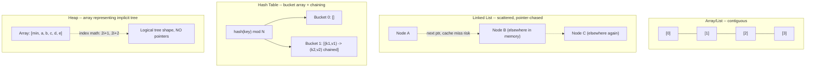
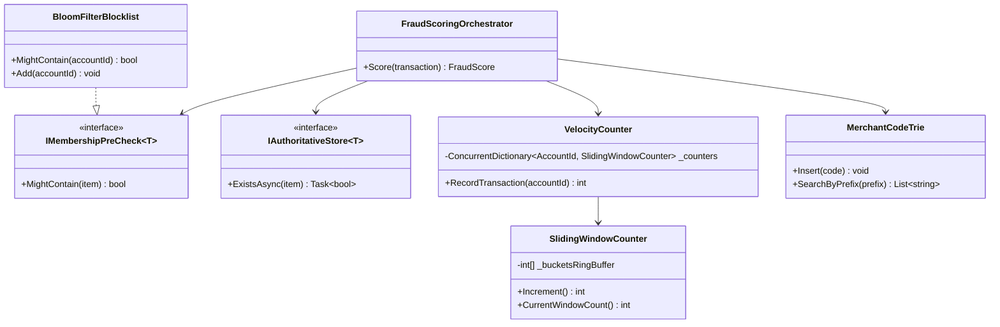
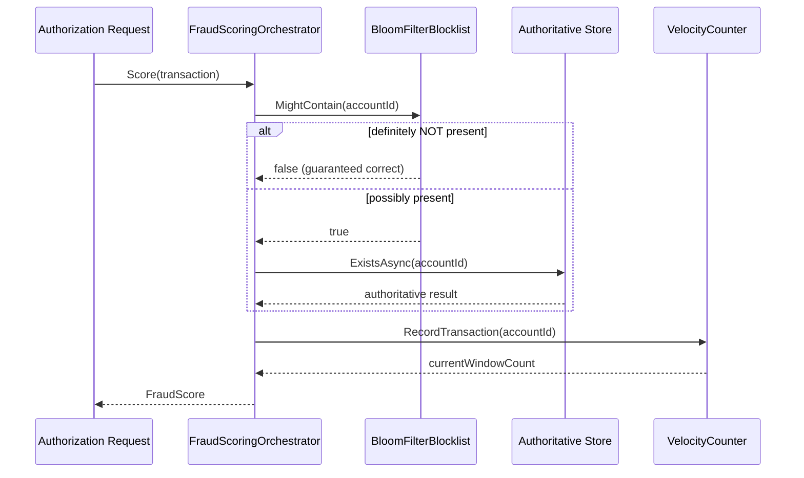
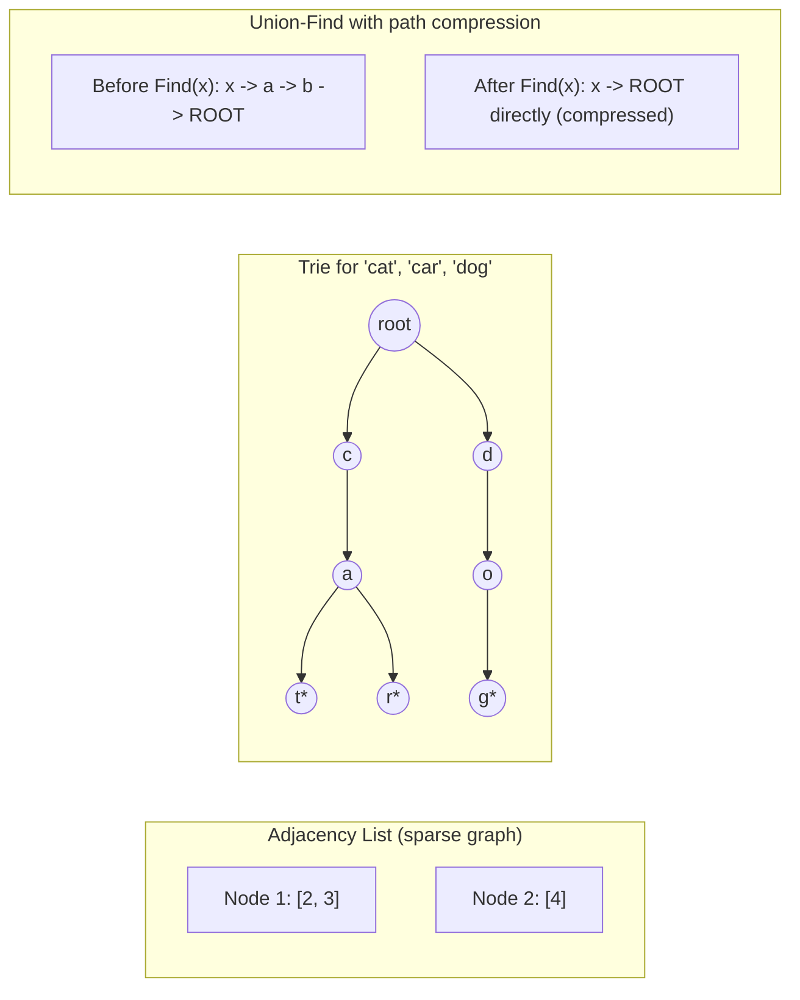
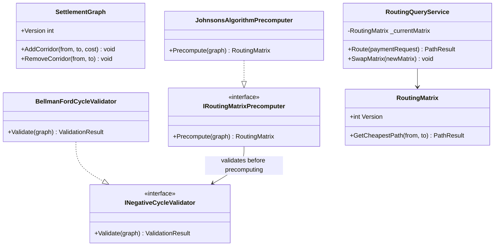
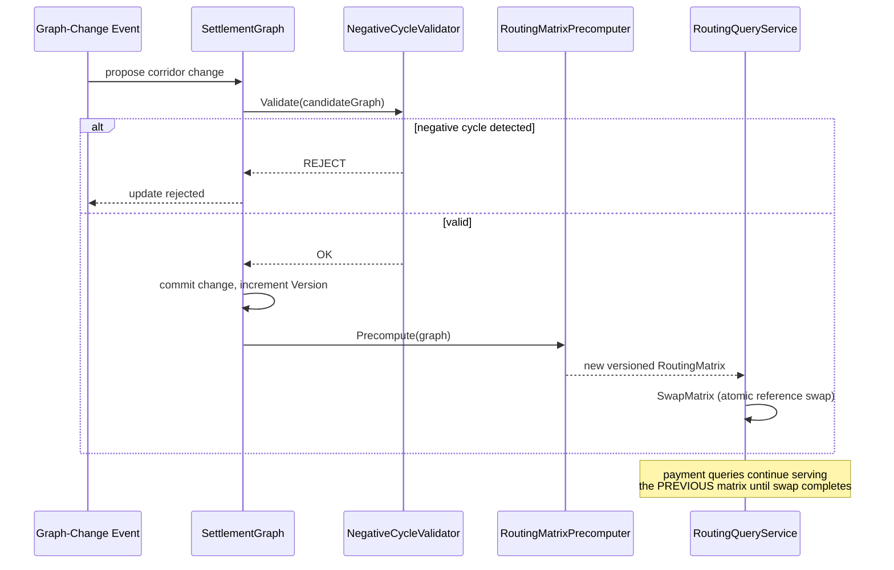

# Data Structures — Complete Interview Prep (All Topics, One File)

> Domain: Data Structures | Level: Beginner → Expert | Prerequisite: [[../01-CSharp/01-CSharp-Interview-Prep]] (collections internals, memory), [[../04-SQL-Server/01-SQL-Server-Interview-Prep]] (B-trees)
> **Quick-prep edition** (consolidated 2026-10-03). This one file replaces Modules 33–34. Originals: `git show ebb2d5c:12-Data-Structures/<file>.md`. Algorithms: [[../13-Algorithms/01-Algorithms-Interview-Prep]]
> Each topic has: **Key concepts → C# code → Most common interview questions with answers.**

| # | Topic | # | Topic |
|---|---|---|---|
| 1 | Big-O cheat sheet & choosing a structure | 8 | Tries |
| 2 | Arrays, dynamic arrays & strings | 9 | Graphs: representation & traversal |
| 3 | Linked lists | 10 | Union-Find (Disjoint Set) |
| 4 | Stacks, queues & deques | 11 | Specialised: LRU cache, Bloom filter, skip list, ring buffer |
| 5 | Hash tables (Dictionary/HashSet) | 12 | Classic data-structure problems (with solutions) |
| 6 | Trees: BST, balanced trees, B-trees | 13 | Top 30 rapid-fire + Principal questions |
| 7 | Heaps & priority queues | 14 | Mistakes checklist |

---

## 1. Big-O Cheat Sheet & Choosing a Structure

| Structure | Access | Search | Insert | Delete | Notes | .NET type |
|---|---|---|---|---|---|---|
| Array | O(1) | O(n) | O(n) | O(n) | contiguous, cache-friendly | `T[]`, `Span<T>` |
| Dynamic array | O(1) | O(n) | O(1) amortized append | O(n) | doubles capacity | `List<T>` |
| Linked list | O(n) | O(n) | O(1) at a node | O(1) at a node | poor locality | `LinkedList<T>` |
| Stack / Queue | top/front O(1) | O(n) | O(1) | O(1) | LIFO / FIFO | `Stack<T>`, `Queue<T>` |
| Hash table | — | O(1) avg, O(n) worst | O(1) avg | O(1) avg | needs good hashing | `Dictionary`, `HashSet` |
| Balanced BST | — | O(log n) | O(log n) | O(log n) | ordered | `SortedDictionary`, `SortedSet` |
| Sorted array | O(1) | O(log n) | O(n) | O(n) | binary search | `SortedList`, `Array.BinarySearch` |
| Binary heap | min/max O(1) | O(n) | O(log n) | O(log n) pop | priority queue | `PriorityQueue<T,P>` |
| Trie | — | O(L) | O(L) | O(L) | L = key length | custom |
| Graph (adjacency list) | — | O(V+E) traversal | O(1) edge | O(degree) | sparse graphs | `Dictionary<T, List<T>>` |
| Union-Find | — | ~O(α(n)) | ~O(α(n)) | — | connectivity | custom |

**How to choose:** what operations dominate (lookup by key? ordered iteration? min/max? prefix search?), data size, memory, concurrency and cache locality.

**Common interview questions**

**Q1. Why does choosing the right data structure matter more than micro-optimizing code?**
It changes the complexity class: replacing `List.Contains` inside a loop with a `HashSet` turns O(n·m) into O(n+m) — a million-fold difference at scale that no micro-optimization can match.

**Q2. Big-O vs real performance?**
Big-O describes growth, ignoring constants and memory effects. For small n, an array with linear search often beats a hash table or tree because of cache locality and lower overhead. Measure with real sizes.

---

## 2. Arrays, Dynamic Arrays & Strings

**Key concepts**
- **Array:** fixed size, contiguous memory → O(1) indexing and excellent cache locality.
- **Dynamic array (`List<T>`):** a backing array that **doubles** when full → append is **amortized O(1)**; insert/remove in the middle is O(n) (shifting). Pre-size with `new List<T>(capacity)` if the size is known.
- **Strings** are immutable arrays of chars → `StringBuilder` for building; `Span<char>` for zero-copy slicing.
- Common techniques: two pointers, sliding window, prefix sums, in-place swaps.

```csharp
// Prefix sums: O(1) range-sum queries after O(n) preprocessing
int[] nums = [3, 1, 4, 1, 5, 9];
int[] prefix = new int[nums.Length + 1];
for (int i = 0; i < nums.Length; i++) prefix[i + 1] = prefix[i] + nums[i];
int RangeSum(int l, int r) => prefix[r + 1] - prefix[l];        // inclusive l..r

// In-place reverse with two pointers
void Reverse(char[] s) { for (int i = 0, j = s.Length - 1; i < j; i++, j--) (s[i], s[j]) = (s[j], s[i]); }

// Rotate an array right by k in O(n), O(1) extra
void Rotate(int[] a, int k) { k %= a.Length; Array.Reverse(a); Array.Reverse(a, 0, k); Array.Reverse(a, k, a.Length - k); }
```

**Common interview questions**

**Q1. Why is `List<T>.Add` amortized O(1)?**
Most adds write into spare capacity (O(1)); occasionally the array is full and is copied into one twice as big (O(n)). Because capacity doubles, the total copying over n adds is ≤ 2n, so the average per add is constant.

**Q2. Array vs linked list?**
Arrays give O(1) indexing and great cache locality; inserting in the middle is O(n). Linked lists give O(1) insert/delete at a known node but O(n) access and poor locality (each node is a separate allocation). In practice arrays/`List<T>` win for almost all sizes.

**Q3. How would you find a pair summing to a target?**
Unsorted: one pass with a `HashSet` of seen values — O(n) time, O(n) space. Sorted: two pointers from both ends — O(n) time, O(1) space.

---

## 3. Linked Lists

**Key concepts**
- Nodes with `Next` (singly) or `Next`/`Prev` (doubly) pointers. O(1) insert/delete when you hold the node; O(n) search.
- Used inside other structures: LRU caches (doubly linked list + hash map), hash table chaining, queues.
- Classic techniques: **dummy head node**, **fast/slow pointers** (find the middle, detect cycles — Floyd), in-place reversal.

```csharp
public sealed class ListNode(int val, ListNode? next = null) { public int Val = val; public ListNode? Next = next; }

// Reverse a singly linked list — O(n) time, O(1) space
ListNode? Reverse(ListNode? head)
{
    ListNode? prev = null;
    while (head is not null) { var next = head.Next; head.Next = prev; prev = head; head = next; }
    return prev;
}

// Detect a cycle (Floyd's tortoise and hare)
bool HasCycle(ListNode? head)
{
    ListNode? slow = head, fast = head;
    while (fast?.Next is not null) { slow = slow!.Next; fast = fast.Next.Next; if (slow == fast) return true; }
    return false;
}

// Merge two sorted lists using a dummy head
ListNode? Merge(ListNode? a, ListNode? b)
{
    var dummy = new ListNode(0); var tail = dummy;
    while (a is not null && b is not null)
    {
        if (a.Val <= b.Val) { tail.Next = a; a = a.Next; } else { tail.Next = b; b = b.Next; }
        tail = tail.Next;
    }
    tail.Next = a ?? b;
    return dummy.Next;
}
```

**Common interview questions**

**Q1. When does a linked list actually beat an array?**
When you hold references to nodes and need O(1) removal or reordering — e.g., the LRU cache's recency list, or splicing large lists without copying. For general storage and iteration, `List<T>` is faster due to locality.

**Q2. How do you find the middle of a linked list in one pass?**
Fast and slow pointers: fast moves two steps, slow one; when fast reaches the end, slow is at the middle.

**Q3. How do you detect where a cycle starts?**
Floyd's algorithm: after the pointers meet, reset one to the head and move both one step at a time; they meet at the cycle start.

---

## 4. Stacks, Queues & Deques

**Key concepts**
- **Stack (LIFO):** push/pop O(1) — undo, expression parsing, DFS, call stacks, matching brackets, **monotonic stack** (next greater element).
- **Queue (FIFO):** enqueue/dequeue O(1) — BFS, task scheduling, buffering. `Queue<T>` is a circular array.
- **Deque:** both ends — sliding window maximum (**monotonic deque**). .NET has no built-in deque → `LinkedList<T>` or a custom ring buffer.
- Concurrent versions: `ConcurrentQueue`, `ConcurrentStack`, `Channel<T>`.

```csharp
// Valid parentheses
bool IsValid(string s)
{
    var stack = new Stack<char>();
    var pairs = new Dictionary<char, char> { [')'] = '(', [']'] = '[', ['}'] = '{' };
    foreach (var c in s)
    {
        if (pairs.TryGetValue(c, out var open)) { if (stack.Count == 0 || stack.Pop() != open) return false; }
        else stack.Push(c);
    }
    return stack.Count == 0;
}

// Next greater element with a monotonic stack — O(n)
int[] NextGreater(int[] a)
{
    var res = Enumerable.Repeat(-1, a.Length).ToArray();
    var st = new Stack<int>();                                     // indices, decreasing values
    for (int i = 0; i < a.Length; i++)
    {
        while (st.Count > 0 && a[st.Peek()] < a[i]) res[st.Pop()] = a[i];
        st.Push(i);
    }
    return res;
}

// Queue using two stacks (amortized O(1))
public sealed class TwoStackQueue<T>
{
    private readonly Stack<T> _in = new(), _out = new();
    public void Enqueue(T x) => _in.Push(x);
    public T Dequeue() { if (_out.Count == 0) while (_in.Count > 0) _out.Push(_in.Pop()); return _out.Pop(); }
}
```

**Common interview questions**

**Q1. Where are stacks used in real systems?**
Call stacks, undo/redo, expression evaluation and parsing, DFS traversal, browser history, and backtracking.

**Q2. Implement a queue with stacks — complexity?**
Two stacks: push onto the inbox; when popping and the outbox is empty, move everything over. Each element moves at most twice → amortized O(1) per operation.

**Q3. What is a monotonic stack/deque for?**
Keeping candidates in sorted order while scanning, to answer "next greater/smaller element", "largest rectangle in histogram", or "sliding window maximum" in O(n) instead of O(n²).

---

## 5. Hash Tables (Dictionary / HashSet)

**Key concepts**
- Key → `GetHashCode()` → bucket index; collisions resolved by **chaining** (.NET Dictionary: buckets + an entries array with next indices) or open addressing.
- **O(1) average** lookup; degrades to O(n) with many collisions (bad hash functions or adversarial keys → hash flooding; .NET randomizes string hashing per process).
- **Load factor** triggers a resize (rehash all entries — O(n), amortized away).
- **Equal objects must have equal hashes**; don't mutate keys.
- Insertion order isn't guaranteed. Not thread-safe → `ConcurrentDictionary`.
- Uses: lookups, deduplication, counting/frequency maps, grouping, memoization, two-sum style complements.

```csharp
// Frequency count + top-k frequent words
var freq = new Dictionary<string, int>(StringComparer.OrdinalIgnoreCase);
foreach (var w in words) freq[w] = freq.GetValueOrDefault(w) + 1;
var top3 = freq.OrderByDescending(kv => kv.Value).Take(3);

// Group anagrams: key = sorted letters
var groups = words.GroupBy(w => new string(w.OrderBy(c => c).ToArray()));

// Two-sum in O(n)
int[] TwoSum(int[] a, int target)
{
    var seen = new Dictionary<int, int>();
    for (int i = 0; i < a.Length; i++)
    {
        if (seen.TryGetValue(target - a[i], out var j)) return [j, i];
        seen[a[i]] = i;
    }
    return [];
}

// Composite key: use a record struct (value equality + hash)
public readonly record struct AccountKey(string Bank, string Number);
var balances = new Dictionary<AccountKey, decimal>();
```

**Common interview questions**

**Q1. Why is hash table lookup O(1) — and when isn't it?**
The hash directly computes the bucket, so lookup cost doesn't depend on n, as long as keys spread evenly and the table is resized to keep the load factor low. With poor hashes (all keys in one bucket) or attacks, it degrades to O(n).

**Q2. What happens when a dictionary resizes?**
It allocates bigger bucket and entry arrays (roughly double, prime-sized) and re-inserts every entry — O(n) for that operation but amortized O(1) per insert. Pre-size when the count is known.

**Q3. How do you handle collisions?**
Chaining (each bucket holds a list or chain of entries — .NET's approach) or open addressing (probe for the next free slot — linear or quadratic probing, Robin Hood hashing).

**Q4. What makes a good hash key?**
Immutable fields, a well-distributed `GetHashCode` consistent with `Equals` (`HashCode.Combine`, or record types), and an appropriate comparer for strings (ordinal/ignore-case).

---

## 6. Trees: BST, Balanced Trees, B-Trees

**Key concepts**
- **Binary tree** terms: root, leaf, height, depth; traversals: **in-order** (sorted for BST), pre-order, post-order, **level-order** (BFS).
- **BST:** left < node < right → O(log n) operations **if balanced**, O(n) if degenerate (sorted inserts make a linked list).
- **Self-balancing:** AVL (strict balance, faster reads), **red-black** (looser, fewer rotations — `SortedDictionary`/`SortedSet` in .NET).
- **B-tree / B+ tree:** wide nodes sized to disk pages (high fan-out → very shallow trees) — **database and file-system indexes**; B+ trees keep data in linked leaves for range scans.
- Other trees: segment trees and Fenwick trees (range queries), interval trees, heaps (§7), tries (§8).
- Many tree problems are **recursion**: solve for children, combine at the node.

```csharp
public sealed class TreeNode(int val, TreeNode? left = null, TreeNode? right = null)
{ public int Val = val; public TreeNode? Left = left, Right = right; }

int MaxDepth(TreeNode? n) => n is null ? 0 : 1 + Math.Max(MaxDepth(n.Left), MaxDepth(n.Right));

// Validate a BST with bounds (not just parent comparisons)
bool IsBst(TreeNode? n, long lo = long.MinValue, long hi = long.MaxValue) =>
    n is null || (n.Val > lo && n.Val < hi && IsBst(n.Left, lo, n.Val) && IsBst(n.Right, n.Val, hi));

// In-order iterative traversal (sorted output for a BST)
IEnumerable<int> InOrder(TreeNode? root)
{
    var st = new Stack<TreeNode>(); var cur = root;
    while (cur is not null || st.Count > 0)
    {
        while (cur is not null) { st.Push(cur); cur = cur.Left; }
        cur = st.Pop(); yield return cur.Val; cur = cur.Right;
    }
}

// Level-order (BFS) returning levels
List<List<int>> Levels(TreeNode? root)
{
    var res = new List<List<int>>(); if (root is null) return res;
    var q = new Queue<TreeNode>([root]);
    while (q.Count > 0)
    {
        var level = new List<int>();
        for (int i = q.Count; i > 0; i--)
        {
            var n = q.Dequeue(); level.Add(n.Val);
            if (n.Left is not null) q.Enqueue(n.Left);
            if (n.Right is not null) q.Enqueue(n.Right);
        }
        res.Add(level);
    }
    return res;
}

// Lowest common ancestor in a BST
TreeNode? Lca(TreeNode? n, int p, int q) =>
    n is null ? null : p < n.Val && q < n.Val ? Lca(n.Left, p, q) : p > n.Val && q > n.Val ? Lca(n.Right, p, q) : n;
```

**Common interview questions**

**Q1. Why does balance matter in a BST?**
Operations cost O(height). Balanced trees keep the height at O(log n); an unbalanced tree built from sorted input becomes a linked list with O(n) operations. Self-balancing trees (AVL, red-black) rotate on insert/delete to keep it logarithmic.

**Q2. Why do databases use B+ trees rather than binary trees?**
Disk and SSD I/O happens in pages; a B+ tree node holds hundreds of keys per page, so a billion rows need only ~3–4 levels (few page reads). Linked leaf nodes make range scans sequential. Binary trees would be ~30 levels deep with poor locality.

**Q3. AVL vs red-black tree?**
AVL keeps stricter balance (faster lookups, more rotations on writes); red-black allows more imbalance (cheaper inserts and deletes). Libraries usually choose red-black for general-purpose use.

**Q4. How do you validate a BST?**
Recurse with min/max bounds (every node must be within the range implied by its ancestors), or check that an in-order traversal is strictly increasing. Comparing only with the direct parent is the classic bug.

---

## 7. Heaps & Priority Queues

**Key concepts**
- **Binary heap:** a complete binary tree stored in an array (children of i at 2i+1, 2i+2); min-heap parent ≤ children.
- Peek O(1), push O(log n) (sift up), pop O(log n) (sift down), **build heap O(n)**.
- Uses: priority queues, schedulers, **top-k** (keep a min-heap of size k → O(n log k)), merge k sorted lists, Dijkstra, median of a stream (two heaps), rate-limited job queues.
- .NET 6+: **`PriorityQueue<TElement, TPriority>`** (min-heap; no decrease-key, not stable).

```csharp
// Top-k largest with a min-heap of size k: O(n log k)
IEnumerable<int> TopK(IEnumerable<int> source, int k)
{
    var pq = new PriorityQueue<int, int>();
    foreach (var x in source)
    {
        pq.Enqueue(x, x);
        if (pq.Count > k) pq.Dequeue();               // drop the smallest
    }
    return pq.UnorderedItems.Select(i => i.Element);
}

// Max-heap: use a reversed comparer
var maxPq = new PriorityQueue<string, int>(Comparer<int>.Create((a, b) => b.CompareTo(a)));

// Running median with two heaps
public sealed class MedianFinder
{
    private readonly PriorityQueue<int, int> _low = new(Comparer<int>.Create((a, b) => b.CompareTo(a))); // max-heap
    private readonly PriorityQueue<int, int> _high = new();                                            // min-heap
    public void Add(int x)
    {
        _low.Enqueue(x, x);
        var top = _low.Dequeue(); _high.Enqueue(top, top);
        if (_high.Count > _low.Count) { var m = _high.Dequeue(); _low.Enqueue(m, m); }
    }
    public double Median => _low.Count > _high.Count ? _low.Peek() : (_low.Peek() + (double)_high.Peek()) / 2;
}
```

**Common interview questions**

**Q1. Heap vs sorted array vs BST for a priority queue?**
Heap: O(log n) insert and pop-min, O(1) peek, compact array storage — best for priority queues. Sorted array: O(1) pop but O(n) insert. BST: O(log n) for everything plus ordered iteration, but more memory and complexity.

**Q2. Why is building a heap O(n) and not O(n log n)?**
Heapify works bottom-up: most nodes are near the leaves and sift down only a few levels; summing the work gives a linear bound.

**Q3. How do you find the top 10 items from a billion-row stream?**
A min-heap of size 10: push each item and pop when the size exceeds 10 — O(n log 10) time, O(10) memory. For distributed data, compute local top-k per partition and merge.

---

## 8. Tries

**Key concepts**
- A tree keyed by characters: each path from the root spells a prefix. Insert/search/prefix lookup in **O(L)** (key length), independent of the number of keys.
- Uses: **autocomplete/typeahead**, spell check, IP routing (longest-prefix match), word games, prefix counting.
- Memory heavy (a node per character) → compressed tries (radix trees), arrays vs dictionaries for children, ternary search trees.

```csharp
public sealed class Trie
{
    private sealed class Node { public readonly Dictionary<char, Node> Kids = new(); public bool IsWord; public int Count; }
    private readonly Node _root = new();

    public void Insert(string word)
    {
        var n = _root;
        foreach (var c in word) { n = n.Kids.TryGetValue(c, out var k) ? k : n.Kids[c] = new Node(); n.Count++; }
        n.IsWord = true;
    }
    public bool Search(string w) => Find(w)?.IsWord == true;
    public int CountWithPrefix(string p) => Find(p)?.Count ?? 0;

    public IEnumerable<string> Suggest(string prefix, int max = 5)
    {
        var start = Find(prefix); if (start is null) yield break;
        var stack = new Stack<(Node, string)>([(start, prefix)]); int found = 0;
        while (stack.Count > 0 && found < max)
        {
            var (n, s) = stack.Pop();
            if (n.IsWord) { found++; yield return s; }
            foreach (var (c, child) in n.Kids) stack.Push((child, s + c));
        }
    }
    private Node? Find(string s)
    {
        var n = _root;
        foreach (var c in s) { if (!n.Kids.TryGetValue(c, out var next)) return null; n = next; }
        return n;
    }
}
```

**Common interview questions**

**Q1. How does a trie achieve efficient prefix lookups?**
Lookup walks one node per character of the prefix — O(L) regardless of how many words are stored. All words sharing the prefix are in that node's subtree, so autocomplete is a subtree traversal.

**Q2. Trie vs hash set for a dictionary of words?**
A hash set is faster and smaller for exact lookups; a trie wins when you need prefix queries, ordered traversal, or longest-prefix matching.

**Q3. How would you scale typeahead to millions of queries per second?**
Precompute top-k suggestions per prefix (stored at trie nodes or in a key-value store keyed by prefix), cache hot prefixes at the edge, shard by prefix, and update rankings asynchronously from query logs.

---

## 9. Graphs: Representation & Traversal

**Key concepts**
- Vertices + edges; directed/undirected; weighted/unweighted; cyclic/acyclic (DAG); connected components.
- **Adjacency list** (sparse graphs, O(V+E) memory — the default) vs **adjacency matrix** (dense graphs, O(V²) memory, O(1) edge check).
- **BFS** (queue): shortest path in **unweighted** graphs, level-by-level. **DFS** (stack/recursion): cycle detection, topological sort, connected components, path existence, backtracking.
- **Weighted shortest path:** **Dijkstra** (non-negative weights, O((V+E) log V) with a heap), **Bellman-Ford** (negative weights, detects negative cycles, O(VE)), **A\*** (heuristic), Floyd-Warshall (all pairs, O(V³)).
- **Topological sort** (Kahn's BFS with in-degrees, or DFS post-order) for dependency ordering — build systems, job schedulers, migrations; a cycle means no valid order.
- **Minimum spanning tree:** Kruskal (sort edges + Union-Find), Prim (heap).
- Real uses: service dependency graphs, fraud rings (connected components), routing, social networks, workflow DAGs.

```csharp
var graph = new Dictionary<string, List<string>>
{
    ["A"] = ["B", "C"], ["B"] = ["D"], ["C"] = ["D"], ["D"] = []
};

// BFS shortest path (unweighted)
List<string>? ShortestPath(string start, string goal)
{
    var prev = new Dictionary<string, string?> { [start] = null };
    var q = new Queue<string>([start]);
    while (q.Count > 0)
    {
        var cur = q.Dequeue();
        if (cur == goal) { var path = new List<string>(); for (string? n = goal; n is not null; n = prev[n]) path.Add(n); path.Reverse(); return path; }
        foreach (var next in graph[cur]) if (prev.TryAdd(next, cur)) q.Enqueue(next);
    }
    return null;
}

// Topological sort (Kahn) with cycle detection
List<string> TopoSort(Dictionary<string, List<string>> g)
{
    var indeg = g.Keys.ToDictionary(k => k, _ => 0);
    foreach (var edges in g.Values) foreach (var v in edges) indeg[v]++;
    var q = new Queue<string>(indeg.Where(kv => kv.Value == 0).Select(kv => kv.Key));
    var order = new List<string>();
    while (q.Count > 0)
    {
        var u = q.Dequeue(); order.Add(u);
        foreach (var v in g[u]) if (--indeg[v] == 0) q.Enqueue(v);
    }
    if (order.Count != g.Count) throw new InvalidOperationException("Cycle detected");
    return order;
}

// Dijkstra with PriorityQueue
Dictionary<int, int> Dijkstra(Dictionary<int, List<(int To, int W)>> g, int src)
{
    var dist = new Dictionary<int, int> { [src] = 0 };
    var pq = new PriorityQueue<int, int>(); pq.Enqueue(src, 0);
    while (pq.TryDequeue(out var u, out var d))
    {
        if (d > dist[u]) continue;                                  // stale entry
        foreach (var (v, w) in g[u])
            if (!dist.TryGetValue(v, out var old) || d + w < old) { dist[v] = d + w; pq.Enqueue(v, d + w); }
    }
    return dist;
}

// Number of islands (DFS on a grid)
int Islands(char[][] grid)
{
    int count = 0;
    void Sink(int r, int c)
    {
        if (r < 0 || c < 0 || r >= grid.Length || c >= grid[0].Length || grid[r][c] != '1') return;
        grid[r][c] = '0'; Sink(r + 1, c); Sink(r - 1, c); Sink(r, c + 1); Sink(r, c - 1);
    }
    for (int r = 0; r < grid.Length; r++) for (int c = 0; c < grid[0].Length; c++) if (grid[r][c] == '1') { count++; Sink(r, c); }
    return count;
}
```

**Common interview questions**

**Q1. Adjacency list vs matrix?**
List: memory O(V+E), iterating neighbours is fast — best for sparse real-world graphs. Matrix: O(V²) memory, O(1) edge existence checks — fine for small or dense graphs.

**Q2. BFS vs DFS — beyond "which finds a path"?**
BFS finds the shortest path in unweighted graphs and explores by distance (but needs memory for the frontier). DFS uses less memory on wide graphs, naturally supports cycle detection, topological ordering and backtracking, but recursion can overflow the stack on deep graphs (use an explicit stack).

**Q3. When can't you use Dijkstra?**
With negative edge weights (it finalizes nodes too early) → Bellman-Ford. For unweighted graphs, plain BFS is simpler and faster.

**Q4. How do you detect a cycle in a dependency graph?**
Kahn's algorithm: if the topological order contains fewer nodes than the graph, there's a cycle. Or DFS with three colours (white/grey/black): reaching a grey node means a back edge, i.e., a cycle. Use it to validate service dependencies, build steps or workflow definitions.

---

## 10. Union-Find (Disjoint Set Union)

**Key concepts**
- Tracks elements partitioned into disjoint sets: `Find(x)` (representative) and `Union(a, b)`.
- With **path compression + union by rank/size**, operations run in **amortized O(α(n))** (effectively constant).
- Uses: connected components in a stream of edges, Kruskal's MST, cycle detection in undirected graphs, account merging, **fraud rings** (linking accounts that share cards, devices or IPs), network connectivity.

```csharp
public sealed class UnionFind
{
    private readonly int[] _parent, _rank;
    public int Components { get; private set; }
    public UnionFind(int n) { _parent = Enumerable.Range(0, n).ToArray(); _rank = new int[n]; Components = n; }

    public int Find(int x) => _parent[x] == x ? x : _parent[x] = Find(_parent[x]);   // path compression

    public bool Union(int a, int b)
    {
        int ra = Find(a), rb = Find(b);
        if (ra == rb) return false;                                                    // already connected (cycle)
        if (_rank[ra] < _rank[rb]) (ra, rb) = (rb, ra);
        _parent[rb] = ra;                                                              // union by rank
        if (_rank[ra] == _rank[rb]) _rank[ra]++;
        Components--;
        return true;
    }
}
```

**Common interview questions**

**Q1. Why do path compression and union by rank matter?**
Without them, trees can degenerate into long chains and `Find` becomes O(n). Union by rank keeps the trees shallow; path compression flattens them on every lookup. Together they give nearly constant amortized time.

**Q2. Union-Find vs BFS/DFS for connectivity?**
For a static graph, one BFS/DFS finds the components in O(V+E). For a stream of edges being added with frequent "are these connected?" queries, Union-Find answers incrementally in near-constant time without re-traversal. It can't handle edge deletions efficiently.

**Q3. Give a fintech use case.**
Linking accounts into fraud rings: union accounts that share a device fingerprint, card number or phone; each resulting set is a candidate ring for investigation — processed incrementally as events arrive.

---

## 11. Specialised Structures: LRU Cache, Bloom Filter, Skip List, Ring Buffer

**Key concepts**
- **LRU cache:** hash map (key → node) + doubly linked list (recency order) → O(1) get/put with eviction of the least recently used.
- **Bloom filter:** a bit array + k hash functions; answers "**definitely not present**" or "**maybe present**" (false positives, never false negatives); tiny memory. Uses: avoid DB lookups for absent keys (cache penetration), "username taken?" pre-checks, LSM-tree SSTables.
- **Skip list:** layered linked lists with probabilistic express lanes → O(log n) ordered operations; used by Redis sorted sets.
- **Ring (circular) buffer:** fixed-size array with head/tail indices — logs, streaming windows, producer/consumer.
- **Count-Min Sketch / HyperLogLog:** approximate frequency and cardinality with tiny memory.

```csharp
// LRU cache — O(1) get/put
public sealed class LruCache<TKey, TValue>(int capacity) where TKey : notnull
{
    private readonly Dictionary<TKey, LinkedListNode<(TKey Key, TValue Value)>> _map = new();
    private readonly LinkedList<(TKey Key, TValue Value)> _list = new();       // front = most recent

    public bool TryGet(TKey key, out TValue value)
    {
        if (_map.TryGetValue(key, out var node))
        {
            _list.Remove(node); _list.AddFirst(node);
            value = node.Value.Value; return true;
        }
        value = default!; return false;
    }

    public void Put(TKey key, TValue value)
    {
        if (_map.TryGetValue(key, out var existing)) { _list.Remove(existing); _map.Remove(key); }
        else if (_map.Count == capacity) { var lru = _list.Last!; _list.RemoveLast(); _map.Remove(lru.Value.Key); }
        _map[key] = _list.AddFirst((key, value));
    }
}

// Bloom filter (simplified)
public sealed class BloomFilter(int bits, int hashes)
{
    private readonly System.Collections.BitArray _bits = new(bits);
    private IEnumerable<int> Positions(string item)
    {
        int h1 = item.GetHashCode(), h2 = StringComparer.OrdinalIgnoreCase.GetHashCode(item) | 1;
        for (int i = 0; i < hashes; i++) yield return (int)((uint)unchecked(h1 + i * h2) % (uint)bits);
    }
    public void Add(string item) { foreach (var p in Positions(item)) _bits[p] = true; }
    public bool MightContain(string item) => Positions(item).All(p => _bits[p]);   // false ⇒ definitely absent
}
```

**Common interview questions**

**Q1. Design an LRU cache with O(1) operations.**
A dictionary mapping keys to nodes in a doubly linked list ordered by recency. On get: move the node to the front. On put: update or insert at the front; if over capacity, remove the tail node and its dictionary entry. Thread safety needs a lock (or a concurrent design with sharding).

**Q2. What is a Bloom filter and where would you use it?**
A compact probabilistic set with no false negatives and tunable false positives. Use it in front of expensive lookups (DB or remote calls) to skip keys that definitely don't exist — e.g., preventing cache penetration, checking breached passwords, LSM-tree reads. It can't delete items (use a counting Bloom filter).

**Q3. How do you size a Bloom filter?**
From the expected item count n and target false-positive rate p: bits m ≈ −n·ln(p)/(ln 2)², hashes k ≈ (m/n)·ln 2. E.g., 1M items at 1% → about 9.6M bits (~1.2 MB) and 7 hash functions.

---

## 12. Classic Data-Structure Problems (with Solutions)

```csharp
// 1. Contains duplicate — HashSet O(n)
bool HasDup(int[] a) { var s = new HashSet<int>(); foreach (var x in a) if (!s.Add(x)) return true; return false; }

// 2. First non-repeating character — counts O(n)
int FirstUnique(string s) { var c = new int[128]; foreach (var ch in s) c[ch]++; for (int i = 0; i < s.Length; i++) if (c[s[i]] == 1) return i; return -1; }

// 3. Longest substring without repeating characters — sliding window + map
int LongestUnique(string s)
{
    var last = new Dictionary<char, int>(); int best = 0, start = 0;
    for (int i = 0; i < s.Length; i++)
    {
        if (last.TryGetValue(s[i], out var j) && j >= start) start = j + 1;
        last[s[i]] = i; best = Math.Max(best, i - start + 1);
    }
    return best;
}

// 4. Merge k sorted lists — heap O(N log k)
IEnumerable<int> MergeK(List<int[]> lists)
{
    var pq = new PriorityQueue<(int List, int Idx), int>();
    for (int i = 0; i < lists.Count; i++) if (lists[i].Length > 0) pq.Enqueue((i, 0), lists[i][0]);
    while (pq.TryDequeue(out var it, out var val))
    {
        yield return val;
        if (it.Idx + 1 < lists[it.List].Length) pq.Enqueue((it.List, it.Idx + 1), lists[it.List][it.Idx + 1]);
    }
}

// 5. Min stack — O(1) GetMin
public sealed class MinStack
{
    private readonly Stack<(int Val, int Min)> _s = new();
    public void Push(int x) => _s.Push((x, _s.Count == 0 ? x : Math.Min(x, _s.Peek().Min)));
    public int Pop() => _s.Pop().Val;
    public int Min => _s.Peek().Min;
}

// 6. Sliding window maximum — monotonic deque O(n)
int[] MaxWindow(int[] a, int k)
{
    var dq = new LinkedList<int>(); var res = new List<int>();
    for (int i = 0; i < a.Length; i++)
    {
        if (dq.Count > 0 && dq.First!.Value <= i - k) dq.RemoveFirst();
        while (dq.Count > 0 && a[dq.Last!.Value] <= a[i]) dq.RemoveLast();
        dq.AddLast(i);
        if (i >= k - 1) res.Add(a[dq.First!.Value]);
    }
    return [.. res];
}

// 7. Course schedule (can all courses be finished?) → topological sort / cycle detection (§9)
// 8. Clone a graph → BFS with a dictionary old→new node
// 9. Serialize/deserialize a binary tree → pre-order with null markers
// 10. Kth smallest in a BST → in-order traversal, stop at k
```

---

## 13. Top 30 Rapid-Fire Questions + Principal Questions

1. **Array access?** O(1). **Middle insert?** O(n).
2. **`List<T>` growth?** Doubling → amortized O(1) append.
3. **Linked list advantage?** O(1) insert/delete at a known node.
4. **Linked list disadvantage?** O(n) access, poor cache locality.
5. **Stack uses?** Undo, parsing, DFS, backtracking.
6. **Queue uses?** BFS, scheduling, buffering.
7. **Hash lookup?** O(1) average, O(n) worst.
8. **Collision handling?** Chaining or open addressing.
9. **`GetHashCode` rule?** Equal objects → equal hashes; immutable keys.
10. **BST worst case?** O(n) when unbalanced.
11. **Balanced trees?** AVL, red-black.
12. **DB indexes?** B+ trees (high fan-out, linked leaves).
13. **In-order traversal of a BST?** Sorted output.
14. **Heap operations?** Peek O(1), push/pop O(log n), build O(n).
15. **Top-k?** Min-heap of size k → O(n log k).
16. **Median of a stream?** Two heaps.
17. **Trie lookup?** O(key length).
18. **Graph default representation?** Adjacency list.
19. **Unweighted shortest path?** BFS.
20. **Weighted shortest path?** Dijkstra (non-negative), Bellman-Ford (negative).
21. **Dependency order?** Topological sort; a cycle = invalid.
22. **Connectivity with incremental edges?** Union-Find.
23. **Union-Find speed?** ~O(α(n)) with path compression + rank.
24. **LRU cache?** HashMap + doubly linked list.
25. **Bloom filter?** No false negatives, possible false positives.
26. **Redis sorted set internals?** Skip list + hash table.
27. **.NET priority queue?** `PriorityQueue<TElement,TPriority>` (min-heap).
28. **Ordered map in .NET?** `SortedDictionary` (red-black tree).
29. **O(n²) membership trap?** `List.Contains` in a loop → `HashSet`.
30. **Monotonic stack use?** Next greater element in O(n).

**Principal-level questions**

**P1. How do data-structure choices show up in system design?**
Database indexes (B+ trees, LSM trees with Bloom filters), caches (hash tables + LRU), rate limiters (sorted sets, token-bucket counters), feeds (heaps and merge-k), typeahead (tries), fraud detection (graphs, union-find), scheduling (priority queues), and distributed IDs (ordered keys for index locality). Naming the structure and its complexity shows you understand why a system scales.

**P2. When would you not pick the asymptotically best structure?**
When n is small (an array beats a hash set for ~10 items), when memory overhead matters (tries, linked lists), when cache locality dominates, when simplicity and readability matter more than a theoretical gain, or when an approximate structure (HyperLogLog, Bloom filter) meets the requirement at a fraction of the cost.

**P3. What is the coding round actually grading at a senior level?**
Problem decomposition, clarifying requirements and edge cases, choosing the right structure and explaining the trade-off, clean and correct code, testing your own solution, and complexity analysis — communicated aloud — more than recalling an obscure algorithm.

---

## 14. Mistakes Checklist (say why each is wrong)
- [ ] `List.Contains`/`Any` inside loops (O(n²)) · not pre-sizing big collections
- [ ] `LinkedList<T>` "for performance" · ignoring cache locality
- [ ] Mutable dictionary keys · `Equals` without `GetHashCode` · relying on Dictionary order
- [ ] Assuming a BST is balanced · validating a BST against the parent only
- [ ] Sorting everything to get the top-k (O(n log n)) instead of a heap
- [ ] Dijkstra with negative weights · recursive DFS on huge graphs (stack overflow)
- [ ] Union-Find without path compression/rank
- [ ] Bloom filters used where false positives are unacceptable without a fallback check
- [ ] Not stating time and space complexity · not testing edge cases (empty, one element, duplicates)

---

## Architecture Diagrams (preserved from the original modules)

> All 6 Mermaid/ASCII diagrams from the original `12-Data-Structures/` files, kept verbatim and grouped by source module. Originals: `git show ebb2d5c:12-Data-Structures/<file>.md`.

### Module 33 — Data Structures: Arrays, Linked Lists, Trees, Heaps & Hash Tables
*Source: `01-Core-Data-Structures.md`*

**3. Visual Architecture**



**13. Low-Level Design**



**13. Low-Level Design**



### Module 34 — Data Structures: Graphs, Tries & Union-Find
*Source: `02-Graphs-Tries-Union-Find.md`*

**3. Visual Architecture**



**13. Low-Level Design**



**13. Low-Level Design**


