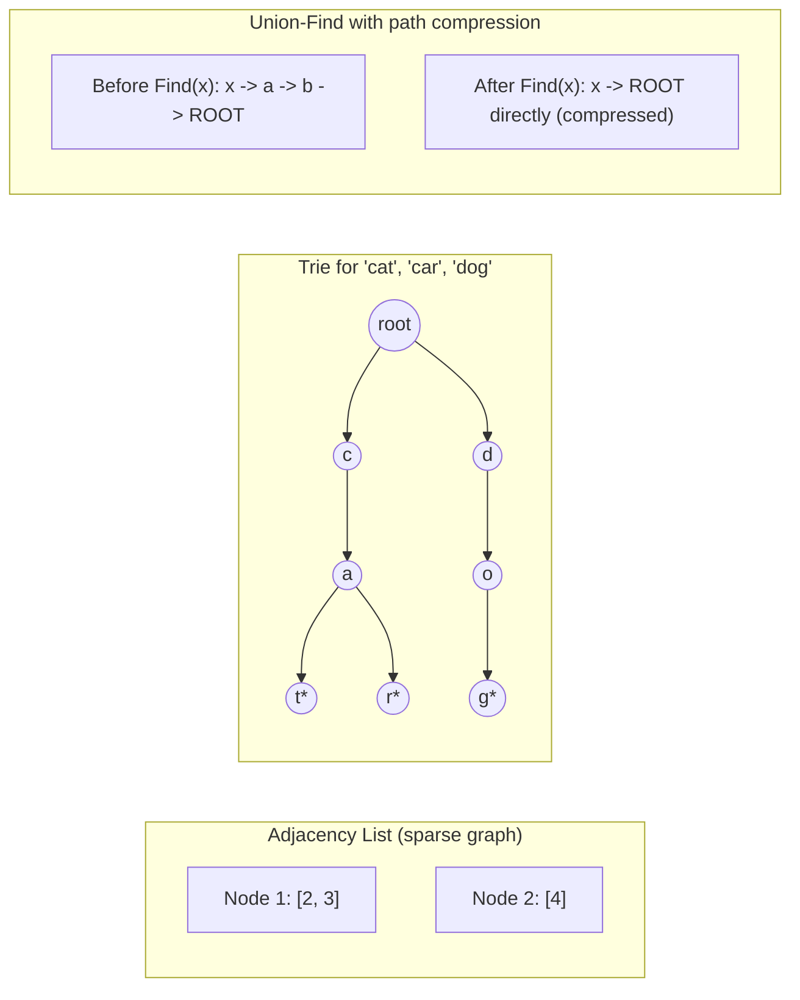

# Module 34 — Data Structures: Graphs, Tries & Union-Find

> Domain: Data Structures | Level: Beginner → Expert | Prerequisite: [[01-Core-Data-Structures]]

---

## 1. Fundamentals

### What are graphs, tries, and union-find structures?
A **graph** is a set of nodes (vertices) connected by edges, modeling arbitrary many-to-many relationships (a social network, a road network, a dependency graph) — the most general-purpose data structure covered in this course, since trees, linked lists, and even arrays are all special-case, restricted forms of graphs. A **trie** (prefix tree) is a tree specialized for storing strings, where each path from root to a node represents a prefix, enabling extremely fast prefix-based lookups (autocomplete, spell-check). **Union-Find** (Disjoint Set Union) is a structure tracking a partition of elements into disjoint sets, supporting near-O(1) "are these two elements in the same set" queries and "merge these two sets" operations.

### Why do these exist?
Graphs exist because most real-world relationship data genuinely isn't tree-shaped (a tree forbids cycles and requires exactly one path between any two nodes; a social network, road network, or dependency graph routinely has multiple paths and cycles) — modeling such data as a tree either loses information or requires awkward workarounds. Tries exist because a hash table, despite O(1) exact-match lookup, provides **no efficient way to find all strings sharing a given prefix** — a trie makes prefix-based queries as natural and efficient as exact-match queries are for a hash table. Union-Find exists because naively tracking "which group does this element belong to" via repeated graph traversal is far more expensive than Union-Find's near-constant-time approach for exactly the "are these connected, merge these groups" query pattern.

### When does this matter?
Graphs matter for any relationship-modeling problem beyond simple hierarchies (dependency resolution, network topology, recommendation systems); tries matter for autocomplete/prefix-search features; Union-Find matters for connectivity/grouping problems (detecting cycles, finding connected components, Kruskal's minimum-spanning-tree algorithm) — all three appear frequently in coding-interview problem sets specifically because they test genuine algorithmic reasoning beyond memorized standard-library API usage.

### How does it work (30,000-ft view)?
```csharp
// Graph as adjacency list -- the standard, memory-efficient representation for sparse graphs
var graph = new Dictionary<int, List<int>>();
graph[1] = new List<int> { 2, 3 };
graph[2] = new List<int> { 4 };
```

---

## 2. Deep Dive

### 2.1 Graph Representations — Adjacency List vs Adjacency Matrix
An **adjacency list** (`Dictionary<Node, List<Node>>`) stores, per node, only its actual neighbors — memory-efficient for **sparse** graphs (relatively few edges relative to the maximum possible), O(V+E) space, and iterating a node's neighbors is O(degree). An **adjacency matrix** (a V×V 2D array/boolean grid) stores an entry for **every possible** node pair, O(V²) space regardless of actual edge count — wasteful for sparse graphs, but provides O(1) "are these two specific nodes directly connected" queries (versus an adjacency list's O(degree) neighbor-scan) and is simpler for **dense** graphs where most possible edges genuinely exist. Choosing between them is precisely the same "match the structure to the actual access pattern and data shape" reasoning as Module 33's entire theme, now applied to graph representation specifically.

### 2.2 Graph Traversal — BFS vs DFS, and Why the Choice Matters Beyond "Which One Finds a Path"
**Breadth-First Search** (queue-based, level-by-level) finds the **shortest path** (in terms of edge count) in an unweighted graph — guaranteed, by construction, since it explores all nodes at distance 1 before any at distance 2. **Depth-First Search** (stack-based/recursive, explores as far as possible along one path before backtracking) does **not** guarantee shortest paths, but uses less memory for graphs with high branching factor but limited depth, and is the natural fit for problems genuinely about *exploring all possibilities along a path* (cycle detection, topological sorting, finding connected components) rather than *shortest distance*. Choosing BFS when the actual requirement is "explore everything" (wasting BFS's shortest-path guarantee on a problem that doesn't need it) or DFS when the actual requirement is "shortest path" (requiring an awkward workaround to recover shortest-path behavior) is a common, avoidable design mistake.

### 2.3 Weighted Graphs and Shortest-Path Algorithms
For **weighted** graphs (edges carrying a cost, not just a connection), BFS's "fewest edges" guarantee no longer corresponds to "lowest total cost" — **Dijkstra's algorithm** (using a priority queue/heap, Module 33 §2.5, to always expand the currently-cheapest-known-cost node next) finds shortest weighted paths from a single source, but **only for non-negative edge weights** — a graph with negative edge weights requires **Bellman-Ford** (slower, O(V×E), but correctly handles negative weights and can detect negative-weight cycles, which would otherwise make "shortest path" an ill-defined, unboundedly-decreasing concept). This distinction — knowing *why* Dijkstra fails on negative weights, not just that it does — is a genuine, frequently-tested Advanced-tier interview signal.

### 2.4 Tries — Precisely How Prefix Lookups Achieve Their Efficiency
A trie node holds a map of `character → child node`, plus a flag marking "a complete word ends here" — looking up a word or checking a prefix's existence is O(L) where L is the string's length, **independent of how many total words are stored in the trie** (unlike a hash table, which would need to enumerate and filter every stored string to find all sharing a given prefix, an O(n×L) operation in the worst case) — this L-only dependency, not n, is precisely why tries dominate hash tables for prefix-based queries specifically, while hash tables remain superior for exact-match-only lookups (O(1) versus a trie's O(L), and typically far less memory overhead per entry than a trie's per-character node structure).

### 2.5 Union-Find — Path Compression and Union by Rank
A naive Union-Find (each element pointing to a "parent," with "find the root" requiring following parent pointers to the top) degrades toward O(n) per operation in the worst case (a long, unbalanced chain) — two optimizations make it **near O(1) amortized** (technically O(α(n)), the inverse Ackermann function, effectively constant for any realistic input size): **path compression** (during a `Find`, directly re-point every visited node straight to the root, flattening future lookups) and **union by rank/size** (always attach the smaller tree under the larger tree's root during a `Union`, preventing chains from growing unnecessarily long) — combining both optimizations is what elevates Union-Find from "a plausible but slow structure" to "the standard, highly efficient tool" for connectivity/grouping problems.

## 3. Visual Architecture


## 4. Production Example
**Scenario**: A build-dependency-resolution service used a naive, repeated-DFS-based approach to detect circular dependencies among project modules — for each module, it ran a fresh DFS checking for a cycle back to that specific module, an O(V×(V+E)) overall approach that worked fine for small dependency graphs (a few dozen modules) but degraded severely as the monorepo grew to thousands of interdependent modules, with dependency-resolution time growing quadratically and eventually exceeding the CI pipeline's timeout. **Investigation**: profiling confirmed the redundant, repeated-per-module DFS traversal was performing substantial duplicate work — many modules shared large overlapping subgraphs of transitive dependencies, each re-traversed independently for every single module's individual cycle check. **Fix**: replaced the per-module repeated-DFS approach with a **single**, whole-graph topological sort attempt (Kahn's algorithm, using in-degree tracking and a queue) — if a topological ordering can be produced covering every node, the graph is acyclic; if some nodes remain unprocessed (unreachable via decreasing in-degree), those nodes are precisely the ones involved in a cycle — reducing the overall complexity from O(V×(V+E)) to a single O(V+E) pass. **Lesson**: recognizing that a graph problem is being solved via **repeated, per-node traversal** when a **single, whole-graph algorithm** (topological sort, here) can answer the same question in one pass is a high-value optimization pattern specifically for graph-shaped problems — directly extending this course's recurring "match the algorithm to the actual problem shape, don't default to a naive repeated-application of a simpler technique" theme (Module 20's N+1 pattern is the data-access-layer analog of this exact same "repeated per-item work instead of one batched/whole-collection operation" mistake, now manifesting in graph-algorithm form).

## 5. Best Practices
- Use adjacency lists for sparse graphs (the overwhelming majority of real-world graphs); reserve adjacency matrices for genuinely dense graphs or when O(1) direct-connection queries dominate the access pattern.
- Choose BFS for shortest-path-in-unweighted-graph problems, DFS for exhaustive-exploration/cycle-detection/topological-sort problems — match the algorithm to the actual question being asked.
- Use Dijkstra only for non-negative edge weights; recognize the need for Bellman-Ford (or reject negative weights as invalid input) whenever weights could be negative.
- Use tries specifically for prefix-based query needs; don't reach for one when only exact-match lookup (better served by a hash table) is actually required.
- Apply both path compression and union-by-rank when implementing Union-Find — using only one optimization leaves meaningful performance on the table.

## 6. Anti-patterns
- Repeated, per-node graph traversal to answer a question a single whole-graph algorithm could answer in one pass (§4's incident) — directly the graph-algorithm analog of Module 20's N+1 query pattern.
- Using an adjacency matrix for a large, sparse graph, wasting O(V²) memory on mostly-nonexistent edges.
- Applying Dijkstra to a graph with negative edge weights, producing silently incorrect results rather than a loud error.
- Implementing Union-Find without path compression/union by rank, leaving it vulnerable to O(n)-per-operation degradation under adversarial or unlucky input ordering.

---

## 10. Interview Questions

### Basic (10)
1. **Q: What is a graph, in data-structure terms?** **A:** A set of nodes connected by edges, modeling arbitrary many-to-many relationships.
2. **Q: What is an adjacency list?** **A:** A representation storing, per node, a list of its actual neighbors — memory-efficient for sparse graphs.
3. **Q: What is an adjacency matrix?** **A:** A V×V grid storing whether every possible pair of nodes is connected — O(V²) space, O(1) direct-connection queries.
4. **Q: What does BFS guarantee that DFS doesn't?** **A:** The shortest path (fewest edges) in an unweighted graph.
5. **Q: What algorithm finds shortest paths in a weighted graph with non-negative weights?** **A:** Dijkstra's algorithm.
6. **Q: What algorithm is needed for graphs with negative edge weights?** **A:** Bellman-Ford.
7. **Q: What is a trie used for?** **A:** Efficient prefix-based string lookups (autocomplete, spell-check).
8. **Q: What does Union-Find track?** **A:** A partition of elements into disjoint sets, supporting near-O(1) "same set" and "merge sets" queries.
9. **Q: What is path compression, in Union-Find?** **A:** Re-pointing every visited node directly to the root during a Find operation, flattening future lookups.
10. **Q: What algorithm can detect a cycle in a directed graph via a single whole-graph pass?** **A:** Topological sort (Kahn's algorithm) — if not every node can be ordered, a cycle exists.

### Intermediate (10)
1. **Q: Why is an adjacency list preferred over an adjacency matrix for most real-world graphs?** **A:** Most real-world graphs are sparse (relatively few edges relative to the maximum possible) — an adjacency matrix wastes O(V²) memory on mostly-nonexistent edges, while an adjacency list stores only actual edges, O(V+E) total.
2. **Q: Why does BFS, not DFS, guarantee shortest paths in an unweighted graph?** **A:** BFS explores level-by-level (all distance-1 nodes before any distance-2 node), so the first time a target node is reached, it's necessarily via the fewest possible edges — DFS explores depth-first along one path, with no such level-by-level guarantee.
3. **Q: Why does Dijkstra's algorithm fail on graphs with negative edge weights?** **A:** Dijkstra assumes once a node's shortest distance is finalized (popped from the priority queue as the current minimum), no future discovery could ever produce a shorter path to it — a negative-weight edge encountered later could still produce a shorter total path to an already-finalized node, violating this core assumption.
4. **Q: Why does a trie's lookup complexity depend on string length (L), not the number of stored words (n)?** **A:** Traversal follows one character-to-child-node step per character in the query string, entirely independent of how many other words happen to be stored in the same trie — unlike a hash table's exact-match lookup, which is O(1) regardless of key length but has no efficient prefix-enumeration capability at all.
5. **Q: Why does union-by-rank prevent Union-Find's tree from degenerating into a long chain?** **A:** Always attaching the smaller tree under the larger tree's root (rather than arbitrarily) keeps the resulting tree's depth growing logarithmically rather than linearly with the number of union operations, directly preventing the worst-case O(n) chain-like degeneration a naive, unranked union would risk.
6. **Q: Why is repeated, per-node DFS for cycle detection (§4's original approach) asymptotically worse than a single topological-sort pass?** **A:** Running a fresh O(V+E) traversal for each of V nodes individually gives O(V×(V+E)) total, while a single topological-sort pass answers the "is there a cycle, and if so involving which nodes" question for the **entire graph at once** in O(V+E) total — the redundant, per-node repetition is exactly what the whole-graph algorithm eliminates.
7. **Q: Why might DFS be preferred over BFS for detecting a cycle in a graph, even though BFS could theoretically also detect one?** **A:** DFS's natural recursion/stack structure directly tracks the current path (the "recursion stack"), making it straightforward to detect a **back edge** (an edge to a node currently on the active path, the precise definition of a cycle in a directed graph) — BFS's level-by-level, path-agnostic exploration doesn't naturally track "the current path," making cycle detection more awkward to express correctly.
8. **Q: Why does a trie typically use more memory per stored word than a hash table, despite its lookup-efficiency advantages for prefixes?** **A:** Each character in each stored word potentially creates a new trie node (a heap-allocated object with its own child-map overhead, Module 1's per-object header cost) — a hash table stores each string once, as a single key, without the per-character node overhead a trie's structure inherently requires.
9. **Q: Why would you choose an adjacency matrix specifically for a dense graph (most possible edges genuinely exist) despite its O(V²) space cost?** **A:** For a genuinely dense graph, O(V²) space is not meaningfully more than an adjacency list would need anyway (since E approaches V² for a dense graph), and the matrix's O(1) direct-connection-query benefit becomes a clear win with no corresponding space-efficiency downside relative to the alternative.
10. **Q: Why is it important to detect a negative-weight cycle explicitly, rather than just running Bellman-Ford and accepting whatever distances it computes?** **A:** A negative-weight cycle makes "shortest path" an ill-defined concept for any node reachable through that cycle — you could traverse the cycle repeatedly, decreasing the total cost without bound, so a well-designed shortest-path algorithm must explicitly detect this condition (Bellman-Ford does so via one additional relaxation pass beyond convergence) and report it as invalid/undefined, rather than returning a finite but meaningless "shortest distance" value.

### Advanced (10)
1. **Q: Diagnose the dependency-resolution performance incident (§4) from first principles, and explain precisely why Kahn's algorithm's single-pass approach eliminates the redundant work the original design performed.**
   **A:** Root cause: treating "does module X participate in a cycle" as V independent per-module questions, each requiring its own full graph traversal, when the underlying graph structure is shared and largely overlapping across all V questions. Kahn's algorithm reframes the problem as a single, global question ("can this entire graph be topologically ordered") answered by repeatedly removing nodes with zero remaining in-degree (nodes with no unprocessed dependencies) and decrementing their neighbors' in-degrees — every node and edge is visited/processed exactly once across the **entire** algorithm's execution, regardless of how many nodes the original per-module approach would have separately, redundantly traversed the same shared subgraph for.
2. **Q: Design a build-system dependency-graph solution that both detects cycles (§4) and produces a valid build order for the acyclic case, using a single algorithm.**
   **A:** Kahn's algorithm naturally produces **both** answers from one pass: the order in which nodes are dequeued (as their in-degree reaches zero) **is** a valid topological/build order for the acyclic case; if the algorithm terminates with nodes remaining that never reached zero in-degree, those remaining nodes are exactly the ones involved in (or dependent on) a cycle — a single O(V+E) algorithm directly answers "is this buildable, and if so, in what order" simultaneously, rather than needing separate cycle-detection and ordering passes.
3. **Q: Explain how you would implement Kruskal's minimum-spanning-tree algorithm using Union-Find, and why Union-Find is specifically the right tool for it.**
   **A:** Sort all edges by weight ascending; iterate through them in order, using Union-Find's "same set" query to check whether an edge's two endpoints are already connected (via previously-added MST edges) — if not, add the edge to the MST and `Union` the two endpoints' sets; if they're already connected, skip the edge (adding it would create a cycle, which an MST must avoid) — Union-Find is exactly the right tool because its near-O(1) "same set" and "merge" operations are precisely the two operations this algorithm needs repeatedly (once per edge), making the overall algorithm's complexity dominated by the initial edge-sort (O(E log E)) rather than by the connectivity-tracking itself.
4. **Q: Explain a scenario where BFS's shortest-path guarantee is insufficient even for an unweighted graph, requiring a more sophisticated approach.**
   **A:** A graph where edges have **different traversal costs that aren't uniform "weight 1" but are still all equal to each other** superficially looks unweighted, but if the actual requirement is "shortest path subject to an additional constraint" (e.g., "shortest path using at most K special edges," a common LeetCode-style variant), plain BFS's simple level-by-level exploration doesn't naturally track the additional constraint dimension — this requires either a modified BFS tracking (node, constraint-state) pairs as the actual "visited" unit (effectively BFS over an expanded state graph) or a different algorithm entirely (0-1 BFS using a deque for edges of weight 0 or 1, if that's the actual edge-weight structure) — recognizing when a superficially-simple unweighted-shortest-path problem actually has hidden additional state/constraints requiring an expanded-state-space BFS is a genuine Advanced-tier interview signal.
5. **Q: Design a trie-based autocomplete feature supporting "return the top K most frequently searched completions for a given prefix," and explain what additional data the trie must store beyond a plain prefix-existence check.**
   **A:** Each trie node representing a complete word (or, for efficiency, each node along the path) additionally stores a frequency/popularity score (updated as searches occur); at query time, traverse to the node representing the given prefix, then perform a traversal of that node's subtree collecting all complete words with their frequencies, using a small bounded min-heap (Module 33 §2.5) of size K to efficiently track only the top K most frequent results without needing to fully sort the entire subtree's results — combining the trie's O(L) prefix-navigation efficiency with a heap's efficient "top K" extraction, rather than either structure alone.
6. **Q: Explain why Union-Find's "near O(1)" complexity (technically O(α(n))) is described as "effectively constant" despite not literally being O(1), and why this distinction rarely matters in practice.**
   **A:** The inverse Ackermann function α(n) grows so unbelievably slowly that for any input size conceivably encountered in real-world computing (even far beyond the number of atoms in the observable universe), α(n) is at most 4 or 5 — it is not mathematically constant, but its practical value is indistinguishable from a small constant for every realistic n, which is precisely why "effectively constant" is the accurate, practical characterization interviewers expect, while acknowledging the technically-more-precise O(α(n)) bound demonstrates deeper algorithmic-analysis rigor than simply asserting "O(1)" without qualification.
7. **Q: How would you extend the topological-sort-based cycle detection (§4/Advanced Q1) to also report the *specific* cycle's constituent nodes for a helpful error message, not just "a cycle exists somewhere"?**
   **A:** For the nodes remaining after Kahn's algorithm terminates (those that never reached zero in-degree), run a targeted DFS restricted to just this remaining subgraph, tracking the current recursion path explicitly — the first back-edge encountered (an edge to a node already on the current path) directly identifies the specific cycle, which can then be reported to the user (e.g., "Module A depends on B depends on C depends on A") as an actionable error message, rather than merely stating a cycle exists somewhere among a potentially large set of affected nodes.
8. **Q: Explain how you would adapt Dijkstra's algorithm to handle a graph where edge weights can change dynamically between queries (e.g., real-time traffic-adjusted road weights), without recomputing shortest paths from scratch on every single change.**
   **A:** For frequent, small, localized weight changes, a full Dijkstra re-run per change is often unnecessarily expensive — incremental/dynamic shortest-path algorithms (a more advanced topic, e.g., maintaining a shortest-path tree and only re-relaxing affected nodes when a specific edge's weight changes) can update results faster than a full recomputation for **localized** changes, at the cost of significantly more complex bookkeeping; for infrequent or large, widespread weight changes affecting much of the graph, a full Dijkstra re-run remains simpler and may not actually be slower in practice — the choice depends on the actual frequency/locality of weight changes relative to the graph's size, the same "measure the actual access pattern before choosing the more complex tool" discipline recurring throughout this course.
9. **Q: A team proposes using an adjacency matrix "for simplicity" for a social-network friendship graph with millions of users. Evaluate this as a Principal Engineer.**
   **A:** Push back firmly — a social network is an extremely sparse graph (each user has, at most, a few thousand friends out of potentially millions of other users) — an adjacency matrix would require O(V²) memory (millions squared), an entirely infeasible amount for any realistic infrastructure, while an adjacency list requires only O(V+E) space proportional to the actual, much smaller number of real friendships; "simplicity" here is a false economy, since the matrix approach wouldn't even be operationally deployable at this data scale, making this a clear-cut case where the sparse/dense distinction (§2.1) has a decisive, not merely optimization-level, impact on feasibility.
10. **Q: As a Principal Engineer, how would you build organizational capability recognizing when a "solve this per-item, repeatedly" approach to a graph-shaped problem should instead be a single, whole-graph algorithm, generalizing beyond this module's specific cycle-detection example?**
    **A:** Teach the diagnostic question directly, applicable across many problem shapes: "does this problem require answering the same or a related question independently for every node/item, and do those independent computations share significant overlapping work (a shared subgraph, shared dependency chains)?" — if yes, a whole-graph/whole-collection algorithm processing everything in one coordinated pass (topological sort, a single BFS/DFS traversal computing all needed answers simultaneously) almost always exists and dominates the repeated-per-item approach asymptotically, directly generalizing this module's specific incident (§4) into a transferable pattern-recognition skill, and directly paralleling Module 20's N+1-query recognition skill at the data-access layer — the same underlying "repeated, redundant per-item work versus one coordinated pass" anti-pattern recurring across two entirely different technical domains (database queries and graph algorithms), worth explicitly naming as a cross-domain pattern in training material.

---

## 11. Coding Exercises

### Easy — BFS shortest path in an unweighted graph
```csharp
public int ShortestPath(Dictionary<int, List<int>> graph, int start, int target)
{
    var visited = new HashSet<int> { start };
    var queue = new Queue<(int Node, int Distance)>();
    queue.Enqueue((start, 0));

    while (queue.Count > 0)
    {
        var (node, distance) = queue.Dequeue();
        if (node == target) return distance;

        foreach (var neighbor in graph.GetValueOrDefault(node, new List<int>()))
        {
            if (visited.Add(neighbor)) // returns false if already present -- O(1) check-and-add
                queue.Enqueue((neighbor, distance + 1));
        }
    }
    return -1; // unreachable
}
```

### Medium — Trie with prefix search
```csharp
public class TrieNode
{
    public Dictionary<char, TrieNode> Children { get; } = new();
    public bool IsEndOfWord { get; set; }
}

public class Trie
{
    private readonly TrieNode _root = new();

    public void Insert(string word)
    {
        var node = _root;
        foreach (char c in word)
        {
            if (!node.Children.TryGetValue(c, out var child))
                node.Children[c] = child = new TrieNode();
            node = child;
        }
        node.IsEndOfWord = true;
    }

    public bool StartsWith(string prefix)
    {
        var node = _root;
        foreach (char c in prefix)
        {
            if (!node.Children.TryGetValue(c, out var child)) return false;
            node = child;
        }
        return true; // prefix exists in SOME stored word, regardless of how many total words are stored
    }
}
```

### Hard — Union-Find with path compression and union by rank
```csharp
public class UnionFind
{
    private readonly int[] _parent;
    private readonly int[] _rank;

    public UnionFind(int size)
    {
        _parent = Enumerable.Range(0, size).ToArray(); // each element starts as its own root
        _rank = new int[size];
    }

    public int Find(int x)
    {
        if (_parent[x] != x)
            _parent[x] = Find(_parent[x]); // PATH COMPRESSION: re-point directly to root
        return _parent[x];
    }

    public void Union(int a, int b)
    {
        int rootA = Find(a), rootB = Find(b);
        if (rootA == rootB) return;

        // UNION BY RANK: attach the smaller tree under the larger one's root
        if (_rank[rootA] < _rank[rootB]) (rootA, rootB) = (rootB, rootA);
        _parent[rootB] = rootA;
        if (_rank[rootA] == _rank[rootB]) _rank[rootA]++;
    }

    public bool AreConnected(int a, int b) => Find(a) == Find(b);
}
```

### Expert — Kahn's algorithm for topological sort with cycle detection (§4/Advanced Q1/Q2)
```csharp
public (bool IsAcyclic, List<int> Order) TopologicalSort(Dictionary<int, List<int>> graph, IEnumerable<int> allNodes)
{
    var inDegree = allNodes.ToDictionary(n => n, _ => 0);
    foreach (var (_, neighbors) in graph)
        foreach (var neighbor in neighbors)
            inDegree[neighbor] = inDegree.GetValueOrDefault(neighbor) + 1;

    var queue = new Queue<int>(inDegree.Where(kv => kv.Value == 0).Select(kv => kv.Key));
    var order = new List<int>();

    while (queue.Count > 0)
    {
        var node = queue.Dequeue();
        order.Add(node);
        foreach (var neighbor in graph.GetValueOrDefault(node, new List<int>()))
        {
            if (--inDegree[neighbor] == 0) queue.Enqueue(neighbor);
        }
    }

    bool isAcyclic = order.Count == inDegree.Count; // if not every node was processed, a cycle exists
    return (isAcyclic, order); // 'order' IS a valid build order when isAcyclic is true
}
```
**Discussion**: This single O(V+E) pass, per Advanced Q2, answers both "is this graph acyclic" and "what's a valid processing order" simultaneously — precisely the fix that replaced §4's O(V×(V+E)) repeated-per-module DFS approach, directly demonstrating the whole-graph-algorithm principle this module's central lesson establishes.

---

## 12–17. System Design / LLD / Debugging / Decision / Case Study / Principal

A monorepo build system (§4) replaces its repeated-per-module DFS cycle-detection approach with a single Kahn's-algorithm pass (Expert exercise), simultaneously producing both cycle detection and a valid build order in one O(V+E) traversal, and extends it with targeted, cycle-subgraph-scoped DFS (Advanced Q7) to produce actionable, specific error messages naming the exact cycle when one is detected. The signature production incident (§4) — quadratic-complexity dependency resolution from redundant, per-node graph traversal — is this module's central lesson, directly paralleling Module 20's N+1 query anti-pattern at the graph-algorithm level: recognizing when a problem is being solved via repeated, overlapping per-item work versus a single, whole-structure-aware algorithm is a high-value, cross-domain pattern-recognition skill. Principal-level guidance: teach the diagnostic question ("does this problem require independently answering the same question for every item, with significant overlapping shared work across those independent computations?") as a transferable skill applicable across database queries (Module 20), graph algorithms (this module), and beyond.

## 18. Revision
**Key takeaways**: Adjacency lists suit sparse graphs (the overwhelming majority of real-world graphs); adjacency matrices suit dense graphs or O(1)-direct-connection-query needs. BFS guarantees shortest paths in unweighted graphs; DFS suits exhaustive exploration/cycle-detection/topological-sort. Dijkstra requires non-negative weights; Bellman-Ford handles negative weights and detects negative cycles. Tries provide O(L)-in-string-length prefix lookups, independent of total stored-word count — the key advantage over hash tables for prefix-based queries specifically. Union-Find with path compression + union by rank achieves near-O(1) (technically O(α(n))) connectivity operations — the standard tool for grouping/connectivity problems (Kruskal's MST algorithm, cycle detection in undirected graphs).

---

**Next**: This completes the `12-Data-Structures` domain (Modules 33–34). Continuing autonomously to `13-Algorithms`.
