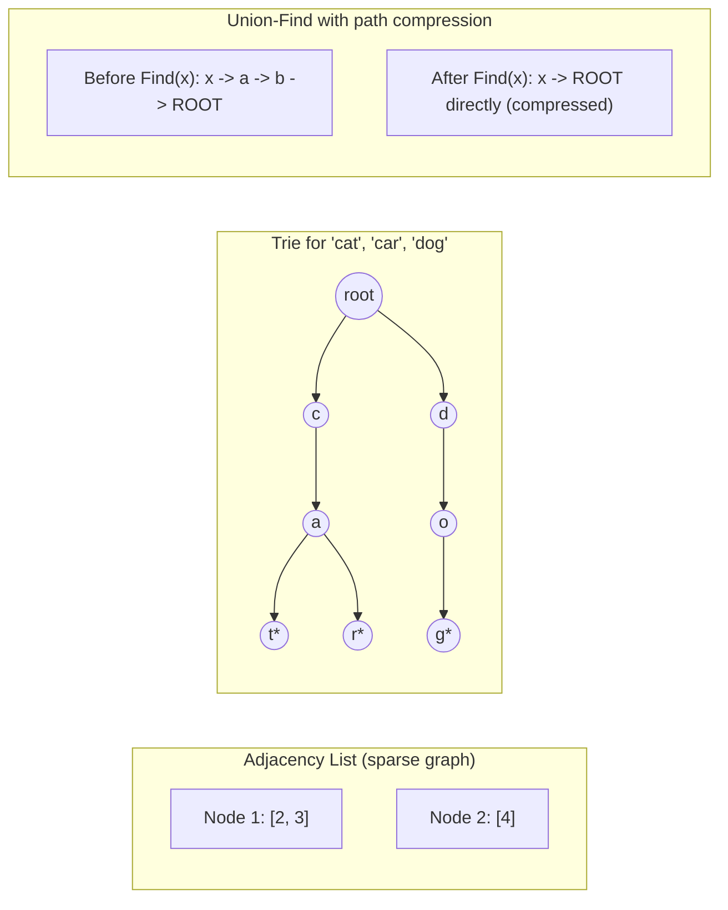
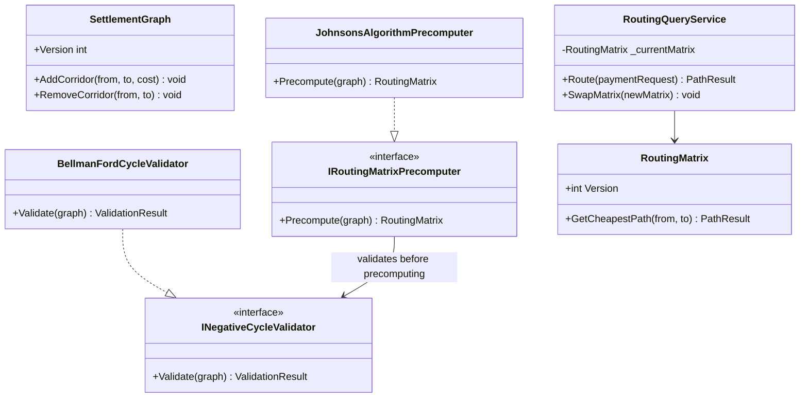
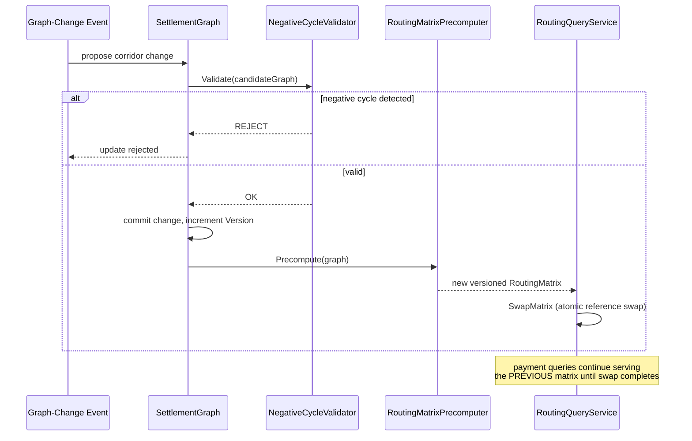

# Module 34 — Data Structures: Graphs, Tries & Union-Find

> Domain: Data Structures | Level: Beginner → Expert | Prerequisite: [[01-Core-Data-Structures]]

---

## 1. Fundamentals

### What are graphs, tries, and union-find structures?
A **graph** is a set of nodes (vertices) connected by edges, modeling arbitrary many-to-many relationships (a social network, a road network, a dependency graph) — the most general-purpose data structure covered in this course, since trees, linked lists, and even arrays are all special-case, restricted forms of graphs. A **trie** (prefix tree) is a tree specialized for storing strings, where each path from root to a node represents a prefix, enabling extremely fast prefix-based lookups (autocomplete, spell-check). **Union-Find** (Disjoint Set Union) is a structure tracking a partition of elements into disjoint sets, supporting near-O(1) "are these two elements in the same set" queries and "merge these two sets" operations.

### Why do these exist?
Graphs exist because most real-world relationship data genuinely isn't tree-shaped (a tree forbids cycles and requires exactly one path between any two nodes; a social network, road network, or dependency graph routinely has multiple paths and cycles) — modeling such data as a tree either loses information or requires awkward workarounds. Tries exist because a hash table, despite O(1) exact-match lookup, provides **no efficient way to find all strings sharing a given prefix** — a trie makes prefix-based queries as natural and efficient as exact-match queries are for a hash table. Union-Find exists because naively tracking "which group does this element belong to" via repeated graph traversal is far more expensive than Union-Find's near-constant-time approach for exactly the "are these connected, merge these groups" query pattern.

### When does this matter?
Graphs matter for any relationship-modeling problem beyond simple hierarchies (dependency resolution, network topology, recommendation systems); tries matter for autocomplete/prefix-search features; Union-Find matters for connectivity/grouping problems (detecting cycles, finding connected components, Kruskal's minimum-spanning-tree algorithm) — all three appear frequently in coding-interview problem sets specifically because they test genuine algorithmic reasoning beyond memorized standard-library API usage.

### How does it work (30,000-ft view)?
```csharp
// Graph as adjacency list -- the standard, memory-efficient representation for sparse graphs
var graph = new Dictionary<int, List<int>>;
graph[1] = new List<int> { 2, 3 };
graph[2] = new List<int> { 4 };
```

---

## 2. Deep Dive

### 2.1 Graph Representations — Adjacency List vs Adjacency Matrix
An **adjacency list** (`Dictionary<Node, List<Node>>`) stores, per node, only its actual neighbors — memory-efficient for **sparse** graphs (relatively few edges relative to the maximum possible), O(V+E) space, and iterating a node's neighbors is O(degree). An **adjacency matrix** (a V×V 2D array/boolean grid) stores an entry for **every possible** node pair, O(V²) space regardless of actual edge count — wasteful for sparse graphs, but provides O(1) "are these two specific nodes directly connected" queries (versus an adjacency list's O(degree) neighbor-scan) and is simpler for **dense** graphs where most possible edges genuinely exist. Choosing between them is precisely the same "match the structure to the actual access pattern and data shape" reasoning as the entire theme, now applied to graph representation specifically.

### 2.2 Graph Traversal — BFS vs DFS, and Why the Choice Matters Beyond "Which One Finds a Path"
**Breadth-First Search** (queue-based, level-by-level) finds the **shortest path** (in terms of edge count) in an unweighted graph — guaranteed, by construction, since it explores all nodes at distance 1 before any at distance 2. **Depth-First Search** (stack-based/recursive, explores as far as possible along one path before backtracking) does **not** guarantee shortest paths, but uses less memory for graphs with high branching factor but limited depth, and is the natural fit for problems genuinely about *exploring all possibilities along a path* (cycle detection, topological sorting, finding connected components) rather than *shortest distance*. Choosing BFS when the actual requirement is "explore everything" (wasting BFS's shortest-path guarantee on a problem that doesn't need it) or DFS when the actual requirement is "shortest path" (requiring an awkward workaround to recover shortest-path behavior) is a common, avoidable design mistake.

### 2.3 Weighted Graphs and Shortest-Path Algorithms
For **weighted** graphs (edges carrying a cost, not just a connection), BFS's "fewest edges" guarantee no longer corresponds to "lowest total cost" — **Dijkstra's algorithm** (using a priority queue/heap,, to always expand the currently-cheapest-known-cost node next) finds shortest weighted paths from a single source, but **only for non-negative edge weights** — a graph with negative edge weights requires **Bellman-Ford** (slower, O(V×E), but correctly handles negative weights and can detect negative-weight cycles, which would otherwise make "shortest path" an ill-defined, unboundedly-decreasing concept). This distinction — knowing *why* Dijkstra fails on negative weights, not just that it does — is a genuine, frequently-tested Advanced-tier interview signal.

### 2.4 Tries — Precisely How Prefix Lookups Achieve Their Efficiency
A trie node holds a map of `character → child node`, plus a flag marking "a complete word ends here" — looking up a word or checking a prefix's existence is O(L) where L is the string's length, **independent of how many total words are stored in the trie** (unlike a hash table, which would need to enumerate and filter every stored string to find all sharing a given prefix, an O(n×L) operation in the worst case) — this L-only dependency, not n, is precisely why tries dominate hash tables for prefix-based queries specifically, while hash tables remain superior for exact-match-only lookups (O(1) versus a trie's O(L), and typically far less memory overhead per entry than a trie's per-character node structure).

### 2.5 Union-Find — Path Compression and Union by Rank
A naive Union-Find (each element pointing to a "parent," with "find the root" requiring following parent pointers to the top) degrades toward O(n) per operation in the worst case (a long, unbalanced chain) — two optimizations make it **near O(1) amortized** (technically O(α(n)), the inverse Ackermann function, effectively constant for any realistic input size): **path compression** (during a `Find`, directly re-point every visited node straight to the root, flattening future lookups) and **union by rank/size** (always attach the smaller tree under the larger tree's root during a `Union`, preventing chains from growing unnecessarily long) — combining both optimizations is what elevates Union-Find from "a plausible but slow structure" to "the standard, highly efficient tool" for connectivity/grouping problems.

## 3. Visual Architecture

```mermaid
graph LR
 subgraph "Adjacency List (sparse graph)"
 N1["Node 1: [2, 3]"]
 N2["Node 2: [4]"]
 end
 subgraph "Trie for 'cat', 'car', 'dog'"
 Root((root)) --> C((c)) --> A((a)) --> T((t*))
 A --> R((r*))
 Root --> D((d)) --> O((o)) --> G((g*))
 end
 subgraph "Union-Find with path compression"
 UF1["Before Find(x): x -> a -> b -> ROOT"]
 UF2["After Find(x): x -> ROOT directly (compressed)"]
 end
```

## 4. Production Example
**Scenario**: A build-dependency-resolution service used a naive, repeated-DFS-based approach to detect circular dependencies among project modules — for each module, it ran a fresh DFS checking for a cycle back to that specific module, an O(V×(V+E)) overall approach that worked fine for small dependency graphs (a few dozen modules) but degraded severely as the monorepo grew to thousands of interdependent modules, with dependency-resolution time growing quadratically and eventually exceeding the CI pipeline's timeout. **Investigation**: profiling confirmed the redundant, repeated-per-module DFS traversal was performing substantial duplicate work — many modules shared large overlapping subgraphs of transitive dependencies, each re-traversed independently for every single module's individual cycle check. **Fix**: replaced the per-module repeated-DFS approach with a **single**, whole-graph topological sort attempt (Kahn's algorithm, using in-degree tracking and a queue) — if a topological ordering can be produced covering every node, the graph is acyclic; if some nodes remain unprocessed (unreachable via decreasing in-degree), those nodes are precisely the ones involved in a cycle — reducing the overall complexity from O(V×(V+E)) to a single O(V+E) pass. **Lesson**: recognizing that a graph problem is being solved via **repeated, per-node traversal** when a **single, whole-graph algorithm** (topological sort, here) can answer the same question in one pass is a high-value optimization pattern specifically for graph-shaped problems — directly extending this course's recurring "match the algorithm to the actual problem shape, don't default to a naive repeated-application of a simpler technique" theme (the N+1 pattern is the data-access-layer analog of this exact same "repeated per-item work instead of one batched/whole-collection operation" mistake, now manifesting in graph-algorithm form).
## 10. Interview Questions

### Basic (10)
1. **Q: What is a graph, in data-structure terms?** **A:** A set of nodes connected by edges, modeling arbitrary many-to-many relationships.
2. **Q: What is an adjacency list?** **A:** A representation storing, per node, a list of its actual neighbors — memory-efficient for sparse graphs.
3. **Q: What is an adjacency matrix?** **A:** A V×V grid storing whether every possible pair of nodes is connected — O(V²) space, O(1) direct-connection queries.
4. **Q: What does BFS guarantee that DFS doesn't?** **A:** The shortest path (fewest edges) in an unweighted graph.
5. **Q: What algorithm finds shortest paths in a weighted graph with non-negative weights?** **A:** Dijkstra's algorithm — a greedy expansion that always settles the currently-closest unvisited node (via a priority queue, O((V+E) log V)); its correctness depends on non-negative weights, since a settled node must never be improvable by a longer-looking route.
6. **Q: What algorithm is needed for graphs with negative edge weights?** **A:** Bellman-Ford — it relaxes every edge V-1 times (O(V·E), slower than Dijkstra) and, crucially, can also *detect* negative cycles (a V-th relaxation pass that still improves a distance proves one exists, making "shortest path" undefined).
7. **Q: What is a trie used for?** **A:** Efficient prefix-based string lookups (autocomplete, spell-check).
8. **Q: What does Union-Find track?** **A:** A partition of elements into disjoint sets, supporting near-O(1) "same set" and "merge sets" queries.
9. **Q: What is path compression, in Union-Find?** **A:** Re-pointing every visited node directly to the root during a Find operation, flattening future lookups.
10. **Q: What algorithm can detect a cycle in a directed graph via a single whole-graph pass?** **A:** Topological sort (Kahn's algorithm) — if not every node can be ordered, a cycle exists.

### Intermediate (10)
1. **Q: Why is an adjacency list preferred over an adjacency matrix for most real-world graphs?** **A:** Most real-world graphs are sparse (relatively few edges relative to the maximum possible) — an adjacency matrix wastes O(V²) memory on mostly-nonexistent edges, while an adjacency list stores only actual edges, O(V+E) total.
2. **Q: Why does BFS, not DFS, guarantee shortest paths in an unweighted graph?** **A:** BFS explores level-by-level (all distance-1 nodes before any distance-2 node), so the first time a target node is reached, it's necessarily via the fewest possible edges — DFS explores depth-first along one path, with no such level-by-level guarantee.
3. **Q: Why does Dijkstra's algorithm fail on graphs with negative edge weights?** **A:** Dijkstra assumes once a node's shortest distance is finalized (popped from the priority queue as the current minimum), no future discovery could ever produce a shorter path to it — a negative-weight edge encountered later could still produce a shorter total path to an already-finalized node, violating this core assumption.
4. **Q: Why does a trie's lookup complexity depend on string length (L), not the number of stored words (n)?** **A:** Traversal follows one character-to-child-node step per character in the query string, entirely independent of how many other words happen to be stored in the same trie — unlike a hash table's exact-match lookup, which is O(1) regardless of key length but has no efficient prefix-enumeration capability at all.
5. **Q: Why does union-by-rank prevent Union-Find's tree from degenerating into a long chain?** **A:** Always attaching the smaller tree under the larger tree's root (rather than arbitrarily) keeps the resulting tree's depth growing logarithmically rather than linearly with the number of union operations, directly preventing the worst-case O(n) chain-like degeneration a naive, unranked union would risk.
6. **Q: Why is repeated, per-node DFS for cycle detection (the original approach) asymptotically worse than a single topological-sort pass?** **A:** Running a fresh O(V+E) traversal for each of V nodes individually gives O(V×(V+E)) total, while a single topological-sort pass answers the "is there a cycle, and if so involving which nodes" question for the **entire graph at once** in O(V+E) total — the redundant, per-node repetition is exactly what the whole-graph algorithm eliminates.
7. **Q: Why might DFS be preferred over BFS for detecting a cycle in a graph, even though BFS could theoretically also detect one?** **A:** DFS's natural recursion/stack structure directly tracks the current path (the "recursion stack"), making it straightforward to detect a **back edge** (an edge to a node currently on the active path, the precise definition of a cycle in a directed graph) — BFS's level-by-level, path-agnostic exploration doesn't naturally track "the current path," making cycle detection more awkward to express correctly.
8. **Q: Why does a trie typically use more memory per stored word than a hash table, despite its lookup-efficiency advantages for prefixes?** **A:** Each character in each stored word potentially creates a new trie node (a heap-allocated object with its own child-map overhead, the per-object header cost) — a hash table stores each string once, as a single key, without the per-character node overhead a trie's structure inherently requires.
9. **Q: Why would you choose an adjacency matrix specifically for a dense graph (most possible edges genuinely exist) despite its O(V²) space cost?** **A:** For a genuinely dense graph, O(V²) space is not meaningfully more than an adjacency list would need anyway (since E approaches V² for a dense graph), and the matrix's O(1) direct-connection-query benefit becomes a clear win with no corresponding space-efficiency downside relative to the alternative.
10. **Q: Why is it important to detect a negative-weight cycle explicitly, rather than just running Bellman-Ford and accepting whatever distances it computes?** **A:** A negative-weight cycle makes "shortest path" an ill-defined concept for any node reachable through that cycle — you could traverse the cycle repeatedly, decreasing the total cost without bound, so a well-designed shortest-path algorithm must explicitly detect this condition (Bellman-Ford does so via one additional relaxation pass beyond convergence) and report it as invalid/undefined, rather than returning a finite but meaningless "shortest distance" value.

### Advanced (10)
1. **Q: Diagnose the dependency-resolution performance incident from first principles, and explain precisely why Kahn's algorithm's single-pass approach eliminates the redundant work the original design performed.**
 **A:** Root cause: treating "does module X participate in a cycle" as V independent per-module questions, each requiring its own full graph traversal, when the underlying graph structure is shared and largely overlapping across all V questions. Kahn's algorithm reframes the problem as a single, global question ("can this entire graph be topologically ordered") answered by repeatedly removing nodes with zero remaining in-degree (nodes with no unprocessed dependencies) and decrementing their neighbors' in-degrees — every node and edge is visited/processed exactly once across the **entire** algorithm's execution, regardless of how many nodes the original per-module approach would have separately, redundantly traversed the same shared subgraph for.
2. **Q: Design a build-system dependency-graph solution that both detects cycles and produces a valid build order for the acyclic case, using a single algorithm.**
 **A:** Kahn's algorithm naturally produces **both** answers from one pass: the order in which nodes are dequeued (as their in-degree reaches zero) **is** a valid topological/build order for the acyclic case; if the algorithm terminates with nodes remaining that never reached zero in-degree, those remaining nodes are exactly the ones involved in (or dependent on) a cycle — a single O(V+E) algorithm directly answers "is this buildable, and if so, in what order" simultaneously, rather than needing separate cycle-detection and ordering passes.
3. **Q: Explain how you would implement Kruskal's minimum-spanning-tree algorithm using Union-Find, and why Union-Find is specifically the right tool for it.**
 **A:** Sort all edges by weight ascending; iterate through them in order, using Union-Find's "same set" query to check whether an edge's two endpoints are already connected (via previously-added MST edges) — if not, add the edge to the MST and `Union` the two endpoints' sets; if they're already connected, skip the edge (adding it would create a cycle, which an MST must avoid) — Union-Find is exactly the right tool because its near-O(1) "same set" and "merge" operations are precisely the two operations this algorithm needs repeatedly (once per edge), making the overall algorithm's complexity dominated by the initial edge-sort (O(E log E)) rather than by the connectivity-tracking itself.
4. **Q: Explain a scenario where BFS's shortest-path guarantee is insufficient even for an unweighted graph, requiring a more sophisticated approach.**
 **A:** A graph where edges have **different traversal costs that aren't uniform "weight 1" but are still all equal to each other** superficially looks unweighted, but if the actual requirement is "shortest path subject to an additional constraint" (e.g., "shortest path using at most K special edges," a common LeetCode-style variant), plain BFS's simple level-by-level exploration doesn't naturally track the additional constraint dimension — this requires either a modified BFS tracking (node, constraint-state) pairs as the actual "visited" unit (effectively BFS over an expanded state graph) or a different algorithm entirely (0-1 BFS using a deque for edges of weight 0 or 1, if that's the actual edge-weight structure) — recognizing when a superficially-simple unweighted-shortest-path problem actually has hidden additional state/constraints requiring an expanded-state-space BFS is a genuine Advanced-tier interview signal.
5. **Q: Design a trie-based autocomplete feature supporting "return the top K most frequently searched completions for a given prefix," and explain what additional data the trie must store beyond a plain prefix-existence check.**
 **A:** Each trie node representing a complete word (or, for efficiency, each node along the path) additionally stores a frequency/popularity score (updated as searches occur); at query time, traverse to the node representing the given prefix, then perform a traversal of that node's subtree collecting all complete words with their frequencies, using a small bounded min-heap of size K to efficiently track only the top K most frequent results without needing to fully sort the entire subtree's results — combining the trie's O(L) prefix-navigation efficiency with a heap's efficient "top K" extraction, rather than either structure alone.
6. **Q: Explain why Union-Find's "near O(1)" complexity (technically O(α(n))) is described as "effectively constant" despite not literally being O(1), and why this distinction rarely matters in practice.**
 **A:** The inverse Ackermann function α(n) grows so unbelievably slowly that for any input size conceivably encountered in real-world computing (even far beyond the number of atoms in the observable universe), α(n) is at most 4 or 5 — it is not mathematically constant, but its practical value is indistinguishable from a small constant for every realistic n, which is precisely why "effectively constant" is the accurate, practical characterization interviewers expect, while acknowledging the technically-more-precise O(α(n)) bound demonstrates deeper algorithmic-analysis rigor than simply asserting "O(1)" without qualification.
7. **Q: How would you extend the topological-sort-based cycle detection (/Advanced Q1) to also report the *specific* cycle's constituent nodes for a helpful error message, not just "a cycle exists somewhere"?**
 **A:** For the nodes remaining after Kahn's algorithm terminates (those that never reached zero in-degree), run a targeted DFS restricted to just this remaining subgraph, tracking the current recursion path explicitly — the first back-edge encountered (an edge to a node already on the current path) directly identifies the specific cycle, which can then be reported to the user (e.g., "Module A depends on B depends on C depends on A") as an actionable error message, rather than merely stating a cycle exists somewhere among a potentially large set of affected nodes.
8. **Q: Explain how you would adapt Dijkstra's algorithm to handle a graph where edge weights can change dynamically between queries (e.g., real-time traffic-adjusted road weights), without recomputing shortest paths from scratch on every single change.**
 **A:** For frequent, small, localized weight changes, a full Dijkstra re-run per change is often unnecessarily expensive — incremental/dynamic shortest-path algorithms (a more advanced topic, e.g., maintaining a shortest-path tree and only re-relaxing affected nodes when a specific edge's weight changes) can update results faster than a full recomputation for **localized** changes, at the cost of significantly more complex bookkeeping; for infrequent or large, widespread weight changes affecting much of the graph, a full Dijkstra re-run remains simpler and may not actually be slower in practice — the choice depends on the actual frequency/locality of weight changes relative to the graph's size, the same "measure the actual access pattern before choosing the more complex tool" discipline recurring throughout this course.
9. **Q: A team proposes using an adjacency matrix "for simplicity" for a social-network friendship graph with millions of users. Evaluate this as a Principal Engineer.**
 **A:** Push back firmly — a social network is an extremely sparse graph (each user has, at most, a few thousand friends out of potentially millions of other users) — an adjacency matrix would require O(V²) memory (millions squared), an entirely infeasible amount for any realistic infrastructure, while an adjacency list requires only O(V+E) space proportional to the actual, much smaller number of real friendships; "simplicity" here is a false economy, since the matrix approach wouldn't even be operationally deployable at this data scale, making this a clear-cut case where the sparse/dense distinction has a decisive, not merely optimization-level, impact on feasibility.
10. **Q: As a Principal Engineer, how would you build organizational capability recognizing when a "solve this per-item, repeatedly" approach to a graph-shaped problem should instead be a single, whole-graph algorithm, generalizing beyond this module's specific cycle-detection example?**
 **A:** Teach the diagnostic question directly, applicable across many problem shapes: "does this problem require answering the same or a related question independently for every node/item, and do those independent computations share significant overlapping work (a shared subgraph, shared dependency chains)?" — if yes, a whole-graph/whole-collection algorithm processing everything in one coordinated pass (topological sort, a single BFS/DFS traversal computing all needed answers simultaneously) almost always exists and dominates the repeated-per-item approach asymptotically, directly generalizing this module's specific incident into a transferable pattern-recognition skill, and directly paralleling the N+1-query recognition skill at the data-access layer — the same underlying "repeated, redundant per-item work versus one coordinated pass" anti-pattern recurring across two entirely different technical domains (database queries and graph algorithms), worth explicitly naming as a cross-domain pattern in training material.

### Expert (10)

1. **Q: A settlement-network graph models correspondent-banking relationships (nodes = banks, edges = active settlement corridors with a weighted "cost" reflecting FX spread and fees). A payment-routing service runs Dijkstra per incoming payment to find the cheapest settlement path, and this has become the dominant CPU cost in the payment-processing pipeline at 500 payments/second. Diagnose and propose an architecture, given that the graph itself changes only a few times per day.**
 **A:** Running full Dijkstra per-payment against a graph that's effectively static for hours at a time is the graph-algorithm analog of this module's own central incident (repeated, redundant per-item work against a shared, overlapping structure) — the fix is precomputing rather than repeating. Since the graph changes only a few times daily, precompute **all-pairs shortest paths** once per graph-change event (via repeated Dijkstra from every node, or Floyd-Warshall if the bank count is small enough that O(V³) is acceptable, or Johnson's algorithm — repeated Dijkstra with a reweighting step — for a larger, sparse graph with potentially negative-but-no-negative-cycle edge costs) and cache the resulting cost/path matrix; each incoming payment then does an O(1) lookup into the precomputed matrix rather than a fresh O((V+E) log V) Dijkstra run. This trades a bounded, infrequent (few-times-daily) recomputation cost for eliminating the per-payment computation entirely — directly the same "single, whole-structure-aware computation instead of repeated per-item work" principle as the module's own topological-sort fix, applied here to shortest-path rather than cycle-detection.
 **Why correct:** Recognizes the per-request Dijkstra as redundant work against a graph that's effectively static on the relevant timescale, and proposes precomputation with the correct algorithm choice reasoning (Floyd-Warshall vs. Johnson's, based on graph size/sparsity/weight-sign).
 **Common mistakes:** Proposing to "optimize" the per-payment Dijkstra call itself (a better priority-queue implementation, §7's bucket-queue) without first recognizing the more fundamental fix is eliminating the redundant repetition entirely, given the graph's actual low change frequency.
 **Follow-ups:** "What if the graph changed every few seconds instead of a few times daily?" (Precomputation's staleness cost would then dominate — full recomputation on every small change is wasteful too; an incremental shortest-path-update algorithm, updating only affected paths after a localized edge-weight change, becomes the right tool, exactly the dynamic-shortest-path scenario Advanced Q8 names.) "How would you validate the precomputed matrix hasn't gone stale?" (A version/timestamp check comparing the matrix's build time against the graph's last-modified time, refusing to serve a stale matrix rather than silently using outdated routing costs.)

2. **Q: A KYC/AML entity-resolution system models potential shell-company relationships as a graph (nodes = registered entities, edges = shared addresses/directors/beneficial owners) and uses Union-Find to cluster entities into "likely same beneficial owner" groups for investigator review. A regulator audit finds two entities that should have been flagged as connected were placed in separate clusters. Diagnose the likely root cause classes and how you'd investigate.**
 **A:** Three distinct root-cause classes to rule out, in order of likelihood: (1) **A missing edge** — the underlying data pipeline never surfaced the specific shared-attribute relationship (a shared director recorded under a slightly different name spelling, a data-matching/entity-resolution gap upstream of the graph itself) — this is a data-quality bug, not a Union-Find bug, and the investigation should first confirm whether the expected edge actually existed in the graph's input data at all. (2) **A correct edge, but processed out of order relative to a since-corrected data issue** — if unions are applied incrementally as new relationship data arrives (rather than as one batch), and the specific connecting edge arrived *after* the audit's investigation window, the clusters would have been correct at their last-computed time but stale relative to current data — this points to a **recomputation-cadence/staleness** issue, not an algorithmic bug. (3) **A genuine Union-Find implementation bug** — verify path compression and union-by-rank are correctly implemented (an incorrect `Find` that doesn't fully collapse the path, or a `Union` that doesn't correctly re-point roots) could theoretically produce an incorrect "same set" answer, though this is the least likely of the three given Union-Find's simplicity and the maturity of standard implementations. Investigation order: check the raw input edge list first (data quality, most likely and cheapest to verify), then the recomputation timestamp relative to the audit window (staleness, second most likely), then unit-test the Union-Find implementation itself against the specific entity IDs only if the first two are ruled out.
 **Why correct:** Correctly orders the investigation by likelihood/cost (data quality, then staleness, then algorithmic bug) rather than assuming the graph algorithm itself is at fault, and identifies three genuinely distinct root-cause classes with different fixes.
 **Common mistakes:** Assuming a "wrong cluster" result implicates Union-Find's own correctness first, when a missing input edge or stale recomputation are both far more common and far cheaper to rule out first in a real investigation.
 **Follow-ups:** "How would you design the system to make staleness (root cause 2) visible before an audit surfaces it?" (Version/timestamp every cluster computation and expose "clusters as of" metadata to investigators, plus alert if the time since last recomputation exceeds an expected refresh cadence — the same "verify the verifier"/staleness-monitoring discipline the sibling modules apply to contract-verification infrastructure and CRDT tombstone pruning.)

3. **Q: Compare, with concrete reasoning, why a trie is the right structure for a sanctions-list name-screening prefix/fuzzy-match feature, and identify the specific limitation that would force augmenting it with a different technique for genuine fuzzy (not just prefix) matching.**
 **A:** A trie is the right base structure because sanctions-list screening commonly needs "does any entry share this prefix" (partial-name matching, since a transacting party's name field may be truncated or partially entered) — the trie's O(L) prefix lookup, independent of list size (§2.4), scales cleanly regardless of how large the sanctions list grows. The specific limitation: a plain trie only matches **exact character sequences** from the root — it provides no tolerance for a single-character typo, transliteration variant, or reordering (e.g., "Mohammed" vs. "Muhammad" vs. "Mohamed" — genuinely different character sequences representing the same real-world name), which is precisely the fuzzy-matching capability sanctions screening actually requires for regulatory effectiveness (a screening system that only catches exact-or-prefix matches would miss transliteration variants entirely, a genuine compliance risk). The fix augments, rather than replaces, the trie: a common approach layers **edit-distance-tolerant trie traversal** (a modified DFS over the trie tracking a bounded edit-distance budget as it descends, pruning branches that exceed the tolerance — the classic "fuzzy trie search" technique) or runs a separate phonetic-matching pass (Soundex/Metaphone-style algorithms) alongside the exact-prefix trie lookup, combining both results for the investigator's review queue.
 **Why correct:** Correctly identifies the trie's genuine strength (prefix matching independent of list size) and precisely names its limitation (exact character-sequence matching only, no fuzzy tolerance), with a concrete, named augmentation technique rather than a vague "add fuzzy matching somehow."
 **Common mistakes:** Proposing a trie alone as a complete sanctions-screening solution without acknowledging it structurally cannot catch transliteration/typo variants, a compliance-relevant gap in a regulated context.
 **Follow-ups:** "What's the complexity cost of edit-distance-tolerant trie traversal versus exact prefix lookup?" (Meaningfully higher — the traversal must explore multiple branches within the edit-distance budget rather than following one exact path, but remains bounded by the edit-distance tolerance and string length, not by total list size, preserving the trie's core scalability advantage over a linear fuzzy-match scan of the entire list.)

4. **Q: A dependency-injection container's service-graph validator (checking for circular dependencies among registered services at startup) uses recursive DFS. In production, a service with an unusually deep dependency chain (400+ levels, from a poorly-designed decorator-chain registration) causes a `StackOverflowException` during startup validation — an unrecoverable process crash in .NET, not a catchable exception. Diagnose and fix.**
 **A:** Recursive DFS consumes one stack frame per recursion depth — a 400-level-deep dependency chain exceeds the default thread stack size's practical recursion-depth budget (typically supporting a few thousand *simple* frames, but each DFS frame here carries local state — visited-set references, iterator state — pushing the effective safe depth lower), and .NET deliberately makes `StackOverflowException` **non-catchable by design** (unlike most exceptions) specifically because stack overflow leaves the process in a state where reliable recovery can't be guaranteed — meaning this isn't a bug to catch-and-log, it's a crash to prevent structurally. The fix: rewrite the cycle-detection DFS **iteratively**, using an explicit heap-allocated stack (`Stack<T>`) to track the traversal state instead of relying on the call stack — this converts an unbounded-by-call-stack-depth recursive traversal into one bounded only by available heap memory, which for a 400-level chain is trivially sufficient. This is a specific, concrete instance of "attacker/pathological-input-controlled recursion depth" (§8's DoS-mitigation discussion) manifesting even without any adversarial intent — a poor but legitimate configuration choice alone was sufficient to trigger it.
 **Why correct:** Correctly identifies why `StackOverflowException` is uniquely dangerous (non-catchable, unreliable recovery) and prescribes the standard, correct fix (iterative traversal with an explicit heap-backed stack) rather than attempting to catch or work around the exception.
 **Common mistakes:** Attempting to wrap the recursive call in a try/catch expecting to catch `StackOverflowException` — this doesn't work in .NET by design, and the correct fix is structural (eliminate the recursion), not exception-handling-based.
 **Follow-ups:** "Would increasing the thread's stack size be a valid alternative fix?" (A viable mitigation for a known, bounded maximum depth, but iterative traversal is the more robust fix since it has no depth ceiling at all short of available heap memory, and doesn't require reasoning about "how much stack is enough" for an input shape that could still grow further.)

5. **Q: Explain precisely why Dijkstra's algorithm, when naively adapted to answer "cheapest path using at most K premium-priority edges" (a common real-world routing-with-a-constraint requirement, e.g., "cheapest settlement path using at most 2 correspondent-bank hops with expedited SLA"), produces incorrect results, and design the correct algorithm.**
 **A:** Plain Dijkstra's core invariant — once a node's shortest distance is finalized, no future relaxation can improve it — assumes a node has exactly one relevant "distance" value; adding a constraint dimension (remaining premium-edge budget) means a node can legitimately have **multiple, independently-relevant best distances**, one per remaining-budget value (the cheapest path to node X using 0 premium edges remaining might differ from the cheapest path to X using 1 remaining) — naive Dijkstra, tracking only a single best-distance-per-node, would incorrectly finalize and discard a path that's locally worse in raw cost but preserves more premium-edge budget for a cheaper route later. The correct algorithm runs Dijkstra over an **expanded state space**: treat each (node, remaining-premium-budget) pair as a distinct vertex in a new, larger graph (V × (K+1) states total), with the same priority-queue-driven relaxation logic now operating correctly since each expanded state genuinely does have one well-defined finalizable distance — this is precisely Advanced Q4's "expanded-state-space BFS" technique, generalized from BFS to weighted-graph Dijkstra.
 **Why correct:** Precisely identifies which of Dijkstra's core invariants breaks under the added constraint dimension, and correctly generalizes the state-space-expansion technique from the unweighted-BFS case to the weighted-Dijkstra case.
 **Common mistakes:** Attempting to patch naive single-distance-per-node Dijkstra with ad-hoc special-casing for the constraint, rather than recognizing the clean, general fix is expanding the state space so the algorithm's original invariant holds again.
 **Follow-ups:** "What's the complexity cost of this expansion?" (O((V×K + E×K) log(V×K)) — a factor of K increase in both the state count and the priority-queue depth, a real but often acceptable cost for small, bounded K.)

6. **Q: A code-dependency-graph visualization tool for a monorepo needs to answer "which services would be affected, transitively, if service X's API changed" — implemented today as a full BFS/DFS from X over the reversed dependency graph on every query, against a graph with ~5,000 nodes and heavy query traffic from a CI system checking this on every PR. Propose an optimization, and justify why it's the graph-algorithm analog of a database materialized view.**
 **A:** Since the underlying dependency graph changes relatively infrequently (only on merged PRs that add/remove a dependency edge, not on every query) while being queried extremely frequently (every PR's CI run), running a full O(V+E) traversal per query is the same redundant-repeated-work pattern this module's own incident represents. The fix: precompute and cache the full **transitive-closure reachability set** for every node (which nodes can reach, and be reached from, every other node) once per graph-change event, storing it as a simple, O(1)-lookup structure (a `Dictionary<NodeId, HashSet<NodeId>>` of precomputed downstream-impact sets) — this is directly analogous to a SQL **materialized view**: an expensive, join-like computation (here, graph reachability) is computed once and persisted, trading storage space and recomputation-on-change cost for near-instant read-query cost, exactly the same trade a materialized view makes for an expensive aggregate/join query. The one caveat requiring care: transitive-closure storage costs up to O(V²) in the worst case (a densely-interconnected graph) — for 5,000 nodes this is at most 25 million entries, generally manageable, but this ceiling should be explicitly checked against the actual graph's density before committing to full precomputation, rather than assumed acceptable by analogy alone.
 **Why correct:** Correctly diagnoses the redundant-per-query-traversal pattern, proposes precomputed transitive closure as the fix, and explicitly draws and justifies the materialized-view analogy while flagging its real worst-case storage cost rather than presenting it as costless.
 **Common mistakes:** Proposing the precomputation without acknowledging its O(V²) worst-case storage cost, presenting it as an unconditionally free win rather than a trade requiring validation against the graph's actual density.
 **Follow-ups:** "How would you keep the precomputed closure fresh as the graph changes incrementally?" (Either full recomputation on every merge if changes are infrequent enough to tolerate the O(V+E)-or-worse rebuild cost, or an incremental reachability-update algorithm for higher-change-frequency graphs — the same precompute-vs-incremental-update trade Expert Q1 develops for shortest paths.)

7. **Q: A Principal Engineer is asked to justify, to a non-technical stakeholder, why a graph-database migration (moving the correspondent-banking settlement-routing data from a relational schema with join-heavy queries to a native graph database) is or isn't worth the migration cost. What's the actual, technical decision criterion beneath the business framing?**
 **A:** The real technical criterion is **whether the dominant query pattern is genuinely graph-shaped (multi-hop traversal, variable-depth path-finding) or relationally-shaped (fixed-depth joins, aggregate queries over structured records)** — a relational database's join performance degrades with each additional join level (each hop requiring another index lookup/join operation, roughly proportional cost per hop), while a native graph database's traversal cost is largely hop-count-independent for a given traversal (pointer-following rather than repeated index joins) — the migration is justified specifically when the actual, measured query workload requires deep, variable-length multi-hop traversal frequently enough that the relational join cost has become a demonstrated bottleneck (not a hypothetical one), which should be established via the same benchmarking discipline (§7) against representative real query patterns, not decided from the abstract "graph data feels like it should live in a graph database" intuition alone. For settlement-routing specifically: if the actual query pattern is "find all paths under 3 hops" (a bounded, shallow traversal), a well-indexed relational schema handles this adequately; if it's genuinely "find the cheapest path across an unbounded, variable number of hops" (Expert Q1's shortest-path scenario), the graph-native traversal engine's hop-count-independent cost becomes the deciding, measurable advantage.
 **Why correct:** Grounds the business-framed migration decision in the precise, measurable technical criterion (relational join-cost-per-hop versus graph-native hop-count-independent traversal cost) and insists on benchmarking real query patterns rather than deciding from intuition about "the data looks graph-shaped."
 **Common mistakes:** Justifying a graph-database migration purely because the domain data is conceptually a graph, without establishing that the actual query workload's traversal depth/frequency genuinely exceeds what a well-indexed relational schema can handle.
 **Follow-ups:** "What would make you recommend AGAINST the migration despite genuinely graph-shaped data?" (If the actual query patterns are shallow/bounded-depth and infrequent, a relational schema with well-designed indexes remains simpler to operate, staff, and integrate with existing tooling — the same "match the tool to the measured access pattern, not the data's conceptual shape alone" discipline recurring throughout both this module and its sibling.)

8. **Q: Explain the CAP-theorem-adjacent trade-off a distributed graph-partitioning scheme must make for a cross-partition traversal, and connect it to this course's broader distributed-systems vocabulary.**
 **A:** A traversal crossing a partition boundary in a distributed graph store faces the same fundamental choice as any distributed read: wait for a synchronous, coordinated cross-partition round-trip (favoring consistency — the traversal sees a guaranteed-current view of the remote partition, at the cost of added latency per cross-partition hop, directly the EC "coordination costs latency" trade) or accept a potentially-stale, asynchronously-replicated local view of frequently-crossed partition boundaries (favoring availability/latency — the traversal proceeds without a network round-trip, at the risk of traversing a since-changed edge, an EL choice) — this is precisely the PACELC framework's EL/EC axis, now instantiated at the graph-partitioning layer rather than the general replicated-database layer it's usually introduced at. The practical mitigation many distributed graph systems use — replicating high-degree "hub" nodes' edges across multiple partitions to reduce actual cross-partition-boundary crossings — doesn't eliminate the trade-off, but reduces how often it's actually paid, directly analogous to how careful partition-key design reduces (without eliminating) cross-shard-query frequency in a general distributed database.
 **Why correct:** Correctly maps the cross-partition-traversal trade-off onto the PACELC EL/EC axis this course establishes generally, and names hub-node replication as a frequency-reduction (not elimination) mitigation, paralleling partition-key design's role elsewhere.
 **Common mistakes:** Treating distributed graph partitioning as an entirely separate problem from the general distributed-consistency vocabulary this course has already established, missing that it's a specific instantiation of the same EL/EC trade.
 **Follow-ups:** "Which choice would you make for the settlement-routing graph specifically, and why?" (Favor consistency/EC for the routing-cost data feeding an actual payment decision — a stale, since-changed settlement-corridor cost used to route real money is a correctness risk this course's financial-transaction-correctness discipline would flag as unacceptable, even at some added per-hop latency cost.)

9. **Q: A team proposes replacing their production Union-Find-based real-time fraud-cluster-detection system with a graph-neural-network-based clustering model, citing "better accuracy in benchmarks." Evaluate this proposal as a Principal Engineer, focusing on what benchmarked accuracy does and doesn't tell you.**
 **A:** Benchmarked model accuracy on a held-out dataset measures the *clustering decision's* quality against historical labeled data — it says nothing about the two other properties that matter for a real-time production system: **latency/complexity guarantees** (Union-Find's near-O(1) amortized operations versus a neural-network inference's typically much higher, and less predictably bounded, per-query cost) and **explainability/auditability** (Union-Find's cluster membership is a deterministic, traceable consequence of the specific union operations applied — directly explainable to a regulator or investigator as "these two entities were merged because of this specific shared attribute" — while a graph-neural-network's clustering decision is comparatively opaque, a genuine concern for a regulated KYC/AML context where investigators and auditors need to understand *why* two entities were flagged as connected, not just *that* they were). The correct evaluation isn't "is the new model more accurate" in isolation, but "does the accuracy improvement justify the loss of Union-Find's latency predictability and full explainability, for this specific regulated use case" — for many compliance-adjacent applications, the explainability requirement alone is a hard constraint a Principal Engineer should surface explicitly, not a soft preference to be traded away for a benchmark-accuracy gain.
 **Why correct:** Correctly separates "more accurate on a benchmark" from the two other production-critical properties (latency predictability, explainability) that a regulated fraud-detection context specifically requires, and frames explainability as a potential hard constraint rather than a minor consideration.
 **Common mistakes:** Evaluating the proposal purely on benchmarked accuracy, treating latency and explainability as secondary implementation details rather than potentially disqualifying requirements for a regulated domain.
 **Follow-ups:** "Could the two approaches be combined?" (Yes — a common pattern uses the interpretable, fast Union-Find clustering as the primary, auditable production decision, with a neural-network-based model run in parallel/offline as a secondary signal surfaced to investigators for additional review, preserving explainability for the primary decision while still capturing the accuracy benefit as supplementary evidence.)

10. **Q: Deliver the closing synthesis: what is the single, generalizable analytical skill this module's graph/trie/Union-Find material is actually training, beyond memorizing which algorithm fits which named problem shape?**
 **A:** The recurring, transferable skill is **recognizing when a problem's real structure requires a fundamentally different computational strategy than the naive, per-item-repeated approach that first suggests itself** — the module's own central incident (repeated per-module DFS versus a single topological sort) is the clearest instance, but Expert Q1 (repeated per-payment Dijkstra versus precomputed all-pairs shortest paths), Expert Q6 (repeated per-query reachability traversal versus a precomputed, materialized transitive closure), and Advanced Q10's own generalization all restate the identical diagnostic question in different concrete clothing: "does this workload independently repeat a computation whose underlying structure is shared and largely static across those repetitions, and if so, is there a single, whole-structure-aware computation (a traversal, a precomputation, a closure) that answers the same question for every future query in one bounded, amortized-cheap step?" This question generalizes far beyond graphs specifically — it is the same underlying insight as the N+1-query anti-pattern (database layer), the CRDT-tombstone-pruning-versus-per-message-check trade-off, and the general "batch versus per-item processing" principle recurring throughout this entire course — graphs, tries, and Union-Find are simply the concrete vehicle this module uses to teach the pattern-recognition skill in its sharpest, most visually traceable form (a literal graph diagram makes "shared, overlapping structure across repeated queries" directly visible in a way a database query plan or an event stream often doesn't).
 **Why correct:** Names the specific, transferable diagnostic question precisely, ties it concretely to three of this module's own worked examples plus a cross-domain parallel, and explains *why* graphs specifically make this pattern unusually visible/teachable rather than merely asserting the parallel exists.
 **Common mistakes:** Answering with a recap of which algorithm solves which named problem (BFS for shortest-unweighted-path, Union-Find for connectivity) rather than naming the higher-altitude, transferable analytical skill the question is actually asking for.
 **Follow-ups:** "Where else in this course has this exact diagnostic question appeared, under a different name?" (The N+1-query anti-pattern at the ORM/data-access layer, and the "single whole-collection algorithm versus repeated per-item work" framing the sibling Core-Data-Structures module applies to its own webhook-deduplication incident — the same underlying insight, recurring at three different altitudes of the stack.)

---

## 11. Coding Exercises

### Easy — BFS shortest path in an unweighted graph
```csharp
public int ShortestPath(Dictionary<int, List<int>> graph, int start, int target)
{
    var visited = new HashSet<int> { start };
    var queue = new Queue<(int Node, int Distance)>;
    queue.Enqueue((start, 0));

    while (queue.Count > 0)
    {
        var (node, distance) = queue.Dequeue;
        if (node == target) return distance;

        foreach (var neighbor in graph.GetValueOrDefault(node, new List<int>))
        {
            if (visited.Add(neighbor)) // returns false if already present -- O(1) check-and-add
                queue.Enqueue((neighbor, distance + 1));
        }
    }
    return -1; // unreachable
}
```

### Medium — Trie with prefix search
```csharp
public class TrieNode
{
    public Dictionary<char, TrieNode> Children { get; } = new;
    public bool IsEndOfWord { get; set; }
}

public class Trie
{
    private readonly TrieNode _root = new;

    public void Insert(string word)
    {
        var node = _root;
        foreach (char c in word)
        {
            if (!node.Children.TryGetValue(c, out var child))
                node.Children[c] = child = new TrieNode;
            node = child;
        }
        node.IsEndOfWord = true;
    }

    public bool StartsWith(string prefix)
    {
        var node = _root;
        foreach (char c in prefix)
        {
            if (!node.Children.TryGetValue(c, out var child)) return false;
            node = child;
        }
        return true; // prefix exists in SOME stored word, regardless of how many total words are stored
    }
}
```

### Hard — Union-Find with path compression and union by rank
```csharp
public class UnionFind
{
    private readonly int[] _parent;
    private readonly int[] _rank;

    public UnionFind(int size)
    {
        _parent = Enumerable.Range(0, size).ToArray; // each element starts as its own root
        _rank = new int[size];
    }

    public int Find(int x)
    {
        if (_parent[x]!= x)
            _parent[x] = Find(_parent[x]); // PATH COMPRESSION: re-point directly to root
        return _parent[x];
    }

    public void Union(int a, int b)
    {
        int rootA = Find(a), rootB = Find(b);
        if (rootA == rootB) return;

        // UNION BY RANK: attach the smaller tree under the larger one's root
        if (_rank[rootA] < _rank[rootB]) (rootA, rootB) = (rootB, rootA);
        _parent[rootB] = rootA;
        if (_rank[rootA] == _rank[rootB]) _rank[rootA]++;
    }

    public bool AreConnected(int a, int b) => Find(a) == Find(b);
}
```

### Expert — Kahn's algorithm for topological sort with cycle detection (/Advanced Q1/Q2)
```csharp
public (bool IsAcyclic, List<int> Order) TopologicalSort(Dictionary<int, List<int>> graph, IEnumerable<int> allNodes)
{
    var inDegree = allNodes.ToDictionary(n => n, _ => 0);
    foreach (var (_, neighbors) in graph)
        foreach (var neighbor in neighbors)
        inDegree[neighbor] = inDegree.GetValueOrDefault(neighbor) + 1;

    var queue = new Queue<int>(inDegree.Where(kv => kv.Value == 0).Select(kv => kv.Key));
    var order = new List<int>;

    while (queue.Count > 0)
    {
        var node = queue.Dequeue;
        order.Add(node);
        foreach (var neighbor in graph.GetValueOrDefault(node, new List<int>))
        {
            if (--inDegree[neighbor] == 0) queue.Enqueue(neighbor);
        }
    }

    bool isAcyclic = order.Count == inDegree.Count; // if not every node was processed, a cycle exists
    return (isAcyclic, order); // 'order' IS a valid build order when isAcyclic is true
}
```
**Discussion**: This single O(V+E) pass, per Advanced Q2, answers both "is this graph acyclic" and "what's a valid processing order" simultaneously — precisely the fix that replaced the O(V×(V+E)) repeated-per-module DFS approach, directly demonstrating the whole-graph-algorithm principle this module's central lesson establishes.

---

## 12. System Design

**Scenario:** Design the correspondent-banking settlement-routing platform introduced in Expert Q1: a graph of banks (nodes) and active settlement corridors (weighted edges, cost = FX spread + fees), serving 500 payments/second, each requiring the cheapest valid settlement path, with the graph itself changing only a few times per day (a corridor opening, closing, or repricing).

**Functional requirements**
- Return the cheapest settlement path for any (source bank, destination bank) pair within a strict per-payment latency budget.
- Support a "cheapest path using at most K premium/expedited corridors" constrained variant for time-sensitive payments (Expert Q5).
- Detect and reject any graph update that would introduce a negative-cost cycle (an FX-arbitrage loop that would make "cheapest path" ill-defined, §2.3).

**Non-functional requirements**
- Per-payment routing decision must not scale in cost with graph size at query time — precomputation (Expert Q1) is mandatory given the query-versus-change-frequency mismatch (500/sec queries against a few-times-daily graph change rate).
- Any precomputed routing data must carry an explicit freshness/version marker, auditable against the graph's actual last-modified time (Expert Q2's staleness-detection discipline).
- Routing decisions affecting real money movement favor consistency over latency when a graph update is in flight (Expert Q8's EC choice for this specific, correctness-sensitive workload).

**Back-of-the-envelope estimation:** ~50-200 correspondent banks is a realistic node count for a large institution's settlement network; an all-pairs shortest-path precomputation via Johnson's algorithm (repeated Dijkstra with reweighting, appropriate for this sparse, moderately-sized graph per Expert Q1) costs roughly O(V·(E log V)) once per graph-change event — for V=200, E≈2,000 (a realistic correspondent-density estimate), this is on the order of tens of milliseconds, trivially affordable a few times a day, versus 500 fresh Dijkstra runs *per second* if computed per-payment. What this arithmetic tells you: the entire design's hard constraint is **matching computation frequency to actual change frequency**, not raw graph size — the graph is small enough that even a naive per-payment Dijkstra would individually be fast, but 500/sec repetition of even a fast operation against an unchanging structure is the actual, avoidable cost.

**Components:**
- **Settlement-Graph Store** — the authoritative, versioned graph (banks, corridors, weights), updated only via an explicit, audited change process.
- **All-Pairs Routing-Matrix Precomputer** — runs Johnson's algorithm on every graph-change event, producing a versioned, cached cost/path matrix.
- **Constrained-Routing Precomputer** — separately precomputes the expanded-state-space (Expert Q5) matrix for the "at most K premium corridors" variant.
- **Negative-Cycle Validator** — runs Bellman-Ford's cycle-detection pass on every proposed graph update, rejecting any update that would introduce an FX-arbitrage negative cycle before it's committed.
- **Routing Query Service** — the payment-time hot path, doing only an O(1) lookup into the current, versioned routing matrix.
- **Staleness Canary** — periodically compares the routing matrix's version marker against the graph store's actual last-modified timestamp, alerting on any drift (Expert Q2).

**Database selection:** The Settlement-Graph Store itself is a good fit for a relational schema with an explicit `Corridors` edge table (bank-pair, cost, effective-date) — the graph is small, low-write-frequency, and benefits from the same "boring, ACID, auditable relational store" reasoning as the payment-system reference article prefers generally, especially given the audit/compliance weight on any change to settlement routing; the precomputed routing matrix itself is served from an in-memory structure (this module's own array/dictionary-backed data, §7-§9) for the hot query path.

**Caching:** The precomputed routing matrix **is** the cache — versioned, rebuilt on graph change, never recomputed per query; the Routing Query Service holds the current version in memory, with a background refresh swapping to a newly-precomputed version atomically once the precomputer completes.

**Messaging:** Graph-change events (a corridor added/removed/repriced) publish to trigger the precomputer asynchronously; the Routing Query Service continues serving the previous, still-valid matrix version until the new one is ready, never blocking payment routing on an in-flight recomputation.

**Scaling:** The routing-query hot path scales horizontally trivially (each service instance holds its own copy of the current, small, precomputed matrix — no shared-state contention); the precomputation itself runs centrally, infrequently, and its cost is bounded by the graph's own small size, not the query rate.

**Failure handling:** If the precomputer detects a negative cycle during a proposed update (the Negative-Cycle Validator), the update is rejected outright and the previous, valid matrix continues serving — never partially apply a graph update that would leave "cheapest path" ill-defined for any reachable pair.

**Monitoring:** Routing-matrix version staleness (Expert Q2's canary); precomputation duration trend (should stay bounded given the small, stable graph size); negative-cycle-rejection rate (a nonzero, investigated rate signals either a genuine data-entry error or, more concerningly, a real arbitrage opportunity worth escalating beyond the routing system itself).

**Trade-offs:** Precomputation trades a small, bounded staleness window (payments routed against the matrix version in effect at query time, not necessarily reflecting a graph change that landed milliseconds ago) for eliminating per-payment computation cost entirely — an explicitly accepted trade given the graph's genuinely low change frequency, revisited (Expert Q1's follow-up) only if the change-frequency assumption itself changes.

---

## 13. Low-Level Design

**Requirements:** O(1) per-payment routing-cost lookup against a versioned, precomputed matrix; safe, atomic matrix-version swap on graph change; negative-cycle rejection before any update commits.

**Class diagram:**

```mermaid
classDiagram
 class SettlementGraph {
 +AddCorridor(from, to, cost) void
 +RemoveCorridor(from, to) void
 +Version int
 }
 class INegativeCycleValidator {
 <<interface>>
 +Validate(graph) ValidationResult
 }
 class BellmanFordCycleValidator {
 +Validate(graph) ValidationResult
 }
 class IRoutingMatrixPrecomputer {
 <<interface>>
 +Precompute(graph) RoutingMatrix
 }
 class JohnsonsAlgorithmPrecomputer {
 +Precompute(graph) RoutingMatrix
 }
 class RoutingMatrix {
 +int Version
 +GetCheapestPath(from, to) PathResult
 }
 class RoutingQueryService {
 -RoutingMatrix _currentMatrix
 +Route(paymentRequest) PathResult
 +SwapMatrix(newMatrix) void
 }

 BellmanFordCycleValidator ..|> INegativeCycleValidator
 JohnsonsAlgorithmPrecomputer ..|> IRoutingMatrixPrecomputer
 RoutingQueryService --> RoutingMatrix
 IRoutingMatrixPrecomputer --> INegativeCycleValidator : validates before precomputing
```

**Sequence diagram:**

```mermaid
sequenceDiagram
 participant Ops as Graph-Change Event
 participant Graph as SettlementGraph
 participant Val as NegativeCycleValidator
 participant Pre as RoutingMatrixPrecomputer
 participant Svc as RoutingQueryService

 Ops->>Graph: propose corridor change
 Graph->>Val: Validate(candidateGraph)
 alt negative cycle detected
 Val-->>Graph: REJECT
 Graph-->>Ops: update rejected
 else valid
 Val-->>Graph: OK
 Graph->>Graph: commit change, increment Version
 Graph->>Pre: Precompute(graph)
 Pre-->>Svc: new versioned RoutingMatrix
 Svc->>Svc: SwapMatrix (atomic reference swap)
 end
 Note over Svc: payment queries continue serving<br/>the PREVIOUS matrix until swap completes
```

**Design patterns used:** Strategy (`INegativeCycleValidator`/`IRoutingMatrixPrecomputer` are swappable — e.g., substituting Floyd-Warshall for Johnson's algorithm at a different graph size without touching the query service); Template Method (the graph-change pipeline: validate, commit, precompute, swap — a fixed sequence with pluggable steps); Immutable-Snapshot (each `RoutingMatrix` is immutable once built, allowing lock-free atomic reference swap rather than in-place mutation under concurrent query load).

**SOLID mapping:** Single Responsibility (validation, precomputation, and query-serving are independent components); Open/Closed (a new precomputation algorithm implements `IRoutingMatrixPrecomputer` without modifying `RoutingQueryService`); Liskov (any `INegativeCycleValidator` implementation must genuinely and correctly detect every negative cycle — a validator with a false-negative gap would silently let an ill-defined routing state reach production, undermining every downstream query's correctness); Dependency Inversion (`RoutingQueryService` depends on the immutable `RoutingMatrix` abstraction, never on the graph or precomputation internals directly).

**Extensibility:** The constrained "at most K premium corridors" variant (Expert Q5) is added as a second `IRoutingMatrixPrecomputer` implementation producing a second, independently-versioned matrix, without modifying the base shortest-path precomputer or the query service's core swap mechanism.

**Concurrency/thread safety:** `RoutingQueryService.SwapMatrix` uses an atomic reference assignment (not a lock around the whole matrix) so in-flight queries against the previous matrix complete safely against a consistent, immutable snapshot while new queries immediately see the new version — avoiding both a stop-the-world lock during swap and any risk of a query observing a partially-updated matrix.

---

## 14. Production Debugging

**Incident:** See Expert Q4 — a dependency-injection container's circular-dependency validator, using recursive DFS, crashed with an unrecoverable `StackOverflowException` during startup after a poorly-designed decorator chain produced a 400-level-deep dependency graph.

**Root cause:** Recursive DFS consumes one stack frame per recursion depth; the 400-level chain, combined with each frame's own local state (visited-set references, iterator position), exceeded the thread's practical safe recursion depth — and .NET deliberately makes `StackOverflowException` non-catchable, since a stack-exhausted process cannot be reliably guaranteed to recover, meaning this manifested as a hard process crash during startup, not a logged, handled error.

**Investigation:** The crash dump's stack trace (captured via Windows Error Reporting/a crash-dump analyzer, since the exception itself couldn't be caught to log conventional diagnostic output) showed several hundred identical, repeating `DetectCycle` stack frames — immediately identifying recursive-DFS depth, not a logic bug, as the mechanism; cross-referencing the specific service registrations at that depth traced it to a decorator-chain registration pattern that had grown incrementally over many small, individually-reasonable-looking PRs, none of which had visibility into the chain's cumulative depth.

**Tools:** Crash-dump analysis (WinDbg/`dotnet-dump`) for the stack-overflow trace itself, since standard exception logging never fired; a reproduction harness constructing progressively deeper synthetic decorator chains to empirically find the actual safe-depth threshold on the production thread-stack configuration.

**Fix:** Rewrote the cycle-detection DFS iteratively, using an explicit `Stack<T>` to track traversal state instead of the call stack (Expert Q4) — eliminating any dependency on call-stack depth entirely, bounded now only by available heap memory, trivially sufficient for any realistic dependency-graph depth. Additionally added an explicit, configurable maximum-registration-chain-depth warning (not a hard failure, since a deep-but-legitimate chain shouldn't be blocked outright) surfaced during service registration, giving teams visibility into cumulative decorator-chain depth before it silently grows to a problematic level.

**Prevention:** (1) The iterative-rewrite fix itself, closing the specific crash mechanism permanently regardless of future chain depth. (2) The depth-warning check, giving proactive visibility into a metric (cumulative decorator-chain depth) that had never been visible to any individual PR author, each of whom only ever added one incremental link. (3) A broader standing review item, generalizing this incident: **any recursive traversal over a structure whose depth is influenced by incremental, distributed configuration changes (no single change obviously "deep," but the cumulative effect can be) should default to an iterative implementation from the start**, treating unbounded-recursion-depth risk as a design concern at authorship time, not something discovered only via a production crash — directly the same "invisible at small/incremental scale, dominant at accumulated production scale" pattern recurring across this course's other incidents (§4's own webhook-deduplication example, from the sibling module), now manifesting as a stack-depth risk rather than a time-complexity one.

---

## 15. Architecture Decision

**Context:** Choosing the shortest-path computation strategy for the settlement-routing platform (Expert Q1/§12), given 500 payments/second against a graph changing only a few times daily.

**Option A — Per-payment Dijkstra (the original, naive approach):**
*Advantages:* Always reflects the graph's exact current state with zero staleness window; simple, well-understood, no precomputation/caching/versioning infrastructure required.
*Disadvantages:* Redundant, repeated computation against an effectively-static structure (this module's central anti-pattern, Expert Q1); at 500/sec, the dominant CPU cost in the pipeline as stated in the original incident.
*Cost:* High ongoing compute cost proportional to query volume, not graph-change frequency.
*Complexity/Maintainability:* Low implementation complexity, poor operational cost profile.

**Option B — Precomputed all-pairs matrix (Johnson's algorithm), refreshed on every graph-change event:**
*Advantages:* O(1) per-payment lookup cost, entirely decoupled from query volume; compute cost scales with graph-*change* frequency (a few times daily), not query rate — directly matching the workload's actual shape.
*Disadvantages:* Introduces a small, bounded staleness window between a graph change and the matrix refresh completing; requires the versioning/atomic-swap/staleness-canary infrastructure (§12/§13) to operate safely.
*Cost:* Low ongoing compute cost; moderate one-time infrastructure/design investment.
*Complexity/Maintainability:* Moderate — the precompute/version/swap pipeline is more moving parts than Option A, but each part is independently simple and well-tested (standard shortest-path algorithms, an immutable-snapshot swap pattern).

**Option C — Incremental shortest-path maintenance (update only affected paths after each localized edge change, never a full recomputation):**
*Advantages:* Avoids Option B's full-recomputation cost on every change and its associated staleness window almost entirely; best fit if graph-change frequency were much higher (Expert Q1's own follow-up scenario).
*Disadvantages:* Significantly more complex to implement correctly (incremental shortest-path algorithms are a genuinely harder engineering problem than either full-batch Dijkstra or full-batch Johnson's); the added complexity is unjustified given the graph's actual, stated low change frequency.
*Cost:* Highest implementation/maintenance cost of the three.
*Complexity/Maintainability:* Highest complexity — appropriate only when the workload's actual measured change frequency genuinely demands it.

**Recommendation: Option B**, given the stated few-times-daily graph-change frequency against 500/sec query volume — Option A fails the stated latency/CPU-cost requirement outright, and Option C's added complexity is unjustified by the actual measured change frequency (per Expert Q1's own explicit "what if the graph changed every few seconds instead" follow-up, which is the condition that would flip this recommendation to Option C). The general principle this decision illustrates: **choose the precomputation strategy that matches the actual measured ratio of query frequency to change frequency for the specific workload, not a general "always precompute" or "always incremental" default.**

---

## 17. Principal Engineer Perspective

**Business impact:** The settlement-routing platform's cheapest-path decision directly determines FX-spread and fee cost on every payment routed through it — Option B's precomputation strategy (§15) isn't merely a performance optimization, it's what makes computing the *genuinely* cheapest path economically feasible at 500 payments/second at all; a Principal Engineer should be able to state plainly that the graph-algorithm choice here has a direct, per-payment cost-basis impact, not merely a latency one.

**Engineering trade-offs:** The central trade this module's system design develops — Option B's small, bounded staleness window versus Option A's zero-staleness-but-computationally-infeasible-at-scale approach — is a concrete, quantified instance of the general "match precomputation cadence to actual change frequency" principle (Expert Q1/Q6), with the explicit, stated condition (Expert Q1's follow-up) under which the correct answer flips to Option C's incremental-maintenance approach instead.

**Technical leadership:** The recurring, teachable insight across this module's incidents and system design — recognizing redundant, per-item-repeated computation against a shared, largely-static structure, and replacing it with a single, whole-structure-aware precomputation — is the same diagnostic skill Advanced/Expert Q10 names explicitly as this module's central transferable lesson; a Principal Engineer's highest-leverage contribution is teaching this diagnostic question directly, rather than letting each team rediscover it via its own production incident (as both this module's DFS-cycle-detection incident and the DI-container stack-overflow incident, §14, independently did).

**Cross-team communication:** The DI-container stack-overflow incident (§14) arose from many individually-reasonable, incrementally-added decorator registrations, none of which had visibility into the cumulative chain depth they were collectively creating — the fix (a depth-warning surfaced at registration time) is fundamentally a cross-team-visibility mechanism, making an emergent, cumulative property visible to individual contributors who each only ever see their own local change, exactly the same class of fix as governance checks elsewhere in this course that surface cumulative/aggregate risk at the point of individual, seemingly-safe decisions.

**Architecture governance:** Every precomputed, cached graph-derived artifact (the routing matrix, a transitive-closure cache, Expert Q6) should carry an explicit, auditable version/freshness marker checked against its source graph's actual last-modified state — the staleness-canary discipline (Expert Q2, §12) generalized as a standing governance requirement for any precomputation-based optimization in this domain, not a one-off addition to this specific system.

**Cost optimization:** Option B's precomputation strategy converts a cost that scales with *query volume* (Option A, expensive and growing with traffic) into one that scales with *change frequency* (Option B, cheap and stable given the graph's actual low churn) — the generalizable cost-optimization insight is identifying which of a workload's two frequencies (query rate vs. underlying-data-change rate) is actually the smaller, cheaper one to key computation cost to, then architecting around that one.

**Risk analysis:** The dominant risk pattern spanning this module's incidents — redundant per-item computation masking as merely "slow" until it becomes the dominant cost (the original cycle-detection incident, Expert Q1's Dijkstra-per-payment incident) and an emergent, cumulative structural property causing a hard, unrecoverable crash with no individual "bad" change identifiable (§14's DI-container incident) — reinforces that graph-shaped systems carry a distinctive risk class beyond ordinary complexity/performance concerns: risk that accumulates invisibly across many individually-fine changes and manifests suddenly once a structural threshold (call-stack depth, computation-repetition cost) is crossed, not gradually.

**Long-term maintainability:** What decays over time in this module's incidents is the correspondence between an original design assumption (a shallow dependency chain, a low query-to-change-frequency ratio justifying per-payment computation) and the system's current, evolved reality — the practice that prevents this decay, consistent with this course's approach throughout, is periodic, structural re-validation of these assumptions (depth-warning checks, staleness canaries, query/change-frequency monitoring) rather than a one-time design decision made once and never revisited as the system and its usage patterns evolve.

## 18. Revision
**Key takeaways**: Adjacency lists suit sparse graphs (the overwhelming majority of real-world graphs); adjacency matrices suit dense graphs or O(1)-direct-connection-query needs. BFS guarantees shortest paths in unweighted graphs; DFS suits exhaustive exploration/cycle-detection/topological-sort. Dijkstra requires non-negative weights; Bellman-Ford handles negative weights and detects negative cycles. Tries provide O(L)-in-string-length prefix lookups, independent of total stored-word count — the key advantage over hash tables for prefix-based queries specifically. Union-Find with path compression + union by rank achieves near-O(1) (technically O(α(n))) connectivity operations — the standard tool for grouping/connectivity problems (Kruskal's MST algorithm, cycle detection in undirected graphs).

---

**Next**: This completes the `12-Data-Structures` domain (Modules 33–34). Continuing autonomously to `13-Algorithms`.
