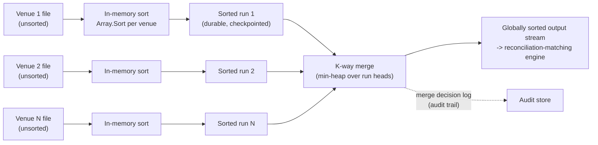
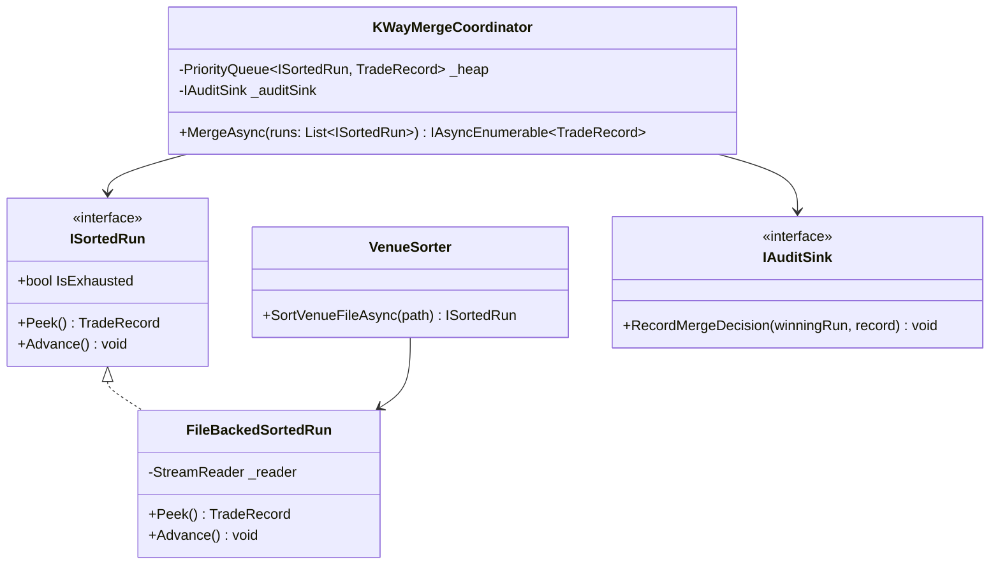
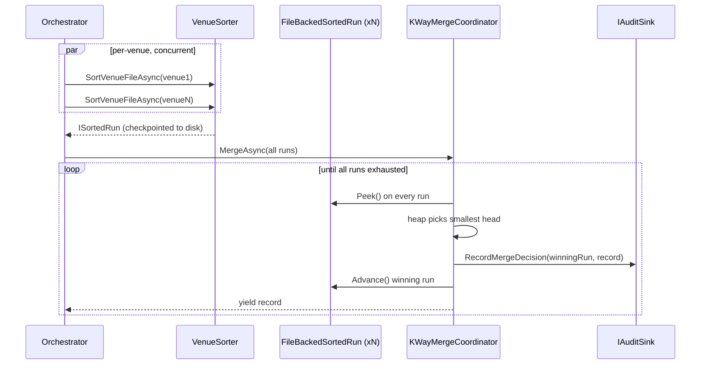
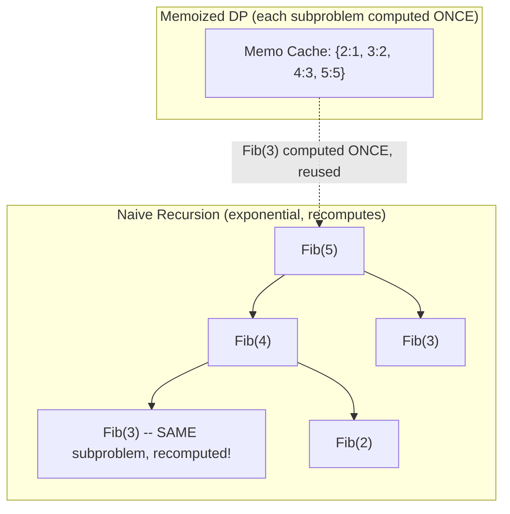
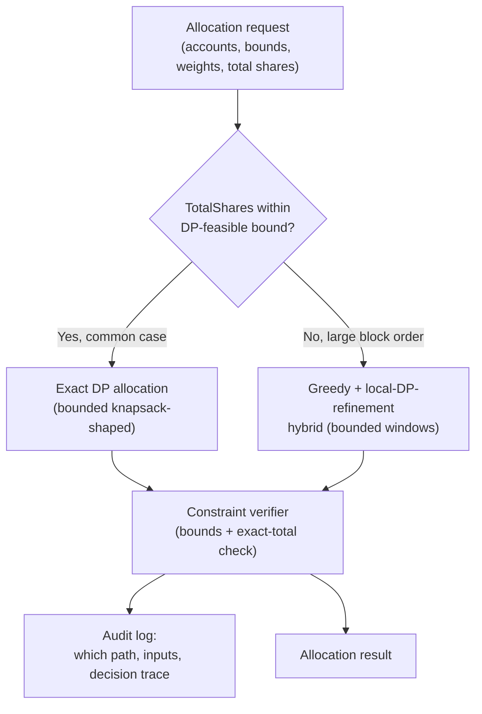
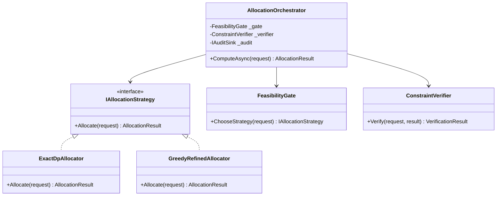
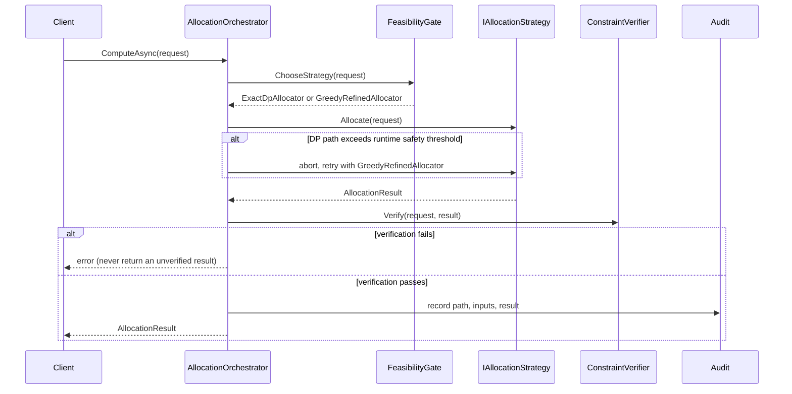

# Algorithms — Complete Interview Prep (All Topics, One File)

> Domain: Algorithms | Level: Beginner → Expert | Prerequisite: [[../12-Data-Structures/01-Data-Structures-Interview-Prep]] (structures, graphs, heaps, union-find)
> **Quick-prep edition** (consolidated 2026-10-03). This one file replaces Modules 35–36. Originals: `git show ebb2d5c:13-Algorithms/<file>.md`
> Each topic has: **Key concepts → C# code → Most common interview questions with answers.**

| # | Topic | # | Topic |
|---|---|---|---|
| 1 | Complexity analysis (Big-O) | 8 | Recursion & backtracking |
| 2 | Sorting algorithms & .NET's sort | 9 | Graph algorithms recap |
| 3 | Binary search (and on the answer space) | 10 | Dynamic programming |
| 4 | Two pointers | 11 | Greedy algorithms |
| 5 | Sliding window | 12 | Bit manipulation & math tricks |
| 6 | Prefix sums & hashing patterns | 13 | Pattern recognition table + interview execution |
| 7 | Divide & conquer | 14 | Top 30 rapid-fire + Principal · 15 Mistakes checklist |

---

## 1. Complexity Analysis (Big-O)

| Class | Name | Example | n = 1,000,000 feasible? |
|---|---|---|---|
| O(1) | constant | hash lookup, array index | ✅ |
| O(log n) | logarithmic | binary search, balanced BST | ✅ (~20 steps) |
| O(n) | linear | single scan | ✅ |
| O(n log n) | linearithmic | sorting, heap of n items | ✅ (~20M ops) |
| O(n²) | quadratic | nested loops, naive pair checks | ❌ (10¹² ops) |
| O(2ⁿ) | exponential | all subsets | ❌ beyond n ≈ 25 |
| O(n!) | factorial | all permutations | ❌ beyond n ≈ 10 |

**Key concepts**
- Big-O = upper bound on growth; Θ = tight bound; Ω = lower bound. Interviews mean "worst case unless stated".
- **Drop constants and lower terms**: O(3n + 10) = O(n). Different inputs keep separate variables: O(n + m), O(n·m).
- **Amortized** cost: average over a sequence (`List.Add`). **Average vs worst case**: quicksort O(n log n) average, O(n²) worst.
- **Space complexity** includes recursion stack depth.
- Rough guide: ~10⁸ simple operations per second → choose an algorithm from the input size.
- **Master theorem** for divide & conquer: T(n) = aT(n/b) + f(n) → e.g., merge sort T(n)=2T(n/2)+O(n) = O(n log n).

**Common interview questions**

**Q1. What's the complexity of this nested loop: `for i in n: for j in i..n`?**
About n²/2 iterations → O(n²). Constants drop; the shape still grows quadratically.

**Q2. What does amortized O(1) mean?**
Occasional expensive operations (resizing an array) are spread across many cheap ones, so the average per operation over any sequence is constant, even though one call may be O(n).

**Q3. How do you pick an algorithm from the input size?**
n ≤ 20 → exponential or backtracking is OK; n ≤ 10⁴ → O(n²) can work; n ≤ 10⁶ → need O(n log n) or O(n); n ≥ 10⁸ → O(n) streaming or O(log n), or distribute the work.

---

## 2. Sorting Algorithms & .NET's Sort

| Algorithm | Best | Average | Worst | Space | Stable | Notes |
|---|---|---|---|---|---|---|
| Bubble / insertion | O(n) | O(n²) | O(n²) | O(1) | ✅ | insertion sort is great for tiny or nearly sorted data |
| Selection | O(n²) | O(n²) | O(n²) | O(1) | ❌ | minimal swaps |
| **Merge sort** | O(n log n) | O(n log n) | O(n log n) | O(n) | ✅ | external sorting, linked lists, LINQ `OrderBy` (stable) |
| **Quicksort** | O(n log n) | O(n log n) | O(n²) | O(log n) | ❌ | in place, cache-friendly; bad pivots → worst case |
| **Heapsort** | O(n log n) | O(n log n) | O(n log n) | O(1) | ❌ | guaranteed bound |
| **Introsort** (.NET `Array.Sort`/`List.Sort`) | — | O(n log n) | O(n log n) | O(log n) | ❌ | quicksort → heapsort if recursion is too deep → insertion sort for small partitions |
| Counting / radix / bucket | O(n + k) | O(n + k) | O(n + k) | O(n + k) | ✅ | integers/keys in a small range; not comparison-based |

**Key concepts**
- **Stability:** equal keys keep their original relative order — matters for multi-key sorts (sort by date, then stably by customer).
- `Array.Sort`/`List<T>.Sort` are **unstable** (introsort); **LINQ `OrderBy`/`ThenBy` are stable**.
- The comparison-sort lower bound is Ω(n log n).
- **External merge sort** for data larger than memory: sort chunks that fit in RAM, write runs to disk, k-way merge with a heap.

```csharp
// Merge sort (stable)
int[] MergeSort(int[] a)
{
    if (a.Length <= 1) return a;
    int mid = a.Length / 2;
    var left = MergeSort(a[..mid]); var right = MergeSort(a[mid..]);
    var res = new int[a.Length]; int i = 0, j = 0, k = 0;
    while (i < left.Length && j < right.Length) res[k++] = left[i] <= right[j] ? left[i++] : right[j++]; // <= keeps it stable
    while (i < left.Length) res[k++] = left[i++];
    while (j < right.Length) res[k++] = right[j++];
    return res;
}

// Quicksort (Lomuto partition, random pivot to avoid the worst case)
void QuickSort(int[] a, int lo, int hi)
{
    if (lo >= hi) return;
    int p = Random.Shared.Next(lo, hi + 1); (a[p], a[hi]) = (a[hi], a[p]);
    int pivot = a[hi], i = lo;
    for (int j = lo; j < hi; j++) if (a[j] < pivot) { (a[i], a[j]) = (a[j], a[i]); i++; }
    (a[i], a[hi]) = (a[hi], a[i]);
    QuickSort(a, lo, i - 1); QuickSort(a, i + 1, hi);
}

// Multi-key sort in .NET: stable LINQ
var sorted = trades.OrderBy(t => t.Date).ThenByDescending(t => t.Amount).ToList();

// Custom comparer
trades.Sort((a, b) => a.Date.CompareTo(b.Date) is var c and not 0 ? c : b.Amount.CompareTo(a.Amount));

// Quickselect: k-th smallest in O(n) average (no full sort)
```

**Common interview questions**

**Q1. Which algorithm does .NET's `Array.Sort` use?**
Introsort: quicksort with median-of-three pivots, switching to heapsort when the recursion depth exceeds ~2·log n (guaranteeing O(n log n)), and insertion sort for small partitions. It's unstable. LINQ `OrderBy` uses a stable sort.

**Q2. What is sort stability and when does it matter?**
A stable sort keeps equal elements in their original order. It matters when sorting by multiple keys in passes, or when the existing order carries meaning (e.g., arrival time). A bug example: sorting payments by status with an unstable sort scrambles their prior time order.

**Q3. Merge sort vs quicksort?**
Merge sort: guaranteed O(n log n), stable, needs O(n) extra space; good for linked lists and external sorting. Quicksort: in place and usually faster thanks to cache locality, but O(n²) worst case without good pivots, and unstable.

**Q4. How do you sort 100 GB of data with 4 GB of RAM?**
External merge sort: read 4 GB chunks, sort each in memory, write sorted runs to disk, then k-way merge the runs with a min-heap, streaming the output. Or use a distributed sort (Spark).

**Q5. When can you beat O(n log n)?**
When keys have a limited range or structure: counting sort (small integer ranges), radix sort (fixed-width keys), bucket sort (uniformly distributed values) — O(n + k).

---

## 3. Binary Search (and on the Answer Space)

**Key concepts**
- Requires a **sorted** (or monotonic) search space → O(log n).
- Classic bugs: `mid = (lo + hi) / 2` overflow → `lo + (hi - lo) / 2`; off-by-one loop conditions; infinite loops.
- Variants: first/last occurrence (lower/upper bound), insertion point, rotated sorted array, peak element.
- **Binary search on the answer:** when you can check "is answer x feasible?" and feasibility is monotonic (min capacity to ship in D days, min rate, max minimal distance) → search over x.
- .NET: `Array.BinarySearch` returns the bitwise complement of the insertion point when not found; `List<T>.BinarySearch`.

```csharp
// Lower bound: first index with a[i] >= target
int LowerBound(int[] a, int target)
{
    int lo = 0, hi = a.Length;                    // [lo, hi)
    while (lo < hi)
    {
        int mid = lo + (hi - lo) / 2;             // overflow-safe
        if (a[mid] < target) lo = mid + 1; else hi = mid;
    }
    return lo;
}

// Search in a rotated sorted array
int SearchRotated(int[] a, int t)
{
    int lo = 0, hi = a.Length - 1;
    while (lo <= hi)
    {
        int mid = lo + (hi - lo) / 2;
        if (a[mid] == t) return mid;
        if (a[lo] <= a[mid]) { if (t >= a[lo] && t < a[mid]) hi = mid - 1; else lo = mid + 1; }   // left half sorted
        else { if (t > a[mid] && t <= a[hi]) lo = mid + 1; else hi = mid - 1; }                   // right half sorted
    }
    return -1;
}

// Binary search on the answer: minimum daily capacity to ship all packages within D days
int ShipWithinDays(int[] weights, int days)
{
    int lo = weights.Max(), hi = weights.Sum();
    while (lo < hi)
    {
        int cap = lo + (hi - lo) / 2;
        int need = 1, load = 0;
        foreach (var w in weights) { if (load + w > cap) { need++; load = 0; } load += w; }
        if (need <= days) hi = cap; else lo = cap + 1;
    }
    return lo;
}
```

**Common interview questions**

**Q1. What's the most common binary search bug?**
Overflow in `(lo + hi) / 2` for large indices, and inconsistent bounds (`<` vs `<=`, `hi = mid` vs `mid - 1`) causing infinite loops or missed elements. Pick one convention (half-open `[lo, hi)`) and stick to it.

**Q2. What does "binary search on the answer" mean?**
If you can test whether a candidate answer x works, and feasibility is monotonic in x, binary-search x over its possible range instead of searching the data — e.g., the minimum server capacity that meets an SLA, or the minimum ship capacity.

**Q3. Binary search on unsorted data?**
It doesn't work — the precondition is monotonicity. Sort first (O(n log n)) only if you'll search many times; for a single search, a linear scan is O(n) and better.

---

## 4. Two Pointers

**Key concepts**
- Two indices moving through data (from both ends or at different speeds) → often turns O(n²) into O(n).
- Uses: pair sums in sorted arrays, removing duplicates in place, palindromes, merging sorted arrays, container with most water, 3-sum (sort + two pointers → O(n²)), linked-list fast/slow pointers.

```csharp
// Pair with a target sum in a sorted array
(int, int)? PairSum(int[] a, int target)
{
    int i = 0, j = a.Length - 1;
    while (i < j)
    {
        int s = a[i] + a[j];
        if (s == target) return (i, j);
        if (s < target) i++; else j--;
    }
    return null;
}

// Remove duplicates from a sorted array in place, return the new length
int Dedupe(int[] a)
{
    if (a.Length == 0) return 0;
    int w = 1;
    for (int r = 1; r < a.Length; r++) if (a[r] != a[w - 1]) a[w++] = a[r];
    return w;
}

// Valid palindrome ignoring non-alphanumerics
bool IsPalindrome(string s)
{
    int i = 0, j = s.Length - 1;
    while (i < j)
    {
        if (!char.IsLetterOrDigit(s[i])) { i++; continue; }
        if (!char.IsLetterOrDigit(s[j])) { j--; continue; }
        if (char.ToLowerInvariant(s[i++]) != char.ToLowerInvariant(s[j--])) return false;
    }
    return true;
}

// 3-sum (unique triplets summing to 0): sort + two pointers, O(n²)
List<int[]> ThreeSum(int[] a)
{
    Array.Sort(a); var res = new List<int[]>();
    for (int i = 0; i < a.Length - 2; i++)
    {
        if (i > 0 && a[i] == a[i - 1]) continue;
        int l = i + 1, r = a.Length - 1;
        while (l < r)
        {
            int s = a[i] + a[l] + a[r];
            if (s == 0) { res.Add([a[i], a[l], a[r]]); while (l < r && a[l] == a[l + 1]) l++; l++; r--; }
            else if (s < 0) l++; else r--;
        }
    }
    return res;
}
```

**Common interview question**

**Q. When does two pointers apply?**
When the data is sorted (or can be) and a monotonic decision tells you which pointer to move, or when you're processing a sequence in place with a read and a write cursor. It removes the inner loop of a brute-force pair search.

---

## 5. Sliding Window

**Key concepts**
- Maintain a window `[left, right]` over an array or string, expanding right and shrinking left while maintaining a condition → O(n).
- **Fixed size** (moving average, max sum of k elements) vs **variable size** (longest substring without repeats, smallest subarray with sum ≥ target, at most k distinct characters).
- State in the window: running sum, frequency map, counts, a deque for the max.
- Real systems: rate limiting (sliding-window counters), streaming analytics (moving averages), fraud velocity checks (transactions in the last 10 minutes).

```csharp
// Max sum of any k consecutive elements (fixed window)
int MaxSumK(int[] a, int k)
{
    int sum = a.Take(k).Sum(), best = sum;
    for (int i = k; i < a.Length; i++) { sum += a[i] - a[i - k]; best = Math.Max(best, sum); }
    return best;
}

// Smallest subarray length with sum >= target (variable window, positive numbers)
int MinLen(int[] a, int target)
{
    int left = 0, sum = 0, best = int.MaxValue;
    for (int right = 0; right < a.Length; right++)
    {
        sum += a[right];
        while (sum >= target) { best = Math.Min(best, right - left + 1); sum -= a[left++]; }
    }
    return best == int.MaxValue ? 0 : best;
}

// Longest substring with at most k distinct characters
int LongestKDistinct(string s, int k)
{
    var count = new Dictionary<char, int>(); int left = 0, best = 0;
    for (int right = 0; right < s.Length; right++)
    {
        count[s[right]] = count.GetValueOrDefault(s[right]) + 1;
        while (count.Count > k)
        {
            if (--count[s[left]] == 0) count.Remove(s[left]);
            left++;
        }
        best = Math.Max(best, right - left + 1);
    }
    return best;
}
```

**Common interview question**

**Q. How do you recognise a sliding-window problem?**
"Longest/shortest/maximum **contiguous** subarray or substring satisfying a condition", where the condition can be updated incrementally as the window grows and shrinks. It turns O(n²) "check every subarray" into O(n). It doesn't work for variable windows when negative numbers break monotonicity (use prefix sums + a hash map instead).

---

## 6. Prefix Sums & Hashing Patterns

**Key concepts**
- **Prefix sum** `P[i] = a[0] + … + a[i-1]` → range sums in O(1); 2D prefix sums for matrices.
- **Subarray sum equals k** (with negatives): count prefix sums in a hash map → O(n).
- **Difference arrays** for many range updates in O(1) each.
- Hashing patterns: complements (two-sum), frequency counting, grouping by a canonical key (anagrams), seen sets for duplicates and cycles.

```csharp
// Count subarrays summing to k (works with negative numbers)
int SubarraySum(int[] a, int k)
{
    var counts = new Dictionary<int, int> { [0] = 1 };
    int sum = 0, result = 0;
    foreach (var x in a)
    {
        sum += x;
        result += counts.GetValueOrDefault(sum - k);
        counts[sum] = counts.GetValueOrDefault(sum) + 1;
    }
    return result;
}

// Difference array: apply many +v to ranges, then materialize
int[] ApplyRanges(int n, (int L, int R, int V)[] updates)
{
    var diff = new int[n + 1];
    foreach (var (l, r, v) in updates) { diff[l] += v; diff[r + 1] -= v; }
    var res = new int[n]; int run = 0;
    for (int i = 0; i < n; i++) res[i] = run += diff[i];
    return res;
}
```

**Common interview question**

**Q. Why does "subarray sum equals k" need a hash map instead of a sliding window?**
With negative numbers, growing the window doesn't monotonically increase the sum, so you can't decide when to shrink it. Using prefix sums, a subarray (i, j] sums to k exactly when `P[j] − P[i] = k`; counting previously seen prefix sums gives the answer in one pass.

---

## 7. Divide & Conquer

**Key concepts**
- Split the problem into independent subproblems, solve them recursively, combine the results: merge sort, quicksort, binary search, closest pair of points, Karatsuba multiplication, fast exponentiation.
- Analyse with the master theorem. Parallelizes naturally (fork/join, MapReduce).
- Differs from DP: subproblems **don't overlap** (no memoization needed).

```csharp
// Fast exponentiation: O(log n)
long Pow(long b, long e, long mod)
{
    long result = 1; b %= mod;
    while (e > 0) { if ((e & 1) == 1) result = result * b % mod; b = b * b % mod; e >>= 1; }
    return result;
}

// Count inversions with merge sort: O(n log n)
long CountInversions(int[] a)
{
    if (a.Length < 2) return 0;
    int m = a.Length / 2; var l = a[..m]; var r = a[m..];
    long inv = CountInversions(l) + CountInversions(r);
    int i = 0, j = 0, k = 0;
    while (i < l.Length && j < r.Length)
        if (l[i] <= r[j]) a[k++] = l[i++]; else { a[k++] = r[j++]; inv += l.Length - i; }
    while (i < l.Length) a[k++] = l[i++];
    while (j < r.Length) a[k++] = r[j++];
    return inv;
}
```

**Common interview question**

**Q. How does divide & conquer relate to distributed processing?**
The same idea scales out: partition the data (map), process the partitions independently on many machines, then combine (reduce) — e.g., distributed sort, per-partition top-k merged at the end, or parallel aggregation.

---

## 8. Recursion & Backtracking

**Key concepts**
- **Recursion:** base case + reduction toward it. Each call uses stack space → deep recursion can overflow (C# has no tail-call guarantee) → use an explicit stack or iteration for deep inputs.
- **Backtracking:** build candidates incrementally; abandon ("prune") partial candidates that can't succeed. Template: choose → explore → un-choose.
- Problems: subsets, permutations, combinations, combination sum, N-Queens, Sudoku, word search, generating parentheses.
- Complexity is usually exponential → pruning matters.

```csharp
// All subsets (power set): O(2ⁿ · n)
List<List<int>> Subsets(int[] nums)
{
    var res = new List<List<int>>(); var cur = new List<int>();
    void Backtrack(int start)
    {
        res.Add([.. cur]);
        for (int i = start; i < nums.Length; i++) { cur.Add(nums[i]); Backtrack(i + 1); cur.RemoveAt(cur.Count - 1); }
    }
    Backtrack(0);
    return res;
}

// Permutations
List<List<int>> Permute(int[] nums)
{
    var res = new List<List<int>>(); var used = new bool[nums.Length]; var cur = new List<int>();
    void Go()
    {
        if (cur.Count == nums.Length) { res.Add([.. cur]); return; }
        for (int i = 0; i < nums.Length; i++)
        {
            if (used[i]) continue;
            used[i] = true; cur.Add(nums[i]); Go(); cur.RemoveAt(cur.Count - 1); used[i] = false;
        }
    }
    Go();
    return res;
}

// Combination sum with pruning (candidates can be reused)
List<List<int>> CombinationSum(int[] c, int target)
{
    Array.Sort(c); var res = new List<List<int>>(); var cur = new List<int>();
    void Go(int start, int remain)
    {
        if (remain == 0) { res.Add([.. cur]); return; }
        for (int i = start; i < c.Length && c[i] <= remain; i++)   // prune: sorted, stop early
        { cur.Add(c[i]); Go(i, remain - c[i]); cur.RemoveAt(cur.Count - 1); }
    }
    Go(0, target);
    return res;
}
```

**Common interview questions**

**Q1. Recursion vs iteration?**
Recursion is natural for trees, graphs and divide & conquer; iteration avoids stack overflow and call overhead. Any recursion can be converted with an explicit stack; prefer iteration for unbounded depth (deep linked structures, large graphs).

**Q2. How do you make backtracking feasible?**
Prune early (sort and stop when the remaining budget is exceeded; check constraints before recursing), order choices to fail fast, memoize repeated states (which turns it into DP), and bound the search space.

---

## 9. Graph Algorithms Recap

| Problem | Algorithm | Complexity |
|---|---|---|
| Traverse / connected components | BFS / DFS | O(V + E) |
| Shortest path, unweighted | BFS | O(V + E) |
| Shortest path, non-negative weights | Dijkstra (heap) | O((V + E) log V) |
| Shortest path, negative weights | Bellman-Ford | O(V·E) |
| All-pairs shortest paths | Floyd-Warshall | O(V³) |
| Dependency ordering | Topological sort (Kahn / DFS) | O(V + E) |
| Minimum spanning tree | Kruskal (sort + Union-Find) / Prim (heap) | O(E log E) |
| Cycle detection | DFS colours (directed), Union-Find (undirected) | O(V + E) |
| Bipartite check | BFS 2-colouring | O(V + E) |
| Strongly connected components | Tarjan / Kosaraju | O(V + E) |

Code for BFS, Dijkstra, topological sort and Union-Find: [[../12-Data-Structures/01-Data-Structures-Interview-Prep]] §9–§10.

**Common interview question**

**Q. How would you detect circular dependencies between microservices or build steps?**
Model them as a directed graph and run a topological sort (Kahn); leftover nodes with non-zero in-degree form cycles — or DFS with grey/black colouring to report the actual cycle path. Run it in CI on service manifests.

---

## 10. Dynamic Programming

**Key concepts**
- Use DP when a problem has **optimal substructure** (an optimal solution is built from optimal sub-solutions) **and overlapping subproblems** (the same subproblems recur).
- **Top-down (memoization):** recursion + cache; computes only needed states; easier to write; recursion depth limits.
- **Bottom-up (tabulation):** fill a table in dependency order; no recursion; easier to **optimize space** (keep only the last row).
- Recipe: **define the state** → **recurrence** → **base cases** → **order of computation** → **answer location** → optimize space.
- Archetypes:
  - 1D: Fibonacci/climbing stairs, house robber, coin change (min coins / number of ways), longest increasing subsequence (O(n log n) with patience sorting).
  - 2D grid: unique paths, minimum path sum.
  - Two sequences: **LCS**, **edit distance**, diff tools.
  - Knapsack: 0/1 knapsack, subset sum, partition equal subset.
  - Intervals: matrix-chain, burst balloons; DP on trees/graphs (longest path in a DAG).

```csharp
// Top-down memoization
long Fib(int n, Dictionary<int, long>? memo = null)
{
    memo ??= new();
    if (n <= 1) return n;
    if (memo.TryGetValue(n, out var v)) return v;
    return memo[n] = Fib(n - 1, memo) + Fib(n - 2, memo);
}

// Coin change: minimum coins (bottom-up), O(amount × coins)
int CoinChange(int[] coins, int amount)
{
    var dp = Enumerable.Repeat(int.MaxValue, amount + 1).ToArray(); dp[0] = 0;
    for (int x = 1; x <= amount; x++)
        foreach (var c in coins)
            if (c <= x && dp[x - c] != int.MaxValue) dp[x] = Math.Min(dp[x], dp[x - c] + 1);
    return dp[amount] == int.MaxValue ? -1 : dp[amount];
}

// 0/1 knapsack with a space-optimized 1D table (iterate capacity downward!)
int Knapsack(int[] w, int[] v, int cap)
{
    var dp = new int[cap + 1];
    for (int i = 0; i < w.Length; i++)
        for (int c = cap; c >= w[i]; c--)
            dp[c] = Math.Max(dp[c], dp[c - w[i]] + v[i]);
    return dp[cap];
}

// Longest common subsequence
int Lcs(string a, string b)
{
    var dp = new int[a.Length + 1, b.Length + 1];
    for (int i = 1; i <= a.Length; i++)
        for (int j = 1; j <= b.Length; j++)
            dp[i, j] = a[i - 1] == b[j - 1] ? dp[i - 1, j - 1] + 1 : Math.Max(dp[i - 1, j], dp[i, j - 1]);
    return dp[a.Length, b.Length];
}

// Edit distance (Levenshtein): fuzzy matching of names, e.g. sanctions screening
int EditDistance(string a, string b)
{
    var dp = new int[a.Length + 1, b.Length + 1];
    for (int i = 0; i <= a.Length; i++) dp[i, 0] = i;
    for (int j = 0; j <= b.Length; j++) dp[0, j] = j;
    for (int i = 1; i <= a.Length; i++)
        for (int j = 1; j <= b.Length; j++)
            dp[i, j] = a[i - 1] == b[j - 1] ? dp[i - 1, j - 1]
                     : 1 + Math.Min(dp[i - 1, j - 1], Math.Min(dp[i - 1, j], dp[i, j - 1]));
    return dp[a.Length, b.Length];
}

// Longest increasing subsequence in O(n log n)
int Lis(int[] a)
{
    var tails = new List<int>();
    foreach (var x in a)
    {
        int i = tails.BinarySearch(x); if (i < 0) i = ~i;
        if (i == tails.Count) tails.Add(x); else tails[i] = x;
    }
    return tails.Count;
}
```

**Common interview questions**

**Q1. DP vs divide & conquer vs greedy?**
Divide & conquer: independent subproblems. DP: overlapping subproblems, solved once and reused. Greedy: make the locally best choice without reconsidering — correct only when the greedy-choice property is proven.

**Q2. Memoization or tabulation?**
Memoization is quicker to write and only computes reachable states, but has recursion overhead and depth limits. Tabulation is iterative, often faster, and enables space optimization (rolling arrays). Use tabulation for large state spaces.

**Q3. How do you approach a new DP problem?**
Brute-force recursion first; spot repeated subproblems; define the state (what parameters identify a subproblem); write the recurrence and base cases; add memoization; convert to bottom-up and reduce space if needed; state the time = states × transitions.

**Q4. Why iterate capacity downward in the 1D knapsack?**
Each item may be used once. Going downward means `dp[c - w]` still holds the previous item's row; going upward would reuse the current item multiple times (that's the unbounded knapsack).

**Q5. Where does DP appear in real systems?**
Diff and merge tools (LCS), fuzzy name matching and spell check (edit distance), route and cost optimization, resource allocation (knapsack-like budgeting), and query optimizers choosing join orders.

---

## 11. Greedy Algorithms

**Key concepts**
- Make the best local choice at each step, never revisiting it. Correct only with the **greedy-choice property** + optimal substructure — **prove it** (exchange argument) or find a counterexample.
- Classic correct greedy: interval scheduling (sort by **end** time), activity selection, Huffman coding, Dijkstra, Prim/Kruskal, fractional knapsack, jump game, gas station, meeting rooms (min-heap of end times).
- Classic failure: coin change with arbitrary denominations ({1, 3, 4} for 6: greedy gives 4+1+1 = 3 coins, optimal is 3+3 = 2) and 0/1 knapsack.
- Verify greedy empirically against brute force on small random inputs.

```csharp
// Maximum non-overlapping meetings: sort by end time
int MaxMeetings((int Start, int End)[] m)
{
    int count = 0, lastEnd = int.MinValue;
    foreach (var (s, e) in m.OrderBy(x => x.End))
        if (s >= lastEnd) { count++; lastEnd = e; }
    return count;
}

// Minimum meeting rooms: min-heap of end times
int MinRooms((int Start, int End)[] m)
{
    var ends = new PriorityQueue<int, int>();
    foreach (var (s, e) in m.OrderBy(x => x.Start))
    {
        if (ends.Count > 0 && ends.Peek() <= s) ends.Dequeue();
        ends.Enqueue(e, e);
    }
    return ends.Count;
}

// Merge overlapping intervals
List<(int, int)> Merge((int S, int E)[] iv)
{
    var res = new List<(int S, int E)>();
    foreach (var cur in iv.OrderBy(x => x.S))
        if (res.Count > 0 && cur.S <= res[^1].E) res[^1] = (res[^1].S, Math.Max(res[^1].E, cur.E));
        else res.Add(cur);
    return res.Select(x => (x.S, x.E)).ToList();
}
```

**Common interview questions**

**Q1. How do you know a greedy solution is correct?**
Prove the greedy-choice property, typically with an exchange argument: take any optimal solution and show it can be transformed to include the greedy choice without getting worse. If you can't, test against brute force on small inputs — and look for counterexamples.

**Q2. Why sort by end time for interval scheduling?**
Choosing the meeting that ends earliest leaves the most room for the rest; any optimal schedule can swap its first meeting for the earliest-ending one without losing a meeting.

**Q3. Give a case where greedy fails.**
Coin change with denominations {1, 3, 4} for amount 6, or the 0/1 knapsack (taking the best value/weight ratio first can miss the optimum). Both need DP.

---

## 12. Bit Manipulation & Math Tricks

```csharp
bool IsPowerOfTwo(long n) => n > 0 && (n & (n - 1)) == 0;
int CountBits(uint x) => System.Numerics.BitOperations.PopCount(x);
int SingleNumber(int[] a) => a.Aggregate(0, (acc, x) => acc ^ x);       // every other number appears twice
bool HasFlag(int perms, int flag) => (perms & flag) != 0;                // bitmask permissions
int SetBit(int x, int i) => x | (1 << i);  int ClearBit(int x, int i) => x & ~(1 << i);
long Gcd(long a, long b) => b == 0 ? a : Gcd(b, a % b);
// Modular arithmetic for large results: (a * b) % mod using long; fast exponentiation (§7)
// Reservoir sampling: pick k random items from a stream of unknown length in O(k) memory
```

**Common interview question**

**Q. Where is bit manipulation useful outside puzzles?**
Permission flags (`[Flags]` enums), Bloom filters and bitmaps (Redis `SETBIT` for daily-active users), hashing, compact state encoding in DP (bitmask DP over subsets), and low-level protocol parsing.

---

## 13. Pattern Recognition Table + Interview Execution

| If the problem says… | Think… |
|---|---|
| sorted array, find a target or boundary | binary search |
| min/max value satisfying a monotonic condition | binary search on the answer |
| pair/triplet with a sum, in place, palindrome | two pointers |
| longest/shortest contiguous subarray or substring | sliding window |
| subarray sum with negatives, range sums | prefix sums + hash map |
| top/bottom k, k-th largest, merge k sorted | heap (or quickselect) |
| next greater/smaller element | monotonic stack |
| all combinations/permutations/subsets | backtracking |
| count ways / min cost / optimal, with overlapping choices | dynamic programming |
| intervals, scheduling | sort + greedy (or heap) |
| shortest path, unweighted grid | BFS |
| dependencies, ordering | topological sort |
| connectivity, grouping, cycles (undirected) | union-find |
| prefix matching, autocomplete | trie |
| frequency, duplicates, complements | hash map/set |

**Interview execution (what's actually graded)**
1. **Clarify:** inputs, sizes, edge cases (empty, duplicates, negatives, overflow), expected output format.
2. **Example:** walk through a small example by hand.
3. **Brute force first**, state its complexity, then **optimize** with a pattern above.
4. **Talk while coding**; name variables clearly; handle edge cases.
5. **Test** with your example and edge cases; trace the code.
6. **State time and space complexity**, and mention trade-offs or production concerns (streaming input, memory limits, concurrency).

---

## 14. Top 30 Rapid-Fire Questions + Principal Questions

1. **Big-O of binary search?** O(log n).
2. **Comparison sort lower bound?** Ω(n log n).
3. **.NET `Array.Sort`?** Introsort, unstable.
4. **Stable sort in .NET?** LINQ `OrderBy`.
5. **Quicksort worst case?** O(n²) with bad pivots.
6. **Merge sort space?** O(n).
7. **Heapsort?** O(n log n), O(1) space, unstable.
8. **Data bigger than RAM?** External merge sort.
9. **Linear-time sorts?** Counting, radix, bucket.
10. **Binary search overflow fix?** `lo + (hi - lo) / 2`.
11. **Lower bound?** First index ≥ target.
12. **Two pointers precondition?** Usually sorted data.
13. **Sliding window use?** Contiguous ranges with incremental conditions.
14. **Negatives + subarray sum?** Prefix sums + hash map.
15. **Top-k?** Heap of size k.
16. **k-th smallest, average O(n)?** Quickselect.
17. **Backtracking template?** Choose, explore, un-choose.
18. **Recursion risk?** Stack overflow → iterate.
19. **DP conditions?** Optimal substructure + overlapping subproblems.
20. **Memoization vs tabulation?** Top-down cache vs bottom-up table.
21. **LCS / edit distance?** 2D DP, O(n·m).
22. **LIS fast?** O(n log n) with binary search.
23. **0/1 knapsack?** DP, iterate capacity downward.
24. **Greedy proof?** Exchange argument.
25. **Interval scheduling?** Sort by end time.
26. **Unweighted shortest path?** BFS.
27. **Dijkstra limitation?** No negative weights.
28. **Cycle in dependencies?** Topological sort fails.
29. **Power of two?** `n & (n-1) == 0`.
30. **Interview first step?** Clarify, then brute force, then optimize.

**Principal-level questions**

**P1. When is the "optimal" algorithm the wrong choice?**
When n is small and a simpler O(n²) solution is clearer and fast enough; when the optimal algorithm is hard to maintain or verify; when constant factors and cache behaviour dominate; when data arrives as a stream (you need online algorithms); or when an approximate answer (sampling, sketches) meets the business need far more cheaply.

**P2. How do algorithms show up in production systems you'd design?**
Rate limiters (sliding windows, token buckets), schedulers (heaps), dependency resolution (topological sort), fraud rings (graph components), fuzzy matching in sanctions screening (edit distance), reconciliation (sort-merge joins of large files), pagination (keyset with binary-search-like seeks), and consistent hashing for sharding.

**P3. How do you evaluate a candidate in a coding round at senior level?**
Clarifying questions, structured approach (brute force → optimization), correct complexity analysis, clean readable code, self-testing with edge cases, and the ability to discuss production concerns — not memorized trick solutions.

---

## 15. Mistakes Checklist (say why each is wrong)
- [ ] Jumping into code without clarifying requirements and edge cases
- [ ] Not stating complexity · confusing average with worst case
- [ ] Binary search overflow and off-by-one errors · binary search on unsorted data
- [ ] Assuming `Array.Sort` is stable · sorting the whole dataset for top-k
- [ ] Sliding window with negative numbers · forgetting to shrink the window
- [ ] Deep recursion without considering stack depth
- [ ] Greedy without proof (coin change with odd denominations) · DP without defining the state clearly
- [ ] Iterating capacity upward in a 0/1 knapsack · not optimizing DP space when needed
- [ ] Not testing with empty input, a single element, duplicates or large values

---

## Architecture Diagrams (preserved from the original modules)

> All 8 Mermaid/ASCII diagrams from the original `13-Algorithms/` files, kept verbatim and grouped by source module. Originals: `git show ebb2d5c:13-Algorithms/<file>.md`.

### Module 35 — Algorithms: Sorting, Searching & Complexity Analysis
*Source: `01-Sorting-Searching-Complexity.md`*

**3. Visual Architecture**

```mermaid
graph TB
 Sort["Array.Sort call"] --> Check{Recursion depth<br/>exceeds log(n) threshold?}
 Check -->|No, normal case| QS["Quicksort partitioning<br/>(in-place, avg O(n log n))"]
 Check -->|Yes, pathological case detected| HS["Fallback: Heapsort<br/>(guarantees O(n log n) worst-case)"]
 QS --> Small{Subarray size<br/>below threshold?}
 Small -->|Yes| IS["Insertion Sort<br/>(lower constant factor for small n)"]
 Small -->|No| QS
```

**12. System Design**



**13. Low-Level Design**



**13. Low-Level Design**



### Module 36 — Algorithms: Dynamic Programming & Greedy Algorithms
*Source: `02-Dynamic-Programming-Greedy.md`*

**3. Visual Architecture**



**12. System Design**



**13. Low-Level Design**



**13. Low-Level Design**


