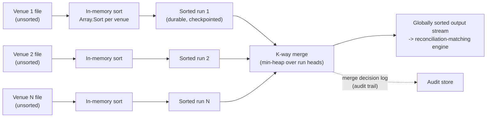
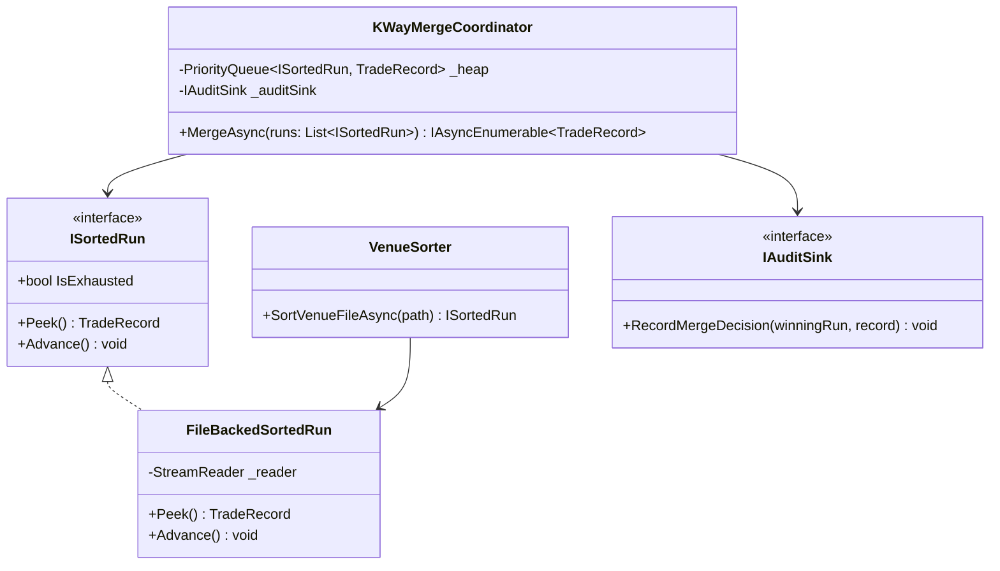
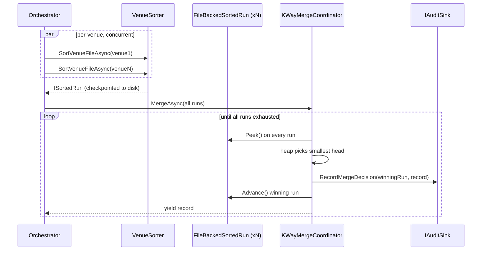

# Module 35 — Algorithms: Sorting, Searching & Complexity Analysis

> Domain: Algorithms | Level: Beginner → Expert | Prerequisite: [[../12-Data-Structures/01-Core-Data-Structures]], [[../12-Data-Structures/02-Graphs-Tries-Union-Find]]

---

## 1. Fundamentals

### What is complexity analysis, and why does sorting/searching remain a foundational interview topic?
**Complexity analysis** (Big-O notation) describes how an algorithm's running time/space grows as input size grows, abstracting away hardware-specific constants to focus on **asymptotic** behavior — the property that determines whether an algorithm remains viable as data scales, directly the same underlying concern as the data-structure-choice discussion, now applied to the *algorithms* operating over those structures. Sorting/searching remain foundational specifically because they're the simplest possible vehicle for teaching and testing the core skill of *reasoning about complexity trade-offs precisely* — a skill that generalizes far beyond sorting itself.

### Why does this matter?
Understanding *why* a given sorting algorithm has its specific complexity (not just memorizing "quicksort is O(n log n) average case") is what lets an engineer reason correctly about novel algorithmic problems they haven't seen before — the actual skill Staff/Principal interviews are testing via sorting/searching questions, not sorting-algorithm trivia for its own sake.

### When does this matter?
Any performance-sensitive code processing collections; the depth matters for correctly choosing between.NET's built-in sort (and understanding its actual hybrid algorithm) versus a specialized approach, and for recognizing when binary search's O(log n) applies (and its surprisingly common precondition violations).

### How does it work (30,000-ft view)?
```csharp
Array.Sort(items); // O(n log n) --.NET's introsort: quicksort, falling back to heapsort if recursion gets too deep
int index = Array.BinarySearch(sortedItems, target); // O(log n) -- REQUIRES items already sorted
```

---

## 2. Deep Dive

### 2.1.NET's Built-In Sort — Introsort, Not "Just Quicksort"
`Array.Sort`/`List<T>.Sort` use **introsort** (introspective sort) — a hybrid algorithm starting with quicksort (fast average case, O(n log n)), but **switching to heapsort** if the recursion depth exceeds a threshold based on `log n` (detecting quicksort's pathological O(n²) worst case, typically triggered by an already-sorted or adversarially-crafted input against a naive pivot-selection strategy), and switching to **insertion sort** for small subarrays (below a size threshold, since insertion sort's low constant-factor overhead outperforms quicksort's recursive overhead for small n) — this three-algorithm hybrid is precisely why "is `Array.Sort` O(n log n) worst-case or O(n²) worst-case" has a nuanced, correct answer (O(n log n) worst-case, specifically **because** of the heapsort fallback closing quicksort's classic worst-case vulnerability) that a candidate reciting "quicksort is O(n²) worst case" without knowing about introsort would get wrong for.NET's actual behavior.

### 2.2 Stability — a Frequently-Overlooked Sorting Property
A **stable** sort preserves the relative order of elements considered equal by the comparison — critical for multi-key sorting (sort by last name, then by first name among ties, expecting the first-name sort to preserve the already-established last-name grouping) and for any UI "sort by column, click again to sort by a different column while preserving prior grouping" feature. `List<T>.Sort`/`Array.Sort` are **not guaranteed stable** (their introsort implementation can reorder equal elements) — `OrderBy`/`OrderByDescending` (LINQ) **are** guaranteed stable — this is a genuine, practical, easy-to-get-wrong distinction between superficially-similar sorting APIs in the same framework.

### 2.3 Binary Search — the Precondition Everyone Forgets, and the Off-By-One Everyone Gets Wrong
Binary search's O(log n) guarantee has **exactly one precondition**: the input must already be **sorted** (with respect to the comparison being used) — running binary search on unsorted data produces a silently incorrect result (not an exception), a genuinely dangerous failure mode since it doesn't fail loudly. The classic implementation bug: `mid = (low + high) / 2` can **overflow** for very large arrays (`low + high` exceeding `int.MaxValue` before the division) — the standard, correct fix is `mid = low + (high - low) / 2`, avoiding the intermediate overflow entirely — a small, specific detail that's a genuine, real historical bug class (famously discussed in a well-known Google Research blog post about this exact bug persisting undetected in binary search implementations for decades across many codebases).

### 2.4 Divide-and-Conquer — the Recurring Pattern Underlying Merge Sort, Quicksort, and Binary Search
All three algorithms share the **divide-and-conquer** paradigm: split the problem into smaller subproblems, solve recursively, combine results — merge sort splits unconditionally in half and does its "work" during the **combine** (merge) step (making it stable and O(n log n) *worst-case*, at the cost of O(n) auxiliary space); quicksort splits based on a pivot and does its "work" during the **divide** (partition) step (making it in-place, O(1) auxiliary space beyond the recursion stack, but average-case O(n log n) with a possible O(n²) worst case absent introsort's safeguard); binary search is divide-and-conquer degenerated to **always discarding one half entirely** rather than recursing into both. Recognizing this shared structural pattern — not memorizing three unrelated algorithms — is what lets an engineer derive a new divide-and-conquer algorithm for a novel problem in an interview, rather than only recognizing the three canonical examples.

### 2.5 Time-Space Trade-offs — Merge Sort's Space Cost vs Quicksort's In-Place Advantage
Merge sort's guaranteed O(n log n) worst-case and stability come at the cost of O(n) auxiliary space (needing a temporary array during merging) — a genuine, real trade-off against quicksort's O(1) auxiliary space (beyond the recursion call stack, itself O(log n) for a well-balanced partition) but weaker (average-case-only, without introsort's fallback) worst-case guarantee — precisely why introsort's hybrid design exists: it seeks quicksort's typical in-place efficiency while structurally eliminating its worst-case vulnerability via the heapsort fallback, rather than simply always using merge sort's safer-but-more-memory-hungry guarantee.

## 3. Visual Architecture
```mermaid
graph TB
 Sort["Array.Sort call"] --> Check{Recursion depth<br/>exceeds log(n) threshold?}
 Check -->|No, normal case| QS["Quicksort partitioning<br/>(in-place, avg O(n log n))"]
 Check -->|Yes, pathological case detected| HS["Fallback: Heapsort<br/>(guarantees O(n log n) worst-case)"]
 QS --> Small{Subarray size<br/>below threshold?}
 Small -->|Yes| IS["Insertion Sort<br/>(lower constant factor for small n)"]
 Small -->|No| QS
```

## 4. Production Example
**Scenario**: A reporting feature displaying a paginated, sortable grid (sort by date, then click a column header to sort by a secondary field) exhibited a confusing bug: sorting by "status" after already having sorted by "date" appeared to **discard** the date-based grouping entirely, scrambling records that should have remained grouped by date within each status — QA initially assumed the sort logic itself was buggy. **Investigation**: traced to the reporting code using `list.Sort((a, b) => a.Status.CompareTo(b.Status))` (an in-place `List<T>.Sort` call) for the secondary sort, rather than `list.OrderBy(x => x.Status)` — `List<T>.Sort`'s underlying introsort implementation is **not stable**, so elements with equal `Status` values were reordered arbitrarily relative to each other, destroying the previously-established date-based ordering among status-tied records. **Fix**: replaced `List<T>.Sort` with LINQ's `OrderBy`/`ThenBy` (`list = list.OrderBy(x => x.Date).ThenBy(x => x.Status).ToList`), both guaranteed stable, correctly preserving intended multi-key sort semantics. **Lesson**: `List<T>.Sort`/`Array.Sort`'s lack of stability is a genuine, easy-to-miss functional bug source for any multi-key sorting requirement, not merely a performance/style consideration — always use `OrderBy`/`ThenBy` (or verify a specific stability guarantee) whenever preserving relative order among equal elements is a genuine requirement, exactly the kind of subtle API-behavior distinction (directly paralleling the Controllers-vs-Minimal-APIs binding-inference mismatch) that silently produces wrong output rather than an obvious error.
## 10. Interview Questions

### Basic (10)
1. **Q: What is Big-O notation used for?** **A:** Describing how an algorithm's running time/space grows as input size grows, abstracting away hardware-specific constants.
2. **Q: What is the average-case time complexity of quicksort?** **A:** O(n log n) average with excellent constants (in-place, cache-friendly partitioning), but O(n²) worst case on adversarial/sorted input with poor pivot choice — which is why production sorts (introsort) switch to heapsort when recursion depth signals the degenerate case.
3. **Q: What is a stable sort?** **A:** One that preserves the relative order of elements considered equal by the comparison.
4. **Q: Is `Array.Sort` stable?** **A:** No — it uses introsort (quicksort/heapsort/insertion-sort hybrid), which does not preserve the relative order of equal elements; if stability matters, use LINQ's `OrderBy` or sort by a composite key that breaks ties explicitly.
5. **Q: Is LINQ's `OrderBy` stable?** **A:** Yes — equal keys preserve their source order (documented behavior, implemented via original-index tiebreaking), which is what makes incremental `OrderBy(...).ThenBy(...)` composition and "sort by one column, keep prior order within ties" UI behavior correct.
6. **Q: What is the precondition for binary search to work correctly?** **A:** The input must already be sorted with respect to the comparison used.
7. **Q: What is the time complexity of binary search?** **A:** O(log n) — each comparison halves the remaining search space; the precondition is a *sorted* input with random access, which is why binary search over an unsorted or linked structure is either wrong or loses its advantage.
8. **Q: What sorting algorithm does.NET's `Array.Sort` actually use?** **A:** Introsort — a hybrid of quicksort, heapsort, and insertion sort.
9. **Q: What is merge sort's auxiliary space complexity?** **A:** O(n) — the merge step needs a temporary buffer the size of the input; that extra space is the price of merge sort's guaranteed O(n log n) worst case and natural stability, versus quicksort's in-place partitioning.
10. **Q: What is the classic integer-overflow bug in binary search implementations?** **A:** Computing `mid = (low + high) / 2`, where `low + high` can overflow for large arrays.

### Intermediate (10)
1. **Q: Why is quicksort's worst case O(n²), and what input triggers it for a naive implementation?** **A:** A poor pivot choice (e.g., always picking the first/last element) against already-sorted or adversarially-crafted input produces maximally-unbalanced partitions (one side empty, the other n-1 elements), degenerating recursion depth to O(n) and total work to O(n²).
2. **Q: How does introsort close quicksort's worst-case vulnerability without sacrificing its typical-case performance?** **A:** It monitors recursion depth during quicksort's execution and falls back to heapsort (guaranteed O(n log n) regardless of input) only if depth exceeds a threshold indicating the pathological case has been triggered — retaining quicksort's fast, in-place typical-case behavior while eliminating its O(n²) worst case entirely.
3. **Q: Why does `List<T>.Sort`'s lack of stability matter for correctness, not just performance?** **A:** For any multi-key sort relying on a prior sort's ordering being preserved among ties, an unstable sort can silently scramble the intended secondary ordering, producing functionally incorrect output rather than merely a slower-than-optimal one.
4. **Q: Why does `low + (high - low) / 2` avoid the overflow that `(low + high) / 2` risks?** **A:** `high - low` is bounded by the array's actual size (never exceeding it), so adding it to `low` (already a valid, in-bounds index) cannot overflow, whereas `low + high` can exceed `int.MaxValue` if both are large, independent of the array's actual bounded size.
5. **Q: Why is merge sort's O(n) auxiliary space a genuine trade-off, not a strictly inferior property compared to quicksort's in-place approach?** **A:** It buys merge sort a guaranteed O(n log n) worst case and stability — properties quicksort alone doesn't have (without introsort's added complexity) — a real, deliberate trade-off between guaranteed complexity/stability versus memory footprint, not simply "quicksort is better."
6. **Q: Why would you choose insertion sort for small subarrays even though it's O(n²) in general?** **A:** For small n, insertion sort's low constant-factor overhead (simple, cache-friendly, no recursive call overhead) outperforms the recursive overhead of quicksort/merge sort at that scale — exactly why introsort switches to it below a size threshold rather than recursing all the way down.
7. **Q: Why is running binary search on unsorted data dangerous specifically because it fails silently?** **A:** It doesn't throw an exception or produce an obviously-wrong result pattern — it simply may or may not find an existing element, and may report an incorrect "not found" or return the wrong index, with no signal indicating the precondition was violated, unlike many other API misuses that fail loudly.
8. **Q: Why does recognizing the shared "divide, conquer, combine" structure across merge sort, quicksort, and binary search matter beyond memorizing each algorithm individually?** **A:** It's a transferable problem-solving template applicable to novel problems an interview or real system might present that don't match any of the three canonical named algorithms exactly, but can still be solved by applying the same underlying divide-and-conquer reasoning.
9. **Q: Why might a counting sort or radix sort outperform a comparison-based sort (quicksort, merge sort) for specific input types?** **A:** Comparison-based sorts have a proven Ω(n log n) lower bound in the general case, but counting/radix sort achieve O(n+k) (k being the key range) by exploiting additional structure (bounded integer keys) that general comparison-based sorting can't assume — a genuine complexity-class improvement available specifically when the input has this additional exploitable structure.
10. **Q: Why is "quicksort is O(n²) worst case" an incomplete answer specifically for.NET's `Array.Sort`?** **A:**.NET's actual implementation is introsort, which structurally eliminates the O(n²) worst case via its heapsort fallback — reciting quicksort's textbook worst case without acknowledging.NET's specific hybrid implementation gives an answer that's correct for "pure quicksort" but incorrect for what `Array.Sort` actually guarantees.

### Advanced (10)
1. **Q: Diagnose the multi-key-sort stability bug from first principles, and design a code-review/testing practice preventing recurrence.**
 **A:** Root cause: choosing `List<T>.Sort` (unstable) for a scenario with an implicit multi-key-ordering requirement (secondary sort must preserve primary sort's grouping among ties), without recognizing that stability was a genuine, load-bearing requirement rather than an incidental nicety. Safeguard: a code-review heuristic specifically flagging any `.Sort` call preceded or followed by another sort/grouping operation on the same collection as requiring explicit justification for why stability isn't needed (or a switch to `OrderBy`/`ThenBy` by default for any multi-key scenario) — paired with a unit test explicitly constructing input with intentional ties on the secondary key and asserting the primary key's grouping is preserved in the output, directly, mechanically catching this exact bug class.
2. **Q: Explain why merge sort is frequently the default choice for external sorting (sorting data too large to fit in memory), and describe the mechanism.**
 **A:** Merge sort's divide-and-combine structure naturally maps onto external sorting: split the data into chunks small enough to fit in memory, sort each chunk in memory (via any in-memory sort) and write it to disk as a sorted "run," then repeatedly merge pairs of sorted runs (an operation requiring only sequential, streaming reads from each run plus a small in-memory buffer, never needing the full datasets in memory simultaneously) until one fully-sorted output remains — quicksort's in-place, random-access partitioning approach doesn't translate to this streaming-merge-friendly external-sorting model nearly as naturally, which is precisely why merge sort (not quicksort) is the standard algorithmic basis for large-scale external/distributed sorting (e.g., much of the reasoning underlying MapReduce-style sort-and-shuffle phases).
3. **Q: Design a test suite specifically targeting the binary-search overflow bug and its associated off-by-one boundary conditions, generalizing beyond a single "does it find the element" test.**
 **A:** Test: (a) finding an element at the very first and very last index (boundary correctness); (b) searching for a value not present, both below the minimum and above the maximum (correct "not found" handling at both extremes); (c) an empty array (correct handling of the degenerate zero-element case); (d) — specifically for the overflow bug — an array large enough that `low + high` could plausibly overflow `int` if computed naively (requiring a very large array, or a deliberately-constructed test using `int.MaxValue`-adjacent index values to exercise the calculation directly without needing an actually gigantic array) — each of these represents a distinct class of boundary condition binary search implementations commonly get wrong, directly mirroring this course's recurring "test the boundaries explicitly, not just the happy path" discipline (the approval-tier boundary test is the direct analog).
4. **Q: Explain how you would decide between.NET's built-in `Array.Sort`/`List<T>.Sort` and a custom, hand-rolled sorting implementation for a specific, performance-critical scenario.**
 **A:** Default strongly to the built-in implementation — it's extensively tested, hybrid-optimized (introsort), and almost certainly outperforms a hand-rolled general-purpose comparison sort; a custom implementation is justified only when the input has **exploitable additional structure** the built-in comparison-based sort can't leverage (bounded-range integer keys enabling counting/radix sort, Intermediate Q9; a specific, known-in-advance near-sortedness enabling a specialized adaptive sort) — directly the same "don't hand-roll what the framework already provides well, unless a specific, demonstrated, structural advantage justifies it" discipline recurring throughout this course.
5. **Q: Explain why a comparison-based sort cannot beat O(n log n) in the general case, and what this means for evaluating a proposed "faster" sorting algorithm claim.**
 **A:** Any comparison-based sort can be modeled as a decision tree where each comparison branches the possible orderings — since there are n! possible orderings of n elements, and each comparison can at best halve the remaining possibilities, the tree's minimum depth (and thus the algorithm's minimum number of comparisons in the worst case) is Ω(log(n!)) = Ω(n log n) by Stirling's approximation — this is a **proven lower bound**, meaning any claimed "faster than O(n log n)" comparison-based sorting algorithm for the *general* case is either exploiting additional structure (making it not a general comparison sort, like counting sort) or is simply incorrect; evaluating such a claim requires immediately asking "what additional structure/assumption does this algorithm rely on" rather than accepting a bare "faster" claim about general-purpose comparison sorting at face value.
6. **Q: Design a scenario where using `OrderBy`/`ThenBy`'s guaranteed stability has a measurable performance cost compared to `Array.Sort`, and explain the trade-off.**
 **A:** LINQ's `OrderBy` typically has higher constant-factor overhead than `Array.Sort` (additional allocation for the ordering infrastructure, iterator-based deferred execution machinery) even before considering the stability guarantee itself — for a very high-frequency, performance-critical sort where stability is provably unnecessary (verified, not assumed), `Array.Sort`/`List<T>.Sort` is the appropriate, deliberately-chosen faster option; the trade-off is explicit: pay `OrderBy`'s overhead when stability is a genuine requirement, accept `Array.Sort`'s speed when it's verified unnecessary — never choose based on habit alone in either direction.
7. **Q: Explain how you would detect, via automated testing, whether a codebase has any latent binary-search-on-unsorted-data bugs, given that such bugs fail silently rather than throwing.**
 **A:** Add a debug-build-only (or a dedicated, opt-in diagnostic mode) assertion inside any custom binary-search helper verifying the input collection is actually sorted (an O(n) check, acceptable in debug/testing builds despite negating the O(log n) benefit there, specifically to catch precondition violations during testing before they reach production) — this trades debug-build performance for catching exactly this silent-failure bug class during the testing phase, where the O(n) verification cost is a worthwhile investment, removed entirely from release builds where the performance cost would be unacceptable.
8. **Q: A team proposes replacing `Array.Sort` with a hand-rolled "optimized" quicksort implementation across their codebase "for better performance." Evaluate this as a Principal Engineer.**
 **A:** Request concrete, measured evidence (BenchmarkDotNet comparison, this course's recurring measure-first discipline) before approving — a hand-rolled quicksort, absent introsort's worst-case-detection fallback, reintroduces the O(n²) vulnerability.NET's built-in sort specifically engineered away, a real regression risk for any input that happens to trigger the pathological case (including, a deliberately-adversarial one) — recommend rejecting the replacement unless the team can demonstrate both a measured performance win **and** an equivalent worst-case safeguard, since "hand-rolled and unguarded against a well-known, previously-solved vulnerability class" is a worse trade than the built-in implementation's already-excellent, extensively-hardened default.
9. **Q: Explain the relationship between binary search and the broader "monotonic predicate" search pattern (finding the boundary where a predicate flips from false to true over a sorted/monotonic sequence), and why recognizing this generalization matters for interview problem-solving.**
 **A:** Classic binary search is a specific instance of a more general pattern: given a monotonic boolean predicate over a sorted range (true for all elements from some boundary point onward, false before it), binary search finds that boundary in O(log n) — many seemingly-unrelated interview problems ("find the minimum value satisfying some condition," "find the first day a stock price exceeds a threshold") are actually this same generalized pattern in disguise, solvable via binary search over the *answer space* (not necessarily the original array) once the underlying predicate's monotonicity is recognized — this generalization, not the narrow "search for X in a sorted array" textbook framing, is what lets an engineer recognize and apply binary search to genuinely novel problems.
10. **Q: As a Principal Engineer, how would you build organizational awareness of subtle, correctness-relevant (not just performance-relevant) API distinctions like sort stability, generalizing beyond this specific incident?**
 **A:** Maintain a shared, documented list of "commonly-confused, correctness-relevant API pairs" (directly this course's recurring shared-reference-documentation governance pattern) — `Array.Sort` vs. `OrderBy` (stability), `IEnumerable` vs. `IQueryable` semantics (the client-side-evaluation trap), Controllers vs. Minimal API binding inference — each entry documenting the specific, non-obvious behavioral difference and a concrete example of the bug it can cause if conflated; this converts a class of "looks similar, behaves subtly differently" API-misuse risk (which recurs across many different technology areas in this course, not just sorting) into a discoverable, referenceable resource rather than tribal knowledge each team must independently rediscover via their own incident.

### Expert (10)
1. **Q: Explain the algorithmic-complexity DoS vulnerability class as it applies to comparison-based sorting, and how you'd remediate a public endpoint sorting user-supplied data.**
 **A:** Any sort routine with a deterministic, input-triggerable worst case (a naive fixed-pivot quicksort's O(n²) on adversarially-crafted input) turns a public endpoint accepting user-controlled data into a resource-exhaustion vector — a modest, crafted payload can consume disproportionate CPU. Remediation: use an implementation with a *guaranteed* worst-case bound regardless of input (.NET's introsort, via its heapsort fallback, already provides this — never replace it with a hand-rolled sort lacking the same safeguard), and independently bound input size before sorting (an unbounded n is a DoS surface even under a guaranteed-O(n log n) algorithm).
2. **Q: Why is a naive, early-exit string/array comparison a timing side-channel when used to compare secret values, and what's the correct mitigation?**
 **A:** Early-exit comparison (returning as soon as a differing element is found) leaks timing information proportional to the number of leading matching elements — an attacker measuring response-time variance can incrementally recover a secret byte-by-byte. Mitigation: a constant-time comparison (`CryptographicOperations.FixedTimeEquals` in.NET) that always examines the full length regardless of where a mismatch occurs, used specifically for any comparison over secret material (API keys, signatures, PINs) — never a general-purpose comparer optimized for speed.
3. **Q: Explain sample-based partitioning in distributed sort (e.g., MapReduce's shuffle-and-sort/TeraSort), and why it avoids a final cross-partition merge.**
 **A:** Each node samples a subset of its local keys; the samples are aggregated and used to compute partition boundaries dividing the full key space into roughly-equal, contiguous, non-overlapping ranges. Each node's data is then shuffled so every key lands on the node owning its range, each node sorts its own (now-bounded) partition locally, and since partitions are already globally ordered relative to each other (partition 1's keys are all less than partition 2's, by construction), concatenating the sorted partitions in order yields a fully-sorted global result with no final merge step needed.
4. **Q: Compare radix sort's performance characteristics against introsort for a large array of bounded-range integer keys (e.g., trade IDs), explaining the branch-prediction angle specifically.**
 **A:** Radix sort processes digits via arithmetic bucket-index computation, avoiding data-dependent comparison branches entirely; comparison-based introsort's partition/merge steps branch on every comparison, and for near-random data the branch predictor achieves close to 50% accuracy (near worst-case for prediction), costing 10-20 cycles per misprediction. For suitably-shaped data (bounded integer range), radix sort's O(n+k) complexity combined with its branch-free inner loop can outperform introsort's O(n log n) by a large constant factor — but only when k (the key range) is small relative to n; for a wide or sparse key range, radix sort's bucket overhead can erase this advantage.
5. **Q: Design a parallel quicksort and explain where its speedup saturates.**
 **A:** After the first partition step produces two independent subarrays, recursively sort each concurrently (`Parallel.Invoke` or a work-stealing thread pool); this yields near-linear speedup for large arrays where partition cost dominates, but saturates once subarray size drops below a threshold where thread-scheduling/synchronization overhead exceeds the work being parallelized — exactly the same size-dependent trade-off that motivates introsort's insertion-sort-for-small-n switch, now recurring at the parallelization-overhead layer instead of the recursion-overhead layer.
6. **Q: A team wants to sort a dataset too large for one machine's memory but small enough to fit across a cluster's aggregate RAM. Compare a cluster-wide external (disk-based) merge sort against an in-memory distributed sort, and recommend one.**
 **A:** An in-memory distributed sort (sample-partition, shuffle, local in-memory sort, concatenate — Expert Q3) avoids disk I/O entirely and is dramatically faster when the aggregate cluster RAM genuinely accommodates the dataset with headroom for shuffle buffers; a disk-based external merge sort is the necessary fallback when even the cluster's aggregate memory is insufficient, or when node failures mid-sort must be recoverable from checkpointed, durable intermediate state (§9) rather than restarting from scratch. Recommendation: default to the in-memory distributed approach for the stated scenario (fits in aggregate RAM), reserving external-sort's higher I/O cost and recovery complexity for genuinely memory-constrained or long-running/failure-prone jobs.
7. **Q: Explain how Timsort (Python/Java's default sort) exploits nearly-sorted real-world data differently from introsort, and why this matters for choosing a sort algorithm for production data.**
 **A:** Timsort detects existing ascending/descending "runs" in the input and merges these naturally-occurring runs (via an adaptive merge strategy with a proven-optimal merge-cost bound) rather than blindly partitioning as if the data were random — for real-world data that's frequently partially pre-sorted (e.g., a daily trade log mostly appended in timestamp order with a few late corrections), Timsort's run-detection can approach O(n) rather than O(n log n)..NET's introsort does not perform this run-detection (though its insertion-sort fallback for small subarrays incidentally helps somewhat with local near-sortedness) — for a workload known to be frequently nearly-sorted, this is a genuine, measurable reason to consider an alternative (or to pre-check "is this already sorted or nearly so" and skip sorting/use a cheaper adaptive path) rather than assuming introsort is always the fastest available option.
8. **Q: Explain the historical algorithmic-complexity-attack disclosure (hash-table and sort-routine worst-case exploits) and its lasting influence on standard-library sort design.**
 **A:** A well-publicized 2011 disclosure demonstrated that several language runtimes' default hash-table implementations (and, for related comparison-routine worst cases, some sort implementations) had deterministic, attacker-triggerable worst-case behavior that crafted, adversarial input could exploit for denial-of-service — the disclosure drove widespread adoption of randomized hashing (to prevent predictable hash-collision crafting) and hardened comparison-sort implementations with worst-case safeguards (introsort's heapsort fallback being exactly this class of hardening for sorting specifically) as a standard, expected property of any production-grade standard library, not an optional enhancement.
9. **Q: Design a benchmarking methodology that would correctly reveal the cache-locality-driven performance gap between an in-place quicksort/introsort and a naive merge-sort implementation, given both share O(n log n) complexity.**
 **A:** Benchmark (BenchmarkDotNet, with hardware counters if available) across a range of array sizes crossing typical cache-tier boundaries (small enough to fit in L1/L2 cache, versus large enough to spill to L3/main memory), measuring wall-clock time *and* cache-miss counts if the tooling exposes them — a naive Big-O-only comparison would miss the divergence entirely, since both algorithms are O(n log n); only a sizing sweep crossing cache boundaries, paired with allocation/GC metrics for the merge-sort variant's auxiliary buffer, reveals the real, hardware-driven constant-factor gap §7 describes.
10. **Q: As a Principal Engineer, how would you decide whether a regulated financial system's batch sort/reconciliation pipeline needs a custom, hardened sort implementation versus trusting the platform default?**
 **A:** Default to the platform's built-in sort (introsort, already hardened against algorithmic-complexity DoS and extensively tested) unless a specific, demonstrated requirement isn't met — e.g., the pipeline processes external, untrusted, adversarially-crafted input at a scale where even O(n log n)'s constant factor is a measured bottleneck (justifying a radix/counting-sort specialization for bounded-range keys, Expert Q4), or the dataset exceeds single-machine memory (justifying an external or distributed sort, §9); require any custom replacement to demonstrate, via BenchmarkDotNet and adversarial-input testing, both a measured performance win and an equivalent-or-better worst-case safety guarantee before approving it for a regulated pipeline where an unbounded-worst-case sort routine is itself an availability and audit risk, not merely a performance one.

---

## 11. Coding Exercises

### Easy — Fix an overflow-prone binary search
```csharp
public int BinarySearch(int[] sortedArray, int target)
{
    int low = 0, high = sortedArray.Length - 1;
    while (low <= high)
    {
        int mid = low + (high - low) / 2; // overflow-safe
        if (sortedArray[mid] == target) return mid;
        if (sortedArray[mid] < target) low = mid + 1;
        else high = mid - 1;
    }
    return -1;
}
```

### Medium — Fix a multi-key sort stability bug
```csharp
// BEFORE: List<T>.Sort is unstable -- secondary sort scrambles primary sort's grouping
list.Sort((a, b) => a.Status.CompareTo(b.Status));

// AFTER: OrderBy/ThenBy, guaranteed stable
list = list.OrderBy(x => x.Date).ThenBy(x => x.Status).ToList;
```

### Hard — Binary search over the "answer space" (Advanced Q9's generalization)
```csharp
// Problem: find the minimum "capacity" such that a set of packages can be shipped within D days
// given a per-day capacity limit -- NOT a search over a sorted array, but over a MONOTONIC predicate
// (higher capacity -> fewer days needed; the predicate "can ship within D days" is monotonic in capacity).
public int MinimumShipCapacity(int[] weights, int days)
{
    int low = weights.Max, high = weights.Sum; // search space: capacity, not array indices

    while (low < high)
    {
        int mid = low + (high - low) / 2;
        if (CanShipWithinDays(weights, mid, days))
            high = mid; // this capacity works -- try to find an even smaller one
        else
            low = mid + 1; // insufficient -- need more capacity
    }
    return low;
}

private bool CanShipWithinDays(int[] weights, int capacity, int days)
{
    int daysNeeded = 1, currentLoad = 0;
    foreach (var w in weights)
    {
        if (currentLoad + w > capacity) { daysNeeded++; currentLoad = 0; }
        currentLoad += w;
    }
    return daysNeeded <= days;
}
```
**Discussion**: This directly demonstrates Advanced Q9's generalization — there's no "sorted array" being searched at all; instead, binary search operates over the **space of possible capacity values**, exploiting the monotonic relationship between capacity and days-needed (higher capacity always needs ≤ as many days) to find the minimum viable capacity in O(log(sum of weights)) instead of a brute-force O(sum of weights) linear scan through every possible capacity value.

### Expert — External merge sort for data too large for memory (Advanced Q2)
```csharp
public async Task ExternalSortAsync(string inputFile, string outputFile, int chunkSizeBytes)
{
    var runFiles = new List<string>;

    // Phase 1: read chunks, sort each in-memory, write as a sorted "run" file.
    await foreach (var chunk in ReadChunksAsync(inputFile, chunkSizeBytes))
    {
        chunk.Sort; // in-memory sort -- Array.Sort/introsort is perfectly fine HERE, within one chunk
        var runFile = Path.GetTempFileName;
        await WriteRunAsync(runFile, chunk);
        runFiles.Add(runFile);
    }

    // Phase 2: repeatedly merge pairs of sorted runs (streaming, NOT loading full runs into memory)
    while (runFiles.Count > 1)
    {
        var newRunFiles = new List<string>;
        for (int i = 0; i < runFiles.Count; i += 2)
        {
            if (i + 1 < runFiles.Count)
            {
                var merged = Path.GetTempFileName;
                await MergeTwoSortedRunsAsync(runFiles[i], runFiles[i + 1], merged); // streaming merge
                newRunFiles.Add(merged);
            }
            else newRunFiles.Add(runFiles[i]); // odd one out, carries forward unchanged
        }
        runFiles = newRunFiles;
    }

    File.Move(runFiles[0], outputFile);
}
```
**Discussion**: `MergeTwoSortedRunsAsync` (implementation omitted for brevity) streams both input runs sequentially, comparing their current elements and writing the smaller one to the output, advancing only the stream that "lost" the comparison — never needing either full run in memory simultaneously, exactly the mechanism Advanced Q2 describes as merge sort's natural fit for external, larger-than-memory sorting, in direct contrast to quicksort's random-access partitioning, which doesn't translate to this sequential-streaming model at all.

---

## 12. System Design

**Scenario:** Design the **end-of-day trade reconciliation sort/merge pipeline** for a mid-size broker-dealer — nightly, it must ingest ~40 million executed-trade records from multiple venues (each venue's feed arriving as an unsorted, append-only file), produce a single stream sorted by `(SettlementDate, CounterpartyId, TradeId)` for the downstream reconciliation-matching engine, and complete within a 90-minute overnight batch window with full auditability of every merge decision.

**Requirements:** *Functional* — merge N venue files into one globally-sorted stream; support incremental re-runs if a single venue's file arrives late without re-sorting the whole dataset; preserve original per-record venue provenance. *Non-functional* — deterministic, reproducible output (byte-identical for identical input, a regulatory-audit requirement); resumable after a mid-run failure without restarting from zero; bounded memory (the batch host has 16 GB RAM, well under the ~8 GB raw record size × comfortable multiplier needed to hold everything in memory alongside merge buffers).

**Back-of-the-envelope:** 40M records × ~200 bytes/record ≈ 8 GB raw. A single in-memory `Array.Sort` is feasible memory-wise but risks holding the entire dataset in RAM alongside JIT/GC overhead and downstream buffers on a shared batch host — and doesn't naturally give per-venue incremental resumability. This pushes the design toward **external, run-based merge sort** (§2.5, Advanced Q2): sort each venue's file independently (in memory, since a single venue's file is a few hundred MB, comfortably fits), write each as an already-sorted "run," then k-way merge the runs.

**Architecture:**


**Components:** a per-venue **in-memory sorter** (`Array.Sort`, stable ordering not required within a venue since `TradeId` is already unique — Basic/Intermediate distinction from §2.2 doesn't apply here); a **durable run writer** checkpointing each sorted run to disk before merge begins (the resumability requirement — a crash after runs are written doesn't require re-sorting); a **k-way merge coordinator** using a min-heap keyed on each run's current head record (an O(log N) "which run has the next-smallest record" operation per output record, standard multi-way external-merge structure, generalizing the two-way `MergeTwoSortedRunsAsync` from §11's Expert exercise to N runs); and an **audit log** recording each merge decision (which run "won" at each step) — required because the reconciliation-matching engine downstream must be able to prove, to an auditor, exactly how the sorted order was derived from raw venue input, not merely that it *is* sorted.

**Database/storage selection:** Sorted runs and the audit log are written to the batch host's local disk (fast, ephemeral, sufficient for a 90-minute job) rather than a database — this is a batch-computation pipeline, not a query-serving system, so a relational store adds no value here and would only add I/O overhead; the *output* of the pipeline lands in the existing reconciliation-matching engine's own store.

**Failure handling:** If a venue's file arrives late (after the nightly run has started), the design supports an **incremental re-merge**: only that venue's run needs to be (re)sorted, and the k-way merge re-runs against the updated set of runs — never re-sorting venues that already produced a valid, checkpointed run, directly exploiting the "each run independently sorted and durable" structure to bound the cost of a late-arrival correction to O(late venue's size + merge cost), not O(total dataset size).

**Monitoring:** per-venue sort duration and record count (catching an unusually slow or unusually small venue file before it silently corrupts the reconciliation input); k-way merge throughput (records/sec, to catch the k-way merge itself becoming the bottleneck as venue count grows); end-to-end pipeline duration against the 90-minute SLA, alerting at 70% of budget consumed to leave remediation time.

**Trade-offs:** External run-based merge sort over a single giant in-memory sort trades a small amount of additional complexity (managing runs, a k-way merge coordinator) for resumability, per-venue incremental correction, and headroom against the shared batch host's memory constraints — the same trade-off §2.5 and Advanced Q2 establish generally, now applied concretely to a regulated, audit-sensitive nightly batch.

---

## 13. Low-Level Design

**Requirements:** deterministic, reproducible k-way merge; per-run resumability; an auditable trail of merge decisions; thread-safe concurrent per-venue sorting (Step 1 of §12's pipeline parallelizes trivially across venues, since each venue's sort is fully independent).

**Class diagram:**


**Sequence diagram:**


**Design patterns used:** Strategy (`ISortedRun` abstracts file-backed vs. in-memory runs, letting the coordinator merge either uniformly); Iterator (`IAsyncEnumerable<TradeRecord>` streams merged output without materializing it); Template Method (the merge loop's peek/compare/advance/audit sequence is fixed, while what counts as "smallest" is injected via the comparer); Observer (`IAuditSink` reacts to every merge decision without the coordinator needing to know what auditing does with it).

**SOLID mapping:** Single Responsibility (`VenueSorter` sorts, `KWayMergeCoordinator` merges, `IAuditSink` audits — each independently testable); Open/Closed (a new run source, e.g., a database-backed run, implements `ISortedRun` without modifying the coordinator); Liskov (any `ISortedRun` implementation must genuinely support `Peek`/`Advance` with the same "already internally sorted" contract — a run that isn't actually sorted silently breaks the merge's correctness with no exception, echoing §2.3's binary-search-precondition silent-failure theme); Interface Segregation (`ISortedRun` and `IAuditSink` are separate, narrow interfaces); Dependency Inversion (`KWayMergeCoordinator` depends on the `ISortedRun`/`IAuditSink` abstractions, not concrete file I/O).

**Extensibility:** adding a new venue is adding one more `ISortedRun` instance to the merge; changing the sort key (e.g., adding a fourth tiebreaker field) is a single comparer change, not a structural rewrite, since the coordinator is comparer-driven rather than hardcoding the `(SettlementDate, CounterpartyId, TradeId)` ordering.

**Concurrency/thread safety:** per-venue sorting (§12) runs fully concurrently — each `VenueSorter.SortVenueFileAsync` call is independent, with no shared mutable state, safely parallelizable via `Task.WhenAll`. The k-way merge itself is inherently sequential (each output record depends on the current heap state), so it does not parallelize the same way — attempting to parallelize the merge phase itself would require partitioning the *key space* first (the distributed-sort sample-partitioning approach, §9/Expert Q3), a materially different design, not a simple `Parallel.ForEach` over the merge loop.

---

## 14. Production Debugging

**Incident:** The reconciliation pipeline (§12) began intermittently missing its 90-minute SLA, with the overrun growing week over week rather than being a one-time spike — eventually breaching the SLA outright on a night with an unusually large options-expiry trade volume.

**Investigation:** Per-venue sort timings (already monitored, §12) were flat and unremarkable — the growth was entirely in the k-way merge phase. Profiling the merge coordinator revealed the min-heap comparer was doing more work than expected: the comparer compared `(SettlementDate, CounterpartyId, TradeId)` as a composite key by first comparing `SettlementDate` (cheap, a struct comparison), but on any date tie, fell through to `CounterpartyId` — a `string` field — compared via default culture-aware `string.Compare`, which is dramatically more expensive than an ordinal comparison (locale-aware comparison involves Unicode normalization and culture-specific collation rules, not a simple byte-by-byte comparison). As venue count and trade volume grew, same-date ties became far more frequent, and the heap — performing O(log N) comparisons per output record, each now hitting the expensive culture-aware path far more often — became the dominant cost.

**Root cause:** The `CounterpartyId` comparer was written as `string.Compare(a, b)` (implicitly culture-aware) rather than `string.CompareOrdinal(a, b)` or `string.Compare(a, b, StringComparison.Ordinal)` — a subtle, easy-to-miss default, since `CounterpartyId` values are internal, ASCII-only identifiers with no genuine linguistic-sorting requirement, making culture-aware comparison pure, unnecessary overhead paid on every tie-breaking comparison in the hottest loop of the entire pipeline.

**Tools:** BenchmarkDotNet micro-benchmark isolating `string.Compare` vs. `string.CompareOrdinal` for representative `CounterpartyId` values (confirming a 5-8x per-comparison cost difference); a CPU sampling profiler (dotnet-trace) pinpointing the hot path directly to the comparer inside the heap's sift-down operation.

**Fix:** Switched the comparer to `string.CompareOrdinal` (equivalently, `StringComparison.Ordinal`) for the `CounterpartyId` tiebreak — a one-line change that restored the merge phase to its expected throughput, since ordinal comparison is a direct byte/char comparison with none of culture-aware comparison's normalization overhead.

**Prevention:** A coding-standard rule added specifically for any comparer used in a hot sorting/merging path: default to `StringComparison.Ordinal` unless linguistic/culture-aware ordering is a genuine, stated business requirement (rare for internal identifiers, common for user-facing display sorting) — paired with a benchmark-based regression gate on the reconciliation pipeline's merge-phase throughput, so a future accidental reintroduction of a culture-aware comparison in a hot path fails CI rather than silently degrading week over week until an SLA breach forces investigation.

---

## 15. Architecture Decision

**Context:** Choosing the sorting strategy for the reconciliation pipeline's per-venue sort step (§12).

**Option A — In-memory `Array.Sort` (introsort) per venue file:**
*Advantages:* Simple, uses .NET's extensively-hardened, worst-case-safe default (§7/§8); each venue's file comfortably fits in memory, so no external-sort complexity is needed at this granularity.
*Disadvantages:* None significant at this granularity — the "external sort" concern only applies at the *whole-dataset* level (§12's k-way merge across venues), not per-venue.
*Cost/complexity:* Low — this is the recommended default and what §12 actually specifies.

**Option B — LINQ `OrderBy` per venue file:**
*Advantages:* Guaranteed stable, simpler-looking call site.
*Disadvantages:* Stability is not a genuine requirement here (`TradeId` is already unique per Comment in §13), so the stability guarantee is paid for with no benefit; allocation overhead (§7) is unnecessary cost in a pipeline where per-venue sort duration is directly SLA-relevant.
*Cost/complexity:* Low, but strictly worse than Option A for this specific, verified-non-stability-dependent use case.

**Option C — Radix sort on a derived integer sort key:**
*Advantages:* Could outperform comparison-based sort if `(SettlementDate, CounterpartyId, TradeId)` were collapsed into a single bounded-range integer key (Expert Q4's reasoning) — a genuine option if per-venue sort time became the bottleneck.
*Disadvantages:* Requires engineering a composite-key encoding scheme (packing three fields into one sortable integer, itself error-prone and adding a new correctness-surface); the incident (§14) showed the bottleneck was actually in the *merge* comparer, not the per-venue sort, so this optimization targets a cost center that isn't the actual constraint.
*Cost/complexity:* Higher — new encoding logic, more testing surface, for a benefit not currently justified by the measured bottleneck.

**Recommendation: Option A (in-memory introsort per venue) for the sort step, combined with the ordinal-comparer fix (§14) for the merge step.** The Production Debugging incident is the deciding evidence: the actual measured bottleneck was an avoidable comparer-cost issue in the merge phase, not the sort algorithm's asymptotic complexity — reinforcing this module's recurring theme (§7, Advanced Q6) that a "faster algorithm" (Option C) is the wrong lever to pull before first measuring and fixing an actual, identified constant-factor cost in the current design.

---

## 17. Principal Engineer Perspective

**Business impact:** A late or SLA-breaching reconciliation run delays trade-break detection into the next business day — a direct regulatory and operational-risk exposure for a broker-dealer, not merely an engineering inconvenience; §14's incident (a slow week-over-week SLA drift culminating in an outright breach) is exactly the kind of "gradual degradation, no single alarming event, until it becomes a headline incident" pattern a Principal Engineer is expected to catch via trend monitoring, not wait for a threshold breach to surface it.

**Engineering trade-offs:** The central trade this module's production scenario embodies — a small amount of added structural complexity (external, run-based, auditable k-way merge, §12/§13) in exchange for resumability, incremental-correction, and regulatory-auditability properties a simpler single in-memory sort doesn't provide — is the same "complexity earns its keep only when it buys a genuine, stated requirement" discipline recurring across this entire course, now applied at the algorithm-selection layer specifically.

**Technical leadership:** The organization-wide, correctness-relevant API-pairs reference document this module's earlier incident (the unstable-multi-key-sort bug, §4) motivated should explicitly include the ordinal-vs-culture-aware `string.Compare` distinction §14 surfaced — both incidents share the same underlying shape: a superficially-reasonable default API choice silently carrying a cost (correctness in one case, performance in the other) invisible until a specific, non-obvious condition (ties needing stability; tie-frequency growth pushing the culture-aware comparator into the hot path) exposes it.

**Cross-team communication:** The reconciliation-matching engine's downstream dependency on this pipeline's output being genuinely, verifiably sorted and auditable (§12's audit-log requirement) means any change to the sort/merge implementation must be communicated to and reviewed by the downstream team — an internal implementation detail (which sort algorithm, which comparer) is not "purely internal" when a downstream system's correctness assumptions (sortedness, auditability) depend on it.

**Architecture governance:** Require any new hot-path comparer (sorting or merging) to explicitly declare and justify its `StringComparison` choice in code review — converting §14's specific, hard-won lesson into a standing, checked review criterion rather than tribal knowledge rediscovered independently by each future team that writes a comparer.

**Cost optimization:** The culture-aware-comparer regression (§14) was pure wasted compute — no correctness or business benefit, just avoidable CPU cost compounding as tie-frequency grew; the fix's near-zero cost against its outsized throughput recovery is a textbook example of the highest-leverage kind of performance work: finding and removing accidental, unnecessary cost in an already-hot path, rather than pursuing a fundamentally different (and more complex, Option C) algorithm.

**Risk analysis:** A batch pipeline with a hard SLA and regulatory stakes should have its performance-sensitive hot paths (the merge comparer specifically) covered by a benchmark-based regression gate (§14's prevention step), not only correctness tests — a purely-correctness-focused test suite would have passed throughout the entire multi-week SLA degradation, since the output remained correctly sorted the whole time; only a performance regression gate would have caught the actual, business-relevant risk.

**Long-term maintainability:** What decayed here wasn't the code's correctness but the gap between an original, reasonable-at-the-time default (`string.Compare`, chosen before tie-frequency was significant) and the system's evolved reality (venue count and volume growth making that default's cost material) — the same "periodic re-audit against current, evolved reality, not one-time initial correctness" discipline this course applies repeatedly, now instantiated as a standing regression gate rather than a one-off fix.

## 18. Revision
**Key takeaways**:.NET's `Array.Sort`/`List<T>.Sort` use introsort (quicksort + heapsort fallback + insertion sort for small subarrays) — O(n log n) worst-case, but **not stable**; LINQ's `OrderBy`/`ThenBy` **is** guaranteed stable, essential for any multi-key sort preserving prior grouping among ties. Binary search requires sorted input (a silent-failure precondition if violated) and should use `low + (high-low)/2` to avoid overflow. Merge sort (O(n) space, stable, guaranteed O(n log n)) suits external/streaming sorting naturally; quicksort (in-place, average-case O(n log n)) suits in-memory sorting, with introsort's hybrid design eliminating its classic worst-case vulnerability. Binary search generalizes far beyond array search to any monotonic-predicate search over an answer space.

---

**Next**: Continuing autonomously to Module 36 — Dynamic Programming & Greedy Algorithms to complete the `13-Algorithms` domain before advancing to `14-System-Design`.
