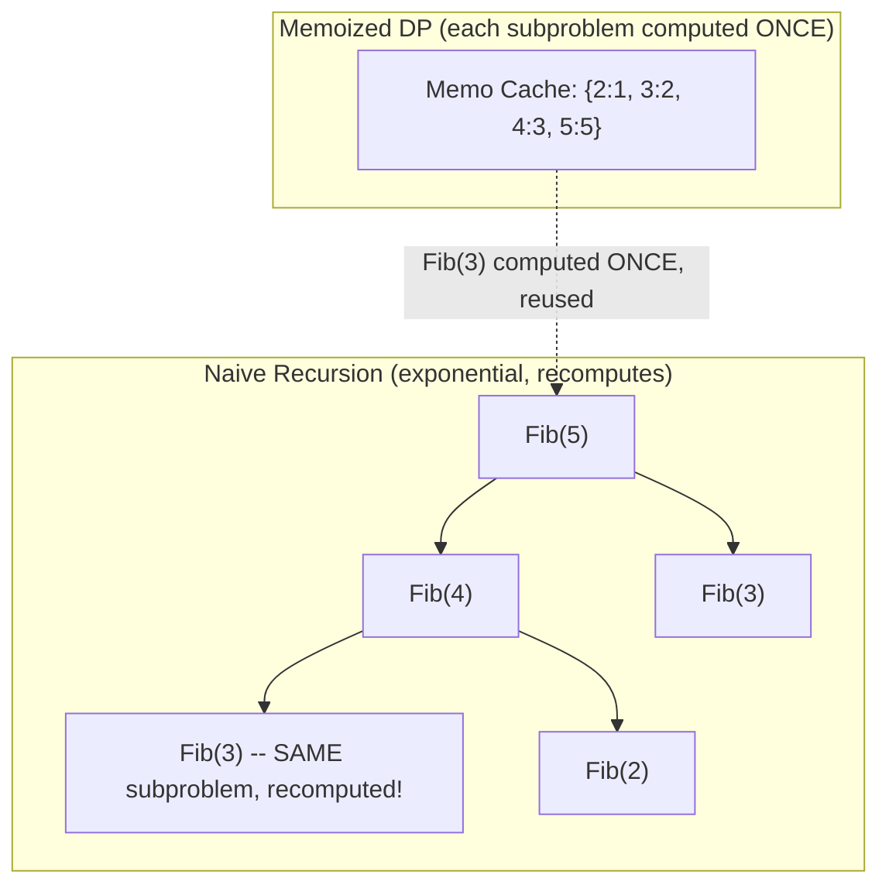

# Module 36 — Algorithms: Dynamic Programming & Greedy Algorithms

> Domain: Algorithms | Level: Beginner → Expert | Prerequisite: [[01-Sorting-Searching-Complexity]], [[../12-Data-Structures/02-Graphs-Tries-Union-Find]]

---

## 1. Fundamentals

### What is dynamic programming, and how does it differ from greedy algorithms?
**Dynamic programming (DP)** solves a problem by breaking it into overlapping subproblems, solving each **exactly once**, and reusing (caching/memoizing) those results — applicable specifically when a problem exhibits **optimal substructure** (an optimal solution can be constructed from optimal solutions to subproblems) and **overlapping subproblems** (the same subproblem recurs multiple times during a naive recursive solution). **Greedy algorithms** make a **locally optimal choice at each step**, never reconsidering it, hoping (and, for specific problem classes, provably guaranteeing) this produces a globally optimal solution — dramatically simpler and faster than DP when applicable, but **only correct for problems with the greedy-choice property**, a much narrower class than DP's applicability.

### Why does this matter?
DP and Greedy are the two most commonly conflated algorithmic techniques in interviews — a candidate applying a greedy approach to a problem that actually requires DP produces a solution that looks reasonable, often passes simple test cases, and is **subtly, provably wrong** for specific inputs, precisely the kind of "compiles and often works, but violates a real requirement" failure mode this course has repeatedly flagged (Module 29's LSP violations, Module 30's OCP violations) — now manifesting at the algorithm-design level.

### When does this matter?
Optimization problems (shortest path with constraints, resource allocation, scheduling, string-matching/edit-distance problems); the depth matters for correctly recognizing *which* technique a given problem requires, and for the two foundational DP implementation strategies (top-down memoization vs. bottom-up tabulation) each having genuine, situational trade-offs.

### How does it work (30,000-ft view)?
```csharp
// Naive recursive Fibonacci: EXPONENTIAL time -- recomputes fib(n-2) many times (overlapping subproblems)
int Fib(int n) => n <= 1 ? n : Fib(n - 1) + Fib(n - 2);

// DP (memoized): each subproblem computed EXACTLY ONCE -- O(n) time
int FibMemo(int n, Dictionary<int, int> memo)
{
    if (n <= 1) return n;
    if (memo.TryGetValue(n, out var cached)) return cached;
    return memo[n] = FibMemo(n - 1, memo) + FibMemo(n - 2, memo);
}
```

---

## 2. Deep Dive

### 2.1 Top-Down Memoization vs Bottom-Up Tabulation — Real, Situational Trade-offs
**Top-down (memoization)**: write the natural recursive solution, add a cache checking "have I already computed this subproblem" before recursing — preserves the recursive structure's readability, and (crucially) only computes subproblems **actually needed** for the specific input (if the recursion tree doesn't visit a particular subproblem, it's never computed at all). **Bottom-up (tabulation)**: build a table of subproblem solutions iteratively, smallest to largest, until reaching the target — avoids recursion's call-stack overhead (and stack-overflow risk for deep recursion, Module 8 §2.3's `StackOverflowException` discussion) entirely, and often enables **space optimization** (many DP problems only need the previous row/few previous values, not the entire table, reducing O(n²) space to O(n) or O(1) once the iterative structure makes this dependency pattern visible) — a genuine, situational choice, not merely "two ways to write the same thing," each with real, distinct advantages.

### 2.2 Optimal Substructure and Overlapping Subproblems — the Precise, Necessary Conditions for DP
A problem has **optimal substructure** if an optimal solution to the whole problem can be constructed from optimal solutions to its subproblems (shortest path: the shortest path from A to C through B is the shortest A-to-B path plus the shortest B-to-C path) — necessary but **not sufficient** for DP to be the right tool; **overlapping subproblems** (the same subproblem is encountered repeatedly during a naive recursive exploration) is the *second*, independently necessary condition that makes memoization/tabulation's caching actually pay off — a problem with optimal substructure but **no** overlapping subproblems (e.g., ordinary merge sort, Module 35 §2.4, does have optimal substructure in a loose sense, but its subproblems never overlap/repeat) gains nothing from DP's memoization machinery, correctly remaining a plain divide-and-conquer algorithm instead.

### 2.3 The Greedy-Choice Property — Precisely What Must Be Proven, Not Assumed
A greedy algorithm is correct **only if** the problem has the **greedy-choice property**: a globally optimal solution can be reached by making a sequence of locally optimal choices, **without needing to reconsider previous choices**. This must be **proven** (typically via an exchange argument — showing any optimal solution can be transformed into the greedy solution without decreasing its quality) for a specific problem, not assumed by analogy to a superficially similar problem that happens to have this property. The classic counterexample demonstrating this precisely: the **coin-change problem** — greedy (always take the largest denomination that fits) works correctly for US currency denominations (1, 5, 10, 25) but **provably fails** for an adversarial denomination set like {1, 3, 4} when making change for 6 (greedy takes 4+1+1 = three coins; the optimal solution is 3+3 = two coins) — the exact same problem *shape* (coin change) requires DP for one denomination set and greedy suffices for another, precisely because the greedy-choice property depends on the *specific* denomination set's structure, not the problem's superficial description.

### 2.4 Common DP Problem Archetypes and Their Recognizable Shapes
- **0/1 Knapsack**: choosing a subset of items (each usable at most once) maximizing value within a capacity constraint — the archetype underlying resource-allocation/budget-optimization problems.
- **Longest Common Subsequence (LCS)**: finding the longest subsequence common to two sequences — the archetype underlying diff algorithms, DNA-sequence alignment, and plagiarism detection.
- **Edit Distance** (Levenshtein distance): the minimum number of insert/delete/substitute operations to transform one string into another — the archetype underlying spell-checkers, fuzzy string matching, and version-control diff algorithms.
Recognizing that a novel-looking interview problem is actually a disguised instance of one of these archetypes (a common interview technique — describing knapsack or edit-distance in unfamiliar business terms) is a major part of the actual skill being tested.

### 2.5 DP on Graphs — Where Module 34's Content and This Module Intersect
Several graph algorithms are themselves instances of DP: **Bellman-Ford** (Module 34 §2.3) is fundamentally a DP algorithm — it repeatedly relaxes (updates) each node's shortest-known distance, exactly the "build up the optimal solution from optimal subsolutions, reusing previously-computed results" DP structure, iterated a bounded number of times (V-1 iterations, sufficient for any shortest path in a graph without negative cycles) — recognizing Bellman-Ford as "DP applied to the shortest-path problem" (rather than an unrelated, separately-memorized graph algorithm) is a valuable cross-module synthesis directly connecting Module 34's graph-algorithm content to this module's DP framing.

## 3. Visual Architecture


## 4. Production Example
**Scenario**: A logistics platform's route-optimization feature used a greedy "always choose the currently-cheapest next leg" algorithm for multi-stop delivery routing, assumed (by analogy to Dijkstra's greedy shortest-path approach, Module 34 §2.3) to produce optimal total-cost routes — for most routes this greedy approach produced reasonable results, but for a specific class of routes involving cost structures with **volume discounts** (a delivery leg's cost decreasing if bundled with certain other legs, an interdependency the pure greedy per-leg-cost comparison couldn't see), the greedy algorithm produced routes 15-20% more expensive than the true optimum, a discrepancy discovered when a manual audit compared the system's chosen routes against a specialist logistics consultant's manually-optimized alternative for a sample of high-value shipments. **Investigation**: confirmed the volume-discount interdependency violated the greedy-choice property — Dijkstra's greedy approach is provably correct specifically because shortest-path costs are simply additive with no such interdependency between edges; this routing problem's cost structure, once volume discounts were introduced, broke that assumption, since the "locally cheapest next leg" choice could preclude a more globally advantageous bundled-discount combination requiring a look-ahead the greedy approach structurally couldn't perform. **Fix**: replaced the greedy per-leg approach with a DP formulation treating the routing problem as a variant of the traveling-salesman-adjacent optimization (bounded by the practical number of stops per route, making an exact DP solution computationally feasible, unlike TSP's general NP-hardness at unbounded scale) correctly accounting for the volume-discount interdependencies by considering combinations of legs together, not just each leg's cost in isolation. **Lesson**: applying a greedy algorithm to a problem by analogy to a different, superficially-similar problem where greedy happens to be correct (Dijkstra's shortest path) — without independently verifying the greedy-choice property actually holds for *this specific* problem's cost structure — is exactly the coin-change-problem trap (§2.3) manifesting in a real, financially-significant production system, not just an interview thought experiment.

## 5. Best Practices
- Verify a problem's optimal substructure **and** overlapping subproblems both hold before applying DP; verify the greedy-choice property is specifically proven (not assumed by analogy) before applying a greedy approach.
- Choose top-down memoization for readability and computing only actually-needed subproblems; choose bottom-up tabulation for stack-safety on deep recursion and space-optimization opportunities.
- Recognize common DP archetypes (knapsack, LCS, edit distance) in novel-looking problem descriptions rather than solving each from scratch as if entirely new.
- Recognize Bellman-Ford and similar iterative graph-relaxation algorithms as DP applied to graphs, not a separate, unrelated technique.

## 6. Anti-patterns
- Applying a greedy algorithm to a problem by analogy to a different problem where greedy happens to work, without independently proving the greedy-choice property for this specific problem's actual structure (§4's incident, the coin-change trap).
- Using naive, unmemoized recursion for a problem with overlapping subproblems, producing exponential time complexity where polynomial DP would suffice.
- Applying DP's memoization machinery to a problem without overlapping subproblems, adding unnecessary complexity/overhead for no benefit.
- Deep, unmemoized recursive DP risking stack overflow for large inputs, where bottom-up tabulation would avoid the recursion depth entirely.

---

## 10. Interview Questions

### Basic (10)
1. **Q: What are the two necessary conditions for dynamic programming to apply?** **A:** Optimal substructure and overlapping subproblems.
2. **Q: What is optimal substructure?** **A:** An optimal solution to the whole problem can be constructed from optimal solutions to its subproblems.
3. **Q: What are overlapping subproblems?** **A:** The same subproblem is encountered repeatedly during a naive recursive exploration of the problem.
4. **Q: What's the difference between top-down memoization and bottom-up tabulation?** **A:** Top-down adds caching to the natural recursive solution; bottom-up iteratively builds a table from the smallest subproblems up.
5. **Q: What is a greedy algorithm?** **A:** One that makes a locally optimal choice at each step, never reconsidering it.
6. **Q: Is greedy always correct?** **A:** No — only for problems with the greedy-choice property, which must be proven for the specific problem.
7. **Q: What is the classic example showing greedy coin-change can fail?** **A:** Denominations {1, 3, 4} making change for 6 — greedy gives 3 coins (4+1+1), optimal is 2 (3+3).
8. **Q: What DP problem archetype underlies diff algorithms?** **A:** Longest Common Subsequence (LCS) — a diff is derived by computing the LCS of the two files' lines and emitting everything *not* in the LCS as insertions/deletions; production diffs use refinements (Myers' algorithm) but the underlying archetype is LCS.
9. **Q: What DP problem archetype underlies fuzzy string matching/spell-checkers?** **A:** Edit distance (Levenshtein distance).
10. **Q: Is Dijkstra's algorithm greedy or DP?** **A:** Greedy — it always expands the currently-cheapest-known node next, correct specifically because shortest-path costs are simply additive with no interdependency.

### Intermediate (10)
1. **Q: Why is naive recursive Fibonacci O(2^n) while memoized Fibonacci is O(n)?** **A:** Naive recursion recomputes the same subproblems (e.g., Fib(3)) many times across different branches of the recursion tree; memoization computes each distinct subproblem exactly once, caching it for reuse.
2. **Q: Why does bottom-up tabulation avoid stack-overflow risk that top-down memoization doesn't?** **A:** Tabulation builds the solution iteratively (a loop), never using the call stack for recursion depth, whereas top-down memoization's recursive calls still consume stack frames proportional to recursion depth, risking overflow for very deep problems even with memoization caching the results.
3. **Q: Why does top-down memoization sometimes outperform bottom-up tabulation despite tabulation's other advantages?** **A:** Top-down only computes subproblems actually reachable from the specific input via the recursion — if many table entries would never actually be visited for a given input, bottom-up's exhaustive table-filling wastes work top-down's demand-driven computation avoids.
4. **Q: Why does merge sort not benefit from DP's memoization despite having a divide-and-conquer/optimal-substructure-like structure?** **A:** Its subproblems (each recursive half) never overlap or repeat — each subarray is genuinely distinct — so there's nothing to cache/reuse, meaning DP's core benefit (avoiding redundant recomputation) simply doesn't apply.
5. **Q: Why must the greedy-choice property be proven for a specific problem rather than assumed by analogy to a similar-looking problem?** **A:** As the coin-change example demonstrates, the exact same problem *shape* can have or lack the greedy-choice property depending on the specific problem instance's structure (denomination set, cost interdependencies) — analogy to a different instance where greedy happens to work provides no guarantee for a different instance of the same general problem type.
6. **Q: Why is Bellman-Ford considered a DP algorithm rather than a purely greedy one, unlike Dijkstra?** **A:** It repeatedly relaxes (improves) each node's shortest-known-distance estimate across multiple full passes, building up the correct answer from progressively-refined subsolutions rather than committing to a single, never-reconsidered greedy choice per node the way Dijkstra does — this iterative-refinement structure is exactly DP's "optimal solution built from optimal subsolutions, revisited as needed" shape.
7. **Q: Why does 0/1 Knapsack require DP while the "fractional" knapsack variant (items can be split) can be solved greedily?** **A:** Fractional knapsack has the greedy-choice property (always take as much as possible of the currently-best value-per-weight-ratio item) since partial items are allowed, making the locally-optimal choice always extendable to a globally-optimal solution; 0/1 knapsack's all-or-nothing item constraint breaks this property (taking an item might preclude a better combination involving other items), requiring DP's exhaustive-but-memoized subproblem exploration instead.
8. **Q: Why is edit distance's DP table typically visualized as a 2D grid, and what does each cell represent?** **A:** Each cell `(i,j)` represents the minimum edit distance between the first `i` characters of one string and the first `j` characters of the other — the final answer is the bottom-right cell, built up from smaller prefixes via the recurrence relating each cell to its neighbors (representing insert/delete/substitute operations).
9. **Q: Why might a candidate correctly identify a problem as "needing DP" but still fail to solve it efficiently?** **A:** Correctly identifying the *need* for DP is necessary but not sufficient — the candidate must also correctly define the subproblem (the DP state), the recurrence relating subproblems, and the base cases; a wrong state definition can lead to a DP formulation that's still exponential (if it doesn't actually capture and reuse the true overlapping subproblems) or simply incorrect.
10. **Q: Why does recognizing common DP archetypes (knapsack, LCS, edit distance) matter for interview performance specifically?** **A:** Many novel-looking interview problems are deliberately-disguised instances of these well-known archetypes described in unfamiliar business terms — recognizing the underlying archetype lets a candidate apply a known, well-understood solution template rather than needing to derive an entire DP formulation from first principles under time pressure.

### Advanced (10)
1. **Q: Diagnose the route-optimization production incident (§4) from first principles, and explain precisely why the volume-discount interdependency invalidates the greedy-choice property that makes Dijkstra correct.**
   **A:** Dijkstra's greedy correctness relies on shortest-path costs being **simply additive** with **no interdependency between edges** — once a shortest distance to a node is finalized, no future discovery can improve it, precisely because adding a subsequent edge's cost can only increase the total, never retroactively change an earlier edge's already-accounted-for cost. Volume discounts introduce exactly the interdependency this assumption forbids: the cost of leg A depends on **which other legs are also selected** (bundling), meaning a locally-cheapest next-leg choice can preclude a combination that would have been globally cheaper once bundling discounts are accounted for — the greedy algorithm has no mechanism to "look ahead" and reconsider an earlier choice once a beneficial bundling opportunity becomes apparent, exactly the missing "reconsideration" capability the greedy-choice property specifically requires *not* being needed for correctness, which this problem's cost structure violates.
2. **Q: Design a DP formulation for the route-optimization problem (§4) accounting for volume discounts, and discuss its computational feasibility limits.**
   **A:** Model the state as (current location, **set of legs already selected**) rather than just (current location) alone — the discount interdependency requires the DP state to track enough information to correctly compute bundling discounts for any candidate next choice, meaning the state space grows with the **power set** of possible leg combinations, an exponential blow-up in the number of stops (directly related to the Traveling Salesman Problem's NP-hardness) — this DP formulation is computationally feasible **only** for a bounded, realistically-small number of stops per route (a practical constraint the logistics platform's actual route sizes satisfy, e.g., rarely more than 15-20 stops per route), beyond which an exact DP solution becomes infeasible and an approximation/heuristic approach (a later, more advanced topic) would be needed instead.
3. **Q: Explain how you would empirically verify whether the greedy-choice property holds for a novel optimization problem before committing to a greedy implementation, given that a formal proof might not be immediately obvious.**
   **A:** Generate a range of test cases specifically designed to probe for the kind of interdependency that breaks greedy correctness (in §4's case, deliberately constructing test routes with strong volume-discount interdependencies between non-adjacent legs), compute both the greedy algorithm's result and a brute-force/exhaustive-search result (feasible for small test instances) for each, and compare — any discrepancy is direct, empirical evidence the greedy-choice property does *not* hold for this problem, providing a fast, practical (if not mathematically rigorous) way to catch exactly this class of mistake before committing to a greedy implementation in production, directly the same "test against a brute-force reference implementation for small cases" validation technique broadly applicable whenever a formal correctness proof is difficult to construct confidently under time pressure.
4. **Q: Explain the recurrence relation for the 0/1 Knapsack problem precisely, and describe how it demonstrates optimal substructure.**
   **A:** `dp[i][w]` = the maximum value achievable using the first `i` items with capacity `w`; the recurrence is `dp[i][w] = max(dp[i-1][w], dp[i-1][w - weight[i]] + value[i])` if `weight[i] <= w`, else `dp[i][w] = dp[i-1][w]` — this demonstrates optimal substructure precisely because the optimal solution for `(i, w)` is directly expressed in terms of optimal solutions to strictly smaller subproblems `(i-1, w)` and `(i-1, w - weight[i])`, either including or excluding the `i`-th item, with no need to reconsider or backtrack through the already-optimal subsolutions once computed.
5. **Q: How would you space-optimize a 2D DP table (like 0/1 Knapsack's) from O(n×W) to O(W), and what constraint on the recurrence makes this possible?**
   **A:** Since `dp[i][w]` only depends on the **previous row** (`dp[i-1][...]`), not any earlier row, a single 1D array can be reused across iterations — the key subtlety: when updating in-place, you must iterate the **weight dimension in decreasing order** (from `W` down to `weight[i]`) to ensure you're reading the "previous row's" value (not-yet-overwritten) rather than accidentally reading a value already updated for the *current* row, which would incorrectly reuse an item multiple times (violating 0/1 Knapsack's "each item at most once" constraint) — this specific iteration-order requirement is a genuinely subtle, easy-to-get-wrong detail when space-optimizing DP tables, worth stating explicitly as a common interview follow-up.
6. **Q: Explain a scenario where an initially-correct greedy solution becomes incorrect after a seemingly-minor business requirement change, directly generalizing the §4 incident's lesson.**
   **A:** A greedy "always assign the task to the currently-least-loaded worker" scheduling algorithm is correct (and provably optimal for minimizing maximum load) under the assumption that tasks are independent and interchangeable — if a later business requirement introduces task **dependencies** (task B can't start until task A completes, even if assigned to a different worker) or worker **specialization** (some workers can only do certain task types), the greedy algorithm's local, load-only-based decision no longer accounts for the new interdependency, and it can silently produce suboptimal (or even invalid, dependency-violating) schedules — directly the same lesson as §4: a requirement change can invalidate a previously-correct greedy algorithm's correctness by introducing an interdependency the original greedy-choice proof never accounted for, meaning any change to a greedy algorithm's problem constraints warrants **re-verifying** the greedy-choice property, not assuming it still holds because it held before the change.
7. **Q: Design a hybrid approach combining greedy and DP for a large-scale version of the route-optimization problem (§4) where the exact DP formulation (Advanced Q2) becomes computationally infeasible due to too many stops.**
   **A:** Use greedy (or a simpler heuristic) to produce a reasonable initial route, then apply **local, bounded DP refinement** — examining small, overlapping windows of a few consecutive legs at a time (small enough for exact DP to be feasible within each window) and optimally re-arranging/re-bundling just that local window, repeating across the whole route — this doesn't guarantee the true global optimum (since it only optimizes locally, in bounded windows) but captures much of the volume-discount benefit the pure greedy approach misses, at a computational cost far below the full exponential-state-space DP formulation — a genuine, practical trade-off between solution quality and computational feasibility for problem instances too large for an exact approach.
8. **Q: Explain why a candidate correctly proving a greedy exchange argument for one problem doesn't automatically transfer confidence to a superficially-similar problem, using the coin-change contrast explicitly.**
   **A:** An exchange argument proof is specific to the particular problem's constraint structure — the US-denomination coin-change proof relies on specific numeric relationships between the denominations (each denomination being either a multiple of or having a specific relationship to smaller ones) that simply don't hold for an arbitrary denomination set like {1,3,4}; a proof's validity is tied to the exact assumptions/structure it relies on, and superficial problem-description similarity (both are "coin change") provides zero transferable guarantee unless the *specific structural property* the proof depends on is verified to also hold in the new instance.
9. **Q: A team proposes using a greedy algorithm for a resource-allocation problem "because it's simpler and faster than DP," without attempting to verify the greedy-choice property. Evaluate this as a Principal Engineer.**
   **A:** Push back firmly — "simpler and faster" is only a valid justification if the algorithm is also **correct**, and greedy's correctness is not a given, it's a property requiring specific proof (Advanced Q3's empirical-verification technique, or a formal exchange-argument proof) for this exact problem's structure; recommend either (a) a rigorous correctness argument specific to this problem before shipping greedy, or (b) empirical brute-force comparison testing across a representative range of inputs (Advanced Q3) as a minimum bar, treating "greedy is simpler" as a reason to *hope* it's correct, never a substitute for actually verifying it is — directly the same "don't ship based on hope, verify the actual requirement" discipline recurring throughout this entire course.
10. **Q: As a Principal Engineer, how would you build organizational capability specifically preventing the greedy-choice-property assumption error (§4) from recurring across future optimization-feature development?**
    **A:** Require any proposed greedy algorithm for a genuinely new (not previously-proven) optimization problem to include, as part of its design-review documentation, either a stated exchange-argument proof or empirical brute-force-comparison test results (Advanced Q3) across a representative range of inputs specifically probing for the kind of interdependency that breaks greedy correctness — directly mirroring this course's recurring pattern of converting a hard-won, incident-driven lesson into a standing, mandatory design-review requirement (Module 29's LSP-contract documentation requirement, Module 30's OCP-risk branch-count signal) — making "prove the greedy-choice property, don't assume it by analogy" an explicit, checked step in the development process rather than relying on every engineer independently remembering the coin-change cautionary tale.

---

## 11. Coding Exercises

### Easy — Memoized Fibonacci (top-down)
```csharp
public class FibonacciSolver
{
    private readonly Dictionary<int, long> _memo = new();
    public long Fib(int n)
    {
        if (n <= 1) return n;
        if (_memo.TryGetValue(n, out var cached)) return cached;
        return _memo[n] = Fib(n - 1) + Fib(n - 2); // each n computed EXACTLY ONCE across the whole call tree
    }
}
```

### Medium — 0/1 Knapsack with space-optimized bottom-up tabulation (Advanced Q5)
```csharp
public int Knapsack(int[] weights, int[] values, int capacity)
{
    var dp = new int[capacity + 1]; // 1D array -- space-optimized from O(n * capacity) to O(capacity)

    for (int i = 0; i < weights.Length; i++)
    {
        // CRITICAL: iterate weight DESCENDING to avoid reusing item i multiple times (Advanced Q5)
        for (int w = capacity; w >= weights[i]; w--)
        {
            dp[w] = Math.Max(dp[w], dp[w - weights[i]] + values[i]);
        }
    }
    return dp[capacity];
}
```

### Hard — Longest Common Subsequence with full DP table
```csharp
public int LongestCommonSubsequence(string a, string b)
{
    var dp = new int[a.Length + 1, b.Length + 1];

    for (int i = 1; i <= a.Length; i++)
    {
        for (int j = 1; j <= b.Length; j++)
        {
            dp[i, j] = a[i - 1] == b[j - 1]
                ? dp[i - 1, j - 1] + 1                          // characters match -- extend the subsequence
                : Math.Max(dp[i - 1, j], dp[i, j - 1]);          // no match -- best of excluding either character
        }
    }
    return dp[a.Length, b.Length];
}
```

### Expert — Empirical greedy-vs-brute-force verification harness (Advanced Q3)
```csharp
public class GreedyCorrectnessVerifier<TInput, TResult> where TResult : IComparable<TResult>
{
    private readonly Func<TInput, TResult> _greedyAlgorithm;
    private readonly Func<TInput, TResult> _bruteForceAlgorithm; // feasible only for SMALL test instances
    private readonly Func<int, TInput> _testCaseGenerator;

    public GreedyCorrectnessVerifier(
        Func<TInput, TResult> greedy, Func<TInput, TResult> bruteForce, Func<int, TInput> generator)
    {
        _greedyAlgorithm = greedy; _bruteForceAlgorithm = bruteForce; _testCaseGenerator = generator;
    }

    public List<string> FindCounterexamples(int trials, int maxInputSize)
    {
        var counterexamples = new List<string>();
        var random = new Random(42); // deterministic seed for reproducible test runs

        for (int i = 0; i < trials; i++)
        {
            var input = _testCaseGenerator(random.Next(1, maxInputSize));
            var greedyResult = _greedyAlgorithm(input);
            var optimalResult = _bruteForceAlgorithm(input);

            if (greedyResult.CompareTo(optimalResult) != 0)
                counterexamples.Add($"Trial {i}: greedy={greedyResult}, optimal={optimalResult}");
        }
        return counterexamples;
    }
}
// Usage: run BEFORE committing to a greedy implementation for any novel optimization problem --
// any non-empty result list is direct, empirical proof the greedy-choice property does NOT hold.
```
**Discussion**: This directly operationalizes Advanced Q3/Q9's "prove it, don't assume it by analogy" discipline as reusable, generic testing infrastructure — running this harness against the route-optimization problem's volume-discount cost structure, with even a small-scale brute-force reference implementation, would have surfaced §4's incident as a caught, pre-deployment counterexample rather than a production discrepancy discovered via manual audit months later.

---

## 12–17. System Design / LLD / Debugging / Decision / Case Study / Principal

A logistics platform (§4) replaces its greedy per-leg route-optimization algorithm with a bounded-state-space DP formulation (Advanced Q2) correctly accounting for volume-discount interdependencies, backed by the generic greedy-correctness-verification harness (Expert exercise) now required for any future optimization-algorithm design review before committing to a greedy approach. The signature production incident (§4) — a greedy algorithm assumed correct by analogy to Dijkstra's shortest-path correctness, silently producing 15-20% suboptimal routes once volume-discount interdependencies were introduced — is this module's central lesson, a real-world, financially-significant instance of the classic coin-change greedy-failure trap: the greedy-choice property must be proven for the *specific* problem's structure, never assumed by analogy to a superficially similar problem where it happens to hold. Principal-level guidance: require either a formal exchange-argument proof or empirical brute-force-comparison verification (the Expert exercise's harness) as a mandatory design-review step for any new greedy algorithm, converting this hard-won lesson into a standing, checked development-process requirement.

## 18. Revision
**Key takeaways**: DP requires both optimal substructure *and* overlapping subproblems — optimal substructure alone (as in merge sort) doesn't benefit from memoization without genuine subproblem repetition. Top-down memoization computes only actually-needed subproblems (readable, risks stack depth); bottom-up tabulation avoids recursion entirely (stack-safe, enables space optimization via reduced-dimension tables, with a critical iteration-order subtlety for in-place 0/1 Knapsack). Greedy's correctness requires the greedy-choice property, which must be proven for the *specific* problem instance — the coin-change {1,3,4} counterexample demonstrates the same problem shape can require DP or admit greedy depending entirely on structural specifics, never assumable by analogy. Recognize common DP archetypes (knapsack, LCS, edit distance) and DP-as-applied-to-graphs (Bellman-Ford) as connected, transferable patterns rather than isolated, separately-memorized algorithms.

---

**Next**: This completes the `13-Algorithms` domain (Modules 35–36), and with it, Phase 1's core CS-fundamentals arc (OOP, SOLID, Design Patterns, Data Structures, Algorithms — Modules 29–36). Continuing autonomously to `14-System-Design`.
