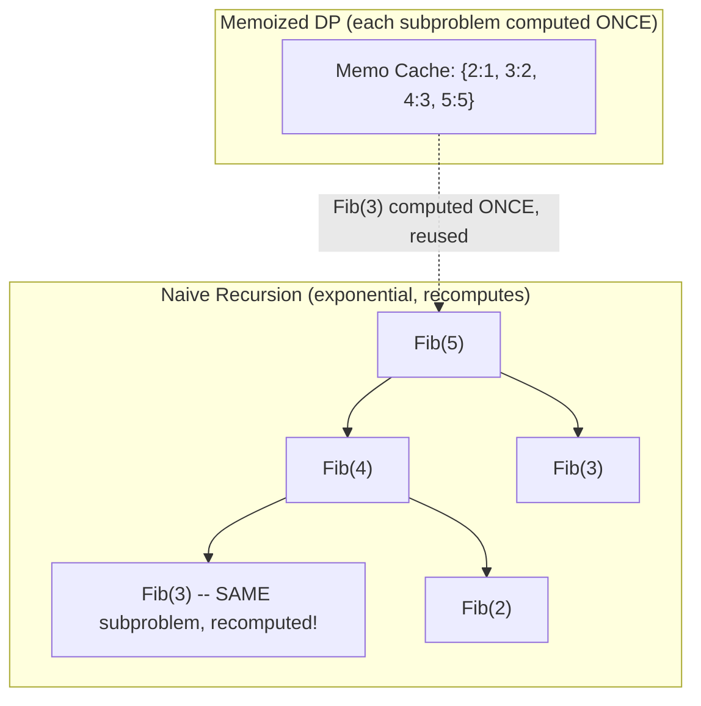
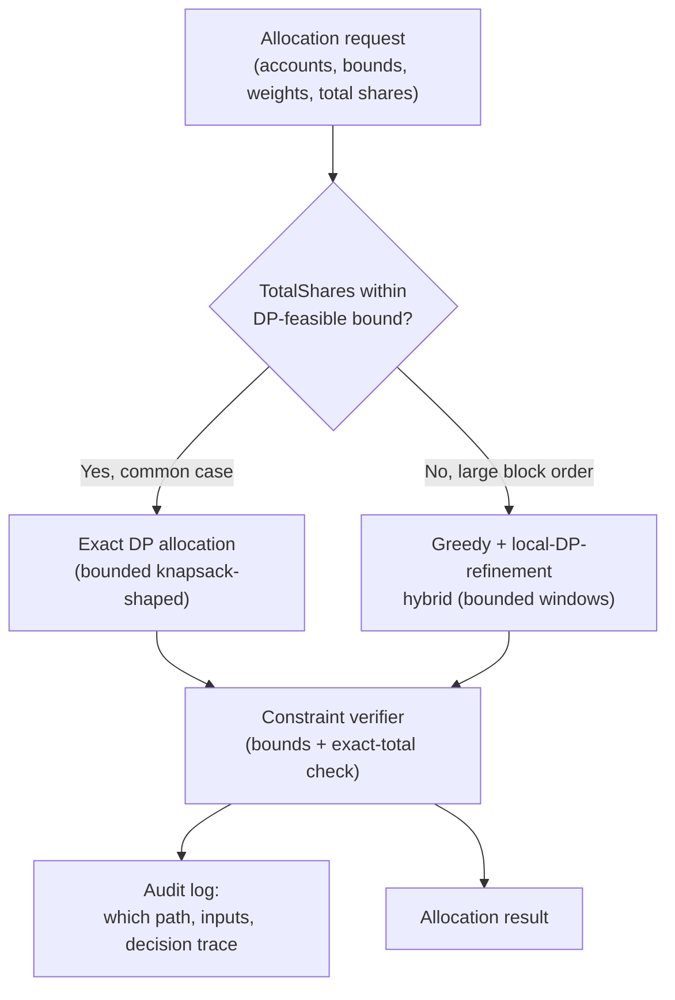
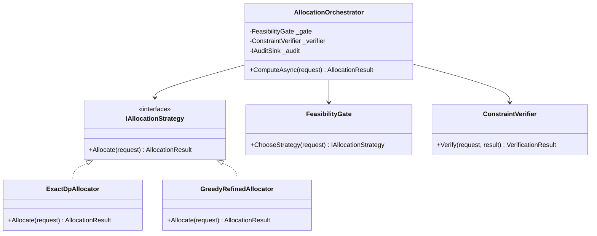
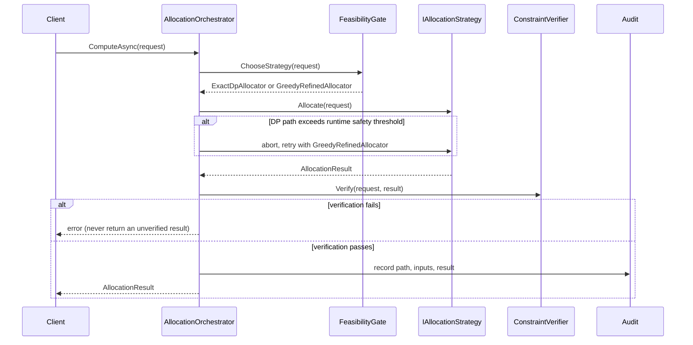

# Module 36 — Algorithms: Dynamic Programming & Greedy Algorithms

> Domain: Algorithms | Level: Beginner → Expert | Prerequisite: [[01-Sorting-Searching-Complexity]], [[../12-Data-Structures/02-Graphs-Tries-Union-Find]]

---

## 1. Fundamentals

### What is dynamic programming, and how does it differ from greedy algorithms?
**Dynamic programming (DP)** solves a problem by breaking it into overlapping subproblems, solving each **exactly once**, and reusing (caching/memoizing) those results — applicable specifically when a problem exhibits **optimal substructure** (an optimal solution can be constructed from optimal solutions to subproblems) and **overlapping subproblems** (the same subproblem recurs multiple times during a naive recursive solution). **Greedy algorithms** make a **locally optimal choice at each step**, never reconsidering it, hoping (and, for specific problem classes, provably guaranteeing) this produces a globally optimal solution — dramatically simpler and faster than DP when applicable, but **only correct for problems with the greedy-choice property**, a much narrower class than DP's applicability.

### Why does this matter?
DP and Greedy are the two most commonly conflated algorithmic techniques in interviews — a candidate applying a greedy approach to a problem that actually requires DP produces a solution that looks reasonable, often passes simple test cases, and is **subtly, provably wrong** for specific inputs, precisely the kind of "compiles and often works, but violates a real requirement" failure mode this course has repeatedly flagged — now manifesting at the algorithm-design level.

### When does this matter?
Optimization problems (shortest path with constraints, resource allocation, scheduling, string-matching/edit-distance problems); the depth matters for correctly recognizing *which* technique a given problem requires, and for the two foundational DP implementation strategies (top-down memoization vs. bottom-up tabulation) each having genuine, situational trade-offs.

### How does it work (30,000-ft view)?
```csharp
// Naive recursive Fibonacci: EXPONENTIAL time -- recomputes fib(n-2) many times (overlapping subproblems)
int Fib(int n) => n <= 1? n: Fib(n - 1) + Fib(n - 2);

// DP (memoized): each subproblem computed EXACTLY ONCE -- O(n) time
int FibMemo(int n, Dictionary<int, int> memo)
{
    if (n <= 1) return n;
    if (memo.TryGetValue(n, out var cached)) return cached;
    return memo[n] = FibMemo(n - 1, memo) + FibMemo(n - 2, memo);
}
```

---

## 2. Deep Dive

### 2.1 Top-Down Memoization vs Bottom-Up Tabulation — Real, Situational Trade-offs
**Top-down (memoization)**: write the natural recursive solution, add a cache checking "have I already computed this subproblem" before recursing — preserves the recursive structure's readability, and (crucially) only computes subproblems **actually needed** for the specific input (if the recursion tree doesn't visit a particular subproblem, it's never computed at all). **Bottom-up (tabulation)**: build a table of subproblem solutions iteratively, smallest to largest, until reaching the target — avoids recursion's call-stack overhead (and stack-overflow risk for deep recursion, the `StackOverflowException` discussion) entirely, and often enables **space optimization** (many DP problems only need the previous row/few previous values, not the entire table, reducing O(n²) space to O(n) or O(1) once the iterative structure makes this dependency pattern visible) — a genuine, situational choice, not merely "two ways to write the same thing," each with real, distinct advantages.

### 2.2 Optimal Substructure and Overlapping Subproblems — the Precise, Necessary Conditions for DP
A problem has **optimal substructure** if an optimal solution to the whole problem can be constructed from optimal solutions to its subproblems (shortest path: the shortest path from A to C through B is the shortest A-to-B path plus the shortest B-to-C path) — necessary but **not sufficient** for DP to be the right tool; **overlapping subproblems** (the same subproblem is encountered repeatedly during a naive recursive exploration) is the *second*, independently necessary condition that makes memoization/tabulation's caching actually pay off — a problem with optimal substructure but **no** overlapping subproblems (e.g., ordinary merge sort,, does have optimal substructure in a loose sense, but its subproblems never overlap/repeat) gains nothing from DP's memoization machinery, correctly remaining a plain divide-and-conquer algorithm instead.

### 2.3 The Greedy-Choice Property — Precisely What Must Be Proven, Not Assumed
A greedy algorithm is correct **only if** the problem has the **greedy-choice property**: a globally optimal solution can be reached by making a sequence of locally optimal choices, **without needing to reconsider previous choices**. This must be **proven** (typically via an exchange argument — showing any optimal solution can be transformed into the greedy solution without decreasing its quality) for a specific problem, not assumed by analogy to a superficially similar problem that happens to have this property. The classic counterexample demonstrating this precisely: the **coin-change problem** — greedy (always take the largest denomination that fits) works correctly for US currency denominations (1, 5, 10, 25) but **provably fails** for an adversarial denomination set like {1, 3, 4} when making change for 6 (greedy takes 4+1+1 = three coins; the optimal solution is 3+3 = two coins) — the exact same problem *shape* (coin change) requires DP for one denomination set and greedy suffices for another, precisely because the greedy-choice property depends on the *specific* denomination set's structure, not the problem's superficial description.

### 2.4 Common DP Problem Archetypes and Their Recognizable Shapes
- **0/1 Knapsack**: choosing a subset of items (each usable at most once) maximizing value within a capacity constraint — the archetype underlying resource-allocation/budget-optimization problems.
- **Longest Common Subsequence (LCS)**: finding the longest subsequence common to two sequences — the archetype underlying diff algorithms, DNA-sequence alignment, and plagiarism detection.
- **Edit Distance** (Levenshtein distance): the minimum number of insert/delete/substitute operations to transform one string into another — the archetype underlying spell-checkers, fuzzy string matching, and version-control diff algorithms.
Recognizing that a novel-looking interview problem is actually a disguised instance of one of these archetypes (a common interview technique — describing knapsack or edit-distance in unfamiliar business terms) is a major part of the actual skill being tested.

### 2.5 DP on Graphs — Where the Content and This Module Intersect
Several graph algorithms are themselves instances of DP: **Bellman-Ford** is fundamentally a DP algorithm — it repeatedly relaxes (updates) each node's shortest-known distance, exactly the "build up the optimal solution from optimal subsolutions, reusing previously-computed results" DP structure, iterated a bounded number of times (V-1 iterations, sufficient for any shortest path in a graph without negative cycles) — recognizing Bellman-Ford as "DP applied to the shortest-path problem" (rather than an unrelated, separately-memorized graph algorithm) is a valuable cross-module synthesis directly connecting the graph-algorithm content to this module's DP framing.

## 3. Visual Architecture

```mermaid
graph TB
 subgraph "Naive Recursion (exponential, recomputes)"
 F5["Fib(5)"] --> F4A["Fib(4)"]
 F5 --> F3A["Fib(3)"]
 F4A --> F3B["Fib(3) -- SAME subproblem, recomputed!"]
 F4A --> F2A["Fib(2)"]
 end
 subgraph "Memoized DP (each subproblem computed ONCE)"
 Cache["Memo Cache: {2:1, 3:2, 4:3, 5:5}"]
 Cache -.->|"Fib(3) computed ONCE, reused"| F5
 end
```

## 4. Production Example
**Scenario**: A logistics platform's route-optimization feature used a greedy "always choose the currently-cheapest next leg" algorithm for multi-stop delivery routing, assumed (by analogy to Dijkstra's greedy shortest-path approach) to produce optimal total-cost routes — for most routes this greedy approach produced reasonable results, but for a specific class of routes involving cost structures with **volume discounts** (a delivery leg's cost decreasing if bundled with certain other legs, an interdependency the pure greedy per-leg-cost comparison couldn't see), the greedy algorithm produced routes 15-20% more expensive than the true optimum, a discrepancy discovered when a manual audit compared the system's chosen routes against a specialist logistics consultant's manually-optimized alternative for a sample of high-value shipments. **Investigation**: confirmed the volume-discount interdependency violated the greedy-choice property — Dijkstra's greedy approach is provably correct specifically because shortest-path costs are simply additive with no such interdependency between edges; this routing problem's cost structure, once volume discounts were introduced, broke that assumption, since the "locally cheapest next leg" choice could preclude a more globally advantageous bundled-discount combination requiring a look-ahead the greedy approach structurally couldn't perform. **Fix**: replaced the greedy per-leg approach with a DP formulation treating the routing problem as a variant of the traveling-salesman-adjacent optimization (bounded by the practical number of stops per route, making an exact DP solution computationally feasible, unlike TSP's general NP-hardness at unbounded scale) correctly accounting for the volume-discount interdependencies by considering combinations of legs together, not just each leg's cost in isolation. **Lesson**: applying a greedy algorithm to a problem by analogy to a different, superficially-similar problem where greedy happens to be correct (Dijkstra's shortest path) — without independently verifying the greedy-choice property actually holds for *this specific* problem's cost structure — is exactly the coin-change-problem trap manifesting in a real, financially-significant production system, not just an interview thought experiment.
## 10. Interview Questions

### Basic (10)
1. **Q: What are the two necessary conditions for dynamic programming to apply?** **A:** Optimal substructure and overlapping subproblems.
2. **Q: What is optimal substructure?** **A:** An optimal solution to the whole problem can be constructed from optimal solutions to its subproblems.
3. **Q: What are overlapping subproblems?** **A:** The same subproblem is encountered repeatedly during a naive recursive exploration of the problem.
4. **Q: What's the difference between top-down memoization and bottom-up tabulation?** **A:** Top-down adds caching to the natural recursive solution; bottom-up iteratively builds a table from the smallest subproblems up.
5. **Q: What is a greedy algorithm?** **A:** One that makes a locally optimal choice at each step, never reconsidering it.
6. **Q: Is greedy always correct?** **A:** No — only for problems with the greedy-choice property, which must be proven for the specific problem.
7. **Q: What is the classic example showing greedy coin-change can fail?** **A:** Denominations {1, 3, 4} making change for 6 — greedy gives 3 coins (4+1+1), optimal is 2 (3+3).
8. **Q: What DP problem archetype underlies diff algorithms?** **A:** Longest Common Subsequence (LCS) — a diff is derived by computing the LCS of the two files' lines and emitting everything *not* in the LCS as insertions/deletions; production diffs use refinements (Myers' algorithm) but the underlying archetype is LCS.
9. **Q: What DP problem archetype underlies fuzzy string matching/spell-checkers?** **A:** Edit distance (Levenshtein distance).
10. **Q: Is Dijkstra's algorithm greedy or DP?** **A:** Greedy — it always expands the currently-cheapest-known node next, correct specifically because shortest-path costs are simply additive with no interdependency.

### Intermediate (10)
1. **Q: Why is naive recursive Fibonacci O(2^n) while memoized Fibonacci is O(n)?** **A:** Naive recursion recomputes the same subproblems (e.g., Fib(3)) many times across different branches of the recursion tree; memoization computes each distinct subproblem exactly once, caching it for reuse.
2. **Q: Why does bottom-up tabulation avoid stack-overflow risk that top-down memoization doesn't?** **A:** Tabulation builds the solution iteratively (a loop), never using the call stack for recursion depth, whereas top-down memoization's recursive calls still consume stack frames proportional to recursion depth, risking overflow for very deep problems even with memoization caching the results.
3. **Q: Why does top-down memoization sometimes outperform bottom-up tabulation despite tabulation's other advantages?** **A:** Top-down only computes subproblems actually reachable from the specific input via the recursion — if many table entries would never actually be visited for a given input, bottom-up's exhaustive table-filling wastes work top-down's demand-driven computation avoids.
4. **Q: Why does merge sort not benefit from DP's memoization despite having a divide-and-conquer/optimal-substructure-like structure?** **A:** Its subproblems (each recursive half) never overlap or repeat — each subarray is genuinely distinct — so there's nothing to cache/reuse, meaning DP's core benefit (avoiding redundant recomputation) simply doesn't apply.
5. **Q: Why must the greedy-choice property be proven for a specific problem rather than assumed by analogy to a similar-looking problem?** **A:** As the coin-change example demonstrates, the exact same problem *shape* can have or lack the greedy-choice property depending on the specific problem instance's structure (denomination set, cost interdependencies) — analogy to a different instance where greedy happens to work provides no guarantee for a different instance of the same general problem type.
6. **Q: Why is Bellman-Ford considered a DP algorithm rather than a purely greedy one, unlike Dijkstra?** **A:** It repeatedly relaxes (improves) each node's shortest-known-distance estimate across multiple full passes, building up the correct answer from progressively-refined subsolutions rather than committing to a single, never-reconsidered greedy choice per node the way Dijkstra does — this iterative-refinement structure is exactly DP's "optimal solution built from optimal subsolutions, revisited as needed" shape.
7. **Q: Why does 0/1 Knapsack require DP while the "fractional" knapsack variant (items can be split) can be solved greedily?** **A:** Fractional knapsack has the greedy-choice property (always take as much as possible of the currently-best value-per-weight-ratio item) since partial items are allowed, making the locally-optimal choice always extendable to a globally-optimal solution; 0/1 knapsack's all-or-nothing item constraint breaks this property (taking an item might preclude a better combination involving other items), requiring DP's exhaustive-but-memoized subproblem exploration instead.
8. **Q: Why is edit distance's DP table typically visualized as a 2D grid, and what does each cell represent?** **A:** Each cell `(i,j)` represents the minimum edit distance between the first `i` characters of one string and the first `j` characters of the other — the final answer is the bottom-right cell, built up from smaller prefixes via the recurrence relating each cell to its neighbors (representing insert/delete/substitute operations).
9. **Q: Why might a candidate correctly identify a problem as "needing DP" but still fail to solve it efficiently?** **A:** Correctly identifying the *need* for DP is necessary but not sufficient — the candidate must also correctly define the subproblem (the DP state), the recurrence relating subproblems, and the base cases; a wrong state definition can lead to a DP formulation that's still exponential (if it doesn't actually capture and reuse the true overlapping subproblems) or simply incorrect.
10. **Q: Why does recognizing common DP archetypes (knapsack, LCS, edit distance) matter for interview performance specifically?** **A:** Many novel-looking interview problems are deliberately-disguised instances of these well-known archetypes described in unfamiliar business terms — recognizing the underlying archetype lets a candidate apply a known, well-understood solution template rather than needing to derive an entire DP formulation from first principles under time pressure.

### Advanced (10)
1. **Q: Diagnose the route-optimization production incident from first principles, and explain precisely why the volume-discount interdependency invalidates the greedy-choice property that makes Dijkstra correct.**
 **A:** Dijkstra's greedy correctness relies on shortest-path costs being **simply additive** with **no interdependency between edges** — once a shortest distance to a node is finalized, no future discovery can improve it, precisely because adding a subsequent edge's cost can only increase the total, never retroactively change an earlier edge's already-accounted-for cost. Volume discounts introduce exactly the interdependency this assumption forbids: the cost of leg A depends on **which other legs are also selected** (bundling), meaning a locally-cheapest next-leg choice can preclude a combination that would have been globally cheaper once bundling discounts are accounted for — the greedy algorithm has no mechanism to "look ahead" and reconsider an earlier choice once a beneficial bundling opportunity becomes apparent, exactly the missing "reconsideration" capability the greedy-choice property specifically requires *not* being needed for correctness, which this problem's cost structure violates.
2. **Q: Design a DP formulation for the route-optimization problem accounting for volume discounts, and discuss its computational feasibility limits.**
 **A:** Model the state as (current location, **set of legs already selected**) rather than just (current location) alone — the discount interdependency requires the DP state to track enough information to correctly compute bundling discounts for any candidate next choice, meaning the state space grows with the **power set** of possible leg combinations, an exponential blow-up in the number of stops (directly related to the Traveling Salesman Problem's NP-hardness) — this DP formulation is computationally feasible **only** for a bounded, realistically-small number of stops per route (a practical constraint the logistics platform's actual route sizes satisfy, e.g., rarely more than 15-20 stops per route), beyond which an exact DP solution becomes infeasible and an approximation/heuristic approach (a later, more advanced topic) would be needed instead.
3. **Q: Explain how you would empirically verify whether the greedy-choice property holds for a novel optimization problem before committing to a greedy implementation, given that a formal proof might not be immediately obvious.**
 **A:** Generate a range of test cases specifically designed to probe for the kind of interdependency that breaks greedy correctness (in the case, deliberately constructing test routes with strong volume-discount interdependencies between non-adjacent legs), compute both the greedy algorithm's result and a brute-force/exhaustive-search result (feasible for small test instances) for each, and compare — any discrepancy is direct, empirical evidence the greedy-choice property does *not* hold for this problem, providing a fast, practical (if not mathematically rigorous) way to catch exactly this class of mistake before committing to a greedy implementation in production, directly the same "test against a brute-force reference implementation for small cases" validation technique broadly applicable whenever a formal correctness proof is difficult to construct confidently under time pressure.
4. **Q: Explain the recurrence relation for the 0/1 Knapsack problem precisely, and describe how it demonstrates optimal substructure.**
 **A:** `dp[i][w]` = the maximum value achievable using the first `i` items with capacity `w`; the recurrence is `dp[i][w] = max(dp[i-1][w], dp[i-1][w - weight[i]] + value[i])` if `weight[i] <= w`, else `dp[i][w] = dp[i-1][w]` — this demonstrates optimal substructure precisely because the optimal solution for `(i, w)` is directly expressed in terms of optimal solutions to strictly smaller subproblems `(i-1, w)` and `(i-1, w - weight[i])`, either including or excluding the `i`-th item, with no need to reconsider or backtrack through the already-optimal subsolutions once computed.
5. **Q: How would you space-optimize a 2D DP table (like 0/1 Knapsack's) from O(n×W) to O(W), and what constraint on the recurrence makes this possible?**
 **A:** Since `dp[i][w]` only depends on the **previous row** (`dp[i-1][...]`), not any earlier row, a single 1D array can be reused across iterations — the key subtlety: when updating in-place, you must iterate the **weight dimension in decreasing order** (from `W` down to `weight[i]`) to ensure you're reading the "previous row's" value (not-yet-overwritten) rather than accidentally reading a value already updated for the *current* row, which would incorrectly reuse an item multiple times (violating 0/1 Knapsack's "each item at most once" constraint) — this specific iteration-order requirement is a genuinely subtle, easy-to-get-wrong detail when space-optimizing DP tables, worth stating explicitly as a common interview follow-up.
6. **Q: Explain a scenario where an initially-correct greedy solution becomes incorrect after a seemingly-minor business requirement change, directly generalizing the incident's lesson.**
 **A:** A greedy "always assign the task to the currently-least-loaded worker" scheduling algorithm is correct (and provably optimal for minimizing maximum load) under the assumption that tasks are independent and interchangeable — if a later business requirement introduces task **dependencies** (task B can't start until task A completes, even if assigned to a different worker) or worker **specialization** (some workers can only do certain task types), the greedy algorithm's local, load-only-based decision no longer accounts for the new interdependency, and it can silently produce suboptimal (or even invalid, dependency-violating) schedules — directly the same lesson as: a requirement change can invalidate a previously-correct greedy algorithm's correctness by introducing an interdependency the original greedy-choice proof never accounted for, meaning any change to a greedy algorithm's problem constraints warrants **re-verifying** the greedy-choice property, not assuming it still holds because it held before the change.
7. **Q: Design a hybrid approach combining greedy and DP for a large-scale version of the route-optimization problem where the exact DP formulation (Advanced Q2) becomes computationally infeasible due to too many stops.**
 **A:** Use greedy (or a simpler heuristic) to produce a reasonable initial route, then apply **local, bounded DP refinement** — examining small, overlapping windows of a few consecutive legs at a time (small enough for exact DP to be feasible within each window) and optimally re-arranging/re-bundling just that local window, repeating across the whole route — this doesn't guarantee the true global optimum (since it only optimizes locally, in bounded windows) but captures much of the volume-discount benefit the pure greedy approach misses, at a computational cost far below the full exponential-state-space DP formulation — a genuine, practical trade-off between solution quality and computational feasibility for problem instances too large for an exact approach.
8. **Q: Explain why a candidate correctly proving a greedy exchange argument for one problem doesn't automatically transfer confidence to a superficially-similar problem, using the coin-change contrast explicitly.**
 **A:** An exchange argument proof is specific to the particular problem's constraint structure — the US-denomination coin-change proof relies on specific numeric relationships between the denominations (each denomination being either a multiple of or having a specific relationship to smaller ones) that simply don't hold for an arbitrary denomination set like {1,3,4}; a proof's validity is tied to the exact assumptions/structure it relies on, and superficial problem-description similarity (both are "coin change") provides zero transferable guarantee unless the *specific structural property* the proof depends on is verified to also hold in the new instance.
9. **Q: A team proposes using a greedy algorithm for a resource-allocation problem "because it's simpler and faster than DP," without attempting to verify the greedy-choice property. Evaluate this as a Principal Engineer.**
 **A:** Push back firmly — "simpler and faster" is only a valid justification if the algorithm is also **correct**, and greedy's correctness is not a given, it's a property requiring specific proof (Advanced Q3's empirical-verification technique, or a formal exchange-argument proof) for this exact problem's structure; recommend either (a) a rigorous correctness argument specific to this problem before shipping greedy, or (b) empirical brute-force comparison testing across a representative range of inputs (Advanced Q3) as a minimum bar, treating "greedy is simpler" as a reason to *hope* it's correct, never a substitute for actually verifying it is — directly the same "don't ship based on hope, verify the actual requirement" discipline recurring throughout this entire course.
10. **Q: As a Principal Engineer, how would you build organizational capability specifically preventing the greedy-choice-property assumption error from recurring across future optimization-feature development?**
 **A:** Require any proposed greedy algorithm for a genuinely new (not previously-proven) optimization problem to include, as part of its design-review documentation, either a stated exchange-argument proof or empirical brute-force-comparison test results (Advanced Q3) across a representative range of inputs specifically probing for the kind of interdependency that breaks greedy correctness — directly mirroring this course's recurring pattern of converting a hard-won, incident-driven lesson into a standing, mandatory design-review requirement (the LSP-contract documentation requirement, the OCP-risk branch-count signal) — making "prove the greedy-choice property, don't assume it by analogy" an explicit, checked step in the development process rather than relying on every engineer independently remembering the coin-change cautionary tale.

### Expert (10)
1. **Q: Explain the algorithmic-complexity DoS risk of an accidentally-de-memoized recursive DP endpoint, and how you'd defend against it at multiple layers.**
 **A:** If memoization is silently dropped (a refactor bug, or a per-request cache that isn't actually shared/persisted), an O(n) DP problem reverts to its naive exponential complexity, and a small, innocuous-looking input (`n=50` for Fibonacci-shaped recursion) becomes computationally infeasible — a uniquely severe DoS amplification factor since the cost ratio between memoized and non-memoized is so extreme. Defense-in-depth: (a) a unit/integration test asserting bounded execution time for a moderately-sized input, failing fast if memoization regresses; (b) a request-level timeout independent of the algorithm's own correctness, bounding worst-case damage regardless of cause; (c) explicit input-size validation/rate-limiting on any user-influenceable DP dimension, never trusting the algorithm's expected-case complexity alone as the sole defense.
2. **Q: Design a wavefront (anti-diagonal) parallelization scheme for a large 2D edit-distance DP table, and explain precisely why cells on the same anti-diagonal are safe to compute concurrently.**
 **A:** In the standard edit-distance recurrence, `dp[i][j]` depends only on `dp[i-1][j]`, `dp[i][j-1]`, and `dp[i-1][j-1]` — all three predecessors lie on the *previous* anti-diagonal (`i+j-1`), never the same one. This means every cell with the same `i+j` value has no dependency on any other cell sharing that value, making all cells on one anti-diagonal mutually independent and safely computable in parallel (e.g., via `Parallel.For` over the diagonal's cell range) once the prior diagonal is fully complete — a genuine, exploitable parallelism opportunity invisible if you only look at the table's row-by-row or column-by-column fill order.
3. **Q: Compare an in-process `Dictionary`-based memoization cache against an external, shared (Redis-backed) memoization cache for a DP computation reused across many service instances, including the invalidation problem the external variant introduces that the in-process one doesn't have.**
 **A:** In-process memoization is fast (direct memory access, no network hop) but scoped to a single process's lifetime and memory — no sharing across horizontally-scaled instances, meaning identical subproblems get redundantly recomputed on every instance. An external cache shares results across instances (higher hit rate at scale) at the cost of network round-trip latency per lookup and, critically, an **invalidation problem** the in-process variant never has: if the DP's underlying cost/value inputs can change (e.g., a pricing DP's input prices update), a stale cached subproblem result silently returns an outdated answer unless the cache key incorporates a version/timestamp of the underlying inputs or has an explicit invalidation trigger — an in-process cache typically avoids this because its process (and thus its cache) is naturally recycled/restarted alongside deployments that would change the inputs, a coincidental safety net an external, long-lived cache doesn't have.
4. **Q: Derive the time complexity of the standard 0/1 Knapsack DP precisely, and explain why it's described as "pseudo-polynomial," including the practical consequence of that distinction.**
 **A:** The DP table is `O(n × W)` where `n` is item count and `W` is capacity — polynomial in the *numeric value* of `W`, but `W`'s numeric value can require only `O(log W)` bits to represent, meaning the algorithm's complexity is exponential in the *input size* (bit-length) of `W`, not merely in `n` — this is precisely what "pseudo-polynomial" means. Practical consequence: 0/1 Knapsack's DP is efficient for a capacity that's a "reasonably-sized number" (e.g., thousands to low millions) but becomes infeasible if capacity is specified with very large numeric magnitude (e.g., a capacity near `long.MaxValue`), even though the same DP approach is "polynomial" by the loose, common (but technically imprecise) description — a distinction worth stating precisely rather than glossing over, since it directly determines whether the DP approach remains viable for a given problem's actual numeric ranges.
5. **Q: A junior engineer proposes solving the Traveling Salesman Problem exactly via DP for a route with 500 stops, citing the Held-Karp DP algorithm's O(n² × 2^n) as "provably better than brute force's O(n!)." Evaluate this claim as a Principal Engineer.**
 **A:** The claim is true but practically meaningless at this scale — Held-Karp's `2^n` factor for n=500 is astronomically infeasible (vastly beyond any conceivable computational resource) despite being asymptotically superior to `n!`; "asymptotically better" does not mean "practically usable" when both bounds are already far outside feasible computation for the actual input size in question. Correct guidance: for `n` this large, an exact DP solution (Held-Karp or otherwise) is off the table regardless of its asymptotic elegance — the actual engineering choice is a heuristic/approximation algorithm (nearest-neighbor with local-search refinement, or a bounded-window local-DP-refinement hybrid per this module's own Advanced Q7) accepting a near-optimal, not provably-optimal, result as the only computationally realistic option.
6. **Q: Explain why memoization alone does not fix an incorrectly-defined DP state (a wrong choice of what parameters index a subproblem), using a concrete example of a plausible-but-wrong state definition.**
 **A:** Memoization only guarantees each *distinct, correctly-identified* subproblem is computed once — if the state definition itself fails to capture information the recurrence actually needs (e.g., defining a "maximum path sum with at most k stops" DP state as just `(node)` instead of `(node, stops_remaining)`, silently conflating genuinely-different subproblems that happen to share a node but differ in remaining budget), the memoized cache will return an incorrect cached result for a subproblem that was never actually the same problem, producing wrong answers *faster*, not correct answers — memoization is purely a performance mechanism layered on top of an already-correct recurrence and state definition; it cannot compensate for or mask a state-definition error, and can actively make such a bug harder to detect (since it "runs fast," masking the more obvious signal a slow/hanging naive recursive version might have provided during debugging).
7. **Q: Design and justify a monitoring/alerting strategy specifically for detecting DP-memoization regressions in production before they cause an incident, generalizing Expert Q1's defense into standing infrastructure.**
 **A:** Track P99 execution-time-per-input-size as a first-class metric for any production DP endpoint (not merely average latency, which a rare-but-catastrophic exponential-blowup case can hide within an otherwise-healthy average) — since a memoization regression manifests specifically as latency growing super-linearly (in the worst case, exponentially) with input size rather than uniformly, a metric bucketed or normalized by input size (not raw latency alone) is what actually surfaces the regression signal; alert on the *shape* of the latency-vs-size curve deviating from its expected polynomial profile, not merely on an absolute latency threshold, since a fixed threshold alone would only catch the regression after it's already large enough to breach it on production-typical input sizes, potentially well after smaller-but-still-anomalous inputs already show the warning shape.
8. **Q: Compare bottom-up tabulation's space-optimization ceiling (row-reduction, Advanced Q5) against a further "rolling variable" optimization for 1D DP (e.g., simple Fibonacci-shaped recurrences), and identify the point past which further space optimization stops being worthwhile.**
 **A:** For a recurrence depending only on a small, fixed number of previous states (Fibonacci's `dp[i-2]`/`dp[i-1]`), the table can be collapsed further than a full array — to just two or three scalar variables updated in a rolling fashion each iteration, reaching O(1) space instead of O(n). This optimization stops being worthwhile once the DP genuinely needs to *reconstruct* the actual optimal solution (not merely its value) — reconstructing the chosen items/path (e.g., which items were included in the optimal knapsack solution) requires retaining enough table history to trace back the decisions, meaning an aggressively space-optimized rolling-variable version that only keeps the final value cannot support solution reconstruction at all, a genuine, easy-to-overlook trade-off between minimal memory footprint and the ability to explain/justify the DP's answer, not merely report it.
9. **Q: Explain how you would design an automated static-analysis or code-review heuristic to flag a likely-missing greedy-choice-property proof before a PR merges, generalizing this module's incident-driven review requirement into tooling.**
 **A:** A fully automated proof-checker isn't feasible (correctness proofs aren't mechanically derivable from arbitrary code), but a practical heuristic-based lint/review-checklist trigger is: flag any new function whose implementation pattern matches "iterate once, make a locally-best choice per iteration, never revisit an earlier choice" (a detectable structural/AST shape — a single forward pass with no backtracking, no revisiting of prior decisions, no full-state DP table) when it's tagged or documented as solving an "optimal"/"best"/"minimum cost" business problem — routing this specific pattern to a mandatory reviewer checklist item ("has the greedy-choice property been proven or empirically verified for this specific problem, Advanced Q3's harness or an exchange-argument proof?") rather than expecting every reviewer to independently recognize the risk pattern unprompted.
10. **Q: As a Principal Engineer evaluating a proposed migration of a mission-critical greedy scheduling algorithm to a machine-learning-based (learned) heuristic, what DP/greedy-specific risks would you insist the proposal address before approval?**
 **A:** First, whether the current greedy algorithm's correctness (or known suboptimality bound) is actually documented and proven — a proposal to "replace greedy with ML" often implicitly assumes the current baseline's behavior is well-understood, when Advanced Q9's lesson is that many production greedy algorithms were never actually proven correct in the first place, making "improve on the baseline" an ill-defined target. Second, whether the ML approach can provide any worst-case guarantee at all — a learned heuristic typically offers no exchange-argument-style provable bound and can fail unpredictably on out-of-distribution inputs, a materially different risk profile from a greedy algorithm whose failure modes (when the greedy-choice property doesn't hold) are at least structurally characterizable, even if not always caught in advance. Recommend requiring a documented performance/correctness baseline (via the empirical brute-force-comparison harness, Expert exercise) *before* evaluating whether an ML replacement is genuinely an improvement, and instrumenting the ML replacement with runtime bounds-checking/fallback-to-greedy logic for detected out-of-distribution inputs, rather than trusting the learned model's behavior unconditionally in a mission-critical scheduling path.

---

## 11. Coding Exercises

### Easy — Memoized Fibonacci (top-down)
```csharp
public class FibonacciSolver
{
    private readonly Dictionary<int, long> _memo = new;
    public long Fib(int n)
    {
        if (n <= 1) return n;
        if (_memo.TryGetValue(n, out var cached)) return cached;
        return _memo[n] = Fib(n - 1) + Fib(n - 2); // each n computed EXACTLY ONCE across the whole call tree
    }
}
```

### Medium — 0/1 Knapsack with space-optimized bottom-up tabulation (Advanced Q5)
```csharp
public int Knapsack(int[] weights, int[] values, int capacity)
{
    var dp = new int[capacity + 1]; // 1D array -- space-optimized from O(n * capacity) to O(capacity)

    for (int i = 0; i < weights.Length; i++)
    {
        // CRITICAL: iterate weight DESCENDING to avoid reusing item i multiple times (Advanced Q5)
        for (int w = capacity; w >= weights[i]; w--)
        {
            dp[w] = Math.Max(dp[w], dp[w - weights[i]] + values[i]);
        }
    }
    return dp[capacity];
}
```

### Hard — Longest Common Subsequence with full DP table
```csharp
public int LongestCommonSubsequence(string a, string b)
{
    var dp = new int[a.Length + 1, b.Length + 1];

    for (int i = 1; i <= a.Length; i++)
    {
        for (int j = 1; j <= b.Length; j++)
        {
            dp[i, j] = a[i - 1] == b[j - 1]
            ? dp[i - 1, j - 1] + 1 // characters match -- extend the subsequence
            : Math.Max(dp[i - 1, j], dp[i, j - 1]); // no match -- best of excluding either character
        }
    }
    return dp[a.Length, b.Length];
}
```

### Expert — Empirical greedy-vs-brute-force verification harness (Advanced Q3)
```csharp
public class GreedyCorrectnessVerifier<TInput, TResult> where TResult: IComparable<TResult>
{
    private readonly Func<TInput, TResult> _greedyAlgorithm;
    private readonly Func<TInput, TResult> _bruteForceAlgorithm; // feasible only for SMALL test instances
    private readonly Func<int, TInput> _testCaseGenerator;

    public GreedyCorrectnessVerifier(
        Func<TInput, TResult> greedy, Func<TInput, TResult> bruteForce, Func<int, TInput> generator)
    {
        _greedyAlgorithm = greedy; _bruteForceAlgorithm = bruteForce; _testCaseGenerator = generator;
    }

    public List<string> FindCounterexamples(int trials, int maxInputSize)
    {
        var counterexamples = new List<string>;
        var random = new Random(42); // deterministic seed for reproducible test runs

        for (int i = 0; i < trials; i++)
        {
            var input = _testCaseGenerator(random.Next(1, maxInputSize));
            var greedyResult = _greedyAlgorithm(input);
            var optimalResult = _bruteForceAlgorithm(input);

            if (greedyResult.CompareTo(optimalResult)!= 0)
                counterexamples.Add($"Trial {i}: greedy={greedyResult}, optimal={optimalResult}");
        }
        return counterexamples;
    }
}
// Usage: run BEFORE committing to a greedy implementation for any novel optimization problem --
// any non-empty result list is direct, empirical proof the greedy-choice property does NOT hold.
```
**Discussion**: This directly operationalizes Advanced Q3/Q9's "prove it, don't assume it by analogy" discipline as reusable, generic testing infrastructure — running this harness against the route-optimization problem's volume-discount cost structure, with even a small-scale brute-force reference implementation, would have surfaced the incident as a caught, pre-deployment counterexample rather than a production discrepancy discovered via manual audit months later.

---

## 12. System Design

**Scenario:** Design a **trade-allocation optimization service** for a broker executing large block orders across multiple client accounts — given a block order's total executed shares and each participating client account's requested allocation, compute the cost-minimizing (transaction-fee- and tax-lot-aware) allocation of shares to accounts subject to hard constraints (each account's allocation must be within its requested min/max bounds; total allocated must exactly equal total executed), serving allocation decisions within a strict sub-second latency budget during active trading hours.

**Requirements:** *Functional* — given N accounts (typically tens to low hundreds per block order) each with a requested range and a per-share cost/benefit weight, compute the exact allocation minimizing total weighted cost while satisfying every account's bounds and the total-shares constraint exactly (no rounding slack — the regulatory requirement is that allocated shares sum to *exactly* the executed total). *Non-functional* — sub-second p99 latency (allocation decisions gate downstream settlement processing); deterministic, reproducible output for audit; must degrade gracefully (a bounded-time approximate answer) rather than time out entirely if N grows unexpectedly large.

**Back-of-the-envelope:** This is a bounded-knapsack-shaped optimization: N accounts (say, up to 200), each account's allocation is itself a small integer range (not binary include/exclude, unlike classic 0/1 Knapsack) — a direct DP formulation has state space `O(N × TotalShares)`, and for a typical block order (TotalShares in the tens of thousands), this is on the order of `200 × 50,000 = 10,000,000` states — computationally comfortable within the sub-second budget, but the moment `TotalShares` grows into the millions (a very large block order), the DP table's *pseudo-polynomial* nature (Expert Q4) makes the naive formulation infeasible within budget. This numeric reality — not the account count — is what actually drives the design: **the DP is only safe as the default path within a bounded `TotalShares` regime**, and the system needs an explicit fallback for the regime where it isn't.

**Architecture:**

```mermaid
graph TB
 REQ["Allocation request<br/>(accounts, bounds, weights, total shares)"] --> Gate{TotalShares within<br/>DP-feasible bound?}
 Gate -->|Yes, common case| DP["Exact DP allocation<br/>(bounded knapsack-shaped)"]
 Gate -->|No, large block order| Heur["Greedy + local-DP-refinement<br/>hybrid (bounded windows)"]
 DP --> Verify["Constraint verifier<br/>(bounds + exact-total check)"]
 Heur --> Verify
 Verify --> Audit["Audit log:<br/>which path, inputs, decision trace"]
 Verify --> OUT["Allocation result"]
```

**Components:** a **feasibility gate** deciding, from the request's numeric parameters alone (before running anything), whether the exact DP path is within its computationally-safe regime (directly operationalizing Expert Q4's pseudo-polynomial distinction as a runtime routing decision, not just an academic caveat); the **exact DP allocator** for the common case; a **greedy-with-local-DP-refinement hybrid** (directly reusing the sibling module's Advanced Q7 pattern) as the fallback for the rare, very-large-block-order case, trading provable optimality for bounded computation time; a **constraint verifier** run unconditionally after either path, independently re-checking every account's bounds and the exact-total constraint before the result is trusted (never trusting either optimizer's own internal logic as sufficient proof of constraint satisfaction — the same "verify the verifier" independent-check discipline recurring throughout this course); and an **audit log** recording which path was taken and why, required since a regulator reviewing an allocation decision must be able to see whether it was the exact-optimal or the bounded-approximate path, not merely the final numbers.

**API design:** `POST /allocations/compute` — request: `{ blockOrderId, totalShares, accounts: [{accountId, minShares, maxShares, costWeight}] }`; response: `{ allocations: [{accountId, allocatedShares}], method: "exact-dp" | "greedy-refined", computeTimeMs }` — the `method` field is a deliberate, explicit part of the contract, not an internal implementation detail, since downstream audit/compliance consumers need to know which guarantee (provably optimal vs. bounded-approximate) applies to a given decision.

**Failure handling:** if the DP path's actual measured runtime unexpectedly approaches the latency budget (a monitoring signal, not merely the upfront static feasibility-gate check), it aborts and falls back to the greedy-refined path rather than risking an SLA-breaching timeout — a dynamic, runtime safety net layered on top of the static gate, since the static gate's threshold is itself an estimate that real-world variance (e.g., an unusually dense weight-tie structure slowing the DP's branch-heavy inner loop, §7) could occasionally violate.

**Monitoring:** DP-path vs. greedy-fallback-path selection rate (a sustained, unexpected shift toward the fallback path signals block-order sizes are trending beyond the original feasibility assumption, requiring the gate's threshold to be revisited); constraint-verifier failure rate (should be exactly zero — any non-zero rate is a critical-severity signal that either optimizer produced a constraint-violating result, requiring an immediate halt, not a soft warning); compute time distribution per path.

**Trade-offs:** The exact-DP-default-with-bounded-approximate-fallback design accepts additional system complexity (two allocation paths, a feasibility gate, a runtime safety net) in exchange for never silently either (a) violating the sub-second SLA on a large block order or (b) violating a hard account-bound/exact-total constraint — directly the same "complexity earns its keep only for a genuinely load-bearing requirement" discipline this module applies elsewhere, now at the system-design layer.

---

## 13. Low-Level Design

**Requirements:** exact, constraint-satisfying allocation for the common case; a bounded-time approximate fallback for the rare large-order case; independently-verified constraint satisfaction regardless of which path computed the result; auditable path selection.

**Class diagram:**

```mermaid
classDiagram
 class IAllocationStrategy {
 <<interface>>
 +Allocate(request) AllocationResult
 }
 class ExactDpAllocator {
 +Allocate(request) AllocationResult
 }
 class GreedyRefinedAllocator {
 +Allocate(request) AllocationResult
 }
 class FeasibilityGate {
 +ChooseStrategy(request) IAllocationStrategy
 }
 class ConstraintVerifier {
 +Verify(request, result) VerificationResult
 }
 class AllocationOrchestrator {
 -FeasibilityGate _gate
 -ConstraintVerifier _verifier
 -IAuditSink _audit
 +ComputeAsync(request) AllocationResult
 }
 IAllocationStrategy <|.. ExactDpAllocator
 IAllocationStrategy <|.. GreedyRefinedAllocator
 AllocationOrchestrator --> FeasibilityGate
 AllocationOrchestrator --> ConstraintVerifier
 AllocationOrchestrator --> IAllocationStrategy
```

**Sequence diagram:**

```mermaid
sequenceDiagram
 participant Client
 participant Orchestrator as AllocationOrchestrator
 participant Gate as FeasibilityGate
 participant Strategy as IAllocationStrategy
 participant Verifier as ConstraintVerifier
 participant Audit

 Client->>Orchestrator: ComputeAsync(request)
 Orchestrator->>Gate: ChooseStrategy(request)
 Gate-->>Orchestrator: ExactDpAllocator or GreedyRefinedAllocator
 Orchestrator->>Strategy: Allocate(request)
 alt DP path exceeds runtime safety threshold
 Orchestrator->>Strategy: abort, retry with GreedyRefinedAllocator
 end
 Strategy-->>Orchestrator: AllocationResult
 Orchestrator->>Verifier: Verify(request, result)
 alt verification fails
 Orchestrator-->>Client: error (never return an unverified result)
 else verification passes
 Orchestrator->>Audit: record path, inputs, result
 Orchestrator-->>Client: AllocationResult
 end
```

**Design patterns used:** Strategy (`IAllocationStrategy` — DP vs. greedy-refined, selected at runtime); Chain of Responsibility (the runtime safety-net retry from DP to greedy-refined on threshold breach); Decorator (`ConstraintVerifier` wraps any strategy's output uniformly, independent of which strategy produced it); Observer (`IAuditSink` reacting to every completed allocation without the orchestrator needing to know audit-storage details).

**SOLID mapping:** Single Responsibility (each allocator, the gate, and the verifier are independently testable units); Open/Closed (a third allocation strategy — e.g., a future ML-assisted heuristic per Expert Q10 — implements `IAllocationStrategy` without touching the orchestrator or verifier); Liskov (every `IAllocationStrategy` implementation must return a result the verifier can meaningfully check against the same constraint contract — a strategy returning a differently-shaped or partially-populated result silently breaks this substitutability); Interface Segregation (allocation, verification, and auditing are separate, narrow interfaces); Dependency Inversion (`AllocationOrchestrator` depends on `IAllocationStrategy`/`ConstraintVerifier` abstractions, never on `ExactDpAllocator` or `GreedyRefinedAllocator` concretely).

**Extensibility:** adding a new allocation strategy (e.g., Expert Q10's ML-assisted heuristic, with mandatory bounds-checking/fallback) requires only a new `IAllocationStrategy` implementation and a `FeasibilityGate` routing rule — the verifier and audit machinery apply unchanged, since they're deliberately strategy-agnostic.

**Concurrency/thread safety:** each `ComputeAsync` call is independent and stateless across requests (no shared mutable DP table between concurrent allocation requests — each gets its own table instance), making the service trivially horizontally scalable per-request; the only shared, contended resource is the audit sink, which should be append-only and safe for concurrent writers (mirroring the outbox-pattern append-only-write discipline recurring elsewhere in this course).

---

## 14. Production Debugging

**Incident:** The allocation service (§12) began intermittently returning allocations that failed the constraint verifier — an event tagged critical-severity per §12's monitoring design, correctly halting and alerting rather than silently returning a bad result, but occurring often enough (a few times a week) to require root-causing rather than dismissing as a rare fluke.

**Investigation:** Every failing case involved an account with `minShares == maxShares` (a client requesting a fixed, non-negotiable exact allocation, not a range) combined with several other accounts whose ranges were wide. Tracing the exact-DP allocator's recurrence revealed the bug: the DP state transition allowed skipping an account's contribution entirely in certain branches (treating an account's minimum as if it were always `0`, an implicit assumption valid for accounts with `minShares == 0` but silently wrong for an account whose `minShares` was a strictly-positive fixed value) — a state-definition bug (Expert Q6's exact failure category: memoization ran flawlessly, computing the *wrong* recurrence's answer very efficiently, with no error, no exception, no obviously anomalous output shape).

**Root cause:** the DP was originally designed and tested against the simpler classic-knapsack-shaped case (accounts with `minShares == 0`, i.e., a pure "how much, if any" allocation problem) — the fixed-minimum case (`minShares == maxShares > 0`) was a later, additively-introduced business requirement that the original recurrence's state transitions were never re-derived to correctly account for; the existing test suite's coverage, built against the original requirement set, had no case exercising a strictly-positive fixed minimum, so the gap shipped undetected until real client requests with this shape hit it in production.

**Tools:** the constraint verifier's own failure log (pinpointing exactly which account's allocation violated its bound, directly narrowing the search); a targeted unit test reproducing the exact failing input shape (an account with `minShares == maxShares > 0`) against the DP recurrence in isolation, confirming the state-transition bug directly rather than needing to reason about the full production request.

**Fix:** corrected the DP recurrence's state transition to require, not merely permit, at least `minShares` be allocated to any account with a strictly-positive minimum before considering it "satisfied" — verified against Expert Q6's exact concern by adding a dedicated fixed-minimum test case family (varying account counts, positions, and combinations of fixed-vs-ranged accounts) to the regression suite, specifically targeting the class of state-definition gap this incident represents, not merely the single failing input that triggered the investigation.

**Prevention:** (1) the expanded test-case family, closing the specific gap. (2) A standing review practice, directly generalizing Expert Q6's lesson: **any change to a DP problem's business constraints (not merely its numeric parameters) requires re-deriving and re-justifying the recurrence and state definition from first principles, not merely re-running the existing test suite** — since the existing suite, built against the *original* requirement set, structurally cannot catch a state-definition gap introduced by a requirement it predates. (3) The constraint verifier itself — an independent, strategy-agnostic correctness check (§13) — is explicitly credited in the incident's own postmortem as the reason this shipped as a caught, halted allocation rather than a silently-wrong one reaching settlement, reinforcing why the verifier is architected as non-optional, unconditional infrastructure rather than a debug-only assertion.

---

## 15. Architecture Decision

**Context:** Choosing the allocation-computation approach for the trade-allocation service (§12) for a large block order whose `TotalShares` exceeds the exact-DP path's feasibility-gate threshold.

**Option A — Greedy allocation (proportional-to-request, no DP):**
*Advantages:* Extremely fast, O(N log N) at worst (a sort plus a linear pass); trivial to reason about and implement.
*Disadvantages:* No optimality guarantee for the weighted-cost-minimization objective; per this module's central lesson (§4, Advanced Q1), a greedy approach's correctness for this specific objective would need to be independently proven, and a proportional-allocation greedy generally does *not* minimize weighted cost when accounts' weights differ meaningfully — expected to produce measurably suboptimal (higher-cost) allocations for the large-order case specifically.
*Cost/complexity:* Lowest.

**Option B — Exact DP, unconditionally, regardless of `TotalShares`:**
*Advantages:* Always provably optimal.
*Disadvantages:* Violates the sub-second SLA for large `TotalShares`, per the pseudo-polynomial complexity reality (Expert Q4, §12's back-of-the-envelope) — not merely slower, but potentially infeasible within any practical time budget for a sufficiently large block order.
*Cost/complexity:* Low implementation complexity, but operationally unacceptable risk (an unbounded-latency allocation on the exact size of order — a large block trade — where fast, reliable execution matters most).

**Option C — Greedy-with-bounded-local-DP-refinement hybrid (the §12 fallback):**
*Advantages:* Bounded, predictable computation time regardless of `TotalShares`; captures materially more of the weighted-cost-minimization benefit than pure greedy by applying exact, small-scale DP refinement within bounded local windows (directly the sibling module's Advanced Q7 pattern, reused here); still requires the independent constraint verifier (§13) as a safety net, same as the exact-DP path.
*Disadvantages:* Does not guarantee the true global optimum, only a bounded-quality approximation; more implementation complexity than pure greedy.
*Cost/complexity:* Moderate.

**Recommendation: Option A (exact DP) as the default for the common case (within the feasibility gate's threshold), Option C as the explicit, monitored fallback for the rare large-order case — never Option B (unconditional exact DP) given its unbounded-latency risk for the exact scenario (large orders) where reliable execution is most operationally critical.** This mirrors the sibling module's Advanced Q7 recommendation directly, now grounded in this module's own concrete numeric feasibility analysis (§12) rather than argued in the abstract — and reinforces the closing principle both modules share: **an algorithm's asymptotic elegance is subordinate to its measured, bounded behavior at the actual scale and latency budget the production system must operate within.**

---

## 17. Principal Engineer Perspective

**Business impact:** A constraint-violating allocation reaching settlement (had the verifier not caught it, §14) would have meant client accounts receiving shares outside their explicitly agreed bounds — a direct contractual and regulatory exposure for a broker, not merely a computational nicety; the incident's actual, realized cost was contained specifically because the independent verifier was architected as unconditional, non-bypassable infrastructure rather than an optional check a time-pressured team might have been tempted to skip for "obviously correct" allocator code.

**Engineering trade-offs:** This module's recurring central trade-off — a simpler, faster technique (greedy) against a more expensive but more rigorously correct one (DP), with the choice depending on a provable, problem-specific property (the greedy-choice property) rather than superficial resemblance — now appears a second time at the system-design layer as the exact-DP-vs-bounded-approximate-fallback choice (§15), demonstrating this isn't a one-off lesson scoped to a single incident but a structural pattern recurring at every layer this module's content touches, from a single recurrence relation up through a full production system's request-routing design.

**Technical leadership:** §14's incident and the companion module's stability incident share an identical underlying shape worth naming explicitly to any team working on optimization or sorting infrastructure: a component that is *individually, verifiably correct* against its original test suite can still be *wrong* against a later, additively-introduced requirement the original design and test coverage never anticipated — the fix in both cases is the same discipline, re-deriving/re-justifying the core logic from first principles whenever the underlying requirements meaningfully change, not merely re-running existing tests and treating a pass as sufficient evidence of continued correctness.

**Cross-team communication:** The `method` field in the allocation API's response (§12) — exposing whether a given decision came from the exact-optimal or bounded-approximate path — is a deliberate design choice enabling downstream compliance/audit teams to reason correctly about which decisions carry which guarantee, without needing to reverse-engineer internal routing logic; a Principal Engineer should treat this kind of "expose the guarantee, not just the answer" API design as a standing default for any system offering more than one correctness/optimality tier internally.

**Architecture governance:** Any DP-based production service should have its feasibility-gate threshold (§12) explicitly documented and periodically re-validated against real, current traffic patterns — the threshold was originally set against an assumed `TotalShares` distribution, and (mirroring the companion module's culture-comparer incident) a distribution that quietly drifts over time toward larger orders would silently erode the assumption the threshold was based on, exactly the kind of "correct when set, unaudited as reality evolves" risk pattern this course flags repeatedly.

**Cost optimization:** The independent constraint verifier (§13) is a small, fixed, unconditional cost paid on every single allocation request — the correct cost/risk trade here is unambiguous: its cost is negligible relative to the financial and regulatory exposure of even one constraint-violating allocation reaching settlement, making "always verify independently of the optimizer's own claimed correctness" a case where the ROI calculation isn't close, not a borderline efficiency trade-off.

**Risk analysis:** The dominant risk pattern across both this module's production narratives (the route-optimization greedy-correctness incident, §4, and the allocation-service state-definition bug, §14) is the same: an algorithm that is locally, mechanically correct in its execution (the greedy steps were each individually reasonable; the memoization correctly cached whatever the recurrence computed) failing at the *modeling* layer — the recurrence, the greedy-choice property, or the state definition not actually matching the true business problem. Risk reviews for any new optimization feature should explicitly probe the modeling layer (is this the right recurrence/greedy-choice for *this exact, current* set of business constraints), not only the implementation layer (does the code correctly implement whatever recurrence/greedy-choice was specified).

**Long-term maintainability:** Both incidents in this module ultimately trace to the same maintainability failure mode: a correctness argument (a greedy-choice proof, a DP recurrence's derivation) that was valid at the time it was made, silently becoming invalid as the underlying business requirements evolved, with no standing process forcing its re-validation — the durable fix, recurring at every layer this module has examined, is making "re-derive and re-justify whenever the requirements change" an explicit, checked step (Advanced Q10's design-review requirement, §14's prevention practice), not a hoped-for engineering instinct.

## 18. Revision
**Key takeaways**: DP requires both optimal substructure *and* overlapping subproblems — optimal substructure alone (as in merge sort) doesn't benefit from memoization without genuine subproblem repetition. Top-down memoization computes only actually-needed subproblems (readable, risks stack depth); bottom-up tabulation avoids recursion entirely (stack-safe, enables space optimization via reduced-dimension tables, with a critical iteration-order subtlety for in-place 0/1 Knapsack). Greedy's correctness requires the greedy-choice property, which must be proven for the *specific* problem instance — the coin-change {1,3,4} counterexample demonstrates the same problem shape can require DP or admit greedy depending entirely on structural specifics, never assumable by analogy. Recognize common DP archetypes (knapsack, LCS, edit distance) and DP-as-applied-to-graphs (Bellman-Ford) as connected, transferable patterns rather than isolated, separately-memorized algorithms.

---

**Next**: This completes the `13-Algorithms` domain (Modules 35–36), and with it, Phase 1's core CS-fundamentals arc (OOP, SOLID, Design Patterns, Data Structures, Algorithms — Modules 29–36). Continuing autonomously to `14-System-Design`.
