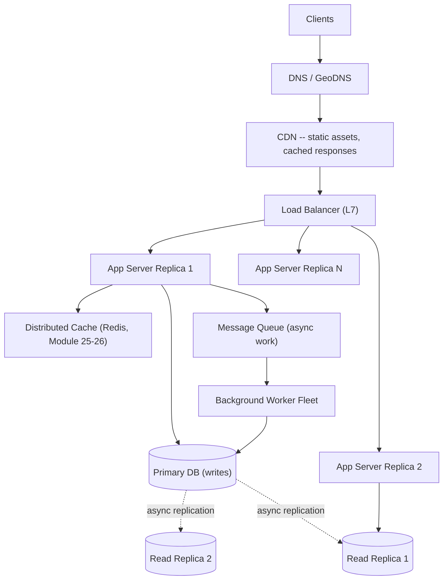

# Module 37 — System Design: Fundamentals, Scalability Building Blocks & Load Balancing

> Domain: System Design | Level: Beginner → Expert | Prerequisite: Nearly the entire course — this module is where C#/.NET internals (Modules 1-14), data-layer engines (Modules 18-28), and CS fundamentals (Modules 29-36) get synthesized into architecture-level decisions. Cross-references throughout are extensive and deliberate.

---

## 1. Fundamentals

### What is system design, and why is it evaluated differently from coding interviews?
System design is the practice of architecting a software system to meet a set of **functional requirements** (what it must do) and **non-functional requirements** (how well it must do it — latency, availability, consistency, cost, scale) under real-world constraints (budget, team size, time-to-market). It's evaluated differently from coding interviews specifically because there is **no single correct answer** — every design is a negotiated set of trade-offs, and what's being evaluated is the **quality of the trade-off reasoning**, not whether a candidate arrives at "the" solution.

### Why does this matter?
Because most real system-design failures aren't caused by not knowing a specific technology — they're caused by **skipping the requirements-gathering step** and designing for assumed, unstated requirements that turn out to be wrong (over-engineering for a scale that will never materialize, or under-engineering for a consistency/availability need that was never explicitly discussed) — precisely why this module treats requirements-gathering as foundational, not a formality to rush through before "the real design work."

### When does this matter?
Every System Design interview and every real architecture decision of consequence; the depth matters because a Staff/Principal-level interview specifically probes whether a candidate can **drive** the requirements conversation (asking the right clarifying questions unprompted) rather than waiting to be told constraints, and whether they can justify **why** a specific building block (a load balancer, a cache, a queue) is needed for *this* system's actual requirements, not recite it as a checklist item.

### How does it work (30,000-ft view)?
```
1. Clarify functional requirements (what must the system do)
2. Clarify non-functional requirements (scale, latency, availability, consistency)
3. Estimate capacity (back-of-envelope: QPS, storage, bandwidth)
4. High-level architecture (draw boxes: clients, load balancer, services, data stores, caches, queues)
5. Deep-dive on 1-2 components the interviewer signals interest in
6. Identify bottlenecks and failure modes; discuss trade-offs explicitly
```

---

## 2. Deep Dive

### 2.1 Requirements Gathering — the Single Highest-Leverage Skill in This Entire Domain
Functional requirements (e.g., "users can post updates, follow other users, see a feed") are usually straightforward to elicit. **Non-functional requirements** are where most candidates under-invest, and where most real production incidents actually originate (this course's entire incident log — Module 9's cascading restart, Module 10's captive-dependency leak, Module 19's blocking-chain incident — traces back to an *unstated or unexamined* non-functional requirement): **Scale** (how many users, requests/sec, data volume — order of magnitude matters far more than precision), **Latency** (p50/p99 targets, and for *which* operations — read latency and write latency frequently have very different tolerances), **Availability** (99.9% vs 99.99% — each additional "nine" costs meaningfully more engineering effort and money), **Consistency** (can reads be eventually consistent, Module 22/24/26's recurring theme, or must they be strongly consistent), and **Read/write ratio** (a read-heavy system and a write-heavy system have almost entirely different optimal architectures — caching helps enormously for the former, barely at all for the latter).

### 2.2 Back-of-the-Envelope Capacity Estimation — Precisely Why It Matters
Estimating QPS (queries per second), storage growth, and bandwidth **before** designing components is what prevents both over-engineering (designing a globally-sharded, multi-region system for a workload that fits comfortably on a single well-tuned database server, Module 18-20's entire toolkit) and under-engineering (missing that a seemingly-modest per-user data volume, multiplied by an actual target user count, produces a storage/throughput requirement that changes the entire architecture). The specific numbers matter less than the **order of magnitude** and the discipline of actually doing the estimation rather than designing on vibes — a system designed for 100 req/s and one designed for 100,000 req/s are different systems, and skipping this estimation step is how a candidate ends up defending an architecture mismatched to the actual (or assumed) scale.

### 2.3 Load Balancing — Algorithms and the Layer at Which They Operate
A load balancer distributes incoming requests across multiple backend replicas — the mechanism directly enabling the horizontal scaling this entire course has referenced repeatedly (Module 1's stateless-replica theme, Module 9's graceful-shutdown/readiness-probe-driven traffic routing). **Layer 4** (transport-layer, TCP/UDP) load balancing is faster (no request-content inspection) but coarser (routes based on IP/port only); **Layer 7** (application-layer, HTTP) load balancing can route based on request content (URL path, headers — enabling API-gateway-style routing, Module 16's rate-limiting/auth-scheme-scoping concerns) at the cost of more per-request processing overhead. **Algorithms**: round-robin (simple, ignores backend load), least-connections (routes to the currently-least-busy backend, better under uneven request durations), and consistent hashing (routes based on a hash of the request key, critical for cache-affinity and the exact same hash-slot/shard-key reasoning from Modules 23/25/27 — ensuring the same client/key consistently reaches the same backend, enabling effective per-backend caching).

### 2.4 Caching Strategies — Cache-Aside, Write-Through, Write-Behind
**Cache-aside** (lazy loading): application checks the cache first, falls back to the database on a miss, populating the cache afterward — the most common pattern, directly Module 12 §4/§Hard exercise's stampede-resistant caching implementation. **Write-through**: writes go to the cache and the database synchronously together — keeps the cache always consistent with the database, at the cost of added write latency. **Write-behind** (write-back): writes go to the cache immediately, asynchronously flushed to the database later — lowest write latency, but risks data loss if the cache fails before flushing (directly the same durability-vs-latency trade-off as Module 24/26's write-concern discussions, now at the caching-layer). Cache invalidation strategy (TTL-based, event-driven via a message queue, or explicit invalidation on write) must be chosen deliberately — "cache invalidation is one of the two hard problems in computer science" is a cliché precisely because getting it wrong (serving stale data indefinitely, or thrashing the cache with unnecessary invalidations) is a common, real failure mode.

### 2.5 CAP Theorem — the Foundational Trade-off Underlying Every Distributed Data Decision in This Course
The CAP theorem states a distributed system can provide at most **two of three** guarantees simultaneously during a network partition: **Consistency** (every read receives the most recent write), **Availability** (every request receives a non-error response), **Partition tolerance** (the system continues operating despite network partitions between nodes). Since partitions are an unavoidable reality in any real distributed system (partition tolerance isn't optional), the actual practical choice is **CP vs AP** during a partition — this is precisely the theoretical foundation underlying every consistency-model discussion across this course's data-layer modules: PostgreSQL's synchronous replication (Module 22 §2.3, CP-leaning), MongoDB's write concern (Module 24 §2.1, tunable per-operation), DynamoDB's eventual-vs-strong-consistency reads (Module 28 §2.1, explicitly exposing the CAP trade-off as a per-request parameter) — recognizing that all of these earlier, engine-specific discussions are **instances of the same underlying CAP trade-off** is exactly the kind of cross-module synthesis a Staff/Principal system-design interview rewards.

## 3. Visual Architecture

### Generic Scalable Web Application Architecture


### CAP Theorem Trade-off Space
```
                    Consistency
                        /\
                       /  \
                      /    \
                     / CP   \      <- SQL Server RCSI-off, synchronous PostgreSQL replication,
                    /  zone  \        MongoDB w:"majority" reads -- correctness over availability
                   /----------\      during a partition
                  /            \
                 /   AP zone    \  <- DynamoDB eventually-consistent reads, MongoDB w:1,
                /                \    async replication defaults -- availability over strict
      Availability -------- Partition   consistency during a partition
                            Tolerance
                     (not optional in a real distributed system)
```

## 4. Production Example
**Scenario**: A team designing a new social-feed feature skipped explicit non-functional-requirements discussion, defaulting to "we'll use strongly-consistent reads everywhere, like our existing order-processing system" (reusing an architectural pattern from a genuinely different, consistency-critical domain) — the feed feature launched with every feed-read going through the primary database with strong consistency, and under real user load (a much higher read volume than the order-processing system's, since every user loads their feed on every app open) the primary database became a severe bottleneck, with read latency degrading the entire platform including unrelated, genuinely consistency-critical order-processing traffic sharing the same database. **Investigation**: a post-incident architecture review revealed the feed feature's actual requirement was **never explicitly discussed** — feed content being a few seconds stale is entirely acceptable (a classic AP-leaning, eventually-consistent use case) — the strong-consistency choice was an unexamined default carried over from a different feature's genuinely different requirement, not a deliberate decision for this specific feature. **Fix**: redesigned the feed-read path to use read replicas (Module 22/24's eventual-consistency read-scaling pattern) with a short-TTL cache layer (cache-aside, §2.4), reserving strong consistency exclusively for the order-processing paths that actually need it — read latency and database load both improved dramatically, and the unrelated order-processing traffic's performance stabilized once no longer contending with the feed feature's disproportionate read volume on the same primary database. **Lesson**: the single most common, most costly system-design mistake is skipping explicit non-functional-requirements discussion and defaulting to a pattern borrowed from a different feature's different actual requirements — this is precisely why requirements-gathering (§2.1) is this module's leading, not trailing, concern, and why a Staff/Principal-level system-design interview specifically rewards a candidate who proactively asks "does this specific read path need strong consistency, or is eventual consistency acceptable here" rather than applying one consistency model uniformly across an entire system by default.

## 5. Best Practices
- Spend the first several minutes of any system-design exercise (interview or real) explicitly eliciting non-functional requirements — never assume or default without asking.
- Do back-of-envelope capacity estimation before choosing an architecture — let the actual numbers (order of magnitude) drive the design, not intuition alone.
- Choose consistency requirements **per data type/access pattern**, not uniformly across an entire system — the feed-vs-order-processing distinction in §4 is the norm, not an edge case.
- Use consistent-hashing-based load balancing specifically when cache affinity/session stickiness genuinely matters; simpler round-robin/least-connections otherwise.
- Choose a caching strategy (cache-aside, write-through, write-behind) deliberately based on the specific read/write latency and staleness-tolerance trade-off each access pattern actually needs.

## 6. Anti-patterns
- Skipping explicit non-functional-requirements elicitation, defaulting to assumptions or a pattern borrowed from an unrelated feature's different actual needs (§4's incident).
- Designing for an assumed "web scale" without doing capacity estimation, over-engineering (unnecessary sharding, unnecessary multi-region replication) for a workload that doesn't actually require it.
- Applying one uniform consistency model (always strong, or always eventual) across an entire system regardless of each specific data type's actual requirement.
- Treating CAP theorem as a one-time, system-wide decision rather than recognizing it applies per-operation/per-data-type (directly DynamoDB's per-request consistency parameter, Module 28 §2.1, demonstrates this granularity is achievable and often necessary).

---

## 10. Interview Questions

### Basic (10)
1. **Q: What's the difference between functional and non-functional requirements?** **A:** Functional requirements describe what the system must do; non-functional requirements describe how well it must do it (scale, latency, availability, consistency).
2. **Q: Why is back-of-envelope capacity estimation important before designing?** **A:** It ensures the architecture matches the actual order-of-magnitude scale needed, preventing both over-engineering and under-engineering.
3. **Q: What's the difference between Layer 4 and Layer 7 load balancing?** **A:** Layer 4 routes based on IP/port (transport layer, faster, coarser); Layer 7 routes based on request content (application layer, e.g., HTTP path/headers, more flexible but more overhead).
4. **Q: What is cache-aside?** **A:** The application checks the cache first, falls back to the database on a miss, and populates the cache afterward.
5. **Q: What are the three guarantees in the CAP theorem?** **A:** Consistency, Availability, Partition tolerance — a distributed system can provide at most two during a network partition.
6. **Q: Why is partition tolerance not really "optional" in CAP theorem trade-off discussions?** **A:** Network partitions are an unavoidable reality in any real distributed system, so the practical choice is actually between consistency and availability during a partition.
7. **Q: What's the difference between write-through and write-behind caching?** **A:** Write-through writes to cache and database synchronously (consistent, higher latency); write-behind writes to cache immediately and flushes to the database asynchronously (lower latency, risk of data loss).
8. **Q: What is consistent hashing used for in load balancing?** **A:** Routing requests based on a hash of a key so the same client/key consistently reaches the same backend, enabling cache affinity.
9. **Q: What's the first, cheapest lever on the "database scaling ladder"?** **A:** Vertical scaling and query/index optimization, before read replicas, caching, or sharding.
10. **Q: Why should a system-design answer avoid applying one uniform consistency model across an entire system?** **A:** Different data types/access patterns have genuinely different consistency requirements (a social feed vs. a financial transaction) — a uniform default is usually wrong for at least some part of the system.

### Intermediate (10)
1. **Q: Why does a Staff/Principal-level interview specifically reward proactively asking clarifying questions about non-functional requirements, rather than waiting to be told?** **A:** It demonstrates the candidate recognizes that most real design failures stem from unstated/unexamined requirements (§4), and that driving this conversation is itself a core system-design skill, not a formality.
2. **Q: Why can a p50 latency metric look excellent while p99 tells a very different story for a cache-aside-based system?** **A:** Cache-aside produces a bimodal latency distribution — p50 is dominated by fast cache hits, while p99 is dominated by slow cache misses (full database round-trips), especially under a cold cache — averaging or looking only at p50 hides this.
3. **Q: Why does routing reads to replicas require a plan for "read-your-writes" paths specifically?** **A:** Asynchronous replication means a replica can briefly lag behind the primary — a read immediately following a write on that same replica might not yet reflect it, requiring either routing that specific read to the primary or using a consistency mechanism that accounts for the lag (Module 28 §2.2's exact concern, here at the read-replica architecture level).
4. **Q: Why is sharding described as "the hardest-to-reverse" scaling lever, and why should it be a later, not first, resort?** **A:** Changing a shard key after data is distributed requires substantial data migration/redistribution (Module 23/27's recurring warning); the earlier, cheaper levers (vertical scaling, read replicas, caching) should be exhausted first since they're far less operationally risky and disruptive to reverse or adjust.
5. **Q: Why does statelessness matter for horizontal scaling specifically?** **A:** A stateless application server can have any request routed to it by a load balancer without correctness risk; a server holding request-affinity state (in-process session data) constrains routing (requiring sticky sessions) and complicates adding/removing replicas safely.
6. **Q: Why is cross-region replication fundamentally asynchronous, not a configuration choice?** **A:** The speed of light imposes a hard physical latency floor on any synchronous round-trip between distant regions — waiting for synchronous cross-region acknowledgment on every write would make write latency unacceptably high for most workloads, making asynchronous (eventually consistent) cross-region replication the practical default.
7. **Q: Why should rate limiting be considered part of the system's architecture, not just an API implementation detail?** **A:** Placing rate limiting at the load balancer/API-gateway layer lets abusive/excessive traffic be rejected before it ever reaches application servers, directly protecting downstream capacity — treating it as a deep implementation detail misses this "reject cheaply, as early as possible" architectural opportunity.
8. **Q: Why does auto-scaling's effectiveness depend on application startup time?** **A:** If new replicas take a long time to become ready (JIT warm-up, connection-pool establishment, Module 1/14's discussions), auto-scaling reacts too slowly to actually absorb a sudden load spike, potentially causing throttling/degradation during the gap between scale-out triggering and new capacity actually becoming available.
9. **Q: Why is a CDN considered both a latency and a load-reduction mechanism simultaneously?** **A:** Serving a cached response from a geographically-close edge node both reduces the physical-distance latency to the client and means the origin server never even receives that request, reducing its load — a rare case where one mechanism directly improves two different non-functional properties at once.
10. **Q: Why might a system-design candidate's answer be considered incomplete even if the high-level architecture diagram is correct?** **A:** If they haven't explicitly addressed non-functional trade-offs (consistency choice per data type, latency budget allocation across components, failure-mode handling) the diagram alone doesn't demonstrate the actual trade-off reasoning being evaluated — the diagram is necessary but not sufficient.

### Advanced (10)
1. **Q: Diagnose the feed-feature production incident (§4) from first principles, and design the requirements-gathering practice that would have caught it before implementation.**
   **A:** Root cause: an unexamined default (strong consistency, borrowed from an unrelated feature's genuinely different requirement) applied without ever explicitly asking "what consistency/staleness tolerance does *this specific* feature actually need." Safeguard: mandate an explicit, per-major-data-type consistency requirement discussion as a standing section of any new feature's design document (directly this course's recurring shared-template governance pattern) — requiring the design to state, for each significant read/write path, whether strong or eventual consistency is acceptable and *why*, making an unexamined default structurally visible (an empty/unjustified answer in this section is itself a red flag) rather than silently absent from the design entirely.
2. **Q: Design a latency budget for a request with a 200ms p99 target, touching a load balancer, an authentication check, a cache lookup, and (on a cache miss) a database query — allocate specific budgets and justify them.**
   **A:** Load balancer overhead: ~2ms (network-layer routing, minimal processing); authentication check: ~10ms (a cached/fast claims check, per Module 12 §4's lesson about NOT putting an uncached database call here); cache lookup: ~5ms (Redis, Module 25, sub-millisecond typically, budgeted generously); remaining ~183ms budgeted for the cache-miss database path (Module 18-20's query-optimization target) — explicitly reserving the *majority* of the budget for the slowest, least-predictable component (the database) rather than distributing evenly, since database query time is both the largest and most variable component; this budget should be **validated under load** (not just calculated on paper) via the load-testing discipline this course has repeatedly emphasized (Module 20 §Advanced Q7).
3. **Q: Explain how you would design a system-wide security review checklist mapped explicitly to an architecture diagram's layers, generalizing §8's "defense in depth per layer" guidance into an actionable review process.**
   **A:** For each layer in the architecture diagram (edge/CDN, load balancer, application servers, cache, database, message queue), require an explicit, documented answer to: what authentication/authorization applies here (if any), is traffic encrypted at this hop, what rate-limiting/abuse-prevention exists here, and what happens if this specific component is compromised (blast-radius analysis) — converting "we have security" into a per-component, mechanically-checkable set of answers, directly the same "walk through every layer explicitly" discipline this course has applied to middleware pipelines (Module 9), DI lifetimes (Module 10), and now full system architectures.
4. **Q: Design a multi-region architecture for a global e-commerce platform, addressing the CAP-theorem trade-off explicitly for both the product catalog (read-heavy, rarely-changing) and the shopping cart (read-write, session-scoped).**
   **A:** Product catalog: replicate to every region (AP-leaning, eventual consistency acceptable — a product's price/description being a few seconds stale across regions is a negligible risk), served from regional read replicas/CDN-cached responses for minimal latency; shopping cart: since it's inherently session-scoped to one user's current activity, route a given user's cart operations consistently to their **home region** (via consistent-hashing-style regional affinity, §2.3) rather than attempting cross-region strong consistency for it at all — sidestepping the CAP trade-off for this specific data type by ensuring it's never actually accessed from multiple regions simultaneously for the same user, rather than trying to solve cross-region strong consistency for a use case that doesn't structurally require it.
5. **Q: Explain why a system-design candidate proposing "just add a cache" as a universal fix for a slow-database-read problem might be giving an incomplete answer, and what additional analysis you'd expect.**
   **A:** Caching helps specifically for **repeated reads of the same, relatively-stable data** — if the actual read pattern is highly unique/rarely-repeated queries (poor cache-hit-rate potential, directly Module 28 §Advanced Q9's DAX-cache-hit-rate-analysis concern), adding a cache provides little benefit while adding real operational complexity (cache invalidation, Module 25's eviction-policy design) — a complete answer should address *why* caching would actually help for this specific access pattern (citing an expected cache-hit rate, even approximately) rather than proposing it as a reflexive, universal database-performance fix.
6. **Q: How would you design the failure-handling/graceful-degradation strategy for a system where the cache layer becomes unavailable, generalizing Module 25/28's DAX-fallback pattern to the system-design level?**
   **A:** The application layer must explicitly catch cache-connectivity failures and fall back to querying the database directly (at higher latency, but functional) rather than treating the cache as an unconditional, single-point-of-failure dependency — but this fallback path itself needs capacity planning: if the cache normally absorbs 90% of read traffic, a cache outage means the database suddenly receives 10x its normal load, potentially causing a **cascading failure** (the database, unprepared for this load, degrades or fails too) — a complete answer addresses both the fallback mechanism *and* whether the database has (or needs) enough headroom/its own protective rate-limiting to survive a full cache-bypass scenario without collapsing.
7. **Q: Design a strategy for validating a proposed system architecture's capacity estimates against reality once the system is actually built and receiving production traffic, rather than treating the initial back-of-envelope numbers as fixed.**
   **A:** Instrument the system from day one with the same metrics the capacity estimation was based on (actual QPS, actual data-growth rate, actual read/write ratio) and establish a standing review comparing actual production numbers against the original design-time estimates at regular intervals — a significant, sustained divergence (actual QPS 10x the original estimate, or a read/write ratio that inverted from what was assumed) is a concrete, actionable signal that the architecture may need to move to the next rung of the scaling ladder (§9) sooner than originally planned, converting capacity planning into an ongoing, data-driven practice rather than a one-time, design-phase estimate treated as permanently valid.
8. **Q: Explain how you would reason about whether a proposed system genuinely needs strong consistency for its core transactional writes, versus whether eventual consistency with a compensating mechanism (a later Saga-pattern module) would suffice.**
   **A:** Ask whether the business can tolerate a **temporarily inconsistent intermediate state that is later corrected** (e.g., an order briefly showing as "processing" across two systems before eventual consistency catches up, with a compensating action if something fails partway) versus requiring an **atomic, all-or-nothing guarantee with no observable intermediate state ever** (a bank transfer where partial completion is never acceptable, even momentarily) — the former can genuinely be built on eventual consistency plus compensation (trading some complexity for better availability/scalability); the latter genuinely needs strong consistency (a database transaction, Module 19/24's ACID guarantees) — this is the same "is this a genuine hard requirement, or an assumed default" analysis (§4/Advanced Q1) applied specifically to the strong-vs-eventual-consistency decision for a transactional workflow.
9. **Q: A team proposes designing every new service with global, multi-region, active-active deployment "for maximum availability and to future-proof against growth," regardless of the specific service's actual current requirements. Evaluate this as a Principal Engineer.**
   **A:** Push back on blanket, unexamined application of the most complex, most expensive architecture pattern available — active-active multi-region deployment introduces substantial complexity (conflict resolution for concurrent writes across regions, cross-region data-consistency trade-offs, meaningfully higher infrastructure cost) that's only justified for services with a **demonstrated, current** need for that level of availability/geographic distribution; recommend the same "climb the scaling ladder progressively, driven by actual demonstrated need" discipline (§9) applied here — most new services should start simpler (single-region, well-architected for their actual current scale) and evolve toward multi-region specifically when growth *actually* demands it, not preemptively "future-proofing" against growth that may never materialize, exactly this course's recurring "don't design for hypothetical future requirements" principle (stated in this course's very first guidance) now applied at the full-system-architecture scale.
10. **Q: As a Principal Engineer, how would you teach a team to conduct requirements-gathering rigorously for system design, given how easy it is to skip or rush given interview/deadline time pressure?**
    **A:** Provide a standing, concrete checklist (this course's recurring shared-template governance pattern) of the specific non-functional dimensions that must be explicitly addressed for any new system/feature (scale, latency per operation type, availability target, consistency per data type, read/write ratio) — framed not as a bureaucratic formality but as **directly preventing the exact class of incident this module's §4 demonstrates** (an unexamined default causing a real, costly production problem) — and pair this with training that explicitly walks through §4 as a case study, since a concrete, memorable incident ("we skipped this exact step and it cost us X") is far more effective at building genuine behavioral change than an abstract "always gather requirements" instruction alone, directly the same pedagogical principle this course has applied throughout (pairing every principle with both a production incident demonstrating its violation and a concrete fix).

---

## 11. Coding Exercises

*(System Design interviews are typically whiteboard/discussion-based rather than coding-based — this section instead provides structured design exercises with worked solutions, the standard format for this domain.)*

### Easy — Back-of-envelope capacity estimation for a URL shortener
**Problem**: Estimate QPS and storage for a URL-shortening service expecting 100 million new URLs/month and a 100:1 read:write ratio.
**Solution**:
```
Writes: 100,000,000 / (30 days * 86,400 sec) ≈ 38.6 writes/sec average
Reads (100:1 ratio): ≈ 3,860 reads/sec average
Storage per URL: ~500 bytes (original URL + short code + metadata) * 100M/month * 12 months (5-year retention) ≈ 3TB over 5 years
Peak traffic (assume 3x average): ~116 writes/sec, ~11,580 reads/sec peak
```
**Discussion**: These numbers directly inform the design: 3TB over 5 years fits comfortably on a single well-indexed database (no sharding needed, Module 18's indexing toolkit suffices); ~11,580 peak reads/sec strongly suggests a cache layer (§2.4) given the high read:write ratio and the fact that short-code lookups are an ideal cache-hit pattern (immutable once created) — the estimation directly justifies *which* rungs of the scaling ladder (§9) are actually needed, avoiding both under- and over-engineering.

### Medium — Design a cache-aside layer with stampede protection for the URL shortener's lookup path
**Problem**: Design the read path for resolving a short code to its original URL, given the traffic profile above.
**Solution**: Directly reuses Module 12 §11 Hard exercise's stampede-resistant cache-aside pattern (double-checked locking via Redis `SET NX`) — since short-code-to-URL mappings are immutable once created, cache with a long TTL (or no TTL at all, invalidating only on the rare "delete/deactivate a short URL" event) and a stampede-protection lock for the cache-population path specifically to handle a sudden burst of first-time lookups for a newly-viral shortened URL.

### Hard — Design a shard-key strategy if the URL shortener's storage requirement grows 100x
**Problem**: If projected growth changes to 10 billion URLs (300TB), design a sharding strategy.
**Solution**: Directly reuses Module 27 §Advanced Q2's single-table/partition-key design discipline — shard by a hash of the short code itself (high cardinality, evenly distributed, and the natural key every lookup already uses, avoiding Module 27 §4's low-cardinality hot-partition mistake) — `shard = hash(shortCode) mod shardCount`, with the read/write path computing the target shard directly from the short code with no separate lookup service needed, exactly mirroring Module 25 §2.5's Redis Cluster hash-slot mechanism and Module 23 §2.5's MongoDB sharding, now applied at the full-system-design level.

### Expert — Design the full failure-mode/graceful-degradation strategy for the URL shortener at scale
**Problem**: Design behavior for cache unavailability, a database replica lagging significantly, and a sudden 10x traffic spike.
**Solution**: Cache unavailable → fall back to direct database reads (Module 25 §Expert exercise's fallback pattern), with the database's own connection pool sized/rate-limited to survive a full cache-bypass scenario without cascading failure (Advanced Q6); replica lag exceeding a threshold → the read-routing layer falls back to the primary for that specific request rather than serving known-stale data past an acceptable threshold (Module 22 §Advanced Q6's graceful-degradation pattern); traffic spike → auto-scaling reacts (with pre-warmed/ReadyToRun-compiled application instances to minimize cold-start lag, Module 1/9's discussion) while the load-balancer/API-gateway layer applies rate limiting (Module 16) to shed excess load gracefully (returning 429s with `Retry-After`, Module 16 §2.4) rather than allowing the entire system to degrade uncontrollably for every user simultaneously.

---

## 12–17. System Design / LLD / Debugging / Decision / Case Study / Principal

*(This module's entire structure IS the system-design section — §4's production example, §11's worked exercises, and the extensive cross-referencing throughout §2/§7/§8/§9 collectively constitute the deep-dive system-design content typically split across separate sections in other modules.)*

## 18. Revision
**Key takeaways**: Requirements-gathering (especially non-functional requirements — scale, latency, availability, consistency, read/write ratio) is the single highest-leverage system-design skill, and skipping it is the most common, most costly real-world mistake (§4). Back-of-envelope capacity estimation should drive architecture choices, preventing both over- and under-engineering. CAP theorem is the theoretical foundation underlying every consistency-model decision across this course's data-layer modules (PostgreSQL, MongoDB, DynamoDB) — recognize these as instances of one underlying trade-off, not separate concerns. The database-scaling ladder (vertical/query-optimization → read replicas → caching → sharding) should be climbed progressively, driven by demonstrated need, not preemptively. Latency budgets, defense-in-depth security review, and graceful-degradation/failure-mode planning should be explicit, addressed-per-component parts of any system-design answer, not afterthoughts.

---

**Next**: Continuing autonomously to Module 38 — Designing Specific Systems (URL Shortener, Rate Limiter, News Feed, Chat System) as fully-worked, end-to-end case studies applying this module's framework.
