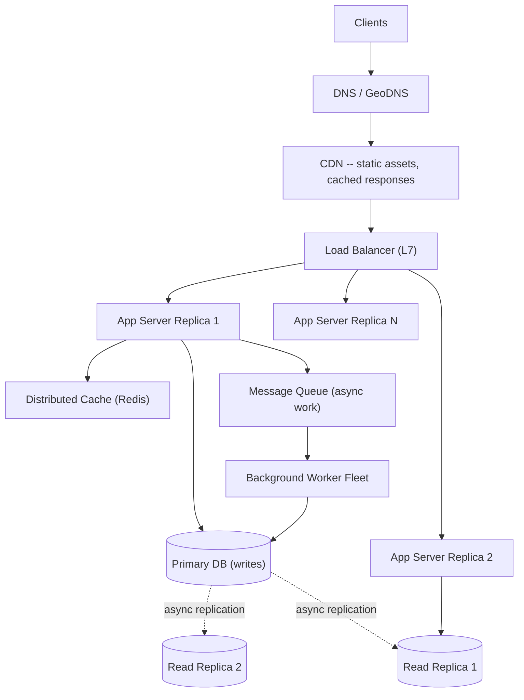
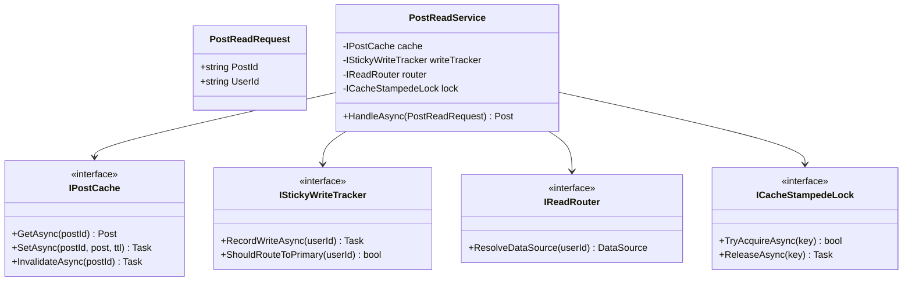
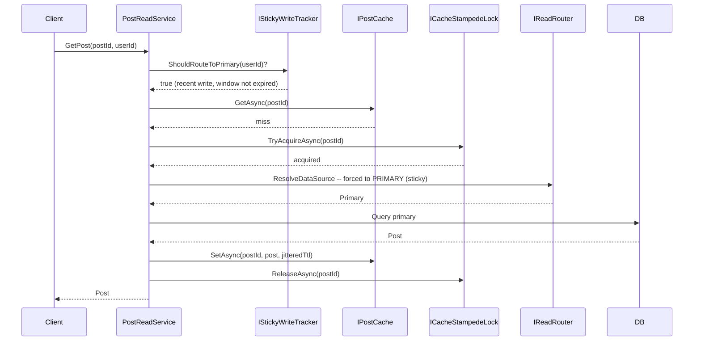

# Module 37 — System Design: Fundamentals, Scalability Building Blocks & Load Balancing

> Domain: System Design | Level: Beginner → Expert | Prerequisite: Nearly the entire course — this module is where C#/.NET internals (Modules 1-14), data-layer engines (Modules 18-28), and CS fundamentals (Modules 29-36) get synthesized into architecture-level decisions. Cross-references throughout are extensive and deliberate.

---

## 1. Fundamentals

### What is system design, and why is it evaluated differently from coding interviews?
System design is the practice of architecting a software system to meet a set of **functional requirements** (what it must do) and **non-functional requirements** (how well it must do it — latency, availability, consistency, cost, scale) under real-world constraints (budget, team size, time-to-market). It's evaluated differently from coding interviews specifically because there is **no single correct answer** — every design is a negotiated set of trade-offs, and what's being evaluated is the **quality of the trade-off reasoning**, not whether a candidate arrives at "the" solution.

### Why does this matter?
Because most real system-design failures aren't caused by not knowing a specific technology — they're caused by **skipping the requirements-gathering step** and designing for assumed, unstated requirements that turn out to be wrong (over-engineering for a scale that will never materialize, or under-engineering for a consistency/availability need that was never explicitly discussed) — precisely why this module treats requirements-gathering as foundational, not a formality to rush through before "the real design work."

### When does this matter?
Every System Design interview and every real architecture decision of consequence; the depth matters because a Staff/Principal-level interview specifically probes whether a candidate can **drive** the requirements conversation (asking the right clarifying questions unprompted) rather than waiting to be told constraints, and whether they can justify **why** a specific building block (a load balancer, a cache, a queue) is needed for *this* system's actual requirements, not recite it as a checklist item.

### How does it work (30,000-ft view)?
```
1. Clarify functional requirements (what must the system do)
2. Clarify non-functional requirements (scale, latency, availability, consistency)
3. Estimate capacity (back-of-envelope: QPS, storage, bandwidth)
4. High-level architecture (draw boxes: clients, load balancer, services, data stores, caches, queues)
5. Deep-dive on 1-2 components the interviewer signals interest in
6. Identify bottlenecks and failure modes; discuss trade-offs explicitly
```

---

## 2. Deep Dive

This section is written to be **complete on its own**. Everything a Principal/Staff-level interviewer probes on system-design fundamentals is derived here as explanation — the mechanism, the number that justifies it, the failure mode it creates, and the sentence that separates an excellent answer from an adequate one. Where a claim is the kind an interviewer will push back on, the push-back and its answer are written into the text rather than left for you to improvise.

### 2.1 Requirements Gathering — the Single Highest-Leverage Skill in This Entire Domain

**Functional requirements** describe what the system must *do* ("users can post updates, follow other users, see a feed"). They are usually easy to elicit, because the interviewer volunteers them and because product people think in these terms naturally.

**Non-functional requirements** describe how *well* it must do it, and they are where candidates under-invest and where real production incidents originate. There are five dimensions, and you should ask about all five by reflex:

| Dimension | What to ask | Why the answer changes the architecture |
|---|---|---|
| **Scale** | How many users, requests/sec, data volume? | Order of magnitude, not precision. A system for 100 req/s and one for 100,000 req/s are different systems. |
| **Latency** | p50 and p99 targets — **for which operation?** | Read and write latency tolerances are usually very different. A single "fast" target is a non-answer. |
| **Availability** | 99.9% or 99.99%? | Each nine costs meaningfully more engineering and money. 99.9% is 8.8 hours of downtime a year; 99.99% is 53 minutes. |
| **Consistency** | Per data type — can *this* read be stale, and for how long? | This is the question that is most often skipped, and §4's incident is what skipping it costs. |
| **Read/write ratio** | How many reads per write? | Read-heavy and write-heavy systems have almost entirely different optimal architectures. Caching transforms the former and barely touches the latter. |

Three points worth internalising, because they are what an interviewer is actually listening for:

**Drive the conversation; do not wait to be told.** At Staff/Principal level the requirements phase is itself being scored. Asking "what's the read:write ratio?" unprompted demonstrates that you know most design failures come from unstated requirements. Waiting to be handed constraints reads as junior regardless of how good the subsequent design is. The interviewer is often *deliberately* vague in the opening prompt precisely to see whether you narrow it.

**State the consistency requirement per data type, never per system.** "We'll use strong consistency" as a blanket statement is almost always wrong for part of the system, and "we'll use eventual consistency" is almost always wrong for a different part. The correct shape of the answer is a table: catalogue reads eventual, cart writes session-scoped, payment authorisation strongly consistent. §4's incident is exactly this failure — an unexamined default borrowed from a different feature's genuinely different requirement.

**Make the unexamined default structurally visible.** The organisational fix, and the answer to "how would you prevent this across a team rather than in one design," is a standing section in every design document requiring, for each significant read and write path, an explicit statement of whether strong or eventual consistency is acceptable *and why*. The value is not the prose; it is that an empty or unjustified answer becomes a visible red flag in review, where silence previously looked identical to a considered decision.

### 2.2 Back-of-the-Envelope Capacity Estimation — and What It Eliminates

Estimating QPS, storage growth and bandwidth **before** designing components is what prevents both over-engineering (a globally-sharded multi-region system for a workload that fits on one well-tuned database) and under-engineering (a modest per-user data volume that, multiplied by the real user count, changes the architecture).

The constants worth memorising, because you will not have a calculator:

```
Seconds in a day          ≈ 86,400      ≈ 10^5     (use 10^5; the 15% error never matters)
Seconds in a month        ≈ 2.5 × 10^6
Peak-to-average ratio     ≈ 2–3× for consumer traffic; 5–10× for event-driven spikes
1 million/day             ≈ 12/sec average
1 billion/day             ≈ 12,000/sec average
Typical row / small doc   ≈ 100 B – 1 KB
Thumbnail / small image   ≈ 50 – 200 KB
One HD video minute       ≈ 50 MB
```

The discipline is not the arithmetic — it is **saying out loud what the number eliminates.** This is the single clearest Senior→Staff differentiator in the estimation phase. "40 writes/sec" is a number. "40 writes/sec is two orders of magnitude below a single primary's ceiling, so any sharded-write design here is solving a problem we do not have" is an argument. Run the estimate, then state the elimination.

Equally important: **retire the numbers that do not matter.** If bandwidth computes to 12 MB/s, say "that's trivial and I won't mention it again" and move on. Carrying an irrelevant number through the design wastes clock and signals that you cannot tell a constraint from a calculation.

**Estimates are a hypothesis, not a fact.** The practice that closes the loop is instrumenting the system from day one with the *same* metrics the estimate was built on — actual QPS, actual data growth rate, actual read/write ratio — and holding a standing review comparing production reality against the design-time estimate. A sustained divergence (actual QPS 10× the estimate, or a read/write ratio that inverted) is a concrete signal to climb the next rung of the scaling ladder sooner than planned. This converts capacity planning from a one-time design-phase ritual into a data-driven practice, and it is the answer to "how would you validate your estimates once the system is live."

### 2.3 Latency, Percentiles and the Latency Budget

**Averages lie, and p50 lies almost as often.** A cache-aside system has a fundamentally **bimodal** latency distribution: p50 is dominated by fast cache hits (sub-millisecond), while p99 is dominated by cache misses that pay a full database round trip. A dashboard showing a healthy mean or median can sit on top of a p99 that is 50× worse, and under a cold cache the *entire* distribution shifts to the slow mode. Always ask for and quote p99; quote p999 for anything fronting a user-visible page load.

**Tail latency amplifies under fan-out.** If a request touches 10 backends in parallel and each has a 1% chance of being slow, the probability that *at least one* is slow is `1 − 0.99^10 ≈ 9.6%`. Your p99 backend becomes roughly your p90 request. This is why scatter-gather designs need hedged requests, deadlines and partial results — and why "each service is fast" does not imply "the system is fast."

**A latency budget allocates the target across components, unevenly and deliberately.** Worked example for a 200 ms p99 target on a request touching a load balancer, an auth check, a cache lookup and (on miss) a database query:

```
Load balancer / network hop        ~   2 ms   routing only, no content inspection
Authentication check               ~  10 ms   a cached claims check — NOT an uncached DB call
Cache lookup (Redis)               ~   5 ms   typically sub-ms; budgeted generously
Remaining for the DB miss path     ~ 183 ms   the largest AND most variable component
                                   ───────
                                     200 ms
```

The reasoning that matters: **reserve the majority of the budget for the slowest and least predictable component**, rather than distributing evenly. An even split looks tidy and fails in production, because the database's variance is what actually consumes the tail. And the budget must be **validated under load**, not calculated on paper — a budget that has never been measured is a wish.

### 2.4 Load Balancing — Layer, Algorithm, and the Health Check That Lies

A load balancer distributes requests across backend replicas; it is the mechanism that makes horizontal scaling possible at all.

**Layer 4 vs Layer 7.** L4 balancing operates at the transport layer (TCP/UDP), routing on IP and port. It is faster because it never inspects request content, and coarser for the same reason. L7 balancing operates at the application layer (HTTP), and can route on path, header, cookie or method — which is what enables API-gateway behaviour: splitting `/api/v1/orders` onto one service and `/{code}` onto another, applying per-route rate limits, terminating TLS, rewriting headers. The cost is per-request processing overhead. Choose L7 whenever routing decisions depend on request content, which in practice is most modern systems; choose L4 for raw throughput on a uniform protocol.

**Algorithms.**

- **Round-robin** — simple, and ignores backend load entirely. Fine when request costs are uniform; poor when they are not, because a backend stuck on a slow request keeps receiving new ones.
- **Least-connections** — routes to the currently least-busy backend. Materially better under uneven request durations, and the sane default for most HTTP services.
- **Least response time** — least-connections weighted by observed latency. Better still, and slightly more prone to oscillation.
- **Consistent hashing** — routes on a hash of a request key so the same key reliably reaches the same backend. This is what enables per-backend cache affinity, and it is the same hash-ring reasoning used for shard placement. Its defining property is that adding or removing one backend of N remaps only ~1/N of keys, rather than remapping everything as naive `hash % N` would.

**The health check is where load balancers actually go wrong.** A shallow check (`GET /health` returning 200 if the process is alive) will keep routing traffic to an instance whose database connection pool is exhausted — the process is alive and useless. A deep check (verifying the database, the cache and downstream dependencies) fixes that and introduces a far worse failure: when the shared database degrades, *every* instance fails its health check simultaneously, the load balancer removes the entire fleet, and a slow dependency becomes a total outage. The resolution is a **shallow liveness check for the load balancer** plus a separate **deep readiness check for deploy gating and alerting**, and a **panic threshold** in the balancer (Envoy's term) that says: if more than ~50% of backends are unhealthy, ignore health status entirely and spread traffic across all of them, on the reasoning that a degraded backend beats no backend. Any protection mechanism with a feedback path into the thing it protects can amplify the failure it exists to contain; the health check is the purest example.

### 2.5 Caching — Strategies, Invalidation, and When It Does Not Help

**Cache-aside (lazy loading).** The application checks the cache, falls back to the database on a miss, and populates the cache afterwards. The most common pattern, and the default. Its properties: only requested data is cached (efficient), a cache miss costs an extra round trip (bimodal latency, §2.3), and stale data persists until TTL or explicit invalidation.

**Write-through.** Writes go to cache and database synchronously together. The cache is always consistent with the database; write latency rises by the cache write. Useful when reads immediately follow writes and staleness is unacceptable.

**Write-behind (write-back).** Writes land in the cache and flush to the database asynchronously. Lowest write latency, and the cache becomes a durability risk — a cache failure before flush loses committed-looking writes. This is the same durability-versus-latency trade as a database's write concern, relocated to the caching layer. Use it only where loss of a bounded window of writes is genuinely acceptable.

**Invalidation** must be chosen deliberately: TTL-based (simple, bounded staleness, no coordination), event-driven via a message queue (fresher, and now the cache depends on the bus), or explicit on write (freshest, and it silently breaks the moment a second write path is added — which always happens). TTL is the honest default precisely because it makes staleness a *stated bound* rather than an assumption that holds until someone adds a code path.

**Caching is not a universal fix for a slow read, and saying so is a differentiator.** Caching helps for **repeated reads of relatively stable data**. If the real access pattern is high-cardinality, rarely-repeated queries, a cache adds invalidation complexity, an eviction policy to tune, a new failure mode and an operational dependency — while delivering a hit rate too low to matter. A complete answer to "the database is slow, add a cache" names an *expected hit rate*, even approximately, derived from the access pattern. If you cannot estimate the hit rate, you cannot claim the benefit.

**Plan for the cache being gone.** The application must catch cache-connectivity failures and fall back to the database — but the fallback needs capacity planning, and this is the part that is usually missed. If the cache normally absorbs 90% of reads, losing it means the database instantly receives **10× its normal load**, which is how a cache outage becomes a database outage becomes a full outage. The complete answer addresses both the fallback mechanism *and* whether the database has the headroom, the admission control, or the load-shedding policy to survive a full cache bypass. Compute the miss-path cost and check it against the SLA: if the miss path is 8 ms and the budget is 200 ms, a total cache loss is survivable by arithmetic. If it is not, the cache was never a cache — it was a load-bearing dependency in a cache costume, and it needs to be treated (replicated, capacity-planned, failover-tested) accordingly.

**Do not share a cache across workloads of different criticality.** A single Redis cluster serving both a latency-critical, low-volume payment-authorisation cache and a high-volume, latency-tolerant content-feed cache saves real but small infrastructure cost, and buys a large blast radius: the feed's bursty traffic can evict the authorisation working set under memory pressure, or saturate connection and CPU budget and add queueing latency to the authorisation path. A low-stakes workload's load spike becomes a high-stakes workload's latency incident. This is the **bulkhead** principle — physically separate resources, or at minimum separate pools and quotas, for workloads with materially different criticality.

**Three caching failure modes worth naming**, because interviewers ask for them by name:

- **Stampede / thundering herd** — a hot key expires and a thousand concurrent requests all miss and all hit the database. Fix: request coalescing (one in-flight fetch per key, the rest await it), plus TTL jitter so keys do not expire in lockstep.
- **Cold start** — a freshly deployed or restarted cache serves nothing, so the database takes full load at exactly the moment the system is least stable. Fix: warm the cache before shifting traffic, and stagger restarts.
- **Hot key** — one key exceeds a single node's or partition's throughput ceiling, while aggregate cluster metrics stay green. Fix: a small in-process LRU in front of the shared cache, and key replication (`key#0`…`key#9`) as the escape hatch. Detection must be **per-key**, because aggregate metrics are structurally blind to it.

### 2.6 The Database Scaling Ladder — in Order, and Why the Order Matters

The rungs, cheapest and most reversible first:

1. **Query and index optimisation.** Free, reversible, and routinely worth an order of magnitude. Always first.
2. **Vertical scaling.** A bigger instance. Boring, immediate, and buys real time. Its limit is a single machine's ceiling and the fact that it does nothing for availability.
3. **Read replicas.** Scales reads, does nothing for writes, and converts a capacity problem into a **consistency problem** — see below.
4. **Caching.** Scales reads further and introduces the staleness, stampede and cold-start modes of §2.5.
5. **Sharding / partitioning.** Scales writes. The rung of last resort.

**Every rung converts a capacity problem into a consistency problem**, and naming that is the Staff-level framing. Replicas buy read throughput and pay in stale reads. A cache buys latency and pays in staleness, a stampede risk and a new SPOF. A queue buys availability and pays in at-least-once delivery and a silent backlog.

**Read replicas require an explicit read-your-writes plan.** Asynchronous replication means a replica lags the primary, typically by milliseconds and occasionally by much more. A user who writes and immediately reads — posts a comment then refreshes, creates a link then clicks it — can be served by a lagging replica and see their own write missing. This is not a rare edge case; it is the single most common user-visible replication bug. The fixes, in increasing order of sophistication: route the writing session's reads to the primary for a short window; return the written entity in the write response so the client need not re-read; or track a per-session log-sequence-number watermark and route to any replica that has caught up past it.

**Sharding is the hardest rung to reverse, which is why it is last.** Changing a shard key after data is distributed requires a full redistribution — a migration project with a dual-write phase, a backfill, a verification phase and a cutover, all against live traffic. The earlier rungs are configuration changes; this one is a quarter of engineering time. Additional costs that candidates under-state: cross-shard queries and joins become application-level scatter-gather, cross-shard transactions require a saga or two-phase commit, and `AUTO_INCREMENT` stops working so you need a distributed ID scheme. Choose the shard key so that the dominant access pattern is single-shard, and choose it knowing that changing it later is the expensive thing.

**A rung climbed without a measured bottleneck buys its failure modes for free and its benefits not at all.** This is the corollary that most separates Staff from Senior framing, and it applies to every item above.

### 2.7 Statelessness, Auto-Scaling and Cold Start

**Statelessness is what makes horizontal scaling correct, not merely possible.** A stateless application server can receive any request from the load balancer without correctness risk. A server holding in-process session state constrains routing (requiring sticky sessions), makes adding and removing replicas unsafe (a scale-in event destroys sessions), and turns a deploy into a user-visible event. Push session state to a shared store — Redis or a signed token — and the tier becomes genuinely interchangeable.

"Stateless" is a claim that is easy to make and hard to be true. In-memory caches, in-process rate-limiter counters, scheduled jobs that assume one instance, and local file uploads are all state, and each one quietly reintroduces affinity.

**Auto-scaling's effectiveness is bounded by startup time.** If a new replica takes 90 seconds to become ready — JIT warm-up, connection-pool establishment, cache warming, dependency health checks — then auto-scaling cannot absorb a spike that arrives in 10 seconds. During that gap the existing fleet takes the entire spike, which is precisely when it is most likely to fail. Three consequences: measure time-to-ready as a first-class metric; pre-warm capacity ahead of *known* events rather than reacting; and accept that for true step-function load (a market event, a viral post) reactive scaling is the wrong primary mechanism and **load shedding at the edge** is the right one.

**Auto-scaling can also scale you into an outage.** If instances are unhealthy because a shared dependency is saturated, adding instances adds connections to that dependency and makes it worse; the scaler observes continued distress and adds more. The bound that prevents this is a maximum instance count, a cooldown between scaling actions, and a scaling signal that reflects the *service's own* work (queue depth, concurrency) rather than a symptom of someone else's saturation.

### 2.8 CAP — What It Actually Says, and the Ways It Is Misused

The CAP theorem states that during a **network partition**, a distributed system can provide at most two of: **Consistency** (every read sees the most recent write), **Availability** (every request gets a non-error response), **Partition tolerance** (the system keeps operating despite partitions).

Because partitions are an unavoidable physical reality, partition tolerance is not a choice. **The practical decision is CP versus AP during a partition** — refuse to serve rather than serve possibly-stale data, or serve rather than refuse. Every consistency-model discussion in the data layer is an instance of this same trade: PostgreSQL synchronous replication leans CP; MongoDB's write concern makes it tunable per operation; DynamoDB's eventual-versus-strong read flag exposes the choice as a per-request parameter.

Three corrections that interviewers use to separate memorisation from understanding:

**CAP only binds during a partition.** When the network is healthy, a system can be both consistent and available; the theorem says nothing about that case. The more useful formulation is **PACELC**: *if Partitioned, choose A or C; Else, choose Latency or Consistency.* The "else" half is what actually governs day-to-day design, because partitions are rare and the latency-versus-consistency trade is continuous.

**"Eventual consistency" describes read staleness, not write conflict resolution.** This is the misuse worth being able to dismantle on the spot. A design review that says "we use eventual consistency for the ledger because it improves availability" has confused two different things. A ledger's defining property — every debit has a matching credit, the balance is never observably wrong — is a *correctness invariant*, not a staleness tolerance. The question that exposes it: "if two concurrent debits both read the same starting balance and both commit, what prevents the account going negative?" If the answer is "eventual consistency resolves it," the answer is wrong; eventual consistency says nothing about write-write conflicts. A ledger needs CP writes even where its downstream *read* views (a dashboard of recent transactions) can legitimately be eventually consistent. Consistency is chosen per operation, not per system.

**Availability in CAP is not the same as the availability in your SLO.** CAP availability means every non-failing node returns a non-error response. An SLO of 99.99% is a statistical claim about a time window. A CP system can have excellent SLO availability, because partitions are rare.

### 2.9 Multi-Region — Physics First, Then Topology

**Cross-region replication is asynchronous because of the speed of light, not because of a configuration default.** A round trip between London and Virginia is ~75 ms at best; requiring synchronous cross-region acknowledgement on every write adds that to every write, irreducibly. For most workloads that is unacceptable, which makes asynchronous — and therefore eventually consistent — cross-region replication the practical default. This is a physical constraint, so "just make it synchronous" is not available as an answer.

**Design per data type, and prefer sidestepping the trade over solving it.** Worked example for a global e-commerce platform:

- **Product catalogue** — read-heavy, rarely changing, staleness of seconds is negligible. Replicate to every region, serve from regional replicas and CDN. AP-leaning, and correct.
- **Shopping cart** — read-write, but inherently scoped to one user's current session. Rather than attempting cross-region strong consistency, route a given user's cart operations to their **home region** by consistent hashing on user ID. The CAP trade is not solved; it is **structurally avoided**, because the data is never accessed from two regions simultaneously for the same user. Recognising when a requirement can be designed away rather than satisfied is a Principal-level move.

**Active-active everywhere is usually premature complexity.** A proposal to make every new service globally active-active "for maximum availability and to future-proof against growth" should be pushed back on: active-active introduces cross-region write conflict resolution, materially higher cost, and a testing burden that most teams never actually discharge — justified only by a demonstrated, current need. Most services should start single-region and well-architected for their actual scale, and climb toward multi-region when growth demands it. The exception worth knowing: in regulated financial firms the ladder is genuinely reordered, because DORA and PRA operational-resilience obligations can make multi-region a *day-one regulatory* requirement rather than a scaling rung, and data-residency law can make certain sharding topologies illegal rather than merely expensive.

### 2.10 Failure Containment, Blast Radius, and the Postmortem Discipline

For **every** box in the architecture diagram you should be able to answer: what happens to the rest of the system when this one fails or degrades? A diagram without that analysis is a picture, not a design.

The containment mechanisms, and the failure each bounds:

- **Timeouts** — bound how long a caller waits. Every network call has a timeout; an unbounded call is a thread leak with extra steps.
- **Retries with exponential backoff and jitter** — recover from transient faults without synchronising every client into a retry storm. Jitter is not optional; without it, retries arrive in waves.
- **Retry budgets** — cap retries as a *fraction of total traffic* (e.g. 10%), so retry amplification cannot exceed a known multiple. Per-request retry limits do not bound system-wide amplification; budgets do.
- **Circuit breakers** — stop calling a downstream that is clearly failing, so its recovery is not prevented by continued load. The subtlety: a breaker must trip on *transport* failures, not on legitimate business rejections — a breaker that counts declined payments as errors will open during a fraud attack and stop processing legitimate traffic.
- **Bulkheads** — isolate resource pools so one dependency's saturation cannot consume the threads, connections or memory that unrelated traffic needs.
- **Load shedding** — reject work at the edge, cheaply, when the system is beyond capacity. Rejecting 10% of requests fast is strictly better than serving 100% of them past the timeout, because the latter produces zero successful work and full resource consumption.

**"The root cause was a bug in the retry logic" is an incomplete postmortem, and knowing why is a Principal-level answer.** That identifies the proximate trigger, not why the system's design allowed that trigger to produce a customer-facing outage. The next question is: **what made this bug's blast radius as large as it was?** The answer usually surfaces a structural gap — no circuit breaker to halt retries against an obviously-failing downstream, no bulkhead isolating the retry storm's resource consumption, no retry budget bounding amplification, no headroom downstream. Fixing only the retry bug fixes this incident's trigger and leaves the structural gap available for the next, differently-triggered one. The reusable prevention, not the proximate cause, is the deliverable.

### 2.11 Security as a Property of Each Architectural Layer

Turn "we have security" into a per-component, mechanically checkable set of answers. For **each** layer in the diagram — edge/CDN, load balancer, application tier, cache, database, message bus — require a documented answer to four questions:

1. What authentication and authorisation applies at this hop?
2. Is traffic encrypted here, in transit and at rest?
3. What rate limiting or abuse prevention exists here?
4. **If this specific component is compromised, what can the attacker reach?** (Blast-radius analysis.)

**Rate limiting is architecture, not an API implementation detail.** Placed at the load balancer or gateway, abusive traffic is rejected before it consumes an application thread, a database connection or a billed compute-second. Placed deep in the application, every rejected request has already cost you nearly everything it would have cost to serve. Reject as early and as cheaply as possible is a structural decision made when the diagram is drawn.

**"It's internal, so it doesn't need authentication" is a category error, and you should be able to dismantle it.** Being "inside the VPC" is a *network-topology* property; authentication establishes an *identity* property. Conflating them means that any single compromised host anywhere in that VPC — a dependency-confusion attack on an unrelated service, a debug endpoint left open — can call the unauthenticated service with no additional effort. A perimeter that authenticates external traffic says nothing about lateral movement after any internal host falls. The standing default is mutual service-to-service authentication (mTLS or signed service tokens) for anything handling non-trivial data or state changes, with "internal" treated as a routing convenience and never as an authorisation decision. Make the argument concrete in review — "which specific internal service, if compromised, does this let move laterally to *this* one" — rather than citing zero-trust as policy.

### 2.12 Proving It in Production — Measurement, Load Testing, Reconciliation

**Measure availability from the client's vantage point, or you are grading your own exam.** A server reporting 100% uptime while its load balancer's health checks failed, or while one region was unreachable due to an upstream DNS issue, is not evidence of client-observed availability. The mechanism that withstands an auditor: synthetic external probes from multiple independent network vantage points — deliberately *not* from inside the same cloud region — hitting the real public endpoint at a fixed interval, logging success and latency to a store independent of the system being measured, with the SLO computed from that log. Agree in advance what counts as a failure (which status codes, what timeout threshold, whether a degraded-but-200 response counts), because ambiguity there is exactly where a post-hoc SLO dispute happens.

**"We load-tested to 10× peak" can be a false sense of security.** A test that replays 10× the request volume against today's data shape validates throughput and almost none of the failure modes that actually take systems down. Typical gaps: uniformly distributed synthetic keys, which miss hot-key and hot-partition effects entirely; a short duration, which misses slow degradation — connection-pool exhaustion, memory growth, cache hit-rate decay under sustained eviction; and no failure injected concurrently with load, so the failure-handling paths are only ever exercised at idle. A load test that genuinely validates 10× readiness replays the **real skewed access distribution**, runs long enough to expose slow leaks, ramps in the *shape* real traffic arrives in (so auto-scaling's reaction time is actually tested), and kills a replica or a cache node mid-test to prove the degradation paths work under load.

**Every derived copy of the data drifts, and "the database is the source of truth" is a claim until it is monitored.** A system with a search index, a cache and a warehouse copy has three derived copies, each of which can silently diverge — a failed invalidation, an indexer consumer that stalled, a partially failed ETL. Drift is invisible because each copy looks internally consistent: the search index returns *something*. Two mechanisms convert the claim into a property: drive every derived copy from the **same durable event stream** (the outbox pattern) rather than best-effort direct writes, and run a standing **reconciliation** job that sample-compares each derived copy against the source and alerts on divergence beyond a small tolerance.

The reconciliation discipline has one non-negotiable rule that recurs throughout this folder: **the expected set must be derived independently of the logic being checked.** A check whose expected values come from the same code path it is verifying agrees with itself perfectly and detects nothing. And an **aggregate cannot detect a concentrated failure** — a 99.9% overall success rate is compatible with one customer being 100% broken. Detect by **aging** (how old is the oldest unprocessed item) rather than by rate, because aging is the only signal that catches silent non-progress.

### 2.13 The Principal's Design Review — Five Questions

A design document is ready to build when it can answer these five concretely. Each maps to a documented failure mode above, and together they catch the large majority of real design failures:

1. **"For each major data type, is the consistency requirement stated explicitly, and justified by a stated need rather than a default?"** — §4's incident, and §2.1.
2. **"Where are the capacity numbers, what breaks first as load grows, and how much headroom is there before it does?"** — §2.2, §2.6.
3. **"For every component in the diagram, what happens to the rest of the system when this one fails or degrades?"** — §2.5's cache-loss arithmetic, §2.10.
4. **"Where does this design add complexity beyond the simplest version meeting the stated requirements, and what specific, *current* constraint justifies it?"** — §2.9.
5. **"How will we know, in production, if any of these assumptions turn out to be wrong?"** — §2.12.

**Distinguishing necessary from premature complexity** is the judgement question underneath all five, and it has a mechanical test. Demand that the complexity be justified by a **specific, quantified, currently-true** constraint taken from the actual estimation — not a hypothetical. A hybrid fan-out model is justified by a real follower-count distribution and a write-amplification calculation showing that pure push takes 166 seconds to propagate one celebrity's post while starving everything else. The *same* complexity proposed "in case we get a viral account someday," with no distribution to point at, is speculation. The test to apply in review: ask the proposer to show the number from *their* system's estimation that the simpler design fails on. If they cannot produce one, the complexity is premature — and this is the same reasoning that rejects blanket active-active multi-region in §2.9.

A document that cannot answer all five is not ready regardless of how polished its architecture diagram is. The diagram was never what was being evaluated.

---

## 3. Visual Architecture

### Generic Scalable Web Application Architecture

```mermaid
graph TB
 Client[Clients] --> DNS[DNS / GeoDNS]
 DNS --> CDN[CDN -- static assets, cached responses]
 CDN --> LB["Load Balancer (L7)"]
 LB --> App1[App Server Replica 1]
 LB --> App2[App Server Replica 2]
 LB --> App3[App Server Replica N]
 App1 --> Cache["Distributed Cache (Redis)"]
 App1 --> Queue["Message Queue (async work)"]
 App1 --> Primary[("Primary DB (writes)")]
 Primary -.->|async replication| Replica1[("Read Replica 1")]
 Primary -.->|async replication| Replica2[("Read Replica 2")]
 App2 --> Replica1
 Queue --> Worker[Background Worker Fleet]
 Worker --> Primary
```

### CAP Theorem Trade-off Space
```
 Consistency
 /\
 / \
 / \
 / CP \ <- SQL Server RCSI-off, synchronous PostgreSQL replication,
 / zone \ MongoDB w:"majority" reads -- correctness over availability
 /----------\ during a partition
 / \
 / AP zone \ <- DynamoDB eventually-consistent reads, MongoDB w:1,
 / \ async replication defaults -- availability over strict
 Availability -------- Partition consistency during a partition
 Tolerance
 (not optional in a real distributed system)
```

## 4. Production Example
**Scenario**: A team designing a new social-feed feature skipped explicit non-functional-requirements discussion, defaulting to "we'll use strongly-consistent reads everywhere, like our existing order-processing system" (reusing an architectural pattern from a genuinely different, consistency-critical domain) — the feed feature launched with every feed-read going through the primary database with strong consistency, and under real user load (a much higher read volume than the order-processing system's, since every user loads their feed on every app open) the primary database became a severe bottleneck, with read latency degrading the entire platform including unrelated, genuinely consistency-critical order-processing traffic sharing the same database. **Investigation**: a post-incident architecture review revealed the feed feature's actual requirement was **never explicitly discussed** — feed content being a few seconds stale is entirely acceptable (a classic AP-leaning, eventually-consistent use case) — the strong-consistency choice was an unexamined default carried over from a different feature's genuinely different requirement, not a deliberate decision for this specific feature. **Fix**: redesigned the feed-read path to use read replicas (the eventual-consistency read-scaling pattern from the relational-database modules) with a short-TTL cache layer (cache-aside), reserving strong consistency exclusively for the order-processing paths that actually need it — read latency and database load both improved dramatically, and the unrelated order-processing traffic's performance stabilized once no longer contending with the feed feature's disproportionate read volume on the same primary database. **Lesson**: the single most common, most costly system-design mistake is skipping explicit non-functional-requirements discussion and defaulting to a pattern borrowed from a different feature's different actual requirements — this is precisely why requirements-gathering is this module's leading, not trailing, concern, and why a Staff/Principal-level system-design interview specifically rewards a candidate who proactively asks "does this specific read path need strong consistency, or is eventual consistency acceptable here" rather than applying one consistency model uniformly across an entire system by default.
## 11. Coding Exercises

*(System Design interviews are typically whiteboard/discussion-based rather than coding-based — this section instead provides structured design exercises with worked solutions, the standard format for this domain.)*

### Easy — Back-of-envelope capacity estimation for a URL shortener
**Problem**: Estimate QPS and storage for a URL-shortening service expecting 100 million new URLs/month and a 100:1 read:write ratio.
**Solution**:
```
Writes: 100,000,000 / (30 days * 86,400 sec) ≈ 38.6 writes/sec average
Reads (100:1 ratio): ≈ 3,860 reads/sec average
Storage per URL: ~500 bytes (original URL + short code + metadata) * 100M/month * 12 months (5-year retention) ≈ 3TB over 5 years
Peak traffic (assume 3x average): ~116 writes/sec, ~11,580 reads/sec peak
```
**Discussion**: These numbers directly inform the design: 3TB over 5 years fits comfortably on a single well-indexed database (no sharding needed, the indexing toolkit suffices); ~11,580 peak reads/sec strongly suggests a cache layer given the high read:write ratio and the fact that short-code lookups are an ideal cache-hit pattern (immutable once created) — the estimation directly justifies *which* rungs of the scaling ladder are actually needed, avoiding both under- and over-engineering.

### Medium — Design a cache-aside layer with stampede protection for the URL shortener's lookup path
**Problem**: Design the read path for resolving a short code to its original URL, given the traffic profile above.
**Solution**: Directly reuses the stampede-resistant cache-aside pattern (double-checked locking via Redis `SET NX`) — since short-code-to-URL mappings are immutable once created, cache with a long TTL (or no TTL at all, invalidating only on the rare "delete/deactivate a short URL" event) and a stampede-protection lock for the cache-population path specifically to handle a sudden burst of first-time lookups for a newly-viral shortened URL.

### Hard — Design a shard-key strategy if the URL shortener's storage requirement grows 100x
**Problem**: If projected growth changes to 10 billion URLs (300TB), design a sharding strategy.
**Solution**: Directly reuses §2.6's shard-key discipline — shard by a hash of the short code itself (high cardinality, evenly distributed, and the natural key every lookup already uses, avoiding the low-cardinality hot-partition mistake) — `shard = hash(shortCode) mod shardCount`, with the read/write path computing the target shard directly from the short code with no separate lookup service needed, exactly mirroring the Redis Cluster hash-slot mechanism and the MongoDB sharding, now applied at the full-system-design level.

### Expert — Design the full failure-mode/graceful-degradation strategy for the URL shortener at scale
**Problem**: Design behavior for cache unavailability, a database replica lagging significantly, and a sudden 10x traffic spike.
**Solution**: Cache unavailable → fall back to direct database reads (§Expert exercise's fallback pattern), with the database's own connection pool sized/rate-limited to survive a full cache-bypass scenario without cascading failure (§2.5); replica lag exceeding a threshold → the read-routing layer falls back to the primary for that specific request rather than serving known-stale data past an acceptable threshold (§2.5's graceful-degradation pattern); traffic spike → auto-scaling reacts (with pre-warmed/ReadyToRun-compiled application instances to minimize cold-start lag, §2.7) while the load-balancer/API-gateway layer applies rate limiting to shed excess load gracefully (returning 429s with `Retry-After`) rather than allowing the entire system to degrade uncontrollably for every user simultaneously.

---

## 12. System Design — The Four-Step Method, Worked End-to-End

*This section defines the method every case-study module in this folder follows, then works it end-to-end on the canonical opening prompt. Read it before Modules 02–20; each of those is this same four-step structure applied to a different problem.*

### The method

Almost every system-design interview, and every useful design document, has the same four movements. Naming them explicitly is worth real points, because it tells the interviewer you have a process rather than a memorised answer.

| Step | What you produce | Typical share of a 45-min round | The failure if you skip it |
|---|---|---|---|
| **1. Understand the problem and establish scope** | A dialogue that narrows the prompt; functional and non-functional requirements; back-of-envelope estimation | 8–10 min | You design for requirements nobody asked for — §4's incident exactly |
| **2. Propose high-level design and get buy-in** | Component list, architecture diagram, end-to-end walkthrough, API surface, data model | 12–15 min | You deep-dive a component the interviewer doesn't care about |
| **3. Design deep dive** | The hard problems: failure, consistency, hot spots, the bottleneck your own estimation exposed | 15–18 min | You produce a boxes-and-arrows diagram with no engineering in it |
| **4. Wrap up** | What you left out; what you'd measure; what you'd do next | 3–5 min | You run out of clock mid-sentence and the interviewer scores an unfinished design |

Two rules govern the whole thing. **Step 1's estimation must end in a conclusion** — not a number, but a sentence of the form *"these numbers mean the hard problem here is X"* — because that sentence is what makes Step 3 targeted instead of generic. And **every design decision gets a stated reason**; "we'd use Redis" scores nothing, "we'd use Redis because the read/write ratio is 100:1 and the working set is 40 GB, which fits in memory" scores.

---

### Step 1 — Understand the Problem and Establish Design Scope

**The prompt:** *"Design a system that supports 10 million users."*

This is the most common opener in the industry and it is deliberately meaningless. Ten million users doing *what*, how often, reading or writing? The entire value of Step 1 is converting it into a problem that can be designed.

#### The dialogue

> **C:** What do the users actually do? I need the dominant access pattern before I can size anything.
> **I:** It's a content platform — users read articles and posts, and a small fraction create them.
>
> **C:** So it's read-heavy. Roughly what ratio?
> **I:** Assume 100 reads per write.
>
> **C:** Are the 10 million users registered users or daily actives? Those differ by an order of magnitude and it changes the design.
> **I:** 10 million registered, 20% daily active.
>
> **C:** How many requests does a daily active user make?
> **I:** About 30 page views a day.
>
> **C:** Is content personalised per user, or is the same content served to everyone?
> **I:** Mostly the same — it's a public site. Personalisation is limited to a small header.
>
> **C:** What's the tolerance for staleness? Can a reader see content that's a few seconds old?
> **I:** Yes for content. No for the user's own writes — if I publish a post I expect to see it immediately.
>
> **C:** Availability target?
> **I:** 99.9%. It's a content site, not a payment system.
>
> **C:** And what's out of scope?
> **I:** Search, recommendations, and the mobile app's offline behaviour. Assume a web client.

Notice what the fourth and fifth questions bought: "mostly the same content for everyone" makes the response **cacheable at the edge**, and "no for the user's own writes" is a **read-your-own-writes** requirement that will rule out naive replica reads. Two sentences of dialogue eliminated an entire branch of the design space.

#### Functional requirements

1. Serve article/post content to anonymous and logged-in readers.
2. Allow authenticated users to create and edit posts.
3. Show a small personalised header (name, notification count) on every page.
4. Serve media (images) attached to posts.

#### Non-functional requirements

| Requirement | Target | Where it came from |
|---|---|---|
| Read latency | p99 < 200 ms | Stated indirectly — "content site" implies web-page expectations |
| Write latency | p99 < 1 s | Writes are rare; users tolerate a publish taking a moment |
| Availability | 99.9% (≈ 43 min/month) | Explicit |
| Consistency — content reads | Eventual, seconds | Explicit |
| Consistency — own writes | **Read-your-own-writes** | Explicit, and the constraint that shapes the caching design |
| Durability | No published post may be lost | Implied; state it anyway |
| Read/write ratio | 100:1 | Explicit |

#### Back-of-the-envelope estimation

Use the standard shortcut: **one day ≈ 10⁵ seconds** (86,400 rounded up — the error is 16%, far below the precision anyone needs).

```
DAU                     = 10,000,000 × 20%          = 2,000,000
Page views/day          = 2,000,000 × 30            = 60,000,000
Average read QPS        = 60,000,000 ÷ 10^5         = 600 reads/s
Peak (×3 diurnal)       =                             1,800 reads/s
Write QPS               = 600 ÷ 100                 = 6 writes/s
Peak writes             =                             18 writes/s
```

Storage:

```
Posts/day       = 6 writes/s × 10^5 s              ≈ 600,000
Post size (text + metadata)                        ≈ 5 KB
Text storage/day = 600,000 × 5 KB                  ≈ 3 GB/day  ≈ 1.1 TB/year
Images: 20% of posts carry one, ~800 KB after processing
                 = 120,000 × 800 KB                ≈ 96 GB/day ≈ 35 TB/year
```

Bandwidth:

```
Read egress = 1,800 reads/s × ~300 KB/page (mostly images) ≈ 540 MB/s ≈ 4.3 Gbps
```

Cache working set — the number that decides the architecture:

```
Apply the 80/20 rule: 20% of posts serve 80% of reads.
Active posts (say the trailing 90 days) = 600,000 × 90        = 54,000,000
Hot 20%                                                       = 10,800,000
× 5 KB text                                                   ≈ 54 GB
```

#### What the numbers tell us

Three conclusions, and stating them out loud is the entire point of Step 1:

1. **This is not a high-QPS system.** 1,800 reads/s and 18 writes/s is *small* — a single well-tuned PostgreSQL instance handles that comfortably. Any answer that opens with sharding, multi-region, or a NoSQL migration has over-engineered before it began, which is exactly the failure §4 documents.
2. **The bandwidth and storage are dominated by images, not by the application.** 4.3 Gbps of egress and 35 TB/year is 97% media. So the highest-leverage decision in the whole design is *media does not go through the application* — object storage plus a CDN — and that decision is worth more than every database optimisation combined.
3. **The 54 GB hot text working set fits in memory.** That is the fact that makes a cache the right answer rather than a hopeful one. Had it come out at 5 TB, the design would need a different shape.

The hard problem here is therefore **not scale — it is read-your-own-writes across a cache and a replica set**, because that is the one requirement the obvious architecture violates.

---

### Step 2 — Propose High-Level Design and Get Buy-In

#### The two flows

- **Read flow** — dominant (100:1), cacheable, tolerant of seconds-old staleness, and the path the SLO is written against.
- **Write flow** — rare, must be durable, and must be immediately visible *to its own author*.

Designing these separately is what makes the read-your-own-writes problem visible rather than accidental.

#### Components

**CDN.** Serves images and cacheable HTML/JSON at the edge. Absorbs the 4.3 Gbps that would otherwise hit your origin. Non-negotiable given the estimation.

**Load balancer (L7).** Terminates TLS, health-checks the app tier, routes by path. Layer 7 rather than Layer 4 because we want path-based routing (`/api/*` vs `/static/*`) and header-aware behaviour — §2.3's distinction applied.

**Stateless app servers.** No session state in process; horizontal scaling is then trivial and a lost instance is a non-event. Session state lives in the cache tier.

**Distributed cache (Redis).** Cache-aside for post content (§2.4). Sized for the 54 GB working set with headroom — say 96 GB across three nodes.

**Primary database (PostgreSQL).** All writes. Single primary is correct at 18 writes/s and stating *why* — rather than sharding reflexively — is the point.

**Read replicas.** Two async replicas absorb read traffic that misses cache.

**Object storage (S3) + processing queue.** Images upload directly to object storage via pre-signed URLs; a worker fleet generates derivatives asynchronously.

**Message queue + workers.** Async work: image processing, notification fan-out, cache warming.

#### End-to-end walkthrough — reading a post

1. Browser requests `https://example.com/posts/abc123`.
2. DNS resolves to the CDN edge nearest the user.
3. CDN checks its cache. **Hit** → served from the edge in ~20 ms; the origin never sees the request. This is where most of the 1,800 reads/s actually terminate.
4. **Miss** → CDN forwards to the load balancer.
5. LB selects a healthy app server (least-connections, since page render times vary).
6. App server checks Redis for `post:abc123`. **Hit** → render and return.
7. **Miss** → read from a replica, populate Redis with a TTL, return.
8. Response carries `Cache-Control: public, max-age=60, stale-while-revalidate=300` so the CDN can serve it to everyone else.
9. The personalised header is fetched by a **separate** client-side call to `/api/me`, marked `Cache-Control: private, no-store` — which is what keeps the page itself cacheable at the edge. Baking the header into the HTML would make every page unique per user and destroy the CDN hit rate, a mistake that is invisible in development and catastrophic in production.

#### End-to-end walkthrough — publishing a post

1. Client `POST`s to `/api/v1/posts`.
2. App server authenticates, validates, writes to the **primary**.
3. In the same transaction, an outbox row is written for downstream fan-out.
4. Cache entry for the author's post list is invalidated (not updated — see §2.4's invalidation discussion).
5. A cookie or session flag records `last_write_at` for this user.
6. Response returns the created post.
7. Asynchronously: the outbox publisher emits an event; workers warm caches and fan out notifications.

#### API design

**`GET /api/v1/posts/{id}`**

| Field | Type | Description |
|---|---|---|
| `id` | string | Post identifier |
| `title`, `body_html` | string | Rendered content |
| `author` | object | `{ id, display_name, avatar_url }` — denormalised to avoid an N+1 read |
| `published_at` | RFC3339 | |
| `media` | array | `{ url, width, height }`, URLs pointing at the CDN, never at the app |

Response headers: `Cache-Control: public, max-age=60, stale-while-revalidate=300`, `ETag`.

**`POST /api/v1/posts`**

| Field | Type | Required | Description |
|---|---|---|---|
| `title` | string | yes | |
| `body_markdown` | string | yes | Rendered server-side; never store client-rendered HTML |
| `media_keys` | string[] | no | Object-storage keys from the pre-signed upload, **not** file bytes |
| `status` | enum | yes | `DRAFT` \| `PUBLISHED` |

Header: `Idempotency-Key` — a double-submitted publish must not create two posts.

**`POST /api/v1/media/upload-url`** returns `{ upload_url, key, expires_at }` — a pre-signed URL so bytes go **client → object storage directly**, never through the app tier. This single decision removes 4.3 Gbps from your servers.

#### Data model

**`post`** — PostgreSQL.

| Column | Type | Notes |
|---|---|---|
| `post_id` | uuid PK | |
| `author_id` | bigint | Indexed |
| `title` | text | |
| `body_markdown` | text | Source of truth |
| `body_html` | text | Rendered once at write, not per read — 100:1 ratio makes this obviously correct |
| `status` | enum | `DRAFT`, `PUBLISHED`, `DELETED` — soft delete, so a cached copy can be invalidated rather than dangling |
| `published_at`, `updated_at` | timestamptz | Index on `(status, published_at DESC)` for listings |

**`media`** — `media_id`, `post_id`, `storage_key`, `width`, `height`, `processing_status`.

**Cache keys** — `post:{id}` (TTL 300 s), `user:{id}:posts` (TTL 60 s), `session:{token}` (TTL = session lifetime).

#### Database selection, and why

**PostgreSQL, single primary, two replicas.** The justification is the estimation, not preference: 18 writes/s and ~1 TB/year of text is comfortably inside one instance for years. Relational fits the data (posts, authors, media have real relationships), ACID makes the outbox pattern possible, and the operational maturity of Postgres is worth more than any benchmark difference at this scale. Choosing Cassandra or DynamoDB here would trade away joins and transactions to solve a scaling problem the numbers say you do not have — which is §6's second anti-pattern in concrete form.

---

### Step 3 — Design Deep Dive

#### 3.1 Read-your-own-writes across cache and replicas — the actual hard problem

The architecture as drawn is broken for the one consistency requirement that was stated. The author publishes → the write lands on the primary → the next read goes to a replica that has not caught up, or to a cache entry populated before the write. The author sees their post missing and publishes again.

Three fixes, in ascending order of sophistication:

| Approach | Mechanism | Cost |
|---|---|---|
| **Read from primary always** | Simple; no staleness | Wastes the replicas entirely; the read scaling you built is unused |
| **Sticky-primary window** | After a write, route *that user's* reads to the primary for N seconds via a session flag | Small primary load increase; needs a sensible N |
| **Replica lag token** | The write returns the primary's LSN/WAL position; the client sends it back; the read path picks a replica caught up past it, or falls through to the primary | Most precise; requires client cooperation and replica-position visibility |

**Recommendation: the sticky-primary window**, sized from *observed* p99 replication lag with a large margin (if lag p99 is 80 ms, use 5 s). It is a few lines of code, needs no client changes, and is correct as long as the window exceeds lag — which must be **asserted and monitored**, not assumed, because a config value whose correctness depends on a runtime property nobody watches will drift.

The cache has the same problem and needs the same discipline: **invalidate on write, do not update on write.** Updating means the cache now contains a value that came from application logic rather than from the database, so the two can diverge silently. Invalidation is self-correcting.

#### 3.2 The cache stampede

At 1,800 reads/s, a popular post's cache entry expiring means potentially thousands of concurrent requests all missing and all hitting the database with the same query — a *stampede* (or dog-pile). The database sees a 1,000× spike for one key.

Mitigations, layered:

- **Per-key locking on miss** — the first miss acquires a short lock and repopulates; the others wait briefly or serve stale. This is the primary fix.
- **Stale-while-revalidate** — serve the expired value while one request refreshes in the background. Requires storing a soft-expiry alongside the hard one.
- **Jittered TTLs** — never a fixed 300 s; use 300 s ± 10%, so a batch of entries populated together does not expire together.

The last one matters more than it looks: a deploy that warms the cache uniformly creates a synchronised expiry cliff five minutes later, which is a self-inflicted incident on a timer.

#### 3.3 Where the bottleneck moves as you grow

The design should state its own next failure, which is what distinguishes a design from a diagram:

| Growth | First thing that breaks | The fix |
|---|---|---|
| 10× reads | CDN hit rate collapses if personalisation leaks into cacheable HTML | Keep the personalised call separate; raise TTLs; add edge compute if needed |
| 10× writes (180/s) | Primary write throughput is still fine; the **outbox publisher** and index maintenance become the pressure | Batch the publisher; review index count on the write path |
| 100× writes (1,800/s) | Single primary genuinely saturates | Shard — **by `author_id`**, because no query in this design joins across authors. Choosing a boundary that queries don't cross makes sharding cheap; choosing one they do cross buys distributed transactions |
| 10× storage | Nothing — object storage is effectively unbounded | Lifecycle policies to move cold media to cheaper tiers |

Naming the shard key *in advance*, while explaining that you are not sharding *yet*, is the answer interviewers are actually probing for.

#### 3.4 Failure handling

- **A replica dies** → LB health checks remove it; read capacity drops 50%; cache absorbs it. Non-event.
- **The primary dies** → automated failover promotes a replica. Writes are unavailable for the failover window (tens of seconds); **reads continue** from cache and the surviving replica. This asymmetry is worth stating: the 99.9% target is comfortably met because the read path does not depend on the primary.
- **Redis dies entirely** → every read falls through to the replicas. At 1,800 reads/s the replicas can absorb it *if* the connection pool doesn't collapse first — so cap pool size and shed load rather than queueing unboundedly. A cache whose loss takes down the database is not a cache, it is a load-bearing dependency wearing a cache costume.
- **Object storage is degraded** → images fail; pages still render. Degrade to placeholder images rather than failing the page — a partial page is worth far more than an error.

#### 3.5 Consistency, restated per data type

The module's central lesson (§2.5, §4) applied concretely: **content reads are AP** (eventual, cached, served stale under stress); **a user's own writes are CP-flavoured** (routed to the primary for a window); **media is immutable** and therefore has no consistency problem at all — which is why content-addressed storage keys are worth using: an immutable object can be cached forever, and "cache forever" is the cheapest consistency model there is.

---

### Step 4 — Wrap-Up

**What we deliberately left out**, and would be the next questions: search (a separate index with its own freshness/latency trade-off — Module 19); recommendations and ranking (Module 02); rate limiting and abuse (Modules 04 and 15); multi-region and the latency-vs-consistency choice it forces; schema migrations under load; and the analytics pipeline.

**What we would measure:** CDN hit ratio (the single most economically significant metric in this design — a 5-point drop is a 25% origin-traffic increase); cache hit ratio and stampede-lock contention; replication lag p99, **alerted against the sticky-window value**, because that relationship is what keeps §3.1 correct; p99 read latency segmented by cache-hit/miss, since a blended number hides a collapsing hit rate; and write-path error rate.

**Summary.** The design is deliberately boring: CDN, load balancer, stateless app tier, cache, one primary, two replicas, object storage for media. That is the correct outcome, and the estimation is what proves it. The engineering that actually earns the score is in three places — keeping personalisation out of the cacheable response, routing bytes around the app tier entirely, and solving read-your-own-writes explicitly instead of discovering it in production.

---

### References

1. Alex Xu — *System Design Interview Vol. 1*, ch. 1 "Scale from Zero to Millions of Users" and Vol. 2's four-step framework, which this section's structure follows.
2. Martin Fowler — *Patterns of Enterprise Application Architecture* (cache-aside, identity map).
3. AWS — *Amazon CloudFront Developer Guide*: cache keys, `Cache-Control`, and origin shielding.
4. RFC 5861 — `stale-while-revalidate` and `stale-if-error` HTTP cache extensions.
5. PostgreSQL docs — *Hot Standby and Streaming Replication*, `pg_last_wal_replay_lsn` (the lag-token mechanism of §3.1).
6. Redis docs — key eviction policies and the `SET NX PX` lock used for stampede protection.
7. Facebook Engineering — *Scaling Memcache at Facebook* (NSDI '13) — leases and stampede control at scale.
8. Google SRE Book, ch. 22 — *Addressing Cascading Failures* (why an unbounded pool turns a cache outage into a database outage).
9. Eric Brewer — *CAP Twelve Years Later: How the "Rules" Have Changed* — the per-operation reading of CAP this module argues for.

---

## 13. Low-Level Design

**Requirements**: the read path from §12 Step 2 — CDN → app server → cache-aside → replica, with the read-your-own-writes correction from §12 §3.1 — implemented so the sticky-primary window and cache invalidation are enforced consistently regardless of which app-server replica handles a given request, and so the stampede-protection lock (§12 §3.2) is correct under concurrent misses on the same key.

**Class diagram:**

```mermaid
classDiagram
 class PostReadRequest {
 +string PostId
 +string UserId
 }
 class IPostCache {
 <<interface>>
 +GetAsync(postId) Post
 +SetAsync(postId, post, ttl) Task
 +InvalidateAsync(postId) Task
 }
 class IStickyWriteTracker {
 <<interface>>
 +RecordWriteAsync(userId) Task
 +ShouldRouteToPrimary(userId) bool
 }
 class IReadRouter {
 <<interface>>
 +ResolveDataSource(userId) DataSource
 }
 class ICacheStampedeLock {
 <<interface>>
 +TryAcquireAsync(key) bool
 +ReleaseAsync(key) Task
 }
 class PostReadService {
 -IPostCache cache
 -IStickyWriteTracker writeTracker
 -IReadRouter router
 -ICacheStampedeLock lock
 +HandleAsync(PostReadRequest) Post
 }
 PostReadService --> IPostCache
 PostReadService --> IStickyWriteTracker
 PostReadService --> IReadRouter
 PostReadService --> ICacheStampedeLock
```

**Sequence diagram** (cache miss, post-write sticky window active):

```mermaid
sequenceDiagram
 participant Client
 participant Service as PostReadService
 participant Tracker as IStickyWriteTracker
 participant Cache as IPostCache
 participant Lock as ICacheStampedeLock
 participant Router as IReadRouter
 participant DB

 Client->>Service: GetPost(postId, userId)
 Service->>Tracker: ShouldRouteToPrimary(userId)?
 Tracker-->>Service: true (recent write, window not expired)
 Service->>Cache: GetAsync(postId)
 Cache-->>Service: miss
 Service->>Lock: TryAcquireAsync(postId)
 Lock-->>Service: acquired
 Service->>Router: ResolveDataSource -- forced to PRIMARY (sticky)
 Router-->>Service: Primary
 Service->>DB: Query primary
 DB-->>Service: Post
 Service->>Cache: SetAsync(postId, post, jitteredTtl)
 Service->>Lock: ReleaseAsync(postId)
 Service-->>Client: Post
```

**Design patterns used**: **Strategy** (`IReadRouter` — primary vs. replica selection is swappable and independently testable from the rest of the read path); **Decorator** (cache-aside wraps the underlying data-access call rather than being baked into it, so the stampede lock can be layered on independently); **Lock/Mutex-via-cache** (`ICacheStampedeLock`, implemented as Redis `SET NX PX`, §12 §3.2); **Circuit Breaker** (implicit at `IPostCache` — a cache-unavailable exception routes to the fallback data path from §12 §3.4, rather than propagating).

**SOLID mapping**: Single Responsibility (the tracker only tracks recency of writes, the router only resolves which data source to use, the cache only caches — none overlap, exactly why the sticky-window logic can be unit-tested without a real cache or database); Open/Closed (swapping the sticky-window strategy for a replica-lag-token strategy, §12 §3.1's third option, means implementing a new `IReadRouter` without touching `PostReadService`); Liskov (any `IPostCache` implementation must honor "a miss returns null, never throws for a routine miss" — a Redis-backed and an in-memory-fallback implementation must be interchangeable under this contract); Interface Segregation (`IPostCache` doesn't expose administrative operations like flush/scan that only an ops tool needs); Dependency Inversion (`PostReadService` depends on the four interfaces, never on `RedisClient` or `SqlConnection` directly — enabling the entire read path to be tested with in-memory fakes).

**Extensibility**: adding the replica-lag-token approach (§12 §3.1's third, most precise option) is a new `IReadRouter` implementation plus a small addition to the write path to return the primary's LSN — no change to `PostReadService`, `IPostCache`, or the stampede lock.

**Concurrency/thread safety**: the stampede lock is the only place concurrent correctness is genuinely at risk — implemented as an atomic `SET NX PX` against Redis (not an in-process lock, since requests are served by many stateless replicas), it guarantees only one concurrent miss on a given key populates the cache while others either wait briefly or serve a stale value, per §12 §3.2. The sticky-write tracker is read-heavy and eventually-consistent-tolerant itself — a tracker read that's a few hundred milliseconds stale merely widens the effective sticky window slightly, which is safe in the direction that matters (never *shorter* than intended).

---

## 14. Production Debugging

**Incident**: A content platform (the system from §12) began receiving a low but steady stream of user complaints: "I published a post and it briefly disappeared, then came back." Support initially dismissed it as a client-side rendering glitch. It persisted for weeks, concentrated in reports from users on mobile networks.

**Root cause**: The sticky-primary window (§12 §3.1) was implemented as a client-side cookie flag, not a server-tracked value — the read path checked "does this request carry a `recent_write=true` cookie" to decide whether to route to the primary. Mobile clients on cellular networks frequently switch between CDN edge PoPs and, in a specific edge case, retried a request without the cookie after a network hiccup (a standard mobile HTTP client behavior under connection re-establishment) — silently falling back to the default replica-read path mid-window, hitting a replica that hadn't yet caught up, and rendering the post as briefly missing before a subsequent, cookie-bearing request self-corrected.

**Investigation**: Client-side rendering was ruled out first (the team could not reproduce on any single stable connection) — the pattern only appeared once request logs were correlated by `user_id` across consecutive requests, revealing that the "missing" read was consistently a request **without** the sticky cookie, sandwiched between two requests that had it. Cross-referencing with mobile-network telemetry confirmed the missing-cookie requests correlated with connection re-establishment events, not with any specific device or app version — ruling out a client bug and pointing at the mechanism carrying the sticky signal itself.

**Tools**: request-log correlation by `user_id` across a short time window (not single-request tracing, since the bug only appears *across* a sequence of requests); mobile network telemetry cross-reference; a synthetic repro harness that simulated a cookie-dropped retry against the real read path, which reproduced the missing-post behavior deterministically once the hypothesis was formed.

**Fix**: moved the sticky-write signal server-side — keyed by `user_id` in a small, fast, short-TTL store (the same Redis cluster, a `sticky:{user_id}` key set on write, checked on read) rather than trusting a client-supplied cookie to survive an unreliable mobile network round-trip. The read path now derives the routing decision entirely from server state, making it immune to any client-side signal loss.

**Prevention**: (1) never place a correctness-load-bearing signal (as opposed to a pure optimization hint) in client-controlled state that can be dropped by network conditions outside the server's control — a lesson generalizable well beyond this incident. (2) Added a synthetic monitor that periodically writes as a synthetic user and immediately reads, alerting if the read-your-own-writes guarantee is ever violated in production, converting a support-ticket-driven discovery into an automatically-detected one. (3) Documented the sticky-window mechanism's trust boundary explicitly in the design doc, so a future engineer modifying the read path sees the constraint rather than rediscovering it via a second incident.

---

## 15. Architecture Decision

**Context**: extending §12 §3.1's three-option table into a full comparison, since the choice of how to guarantee read-your-own-writes is the single decision that determines both the correctness story and the operational complexity of the entire read path.

**Option A — Always read from the primary:**
*Advantages*: Trivially correct — no staleness window to reason about, no client- or server-side sticky state to maintain, nothing to get wrong the way §14's incident got wrong.
*Disadvantages*: Discards the entire purpose of having read replicas — at 1,800 reads/s peak (§12 Step 1), routing every read to one primary reintroduces the exact bottleneck replicas exist to remove, and the design's read-scaling story collapses to "we don't scale reads."
*Cost*: Low engineering cost, high infrastructure cost (a much larger primary, or a primary that becomes the ceiling on read throughput). *Complexity*: Very low. *Maintainability*: Very high. *Scalability*: Poor — reintroduces a single-instance bottleneck for the platform's dominant traffic.

**Option B — Sticky-primary window (recommended, as in §12):**
*Advantages*: Routes only the small fraction of reads that are actually at risk (a user reading immediately after their own write) to the primary; the vast majority of read traffic still benefits fully from replicas and cache. Cheap to implement once state is server-side (§14's fix).
*Disadvantages*: Introduces a window parameter that must be sized from *observed* replication lag and kept correct as that lag drifts (§12 §3.1's monitoring requirement); a naive client-side implementation is fragile, as §14 demonstrates.
*Cost*: Low infrastructure cost (a small Redis key per active writer); moderate engineering cost (getting the state-tracking mechanism right). *Complexity*: Moderate. *Maintainability*: High, contingent on the window being monitored against actual lag rather than set once and forgotten. *Scalability*: Excellent — cost scales with write rate (§12's 18 writes/s peak), not read rate.

**Option C — Replica-lag token (LSN/WAL-position handoff):**
*Advantages*: The most precise option — a read is routed to *any* replica that has caught up past the write's exact position, rather than unconditionally to the primary for a fixed window; no wasted primary reads once a replica catches up early.
*Disadvantages*: Requires the client (or a client-transparent proxy) to carry the token across requests, and requires the read path to query replica replay position before routing — meaningfully more moving parts than a window, and a bug in the token-plumbing has the same "silent correctness violation" failure shape as §14's incident, just in a different mechanism.
*Cost*: Low infrastructure cost; highest engineering cost of the three. *Complexity*: High. *Maintainability*: Moderate — correctness depends on the token surviving every hop, an assumption that must be actively defended (§14's lesson generalized: any correctness-load-bearing token needs a server-side, not purely client-relayed, source of truth wherever possible). *Scalability*: Excellent, and marginally better than B under very bursty write patterns from a single user.

**Recommendation**: **Option B**, server-side, as corrected in §14 — it captures nearly all of Option C's benefit (only a small fraction of reads pay the primary-routing cost) at meaningfully lower engineering and operational complexity, and its one real risk (a window sized wrong, or a state-tracking bug) is fully mitigated by keeping the signal server-side and monitoring the window against observed replication lag. Option C is worth proposing as a *future* evolution if the platform's write pattern becomes bursty enough that a fixed window starts wasting meaningful primary capacity — but adopting it now, before that constraint is demonstrated, would be exactly the premature-complexity pattern §2.13 warns against.

---

## 17. Principal Engineer Perspective

**Business impact**: requirements-gathering discipline and read/write consistency correctness are invisible when done right and extremely visible (in the form of user-facing bugs, like §14's disappearing posts, or capacity incidents, like §4's) when skipped — a Principal Engineer's case for investing time in this module's practices is best made concrete: "the incident like §4 cost us a primary-database-wide latency degradation affecting unrelated, revenue-critical traffic; the fifteen minutes of requirements discussion that would have prevented it costs fifteen minutes." Business stakeholders fund prevention far more readily when it's anchored to a specific, previously-paid cost rather than an abstract "best practice."

**Engineering trade-offs**: the recurring trade-off across this entire module is between the **simplest correct design** and the **most scalable design** — Option A vs. B vs. C in §15 is one concrete instance, and the database-scaling ladder (§9.1) is the general form of the same trade-off, climbed one rung at a time as actual, measured need demonstrates it, never preemptively. A Principal Engineer's specific value is holding this line under pressure from engineers who want to build the more sophisticated version because it's more technically interesting, not because the numbers demand it.

**Technical leadership**: the practices that prevent the incidents in this module (requirements checklists, per-layer security review, monitored capacity assumptions) share a property that makes them organizationally fragile — they cost continuous discipline and produce nothing visible when working, exactly as Module 09 §17 notes for its own domain. A Principal Engineer's job is making these mechanically enforced (a required section in every design doc template, an automated synthetic monitor like §14's fix) rather than reliant on any individual engineer remembering to apply them.

**Cross-team communication**: a system-design decision's non-functional trade-offs (staleness tolerance, availability target, consistency guarantee) are frequently invisible to the product stakeholders who set the original requirement — translating "we chose eventual consistency for the feed" into "content may take a few seconds to appear everywhere, but the site stays fast and available even under heavy load" (the translation discipline in §2.13's review questions) is what lets a non-technical stakeholder actually evaluate whether the trade-off is acceptable, rather than rubber-stamping a decision they didn't understand.

**Architecture governance**: every non-obvious decision in this module's worked example (why PostgreSQL over a NoSQL migration, why the sticky window over always-primary, why the CDN split from the app tier) should be recorded as an ADR with its numeric justification (§12 Step 1's actual estimation), specifically because each will look like unnecessary caution to a future engineer facing pressure to "just make it faster" without the original numbers in front of them.

**Cost optimization**: the highest-leverage cost decision in this module's worked system is routing media bytes around the application tier entirely (§12 Step 2's pre-signed-upload-URL decision) — a single architectural choice that removes 4.3 Gbps of egress from the app tier's cost and capacity envelope. Principal-level cost optimization is usually found in decisions like this one (what doesn't need to touch expensive compute at all) far more often than in tuning the expensive compute that remains.

**Risk analysis**: the dominant risk pattern across this module is **silent correctness drift** — an assumption (follower distribution, replication lag, a client-carried cookie's reliability) that was true when the system launched becoming false as the system evolves, with no mechanism to detect the drift until a user or an incident surfaces it. A Principal Engineer's risk register for any system built on this module's patterns should weight "do we have an automated check that our core assumptions still hold" above almost any other line item, because that single class of gap explains both incidents documented in this module and its sibling.

**Long-term maintainability**: the artifacts most likely to decay silently are exactly the ones with no natural trigger to revisit them — a sticky-window duration set from lag observed at launch, a capacity plan sized from year-one traffic, a security review conducted once before the initial ship. Each needs an explicit owner and a recurring review cadence tied to a measurable signal (observed lag, observed QPS, time since last review) rather than being revisited only when something breaks.

---

## 18. Revision
**Key takeaways**: Requirements-gathering (especially non-functional requirements — scale, latency, availability, consistency, read/write ratio) is the single highest-leverage system-design skill, and skipping it is the most common, most costly real-world mistake. Back-of-envelope capacity estimation should drive architecture choices, preventing both over- and under-engineering. CAP theorem is the theoretical foundation underlying every consistency-model decision across this course's data-layer modules (PostgreSQL, MongoDB, DynamoDB) — recognize these as instances of one underlying trade-off, not separate concerns. The database-scaling ladder (vertical/query-optimization → read replicas → caching → sharding) should be climbed progressively, driven by demonstrated need, not preemptively. Latency budgets, defense-in-depth security review, and graceful-degradation/failure-mode planning should be explicit, addressed-per-component parts of any system-design answer, not afterthoughts.

---

**Next**: Continuing autonomously to Module 38 — Designing Specific Systems (URL Shortener, Rate Limiter, News Feed, Chat System) as fully-worked, end-to-end case studies applying this module's framework.
