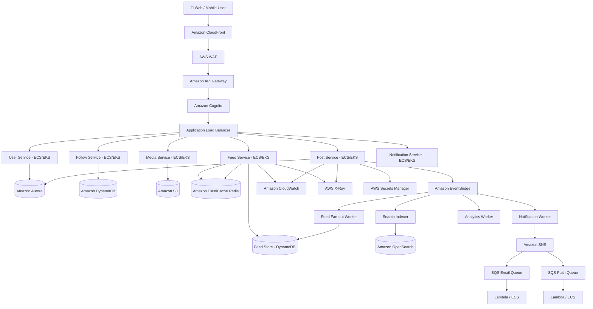
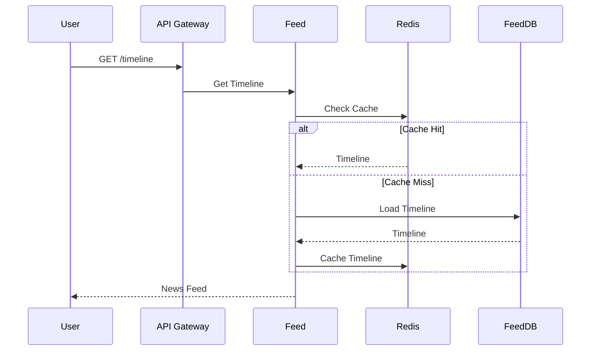
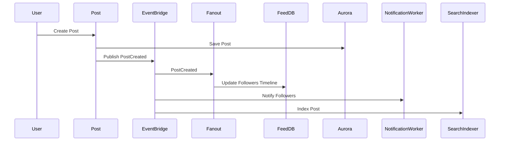
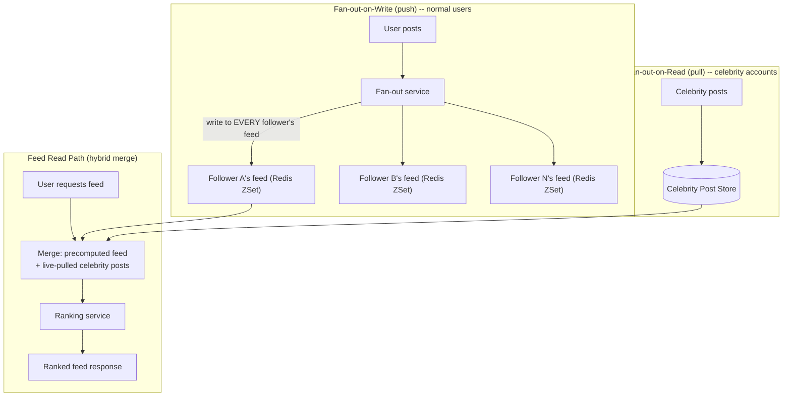

# Module 38 — System Design: Designing a News Feed / Timeline System

> Domain: System Design | Level: Beginner → Expert | Prerequisite: [[01-System-Design-Fundamentals]] — this module applies that module's framework to one canonical, deeply-worked system design problem end-to-end.

---
# Designing a News Feed / Timeline System (AWS Architecture)



---

# Feed Read Flow



---

# Feed Write Flow (Fan-out on Write)



---

# AWS Services Used

| Layer | AWS Service |
|---------|-------------|
| CDN | Amazon CloudFront |
| Security | AWS WAF |
| Authentication | Amazon Cognito |
| API | Amazon API Gateway |
| Load Balancer | Application Load Balancer |
| Compute | Amazon ECS / Amazon EKS |
| Database | Amazon Aurora |
| Feed Store | Amazon DynamoDB |
| Cache | Amazon ElastiCache (Redis) |
| Media Storage | Amazon S3 |
| Event Bus | Amazon EventBridge |
| Notifications | Amazon SNS |
| Queue | Amazon SQS |
| Search | Amazon OpenSearch |
| Email | Amazon SES |
| Monitoring | Amazon CloudWatch |
| Distributed Tracing | AWS X-Ray |
| Secrets | AWS Secrets Manager |


## 1. Fundamentals

### What is a news feed system, and why is it one of the most information-rich system-design interview problems?
A news feed/timeline system (Twitter's timeline, Facebook's News Feed, LinkedIn's feed) aggregates content from many sources (people/pages a user follows) into one personalized, ranked, continuously-updating stream. It's an exceptionally rich interview problem specifically because it forces a genuine trade-off decision (**fan-out-on-write vs fan-out-on-read**) with no universally correct answer, has a natural, discussable evolution path (adding ranking, media, real-time updates), and directly exercises nearly every building block from Module 37 (caching, load balancing, sharding, CAP trade-offs) in one cohesive system.

### Why does this matter?
Because the fan-out decision alone demonstrates whether a candidate can reason about a **genuinely asymmetric read/write problem** — the number of people who read a feed vastly exceeds the number of posts written, but a single celebrity's post must reach millions of followers' feeds, creating a "many-to-many, wildly skewed" data-distribution problem unlike the simpler CRUD systems most coding interviews implicitly assume.

### When does this matter?
Any interview or real system involving personalized content aggregation, activity feeds, or notification timelines; the depth matters because the fan-out trade-off's correct resolution genuinely depends on the specific platform's follower-count distribution (a non-functional requirement, directly Module 37 §2.1's discipline), not a fixed, memorizable answer.

### How does it work (30,000-ft view)?
```
1. Requirements: post creation, follow relationships, personalized ranked feed, real-time-ish updates
2. Scale estimation: 500M users, 200M daily active, avg 200 follows/user, 5:1 read:write on feed views
3. Core decision: fan-out-on-write (push) vs fan-out-on-read (pull) vs hybrid
4. Data model: Users, Posts, Follows (graph, Module 34), precomputed Feed entries (if push)
5. Ranking: chronological (simple) vs ML-ranked (engagement-optimized) -- separate concern from fan-out
```

---

## 2. Deep Dive

### 2.1 Requirements Gathering — Applying Module 37 §2.1 to This Specific System
**Functional**: users post content; users follow/unfollow other users; a user's feed shows posts from followed accounts, ranked/ordered; posts support likes/comments (secondary features, often explicitly deprioritized in an interview to focus time on the feed-generation core problem). **Non-functional** (the questions a strong candidate asks *before* designing): What's the follower-count distribution — is it roughly uniform (most users have similar-sized followings) or **power-law** (a small number of accounts have millions of followers, most have a few hundred)? This single question's answer almost entirely determines whether fan-out-on-write is even viable (§2.2). What's the acceptable feed staleness — must a new post appear in followers' feeds within seconds, or is a few minutes acceptable? What's the read:write ratio on feed views specifically (distinct from post-creation rate)?

### 2.2 Fan-Out-on-Write (Push Model) — Mechanics and Its Fatal Flaw at Scale
On every post creation, **immediately write that post's ID into every follower's precomputed feed** (a per-user feed list, typically stored in a fast store like Redis, Module 25 — a sorted set keyed by user ID, scored by post timestamp) — reading a feed becomes extremely fast (a single `ZRANGE` read of the precomputed list, no fan-out computation at read time). The **fatal flaw**: for a celebrity account with 50 million followers, a single post triggers 50 million individual writes — the **"celebrity problem"** — both a severe write-amplification cost (Module 33's "choose the structure matching the actual write pattern" theme, now showing a structure that works beautifully for typical users and catastrophically for outliers) and a latency problem (the post might take minutes to fully propagate to every follower's feed under this write load, violating any "post appears quickly" requirement for at least some followers).

### 2.3 Fan-Out-on-Read (Pull Model) — Mechanics and Its Scaling Problem in the Other Direction
On every feed **read**, query all accounts the user follows, fetch their recent posts, merge and rank them on the fly — no write amplification at all (posting is just one write, regardless of follower count), directly solving the celebrity problem. The trade-off inverts: **every feed read** now requires fanning out to potentially hundreds of followed accounts' recent posts (a scatter-gather query, directly Module 34's graph-traversal-cost concerns) and merging/ranking them in real time — for a user who checks their feed frequently (the common case, given feeds are read far more often than posts are created), this read-time cost is paid repeatedly, for every single read, unlike the push model's "pay once at write time, read is free" trade.

### 2.4 The Hybrid Model — the Actual, Production-Standard Answer
Real systems (Twitter's actual, publicly-documented architecture) use a **hybrid**: fan-out-on-write for the overwhelming majority of accounts (normal follower counts, where the celebrity problem doesn't apply), combined with fan-out-on-read specifically for celebrity/high-follower-count accounts — a user's feed-read path merges their precomputed (pushed) feed entries with a real-time pull of any followed celebrity accounts' recent posts, combining both models' strengths while avoiding both models' individual weaknesses. This hybrid answer is precisely why the "what's the follower-count distribution" question (§2.1) matters so much — it's what determines the threshold (e.g., "accounts with over 10,000 followers use pull instead of push") separating the two populations the hybrid model treats differently.

### 2.5 Ranking — a Separable Concern from Fan-Out
Once feed candidates are gathered (via either fan-out model), **ranking** (chronological vs. an ML-driven engagement-optimized order) is a genuinely separate architectural concern, frequently conflated with the fan-out decision in less-rigorous design discussions — a system can use fan-out-on-write for candidate generation and still apply a sophisticated ranking model at read time over that pre-gathered candidate set (re-ordering, not re-gathering) — recognizing that "how do I gather candidates" and "how do I order them" are independent design axes, each with their own trade-offs, is a genuine Staff/Principal-level distinction many candidates blur together.

## 3. Visual Architecture


## 4. Production Example
**Scenario**: A growing social platform launched with pure fan-out-on-write, correctly sized for its initial user base's roughly-uniform follower-count distribution — as the platform grew and a small number of accounts (a handful of celebrities partnering with the platform) accumulated follower counts orders of magnitude above the typical user, the fan-out service began experiencing severe, sustained write-amplification spikes correlated precisely with these specific accounts' posting activity — a single post from one such account triggered a write burst large enough to degrade the fan-out service's throughput for **every** user's posts temporarily, not just the celebrity's followers, since the shared fan-out infrastructure's capacity was consumed disproportionately by these outlier events. **Investigation**: correlating fan-out-service latency spikes precisely with specific high-follower-count accounts' posting timestamps confirmed the celebrity problem (§2.2) as the root cause — the system had been correctly designed for its *original* follower-count distribution, but that non-functional assumption had silently become invalid as the platform's user base evolved, without a corresponding architecture review. **Fix**: implemented the hybrid model (§2.4) — accounts exceeding a follower-count threshold (determined empirically from the actual distribution of write-amplification incidents) switched to fan-out-on-read, with the feed-read path merging precomputed (pushed) results with live-pulled posts from these specific flagged accounts — fan-out-service load stabilized immediately, decoupled from any individual account's follower count. **Lesson**: a non-functional requirement (follower-count distribution) that was true and correctly designed-for at launch can become false as a system evolves — exactly Module 37 §4's "requirements can be silently invalidated by growth" lesson, now demonstrated in the specific, canonical shape of the celebrity problem, and a strong argument for treating the fan-out threshold as a **monitored, adjustable** parameter (tracked via the same "actual vs. design-time assumption" comparison discipline from Module 37 §Advanced Q7) rather than a one-time architectural decision made permanently at launch.

## 5. Best Practices
- Ask about follower-count distribution explicitly before committing to a fan-out strategy — it's the single decision-determining non-functional requirement for this entire problem class.
- Design for the hybrid model from the start if there's any plausible chance of high-follower-count accounts existing, rather than retrofitting it reactively after a celebrity-problem incident (§4).
- Treat ranking as a separable concern from fan-out/candidate-generation — design each independently.
- Monitor the actual follower-count distribution over time as a standing metric, since it can silently shift as a platform grows (§4's lesson).

## 6. Anti-patterns
- Committing to pure fan-out-on-write without considering the celebrity problem, or pure fan-out-on-read without considering the resulting read-time scatter-gather cost for the platform's actual (likely far more common) read-heavy access pattern.
- Conflating the "how do I gather feed candidates" and "how do I rank them" decisions into one inseparable design choice.
- Treating the fan-out threshold as a permanent, unmonitored architectural decision rather than a parameter that may need adjustment as the platform's user distribution evolves (§4).
- Designing the feed-read path without an explicit plan for merging precomputed and live-pulled results consistently (ordering/deduplication across the two sources).

---

## 10. Interview Questions

### Basic (10)
1. **Q: What is fan-out-on-write?** **A:** Immediately writing a new post into every follower's precomputed feed at post-creation time.
2. **Q: What is fan-out-on-read?** **A:** Computing a user's feed at read time by querying and merging recent posts from all followed accounts.
3. **Q: What is the "celebrity problem"?** **A:** A high-follower-count account's post triggering an enormous, disproportionate write-amplification burst under a pure fan-out-on-write model.
4. **Q: What's the fundamental trade-off between push and pull fan-out?** **A:** Push pays cost at write time (proportional to follower count) with cheap reads; pull pays cost at read time (proportional to following count) with cheap writes.
5. **Q: What is the hybrid fan-out model?** **A:** Using push for normal accounts and pull for high-follower-count (celebrity) accounts, merging both at feed-read time.
6. **Q: Is ranking the same concern as fan-out?** **A:** No — fan-out is about gathering feed candidates; ranking is about ordering them, a separable design decision.
7. **Q: What data structure is commonly used for a precomputed per-user feed cache?** **A:** A Redis sorted set, scored by post timestamp.
8. **Q: What non-functional requirement most determines the fan-out strategy choice?** **A:** The follower-count distribution (uniform vs. power-law/celebrity-skewed).
9. **Q: Why is a follow relationship modeled as a graph (Module 34)?** **A:** It's an arbitrary many-to-many relationship between users, the same shape as any graph-modeling problem.
10. **Q: Why does fan-out-on-read scale poorly for the common case even though it solves the celebrity problem?** **A:** Feeds are read far more often than posts are created, so paying a scatter-gather cost on every single read is typically more expensive in aggregate than push's occasional, if larger, write bursts for the majority of normal accounts.

### Intermediate (10)
1. **Q: Why does asking about follower-count distribution matter more than asking about total user count for this specific design decision?** **A:** Total user count affects overall scale/sharding needs generally, but the fan-out strategy specifically depends on whether follower counts are roughly uniform (favoring pure push) or power-law-skewed (requiring a hybrid to handle celebrity accounts) — a platform could have a huge total user count with a uniform distribution and never hit the celebrity problem at all.
2. **Q: Why might a precomputed feed cache need bounding/trimming, directly connecting to Module 23's unbounded-embedding lesson?** **A:** An unbounded per-user feed list would grow indefinitely as a user follows more accounts and time passes, exactly the same "unbounded growth invisible at small scale, dominant at production scale" risk as Module 23 §4's embedded-comments-array incident, requiring the same deliberate trimming/bounding discipline.
3. **Q: Why does the hybrid model's fan-out threshold need to be a monitored, adjustable parameter rather than a fixed constant chosen once at launch?** **A:** As demonstrated in §4, the actual distribution of follower counts can shift as a platform grows — a threshold correctly calibrated at launch can become miscalibrated later, requiring ongoing monitoring (directly Module 37 §Advanced Q7's "compare actual production numbers against design-time assumptions" discipline) rather than a permanent, unrevisited decision.
4. **Q: Why is verifying a private account's/blocked-user's authorization at feed-read time (not just fan-out-write time) necessary for correctness?** **A:** A precomputed feed entry, once pushed, reflects the authorization state *at push time* — if that state changes later (a block, a privacy setting change), the stale, already-pushed entry could incorrectly remain visible unless the read path re-verifies current authorization rather than trusting the cache's historical push decision.
5. **Q: Why does content moderation need to happen at or near post-creation time rather than purely after the fact for a fan-out-on-write system specifically?** **A:** Because fan-out-on-write immediately propagates a post into potentially millions of followers' feed caches — by the time a post-hoc moderation review flags problematic content, it may have already been widely distributed and viewed, unlike a pull-model system where un-surfaced content simply never gets fetched if flagged before any read occurs.
6. **Q: Why would ranking logic re-order rather than re-gather candidates, and why does this distinction matter for latency budgeting?** **A:** Re-ordering an already-gathered candidate set (from either fan-out model) is a bounded, predictable-cost operation over a known-size set; re-gathering (running the entire fan-out process again as part of ranking) would duplicate expensive work unnecessarily — keeping these separate lets each be latency-budgeted (Module 37 §7) independently and optimized without entangling their costs.
7. **Q: Why might a system choose to shard its precomputed feed cache by user ID specifically, rather than by some other key?** **A:** User ID is the natural, high-cardinality key every feed read/write operation already uses to address the cache — sharding by any other key would require an additional lookup/mapping step, adding unnecessary indirection for no benefit, directly the same "shard by the key the dominant access pattern already uses" principle from Module 27's partition-key design.
8. **Q: Why does a globally-distributed feed system's cross-region consistency model typically lean AP (eventually consistent) rather than CP?** **A:** Users generally tolerate a brief delay before a friend's post from a different region appears in their feed (an acceptable staleness window) far more readily than they'd tolerate reduced availability (an error/failure) just to guarantee immediate cross-region consistency — the business cost of unavailability typically exceeds the cost of brief staleness for this specific use case.
9. **Q: Why is post-creation rate limiting specifically important given the fan-out architecture, beyond ordinary API abuse prevention?** **A:** Because a single post from a high-follower-count account triggers disproportionate downstream write amplification (§2.2/§7) — rate-limiting post creation isn't just protecting the post-creation endpoint itself, it's protecting the entire fan-out infrastructure's capacity from being consumed by a small number of expensive operations.
10. **Q: Why would you explicitly ask an interviewer about acceptable feed staleness before committing to a specific architecture?** **A:** It directly determines whether asynchronous fan-out (a background job processing the fan-out after the post-creation request returns, tolerating a brief propagation delay) or a synchronous, immediate fan-out (higher latency on the post-creation request itself, but faster propagation) is the more appropriate design choice.

### Advanced (10)
1. **Q: Diagnose the celebrity-problem production incident (§4) from first principles, and design the specific monitoring/alerting that would have caught the emerging risk before it caused a fan-out-service-wide degradation.**
   **A:** Root cause: the follower-count distribution non-functional assumption, correct at launch, silently became invalid as specific accounts grew disproportionately, with no monitoring tracking this specific metric. Safeguard: track the **maximum single-account follower count** and the **follower-count distribution's tail** (e.g., "count of accounts exceeding 100K followers") as a standing metric, alerting when any account's follower count crosses a threshold indicating it will soon trigger celebrity-problem-scale write amplification under the current pure-push model — giving the team advance warning to migrate that specific account to the pull path (§2.4) proactively, before its next post triggers a production-impacting fan-out burst, rather than discovering the problem reactively via a latency-spike investigation.
2. **Q: Design the specific data model and query pattern for the hybrid model's feed-read merge step, addressing correct chronological ordering across the two sources.**
   **A:** The precomputed (pushed) feed entries in the user's Redis ZSet are already timestamp-scored and sorted; the live-pulled celebrity posts (fetched via a query against the specific followed celebrity accounts' recent-posts store, itself potentially a simple time-ordered index per account) must be merged with the precomputed entries via a **k-way merge** (directly Module 35's divide-and-conquer/merge-sort structural pattern, since both input streams are already individually sorted by timestamp) rather than concatenating and re-sorting the combined set from scratch — an O(n log k) merge (k being the small number of sources being merged: 1 precomputed stream + a handful of pulled celebrity streams) is meaningfully more efficient than an O(n log n) full re-sort, directly reusing Module 35's algorithmic-technique-recognition skill in this system-design context.
3. **Q: Explain how you would handle the "unfollow" operation's interaction with an already-populated fan-out-on-write feed cache, addressing both correctness and cost.**
   **A:** Unlike post creation (which requires fanning out to potentially millions of followers), an unfollow is a single-user operation — the correct, cost-effective approach is **not** to immediately scan and remove that account's historical posts from the unfollowing user's feed cache (an expensive, unnecessary operation given feeds are typically bounded/trimmed anyway, §7), but instead to record the unfollow in the follow-graph and apply it as a **filter at read time** for any residual cached entries from the unfollowed account until they naturally age out of the bounded feed cache — trading a small, temporary, low-stakes "might briefly still see one old post from someone I just unfollowed" inconsistency for avoiding an expensive, unnecessary cache-scrubbing operation, a deliberate, justified trade-off rather than an overlooked correctness gap.
4. **Q: Design a strategy for handling a sudden, extreme spike in post-creation rate from a specific event (e.g., a major news event causing many users to post simultaneously), distinct from the celebrity-single-account problem.**
   **A:** This is an aggregate, many-accounts-simultaneously spike rather than one account's disproportionate fan-out — the mitigation is different: ensure the fan-out **processing** itself is asynchronous (a message queue, Module 25/26's Streams-based pattern, absorbing a burst of post-creation events and processing fan-out from the queue at a sustainable rate) rather than synchronous with the post-creation request, so a traffic spike causes queue depth to grow (a monitorable, recoverable condition) rather than the fan-out service itself becoming overwhelmed and failing outright — directly Module 26's Streams-based durable-processing pattern applied to this specific burst-absorption need.
5. **Q: Explain how you would design A/B testing infrastructure for evaluating a new ranking algorithm without disrupting the underlying fan-out/candidate-gathering architecture.**
   **A:** Since ranking is a separable concern from candidate-gathering (§2.5), a ranking-algorithm A/B test can operate purely on the **already-gathered candidate set**, applying either the control or experimental ranking function to the same underlying candidates for a given user (assigned to a test group) — this cleanly isolates the experiment to the ranking layer specifically, without needing to run two entirely separate fan-out pipelines, directly benefiting from the architectural separation this module emphasizes as a design principle, not just an academic distinction.
6. **Q: How would you reason about whether a specific account should be migrated to the pull-model path (Advanced Q1's monitoring trigger), beyond just a raw follower-count threshold?**
   **A:** Follower count alone is a reasonable first-pass signal, but the more precise determinant is the account's **actual posting frequency multiplied by follower count** (the true write-amplification volume) — a high-follower-count but rarely-posting account may never actually cause a problematic write burst, while a moderate-follower-count but extremely-frequent-posting account could still generate meaningful aggregate write load; a more sophisticated migration trigger considers this combined metric rather than follower count in isolation, directly the same "measure the actual cost driver precisely, not a rough proxy" discipline recurring throughout this course.
7. **Q: Explain the interaction between the follow-graph's data model (Module 34) and the feed system's read-time performance, specifically for the pull-model path.**
   **A:** The pull model's read-time cost is directly proportional to the number of accounts a user follows (their "following" out-degree in the follow graph) — a user following an unusually large number of accounts (an analogous "reverse celebrity problem," a power-user with thousands of follows) creates the same kind of read-time scatter-gather cost concern §2.3 raises generally, now specifically bounded by that individual user's own following count rather than any other account's follower count — worth explicitly distinguishing these two, symmetric-but-distinct "power user" scenarios (many followers vs. many follows) as separate design considerations, since they stress different parts of the hybrid architecture.
8. **Q: Design a disaster-recovery strategy for the precomputed feed cache (Redis) becoming completely unavailable, distinct from a partial degradation.**
   **A:** Since the feed cache is a derived, recomputable structure (not the system of record — the underlying posts and follow-graph data, presumably in a durable database, remain the actual source of truth), a full Redis outage should trigger a fallback to a **degraded, pure-pull-model** feed-read path for all users temporarily (querying the durable post/follow-graph store directly, accepting higher latency system-wide) rather than the system becoming entirely unavailable — this fallback path, while much slower than the normal hybrid path, provides graceful degradation rather than total failure, directly Module 37 §Advanced Q6's cache-unavailability-fallback discipline applied specifically to this system's feed cache.
9. **Q: A team proposes eliminating the pull-model path entirely once the celebrity-problem accounts are identified, instead simply "capping" how many followers a single fan-out operation will write to, silently dropping the rest. Evaluate this as a Principal Engineer.**
   **A:** Reject this approach — silently dropping fan-out writes for some followers means those followers simply never see the celebrity's post in their feed at all (not "eventually, with some delay," but genuinely never, unless they separately visit that account's profile), a real, user-facing functional regression, not merely a performance optimization; the hybrid pull-model approach (§2.4) is specifically designed to serve *every* follower correctly, just via a different mechanism (real-time pull) for the specific accounts where push doesn't scale — recommend rejecting any "solution" that silently sacrifices functional correctness (some users never seeing content they're entitled to see) in the name of a performance fix, exactly the same "don't ship based on an unverified assumption that a shortcut is acceptable" discipline from Module 36 §Advanced Q9.
10. **Q: As a Principal Engineer, how would you present the fan-out architecture decision (push vs. pull vs. hybrid) to non-technical product stakeholders who want to understand why this is a genuinely hard problem, not just an engineering implementation detail?**
    **A:** Frame it concretely: "if we make posting instant and cheap for everyone, we pay a cost every time someone reads their feed, which happens far more often than posting — but if we make reading instant and cheap, a single post from a very popular account could overwhelm our systems trying to deliver it to every one of their millions of followers all at once; we use a hybrid approach that gives most users the fast, cheap experience while handling popular accounts differently behind the scenes, so both problems are avoided" — translating the technical push/pull trade-off into the concrete, relatable "who pays the cost, and when" framing makes the genuine engineering complexity legible to stakeholders without requiring them to understand fan-out mechanics directly, directly this course's recurring "translate technical trade-offs into business-relevant terms" communication discipline (Module 9 §17, Module 10 §17, and throughout).

---

## 11. Coding Exercises

*(System design case studies use worked design exercises rather than unit-testable code, consistent with Module 37's format for this domain.)*

### Easy — Capacity estimation for the feed system
**Problem**: Estimate the fan-out write volume for a platform with 200M daily active users, averaging 2 posts/user/day, and an average follower count of 150.
**Solution**:
```
Posts/day: 200M * 2 = 400M posts/day
Fan-out writes/day (pure push, ignoring celebrity accounts): 400M * 150 = 60 billion writes/day
≈ 694,000 writes/sec average -- a substantial, but with Redis's write throughput (Module 25), a
FEASIBLE number for the 'normal' (non-celebrity) account population specifically.
```
**Discussion**: This estimate directly motivates the hybrid model's necessity — even at "normal" average follower counts, the aggregate write volume is already substantial, and this estimate explicitly **excludes** celebrity accounts, whose individual posts would each independently spike this number dramatically if included in the pure-push model, concretely justifying §2.4's architectural decision with actual numbers rather than abstract reasoning alone.

### Medium — Design the Redis data model for the precomputed feed cache
```
Feed cache key: feed:{userId}
Type: Sorted Set (ZSET)
Member: postId
Score: post timestamp (Unix epoch, enabling ZRANGE-based chronological retrieval)

ZADD feed:12345 1699999999 "post:98765"   -- fan-out write: add a post to a follower's feed
ZREVRANGE feed:12345 0 49                  -- read: get the 50 most recent feed entries
ZREMRANGEBYRANK feed:12345 0 -1001         -- trim: bound the feed to the most recent 1000 entries (§7)
```

### Hard — Design the hybrid feed-read merge algorithm (Advanced Q2)
```csharp
public async Task<List<FeedItem>> GetFeedAsync(string userId, int count)
{
    var precomputedTask = _redis.SortedSetRangeByScoreAsync($"feed:{userId}", order: Order.Descending, take: count);
    var celebrityAccounts = await _followGraph.GetCelebrityFollowsAsync(userId); // accounts over the pull-threshold
    var celebrityPostsTask = Task.WhenAll(celebrityAccounts.Select(c => _postStore.GetRecentPostsAsync(c, count)));

    await Task.WhenAll(precomputedTask, celebrityPostsTask); // fetch BOTH sources concurrently

    var precomputed = (await precomputedTask).Select(ParseFeedItem);
    var live = (await celebrityPostsTask).SelectMany(posts => posts);

    // k-way merge (Advanced Q2) -- both inputs already individually sorted by timestamp descending
    return MergeSortedByTimestamp(precomputed, live).Take(count).ToList();
}
```
**Discussion**: `Task.WhenAll` fetching both sources **concurrently** (Module 2's async-concurrency discipline) rather than sequentially is essential here — sequentially awaiting the precomputed feed, then the celebrity posts, would needlessly add the two operations' latencies together instead of overlapping them, directly Module 2 §5's "use `Task.WhenAll` for independent concurrent operations" best practice applied at this system's most latency-sensitive read path.

### Expert — Design the asynchronous fan-out processing pipeline with burst absorption (Advanced Q4)
```csharp
public async Task HandlePostCreatedAsync(Post post)
{
    // Post creation itself returns IMMEDIATELY -- fan-out is NOT synchronous with the user-facing request.
    await _messageQueue.PublishAsync(new FanOutJob(post.Id, post.AuthorId));
}

// Separate, independently-scaled worker fleet consumes the queue:
public async Task ProcessFanOutJobAsync(FanOutJob job)
{
    var followerCount = await _followGraph.GetFollowerCountAsync(job.AuthorId);

    if (followerCount > CelebrityThreshold)
    {
        // Celebrity account: skip push fan-out entirely -- relies on the pull path at read time (§2.4)
        return;
    }

    var followers = await _followGraph.GetFollowersAsync(job.AuthorId);
    var batches = followers.Chunk(1000); // batch writes, directly Module 19 Expert exercise's
                                            // lock-escalation-avoidance batching discipline, applied here
                                            // to Redis write-batching instead of SQL Server transactions
    foreach (var batch in batches)
    {
        await _redis.BatchAsync(batch.Select(followerId =>
            new RedisCommand("ZADD", $"feed:{followerId}", post.Timestamp, post.Id)));
    }
}
```
**Discussion**: Decoupling post-creation (synchronous, fast, user-facing) from fan-out processing (asynchronous, queue-driven, independently-scalable) is precisely Advanced Q4's burst-absorption strategy — a sudden spike in post creation grows the queue's depth (a monitorable, recoverable backpressure signal, directly Module 26 §2.2's Streams consumer-group backlog-monitoring pattern) rather than directly overwhelming the fan-out write path itself, and the celebrity-threshold check inside the worker (not at post-creation time) keeps the "which accounts skip push fan-out" decision centralized and easily adjustable (Advanced Q1's monitored, adjustable threshold) without touching the post-creation code path at all.

---

## 12–17. System Design / LLD / Debugging / Decision / Case Study / Principal

*(This entire module IS the deep-dive system-design case study — §4's incident, §11's four worked exercises, and the extensive Advanced-tier Q&A collectively constitute the full design-review-depth content this section would otherwise contain separately.)*

## 18. Revision
**Key takeaways**: The fan-out decision (push vs. pull vs. hybrid) is the defining architectural choice for any feed/timeline system, determined primarily by the actual follower-count distribution — a non-functional requirement that can silently change as a platform grows (the celebrity problem, §4). Ranking is a separable concern from candidate-gathering/fan-out — don't conflate the two design axes. Precomputed feed caches need explicit bounding/trimming (Redis ZSet + `ZREMRANGEBYRANK`), directly paralleling Module 23's unbounded-embedding lesson. Merging precomputed and live-pulled results should use an efficient k-way merge (both streams already sorted), not a full re-sort. Asynchronous, queue-based fan-out processing absorbs traffic bursts as monitorable backpressure rather than overwhelming the write path directly.

---

**Next**: Continuing autonomously to Module 39 — Designing a Chat/Messaging System (WebSockets, message ordering, delivery guarantees) as the next fully-worked system-design case study.
