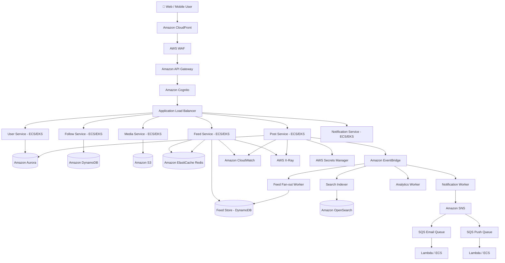
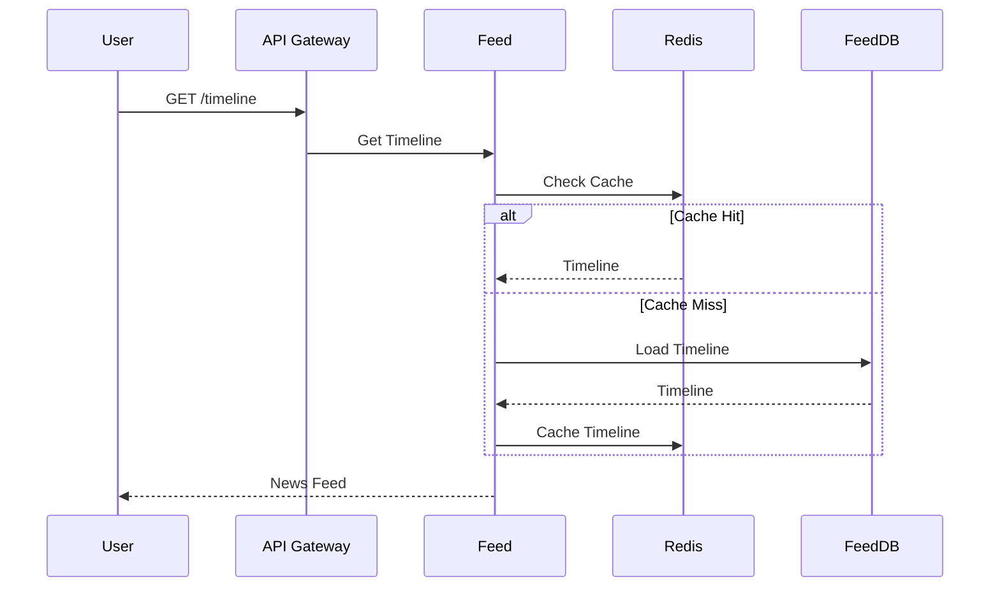
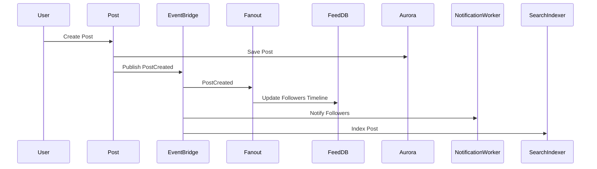
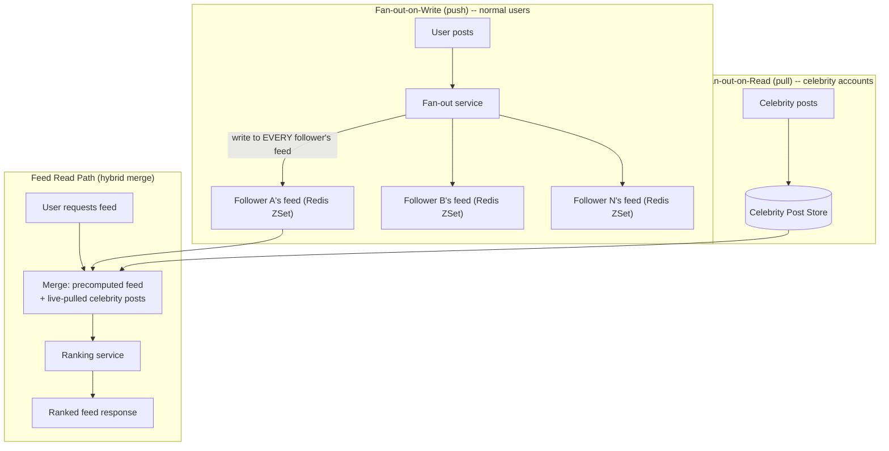
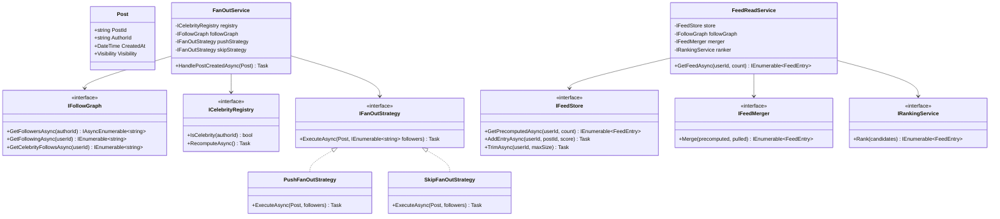
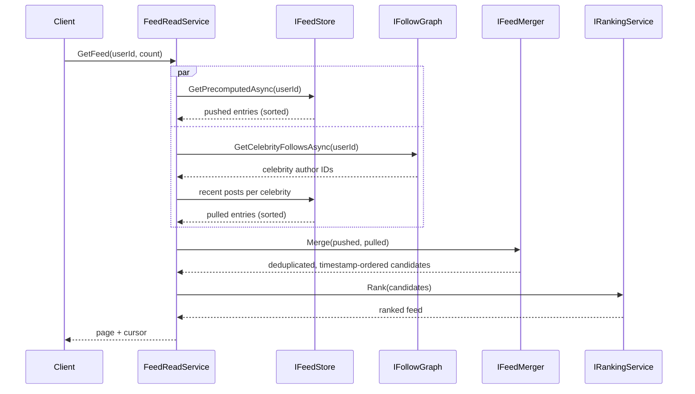

# Module 38 — System Design: Designing a News Feed / Timeline System

> Domain: System Design | Level: Beginner → Expert | Prerequisite: [[01-System-Design-Fundamentals]] — this module applies that module's framework to one canonical, deeply-worked system design problem end-to-end.

---
# Designing a News Feed / Timeline System (AWS Architecture)


```mermaid
flowchart TB

 User[👤 Web / Mobile User]

 User --> CF[Amazon CloudFront]
 CF --> WAF[AWS WAF]
 WAF --> APIGW[Amazon API Gateway]
 APIGW --> Cognito[Amazon Cognito]

 Cognito --> ALB[Application Load Balancer]

 ALB --> PostService[Post Service - ECS/EKS]
 ALB --> FeedService[Feed Service - ECS/EKS]
 ALB --> UserService[User Service - ECS/EKS]
 ALB --> FollowService[Follow Service - ECS/EKS]
 ALB --> MediaService[Media Service - ECS/EKS]
 ALB --> NotificationService[Notification Service - ECS/EKS]

 %% Storage
 PostService --> Aurora[(Amazon Aurora)]
 UserService --> Aurora
 FollowService --> DynamoDB[(Amazon DynamoDB)]

 MediaService --> S3[(Amazon S3)]

 FeedService --> Redis[(Amazon ElastiCache Redis)]

 %% Event Driven
 PostService --> EventBridge[Amazon EventBridge]

 EventBridge --> FanoutWorker[Feed Fan-out Worker]
 EventBridge --> SearchIndexer[Search Indexer]
 EventBridge --> NotificationWorker[Notification Worker]
 EventBridge --> AnalyticsWorker[Analytics Worker]

 %% Feed Store
 FanoutWorker --> FeedDB[(Feed Store - DynamoDB)]

 %% Search
 SearchIndexer --> OpenSearch[(Amazon OpenSearch)]

 %% Notification
 NotificationWorker --> SNS[Amazon SNS]

 SNS --> EmailQueue[SQS Email Queue]
 SNS --> PushQueue[SQS Push Queue]

 EmailQueue --> EmailWorker[Lambda / ECS]
 PushQueue --> PushWorker[Lambda / ECS]

 %% Feed Read
 FeedService --> FeedDB
 FeedService --> Redis

 %% Monitoring
 PostService --> CloudWatch[Amazon CloudWatch]
 FeedService --> CloudWatch

 PostService --> XRay[AWS X-Ray]
 FeedService --> XRay

 %% Security
 PostService --> Secrets[AWS Secrets Manager]
```

---

# Feed Read Flow


```mermaid
sequenceDiagram

 participant User
 participant API as API Gateway
 participant Feed
 participant Redis
 participant FeedDB

 User->>API: GET /timeline

 API->>Feed: Get Timeline

 Feed->>Redis: Check Cache

 alt Cache Hit

 Redis-->>Feed: Timeline

 else Cache Miss

 Feed->>FeedDB: Load Timeline

 FeedDB-->>Feed: Timeline

 Feed->>Redis: Cache Timeline

 end

 Feed-->>User: News Feed
```

---

# Feed Write Flow (Fan-out on Write)


```mermaid
sequenceDiagram

 participant User
 participant Post
 participant EventBridge
 participant Fanout
 participant FeedDB

 User->>Post: Create Post

 Post->>Aurora: Save Post

 Post->>EventBridge: Publish PostCreated

 EventBridge->>Fanout: PostCreated

 Fanout->>FeedDB: Update Followers Timeline

 EventBridge->>NotificationWorker: Notify Followers

 EventBridge->>SearchIndexer: Index Post
```

---

# AWS Services Used

| Layer | AWS Service |
|---------|-------------|
| CDN | Amazon CloudFront |
| Security | AWS WAF |
| Authentication | Amazon Cognito |
| API | Amazon API Gateway |
| Load Balancer | Application Load Balancer |
| Compute | Amazon ECS / Amazon EKS |
| Database | Amazon Aurora |
| Feed Store | Amazon DynamoDB |
| Cache | Amazon ElastiCache (Redis) |
| Media Storage | Amazon S3 |
| Event Bus | Amazon EventBridge |
| Notifications | Amazon SNS |
| Queue | Amazon SQS |
| Search | Amazon OpenSearch |
| Email | Amazon SES |
| Monitoring | Amazon CloudWatch |
| Distributed Tracing | AWS X-Ray |
| Secrets | AWS Secrets Manager |


## 1. Fundamentals

### What is a news feed system, and why is it one of the most information-rich system-design interview problems?
A news feed/timeline system (Twitter's timeline, Facebook's News Feed, LinkedIn's feed) aggregates content from many sources (people/pages a user follows) into one personalized, ranked, continuously-updating stream. It's an exceptionally rich interview problem specifically because it forces a genuine trade-off decision (**fan-out-on-write vs fan-out-on-read**) with no universally correct answer, has a natural, discussable evolution path (adding ranking, media, real-time updates), and directly exercises nearly every building block (caching, load balancing, sharding, CAP trade-offs) in one cohesive system.

### Why does this matter?
Because the fan-out decision alone demonstrates whether a candidate can reason about a **genuinely asymmetric read/write problem** — the number of people who read a feed vastly exceeds the number of posts written, but a single celebrity's post must reach millions of followers' feeds, creating a "many-to-many, wildly skewed" data-distribution problem unlike the simpler CRUD systems most coding interviews implicitly assume.

### When does this matter?
Any interview or real system involving personalized content aggregation, activity feeds, or notification timelines; the depth matters because the fan-out trade-off's correct resolution genuinely depends on the specific platform's follower-count distribution (a non-functional requirement, directly the discipline), not a fixed, memorizable answer.

### How does it work (30,000-ft view)?
```
1. Requirements: post creation, follow relationships, personalized ranked feed, real-time-ish updates
2. Scale estimation: 500M users, 200M daily active, avg 200 follows/user, 5:1 read:write on feed views
3. Core decision: fan-out-on-write (push) vs fan-out-on-read (pull) vs hybrid
4. Data model: Users, Posts, Follows (graph), precomputed Feed entries (if push)
5. Ranking: chronological (simple) vs ML-ranked (engagement-optimized) -- separate concern from fan-out
```

---

## 2. Deep Dive

### 2.1 Requirements Gathering — Applying to This Specific System
**Functional**: users post content; users follow/unfollow other users; a user's feed shows posts from followed accounts, ranked/ordered; posts support likes/comments (secondary features, often explicitly deprioritized in an interview to focus time on the feed-generation core problem). **Non-functional** (the questions a strong candidate asks *before* designing): What's the follower-count distribution — is it roughly uniform (most users have similar-sized followings) or **power-law** (a small number of accounts have millions of followers, most have a few hundred)? This single question's answer almost entirely determines whether fan-out-on-write is even viable. What's the acceptable feed staleness — must a new post appear in followers' feeds within seconds, or is a few minutes acceptable? What's the read:write ratio on feed views specifically (distinct from post-creation rate)?

### 2.2 Fan-Out-on-Write (Push Model) — Mechanics and Its Fatal Flaw at Scale
On every post creation, **immediately write that post's ID into every follower's precomputed feed** (a per-user feed list, typically stored in a fast store like Redis, — a sorted set keyed by user ID, scored by post timestamp) — reading a feed becomes extremely fast (a single `ZRANGE` read of the precomputed list, no fan-out computation at read time). The **fatal flaw**: for a celebrity account with 50 million followers, a single post triggers 50 million individual writes — the **"celebrity problem"** — both a severe write-amplification cost (the "choose the structure matching the actual write pattern" theme, now showing a structure that works beautifully for typical users and catastrophically for outliers) and a latency problem (the post might take minutes to fully propagate to every follower's feed under this write load, violating any "post appears quickly" requirement for at least some followers).

### 2.3 Fan-Out-on-Read (Pull Model) — Mechanics and Its Scaling Problem in the Other Direction
On every feed **read**, query all accounts the user follows, fetch their recent posts, merge and rank them on the fly — no write amplification at all (posting is just one write, regardless of follower count), directly solving the celebrity problem. The trade-off inverts: **every feed read** now requires fanning out to potentially hundreds of followed accounts' recent posts (a scatter-gather query, directly the graph-traversal-cost concerns) and merging/ranking them in real time — for a user who checks their feed frequently (the common case, given feeds are read far more often than posts are created), this read-time cost is paid repeatedly, for every single read, unlike the push model's "pay once at write time, read is free" trade.

### 2.4 The Hybrid Model — the Actual, Production-Standard Answer
Real systems (Twitter's actual, publicly-documented architecture) use a **hybrid**: fan-out-on-write for the overwhelming majority of accounts (normal follower counts, where the celebrity problem doesn't apply), combined with fan-out-on-read specifically for celebrity/high-follower-count accounts — a user's feed-read path merges their precomputed (pushed) feed entries with a real-time pull of any followed celebrity accounts' recent posts, combining both models' strengths while avoiding both models' individual weaknesses. This hybrid answer is precisely why the "what's the follower-count distribution" question matters so much — it's what determines the threshold (e.g., "accounts with over 10,000 followers use pull instead of push") separating the two populations the hybrid model treats differently.

### 2.5 Ranking — a Separable Concern from Fan-Out
Once feed candidates are gathered (via either fan-out model), **ranking** (chronological vs. an ML-driven engagement-optimized order) is a genuinely separate architectural concern, frequently conflated with the fan-out decision in less-rigorous design discussions — a system can use fan-out-on-write for candidate generation and still apply a sophisticated ranking model at read time over that pre-gathered candidate set (re-ordering, not re-gathering) — recognizing that "how do I gather candidates" and "how do I order them" are independent design axes, each with their own trade-offs, is a genuine Staff/Principal-level distinction many candidates blur together.

## 3. Visual Architecture

```mermaid
graph TB
 subgraph "Fan-out-on-Write (push) -- normal users"
 Post1[User posts] --> FanOut[Fan-out service]
 FanOut -->|write to EVERY follower's feed| FeedCache1["Follower A's feed (Redis ZSet)"]
 FanOut --> FeedCache2["Follower B's feed (Redis ZSet)"]
 FanOut --> FeedCache3["Follower N's feed (Redis ZSet)"]
 end
 subgraph "Fan-out-on-Read (pull) -- celebrity accounts"
 Celebrity[Celebrity posts] --> CelebPostStore[(Celebrity Post Store)]
 end
 subgraph "Feed Read Path (hybrid merge)"
 UserRead[User requests feed] --> Merge["Merge: precomputed feed<br/>+ live-pulled celebrity posts"]
 FeedCache1 --> Merge
 CelebPostStore --> Merge
 Merge --> Rank[Ranking service]
 Rank --> Response[Ranked feed response]
 end
```

## 4. Production Example
**Scenario**: A growing social platform launched with pure fan-out-on-write, correctly sized for its initial user base's roughly-uniform follower-count distribution — as the platform grew and a small number of accounts (a handful of celebrities partnering with the platform) accumulated follower counts orders of magnitude above the typical user, the fan-out service began experiencing severe, sustained write-amplification spikes correlated precisely with these specific accounts' posting activity — a single post from one such account triggered a write burst large enough to degrade the fan-out service's throughput for **every** user's posts temporarily, not just the celebrity's followers, since the shared fan-out infrastructure's capacity was consumed disproportionately by these outlier events. **Investigation**: correlating fan-out-service latency spikes precisely with specific high-follower-count accounts' posting timestamps confirmed the celebrity problem as the root cause — the system had been correctly designed for its *original* follower-count distribution, but that non-functional assumption had silently become invalid as the platform's user base evolved, without a corresponding architecture review. **Fix**: implemented the hybrid model — accounts exceeding a follower-count threshold (determined empirically from the actual distribution of write-amplification incidents) switched to fan-out-on-read, with the feed-read path merging precomputed (pushed) results with live-pulled posts from these specific flagged accounts — fan-out-service load stabilized immediately, decoupled from any individual account's follower count. **Lesson**: a non-functional requirement (follower-count distribution) that was true and correctly designed-for at launch can become false as a system evolves — exactly the "requirements can be silently invalidated by growth" lesson, now demonstrated in the specific, canonical shape of the celebrity problem, and a strong argument for treating the fan-out threshold as a **monitored, adjustable** parameter (tracked via the same "actual vs. design-time assumption" comparison discipline §Advanced Q7) rather than a one-time architectural decision made permanently at launch.

## 5. Best Practices
- Ask about follower-count distribution explicitly before committing to a fan-out strategy — it's the single decision-determining non-functional requirement for this entire problem class.
- Design for the hybrid model from the start if there's any plausible chance of high-follower-count accounts existing, rather than retrofitting it reactively after a celebrity-problem incident.
- Treat ranking as a separable concern from fan-out/candidate-generation — design each independently.
- Monitor the actual follower-count distribution over time as a standing metric, since it can silently shift as a platform grows (the lesson).

## 6. Anti-patterns
- Committing to pure fan-out-on-write without considering the celebrity problem, or pure fan-out-on-read without considering the resulting read-time scatter-gather cost for the platform's actual (likely far more common) read-heavy access pattern.
- Conflating the "how do I gather feed candidates" and "how do I rank them" decisions into one inseparable design choice.
- Treating the fan-out threshold as a permanent, unmonitored architectural decision rather than a parameter that may need adjustment as the platform's user distribution evolves.
- Designing the feed-read path without an explicit plan for merging precomputed and live-pulled results consistently (ordering/deduplication across the two sources).

---

## 7. Performance Engineering

### 7.1 The write side and the read side have opposite cost profiles — budget each separately
Fan-out (write) cost is proportional to **follower count**; feed assembly (read) cost is proportional to **following count plus merge/rank work**. Treating "feed system performance" as one undifferentiated concern misses that these are optimized independently and can regress independently — a slow ranking model degrades read latency without touching fan-out throughput at all, while a celebrity post degrades fan-out without touching any single read's latency. §12 Step 1's estimation (100,000 sustainable fan-out writes/s vs. 40,000 peak reads/s) exists precisely to size these two budgets separately rather than as one number.

### 7.2 Mean latency hides exactly the failure this system is prone to
§12 Step 4's wrap-up names it directly: fan-out job **duration distribution**, not mean, is the metric that would have caught §4's incident — a handful of multi-minute celebrity fan-out jobs barely move an aggregate mean computed over millions of ordinary-sized jobs, while those same jobs monopolize the shared worker pool for their entire duration. Any performance dashboard for a fan-out system that surfaces only p50/mean is structurally blind to its most damaging failure mode; p99 and max, segmented by job size, are the metrics that matter here.

### 7.3 The k-way merge is a real, measurable cost — not free just because both inputs are sorted
At 40,000 reads/s (§12 Step 1), merging a precomputed stream with N pulled celebrity streams costs O(n log k) per read where k is the number of sources — small, but not zero, and it scales with how many celebrities a given user follows (§Advanced Q7's "reverse celebrity problem," a power-user following thousands of accounts). A user following an unusually large number of celebrities turns a cheap merge into a genuinely more expensive one; this should be captured in a per-request cost budget, not assumed uniform across all users.

### 7.4 Hot-key reads are the read-side mirror of the celebrity write problem
§12 §3.5 names it explicitly: `author_posts:{id}` for a popular celebrity is read by every one of their followers on every feed load, concentrating tens of thousands of reads per second on a single Redis key/shard — a performance problem structurally distinct from, but exactly as damaging as, the write-side celebrity problem, and easy to miss because it doesn't show up in aggregate cache-hit-rate metrics (the key is still a hit, just a dangerously concentrated one). Sharded replication of hot keys, or a short in-process TTL cache in front of them, is the standard mitigation.

### 7.5 Benchmark with the real follower-count distribution, not a synthetic uniform one
A load test using synthetic accounts with uniform, moderate follower counts will never surface either celebrity problem — it validates a system that doesn't resemble production. Load tests for this system must explicitly include a small number of synthetic "celebrity" accounts at the actual observed tail follower count, exactly mirroring §7.4's general principle from Module 01 applied to this system's specific skew.

## 8. Security

### 8.1 Privacy and blocking must be enforced at read time, never trusted from push time
§Intermediate Q4 states the core risk precisely: a precomputed feed entry reflects the authorization state *at push time* — if a user later blocks the author, or the author's account becomes private, a stale pushed entry could remain visible unless the read path re-verifies current visibility rules before returning any result, pulled or pushed. This is Module 01 §8.4's caching/authorization principle applied to this system's specific derived-cache shape, and it must be checked on **every** read, not only reads served from the pull path — the pushed path is equally capable of surfacing stale-but-technically-cached content a user is no longer entitled to see.

### 8.2 Content moderation timing changes fundamentally under fan-out-on-write
As §Intermediate Q5 notes, once a post is pushed, it may already be sitting in millions of followers' feed caches before a post-hoc moderation review completes — unlike a pull-model system where un-surfaced flagged content is simply never fetched. This means moderation (automated classifiers, at minimum) needs to run **before or during** fan-out for accounts above a risk threshold, or the design needs an explicit, fast **retraction** path (a "delete propagates via the same fan-out-style mechanism, or is enforced as a read-time filter against a moderation-flag lookup") — treating post-hoc-only moderation as sufficient is a security/trust gap specific to the push architecture.

### 8.3 Rate limiting post creation protects the fan-out tier, not just the endpoint
§Intermediate Q9's point generalized: because a single post from a high-follower account triggers disproportionate downstream cost, rate-limiting post creation is protecting shared fan-out infrastructure capacity from a small number of expensive operations, not merely preventing spammy posting behavior at the API layer — the same "reject cheaply, as early as possible" principle (Module 01 §8.2), applied here specifically to protect a downstream, shared resource from a single account's abuse rather than just the immediate endpoint.

### 8.4 The follow graph itself is sensitive data with its own access-control surface
Who follows whom, and who a user follows, is itself PII-adjacent data (revealing relationships, interests, and in some jurisdictions legally protected associations) — the "assume you can query `followers(x)` and `following(x)`" scoping from §12 Step 1's dialogue elides that this API needs its own authorization model (can any caller query any user's full follower list, or only the user themselves and, at reduced granularity, the public), a decision that was deliberately out of scope for the fan-out design but must not be silently deferred to "someone else's problem" when the system actually ships.

## 9. Scalability

### 9.1 The hybrid model is a scalability decision derived from data, not chosen by default
§12 §3.1 shows the threshold is derived from actual fan-out capacity and an acceptable-monopolization ceiling (≈100,000 followers, from 300,000 writes/s capacity and a 10%-for-5s tolerance) — this is the general scalability discipline (Module 01 §9.1: justify each rung of complexity with a measured constraint) applied to this specific architecture. A team adopting the hybrid model without deriving its own threshold from its own fan-out capacity is copying an architecture pattern without copying the reasoning that makes it correct for their scale.

### 9.2 Horizontal scaling of the fan-out tier requires partition-aware worker design
Fan-out workers must be partitioned (by the Kafka partition key, `author_id` per §12 Step 2) so that a single expensive job (one celebrity's fan-out) cannot block unrelated jobs queued behind it on a different partition — this is the direct mechanism behind §12 §3.4's "detect on consumer lag per partition, not aggregate" failure-handling guidance, and it's what makes the worker tier horizontally scalable in a way that's resilient to the very skew (§7.5) that makes this system's load pattern unusual.

### 9.3 The feed store's scalability rests on being a bounded, evictable, derived cache
§12 Step 2's "the feed is not in a database" decision is the load-bearing scalability property: because feed entries are recomputable from posts plus the follow graph, the store can be sized generously but not infinitely (the 800-entry trim, §12's data model), evicted under memory pressure, and rebuilt on a cache-node loss (§12 §3.4) rather than requiring durable, backed-up storage sized for permanent retention — a materially cheaper and more horizontally scalable posture than if feed entries were treated as a system of record.

### 9.4 Availability of the read path and the write path have different targets, for a reason
§12 Step 1 states 99.99% for reads and 99.9% for writes, and the deep dive (§12 §3.4) shows exactly why this is achievable: a primary-database failover makes writes briefly unavailable, but reads keep serving from cache and the surviving fan-out output, so the two availability numbers are not aspirational — they follow directly from which components each path actually depends on. Any scalability/HA discussion of this system should state which specific components sit on each critical path, since that dependency mapping is what makes an availability target true or merely hopeful (Module 01 §9.3's HA-vs-DR distinction, applied per-path here rather than per-system).

---

## 10. Interview Questions

### Basic (10)
1. **Q: What is fan-out-on-write?** **A:** Immediately writing a new post into every follower's precomputed feed at post-creation time.
2. **Q: What is fan-out-on-read?** **A:** Computing a user's feed at read time by querying and merging recent posts from all followed accounts.
3. **Q: What is the "celebrity problem"?** **A:** A high-follower-count account's post triggering an enormous, disproportionate write-amplification burst under a pure fan-out-on-write model.
4. **Q: What's the fundamental trade-off between push and pull fan-out?** **A:** Push pays cost at write time (proportional to follower count) with cheap reads; pull pays cost at read time (proportional to following count) with cheap writes.
5. **Q: What is the hybrid fan-out model?** **A:** Using push for normal accounts and pull for high-follower-count (celebrity) accounts, merging both at feed-read time.
6. **Q: Is ranking the same concern as fan-out?** **A:** No — fan-out is about gathering feed candidates; ranking is about ordering them, a separable design decision.
7. **Q: What data structure is commonly used for a precomputed per-user feed cache?** **A:** A Redis sorted set, scored by post timestamp.
8. **Q: What non-functional requirement most determines the fan-out strategy choice?** **A:** The follower-count distribution (uniform vs. power-law/celebrity-skewed).
9. **Q: Why is a follow relationship modeled as a graph?** **A:** It's an arbitrary many-to-many relationship between users, the same shape as any graph-modeling problem.
10. **Q: Why does fan-out-on-read scale poorly for the common case even though it solves the celebrity problem?** **A:** Feeds are read far more often than posts are created, so paying a scatter-gather cost on every single read is typically more expensive in aggregate than push's occasional, if larger, write bursts for the majority of normal accounts.

### Intermediate (10)
1. **Q: Why does asking about follower-count distribution matter more than asking about total user count for this specific design decision?** **A:** Total user count affects overall scale/sharding needs generally, but the fan-out strategy specifically depends on whether follower counts are roughly uniform (favoring pure push) or power-law-skewed (requiring a hybrid to handle celebrity accounts) — a platform could have a huge total user count with a uniform distribution and never hit the celebrity problem at all.
2. **Q: Why might a precomputed feed cache need bounding/trimming, directly connecting to the unbounded-embedding lesson?** **A:** An unbounded per-user feed list would grow indefinitely as a user follows more accounts and time passes, exactly the same "unbounded growth invisible at small scale, dominant at production scale" risk as the embedded-comments-array incident, requiring the same deliberate trimming/bounding discipline.
3. **Q: Why does the hybrid model's fan-out threshold need to be a monitored, adjustable parameter rather than a fixed constant chosen once at launch?** **A:** As demonstrated, the actual distribution of follower counts can shift as a platform grows — a threshold correctly calibrated at launch can become miscalibrated later, requiring ongoing monitoring (directly §Advanced Q7's "compare actual production numbers against design-time assumptions" discipline) rather than a permanent, unrevisited decision.
4. **Q: Why is verifying a private account's/blocked-user's authorization at feed-read time (not just fan-out-write time) necessary for correctness?** **A:** A precomputed feed entry, once pushed, reflects the authorization state *at push time* — if that state changes later (a block, a privacy setting change), the stale, already-pushed entry could incorrectly remain visible unless the read path re-verifies current authorization rather than trusting the cache's historical push decision.
5. **Q: Why does content moderation need to happen at or near post-creation time rather than purely after the fact for a fan-out-on-write system specifically?** **A:** Because fan-out-on-write immediately propagates a post into potentially millions of followers' feed caches — by the time a post-hoc moderation review flags problematic content, it may have already been widely distributed and viewed, unlike a pull-model system where un-surfaced content simply never gets fetched if flagged before any read occurs.
6. **Q: Why would ranking logic re-order rather than re-gather candidates, and why does this distinction matter for latency budgeting?** **A:** Re-ordering an already-gathered candidate set (from either fan-out model) is a bounded, predictable-cost operation over a known-size set; re-gathering (running the entire fan-out process again as part of ranking) would duplicate expensive work unnecessarily — keeping these separate lets each be latency-budgeted independently and optimized without entangling their costs.
7. **Q: Why might a system choose to shard its precomputed feed cache by user ID specifically, rather than by some other key?** **A:** User ID is the natural, high-cardinality key every feed read/write operation already uses to address the cache — sharding by any other key would require an additional lookup/mapping step, adding unnecessary indirection for no benefit, directly the same "shard by the key the dominant access pattern already uses" principle from the partition-key design.
8. **Q: Why does a globally-distributed feed system's cross-region consistency model typically lean AP (eventually consistent) rather than CP?** **A:** Users generally tolerate a brief delay before a friend's post from a different region appears in their feed (an acceptable staleness window) far more readily than they'd tolerate reduced availability (an error/failure) just to guarantee immediate cross-region consistency — the business cost of unavailability typically exceeds the cost of brief staleness for this specific use case.
9. **Q: Why is post-creation rate limiting specifically important given the fan-out architecture, beyond ordinary API abuse prevention?** **A:** Because a single post from a high-follower-count account triggers disproportionate downstream write amplification (/) — rate-limiting post creation isn't just protecting the post-creation endpoint itself, it's protecting the entire fan-out infrastructure's capacity from being consumed by a small number of expensive operations.
10. **Q: Why would you explicitly ask an interviewer about acceptable feed staleness before committing to a specific architecture?** **A:** It directly determines whether asynchronous fan-out (a background job processing the fan-out after the post-creation request returns, tolerating a brief propagation delay) or a synchronous, immediate fan-out (higher latency on the post-creation request itself, but faster propagation) is the more appropriate design choice.

### Advanced (10)
1. **Q: Diagnose the celebrity-problem production incident from first principles, and design the specific monitoring/alerting that would have caught the emerging risk before it caused a fan-out-service-wide degradation.**
 **A:** Root cause: the follower-count distribution non-functional assumption, correct at launch, silently became invalid as specific accounts grew disproportionately, with no monitoring tracking this specific metric. Safeguard: track the **maximum single-account follower count** and the **follower-count distribution's tail** (e.g., "count of accounts exceeding 100K followers") as a standing metric, alerting when any account's follower count crosses a threshold indicating it will soon trigger celebrity-problem-scale write amplification under the current pure-push model — giving the team advance warning to migrate that specific account to the pull path proactively, before its next post triggers a production-impacting fan-out burst, rather than discovering the problem reactively via a latency-spike investigation.
2. **Q: Design the specific data model and query pattern for the hybrid model's feed-read merge step, addressing correct chronological ordering across the two sources.**
 **A:** The precomputed (pushed) feed entries in the user's Redis ZSet are already timestamp-scored and sorted; the live-pulled celebrity posts (fetched via a query against the specific followed celebrity accounts' recent-posts store, itself potentially a simple time-ordered index per account) must be merged with the precomputed entries via a **k-way merge** (directly the divide-and-conquer/merge-sort structural pattern, since both input streams are already individually sorted by timestamp) rather than concatenating and re-sorting the combined set from scratch — an O(n log k) merge (k being the small number of sources being merged: 1 precomputed stream + a handful of pulled celebrity streams) is meaningfully more efficient than an O(n log n) full re-sort, directly reusing the algorithmic-technique-recognition skill in this system-design context.
3. **Q: Explain how you would handle the "unfollow" operation's interaction with an already-populated fan-out-on-write feed cache, addressing both correctness and cost.**
 **A:** Unlike post creation (which requires fanning out to potentially millions of followers), an unfollow is a single-user operation — the correct, cost-effective approach is **not** to immediately scan and remove that account's historical posts from the unfollowing user's feed cache (an expensive, unnecessary operation given feeds are typically bounded/trimmed anyway), but instead to record the unfollow in the follow-graph and apply it as a **filter at read time** for any residual cached entries from the unfollowed account until they naturally age out of the bounded feed cache — trading a small, temporary, low-stakes "might briefly still see one old post from someone I just unfollowed" inconsistency for avoiding an expensive, unnecessary cache-scrubbing operation, a deliberate, justified trade-off rather than an overlooked correctness gap.
4. **Q: Design a strategy for handling a sudden, extreme spike in post-creation rate from a specific event (e.g., a major news event causing many users to post simultaneously), distinct from the celebrity-single-account problem.**
 **A:** This is an aggregate, many-accounts-simultaneously spike rather than one account's disproportionate fan-out — the mitigation is different: ensure the fan-out **processing** itself is asynchronous (a message queue,/26's Streams-based pattern, absorbing a burst of post-creation events and processing fan-out from the queue at a sustainable rate) rather than synchronous with the post-creation request, so a traffic spike causes queue depth to grow (a monitorable, recoverable condition) rather than the fan-out service itself becoming overwhelmed and failing outright — directly the Streams-based durable-processing pattern applied to this specific burst-absorption need.
5. **Q: Explain how you would design A/B testing infrastructure for evaluating a new ranking algorithm without disrupting the underlying fan-out/candidate-gathering architecture.**
 **A:** Since ranking is a separable concern from candidate-gathering, a ranking-algorithm A/B test can operate purely on the **already-gathered candidate set**, applying either the control or experimental ranking function to the same underlying candidates for a given user (assigned to a test group) — this cleanly isolates the experiment to the ranking layer specifically, without needing to run two entirely separate fan-out pipelines, directly benefiting from the architectural separation this module emphasizes as a design principle, not just an academic distinction.
6. **Q: How would you reason about whether a specific account should be migrated to the pull-model path (Advanced Q1's monitoring trigger), beyond just a raw follower-count threshold?**
 **A:** Follower count alone is a reasonable first-pass signal, but the more precise determinant is the account's **actual posting frequency multiplied by follower count** (the true write-amplification volume) — a high-follower-count but rarely-posting account may never actually cause a problematic write burst, while a moderate-follower-count but extremely-frequent-posting account could still generate meaningful aggregate write load; a more sophisticated migration trigger considers this combined metric rather than follower count in isolation, directly the same "measure the actual cost driver precisely, not a rough proxy" discipline recurring throughout this course.
7. **Q: Explain the interaction between the follow-graph's data model and the feed system's read-time performance, specifically for the pull-model path.**
 **A:** The pull model's read-time cost is directly proportional to the number of accounts a user follows (their "following" out-degree in the follow graph) — a user following an unusually large number of accounts (an analogous "reverse celebrity problem," a power-user with thousands of follows) creates the same kind of read-time scatter-gather cost concern raises generally, now specifically bounded by that individual user's own following count rather than any other account's follower count — worth explicitly distinguishing these two, symmetric-but-distinct "power user" scenarios (many followers vs. many follows) as separate design considerations, since they stress different parts of the hybrid architecture.
8. **Q: Design a disaster-recovery strategy for the precomputed feed cache (Redis) becoming completely unavailable, distinct from a partial degradation.**
 **A:** Since the feed cache is a derived, recomputable structure (not the system of record — the underlying posts and follow-graph data, presumably in a durable database, remain the actual source of truth), a full Redis outage should trigger a fallback to a **degraded, pure-pull-model** feed-read path for all users temporarily (querying the durable post/follow-graph store directly, accepting higher latency system-wide) rather than the system becoming entirely unavailable — this fallback path, while much slower than the normal hybrid path, provides graceful degradation rather than total failure, directly §Advanced Q6's cache-unavailability-fallback discipline applied specifically to this system's feed cache.
9. **Q: A team proposes eliminating the pull-model path entirely once the celebrity-problem accounts are identified, instead simply "capping" how many followers a single fan-out operation will write to, silently dropping the rest. Evaluate this as a Principal Engineer.**
 **A:** Reject this approach — silently dropping fan-out writes for some followers means those followers simply never see the celebrity's post in their feed at all (not "eventually, with some delay," but genuinely never, unless they separately visit that account's profile), a real, user-facing functional regression, not merely a performance optimization; the hybrid pull-model approach is specifically designed to serve *every* follower correctly, just via a different mechanism (real-time pull) for the specific accounts where push doesn't scale — recommend rejecting any "solution" that silently sacrifices functional correctness (some users never seeing content they're entitled to see) in the name of a performance fix, exactly the same "don't ship based on an unverified assumption that a shortcut is acceptable" discipline §Advanced Q9.
10. **Q: As a Principal Engineer, how would you present the fan-out architecture decision (push vs. pull vs. hybrid) to non-technical product stakeholders who want to understand why this is a genuinely hard problem, not just an engineering implementation detail?**
 **A:** Frame it concretely: "if we make posting instant and cheap for everyone, we pay a cost every time someone reads their feed, which happens far more often than posting — but if we make reading instant and cheap, a single post from a very popular account could overwhelm our systems trying to deliver it to every one of their millions of followers all at once; we use a hybrid approach that gives most users the fast, cheap experience while handling popular accounts differently behind the scenes, so both problems are avoided" — translating the technical push/pull trade-off into the concrete, relatable "who pays the cost, and when" framing makes the genuine engineering complexity legible to stakeholders without requiring them to understand fan-out mechanics directly, directly this course's recurring "translate technical trade-offs into business-relevant terms" communication discipline.

### Expert (10)
1. **Q: Derive the hybrid fan-out threshold from first principles for a platform with 500,000 sustainable fan-out writes/s, requiring that no single account's post consume more than 15% of that capacity for more than 3 seconds. Show the arithmetic, and explain what changes if the platform later doubles its worker fleet.**
 **A:** Budget = 500,000 × 15% = 75,000 writes available for a single job; over a 3-second window that's 75,000 × 3 = 225,000 writes as the maximum a single fan-out job may perform before crossing the tolerance — so the threshold is **~225,000 followers**, not an arbitrary round number. If the worker fleet doubles (capacity → 1,000,000 writes/s), the threshold recalculates to 450,000 followers — the threshold is a *function* of current fan-out capacity, not a fixed architectural constant, which is exactly why §12 §3.1 insists it be continuously recomputed and monitored rather than hardcoded: a team that doubles its infrastructure without revisiting this derived value is silently leaving performance headroom unused (over-migrating mid-tier accounts to the more expensive pull path unnecessarily) rather than gaining the capacity increase's actual benefit.
2. **Q: A monitoring dashboard shows fan-out job p99 duration is stable, but user complaints of "my post took a long time to show up in friends' feeds" are increasing. Diagnose the discrepancy.**
 **A:** p99 *job duration* measures how long a fan-out job takes once it starts running — it says nothing about **queueing delay** before the job starts. If consumer lag (§12 §3.4's per-partition lag metric) is growing — because overall post-creation volume grew, or because a specific partition (a specific `author_id` hash range) has accumulated a backlog of jobs behind one or more large ones — a post can sit queued for a long time before its fan-out job even begins, and that queueing delay is invisible to a dashboard that only measures execution duration once started. The fix is measuring **end-to-end propagation latency** (post-created timestamp to feed-visible timestamp, sampled) as the actual user-facing SLI, with job duration and queue depth as its two contributing diagnostic signals — exactly the "the metric users experience and the metric that's easy to instrument are not automatically the same metric" trap.
3. **Q: Design the specific mechanism for detecting and correcting a case where the merge step (§12 §3.2) silently drops a post that should have appeared in a user's feed, given that the failure would look identical to "the post simply wasn't popular/relevant" to any downstream observer.**
 **A:** This class of bug is dangerous precisely because a dropped post produces no error, no exception, and no obviously anomalous metric — the feed just renders successfully with one fewer item. Detection requires an active, synthetic verification: periodically, for a sample of (author, follower) pairs known to have a fresh, qualifying post, query the follower's actual served feed and assert the post is present within the propagation SLA (§Expert Q2's metric) — a real-content canary check, not a passive metrics dashboard, because passive metrics cannot distinguish "correctly absent because irrelevant" from "incorrectly dropped by a merge bug." This mirrors Module 01 §14's fix (a synthetic write-then-read monitor) applied to this system's specific silent-drop failure mode.
4. **Q: A competitor's outage post-mortem attributes an incident to "our feed cache and our post database disagreed after a partial deploy rollback." Explain the specific failure mode this describes for a system architected like §12's, and the safeguard that prevents it.**
 **A:** A partial rollback (some services rolled back to a prior version, others not) can leave the fan-out worker writing feed-cache entries using a data format or scoring logic from a *different* code version than the one the feed-read service expects to parse — silently producing malformed or misinterpreted cache entries rather than an outright error. Because §12 establishes the feed cache as a derived, non-authoritative store, the safeguard is structural: version the cache entry schema explicitly (a `schema_version` field per entry, or a versioned key prefix), and have the read service reject/ignore entries from an incompatible version rather than attempt to parse them — falling back to the "derived cache miss" rebuild path (§12 §3.4) rather than serving corrupted data. This is why "the feed is a derived cache, not a system of record" (§12 Step 2) is not merely a cost argument — it's what makes this exact failure mode recoverable instead of a lasting data-corruption incident.
5. **Q: A finance-adjacent variant of this system (an activity feed showing account-level events — trades executed, transfers completed — to a small set of authorized viewers per account, not a public follower graph) is proposed to reuse this module's hybrid fan-out architecture. Evaluate the reuse.**
 **A:** Reject reusing the *hybrid celebrity-threshold* mechanism specifically — it exists to solve a povwer-law follower-count skew that a small, bounded, per-account authorized-viewer list (typically single digits to low hundreds, not millions) will never produce; adopting the hybrid model's complexity here is exactly §Expert Q8's (Module 01) premature-complexity pattern, since there's no celebrity-scale skew to justify it. What *does* transfer usefully: the derived-cache-not-source-of-truth principle (§12 Step 2, since the event feed can always be rebuilt from the authoritative transaction/event log), the outbox-driven fan-out mechanism for durability (§12 Step 2's `PostCreated` outbox), and the read-time authorization re-check discipline (§8.1) — which for this variant becomes *more* critical, not less, since account-event visibility is exactly the kind of access-control-sensitive data where a stale, over-broadly-cached entry is a real compliance/privacy exposure, not merely a stale social post.
6. **Q: Explain why "exactly-once fan-out delivery" is the wrong framing for this system's write path, and what guarantee is actually being provided instead.**
 **A:** True exactly-once delivery across a distributed fan-out (post-created event → queue → worker → cache write) is not achievable as a delivery guarantee in the general case (§the standard distributed-systems result: at-least-once delivery plus idempotent processing is the achievable combination, not literal exactly-once transport) — what this design actually provides is **at-least-once fan-out with an idempotent write** (`ZADD` on a sorted set is naturally idempotent — adding the same `post_id` twice has no additional effect beyond the first write), so a redelivered or retried fan-out job is safe rather than causing a duplicate feed entry. Stating the guarantee correctly as "at-least-once delivery, made safe by idempotent writes" rather than "exactly-once" is not pedantry — a design that assumes true exactly-once delivery and therefore skips making its writes idempotent will produce visible duplicate feed entries the first time a worker retries after a partial failure.
7. **Q: Design the specific data needed to distinguish, during an incident, whether a feed-propagation-latency spike is caused by (a) fan-out worker capacity exhaustion, (b) a specific hot partition/celebrity account, or (c) a downstream dependency (Redis, the post store) degrading — three causes that could all initially present identically as "feeds are slow to update."**
 **A:** (a) is diagnosed by aggregate consumer-group lag climbing **uniformly across partitions** combined with worker CPU/concurrency metrics at ceiling; (b) is diagnosed by lag concentrated on **one or a few specific partitions** (§12 §3.4's per-partition lag metric) while others are healthy, cross-referenced against which `author_id`s hash to those partitions; (c) is diagnosed by worker-side error rates or write-latency-per-operation spiking while queue depth and CPU both look otherwise normal, pointing at the dependency rather than the fan-out tier itself. The single most useful piece of instrumentation for distinguishing all three quickly is **per-partition consumer lag alongside per-operation dependency latency**, logged and dashboarded together — without both, an on-call engineer is reduced to guessing among three structurally different incidents that share one symptom.
8. **Q: A team proposes eliminating the celebrity registry's periodic recomputation (§12 §3.1) and instead marking an account as "celebrity" permanently, once, the first time it crosses the threshold — arguing this simplifies the system. Evaluate this as a Principal Engineer.**
 **A:** Reject the "permanent once crossed" half but accept that a one-directional promotion is *safer* than a naive bidirectional toggle — the real problem with permanence is that it never handles an account's *initial* growth into celebrity territory correctly if the recomputation job is removed entirely (no mechanism ever promotes a newly-viral account in the first place), which reintroduces exactly the §4 incident this design exists to prevent. The correct simplification, if reducing operational complexity is the actual goal, is to keep continuous *promotion* (cheap: it's just a threshold check against a periodically-refreshed follower count) while making *demotion* deliberately conservative — requiring the grace-period read-time pull-fallback (§12 §3.1's transition handling) to persist longer, since a false demotion is more damaging (missing posts) than a false non-demotion (paying a slightly unnecessary pull cost). Simplify the direction that's genuinely safe to simplify; don't simplify away the mechanism that exists specifically because the underlying data changes.
9. **Q: How would you extend this system's design to support a "close friends" or "private circle" sub-feed — a second, smaller, higher-trust distribution list per author — without duplicating the entire fan-out/read architecture?**
 **A:** Reuse the existing push/pull machinery with an additional dimension rather than a parallel system: tag each post with a `visibility` scope (already present in §12's data model as an enum) extended to include a circle identifier, and have the fan-out worker consult the circle membership (a small, bounded list — structurally nothing like the celebrity-scale follower list, so no hybrid complexity needed here) when deciding which followers' feeds receive the entry; the read path's existing read-time authorization re-check (§8.1) is exactly the mechanism that must also verify current circle membership, not just block/privacy status, before rendering a circle-scoped post. The key design insight is that "close friends" is a *visibility* concern layered onto the same fan-out/merge/rank pipeline, not a reason to build a second, parallel feed system — reusing the pipeline is what §2.5's "ranking is separable from fan-out" discipline generalizes to: visibility, like ranking, is a filter/decoration on the same underlying candidate-gathering mechanism.
10. **Q: As a Principal Engineer being asked to sign off on this architecture for production, what is the single question you'd insist the team answer with real, measured data before approval — not estimated, not assumed?**
 **A:** "What is our actual current follower-count distribution's tail — specifically, our largest account's follower count and the count of accounts above our proposed threshold — measured from real data, not the launch-time estimate?" Every other decision in this design (the threshold derivation, the fan-out capacity sizing, the worker partitioning) is downstream of this one number, and §4's entire incident is a story of this number changing silently after launch with nothing tracking it. A design review that approves the architecture's *shape* without demanding the team show the current, measured distribution behind its central parameter is approving a diagram, not a system — exactly Module 01 §Expert Q10's fifth review question, applied to this system's specific load-bearing assumption.

---

## 11. Coding Exercises

*(System design case studies use worked design exercises rather than unit-testable code, consistent with the format for this domain.)*

### Easy — Capacity estimation for the feed system
**Problem**: Estimate the fan-out write volume for a platform with 200M daily active users, averaging 2 posts/user/day, and an average follower count of 150.
**Solution**:
```
Posts/day: 200M * 2 = 400M posts/day
Fan-out writes/day (pure push, ignoring celebrity accounts): 400M * 150 = 60 billion writes/day
≈ 694,000 writes/sec average -- a substantial, but with Redis's write throughput, a
FEASIBLE number for the 'normal' (non-celebrity) account population specifically.
```
**Discussion**: This estimate directly motivates the hybrid model's necessity — even at "normal" average follower counts, the aggregate write volume is already substantial, and this estimate explicitly **excludes** celebrity accounts, whose individual posts would each independently spike this number dramatically if included in the pure-push model, concretely justifying the architectural decision with actual numbers rather than abstract reasoning alone.

### Medium — Design the Redis data model for the precomputed feed cache
```
Feed cache key: feed:{userId}
Type: Sorted Set (ZSET)
Member: postId
Score: post timestamp (Unix epoch, enabling ZRANGE-based chronological retrieval)

ZADD feed:12345 1699999999 "post:98765" -- fan-out write: add a post to a follower's feed
ZREVRANGE feed:12345 0 49 -- read: get the 50 most recent feed entries
ZREMRANGEBYRANK feed:12345 0 -1001 -- trim: bound the feed to the most recent 1000 entries
```

### Hard — Design the hybrid feed-read merge algorithm (Advanced Q2)
```csharp
public async Task<List<FeedItem>> GetFeedAsync(string userId, int count)
{
    var precomputedTask = _redis.SortedSetRangeByScoreAsync($"feed:{userId}", order: Order.Descending, take: count);
    var celebrityAccounts = await _followGraph.GetCelebrityFollowsAsync(userId); // accounts over the pull-threshold
    var celebrityPostsTask = Task.WhenAll(celebrityAccounts.Select(c => _postStore.GetRecentPostsAsync(c, count)));

    await Task.WhenAll(precomputedTask, celebrityPostsTask); // fetch BOTH sources concurrently

    var precomputed = (await precomputedTask).Select(ParseFeedItem);
    var live = (await celebrityPostsTask).SelectMany(posts => posts);

    // k-way merge (Advanced Q2) -- both inputs already individually sorted by timestamp descending
    return MergeSortedByTimestamp(precomputed, live).Take(count).ToList;
}
```
**Discussion**: `Task.WhenAll` fetching both sources **concurrently** (the async-concurrency discipline) rather than sequentially is essential here — sequentially awaiting the precomputed feed, then the celebrity posts, would needlessly add the two operations' latencies together instead of overlapping them, directly the "use `Task.WhenAll` for independent concurrent operations" best practice applied at this system's most latency-sensitive read path.

### Expert — Design the asynchronous fan-out processing pipeline with burst absorption (Advanced Q4)
```csharp
public async Task HandlePostCreatedAsync(Post post)
{
    // Post creation itself returns IMMEDIATELY -- fan-out is NOT synchronous with the user-facing request.
    await _messageQueue.PublishAsync(new FanOutJob(post.Id, post.AuthorId));
}

// Separate, independently-scaled worker fleet consumes the queue:
public async Task ProcessFanOutJobAsync(FanOutJob job)
{
    var followerCount = await _followGraph.GetFollowerCountAsync(job.AuthorId);

    if (followerCount > CelebrityThreshold)
    {
        // Celebrity account: skip push fan-out entirely -- relies on the pull path at read time
        return;
    }

    var followers = await _followGraph.GetFollowersAsync(job.AuthorId);
    var batches = followers.Chunk(1000); // batch writes, directly's
    // lock-escalation-avoidance batching discipline, applied here
    // to Redis write-batching instead of SQL Server transactions
    foreach (var batch in batches)
    {
        await _redis.BatchAsync(batch.Select(followerId =>
                new RedisCommand("ZADD", $"feed:{followerId}", post.Timestamp, post.Id)));
    }
}
```
**Discussion**: Decoupling post-creation (synchronous, fast, user-facing) from fan-out processing (asynchronous, queue-driven, independently-scalable) is precisely Advanced Q4's burst-absorption strategy — a sudden spike in post creation grows the queue's depth (a monitorable, recoverable backpressure signal, directly the Streams consumer-group backlog-monitoring pattern) rather than directly overwhelming the fan-out write path itself, and the celebrity-threshold check inside the worker (not at post-creation time) keeps the "which accounts skip push fan-out" decision centralized and easily adjustable (Advanced Q1's monitored, adjustable threshold) without touching the post-creation code path at all.

---

## 12. System Design — Designing a News Feed / Timeline System

*Authored to the four-step standard (see Module 01 §12 for the method).*

---

### Step 1 — Understand the Problem and Establish Design Scope

#### The dialogue

> **C:** Which feed are we designing? A home timeline (posts from accounts you follow) and a user timeline (one account's own posts) are different problems — the second is trivial.
> **I:** The home timeline. Assume the user timeline is a simple indexed query.
>
> **C:** What's the follower-count distribution — roughly uniform, or power-law?
> **I:** Power-law. Median user has about 200 followers; the top accounts have tens of millions.
>
> **C:** That single answer decides the architecture, so let me pin it down: what's the largest account?
> **I:** Around 50 million followers.
>
> **C:** Scale?
> **I:** 500 million registered, 200 million DAU.
>
> **C:** How often does a user read their feed versus post?
> **I:** Assume 10 feed views per DAU per day, and 0.1 posts per DAU per day.
>
> **C:** Ordering — strictly chronological, or ranked?
> **I:** Ranked, but treat ranking as a separate service. Design candidate generation.
>
> **C:** How fresh must the feed be? If someone I follow posts now, when must I see it?
> **I:** Seconds for normal accounts. For very large accounts, tens of seconds is acceptable.
>
> **C:** Media?
> **I:** Posts can carry images and video, but assume a media service exists and gives you URLs.
>
> **C:** And out of scope?
> **I:** The ranking model itself, notifications, direct messages, and the follow graph's own storage design — assume you can query "who follows X" and "who does X follow."

The fifth and sixth answers are what make this designable: **a 500:1 read:write ratio** and a **staleness budget that differs by account size**. The second is the permission slip for the hybrid model — if freshness had to be identical for all accounts, the celebrity path would be much harder.

#### Functional requirements

1. Publish a post; it becomes visible to followers.
2. Retrieve a user's home timeline, paginated, newest-first within a ranked ordering.
3. Follow / unfollow, with the feed reflecting the change.
4. Deduplicate and consistently order results merged from two different sources.

#### Non-functional requirements

| Requirement | Target |
|---|---|
| Feed read latency | p99 < 200 ms for the first page |
| Propagation — normal accounts | p99 < 5 s from post to visible |
| Propagation — large accounts | p99 < 30 s acceptable |
| Availability — read | 99.99% (a feed that won't load is the product being down) |
| Availability — write | 99.9% |
| Consistency | Eventual, **except** a user must see their own post in their own timeline immediately |
| Durability | A published post is never lost; a *feed entry* may be lost and rebuilt |

That last row is the load-bearing one: **the feed is a derived cache, not a system of record.** Anything in it can be recomputed from posts plus the follow graph. Establishing that early licenses aggressive use of Redis with eviction, and it is the reason a lost feed entry is an annoyance rather than data loss.

#### Back-of-the-envelope estimation

```
DAU                        = 200,000,000
Feed reads/day             = 200M × 10               = 2 × 10^9
Average read QPS           = 2 × 10^9 ÷ 10^5         = 20,000 reads/s
Peak (×2)                                            = 40,000 reads/s

Posts/day                  = 200M × 0.1             = 20,000,000
Average write QPS          = 20M ÷ 10^5             = 200 posts/s
Peak (×3)                                            = 600 posts/s
```

**Fan-out amplification — the number that decides everything:**

```
Average followers ≈ 200 (median; the mean is higher and misleading — say ~500)
Push fan-out writes/s = 200 posts/s × 500 = 100,000 feed writes/s   ← sustainable
Peak                  = 600 × 500         = 300,000 feed writes/s   ← still sustainable in Redis

But ONE post by a 50M-follower account = 50,000,000 writes.
At 300,000 writes/s of spare capacity, that single post takes 166 seconds
to fully propagate — and consumes the ENTIRE fan-out capacity while doing so,
delaying every other user's post behind it.
```

Storage:

```
Feed entry ≈ 30 B (post_id + score + flags), cap 800 entries/user
Per user     = 24 KB;  × 200M DAU        ≈ 4.8 TB in Redis
Posts        = 20M/day × 1 KB metadata   ≈ 20 GB/day ≈ 7 TB/year
```

#### What the numbers tell us

1. **Push fan-out is correct for the overwhelming majority of accounts.** 100k feed writes/s is unremarkable for a Redis fleet, and it converts a 20,000/s read problem into an O(1) `ZREVRANGE`.
2. **Push fan-out is catastrophic for the tail, and the failure is not "slow" — it is *shared*.** The 166-second calculation shows one celebrity post consuming the whole fan-out budget, which is why §4's incident degraded *everyone's* posting, not just the celebrity's followers. That is the difference between a capacity problem and an isolation problem, and it is the sentence that earns the score.
3. **4.8 TB of feed cache is affordable only because the feed is bounded.** Unbounded per-user feeds would grow without limit; the 800-entry cap is a correctness requirement disguised as a memory optimisation.

The hard problem is therefore **not fan-out itself but the bimodal distribution** — and the design must isolate the two populations so that one cannot consume the other's capacity.

---

### Step 2 — Propose High-Level Design and Get Buy-In

#### The two core flows

- **Write path (post creation + fan-out)** — rare, asynchronous, and the path where the celebrity problem lives.
- **Read path (feed assembly)** — 100× more frequent, latency-critical, and where the hybrid merge happens.

#### Components

**Post Service.** Accepts and persists posts. Returns fast; does not fan out inline.

**Fan-out Service.** Consumes post events, looks up followers, and writes feed entries — **but only for accounts below the celebrity threshold**. Partitioned so a single large fan-out job cannot monopolise workers.

**Celebrity Registry.** The set of accounts above the threshold. Read on both paths. Small, hot, cached everywhere.

**Feed Store (Redis).** One sorted set per user: `feed:{user_id}`, member = `post_id`, score = ranking score or timestamp. Trimmed to 800 entries.

**Feed Read Service.** Assembles a page: read the precomputed set, pull recent posts from followed celebrities, merge, deduplicate, rank, hydrate.

**Ranking Service.** Reorders an already-gathered candidate set. Deliberately separate — §2.5's separable-concerns point made structural.

**Post Store.** Source of truth for post content; the feed stores only IDs.

**Follow Graph Service.** `followers(user)` and `following(user)`. Assumed to exist per the scope dialogue.

#### End-to-end walkthrough — publishing

1. `POST /v1/posts` → Post Service validates and writes to the post store.
2. Same transaction writes an outbox row; response returns to the client (target < 300 ms).
3. **The author's own timeline is updated synchronously** — this is what satisfies "see your own post immediately" without waiting for fan-out.
4. Outbox publisher emits `PostCreated` to Kafka, partitioned by `author_id`.
5. Fan-out Service consumes. First action: **is the author a celebrity?**
   - **Yes** → do nothing. The post is served on the read path. Cost: O(1).
   - **No** → page through followers in batches of 1,000, pipelining `ZADD` + `ZREMRANGEBYRANK` per follower.
6. Inactive followers are skipped — a user who has not opened the app in 30 days gets no feed writes, and their feed is rebuilt on next login. At a 200M/500M active ratio this removes roughly 60% of all fan-out work for free.

#### End-to-end walkthrough — reading

1. `GET /v1/feed?limit=20&cursor=…`
2. Read `feed:{user_id}` via `ZREVRANGEBYSCORE` — one round trip, ~1 ms.
3. In parallel, fetch the celebrity accounts this user follows (cached per user), and read each one's recent posts from a small per-author cache (`author_posts:{id}`, last 50).
4. **k-way merge** the two already-sorted streams — not a concatenate-and-sort. Both inputs are sorted, so merging is O(n) rather than O(n log n), and at 40,000 reads/s that difference is real money.
5. Deduplicate by `post_id` (a post can legitimately appear in both streams during a threshold transition).
6. Pass the candidate set to the ranking service — reorder only, never re-gather.
7. Hydrate post content in one batch read (`MGET`), never per-post.
8. Return with an **opaque cursor** encoding `(score, post_id)` of the last item — not an offset. Offsets break under insertion, which in a feed is constant.

#### API design

**`GET /v1/feed`**

| Param | Type | Description |
|---|---|---|
| `limit` | int | Default 20, max 50 |
| `cursor` | string | Opaque; encodes `(score, post_id)` of the last item returned |
| `include` | string[] | Optional hydration hints (`author`, `media`, `counts`) |

Response: `{ items: [...], next_cursor, has_more }`. Each item: `{ post_id, author, created_at, body, media[], counts, source }` — where `source` is `PUSHED` or `PULLED`, which is *diagnostic gold* and costs nothing.

**`POST /v1/posts`** — `{ body, media_keys[], visibility }`, header `Idempotency-Key`. Returns `{ post_id, created_at }`.

**`POST /v1/follows`** — `{ target_user_id }`. Returns `202`; backfill is asynchronous (§3.3).

#### Data model

**`post`** — Cassandra, partition `author_id`, clustering `created_at DESC`.

| Column | Type | Notes |
|---|---|---|
| `author_id`, `post_id` | Partition + clustering | Naturally supports "recent posts by author" — the celebrity read path |
| `body`, `media_keys` | text / list | |
| `created_at` | timestamp | |
| `visibility` | enum | `PUBLIC`, `FOLLOWERS`, `DELETED` |

**`feed:{user_id}`** — Redis sorted set. Member `post_id`, score = ranking score. `ZADD` then `ZREMRANGEBYRANK feed:{u} 0 -801` on every write — **the trim is not optional**, and omitting it is the single most common way this design fails in production.

**`celebrity_accounts`** — a Redis set plus in-process cache with a short TTL, refreshed by a job that recomputes membership from follower counts.

**`author_posts:{author_id}`** — Redis list, last 50 posts, maintained for *all* accounts but only *read* for celebrities.

#### Database selection, and why

| Store | Choice | Reason |
|---|---|---|
| Posts | **Cassandra** | Write-heavy, append-only, partition-by-author matches both access patterns exactly, linear scale-out. No joins needed — the feed stores IDs |
| Feed entries | **Redis sorted sets** | The access pattern *is* "top-N by score", which is `ZREVRANGE`'s native operation. Feed data is derived, so eviction is survivable — which is precisely what makes an in-memory store acceptable for 4.8 TB |
| Follow graph | **Sharded MySQL / graph store** | Out of scope per the dialogue, but note the shape: `followers(x)` needs an index on the reverse edge |
| Post content hydration | **Redis + Cassandra fallback** | Batch `MGET` on the hot path |

The decision worth defending: **the feed is not in a database.** It is a derived, bounded, evictable cache. Saying so explicitly changes what durability and consistency you owe it, and candidates who model feed entries as durable rows end up designing a far more expensive system for no benefit.

---

### Step 3 — Design Deep Dive

#### 3.1 The hybrid threshold — where it comes from, and why it must move

The threshold separating push from pull is not a constant; it is the point where a single account's fan-out cost exceeds what the shared fan-out tier can absorb without delaying others. Derive it rather than guessing:

```
Fan-out capacity            ≈ 300,000 feed writes/s
Acceptable monopolisation   ≈ 10% of capacity for ≤ 5 s  = 150,000 writes
Threshold                   ≈ 100,000 followers
```

Accounts above ~100k followers go pull. But **the distribution shifts as the platform grows** — §4's incident is exactly a threshold that was correct at launch and silently became wrong. So:

- The celebrity set is **recomputed continuously**, not configured.
- The threshold itself is a **monitored parameter** with a dashboard showing fan-out job duration distribution; when the p99 job starts consuming a growing share of capacity, the threshold is too high.
- Transitions must be handled: an account crossing the threshold upward leaves stale pushed entries in follower feeds (harmless — dedup catches them); crossing downward means its recent posts are missing from feeds until the next post, which is why the read path keeps pulling for a grace period after demotion.

#### 3.2 The merge, and the ordering trap

Merging a pushed stream (scores assigned at fan-out time) with a pulled stream (scores computed at read time) is only correct if both use the **same scoring function evaluated over the same inputs**. They usually do not, because the pushed score was computed minutes ago against then-current engagement counts.

Two workable resolutions:

- **Score at read time for both streams.** The feed store then holds `post_id` ordered by *timestamp* only, and ranking happens uniformly after the merge. Simple, correct, and costs a scoring pass over ~200 candidates per read — which at 40,000 reads/s is a real but affordable CPU line.
- **Score at write time and accept drift**, re-scoring only the top page. Cheaper, and the drift is usually below perceptual threshold.

**Recommendation: timestamp in the store, ranking after the merge.** It keeps the store's semantics simple (chronological is unambiguous), makes the two streams genuinely comparable, and preserves §2.5's separation — candidate generation and ranking stay independent, which means the ranking model can be changed without touching the fan-out path at all. That decoupling is worth more than the CPU it costs.

#### 3.3 Follow and unfollow — the backfill problem

Following someone should show their content. Three options, and the naive one is wrong:

- **Backfill on follow** — read the new followee's recent posts and inject them into the follower's feed. Correct-looking, but a user who follows 50 accounts in a session triggers 50 backfills, and a bot following thousands is a denial-of-service vector against your own fan-out tier.
- **Nothing; new posts only** — the feed looks empty for a new user, which is the worst possible first-run experience.
- **Backfill asynchronously, bounded, with a read-time union for the gap** — enqueue a bounded backfill job (last 20 posts, rate-limited per user), and until it completes, the read path unions the followee's recent posts directly.

Take the third. Unfollow is the mirror image and is easier: **do not** scrub the feed synchronously (that is another fan-out); instead filter at read time against the current following set, and let the trim eventually evict the entries. Filtering at read time is cheap because the follow set is already loaded for the celebrity pull.

#### 3.4 Failure handling

- **Fan-out consumer lag** → posts propagate slowly. Detect on **consumer lag per partition**, not aggregate, because a single celebrity's partition is exactly where lag concentrates and an average hides it.
- **Redis node loss** → those users' feeds are gone. Because the feed is derived, the correct response is **rebuild on read**, not restore from backup: a miss on `feed:{u}` triggers a synchronous, bounded pull-based assembly and repopulation. This must be rate-limited, or a node loss becomes a thundering herd against the post store.
- **Post store unavailable** → feeds render from cached hydration where possible; degrade to IDs-with-placeholders rather than an error.
- **Ranking service unavailable** → **fall back to chronological.** A worse-ordered feed is a working product; an error page is not. Making this fallback explicit is the difference between a resilient design and one that has a hidden hard dependency on an ML service.

#### 3.5 Hot spots and the read path's own tail

A celebrity's `author_posts:{id}` key is read by every one of their followers on every feed load — tens of thousands of reads per second against a single Redis key on a single shard. Mitigations: replicate the key across N shards with a random read (`author_posts:{id}:{0..15}`), or cache it in-process on the feed-read service with a 1–2 s TTL. The in-process cache is usually right: it is the same data for everyone, staleness of a second is within budget, and it removes the hot key entirely.

This is worth naming because it is the *second* celebrity problem — the write-side one is famous, the read-side one is what actually pages you.

---

### Step 4 — Wrap-Up

**What we left out**, and would be next: the ranking model (features, training, and the online/offline skew); notification fan-out (Module 20, structurally the same problem with different delivery semantics); media pipeline (Module 05); abuse and rate limiting (Modules 04, 15); multi-region feed assembly, where the follow graph's locality determines whether it is even feasible; and privacy filtering (blocked users, private accounts) which must apply at read time and interacts badly with precomputation.

**What we would measure:** fan-out job duration **distribution** — not the mean, since the mean is the metric that hid §4's incident; consumer lag per partition; feed-read p99 split by `PUSHED`/`PULLED` composition; feed cache hit rate and rebuild-on-read rate; the follower-count distribution itself, as a standing metric, because it is the assumption the whole architecture rests on; and merge dedup counts, which should be small and non-zero — zero means the pull path is not firing.

**Summary.** The design is push for the body of the distribution, pull for the tail, merged at read time with ranking applied after the merge. The estimation is what justifies it: push alone breaks on a 50-million-follower account by monopolising shared capacity, and pull alone pays a scatter-gather on every one of 40,000 reads/s. The engineering that earns the score is in the three places the naive hybrid gets wrong — deriving the threshold instead of hardcoding it, making both streams comparable before merging, and treating the feed as derived so a lost cache node is a rebuild rather than an outage.

---

### References

1. Twitter Engineering — *The Infrastructure Behind Twitter: Scale* and the timeline fan-out architecture (the canonical hybrid).
2. Raffi Krikorian — *Timelines at Scale* (QCon) — the original public description of push/pull hybridisation.
3. Facebook Engineering — *Scaling Memcache at Facebook* (NSDI '13) — hot-key handling and lease-based stampede control.
4. Instagram Engineering — *Sharding & IDs at Instagram* — time-sortable IDs, which make cursor pagination correct.
5. Redis docs — sorted sets, `ZREVRANGEBYSCORE`, `ZREMRANGEBYRANK` (the trim that bounds the feed).
6. Alex Xu — *System Design Interview Vol. 1*, ch. 11 "Design a News Feed System".
7. LinkedIn Engineering — *Feed personalization and the candidate-generation / ranking split*.
8. Cassandra docs — partition and clustering key design for time-series-shaped data.

---

## 13. Low-Level Design

**Requirements**: tied directly to §12's hybrid architecture — post creation must synchronously update the author's own timeline (read-your-own-writes) and asynchronously trigger fan-out for non-celebrity authors; the feed-read path must merge precomputed and live-pulled sources via an efficient k-way merge, deduplicate, apply ranking, and remain correct as accounts transition across the celebrity threshold (§12 §3.1).

**Class diagram:**

```mermaid
classDiagram
 class Post {
 +string PostId
 +string AuthorId
 +DateTime CreatedAt
 +Visibility Visibility
 }
 class IFollowGraph {
 <<interface>>
 +GetFollowersAsync(authorId) IAsyncEnumerable~string~
 +GetFollowingAsync(userId) IEnumerable~string~
 +GetCelebrityFollowsAsync(userId) IEnumerable~string~
 }
 class ICelebrityRegistry {
 <<interface>>
 +IsCelebrity(authorId) bool
 +RecomputeAsync() Task
 }
 class IFanOutStrategy {
 <<interface>>
 +ExecuteAsync(Post, IEnumerable~string~ followers) Task
 }
 class PushFanOutStrategy {
 +ExecuteAsync(Post, followers) Task
 }
 class SkipFanOutStrategy {
 +ExecuteAsync(Post, followers) Task
 }
 class IFeedStore {
 <<interface>>
 +GetPrecomputedAsync(userId, count) IEnumerable~FeedEntry~
 +AddEntryAsync(userId, postId, score) Task
 +TrimAsync(userId, maxSize) Task
 }
 class IFeedMerger {
 <<interface>>
 +Merge(precomputed, pulled) IEnumerable~FeedEntry~
 }
 class IRankingService {
 <<interface>>
 +Rank(candidates) IEnumerable~FeedEntry~
 }
 class FanOutService {
 -ICelebrityRegistry registry
 -IFollowGraph followGraph
 -IFanOutStrategy pushStrategy
 -IFanOutStrategy skipStrategy
 +HandlePostCreatedAsync(Post) Task
 }
 class FeedReadService {
 -IFeedStore store
 -IFollowGraph followGraph
 -IFeedMerger merger
 -IRankingService ranker
 +GetFeedAsync(userId, count) IEnumerable~FeedEntry~
 }

 FanOutService --> ICelebrityRegistry
 FanOutService --> IFollowGraph
 FanOutService --> IFanOutStrategy
 IFanOutStrategy <|.. PushFanOutStrategy
 IFanOutStrategy <|.. SkipFanOutStrategy
 FeedReadService --> IFeedStore
 FeedReadService --> IFeedMerger
 FeedReadService --> IRankingService
```

**Sequence diagram** (feed read, hybrid merge — expands §12's read walkthrough):

```mermaid
sequenceDiagram
 participant Client
 participant Svc as FeedReadService
 participant Store as IFeedStore
 participant Graph as IFollowGraph
 participant Merger as IFeedMerger
 participant Ranker as IRankingService

 Client->>Svc: GetFeed(userId, count)
 par
 Svc->>Store: GetPrecomputedAsync(userId)
 Store-->>Svc: pushed entries (sorted)
 and
 Svc->>Graph: GetCelebrityFollowsAsync(userId)
 Graph-->>Svc: celebrity author IDs
 Svc->>Store: recent posts per celebrity
 Store-->>Svc: pulled entries (sorted)
 end
 Svc->>Merger: Merge(pushed, pulled)
 Merger-->>Svc: deduplicated, timestamp-ordered candidates
 Svc->>Ranker: Rank(candidates)
 Ranker-->>Svc: ranked feed
 Svc-->>Client: page + cursor
```

**Design patterns used**: **Strategy** (`IFanOutStrategy` — push vs. skip-for-pull, selected per author via `ICelebrityRegistry`, exactly the mechanism that makes the threshold's promotion/demotion transitions a matter of swapping strategy rather than rewriting the pipeline, §Expert Q8); **Bulkhead** (fan-out worker partitioning by `author_id`, §9.2, isolates one expensive job's resource consumption from unrelated jobs); **Chain of Responsibility / Pipeline** (read path: fetch → merge → dedup → rank → hydrate, each stage independently replaceable, exactly §2.5's separable-concerns argument made structural); **Observer** (the outbox/event-driven fan-out trigger — `FanOutService` reacts to `PostCreated` rather than being called synchronously from post creation).

**SOLID mapping**: Single Responsibility (`FanOutService` decides *whether and how* to fan out; `IFeedStore` only stores; `IFeedMerger` only merges; `IRankingService` only ranks — §2.5's separation enforced at the interface level, not just conceptually); Open/Closed (a new ranking model is a new `IRankingService` implementation; a new fan-out threshold-derivation strategy, §Expert Q1, is a new `ICelebrityRegistry` implementation — neither touches `FeedReadService`'s orchestration logic); Liskov (`PushFanOutStrategy` and `SkipFanOutStrategy` must both satisfy "returns once the author's post is durably queued for eventual visibility," so callers never need to know which one is in play); Interface Segregation (`IFollowGraph` separates `GetFollowersAsync` — used only by the write-side fan-out — from `GetCelebrityFollowsAsync` — used only by the read-side pull — rather than one bloated graph interface); Dependency Inversion (`FeedReadService` depends on `IFeedMerger` and `IRankingService` abstractions, letting §Expert Q6's k-way-merge implementation be swapped or benchmarked against a naive concatenate-and-sort without touching the orchestration).

**Extensibility**: adding the "close friends" sub-feed (§Expert Q9) extends `Post.Visibility` and adds a membership check consulted by both `PushFanOutStrategy` (who receives the push) and the read path's authorization re-check (§8.1) — no new top-level service required, exactly because visibility was designed as a filter layered on the existing pipeline rather than a parallel system.

**Concurrency/thread safety**: fan-out batches (`ZADD` pipelined per 1,000 followers, §12 Step 2) are idempotent by construction (§Expert Q6) — a redelivered fan-out job re-adds the same `post_id` with no corruption, which is what makes at-least-once delivery safe without a distributed lock. The celebrity registry's recomputation (§12 §3.1) runs on its own schedule, decoupled from any individual fan-out job, and reads of the registry are eventually-consistent-tolerant (a job briefly seeing a stale celebrity flag is safe in both directions — worst case, one post is fanned out or skipped one cycle later than ideal, never incorrectly).

---

## 14. Production Debugging

**Incident**: Following a marketing push, several previously-ordinary accounts crossed into the low tens of thousands of followers within days. Weeks later, on-call was paged for a sustained spike in `feed-read` p99 latency, with no corresponding spike in fan-out-service alerts, no elevated error rate, and CPU on the feed-read tier within normal range.

**Root cause**: The celebrity registry's threshold (§12 §3.1, derived at ~100,000 followers) had not been crossed by any of these accounts — they remained on the push path, correctly. But their followers had grown enough that fan-out batching (1,000 followers/batch) now took noticeably longer per post, and — the actual root cause — several of these accounts' followers overlapped heavily with each other (a common marketing-driven audience), meaning a burst of near-simultaneous posts from this cohort caused many followers' precomputed feed sets to receive several `ZADD`s in quick succession, each triggering the mandatory `ZREMRANGEBYRANK` trim (§12's data model: "the trim is not optional"). The trim, run once per write rather than batched, was the actual CPU cost multiplying under this specific overlap pattern — invisible in aggregate fan-out metrics because no single job was slow, and invisible in feed-read metrics' CPU average because the cost was on the **write** side, manifesting as elevated write-queue depth that delayed the outbox publisher, which in turn delayed cache population that reads were waiting on.

**Investigation**: Standard fan-out job-duration and feed-read CPU dashboards showed nothing anomalous (both consistent with §7.2's warning about aggregate metrics). The actual signal came from Redis's own command-latency histogram, which showed `ZREMRANGEBYRANK` — not `ZADD` — as the dominant contributor to command latency during the incident window; correlating the timing against post-creation logs surfaced the overlapping-audience cohort as the common factor.

**Tools**: Redis `SLOWLOG` and per-command latency histograms (not application-level dashboards, which were all measuring the wrong layer); post-creation timestamp correlation against the affected follower cohort; a targeted repro that replayed the same burst pattern against a staging Redis cluster, reproducing the `ZREMRANGEBYRANK` latency spike deterministically.

**Fix**: batched the trim to run once per follower per fan-out cycle rather than once per `ZADD` (accumulate the batch's writes for a given feed key, then trim once at the end of the batch) — removing the redundant repeated trims against the same key within a single fan-out pass. Feed-read latency returned to baseline immediately, with no fan-out throughput change required.

**Prevention**: (1) added Redis command-level latency to the standing dashboard set (§7.2's principle: measure the actual operation, not just the service-level aggregate around it). (2) Added a load-test scenario specifically modeling overlapping-audience bursts (§7.5's real-distribution benchmarking principle extended to a second dimension — not just follower-count skew, but *audience overlap* skew), which the existing uniform-synthetic-account load test had never exercised. (3) Documented the batched-trim requirement explicitly in the fan-out worker's design notes, since it's exactly the kind of "looks correct, degrades only under a specific traffic shape" optimization a future refactor could silently regress.

---

## 15. Architecture Decision

**Context**: extending §2.2–§2.4's push/pull/hybrid comparison into a full architecture-decision format, since this is the module's central, hardest-to-reverse choice.

**Option A — Pure fan-out-on-write (push only):**
*Advantages*: Feed reads are O(1) — a single `ZREVRANGE` — which is ideal given the 500:1 read:write ratio (§12 Step 1) and keeps read latency both low and trivially predictable.
*Disadvantages*: The celebrity problem (§2.2, §4) — a single high-follower-count post can consume the entire shared fan-out budget for minutes, degrading propagation for every other user's posts simultaneously (§12 Step 1's 166-second calculation). Fundamentally unsafe for any platform with a power-law follower distribution.
*Cost*: Fan-out infrastructure sized for worst-case follower count, which is wasteful for the 99.9%+ of accounts that never approach it. *Complexity*: Low — one code path. *Maintainability*: High, until a celebrity account appears, at which point it becomes an operational emergency rather than a maintainability question. *Scalability*: Breaks specifically at the tail, not the average — the dangerous kind of scaling failure because average-case load testing won't surface it (§7.5).

**Option B — Pure fan-out-on-read (pull only):**
*Advantages*: No celebrity problem at all — posting cost is O(1) regardless of follower count, since nothing is pushed anywhere.
*Disadvantages*: Every one of the 40,000 peak reads/s (§12 Step 1) pays a scatter-gather cost proportional to following count — for the dominant, read-heavy traffic pattern this system actually has, that inverts the cost onto the far more frequent operation. A "reverse celebrity problem" emerges for power-users following unusually many accounts (§Advanced Q7).
*Cost*: No fan-out infrastructure needed, but read infrastructure must absorb continuous scatter-gather load at 40,000/s scale — typically more total infrastructure cost than A for this system's actual read:write ratio. *Complexity*: Low — one code path, but a more expensive one given this platform's ratio. *Maintainability*: High. *Scalability*: Poor specifically for this workload's ratio; would be the *better* choice for a hypothetically write-heavy, read-light platform, which this platform is not.

**Option C — Hybrid, threshold-derived (recommended, as in §12):**
*Advantages*: Combines A's O(1) reads for the overwhelming majority of accounts with B's O(1) writes for the tail that would break A — directly eliminates both failure modes rather than trading one for the other.
*Disadvantages*: Meaningfully more implementation and operational complexity — a merge step, a continuously-recomputed threshold (§Expert Q1), transition handling for accounts crossing the boundary (§12 §3.3), and two code paths to test and monitor instead of one.
*Cost*: Moderate — fan-out infrastructure sized for the non-celebrity population only (a large cost reduction versus A), plus a small amount of additional read-time merge cost (§7.3) versus pure push.
*Complexity*: High. *Maintainability*: Moderate, contingent on the threshold being actively monitored (§9.1) rather than set once — exactly the pattern §4's incident violated. *Scalability*: Excellent — the only option whose cost profile doesn't have a structural failure mode at either extreme of the follower-count distribution.

**Recommendation**: **Option C**, exactly as built in §12, and the justification is the same one that makes it non-optional rather than merely "best": this system's stated 500:1 read:write ratio combined with a confirmed power-law follower distribution (§12 Step 1's dialogue) means both A and B have a *specific, demonstrated, current* failure mode — not a hypothetical one — which is precisely the bar §Expert Q8 (Module 01) sets for justifying additional architectural complexity. A platform that later confirms it genuinely lacks any high-follower-count accounts (a closed enterprise tool with a flat organizational follow structure, say) would have grounds to simplify to Option A — but that would be a decision made from that platform's own measured distribution, not a default.

---

## 17. Principal Engineer Perspective

**Business impact**: the celebrity problem is not an abstract engineering curiosity — §4's incident degraded posting for *every* user, not just the celebrity's followers, meaning a platform's decision to court high-profile accounts (a business/growth decision) directly creates an engineering risk that must be sized and mitigated in proportion to that business strategy. A Principal Engineer should flag this dependency explicitly when a growth or partnerships team is negotiating a deal with a very-high-follower-count account: "onboarding this account changes our fan-out capacity requirements" is a legitimate, quantifiable input to that business conversation, not an engineering objection to be routed around.

**Engineering trade-offs**: the core trade-off recurring through this module is **where the cost is paid** — at write time (proportional to follower count) or at read time (proportional to following count) — and the hybrid model doesn't eliminate this trade-off, it *routes* each account to whichever side of it that account's own shape makes cheaper. Recognizing that the hybrid model is a routing decision, not an elimination of the underlying cost, is what separates an engineer who can defend the threshold's specific value (§Expert Q1) from one who can only describe the architecture's shape.

**Technical leadership**: the celebrity registry's continuous recomputation and the batched-trim discipline (§14) are both examples of correctness/performance properties that are invisible when working and only visible when they silently stop — a Principal Engineer's specific contribution is ensuring these are tested with realistic, skewed synthetic data (§7.5, §14's audience-overlap load test) as a standing part of the test suite, not merely something an individual engineer happens to remember to check before each release.

**Cross-team communication**: explaining the hybrid model to non-engineering stakeholders (§Advanced/Expert Q10's "who pays the cost, and when" framing) is a recurring need — product wants faster feature velocity on ranking (a call this design deliberately decouples from fan-out, §2.5), while infrastructure/SRE wants confidence that a single account's growth won't page anyone at 3am (§Expert Q1's continuously-derived threshold gives them a concrete, checkable number rather than a vague assurance) — a Principal Engineer translates the same architecture into the specific concern each audience actually has.

**Architecture governance**: the fan-out threshold, the follower-count distribution it's derived from, and the batched-trim requirement (§14) are exactly the kind of decisions that should be captured as ADRs with their numeric justification recorded — not because the numbers won't change, but because *when* they change, the team needs the original reasoning to know whether the threshold needs recomputing or the architecture itself needs revisiting.

**Cost optimization**: the hybrid model's single biggest cost lever is that it sizes fan-out infrastructure for the **non-celebrity population only** (§15's Option C cost note) rather than for worst-case follower count across the entire platform — a Principal Engineer evaluating this system's infrastructure spend should confirm this sizing assumption is still true as the platform's account-size distribution evolves, since a platform that accumulates many more mid-tier (30k–90k follower) accounts over time can grow its "normal" fan-out cost substantially even while the celebrity threshold itself stays fixed.

**Risk analysis**: as in Module 01, the dominant risk here is silent assumption drift — the follower-count distribution, the batched-trim behavior under overlapping audiences, and the threshold's calibration against current fan-out capacity are all assumptions that were true at some point and require active monitoring to remain true. The risk register for this system should treat "is our core distributional assumption still what the architecture assumes" as a standing, reviewed line item, not a one-time launch check.

**Long-term maintainability**: the feed-read pipeline's deliberate separation of gather/merge/dedup/rank (§13's pipeline pattern) is what keeps this system maintainable as ranking logic evolves independently of fan-out mechanics — a design that entangled these concerns would force every ranking-model change to be re-validated against fan-out correctness, and vice versa. Preserving that separation under future feature pressure (a tempting shortcut: "just filter during fan-out instead of a separate read-time step") is a specific, recurring discipline a Principal Engineer should watch for erosion of during code review.

---

## 18. Revision
**Key takeaways**: The fan-out decision (push vs. pull vs. hybrid) is the defining architectural choice for any feed/timeline system, determined primarily by the actual follower-count distribution — a non-functional requirement that can silently change as a platform grows (the celebrity problem). Ranking is a separable concern from candidate-gathering/fan-out — don't conflate the two design axes. Precomputed feed caches need explicit bounding/trimming (Redis ZSet + `ZREMRANGEBYRANK`), directly paralleling the unbounded-embedding lesson. Merging precomputed and live-pulled results should use an efficient k-way merge (both streams already sorted), not a full re-sort. Asynchronous, queue-based fan-out processing absorbs traffic bursts as monitorable backpressure rather than overwhelming the write path directly.

---

**Next**: Continuing autonomously to Module 39 — Designing a Chat/Messaging System (WebSockets, message ordering, delivery guarantees) as the next fully-worked system-design case study.
